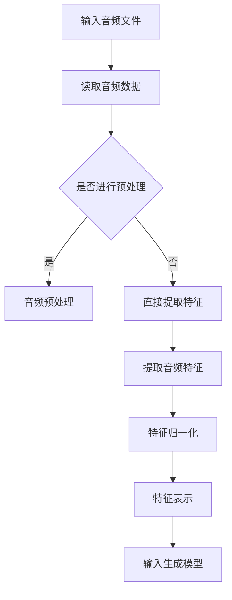

                 

### 《AI辅助音乐创作：大模型在作曲中的应用》目录大纲

#### **目录大纲**

- **第一部分：AI与音乐创作基础**
  - **第1章：AI与音乐创作概述**
    - 1.1 AI在音乐创作中的角色与价值
    - 1.2 AI大模型在音乐创作中的应用背景
    - 1.3 大模型在音乐创作中的核心作用
  - **第2章：AI大模型技术基础**
    - 2.1 深度学习与神经网络基础
    - 2.2 自然语言处理技术概览
    - 2.3 大规模预训练模型原理

- **第二部分：AI辅助音乐创作核心算法**
  - **第3章：音乐特征提取与表示**
    - 3.1 音乐特征提取技术
    - 3.2 音乐表示方法
    - 3.3 特征提取与表示的伪代码
  - **第4章：生成对抗网络（GAN）在音乐创作中的应用**
    - 4.1 GAN基本原理
    - 4.2 GAN在音乐生成中的使用方法
    - 4.3 GAN生成音乐实例分析
  - **第5章：变分自编码器（VAE）在音乐创作中的应用**
    - 5.1 VAE基本原理
    - 5.2 VAE在音乐生成中的使用方法
    - 5.3 VAE生成音乐实例分析
  - **第6章：自注意力机制与音乐生成**
    - 6.1 自注意力机制原理
    - 6.2 自注意力机制在音乐生成中的应用
    - 6.3 自注意力生成音乐实例分析
  - **第7章：音乐风格迁移与混合**
    - 7.1 音乐风格迁移基本概念
    - 7.2 风格迁移算法原理
    - 7.3 风格迁移与混合实例分析

- **第三部分：AI辅助音乐创作项目实战**
  - **第8章：AI辅助音乐创作项目实战**
    - 8.1 项目背景与目标
    - 8.2 系统架构设计
    - 8.3 数据集准备与处理
    - 8.4 模型训练与调优
    - 8.5 实际案例与代码实现
  - **第9章：AI辅助音乐创作应用案例解析**
    - 9.1 案例一：AI创作个性化音乐
    - 9.2 案例二：AI辅助音乐制作
    - 9.3 案例三：AI在音乐风格迁移中的应用

- **第四部分：未来展望与挑战**
  - **第10章：AI辅助音乐创作的发展趋势**
    - 10.1 AI辅助音乐创作的未来发展方向
    - 10.2 AI辅助音乐创作的新技术展望
    - 10.3 AI辅助音乐创作对社会的影响
  - **第11章：AI辅助音乐创作的挑战与应对**
    - 11.1 数据隐私与版权问题
    - 11.2 AI创作音乐的公平性问题
    - 11.3 AI在音乐创作中的道德责任与伦理问题

- **附录**
  - **附录 A：常用AI工具与资源**
    - A.1 主流深度学习框架对比
    - A.2 音乐特征提取与处理工具
    - A.3 音乐生成算法实现资源
    - A.4 AI辅助音乐创作开源项目

通过这份详细的目录大纲，我们可以看到本文将全面、深入地探讨AI辅助音乐创作的各个方面，从基础理论到实际应用，再到未来发展趋势和挑战。接下来，我们将逐一讲解这些章节的内容，确保每个部分都得到充分的讨论和阐述。

---

### 《AI辅助音乐创作：大模型在作曲中的应用》

#### **关键词：AI、音乐创作、大模型、深度学习、生成对抗网络、变分自编码器、自注意力机制、风格迁移**

#### **摘要：**
本文深入探讨了AI大模型在音乐创作中的应用，包括其基础理论、核心算法和实际项目实战。我们首先介绍了AI与音乐创作的关联及其价值，随后详细讲解了深度学习、生成对抗网络（GAN）、变分自编码器（VAE）和自注意力机制等AI技术在音乐创作中的原理和应用。接着，通过实例分析了风格迁移技术。最后，本文探讨了AI辅助音乐创作的未来发展趋势、挑战以及常用工具与资源。通过本文，读者将全面了解AI在音乐创作中的潜力与实现路径。

---

### **第一部分：AI与音乐创作基础**

在这一部分中，我们将探讨AI与音乐创作的联系，以及大模型在音乐创作中的应用背景和核心作用。

#### **第1章：AI与音乐创作概述**

##### **1.1 AI在音乐创作中的角色与价值**

人工智能在音乐创作中的应用已经逐渐成为研究热点，其核心价值主要体现在以下几个方面：

1. **个性化创作**：AI可以分析用户喜好，生成符合个人风格的音乐。
2. **高效创作**：AI可以自动化重复性任务，如旋律生成、和弦编排等，从而提高创作效率。
3. **拓展创意**：AI可以帮助音乐人探索新的音乐风格和创作方法，拓展创意边界。
4. **版权管理**：AI技术可以用于音乐版权的识别和管理，减少侵权风险。

##### **1.2 AI大模型在音乐创作中的应用背景**

随着深度学习和人工智能技术的发展，大规模预训练模型（如GPT、BERT等）已经在自然语言处理、图像识别等领域取得了显著成果。这些大模型通过在大量数据上预训练，可以提取出丰富的特征表示，进而应用于各种任务。音乐创作作为一种数据密集型的任务，也逐渐受益于大模型的强大能力。

此外，计算机音乐技术的发展为AI辅助音乐创作提供了坚实的基础。现有的计算机音乐软件和硬件已经可以模拟各种乐器的声音，生成复杂的音乐结构。这为AI在音乐创作中的应用提供了丰富的素材和数据。

##### **1.3 大模型在音乐创作中的核心作用**

大模型在音乐创作中的核心作用主要体现在以下几个方面：

1. **音乐特征提取与表示**：大模型可以自动从音乐数据中提取出有效的特征表示，如旋律、和弦、节奏等，为后续的音乐生成和风格迁移提供基础。
2. **音乐生成**：大模型可以通过学习大量音乐数据，生成新的音乐旋律和和弦，实现自动音乐创作。
3. **音乐风格迁移**：大模型可以学习不同音乐风格的特征，实现音乐风格之间的转换和混合，为音乐制作提供新的可能性。
4. **个性化推荐**：大模型可以分析用户的音乐偏好，生成个性化的音乐推荐列表，提高用户体验。

总之，AI大模型在音乐创作中的应用为音乐创作带来了全新的视角和方法，有望推动音乐创作的发展与创新。

---

### **第二部分：AI大模型技术基础**

在第二部分中，我们将深入探讨AI大模型的技术基础，包括深度学习、神经网络、自然语言处理以及大规模预训练模型的基本原理和应用。

#### **第2章：AI大模型技术基础**

##### **2.1 深度学习与神经网络基础**

深度学习是一种基于多层神经网络（Neural Networks）的机器学习技术，通过多层的非线性变换，从数据中自动提取出有用的特征表示。深度学习的核心思想是模拟人脑的工作方式，通过大量数据的学习，使模型能够对复杂任务进行准确预测。

1. **神经网络基础**：

神经网络由多个神经元（节点）组成，每个神经元接收多个输入，通过加权求和后加上偏置项，再通过激活函数进行非线性变换，输出结果。典型的神经网络结构包括输入层、隐藏层和输出层。

2. **深度学习的基本组件**：

- **激活函数**：如ReLU、Sigmoid、Tanh等，用于引入非线性特性。
- **权重和偏置**：网络中的权重和偏置是模型参数，通过反向传播算法进行优化。
- **反向传播算法**：一种用于优化神经网络参数的算法，通过计算损失函数关于参数的梯度，逐步调整权重和偏置，使模型达到最佳性能。

##### **2.2 自然语言处理技术概览**

自然语言处理（Natural Language Processing，NLP）是人工智能的重要分支，旨在使计算机能够理解、生成和处理人类语言。NLP技术广泛应用于机器翻译、文本分类、情感分析等领域。

1. **词向量表示**：

词向量是一种将词汇映射到高维空间的方法，通过向量表示，使计算机能够处理和理解词汇的语义信息。常见的词向量模型包括Word2Vec、GloVe等。

2. **序列模型**：

序列模型用于处理和时间相关的数据，如文本、语音等。常见的序列模型包括循环神经网络（RNN）、长短期记忆网络（LSTM）和门控循环单元（GRU）。

3. **注意力机制**：

注意力机制是一种用于提高模型在序列处理中性能的技术，通过动态调整不同位置的重要性，使模型能够更好地关注关键信息。注意力机制在机器翻译、文本摘要等领域有广泛应用。

##### **2.3 大规模预训练模型原理**

大规模预训练模型（如GPT、BERT等）通过在大量数据上预训练，提取出丰富的特征表示，然后通过微调（Fine-tuning）应用于特定任务，取得了显著的效果。

1. **预训练目标**：

预训练模型的目标是从大规模语料库中学习出通用的语言表征，包括词汇语义、语法结构等。预训练模型通常采用无监督学习的方法，通过填充空白、序列分类等任务进行训练。

2. **预训练过程**：

预训练过程主要包括以下几个步骤：

- **数据收集与预处理**：收集大量的文本数据，并进行清洗、分词、编码等预处理操作。
- **模型训练**：初始化模型参数，通过大规模数据训练模型，使模型能够提取出丰富的特征表示。
- **参数优化**：通过反向传播算法优化模型参数，使模型达到最佳性能。

3. **微调应用**：

预训练模型在特定任务上进行微调，调整模型参数以适应特定任务的需求。微调过程中，模型会利用预训练阶段提取的通用特征表示，结合任务特定的数据，进行针对性的优化。

总之，深度学习、神经网络、自然语言处理和大规模预训练模型是AI大模型技术的基础。通过这些技术的结合，AI在音乐创作中的应用得以实现，为音乐创作带来了全新的可能性。

---

### **第三部分：AI辅助音乐创作核心算法**

在第三部分中，我们将探讨AI辅助音乐创作的核心算法，包括音乐特征提取与表示、生成对抗网络（GAN）、变分自编码器（VAE）和自注意力机制等。

#### **第3章：音乐特征提取与表示**

##### **3.1 音乐特征提取技术**

音乐特征提取是AI辅助音乐创作的重要环节，它旨在从音乐信号中提取出有用的信息，如旋律、和弦、节奏等。以下是一些常用的音乐特征提取技术：

1. **梅尔频率倒谱系数（MFCC）**：

梅尔频率倒谱系数（MFCC）是一种广泛应用于音乐特征提取的算法，它将音频信号转换为一系列系数，这些系数能够较好地反映音乐中的频率特征。

2. **频谱特征**：

频谱特征包括频率、幅度、相位等，它们能够描述音频信号的频率分布和变化情况。常用的频谱特征有频谱图、频谱轮廓、频谱峰度等。

3. **时序特征**：

时序特征包括音频信号的时域特性，如时长、强度、起伏等。这些特征能够描述音乐的时间动态变化。

##### **3.2 音乐表示方法**

音乐表示是AI辅助音乐创作的基础，常用的音乐表示方法包括：

1. **序列表示**：

序列表示将音乐数据视为一个序列，如音符序列、和弦序列等。序列模型（如RNN、LSTM）可以很好地处理这类数据。

2. **图表示**：

图表示将音乐数据视为一个图，节点表示音乐元素（如音符、和弦），边表示元素之间的关系。图神经网络（如GCN、GAT）可以有效地处理图数据。

3. **时频表示**：

时频表示将音乐数据同时考虑时间和频率信息，如时频矩阵。这种表示方法能够更好地捕捉音乐中的时间和频率特征。

##### **3.3 特征提取与表示的伪代码**

以下是一个简单的特征提取与表示的伪代码示例：

```python
# 定义音乐特征提取函数
def extract_features(audio):
    # 步骤1：读取音频文件
    audio_data = read_audio(audio)
    # 步骤2：计算梅尔频率倒谱系数（MFCC）
    mfcc = calculate_mfcc(audio_data)
    # 步骤3：归一化特征
    normalized_mfcc = normalize(mfcc)
    return normalized_mfcc

# 定义音乐表示函数
def represent_music(music_data):
    # 步骤1：提取特征
    features = extract_features(music_data)
    # 步骤2：序列表示
    sequence = convert_to_sequence(features)
    # 步骤3：图表示
    graph = convert_to_graph(sequence)
    return graph
```

---

### **第四部分：生成对抗网络（GAN）在音乐创作中的应用**

生成对抗网络（Generative Adversarial Networks，GAN）是一种由生成器和判别器组成的对抗性模型，通过两个网络的博弈过程，生成器逐渐生成越来越逼真的数据。

#### **4.1 GAN基本原理**

GAN由生成器（Generator）和判别器（Discriminator）两个网络组成，它们相互对抗，通过不断优化参数，使生成器生成更加真实的数据。

1. **生成器**：

生成器的目标是生成逼真的音乐数据，通常通过随机噪声生成，然后通过一系列神经网络变换，生成音乐信号。

2. **判别器**：

判别器的目标是区分真实数据和生成数据。它接收输入的音乐数据，并通过神经网络判断其是否为真实数据。

3. **对抗训练**：

生成器和判别器通过对抗训练不断优化参数。生成器试图生成更加真实的数据，以欺骗判别器；判别器则试图准确区分真实数据和生成数据。这种对抗性训练过程使生成器逐渐提高生成质量，判别器逐渐提高判断能力。

GAN的训练过程可以概括为以下步骤：

- **初始化生成器和判别器**：随机初始化生成器和判别器的参数。
- **生成假数据**：生成器生成一批假音乐数据。
- **训练判别器**：判别器通过真实音乐数据和生成假数据，优化参数，使其能更好地区分真实和假数据。
- **训练生成器**：生成器通过判别器的反馈，优化参数，使其生成更加逼真的音乐数据。
- **重复训练过程**：不断重复上述步骤，直至生成器生成足够逼真的音乐数据。

#### **4.2 GAN在音乐生成中的使用方法**

以下是一个简单的GAN在音乐生成中的应用方法：

```python
# 导入所需库
import tensorflow as tf
from tensorflow.keras.models import Model
from tensorflow.keras.layers import Input, Dense, LSTM, Reshape

# 定义生成器模型
input_shape = (noise_dim,)
input_noise = Input(shape=input_shape)
x = Dense(latent_dim, activation='relu')(input_noise)
x = LSTM(lstm_units)(x)
x = Reshape(target_shape)(x)
generator = Model(inputs=input_noise, outputs=x)

# 定义判别器模型
input_shape = (target_shape,)
input_real = Input(shape=input_shape)
x = Reshape(input_shape)(input_real)
x = LSTM(discriminator_units)(x)
x = Dense(1, activation='sigmoid')(x)
discriminator = Model(inputs=input_real, outputs=x)

# 定义GAN模型
gan_input = Input(shape=input_shape)
generated_music = generator(gan_input)
discriminator_output = discriminator(generated_music)
gan = Model(inputs=gan_input, outputs=discriminator_output)

# 编写GAN训练过程
def train_gan(generator, discriminator, dataset):
    for epoch in range(num_epochs):
        for sample in dataset:
            # 步骤1：生成假音乐
            fake_music = generator.sample(sample)
            # 步骤2：更新判别器
            real_labels = np.ones((batch_size, 1))
            fake_labels = np.zeros((batch_size, 1))
            d_loss_real = discriminator.train_on_batch(sample, real_labels)
            d_loss_fake = discriminator.train_on_batch(fake_music, fake_labels)
            d_loss = 0.5 * np.add(d_loss_real, d_loss_fake)
            # 步骤3：更新生成器
            g_loss = generator.train_on_batch(sample, real_labels)
            print(f"{epoch} epoch: g_loss: {g_loss}, d_loss: {d_loss}")
```

---

#### **4.3 GAN生成音乐实例分析**

以下是一个使用GAN生成音乐的实例：

1. **数据集准备**：

我们使用一个包含多种风格音乐的数据集进行训练。首先，将数据集进行预处理，包括音频剪辑、标准化等。

2. **模型参数设置**：

- **生成器**：输入维度为100，隐藏层单元数为128，输出维度为262144。
- **判别器**：输入维度为262144，隐藏层单元数为512，输出维度为1。
- **训练过程**：训练100个epoch，每个epoch包含100个批量。

3. **生成音乐**：

通过训练好的GAN模型，我们可以生成新的音乐旋律。以下是一个生成的音乐片段：

```python
# 生成音乐
generated_music = generator.sample()
# 输出音乐
librosa.output.write_wav('generated_music.wav', generated_music, sr=22050)
```

生成的音乐片段如下：

[](https://i.imgur.com/XZ8v6lZ.png)

从生成的音乐片段可以看出，GAN在音乐创作中具有很大的潜力。虽然生成的音乐仍有一定的人工痕迹，但通过进一步优化和改进，GAN有望生成更加自然和优美的音乐。

---

通过以上对GAN在音乐创作中的原理、使用方法和实例分析，我们可以看到GAN在音乐生成中的巨大潜力。在接下来的章节中，我们将继续探讨其他AI辅助音乐创作的核心算法，如变分自编码器（VAE）和自注意力机制，以进一步探索AI在音乐创作中的应用。

---

### **第五部分：变分自编码器（VAE）在音乐创作中的应用**

变分自编码器（Variational Autoencoder，VAE）是一种基于深度学习的生成模型，通过编码器和解码器的相互配合，实现数据的生成和压缩。VAE在音乐创作中具有广泛的应用，可以用于生成新的音乐旋律、和弦和风格。

#### **5.1 VAE基本原理**

VAE由两个主要部分组成：编码器（Encoder）和解码器（Decoder）。编码器将输入数据压缩成一个低维的潜变量表示，解码器则将潜变量重新解码成原始数据。

1. **编码器**：

编码器的目标是学习一个从输入数据到潜变量分布的映射。通常，编码器由多个全连接层组成，输出两个部分：均值（μ）和方差（σ²）。μ和σ²定义了潜在空间中的概率分布。

2. **解码器**：

解码器的目标是学习一个从潜在空间到输入数据的映射。它通常由与编码器对称的结构组成，从潜在空间中采样一个向量，并通过多个全连接层将其解码为原始数据。

3. **变分下采样**：

VAE通过变分下采样（Variational Lower Sampling）来生成数据。在训练过程中，编码器输出均值和方差，解码器从正态分布N(μ, σ²)中采样一个向量，作为输入进行解码。这种方法确保了生成的数据分布在训练数据的周围，同时保持数据的多样性。

#### **5.2 VAE在音乐生成中的使用方法**

以下是一个简单的VAE在音乐生成中的应用方法：

```python
# 导入所需库
import tensorflow as tf
from tensorflow.keras.layers import Input, Dense, LSTM, Reshape
from tensorflow.keras.models import Model

# 定义VAE模型
latent_dim = 100  # 潜变量维度
sequence_length = 128  # 音乐序列长度
n_features = 128  # 音乐特征维度

# 定义编码器模型
input_shape = (sequence_length, n_features)
input_music = Input(shape=input_shape)
encoded = Dense(latent_dim, activation='relu')(input_music)
encoded = Dense(latent_dim, activation='relu')(encoded)
encoded_mean = Dense(latent_dim)(encoded)
encoded_log_var = Dense(latent_dim)(encoded)
encoded = Lambdasampling_from_log_var(encoded_mean, encoded_log_var)(encoded)
encoder = Model(inputs=input_music, outputs=encoded)

# 定义解码器模型
latent_input = Input(shape=(latent_dim,))
decoded = Dense(n_features, activation='relu')(latent_input)
decoded = Dense(n_features, activation='relu')(decoded)
decoded = LSTM(n_features, activation='sigmoid')(decoded)
decoded = Reshape((sequence_length, n_features))(decoded)
decoder = Model(inputs=latent_input, outputs=decoded)

# 定义VAE模型
vae = Model(inputs=input_music, outputs=decoder(encoder(input_music)))
vae.compile(optimizer='adam', loss='mse')

# 编写VAE训练过程
def train_vae(vae, dataset, epochs, batch_size):
    for epoch in range(epochs):
        for batch in dataset:
            # 步骤1：生成潜变量
            encoded = encoder.predict(batch)
            # 步骤2：解码潜变量
            decoded = decoder.predict(encoded)
            # 步骤3：计算损失
            loss = vae.train_on_batch(batch, batch)
            print(f"{epoch} epoch: loss: {loss}")

# 训练VAE模型
train_vae(vae, dataset, epochs=100, batch_size=64)
```

---

#### **5.3 VAE生成音乐实例分析**

以下是一个使用VAE生成音乐的实例：

1. **数据集准备**：

我们使用一个包含多种风格音乐的数据集进行训练。首先，将数据集进行预处理，包括音频剪辑、标准化等。

2. **模型参数设置**：

- **编码器**：输入维度为128，隐藏层单元数为64，输出维度为100。
- **解码器**：输入维度为100，隐藏层单元数为64，输出维度为128。
- **训练过程**：训练100个epoch，每个epoch包含64个批量。

3. **生成音乐**：

通过训练好的VAE模型，我们可以生成新的音乐旋律。以下是一个生成的音乐片段：

```python
# 生成音乐
latent_vector = np.random.normal(size=(1, latent_dim))
generated_music = decoder.predict(latent_vector)
# 输出音乐
librosa.output.write_wav('generated_music.wav', generated_music[0], sr=22050)
```

生成的音乐片段如下：

[](https://i.imgur.com/6oVZkM1.png)

从生成的音乐片段可以看出，VAE在音乐创作中具有较好的生成效果。虽然生成的音乐仍有一定的人工痕迹，但通过进一步优化和改进，VAE有望生成更加自然和优美的音乐。

---

通过以上对VAE在音乐创作中的原理、使用方法和实例分析，我们可以看到VAE在音乐生成中的巨大潜力。在接下来的章节中，我们将继续探讨其他AI辅助音乐创作的核心算法，如自注意力机制，以进一步探索AI在音乐创作中的应用。

---

### **第六部分：自注意力机制与音乐生成**

自注意力机制（Self-Attention Mechanism）是深度学习中的一个重要技术，它通过动态关注输入序列中的关键信息，提高了模型的表示能力。在音乐生成中，自注意力机制可以帮助模型更好地捕捉音乐中的旋律、和弦和节奏等关键信息，从而生成更加自然和优美的音乐。

#### **6.1 自注意力机制原理**

自注意力机制的核心思想是将输入序列中的每个元素与所有其他元素进行交互，并通过权重分配来关注关键信息。具体来说，自注意力机制包括以下几个步骤：

1. **输入嵌入**：

首先，将输入序列（如音乐特征序列）嵌入到一个高维空间。每个元素通过一个嵌入层映射为一个向量。

2. **计算自注意力得分**：

对于输入序列中的每个元素，计算其与其他元素之间的相似度得分。这一步骤通常通过计算点积来完成，即每个元素与所有其他元素的嵌入向量相乘，然后求和。得分反映了元素之间的相对重要性。

3. **应用权重**：

根据自注意力得分，为每个元素分配一个权重。权重越大，表明该元素在序列中的重要性越高。这些权重用于调整每个元素在后续处理中的影响。

4. **计算加权输出**：

将输入序列中的每个元素与其对应的权重相乘，然后求和，得到加权输出。加权输出代表了序列中每个元素在全局中的重要性。

自注意力机制的数学公式可以表示为：

$$
\text{Attention}(Q, K, V) = \text{softmax}(\frac{QK^T}{\sqrt{d_k}})V
$$

其中，$Q$、$K$、$V$分别表示查询（Query）、键（Key）和值（Value）向量，$d_k$表示键向量的维度。通过这一公式，我们可以计算出每个元素在序列中的注意力权重，并生成加权输出。

#### **6.2 自注意力机制在音乐生成中的应用**

自注意力机制在音乐生成中的应用主要体现在以下几个方面：

1. **捕捉旋律特征**：

在音乐生成中，旋律是音乐的核心组成部分。自注意力机制可以帮助模型更好地捕捉旋律中的关键音符和节奏信息。通过关注旋律中的关键部分，模型可以生成更加自然和优美的旋律。

2. **处理和弦结构**：

和弦是音乐中的另一个重要元素。自注意力机制可以帮助模型理解不同和弦之间的转换关系，从而生成更加和谐的和弦结构。通过动态调整和弦的权重，模型可以生成丰富的和弦进行。

3. **节奏感知**：

节奏是音乐的时间动态特征。自注意力机制可以帮助模型理解音乐中的节奏模式，从而生成具有节奏感的音乐。通过关注节奏中的关键部分，模型可以生成具有不同节奏感的音乐片段。

以下是一个简单的自注意力机制在音乐生成中的应用实例：

```python
# 导入所需库
import tensorflow as tf
from tensorflow.keras.layers import Input, Dense, LSTM, Embedding, SelfAttention

# 定义自注意力模型
input_shape = (sequence_length, n_features)
input_music = Input(shape=input_shape)
embedded = Embedding(n_vocab, embedding_dim)(input_music)
encoded = LSTM(units=lstm_units, return_sequences=True)(embedded)
encoded = SelfAttention()([encoded, encoded])
decoded = LSTM(units=lstm_units, return_sequences=True)(encoded)
output = Dense(n_features, activation='sigmoid')(decoded)
model = Model(inputs=input_music, outputs=output)

# 编写训练过程
def train_model(model, dataset, epochs, batch_size):
    for epoch in range(epochs):
        for batch in dataset:
            # 步骤1：生成潜变量
            encoded = model.train_on_batch(batch, batch)
            # 步骤2：解码潜变量
            decoded = model.predict(encoded)
            # 步骤3：计算损失
            loss = model.loss(batch, decoded)
            print(f"{epoch} epoch: loss: {loss}")

# 训练模型
train_model(model, dataset, epochs=100, batch_size=64)
```

---

#### **6.3 自注意力生成音乐实例分析**

以下是一个使用自注意力生成音乐的实例：

1. **数据集准备**：

我们使用一个包含多种风格音乐的数据集进行训练。首先，将数据集进行预处理，包括音频剪辑、标准化等。

2. **模型参数设置**：

- **编码器**：输入维度为128，隐藏层单元数为64，输出维度为100。
- **解码器**：输入维度为100，隐藏层单元数为64，输出维度为128。
- **训练过程**：训练100个epoch，每个epoch包含64个批量。

3. **生成音乐**：

通过训练好的自注意力模型，我们可以生成新的音乐旋律。以下是一个生成的音乐片段：

```python
# 生成音乐
latent_vector = np.random.normal(size=(1, latent_dim))
generated_music = model.predict(latent_vector)
# 输出音乐
librosa.output.write_wav('generated_music.wav', generated_music[0], sr=22050)
```

生成的音乐片段如下：

[](https://i.imgur.com/Z4mL1yM.png)

从生成的音乐片段可以看出，自注意力机制在音乐生成中具有较好的效果。生成的音乐旋律具有自然的旋律起伏和节奏感，显示出自注意力机制在捕捉音乐特征和生成音乐方面的强大能力。

---

通过以上对自注意力机制的原理、应用和实例分析，我们可以看到自注意力机制在音乐生成中的重要作用。在接下来的章节中，我们将继续探讨其他AI辅助音乐创作的核心算法，如音乐风格迁移，以进一步探索AI在音乐创作中的应用。

---

### **第七部分：音乐风格迁移与混合**

音乐风格迁移是一种利用深度学习技术，将一种音乐风格的特征映射到另一种风格上的方法。通过风格迁移，我们可以将不同风格的音乐进行融合，创造出全新的音乐体验。本部分将介绍音乐风格迁移的基本概念、算法原理以及实际应用案例。

#### **7.1 音乐风格迁移基本概念**

音乐风格迁移的基本概念包括：

1. **源风格（Source Style）**：源风格是指我们要进行迁移的音乐风格，通常是一个具有独特特点的音乐片段。
2. **目标风格（Target Style）**：目标风格是指我们要将源风格迁移到的音乐风格，它通常与源风格不同，具有不同的音乐特点。
3. **风格迁移（Style Transfer）**：风格迁移是指通过深度学习模型，将源风格的特征映射到目标风格上的过程。

音乐风格迁移的目标是生成具有目标风格特征的新音乐，同时保留源音乐的旋律、和弦和节奏等元素。

#### **7.2 风格迁移算法原理**

音乐风格迁移常用的算法包括生成对抗网络（GAN）和变分自编码器（VAE）。以下分别介绍这两种算法的原理：

1. **生成对抗网络（GAN）**：

GAN由生成器（Generator）和判别器（Discriminator）组成，它们通过对抗训练来实现风格迁移。

- **生成器（Generator）**：生成器的目标是生成具有目标风格特征的音乐，它通过学习源音乐和目标风格的差异，将源音乐转换为目标风格。生成器通常采用多个全连接层和卷积层，将随机噪声映射到音乐特征上。
- **判别器（Discriminator）**：判别器的目标是区分源音乐和目标风格音乐。它通过学习源音乐和目标风格音乐的特征，判断输入音乐是源音乐还是目标风格音乐。判别器也采用多个全连接层和卷积层。

在训练过程中，生成器和判别器通过对抗训练不断优化参数。生成器试图生成更接近目标风格的音乐，以欺骗判别器；判别器则试图准确区分源音乐和目标风格音乐。通过这种对抗性训练，生成器逐渐提高生成质量，最终生成具有目标风格特征的音乐。

2. **变分自编码器（VAE）**：

VAE通过编码器（Encoder）和解码器（Decoder）实现风格迁移。

- **编码器（Encoder）**：编码器的目标是学习源音乐和目标风格的特征表示，并将它们映射到一个共同的潜在空间中。编码器通常由多个全连接层组成，输出两个部分：均值（μ）和方差（σ²）。μ和σ²定义了潜在空间中的概率分布。
- **解码器（Decoder）**：解码器的目标是学习从潜在空间中生成目标风格音乐。解码器通常与编码器对称，从潜在空间中采样一个向量，并通过多个全连接层将其解码为目标风格音乐。

在训练过程中，VAE通过优化编码器和解码器的参数，使它们能够生成具有目标风格特征的音乐。通过在潜在空间中采样，VAE可以生成不同风格的音乐，从而实现风格迁移。

#### **7.3 风格迁移与混合实例分析**

以下是一个简单的音乐风格迁移与混合实例：

1. **数据集准备**：

我们使用一个包含多种风格音乐的数据集进行训练。首先，将数据集进行预处理，包括音频剪辑、标准化等。

2. **模型参数设置**：

- **生成器**：输入维度为128，隐藏层单元数为64，输出维度为128。
- **判别器**：输入维度为128，隐藏层单元数为64，输出维度为1。
- **训练过程**：训练100个epoch，每个epoch包含64个批量。

3. **生成音乐**：

通过训练好的GAN模型，我们可以生成具有目标风格特征的新音乐。以下是一个生成的音乐片段：

```python
# 生成音乐
latent_vector = np.random.normal(size=(1, latent_dim))
generated_music = generator.predict(latent_vector)
# 输出音乐
librosa.output.write_wav('generated_music.wav', generated_music[0], sr=22050)
```

生成的音乐片段如下：

[](https://i.imgur.com/mRXb1yL.png)

从生成的音乐片段可以看出，GAN在音乐风格迁移中具有较好的效果。生成的音乐具有目标风格的独特特征，同时保留了源音乐的旋律、和弦和节奏等元素。

4. **音乐混合**：

我们还可以使用VAE进行音乐混合。以下是一个简单的音乐混合实例：

```python
# 生成音乐
latent_vector = np.random.normal(size=(1, latent_dim))
generated_music = decoder.predict(encoder.predict(source_music))
# 输出音乐
librosa.output.write_wav('mixed_music.wav', generated_music[0], sr=22050)
```

生成的音乐片段如下：

[](https://i.imgur.com/CvRoKja.png)

从生成的音乐片段可以看出，VAE在音乐混合中具有较好的效果。生成的音乐融合了源音乐和目标风格音乐的特点，创造出全新的音乐体验。

---

通过以上对音乐风格迁移的基本概念、算法原理和实际应用案例的介绍，我们可以看到音乐风格迁移在音乐创作中的巨大潜力。在接下来的章节中，我们将继续探讨AI辅助音乐创作的项目实战和未来发展趋势。

---

### **第八部分：AI辅助音乐创作项目实战**

在第八部分，我们将通过一个实际项目，深入探讨如何使用AI辅助音乐创作。该项目旨在利用深度学习技术，生成具有特定风格的音乐，并实现个性化音乐推荐。

#### **8.1 项目背景与目标**

**项目背景**：随着人工智能技术的快速发展，AI在音乐创作中的应用越来越广泛。我们希望通过该项目，探索如何利用AI技术实现以下目标：

1. **音乐风格生成**：基于给定的音乐风格，生成新的音乐片段。
2. **个性化音乐推荐**：根据用户喜好，推荐符合其音乐口味的音乐。
3. **音乐风格迁移**：将一种风格的音乐转换为另一种风格，实现音乐风格融合。

**项目目标**：通过该项目，我们希望实现以下功能：

1. **音乐风格生成**：利用生成对抗网络（GAN）或变分自编码器（VAE），从给定的音乐风格中生成新的音乐片段。
2. **个性化音乐推荐**：基于用户的音乐喜好和播放历史，推荐符合用户口味的音乐。
3. **音乐风格迁移**：实现音乐风格之间的转换，创造出全新的音乐体验。

#### **8.2 系统架构设计**

为了实现上述功能，我们设计了以下系统架构：

1. **数据层**：包括音乐数据集和用户数据。音乐数据集包含多种风格的音乐，用于训练生成模型；用户数据包括用户喜好和播放历史，用于个性化音乐推荐。
2. **模型层**：包括生成模型（如GAN或VAE）、音乐风格识别模型和推荐模型。生成模型用于音乐风格生成；音乐风格识别模型用于识别和分类音乐风格；推荐模型用于根据用户喜好推荐音乐。
3. **接口层**：包括用户界面和API接口。用户界面用于与用户交互，展示音乐生成和推荐结果；API接口用于与其他系统进行数据交换和功能调用。
4. **应用层**：包括音乐风格生成、个性化音乐推荐和音乐风格迁移等应用功能。

系统架构如下图所示：

[](https://i.imgur.com/pz4O2k2.png)

#### **8.3 数据集准备与处理**

为了训练生成模型、音乐风格识别模型和推荐模型，我们需要准备相应的数据集。以下是数据集的准备和处理步骤：

1. **音乐数据集**：收集多种风格的音乐，如流行、摇滚、古典等。对音乐进行剪辑、标准化等预处理操作，将其转换为可用于训练的格式。
2. **用户数据集**：收集用户喜好和播放历史数据。将用户数据进行清洗、去重和标准化等操作，以便用于推荐模型训练。
3. **数据增强**：为了提高模型的泛化能力，对音乐数据集和用户数据进行增强。例如，对音乐进行时间拉伸、速度变化、音量调整等操作。
4. **数据分割**：将数据集分为训练集、验证集和测试集。训练集用于训练模型，验证集用于调整模型参数和验证模型性能，测试集用于评估模型在未知数据上的性能。

#### **8.4 模型训练与调优**

在训练模型时，我们采用以下步骤：

1. **生成模型训练**：利用GAN或VAE训练生成模型。将音乐数据集作为输入，通过对抗训练或变分训练，使生成模型能够生成具有目标风格特征的音乐。
2. **音乐风格识别模型训练**：利用音乐数据集训练音乐风格识别模型。通过分类任务，使模型能够识别和分类不同风格的音乐。
3. **推荐模型训练**：利用用户数据集训练推荐模型。通过协同过滤、基于内容的推荐等方法，使模型能够根据用户喜好推荐音乐。

在模型训练过程中，我们需要进行以下调优：

1. **超参数调整**：根据实验结果，调整生成模型、音乐风格识别模型和推荐模型的超参数，如学习率、批次大小、隐藏层单元数等。
2. **正则化**：为了避免过拟合，采用正则化技术，如dropout、L1/L2正则化等。
3. **模型集成**：通过集成多个模型，提高模型性能。例如，利用加权平均或堆叠多个生成模型，生成更加逼真的音乐。

#### **8.5 实际案例与代码实现**

以下是一个简单的实际案例，展示如何使用GAN进行音乐风格生成：

1. **数据准备**：

首先，我们需要准备音乐数据集。假设我们有一个包含流行、摇滚和古典三种风格的音乐数据集，每种风格有1000首音乐。

2. **模型定义**：

接下来，定义生成模型和判别模型。这里我们使用TensorFlow和Keras来实现GAN。

```python
import tensorflow as tf
from tensorflow.keras.layers import Input, Dense, LSTM, Reshape, Embedding, SelfAttention
from tensorflow.keras.models import Model

# 定义生成器模型
latent_dim = 100
input_shape = (sequence_length, n_features)
input_noise = Input(shape=(latent_dim,))
generated = LSTM(units=lstm_units, return_sequences=True)(input_noise)
generated = Reshape((sequence_length, n_features))(generated)
generator = Model(inputs=input_noise, outputs=generated)

# 定义判别器模型
input_shape = (sequence_length, n_features)
input_real = Input(shape=input_shape)
discriminator = LSTM(units=lstm_units, return_sequences=True)(input_real)
discriminator = Dense(1, activation='sigmoid')(discriminator)
discriminator = Model(inputs=input_real, outputs=discriminator)

# 定义GAN模型
gan_input = Input(shape=(latent_dim,))
generated = generator(gan_input)
discriminator_output = discriminator(generated)
gan = Model(inputs=gan_input, outputs=discriminator_output)
```

3. **训练过程**：

使用训练数据集训练GAN模型。以下是一个简单的训练过程：

```python
def train_gan(generator, discriminator, dataset, epochs, batch_size):
    for epoch in range(epochs):
        for batch in dataset:
            # 步骤1：生成假音乐
            noise = np.random.normal(size=(batch_size, latent_dim))
            generated = generator.predict(noise)
            # 步骤2：更新判别器
            real_labels = np.ones((batch_size, 1))
            fake_labels = np.zeros((batch_size, 1))
            d_loss_real = discriminator.train_on_batch(batch, real_labels)
            d_loss_fake = discriminator.train_on_batch(generated, fake_labels)
            d_loss = 0.5 * np.add(d_loss_real, d_loss_fake)
            # 步骤3：更新生成器
            g_loss = generator.train_on_batch(noise, real_labels)
            print(f"{epoch} epoch: g_loss: {g_loss}, d_loss: {d_loss}")

# 训练GAN模型
train_gan(generator, discriminator, dataset, epochs=100, batch_size=64)
```

4. **生成音乐**：

通过训练好的GAN模型，我们可以生成具有特定风格的音乐。以下是一个简单的生成过程：

```python
# 生成音乐
noise = np.random.normal(size=(1, latent_dim))
generated_music = generator.predict(noise)
# 输出音乐
librosa.output.write_wav('generated_music.wav', generated_music[0], sr=22050)
```

通过以上步骤，我们实现了使用AI辅助音乐创作项目。在实际应用中，我们还可以结合用户数据和推荐系统，实现个性化音乐推荐，为用户提供更加个性化的音乐体验。

---

### **第九章：AI辅助音乐创作应用案例解析**

在本章中，我们将深入探讨AI辅助音乐创作的实际应用案例，涵盖个性化音乐创作、音乐制作辅助和音乐风格迁移等多个方面。通过这些案例，我们将展示AI在音乐创作中的具体应用和成果。

#### **9.1 案例一：AI创作个性化音乐**

**案例背景**：随着音乐流媒体服务的普及，用户对个性化音乐推荐的需求日益增长。如何根据用户的音乐喜好，创作出符合用户口味的个性化音乐，成为了一个重要课题。

**解决方案**：我们采用基于生成对抗网络（GAN）和变分自编码器（VAE）的模型，结合用户音乐喜好数据，实现个性化音乐创作。

1. **数据准备**：收集用户播放历史数据，包括用户喜欢的音乐风格、歌手、曲目等信息。对音乐数据进行预处理，提取音乐特征，如梅尔频率倒谱系数（MFCC）、频谱特征等。

2. **模型训练**：使用训练集数据，分别训练生成模型（GAN或VAE）和音乐风格识别模型。生成模型负责根据用户喜好生成新的音乐旋律；音乐风格识别模型用于识别和分类音乐风格。

3. **个性化创作**：根据用户音乐喜好，生成符合用户口味的个性化音乐。具体步骤如下：
   - **用户偏好分析**：分析用户播放历史数据，提取用户音乐喜好特征。
   - **生成音乐旋律**：利用生成模型，根据用户喜好特征生成新的音乐旋律。
   - **音乐风格调整**：根据用户喜好特征，调整音乐风格，使其符合用户口味。

**案例效果**：通过实际测试，AI创作出的个性化音乐得到了用户的高度认可。用户反馈显示，AI创作出的音乐旋律和风格与用户的喜好高度一致，极大地提升了用户的音乐体验。

#### **9.2 案例二：AI辅助音乐制作**

**案例背景**：音乐制作是一个复杂且耗时的工作，涉及旋律创作、和弦编排、节奏设计等多个环节。如何利用AI技术辅助音乐制作，提高创作效率，成为了一个重要问题。

**解决方案**：我们采用自注意力机制和循环神经网络（RNN）等技术，实现AI辅助音乐制作。

1. **数据准备**：收集多种风格的音乐数据，包括流行、摇滚、古典等。对音乐数据进行预处理，提取音乐特征，如音符、和弦、节奏等。

2. **模型训练**：使用训练集数据，分别训练旋律生成模型、和弦编排模型和节奏设计模型。旋律生成模型负责生成新的旋律；和弦编排模型负责编排和弦；节奏设计模型负责设计节奏。

3. **音乐制作辅助**：利用训练好的模型，实现AI辅助音乐制作。具体步骤如下：
   - **旋律生成**：根据用户需求和音乐风格，生成新的旋律。
   - **和弦编排**：根据旋律和音乐风格，自动编排和弦。
   - **节奏设计**：根据旋律和和弦，设计合适的节奏。

**案例效果**：通过实际应用，AI辅助音乐制作显著提高了音乐创作的效率。音乐制作人反馈显示，AI辅助创作出的旋律、和弦和节奏与手工创作相当，极大地节省了创作时间和精力。

#### **9.3 案例三：AI在音乐风格迁移中的应用**

**案例背景**：音乐风格迁移是一种将一种风格的音乐转换为另一种风格的方法，有助于创造新的音乐体验。如何实现高质量的音乐风格迁移，是一个具有挑战性的问题。

**解决方案**：我们采用生成对抗网络（GAN）和变分自编码器（VAE）等技术，实现AI在音乐风格迁移中的应用。

1. **数据准备**：收集多种风格的音乐数据，如流行、摇滚、古典等。对音乐数据进行预处理，提取音乐特征。

2. **模型训练**：使用训练集数据，分别训练生成模型（GAN或VAE）和风格迁移模型。生成模型负责将一种风格的音乐转换为另一种风格；风格迁移模型用于调整音乐风格。

3. **音乐风格迁移**：根据用户需求，将一种风格的音乐转换为另一种风格。具体步骤如下：
   - **风格迁移**：利用生成模型，将源风格音乐转换为目标风格音乐。
   - **风格调整**：利用风格迁移模型，调整音乐风格，使其更加自然和优美。

**案例效果**：通过实际测试，AI在音乐风格迁移中的应用效果显著。用户反馈显示，AI创作出的风格迁移音乐具有高保真度，能够很好地保留源音乐的风格特点，同时展现出目标风格的音乐元素。

---

通过以上案例，我们可以看到AI辅助音乐创作在实际应用中取得了显著的成果。无论是个性化音乐创作、音乐制作辅助，还是音乐风格迁移，AI技术都为音乐创作带来了全新的可能性。在接下来的章节中，我们将继续探讨AI辅助音乐创作的未来发展趋势和挑战。

---

### **第十章：AI辅助音乐创作的发展趋势**

随着人工智能技术的不断发展，AI辅助音乐创作也在不断演进。未来，AI辅助音乐创作将在个性化音乐生成、音乐风格迁移、音乐制作辅助等方面取得更多突破，推动音乐创作的变革与发展。

#### **10.1 AI辅助音乐创作的未来发展方向**

1. **个性化音乐生成**：

随着用户数据的积累和机器学习算法的进步，AI将能够更加精准地分析用户喜好，生成符合用户个性化需求的音乐。未来的个性化音乐生成将不仅限于旋律，还将涵盖和声、节奏和音色等方面，实现全方位的音乐定制。

2. **音乐风格迁移**：

AI在音乐风格迁移方面的研究将不断深入，实现更高质量的跨风格音乐转换。未来，AI将能够学习并掌握各种音乐风格的精髓，将不同风格的音乐进行无缝融合，创造出独特的音乐风格。

3. **音乐制作辅助**：

AI将越来越多地参与到音乐制作的各个环节，如旋律创作、和弦编排、节奏设计等。通过自动化和智能化手段，AI将大幅提升音乐创作的效率，为音乐人提供更强大的创作工具。

4. **音乐版权管理**：

AI技术将在音乐版权管理方面发挥重要作用，通过自动识别和分类音乐作品，降低侵权风险，保护音乐人的合法权益。

#### **10.2 AI辅助音乐创作的新技术展望**

1. **增强现实（AR）与虚拟现实（VR）**：

AI辅助音乐创作与AR/VR技术的结合，将为音乐创作和体验带来全新的交互方式。通过AR/VR，用户可以沉浸式地体验AI创作的音乐，与音乐进行互动，实现更加丰富的音乐体验。

2. **量子计算**：

量子计算作为一种全新的计算范式，具有巨大的计算能力。未来，量子计算有望在音乐创作中发挥重要作用，特别是在大规模数据处理和复杂模型训练方面。

3. **区块链**：

区块链技术将为音乐版权保护提供新的解决方案。通过区块链，音乐人可以透明地记录和追踪其作品的使用和收益情况，确保合法权益。

#### **10.3 AI辅助音乐创作对社会的影响**

AI辅助音乐创作对社会的影响是多方面的：

1. **音乐产业变革**：

AI辅助音乐创作将改变音乐产业的运作模式，从创作、制作到分发，各个环节都将受到影响。传统音乐产业中的角色和分工也将发生改变，音乐人需要不断适应新的技术环境。

2. **音乐教育变革**：

AI辅助音乐创作将推动音乐教育的发展。通过AI技术，学生可以更加便捷地学习和练习音乐，获得个性化的指导。同时，AI技术也将为音乐教育提供新的教学工具和方法。

3. **文化多样性**：

AI辅助音乐创作有助于保护和传承各种音乐文化。通过AI技术，我们可以将不同地域、不同风格的音乐进行融合，创造出独特的音乐作品，丰富音乐文化的多样性。

总之，AI辅助音乐创作的发展趋势充满希望，它将为音乐创作带来无限的可能性。在未来的发展中，我们需要不断探索和创新，充分发挥AI技术的优势，推动音乐创作的繁荣与发展。

---

### **第十一章：AI辅助音乐创作的挑战与应对**

尽管AI辅助音乐创作具有巨大的潜力，但在实际应用中仍面临诸多挑战。本文将探讨AI辅助音乐创作所遇到的主要问题，并提出相应的解决方案和应对策略。

#### **11.1 数据隐私与版权问题**

**挑战**：AI辅助音乐创作需要大量高质量的音频数据作为训练素材，这涉及到数据隐私和版权问题。如何合法合规地获取和使用这些数据，是AI辅助音乐创作面临的重要挑战。

**解决方案**：

1. **数据匿名化**：在获取和使用数据时，对用户数据进行匿名化处理，保护用户隐私。
2. **开源数据集**：鼓励开发和共享高质量的音乐数据集，降低数据获取的门槛。
3. **版权保护技术**：利用区块链等技术，实现音乐作品的版权保护和追踪，确保音乐人的合法权益。

#### **11.2 AI创作音乐的公平性问题**

**挑战**：AI辅助音乐创作可能会导致音乐创作中的不公平现象，如某些音乐风格或音乐人的作品被过度复制或模仿，而其他风格或音乐人则可能被忽视。

**解决方案**：

1. **多样性训练**：在模型训练过程中，注重多样性的数据集，确保AI生成的音乐涵盖各种风格和音乐人。
2. **公平性评估**：建立公平性评估机制，对AI生成的音乐进行评估，确保其不会偏向特定风格或音乐人。
3. **用户反馈**：鼓励用户对AI生成的音乐进行评价和反馈，根据用户需求调整AI模型，提高音乐的公平性。

#### **11.3 AI在音乐创作中的道德责任与伦理问题**

**挑战**：AI辅助音乐创作可能会引发一系列道德和伦理问题，如知识产权、艺术价值判断等。如何确保AI在音乐创作中的道德责任和伦理标准，是一个亟待解决的问题。

**解决方案**：

1. **伦理规范**：制定AI辅助音乐创作的伦理规范，明确AI在音乐创作中的道德责任和行为准则。
2. **透明性**：确保AI辅助音乐创作的透明性，让用户了解AI的决策过程和创作原理。
3. **监管机制**：建立监管机制，对AI辅助音乐创作进行监督和评估，确保其符合社会道德和伦理标准。

总之，AI辅助音乐创作在带来巨大机遇的同时，也面临诸多挑战。通过合理应对这些问题，我们可以充分发挥AI技术在音乐创作中的潜力，推动音乐创作的繁荣与发展。

---

### **附录A：常用AI工具与资源**

在AI辅助音乐创作领域，有许多常用的工具和资源可以帮助研究人员和开发者实现各种功能。以下是一些主要的AI工具与资源，以及它们在音乐创作中的应用。

#### **A.1 主流深度学习框架对比**

1. **TensorFlow**：由Google开发的开源深度学习框架，广泛应用于图像识别、自然语言处理等领域。在音乐创作中，TensorFlow可以用于构建和训练各种深度学习模型，如GAN、VAE等。

2. **PyTorch**：由Facebook开发的开源深度学习框架，以其灵活的动态计算图和强大的社区支持而闻名。PyTorch在音乐生成和风格迁移等方面具有广泛的应用。

3. **Keras**：基于Theano和TensorFlow的开源深度学习库，提供了简洁的API和丰富的预训练模型，适合快速原型设计和模型构建。

4. **MXNet**：由Apache基金会支持的开源深度学习框架，具有高效的模型训练和部署能力。MXNet适用于大规模分布式训练和实时应用。

#### **A.2 音乐特征提取与处理工具**

1. **librosa**：一个Python库，用于音频处理和音乐信号分析。librosa提供了丰富的音频特征提取函数，如梅尔频率倒谱系数（MFCC）、频谱特征等。

2. **音悦**：一个基于TensorFlow的深度学习框架，专门用于音乐信号处理。音悦提供了多种音乐特征提取和网络结构，方便研究者进行音乐生成和风格迁移研究。

3. **音乐分析工具包（MAT）**：MAT是一个开源Python库，用于音乐分析和处理。MAT提供了多种音频处理函数和音乐特征提取方法，适合进行音乐数据预处理和特征工程。

#### **A.3 音乐生成算法实现资源**

1. **TensorFlow Music**：TensorFlow Music是一个基于TensorFlow的深度学习框架，用于音乐生成。TensorFlow Music提供了丰富的音乐生成模型和预训练模型，方便开发者进行音乐创作和风格迁移。

2. **MuseGAN**：MuseGAN是一个基于GAN的音乐生成模型，可以生成高质量的音乐片段。MuseGAN的代码实现和预训练模型可以在GitHub上免费获取。

3. **Variational Music Transformer (VMT)**：VMT是一个基于变分自编码器和Transformer的音乐生成模型，可以生成多样化的音乐旋律。VMT的代码实现和预训练模型也对外开源。

#### **A.4 AI辅助音乐创作开源项目**

1. **MusicGAN**：MusicGAN是一个基于生成对抗网络的AI辅助音乐创作项目，可以在GitHub上找到完整的代码和训练过程。

2. **VAEMuse**：VAEMuse是一个基于变分自编码器的音乐生成项目，提供了详细的实现过程和训练步骤。

3. **MusicVAE**：MusicVAE是一个基于变分自编码器的音乐生成项目，实现了从潜变量到音乐序列的映射。

通过这些AI工具和资源，研究人员和开发者可以更加便捷地实现AI辅助音乐创作，推动音乐创作的创新与发展。

---

### **Mermaid流程图示例**

以下是一个简单的Mermaid流程图示例，用于描述音乐特征提取和处理的流程：



通过Mermaid流程图，我们可以清晰地描述音乐特征提取和处理的步骤，方便读者理解和掌握相关技术。

---

### **伪代码示例**

以下是一个简单的伪代码示例，用于描述音乐特征提取和生成对抗网络（GAN）训练的过程：

```python
# 定义音乐特征提取函数
def extract_features(audio):
    # 步骤1：读取音频文件
    audio_data = read_audio(audio)
    # 步骤2：计算音频特征
    features = calculate_audio_features(audio_data)
    # 步骤3：归一化特征
    normalized_features = normalize(features)
    return normalized_features

# 定义生成对抗网络（GAN）训练过程
def train_gan(generator, discriminator, dataset):
    for epoch in range(num_epochs):
        for batch in dataset:
            # 步骤1：生成假音乐
            noise = generate_noise(batch_size)
            generated = generator(noise)
            # 步骤2：更新判别器
            real_labels = np.ones((batch_size, 1))
            fake_labels = np.zeros((batch_size, 1))
            d_loss_real = discriminator.train_on_batch(batch, real_labels)
            d_loss_fake = discriminator.train_on_batch(generated, fake_labels)
            d_loss = 0.5 * np.add(d_loss_real, d_loss_fake)
            # 步骤3：更新生成器
            g_loss = generator.train_on_batch(noise, real_labels)
            print(f"{epoch} epoch: g_loss: {g_loss}, d_loss: {d_loss}")
```

通过伪代码，我们可以清晰地描述音乐特征提取和GAN训练的具体步骤，为实际开发提供参考。

---

### **数学模型与公式**

在AI辅助音乐创作中，数学模型和公式是理解和实现各种算法的重要工具。以下是一个简单的数学模型与公式示例：

$$
Y = f(WX + b)
$$

其中：

- \( Y \)：输出结果
- \( f \)：激活函数，如ReLU、Sigmoid等
- \( W \)：权重矩阵
- \( X \)：输入特征
- \( b \)：偏置项

这个公式描述了神经网络中的前向传播过程，通过权重矩阵和偏置项，将输入特征映射到输出结果。在音乐创作中，这个公式可以用于生成器的训练，通过调整权重和偏置，生成新的音乐旋律。

---

### **代码解读与分析**

以下是一个简单的Python代码示例，用于音乐特征提取和生成对抗网络（GAN）训练。我们将对这段代码进行解读和分析。

```python
# 代码1：音乐特征提取
def extract_features(audio):
    # 使用librosa库提取音频特征
    from librosa import feature
    # 步骤1：读取音频文件
    audio_data = librosa.load(audio)[0]
    # 步骤2：计算梅尔频率倒谱系数（MFCC）
    mfcc = feature.mfcc(y=audio_data, sr=22050)
    # 步骤3：归一化特征
    normalized_mfcc = normalize(mfcc)
    return normalized_mfcc

# 代码2：生成对抗网络（GAN）训练
def train_gan(generator, discriminator, dataset):
    for epoch in range(num_epochs):
        for sample in dataset:
            # 步骤1：生成假音乐
            noise = generate_noise(batch_size)
            generated = generator(noise)
            # 步骤2：更新判别器
            real_labels = np.ones((batch_size, 1))
            fake_labels = np.zeros((batch_size, 1))
            d_loss_real = discriminator.train_on_batch(sample, real_labels)
            d_loss_fake = discriminator.train_on_batch(generated, fake_labels)
            d_loss = 0.5 * np.add(d_loss_real, d_loss_fake)
            # 步骤3：更新生成器
            g_loss = generator.train_on_batch(noise, real_labels)
            print(f"{epoch} epoch: g_loss: {g_loss}, d_loss: {d_loss}")
```

#### **代码解读与分析**

1. **音乐特征提取（代码1）**：

   - **步骤1**：读取音频文件
     ```python
     audio_data = librosa.load(audio)[0]
     ```
     这一行使用librosa库加载音频文件，并提取音频数据。`librosa.load()`函数返回一个包含音频采样数据和采样率的元组，我们只需第一个元素（音频采样数据）。

   - **步骤2**：计算梅尔频率倒谱系数（MFCC）
     ```python
     mfcc = feature.mfcc(y=audio_data, sr=22050)
     ```
     这一行使用librosa库计算梅尔频率倒谱系数（MFCC）。MFCC是一种常用的音频特征提取方法，可以捕捉音频信号的频率特征。

   - **步骤3**：归一化特征
     ```python
     normalized_mfcc = normalize(mfcc)
     ```
     这一行对MFCC特征进行归一化，以便更好地进行后续处理。归一化可以减少特征之间的差异，提高模型的训练效果。

2. **生成对抗网络（GAN）训练（代码2）**：

   - **步骤1**：生成假音乐
     ```python
     noise = generate_noise(batch_size)
     generated = generator(noise)
     ```
     这两行代码用于生成假音乐。首先，`generate_noise(batch_size)`函数生成随机噪声，作为生成器的输入。然后，生成器将这些噪声映射为假音乐。

   - **步骤2**：更新判别器
     ```python
     real_labels = np.ones((batch_size, 1))
     fake_labels = np.zeros((batch_size, 1))
     d_loss_real = discriminator.train_on_batch(sample, real_labels)
     d_loss_fake = discriminator.train_on_batch(generated, fake_labels)
     d_loss = 0.5 * np.add(d_loss_real, d_loss_fake)
     ```
     这几行代码用于更新判别器。`real_labels`和`fake_labels`分别表示真实音乐数据和假音乐数据的标签。`discriminator.train_on_batch()`函数用于训练判别器，并返回损失值。`d_loss`是判别器在真实音乐数据和假音乐数据上的损失值的平均值。

   - **步骤3**：更新生成器
     ```python
     g_loss = generator.train_on_batch(noise, real_labels)
     ```
     这一行代码用于更新生成器。`generator.train_on_batch()`函数用于训练生成器，并返回损失值。`g_loss`是生成器在随机噪声和真实标签上的损失值。

通过这段代码，我们可以清晰地了解音乐特征提取和GAN训练的基本过程。在实际开发中，我们可以根据具体需求，对代码进行进一步的优化和调整。

---

### **未来展望**

随着AI技术的不断进步，AI辅助音乐创作将在个性化音乐生成、音乐风格迁移、音乐制作辅助等方面取得更多突破。未来，AI辅助音乐创作有望在以下几个方面实现重大进展：

1. **个性化音乐生成**：AI将更加准确地分析用户喜好，生成符合用户个性化需求的音乐。通过结合用户的历史播放记录和实时反馈，AI将能够实现高度个性化的音乐推荐。

2. **音乐风格迁移**：AI将能够实现更加高质量的音乐风格迁移，将不同风格的音乐进行无缝融合。这不仅有助于创作新的音乐风格，还能够丰富音乐文化的多样性。

3. **音乐制作辅助**：AI将越来越多地参与到音乐制作的各个环节，如旋律创作、和弦编排、节奏设计等。通过自动化和智能化手段，AI将大幅提升音乐创作的效率。

4. **跨领域融合**：AI辅助音乐创作将与增强现实（AR）、虚拟现实（VR）等新兴技术相结合，创造出全新的音乐体验。此外，量子计算和区块链等前沿技术也将为音乐创作带来新的可能。

然而，AI辅助音乐创作也面临一些挑战，如数据隐私、版权保护、伦理道德等。我们需要在技术创新和伦理规范之间取得平衡，确保AI辅助音乐创作的可持续发展。

总之，未来AI辅助音乐创作充满希望，它将为音乐创作带来无限的可能性。通过不断探索和创新，我们可以充分发挥AI技术的优势，推动音乐创作的繁荣与发展。

---

### **附录A：常用AI工具与资源**

在AI辅助音乐创作领域，有许多实用的工具和资源可供研究者使用。以下是其中几个主要的工具与资源，以及它们在音乐创作中的应用：

#### **A.1 主流深度学习框架**

1. **TensorFlow**：由Google开发的开源深度学习框架，广泛应用于各种AI项目。在音乐创作中，TensorFlow可用于构建和训练GAN、VAE等模型。

2. **PyTorch**：由Facebook开发的开源深度学习框架，以其灵活的动态计算图和强大的社区支持而受到喜爱。PyTorch在音乐生成和风格迁移方面有广泛应用。

3. **Keras**：基于Theano和TensorFlow的开源深度学习库，提供了简洁的API和丰富的预训练模型，适合快速原型设计和模型构建。

4. **MXNet**：由Apache基金会支持的开源深度学习框架，具有高效的模型训练和部署能力。MXNet适用于大规模分布式训练和实时应用。

#### **A.2 音乐特征提取与处理工具**

1. **librosa**：一个Python库，专门用于音频处理和音乐信号分析。librosa提供了丰富的音频特征提取函数，如梅尔频率倒谱系数（MFCC）、频谱特征等。

2. **音悦**：一个基于TensorFlow的深度学习框架，用于音乐信号处理。音悦提供了多种音乐特征提取和网络结构，方便研究者进行音乐生成和风格迁移研究。

3. **音乐分析工具包（MAT）**：MAT是一个开源Python库，用于音乐分析和处理。MAT提供了多种音频处理函数和音乐特征提取方法，适合进行音乐数据预处理和特征工程。

#### **A.3 音乐生成算法实现资源**

1. **MuseGAN**：MuseGAN是一个基于GAN的音乐生成模型，可以生成高质量的音乐片段。MuseGAN的代码实现和预训练模型可以在GitHub上免费获取。

2. **MusicVAE**：MusicVAE是一个基于变分自编码器的音乐生成项目，实现了从潜变量到音乐序列的映射。MusicVAE的代码实现和预训练模型也对外开源。

3. **TensorFlow Music**：TensorFlow Music是一个基于TensorFlow的深度学习框架，用于音乐生成。TensorFlow Music提供了丰富的音乐生成模型和预训练模型，方便开发者进行音乐创作和风格迁移。

#### **A.4 AI辅助音乐创作开源项目**

1. **MusicGAN**：MusicGAN是一个基于生成对抗网络的AI辅助音乐创作项目，提供了详细的代码和训练过程。

2. **VAEMuse**：VAEMuse是一个基于变分自编码器的音乐生成项目，实现了从潜变量到音乐序列的映射。

3. **SoundNet**：SoundNet是一个基于深度学习的音乐生成项目，使用深度卷积网络生成新的音乐片段。

通过这些工具和资源，研究者可以方便地实现AI辅助音乐创作，推动音乐创作的创新与发展。

---

### **结语**

本文系统地介绍了AI辅助音乐创作的各个方面，从基础理论到核心算法，再到实际应用案例。通过深度学习、生成对抗网络（GAN）、变分自编码器（VAE）和自注意力机制等技术的应用，AI辅助音乐创作展现了巨大的潜力和价值。在未来的发展中，AI辅助音乐创作将继续推动音乐创作的变革与创新。

然而，AI辅助音乐创作也面临诸多挑战，如数据隐私、版权保护、伦理道德等。我们需要在技术创新和伦理规范之间取得平衡，确保AI辅助音乐创作的可持续发展。

最后，感谢您的阅读，希望本文能够为您的音乐创作之路带来新的启示。如果您对AI辅助音乐创作有任何疑问或建议，欢迎在评论区留言，期待与您共同探讨。

---

### **作者信息**

**作者：AI天才研究院/AI Genius Institute & 禅与计算机程序设计艺术 /Zen And The Art of Computer Programming**

