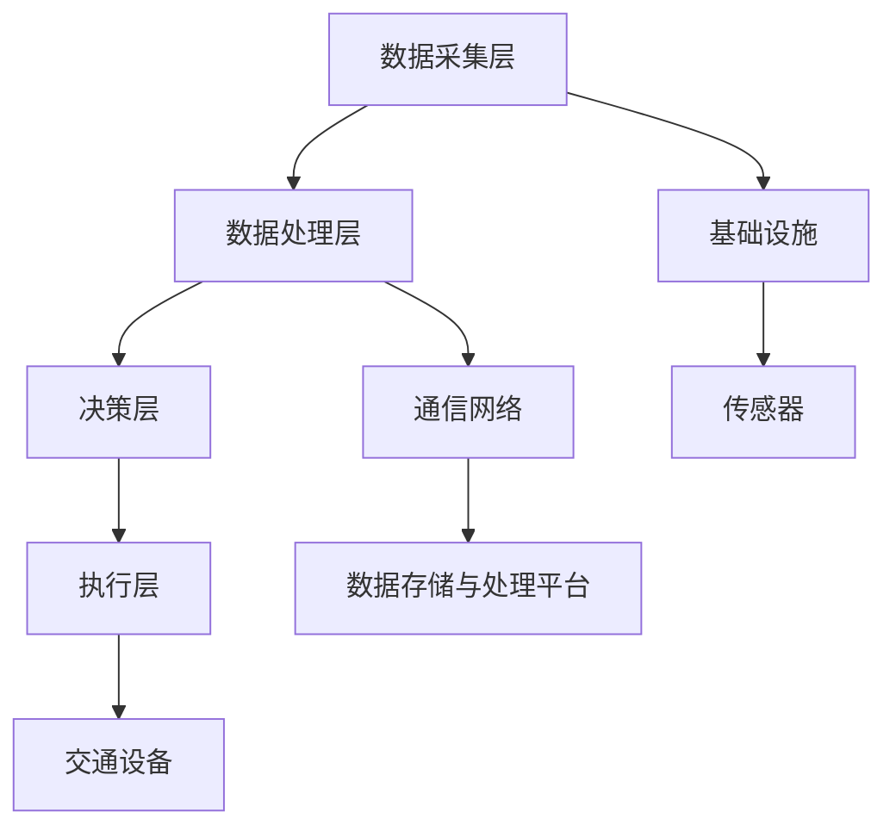

                 

### 《AI驱动的智能交通系统：优化城市流动》

> **关键词**：AI、智能交通系统、优化、城市流动、自动驾驶、机器学习、深度学习、车路协同

> **摘要**：本文深入探讨了AI驱动的智能交通系统，分析了其在优化城市流动方面的关键作用。通过介绍AI在智能交通系统中的应用、关键技术、应用案例和发展展望，本文旨在为读者提供一个全面的技术参考，推动智能交通领域的创新与进步。

---

#### 目录大纲

- **第一部分：AI驱动智能交通系统概述**
  - 第1章：AI驱动智能交通系统概述
    - 1.1 AI在智能交通系统中的作用
    - 1.2 智能交通系统的组成与架构
    - 1.3 AI驱动的智能交通系统发展现状
    - 1.4 本书结构安排与主要内容
- **第二部分：AI驱动的智能交通关键技术**
  - 第2章：AI驱动的智能交通关键技术
    - 2.1 数据采集与处理
    - 2.2 机器学习算法基础
    - 2.3 深度学习在智能交通中的应用
    - 2.4 强化学习在智能交通中的应用
    - 2.5 聚类与分类算法在智能交通中的应用
- **第三部分：AI驱动的智能交通应用案例分析**
  - 第3章：AI驱动的智能交通应用案例分析
    - 3.1 基于AI的智能交通信号控制系统
    - 3.2 基于AI的智能停车场管理系统
    - 3.3 基于AI的智能公交系统
    - 3.4 基于AI的智能车路协同系统
- **第四部分：AI驱动的智能交通系统发展展望**
  - 第4章：AI驱动的智能交通系统发展展望
    - 4.1 智能交通系统未来发展趋势
    - 4.2 AI驱动的智能交通系统面临的挑战
    - 4.3 智能交通系统政策与法规展望
    - 4.4 智能交通系统发展建议
- **附录**
  - 附录A：AI驱动的智能交通系统开发工具与资源
  - 附录B：参考文献

---

接下来，我们将按照目录大纲逐步深入探讨每一部分的内容，以期为您提供丰富的知识和洞见。

---

## 第1章：AI驱动智能交通系统概述

### 1.1 AI在智能交通系统中的作用

#### 1.1.1 AI在智能交通系统中的定义与分类

人工智能（AI）在智能交通系统中扮演着至关重要的角色。AI技术通过模拟、延伸和扩展人类智能，为交通系统的管理、优化和自动化提供了强大的工具。智能交通系统（Intelligent Transportation Systems，ITS）是一个集成多种技术以实现交通管理、监控和服务的系统，它主要包括以下几个类别：

1. **交通管理**：利用AI技术进行交通信号控制、交通流量管理、事故预防和应急响应等。
2. **车辆管理**：包括车辆自动识别、车联网（V2X）技术、自动驾驶等。
3. **基础设施管理**：如智能路灯、智能停车设施、交通监测系统等。
4. **乘客服务**：提供实时交通信息、路径规划、预约服务等。

#### 1.1.2 AI在智能交通系统中的挑战与机遇

AI在智能交通系统中的应用虽然具有巨大的潜力，但也面临着一系列挑战：

1. **数据挑战**：智能交通系统需要大量的高精度、实时数据来支持AI模型的训练和决策。然而，数据的采集、处理和保护都是巨大挑战。
2. **算法挑战**：AI算法的复杂性和不确定性使得在实际应用中难以确保其稳定性和可靠性。
3. **系统集成挑战**：智能交通系统需要整合多种技术，包括传感器、通信网络、数据处理平台等，这对系统的兼容性和集成性提出了高要求。

然而，这些挑战也带来了巨大的机遇：

1. **交通优化**：通过AI技术，可以实现交通流量的优化，减少拥堵，提高道路利用率。
2. **安全性提升**：自动驾驶、智能监测等技术的应用，有望显著提高道路安全水平。
3. **可持续发展**：智能交通系统有助于减少碳排放，促进交通系统的可持续发展。

### 1.2 智能交通系统的组成与架构

智能交通系统通常由多个层级和组成部分构成，其核心结构如图1-1所示。

#### 1.2.1 数据采集层

数据采集层是智能交通系统的基石，负责收集各种交通信息，包括车辆位置、速度、交通流量、道路状况等。常用的数据采集设备有摄像头、雷达、GPS、流量监测器等。

#### 1.2.2 数据处理层

数据处理层负责对采集到的数据进行清洗、转换和存储，以便后续的决策和执行。这一层通常涉及大数据处理、云计算等技术。

#### 1.2.3 决策层

决策层利用AI算法对处理后的数据进行分析和预测，生成最优的决策方案。这一层是智能交通系统的“大脑”，决定了交通管理、信号控制和车辆调度等策略。

#### 1.2.4 执行层

执行层负责将决策层的方案付诸实施，包括交通信号控制、智能路灯调节、车辆调度等。执行层通常由各种交通设备和控制系统组成。

#### 1.2.5 基础设施

基础设施包括道路、桥梁、隧道、交通信号灯、停车场等，它们是智能交通系统的物质基础。

#### 1.2.6 通信网络

通信网络连接数据采集层、数据处理层和执行层，确保数据传输的实时性和可靠性。车联网（V2X）技术是通信网络的重要组成部分，它包括车与车（V2V）、车与路（V2R）和车与云（V2C）的通信。

#### 1.2.7 数据存储与处理平台

数据存储与处理平台负责存储和管理大量交通数据，并提供高效的数据查询和分析服务。云计算平台和大数据技术在这一层发挥着重要作用。

#### 1.2.8 交通设备

交通设备包括各种用于执行交通管理任务的设备，如交通信号灯、智能路灯、监控摄像头、信息显示屏等。

### 1.3 AI驱动的智能交通系统发展现状

#### 1.3.1 国内外AI驱动的智能交通系统发展概况

AI驱动的智能交通系统在全球范围内得到了广泛关注和应用。以下是一些典型的发展概况：

- **美国**：美国在智能交通系统方面处于领先地位，其交通基础设施相对完善，AI技术在交通信号控制、自动驾驶和车联网等方面有广泛应用。
- **欧洲**：欧洲各国也在积极推动智能交通系统的发展，尤其注重自动驾驶、车联网和城市交通管理。
- **中国**：中国正在加速推进智能交通系统建设，政府出台了一系列政策扶持，智能交通系统在多个城市得到试点和应用。

#### 1.3.2 AI驱动的智能交通系统应用案例

以下是几个AI驱动的智能交通系统应用案例：

- **智能交通信号控制系统**：在杭州，智能交通信号控制系统通过实时数据分析和AI算法优化，实现了交通信号控制的智能调节，有效缓解了交通拥堵。
- **智能停车场管理系统**：在深圳，智能停车场管理系统利用AI技术实现了停车位的实时监测和智能调度，提高了停车效率。
- **智能公交系统**：在广州，智能公交系统通过大数据分析和AI调度，实现了公交路线优化和车辆调度，提高了公共交通的准时率和效率。
- **智能车路协同系统**：在苏州，智能车路协同系统通过车与路、车与车的通信，实现了交通信息的实时共享和协同控制，提高了道路通行能力和安全性。

### 1.4 本书结构安排与主要内容

本书分为四大部分，共计四章及附录，具体内容如下：

- **第一部分：AI驱动智能交通系统概述**，介绍AI在智能交通系统中的作用、组成与架构，以及当前的发展现状。
- **第二部分：AI驱动的智能交通关键技术**，深入探讨数据采集与处理、机器学习、深度学习、强化学习、聚类与分类算法在智能交通中的应用。
- **第三部分：AI驱动的智能交通应用案例分析**，通过具体案例展示AI技术在智能交通系统中的应用实践。
- **第四部分：AI驱动的智能交通系统发展展望**，分析未来发展趋势、面临的挑战以及政策与法规展望，并提出发展建议。

---

在接下来的章节中，我们将进一步探讨AI驱动的智能交通系统的关键技术、应用案例以及未来发展。希望通过本文的深入讨论，能够为读者提供一个全面的技术参考，推动智能交通领域的创新与进步。

