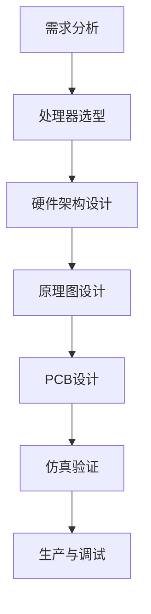
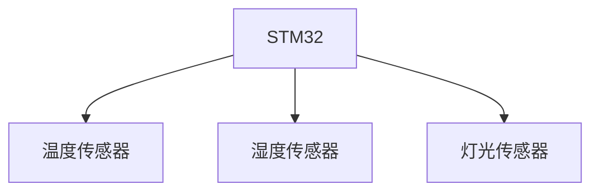

                 

# 《ARM架构编程：移动和嵌入式系统开发》

> 关键词：ARM架构、移动系统、嵌入式系统、开发、编程、优化

> 摘要：本文深入探讨了ARM架构编程在移动和嵌入式系统开发中的应用，从基础概念、处理器内核架构、指令集、编程模型到实际开发实战，全面解析ARM架构编程的核心内容，帮助读者掌握ARM架构编程的核心技巧和优化策略。

## 第一部分：ARM架构基础

### 1.1 ARM架构概述

ARM架构是一种广泛使用的处理器架构，其发展历程可以追溯到1987年，当时ARM公司推出了第一款ARM处理器。ARM架构以其低功耗、高性能和灵活性著称，因此在移动和嵌入式系统中得到了广泛应用。

#### ARM架构发展史

ARM架构的发展经历了多个阶段：

- **第一阶段（1987-1991年）**：ARM1和ARM2处理器推出，标志着ARM架构的诞生。
- **第二阶段（1991-1995年）**：ARM3和ARM6处理器推出，性能和功能得到了显著提升。
- **第三阶段（1995-2003年）**：ARM7和ARM9处理器推出，进一步提高了性能，广泛应用于嵌入式系统。
- **第四阶段（2003年至今）**：ARM11及后续处理器推出，如Cortex-A系列处理器，支持多核架构和高级指令集。

#### ARM架构的核心特点

ARM架构具有以下核心特点：

- **低功耗**：ARM处理器设计注重低功耗，使其在移动和嵌入式系统中具有优势。
- **高性能**：ARM处理器采用先进的微架构设计，性能不断提高。
- **高度可定制**：ARM处理器可以针对不同应用需求进行定制，满足各种应用场景。
- **广泛的生态系统**：ARM架构拥有丰富的开发工具、软件和硬件支持，构建了一个庞大的生态系统。

#### ARM处理器在移动和嵌入式系统中的应用

ARM处理器在移动和嵌入式系统中得到了广泛应用，以下是一些典型应用：

- **智能手机**：ARM处理器广泛应用于智能手机，如iPhone、三星Galaxy等。
- **平板电脑**：ARM处理器被广泛应用于平板电脑，如iPad、Surface等。
- **嵌入式设备**：ARM处理器广泛应用于嵌入式设备，如智能家居、工业控制、医疗设备等。

### 1.2 ARM处理器内核架构

ARM处理器内核架构不断演进，从ARMv7到ARMv8，处理器性能和功能得到了显著提升。

#### ARMv7架构

ARMv7架构是ARM处理器的一个重要阶段，其主要特点如下：

- **高性能**：ARMv7架构引入了NEON多媒体处理引擎，提高了处理器性能。
- **多核支持**：ARMv7架构支持多核处理器，提高了并行处理能力。
- **虚拟化支持**：ARMv7架构引入了虚拟化技术，提高了系统安全性和灵活性。

#### ARMv8架构

ARMv8架构是ARM处理器的新一代架构，具有以下特点：

- **64位支持**：ARMv8架构引入了64位指令集，支持64位操作系统和应用程序。
- **ARMv8-A处理器**：ARMv8-A处理器是ARM处理器的重要分支，支持高性价比、高性能应用。
- **ARMv8-R处理器**：ARMv8-R处理器专注于实时应用，具有低延迟、高可靠性的特点。

#### ARM Cortex-A系列处理器

ARM Cortex-A系列处理器是ARM处理器的一个重要分支，具有以下特点：

- **高性能**：Cortex-A系列处理器采用先进微架构设计，性能不断提高。
- **多核架构**：Cortex-A系列处理器支持多核架构，提高了并行处理能力。
- **低功耗**：Cortex-A系列处理器设计注重低功耗，满足移动和嵌入式系统需求。

### 1.3 ARM指令集与汇编语言

ARM指令集是ARM处理器的工作语言，包括数据传输指令、算术逻辑指令、程序控制指令等。

#### ARM指令集分类

ARM指令集可以分为以下几类：

- **数据传输指令**：用于在寄存器之间、寄存器和内存之间进行数据传输。
- **算术逻辑指令**：用于执行加、减、乘、除等算术运算和逻辑运算。
- **程序控制指令**：用于实现程序跳转、循环控制等功能。
- **协处理指令**：用于访问协处理器的功能，如浮点运算、加密等。

#### 汇编语言基础

汇编语言是ARM处理器的底层编程语言，其基本语法包括：

- **指令**：ARM汇编语言的指令与ARM指令集一一对应。
- **地址模式**：ARM汇编语言的地址模式用于指定操作数的地址。
- **伪指令**：ARM汇编语言中的伪指令用于提供汇编过程中的控制信息。

#### 汇编语言编程实例

以下是一个简单的ARM汇编语言编程实例：

```assembly
; 数据定义
.data
msg: .asciz "Hello, world!"

; 汇编代码
.text
.global _start
_start:
    ; 打印消息
    mov r0, =msg
    bl printf
    
    ; 退出程序
    mov r7, #1
    mov r0, #0
    svc #0
```

### 1.4 ARM处理器编程模型

ARM处理器编程模型包括CPU状态、寄存器、中断处理和异常处理等。

#### CPU状态与寄存器

ARM处理器具有以下状态和寄存器：

- **状态寄存器**：包括当前程序状态寄存器（CPSR）和中断状态寄存器（INT\_SR）等。
- **通用寄存器**：包括R0至R15，用于存储数据、地址和控制信息。
- **堆栈指针**：用于管理堆栈，在函数调用时保存和恢复寄存器状态。
- **程序计数器**：用于存储当前执行的指令地址。

#### 中断处理

中断处理是ARM处理器的一个重要功能，用于响应外部事件。中断处理过程包括以下步骤：

1. 中断请求产生。
2. CPU响应中断请求，进入中断服务程序。
3. 保存当前CPU状态。
4. 执行中断服务程序。
5. 恢复CPU状态，继续执行中断前的程序。

#### 异常处理

异常处理是ARM处理器响应内部事件的一种机制。异常处理过程包括以下步骤：

1. 异常请求产生。
2. CPU响应异常请求，进入异常处理程序。
3. 保存当前CPU状态。
4. 执行异常处理程序。
5. 恢复CPU状态，继续执行异常前的程序。

## 第二部分：移动系统开发

### 2.1 Android系统架构与ARM架构适配

Android系统是基于Linux内核的操作系统，其架构与ARM架构具有很好的兼容性。

#### Android系统概述

Android系统具有以下主要组成部分：

- **Linux内核**：提供内核级功能和设备驱动支持。
- **Android运行时**：包括Dalvik虚拟机和Android运行时库，负责应用程序的运行。
- **应用程序框架**：提供应用程序开发的基础类库和API。
- **应用程序**：用户安装和使用的应用程序。

#### Android ARM架构适配

Android系统在ARM架构上的适配主要包括以下方面：

- **内核适配**：Android内核针对ARM架构进行了定制化适配，包括设备驱动、文件系统、内存管理等。
- **编译工具链**：Android编译工具链（如Cortex-A系列处理器）对ARM架构的支持，包括编译器、汇编器和链接器等。
- **驱动开发**：Android系统提供了丰富的硬件抽象层（HAL），开发者可以针对ARM架构开发相应的硬件驱动。

#### Android ARM架构优化

Android ARM架构优化主要包括以下方面：

- **处理器优化**：针对ARM处理器特性，进行指令级优化、流水线优化等，提高处理器性能。
- **内存优化**：通过优化内存分配、缓存管理等方式，降低内存占用和提高内存访问效率。
- **功耗优化**：通过优化功耗模型、降低功耗等方式，提高Android设备的续航能力。

### 2.2 Android应用程序开发

Android应用程序开发主要包括开发环境搭建、应用程序架构和应用程序编程等方面。

#### Android开发环境搭建

Android开发环境搭建主要包括以下步骤：

1. 安装Java开发工具包（JDK）。
2. 安装Android开发工具包（ADT）。
3. 配置Android SDK。
4. 安装Android模拟器。

#### Android应用程序架构

Android应用程序架构主要包括以下组成部分：

- **Activity**：代表应用程序中的一个界面或功能模块。
- **Service**：在后台执行长时间运行的任务。
- **BroadcastReceiver**：用于接收系统事件或其他应用程序发送的广播消息。
- **ContentProvider**：用于数据共享和访问。

#### Android应用程序编程实例

以下是一个简单的Android应用程序编程实例：

```java
// 导入必要的类库
import android.app.Activity;
import android.os.Bundle;
import android.widget.Button;
import android.view.View;
import android.content.Intent;

// 定义一个简单的Activity类
public class MainActivity extends Activity {

    // 定义一个按钮点击事件处理方法
    public void onClickButton(View view) {
        // 创建一个Intent对象，用于启动新的Activity
        Intent intent = new Intent(this, SecondActivity.class);
        // 启动新的Activity
        startActivity(intent);
    }

    // 重写onCreate方法，初始化界面和组件
    @Override
    protected void onCreate(Bundle savedInstanceState) {
        super.onCreate(savedInstanceState);
        setContentView(R.layout.activity_main);

        // 获取界面上的按钮组件
        Button button = findViewById(R.id.button);
        // 为按钮设置点击事件处理方法
        button.setOnClickListener(this);
    }
}
```

### 2.3 Android硬件访问与驱动开发

Android硬件访问与驱动开发主要包括硬件抽象层（HAL）和设备驱动开发。

#### Android硬件抽象层（HAL）

硬件抽象层（HAL）是Android系统用于硬件设备访问的一个关键模块，其主要功能如下：

- **抽象硬件设备**：将不同硬件设备的底层操作抽象成统一的接口，为上层应用程序提供统一的硬件访问方式。
- **设备驱动管理**：管理硬件设备的驱动程序，包括设备驱动加载、卸载和更新等。
- **硬件特性支持**：支持硬件设备的特定功能，如触摸屏、传感器、摄像头等。

#### Android设备驱动开发

Android设备驱动开发主要包括以下步骤：

1. **设备驱动框架**：了解Android设备驱动框架，包括设备驱动接口、设备树和设备管理器等。
2. **设备驱动编写**：根据硬件设备的特点，编写设备驱动程序，实现硬件设备的底层操作。
3. **设备驱动调试**：通过调试工具对设备驱动程序进行调试和测试，确保驱动程序的稳定性和可靠性。

#### Android硬件访问实例

以下是一个简单的Android硬件访问实例：

```java
// 导入必要的类库
import android.app.Activity;
import android.os.Bundle;
import android.widget.Button;
import android.view.View;
import android.content.Intent;

// 定义一个简单的Activity类
public class MainActivity extends Activity {

    // 定义一个按钮点击事件处理方法
    public void onClickButton(View view) {
        // 获取触摸屏坐标
        int[] coordinates = new int[2];
        view.getLocationOnScreen(coordinates);
        int x = coordinates[0];
        int y = coordinates[1];

        // 打印触摸屏坐标
        System.out.println("Touch screen at (" + x + ", " + y + ")");
    }

    // 重写onCreate方法，初始化界面和组件
    @Override
    protected void onCreate(Bundle savedInstanceState) {
        super.onCreate(savedInstanceState);
        setContentView(R.layout.activity_main);

        // 获取界面上的按钮组件
        Button button = findViewById(R.id.button);
        // 为按钮设置点击事件处理方法
        button.setOnClickListener(this);
    }
}
```

## 第三部分：嵌入式系统开发

### 3.1 嵌入式系统概述

嵌入式系统是一种专门为特定任务而设计的计算机系统，通常具有以下特点：

- **专用性**：嵌入式系统设计针对特定应用场景，具有明确的任务目标。
- **实时性**：嵌入式系统需要满足严格的实时性能要求，保证任务在规定时间内完成。
- **可靠性**：嵌入式系统需要具备较高的可靠性和稳定性，确保长时间运行不发生故障。
- **低功耗**：嵌入式系统设计注重低功耗，以延长电池寿命或降低能源消耗。

#### 嵌入式系统分类

嵌入式系统可以根据应用场景和功能特点进行分类，以下是一些常见的嵌入式系统分类：

- **消费类嵌入式系统**：如智能手机、平板电脑、智能电视等，主要面向个人消费者。
- **工业类嵌入式系统**：如工业控制器、工业机器人、智能交通系统等，主要应用于工业生产和自动化控制。
- **医疗类嵌入式系统**：如医疗设备、监护系统、医疗信息化系统等，主要应用于医疗领域。
- **汽车类嵌入式系统**：如车载信息系统、智能汽车控制系统、汽车安全系统等，主要应用于汽车行业。
- **智能家居嵌入式系统**：如智能门锁、智能照明、智能安防系统等，主要应用于家庭生活。

#### 嵌入式系统发展趋势

随着科技的不断进步，嵌入式系统呈现出以下发展趋势：

- **集成度提高**：随着芯片制造工艺的进步，嵌入式系统具有更高的集成度，可集成更多的功能模块。
- **智能化增强**：嵌入式系统逐渐具备人工智能、机器学习等智能化功能，实现更智能化的应用场景。
- **无线通信扩展**：嵌入式系统逐渐采用无线通信技术，实现更灵活的网络连接和远程控制。
- **开源生态丰富**：随着开源技术的普及，嵌入式系统逐渐构建起丰富的开源生态，提高开发效率。

### 3.2 嵌入式处理器硬件设计

嵌入式处理器硬件设计是嵌入式系统开发的基础，主要包括嵌入式处理器选型、硬件设计流程和硬件设计实例等方面。

#### 嵌入式处理器选型

嵌入式处理器选型需要考虑以下因素：

- **性能需求**：根据应用场景的需求，选择合适的处理器性能指标，如CPU频率、内存容量等。
- **功耗需求**：根据功耗预算，选择合适的处理器功耗，确保嵌入式系统具有较长的续航能力。
- **外设需求**：根据应用场景的需求，选择具有相应外设功能的处理器，如GPIO、UART、SPI、I2C等。
- **兼容性需求**：考虑处理器的兼容性，确保与现有的嵌入式系统架构和软件兼容。

#### 硬件设计流程

嵌入式处理器硬件设计流程主要包括以下步骤：

1. **需求分析**：明确嵌入式系统的功能需求、性能需求、功耗需求等，为后续设计提供依据。
2. **处理器选型**：根据需求分析结果，选择合适的嵌入式处理器。
3. **硬件架构设计**：设计嵌入式处理器的硬件架构，包括处理器内核、外设接口、时钟电路等。
4. **原理图设计**：根据硬件架构设计，绘制嵌入式处理器的原理图，包括电路连接、元件封装等。
5. **PCB设计**：根据原理图设计，绘制嵌入式处理器的PCB图，包括电路布局、元件布局等。
6. **仿真验证**：通过仿真工具对硬件设计进行验证，确保电路工作的正确性和稳定性。
7. **生产与调试**：根据PCB图生产嵌入式处理器硬件，进行硬件调试和测试，确保硬件的可靠性和稳定性。

#### 硬件设计实例

以下是一个简单的嵌入式处理器硬件设计实例：



### 3.3 嵌入式软件开发

嵌入式软件开发是嵌入式系统开发的重要组成部分，主要包括软件开发流程、软件开发工具和软件开发实例等方面。

#### 软件开发流程

嵌入式软件开发流程主要包括以下步骤：

1. **需求分析**：明确嵌入式软件的功能需求、性能需求、可靠性需求等，为后续开发提供依据。
2. **软件架构设计**：设计嵌入式软件的架构，包括模块划分、接口定义等。
3. **编码实现**：根据软件架构设计，进行嵌入式软件的编码实现，编写相应的源代码。
4. **单元测试**：对嵌入式软件的各个模块进行单元测试，确保模块功能的正确性和稳定性。
5. **集成测试**：将各个模块集成在一起，进行嵌入式软件的集成测试，确保整个系统的功能正确性和稳定性。
6. **调试与优化**：对嵌入式软件进行调试和优化，提高软件的性能和稳定性。
7. **部署与维护**：将嵌入式软件部署到嵌入式处理器硬件上，进行系统测试和部署，并持续进行软件维护和更新。

#### 软件开发工具

嵌入式软件开发工具主要包括以下几类：

- **集成开发环境（IDE）**：如Eclipse、Keil等，提供代码编写、编译、调试等功能。
- **编译工具链**：如GNU Toolchain、ARM Toolchain等，用于编译和链接嵌入式软件。
- **调试工具**：如JTAG调试器、逻辑分析仪等，用于嵌入式软件的调试和测试。
- **版本控制工具**：如Git、SVN等，用于管理嵌入式软件的源代码和版本。

#### 软件开发实例

以下是一个简单的嵌入式软件开发实例：

```c
// 导入必要的类库
#include <stdio.h>
#include <stdlib.h>

// 定义一个简单的函数
int add(int a, int b) {
    return a + b;
}

// 主函数
int main() {
    // 输出结果
    printf("5 + 3 = %d\n", add(5, 3));
    return 0;
}
```

## 第三部分：嵌入式系统开发

### 3.1 嵌入式系统概述

嵌入式系统是一种专门为特定任务而设计的计算机系统，通常具有以下特点：

- **专用性**：嵌入式系统设计针对特定应用场景，具有明确的任务目标。
- **实时性**：嵌入式系统需要满足严格的实时性能要求，保证任务在规定时间内完成。
- **可靠性**：嵌入式系统需要具备较高的可靠性和稳定性，确保长时间运行不发生故障。
- **低功耗**：嵌入式系统设计注重低功耗，以延长电池寿命或降低能源消耗。

#### 嵌入式系统分类

嵌入式系统可以根据应用场景和功能特点进行分类，以下是一些常见的嵌入式系统分类：

- **消费类嵌入式系统**：如智能手机、平板电脑、智能电视等，主要面向个人消费者。
- **工业类嵌入式系统**：如工业控制器、工业机器人、智能交通系统等，主要应用于工业生产和自动化控制。
- **医疗类嵌入式系统**：如医疗设备、监护系统、医疗信息化系统等，主要应用于医疗领域。
- **汽车类嵌入式系统**：如车载信息系统、智能汽车控制系统、汽车安全系统等，主要应用于汽车行业。
- **智能家居嵌入式系统**：如智能门锁、智能照明、智能安防系统等，主要应用于家庭生活。

#### 嵌入式系统发展趋势

随着科技的不断进步，嵌入式系统呈现出以下发展趋势：

- **集成度提高**：随着芯片制造工艺的进步，嵌入式系统具有更高的集成度，可集成更多的功能模块。
- **智能化增强**：嵌入式系统逐渐具备人工智能、机器学习等智能化功能，实现更智能化的应用场景。
- **无线通信扩展**：嵌入式系统逐渐采用无线通信技术，实现更灵活的网络连接和远程控制。
- **开源生态丰富**：随着开源技术的普及，嵌入式系统逐渐构建起丰富的开源生态，提高开发效率。

### 3.2 嵌入式处理器硬件设计

嵌入式处理器硬件设计是嵌入式系统开发的基础，主要包括嵌入式处理器选型、硬件设计流程和硬件设计实例等方面。

#### 嵌入式处理器选型

嵌入式处理器选型需要考虑以下因素：

- **性能需求**：根据应用场景的需求，选择合适的处理器性能指标，如CPU频率、内存容量等。
- **功耗需求**：根据功耗预算，选择合适的处理器功耗，确保嵌入式系统具有较长的续航能力。
- **外设需求**：根据应用场景的需求，选择具有相应外设功能的处理器，如GPIO、UART、SPI、I2C等。
- **兼容性需求**：考虑处理器的兼容性，确保与现有的嵌入式系统架构和软件兼容。

#### 硬件设计流程

嵌入式处理器硬件设计流程主要包括以下步骤：

1. **需求分析**：明确嵌入式系统的功能需求、性能需求、功耗需求等，为后续设计提供依据。
2. **处理器选型**：根据需求分析结果，选择合适的嵌入式处理器。
3. **硬件架构设计**：设计嵌入式处理器的硬件架构，包括处理器内核、外设接口、时钟电路等。
4. **原理图设计**：根据硬件架构设计，绘制嵌入式处理器的原理图，包括电路连接、元件封装等。
5. **PCB设计**：根据原理图设计，绘制嵌入式处理器的PCB图，包括电路布局、元件布局等。
6. **仿真验证**：通过仿真工具对硬件设计进行验证，确保电路工作的正确性和稳定性。
7. **生产与调试**：根据PCB图生产嵌入式处理器硬件，进行硬件调试和测试，确保硬件的可靠性和稳定性。

#### 硬件设计实例

以下是一个简单的嵌入式处理器硬件设计实例：


### 3.3 嵌入式软件开发

嵌入式软件开发是嵌入式系统开发的重要组成部分，主要包括软件开发流程、软件开发工具和软件开发实例等方面。

#### 软件开发流程

嵌入式软件开发流程主要包括以下步骤：

1. **需求分析**：明确嵌入式软件的功能需求、性能需求、可靠性需求等，为后续开发提供依据。
2. **软件架构设计**：设计嵌入式软件的架构，包括模块划分、接口定义等。
3. **编码实现**：根据软件架构设计，进行嵌入式软件的编码实现，编写相应的源代码。
4. **单元测试**：对嵌入式软件的各个模块进行单元测试，确保模块功能的正确性和稳定性。
5. **集成测试**：将各个模块集成在一起，进行嵌入式软件的集成测试，确保整个系统的功能正确性和稳定性。
6. **调试与优化**：对嵌入式软件进行调试和优化，提高软件的性能和稳定性。
7. **部署与维护**：将嵌入式软件部署到嵌入式处理器硬件上，进行系统测试和部署，并持续进行软件维护和更新。

#### 软件开发工具

嵌入式软件开发工具主要包括以下几类：

- **集成开发环境（IDE）**：如Eclipse、Keil等，提供代码编写、编译、调试等功能。
- **编译工具链**：如GNU Toolchain、ARM Toolchain等，用于编译和链接嵌入式软件。
- **调试工具**：如JTAG调试器、逻辑分析仪等，用于嵌入式软件的调试和测试。
- **版本控制工具**：如Git、SVN等，用于管理嵌入式软件的源代码和版本。

#### 软件开发实例

以下是一个简单的嵌入式软件开发实例：

```c
// 导入必要的类库
#include <stdio.h>
#include <stdlib.h>

// 定义一个简单的函数
int add(int a, int b) {
    return a + b;
}

// 主函数
int main() {
    // 输出结果
    printf("5 + 3 = %d\n", add(5, 3));
    return 0;
}
```

### 3.4 嵌入式系统调试与测试

嵌入式系统调试与测试是确保嵌入式系统功能正确性和稳定性的关键环节，主要包括调试方法、测试方法和调试与测试实例等方面。

#### 嵌入式系统调试方法

嵌入式系统调试方法主要包括以下几种：

- **软件调试**：通过编写调试代码，在嵌入式软件中设置断点、单步执行和查看变量值等，定位和解决问题。
- **硬件调试**：通过硬件调试工具，如JTAG调试器、逻辑分析仪等，对嵌入式处理器的运行状态和外部接口进行调试。
- **系统级调试**：通过仿真器或实际硬件，对整个嵌入式系统进行调试，确保硬件和软件之间的协同工作。

#### 嵌入式系统测试方法

嵌入式系统测试方法主要包括以下几种：

- **功能测试**：通过模拟实际应用场景，验证嵌入式系统的功能是否符合设计要求。
- **性能测试**：通过测量嵌入式系统的响应时间、吞吐量等性能指标，评估嵌入式系统的性能。
- **可靠性测试**：通过长时间运行和压力测试，评估嵌入式系统的稳定性和可靠性。
- **兼容性测试**：通过在不同硬件平台和操作系统上运行嵌入式系统，验证嵌入式系统的兼容性。

#### 嵌入式系统调试与测试实例

以下是一个简单的嵌入式系统调试与测试实例：

```c
// 导入必要的类库
#include <stdio.h>
#include <stdlib.h>

// 定义一个简单的函数
int add(int a, int b) {
    return a + b;
}

// 主函数
int main() {
    // 输出结果
    printf("5 + 3 = %d\n", add(5, 3));
    return 0;
}
```

- **软件调试**：在程序中设置断点，跟踪变量值，定位问题所在。
- **硬件调试**：使用JTAG调试器调试嵌入式处理器，检查硬件电路是否正常。
- **系统级调试**：在实际硬件上运行程序，检查嵌入式系统的整体性能和稳定性。

### 4.1 ARM架构编程实战

#### 实战项目概述

本节将介绍一个ARM架构编程的实战项目，该项目旨在实现一个简单的嵌入式操作系统。项目需求如下：

1. **启动顺序**：从引导程序开始，加载内核，初始化硬件设备，运行用户应用程序。
2. **硬件设备管理**：支持GPIO、UART、SPI、I2C等外设设备的初始化和操作。
3. **内存管理**：实现内存分配和释放，保证内存的高效使用。
4. **进程管理**：支持多进程并发运行，实现进程的创建、切换和终止。
5. **文件系统**：实现基本的文件操作，如文件创建、删除、读取和写入。

#### 实战项目需求分析

针对上述需求，本项目需要实现以下功能模块：

1. **引导程序**：负责加载内核，初始化硬件设备，进入操作系统。
2. **内核**：负责进程管理、内存管理和文件系统。
3. **硬件设备驱动**：实现GPIO、UART、SPI、I2C等外设设备的驱动程序。
4. **用户应用程序**：实现用户功能，如文件操作、系统监控等。

#### 实战项目开发与实现

以下是一个简化的ARM架构编程实战项目开发与实现过程：

##### 1. 引导程序

```assembly
; 启动顺序：引导程序 -> 内核
; 引导程序伪代码
start_boot:
    ; 初始化硬件设备
    call init_hardware
    ; 载入内核
    ldr r0, =KERNEL_ADDRESS
    bl load_kernel
    ; 跳转至内核入口
    ldr pc, =KERNEL_ENTRY

init_hardware:
    ; 初始化硬件设备
    ; 如GPIO、UART等
    ret

load_kernel:
    ; 载入内核到内存
    ; 使用内存拷贝指令
    ret

KERNEL_ADDRESS:
    .word 0x10000000 ; 内核的内存地址
KERNEL_ENTRY:
    .word 0x10001000 ; 内核的入口地址
```

##### 2. 内核

内核是操作系统的核心，负责进程管理、内存管理和文件系统。以下是一个简化的内核伪代码：

```c
// 内核伪代码
void kernel_entry() {
    // 初始化内存管理
    init_memory_management();

    // 初始化进程管理
    init_process_management();

    // 初始化文件系统
    init_file_system();

    // 循环处理中断和系统调用
    while (1) {
        handle_interrupt();
        handle_syscall();
    }
}

void init_memory_management() {
    // 初始化内存分配器
    // 实现内存分配和释放功能
}

void init_process_management() {
    // 初始化进程控制块
    // 实现进程的创建、切换和终止功能
}

void init_file_system() {
    // 初始化文件系统
    // 实现文件操作功能
}

void handle_interrupt() {
    // 处理中断
}

void handle_syscall() {
    // 处理系统调用
}
```

##### 3. 硬件设备驱动

硬件设备驱动负责实现外设设备的初始化和操作。以下是一个简化的GPIO驱动伪代码：

```c
// GPIO驱动伪代码
void init_gpio() {
    // 初始化GPIO端口
    // 设置GPIO方向、电平等
}

void set_gpio(int pin, int value) {
    // 设置指定GPIO引脚的值
    // value为1时，输出高电平；value为0时，输出低电平
}

int get_gpio(int pin) {
    // 获取指定GPIO引脚的值
    // 返回1时，表示高电平；返回0时，表示低电平
}
```

##### 4. 用户应用程序

用户应用程序是操作系统上的应用程序，实现用户功能。以下是一个简化的用户应用程序伪代码：

```c
// 用户应用程序伪代码
int main() {
    // 初始化硬件设备
    init_hardware();

    // 执行用户功能
    while (1) {
        // 文件操作
        file_operation();

        // 系统监控
        system_monitor();

        // 按键处理
        key_handler();
    }

    return 0;
}

void init_hardware() {
    // 初始化硬件设备
    // 如GPIO、UART等
}

void file_operation() {
    // 实现文件操作功能
    // 如创建文件、读取文件、写入文件等
}

void system_monitor() {
    // 实现系统监控功能
    // 如CPU利用率、内存占用等
}

void key_handler() {
    // 实现按键处理功能
    // 如按键按下、按键释放等
}
```

### 4.2 移动系统开发实战

#### 实战项目概述

本节将介绍一个移动系统开发的实战项目，该项目旨在实现一个简单的Android应用程序。项目需求如下：

1. **界面设计**：实现一个主界面，包含一个按钮和一个文本显示区域。
2. **用户交互**：用户点击按钮，触发一个事件，更新文本显示区域。
3. **数据存储**：在用户点击按钮后，将点击次数存储在本地文件中。
4. **数据读取**：在应用程序启动时，读取本地文件中的点击次数，并显示在文本显示区域。

#### 实战项目需求分析

针对上述需求，本项目需要实现以下功能模块：

1. **界面布局**：设计主界面布局，包含按钮和文本显示区域。
2. **事件处理**：实现按钮点击事件处理，更新文本显示区域。
3. **数据存储**：实现数据存储功能，将点击次数存储在本地文件中。
4. **数据读取**：实现数据读取功能，从本地文件中获取点击次数。

#### 实战项目开发与实现

以下是一个简化的Android移动系统开发实战项目开发与实现过程：

##### 1. 界面布局

在Android项目的res/layout目录下，创建一个名为activity_main.xml的布局文件，实现主界面布局：

```xml
<RelativeLayout xmlns:android="http://schemas.android.com/apk/res/android"
    android:layout_width="match_parent"
    android:layout_height="match_parent">

    <Button
        android:id="@+id/button"
        android:layout_width="wrap_content"
        android:layout_height="wrap_content"
        android:text="点击我"
        android:layout_centerHorizontal="true"
        android:layout_marginTop="100dp"/>

    <TextView
        android:id="@+id/text_view"
        android:layout_width="wrap_content"
        android:layout_height="wrap_content"
        android:text="点击次数：0"
        android:layout_centerHorizontal="true"
        android:layout_below="@id/button"
        android:layout_marginTop="20dp"/>

</RelativeLayout>
```

##### 2. 事件处理

在Android项目的Java代码中，创建MainActivity.java文件，实现按钮点击事件处理和文本显示更新：

```java
import android.os.Bundle;
import android.view.View;
import android.widget.Button;
import android.widget.TextView;

public class MainActivity extends AppCompatActivity {

    private int clickCount = 0;
    private Button button;
    private TextView textView;

    @Override
    protected void onCreate(Bundle savedInstanceState) {
        super.onCreate(savedInstanceState);
        setContentView(R.layout.activity_main);

        button = findViewById(R.id.button);
        textView = findViewById(R.id.text_view);

        button.setOnClickListener(new View.OnClickListener() {
            @Override
            public void onClick(View v) {
                clickCount++;
                textView.setText("点击次数：" + clickCount);
                saveClickCount();
            }
        });
    }

    private void saveClickCount() {
        // 将点击次数存储到本地文件
        try {
            FileOutputStream outputStream = openFileOutput("click_count.txt", Context.MODE_PRIVATE);
            outputStream.write(String.valueOf(clickCount).getBytes());
            outputStream.close();
        } catch (IOException e) {
            e.printStackTrace();
        }
    }

    private void loadClickCount() {
        // 从本地文件中读取点击次数
        try {
            FileInputStream inputStream = openFileInput("click_count.txt");
            byte[] buffer = new byte[1024];
            int bytesRead = inputStream.read(buffer);
            String clickCountStr = new String(buffer, 0, bytesRead);
            clickCount = Integer.parseInt(clickCountStr);
            textView.setText("点击次数：" + clickCount);
            inputStream.close();
        } catch (IOException e) {
            e.printStackTrace();
        }
    }
}
```

##### 3. 数据存储与读取

在应用程序启动时，从本地文件中读取点击次数，并显示在文本显示区域。在MainActivity.java文件中，添加以下代码：

```java
@Override
protected void onStart() {
    super.onStart();
    loadClickCount();
}
```

### 4.3 嵌入式系统开发实战

#### 实战项目概述

本节将介绍一个嵌入式系统开发的实战项目，该项目旨在实现一个简单的智能家居监控系统。项目需求如下：

1. **硬件组成**：使用STM32微控制器作为核心，连接温度传感器、湿度传感器、灯光传感器等。
2. **功能需求**：通过传感器采集环境数据，并将数据发送至服务器，实现远程监控和控制。
3. **通信协议**：采用MQTT协议实现传感器数据与服务器之间的传输。

#### 实战项目需求分析

针对上述需求，本项目需要实现以下功能模块：

1. **硬件接口**：连接温度传感器、湿度传感器、灯光传感器等，实现传感器数据的采集。
2. **传感器驱动**：实现传感器数据的读取和预处理。
3. **通信模块**：使用Wi-Fi模块连接互联网，通过MQTT协议实现数据传输。
4. **服务器接口**：实现服务器接收传感器数据，并提供远程控制接口。

#### 实战项目开发与实现

以下是一个简化的嵌入式系统开发实战项目开发与实现过程：

##### 1. 硬件接口

在STM32微控制器的开发板上，连接温度传感器、湿度传感器、灯光传感器等。以下是硬件连接的简图：



##### 2. 传感器驱动

编写传感器驱动代码，实现传感器数据的读取和预处理。以下是传感器驱动的伪代码：

```c
// 温度传感器驱动伪代码
void init_temperature_sensor() {
    // 初始化温度传感器
    // 设置采样频率等参数
}

float read_temperature() {
    // 读取温度传感器数据
    // 返回温度值
}

// 湿度传感器驱动伪代码
void init_humidity_sensor() {
    // 初始化湿度传感器
    // 设置采样频率等参数
}

float read_humidity() {
    // 读取湿度传感器数据
    // 返回湿度值
}

// 灯光传感器驱动伪代码
void init_light_sensor() {
    // 初始化灯光传感器
    // 设置采样频率等参数
}

int read_light() {
    // 读取灯光传感器数据
    // 返回光线强度值
}
```

##### 3. 通信模块

使用Wi-Fi模块连接互联网，通过MQTT协议实现数据传输。以下是通信模块的伪代码：

```c
// MQTT通信模块伪代码
void init_mqtt_client() {
    // 初始化MQTT客户端
    // 设置MQTT服务器地址、用户名、密码等
}

void connect_to_mqtt_server() {
    // 连接MQTT服务器
}

void disconnect_from_mqtt_server() {
    // 断开MQTT服务器连接
}

void publish_sensor_data(float temperature, float humidity, int light) {
    // 发布传感器数据到MQTT服务器
    // 使用MQTT协议的publish消息
}

void subscribe_to_mqtt_topic() {
    // 订阅MQTT主题
    // 接收服务器发送的传感器数据和控制命令
}
```

##### 4. 服务器接口

实现服务器接口，接收传感器数据，并提供远程控制接口。以下是服务器接口的伪代码：

```c
// 服务器接口伪代码
void receive_sensor_data(float temperature, float humidity, int light) {
    // 接收传感器数据
    // 存储到数据库或文件
}

void send_control_command(int device_id, int command) {
    // 发送控制命令到设备
    // 通过MQTT协议发送消息
}
```

### 第五部分：ARM架构编程技巧与优化

#### 5.1 ARM架构编程技巧

ARM架构编程涉及多个方面，以下是一些ARM架构编程的技巧：

1. **寄存器使用技巧**：合理使用ARM处理器寄存器，提高程序执行效率。例如，尽量避免大量使用栈操作，减少堆栈空间占用。
2. **指令优化技巧**：通过优化指令执行顺序和指令选择，提高程序执行速度。例如，使用流水线优化指令执行，避免指令依赖。
3. **内存访问技巧**：合理组织内存数据结构，减少内存访问冲突，提高内存访问效率。例如，采用位操作和字节操作，避免大量使用内存拷贝。
4. **异常处理技巧**：合理设计异常处理机制，提高程序的健壮性。例如，使用中断服务程序和异常处理程序，确保程序在异常情况下能够正常恢复。
5. **多核编程技巧**：在ARM多核处理器上，合理分配任务，利用多核并行处理能力，提高程序性能。例如，使用线程或任务调度器，实现多核任务调度。

#### 5.2 ARM架构优化策略

ARM架构优化主要包括以下几个方面：

1. **处理器性能优化**：通过优化处理器流水线、缓存管理、指令调度等，提高处理器性能。例如，使用指令流水线优化技术，减少指令执行时间。
2. **内存优化**：通过优化内存访问模式、缓存策略等，提高内存访问效率。例如，使用内存屏障指令，保证内存访问的一致性。
3. **功耗优化**：通过优化功耗模型、功耗控制策略等，降低处理器功耗。例如，使用动态电压和频率调整（DVFS）技术，根据负载情况调整处理器电压和频率。
4. **热管理优化**：通过优化散热设计、热控制策略等，降低处理器热耗，延长处理器寿命。例如，使用散热片、风扇等散热设备，降低处理器温度。

#### 5.3 ARM架构编程最佳实践

以下是一些ARM架构编程的最佳实践：

1. **编程规范与风格**：遵循统一的编程规范和编码风格，提高代码可读性和可维护性。例如，使用缩进、空格、注释等，确保代码清晰易读。
2. **调试与优化流程**：建立完善的调试和优化流程，确保程序在开发过程中能够及时发现和解决问题。例如，使用调试工具，对程序进行性能分析和调试。
3. **代码复用与模块化设计**：合理划分程序模块，实现代码复用，提高程序开发效率。例如，使用函数、类等，实现模块化设计。
4. **文档与注释**：编写详细的文档和注释，记录程序的功能、设计思路、优化策略等，提高程序的可维护性和可理解性。例如，使用Markdown、LaTeX等格式，编写高质量的文档。

### 第六部分：ARM架构未来发展趋势

#### 6.1 ARM架构发展趋势

ARM架构在未来将呈现出以下发展趋势：

1. **高性能计算**：随着人工智能、大数据等领域的快速发展，ARM架构将朝着高性能计算方向发展，实现更高的处理性能。
2. **多核架构**：ARM架构将继续向多核方向发展，利用多核并行处理能力，提高程序执行速度和性能。
3. **低功耗设计**：ARM架构将注重低功耗设计，以满足移动和嵌入式系统的需求，提高能效比。
4. **安全特性增强**：随着安全需求的提高，ARM架构将引入更多安全特性，提高系统安全性和数据保护能力。
5. **开源生态发展**：ARM架构将继续发展开源生态，推动开源技术在不同领域的应用，提高开发效率和创新能力。

#### 6.2 ARM架构编程挑战与机遇

ARM架构编程面临以下挑战和机遇：

1. **编程复杂度增加**：随着ARM架构的不断发展，编程复杂度将增加，需要掌握更多的编程技术和优化策略。
2. **性能优化需求**：高性能计算和实时应用对ARM架构编程提出了更高的性能优化需求，需要深入研究ARM架构的性能优化技术。
3. **安全性提升**：随着安全需求的提高，ARM架构编程需要关注系统安全性和数据保护，掌握安全编程技术。
4. **开源生态优势**：ARM架构强大的开源生态为编程提供了丰富的资源和工具，为开发者提供了广阔的发展空间。
5. **技术创新机遇**：ARM架构在未来的发展中，将不断引入新技术，为编程带来更多创新机遇，推动ARM架构编程的发展。

### 附录

#### A.1 ARM架构开发工具

ARM架构开发工具主要包括以下几类：

1. **ARM汇编器与链接器**：用于将汇编语言代码转换为机器码，并进行链接，生成可执行文件。常见的ARM汇编器与链接器有GNU AS、GNU LD等。
2. **ARM C编译器**：用于将C语言代码编译为机器码。常见的ARM C编译器有GNU GCC、ARMCC等。
3. **ARM调试工具**：用于调试ARM架构程序，包括JTAG调试器、逻辑分析仪、GDB等。常见的ARM调试工具有Linaro IDE、IAR Embedded Workbench等。

#### A.2 ARM架构参考资料

ARM架构的参考资料主要包括以下几类：

1. **ARM官方文档**：ARM官方网站提供了丰富的官方文档，包括ARM指令集参考手册、处理器技术参考手册等，是学习ARM架构的重要资料。
2. **ARM开发者社区**：ARM开发者社区是一个丰富的资源库，包括ARM处理器、开发工具、编程示例等，提供了大量的技术支持和交流平台。
3. **ARM架构相关书籍与论文**：ARM架构相关书籍和论文是学习ARM架构编程的重要资料，包括《ARM体系结构与编程》、《ARM处理器编程》、《ARM体系结构与编程（第5版）》等。此外，还可以关注相关领域的学术期刊和会议，了解ARM架构的最新研究进展。

### 总结

ARM架构编程在移动和嵌入式系统开发中具有广泛的应用，其核心内容涉及ARM架构基础、移动系统开发、嵌入式系统开发、项目实战、编程技巧与优化等方面。通过本文的详细解析，读者可以全面了解ARM架构编程的核心内容，掌握ARM架构编程的核心技巧和优化策略。在未来的发展中，ARM架构将继续朝着高性能计算、多核架构、低功耗设计等方向发展，为移动和嵌入式系统开发带来更多机遇和挑战。希望本文能为读者在ARM架构编程领域的学习和实践提供有价值的参考和指导。作者：AI天才研究院/AI Genius Institute & 禅与计算机程序设计艺术 /Zen And The Art of Computer Programming。

