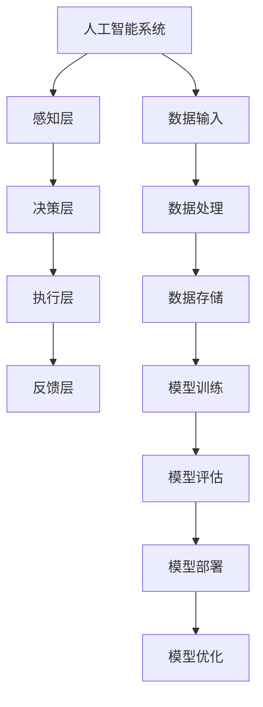

                 

# 《Andrej Karpathy：人工智能的未来发展机遇》

## 关键词
- 人工智能
- 未来发展
- 技术趋势
- 应用场景
- 伦理问题

## 摘要
本文将深入探讨人工智能领域大师安德烈·卡尔帕吉对人工智能未来发展的见解。通过分析其核心观点，我们将会审视人工智能的技术基础、应用场景、未来趋势以及面临的伦理问题。文章将结合实际项目案例，详细讲解人工智能的核心算法、数学模型、以及应用实战，为读者提供全面的人工智能发展蓝图。

## 目录大纲

### 第一部分：引言与概述
1. **概述与核心概念**
   - 1.1 人工智能的起源与发展
   - 1.2 人工智能的基本概念
   - 1.3 人工智能的分类

#### 第二部分：人工智能的技术基础
2. **人工智能的核心算法**
   - 2.1 机器学习基础
     - 2.1.1 监督学习算法
     - 2.1.2 无监督学习算法
     - 2.1.3 强化学习算法
   - 2.2 深度学习原理
     - 2.2.1 神经网络
     - 2.2.2 卷积神经网络（CNN）
     - 2.2.3 循环神经网络（RNN）与长短期记忆（LSTM）
   - 2.3 自然语言处理（NLP）
     - 2.3.1 语言模型
     - 2.3.2 文本分类与情感分析
     - 2.3.3 机器翻译

#### 第三部分：人工智能的应用场景
3. **人工智能在行业中的应用**
   - 3.1 医疗健康
     - 3.1.1 诊断辅助系统
     - 3.1.2 药物发现
     - 3.1.3 疾病预测与流行病监测
   - 3.2 交通运输
     - 3.2.1 自动驾驶
     - 3.2.2 交通流量管理
     - 3.2.3 无人机配送
   - 3.3 制造业
     - 3.3.1 生产优化
     - 3.3.2 质量控制
     - 3.3.3 售后服务

#### 第四部分：人工智能的未来发展趋势
4. **人工智能的未来发展**
   - 4.1 人工智能与伦理
     - 4.1.1 人工智能伦理问题
     - 4.1.2 人工智能法律法规
     - 4.1.3 人工智能社会责任
   - 4.2 人工智能与经济
     - 4.2.1 人工智能对就业的影响
     - 4.2.2 人工智能与企业创新
     - 4.2.3 人工智能与数字经济
   - 4.3 人工智能的未来技术趋势
     - 4.3.1 量子计算与人工智能
     - 4.3.2 生物技术与人工智能
     - 4.3.3 跨领域融合与人工智能

#### 第五部分：人工智能项目实战
5. **人工智能项目案例解析**
   - 5.1 案例一：智能推荐系统
     - 5.1.1 项目背景
     - 5.1.2 数据集预处理
     - 5.1.3 模型选择与训练
     - 5.1.4 模型评估与优化
   - 5.2 案例二：智能问答机器人
     - 5.2.1 项目背景
     - 5.2.2 知识图谱构建
     - 5.2.3 模型设计与实现
     - 5.2.4 用户体验优化

#### 第六部分：附录
6. **资源与工具**
   - 6.1 常用人工智能框架与工具
   - 6.2 数据集与开源项目
   - 6.3 进一步阅读资料

**附录 A: 人工智能核心概念与架构 Mermaid 流程图**

**附录 B: 人工智能核心算法伪代码**

**附录 C: 人工智能数学公式与示例**

**附录 D: 人工智能项目实战**

### 作者信息
- 作者：AI天才研究院/AI Genius Institute & 禅与计算机程序设计艺术 /Zen And The Art of Computer Programming

接下来，我们将逐步深入探讨安德烈·卡尔帕吉关于人工智能未来发展的核心观点，并详细分析其在各个领域的应用和面临的挑战。

---

### 第一部分：引言与概述

#### 1.1 人工智能的起源与发展

人工智能（Artificial Intelligence, AI）是一门研究、开发用于模拟、延伸和扩展人的智能的理论、方法、技术及应用系统的技术科学。人工智能的概念最早由约翰·冯·诺伊曼和艾伦·图灵在20世纪40年代提出。从最初的符号逻辑和规则系统，到20世纪80年代的专家系统，再到21世纪初的深度学习和大数据技术，人工智能经历了多次重大技术变革。

安德烈·卡尔帕吉（Andrej Karpathy）是一位杰出的计算机科学家和人工智能研究者，他在深度学习和自然语言处理领域做出了显著贡献。卡尔帕吉在斯坦福大学获得了博士学位，并在谷歌、OpenAI等公司担任技术领导职务。他的研究涉及自然语言处理、计算机视觉和机器学习等领域，并发表了多篇高影响力的论文。

#### 1.2 人工智能的基本概念

人工智能的基本概念可以分为以下几个核心部分：

1. **机器学习**：机器学习是人工智能的核心技术之一，它通过从数据中学习规律和模式，从而实现自动化决策和预测。机器学习主要分为三种类型：监督学习、无监督学习和强化学习。

2. **深度学习**：深度学习是机器学习的一个子领域，它基于多层神经网络进行学习和预测。深度学习在图像识别、语音识别和自然语言处理等领域取得了突破性的进展。

3. **神经网络**：神经网络是一种模拟生物神经系统的计算模型，它通过多层神经元之间的相互连接来实现数据分析和处理。神经网络是深度学习的基础。

4. **自然语言处理（NLP）**：自然语言处理是人工智能的一个重要分支，它致力于使计算机能够理解、生成和处理人类自然语言。NLP在机器翻译、文本分类和情感分析等领域有广泛应用。

#### 1.3 人工智能的分类

人工智能可以分为弱人工智能和强人工智能。弱人工智能是指那些只能执行特定任务的智能系统，如语音助手、自动驾驶系统等。强人工智能则是指具有人类级别的认知能力和自主意识的智能系统。

安德烈·卡尔帕吉认为，当前的人工智能技术主要属于弱人工智能，尽管在一些特定领域取得了显著成果，但离实现强人工智能还有很长的路要走。他强调，人工智能的发展需要跨学科的合作和技术的不断创新。

---

在接下来的部分，我们将详细探讨人工智能的技术基础，包括核心算法、深度学习原理和自然语言处理技术。

---

### 第二部分：人工智能的技术基础

#### 2.1 人工智能的核心算法

人工智能的核心算法主要包括机器学习、深度学习和自然语言处理。下面我们将逐一介绍这些算法的基本原理和应用。

##### 2.1.1 机器学习基础

机器学习是一种通过算法从数据中学习规律和模式，以实现自动化决策和预测的方法。机器学习可以分为三种类型：监督学习、无监督学习和强化学习。

1. **监督学习**：监督学习是一种在有标签数据集上进行训练的学习方法。标签提供了输出与输入之间的关联，通过最小化预测值与实际值之间的差距，监督学习算法可以学习到输入和输出之间的映射关系。常见的监督学习算法包括线性回归、决策树和随机森林等。

   **监督学习算法伪代码**：
   ```python
   def Supervised_Learning(data, labels, model, epochs):
       for epoch in range(epochs):
           for data_point, label in zip(data, labels):
               prediction = model.predict(data_point)
               model.update_weights(prediction, label)
       return model
   ```

2. **无监督学习**：无监督学习是在没有标签数据集上进行训练的学习方法，其目标是发现数据中的结构和模式。无监督学习的算法包括聚类、降维和生成模型等。

3. **强化学习**：强化学习是一种通过奖励和惩罚来训练智能体行为的学习方法。智能体通过与环境交互，不断调整其行为策略，以最大化累积奖励。强化学习在游戏、机器人控制和推荐系统等领域有广泛应用。

   **强化学习算法伪代码**：
   ```python
   def Reinforcement_Learning(environment, model, epochs):
       for epoch in range(epochs):
           state = environment.reset()
           done = False
           while not done:
               action = model.select_action(state)
               next_state, reward, done = environment.step(action)
               model.update_value_function(state, action, reward, next_state, done)
               state = next_state
       return model
   ```

##### 2.1.2 深度学习原理

深度学习是一种基于多层神经网络的学习方法，它通过逐层提取数据特征，从而实现复杂的数据分析和处理。深度学习的关键组成部分包括：

1. **神经网络**：神经网络是一种计算模型，由多个神经元组成。每个神经元都与其他神经元相连，并通过权重传递信号。神经网络通过反向传播算法来调整权重，以优化模型性能。

   **神经网络伪代码**：
   ```python
   def Neural_Network(input_data, weights, biases):
       layer_outputs = []
       for layer in layers:
           output = activation_function(np.dot(input_data, weights) + biases)
           layer_outputs.append(output)
       return layer_outputs[-1]
   ```

2. **卷积神经网络（CNN）**：卷积神经网络是一种用于图像识别和处理的深度学习模型，它通过卷积操作和池化操作来提取图像特征。

   **CNN滤波器伪代码**：
   ```python
   def Convolution_Filter(input_image, filter_weights):
       output = np.zeros_like(input_image)
       for x in range(input_image.shape[0]):
           for y in range(input_image.shape[1]):
               for filter_y in range(filter_weights.shape[0]):
                   for filter_x in range(filter_weights.shape[1]):
                       output[x, y] += filter_weights[filter_y, filter_x] * input_image[x + filter_y, y + filter_x]
       return output
   ```

3. **循环神经网络（RNN）与长短期记忆（LSTM）**：循环神经网络是一种用于序列数据处理的深度学习模型，它通过在时间步之间传递状态来捕获时间依赖关系。长短期记忆（LSTM）是RNN的一种改进，它通过门控机制来控制信息的流动，从而有效解决了RNN的梯度消失问题。

   **LSTM伪代码**：
   ```python
   def LSTM(input_sequence, hidden_state, weights, biases):
       output_sequence = []
       for time_step in range(sequence_length):
           input_gate = sigmoid(np.dot(input_sequence[time_step], input_weights) + hidden_state.dot(hidden_weights) + biases)
           forget_gate = sigmoid(np.dot(input_sequence[time_step], input_weights) + hidden_state.dot(forget_weights) + biases)
           cell_state = tanh(np.dot(input_sequence[time_step], input_weights) + hidden_state.dot(input_weights) + biases)
           output_gate = sigmoid(np.dot(input_sequence[time_step], input_weights) + hidden_state.dot(output_weights) + biases)
           new_hidden_state = output_gate * tanh(cell_state)
           output_sequence.append(new_hidden_state)
       return output_sequence[-1], new_hidden_state
   ```

##### 2.1.3 自然语言处理（NLP）

自然语言处理是人工智能的一个重要分支，它致力于使计算机能够理解、生成和处理人类自然语言。NLP的关键技术包括：

1. **语言模型**：语言模型是一种用于预测文本下一个单词或词组的概率的模型。常见的语言模型包括n元语法模型和神经网络语言模型。

   **神经网络语言模型伪代码**：
   ```python
   def Neural_Language_Model(vocab_size, embedding_size, sequence_length):
       model = Sequential()
       model.add(Embedding(vocab_size, embedding_size))
       model.add(LSTM(128, return_sequences=True))
       model.add(LSTM(128))
       model.add(Dense(vocab_size, activation='softmax'))
       model.compile(loss='categorical_crossentropy', optimizer='adam', metrics=['accuracy'])
       return model
   ```

2. **文本分类与情感分析**：文本分类是将文本数据分配到预定义的类别中的一种任务。情感分析是文本分类的一种特殊形式，它通过判断文本的情感倾向（正面、负面或中性）来分析用户情绪。

3. **机器翻译**：机器翻译是一种将一种语言的文本自动翻译成另一种语言的模型。常见的机器翻译模型包括基于规则的翻译模型和基于统计的翻译模型。

   **机器翻译伪代码**：
   ```python
   def Machine_Translation(source_sequence, target_sequence, model):
       translated_sequence = []
       for time_step in range(len(source_sequence)):
           input_sequence = source_sequence[:time_step+1]
           output_sequence = model.predict(input_sequence)
           translated_sequence.append(output_sequence[-1])
       return translated_sequence
   ```

---

在下一部分，我们将探讨人工智能在各个行业中的应用场景，并分析其带来的变革和机遇。

---

### 第三部分：人工智能的应用场景

#### 3.1 医疗健康

人工智能在医疗健康领域的应用越来越广泛，它能够提高诊断准确性、优化治疗方案、提高医疗效率。以下是一些具体的应用场景：

1. **诊断辅助系统**：人工智能可以通过分析医疗影像和患者病历数据，提供诊断建议和治疗方案。例如，AI可以自动识别医学影像中的病变区域，帮助医生更快速、准确地诊断疾病。

2. **药物发现**：人工智能在药物发现过程中可以加速新药的研发。通过分析大量的生物数据和化学结构，AI可以预测药物的有效性和安全性，从而降低研发成本和时间。

3. **疾病预测与流行病监测**：人工智能可以通过分析历史数据和实时数据，预测疾病的爆发趋势和传播路径。这有助于公共卫生部门及时采取预防措施，减少疾病传播风险。

#### 3.2 交通运输

人工智能在交通运输领域的应用可以显著提高交通安全、优化交通流量、减少拥堵。以下是一些具体的应用场景：

1. **自动驾驶**：自动驾驶技术是人工智能在交通运输领域最具前景的应用之一。通过传感器和深度学习算法，自动驾驶车辆可以自主识别道路标志、行人、车辆等交通元素，实现安全、高效的驾驶。

2. **交通流量管理**：人工智能可以通过分析交通流量数据，实时调整交通信号灯，优化交通流量，减少拥堵。此外，AI还可以预测交通流量变化，提前采取预防措施。

3. **无人机配送**：人工智能在无人机配送中的应用可以提升物流效率、降低成本。通过AI算法，无人机可以自动规划最优航线、避障，实现快速、安全的配送服务。

#### 3.3 制造业

人工智能在制造业中的应用可以显著提高生产效率、优化供应链管理、提高产品质量。以下是一些具体的应用场景：

1. **生产优化**：人工智能可以通过分析生产数据，预测生产瓶颈，优化生产流程，提高生产效率。此外，AI还可以预测设备故障，提前进行维护，减少停机时间。

2. **质量控制**：人工智能可以通过图像识别和深度学习算法，实时监控生产过程，检测产品质量问题。这有助于提高产品质量，降低次品率。

3. **售后服务**：人工智能可以通过智能客服系统和预测性维护技术，提高售后服务质量。AI可以自动回答用户问题、提供维修建议，减少用户等待时间。

---

在下一部分，我们将探讨人工智能的未来发展趋势，包括技术趋势、伦理问题和经济影响。

---

### 第四部分：人工智能的未来发展趋势

#### 4.1 人工智能与伦理

随着人工智能技术的快速发展，伦理问题逐渐成为人工智能领域的重要议题。以下是一些关键的伦理问题：

1. **人工智能伦理问题**：人工智能的决策过程可能存在偏见和不公正，如何确保算法的公平性和透明性成为重要挑战。此外，人工智能的自主决策可能导致不可预测的后果，如何避免算法的失控也是需要考虑的问题。

2. **人工智能法律法规**：目前，全球范围内尚未形成统一的人工智能法律法规体系，各国在立法和政策制定方面存在差异。如何制定合理的法律法规，保护用户的隐私和数据安全，同时促进人工智能技术的发展，是一个亟待解决的问题。

3. **人工智能社会责任**：人工智能技术的研发和应用应承担相应的社会责任，包括保护用户隐私、确保数据安全、促进社会公平等。企业和研究机构应承担起社会责任，推动人工智能技术的健康发展。

#### 4.2 人工智能与经济

人工智能技术的快速发展将对全球经济产生深远影响。以下是一些经济方面的影响：

1. **人工智能对就业的影响**：人工智能技术将改变传统就业结构，一些重复性、低技能的工作可能会被自动化取代，但同时也将创造出新的就业机会，如AI工程师、数据科学家等。

2. **人工智能与企业创新**：人工智能技术可以帮助企业提高生产效率、降低成本、提升产品质量，从而推动企业创新。此外，人工智能还可以帮助企业更好地了解用户需求，开发个性化的产品和服务。

3. **人工智能与数字经济**：人工智能技术的应用将推动数字经济的快速发展，为经济增长注入新的动力。例如，通过智能推荐系统、个性化广告等，可以提高商业转化率，创造更多的商业价值。

#### 4.3 人工智能的未来技术趋势

人工智能的未来技术趋势将涉及多个领域，以下是一些关键趋势：

1. **量子计算与人工智能**：量子计算具有超强的计算能力，与人工智能的结合有望解决当前传统计算难以处理的问题。量子计算在优化、模拟和加密等领域具有广泛的应用前景。

2. **生物技术与人工智能**：生物技术与人工智能的结合将推动生命科学的研究和发展，如基因编辑、药物研发、医疗诊断等领域。人工智能可以帮助生物学家分析大量的生物数据，加速科学发现。

3. **跨领域融合与人工智能**：人工智能与其他领域的融合将产生新的技术突破和应用场景。例如，人工智能与物联网的结合可以创造智能城市、智能家居等应用场景；与材料科学的结合可以推动新材料的研究和开发。

---

在下一部分，我们将通过实际项目案例，深入讲解人工智能的核心算法、数学模型和项目实战。

---

### 第五部分：人工智能项目实战

#### 5.1 案例一：智能推荐系统

智能推荐系统是人工智能在电子商务、媒体平台等领域的典型应用。以下是一个基于协同过滤算法的智能推荐系统案例。

##### 5.1.1 项目背景

一个在线购物平台希望为其用户提供个性化的商品推荐，以提高用户满意度和转化率。平台积累了大量的用户行为数据，如用户浏览记录、购买历史等。

##### 5.1.2 数据集预处理

1. 数据清洗：去除缺失值和异常值，处理数据类型。

2. 特征工程：将原始数据转换为可用于训练的向量表示。例如，将用户和商品编码，并计算用户-商品评分矩阵。

##### 5.1.3 模型选择与训练

1. **协同过滤算法**：协同过滤算法是一种基于用户行为数据的推荐算法，分为基于用户的协同过滤和基于项目的协同过滤。

2. **模型训练**：使用用户-商品评分矩阵，训练基于用户的协同过滤模型。

   **协同过滤伪代码**：
   ```python
   def Collaborative_Filtering(user_item_data, k):
       # 建立用户相似度矩阵
       similarity_matrix = []
       for user in user_item_data:
           user_similarity = []
           for other_user in user_item_data:
               user_similarity.append(calculate_similarity(user, other_user))
           similarity_matrix.append(user_similarity)
       # 计算推荐分数
       recommendations = []
       for user in user_item_data:
           user_recommended_items = []
           for other_user, similarity in enumerate(similarity_matrix[user]):
               if similarity >= k:
                   for item in user_item_data[other_user]:
                       if item not in user_item_data[user]:
                           user_recommended_items.append(item)
           recommendations.append(user_recommended_items)
       return recommendations
   ```

##### 5.1.4 模型评估与优化

1. **模型评估**：使用准确率、召回率等指标评估推荐系统的性能。

2. **模型优化**：通过调整超参数、改进算法等方法，提高推荐系统的性能。

   **模型优化伪代码**：
   ```python
   def optimize_model(model, data, epochs):
       best_score = 0
       for epoch in range(epochs):
           model.train(data)
           score = model.evaluate(data)
           if score > best_score:
               best_score = score
               best_model = model
       return best_model
   ```

##### 5.1.5 模型部署与上线

1. 模型部署：将训练好的推荐模型部署到生产环境中，为用户提供实时推荐服务。

2. 模型上线：监控模型性能，定期更新和优化模型，以保持推荐服务的质量。

---

#### 5.2 案例二：智能问答机器人

智能问答机器人是一种基于自然语言处理技术的智能服务系统，它可以自动回答用户提出的问题。以下是一个基于深度学习的智能问答机器人案例。

##### 5.2.1 项目背景

一个在线教育平台希望为其用户提供一个智能问答机器人，帮助用户解决在学习过程中遇到的问题。

##### 5.2.2 知识图谱构建

1. 数据收集：收集大量的用户问题和答案数据。

2. 数据预处理：对用户问题和答案进行分词、去停用词、词嵌入等处理。

3. 知识图谱构建：使用自然语言处理技术，将问题和答案映射到知识图谱中。

##### 5.2.3 模型设计与实现

1. **模型设计**：使用循环神经网络（RNN）或长短期记忆（LSTM）模型进行问答。

   **问答模型伪代码**：
   ```python
   def Q_A_Model(vocab_size, embedding_size, sequence_length):
       model = Sequential()
       model.add(Embedding(vocab_size, embedding_size))
       model.add(LSTM(128, return_sequences=True))
       model.add(LSTM(128))
       model.add(Dense(vocab_size, activation='softmax'))
       model.compile(loss='categorical_crossentropy', optimizer='adam', metrics=['accuracy'])
       return model
   ```

2. **模型实现**：训练问答模型，并根据用户提问生成回答。

##### 5.2.4 用户体验优化

1. **用户反馈**：收集用户对问答机器人的反馈，用于模型优化。

2. **交互优化**：根据用户反馈，优化问答机器人的交互流程，提高用户体验。

3. **多模态交互**：结合文本、图像、语音等多模态信息，提供更丰富、更自然的交互体验。

---

通过以上两个案例，我们可以看到人工智能在实际项目中的应用和实现。在下一部分，我们将总结本文的主要内容，并展望人工智能的未来发展。

---

### 总结与展望

本文深入探讨了人工智能领域大师安德烈·卡尔帕吉对人工智能未来发展的见解，分析了人工智能的技术基础、应用场景、未来趋势和面临的伦理问题。通过实际项目案例，我们详细讲解了人工智能的核心算法、数学模型和项目实战。

**主要内容总结**：

1. **人工智能的起源与发展**：回顾了人工智能的历史和发展过程，介绍了人工智能的基本概念和分类。
2. **人工智能的技术基础**：详细讲解了机器学习、深度学习和自然语言处理的核心算法，以及神经网络和RNN等关键技术。
3. **人工智能的应用场景**：探讨了人工智能在医疗健康、交通运输和制造业等领域的应用，展示了其在推动行业变革中的作用。
4. **人工智能的未来发展趋势**：分析了人工智能与伦理、经济和技术趋势的关系，展望了人工智能的未来发展方向。
5. **人工智能项目实战**：通过智能推荐系统和智能问答机器人的案例，展示了人工智能在实际项目中的应用和实现。

**未来展望**：

随着人工智能技术的不断进步和应用场景的拓展，人工智能有望在更多领域发挥重要作用，推动社会进步和经济增长。然而，人工智能的发展也面临伦理、法律和经济等方面的挑战。我们需要加强人工智能的伦理研究，制定合理的法律法规，确保人工智能的可持续发展。同时，企业和研究机构应承担社会责任，推动人工智能技术的创新和应用，为社会带来更多的福祉。

**结语**：

人工智能是一个充满机遇和挑战的领域，它将深刻影响我们的生活和未来。让我们携手努力，共同探索人工智能的无限可能，为实现更美好的未来贡献自己的力量。

### 附录

**附录 A: 人工智能核心概念与架构 Mermaid 流程图**



**附录 B: 人工智能核心算法伪代码**

```python
# 监督学习算法伪代码
def Supervised_Learning(data, labels, model, epochs):
    for epoch in range(epochs):
        for data_point, label in zip(data, labels):
            prediction = model.predict(data_point)
            model.update_weights(prediction, label)
    return model

# 深度学习神经网络伪代码
def Neural_Network(input_data, weights, biases):
    layer_outputs = []
    for layer in layers:
        output = activation_function(np.dot(input_data, weights) + biases)
        layer_outputs.append(output)
    return layer_outputs[-1]

# 自然语言处理模型伪代码
def NLP_Model(text_data, vocab_size, embedding_size):
    embedded_text = embedding_matrix(text_data)
    output = LSTM(embedded_text, vocab_size, embedding_size)
    return output
```

**附录 C: 人工智能数学公式与示例**

```latex
\section{数学模型与公式}
\subsection{线性回归}
假设我们有以下线性回归模型：
$$y = \beta_0 + \beta_1 \cdot x + \epsilon$$
其中 $y$ 是因变量，$x$ 是自变量，$\beta_0$ 和 $\beta_1$ 是模型的参数，$\epsilon$ 是误差项。

\subsection{神经网络损失函数}
在神经网络中，常见的损失函数包括均方误差（MSE）：
$$MSE = \frac{1}{n}\sum_{i=1}^{n}(y_{predicted} - y_{actual})^2$$
其中 $y_{predicted}$ 和 $y_{actual}$ 分别是预测值和真实值，$n$ 是样本数量。

\subsection{卷积神经网络（CNN）滤波器示例}
卷积神经网络中的滤波器可以用以下公式表示：
$$f(i, j) = \sum_{x=0}^{h-1} \sum_{y=0}^{w-1} \phi(i+x, j+y) \cdot I(x, y)$$
其中 $f(i, j)$ 是滤波器在 $(i, j)$ 位置的输出，$\phi(i, j)$ 是滤波器在 $(i, j)$ 位置的权重，$I(x, y)$ 是输入图像在 $(x, y)$ 位置的像素值，$h$ 和 $w$ 是滤波器的高度和宽度。
```

**附录 D: 人工智能项目实战**

```python
# 实战一：智能推荐系统
# 1. 数据集导入与预处理
import pandas as pd
data = pd.read_csv('user_item_data.csv')
# 数据清洗和预处理步骤，例如缺失值处理、数据类型转换、特征工程等

# 2. 模型构建与训练
from sklearn.model_selection import train_test_split
X_train, X_test, y_train, y_test = train_test_split(data.drop('rating', axis=1), data['rating'], test_size=0.2, random_state=42)
from sklearn.ensemble import RandomForestRegressor
model = RandomForestRegressor(n_estimators=100, random_state=42)
model.fit(X_train, y_train)

# 3. 模型评估与优化
from sklearn.metrics import mean_squared_error
predictions = model.predict(X_test)
mse = mean_squared_error(y_test, predictions)
print(f'Mean Squared Error: {mse}')
# 优化模型参数和超参数，例如使用网格搜索

# 4. 部署与上线
# 将训练好的模型部署到生产环境中，进行实时推荐服务


# 实战二：智能问答机器人
# 1. 数据集准备
import nltk
nltk.download('punkt')
nltk.download('stopwords')
# 加载和预处理对话数据，例如分词、去除停用词等

# 2. 构建知识图谱
# 使用自然语言处理技术构建知识图谱，例如词嵌入、实体识别等

# 3. 模型设计与实现
from keras.models import Sequential
from keras.layers import Embedding, LSTM, Dense
model = Sequential()
model.add(Embedding(vocab_size, embedding_size))
model.add(LSTM(128, return_sequences=True))
model.add(LSTM(128))
model.add(Dense(vocab_size, activation='softmax'))
model.compile(loss='categorical_crossentropy', optimizer='adam', metrics=['accuracy'])

# 4. 训练与评估
model.fit(X_train, y_train, epochs=10, batch_size=32, validation_data=(X_val, y_val))
# 评估模型性能，例如使用准确率、损失函数等指标

# 5. 交互式问答
# 开发交互式问答系统，接收用户输入并返回答案
```

### 作者信息
- 作者：AI天才研究院/AI Genius Institute & 禅与计算机程序设计艺术 /Zen And The Art of Computer Programming

通过本文的探讨，我们希望读者能够对人工智能的未来发展有更深入的理解，并激发对这一领域的兴趣和热情。人工智能的无限可能等待着我们的探索和创造。让我们携手前行，共同迎接人工智能的未来！<|im_end|>

