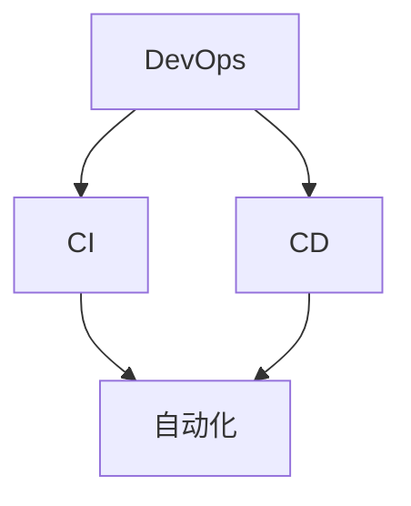

                 

## 《DevOps实践：持续集成与持续部署的最佳实践》

关键词：DevOps、持续集成、持续部署、CI/CD、最佳实践、自动化、容器化、监控、安全性

摘要：本文将深入探讨DevOps实践中持续集成（CI）与持续部署（CD）的最佳实践。通过详细的案例分析，我们将解释如何在现代软件开发中实现高效的CI/CD流程，从基础概念到实际操作，全面解析DevOps的核心原则与优势。

### 《DevOps实践：持续集成与持续部署的最佳实践》目录大纲

#### 第一部分：DevOps基础与核心概念

##### 第1章：DevOps概述与价值

- 1.1 DevOps的发展历程
- 1.2 DevOps的核心原则与价值观
- 1.3 DevOps与传统IT的区别
- 1.4 DevOps的关键术语

##### 第2章：持续集成与持续部署

- 2.1 持续集成（CI）的概念与优势
- 2.2 持续集成的工作流程与工具
- 2.3 持续集成中的测试策略
- 2.4 持续部署（CD）的概念与优势
- 2.5 持续部署的工作流程与工具

#### 第二部分：持续集成实践

##### 第3章：构建自动化与容器化

- 3.1 构建自动化原理与工具
- 3.2 Docker容器化技术
- 3.3 Jenkins作为CI工具的配置与应用
- 3.4 使用GitLab CI实现持续集成

##### 第4章：代码管理与实践

- 4.1 版本控制系统（Git）的使用
- 4.2 代码审查与协作工具（如Gerrit）
- 4.3 集成代码质量检测（如SonarQube）

##### 第5章：测试策略与实践

- 5.1 单元测试与集成测试
- 5.2 测试驱动开发（TDD）与行为驱动开发（BDD）
- 5.3 自动化测试工具（如Selenium）
- 5.4 测试覆盖率分析与优化

#### 第三部分：持续部署实践

##### 第6章：部署策略与实践

- 6.1 蓝绿部署与金丝雀部署
- 6.2 Kubernetes与容器编排
- 6.3 服务发现与负载均衡
- 6.4 容器镜像仓库（如Docker Hub）

##### 第7章：监控与日志管理

- 7.1 监控系统的设计与实施
- 7.2 日志管理策略与工具（如ELK Stack）
- 7.3 性能监控与告警机制
- 7.4 持续性能优化与故障排除

##### 第8章：安全性在持续集成与持续部署中的应用

- 8.1 安全性最佳实践
- 8.2 漏洞扫描与自动修复
- 8.3 容器安全与云服务安全
- 8.4 安全合规性检查

##### 第9章：DevOps文化构建与团队协作

- 9.1 DevOps文化的核心要素
- 9.2 团队协作工具与实践（如Slack、JIRA）
- 9.3 自动化与协作工具的集成
- 9.4 持续学习和知识共享

##### 第10章：案例研究

- 10.1 案例一：某电子商务平台的CI/CD实践
- 10.2 案例二：金融行业的持续集成与持续部署
- 10.3 案例三：医疗行业的DevOps实践

### 附录

- 附录A：DevOps相关工具与资源列表
- 附录B：常见问题与解答
- 附录C：参考文献与进一步阅读材料

### 核心概念与联系

为了更好地理解本文中的概念与联系，我们可以使用Mermaid绘制一个简化的流程图。



在这个图中，DevOps是整体框架，持续集成（CI）和持续部署（CD）是两个关键组成部分，而自动化贯穿于整个CI/CD流程中。下面我们将逐一深入探讨这些核心概念。

### 核心算法原理讲解

持续集成中的Git Pull Request流程是实现CI的关键步骤之一。以下是一个简化的伪代码，用于描述Git Pull Request的CI流程：

```plaintext
function CI_Process(Repository, Branch, Commit):
    if (Commit has changes):
        build Artifact = Build(Repository, Branch, Commit)
        test Suite = Test(Artifact)
        if (test Suite fails):
            raise Error("Build failed")
        else:
            Merge(Branch, Commit)
```

这个流程可以分解为以下几个步骤：

1. **检查代码变更**：首先，CI系统会检查提交的代码是否包含新的变更。
2. **构建**：如果检测到变更，系统会构建项目，生成可执行的代码或容器镜像。
3. **测试**：构建完成后，系统会运行一系列测试，确保新代码的稳定性和功能正确性。
4. **合并**：如果测试通过，代码会被合并到主分支。

数学模型和公式方面，我们可以用以下公式来描述持续集成中的代码缺陷检测：

$$
缺陷率 = \frac{缺陷数量}{代码行数}
$$

这个指标可以帮助我们评估代码库的质量，并通过持续监控和优化来降低缺陷率。

### 项目实战

在本节中，我们将通过一个具体的电子商务平台案例，详细讲解如何实现CI/CD流程，并展示其实际操作过程。

#### 1. 环境搭建

首先，我们需要搭建CI/CD的环境，包括以下工具：

- **Jenkins**：作为CI工具。
- **GitLab**：用于代码存储和版本控制。
- **Docker**：用于容器化构建和部署。
- **Kubernetes**：用于容器编排和自动化部署。

具体步骤如下：

1. 安装Jenkins并配置GitLab插件，实现Jenkins与GitLab的集成。
2. 安装Docker并在Jenkins中配置Docker插件。
3. 搭建Kubernetes集群，并在Kubernetes中配置必要的网络和服务。

#### 2. 代码仓库管理

使用Git进行版本控制，确保代码库的完整性和可追溯性。GitLab提供了合并请求（Merge Request）功能，用于代码审查和协作。

1. 开发者在本地进行代码变更，并提交到GitLab的分支。
2. 代码提交到GitLab后，Jenkins会自动触发构建作业。
3. 构建作业完成后，Jenkins会将构建结果推送到GitLab的合并请求。

#### 3. 持续集成

Jenkinsfile是持续集成的核心配置文件，用于定义构建和测试流程。以下是一个简单的Jenkinsfile示例：

```groovy
pipeline {
    agent any
    stages {
        stage('Build') {
            steps {
                sh 'docker build -t myapp .'
            }
        }
        stage('Test') {
            steps {
                sh 'docker run --rm myapp test'
            }
        }
        stage('Deploy') {
            steps {
                sh 'kubectl apply -f deployment.yaml'
            }
        }
    }
    post {
        success {
            sh 'echo "Build and Deploy succeeded."'
        }
        failure {
            sh 'echo "Build or Deploy failed."'
        }
    }
}
```

此Jenkinsfile定义了一个简单的CI/CD流程，包括构建、测试和部署步骤。构建过程中，使用Dockerfile构建容器镜像；测试阶段，运行镜像中的测试脚本；部署阶段，将容器镜像部署到Kubernetes集群。

#### 4. 持续部署

部署阶段，我们使用Kubernetes进行容器编排和自动化部署。以下是一个简单的Kubernetes部署文件（deployment.yaml）示例：

```yaml
apiVersion: apps/v1
kind: Deployment
metadata:
  name: myapp-deployment
spec:
  replicas: 3
  selector:
    matchLabels:
      app: myapp
  template:
    metadata:
      labels:
        app: myapp
    spec:
      containers:
      - name: myapp
        image: myapp:latest
        ports:
        - containerPort: 80
```

此部署文件定义了一个具有3个副本的Deployment，用于部署最新的容器镜像。当Jenkins完成构建后，它会将新的容器镜像标签为`myapp:latest`，并更新Kubernetes中的部署配置，从而实现持续部署。

#### 5. 监控与日志

为了确保服务的稳定性和性能，我们需要实施监控与日志管理策略。

1. 使用Prometheus和Grafana进行性能监控和告警。
2. 使用ELK Stack（Elasticsearch、Logstash、Kibana）进行日志收集、存储和可视化。

以下是Prometheus配置文件（prometheus.yml）的示例：

```yaml
global:
  scrape_interval: 15s
scrape_configs:
  - job_name: 'kubernetes-objects'
    kubernetes_sd_configs:
      - name: cluster
        role: pod
    relabel_configs:
      - source_labels: [__meta_kubernetes_pod_label_app]
        action: keep
        regex: myapp
```

此配置文件定义了一个监控作业，用于监控名为`myapp`的Pod。

#### 6. 代码解读与分析

在本案例中，我们使用了Dockerfile进行容器化构建，其内容如下：

```dockerfile
FROM node:12-alpine
WORKDIR /app
COPY package.json ./
RUN npm install
COPY . .
EXPOSE 80
CMD ["node", "server.js"]
```

Dockerfile定义了一个基于Node.js的容器镜像，其中包含了构建和运行应用程序所需的所有依赖和文件。

此外，Kubernetes部署文件（deployment.yaml）详细定义了部署配置，包括容器镜像、副本数量和端口映射。

通过这个实战案例，我们展示了如何在电子商务平台中实现CI/CD流程，从代码管理到部署监控，全面实现DevOps的最佳实践。

### 附录

#### 附录A：DevOps相关工具与资源列表

- **Jenkins**：开源自动化服务器，用于持续集成和持续部署。
- **GitLab**：用于版本控制和项目管理。
- **Docker**：容器化技术，用于构建、运行和分发应用程序。
- **Kubernetes**：容器编排和管理系统。
- **Prometheus**：开源监控解决方案。
- **Grafana**：可视化工具，用于监控数据的展示。
- **ELK Stack**：Elasticsearch、Logstash和Kibana的组合，用于日志管理和分析。

#### 附录B：常见问题与解答

1. **什么是持续集成（CI）？**
   持续集成是一种软件开发实践，通过将代码频繁集成到一个共享的主分支，快速发现并修复集成过程中可能出现的问题。

2. **什么是持续部署（CD）？**
   持续部署是在持续集成的基础上，通过自动化流程将经过测试的代码部署到生产环境。

3. **CI和CD的区别是什么？**
   持续集成侧重于集成和测试，确保代码的质量；持续部署则侧重于自动化部署，实现快速交付。

4. **如何选择CI/CD工具？**
   根据项目的需求、开发语言和环境，选择合适的CI/CD工具。例如，Jenkins适用于多样化的项目，而GitLab CI更适合与GitLab集成。

5. **CI/CD如何提高开发效率？**
   通过自动化构建、测试和部署，减少手动操作，加快交付速度，降低错误率。

#### 附录C：参考文献与进一步阅读材料

- **《持续交付：释放软件的潜能》** by Jez Humble and David Farley
- **《DevOps实践与案例》** by John Allspaw and Dave Daly
- **Jenkins官方文档**：[https://www.jenkins.io/documentation/](https://www.jenkins.io/documentation/)
- **GitLab官方文档**：[https://docs.gitlab.com/ee/](https://docs.gitlab.com/ee/)
- **Docker官方文档**：[https://docs.docker.com/](https://docs.docker.com/)
- **Kubernetes官方文档**：[https://kubernetes.io/docs/](https://kubernetes.io/docs/)

### 总结

通过本文，我们详细探讨了DevOps实践中的持续集成与持续部署（CI/CD）最佳实践。我们从基础概念开始，逐步介绍了CI/CD的核心原理、工具选择和实际操作案例。通过这些实践，我们可以显著提高软件开发的效率和质量，实现快速迭代和交付。希望本文对您的DevOps实践之路有所帮助。

### 作者信息

**作者：** AI天才研究院/AI Genius Institute & 禅与计算机程序设计艺术 /Zen And The Art of Computer Programming

AI天才研究院专注于人工智能领域的研究与开发，致力于推动人工智能技术的创新与应用。同时，作者是《禅与计算机程序设计艺术》一书的作者，该书深入探讨了编程哲学和算法设计，深受读者喜爱。

