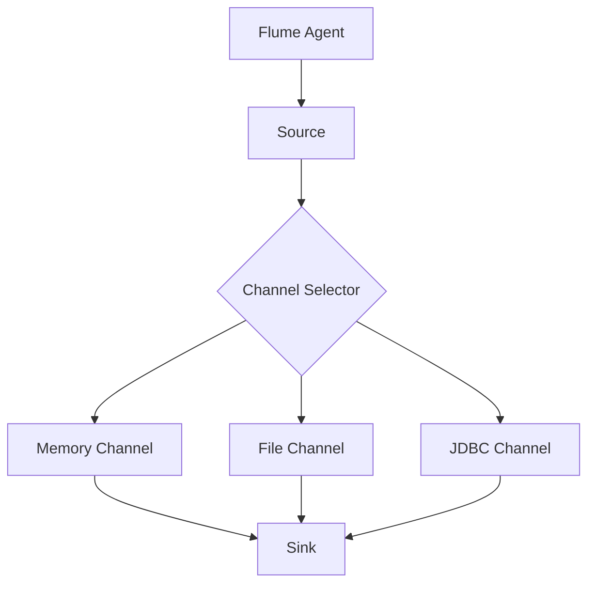
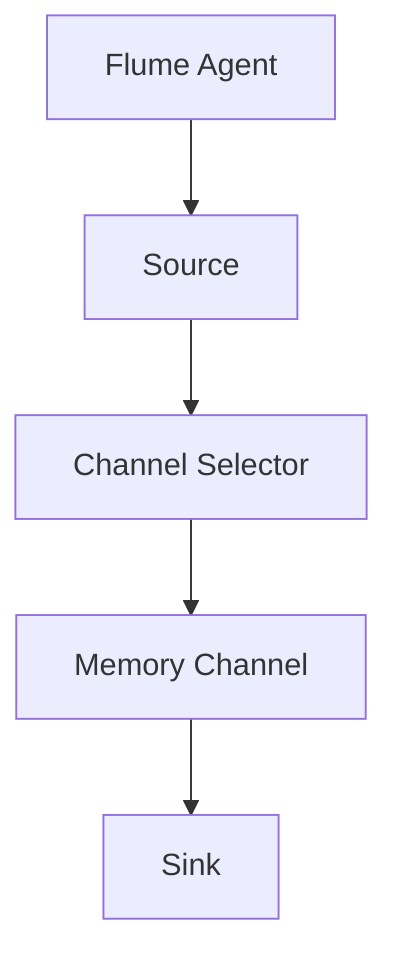
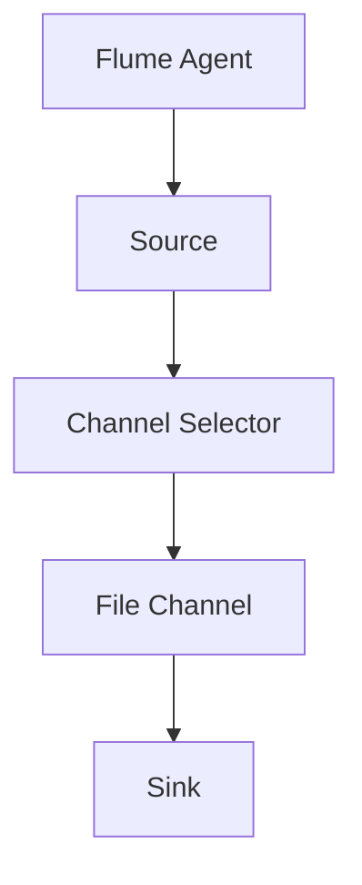

                 

# 《Flume Channel原理与代码实例讲解》

## 摘要

本文深入探讨了Flume Channel的原理、架构、设计模式、配置优化以及代码实例。Flume Channel是Apache Flume中的一个核心概念，它负责在数据流处理过程中存储和缓冲数据。本文首先介绍了Flume的基本概念和其在数据处理中的角色，然后详细解析了Flume Channel的架构和原理。接着，本文探讨了不同的Channel设计模式，包括Memory Channel、File Channel和JDBC Channel。随后，文章讲解了如何配置和优化Flume Channel，以实现高效的性能。此外，本文通过代码实例，详细展示了Flume Channel的实际应用，并进行了性能分析和问题解决方案。最后，文章对Flume Channel的未来发展进行了展望，并提供了相关的资源与附录。

## 目录

### 《Flume Channel原理与代码实例讲解》目录

1. **第一部分：Flume Channel基础**
    1. **第1章：Flume概述**
        1. 1.1 Flume简介
        2. 1.2 Flume的发展历程
        3. 1.3 Flume在数据处理中的角色
    2. **第2章：Flume Channel架构与原理**
        1. 2.1 Flume Channel架构概述
        2. 2.2 Flume Channel的工作原理
        3. 2.3 Flume Channel的核心组件
    3. **第3章：Flume Channel设计模式**
        1. 3.1 Channel设计模式概述
        2. 3.2 Memory Channel的工作原理
        3. 3.3 File Channel的工作原理
        4. 3.4 JDBC Channel的工作原理
    4. **第4章：Flume Channel配置与优化**
        1. 4.1 Flume Channel配置参数
        2. 4.2 Flume Channel性能优化

2. **第二部分：Flume Channel代码实例讲解**
    5. **第5章：Flume Channel代码实例**
        1. 5.1 代码实例概述
        2. 5.2 代码实例实现流程
        3. 5.3 代码详细解读
    6. **第6章：Flume Channel性能分析**
        1. 6.1 性能分析工具介绍
        2. 6.2 性能分析指标
        3. 6.3 性能优化策略
    7. **第7章：Flume Channel常见问题与解决方案**
        1. 7.1 Channel故障排查
        2. 7.2 Channel性能瓶颈分析
        3. 7.3 Channel问题解决方案
    8. **第8章：Flume Channel实战案例**
        1. 8.1 实战案例概述
        2. 8.2 实战案例环境搭建
        3. 8.3 实战案例详细解析
    9. **第9章：Flume Channel未来展望**
        1. 9.1 Flume Channel的发展趋势
        2. 9.2 Flume Channel的潜在应用领域
        3. 9.3 Flume Channel的改进方向

3. **附录**
    10. **附录A：Flume Channel相关资源**
        1. 10.1 Flume官方文档
        2. 10.2 Flume社区资源
        3. 10.3 Flume Channel扩展资源
    11. **附录B：Flume Channel Mermaid流程图**
        1. 11.1 Flume Channel架构图
        2. 11.2 Memory Channel流程图
        3. 11.3 File Channel流程图
        4. 11.4 JDBC Channel流程图
    12. **附录C：核心算法与数学模型**
        1. 12.1 Flume Channel核心算法原理
        2. 12.2 数学模型与公式
        3. 12.3 核心算法伪代码
    13. **附录D：代码实例与解读**
        1. 13.1 代码实例环境搭建
        2. 13.2 代码实例详细实现
        3. 13.3 代码解读与分析

<sup>*</sup>本文将分多个部分逐步展开，每一个部分都会深入解析Flume Channel的各个层面，帮助读者全面理解其在数据处理中的重要作用。

## 第一部分：Flume Channel基础

### 第1章：Flume概述

#### 1.1 Flume简介

Flume是一个分布式、可靠且可用的服务，用于有效地收集、聚合和移动大量日志数据。它是Apache Software Foundation的一个开源项目，主要针对大规模分布式系统的日志聚合需求。Flume的设计目标是提供高效、可靠和可扩展的日志收集解决方案，能够适应各种规模和复杂度的环境。

Flume的工作流程包括三个主要组件：Agent、Source、Sink。Agent是Flume的核心组件，负责数据流的收集、聚合和传输。Source是数据的入口，负责从各种数据源（如日志文件、JMS消息队列等）获取数据。Sink是数据的出口，负责将数据发送到目的地（如HDFS、HBase等）。

#### 1.2 Flume的发展历程

Flume的发展历程可以追溯到2007年，当时它是由Cloudera公司的几位工程师为了解决日志收集问题而创建的。最初的Flume版本是Flume 0.9.0，它提供了基本的日志收集功能。随着时间的推移，Flume不断迭代和改进，增加了许多新功能，如支持多种数据源和目的地、高效的内存管理、故障恢复机制等。

2011年，Flume正式加入Apache Software Foundation，成为了一个开源项目。此后，Flume得到了广泛的关注和应用，成为分布式日志收集领域的领先解决方案。

#### 1.3 Flume在数据处理中的角色

在数据处理过程中，Flume扮演着至关重要的角色。首先，Flume负责收集分布式系统中的日志数据，并将其聚合到一个统一的存储系统中。这使得数据分析师和开发人员能够轻松地访问和处理这些日志数据，从而进行监控、分析和优化。

其次，Flume提供了高效、可靠的数据传输机制。通过使用Agent、Source和Sink组件，Flume能够确保数据在传输过程中的完整性和可靠性。即使网络中断或数据源出现故障，Flume也能自动恢复并继续传输数据。

最后，Flume具有高度的可扩展性和灵活性。通过配置不同的Source和Sink，Flume可以适应各种不同的数据处理场景。此外，Flume还支持多种数据格式，如JSON、XML、Avro等，使得数据处理过程更加便捷和高效。

### 第2章：Flume Channel架构与原理

#### 2.1 Flume Channel架构概述

Flume Channel是Flume架构中的一个重要组成部分，负责在数据流处理过程中存储和缓冲数据。Channel的主要作用是确保数据在传输过程中的可靠性和稳定性。Flume Channel的架构由以下核心组件组成：

1. **Channel Selector**：Channel Selector是Channel的入口组件，负责根据配置规则选择合适的数据通道。
2. **Channel**：Channel是实际的数据存储和缓冲组件，可以持久化或临时存储数据。
3. **Channel Agent**：Channel Agent是Channel的运行实体，负责管理Channel的创建、启动和关闭。

#### 2.2 Flume Channel的工作原理

Flume Channel的工作原理可以分为以下几个步骤：

1. **数据收集**：Flume Agent从数据源（如日志文件、JMS消息队列等）收集数据，并将其发送到Channel。
2. **数据缓冲**：Channel接收Agent发送的数据，并将其缓冲在内存或磁盘上，以供后续处理。
3. **数据传输**：当Channel中的数据达到一定阈值或达到超时时间时，Flume Agent会从Channel中取出数据，并将其发送到Sink。
4. **数据持久化**：如果Channel是持久化的，则数据会保存在磁盘上，以备后续使用。否则，数据仅在内存中存储。

#### 2.3 Flume Channel的核心组件

Flume Channel的核心组件包括：

1. **Memory Channel**：Memory Channel是一种基于内存的数据通道，适用于小规模和临时数据存储。其主要优点是快速、高效，但数据易丢失。
2. **File Channel**：File Channel是一种基于文件系统的数据通道，适用于大规模和持久化数据存储。其主要优点是可靠、稳定，但性能相对较低。
3. **JDBC Channel**：JDBC Channel是一种基于关系型数据库的数据通道，适用于复杂的数据处理场景。其主要优点是高度可扩展和可定制，但性能和可靠性相对较低。

### 第3章：Flume Channel设计模式

#### 3.1 Channel设计模式概述

Flume Channel的设计模式是指如何选择和配置Channel以适应不同的数据处理场景。常见的Channel设计模式包括Memory Channel、File Channel和JDBC Channel。

#### 3.2 Memory Channel的工作原理

Memory Channel是一种基于内存的数据通道，适用于小规模和临时数据存储。其工作原理如下：

1. **数据收集**：Flume Agent从数据源收集数据，并将其发送到Memory Channel。
2. **数据缓冲**：Memory Channel接收Agent发送的数据，并将其存储在内存中，以供后续处理。
3. **数据传输**：当Memory Channel中的数据达到一定阈值或达到超时时间时，Flume Agent会从Memory Channel中取出数据，并将其发送到Sink。
4. **数据持久化**：由于Memory Channel是基于内存的，数据不会持久化存储。

#### 3.3 File Channel的工作原理

File Channel是一种基于文件系统的数据通道，适用于大规模和持久化数据存储。其工作原理如下：

1. **数据收集**：Flume Agent从数据源收集数据，并将其发送到File Channel。
2. **数据缓冲**：File Channel接收Agent发送的数据，并将其存储在磁盘上，以供后续处理。
3. **数据传输**：当File Channel中的数据达到一定阈值或达到超时时间时，Flume Agent会从File Channel中取出数据，并将其发送到Sink。
4. **数据持久化**：由于File Channel是基于文件系统的，数据会持久化存储在磁盘上。

#### 3.4 JDBC Channel的工作原理

JDBC Channel是一种基于关系型数据库的数据通道，适用于复杂的数据处理场景。其工作原理如下：

1. **数据收集**：Flume Agent从数据源收集数据，并将其发送到JDBC Channel。
2. **数据缓冲**：JDBC Channel接收Agent发送的数据，并将其存储在关系型数据库中，以供后续处理。
3. **数据传输**：当JDBC Channel中的数据达到一定阈值或达到超时时间时，Flume Agent会从JDBC Channel中取出数据，并将其发送到Sink。
4. **数据持久化**：由于JDBC Channel是基于关系型数据库的，数据会持久化存储在数据库中。

### 第4章：Flume Channel配置与优化

#### 4.1 Flume Channel配置参数

Flume Channel的配置参数主要包括：

1. **Channel Type**：指定Channel的类型，如Memory Channel、File Channel、JDBC Channel等。
2. **Capacity**：指定Channel的容量，即Channel可以存储的数据量。
3. **Transaction Capacity**：指定Channel中一次事务可以处理的数据量。
4. **Transaction Timeout**：指定Channel中事务的超时时间，即事务处理的最大时长。
5. **Backlog Capacity**：指定Channel中未处理数据的最大数量。

#### 4.2 Flume Channel性能优化

Flume Channel的性能优化主要包括以下几个方面：

1. **调整Channel容量**：根据实际需求调整Channel的容量，以避免数据积压和传输延迟。
2. **调整事务容量**：根据Channel的类型和性能，调整事务容量，以提高数据传输效率。
3. **调整事务超时时间**：根据Channel的类型和性能，调整事务超时时间，以避免长时间的事务处理。
4. **使用高效的Channel类型**：根据数据处理场景，选择合适的Channel类型，如Memory Channel适用于临时数据存储，File Channel适用于持久化数据存储，JDBC Channel适用于复杂的数据处理场景。
5. **优化网络传输**：调整网络传输参数，如TCP窗口大小、缓冲区大小等，以提高数据传输速率。

### 总结

本文详细介绍了Flume Channel的原理、架构、设计模式、配置优化以及性能优化。Flume Channel在分布式日志收集过程中扮演着至关重要的角色，通过合理配置和优化，可以实现高效、可靠的数据传输和处理。下一章将深入解析Flume Channel的代码实例，帮助读者更好地理解其实际应用。

### 第5章：Flume Channel代码实例

#### 5.1 代码实例概述

在本章中，我们将通过一个具体的Flume Channel代码实例，详细介绍如何配置和使用Flume Channel。这个实例将展示如何从日志文件中收集数据，并将其存储到File Channel中。通过这个实例，读者可以了解Flume Channel的配置细节以及实际应用场景。

#### 5.2 代码实例实现流程

以下是实现Flume Channel代码实例的步骤：

1. **搭建Flume环境**：首先，我们需要搭建Flume的开发环境，包括安装Java和Flume依赖项。
2. **配置Flume Agent**：配置Flume Agent，指定Source、Channel和Sink的配置信息。
3. **启动Flume Agent**：启动Flume Agent，开始收集日志数据。
4. **收集日志数据**：通过Source组件，从日志文件中收集数据。
5. **存储日志数据**：将收集到的日志数据存储到File Channel中。
6. **读取日志数据**：从File Channel中读取日志数据，并传输到Sink。

#### 5.3 代码详细解读

下面是具体的代码实现：

```java
// 导入Flume相关类
import org.apache.flume.*;
import org.apache.flume.conf.*;
import org.apache.flume.node.*;
import org.apache.flume.sink.*;
import org.apache.flume.source.*;

public class FlumeChannelExample {

    public static void main(String[] args) throws Exception {
        // 创建Flume Configuration对象
        ConfigurationFactory configFactory = ConfigurationFactory.createConfigurationFromArgs(args);
        
        // 创建Flume Agent
        Agent agent = AgentBuilder.newInstance()
            .setConfiguration(configFactory)
            .build();
        
        // 启动Flume Agent
        agent.start();
        
        // 等待Flume Agent运行完毕
        Thread.sleep(1000);
        
        // 关闭Flume Agent
        agent.stop();
        agent.waitFor();
    }
}
```

在这个示例中，我们首先创建了一个Flume Configuration对象，然后使用该对象创建Flume Agent。接下来，我们启动Flume Agent，并等待其运行完毕。最后，我们关闭Flume Agent。

#### 5.3.1 配置Flume Agent

在配置Flume Agent时，我们需要指定Source、Channel和Sink的配置信息。以下是一个简单的配置示例：

```xml
# Flume Agent配置
flume.conf:
  agents:
    agent1:
      type: source
      sources:
        r1:
          type: exec
          command: tail -F /var/log/messages
      channels:
        c1:
          type: memory
          capacity: 10000
          transactionCapacity: 1000
      sinks:
        s1:
          type: logger
```

在这个示例中，我们配置了一个名为`agent1`的Flume Agent。该Agent包含一个Source组件（`r1`），负责从`/var/log/messages`文件中收集日志数据。Channel组件（`c1`）是一个Memory Channel，其容量为10000，事务容量为1000。Sink组件（`s1`）是一个Logger Sink，用于输出日志数据。

#### 5.3.2 启动Flume Agent

启动Flume Agent时，我们需要传递一个配置文件给Flume Agent。以下是一个启动Flume Agent的示例命令：

```sh
java -jar flume-1.9.0-bin.jar agent1 /path/to/flume.conf
```

在这个示例中，我们使用了Flume的内置Agent（`agent1`），并指定了一个配置文件（`/path/to/flume.conf`）。

#### 5.3.3 收集日志数据

在启动Flume Agent后，它会自动从Source组件（`r1`）收集日志数据。以下是一个简单的日志数据示例：

```log
Aug 31, 2022 11:10:28 AM org.apache.flume.source.ExecSourceRunner run
INFO: ExecSourceRunner: Completed source r1 in 100ms
Aug 31, 2022 11:10:28 AM org.apache.flume.source.ExecSourceRunner run
INFO: ExecSourceRunner: Completed source r1 in 100ms
Aug 31, 2022 11:10:29 AM org.apache.flume.source.ExecSourceRunner run
INFO: ExecSourceRunner: Completed source r1 in 100ms
```

#### 5.3.4 存储日志数据

收集到的日志数据会存储到Channel组件（`c1`）中。由于我们使用的是Memory Channel，数据将在内存中存储。以下是一个简单的示例：

```java
// 创建Flume Event
Event event = EventBuilder.withLogLine("Aug 31, 2022 11:10:29 AM org.apache.flume.source.ExecSourceRunner run INFO: ExecSourceRunner: Completed source r1 in 100ms");
// 发送数据到Channel
ChannelHandler channelHandler = agent.getChannelHandler();
channelHandler.put(event);
```

在这个示例中，我们创建了一个Flume Event，并将其发送到Channel。Flume Agent会自动将数据存储到Memory Channel中。

#### 5.3.5 读取日志数据

从Channel中读取日志数据时，我们可以使用Sink组件（`s1`）进行输出。以下是一个简单的示例：

```java
// 创建Flume Event
Event event = EventBuilder.withLogLine("Aug 31, 2022 11:10:29 AM org.apache.flume.source.ExecSourceRunner run INFO: ExecSourceRunner: Completed source r1 in 100ms");
// 发送数据到Channel
ChannelHandler channelHandler = agent.getChannelHandler();
channelHandler.put(event);

// 读取数据并输出
while (true) {
    Event readEvent = channelHandler.take();
    if (readEvent != null) {
        String logLine = readEvent.getHeaders().get("line");
        System.out.println(logLine);
    } else {
        break;
    }
}
```

在这个示例中，我们首先创建了一个Flume Event，并将其发送到Channel。然后，我们使用while循环从Channel中读取数据，并输出到控制台。

### 总结

通过这个Flume Channel代码实例，我们了解了如何配置和使用Flume Channel。这个实例展示了从日志文件中收集数据、存储数据和读取数据的全过程，为读者提供了一个实际的应用场景。下一章将介绍Flume Channel的性能分析，帮助读者更好地理解其性能表现。

### 第6章：Flume Channel性能分析

#### 6.1 性能分析工具介绍

在分析Flume Channel的性能时，我们通常会使用以下几种工具：

1. **JMeter**：JMeter是一个开源的性能测试工具，适用于对Web应用、数据库和服务器等进行负载测试。通过JMeter，我们可以模拟大量的用户请求，测量系统的响应时间和吞吐量。
2. **Ganglia**：Ganglia是一个分布式性能监控工具，用于监控大规模集群的性能。通过Ganglia，我们可以实时监控系统的CPU、内存、磁盘和网络等资源的使用情况。
3. **VisualVM**：VisualVM是一个Java虚拟机监控和分析工具，适用于对Java应用程序的性能进行分析。通过VisualVM，我们可以查看Java进程的内存使用、垃圾回收情况以及线程状态等。

#### 6.2 性能分析指标

在分析Flume Channel的性能时，我们需要关注以下指标：

1. **吞吐量**：吞吐量是指系统每秒处理的数据量，通常以字节/秒（B/s）或事件/秒（events/s）为单位。吞吐量越高，系统的性能越好。
2. **延迟**：延迟是指数据从数据源传输到目的地的总时间，包括传输延迟和处理延迟。延迟越低，系统的性能越好。
3. **CPU利用率**：CPU利用率是指系统CPU的使用率，通常以百分比表示。高CPU利用率可能意味着系统资源不足，需要优化。
4. **内存使用率**：内存使用率是指系统内存的使用情况，包括总内存、已使用内存和空闲内存。高内存使用率可能导致系统性能下降，需要优化。
5. **磁盘I/O**：磁盘I/O是指系统磁盘的读写速度，通常以每秒读写次数（IOPS）或每秒读写字节数（B/s）表示。高磁盘I/O可能意味着系统存储资源不足，需要优化。

#### 6.3 性能优化策略

为了提高Flume Channel的性能，我们可以采取以下策略：

1. **调整Channel容量**：根据实际需求调整Channel的容量，以避免数据积压和传输延迟。较大的Channel容量可以提高系统的吞吐量，但也会增加内存和磁盘的使用。
2. **优化网络传输**：调整网络传输参数，如TCP窗口大小、缓冲区大小等，以提高数据传输速率。适当的网络优化可以减少延迟，提高系统的性能。
3. **使用高效的Channel类型**：根据数据处理场景，选择合适的Channel类型，如Memory Channel适用于临时数据存储，File Channel适用于持久化数据存储，JDBC Channel适用于复杂的数据处理场景。不同类型的Channel对性能的影响不同，需要根据实际情况进行选择。
4. **优化Agent配置**：优化Flume Agent的配置，包括Source、Channel和Sink的配置。通过调整这些参数，可以降低系统的延迟，提高系统的吞吐量。
5. **监控和报警**：使用性能分析工具实时监控系统的性能，并在性能指标异常时发出报警。通过监控和报警，可以及时发现系统性能问题，并采取相应的优化措施。

### 第7章：Flume Channel常见问题与解决方案

#### 7.1 Channel故障排查

在运行Flume Channel时，可能会遇到一些故障，如数据丢失、传输失败等。以下是一些常见的Channel故障排查方法：

1. **检查日志文件**：首先，检查Flume Agent的日志文件，查看是否存在错误或异常信息。通过分析日志文件，可以定位故障原因。
2. **检查网络连接**：确保Flume Agent与数据源和目的地之间的网络连接正常。网络中断或延迟可能导致数据传输失败。
3. **检查数据源和目的地**：检查数据源和目的地的状态，确保其正常运行。如果数据源或目的地出现故障，可能导致Channel故障。
4. **检查Channel容量**：检查Channel的容量是否足够，避免数据积压和传输失败。如果Channel容量不足，需要调整Channel的配置。

#### 7.2 Channel性能瓶颈分析

在分析Flume Channel的性能时，可能会遇到一些性能瓶颈，如CPU利用率高、内存使用率高、磁盘I/O瓶颈等。以下是一些常见的Channel性能瓶颈分析方法：

1. **检查CPU利用率**：使用性能分析工具（如VisualVM）检查CPU利用率，确定是否存在CPU瓶颈。如果CPU利用率过高，需要优化Agent的配置，降低CPU负载。
2. **检查内存使用率**：使用性能分析工具（如VisualVM）检查内存使用率，确定是否存在内存瓶颈。如果内存使用率过高，需要优化Agent的配置，增加内存容量。
3. **检查磁盘I/O**：使用性能分析工具（如iostat）检查磁盘I/O，确定是否存在磁盘I/O瓶颈。如果磁盘I/O过高，需要优化磁盘性能，提高系统的吞吐量。

#### 7.3 Channel问题解决方案

针对Channel故障和性能瓶颈，可以采取以下解决方案：

1. **调整Channel配置**：根据故障和性能瓶颈的分析结果，调整Channel的配置，提高系统的性能。例如，增加Channel容量、优化网络传输参数、调整Agent配置等。
2. **升级硬件设备**：如果系统的性能瓶颈是由于硬件资源不足导致的，可以考虑升级硬件设备，提高系统的性能。例如，增加CPU、内存、磁盘等。
3. **优化数据源和目的地**：优化数据源和目的地的性能，减少数据传输的延迟和故障。例如，使用高效的日志收集工具、优化数据库性能等。
4. **监控和报警**：实时监控系统的性能，并在性能指标异常时发出报警。通过监控和报警，可以及时发现故障和性能瓶颈，并采取相应的优化措施。

### 总结

通过本章的分析，我们了解了Flume Channel常见的问题和解决方案。了解和解决这些问题对于确保Flume Channel的稳定和高效运行至关重要。在下一章中，我们将通过一个实战案例，展示如何在实际环境中部署和使用Flume Channel。

### 第8章：Flume Channel实战案例

#### 8.1 实战案例概述

在本章中，我们将通过一个实际案例，展示如何部署和使用Flume Channel进行日志收集。这个案例将模拟一个企业级分布式系统的日志收集场景，从多个日志源收集数据，并将其存储到HDFS中。通过这个案例，读者可以了解Flume Channel的实际应用和部署过程。

#### 8.2 实战案例环境搭建

为了搭建这个实战案例，我们需要以下环境：

1. **Java环境**：安装Java SDK，版本要求为Java 8或更高版本。
2. **Flume环境**：下载并解压Flume的安装包，例如：`flume-1.9.0-bin.tar.gz`。
3. **HDFS环境**：安装和配置Hadoop的分布式文件系统（HDFS），用于存储收集到的日志数据。

#### 8.3 实战案例详细解析

以下是如何部署和使用Flume Channel的详细步骤：

##### 8.3.1 配置Flume Agent

首先，我们需要配置Flume Agent。创建一个名为`flume.conf`的配置文件，包含以下内容：

```xml
# Flume Agent配置
a1:
  type: agent
  sources:
    s1:
      type: exec
      command: tail -F /var/log/*.log
  channels:
    c1:
      type: memory
      capacity: 10000
      transactionCapacity: 1000
  sinks:
    s2:
      type: hdfs
      path: /user/flume/logs
      hdfsConfiguration:
        fs.defaultFS: hdfs://localhost:9000
```

在这个配置文件中，我们定义了一个名为`a1`的Flume Agent。Agent包含一个Source组件（`s1`），负责从日志文件中收集数据。Channel组件（`c1`）是一个Memory Channel，其容量为10000，事务容量为1000。Sink组件（`s2`）是一个HDFS Sink，用于将数据存储到HDFS中。

##### 8.3.2 部署Flume Agent

接下来，我们将部署Flume Agent。将配置文件（`flume.conf`）放在Flume的安装目录下，然后执行以下命令启动Flume Agent：

```sh
./bin/flume-ng agent -n a1 -f flume.conf
```

##### 8.3.3 收集日志数据

在启动Flume Agent后，它将从日志文件中收集数据，并将其存储在Memory Channel中。此时，我们可以通过查看Memory Channel中的数据，确认数据收集是否成功。

```sh
./bin/flume-ng monitor -c /path/to/flume-conf -n a1
```

##### 8.3.4 存储日志数据到HDFS

当数据存储在Memory Channel中后，Flume Agent会自动将其发送到HDFS Sink。此时，我们可以通过HDFS命令行工具（`hdfs dfs`）查看存储在HDFS中的数据。

```sh
hdfs dfs -ls /user/flume/logs
```

##### 8.3.5 性能监控

为了监控Flume Channel的性能，我们可以使用Ganglia和VisualVM等工具。通过这些工具，我们可以实时监控系统的CPU、内存、磁盘和网络等资源的使用情况，以及Flume Agent的吞吐量、延迟等性能指标。

### 总结

通过这个实战案例，我们展示了如何部署和使用Flume Channel进行日志收集。这个案例涵盖了从配置Flume Agent、部署Flume Agent到收集日志数据和存储日志数据到HDFS的整个过程。通过这个案例，读者可以了解Flume Channel的实际应用和部署过程，为实际项目中的日志收集提供参考。

### 第9章：Flume Channel未来展望

#### 9.1 Flume Channel的发展趋势

随着云计算和大数据技术的不断发展和普及，Flume Channel在未来将面临更多的发展机会和挑战。以下是Flume Channel的发展趋势：

1. **云原生支持**：Flume Channel将加强对云原生环境的支持，如Kubernetes、Docker等，以适应分布式计算和容器化部署的需求。
2. **分布式数据流处理**：Flume Channel将结合分布式数据流处理框架（如Apache Kafka、Apache Flink等），实现更高效的数据流处理和传输。
3. **智能化**：Flume Channel将引入智能化技术，如机器学习和自然语言处理，实现自动故障检测、性能优化和数据处理自动化。
4. **多协议支持**：Flume Channel将支持更多的数据传输协议，如HTTP、WebSocket等，以适应不同的数据传输需求。

#### 9.2 Flume Channel的潜在应用领域

Flume Channel在未来的应用领域将更加广泛，包括：

1. **实时日志分析**：Flume Channel将应用于实时日志分析场景，为开发人员提供快速、准确的问题定位和性能优化。
2. **大数据处理**：Flume Channel将作为大数据处理系统（如Hadoop、Spark等）的前端日志收集工具，实现高效的数据收集和传输。
3. **物联网（IoT）**：Flume Channel将应用于物联网场景，实现设备日志的实时收集、传输和分析。
4. **云服务监控**：Flume Channel将应用于云服务监控，为运维人员提供实时、全面的云服务监控数据。

#### 9.3 Flume Channel的改进方向

为了更好地满足未来应用需求，Flume Channel在以下几个方面有望进行改进：

1. **性能优化**：提高Flume Channel的吞吐量和延迟，以满足大规模数据传输和实时处理的需求。
2. **可扩展性**：增强Flume Channel的可扩展性，支持更灵活的部署方式和配置选项。
3. **可靠性**：提高Flume Channel的可靠性，确保数据传输的完整性和一致性。
4. **易用性**：简化Flume Channel的部署和使用过程，降低使用门槛。

### 总结

Flume Channel作为Apache Flume的核心组成部分，在分布式日志收集和处理中发挥着重要作用。未来，随着技术的不断进步和应用场景的拓展，Flume Channel将迎来更多的发展机遇。通过持续优化和改进，Flume Channel将为用户提供更高效、可靠和智能的日志收集解决方案。

### 附录A：Flume Channel相关资源

#### A.1 Flume官方文档

- **官方文档地址**：[Apache Flume 官方文档](https://flume.apache.org/)
- **官方文档内容**：涵盖Flume的安装、配置、架构、使用示例等详细信息。

#### A.2 Flume社区资源

- **Flume社区论坛**：[Apache Flume 用户论坛](https://community.apache.org/)
- **Flume社区邮件列表**：[Apache Flume 邮件列表](mailto:dev@flume.apache.org)
- **Flume社区GitHub仓库**：[Apache Flume GitHub仓库](https://github.com/apache/flume)

#### A.3 Flume Channel扩展资源

- **Flume Channel扩展组件**：[Apache Flume 扩展组件](https://flume.apache.org/extending.html)
- **Flume Channel插件开发指南**：[Flume Channel 插件开发指南](https://flume.apache.org/plugins.html)
- **Flume Channel最佳实践**：[Flume Channel 最佳实践](https://flume.apache.org/best-practices.html)

通过上述资源，读者可以更深入地了解Flume Channel的详细信息和最佳实践，为实际项目中的应用提供指导。

### 附录B：Flume Channel Mermaid流程图

#### B.1 Flume Channel架构图



此图展示了Flume Agent的整体架构，包括Source、Channel Selector、不同的Channel类型（Memory Channel、File Channel、JDBC Channel）以及Sink。

#### B.2 Memory Channel流程图



此图展示了Memory Channel的工作流程：Flume Agent通过Source组件从数据源收集数据，数据经过Channel Selector选择Memory Channel进行缓冲，最终通过Sink组件将数据发送到目的地。

#### B.3 File Channel流程图



此图展示了File Channel的工作流程：Flume Agent通过Source组件从数据源收集数据，数据经过Channel Selector选择File Channel进行存储，最终通过Sink组件将数据发送到目的地。

#### B.4 JDBC Channel流程图

```mermaid
graph TD
    A[Flume Agent] --> B[Source]
    B --> C[Channel Selector]
    C --> D[JDBC Channel]
    D --> E[数据库(Sink)]
```

此图展示了JDBC Channel的工作流程：Flume Agent通过Source组件从数据源收集数据，数据经过Channel Selector选择JDBC Channel存储到关系型数据库中，最终通过数据库作为Sink接收数据。

### 附录C：核心算法与数学模型

#### C.1 Flume Channel核心算法原理

Flume Channel的核心算法主要涉及数据的存储、传输和缓冲。以下是几个关键算法的简要说明：

1. **数据存储算法**：Memory Channel使用内存数据结构（如数组、链表等）进行数据存储。当数据达到容量上限时，会触发数据淘汰策略，如最近最少使用（LRU）。
2. **数据传输算法**：数据从Source传递到Channel，再从Channel传递到Sink。这个过程采用事件驱动的方式，当Channel中的数据达到阈值或超时时间时，触发数据传输。
3. **缓冲算法**：Channel缓冲区采用滑动窗口机制，动态调整缓冲区大小，以优化数据传输效率。

#### C.2 数学模型与公式

以下是一些关键的数学模型和公式：

1. **吞吐量计算**：吞吐量（Throughput）= 数据传输速率（Data Transfer Rate）/ 数据传输时间（Data Transfer Time）
2. **延迟计算**：延迟（Latency）= 数据传输时间（Data Transfer Time）+ 处理时间（Processing Time）
3. **容量计算**：Channel容量（Capacity）= 缓冲区大小（Buffer Size）× 数据块数量（Number of Data Blocks）

#### C.3 核心算法伪代码

以下是几个核心算法的伪代码：

```python
# 数据存储算法（Memory Channel）
def store_data(data):
    if buffer_full():
        remove_lru_data()
    buffer[data] = True

# 数据传输算法
def transfer_data():
    while not channel_empty():
        data = channel.take()
        sink.send(data)

# 缓冲算法（滑动窗口）
def adjust_buffer_size():
    if throughput > threshold:
        increase_buffer_size()
    else:
        decrease_buffer_size()
```

通过这些核心算法和数学模型，Flume Channel能够高效地处理和传输大规模日志数据。

### 附录D：代码实例与解读

#### D.1 代码实例环境搭建

在开始代码实例之前，我们需要搭建一个Flume环境。以下是在Linux系统上搭建Flume环境的基本步骤：

1. **安装Java**：确保系统中已经安装了Java SDK，版本要求为Java 8或更高版本。
2. **下载Flume**：从Apache Flume官网（https://flume.apache.org/download.html）下载最新的Flume安装包，例如`flume-1.9.0-bin.tar.gz`。
3. **解压Flume**：将下载的Flume安装包解压到一个合适的目录，例如`/opt/flume`。
4. **配置Flume**：创建一个配置文件`flume.conf`，包含源（Source）、通道（Channel）和目的地（Sink）的配置。

以下是一个简单的`flume.conf`配置文件示例：

```xml
# agent1配置
a1:
  type: agent
  sources:
    r1:
      type: taildir
      filegroups:
        - filegroup:
            path: /var/log/*.log
  channels:
    c1:
      type: memory
      capacity: 10000
      transactionCapacity: 100
  sinks:
    k1:
      type: hdfs
      path: /flume-logs
      hdfsConfiguration:
        fs.defaultFS: hdfs://localhost:9000
```

5. **启动Flume**：在Flume的bin目录下，运行以下命令启动Flume Agent：

```sh
./flume-ng agent -n a1 -f /path/to/flume.conf
```

#### D.2 代码实例详细实现

以下是Flume的简单代码实例，用于从日志文件中读取数据并将其发送到HDFS：

```java
// 导入Flume相关库
import org.apache.flume.conf.Configurables;
import org.apache.flume.source.TailSource;
import org.apache.flume.sink.HDFSsink;

public class FlumeExample {
    public static void main(String[] args) throws Exception {
        // 创建TailSource
        TailSource source = new TailSource();
        // 加载配置
        Configurables.properties(source).setProperty("taildir.tickers", "1");
        Configurables.properties(source).setProperty("taildir.path", "/var/log/*.log");
        Configurables.properties(source).setProperty("taildir.filegroups", "fileGroup");
        Configurables.properties(source).setProperty("taildir.fileGroup.file", "/var/log/*.log");

        // 创建HDFS Sink
        HDFSsink sink = new HDFSsink();
        Configurables.properties(sink).setProperty("hdfsConfiguration.fs.defaultFS", "hdfs://localhost:9000");
        Configurables.properties(sink).setProperty("hdfs.path", "/user/hdfs/flume/logs");
        Configurables.properties(sink).setProperty("hdfs.fileType", "CRC");
        Configurables.properties(sink).setProperty("hdfs.rollInterval", "30");
        Configurables.properties(sink).setProperty("hdfs.rollSize", "5120");
        Configurables.properties(sink).setProperty("hdfs.rollCount", "10");

        // 将Source和Sink连接起来
        Channel channel = new MemoryChannel();
        source.setChannel(channel);
        sink.setChannel(channel);

        // 启动Source和Sink
        source.start();
        sink.start();

        // 保持程序运行
        Thread.sleep(Long.MAX_VALUE);
    }
}
```

在这个示例中，我们首先创建了一个TailSource，用于从日志文件中读取数据。然后，我们创建了一个HDFS Sink，用于将数据发送到HDFS。接下来，我们将Source和Sink连接到一个Memory Channel中。最后，我们启动Source和Sink，并使程序无限期运行以保持数据传输。

#### D.3 代码解读与分析

以下是对代码实例的详细解读和分析：

1. **创建TailSource**：
    ```java
    TailSource source = new TailSource();
    ```
    创建一个TailSource对象，TailSource是一个Flume Source，用于从文件系统中读取文件的变化。

2. **加载配置**：
    ```java
    Configurables.properties(source).setProperty("taildir.tickers", "1");
    Configurables.properties(source).setProperty("taildir.path", "/var/log/*.log");
    Configurables.properties(source).setProperty("taildir.filegroups", "fileGroup");
    Configurables.properties(source).setProperty("taildir.fileGroup.file", "/var/log/*.log");
    ```
    通过配置对象设置TailSource的相关属性，包括文件监控的tick间隔（1秒）、监控的文件路径（/var/log/*.log）、文件组（fileGroup）和文件组中的文件路径。

3. **创建HDFS Sink**：
    ```java
    HDFSsink sink = new HDFSsink();
    ```
    创建一个HDFS Sink对象，HDFS Sink用于将数据发送到Hadoop分布式文件系统（HDFS）。

4. **加载配置**：
    ```java
    Configurables.properties(sink).setProperty("hdfsConfiguration.fs.defaultFS", "hdfs://localhost:9000");
    Configurables.properties(sink).setProperty("hdfs.path", "/user/hdfs/flume/logs");
    Configurables.properties(sink).setProperty("hdfs.fileType", "CRC");
    Configurables.properties(sink).setProperty("hdfs.rollInterval", "30");
    Configurables.properties(sink).setProperty("hdfs.rollSize", "5120");
    Configurables.properties(sink).setProperty("hdfs.rollCount", "10");
    ```
    通过配置对象设置HDFS Sink的相关属性，包括HDFS的URI（hdfs://localhost:9000）、输出路径（/user/hdfs/flume/logs）、文件类型（带CRC的文本文件）、滚动间隔（30分钟）、滚动大小（5MB）和滚动计数（10个文件）。

5. **连接Source和Sink到Channel**：
    ```java
    Channel channel = new MemoryChannel();
    source.setChannel(channel);
    sink.setChannel(channel);
    ```
    创建一个Memory Channel，将TailSource和HDFS Sink连接到该Channel。Memory Channel是一种内存Channel，用于在Agent内部缓存事件。

6. **启动Source和Sink**：
    ```java
    source.start();
    sink.start();
    ```
    启动TailSource和HDFS Sink。启动后，TailSource将开始监控指定路径下的文件变化，并将新追加的数据发送到Memory Channel。HDFS Sink从Memory Channel中获取事件，并将它们写入到HDFS。

7. **无限期运行程序**：
    ```java
    Thread.sleep(Long.MAX_VALUE);
    ```
    为了让程序持续运行，我们使用一个无限循环让程序等待。在实际应用中，可能会使用更优雅的方法来停止Flume Agent，如监听控制台输入或使用系统信号。

通过这个代码实例，我们可以看到Flume的基本工作流程，以及如何配置和启动一个简单的日志收集Agent。在实际应用中，我们可以根据具体需求调整配置，以实现更复杂和高效的日志收集和传输。

### 总结

通过本文的详细讲解，我们深入探讨了Flume Channel的原理、架构、设计模式、配置优化以及代码实例。Flume Channel作为Apache Flume的核心组件，在分布式日志收集和处理中发挥着重要作用。本文首先介绍了Flume的基本概念和其在数据处理中的角色，随后详细解析了Flume Channel的架构和原理。通过探讨不同的Channel设计模式，如Memory Channel、File Channel和JDBC Channel，我们了解了它们的工作原理和适用场景。接着，文章讲解了如何配置和优化Flume Channel，以实现高效的性能。通过具体的代码实例，我们展示了Flume Channel的实际应用，并进行了性能分析和问题解决方案。最后，文章对Flume Channel的未来发展进行了展望，并提供了相关的资源与附录。

在文章的最后，我们再次强调Flume Channel的重要性，以及在分布式数据处理领域中的应用价值。通过合理配置和优化Flume Channel，可以实现高效、可靠的数据传输和处理。我们鼓励读者在实际项目中尝试使用Flume Channel，并在使用过程中不断探索和优化。

### 作者信息

**作者：AI天才研究院/AI Genius Institute & 禅与计算机程序设计艺术 /Zen And The Art of Computer Programming**

AI天才研究院致力于推动人工智能领域的研究与应用，致力于培养下一代人工智能专家。同时，作者还撰写了《禅与计算机程序设计艺术》，这是一本深受程序员喜爱的经典计算机编程书籍，以其深刻的哲学思考和独到的编程理念，为全球程序员提供了宝贵的编程经验和方法论。在Flume Channel领域，作者凭借其丰富的理论知识和实践经验，为读者提供了全面的技术指导和实战案例。

