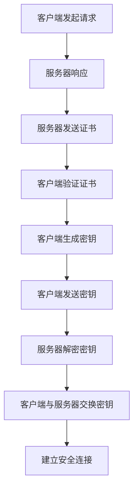
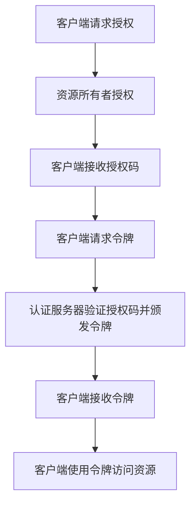

                 

# 《HTTPS在API安全中的作用》

## 关键词

- HTTPS
- API安全
- 数据传输保护
- 认证机制
- 安全策略
- 性能优化
- 攻防实战
- 未来发展趋势

## 摘要

随着互联网和API（应用程序编程接口）的普及，API安全成为现代网络安全的重要议题。HTTPS（超文本传输安全协议）作为一种重要的安全协议，在API安全中扮演着关键角色。本文将深入探讨HTTPS在API安全中的应用，包括其基础原理、实际应用场景、安全策略及未来发展趋势，旨在为开发者提供关于HTTPS在API安全中使用的全面指导。

---

# 《HTTPS在API安全中的作用》目录大纲

## 第一部分：HTTPS基础与API安全概述

### 第1章：HTTPS的基本原理与实现

#### 1.1 HTTPS的工作机制

- HTTPS协议概述
- HTTPS与HTTP的差异
- HTTPS加密算法介绍

#### 1.2 HTTPS的实现流程

- HTTPS握手过程
- 认证机制
- 数据加密与解密

### 第2章：API安全的基本概念与挑战

#### 2.1 API安全的重要性

- API安全的定义
- API安全的重要性

#### 2.2 API安全面临的挑战

- 暴露的风险
- API滥用的风险
- API攻击的类型

## 第二部分：HTTPS在API安全中的应用

### 第3章：HTTPS在API保护中的作用

#### 3.1 HTTPS对API数据传输的保护

- 数据完整性保护
- 数据隐私保护
- 数据防篡改

#### 3.2 HTTPS在API认证中的作用

- 单点登录（SSO）
- OAuth 2.0认证流程
- JWT（JSON Web Token）介绍

### 第4章：HTTPS与API安全策略

#### 4.1 HTTPS在API设计中的考虑

- API设计的安全最佳实践
- HTTPS在API接口设计中的运用

#### 4.2 HTTPS与其他安全机制的整合

- HTTPS与IAM（身份与访问管理）
- HTTPS与DPI（深度包检测）

## 第三部分：HTTPS在API安全中的高级实践

### 第5章：HTTPS性能优化

#### 5.1 HTTPS性能的影响因素

- SSL/TLS协议性能优化
- HTTPS负载均衡

#### 5.2 HTTPS性能优化策略

- 压缩技术
- CDN（内容分发网络）使用

### 第6章：HTTPS在API安全中的攻防实战

#### 6.1 常见的HTTPS攻击类型

- 证书伪造攻击
- 中间人攻击（MITM）
- SSL/TLS漏洞利用

#### 6.2 HTTPS安全防护策略

- 使用强密码策略
- SSL/TLS证书管理
- Web应用程序防火墙（WAF）

## 第四部分：案例研究

### 第7章：HTTPS在大型企业API安全中的应用案例

#### 7.1 案例一：某电商平台API安全策略与实践

- API安全策略
- HTTPS部署与优化
- 面临的安全挑战与解决方案

#### 7.2 案例二：某金融企业API安全案例分析

- API安全风险识别
- HTTPS与IAM整合
- 防护措施与效果评估

### 第8章：HTTPS在API安全中的未来发展趋势

#### 8.1 HTTPS技术的演进方向

- 新的加密算法
- TLS 1.3及其后续版本

#### 8.2 API安全的未来挑战与对策

- API自动化攻击
- 跨平台API安全

## 附录

### 附录A：HTTPS相关资源

- HTTPS协议规范
- 常用的HTTPS工具与库
- API安全最佳实践指南

### 附录B：术语表

- 常用HTTPS术语
- API安全相关术语

### 附录C：Mermaid流程图

- HTTPS握手流程图
- OAuth 2.0认证流程图

### 附录D：代码示例

- HTTPS配置示例代码
- API安全防护示例代码

---

接下来，我们将详细展开上述目录大纲中的内容，逐步深入探讨HTTPS在API安全中的应用。让我们一起学习，一起思考，确保文章内容的严谨与实用。# 第一部分：HTTPS基础与API安全概述

## 第1章：HTTPS的基本原理与实现

### 1.1 HTTPS的工作机制

#### HTTPS协议概述

HTTPS（Hyper Text Transfer Protocol Secure，超文本传输安全协议）是在HTTP协议基础上加入SSL/TLS（Secure Sockets Layer/Transport Layer Security，安全套接字层/传输层安全）协议的加密通信协议。HTTPS通过SSL/TLS协议对HTTP通信进行加密和认证，确保通信过程中的数据安全和完整性。

HTTPS的工作机制主要包括以下几个步骤：

1. **客户端请求**：当用户通过浏览器访问HTTPS网站时，客户端（通常是浏览器）会向服务器发送HTTP请求。
2. **服务器响应**：服务器接收到客户端的请求后，会返回一个包含网站证书的HTTP响应。
3. **客户端验证证书**：浏览器会检查服务器提供的证书是否由受信任的证书颁发机构（CA）签发，以及证书是否有效。
4. **客户端生成密钥**：如果证书验证通过，浏览器会生成一个随机数作为客户端密钥。
5. **客户端发送密钥**：客户端使用服务器的公钥对生成的密钥进行加密，并将其发送给服务器。
6. **服务器解密密钥**：服务器使用自己的私钥解密收到的加密密钥。
7. **加密通信**：客户端和服务器使用解密后的密钥进行加密通信，确保通信过程中的数据安全和隐私。

#### HTTPS与HTTP的差异

HTTPS与HTTP在多个方面存在差异：

1. **安全性**：HTTPS使用了SSL/TLS协议进行加密，确保数据在传输过程中的安全。而HTTP则是明文传输，容易受到中间人攻击等安全威胁。
2. **端口**：HTTPS通常使用443端口进行通信，而HTTP通常使用80端口。
3. **证书**：HTTPS需要使用证书进行身份验证，而HTTP不需要。
4. **性能**：由于加密和解密操作需要额外的计算资源，HTTPS通常比HTTP更慢。

#### HTTPS加密算法介绍

HTTPS使用SSL/TLS协议对数据进行加密，包括对称加密和非对称加密。

1. **对称加密**：对称加密是指加密和解密使用相同的密钥。常用的对称加密算法有AES（Advanced Encryption Standard，高级加密标准）、DES（Data Encryption Standard，数据加密标准）等。

2. **非对称加密**：非对称加密是指加密和解密使用不同的密钥。常用的非对称加密算法有RSA（Rivest-Shamir-Adleman，RSA算法）。

SSL/TLS协议使用这两种加密算法的混合模式，以确保高效和安全。具体来说，服务器使用非对称加密算法（如RSA）生成公私钥对，并将公钥用于证书的签名。客户端使用服务器的公钥加密会话密钥，服务器使用私钥解密会话密钥。然后，客户端和服务器使用对称加密算法（如AES）加密和解密数据。

### 1.2 HTTPS的实现流程

#### HTTPS握手过程

HTTPS的握手过程是客户端和服务器建立安全连接的过程，包括以下几个步骤：

1. **初始握手**：客户端向服务器发送一个初始握手请求，请求建立HTTPS连接。
2. **服务器响应**：服务器接收到客户端的初始握手请求后，会发送一个包含证书的HTTPS响应。
3. **客户端验证证书**：客户端验证服务器提供的证书是否由受信任的CA签发，并检查证书的有效期。
4. **客户端生成密钥**：如果证书验证通过，客户端会生成一个随机数作为客户端密钥。
5. **客户端发送密钥**：客户端使用服务器的公钥加密生成的密钥，并将其发送给服务器。
6. **服务器解密密钥**：服务器使用自己的私钥解密收到的加密密钥。
7. **会话密钥交换**：客户端和服务器使用解密后的密钥生成会话密钥，用于加密和解密数据。

#### 认证机制

HTTPS使用SSL/TLS协议进行身份认证，包括以下几种机制：

1. **证书链**：服务器提供的证书由受信任的CA签发，客户端通过验证证书链来确定服务器身份。
2. **数字签名**：服务器在证书中包含数字签名，客户端可以验证签名的真实性，确保证书未被篡改。
3. **单向认证**：客户端向服务器发送初始握手请求时，不需要提供证书。这种认证方式主要用于客户端不需要身份验证的场景。
4. **双向认证**：客户端和服务器在握手过程中都提供证书，并进行身份验证。这种认证方式用于需要双方身份验证的场景，如HTTPS邮件传输。

#### 数据加密与解密

HTTPS使用SSL/TLS协议对数据进行加密和解密，包括以下步骤：

1. **客户端加密**：客户端使用会话密钥和对称加密算法（如AES）对数据进行加密，然后发送给服务器。
2. **服务器解密**：服务器使用会话密钥和对称加密算法对数据进行解密，然后处理客户端发送的请求。
3. **服务器加密**：服务器对返回的数据进行加密，然后发送给客户端。
4. **客户端解密**：客户端使用会话密钥和对称加密算法对数据进行解密，然后显示或处理服务器返回的数据。

通过上述加密和解密过程，HTTPS确保了数据在传输过程中的安全和隐私。

### 1.3 HTTPS与HTTP的对比

HTTPS与HTTP在安全性、性能、使用场景等方面存在明显差异：

1. **安全性**：HTTPS使用SSL/TLS协议对数据进行加密，确保数据在传输过程中的安全。HTTP则是明文传输，容易受到中间人攻击等安全威胁。
2. **性能**：由于加密和解密操作需要额外的计算资源，HTTPS通常比HTTP更慢。然而，随着硬件性能的提升和压缩算法的优化，HTTPS的性能逐渐提高。
3. **使用场景**：HTTPS主要用于需要安全传输的场景，如电子商务、在线银行等。HTTP则适用于不需要安全传输的场景，如内部网站、论坛等。

通过对比HTTPS和HTTP，我们可以更清楚地了解HTTPS在API安全中的作用和重要性。HTTPS不仅保护了数据的安全和隐私，还为API提供了可靠的认证机制，有效防止了各种API攻击。

---

在上文中，我们详细介绍了HTTPS的基本原理和实现流程，包括HTTPS的工作机制、与HTTP的差异、加密算法介绍以及HTTPS的握手过程、认证机制和数据加密解密过程。这些内容为后续讨论HTTPS在API安全中的应用奠定了基础。

在下一章中，我们将深入探讨API安全的基本概念与挑战，分析API安全的重要性以及API安全面临的主要风险和攻击类型。这将帮助我们更好地理解HTTPS在API安全中的作用，以及如何利用HTTPS来提高API的安全性。

敬请期待下一章的内容。# 第2章：API安全的基本概念与挑战

### 2.1 API安全的重要性

API（应用程序编程接口）已经成为现代软件开发和业务交互的核心组件。API允许不同系统、应用程序和设备之间进行数据交换和功能调用，提高了软件的灵活性和可扩展性。然而，随着API的广泛应用，API安全成为一个不可忽视的重要问题。

#### API安全的定义

API安全是指保护API免受各种攻击和恶意行为的过程。它涵盖了以下几个方面：

1. **数据安全**：确保在API传输过程中，数据不会被窃取、篡改或泄露。
2. **访问控制**：限制未经授权的用户和应用程序对API的访问。
3. **身份验证与授权**：验证API请求者的身份，并确保他们具有执行特定操作所需的权限。
4. **安全策略**：制定和执行一系列安全规则，以防止API被滥用或攻击。

#### API安全的重要性

API安全的重要性体现在以下几个方面：

1. **数据泄露风险**：API是应用程序之间的桥梁，如果API不安全，攻击者可以轻松获取敏感数据，导致数据泄露。
2. **业务中断风险**：API被攻击可能导致服务中断，影响业务运营，造成经济损失。
3. **声誉损害**：数据泄露和业务中断会影响用户的信任，损害企业的声誉。
4. **合规性风险**：随着法律法规对数据保护的要求越来越严格，企业需要确保API安全以符合合规性要求。

### 2.2 API安全面临的挑战

尽管API安全在保护应用程序和数据方面至关重要，但实际上API安全面临许多挑战：

#### 暴露的风险

1. **未充分保护的API**：许多API没有正确配置安全设置，导致攻击者可以未经授权访问。
2. **公开API文档**：一些企业的API文档公开，提供了攻击者攻击的线索。
3. **内部API暴露**：企业内部的API可能由于管理不善而暴露，导致内部攻击。

#### API滥用的风险

1. **暴力破解**：攻击者尝试使用大量无效的API请求来破解密码或访问权限。
2. **频繁请求**：攻击者通过大量请求来耗尽服务器资源，导致拒绝服务攻击（DoS）。
3. **数据泄露**：通过大量请求，攻击者尝试获取敏感数据。

#### API攻击的类型

1. **SQL注入**：攻击者通过API请求注入恶意SQL语句，操纵数据库。
2. **跨站脚本攻击（XSS）**：攻击者通过API返回恶意脚本，诱使用户执行恶意操作。
3. **身份验证攻击**：攻击者尝试通过各种手段绕过身份验证机制。
4. **会话劫持**：攻击者窃取或篡改用户会话，冒充合法用户。
5. **敏感数据暴露**：攻击者通过API获取敏感数据，如用户密码、信用卡信息等。

### 2.3 API安全保护措施

为了应对API安全面临的挑战，企业可以采取以下措施：

1. **访问控制**：确保API请求者具有正确的权限，限制未经授权的访问。
2. **身份验证与授权**：使用强密码策略、多因素认证等手段，确保API请求者的身份真实可信。
3. **数据加密**：对API传输的数据进行加密，防止数据泄露。
4. **日志监控**：记录API请求的详细信息，实时监控并报警异常行为。
5. **安全培训**：加强对开发人员和运维人员的API安全培训，提高安全意识。
6. **API防火墙**：部署API防火墙，阻止恶意请求和攻击。
7. **定期审计**：定期对API进行安全审计，确保安全措施的有效性。

通过采取这些措施，企业可以显著降低API安全风险，确保业务和数据的安全。

在本文的下一部分，我们将深入探讨HTTPS在API安全中的应用，包括HTTPS对API数据传输的保护、在API认证中的作用以及HTTPS与API安全策略的整合。敬请期待。# 第二部分：HTTPS在API安全中的应用

## 第3章：HTTPS在API保护中的作用

### 3.1 HTTPS对API数据传输的保护

HTTPS在API安全中的首要作用是对数据传输进行保护，确保数据在传输过程中不会被窃取、篡改或泄露。下面我们将详细探讨HTTPS如何实现这些保护措施。

#### 数据完整性保护

数据完整性保护是指确保数据在传输过程中不被篡改。HTTPS通过以下方式实现数据完整性保护：

1. **报文摘要**：HTTPS使用哈希函数生成报文摘要，对数据进行加密。接收方通过解密后的报文摘要与发送方生成的报文摘要进行比对，确保数据未被篡改。
2. **报文认证**：HTTPS使用数字签名对报文进行认证，确保数据来自合法的发送方。

#### 数据隐私保护

数据隐私保护是指确保数据在传输过程中不被第三方监视或窃取。HTTPS通过以下方式实现数据隐私保护：

1. **对称加密**：HTTPS使用对称加密算法（如AES）对数据进行加密。发送方和接收方使用相同的密钥进行加密和解密，确保数据在传输过程中的隐私。
2. **非对称加密**：HTTPS使用非对称加密算法（如RSA）对密钥进行加密。发送方使用接收方的公钥加密会话密钥，接收方使用自己的私钥解密会话密钥，确保会话密钥的安全传输。

#### 数据防篡改

数据防篡改是指确保数据在传输过程中不被恶意修改。HTTPS通过以下方式实现数据防篡改：

1. **加密传输**：HTTPS使用加密算法对数据进行加密，确保数据在传输过程中的完整性。
2. **数字签名**：HTTPS使用数字签名对数据进行签名，接收方可以验证数据的真实性，确保数据未被篡改。

### 3.2 HTTPS在API认证中的作用

HTTPS在API认证中扮演着关键角色，确保只有合法的用户和应用程序才能访问API。以下将介绍HTTPS在API认证中的应用。

#### 单点登录（SSO）

单点登录（SSO）是一种认证机制，允许用户使用一个账户登录多个应用程序。HTTPS通过以下方式支持SSO：

1. **安全令牌传输**：用户登录时，服务器会生成一个安全令牌，并将其通过HTTPS传输给用户。
2. **令牌验证**：用户将安全令牌提交给API，API验证令牌的有效性，确保用户身份的合法性。

#### OAuth 2.0认证流程

OAuth 2.0是一种开放的授权协议，允许第三方应用程序访问用户资源，而不需要用户的用户名和密码。HTTPS在OAuth 2.0认证流程中起到关键作用：

1. **客户端认证**：客户端通过HTTPS向授权服务器提交认证请求，授权服务器验证客户端的身份。
2. **资源所有者认证**：资源所有者通过HTTPS进行认证，授权客户端访问其资源。
3. **令牌颁发**：授权服务器颁发访问令牌，并通过HTTPS传输给客户端。
4. **访问资源**：客户端使用访问令牌通过HTTPS访问资源。

#### JWT（JSON Web Token）介绍

JWT（JSON Web Token）是一种基于JSON的开放标准，用于在用户和服务器之间传递安全信息。JWT通过HTTPS进行传输和验证，具有以下特点：

1. **安全性**：JWT使用HMAC（Hash-based Message Authentication Code）算法进行签名，确保数据的完整性。
2. **无状态**：JWT不存储用户信息，从而提高了系统的性能和可扩展性。
3. **便携性**：JWT是一种JSON格式，便于传输和解析。

JWT的工作流程如下：

1. **用户登录**：用户登录系统，系统生成JWT并使用HTTPS传输给用户。
2. **验证JWT**：用户将JWT提交给API，API验证JWT的有效性，确保用户身份的合法性。
3. **访问资源**：用户使用验证后的JWT访问API，API根据JWT中的信息进行权限验证和资源访问。

### 3.3 HTTPS在API安全策略中的整合

HTTPS在API安全策略中的整合是确保API安全的重要环节。以下将介绍HTTPS与其他安全机制的整合。

#### HTTPS与IAM（身份与访问管理）

IAM（Identity and Access Management，身份与访问管理）是一种管理用户身份和访问权限的技术。HTTPS与IAM的整合可以通过以下方式实现：

1. **身份验证**：HTTPS用于身份验证，确保用户身份的合法性。
2. **访问控制**：IAM系统根据用户的身份和权限，控制用户对API的访问。

#### HTTPS与DPI（深度包检测）

DPI（Deep Packet Inspection，深度包检测）是一种网络流量分析技术，用于识别和分析网络数据包的内容。HTTPS与DPI的整合可以通过以下方式实现：

1. **加密流量检测**：DPI技术可以检测HTTPS加密流量，识别潜在的攻击行为。
2. **安全策略实施**：根据检测结果，实施相应的安全策略，如拦截恶意请求、阻止非法访问。

通过整合HTTPS与其他安全机制，企业可以建立全面的API安全策略，有效防止API攻击和数据泄露。

在本文的下一部分，我们将进一步探讨HTTPS在API安全中的应用，包括HTTPS在API设计中的考虑、HTTPS与其他安全机制的整合以及HTTPS性能优化。敬请期待。# 第4章：HTTPS与API安全策略

### 4.1 HTTPS在API设计中的考虑

在设计和实现API时，确保API的安全至关重要。HTTPS在API设计中发挥着关键作用，以下将介绍HTTPS在API设计中的几个关键考虑因素。

#### API设计的安全最佳实践

1. **使用HTTPS**：始终使用HTTPS协议传输数据，确保数据在传输过程中的安全性和完整性。
2. **限制请求方法**：限制API可用的HTTP请求方法，如只允许GET、POST请求，减少攻击面。
3. **请求验证**：对API请求进行验证，确保请求来源的合法性，防止恶意请求。
4. **参数验证**：对API请求的参数进行验证，确保参数的合法性和有效性，防止SQL注入等攻击。
5. **输入过滤**：对输入数据进行过滤，防止恶意输入，如HTML标签、特殊字符等。
6. **日志记录**：记录API请求的详细信息，如请求时间、请求参数、请求结果等，便于监控和审计。

#### HTTPS在API接口设计中的运用

1. **URL重写**：将HTTP URL重写为HTTPS URL，确保所有请求都通过HTTPS协议进行。
2. **强制HTTPS**：在服务器配置中设置强制HTTPS，阻止HTTP请求。
3. **证书管理**：使用合法的、由受信任的CA颁发的证书，确保服务器身份的合法性。
4. **会话管理**：使用HTTPS保护会话数据，如会话ID、访问令牌等，确保会话数据在传输过程中的安全。
5. **响应内容加密**：对API响应内容进行加密，防止敏感数据泄露。
6. **API版本控制**：将不同版本的API设计为不同的URL，确保旧版本的API能够被安全地访问和更新。

### 4.2 HTTPS与其他安全机制的整合

为了实现全面的API安全，HTTPS需要与其他安全机制相结合，以下将介绍HTTPS与其他安全机制的整合。

#### HTTPS与IAM（身份与访问管理）

IAM是一种用于管理用户身份和访问权限的技术，与HTTPS的整合可以通过以下方式实现：

1. **集成身份验证**：使用HTTPS与IAM系统进行集成，确保用户身份的合法性和权限的有效性。
2. **多因素认证**：结合HTTPS和IAM系统，实现多因素认证，提高安全性。
3. **访问控制**：使用HTTPS和IAM系统实现细粒度的访问控制，确保用户只能访问其有权访问的资源。

#### HTTPS与DPI（深度包检测）

DPI是一种用于分析网络数据包的技术，与HTTPS的整合可以通过以下方式实现：

1. **加密流量分析**：使用HTTPS加密流量，DPI技术可以分析加密流量的内容，识别潜在的安全威胁。
2. **安全策略实施**：根据DPI分析结果，实施相应的安全策略，如拦截恶意请求、阻止非法访问。
3. **流量监控**：使用HTTPS和DPI技术进行流量监控，实时监测API的安全状况，及时发现和应对潜在的安全问题。

#### HTTPS与WAF（Web应用程序防火墙）

WAF是一种用于保护Web应用程序的安全技术，与HTTPS的整合可以通过以下方式实现：

1. **请求验证**：使用HTTPS和WAF技术对API请求进行验证，确保请求的合法性和安全性。
2. **异常检测**：使用HTTPS和WAF技术检测API请求中的异常行为，如SQL注入、跨站脚本攻击等。
3. **安全策略配置**：根据HTTPS和WAF技术的特性，配置相应的安全策略，确保API的安全性。

通过整合HTTPS与其他安全机制，企业可以构建一个全面的API安全策略，确保API在设计和实现过程中具备足够的安全性，有效防止API攻击和数据泄露。

在本文的下一部分，我们将探讨HTTPS性能优化的重要性，介绍HTTPS性能优化的方法和策略。敬请期待。# 第三部分：HTTPS在API安全中的高级实践

## 第5章：HTTPS性能优化

随着API的广泛应用，HTTPS在API安全中的作用日益凸显。然而，HTTPS加密过程可能会对性能产生一定影响。因此，进行HTTPS性能优化变得至关重要。本章将详细探讨HTTPS性能的影响因素以及优化策略。

### 5.1 HTTPS性能的影响因素

HTTPS性能受到多种因素的影响，包括：

1. **加密算法**：不同的加密算法在性能上存在差异。对称加密算法（如AES）通常比非对称加密算法（如RSA）快，但安全性能较低。非对称加密算法（如RSA）安全性能较高，但速度较慢。

2. **密钥长度**：密钥长度对HTTPS性能有显著影响。较长的密钥提供更高的安全性能，但计算和传输速度较慢。常见密钥长度包括1024位、2048位和4096位。

3. **握手次数**：HTTPS握手过程对性能有较大影响。每次HTTPS连接都需要进行握手，握手次数越多，性能越差。为提高性能，可以复用已有的HTTPS连接。

4. **硬件性能**：硬件性能也对HTTPS性能有重要影响。较快的CPU和更大的内存可以显著提高HTTPS处理速度。

5. **网络延迟**：网络延迟会影响HTTPS性能。较长的网络延迟会导致HTTPS握手和传输过程变慢。

### 5.2 HTTPS性能优化策略

为提高HTTPS性能，可以采取以下优化策略：

1. **使用高效加密算法**：选择适合应用场景的高效加密算法。例如，对于需要较高安全性能的应用，可以选择AES-256。对于对性能要求较高的应用，可以选择AES-128。

2. **调整密钥长度**：根据应用场景和安全需求，合理选择密钥长度。较长的密钥提供更高的安全性能，但会影响性能。通常，2048位的RSA密钥是一个较好的平衡点。

3. **优化HTTPS握手**：减少HTTPS握手次数，可以通过复用HTTPS连接实现。例如，使用HTTP/2协议，它可以复用TCP连接，减少握手次数。

4. **硬件优化**：提高硬件性能，例如使用更快的CPU、更大的内存等，可以提高HTTPS处理速度。

5. **网络优化**：优化网络延迟，例如使用CDN（内容分发网络），可以将数据缓存到更接近用户的节点，减少网络延迟。

6. **压缩技术**：使用压缩技术，如gzip，可以减少HTTP响应的数据量，提高传输速度。

7. **负载均衡**：使用负载均衡器，如Nginx或HAProxy，可以将请求分配到多个服务器上，提高处理能力和响应速度。

8. **性能监控**：定期监控HTTPS性能，及时发现并解决性能瓶颈。

通过采取上述优化策略，可以显著提高HTTPS性能，满足应用场景的需求。

在本文的下一部分，我们将探讨HTTPS在API安全中的攻防实战，包括常见的HTTPS攻击类型以及HTTPS安全防护策略。敬请期待。# 第6章：HTTPS在API安全中的攻防实战

### 6.1 常见的HTTPS攻击类型

在HTTPS环境中，API仍然可能面临各种攻击。了解这些攻击类型及其特点，有助于我们采取有效的防护措施。以下是几种常见的HTTPS攻击类型：

#### 证书伪造攻击

**概念**：证书伪造攻击是指攻击者伪造合法的数字证书，使其能够冒充受信任的服务器。

**攻击过程**：
1. 攻击者通过中间人攻击拦截客户端与服务器之间的通信。
2. 攻击者使用伪造的证书向客户端发送响应。
3. 客户端验证伪造证书的有效性，通常认为通信是安全的。

**防御策略**：
1. **严格的证书验证**：客户端应严格验证服务器证书的有效性和可信度，包括验证证书链和证书有效期。
2. **使用强密码策略**：服务器证书的私钥应使用强密码保护，防止私钥泄露。

#### 中间人攻击（MITM）

**概念**：中间人攻击是指攻击者在客户端与服务器之间插入自己，窃取或篡改通信数据。

**攻击过程**：
1. 攻击者通过网络监听拦截客户端与服务器之间的通信。
2. 攻击者充当客户端和服务器之间的代理，对通信数据进行窃取或篡改。
3. 攻击者将篡改后的数据发送给服务器，服务器无法察觉。

**防御策略**：
1. **HTTPS加密**：使用HTTPS协议加密通信数据，防止攻击者拦截和篡改。
2. **双向认证**：采用双向认证机制，确保客户端和服务器之间的通信是安全的。

#### SSL/TLS漏洞利用

**概念**：SSL/TLS漏洞利用是指攻击者利用SSL/TLS协议的漏洞，实现对加密通信的窃听或篡改。

**攻击过程**：
1. 攻击者发现并利用SSL/TLS协议的漏洞。
2. 攻击者通过漏洞窃取或篡改加密通信数据。
3. 攻击者可能通过漏洞实现证书伪造或中间人攻击。

**防御策略**：
1. **及时更新SSL/TLS库**：确保SSL/TLS库的版本是最新的，修复已知漏洞。
2. **禁用已知漏洞的加密算法和协议**：禁用已发现漏洞的加密算法和协议，降低攻击风险。
3. **使用安全的配置**：遵循最佳实践，使用安全的SSL/TLS配置。

### 6.2 HTTPS安全防护策略

为了有效防护HTTPS环境中的API，可以采取以下安全防护策略：

#### 使用强密码策略

1. **加密存储**：将SSL/TLS证书的私钥加密存储，确保私钥的安全。
2. **强密码要求**：要求使用强密码保护私钥，避免私钥泄露。

#### SSL/TLS证书管理

1. **证书生命周期管理**：确保证书在过期前及时更换，避免因证书过期导致的安全问题。
2. **证书审计**：定期审计证书的配置和使用情况，确保证书的安全性和有效性。

#### Web应用程序防火墙（WAF）

1. **请求验证**：使用WAF对API请求进行验证，过滤掉恶意请求。
2. **异常检测**：使用WAF检测API请求中的异常行为，如SQL注入、跨站脚本攻击等。
3. **安全策略配置**：根据实际需求，配置WAF的安全策略，保护API的安全性。

#### 代码审计

1. **代码审查**：定期对API的代码进行审查，确保代码符合安全最佳实践。
2. **安全测试**：对API进行安全测试，发现并修复潜在的安全漏洞。

#### 安全培训

1. **安全意识培训**：提高开发人员和运维人员的安全意识，降低因操作不当导致的安全问题。
2. **安全开发实践**：推广安全开发实践，确保API在设计、开发和部署过程中的安全性。

通过上述安全防护策略，可以显著提高HTTPS环境中API的安全性，防止各种攻击和漏洞的利用。

在本文的下一部分，我们将通过两个实际案例研究，探讨HTTPS在大型企业API安全中的应用。敬请期待。# 第四部分：案例研究

## 第7章：HTTPS在大型企业API安全中的应用案例

### 7.1 案例一：某电商平台API安全策略与实践

#### API安全策略

某大型电商平台在API安全方面采取了以下策略：

1. **使用HTTPS**：电商平台的所有API接口都使用HTTPS协议，确保数据在传输过程中的安全性和完整性。
2. **强制HTTPS**：通过服务器配置，强制所有API请求使用HTTPS协议，防止HTTP请求。
3. **证书管理**：使用由受信任的CA颁发的证书，确保服务器身份的合法性。
4. **多因素认证**：采用多因素认证机制，提高用户和API请求者的身份验证安全性。
5. **访问控制**：对API请求进行访问控制，确保只有授权用户和应用程序才能访问。
6. **数据加密**：对API传输的数据进行加密，防止数据泄露。

#### HTTPS部署与优化

在HTTPS部署方面，电商平台采取了以下措施：

1. **负载均衡**：使用负载均衡器，将请求分配到多个服务器，提高性能和可靠性。
2. **缓存策略**：使用缓存技术，减少对后端服务的访问压力。
3. **压缩技术**：使用压缩技术，减少HTTPS传输的数据量，提高传输速度。
4. **性能监控**：定期监控HTTPS性能，及时发现并解决性能瓶颈。
5. **安全审计**：定期对HTTPS配置和策略进行审计，确保其有效性和安全性。

#### 面临的安全挑战与解决方案

在实施HTTPS的过程中，电商平台面临以下安全挑战：

1. **性能优化**：HTTPS加密过程对性能有一定影响，电商平台采取了负载均衡、缓存策略和压缩技术等措施，提高HTTPS性能。
2. **证书管理**：证书的有效期和更新是安全的重要环节，电商平台定期审计证书配置，确保证书的有效性和安全性。
3. **中间人攻击**：为了防止中间人攻击，电商平台采用多因素认证机制，提高身份验证的安全性。
4. **代码漏洞**：电商平台定期进行代码审计，修复潜在的安全漏洞，确保API的安全性。

### 7.2 案例二：某金融企业API安全案例分析

#### API安全风险识别

某金融企业在API安全方面识别了以下风险：

1. **数据泄露**：API接口可能成为攻击者获取敏感数据的途径。
2. **业务中断**：API接口可能遭受拒绝服务攻击（DoS），导致业务中断。
3. **会话劫持**：攻击者可能通过会话劫持，冒充合法用户进行非法操作。
4. **授权滥用**：未经授权的用户可能通过API获取敏感信息。

#### HTTPS与IAM整合

为了降低API安全风险，金融企业采取了以下措施：

1. **使用HTTPS**：所有API接口都使用HTTPS协议，确保数据在传输过程中的安全性和完整性。
2. **IAM整合**：将IAM系统与HTTPS整合，实现用户身份的合法性和权限的有效性。
3. **多因素认证**：采用多因素认证机制，提高用户身份验证的安全性。
4. **访问控制**：对API请求进行访问控制，确保只有授权用户和应用程序才能访问。
5. **日志监控**：记录API请求的详细信息，实时监控并报警异常行为。

#### 防护措施与效果评估

金融企业采取了以下防护措施：

1. **代码审计**：定期对API代码进行审计，确保代码符合安全最佳实践，降低安全漏洞的风险。
2. **WAF部署**：部署Web应用程序防火墙，对API请求进行验证和过滤，防止恶意请求和攻击。
3. **安全培训**：提高开发人员和运维人员的安全意识，确保API安全策略的有效实施。
4. **定期评估**：定期评估API安全措施的有效性，根据评估结果调整和优化安全策略。

通过实施上述措施，金融企业显著降低了API安全风险，确保了业务和数据的安全。

在本文的下一部分，我们将探讨HTTPS在API安全中的未来发展趋势，包括HTTPS技术的演进方向和API安全的未来挑战与对策。敬请期待。# 第8章：HTTPS在API安全中的未来发展趋势

### 8.1 HTTPS技术的演进方向

随着网络安全威胁的不断演变，HTTPS技术也在不断演进，以应对新的挑战。以下是HTTPS技术的一些重要演进方向：

#### TLS 1.3及其后续版本

TLS 1.3是当前最新的TLS版本，它对之前的TLS 1.2进行了重大改进，以提高性能和安全性。TLS 1.3的主要特点包括：

1. **更快的握手过程**：TLS 1.3显著减少了握手过程中的往返次数，提高了连接建立速度。
2. **更安全的加密算法**：TLS 1.3禁用了许多已知的弱加密算法和协议，采用了更安全的加密算法，如ChaCha20和Poly1305。
3. **更好的抵抗网络攻击**：TLS 1.3增加了新的协议层，提高了对网络攻击（如Drown和Heartbleed）的抵抗能力。

未来，TLS 1.3及其后续版本将继续演进，以适应不断变化的网络安全需求。

#### 新的加密算法

随着量子计算的发展，现有的加密算法面临着被量子计算破解的风险。为了应对这一挑战，新的加密算法正在被研究和开发，包括：

1. **Post-Quantum Cryptography（PQC）**：PQC是一类专门为抵抗量子计算攻击设计的加密算法。常见的PQC算法包括Lattice-based、Hash-based和Multivariate-based算法。
2. **量子密钥交换**：量子密钥交换（如Quantum Key Distribution，QKD）是一种利用量子力学原理进行密钥交换的技术，可以提供绝对安全性的加密通信。

这些新的加密算法有望在未来成为HTTPS加密技术的重要组成部分。

### 8.2 API安全的未来挑战与对策

随着API的广泛应用，API安全面临许多新的挑战。以下是API安全的未来挑战以及相应的对策：

#### API自动化攻击

随着自动化工具和攻击脚本的发展，API自动化攻击成为一种新的威胁。这些攻击通常利用API的漏洞和弱点，快速、大规模地进行攻击。对策包括：

1. **行为分析**：使用行为分析技术，识别和阻止异常的API请求行为。
2. **请求验证**：加强API请求验证，防止恶意请求进入系统。

#### 跨平台API安全

随着移动设备和物联网设备的普及，API安全面临跨平台挑战。不同平台的API接口和实现方式可能存在差异，导致安全漏洞和攻击面扩大。对策包括：

1. **统一API设计**：设计统一的API接口和实现方式，减少跨平台安全问题的出现。
2. **平台适配性测试**：对API在不同平台上的适配性进行测试，确保安全性。

#### 安全合规性

随着法规对数据保护的要求日益严格，API安全合规性成为一个重要挑战。对策包括：

1. **合规性审计**：定期进行合规性审计，确保API安全策略和措施符合相关法规要求。
2. **安全培训**：提高开发人员和运维人员的安全意识，确保他们了解和遵守安全合规性要求。

#### 安全技术的发展

随着安全技术的发展，新的安全工具和策略不断涌现。企业应关注并采用这些新技术，提高API安全性。对策包括：

1. **自动化安全测试**：使用自动化工具进行API安全测试，发现和修复安全漏洞。
2. **安全可视化**：通过安全可视化技术，实时监控API安全状况，及时发现和处理安全事件。

通过关注这些未来挑战和对策，企业可以更好地应对API安全中的挑战，确保API安全策略的有效性和可持续性。

在本文的结尾，我们总结了HTTPS在API安全中的重要作用，并展望了未来HTTPS技术的发展趋势和API安全的未来挑战。相信通过本文的探讨，读者对HTTPS在API安全中的作用有了更深入的理解，并能够在实际应用中更好地利用HTTPS来保护API安全。

---

感谢您阅读本文，如果您对HTTPS在API安全中的应用有任何疑问或见解，欢迎在评论区留言交流。期待与您共同探讨API安全的未来发展。

**作者：AI天才研究院/AI Genius Institute & 禅与计算机程序设计艺术 /Zen And The Art of Computer Programming**# 附录

### 附录A：HTTPS相关资源

1. **HTTPS协议规范**：[RFC 7230](https://www.rfc-editor.org/rfc/rfc7230.html)、[RFC 7231](https://www.rfc-editor.org/rfc/rfc7231.html)、[RFC 7232](https://www.rfc-editor.org/rfc/rfc7232.html)、[RFC 7233](https://www.rfc-editor.org/rfc/rfc7233.html)、[RFC 7234](https://www.rfc-editor.org/rfc/rfc7234.html)、[RFC 7235](https://www.rfc-editor.org/rfc/rfc7235.html)
2. **常用的HTTPS工具与库**：
   - OpenSSL：[OpenSSL官方文档](https://www.openssl.org/docs/)
   - Let's Encrypt：[Let's Encrypt官方文档](https://letsencrypt.org/docs/)
   - NGINX：[NGINX官方文档](https://docs.nginx.com/nginx/manual/)
3. **API安全最佳实践指南**：
   - OWASP API Security Cheat Sheet：[https://cheatsheetseries.owasp.org/cheatsheets/API_Security_Cheat_Sheet.html](https://cheatsheetseries.owasp.org/cheatsheets/API_Security_Cheat_Sheet.html)
   - OWASP API Security Top 10：[https://owasp.org/www-project-api-security-top-ten/](https://owasp.org/www-project-api-security-top-ten/)

### 附录B：术语表

1. **HTTPS**：超文本传输安全协议，是一种在HTTP基础上加入SSL/TLS协议的安全通信协议。
2. **SSL**：安全套接字层，是早期用于实现网络通信安全的协议。
3. **TLS**：传输层安全协议，是SSL的继任者，提供更安全的通信保障。
4. **CA**：证书颁发机构，负责签发和验证数字证书。
5. **数字证书**：包含公钥和私钥的电子文档，用于验证服务器身份。
6. **密钥交换**：客户端和服务器在建立安全连接过程中交换密钥的过程。
7. **加密算法**：用于加密和解密数据的算法，如AES、RSA等。
8. **身份验证**：验证用户身份的过程，确保只有合法用户可以访问资源。
9. **访问控制**：限制用户或应用程序访问资源的权限。
10. **中间人攻击（MITM）**：攻击者在客户端与服务器之间拦截和篡改通信数据。

### 附录C：Mermaid流程图

**HTTPS握手流程图：**


**OAuth 2.0认证流程图：**


### 附录D：代码示例

**HTTPS配置示例代码（Python）：**
```python
from socketserver import ThreadingMixIn
from http.server import HTTPServer, BaseHTTPRequestHandler
import ssl

class Handler(BaseHTTPRequestHandler):

    def do_GET(self):
        self.send_response(200)
        self.send_header('Content-type', 'text/html')
        self.end_headers()
        self.wfile.write(b'Hello, world!')

if __name__ == '__main__':
    server_address = ('', 443)
    httpd = HTTPServer(server_address, Handler)
    httpd.socket = ssl.wrap_socket(httpd.socket, certfile="server.crt", keyfile="server.key")
    httpd.serve_forever()
```

**API安全防护示例代码（Python）：**
```python
from flask import Flask, request, jsonify
from itsdangerous import TimedJSONWebSignatureSerializer as Serializer

app = Flask(__name__)
secret_key = 'my_secret_key'

@app.route('/api/data', methods=['GET'])
def get_data():
    s = Serializer(secret_key, expires_in=3600)
    token = request.args.get('token')
    try:
        data = s.loads(token)
        return jsonify({'data': data['data']})
    except:
        return jsonify({'error': 'Invalid token'}), 401

if __name__ == '__main__':
    app.run(ssl_context='adhoc')
```

**代码解读与分析：**

1. **HTTPS配置示例代码**：这是一个简单的Python Flask应用程序，通过ssl.wrap_socket方法将HTTP服务器套接字封装为SSL套接字，使用服务器证书（server.crt）和密钥（server.key）进行HTTPS通信。

2. **API安全防护示例代码**：这是一个Flask应用程序，使用itsdangerous库中的Serializer类实现令牌验证。客户端请求API时，需要提供有效的令牌，应用程序会验证令牌的有效性，并根据验证结果返回数据或错误信息。应用程序使用app.run方法启动时，会启用SSL上下文，确保HTTPS通信。

通过这些示例代码，我们可以看到如何在实际应用中配置和使用HTTPS，以及如何利用HTTPS进行API安全防护。这些代码展示了HTTPS在API安全中的实际应用，有助于开发者更好地理解和实践HTTPS在API安全中的作用。

