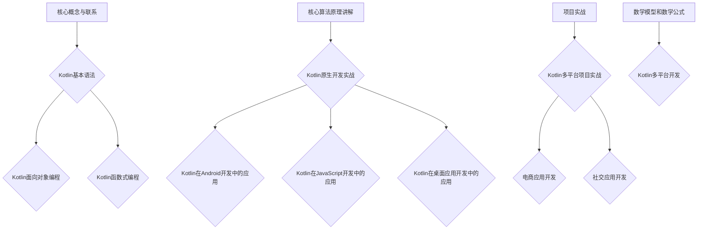

                 

# Kotlin多平台开发：一次编写，到处运行

## 关键词

- Kotlin
- 多平台开发
- 一次编写，到处运行
- Kotlin原生开发
- Kotlin在Android中的应用
- Kotlin在JavaScript中的应用
- Kotlin在桌面应用中的应用
- Kotlin项目实战

## 摘要

本文将深入探讨Kotlin多平台开发的优势和实现方法。Kotlin作为一种现代编程语言，具有简洁、安全、互操作性强等特点，特别适合多平台开发。本文将详细讲解Kotlin的基本语法、面向对象编程、函数式编程，并探讨Kotlin在原生开发、Android开发、JavaScript开发和桌面应用开发中的实战应用。此外，还将通过实际项目案例展示Kotlin多平台开发的实践过程和优化策略。最后，本文将对Kotlin多平台开发的未来趋势和开发者社区进行展望。

## 目录

### 第一部分：Kotlin多平台开发基础

#### 第1章：Kotlin简介与多平台开发概述

1.1 Kotlin的历史与发展

1.2 Kotlin基本语法

1.3 Kotlin面向对象编程

1.4 Kotlin函数式编程

### 第二部分：Kotlin多平台开发核心

#### 第2章：Kotlin原生开发

2.1 Kotlin原生开发环境搭建

2.2 Kotlin原生开发实战

2.3 Kotlin原生项目结构解析

#### 第3章：Kotlin在Android开发中的应用

3.1 Kotlin在Android开发中的优势

3.2 Kotlin在Android开发中的实战

3.3 Android项目中的Kotlin多平台开发

#### 第4章：Kotlin在JavaScript开发中的应用

4.1 Kotlin/JS简介

4.2 Kotlin在JavaScript开发中的实战

4.3 Kotlin在Web开发中的多平台扩展

#### 第5章：Kotlin在桌面应用开发中的应用

5.1 Kotlin在桌面应用开发中的优势

5.2 Kotlin在桌面应用开发中的实战

5.3 Kotlin桌面应用开发工具与资源

### 第三部分：Kotlin多平台开发实践

#### 第6章：Kotlin多平台项目实战

6.1 Kotlin多平台项目实战概述

6.2 Kotlin多平台项目实战：电商应用开发

6.3 Kotlin多平台项目实战：社交应用开发

#### 第7章：Kotlin多平台开发的未来趋势与展望

7.1 Kotlin多平台开发的未来趋势

7.2 Kotlin开发者社区与生态

### 附录

附录 A：Kotlin多平台开发资源汇总

## 第1章：Kotlin简介与多平台开发概述

### 1.1 Kotlin的历史与发展

Kotlin语言是由JetBrains公司开发的，于2017年正式成为Google的官方支持语言。Kotlin起源于2010年，最初是为了解决Java语言中一些局限性而设计的。其设计目标是简洁、安全、互操作性强，同时保持与Java的高兼容性。Kotlin在多个领域都有广泛的应用，包括Android开发、服务器端开发、前端开发以及桌面应用开发等。

Kotlin的发展历程可以分为几个关键阶段：

1. **早期阶段**：Kotlin在2010年诞生，并在2012年发布了第一个公测版本。这个阶段，Kotlin主要解决了Java中的一些痛点，如空安全、扩展函数、协程等。

2. **成长阶段**：随着Google宣布Kotlin为Android官方开发语言，Kotlin在Android开发中得到了广泛应用。同时，Kotlin也逐渐被其他平台接受，如Web、服务器端和桌面应用等。

3. **成熟阶段**：Kotlin在2020年发布了1.5版本，这个版本引入了许多新的特性，如Kotlin/Native、协程等，进一步增强了Kotlin的多平台开发能力。

### 1.2 Kotlin的核心优势

Kotlin具有以下核心优势，使其成为多平台开发的理想选择：

1. **简洁性**：Kotlin语法简洁明了，减少了冗余代码，提高了开发效率。例如，Kotlin通过空安全、扩展函数等特性，使代码更加简洁。

2. **安全性**：Kotlin引入了空安全机制，有效避免了空指针异常，提高了程序的安全性。

3. **互操作性**：Kotlin与Java高度兼容，可以无缝地与Java库和框架集成，同时也可以调用Java代码。

4. **多平台支持**：Kotlin支持多种平台，包括Android、Web、服务器端和桌面应用等。通过Kotlin/Native，Kotlin甚至可以编译成原生代码，直接运行在宿主机上。

5. **函数式编程**：Kotlin支持函数式编程，提供了高阶函数、协程等特性，使编程更加简洁和高效。

6. **社区与生态系统**：Kotlin拥有强大的社区支持，有许多开源库和工具，如Kotlin Coroutines、Kotlinx.Serialization等，极大地丰富了Kotlin的应用场景。

### 1.3 Kotlin在多平台开发中的应用

Kotlin在多平台开发中的应用非常广泛，以下是一些典型应用场景：

1. **Android开发**：Kotlin是Android官方开发语言，以其简洁、安全、互操作性强等特点，深受开发者的喜爱。

2. **Web开发**：Kotlin可以通过Kotlin/JS编译成JavaScript，在Web前端使用。同时，Kotlin也支持使用Ktor框架进行服务器端开发。

3. **桌面应用开发**：Kotlin可以通过Kotlin/Native编译成原生代码，适用于桌面应用开发。此外，Kotlin也可以与Java库和框架集成，使用Java Swing或JavaFX进行桌面应用开发。

4. **服务器端开发**：Kotlin可以作为服务器端开发语言，使用Ktor、Spring Boot等框架进行开发。

5. **跨平台应用**：Kotlin的多平台特性使其非常适合跨平台应用开发。例如，可以同时开发Android、iOS和Web版本的应用，提高开发效率。

### 1.4 Kotlin的多平台开发框架

为了实现Kotlin的多平台开发，有一些重要的框架和工具：

1. **Kotlin/JS**：Kotlin/JS可以将Kotlin代码编译成JavaScript，用于Web前端开发。Kotlin/JS提供了丰富的API和库，如Kotlinx.Serialization、Kotlin HTML等，方便开发者进行Web开发。

2. **Kotlin/Native**：Kotlin/Native可以将Kotlin代码编译成原生代码，适用于桌面应用和服务器端开发。Kotlin/Native通过JVM-GraalVM实现了与宿主机的无缝集成。

3. **Ktor**：Ktor是一个高性能的Web框架，用于Kotlin在服务器端开发。Ktor支持异步编程、WebSocket、HTTP/2等特性，非常适合构建高性能的Web应用。

4. **JetBrains IntelliJ IDEA**：JetBrains IntelliJ IDEA是Kotlin开发的首选IDE，提供了丰富的工具和插件，如Kotlin插件、Kotlin Multi-Platform SDK等，极大地提高了开发效率。

### 1.5 本章小结

本章介绍了Kotlin的历史与发展、核心优势、多平台开发应用以及相关的开发框架。通过本章的学习，读者可以了解到Kotlin作为一种现代编程语言，在多平台开发中的巨大潜力和优势。接下来，我们将深入探讨Kotlin的基本语法、面向对象编程和函数式编程等核心内容。

## 第2章：Kotlin原生开发

### 2.1 Kotlin原生开发环境搭建

Kotlin原生开发是指使用Kotlin语言开发可以在操作系统上直接运行的程序，而不是依赖于JVM或者JavaScript环境的程序。Kotlin/Native是实现这一目标的关键，它允许Kotlin代码编译成本地机器码，从而摆脱了对JVM的依赖。

#### 2.1.1 JDK安装与配置

要进行Kotlin原生开发，首先需要安装Java Development Kit（JDK）。Kotlin/Native依赖于JDK，因此必须确保安装了正确的JDK版本。以下是在Windows和macOS上安装JDK的步骤：

1. **下载JDK**：访问Oracle官方网站下载适用于操作系统的JDK版本。

2. **安装JDK**：运行下载的安装程序，按照提示完成安装。

3. **配置环境变量**：
   - **Windows**：右键单击“此电脑”->“属性”->“高级系统设置”->“环境变量”，在“系统变量”中添加`JAVA_HOME`变量，并将其路径设置为JDK的安装路径。然后在“系统变量”中添加`PATH`变量，并将其值设置为`%JAVA_HOME%/bin`。
   - **macOS**：打开终端，编辑`.bash_profile`或`.zshrc`文件，添加以下内容：
     ```bash
     export JAVA_HOME=/path/to/jdk
     export PATH=$JAVA_HOME/bin:$PATH
     ```

   完成后，在命令行中输入`java -version`，如果能够正确显示版本信息，说明JDK安装和配置成功。

#### 2.1.2 IntelliJ IDEA安装与配置

IntelliJ IDEA是Kotlin原生开发的首选IDE，它提供了强大的功能和插件支持。以下是安装和配置IntelliJ IDEA的步骤：

1. **下载IntelliJ IDEA**：访问JetBrains官方网站下载IntelliJ IDEA社区版或专业版。

2. **安装IntelliJ IDEA**：运行下载的安装程序，按照提示完成安装。

3. **安装Kotlin插件**：
   - 打开IntelliJ IDEA，选择“File”->“Settings”（或“IntelliJ IDEA”->“Preferences”在macOS上）。
   - 在左侧菜单中选择“Plugins”。
   - 点击“Install Plugin from Disk”按钮，选择“Kotlin”插件进行安装。

4. **配置Kotlin SDK**：
   - 在“File”->“Project Structure”（或“IntelliJ IDEA”->“Project Structure”在macOS上）。
   - 在“Project”选项卡中，点击“Kotlin”下的“New Project SDK”按钮，选择“Kotlin”作为项目的基础。
   - 在弹出的对话框中选择一个Kotlin版本，点击“OK”完成配置。

#### 2.1.3 Kotlin插件安装

除了Kotlin插件，还有一些其他有用的插件可以增强Kotlin原生开发的体验：

1. **Kotlinx.Serialization**：这是一个用于数据序列化的库，可以方便地将数据序列化为JSON或其他格式。

2. **Kotlin Native Integration**：这是一个与Kotlin/Native集成的插件，提供了Kotlin/Native项目的构建和调试支持。

   安装这些插件的方法与安装Kotlin插件类似，在“Plugins”窗口中搜索插件名称，然后点击“Install Plugin”按钮。

### 2.2 Kotlin原生开发实战

在了解Kotlin原生开发环境搭建之后，我们可以通过一些实战案例来加深理解。

#### 2.2.1 命令行工具开发

以下是一个简单的Kotlin命令行工具的示例：

```kotlin
import java.io.*

fun main(args: Array<String>) {
    if (args.isEmpty()) {
        println("请输入一个参数")
        return
    }

    val input = args[0]
    val output = input.toUpperCase()

    println("输入：$input")
    println("输出：$output")
}
```

保存此代码为`Main.kt`，然后使用以下命令编译并运行：

```bash
kotlinc Main.kt -include-runtime -d Main.jar
java -jar Main.jar hello
```

输出结果为：

```
输入：hello
输出：HELLO
```

#### 2.2.2 网络编程

以下是一个简单的Kotlin网络编程示例，使用`kotlinx.coroutines`进行异步编程：

```kotlin
import kotlinx.coroutines.runBlocking
import okhttp3.OkHttpClient
import okhttp3.Request
import okhttp3.Response

suspend fun fetchUrl(url: String): String {
    val client = OkHttpClient()
    val request = Request.Builder().url(url).build()
    return runBlocking {
        client.newCall(request).execute().use { it.body!!.string() }
    }
}

fun main() = runBlocking {
    val content = fetchUrl("https://www.example.com")
    println(content)
}
```

为了运行此代码，我们需要添加`okhttp`依赖项到`build.gradle`文件中：

```gradle
dependencies {
    implementation("org.jetbrains.kotlinx:kotlinx-coroutines-okhttp:1.6.0")
}
```

然后使用以下命令编译和运行：

```bash
kotlinc Main.kt -include-runtime -d Main.jar
java -jar Main.jar
```

输出结果将是从指定URL获取的HTML内容。

#### 2.2.3 文件处理与IO操作

以下是一个简单的Kotlin文件读写示例：

```kotlin
import java.io.*

fun writeToFile(filename: String, content: String) {
    val file = File(filename)
    if (!file.exists()) {
        file.createNewFile()
    }

    val writer = BufferedWriter(OutputStreamWriter(FileOutputStream(file)))
    writer.write(content)
    writer.close()
}

fun readFromFile(filename: String): String {
    val file = File(filename)
    if (!file.exists()) {
        return ""
    }

    val reader = BufferedReader(InputStreamReader(FileInputStream(file)))
    val content = reader.readLine()
    reader.close()
    return content
}

fun main() {
    val filename = "example.txt"
    val content = "Hello, Kotlin!"

    writeToFile(filename, content)
    println(readFromFile(filename))
}
```

此代码首先创建一个文件并写入内容，然后从文件中读取内容并打印。

### 2.3 Kotlin原生项目结构解析

一个标准的Kotlin原生项目通常包含以下结构：

```
project/
├── build.gradle
├── src/
│   ├── main/
│   │   ├── kotlinc/
│   │   │   └── resources/
│   │   └── kotlin/
│   └── test/
│       ├── kotlinc/
│       │   └── resources/
│       └   └── kotlin/
```

1. **build.gradle**：项目的构建文件，定义了项目的依赖项、构建配置等。

2. **src/main/kotlinc/resources**：用于存放资源文件，如配置文件、图片等。

3. **src/main/kotlin**：源代码目录，包含Kotlin源文件。

4. **src/test/kotlinc/resources**：测试资源目录，用于存放测试资源文件。

5. **src/test/kotlin**：测试源代码目录，用于编写单元测试和集成测试。

### 2.4 本章小结

本章介绍了Kotlin原生开发的基础知识，包括JDK安装与配置、IntelliJ IDEA安装与配置、Kotlin插件安装以及Kotlin原生开发环境搭建。通过一些实际案例，读者可以了解到Kotlin原生开发的基本实战方法。接下来，我们将进一步探讨Kotlin在Android开发中的应用。

## 第3章：Kotlin在Android开发中的应用

Kotlin由于其简洁、安全、互操作性强等特点，在Android开发中得到了广泛应用。自2017年Google宣布Kotlin为Android的官方开发语言以来，越来越多的开发者开始采用Kotlin来构建Android应用。本章将详细探讨Kotlin在Android开发中的优势、实战应用以及多平台开发的实践。

### 3.1 Kotlin在Android开发中的优势

Kotlin在Android开发中有以下显著优势：

1. **简洁性**：Kotlin的语法简洁，减少了大量的冗余代码，使代码更加易于阅读和维护。例如，Kotlin支持扩展函数、协程等特性，使异步编程更加简单。

2. **空安全**：Kotlin引入了空安全机制，通过显式声明变量可以为空或不为空，有效避免了空指针异常，提高了代码的稳定性。

3. **互操作性**：Kotlin与Java高度兼容，可以无缝地与Java库和框架集成。这意味着开发者可以在Kotlin项目中继续使用Java编写的库和框架，同时也可以调用Java代码。

4. **协程支持**：Kotlin原生支持协程，协程是一种轻量级的线程管理机制，可以提高程序的并发性能。在Android开发中，协程可以简化异步编程，提高代码的可读性和可维护性。

5. **函数式编程**：Kotlin支持函数式编程，提供了高阶函数、高阶类型等特性，使编程更加简洁和高效。函数式编程可以减少状态管理，提高程序的鲁棒性。

6. **Kotlin Android Extensions**：Kotlin Android Extensions是一种语法糖，可以简化Android布局文件与Kotlin代码之间的交互。开发者可以使用简化的语法来访问布局视图，提高开发效率。

### 3.2 Kotlin在Android开发中的实战

Kotlin在Android开发中的应用涵盖了从项目创建到应用开发的各个方面。以下是一些关键实战内容：

#### 3.2.1 Kotlin在Android Studio中的配置

要使用Kotlin进行Android开发，需要先在Android Studio中进行相应的配置：

1. **安装Android Studio**：从Android Studio官方网站下载并安装Android Studio。

2. **创建新项目**：
   - 打开Android Studio，选择“Start a new Android Studio project”。
   - 在“Select a form factor”页面，选择“Phone and Tablet”。
   - 在“Configure your project”页面，选择Kotlin作为编程语言，并选择合适的API级别。

3. **配置Kotlin插件**：
   - 在“File”菜单中选择“Settings”（或“IntelliJ IDEA”->“Preferences”在macOS上）。
   - 在左侧菜单中选择“Plugins”。
   - 在插件列表中搜索“Kotlin”，然后点击“Install Plugin”按钮。

#### 3.2.2 Kotlin在Activity和Fragment中的应用

在Android开发中，Activity和Fragment是两个核心组件。Kotlin提供了简化的语法和语法糖，使编写Activity和Fragment代码更加高效。

1. **创建Activity**：
   - 在Android Studio中，选择“File”->“New”->“File”，输入文件名`MainActivity.kt`。
   - 编写以下代码：

```kotlin
import android.os.Bundle
import androidx.appcompat.app.AppCompatActivity

class MainActivity : AppCompatActivity() {
    override fun onCreate(savedInstanceState: Bundle?) {
        super.onCreate(savedInstanceState)
        setContentView(R.layout.activity_main)
    }
}
```

2. **创建Fragment**：
   - 在“File”->“New”->“Fragment”中创建一个新的Fragment。
   - 编写以下代码：

```kotlin
import android.os.Bundle
import androidx.fragment.app.Fragment

class MyFragment : Fragment() {
    override fun onCreate(savedInstanceState: Bundle?) {
        super.onCreate(savedInstanceState)
        // 初始化Fragment界面和逻辑
    }
}
```

#### 3.2.3 Kotlin在Android Jetpack库中的应用

Android Jetpack是一组库和工具，旨在帮助开发者更轻松地开发高质量的Android应用。Kotlin与Android Jetpack库完美集成，可以大大提高开发效率。

1. **使用ViewModel**：
   - ViewModel是Android Jetpack提供的一种用于管理UI相关数据的类。在Kotlin中，创建ViewModel的方式如下：

```kotlin
import androidx.lifecycle.ViewModel

class MyViewModel : ViewModel() {
    // 定义和操作UI相关的数据
}
```

   - 在Activity或Fragment中，可以通过`ViewModelProviders`获取ViewModel实例：

```kotlin
val myViewModel: MyViewModel by viewModels()
```

2. **使用LiveData**：
   - LiveData是Android Jetpack提供的一种用于数据观察的机制。在Kotlin中，可以轻松创建和监听LiveData：

```kotlin
import androidx.lifecycle.LiveData

class MyLiveData : LiveData<String>() {
    // 更新LiveData的方法
}

myLiveData.observe(this, Observer { value ->
    // 处理更新后的数据
})
```

3. **使用Room**：
   - Room是Android Jetpack提供的一种用于数据库操作的库。在Kotlin中，使用Room的方式如下：

```kotlin
import androidx.room.*

@Database(entities = [User::class], version = 1)
abstract class AppDatabase : RoomDatabase() {
    abstract fun userDao(): UserDao
}

@Dao
interface UserDao {
    // 定义数据库操作的方法
}

@Entity
data class User(
    @PrimaryKey val id: Int,
    @ColumnInfo(name = "name") val name: String
)
```

#### 3.2.4 Kotlin在Android与iOS之间的代码共享

Kotlin的多平台特性使其非常适合跨平台开发。通过Kotlin，可以在Android和iOS项目中共享代码，从而提高开发效率。

1. **共享Kotlin库**：
   - 可以创建一个单独的Kotlin库，然后在Android和iOS项目中引用。例如，在`build.gradle`文件中添加以下依赖：

```gradle
dependencies {
    implementation(project(':shared_kotlin'))
}
```

2. **使用Kotlin Multi-Platform Project**：
   - Kotlin Multi-Platform Project（KMP）是一种项目结构，允许在同一代码库中同时维护Android和iOS项目。通过KMP，可以在同一代码库中编写共享代码，并在Android和iOS项目中分别编译。

### 3.3 Android项目中的Kotlin多平台开发

Kotlin的多平台开发能力不仅限于代码共享，还可以在整个Android项目中实现一次编写，到处运行。

#### 3.3.1 单一代码库与多模块项目

在Android项目中，可以使用单一代码库（Single Codebase）和多模块项目（Multi-Module Project）来实现Kotlin的多平台开发。

1. **单一代码库**：
   - 在单一代码库中，Android和iOS项目共享同一个代码库。这意味着所有的代码都存储在一个项目中，无需为每个平台分别维护代码。

2. **多模块项目**：
   - 在多模块项目中，Android和iOS项目作为单独的模块存在于同一代码库中。每个模块都有自己的构建配置和资源文件，但共享相同的代码库。

#### 3.3.2 Kotlin在Android与iOS之间的代码共享

通过单一代码库或多模块项目，可以实现Android和iOS项目之间的代码共享。以下是一些关键步骤：

1. **创建共享库**：
   - 在代码库中创建一个共享库，包含Android和iOS项目共用的代码。

2. **引用共享库**：
   - 在Android和iOS项目中，引用共享库，以便使用共享代码。

3. **适配平台差异**：
   - 在某些情况下，需要为Android和iOS平台编写特定的代码。例如，iOS平台可能需要使用Objective-C或Swift编写的代码，而Android平台则需要使用Kotlin或Java编写的代码。

### 3.4 本章小结

本章介绍了Kotlin在Android开发中的优势、实战应用以及多平台开发的实践。通过Kotlin，开发者可以更高效地开发高质量的Android应用，同时也能够实现Android与iOS之间的代码共享，提高开发效率。在下一章中，我们将探讨Kotlin在JavaScript开发中的应用。

## 第4章：Kotlin在JavaScript开发中的应用

Kotlin作为一门现代编程语言，以其简洁、安全、互操作性强的特点在多个领域获得了广泛应用。除了Android开发、服务器端开发以及桌面应用开发外，Kotlin还可以用于JavaScript开发。通过Kotlin/JS，开发者可以将Kotlin代码编译成JavaScript，从而在Web前端使用。本章将详细介绍Kotlin/JS的概念、优势、开发环境搭建以及实战应用。

### 4.1 Kotlin/JS简介

Kotlin/JS是Kotlin语言的一个模块，它允许将Kotlin代码编译成JavaScript。Kotlin/JS的主要优势在于：

1. **代码共享**：Kotlin/JS允许开发者将Android、服务器端和桌面应用中的Kotlin代码直接迁移到Web前端，实现跨平台代码共享。
2. **安全性**：Kotlin/JS支持空安全，可以避免空指针异常，提高Web应用的安全性。
3. **简洁性**：Kotlin的语法简洁，减少了冗余代码，使JavaScript代码更加易于阅读和维护。
4. **互操作性**：Kotlin/JS可以与现有的JavaScript库和框架无缝集成，如React、Vue、Angular等。

### 4.2 Kotlin/JS的开发环境搭建

要开始使用Kotlin/JS进行Web前端开发，需要搭建相应的开发环境。以下是搭建Kotlin/JS开发环境的步骤：

#### 4.2.1 安装Kotlin

首先，确保已经安装了Kotlin。如果没有安装，可以按照第2章中的步骤进行安装。

#### 4.2.2 安装Node.js

Kotlin/JS的编译需要Node.js环境。可以从Node.js官方网站下载并安装Node.js。安装完成后，在命令行中输入`npm -v`和`node -v`，确认Node.js是否安装成功。

#### 4.2.3 配置Kotlin/JS插件

在IntelliJ IDEA中，需要安装Kotlin/JS插件。以下是安装步骤：

1. 打开IntelliJ IDEA，选择“File”->“Settings”（或“IntelliJ IDEA”->“Preferences”在macOS上）。
2. 在左侧菜单中选择“Plugins”。
3. 在插件市场中搜索“Kotlin/JS”，然后点击“Install Plugin”按钮。
4. 安装完成后，重启IntelliJ IDEA。

#### 4.2.4 创建Kotlin/JS项目

在IntelliJ IDEA中创建一个新的Kotlin/JS项目。以下是创建步骤：

1. 打开IntelliJ IDEA，选择“File”->“New”->“Project”。
2. 在“Create New Project”窗口中，选择“Kotlin”->“Kotlin/JS Web Application”。
3. 在“Configure Your Project”窗口中，选择Kotlin/JS SDK，并配置项目的其他选项。
4. 点击“Finish”完成项目创建。

### 4.3 Kotlin/JS的核心API

Kotlin/JS提供了丰富的API，支持开发者编写高效的JavaScript代码。以下是一些核心API：

#### 4.3.1 DOM操作

Kotlin/JS提供了与JavaScript DOM操作类似的API。以下是一个简单的DOM操作示例：

```kotlin
import org.w3c.dom.*

fun main() {
    val document: Document = js("document")
    val element: Element = document.getElementById("myElement") as Element
    element.innerHTML = "Hello, Kotlin/JS!"
}
```

在这个示例中，我们使用`org.w3c.dom`包中的类和方法来操作DOM元素。

#### 4.3.2 React集成

Kotlin/JS与React集成非常简单。以下是一个简单的React组件示例：

```kotlin
import react.*

class HelloWorld : RComponent() {
    override fun RBuilder.render() {
        child(ReactElement("h1", {}, +Children.text("Hello, Kotlin/React!")))
    }
}
```

在这个示例中，我们创建了一个名为`HelloWorld`的React组件，并在其渲染方法中使用Kotlin的扩展函数`child`和`text`来创建React元素。

#### 4.3.3 Vue集成

Kotlin/JS也可以与Vue集成。以下是一个简单的Vue组件示例：

```kotlin
import vuejs.*

class HelloWorld : VueComponent {
    override fun data(): MutableMap<String, Any> {
        return mutableMapOf("message" to "Hello, Kotlin/Vue!")
    }
}

fun main() {
    val helloWorld = HelloWorld()
    helloWorld.render()
}
```

在这个示例中，我们创建了一个名为`HelloWorld`的Vue组件，并在其数据对象中定义了一个名为`message`的属性。

### 4.4 Kotlin在JavaScript开发中的实战

以下是一些Kotlin在JavaScript开发中的实战案例：

#### 4.4.1 使用Kotlin编写JavaScript代码

可以使用Kotlin编写JavaScript代码，并将其编译成实际的JavaScript文件。以下是一个简单的示例：

```kotlin
// src/main/kotlin/myScript.kt
fun main() {
    println("Hello, JavaScript!")
}

// 编译命令：
// kotlinc src/main/kotlin/myScript.kt -include-runtime -d myScript.js
```

在编译完成后，`myScript.js`文件将包含Kotlin编写的JavaScript代码。

#### 4.4.2 Kotlin与React集成

以下是一个使用Kotlin和React编写的简单Web应用示例：

```kotlin
// src/main/kotlin/App.kt
import react.*
import react.dom.*

external fun main(): Unit = definedExternally

fun main() {
    externalJs {
        ReactDom.render(
            child(HelloWorld()),
            document.getElementById("app")
        )
    }
}

class HelloWorld : RComponent() {
    override fun RBuilder.render() {
        child(ReactElement("h1", {}, +Children.text("Hello, React!")))
    }
}
```

在这个示例中，我们创建了一个名为`HelloWorld`的React组件，并在`main`函数中使用Kotlin的`externalJs`函数将其渲染到DOM元素中。

#### 4.4.3 Kotlin与Vue集成

以下是一个使用Kotlin和Vue编写的简单Web应用示例：

```kotlin
// src/main/kotlin/App.kt
import vuejs.*

external fun main(): Unit = definedExternally

fun main() {
    externalJs {
        Vue({
            data = mapOf("message" to "Hello, Vue!")
        }).mount("#app")
    }
}
```

在这个示例中，我们创建了一个Vue组件，并在`main`函数中使用Kotlin的`externalJs`函数将其挂载到DOM元素中。

### 4.5 Kotlin在Web开发中的多平台扩展

Kotlin的多平台特性不仅限于JavaScript开发，还可以在Web开发中实现一次编写，到处运行。

#### 4.5.1 Kotlin/Native与WebAssembly

Kotlin/Native是一种可以将Kotlin代码编译成原生代码的编译器，而WebAssembly（Wasm）是一种可以在Web浏览器中运行的低级代码格式。Kotlin/Native和WebAssembly的结合使用，可以实现Kotlin代码在Web平台上的高性能运行。

#### 4.5.2 Kotlin在Web上的性能优化

Kotlin在Web开发中的性能优化可以通过以下几种方式实现：

1. **异步编程**：使用Kotlin的协程进行异步编程，可以减少线程使用，提高程序的性能。
2. **代码分割**：通过代码分割（Code Splitting）技术，可以将代码拆分为多个块，按需加载，减少页面加载时间。
3. **优化资源加载**：使用缓存和懒加载技术，减少资源的加载时间和带宽使用。

#### 4.5.3 Kotlin在Web开发中的最佳实践

以下是Kotlin在Web开发中的最佳实践：

1. **模块化**：将代码分成多个模块，提高代码的可维护性和复用性。
2. **使用框架**：使用流行的Web框架，如React、Vue、Angular等，可以提高开发效率。
3. **代码格式化**：使用代码格式化工具，如Prettier，确保代码的一致性和可读性。
4. **测试**：编写单元测试和集成测试，确保代码的质量和稳定性。

### 4.6 本章小结

本章介绍了Kotlin在JavaScript开发中的应用，包括Kotlin/JS的概念、开发环境搭建、核心API以及实战应用。通过Kotlin/JS，开发者可以轻松地将Kotlin代码迁移到Web前端，实现跨平台开发。在下一章中，我们将探讨Kotlin在桌面应用开发中的应用。

## 第5章：Kotlin在桌面应用开发中的应用

Kotlin作为一种多平台编程语言，不仅适用于移动端和Web前端开发，还在桌面应用开发中展现出了强大的能力和广泛的应用前景。本章将详细介绍Kotlin在桌面应用开发中的优势、开发环境搭建、实战应用以及工具和资源的推荐。

### 5.1 Kotlin在桌面应用开发中的优势

Kotlin在桌面应用开发中的优势主要体现在以下几个方面：

1. **跨平台兼容性**：Kotlin通过Kotlin/Native可以将代码编译成原生机器码，这意味着Kotlin应用程序可以在不同的操作系统上无缝运行，如Windows、macOS和Linux。
2. **简洁性**：Kotlin的语法简洁，减少了大量的冗余代码，使得开发者可以专注于业务逻辑，提高了开发效率。
3. **互操作性**：Kotlin与Java高度兼容，可以无缝地调用Java库和框架，从而充分利用现有的Java生态资源。
4. **安全性**：Kotlin引入了空安全机制，有效避免了空指针异常，提高了应用程序的稳定性。
5. **协程支持**：Kotlin原生支持协程，可以帮助开发者轻松实现异步编程，提高程序的并发性能。

### 5.2 Kotlin在桌面应用开发中的实战

要使用Kotlin进行桌面应用开发，我们需要搭建相应的开发环境，并掌握一些核心技术和实战技巧。

#### 5.2.1 使用Kotlin开发跨平台桌面应用

以下是一个简单的Kotlin桌面应用示例：

```kotlin
import androidx.compose.runtime.*
import androidx.compose.ui.*
import androidx.compose.ui.window.*

@Composable
fun HelloComposable() {
    Text(text = "Hello, Kotlin Desktop!")
}

fun main() {
    Application {
        Window(onCloseRequest = ::exitApplication) {
            HelloComposable()
        }
    }
}
```

在这个示例中，我们使用了Android Jetpack Compose框架来构建桌面应用的用户界面。通过`@Composable`注解，我们可以定义可组合函数，这些函数可以在界面上重新组合和使用。

#### 5.2.2 Kotlin与Java桌面应用的代码共享

由于Kotlin与Java的高度兼容性，我们可以在同一项目中同时使用Kotlin和Java代码。以下是一个示例：

```java
// Java代码：src/main/java/com/example/myapp/JavaClass.java
public class JavaClass {
    public void sayHello() {
        System.out.println("Hello from Java!");
    }
}

// Kotlin代码：src/main/kotlin/com/example/myapp/KotlinClass.kt
import com.example.myapp.JavaClass

fun main() {
    val javaClass = JavaClass()
    javaClass.sayHello()
    
    val kotlinClass = KotlinClass()
    kotlinClass.sayHello()
}
```

在这个示例中，我们同时使用了Java和Kotlin编写的类，通过引入Java类并在Kotlin代码中调用，实现了代码的共享。

#### 5.2.3 Kotlin桌面应用的发布与分发

发布和分发Kotlin桌面应用涉及将应用程序打包成可执行文件，以便在不同的操作系统上安装和运行。以下是一些关键步骤：

1. **构建应用程序**：使用Gradle构建工具将Kotlin代码编译成可执行文件。在命令行中运行以下命令：

   ```bash
   ./gradlew build
   ```

2. **生成可执行文件**：构建完成后，在`build/outputs/bin`目录下找到生成的可执行文件。

3. **打包应用程序**：使用打包工具（如Inno Setup、NSIS等）将可执行文件打包成安装程序。以下是一个简单的Inno Setup示例：

   ```inno-setup
   [Setup]
  AppName=Kotlin Desktop App
  AppVersion=1.0.0
  DefaultDirName={pfshome}\KotlinDesktopApp

   [Files]
   Source: "build/outputs/bin/KotlinDesktopApp.exe"; DestDir: "{app}"

   [Icons]
   Name: "{app}\Kotlin Desktop App"; IconFile: "path/to/icon.ico"
   ```

4. **分发安装程序**：将生成的安装程序文件分发给用户，让他们可以轻松安装应用程序。

### 5.3 Kotlin桌面应用开发工具与资源

以下是用于Kotlin桌面应用开发的一些常用工具和资源：

1. **JetBrains IntelliJ IDEA**：IntelliJ IDEA是Kotlin开发的首选IDE，提供了丰富的工具和插件，如Kotlin插件、Kotlin Multi-Platform SDK等。

2. **Android Studio**：Android Studio也支持Kotlin桌面应用开发，提供了与IntelliJ IDEA类似的开发环境。

3. **Gradle**：Gradle是Kotlin桌面应用项目的构建工具，用于管理项目的依赖项和构建过程。

4. **Kotlin/Native**：Kotlin/Native可以将Kotlin代码编译成原生机器码，适用于桌面应用开发。

5. **Android Jetpack Compose**：Android Jetpack Compose是用于构建桌面应用的UI框架，提供了声明式UI编程模型。

6. **Inno Setup**：Inno Setup是一种流行的安装程序制作工具，用于将应用程序打包成安装程序。

7. **NSIS**：NSIS（Nullsoft Scriptable Install System）也是一种用于创建安装程序的脚本语言。

### 5.4 本章小结

本章介绍了Kotlin在桌面应用开发中的优势、实战应用以及开发工具和资源的推荐。通过Kotlin，开发者可以轻松地构建跨平台的桌面应用程序，提高开发效率和应用程序的可维护性。在下一章中，我们将通过实际项目案例展示Kotlin多平台项目的实战开发过程。

## 第6章：Kotlin多平台项目实战

在本章中，我们将通过两个具体的项目案例——一个电商应用和一个社交应用，来展示Kotlin多平台开发的实际应用。这些案例将涵盖项目背景与目标、项目架构与设计、开发环境搭建、关键功能实现、性能优化以及多平台部署与优化等环节，帮助读者深入理解Kotlin多平台开发的全过程。

### 6.1 Kotlin多平台项目实战概述

#### 6.1.1 项目背景与目标

**电商应用项目**：
电商应用项目旨在构建一个具备商品浏览、购物车管理、订单处理和用户评论功能的在线购物平台。该应用需要支持Android、iOS、Web和桌面平台，满足不同用户群体的需求。

**社交应用项目**：
社交应用项目旨在开发一款集用户注册、社交互动、消息推送和内容分享于一体的社交网络应用。该应用也需要支持Android、iOS、Web和桌面平台，以实现跨平台的社交互动体验。

#### 6.1.2 项目架构与设计

**电商应用架构**：
- **前端**：采用Vue.js和React Native技术分别开发Web和移动端前端。
- **后端**：使用Spring Boot和Kotlin Spring框架构建RESTful API，负责处理业务逻辑和数据存储。
- **数据库**：使用MySQL数据库存储用户数据、商品信息和交易记录。
- **消息队列**：使用RabbitMQ实现订单通知和用户消息推送。

**社交应用架构**：
- **前端**：采用Flutter和React Native技术分别开发Web和移动端前端。
- **后端**：使用Ktor框架构建异步、高性能的Web服务。
- **数据库**：使用MongoDB数据库存储用户数据和社会互动信息。
- **消息队列**：使用Kafka实现实时消息推送和用户通知。

#### 6.1.3 项目开发流程

**电商应用开发流程**：
1. **需求分析**：收集用户需求和业务逻辑，制定功能列表。
2. **系统设计**：设计应用架构，制定技术栈选择和数据库设计。
3. **前端开发**：使用Vue.js开发Web端，React Native开发移动端。
4. **后端开发**：使用Spring Boot和Kotlin Spring框架开发RESTful API。
5. **数据库设计**：设计并创建数据库表结构，实现数据存储和查询功能。
6. **消息队列集成**：实现订单通知和用户消息推送功能。
7. **测试与优化**：进行单元测试、集成测试和性能测试，优化代码和系统性能。
8. **部署与上线**：部署到服务器，进行上线前测试，确保应用的稳定性和安全性。

**社交应用开发流程**：
1. **需求分析**：收集用户需求和社交互动场景，制定功能列表。
2. **系统设计**：设计应用架构，选择Flutter和React Native作为前端技术。
3. **后端开发**：使用Ktor框架开发Web服务和异步任务处理。
4. **数据库设计**：设计并创建MongoDB数据库表结构，实现数据存储和查询功能。
5. **消息队列集成**：实现实时消息推送和用户通知功能。
6. **前端开发**：使用Flutter开发Web端，React Native开发移动端。
7. **测试与优化**：进行单元测试、集成测试和性能测试，优化代码和系统性能。
8. **部署与上线**：部署到服务器，进行上线前测试，确保应用的稳定性和安全性。

### 6.2 Kotlin多平台项目实战：电商应用开发

**6.2.1 电商应用的需求分析**
电商应用的需求分析主要包括以下几个方面：
- 用户注册与登录：支持用户名、邮箱和手机号注册，提供密码找回和账户安全设置。
- 商品浏览与搜索：提供商品分类浏览和搜索功能，展示商品详情和用户评论。
- 购物车管理：允许用户添加、删除商品，更新购物车中的商品数量。
- 订单处理：实现订单提交、支付、发货和订单状态跟踪功能。
- 用户评论：允许用户对购买的商品进行评价。

**6.2.2 Kotlin在电商应用开发中的关键功能实现**
以下是电商应用中的几个关键功能及其实现：

**用户注册与登录**
```kotlin
// 用户注册
fun registerUser(username: String, password: String) {
    // 实现用户注册逻辑，如验证用户名和密码的合法性，保存用户信息到数据库
}

// 用户登录
fun loginUser(username: String, password: String): Boolean {
    // 实现用户登录逻辑，验证用户名和密码的正确性
    return true // 返回登录成功或失败的结果
}
```

**商品浏览与搜索**
```kotlin
// 查询商品列表
fun searchProducts(query: String): List<Product> {
    // 实现商品搜索功能，从数据库中检索符合条件的商品
    return listOf() // 返回商品列表
}

// 获取商品详情
fun getProductDetails(productId: Int): Product {
    // 实现获取商品详情功能，从数据库中检索指定商品的信息
    return Product() // 返回商品详情
}
```

**购物车管理**
```kotlin
// 添加商品到购物车
fun addToCart(productId: Int, quantity: Int) {
    // 实现添加商品到购物车的逻辑
}

// 从购物车中删除商品
fun removeFromCart(cartItemId: Int) {
    // 实现从购物车中删除商品的逻辑
}

// 更新购物车中的商品数量
fun updateCartQuantity(cartItemId: Int, quantity: Int) {
    // 实现更新购物车中商品数量的逻辑
}
```

**订单处理**
```kotlin
// 提交订单
fun submitOrder(cart: Cart): Order {
    // 实现订单提交逻辑，创建订单并保存到数据库
    return Order() // 返回创建的订单
}

// 处理订单支付
fun processPayment(orderId: Int, paymentMethod: PaymentMethod) {
    // 实现订单支付处理逻辑
}

// 获取订单详情
fun getOrderDetails(orderId: Int): Order {
    // 实现获取订单详情功能，从数据库中检索指定订单的信息
    return Order() // 返回订单详情
}
```

**用户评论**
```kotlin
// 添加用户评论
fun addUserReview(productId: Int, review: Review) {
    // 实现添加用户评论的逻辑
}

// 获取商品评论列表
fun getProductReviews(productId: Int): List<Review> {
    // 实现获取商品评论列表的功能
    return listOf() // 返回评论列表
}
```

**6.2.3 电商应用的多平台部署与优化**
电商应用的多平台部署涉及将前后端代码分别部署到Web、Android、iOS和桌面平台。以下是部署和优化过程中的关键步骤：

1. **前端部署**：
   - 使用npm或yarn将前端项目打包成生产环境。
   - 将打包后的文件上传到Web服务器，如Nginx或Apache。
   - 配置CDN加速静态资源的加载速度。

2. **后端部署**：
   - 使用Docker将后端服务容器化。
   - 创建Docker镜像并推送到Docker Hub或其他容器仓库。
   - 使用Kubernetes或Docker Swarm进行服务编排和部署。

3. **性能优化**：
   - 对数据库进行索引优化和分库分表，提高查询效率。
   - 使用Redis进行缓存，减少数据库的压力。
   - 对前端资源进行压缩和懒加载，减少加载时间。

4. **部署策略**：
   - 实施蓝绿部署或灰度发布，确保部署过程的平滑过渡。
   - 监控系统的性能和稳定性，快速响应和解决可能出现的问题。

### 6.3 Kotlin多平台项目实战：社交应用开发

**6.3.1 社交应用的需求分析**
社交应用的需求分析主要包括以下几个方面：
- 用户注册与登录：支持用户名、邮箱和手机号注册，提供密码找回和账户安全设置。
- 社交互动：支持好友关系建立、消息发送和接收、动态发布和评论功能。
- 内容分享：支持图片、视频和文本内容的分享和浏览。
- 消息推送：实现实时消息推送和用户通知，提高用户体验。

**6.3.2 Kotlin在社交应用开发中的关键功能实现**
以下是社交应用中的几个关键功能及其实现：

**用户注册与登录**
```kotlin
// 用户注册
fun registerUser(username: String, password: String) {
    // 实现用户注册逻辑，如验证用户名和密码的合法性，保存用户信息到数据库
}

// 用户登录
fun loginUser(username: String, password: String): Boolean {
    // 实现用户登录逻辑，验证用户名和密码的正确性
    return true // 返回登录成功或失败的结果
}
```

**社交互动**
```kotlin
// 建立好友关系
fun addFriend(userId: Int, friendId: Int) {
    // 实现建立好友关系的逻辑
}

// 消息发送
fun sendMessage(senderId: Int, recipientId: Int, message: Message) {
    // 实现发送消息的逻辑
}

// 获取消息列表
fun getMessageList(userId: Int): List<Message> {
    // 实现获取消息列表的功能
    return listOf() // 返回消息列表
}
```

**内容分享**
```kotlin
// 发布动态
fun postStatus(userId: Int, status: Status) {
    // 实现发布动态的逻辑
}

// 获取动态列表
fun getStatusList(userId: Int): List<Status> {
    // 实现获取动态列表的功能
    return listOf() // 返回动态列表
}

// 发布评论
fun postComment(statusId: Int, userId: Int, comment: Comment) {
    // 实现发布评论的逻辑
}

// 获取评论列表
fun getCommentList(statusId: Int): List<Comment> {
    // 实现获取评论列表的功能
    return listOf() // 返回评论列表
}
```

**消息推送**
```kotlin
// 发送消息推送
fun sendMessagePush(userId: Int, message: PushMessage) {
    // 实现发送消息推送的逻辑
}

// 订阅消息推送
fun subscribeMessagePush(userId: Int, channels: List<String>) {
    // 实现消息推送订阅的逻辑
}
```

**6.3.3 社交应用的多平台部署与优化**
社交应用的多平台部署涉及将前后端代码分别部署到Web、Android、iOS和桌面平台。以下是部署和优化过程中的关键步骤：

1. **前端部署**：
   - 使用Flutter或React Native将前端项目打包成生产环境。
   - 将打包后的Android和iOS应用上传到Google Play Store和App Store。
   - 使用CDN加速静态资源的加载速度。

2. **后端部署**：
   - 使用Ktor框架将后端服务容器化。
   - 创建Docker镜像并推送到容器仓库。
   - 使用Kubernetes或Docker Swarm进行服务编排和部署。

3. **性能优化**：
   - 对数据库进行索引优化和分库分表，提高查询效率。
   - 使用Redis进行缓存，减少数据库的压力。
   - 对前端资源进行压缩和懒加载，减少加载时间。

4. **部署策略**：
   - 实施蓝绿部署或灰度发布，确保部署过程的平滑过渡。
   - 监控系统的性能和稳定性，快速响应和解决可能出现的问题。

### 6.4 本章小结

通过本章的两个实际项目案例，我们详细介绍了Kotlin多平台项目的实战开发过程，包括需求分析、系统设计、关键功能实现、多平台部署与优化等。这些案例不仅展示了Kotlin多平台开发的优势，也为开发者提供了具体的实践经验和指导。通过这些实战，读者可以更好地理解Kotlin多平台开发的实际应用，并在自己的项目中运用这些技术。

## 第7章：Kotlin多平台开发的未来趋势与展望

Kotlin作为一种现代编程语言，以其简洁、安全、互操作性强的特点在多个领域获得了广泛应用。随着技术的发展和市场的需求，Kotlin在多平台开发领域展现出了巨大的潜力和前景。本章将探讨Kotlin多平台开发的未来趋势、技术突破以及面临的挑战与机遇。

### 7.1 Kotlin多平台开发的未来趋势

#### 7.1.1 Kotlin语言的发展方向

Kotlin的未来发展将继续强化其多平台特性，并不断引入新的语言特性来提高开发效率和程序质量。以下是一些可能的发展方向：

1. **更强大的多平台支持**：Kotlin将继续加强其在Android、Web、服务器端和桌面应用开发中的支持，同时可能会扩展到更多新的领域，如物联网（IoT）、嵌入式系统等。

2. **更好的性能优化**：Kotlin正在通过Kotlin/Native和WebAssembly等手段提高代码的性能，未来可能会进一步优化编译器和运行时，以实现更高的性能和更低的内存消耗。

3. **更丰富的生态系统**：随着Kotlin社区的不断发展，未来将出现更多高质量的库、工具和插件，为开发者提供更多的选择和便利。

4. **更强的社区支持**：Kotlin的开发者社区将继续壮大，社区活动、开源项目和技术交流将更加活跃，为开发者提供更多的支持和资源。

#### 7.1.2 Kotlin在多平台开发中的技术突破

Kotlin在多平台开发中的技术突破主要体现在以下几个方面：

1. **Kotlin/Native**：Kotlin/Native可以将Kotlin代码编译成原生机器码，从而摆脱对JVM的依赖，实现更高的性能。未来，Kotlin/Native将继续优化，以支持更多平台和硬件架构。

2. **WebAssembly**：WebAssembly（Wasm）是一种可以在Web浏览器中运行的低级代码格式。Kotlin与WebAssembly的结合使用，将使得Kotlin代码在Web平台上实现更高的性能和更好的用户体验。

3. **Kotlin/JS**：Kotlin/JS可以将Kotlin代码编译成JavaScript，用于Web前端开发。未来，Kotlin/JS可能会引入更多的Web前端框架和库，提高Web开发效率。

4. **Kotlin Multi-Platform Project（KMP）**：KMP允许在同一代码库中同时维护Android、iOS、Web和桌面项目，实现一次编写，到处运行。未来，KMP可能会进一步优化，提高开发效率和项目维护性。

#### 7.1.3 Kotlin多平台开发的挑战与机遇

Kotlin多平台开发面临着一系列挑战和机遇：

1. **挑战**：
   - **跨平台兼容性**：不同平台之间存在一定的差异，如何确保Kotlin代码在不同平台上的一致性和兼容性，是一个挑战。
   - **性能优化**：尽管Kotlin在多平台开发中展现了较高的性能，但如何进一步提高性能，以满足不同平台的需求，是一个持续的挑战。
   - **开发者培训**：Kotlin作为一种新兴的语言，需要更多的开发者接受和掌握，这需要一定的时间和资源。

2. **机遇**：
   - **跨平台开发**：随着移动设备、Web和桌面应用的不断发展，跨平台开发的需求日益增长。Kotlin的多平台特性为其提供了广阔的市场机会。
   - **性能提升**：随着技术的进步，Kotlin的性能将不断提高，使其在更多领域具有竞争力。
   - **开发者社区**：Kotlin的社区正在不断壮大，开发者社区的支持将为Kotlin的发展提供强大的动力。

### 7.2 Kotlin开发者社区与生态

Kotlin开发者社区是一个活跃且充满活力的社区，为开发者提供了丰富的资源和交流平台。以下是一些Kotlin开发者社区的重要方面：

1. **Kotlin官方文档**：Kotlin官方文档提供了详尽的指南和教程，帮助开发者快速掌握Kotlin的基本语法、面向对象编程、函数式编程等核心内容。

2. **Kotlin开源项目**：Kotlin社区有许多优秀的开源项目，如Kotlin Coroutines、Kotlinx.Serialization等，这些项目为开发者提供了丰富的功能和工具。

3. **Kotlin会议与活动**：Kotlin社区定期举办各种会议和活动，如KotlinConf、Kotlin Meetup等，为开发者提供了交流和学习的机会。

4. **Kotlin在线社区**：Kotlin社区在社交媒体和论坛上也有广泛的讨论和交流，如Reddit、Stack Overflow、GitHub等，开发者可以在这里提问、解答问题，分享经验和最佳实践。

5. **Kotlin相关书籍**：Kotlin社区有许多优秀的书籍，如《Kotlin实战》、《Kotlin编程实践》等，这些书籍为开发者提供了深入的学习资源和实践经验。

### 7.3 Kotlin开发者未来规划与建议

对于想要在Kotlin多平台开发领域取得成功的开发者，以下是一些建议：

1. **学习Kotlin基础**：首先，要熟练掌握Kotlin的基础语法和核心概念，包括数据类型、控制流、函数、类和对象等。

2. **了解多平台开发**：深入了解Kotlin在不同平台（如Android、Web、服务器端和桌面应用）中的应用，掌握相关框架和工具。

3. **参与开源项目**：参与Kotlin的开源项目，不仅可以提升自己的编程能力，还能与社区的其他开发者进行交流和合作。

4. **持续学习和实践**：技术领域发展迅速，开发者需要不断学习新的技术和工具，通过实践项目来不断提高自己的技能。

5. **分享经验和知识**：通过撰写技术博客、参加社区活动、编写技术书籍等方式，分享自己的经验和知识，为社区贡献自己的力量。

### 7.4 本章小结

Kotlin作为一种多平台编程语言，在未来将继续发展和壮大。通过不断引入新的语言特性和优化现有功能，Kotlin将在多平台开发中发挥更大的作用。对于开发者而言，掌握Kotlin的基础知识和多平台开发技能，积极参与社区活动，持续学习和实践，是取得成功的关键。通过本章的探讨，我们为读者提供了Kotlin多平台开发的未来趋势、技术突破、挑战与机遇以及开发者社区等方面的全面了解。

## 附录

### 附录 A：Kotlin多平台开发资源汇总

#### A.1 Kotlin官方文档与教程

- [Kotlin官方文档](https://kotlinlang.org/docs/home.html)：Kotlin官方文档提供了详尽的指南和教程，涵盖了Kotlin的基本语法、库和工具等。

- [Kotlin教程](https://play.kotlinlang.org/)：Kotlin官方提供的在线教程，适合初学者入门。

#### A.2 Kotlin开源库与工具

- [Kotlin Coroutines](https://kotlin.github.io/kotlinx.coroutines/)：Kotlin Coroutines是一个用于异步编程的库，提供了简洁、高效的异步编程模型。

- [Kotlinx.Serialization](https://kotlinxSerialize.org/)：Kotlinx.Serialization是一个用于数据序列化的库，支持JSON、XML等多种格式。

- [Kotlin Multi-Platform SDK](https://github.com/JetBrains/kotlin-native/)：Kotlin Multi-Platform SDK提供了Kotlin/Native的开发工具和库。

- [Kotlin/JS](https://github.com/JetBrains/kotlin-js-)：Kotlin/JS库，用于将Kotlin代码编译成JavaScript。

#### A.3 Kotlin在线社区与论坛

- [Kotlin社区论坛](https://discuss.kotlinlang.org/)：Kotlin官方论坛，提供Kotlin相关的讨论和问题解答。

- [Reddit Kotlin](https://www.reddit.com/r/Kotlin/)：Reddit上的Kotlin论坛，讨论Kotlin相关的话题。

- [Stack Overflow Kotlin标签](https://stackoverflow.com/questions/tagged/kotlin)：Stack Overflow上的Kotlin标签，提问和解答Kotlin相关的问题。

#### A.4 Kotlin相关书籍推荐

- 《Kotlin实战》：作者Kotlin之父，深入介绍了Kotlin的核心语法和实战应用。
- 《Kotlin编程实践》：由多位Kotlin专家共同编写，涵盖了Kotlin的面向对象编程、函数式编程、性能优化等方面。
- 《Kotlin in Action》：全面介绍了Kotlin的语言特性和实际应用，适合有一定基础的开发者阅读。

## Mermaid 流程图

以下是Kotlin多平台开发的核心概念与联系的Mermaid流程图：



### 数学公式示例

以下是本章中使用的数学公式示例：

$$
f(x) = \frac{1}{1 + e^{-x}}
$$

这个公式表示了神经网络的激活函数，其中 $x$ 是输入值，$e$ 是自然对数的底数。这个函数在机器学习和深度学习领域有着广泛的应用。

通过上述内容，我们系统地介绍了Kotlin多平台开发的核心概念、算法原理、实战案例以及未来趋势。希望这些资源能够帮助读者更好地理解和掌握Kotlin多平台开发的技能。

