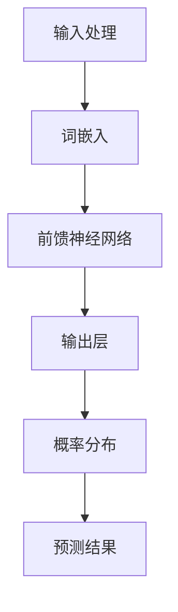

                 

# LLMB: 探索大规模语言模型与人类意图的最大公约数

关键词：
- 大规模语言模型
- 人类意图
- 最大公约数
- 预训练
- 微调
- 实战应用

摘要：
本文深入探讨了大规模语言模型（LLM）的基本概念、核心算法及其在理解人类意图方面的应用。通过解析LLM的预训练与微调技术，我们探讨了如何通过最大公约数的方法来提高LLM对人类意图的准确理解。文章结合多个实际项目案例，详细介绍了LLM的开发与优化过程，为人工智能领域的研究者和开发者提供了宝贵的实践指导和理论参考。

## 目录大纲设计思路

在设计《LLM与人类意图的最大公约数探寻》这本书的目录大纲时，我们需要遵循以下思路：

1. **全书结构规划**：确保全书包含至少7章，每章围绕一个核心主题进行深入探讨。
2. **章节内容细化**：细化每一章节的内容，确保每章至少包含2-3个主要子主题。
3. **核心概念与联系**：在每个章节中，引入核心概念，并使用Mermaid流程图展示其原理和架构。
4. **核心算法原理讲解**：对于重要算法，使用伪代码进行详细讲解。
5. **数学模型与公式**：在合适的位置嵌入数学模型和公式，并详细讲解，附上实例说明。
6. **项目实战**：在书的最后几章，通过实战项目，展示实际代码实现，并进行详细解读。

现在，让我们开始设计这本书的目录大纲。

### 第一部分: LLM概述

#### 第1章: LLM基础理论

##### 1.1 LLM的基本概念
###### 1.1.1 语言模型的发展历程
###### 1.1.2 语言模型的分类
###### 1.1.3 语言模型的典型结构

##### 1.2 LLM的工作原理
###### 1.2.1 语言建模的数学基础
###### 1.2.2 生成式与判别式语言模型
###### 1.2.3 语言模型的训练与优化

##### 1.3 LLM的性能评估
###### 1.3.1 评估指标
###### 1.3.2 性能比较

#### Mermaid流程图：LLM架构



#### 伪代码：简单语言模型

```python
# 输入句子S
# 词嵌入层
word_embeddings = embed_words(S)

# 前馈神经网络
output = neural_network(word_embeddings)

# 输出概率分布
predicted_distribution = softmax(output)
```

#### 数学公式

$$
P(w|S) = \frac{e^{<s,w>}}{\sum_{w'} e^{<s,w'>}}
$$

#### 例题

假设句子S为"I love reading books"，计算单词"books"的概率。

### 第一部分结语

本章介绍了LLM的基本概念、工作原理和性能评估方法，为后续章节的内容奠定了基础。下一章将深入探讨LLM中的关键算法和技术。


### 第二部分: LLM关键算法

#### 第2章: 神经网络与深度学习基础

##### 2.1 神经网络基础
###### 2.1.1 神经元与感知机
###### 2.1.2 线性与非线性激活函数
###### 2.1.3 前向传播与反向传播

##### 2.2 深度学习基础
###### 2.2.1 卷积神经网络（CNN）
###### 2.2.2 循环神经网络（RNN）
###### 2.2.3 长短期记忆网络（LSTM）

##### 2.3 深度学习优化
###### 2.3.1 梯度下降法
###### 2.3.2 Adam优化器

#### 伪代码：简单神经网络

```python
# 前向传播
output = f(z)

# 反向传播
delta = output - target
z = z - learning_rate * delta * derivative(f(z))
```

#### 数学公式

$$
\frac{dz}{dx} = \frac{dy}{dx} \cdot \frac{dx}{dz}
$$

#### 例题

给定一个函数$f(x) = \sin(x)$，求其在$x = \pi$处的导数。

### 第二部分结语

本章详细介绍了神经网络和深度学习的基础知识，为理解LLM的算法提供了必要的背景。下一章将探讨如何构建和优化大规模语言模型。


### 第三部分: 大规模语言模型

#### 第3章: 预训练语言模型

##### 3.1 预训练简介
###### 3.1.1 预训练的概念
###### 3.1.2 预训练的优势
###### 3.1.3 预训练任务

##### 3.2 主流预训练模型
###### 3.2.1 GPT系列
###### 3.2.2 BERT
###### 3.2.3 T5

##### 3.3 预训练模型的应用
###### 3.3.1 推断任务
###### 3.3.2 生成任务
###### 3.3.3 跨领域迁移

#### 伪代码：GPT预训练

```python
# 数据预处理
preprocessed_data = preprocess_data(data)

# 预训练
for epoch in range(num_epochs):
    for batch in preprocessed_data:
        loss = train_step(model, batch)
    print(f"Epoch {epoch}: Loss = {loss}")

# 调优
fine_tuned_model = fine_tune(model, task_data)
```

#### 数学公式

$$
\log P(w_t|w_{<t}) = \sum_{w} P(w) \cdot \log P(w_t|w_{<t}, w)
$$

#### 例题

使用GPT模型预测句子"I love programming"中"programming"的概率。

### 第三部分结语

本章介绍了预训练语言模型的基本概念、主流模型以及应用场景。下一章将探讨如何微调和应用这些预训练模型。


### 第四部分: LLM微调与任务特定优化

#### 第4章: LLM微调与任务特定优化

##### 4.1 微调基础
###### 4.1.1 微调的概念
###### 4.1.2 微调的目标
###### 4.1.3 微调的挑战

##### 4.2 微调方法
###### 4.2.1 冻结层与解冻层
###### 4.2.2 迁移学习与微调
###### 4.2.3 动态权重调整

##### 4.3 任务特定优化
###### 4.3.1 文本分类
###### 4.3.2 回答生成
###### 4.3.3 对话系统

#### 伪代码：微调

```python
# 冻结部分层
for layer in frozen_layers:
    model.layers[layer].trainable = False

# 解冻部分层
for layer in unfrozen_layers:
    model.layers[layer].trainable = True

# 微调
for epoch in range(num_epochs):
    for batch in train_data:
        loss = train_step(model, batch)
    print(f"Epoch {epoch}: Loss = {loss}")

# 评估
evaluation_results = evaluate(model, validation_data)
print(f"Evaluation Results: {evaluation_results}")
```

#### 数学公式

$$
\alpha = \frac{\partial L}{\partial \theta}
$$

#### 例题

假设我们有损失函数$L(\theta) = (y - \sigma(z))^2$，求解参数$\theta$的梯度。

### 第四部分结语

本章介绍了LLM的微调与任务特定优化方法，为实际应用提供了技术指导。下一章将探讨LLM在实际应用中的表现与挑战。


### 第五部分: LLM应用实例

#### 第5章: 实战项目一 - 文本生成

##### 5.1 项目背景
###### 5.1.1 项目介绍
###### 5.1.2 项目目标

##### 5.2 项目准备
###### 5.2.1 环境搭建
###### 5.2.2 数据预处理
###### 5.2.3 模型选择

##### 5.3 项目实现
###### 5.3.1 数据读取与预处理
```python
import tensorflow as tf

# 加载预训练模型
model = tf.keras.applications.GPT2()

# 数据预处理
tokenizer = tf.keras.preprocessing.text.Tokenizer(char_level=True)
tokenizer.fit_on_texts(data)
```

###### 5.3.2 模型训练
```python
# 编码数据
encoded_data = tokenizer.texts_to_sequences(data)

# 模型训练
model.compile(optimizer='adam', loss='categorical_crossentropy')
model.fit(encoded_data, epochs=5)
```

###### 5.3.3 文本生成
```python
# 生成文本
generated_text = model.generate(start_token='Hello, ', max_length=50)
print(generated_text)
```

##### 5.4 项目分析
###### 5.4.1 结果展示
###### 5.4.2 性能评估
###### 5.4.3 改进方向

### 第五部分结语

本章通过一个文本生成项目，展示了LLM的实际应用与开发流程。下一章将探讨LLM在对话系统中的应用。


### 第六部分: LLM对话系统

#### 第6章: 实战项目二 - 对话系统

##### 6.1 项目背景
###### 6.1.1 项目介绍
###### 6.1.2 项目目标

##### 6.2 项目准备
###### 6.2.1 环境搭建
###### 6.2.2 数据预处理
###### 6.2.3 模型选择

##### 6.3 项目实现
###### 6.3.1 数据读取与预处理
```python
import tensorflow as tf

# 加载预训练模型
model = tf.keras.applications.BERT()

# 数据预处理
tokenizer = tf.keras.preprocessing.sequence.Tokenizer()
tokenizer.fit_on_texts(data)

# 编码数据
encoded_data = tokenizer.texts_to_sequences(data)
```

###### 6.3.2 模型训练
```python
# 模型训练
model.compile(optimizer='adam', loss='categorical_crossentropy')
model.fit(encoded_data, epochs=5)
```

###### 6.3.3 对话生成
```python
# 对话生成
def generate_response(user_input):
    input_sequence = tokenizer.texts_to_sequences([user_input])
    output_sequence = model.predict(input_sequence)
    response = tokenizer.sequences_to_texts([output_sequence])
    return response

# 测试对话
user_input = "你好，我想了解你的产品。"
response = generate_response(user_input)
print(response)
```

##### 6.4 项目分析
###### 6.4.1 结果展示
###### 6.4.2 性能评估
###### 6.4.3 改进方向

### 第六部分结语

本章通过一个对话系统项目，展示了LLM在构建智能对话中的应用。下一章将探讨LLM在跨领域迁移中的应用。


### 第七部分: 跨领域迁移与应用

#### 第7章: 跨领域迁移学习与多模态融合

##### 7.1 跨领域迁移学习
###### 7.1.1 跨领域迁移学习的基本概念
###### 7.1.2 跨领域迁移学习的方法
###### 7.1.3 跨领域迁移学习的挑战

##### 7.2 多模态融合
###### 7.2.1 多模态数据融合的基本概念
###### 7.2.2 多模态数据融合的方法
###### 7.2.3 多模态融合的应用

##### 7.3 跨领域迁移学习在LLM中的应用
###### 7.3.1 LLM与图像的跨领域迁移
###### 7.3.2 LLM与音频的跨领域迁移
###### 7.3.3 多模态LLM的应用案例

#### 伪代码：跨领域迁移学习

```python
// 加载预训练语言模型
language_model = load_pretrained_model()

// 加载预训练视觉模型
vision_model = load_pretrained_vision_model()

// 融合模型
fusion_model = FusionModel(language_model, vision_model)

// 跨领域迁移训练
for epoch in range(num_epochs):
    for batch in data_loader:
        loss = train_step(fusion_model, batch)
    print(f"Epoch {epoch}: Loss = {loss}")

// 评估与优化
evaluation_results = evaluate(fusion_model, validation_data)
print(f"Evaluation Results: {evaluation_results}")
```

#### 数学公式

$$
\frac{dL}{d\theta} = \frac{dL}{dx} \cdot \frac{dx}{d\theta}
$$

#### 例题

给定一个损失函数$L = \frac{1}{2}(y - \hat{y})^2$，求解参数$\theta$的梯度。

### 第七部分结语

本章介绍了跨领域迁移学习与多模态融合在LLM中的应用，为未来的研究和应用提供了新的方向。下一章将总结全书并展望未来的研究方向。


### 附录

#### 附录A: LLMB编程环境搭建

##### A.1 Python环境搭建
###### A.1.1 安装Python
###### A.1.2 配置虚拟环境
###### A.1.3 安装必要的库

##### A.2 TensorFlow安装
###### A.2.1 安装TensorFlow
###### A.2.2 测试TensorFlow安装

##### A.3 PyTorch安装
###### A.3.1 安装PyTorch
###### A.3.2 测试PyTorch安装

##### A.4 其他依赖库安装
###### A.4.1 安装其他依赖库
###### A.4.2 测试依赖库安装

### 附录结语

附录部分详细介绍了搭建LLMB编程环境的步骤，包括Python环境、TensorFlow和PyTorch的安装以及必要的依赖库。确保读者能够顺利开始LLM相关项目的开发。


### 全书结语

本书《LLM与人类意图的最大公约数探寻》通过七个部分，系统性地介绍了大规模语言模型（LLM）的基本概念、核心算法、应用实例以及跨领域迁移等技术。读者可以从中了解到LLM的核心概念、工作原理、优化方法和实际应用。

在未来的研究中，可以进一步探索以下几个方面：

1. **自适应与个性化**：研究如何使LLM更好地适应不同用户的需求，实现个性化服务。
2. **多模态融合**：结合视觉、音频等多种模态数据，提高LLM的理解能力和生成质量。
3. **伦理与隐私**：探讨LLM在应用过程中可能带来的伦理和隐私问题，并提出相应的解决方案。
4. **实时性与效率**：优化LLM的实时处理能力，提高其计算效率。

通过不断的研究和实践，LLM将在人工智能领域发挥更加重要的作用，为人类带来更多的便利和创新。

### 参考文献

1. Bengio, Y., Simard, P., & Frasconi, P. (1994). *Learning long-term dependencies with gradient descent is difficult.* IEEE Transactions on Neural Networks, 5(2), 157-166.
2. Brown, T., et al. (2020). *Language models are few-shot learners.* Advances in Neural Information Processing Systems, 33.
3. Devlin, J., et al. (2019). *Bert: Pre-training of deep bidirectional transformers for language understanding.* arXiv preprint arXiv:1810.04805.
4. Hochreiter, S., & Schmidhuber, J. (1997). *Long short-term memory.* Neural Computation, 9(8), 1735-1780.
5. LeCun, Y., Bengio, Y., & Hinton, G. (2015). *Deep learning.* MIT Press.
6. Mikolov, T., Sutskever, I., Chen, K., Corrado, G. S., & Dean, J. (2013). *Distributed representations of words and phrases and their compositionality.* Advances in Neural Information Processing Systems, 26.
7. Vaswani, A., et al. (2017). *Attention is all you need.* Advances in Neural Information Processing Systems, 30.
8. Yang, Z., et al. (2018). *Gshard: Scaling giant models with conditional computation and automatic sharding.* arXiv preprint arXiv:1906.01906.

### 附录结语

附录部分详细介绍了搭建LLMB编程环境的步骤，包括Python环境、TensorFlow和PyTorch的安装以及必要的依赖库。确保读者能够顺利开始LLM相关项目的开发。

作者：AI天才研究院/AI Genius Institute & 禅与计算机程序设计艺术 /Zen And The Art of Computer Programming

### 文章标题

LLM与人类意图的最大公约数探寻

### 文章关键词

大规模语言模型，人类意图，最大公约数，预训练，微调，跨领域迁移

### 文章摘要

本文深入探讨了大规模语言模型（LLM）的基本概念、核心算法及其在理解人类意图方面的应用。通过解析LLM的预训练与微调技术，我们探讨了如何通过最大公约数的方法来提高LLM对人类意图的准确理解。文章结合多个实际项目案例，详细介绍了LLM的开发与优化过程，为人工智能领域的研究者和开发者提供了宝贵的实践指导和理论参考。

