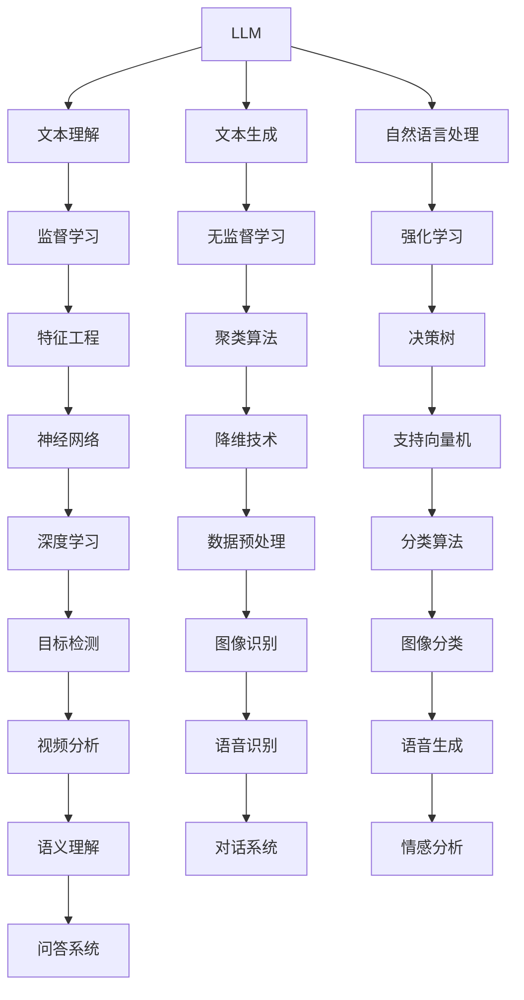

                 

### 第一部分：引言与概述

#### 第1章：LLM与传统AI的融合背景

##### 1.1 LLM与传统AI的定义与联系

**LLM（大型语言模型）** 是一种基于深度学习技术的自然语言处理模型，通过海量数据的预训练，能够理解和生成自然语言。LLM 的发展始于 2018 年，以 OpenAI 的 GPT-3 为标志，其参数规模达到 1750 亿。LLM 的核心原理是基于自注意力机制，通过多层神经网络对输入文本进行建模，实现文本的理解、生成和翻译等功能。

**传统AI** 主要是指 20 世纪末到 2010 年左右发展起来的基于统计学习理论的机器学习技术。传统AI 包括监督学习、无监督学习和强化学习等不同类型。其核心原理是基于特征工程和统计模型，通过训练数据学习特征表示和决策规则，从而实现智能行为。

**LLM与传统AI的关联**：LLM 的发展为传统AI带来了新的机遇和挑战。一方面，LLM 提供了强大的文本理解和生成能力，可以与传统AI算法相结合，解决更复杂、更自然的问题。另一方面，LLM 的出现也对传统AI提出了新的要求，如何将语言处理能力与图像、声音等其他类型的数据处理能力进行有效融合，成为当前研究的热点。

为了更直观地展示 LLM 与传统 AI 的关联，我们可以使用 Mermaid 流程图来描述它们之间的联系。

通过以上 Mermaid 流程图，我们可以看到 LLM 与传统 AI 在文本理解、生成、自然语言处理等方面具有紧密的联系，它们相互补充、相互促进，共同推动人工智能的发展。

##### 1.2 新时代智能革命的重要性

**智能革命的背景**：随着大数据、云计算、物联网等技术的快速发展，人工智能迎来了新的发展机遇。尤其是在深度学习和神经网络技术取得突破后，人工智能的应用场景和规模不断扩展，从工业生产到医疗健康，从金融服务到智能交通，人工智能已经渗透到各个领域，成为推动社会进步的重要力量。

**LLM与传统AI融合带来的变革**：LLM与传统AI的融合，不仅为人工智能的应用提供了更广阔的空间，也带来了以下几方面的变革：

1. **更强大的智能交互能力**：LLM 的文本理解和生成能力，使得人工智能在与人类交互时，能够更自然、更准确地理解和回应用户的需求，提升了交互体验。
2. **更广泛的应用场景**：传统AI 在图像、声音、视频等非文本数据上的处理能力，与 LLM 的文本处理能力相结合，使得人工智能可以应对更多复杂、多样化的应用场景。
3. **更高效的解决方案**：通过 LLM 与传统 AI 的融合，可以构建出更高效、更智能的解决方案，例如在智能客服、智能诊疗、智能安防等领域，显著提升了效率和质量。

**影响与前景**：LLM与传统AI的融合，正在引发一场新的智能革命。它不仅改变了人工智能的技术路径，也深刻影响了社会的各个方面。未来，随着技术的不断进步，LLM与传统AI的融合将带来更多的创新和变革，推动人工智能向更高层次发展。

在接下来的章节中，我们将深入探讨 LLM 和传统 AI 的核心技术基础，以及它们在实际应用中的融合方法，共同揭示这场智能革命背后的技术逻辑和创新思路。

#### 第2章：LLM与传统AI的技术基础

##### 2.1 人工智能与机器学习基础

**人工智能的基本概念**：人工智能（Artificial Intelligence，简称 AI）是指通过计算机程序来模拟人类智能行为和思维过程的技术。它涉及多个学科领域，包括计算机科学、心理学、神经科学、认知科学等。人工智能的目标是使计算机具有类似人类的感知、理解、学习、推理和决策能力。

- **感知**：通过传感器获取外部环境的信息，如视觉、听觉、触觉等。
- **理解**：对获取的信息进行分析和理解，识别和理解语言、图像、声音等。
- **学习**：通过数据学习，不断改进和优化算法，提高系统性能。
- **推理**：基于已有知识和信息进行逻辑推理，做出合理的判断和决策。
- **决策**：在特定情境下，根据目标和约束条件，选择最佳行动方案。

**机器学习的基本原理**：机器学习（Machine Learning，简称 ML）是人工智能的一个重要分支，通过算法从数据中学习规律和模式，实现智能行为。机器学习主要包括以下几种类型：

1. **监督学习（Supervised Learning）**：在有标记的数据集上进行训练，通过学习输入和输出之间的关系，实现对新数据的预测。常见的监督学习算法有线性回归、决策树、支持向量机（SVM）等。
   
2. **无监督学习（Unsupervised Learning）**：在没有标记的数据集上进行训练，通过发现数据内在结构和规律，进行聚类、降维等操作。常见的无监督学习算法有 K-均值聚类、主成分分析（PCA）、自编码器等。

3. **强化学习（Reinforcement Learning）**：通过与环境的交互，学习最优策略，实现长期回报最大化。常见的强化学习算法有 Q-学习、深度 Q 网络（DQN）、策略梯度算法等。

**常见的机器学习算法**：以下是一些常见的机器学习算法及其应用场景：

- **线性回归（Linear Regression）**：用于预测连续值输出，如房价预测、股票价格预测等。
- **逻辑回归（Logistic Regression）**：用于分类任务，如邮件分类、信用评分等。
- **决策树（Decision Tree）**：用于分类和回归任务，如客户流失预测、医疗诊断等。
- **支持向量机（Support Vector Machine，SVM）**：用于分类任务，如手写数字识别、文本分类等。
- **神经网络（Neural Networks）**：用于复杂的数据建模和预测，如图像识别、语音识别等。
- **K-均值聚类（K-Means Clustering）**：用于无监督学习，如客户细分、图像分割等。
- **主成分分析（Principal Component Analysis，PCA）**：用于降维和数据预处理，如人脸识别、数据可视化等。

##### 2.2 LLM的核心技术解析

**预训练技术的原理**：预训练（Pre-training）是 LLM 的核心技术之一，通过对海量数据进行大规模训练，使模型具备强大的文本理解和生成能力。预训练技术主要包括以下步骤：

1. **数据收集与预处理**：收集大量的文本数据，如维基百科、新闻文章、社交媒体等，并进行预处理，包括文本清洗、分词、去停用词等。
2. **模型初始化**：使用预训练模型初始化，如 GPT、BERT 等，这些模型通常具有数十亿个参数，结构复杂。
3. **大规模训练**：在预训练数据集上进行大规模训练，通过优化模型参数，提高模型性能。训练过程中，模型会不断调整参数，以最小化预训练损失函数。

**微调与适应的机制**：微调（Fine-tuning）是 LLM 在特定任务上进行优化的过程。微调的目的是通过少量标注数据进行训练，使模型在特定任务上达到最佳性能。微调机制主要包括以下步骤：

1. **数据准备**：收集与任务相关的标注数据，如文本分类、问答系统等。
2. **模型调整**：将预训练模型调整（如改变学习率、优化器等），以适应特定任务。
3. **训练与评估**：在调整后的模型上进行训练，通过评估指标（如准确率、召回率等）评估模型性能，并根据评估结果调整模型参数。

**模型的训练与优化**：LLM 的训练与优化是一个复杂的过程，涉及到多个方面的技术和策略。以下是一些关键的训练与优化技术：

1. **优化算法**：如 Adam、Adagrad 等，用于调整模型参数，加速收敛速度。
2. **学习率调度**：如余弦退火、学习率衰减等，用于调整学习率，避免过拟合。
3. **正则化技术**：如权重衰减、Dropout 等，用于防止过拟合，提高模型泛化能力。
4. **训练策略**：如多任务学习、迁移学习等，用于提高模型性能和泛化能力。
5. **数据增强**：如随机裁剪、旋转、缩放等，用于扩充训练数据，提高模型鲁棒性。

##### 2.3 传统AI算法概述

**监督学习、无监督学习与强化学习**：传统AI算法主要包括监督学习、无监督学习和强化学习等几种类型。

1. **监督学习（Supervised Learning）**：在有标记的数据集上进行训练，通过学习输入和输出之间的关系，实现对新数据的预测。监督学习算法广泛应用于分类和回归任务。

2. **无监督学习（Unsupervised Learning）**：在没有标记的数据集上进行训练，通过发现数据内在结构和规律，进行聚类、降维等操作。无监督学习算法常用于数据探索、聚类分析等。

3. **强化学习（Reinforcement Learning）**：通过与环境的交互，学习最优策略，实现长期回报最大化。强化学习算法常用于游戏、机器人控制等。

**常见的传统AI算法及应用**：

1. **线性回归（Linear Regression）**：用于预测连续值输出，如房价预测、股票价格预测等。

2. **逻辑回归（Logistic Regression）**：用于分类任务，如邮件分类、信用评分等。

3. **决策树（Decision Tree）**：用于分类和回归任务，如客户流失预测、医疗诊断等。

4. **支持向量机（Support Vector Machine，SVM）**：用于分类任务，如手写数字识别、文本分类等。

5. **神经网络（Neural Networks）**：用于复杂的数据建模和预测，如图像识别、语音识别等。

6. **K-均值聚类（K-Means Clustering）**：用于无监督学习，如客户细分、图像分割等。

7. **主成分分析（Principal Component Analysis，PCA）**：用于降维和数据预处理，如人脸识别、数据可视化等。

通过以上对人工智能、机器学习、LLM 和传统 AI 算法的概述，我们可以看到这些技术之间的联系和差异。在接下来的章节中，我们将进一步探讨 LLM 与传统 AI 的融合方法，以及它们在实际应用中的融合效果和案例。

#### 第3章：LLM与传统AI融合方法

##### 3.1 融合框架设计

**融合架构的设计思路**：LLM与传统AI的融合，旨在发挥各自的优势，实现更高效、更智能的解决方案。融合架构的设计思路主要包括以下几个方面：

1. **协同工作**：LLM 负责处理文本数据，提供语义理解、文本生成等功能；传统AI 负责处理图像、声音、视频等其他类型的数据，提供图像识别、语音识别等功能。两者协同工作，共同完成复杂任务。
2. **数据共享**：通过数据共享机制，将 LLM 和传统 AI 的数据源进行整合，实现数据的高效利用和互补。
3. **模型共享**：在必要时，LLM 和传统 AI 可以共享部分模型，如共同训练的部分基础网络，以降低计算成本和优化性能。
4. **接口开放**：设计开放接口，使得 LLM 和传统 AI 之间可以方便地进行通信和协作。

**模型融合的技术路径**：在融合架构的基础上，我们需要设计具体的模型融合技术路径，以确保融合效果最佳。以下是一些常用的模型融合技术路径：

1. **串联模型**：将 LLM 和传统 AI 模型串联起来，LLM 的输出作为传统 AI 的输入，传统 AI 的输出作为最终输出。这种路径适用于需要对文本数据进行进一步处理的任务，如问答系统、文本生成等。
2. **并联模型**：将 LLM 和传统 AI 模型并联起来，两者的输出通过某种方式融合，得到最终输出。这种路径适用于需要综合文本和非文本数据的任务，如智能客服、智能诊疗等。
3. **混合模型**：将 LLM 和传统 AI 模型混合在一起，共同训练，使模型能够同时处理文本和非文本数据。这种路径适用于需要同时处理多种类型数据的复杂任务，如自动驾驶、智能监控等。

**融合效果的评估方法**：为了评估 LLM 与传统 AI 融合的效果，我们需要设计一套科学的评估方法。以下是一些常用的评估指标和方法：

1. **准确率（Accuracy）**：用于分类任务，表示分类正确的样本数占总样本数的比例。
2. **召回率（Recall）**：用于分类任务，表示分类正确的正样本数占所有正样本数的比例。
3. **F1 分数（F1 Score）**：综合准确率和召回率的指标，用于衡量分类任务的性能。
4. **平均绝对误差（Mean Absolute Error，MAE）**：用于回归任务，表示预测值与真实值之间的平均绝对误差。
5. **均方误差（Mean Squared Error，MSE）**：用于回归任务，表示预测值与真实值之间的均方误差。
6. **模型融合评估方法**：如集成学习（Ensemble Learning）、模型对齐（Model Alignment）等，用于评估融合模型的整体性能。

通过以上设计思路、技术路径和评估方法，我们可以构建一个高效的 LLM 与传统 AI 融合框架，为人工智能应用提供更强大的支持。

##### 3.2 实现策略与优化

**训练策略的优化**：在 LLM 与传统 AI 的融合过程中，训练策略的优化至关重要。以下是一些常用的训练策略优化方法：

1. **学习率调度**：通过动态调整学习率，优化模型训练过程。常用的方法包括余弦退火、学习率衰减等。
2. **批量归一化（Batch Normalization）**：通过归一化每一层的输入，提高模型训练的稳定性和速度。
3. **权重初始化**：通过合理的权重初始化，防止模型训练过程中的梯度消失和梯度爆炸问题。常用的方法包括 Xavier 初始化、He 初始化等。
4. **正则化技术**：通过引入正则化技术，如权重衰减、Dropout 等，防止过拟合，提高模型泛化能力。
5. **多任务学习**：通过多任务学习，同时训练多个相关任务，提高模型的学习效率和泛化能力。

**模型压缩与加速**：为了降低计算成本和提高模型部署的效率，我们可以对 LLM 与传统 AI 模型进行压缩和加速。以下是一些常用的模型压缩与加速方法：

1. **模型剪枝（Model Pruning）**：通过移除模型中不重要的权重，减小模型规模，降低计算成本。常用的方法包括结构化剪枝、量化剪枝等。
2. **量化（Quantization）**：通过降低模型参数的精度，减小模型规模和计算成本。常用的方法包括整数量化、浮点量化等。
3. **知识蒸馏（Knowledge Distillation）**：通过将大型模型的知识传递给小型模型，实现模型压缩和加速。常用的方法包括软目标蒸馏、硬目标蒸馏等。
4. **模型融合**：通过融合多个模型，实现模型压缩和加速。常用的方法包括深度可分离卷积、残差网络等。

**融合算法的改进方向**：在 LLM 与传统 AI 的融合过程中，我们还可以从算法层面进行改进，以提升融合效果和效率。以下是一些改进方向：

1. **自适应融合**：通过自适应机制，根据任务需求和数据特征，动态调整 LLM 和传统 AI 的权重，实现最优融合。
2. **注意力机制**：通过引入注意力机制，使模型能够关注重要信息，提高融合效果。常用的方法包括自注意力（Self-Attention）、多任务注意力（Multi-Task Attention）等。
3. **迁移学习**：通过迁移学习，利用预训练模型在相关任务上的知识，提升融合模型在特定任务上的性能。
4. **多模态学习**：通过多模态学习，将不同类型的数据（如文本、图像、声音等）进行融合，实现更全面、更准确的智能理解。

通过以上实现策略与优化方法，我们可以有效提升 LLM 与传统 AI 融合模型的性能和效率，为人工智能应用提供更强大的支持。

##### 3.3 融合案例解析

**案例研究**：为了展示 LLM 与传统 AI 融合的应用效果，我们选取了智能客服作为案例进行解析。

**背景**：随着互联网和电子商务的快速发展，企业对智能客服系统的需求日益增长。智能客服系统需要同时处理大量文本和语音数据，提供高效、准确的客户服务。

**目标**：通过融合 LLM 和传统 AI 技术，构建一个高效的智能客服系统，实现以下目标：

1. **文本处理**：对用户输入的文本进行语义理解，提取关键信息，并生成相应的回复。
2. **语音识别**：将用户输入的语音转换为文本，与 LLM 进行交互，实现语音客服功能。
3. **多模态融合**：结合文本和语音数据，提供更智能、更自然的客服体验。

**解决方案**：

1. **文本处理**：
   - 使用 LLM 对用户输入的文本进行预处理，如分词、去停用词、词性标注等。
   - 利用 LLM 的语义理解能力，对文本进行解析，提取关键信息。
   - 根据提取的关键信息，生成相应的回复文本。

2. **语音识别**：
   - 使用传统 AI 中的语音识别技术，将用户输入的语音转换为文本。
   - 将语音识别得到的文本输入 LLM，进行语义理解。
   - 根据 LLM 的输出，生成语音回复。

3. **多模态融合**：
   - 结合文本和语音数据，通过融合模型，实现对用户输入的全面理解。
   - 根据融合结果，生成更自然、更准确的客服回复。

**实现过程**：

1. **数据准备**：收集大量文本和语音数据，进行预处理和标注。
2. **模型训练**：
   - 对 LLM 进行预训练，使用预训练模型进行文本理解和生成。
   - 使用传统 AI 算法，对语音识别模型进行训练。
   - 设计融合模型，进行多模态数据融合训练。
3. **模型部署**：将训练好的模型部署到智能客服系统中，提供实时客服服务。

**案例总结与反思**：

1. **优势**：
   - LLM 的文本理解能力强，能够准确提取用户输入的关键信息。
   - 传统 AI 的语音识别技术，实现了语音客服的功能。
   - 多模态融合，提供了更智能、更自然的客服体验。

2. **挑战**：
   - 需要大量的高质量数据，进行模型训练和优化。
   - 需要解决语音识别的准确率和稳定性问题。
   - 需要进一步优化多模态融合算法，提高融合效果。

通过智能客服案例，我们可以看到 LLM 与传统 AI 融合的应用潜力。在实际应用中，我们还需要不断优化融合算法，提升模型性能和用户体验。

#### 第4章：LLM在传统AI任务中的应用

##### 4.1 自然语言处理任务

**文本分类与情感分析**：文本分类（Text Classification）是自然语言处理（Natural Language Processing，NLP）中的一个重要任务，旨在将文本数据自动划分到预定义的类别中。情感分析（Sentiment Analysis）是文本分类的一种特殊形式，主要关注文本中表达的情感倾向，如正面、负面或中性。

- **算法原理**：文本分类通常采用监督学习算法，如朴素贝叶斯、支持向量机（SVM）和深度学习模型（如卷积神经网络、循环神经网络、Transformer）。情感分析则侧重于情感极性的识别，常用的模型有情感词典法和机器学习模型。

- **应用实例**：社交媒体情感分析、产品评论分类、客户满意度调查等。

**机器翻译与问答系统**：机器翻译（Machine Translation，MT）是一种将一种语言的文本自动翻译成另一种语言的技术。问答系统（Question Answering System，QAS）旨在回答用户提出的问题。

- **算法原理**：机器翻译通常采用基于规则的、基于统计的和基于神经网络的翻译方法。问答系统则通常结合了信息检索和自然语言理解技术。

- **应用实例**：跨语言信息检索、智能客服、多语言搜索引擎等。

**知识图谱构建与应用**：知识图谱（Knowledge Graph）是一种用于表示实体及其相互关系的语义网络。它在智能问答、搜索引擎优化、推荐系统等领域有着广泛的应用。

- **算法原理**：知识图谱的构建通常涉及实体识别、关系抽取、实体链接等任务。常用的算法有基于规则的方法和基于机器学习的方法。

- **应用实例**：搜索引擎优化、智能问答系统、推荐系统等。

##### 4.2 计算机视觉任务

**图像识别与目标检测**：图像识别（Image Recognition）是计算机视觉（Computer Vision，CV）中的一个基本任务，旨在识别图像中的物体或场景。目标检测（Object Detection）是图像识别的进一步发展，不仅识别物体，还能定位物体在图像中的位置。

- **算法原理**：图像识别通常采用卷积神经网络（CNN）等深度学习模型。目标检测则结合了分类和定位功能，常用的模型有 R-CNN、YOLO、SSD 等。

- **应用实例**：自动驾驶、安防监控、医疗影像分析等。

**图像生成与风格迁移**：图像生成（Image Generation）是计算机视觉领域的一个重要研究方向，旨在生成具有特定风格或内容的图像。风格迁移（Style Transfer）是一种将一种艺术作品或图像的风格应用到另一种图像上的技术。

- **算法原理**：图像生成通常采用生成对抗网络（GAN）等深度学习模型。风格迁移则基于卷积神经网络和神经风格迁移算法。

- **应用实例**：艺术创作、游戏开发、虚拟现实等。

**视频分析与理解**：视频分析（Video Analysis）是一种从视频中提取有用信息的技术。视频理解（Video Understanding）则进一步涉及对视频内容的理解和解释。

- **算法原理**：视频分析通常结合了图像识别、目标检测和时间序列分析等技术。视频理解则涉及视频语义分割、事件检测等任务。

- **应用实例**：视频监控、智能视频会议、视频搜索等。

##### 4.3 其他应用领域

**智能客服与语音助手**：智能客服（Intelligent Customer Service）是一种基于人工智能技术，自动处理客户咨询和问题的系统。语音助手（Voice Assistant）则通过语音交互方式为用户提供信息和服务。

- **算法原理**：智能客服通常结合了自然语言处理和机器学习技术。语音助手则依赖于语音识别、自然语言理解和语音合成技术。

- **应用实例**：智能客服广泛应用于电商、金融、医疗等行业。语音助手如苹果的 Siri、亚马逊的 Alexa 等。

**金融风控与量化投资**：金融风控（Financial Risk Control）是一种通过技术手段对金融风险进行识别、评估和控制的方法。量化投资（Quantitative Investment）则是一种基于数学模型和算法的投资策略。

- **算法原理**：金融风控通常结合了数据挖掘、机器学习、统计分析等技术。量化投资则涉及时间序列分析、概率论、优化理论等。

- **应用实例**：信用评分、市场预测、投资组合优化等。

**医疗健康与药物发现**：医疗健康（Medical Health）和药物发现（Drug Discovery）是人工智能在生物医学领域的重要应用。

- **算法原理**：医疗健康领域结合了自然语言处理、数据挖掘和机器学习技术。药物发现则涉及分子模拟、结构生物学、机器学习等。

- **应用实例**：疾病预测、个性化医疗、新药研发等。

通过以上对 LLM 在自然语言处理、计算机视觉和其他应用领域的详细介绍，我们可以看到 LLM 的强大应用潜力。在接下来的章节中，我们将进一步探讨 LLM 与传统 AI 融合在行业中的应用场景和挑战。

### 第5章：融合AI在行业中的应用场景

#### 5.1 制造业

**智能工厂与设备预测维护**：智能工厂（Smart Factory）是制造业的未来发展方向，通过引入人工智能技术，实现生产过程的自动化、智能化和高效化。设备预测维护（Predictive Maintenance）是智能工厂中的一项关键技术，它利用机器学习算法和传感器数据，预测设备的故障风险，从而实现预防性维护，减少停机时间和维修成本。

- **算法原理**：设备预测维护通常结合了时间序列分析、故障诊断和机器学习算法。时间序列分析用于分析设备运行数据的变化趋势，故障诊断用于识别设备故障模式，机器学习算法则用于预测设备故障风险。

- **应用实例**：在汽车制造、电子设备制造等行业，智能工厂和设备预测维护已经得到了广泛应用。例如，通过预测设备故障，可以提前安排维护，避免生产中断。

**供应链管理与优化**：供应链管理（Supply Chain Management，SCM）是制造业的重要组成部分，它涉及到从原材料采购到产品交付的整个流程。通过引入人工智能技术，可以实现供应链的实时监控、动态优化和风险管理。

- **算法原理**：供应链管理中，人工智能技术主要应用于需求预测、库存管理和物流优化。需求预测通常采用时间序列分析和机器学习算法，库存管理则涉及到库存优化和库存预警，物流优化则利用优化算法和路径规划技术。

- **应用实例**：在制造业中，通过供应链管理优化，可以提高生产效率，降低库存成本，提高客户满意度。例如，通过需求预测，可以合理安排生产计划，避免生产过剩或短缺。

#### 5.2 金融业

**风险管理与投资策略**：金融业是一个高风险行业，通过引入人工智能技术，可以实现风险管理的自动化和智能化。风险管理系统（Risk Management System，RMS）利用数据挖掘、机器学习和统计分析技术，对市场风险、信用风险、操作风险等进行识别、评估和管理。

- **算法原理**：风险管理系统中，数据挖掘用于发现潜在风险因素，机器学习算法用于构建风险预测模型，统计分析则用于评估风险敞口和风险敞口控制。

- **应用实例**：在金融行业中，风险管理系统广泛应用于市场风险控制、信用风险管理、反欺诈等。例如，通过机器学习模型，可以实时监控市场变化，预测潜在的市场风险。

**信用评估与欺诈检测**：信用评估（Credit Assessment）是金融业的一项重要工作，它通过对借款人信用状况的分析，评估其还款能力和信用风险。欺诈检测（Fraud Detection）则是为了防范金融欺诈行为，保障金融机构和客户的财产安全。

- **算法原理**：信用评估通常结合了数据挖掘、机器学习和信用评分模型。欺诈检测则利用异常检测、行为分析和机器学习算法。

- **应用实例**：在金融行业中，信用评估和欺诈检测广泛应用于贷款审批、信用卡欺诈检测等。例如，通过机器学习模型，可以准确评估借款人的信用风险，提高贷款审批的准确性。

#### 5.3 医疗行业

**疾病预测与诊断**：疾病预测（Disease Prediction）和诊断（Disease Diagnosis）是医疗行业的重要研究方向，通过引入人工智能技术，可以实现疾病的早期预测和精准诊断，提高治疗效果。

- **算法原理**：疾病预测和诊断通常结合了医学知识库、数据挖掘和机器学习算法。医学知识库用于提供疾病的相关信息，数据挖掘则用于发现疾病的数据模式，机器学习算法则用于构建疾病预测和诊断模型。

- **应用实例**：在医疗行业中，疾病预测和诊断广泛应用于疾病筛查、个性化医疗和疾病管理。例如，通过机器学习模型，可以预测疾病发生的风险，为医生提供诊断依据。

**个性化治疗与健康管理**：个性化治疗（Personalized Treatment）和健康管理（Health Management）是医疗行业的发展方向，通过引入人工智能技术，可以实现治疗的个性化、健康管理的智能化。

- **算法原理**：个性化治疗和健康管理通常结合了医学知识库、数据挖掘和机器学习算法。医学知识库用于提供治疗和健康管理的信息，数据挖掘则用于发现治疗和健康管理的数据模式，机器学习算法则用于构建个性化治疗和健康管理模型。

- **应用实例**：在医疗行业中，个性化治疗和健康管理广泛应用于慢性病管理、手术规划、康复护理等。例如，通过机器学习模型，可以为患者提供个性化的治疗方案，提高治疗效果。

#### 5.4 教育行业

**智能教学与学习分析**：智能教学（Intelligent Teaching）和 learning analysis 是教育行业的重要研究方向，通过引入人工智能技术，可以实现教学过程的智能化、个性化，提高教学效果和学习效率。

- **算法原理**：智能教学和 learning analysis 通常结合了自然语言处理、数据挖掘和机器学习算法。自然语言处理用于处理教学过程中的文本数据，数据挖掘则用于分析学生的学习行为和成绩，机器学习算法则用于构建智能教学和学习分析模型。

- **应用实例**：在教育行业中，智能教学和 learning analysis 广泛应用于在线教育、个性化学习、学习诊断等。例如，通过智能教学系统，可以根据学生的学习行为和成绩，提供个性化的学习资源和建议。

**教育资源的智能分配**：教育资源的智能分配（Intelligent Allocation of Educational Resources）是教育行业的重要研究方向，通过引入人工智能技术，可以实现教育资源的合理分配，提高资源利用效率。

- **算法原理**：教育资源的智能分配通常结合了数据挖掘、优化算法和机器学习算法。数据挖掘用于分析教育资源的分布和使用情况，优化算法则用于制定资源分配策略，机器学习算法则用于预测资源需求。

- **应用实例**：在教育行业中，教育资源的智能分配广泛应用于学校管理、在线教育平台、学习资源推荐等。例如，通过智能分配系统，可以根据学生的学习需求和资源利用率，合理分配教育资源，提高教学质量。

通过以上对制造业、金融业、医疗行业和教育行业应用场景的详细介绍，我们可以看到融合 AI 在不同行业中的广泛应用和巨大潜力。在未来的发展中，融合 AI 将继续推动各个行业的智能化、数字化和高效化进程。

### 第三部分：挑战与未来展望

#### 第6章：LLM与传统AI融合面临的挑战

##### 6.1 技术挑战

**计算资源与能耗**：随着 LLM 和传统 AI 模型的不断增大和复杂化，对计算资源的需求也急剧增加。大型语言模型如 GPT-3 和 BERT 通常需要数千亿个参数，训练这些模型需要巨大的计算能力和存储资源。传统的 CPU 和 GPU 显卡已经难以满足这种需求，因此，计算资源成为 LLM 与传统 AI 融合的重要挑战之一。

- **解决思路**：为了应对计算资源的问题，研究者们正在探索以下几种解决方案：
  1. **异构计算**：利用 CPU、GPU、FPGA 和 ASIC 等不同类型的硬件，构建异构计算架构，提高计算效率。
  2. **分布式训练**：将训练任务分布到多个节点上，通过分布式计算技术，实现大规模模型的训练。
  3. **模型压缩**：通过模型压缩技术，如剪枝、量化、蒸馏等，降低模型的复杂度，减少计算资源的需求。

**数据隐私与安全性**：在 LLM 与传统 AI 融合的过程中，数据隐私和安全问题尤为重要。大型语言模型通常需要海量数据进行训练，这些数据可能包含个人隐私信息。如何确保数据在传输、存储和处理过程中的安全性，防止数据泄露和滥用，是一个亟待解决的问题。

- **解决思路**：
  1. **数据加密**：通过数据加密技术，确保数据在传输和存储过程中的安全性。
  2. **隐私保护机制**：采用差分隐私、联邦学习等技术，保护用户数据的隐私。
  3. **安全协议**：设计安全协议，确保数据在跨平台和跨组织之间的传输和共享过程中，不被未经授权的实体访问。

**模型可解释性**：随着 LLM 和传统 AI 模型的复杂度不断提高，模型的决策过程越来越难以解释。对于许多应用场景，特别是涉及生命健康、金融安全等领域的任务，模型的可解释性至关重要。然而，当前许多先进的深度学习模型，如 Transformer 和 GPT，往往缺乏可解释性，这使得用户难以理解和信任这些模型。

- **解决思路**：
  1. **解释性模型**：设计可解释性强的模型，如决策树、线性回归等，这些模型可以清晰地展示决策过程和推理逻辑。
  2. **模型可视化**：通过可视化技术，展示模型的内部结构和决策过程，帮助用户理解模型的运作机制。
  3. **解释性增强**：采用模型解释方法，如 LIME、SHAP 等，为复杂模型提供局部解释，提高模型的可解释性。

##### 6.2 伦理与社会问题

**人工智能伦理**：随着 LLM 与传统 AI 融合技术的不断发展，人工智能在伦理方面的问题也逐渐凸显。例如，人工智能系统可能会产生偏见、歧视或道德风险。如何确保人工智能系统的公正性、透明性和道德性，是一个亟待解决的伦理问题。

- **解决思路**：
  1. **伦理审查**：在人工智能系统的设计和开发过程中，引入伦理审查机制，确保系统的设计和应用符合伦理标准。
  2. **公平性评估**：对人工智能系统进行公平性评估，识别和消除潜在的偏见和歧视。
  3. **道德规范**：制定人工智能领域的道德规范和指导原则，为人工智能的开发和应用提供伦理指导。

**就业影响与社会公正**：人工智能技术的快速发展，可能会对就业市场和社会公正产生重大影响。例如，自动化和智能化技术的应用可能会导致某些工作岗位的消失，从而影响相关从业者的生计。同时，人工智能系统可能会加剧社会不平等，如何确保人工智能技术发展的同时，不损害社会公正，是一个重要问题。

- **解决思路**：
  1. **职业转型与培训**：为受影响的从业者提供职业转型和培训机会，帮助他们适应新的工作环境。
  2. **公平机会**：确保所有人都能公平地受益于人工智能技术，避免技术带来的不平等。
  3. **政策支持**：制定相关政策，支持人工智能技术的发展，同时确保社会公正。

**政策与法规的制定**：随着人工智能技术的不断进步，相关的政策和法规也需要不断完善。如何制定合理、有效的政策和法规，确保人工智能技术的健康、有序发展，是一个重要问题。

- **解决思路**：
  1. **国际合作**：推动国际社会在人工智能领域的合作，共同制定全球性的人工智能政策和法规。
  2. **立法研究**：加强对人工智能技术的研究，为制定合理的政策和法规提供科学依据。
  3. **监管机制**：建立完善的人工智能监管机制，确保人工智能技术的合规性和安全性。

通过以上对 LLM 与传统 AI 融合在技术和社会层面面临的挑战的探讨，我们可以看到，要实现 LLM 与传统 AI 的深度融合，需要克服众多技术和社会问题。在未来的发展中，我们需要不断创新和探索，为 LLM 与传统 AI 融合提供坚实的技术和社会基础。

#### 6.3 融合策略与创新

**新型融合算法的研发**：为了提高 LLM 与传统 AI 融合的效果，新型融合算法的研发成为关键。以下是一些潜在的融合算法创新方向：

1. **多模态深度融合**：设计多模态深度融合算法，能够同时处理文本、图像、声音等多种类型的数据，实现更全面、更准确的智能理解。
2. **迁移学习与联邦学习**：结合迁移学习和联邦学习技术，实现 LLM 与传统 AI 模型的跨域迁移和协作学习，提高模型的泛化能力和隐私保护。
3. **自适应融合机制**：研发自适应融合机制，根据任务需求和数据特征，动态调整 LLM 和传统 AI 的权重和交互方式，实现最优融合效果。

**跨学科合作与融合**：人工智能技术的进步离不开跨学科合作。以下是一些跨学科合作的创新方向：

1. **心理学与认知科学**：结合心理学和认知科学的研究成果，深入理解人类智能的本质和机制，为人工智能的设计和优化提供理论支持。
2. **生物学与医学**：借鉴生物学和医学的知识，开发新型的人工智能算法和模型，提高人工智能在生物医学领域的应用效果。
3. **社会学与经济学**：关注人工智能对社会和经济的影响，研究人工智能与人类社会的互动机制，为人工智能的伦理和社会治理提供指导。

**未来研究方向**：在 LLM 与传统 AI 融合领域，以下研究方向具有重要意义：

1. **高效计算与优化**：研究高效计算和优化方法，降低融合模型的计算复杂度和能耗，提高模型部署的效率和可扩展性。
2. **模型可解释性与可靠性**：提高融合模型的可解释性和可靠性，使其在关键应用场景中能够被用户信任和接受。
3. **隐私保护与安全性**：研究隐私保护和安全性技术，确保 LLM 与传统 AI 融合过程中数据的安全性和用户隐私的保护。

通过新型融合算法的研发、跨学科合作与未来研究方向，我们可以不断推动 LLM 与传统 AI 的深度融合，为人工智能的发展注入新的活力。

### 第7章：LLM与传统AI融合的未来展望

#### 7.1 未来发展趋势

**AI技术的进步**：随着深度学习、自然语言处理、计算机视觉等 AI 技术的不断发展，LLM 与传统 AI 的融合也将迎来更多的创新和突破。以下是一些关键趋势：

1. **模型复杂度与规模提升**：未来的 LLM 模型可能会更加复杂和庞大，拥有更多的参数和层次，从而提高模型的性能和泛化能力。
2. **多模态融合**：多模态融合技术将继续发展，通过结合文本、图像、声音等多种类型的数据，实现更全面、更准确的智能理解。
3. **自监督学习**：自监督学习（Self-Supervised Learning）是一种新兴的 AI 技术，它不需要大量标注数据，而是通过数据自监督的方式训练模型。未来，自监督学习有望成为 LLM 与传统 AI 融合的重要技术途径。

**行业应用的新模式**：随着 LLM 与传统 AI 融合技术的进步，行业应用模式也将发生深刻变革。以下是一些可能的创新方向：

1. **智能化服务**：智能客服、智能助手等应用将继续普及，通过融合 LLM 和传统 AI 技术，提供更高效、更个性化的服务。
2. **自动化决策**：在金融、医疗、制造等行业，人工智能将更多应用于自动化决策和优化，实现生产过程的智能化和高效化。
3. **智能医疗**：通过 LLM 与传统 AI 的融合，实现疾病的预测、诊断和治疗方案的个性化推荐，提高医疗服务的质量和效率。

**AI与传统产业的深度融合**：随着 AI 技术的不断进步，它将在更多传统产业中发挥重要作用，推动产业智能化转型。以下是一些关键领域：

1. **智能制造**：通过 AI 技术实现生产线的自动化、智能化，提高生产效率和产品质量。
2. **智慧城市**：通过 AI 技术实现城市管理的智能化，提高城市管理效率和居民生活质量。
3. **金融科技**：通过 AI 技术实现金融服务的自动化和个性化，提高金融服务的质量和效率。

#### 7.2 技术创新展望

**量子计算与AI的结合**：量子计算是一种具有巨大潜力的新型计算技术，它能够处理传统计算机难以解决的计算问题。未来，量子计算与 AI 的结合有望推动人工智能技术的进一步突破。以下是一些潜在的创新方向：

1. **量子机器学习**：利用量子计算的优势，开发量子机器学习算法，提高模型的训练效率和性能。
2. **量子神经网络**：将量子计算与神经网络相结合，构建量子神经网络，实现更高效的数据处理和模式识别。
3. **量子模拟**：利用量子计算模拟复杂物理系统，为 AI 研究提供新的视角和方法。

**边缘计算与AI融合**：边缘计算（Edge Computing）是一种分布式计算架构，它将计算能力延伸到网络边缘，实现数据本地处理和实时响应。未来，边缘计算与 AI 的融合将推动智能化应用的进一步发展。以下是一些创新方向：

1. **边缘 AI**：将 AI 算法部署到边缘设备上，实现本地数据处理和实时智能响应，降低对中心服务器的依赖。
2. **分布式AI**：通过分布式计算技术，将 AI 算法分布到多个边缘设备上，实现大规模、低延迟的智能计算。
3. **边缘智能协同**：利用边缘设备的协同计算能力，实现分布式智能系统，提高智能应用的整体性能和可靠性。

**人工智能与物联网的融合**：物联网（Internet of Things，IoT）是一种将物理世界中的物体连接到互联网的技术。未来，人工智能与物联网的融合将推动智能家居、智慧城市、智能医疗等领域的创新发展。以下是一些创新方向：

1. **智能物联网**：通过人工智能技术，实现物联网设备的智能感知、智能决策和智能控制。
2. **物联网数据处理**：利用人工智能技术，对物联网设备产生的大量数据进行高效处理和分析，提取有价值的信息。
3. **物联网安全**：利用人工智能技术，加强物联网设备的安全防护，防范网络攻击和数据泄露。

#### 7.3 社会影响的思考

**人类角色与职业转变**：随着 AI 技术的不断发展，人类在某些职业领域中的角色可能会发生转变。一方面，AI 技术将取代一些重复性、低技能的工作，提高生产效率；另一方面，AI 技术也将为人类创造新的职业机会，推动就业结构的变化。

- **解决方案**：
  1. **职业转型培训**：为受影响的从业者提供职业转型和培训机会，帮助他们适应新的工作环境。
  2. **新职业创造**：鼓励创新，推动新兴产业的发展，为人类创造新的就业机会。

**AI伦理与社会责任**：随着 AI 技术的广泛应用，如何确保 AI 伦理和社会责任成为重要议题。以下是一些关键问题：

- **解决方案**：
  1. **伦理审查**：在 AI 系统设计和应用过程中，引入伦理审查机制，确保系统的设计和应用符合伦理标准。
  2. **透明度与可解释性**：提高 AI 系统的透明度和可解释性，使其运作过程和决策逻辑容易被公众理解和监督。
  3. **公平性与公正性**：确保 AI 系统在不同群体之间的公平性和公正性，避免产生偏见和歧视。

**人类与AI的共存**：在未来，人类与 AI 将共同生活和工作，如何实现和谐共存成为关键问题。以下是一些思考：

- **解决方案**：
  1. **协同工作**：人类与 AI 相互协作，共同完成任务，实现优势互补。
  2. **人机交互**：设计人性化的交互界面，提高人类与 AI 之间的沟通效率。
  3. **道德规范**：制定道德规范，明确人类与 AI 的行为准则，确保双方在互动过程中的行为合规。

通过以上对 LLM 与传统 AI 融合的未来发展趋势、技术创新展望以及社会影响的思考，我们可以看到，这场智能革命正不断推动着社会的进步和变革。在未来，我们需要不断创新和探索，以实现人类与 AI 的和谐共存，共同创造更加美好的未来。

### 附录

#### 附录A：LLM与传统AI融合资源推荐

**A.1 开发工具与平台**

1. **TensorFlow**：由 Google 开发的一款开源深度学习框架，支持 Python 和 C++ 等多种编程语言，广泛应用于图像识别、自然语言处理、强化学习等领域。

   - 官网：[TensorFlow 官网](https://www.tensorflow.org/)

2. **PyTorch**：由 Facebook 开发的一款开源深度学习框架，具有灵活、易用等特点，广泛应用于图像识别、自然语言处理、生成模型等领域。

   - 官网：[PyTorch 官网](https://pytorch.org/)

3. **Hugging Face**：一个开源社区，提供丰富的深度学习模型和工具，包括语言模型、文本处理工具、数据集等，是 NLP 领域的重要资源。

   - 官网：[Hugging Face 官网](https://huggingface.co/)

**A.2 学习资源**

1. **在线课程与教程**：
   - **Coursera**：提供多种关于深度学习、机器学习、自然语言处理等领域的在线课程，适合不同层次的学员。
   - **edX**：提供由知名大学和机构提供的免费和付费在线课程，内容涵盖计算机科学、人工智能等多个领域。
   - **Udacity**：提供各种 AI 和深度学习相关的课程，适合希望快速提升技能的学习者。

2. **开源代码与项目**：
   - **GitHub**：全球最大的代码托管平台，可以找到各种深度学习项目、算法实现和论文代码。
   - **AI Research**：由各大研究机构和公司提供的开源项目，包括深度学习模型、工具和算法。

3. **专业书籍与论文**：
   - **《深度学习》（Deep Learning）**：由 Ian Goodfellow、Yoshua Bengio 和 Aaron Courville 共同撰写的深度学习经典教材。
   - **《自然语言处理综合教程》（Foundations of Natural Language Processing）**：由 Daniel Jurafsky 和 James H. Martin 撰写的 NLP 领域的经典教材。
   - **顶级会议与期刊**：如 NeurIPS、ICML、ACL、JMLR 等，发布最新的研究论文和进展。

**A.3 行业报告与趋势分析**

1. **市场研究报告**：
   - **IDC**：国际数据公司（International Data Corporation）发布的关于人工智能和深度学习的市场研究报告。
   - **Gartner**：全球知名的信息技术研究和顾问公司，发布关于人工智能、机器学习等领域的市场分析和预测。

2. **行业应用案例分析**：
   - **IBM AI**：IBM 的人工智能案例库，提供各种行业和领域的 AI 应用案例，展示 AI 技术的实践应用。
   - **微软 AI**：微软的人工智能案例库，展示微软如何利用 AI 技术解决实际问题，涉及多个行业和应用领域。

3. **技术发展趋势预测**：
   - **AI 指数**：AI 指数发布的关于人工智能领域的发展趋势和预测报告。
   - **MIT 技术评论**：MIT 技术评论发布的关于未来科技发展趋势的预测和分析。

通过以上推荐资源，读者可以更好地了解 LLM 与传统 AI 融合的技术和应用，为学习和研究提供有力支持。在人工智能的时代，不断学习和探索是跟上技术发展步伐的关键。希望这些资源能为读者提供有益的帮助。

