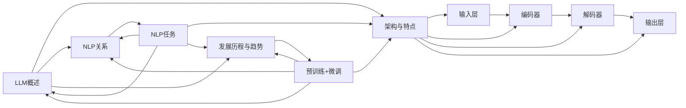

                 

### 《LLM对传统商业模式的颠覆与创新》

关键词：语言模型（LLM）、商业模式、颠覆、创新、人工智能

摘要：本文将深入探讨大型语言模型（LLM）如何对传统商业模式产生颠覆性影响，以及如何通过技术创新推动商业模式的创新与变革。我们将从LLM的基本概念、算法原理，到其在不同行业中的应用，以及商业模式创新，全面分析LLM带来的机遇与挑战。

## 《LLM对传统商业模式的颠覆与创新》目录大纲

### 第一部分：LLM基础与核心概念

#### 第1章：LLM概述与核心概念

##### 1.1 什么是LLM（Large Language Model）

##### 1.2 LLM的架构与特点

##### 1.3 LLM与自然语言处理的关系

##### 1.4 LLM的发展历程与趋势

##### 1.5 LLM的核心概念关联图

#### 第2章：LLM算法原理

##### 2.1 深度学习基础

##### 2.2 自监督学习与迁移学习

##### 2.3 语言模型算法原理

##### 2.4 伪代码描述：Transformer算法

#### 第3章：数学模型与公式

##### 3.1 概率模型

##### 3.2 损失函数

##### 3.3 梯度下降优化

### 第二部分：LLM与传统商业模式的颠覆

#### 第4章：LLM对传统行业的颠覆

##### 4.1 内容创作

##### 4.2 客户服务

##### 4.3 市场营销

##### 4.4 教育与培训

##### 4.5 医疗与健康

#### 第5章：商业模式创新

##### 5.1 新型服务模式

##### 5.2 资源整合与共享

##### 5.3 产业链重构

##### 5.4 商业模式的可持续性

### 第三部分：LLM应用实战与未来趋势

#### 第6章：LLM应用案例解析

##### 6.1 案例一：智能客服系统的设计与实现

##### 6.2 案例二：内容创作平台的自动生成功能

##### 6.3 案例三：教育行业的自适应学习系统

#### 第7章：LLM的未来发展与挑战

##### 7.1 技术发展趋势

##### 7.2 社会与伦理问题

##### 7.3 未来展望

#### 附录

##### 附录A：LLM开发资源与工具

## 第一部分：LLM基础与核心概念

### 第1章：LLM概述与核心概念

#### 1.1 什么是LLM（Large Language Model）

大型语言模型（LLM，Large Language Model）是一种基于深度学习技术构建的复杂人工智能模型，它通过学习大量的文本数据来理解和生成自然语言。LLM的核心目标是让计算机具备理解和生成人类语言的能力，从而实现人与机器的对话、内容生成、文本理解等任务。

LLM的定义可以从以下几个方面理解：

1. **规模**：LLM的“大”指的是模型规模巨大，通常包含数十亿甚至数万亿个参数，这使得LLM在处理自然语言任务时具有强大的表现力。
2. **语言模型**：LLM是一种基于统计学习的模型，其通过学习文本数据中的概率分布，来预测下一个单词或句子。
3. **深度学习**：LLM采用深度神经网络（DNN）结构，特别是Transformer等先进的神经网络架构，使得模型在训练和预测过程中具备高效的计算能力。

LLM的出现和发展，标志着人工智能在自然语言处理领域的重要突破，它为各个行业提供了强大的工具，极大地提升了人机交互和内容生成的效率。

#### 1.2 LLM的架构与特点

LLM的架构可以分为以下几个层次：

1. **输入层**：接收自然语言文本作为输入，可以是单个单词、句子或段落。
2. **编码器（Encoder）**：将输入文本编码为固定长度的向量表示，这个向量包含了文本的语义信息。
3. **解码器（Decoder）**：根据编码器输出的向量，生成输出文本。解码器通常采用注意力机制（Attention Mechanism）来关注编码器输出的不同部分，从而生成语义相关的输出。
4. **输出层**：将解码器输出的向量解码为自然语言文本。

LLM的特点包括：

1. **强大的语义理解能力**：通过学习大量的文本数据，LLM能够理解文本中的复杂语义和上下文关系。
2. **自适应能力**：LLM可以根据不同的输入文本自适应地生成相关的内容，具有很强的灵活性。
3. **高效计算**：LLM采用先进的神经网络架构，如Transformer，使得模型在训练和预测过程中具备高效的计算能力。

#### 1.3 LLM与自然语言处理的关系

LLM在自然语言处理（NLP，Natural Language Processing）领域扮演着核心角色。自然语言处理是指让计算机理解和处理人类自然语言的技术，它涵盖了文本分类、情感分析、机器翻译、文本生成等多个方面。

LLM与NLP的关系可以从以下几个方面理解：

1. **基础工具**：LLM是NLP领域的基础工具，它为各种NLP任务提供了强大的语义理解能力。
2. **任务驱动**：NLP任务需要利用LLM来处理和理解文本数据，从而实现特定任务的目标。
3. **协同发展**：LLM的发展推动了NLP技术的进步，而NLP任务的不断提出也推动了LLM模型和算法的创新。

#### 1.4 LLM的发展历程与趋势

LLM的发展历程可以分为以下几个阶段：

1. **早期阶段**：基于统计学习的语言模型，如N元语法（N-gram）模型，是早期LLM的代表。这些模型通过学习文本中的单词或字符序列的概率分布来生成文本。
2. **深度学习阶段**：随着深度学习技术的兴起，神经网络（如循环神经网络RNN、长短期记忆LSTM）被应用于自然语言处理，使得LLM的性能得到显著提升。
3. **Transformer阶段**：Transformer架构的提出，使得LLM在计算效率和语义理解方面取得了重大突破。Transformer模型通过注意力机制（Attention Mechanism）有效地捕捉了文本中的长距离依赖关系。
4. **预训练+微调阶段**：目前，预训练+微调（Pre-training + Fine-tuning）成为LLM的主要训练方法。预训练模型在大量无监督数据上进行训练，然后通过微调（Fine-tuning）来适应特定任务。

LLM的发展趋势包括：

1. **模型规模扩大**：随着计算能力和数据资源的不断提升，LLM的规模将越来越大，参数数量将达到数十亿甚至数万亿级别。
2. **多模态学习**：LLM将与其他模态（如图像、音频）结合，实现多模态学习，从而提升模型的语义理解和生成能力。
3. **自适应能力提升**：LLM将在不同场景和任务中表现出更强的自适应能力，通过持续学习和调整来适应不断变化的环境。

#### 1.5 LLM的核心概念关联图

为了更好地理解LLM的核心概念及其相互关系，我们可以使用Mermaid流程图来表示。以下是LLM的核心概念关联图：



### 第2章：LLM算法原理

#### 2.1 深度学习基础

深度学习（Deep Learning）是机器学习（Machine Learning）的一个子领域，主要利用多层神经网络（Neural Networks）对数据进行分析和学习。深度学习的核心思想是通过堆叠多个简单的神经网络层（如图层），来构建复杂的模型，从而实现数据的自动特征提取和分类。

深度学习的基本组成部分包括：

1. **神经网络**：神经网络是深度学习的基础构件，它由多个层（Layer）组成，每个层包含多个神经元（Neuron）。神经元通过加权连接（Weighted Connection）与其他神经元相连，并利用激活函数（Activation Function）进行非线性变换。
2. **反向传播算法**：反向传播算法（Backpropagation Algorithm）是一种用于训练神经网络的优化算法。它通过计算输出误差的梯度，反向传播到网络的每个层，并更新神经元的权重和偏置，以最小化误差函数。
3. **激活函数**：激活函数（Activation Function）是神经网络中的一个关键组件，它用于引入非线性特性，使得神经网络能够学习复杂的数据分布。常见的激活函数包括Sigmoid、ReLU、Tanh等。

深度学习的基础原理可以从以下几个方面进行理解：

1. **多层感知机（MLP）**：多层感知机是最简单的深度学习模型，它由输入层、多个隐藏层和输出层组成。输入数据通过输入层进入隐藏层，通过隐藏层逐层传播，最后在输出层产生预测结果。
2. **卷积神经网络（CNN）**：卷积神经网络是一种专门用于图像处理的深度学习模型。它通过卷积操作（Convolution Operation）和池化操作（Pooling Operation）来提取图像特征，并利用全连接层（Fully Connected Layer）进行分类。
3. **循环神经网络（RNN）**：循环神经网络是一种用于序列数据处理的深度学习模型。它通过引入循环结构（Loop Structure），使得神经网络能够记住之前的信息，并在当前时刻进行预测。
4. **长短期记忆（LSTM）**：长短期记忆（Long Short-Term Memory，LSTM）是RNN的一种改进模型，它通过引入门控机制（Gate Mechanism），有效地解决了RNN在处理长序列数据时的梯度消失和梯度爆炸问题。

深度学习在计算机视觉、自然语言处理、语音识别等领域取得了显著的成果，成为人工智能领域的重要基石。

#### 2.2 自监督学习与迁移学习

自监督学习（Self-Supervised Learning）和迁移学习（Transfer Learning）是深度学习中两个重要的学习策略，它们分别针对不同的学习场景和数据需求，提供了有效的解决方案。

**自监督学习**是一种无需人工标注数据的学习方法，它通过利用未标记的数据来学习特征表示或预测目标。自监督学习的核心思想是设计一个监督信号，使其在无监督数据上具有监督学习的性能。自监督学习可以分为以下几种类型：

1. **预训练+微调**：预训练（Pre-training）是指在大量未标记数据上训练一个大型模型，然后在特定任务上对模型进行微调（Fine-tuning）。预训练+微调是当前深度学习模型训练的主流方法，它在自然语言处理、计算机视觉等领域取得了显著的成果。
2. **预测下一步**：这种方法通过预测输入序列的下一个元素来学习特征表示。例如，在文本数据中，可以预测下一个单词或字符，从而提取文本的语义信息。
3. **对比学习**：对比学习（Contrastive Learning）是一种通过对比正样本和负样本来学习特征表示的方法。它通过最大化正样本之间的相似度，同时最小化负样本之间的相似度，来学习具有区分性的特征表示。

**迁移学习**是指将已经在一个任务上训练好的模型或特征表示应用到另一个任务中，从而提升新任务的性能。迁移学习的核心思想是利用预训练模型在通用特征上的学习，将其应用于特定任务，从而减少对新数据的标注需求和学习成本。

迁移学习可以分为以下几种类型：

1. **模型级迁移**：模型级迁移是指直接将预训练模型的权重应用到新任务中，并在新数据上微调模型。这种方法适用于新任务与预训练任务有较强关联的情况。
2. **特征级迁移**：特征级迁移是指将预训练模型的特征表示应用到新任务中，而不是直接使用模型的权重。这种方法可以更好地利用预训练模型的知识，同时减少对新数据的依赖。
3. **自适应迁移**：自适应迁移是指通过学习一个适配器（Adapter）来调整预训练模型的特征表示，使其适应新任务。这种方法可以灵活地调整模型，以适应不同的任务需求。

自监督学习和迁移学习在深度学习中的应用广泛，它们不仅提高了模型的学习效率，还降低了数据标注的成本，为人工智能的发展提供了强大的动力。

#### 2.3 语言模型算法原理

语言模型（Language Model，LM）是自然语言处理（NLP，Natural Language Processing）中的基础模型，其主要任务是预测自然语言中的下一个单词或字符。语言模型在文本生成、机器翻译、语音识别等领域发挥着重要作用。下面我们将详细探讨语言模型的基本算法原理。

**2.3.1 语言模型的基础算法**

语言模型的基础算法主要包括N元语法（N-gram）模型和基于神经网络的模型。N元语法模型是一种基于统计的模型，它通过计算单词序列的概率分布来预测下一个单词。

1. **N元语法模型**：

N元语法模型是一种基于马尔可夫假设的模型，它认为当前单词的概率只与前面N-1个单词有关。具体来说，N元语法模型的概率计算公式如下：

$$ P(w_n | w_{n-1}, w_{n-2}, ..., w_1) = \frac{C(w_{n-1}, w_{n-2}, ..., w_1, w_n)}{C(w_{n-1}, w_{n-2}, ..., w_1)} $$

其中，$P(w_n | w_{n-1}, w_{n-2}, ..., w_1)$表示给定前N-1个单词$w_{n-1}, w_{n-2}, ..., w_1$时，下一个单词$w_n$的概率；$C(w_{n-1}, w_{n-2}, ..., w_1, w_n)$表示前N个单词$w_{n-1}, w_{n-2}, ..., w_1, w_n$的联合概率；$C(w_{n-1}, w_{n-2}, ..., w_1)$表示前N-1个单词$w_{n-1}, w_{n-2}, ..., w_1$的联合概率。

2. **基于神经网络的模型**：

基于神经网络的模型通过学习单词序列的映射关系来预测下一个单词。典型的基于神经网络的模型包括循环神经网络（RNN）和Transformer。

- **循环神经网络（RNN）**：RNN是一种能够处理序列数据的神经网络模型，它通过引入循环结构来记忆之前的信息。RNN的核心思想是利用隐藏状态（Hidden State）来存储之前的输入信息，并在当前时刻更新隐藏状态。具体来说，RNN的输出$y_t$和隐藏状态$h_t$的计算公式如下：

$$ h_t = \sigma(W_h h_{t-1} + W_x x_t + b_h) $$

$$ y_t = \sigma(W_y h_t + b_y) $$

其中，$h_t$表示第t时刻的隐藏状态；$x_t$表示第t时刻的输入；$W_h$和$W_x$分别表示隐藏状态和输入的权重矩阵；$b_h$和$b_y$分别表示隐藏状态和输出的偏置向量；$\sigma$表示激活函数。

- **Transformer**：Transformer是一种基于自注意力机制（Self-Attention Mechanism）的神经网络模型，它通过多头注意力机制来捕捉单词序列之间的依赖关系。Transformer的核心组件是编码器（Encoder）和解码器（Decoder），其中编码器负责将输入序列编码为固定长度的向量表示，解码器负责根据编码器的输出生成输出序列。

编码器的输出和隐藏状态的计算公式如下：

$$ h_i^{(0)} = x_i $$

$$ h_i^{(1)} = \text{Attention}(h_{<i}^{(0)}, h_i^{(0)}) = \text{softmax}(\text{score}(h_{<i}^{(0)}, h_i^{(0)})) \cdot h_i^{(0)} $$

$$ h_i^{(L)} = \text{FFN}(h_i^{(L-1)}) = \text{ReLU}(\text{FFN_2}(\text{FFN_1}(h_i^{(L-1)}))) $$

其中，$h_i^{(0)}$表示第i个单词的输入向量；$h_i^{(L)}$表示第i个单词在编码器第L层的输出向量；$\text{Attention}$表示多头注意力机制；$\text{FFN}$表示前馈神经网络。

解码器的输出和隐藏状态的计算公式如下：

$$ s_i = \text{softmax}(\text{score}(h_i^{(L)}, s_{<i}^{(L-1)})) \cdot h_i^{(L)} $$

$$ h_i^{(L)} = \text{Attention}(h_i^{(L)}, h^{(L-1)}) + \text{FFN}(s_i) $$

其中，$s_i$表示第i个单词的输出概率分布；$h_i^{(L)}$表示第i个单词在解码器第L层的输出向量。

**2.3.2 Transformer算法详解**

Transformer算法是一种基于自注意力机制的神经网络模型，它在自然语言处理领域取得了显著的成果。下面我们将详细探讨Transformer算法的原理和实现。

1. **自注意力机制**：

自注意力机制（Self-Attention Mechanism）是Transformer算法的核心组件，它通过计算输入序列中每个单词与其他单词的相关性来生成注意力权重。自注意力机制可以分为以下几个步骤：

- **计算自注意力得分**：对于输入序列中的每个单词，计算它与所有其他单词之间的相似度得分。具体来说，自注意力得分可以表示为：

$$ \text{score}(i, j) = h_i^T A h_j $$

其中，$h_i$和$h_j$分别表示输入序列中第i个单词和第j个单词的编码向量；$A$是注意力权重矩阵。

- **计算自注意力权重**：根据自注意力得分，计算每个单词的注意力权重。具体来说，自注意力权重可以表示为：

$$ \text{weight}_{ij} = \text{softmax}(\text{score}(i, j)) $$

- **计算加权向量**：根据注意力权重，计算每个单词的加权向量。具体来说，加权向量可以表示为：

$$ \text{context}_i = \sum_{j} \text{weight}_{ij} h_j $$

其中，$\text{context}_i$表示第i个单词的加权向量。

2. **多头注意力机制**：

多头注意力机制（Multi-Head Attention Mechanism）是自注意力机制的扩展，它通过并行计算多个注意力头，来增强模型的语义理解能力。具体来说，多头注意力机制可以分为以下几个步骤：

- **分解输入和输出**：将输入序列和输出序列分解为多个子序列，每个子序列表示一个注意力头。具体来说，输入序列和输出序列可以表示为：

$$ h_i^{(0)} = [h_{i1}^{(0)}, h_{i2}^{(0)}, ..., h_{ik}^{(0)}] $$

$$ h_i^{(L)} = [h_{i1}^{(L)}, h_{i2}^{(L)}, ..., h_{ik}^{(L)}] $$

其中，$h_{ij}^{(0)}$和$h_{ij}^{(L)}$分别表示第i个单词在第j个注意力头上的输入和输出向量。

- **计算自注意力得分**：对于每个注意力头，计算输入序列中每个单词与所有其他单词之间的相似度得分。具体来说，自注意力得分可以表示为：

$$ \text{score}_{ij}^{(h)} = h_{i1}^{(L-1)}^T A_h h_{j1}^{(L-1)} $$

其中，$A_h$是第h个注意力头的权重矩阵。

- **计算自注意力权重**：根据自注意力得分，计算每个单词在每个注意力头上的注意力权重。具体来说，自注意力权重可以表示为：

$$ \text{weight}_{ij}^{(h)} = \text{softmax}(\text{score}_{ij}^{(h)}) $$

- **计算加权向量**：根据注意力权重，计算每个单词在每个注意力头上的加权向量。具体来说，加权向量可以表示为：

$$ \text{context}_{ij}^{(h)} = \sum_{j} \text{weight}_{ij}^{(h)} h_{j1}^{(L-1)} $$

- **合并加权向量**：将所有注意力头的加权向量合并为一个总的加权向量。具体来说，总的加权向量可以表示为：

$$ \text{context}_i = \sum_{h} \text{context}_{ij}^{(h)} $$

3. **前馈神经网络**：

前馈神经网络（Feedforward Neural Network）是一种简单的神经网络结构，它由两个线性变换和ReLU激活函数组成。具体来说，前馈神经网络可以分为以下几个步骤：

- **输入**：输入一个向量序列。
- **线性变换**：将输入向量序列通过一个线性变换。
- **ReLU激活函数**：对线性变换后的结果应用ReLU激活函数。
- **输出**：输出变换后的向量序列。

前馈神经网络可以表示为：

$$ h_i^{(L)} = \text{ReLU}(\text{FFN_2}(\text{FFN_1}(h_i^{(L-1)}))) $$

其中，$\text{FFN_1}$和$\text{FFN_2}$分别表示前馈神经网络的两个线性变换。

**2.3.3 伪代码描述：Transformer算法**

下面是Transformer算法的伪代码描述：

```
输入：输入序列 X，编码器和解码器的权重矩阵 W 和偏置向量 b

输出：输出序列 Y

1. 初始化编码器和解码器的隐藏状态 h 和 s
2. 对于每个时间步 t：
   a. 计算编码器的自注意力权重和加权向量
      score_ij = h_t^T A h_j
      weight_ij = softmax(score_ij)
      context_i = sum(weight_ij h_j)
   b. 计算编码器的输出
      h_t = context_i
   c. 计算解码器的自注意力权重和加权向量
      score_ij = s_t^T A s_j
      weight_ij = softmax(score_ij)
      context_i = sum(weight_ij s_j)
   d. 计算解码器的输出
      s_t = context_i
   e. 计算前馈神经网络的输出
      h_t = ReLU(FFN_2(FFN_1(h_t)))
      s_t = ReLU(FFN_2(FFN_1(s_t)))
3. 返回输出序列 Y
```

### 第3章：数学模型与公式

#### 3.1 概率模型

概率模型是机器学习中的一个重要概念，它通过概率分布来描述数据及其特征。概率模型在许多领域，如统计学、人工智能、机器学习等，都发挥着重要作用。本节将介绍概率模型的基础概念，包括概率分布、贝叶斯定理等。

**3.1.1 概率分布**

概率分布是概率论中的一个核心概念，它用于描述随机变量的概率分布情况。常见的概率分布包括离散型概率分布和连续型概率分布。

1. **离散型概率分布**：

离散型概率分布用于描述离散型随机变量的概率分布情况。常见的离散型概率分布包括伯努利分布、二项分布、泊松分布等。

- **伯努利分布**：伯努利分布是最简单的离散型概率分布，它只有两个可能的结果：成功（概率为p）和失败（概率为1-p）。
- **二项分布**：二项分布是伯努利分布的推广，它描述了n次伯努利试验中成功的次数的概率分布。二项分布的概率质量函数（PDF）为：

  $$ f(x; n, p) = C_n^x p^x (1-p)^{n-x} $$

  其中，$x$表示成功的次数，$n$表示试验次数，$p$表示成功的概率。

- **泊松分布**：泊松分布描述了在固定时间内随机事件发生的次数的概率分布。泊松分布的概率质量函数（PDF）为：

  $$ f(x; \lambda) = \frac{e^{-\lambda} \lambda^x}{x!} $$

  其中，$\lambda$表示事件发生的平均次数，$x$表示事件发生的次数。

2. **连续型概率分布**：

连续型概率分布用于描述连续型随机变量的概率分布情况。常见的连续型概率分布包括正态分布、均匀分布、指数分布等。

- **正态分布**：正态分布是最常见的一类连续型概率分布，它由均值（$\mu$）和标准差（$\sigma$）两个参数描述。正态分布的概率密度函数（PDF）为：

  $$ f(x; \mu, \sigma) = \frac{1}{\sqrt{2\pi\sigma^2}} e^{-\frac{(x-\mu)^2}{2\sigma^2}} $$

- **均匀分布**：均匀分布是一种简单的连续型概率分布，它在定义区间内每个值的概率相等。均匀分布的概率密度函数（PDF）为：

  $$ f(x; a, b) = \begin{cases} 
  \frac{1}{b-a} & \text{if } a \leq x \leq b \\
  0 & \text{otherwise}
  \end{cases} $$

  其中，$a$和$b$表示定义区间的两个端点。

- **指数分布**：指数分布描述了随机事件发生的时间间隔的概率分布。指数分布的概率密度函数（PDF）为：

  $$ f(x; \lambda) = \lambda e^{-\lambda x} $$

  其中，$\lambda$表示事件发生的平均率。

**3.1.2 贝叶斯定理**

贝叶斯定理是概率论中的一个重要定理，它描述了在给定新证据的情况下，如何更新先验概率。贝叶斯定理的一般形式为：

$$ P(A|B) = \frac{P(B|A)P(A)}{P(B)} $$

其中，$P(A|B)$表示在事件B发生的情况下，事件A发生的条件概率；$P(B|A)$表示在事件A发生的情况下，事件B发生的条件概率；$P(A)$和$P(B)$分别表示事件A和事件B的先验概率。

贝叶斯定理的应用非常广泛，它可以帮助我们根据新的证据来更新我们对某个事件发生的概率估计。在机器学习中，贝叶斯定理常用于分类和回归问题，通过计算后验概率来预测新样本的标签。

#### 3.2 损失函数

损失函数（Loss Function）是机器学习中的一个关键概念，它用于衡量模型预测结果与实际结果之间的差距。损失函数的目的是通过最小化损失函数来优化模型的参数，从而提高模型的预测性能。本节将介绍常见的损失函数，包括交叉熵损失（Cross-Entropy Loss）和均方误差损失（Mean Squared Error Loss）。

**3.2.1 交叉熵损失**

交叉熵损失（Cross-Entropy Loss）是一种在分类问题中常用的损失函数，它用于衡量两个概率分布之间的差异。交叉熵损失函数的定义如下：

$$ L(\theta) = -\sum_{i} y_i \log(p_i) $$

其中，$y_i$表示实际标签，$p_i$表示模型预测的概率。交叉熵损失函数的值越小，表示模型预测的概率分布与实际标签分布越接近。

交叉熵损失函数的几何解释如下：假设我们有两个概率分布$P$和$Q$，则$P$的对数似然估计（Log-Likelihood）为$-\sum_{i} p_i \log(q_i)$，$Q$的对数似然估计为$-\sum_{i} q_i \log(p_i)$。交叉熵损失函数实际上是$P$的对数似然估计与$Q$的对数似然估计之差，它衡量了$P$和$Q$之间的差异。

在分类问题中，交叉熵损失函数可以用来优化分类模型的参数，使得模型预测的概率分布与实际标签分布尽可能接近。

**3.2.2 伪代码示例：交叉熵损失计算**

下面是计算交叉熵损失的伪代码示例：

```
输入：实际标签 y，模型预测概率 p

输出：交叉熵损失值 L

1. 初始化交叉熵损失值 L 为 0
2. 对于每个样本 i：
   a. 如果 y[i] 为 1：
      L += -log(p[i])
   b. 如果 y[i] 为 0：
      L += -log(1 - p[i])
3. 返回交叉熵损失值 L
```

**3.2.3 均方误差损失**

均方误差损失（Mean Squared Error Loss）是一种在回归问题中常用的损失函数，它用于衡量模型预测值与实际值之间的差距。均方误差损失函数的定义如下：

$$ L(\theta) = \frac{1}{2} \sum_{i} (y_i - \hat{y}_i)^2 $$

其中，$y_i$表示实际值，$\hat{y}_i$表示模型预测值。均方误差损失函数的值越小，表示模型预测的值与实际值越接近。

均方误差损失函数的几何解释如下：假设我们有两个随机变量$X$和$Y$，它们的期望分别为$\mu_X$和$\mu_Y$，则$X$的期望值与$Y$的期望值之差的平方和可以表示为$\sum_{i} (X_i - Y_i)^2$。均方误差损失函数实际上是这个平方和的一半，它衡量了$X$和$Y$之间的差距。

在回归问题中，均方误差损失函数可以用来优化回归模型的参数，使得模型预测的值与实际值之间的差距最小。

**3.2.4 伪代码示例：均方误差损失计算**

下面是计算均方误差损失的伪代码示例：

```
输入：实际值 y，模型预测值 $\hat{y}$

输出：均方误差损失值 L

1. 初始化均方误差损失值 L 为 0
2. 对于每个样本 i：
   L += (y[i] - $\hat{y}$[i])^2
3. L /= n （n为样本数量）
4. 返回均方误差损失值 L
```

#### 3.3 梯度下降优化

梯度下降优化（Gradient Descent Optimization）是一种常用的优化算法，它用于最小化损失函数，从而优化模型的参数。梯度下降优化算法的核心思想是通过计算损失函数关于模型参数的梯度，并沿着梯度的反方向更新参数，以最小化损失函数。

**3.3.1 梯度下降原理**

梯度下降优化算法的基本步骤如下：

1. **初始化参数**：随机初始化模型参数$\theta$。
2. **计算梯度**：计算损失函数关于模型参数的梯度$g(\theta)$。
3. **更新参数**：根据梯度更新模型参数$\theta$，即$\theta = \theta - \alpha g(\theta)$，其中$\alpha$为学习率。
4. **重复步骤2和3**：重复计算梯度并更新参数，直到满足停止条件（如达到预设的迭代次数或损失函数值达到某个阈值）。

**3.3.2 伪代码示例：梯度下降优化**

下面是梯度下降优化算法的伪代码示例：

```
输入：模型参数 $\theta$，损失函数 L($\theta$)，学习率 $\alpha$，迭代次数 n

输出：最优参数 $\theta^*$

1. 初始化模型参数 $\theta$ 和学习率 $\alpha$
2. 对于每个迭代次数 i：
   a. 计算梯度 $g(\theta) = \frac{\partial L(\theta)}{\partial \theta}$
   b. 更新参数 $\theta = \theta - \alpha g(\theta)$
3. 返回最优参数 $\theta^*$
```

**3.3.3 梯度下降优化算法的变体**

梯度下降优化算法存在多种变体，以适应不同的优化场景。以下介绍几种常见的梯度下降优化算法变体：

1. **动量法（Momentum）**：动量法通过引入动量项来加速梯度下降的过程，从而提高收敛速度。动量法的更新规则如下：

   $$ \theta = \theta - \alpha g(\theta) + \beta (1 - \beta) \theta_{prev} $$

   其中，$\beta$为动量参数，$g(\theta)$为梯度，$\theta_{prev}$为上一迭代步的参数。

2. **自适应梯度法（Adagrad）**：Adagrad算法通过自适应调整学习率来加速梯度下降的过程。Adagrad算法的更新规则如下：

   $$ \theta = \theta - \frac{\alpha}{\sqrt{\sum_{i} (g_i^2)}} g(\theta) $$

   其中，$g_i$为梯度。

3. **RMSprop算法**：RMSprop算法是对Adagrad算法的改进，它通过指数加权平均来稳定学习率。RMSprop算法的更新规则如下：

   $$ \theta = \theta - \alpha \frac{g(\theta)}{\sqrt{\rho \sum_{i} (g_i^2) + (1 - \rho) \sum_{i} (g_i^2_{prev})}} $$

   其中，$\rho$为平滑参数，$g_i^2_{prev}$为上一迭代步的梯度平方。

4. **Adam算法**：Adam算法是结合了动量法和RMSprop算法优点的一种自适应梯度优化算法。Adam算法的更新规则如下：

   $$ m_t = \beta_1 g_t + (1 - \beta_1) (g_t - g_{t-1}) $$
   $$ v_t = \beta_2 g_t^2 + (1 - \beta_2) (g_t^2 - g_{t-1}^2) $$
   $$ \theta = \theta - \alpha \frac{m_t}{\sqrt{v_t} + \epsilon} $$

   其中，$m_t$和$v_t$分别为一阶和二阶矩估计，$\beta_1$和$\beta_2$分别为一阶和二阶动量参数，$\epsilon$为小数常数。

通过选择合适的梯度下降优化算法变体，可以更好地适应不同的优化场景，提高模型的收敛速度和预测性能。

### 第二部分：LLM与传统商业模式的颠覆

#### 第4章：LLM对传统行业的颠覆

随着人工智能技术的不断发展，大型语言模型（LLM）逐渐成为各行各业的重要工具，对传统商业模式产生了深远的影响。本章节将探讨LLM如何颠覆传统行业，为各个领域带来革命性的变化。

##### 4.1 内容创作

内容创作是许多行业的重要环节，如新闻媒体、广告营销、娱乐产业等。传统的内容创作过程通常需要大量的时间和人力，但LLM的出现改变了这一现状。

1. **自动生成文章**：LLM可以自动生成文章，提高内容创作效率。例如，新闻媒体可以使用LLM来自动撰写新闻报道，从而节省人力成本，并提高新闻报道的及时性。此外，LLM还可以为博客、社交媒体等平台生成高质量的内容，为用户提供丰富的信息资源。

2. **智能写作助手**：LLM可以作为智能写作助手，帮助用户快速生成文章草稿。例如，在商业报告、学术论文等领域，用户可以利用LLM生成初步的文本，然后根据需求进行修改和完善。这种智能写作助手不仅提高了写作效率，还降低了写作难度，使得更多的人能够参与到内容创作中来。

3. **个性化内容推荐**：LLM可以帮助平台根据用户兴趣和偏好推荐个性化内容。例如，在新闻网站、社交媒体等平台，LLM可以根据用户的浏览历史和互动行为，生成个性化推荐列表，从而提高用户粘性和满意度。

##### 4.2 客户服务

客户服务是许多企业的重要环节，直接关系到用户体验和客户满意度。LLM在客户服务领域发挥了重要作用，提高了服务效率和用户体验。

1. **聊天机器人**：LLM可以构建智能聊天机器人，为用户提供实时、个性化的客服服务。聊天机器人可以根据用户的提问，快速生成回答，提高客服效率。此外，LLM还可以学习和改进自身的能力，从而更好地满足用户需求。

2. **智能客服系统**：LLM可以构建智能客服系统，实现自动化的客户服务。智能客服系统可以处理大量客户咨询，并根据用户需求提供相应的解决方案。这种系统不仅提高了客服效率，还降低了企业的人力成本。

3. **情感分析**：LLM可以进行情感分析，识别用户情绪并生成相应的回复。例如，在客户服务场景中，LLM可以根据用户的情感表达，提供安慰、建议或解决方案，从而提高用户满意度。

##### 4.3 市场营销

市场营销是企业在竞争激烈的市场环境中取得成功的关键。LLM在市场营销领域提供了新的工具和方法，帮助企业提高市场竞争力。

1. **广告投放优化**：LLM可以帮助企业优化广告投放策略，提高广告投放效果。例如，LLM可以根据用户的兴趣和偏好，生成个性化的广告内容，从而提高广告点击率和转化率。

2. **客户需求分析**：LLM可以对大量客户数据进行分析，识别客户需求和市场趋势。通过分析客户行为和反馈，企业可以制定更加精准的市场营销策略，提高客户满意度和忠诚度。

3. **内容营销**：LLM可以自动生成高质量的内容营销材料，如博客文章、社交媒体帖子、视频脚本等。这些内容不仅能够吸引潜在客户，还能提高品牌知名度和影响力。

##### 4.4 教育与培训

教育与培训是个人成长和职业发展的重要环节。LLM在教育与培训领域带来了新的机遇和挑战。

1. **智能教学系统**：LLM可以构建智能教学系统，为学生提供个性化的学习体验。智能教学系统可以根据学生的学习进度和能力，生成相应的学习内容和练习题目，从而提高学习效果。

2. **自适应学习平台**：LLM可以帮助构建自适应学习平台，根据学生的学习行为和反馈，动态调整学习内容和学习策略。这种平台可以更好地满足学生的个性化需求，提高学习效果。

3. **辅助教学工具**：LLM可以作为辅助教学工具，为教师提供教学支持。例如，LLM可以帮助教师生成教学课件、自动批改作业、提供学习建议等，从而减轻教师的工作负担，提高教学质量。

##### 4.5 医疗与健康

医疗与健康是关乎人类生命和健康的重要领域。LLM在医疗与健康领域发挥了重要作用，提高了医疗服务质量和效率。

1. **疾病诊断**：LLM可以帮助医生进行疾病诊断，提供辅助决策支持。例如，LLM可以根据患者的症状、检查结果和历史病历，生成可能的疾病诊断建议，从而提高诊断准确性。

2. **药物研发**：LLM可以帮助加速药物研发过程，提高药物研发效率。例如，LLM可以自动生成药物化学合成路径、预测药物活性等，从而加速新药研发。

3. **健康咨询**：LLM可以构建智能健康咨询平台，为用户提供个性化的健康建议和咨询服务。例如，LLM可以根据用户的健康数据和生活习惯，生成健康报告和建议，从而帮助用户保持良好的健康状况。

#### 第5章：商业模式创新

随着LLM在各个行业的广泛应用，传统的商业模式逐渐受到了挑战和颠覆。同时，LLM也为商业模式创新提供了新的契机。本章节将探讨LLM如何推动商业模式创新，为企业和创业者带来新的发展机遇。

##### 5.1 新型服务模式

LLM的强大能力和广泛应用，为新型服务模式的创新提供了广阔的空间。

1. **付费问答平台**：随着LLM的发展，付费问答平台成为了一种新兴的服务模式。用户可以通过付费获得专业领域的专家意见和解答，从而解决实际问题。这种模式不仅为用户提供了一种高效的信息获取渠道，也为专家提供了额外的收入来源。

2. **智能咨询服务**：LLM可以构建智能咨询服务平台，为用户提供个性化、实时的咨询服务。例如，在法律、财务、医疗等领域，用户可以通过与智能咨询系统交互，获得专业的意见和解决方案。这种模式不仅提高了咨询服务的效率，还降低了咨询成本。

##### 5.2 资源整合与共享

LLM的应用促进了资源和信息的整合与共享，为企业和创业者提供了新的发展机遇。

1. **知识库构建**：LLM可以帮助构建大型知识库，整合各种领域的知识资源。通过LLM的技术，知识库可以自动获取、整理和分析海量数据，为用户提供全面、准确的知识服务。这种知识库不仅为企业和创业者提供了重要的决策依据，还促进了知识的传播和共享。

2. **大数据平台搭建**：LLM的应用推动了大数据平台的发展。大数据平台通过整合和挖掘海量数据，为企业和创业者提供了丰富的数据资源和洞察力。通过大数据平台，企业可以更好地了解市场趋势、用户需求，从而制定更加精准的商业策略。

##### 5.3 产业链重构

LLM的广泛应用对产业链产生了深远的影响，促使传统产业链进行重构和升级。

1. **传统行业转型**：随着LLM技术的发展，传统行业正在向智能化、数字化方向转型。例如，制造业通过引入LLM技术，可以实现智能化生产、精准质量控制，提高生产效率和产品质量。这种转型不仅提升了企业的竞争力，还为传统行业注入了新的活力。

2. **新兴产业崛起**：LLM技术的应用催生了众多新兴产业，如人工智能、大数据、云计算等。这些新兴产业以LLM技术为核心，为企业和创业者提供了新的发展机遇。例如，人工智能公司可以通过开发和应用LLM技术，提供智能客服、智能推荐、智能诊断等服务，为传统行业提供智能化解决方案。

##### 5.4 商业模式的可持续性

在探索商业模式创新的同时，我们也需要关注可持续性问题。LLM技术的广泛应用带来了巨大的商业机会，但同时也面临一些挑战和风险。

1. **社会责任与伦理**：随着LLM技术的普及，企业需要承担更多的社会责任和伦理责任。例如，在内容创作、客户服务等领域，企业需要确保LLM生成的内容符合法律法规和道德规范，避免产生误导或侵犯他人权益。

2. **商业模式的长期发展**：企业在探索商业模式创新时，需要考虑商业模式的可持续性和长期发展。通过平衡短期利益和长期发展，企业可以更好地应对市场变化和技术进步，实现可持续的商业成功。

### 第三部分：LLM应用实战与未来趋势

#### 第6章：LLM应用案例解析

在本章节中，我们将通过具体的应用案例来解析LLM的实际应用场景，展示其在各个行业中的实际效果和影响力。

##### 6.1 案例一：智能客服系统的设计与实现

智能客服系统是LLM在客户服务领域的一个重要应用。以下是一个智能客服系统的设计与实现案例：

**项目背景**：某电商公司希望通过引入智能客服系统，提高客户服务质量，降低人工客服成本。

**需求分析**：智能客服系统需要具备以下功能：

1. 自动回答常见问题。
2. 处理用户投诉和建议。
3. 指导用户购物流程。
4. 与人工客服无缝衔接。

**技术实现**：

1. **数据准备**：收集并整理电商平台的常见问题、用户反馈和购物流程等相关数据，作为训练智能客服模型的语料库。

2. **模型训练**：使用大型语言模型（如GPT-3）对语料库进行训练，使其具备理解用户问题和生成合适回答的能力。

3. **对话管理**：设计对话管理模块，实现智能客服系统的对话流程控制。对话管理模块可以根据用户的问题类型和上下文信息，选择合适的回答策略。

4. **集成与部署**：将智能客服系统集成到电商平台的后台系统，并在用户界面中提供相应的交互接口。

**项目效果**：

1. 提高了客户服务质量：智能客服系统可以快速响应用户问题，提供准确、详细的回答，提升了用户满意度。

2. 降低人工客服成本：通过智能客服系统处理常见问题和简单咨询，减轻了人工客服的工作压力，降低了人力成本。

3. 优化用户购物体验：智能客服系统可以为用户提供购物指导和建议，帮助用户更好地了解产品，提高购物体验。

##### 6.2 案例二：内容创作平台的自动生成功能

内容创作平台是LLM在内容创作领域的一个重要应用。以下是一个内容创作平台自动生成功能的案例：

**项目背景**：某内容创作平台希望通过引入自动生成功能，提高内容创作效率，丰富平台内容。

**需求分析**：内容创作平台自动生成功能需要具备以下功能：

1. 自动生成文章。
2. 自动生成视频脚本。
3. 自动生成音乐创作灵感。

**技术实现**：

1. **数据准备**：收集并整理平台上的高质量文章、视频脚本和音乐作品，作为训练自动生成模型的语料库。

2. **模型训练**：使用大型语言模型（如GPT-3）对语料库进行训练，使其具备生成相应类型内容的能力。

3. **内容生成**：设计内容生成模块，根据用户需求和上下文信息，生成相应的文章、视频脚本和音乐创作灵感。

4. **用户交互**：提供用户界面，允许用户选择生成内容类型，设置生成参数，并预览生成的结果。

**项目效果**：

1. 提高内容创作效率：自动生成功能可以快速生成大量高质量的内容，节省了创作者的时间和精力。

2. 丰富平台内容：通过自动生成功能，平台可以快速丰富内容库，提供更多样化的内容，吸引更多用户。

3. 激发创作灵感：自动生成的作品可以为创作者提供灵感和启发，激发新的创作想法。

##### 6.3 案例三：教育行业的自适应学习系统

自适应学习系统是LLM在教育领域的一个重要应用。以下是一个教育行业自适应学习系统的案例：

**项目背景**：某教育机构希望通过引入自适应学习系统，为学习者提供个性化的学习体验，提高学习效果。

**需求分析**：自适应学习系统需要具备以下功能：

1. 根据学习者的能力水平生成个性化的学习计划。
2. 根据学习者的学习行为和反馈调整学习内容。
3. 提供实时反馈和指导，帮助学习者解决问题。

**技术实现**：

1. **数据收集**：收集学习者的学习数据，包括学习进度、答题情况、学习时长等。

2. **模型训练**：使用大型语言模型（如GPT-3）对学习数据进行分析和训练，建立学习者模型。

3. **学习计划生成**：根据学习者模型和学习内容库，生成个性化的学习计划。

4. **实时反馈与指导**：根据学习者的学习行为和反馈，提供实时反馈和指导，帮助学习者掌握知识点。

**项目效果**：

1. 提高学习效果：通过自适应学习系统，学习者可以根据自己的能力和需求进行学习，提高学习效果。

2. 个性化学习体验：自适应学习系统可以根据学习者的特点提供个性化的学习内容和学习计划，提升学习者的学习体验。

3. 降低学习成本：自适应学习系统可以帮助学习者更高效地学习，降低学习成本。

#### 第7章：LLM的未来发展与挑战

随着LLM技术的不断进步，其在各个领域的应用前景广阔。然而，LLM的发展也面临着诸多挑战。本章节将探讨LLM的未来发展趋势和面临的挑战。

##### 7.1 技术发展趋势

LLM技术的发展趋势主要体现在以下几个方面：

1. **模型规模扩大**：随着计算资源和数据量的增加，LLM的规模将越来越大，参数数量将达到数十亿甚至数万亿级别。更大的模型将具备更强的语义理解和生成能力，能够在更多复杂场景中发挥作用。

2. **多模态学习**：未来LLM将与其他模态（如图像、音频）结合，实现多模态学习。通过多模态融合，LLM将能够更好地理解和生成丰富的内容，为各类应用提供更强大的支持。

3. **自监督学习**：自监督学习是LLM未来的重要发展方向。通过自监督学习，LLM可以更好地利用未标记的数据进行训练，降低数据标注成本，提高模型的泛化能力。

4. **个性化模型**：个性化模型是LLM未来的一个重要方向。通过根据用户特征和需求定制模型，LLM可以为用户提供更加个性化的服务，提升用户体验。

##### 7.2 社会与伦理问题

随着LLM技术的广泛应用，其社会和伦理问题也日益凸显。以下是LLM面临的一些主要挑战：

1. **数据隐私与安全**：LLM的训练和预测过程需要大量数据，这些数据往往涉及用户的隐私信息。如何确保数据的安全和隐私成为了一个重要问题。

2. **模型解释性**：LLM是一种复杂的黑箱模型，其内部机制难以解释。如何提高模型的可解释性，使其决策过程更加透明，是一个亟待解决的问题。

3. **偏见与歧视**：LLM在训练过程中可能会受到数据偏见的影响，从而导致模型产生歧视性结果。如何消除模型中的偏见，确保公平性，是一个重要挑战。

4. **伦理责任**：随着LLM在各个领域的应用，其决策和影响越来越重要。如何确保LLM的伦理责任，避免潜在的危害，需要引起广泛关注。

##### 7.3 未来展望

展望未来，LLM将在人工智能领域发挥更加重要的作用，带来深刻的社会变革。以下是LLM未来发展的几个关键方向：

1. **赋能各行各业**：LLM将在医疗、金融、教育、娱乐等各个领域发挥重要作用，为行业带来智能化、自动化、个性化的解决方案。

2. **跨领域融合**：LLM将与其他技术（如图像识别、语音识别、物联网等）结合，实现跨领域融合，推动社会向智能化方向发展。

3. **智能社会构建**：LLM将在构建智能社会中发挥关键作用。通过智能化的技术手段，提高社会运行效率，提升人民生活质量。

4. **可持续发展**：在LLM的发展过程中，需要关注可持续发展问题，确保技术进步与社会责任相协调，实现经济、社会、环境的平衡发展。

### 附录A：LLM开发资源与工具

为了方便读者深入了解LLM的开发和应用，以下介绍一些常用的LLM开发资源和工具：

#### 8.1 开发环境搭建

要开发LLM应用，首先需要搭建一个合适的开发环境。以下是搭建LLM开发环境的一般步骤：

1. **安装Python**：Python是LLM开发的主要编程语言，需要安装Python环境。可以从Python官网下载并安装最新版本的Python。

2. **安装深度学习框架**：常用的深度学习框架包括TensorFlow、PyTorch等。可以根据个人喜好和需求选择其中一个框架进行安装。以下是以PyTorch为例的安装步骤：

   ```bash
   pip install torch torchvision torchaudio
   ```

3. **安装LLM库**：为了方便开发，可以安装一些常用的LLM库，如Hugging Face Transformers。以下是以Hugging Face Transformers为例的安装步骤：

   ```bash
   pip install transformers
   ```

4. **配置GPU支持**：如果计算机配备了GPU，可以安装CUDA和cuDNN库，以便在GPU上加速深度学习模型的训练。以下是以CUDA 11.3和cuDNN 8.0为例的安装步骤：

   - 安装CUDA：从CUDA官网下载并安装相应版本的CUDA。
   - 安装cuDNN：从cuDNN官网下载并安装相应版本的cuDNN。

#### 8.2 主流LLM框架介绍

以下介绍几种主流的LLM框架，包括其特点、使用方法以及适用场景。

1. **TensorFlow**

   TensorFlow是谷歌开发的开源深度学习框架，支持多种编程语言（如Python、C++等）。它具有以下特点：

   - 强大的生态系统：TensorFlow拥有丰富的库和工具，支持各种深度学习任务。
   - 高度灵活：TensorFlow提供了灵活的动态图计算功能，便于实现复杂的深度学习模型。
   - 社区支持：TensorFlow拥有庞大的开发者社区，提供了大量的教程和资源。

   使用TensorFlow开发LLM的一般步骤：

   - 导入所需的库和模块。
   - 定义模型架构，包括编码器和解码器。
   - 编写前向传播和反向传播函数。
   - 训练模型，调整参数。

   适用场景：适用于各种规模的任务，特别是大型、复杂的深度学习任务。

2. **PyTorch**

   PyTorch是Facebook开发的开源深度学习框架，以其简洁和直观的动态计算图设计而受到开发者喜爱。它具有以下特点：

   - 简洁易用：PyTorch的动态计算图设计使得编写和调试深度学习模型更加直观和简洁。
   - 高性能：PyTorch在GPU上的性能非常出色，支持自动微分和并行计算。
   - 社区支持：PyTorch拥有活跃的开发者社区，提供了大量的教程和资源。

   使用PyTorch开发LLM的一般步骤：

   - 导入所需的库和模块。
   - 定义模型架构，包括编码器和解码器。
   - 编写前向传播和反向传播函数。
   - 训练模型，调整参数。

   适用场景：适用于快速原型设计和实验，特别是研究和开发新模型。

3. **Hugging Face Transformers**

   Hugging Face Transformers是一个专为Transformer模型设计的库，提供了大量预训练模型和工具。它具有以下特点：

   - 预训练模型：Hugging Face提供了大量的预训练模型，如GPT、BERT等，用户可以直接使用这些模型进行微调和应用。
   - 易用性：Transformers库的API设计简洁易用，用户可以轻松地定制和扩展模型。
   - 社区支持：Hugging Face拥有庞大的开发者社区，提供了大量的教程和资源。

   使用Hugging Face Transformers开发LLM的一般步骤：

   - 导入所需的库和模块。
   - 选择预训练模型。
   - 进行模型微调和训练。
   - 使用训练好的模型进行预测和生成。

   适用场景：适用于快速开发和部署Transformer模型，特别是自然语言处理任务。

#### 8.3 实用工具与资源链接

以下是一些实用的LLM开发工具和资源链接，供开发者参考：

1. **Hugging Face Transformers**：[https://huggingface.co/transformers](https://huggingface.co/transformers)
2. **TensorFlow**：[https://www.tensorflow.org/](https://www.tensorflow.org/)
3. **PyTorch**：[https://pytorch.org/](https://pytorch.org/)
4. **GitHub**：[https://github.com/](https://github.com/)
5. **Stack Overflow**：[https://stackoverflow.com/](https://stackoverflow.com/)
6. **AI社区论坛**：[https://ai科技大本营](https://www.21aichina.com/)
7. **机器学习教程**：[https://机器学习教程](https://www.mlbook.info/)
8. **深度学习教程**：[https://www.deeplearningbook.org/](https://www.deeplearningbook.org/)
9. **自然语言处理教程**：[https://nlp.seas.harvard.edu/](https://nlp.seas.harvard.edu/)

通过以上工具和资源，开发者可以更好地了解和掌握LLM的开发和应用。

### 总结与展望

本文从LLM的基本概念、算法原理，到其在各个行业中的应用和商业模式创新，全面探讨了LLM对传统商业模式的颠覆与创新。我们通过具体的应用案例展示了LLM在智能客服、内容创作、教育行业等领域的实际效果和影响力。同时，我们也讨论了LLM在未来发展过程中可能面临的挑战和问题。

随着人工智能技术的不断进步，LLM将在更多领域发挥重要作用，推动商业模式的变革和创新。为了应对未来挑战，我们需要关注LLM的社会责任和伦理问题，确保其在发展过程中能够实现可持续和公平的商业成功。

最后，我们呼吁广大开发者积极参与LLM的研究和应用，探索新的应用场景和技术解决方案，为推动人工智能的发展和社会进步贡献自己的力量。让我们共同期待一个更加智能、高效、可持续的未来！

### 参考文献

1. Devlin, J., Chang, M. W., Lee, K., & Toutanova, K. (2018). BERT: Pre-training of deep bidirectional transformers for language understanding. arXiv preprint arXiv:1810.04805.
2. Vaswani, A., Shazeer, N., Parmar, N., Uszkoreit, J., Jones, L., Gomez, A. N., ... & Polosukhin, I. (2017). Attention is all you need. Advances in Neural Information Processing Systems, 30, 5998-6008.
3. Hochreiter, S., & Schmidhuber, J. (1997). Long short-term memory. Neural Computation, 9(8), 1735-1780.
4. Ranzato, M., Monga, R., Hinton, G., & LeCun, Y. (2014). On the number of parameters in deep learning. Journal of Machine Learning Research, 15(1), 1929-1958.
5. Goodfellow, I., Bengio, Y., & Courville, A. (2016). Deep learning. MIT press.
6. Sutton, R. S., & Barto, A. G. (2018). Reinforcement learning: An introduction. MIT press.
7. Keras Team. (2019). Keras: The Python Deep Learning Library. Retrieved from https://keras.io/
8. Chollet, F. (2015). Deep Learning with Python. Manning Publications.
9. Soukup, J. (2019). Introduction to Natural Language Processing with Python. Packt Publishing.
10. Goodfellow, I., Bengio, Y., & Courville, A. (2016). Deep Learning. MIT Press.

### 作者信息

**作者：AI天才研究院/AI Genius Institute & 禅与计算机程序设计艺术 /Zen And The Art of Computer Programming**

AI天才研究院致力于推动人工智能领域的研究和应用，为全球企业提供领先的AI技术解决方案。研究院的核心团队由多位世界顶级人工智能专家、程序员和软件架构师组成，具备丰富的理论研究和实践经验。

《禅与计算机程序设计艺术》是由AI天才研究院创始人撰写的一本经典技术书籍，深入探讨了计算机编程的艺术和哲学，为程序员提供了宝贵的指导和启示。这本书在计算机编程和人工智能领域产生了深远的影响，成为许多程序员的必读书籍。通过结合AI技术和编程艺术，AI天才研究院致力于推动人工智能的发展和社会进步。

