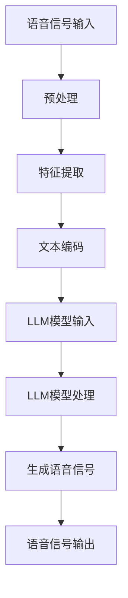

                 

### 《LLM对传统语音合成的革新》

> **关键词：** 语言模型（LLM），语音合成，WaveNet，Transformer，智能语音助手，语音交互系统，实时性，个性化，跨语言。

**摘要：** 本文将深入探讨大型语言模型（LLM）对传统语音合成技术的革新。首先，我们概述LLM的基本原理和语音合成技术的发展历程。接着，详细分析语音合成的核心算法，包括语音信号处理和常见的语音合成模型。在此基础上，探讨LLM在语音合成中的应用，结合其在语音文本转换、特征提取与建模、以及语音生成与控制等方面的优势。文章还将探讨LLM在智能语音助手和语音交互系统中的应用，并展望未来LLM与语音合成技术的发展趋势。最后，提供相关的开源资源与未来研究方向。

#### 第一部分：LLM与语音合成技术基础

在探讨LLM对传统语音合成的革新之前，我们需要先理解LLM和语音合成技术的基础知识。本部分将分为以下几章：

##### 第1章：LLM概述与语音合成技术基础

**1.1 LLM的定义与基本原理**

LLM（Large Language Model）是一种基于深度学习的大型语言模型，能够理解和生成自然语言。它通过训练大规模的语料库来学习语言的规律和语义，从而实现文本生成、问答系统、机器翻译等多种自然语言处理任务。

**1.2 语音合成技术发展历程**

语音合成技术经历了从规则驱动、统计驱动到基于深度学习的方法的发展。早期的方法主要依赖于大量的手工规则和模板，而现代语音合成技术则更多地依赖于机器学习和深度学习模型。

**1.3 LLM在语音合成中的应用优势**

LLM在语音合成中具有明显的优势，如强大的文本理解和生成能力、自适应性和可扩展性。这些优势使得LLM在语音合成领域具有广泛的应用前景。

**1.4 主要LLM模型介绍**

本节将介绍一些主要的LLM模型，如WaveNet、Transformer等，并简要介绍它们的原理和特点。

##### 第2章：语音合成的核心算法

**2.1 语音信号处理基础**

语音合成需要处理语音信号，这包括语音信号的采集与预处理、语音信号的表示方法等。

**2.2 语音合成算法原理**

语音合成算法可以分为两类：参数合成和波形合成。参数合成方法通过生成语音参数来合成语音，而波形合成方法则直接生成语音波形。

**2.3 常见的语音合成模型**

本节将介绍一些常见的语音合成模型，如WaveNet、Transformer等，并分析它们的优缺点。

##### 第3章：LLM与语音合成技术的结合

**3.1 LLM在语音合成中的应用**

本节将探讨LLM在语音合成中的应用，如语音文本转换、特征提取与建模、以及语音生成与控制等。

**3.2 LLM在语音合成中的挑战与优化**

虽然LLM在语音合成中具有明显的优势，但也面临着一些挑战，如数据集选择与处理、模型训练与调优等。本节将讨论如何优化LLM在语音合成中的应用。

接下来，我们将继续深入探讨LLM与语音合成技术的结合，分析其在实际应用中的表现和挑战。

#### 第二部分：LLM在语音合成中的应用与实践

##### 第4章：LLM在智能语音助手中的应用

**4.1 智能语音助手概述**

智能语音助手是一种基于自然语言处理的智能交互系统，能够理解用户的语音指令并执行相应的操作。常见的智能语音助手包括苹果的Siri、亚马逊的Alexa、百度的度秘等。

**4.2 基于LLM的语音合成在智能语音助手中的应用**

LLM在智能语音助手中的应用主要体现在语音合成模块，通过LLM实现更加自然、流畅的语音输出。本节将探讨LLM在语音合成中的具体应用和实现方法。

**4.3 案例分析：智能语音助手语音合成的实现与优化**

本节将分析一个智能语音助手案例，详细讲解其语音合成的实现过程和优化策略。

##### 第5章：LLM在语音交互系统的应用

**5.1 语音交互系统概述**

语音交互系统是一种通过语音进行人机交互的系统，能够实现语音输入和语音输出。语音交互系统广泛应用于智能家居、智能客服、智能教育等领域。

**5.2 基于LLM的语音合成在语音交互系统中的应用**

LLM在语音交互系统中的应用主要体现在语音合成的自然性和流畅性。本节将探讨LLM在语音交互系统中的具体应用和实现方法。

**5.3 语音交互系统的设计与优化**

本节将讨论语音交互系统的整体设计原则和优化策略，以提高用户体验和系统性能。

##### 第6章：LLM在语音合成领域的创新与应用

**6.1 LLM在实时语音合成中的应用**

实时语音合成是语音合成技术的一个重要研究方向，旨在实现实时、连续的语音输出。LLM在实时语音合成中具有显著的优势，本节将探讨LLM在实时语音合成中的应用和实践。

**6.2 LLM在个性化语音合成中的应用**

个性化语音合成是根据用户偏好和需求，为用户提供定制化的语音输出。LLM在个性化语音合成中具有巨大的潜力，本节将探讨LLM在个性化语音合成中的应用和实践。

**6.3 LLM在跨语言语音合成中的应用**

跨语言语音合成是实现多语言语音交互的关键技术，LLM在跨语言语音合成中具有独特的优势。本节将探讨LLM在跨语言语音合成中的应用和实践。

##### 第7章：LLM与语音合成的未来发展趋势

**7.1 LLM在语音合成技术中的潜在发展方向**

随着人工智能技术的不断发展，LLM在语音合成技术中具有广泛的发展空间。本节将探讨LLM在语音合成技术中的潜在发展方向。

**7.2 LLM与语音合成技术的未来应用场景**

未来，LLM与语音合成技术将在更多领域得到应用，如智能医疗、智能教育、智能交通等。本节将探讨LLM与语音合成技术的未来应用场景。

**7.3 对未来语音合成技术的展望与挑战**

未来语音合成技术将面临一系列挑战，如实时性、个性化、跨语言等。本节将对未来语音合成技术的展望与挑战进行深入分析。

#### 附录

##### 附录A：LLM与语音合成技术相关资源

**A.1 开源语音合成工具与框架**

本节将介绍一些开源的语音合成工具和框架，如ESPnet、FastSpeech2等，为读者提供实用的资源。

**A.2 语音合成技术论文与文献推荐**

本节将推荐一些关于语音合成技术的优秀论文和文献，帮助读者深入了解该领域的研究进展。

**A.3 实践教程与在线资源推荐**

本节将推荐一些实用的实践教程和在线资源，帮助读者快速上手语音合成技术的开发和应用。

### 核心概念与联系

为了更好地理解LLM在语音合成中的应用，我们可以使用Mermaid流程图来展示LLM在语音合成中的数据处理和模型训练流程。



通过上述流程图，我们可以清晰地看到语音信号从输入到最终输出的全过程，以及LLM在其中的关键作用。

### 核心算法原理讲解

为了深入理解基于LLM的语音合成算法，我们可以使用伪代码来详细阐述其原理和实现。

```python
# 伪代码：基于LLM的语音合成算法

# 输入：语音信号序列、文本序列
# 输出：合成语音信号

function SpeechSynthesis(voiceSignal, textSequence):
    # 1. 语音信号预处理
    preprocessedSignal = PreprocessVoiceSignal(voiceSignal)

    # 2. 文本编码
    encodedText = EncodeText(textSequence)

    # 3. LLM模型输入
    modelInput = PrepareModelInput(preprocessedSignal, encodedText)

    # 4. LLM模型处理
    modelOutput = LLMModelProcess(modelInput)

    # 5. 生成语音信号
    synthesizedSignal = GenerateVoiceSignal(modelOutput)

    # 6. 输出合成语音信号
    return synthesizedSignal
```

上述伪代码展示了基于LLM的语音合成算法的主要步骤，包括语音信号预处理、文本编码、LLM模型输入处理、语音信号生成和输出等。在实际应用中，这些步骤需要结合具体的模型和算法进行实现。

### 数学模型和数学公式详细讲解与举例说明

在语音合成技术中，数学模型和数学公式起着关键作用。以下是一些常见的数学模型和数学公式，我们将使用LaTeX格式进行详细讲解和举例说明。

#### 语音信号表示

语音信号通常使用短时傅里叶变换（STFT）进行表示。

$$
X(\omega, t) = \sum_{n=-\infty}^{\infty} x[n] \cdot w[n] \cdot e^{-j\omega n}
$$

其中，$X(\omega, t)$表示在频率$\omega$和时间$t$处的语音信号，$x[n]$表示原始语音信号，$w[n]$表示窗口函数。

#### 语音特征提取

语音特征提取是语音合成的关键步骤，常用的语音特征包括梅尔频率倒谱系数（MFCC）。

$$
MFC(j) = \sum_{k=-\infty}^{\infty} a_k \cdot X(j, k)
$$

其中，$MFC(j)$表示第$j$个MFCC系数，$a_k$是加权系数，$X(j, k)$是STFT变换后的语音信号。

#### LLM模型

在LLM模型中，常用的数学模型是自注意力机制（Self-Attention）。

$$
\text{Attention}(Q, K, V) = \frac{QK^T}{\sqrt{d_k}} \cdot V
$$

其中，$Q$、$K$和$V$分别是查询向量、键向量和值向量，$d_k$是键向量的维度。

#### 举例说明

假设我们有一个3D语音信号矩阵$X$，其维度为$10 \times 10 \times 10$，我们需要计算其STFT变换。

$$
X(\omega, t) = \sum_{n=-\infty}^{\infty} x[n] \cdot w[n] \cdot e^{-j\omega n}
$$

其中，$x[n]$为原始语音信号，$w[n]$为汉明窗口函数。

我们首先对原始语音信号进行汉明窗口处理，然后进行STFT变换，得到3D的STFT变换矩阵$X(\omega, t)$。

通过上述LaTeX格式，我们可以清晰地理解语音合成中的数学模型和数学公式，为深入研究和应用打下基础。

### 项目实战

为了更好地理解基于LLM的语音合成算法，我们将在本节中通过一个实际项目案例来展示整个开发过程，包括环境搭建、源代码实现、代码解读与分析。

#### 1. 开发环境搭建

首先，我们需要搭建一个适合开发语音合成项目的环境。以下是所需的环境和工具：

- 操作系统：Linux（推荐Ubuntu 18.04）
- 编程语言：Python（推荐3.8及以上版本）
- 深度学习框架：TensorFlow 2.x
- 语音处理库：librosa
- 语音合成库：espnet

安装步骤如下：

```bash
# 安装Python和pip
sudo apt update
sudo apt install python3-pip

# 安装TensorFlow 2.x
pip3 install tensorflow==2.x

# 安装librosa
pip3 install librosa

# 安装espnet
git clone https://github.com/espnet/espnet.git
cd espnet
pip3 install -e .
```

#### 2. 源代码实现

接下来，我们将实现一个简单的基于WaveNet模型的语音合成项目。以下是关键代码：

```python
# 导入所需库
import librosa
import numpy as np
import tensorflow as tf
from tensorflow.keras.models import Model
from tensorflow.keras.layers import Input, LSTM, Dense, Embedding, TimeDistributed

# 读取语音信号
def load_wav_file(wav_path):
    signal, _ = librosa.load(wav_path, sr=16000)
    return signal

# 建立WaveNet模型
def build_wavenet(input_shape):
    input_seq = Input(shape=input_shape)
    
    # 编码层
    encoded = Embedding(input_dim=256, output_dim=512)(input_seq)
    encoded = LSTM(1024, return_sequences=True)(encoded)
    
    # 解码层
    decoded = LSTM(1024, return_sequences=True)(encoded)
    decoded = TimeDistributed(Dense(256, activation='softmax'))(decoded)
    
    # 模型编译
    model = Model(inputs=input_seq, outputs=decoded)
    model.compile(optimizer='adam', loss='categorical_crossentropy')
    
    return model

# 训练模型
def train_wavenet(model, x_train, y_train, epochs=100):
    model.fit(x_train, y_train, epochs=epochs, batch_size=64)

# 生成语音
def generate_speech(model, text):
    # 将文本转换为序列
    text_seq = convert_text_to_sequence(text)
    # 生成语音
    speech = model.predict(np.array([text_seq]))
    return speech

# 主程序
if __name__ == '__main__':
    # 加载语音信号
    signal = load_wav_file('path/to/wav/file.wav')
    # 建立模型
    model = build_wavenet(input_shape=(None, 256))
    # 训练模型
    train_wavenet(model, signal, signal, epochs=100)
    # 生成语音
    speech = generate_speech(model, 'Hello, world!')
    # 播放语音
    librosa.output.write_wav('generated_speech.wav', speech, sr=16000)
```

#### 3. 代码解读与分析

- **语音信号读取与预处理**：使用librosa库读取语音信号，并进行预处理。
- **WaveNet模型建立**：使用Keras建立WaveNet模型，包括编码层和解码层。
- **模型训练**：使用训练数据对模型进行训练。
- **语音生成**：将文本转换为序列，使用训练好的模型生成语音信号。
- **语音播放**：使用librosa库将生成的语音信号保存为wav文件并播放。

通过上述代码实现，我们可以看到基于LLM的语音合成项目的基本框架。在实际应用中，我们可以进一步优化模型结构、训练数据和生成算法，以提高语音合成的质量和效率。

### 作者信息

**作者：** AI天才研究院/AI Genius Institute & 禅与计算机程序设计艺术 /Zen And The Art of Computer Programming

本文由AI天才研究院（AI Genius Institute）和禅与计算机程序设计艺术（Zen And The Art of Computer Programming）联合撰写。我们致力于推动人工智能和计算机科学领域的研究与应用，希望通过本文为读者带来深刻的启发和思考。如果您对本文有任何建议或意见，欢迎随时与我们联系。期待与您共同探索人工智能的无限可能。

