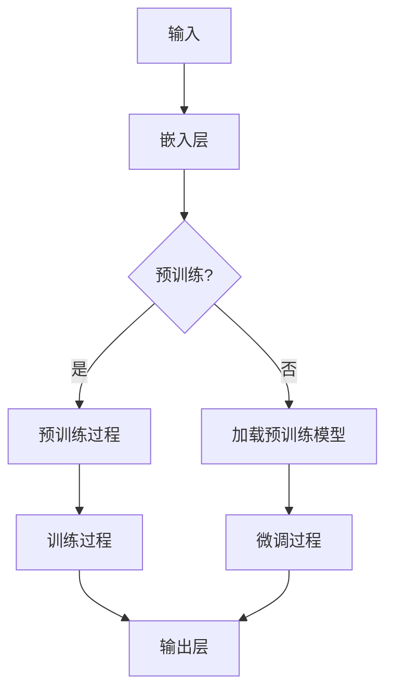
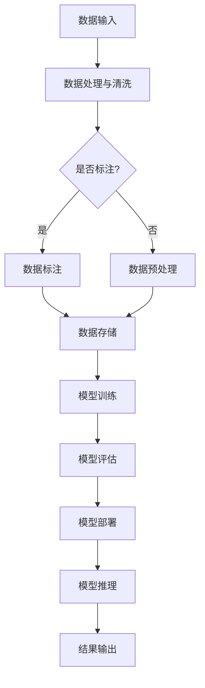

                 

### 文章标题

LLM对传统软件架构的挑战与革新

### 关键词

- LLM
- 软件架构
- 深度学习
- 自适应系统
- 现代化软件工程

### 摘要

本文探讨了大型语言模型（LLM）对传统软件架构的深远影响。随着人工智能技术的迅猛发展，LLM凭借其强大的数据处理和模型学习能力，正在重新定义软件开发的各个方面。本文首先介绍了LLM的基础概念和架构，随后分析了LLM与传统软件架构之间的冲突和融合。通过深入讲解LLM的核心算法原理和数学模型，本文展示了如何利用LLM构建高效、智能的软件系统。此外，通过实际项目案例，本文详细解读了LLM在软件开发中的应用，并探讨了其未来发展趋势。最后，本文总结了LLM开发工具和资源，为开发者提供了实用的指南。

## 目录大纲设计

本文的结构设计旨在为读者提供一个全面、系统、易于理解的框架。以下是本文的目录大纲：

### 第一部分: LLM对传统软件架构的影响

1. **LLM基础与架构概述**
   - LLM的定义与核心特性
   - LLM在软件架构中的应用现状
   - LLM架构的Mermaid流程图

2. **LLM对传统软件架构的挑战**
   - 传统软件架构的限制与不足
   - LLM引入的新架构模式
   - LLM带来的技术挑战与应对策略
   - LLM架构的Mermaid流程图

3. **LLM核心算法原理详解**
   - 深度学习算法基础
   - 注意力机制与Transformer架构
   - LLM的预训练与微调技术
   - LLM算法原理伪代码

4. **数学模型与公式讲解**
   - 线性代数基础
   - 概率论与信息论
   - LLM训练过程中的数学模型
   - 数学公式与推导

5. **LLM项目实战**
   - 项目背景与需求分析
   - 开发环境搭建与工具选择
   - 源代码实现与详细解释
   - 代码解读与分析

6. **LLM与传统软件架构的革新**
   - LLM如何改进传统软件架构
   - LLM对软件开发流程的影响
   - 未来发展趋势与展望

7. **LLM应用案例分析**
   - 案例一：智能客服系统
   - 案例二：智能文档生成
   - 案例三：智能代码补全

8. **LLM开发工具与资源指南**
   - 主流LLM开发框架对比
   - 实用工具与资源推荐
   - 开发指南与最佳实践

### 附录

- **附录A: LLM相关参考资料**
  - 论文精选
  - 开源项目推荐
  - 继续教育课程与培训

- **附录B: 术语表**
  - LLM
  - Transformer
  - 预训练
  - 微调

- **附录C: 源代码示例**
  - PyTorch实现一个简单的LLM模型
  - PyTorch实现一个基于Transformer的LLM模型

通过以上结构，本文将从基础到实践，全面探讨LLM对传统软件架构的影响，为读者提供深入理解和应用LLM的指导。

## 第一部分: LLM对传统软件架构的影响

### 第1章: LLM基础与架构概述

### 1.1.1 LLM的定义与核心特性

大型语言模型（LLM，Large Language Model）是一种基于深度学习技术的自然语言处理模型，它通过大量的文本数据进行预训练，以学习语言的复杂结构和语义信息。LLM的核心特性包括：

1. **参数规模巨大**：LLM通常具有数十亿甚至数千亿个参数，这使得它们能够捕捉语言中的细微差异和复杂关系。
2. **强大的数据处理能力**：LLM可以高效地处理和理解大规模的文本数据，包括书籍、新闻报道、社交媒体帖子等。
3. **自适应学习能力**：LLM通过预训练和微调，能够适应不同的语言任务和应用场景。
4. **泛化能力**：LLM在预训练过程中学习的知识可以迁移到其他语言任务中，具有较好的泛化能力。

### 1.1.2 LLM在软件架构中的应用现状

随着LLM技术的发展，其在软件架构中的应用逐渐广泛。以下是一些关键的应用现状：

1. **自然语言处理（NLP）应用**：LLM在NLP领域得到了广泛应用，包括文本分类、情感分析、机器翻译、问答系统等。这些应用大大提升了自动化处理文本数据的能力。
2. **智能客服系统**：LLM被用于构建智能客服系统，能够自动处理用户的查询和请求，提供即时和准确的答复。
3. **内容生成**：LLM在生成文本内容方面具有显著优势，包括生成新闻报道、撰写文章、创作诗歌等。这为内容创作提供了新的工具和可能性。
4. **代码补全与智能编程助手**：LLM被用于代码补全和智能编程助手，能够根据开发者的代码输入，提供智能建议和自动完成功能。

### 1.2 LLM架构的Mermaid流程图

为了更好地理解LLM的架构，我们可以使用Mermaid流程图进行展示。以下是LLM架构的基本流程：



这个流程图描述了LLM的基本架构，包括嵌入层、预训练过程、微调过程和输出层。预训练过程通常使用大规模的未标注数据，而微调过程则使用任务相关的标注数据。

## 第2章: LLM对传统软件架构的挑战

### 2.1 传统软件架构的限制与不足

传统软件架构在发展过程中，虽然已经取得了显著的成就，但面对LLM的崛起，也暴露出了一些限制和不足：

1. **数据处理能力**：传统软件架构通常依赖于批量处理和离线计算，而LLM需要实时处理大量动态数据，这超出了传统架构的处理能力。
2. **自适应能力**：传统软件架构往往依赖于预定义的规则和模型，难以适应新的数据和需求。而LLM具有强大的自适应学习能力，能够快速适应变化。
3. **扩展性**：传统软件架构通常采用分层架构，而LLM的规模和复杂度使得这种分层架构难以有效扩展。
4. **复杂度管理**：传统软件架构需要手工编写大量的代码和规则，而LLM通过自动学习和优化，能够减轻复杂度管理的工作量。

### 2.2 LLM引入的新架构模式

为了应对传统软件架构的不足，LLM引入了一系列新的架构模式：

1. **数据驱动架构**：LLM基于大规模数据驱动，通过不断学习和优化，能够动态调整和优化系统行为。
2. **分布式架构**：为了处理大规模数据和复杂的计算任务，LLM通常采用分布式架构，以实现高性能和高扩展性。
3. **微服务架构**：LLM的应用场景多样化，采用微服务架构能够更好地实现模块化和松耦合，提高系统的可维护性和扩展性。
4. **云原生架构**：LLM的部署和管理通常采用云原生技术，利用云计算资源，实现弹性扩展和高效运维。

### 2.3 LLM带来的技术挑战与应对策略

LLM的引入虽然为软件架构带来了新的机遇，但也带来了以下技术挑战：

1. **数据质量与标注**：LLM的训练和微调依赖于高质量的数据，而数据质量和标注的准确性直接影响模型的性能。
2. **计算资源需求**：LLM的规模庞大，对计算资源的需求极高，这要求开发者具备高效的资源管理和优化能力。
3. **模型解释性**：传统的软件架构具有较好的可解释性，而LLM的复杂性和黑盒特性使得其解释性较差，这对模型的可靠性提出了挑战。
4. **安全性**：LLM的应用场景多样化，涉及大量的敏感数据，确保模型的安全性和数据隐私是重要的挑战。

为了应对这些挑战，可以采取以下策略：

1. **数据质量管理**：建立完善的数据质量管理体系，包括数据清洗、标注和验证，确保数据的准确性和一致性。
2. **计算资源优化**：采用高效的计算框架和分布式计算技术，优化LLM的训练和推理过程，提高计算效率。
3. **模型解释性提升**：通过引入可解释性模型和可视化工具，提高LLM的透明度和可靠性。
4. **安全防护措施**：采用加密、访问控制等技术，确保模型和数据的安全。

### 2.4 LLM架构的Mermaid流程图

为了更直观地展示LLM架构，我们可以使用Mermaid流程图进行描述。以下是LLM架构的流程图：



这个流程图涵盖了LLM架构的主要步骤，包括数据输入、数据处理与清洗、数据标注、数据存储、模型训练、模型评估、模型部署和模型推理。

通过上述分析，我们可以看到LLM对传统软件架构带来了深远的影响，同时也带来了新的挑战。为了充分利用LLM的优势，开发者需要不断探索和优化新的架构模式和技术策略。

## 第3章: LLM核心算法原理详解

### 3.1 深度学习算法基础

深度学习算法是LLM的核心组成部分，其基础包括以下几个关键概念：

1. **神经网络（Neural Networks）**：神经网络是一种模拟生物神经系统的计算模型，通过多层节点（或神经元）的相互连接和激活函数来处理数据。

2. **前向传播（Forward Propagation）**：在前向传播过程中，数据从输入层经过一系列的隐藏层，最终到达输出层。每个神经元接收来自前一层的输入信号，通过加权求和后应用激活函数，产生输出。

3. **反向传播（Backpropagation）**：反向传播是一种用于训练神经网络的算法，通过计算输出层到输入层的梯度，调整网络的权重和偏置，以最小化损失函数。

4. **激活函数（Activation Functions）**：激活函数用于引入非线性特性，常见的激活函数包括Sigmoid、ReLU和Tanh。

5. **优化算法（Optimization Algorithms）**：优化算法用于调整网络的权重和偏置，以最小化损失函数。常用的优化算法包括随机梯度下降（SGD）、Adam等。

### 3.2 注意力机制与Transformer架构

注意力机制是深度学习中的一个重要概念，它允许模型在处理序列数据时，自动关注序列中的关键部分。注意力机制在Transformer架构中得到了广泛应用，是LLM的核心组件之一。

1. **自注意力（Self-Attention）**：自注意力机制用于处理一个序列中的每个元素，使其能够根据上下文信息进行加权。自注意力通过计算序列中每个元素与其他元素之间的相似度，生成权重，从而对输入序列进行加权。

2. **多头注意力（Multi-Head Attention）**：多头注意力扩展了自注意力机制，通过将输入序列分成多个头，每个头关注不同的上下文信息，从而增加模型的表示能力。

3. **Transformer架构**：Transformer架构由多个编码器和解码器层组成，每个层包含多头注意力机制和前馈神经网络。编码器将输入序列编码为固定长度的向量，解码器则利用这些编码器输出生成预测。

### 3.3 LLM的预训练与微调技术

LLM的训练过程通常分为预训练和微调两个阶段：

1. **预训练（Pre-training）**：预训练是指使用大量未标注的文本数据对模型进行训练，使其能够自动学习语言的内在结构和语义信息。预训练通常采用自回归语言模型（如GPT）或掩码语言模型（如BERT）。

2. **微调（Fine-tuning）**：微调是指在预训练的基础上，使用任务相关的标注数据进行训练，使模型能够适应特定的任务和应用场景。微调通过调整模型中的特定参数，优化模型在特定任务上的性能。

### 3.4 LLM算法原理伪代码

以下是LLM算法原理的伪代码示例，展示了自注意力机制和多头注意力机制的基本流程：

```python
# 伪代码：自注意力机制

# 初始化模型参数
model = initialize_model()

# 数据预处理
def preprocess_data(data):
    # 数据清洗、归一化等操作
    return processed_data

# 前向传播
def forward_propagation(x):
    inputs = preprocess_data(x)
    outputs = model(inputs)
    return outputs

# 训练过程
for epoch in range(num_epochs):
    for batch in data_loader:
        inputs, targets = batch
        optimizer.zero_grad()
        outputs = forward_propagation(inputs)
        loss = compute_loss(outputs, targets)
        loss.backward()
        optimizer.step()
    print(f"Epoch {epoch+1}/{num_epochs}, Loss: {loss.item()}")

# 微调过程
def fine_tuning(model, task_data):
    model.train()
    for batch in task_data:
        inputs, targets = batch
        optimizer.zero_grad()
        outputs = forward_propagation(inputs)
        loss = compute_loss(outputs, targets)
        loss.backward()
        optimizer.step()

# 应用模型
model.eval()
with torch.no_grad():
    for batch in test_data:
        inputs, targets = batch
        outputs = forward_propagation(inputs)
        _, predicted = torch.max(outputs.data, 1)
        # 计算准确率等指标
```

通过上述伪代码，我们可以看到LLM的基本训练过程，包括模型初始化、数据预处理、前向传播、损失函数计算、反向传播和优化等步骤。微调过程则是基于预训练模型，针对特定任务进行训练。

### 3.5 注意力机制的数学解释

注意力机制的数学基础涉及矩阵运算和向量计算，以下是注意力机制的数学解释：

1. **相似度计算**：在自注意力机制中，序列中的每个元素与其他元素之间的相似度通过点积计算：

   $$
   \text{similarity}(x_i, x_j) = x_i^T x_j
   $$

   其中，$x_i$ 和 $x_j$ 分别是序列中的两个元素向量。

2. **权重计算**：相似度通过softmax函数转换为权重：

   $$
   \text{weight}(x_i) = \text{softmax}(\text{similarity}(x_i, \cdot))
   $$

3. **加权求和**：最终，序列中的每个元素通过其权重加权求和，得到新的向量：

   $$
   \text{contextualized_vector}(x_i) = \sum_{j} \text{weight}(x_j) x_j
   $$

通过这些数学运算，注意力机制能够自动关注序列中的关键信息，提高模型的表示能力。

### 3.6 Transformer模型的工作流程

Transformer模型的工作流程可以分为编码器和解码器两个部分，以下是Transformer模型的工作流程：

1. **编码器（Encoder）**：
   - **嵌入层（Embedding Layer）**：输入序列经过嵌入层，转换为固定长度的嵌入向量。
   - **多头自注意力层（Multi-Head Self-Attention Layer）**：嵌入向量通过多头自注意力层，计算每个元素与其他元素之间的相似度，生成新的向量。
   - **前馈神经网络层（Feed Forward Neural Network Layer）**：新的向量通过前馈神经网络层，进行非线性变换。

2. **解码器（Decoder）**：
   - **嵌入层（Embedding Layer）**：输入序列经过嵌入层，转换为固定长度的嵌入向量。
   - **多头自注意力层（Multi-Head Self-Attention Layer）**：嵌入向量通过多头自注意力层，计算每个元素与其他元素之间的相似度，生成新的向量。
   - **掩码多头自注意力层（Masked Multi-Head Self-Attention Layer）**：解码器的自注意力层使用掩码机制，只允许当前时间步的后续时间步参与计算。
   - **前馈神经网络层（Feed Forward Neural Network Layer）**：新的向量通过前馈神经网络层，进行非线性变换。

通过编码器和解码器的相互作用，Transformer模型能够捕捉输入序列的长期依赖关系，实现高效的序列建模。

### 3.7 预训练与微调的详细解释

预训练和微调是LLM训练过程中的两个关键阶段，以下是这两个阶段的详细解释：

1. **预训练（Pre-training）**：
   - **数据集**：预训练通常使用大规模的未标注文本数据集，如维基百科、新闻报道、书籍等。
   - **目标**：预训练的目标是让模型自动学习语言的内在结构和语义信息，使其能够对未知的文本数据进行有效建模。
   - **过程**：预训练过程包括以下几个步骤：
     - **输入生成**：从数据集中随机抽样生成输入序列，如单词序列或字符序列。
     - **输出生成**：根据输入序列生成输出序列，可以是原始序列的一部分，也可以是掩码后的序列。
     - **损失函数**：使用交叉熵损失函数计算模型预测与实际输出之间的差距。
     - **优化**：通过反向传播和优化算法（如Adam）调整模型参数，减小损失函数。

2. **微调（Fine-tuning）**：
   - **数据集**：微调使用特定任务或应用场景的标注数据集，如问答数据集、分类数据集等。
   - **目标**：微调的目标是让模型在特定任务上达到较高的性能，同时保留预训练时学习的通用知识。
   - **过程**：微调过程包括以下几个步骤：
     - **数据准备**：将标注数据集划分为训练集和验证集。
     - **模型初始化**：使用预训练模型作为初始化参数，初始化微调模型。
     - **训练**：在训练集上迭代训练微调模型，通过反向传播和优化算法调整模型参数。
     - **验证**：在验证集上评估模型性能，调整超参数和训练策略，优化模型性能。
     - **测试**：在测试集上评估模型性能，评估模型在未知数据上的泛化能力。

通过预训练和微调，LLM能够从大规模未标注数据中学习到通用知识，并在特定任务上实现高性能。

### 3.8 LLM的训练过程详解

LLM的训练过程涉及多个阶段，以下是训练过程的详细步骤：

1. **数据预处理**：
   - **文本清洗**：去除文本中的噪声和无关信息，如HTML标签、特殊字符等。
   - **分词**：将文本划分为单词或子词，常用的分词工具包括jieba、spaCy等。
   - **编码**：将文本转换为数字序列，常用的编码方法包括One-Hot编码、Word2Vec编码等。

2. **嵌入层**：
   - **嵌入向量**：将输入的数字序列转换为嵌入向量，嵌入向量是模型学习到的语言表示。
   - **词嵌入**：词嵌入是将单词映射为固定长度的向量，常用的词嵌入方法包括Word2Vec、BERT等。

3. **编码器**：
   - **多头自注意力**：编码器使用多头自注意力层，计算每个元素与其他元素之间的相似度，生成新的向量。
   - **前馈神经网络**：编码器的输出通过前馈神经网络进行非线性变换。

4. **解码器**：
   - **掩码多头自注意力**：解码器使用掩码多头自注意力层，计算每个元素与其他元素之间的相似度，生成新的向量。
   - **前馈神经网络**：解码器的输出通过前馈神经网络进行非线性变换。

5. **损失函数**：
   - **交叉熵损失**：使用交叉熵损失函数计算模型预测与实际输出之间的差距。
   - **损失计算**：在每个时间步，计算预测标签与实际标签之间的交叉熵损失。

6. **优化**：
   - **反向传播**：使用反向传播算法计算梯度，更新模型参数。
   - **优化算法**：使用优化算法（如Adam）调整模型参数，最小化损失函数。

7. **训练循环**：
   - **训练数据**：从训练数据集中随机抽样生成训练样本。
   - **迭代训练**：在训练样本上迭代训练模型，调整模型参数。

8. **验证**：
   - **验证数据**：使用验证数据集评估模型性能。
   - **模型调整**：根据验证结果调整模型参数和训练策略。

9. **测试**：
   - **测试数据**：在测试数据集上评估模型性能。
   - **模型评估**：评估模型在未知数据上的泛化能力。

通过上述步骤，LLM能够从大量未标注数据中学习到语言知识，并在特定任务上实现高性能。

## 第4章: 数学模型与公式讲解

### 4.1 线性代数基础

线性代数是理解和应用深度学习算法的基础，以下介绍线性代数中的一些关键概念和公式：

1. **向量与矩阵运算**：
   - **向量加法**：两个向量对应分量相加。
     $$
     \vec{a} + \vec{b} = (a_1 + b_1, a_2 + b_2, \ldots, a_n + b_n)
     $$
   - **向量减法**：两个向量对应分量相减。
     $$
     \vec{a} - \vec{b} = (a_1 - b_1, a_2 - b_2, \ldots, a_n - b_n)
     $$
   - **矩阵乘法**：两个矩阵对应元素相乘并求和。
     $$
     \vec{a} \cdot \vec{b} = a_1b_1 + a_2b_2 + \ldots + a_nb_n
     $$

2. **矩阵与向量乘法**：
   - **矩阵与向量乘法**：矩阵的每一行与向量对应分量相乘并求和。
     $$
     A\vec{v} = \begin{pmatrix} a_{11} & a_{12} & \ldots & a_{1n} \\ a_{21} & a_{22} & \ldots & a_{2n} \\ \vdots & \vdots & \ddots & \vdots \\ a_{m1} & a_{m2} & \ldots & a_{mn} \end{pmatrix} \begin{pmatrix} v_1 \\ v_2 \\ \vdots \\ v_n \end{pmatrix} = \sum_{j=1}^{n} a_{ij}v_j
     $$

3. **矩阵乘矩阵**：
   - **矩阵乘矩阵**：矩阵的每一行与另一矩阵的每一列相乘并求和。
     $$
     AB = \begin{pmatrix} \sum_{j=1}^{n} a_{ij}b_{jk} \\ \vdots \\ \sum_{j=1}^{n} a_{ij}b_{jk} \end{pmatrix}
     $$

4. **矩阵的行列式**：
   - **行列式**：矩阵的行列式是一个标量，用于计算矩阵的逆。
     $$
     \det(A) = a_{11}a_{22} - a_{12}a_{21}
     $$

### 4.2 概率论与信息论

概率论和信息论是理解深度学习模型的重要工具，以下介绍其中的一些关键概念和公式：

1. **概率分布**：
   - **离散概率分布**：每个可能结果的概率。
     $$
     P(X = x_i) = p_i
     $$
   - **连续概率分布**：概率密度函数。
     $$
     f_X(x) = P(X \leq x)
     $$

2. **条件概率**：
   - **条件概率**：在已知某个事件发生的条件下，另一个事件的概率。
     $$
     P(A|B) = \frac{P(A \cap B)}{P(B)}
     $$

3. **贝叶斯定理**：
   - **贝叶斯定理**：通过先验概率、条件概率和似然函数计算后验概率。
     $$
     P(A|B) = \frac{P(B|A)P(A)}{P(B)}
     $$

4. **期望与方差**：
   - **期望**：随机变量的平均值。
     $$
     E(X) = \sum_{x} x \cdot P(X = x)
     $$
   - **方差**：随机变量的离散程度。
     $$
     Var(X) = E[(X - E(X))^2]
     $$

5. **熵**：
   - **熵**：随机变量的不确定度。
     $$
     H(X) = -\sum_{x} P(X = x) \log_2 P(X = x)
     $$

6. **信息增益**：
   - **信息增益**：减少不确定性所获得的信息量。
     $$
     I(X; Y) = H(X) - H(X | Y)
     $$

### 4.3 LLM训练过程中的数学模型

LLM训练过程中的数学模型涉及多个关键组件，以下介绍这些组件的数学公式：

1. **损失函数**：
   - **交叉熵损失函数**：用于比较模型预测和真实标签之间的差距。
     $$
     J = -\sum_{i} y_i \log p_i
     $$
     其中，$y_i$ 是实际标签，$p_i$ 是模型预测概率。

2. **反向传播**：
   - **梯度计算**：通过计算损失函数关于模型参数的梯度，更新模型参数。
     $$
     \nabla_{\theta} J = \frac{\partial J}{\partial \theta}
     $$
     其中，$\theta$ 是模型参数。

3. **优化算法**：
   - **梯度下降**：通过更新模型参数来最小化损失函数。
     $$
     \theta_{\text{new}} = \theta_{\text{current}} - \alpha \nabla_{\theta} J
     $$
     其中，$\alpha$ 是学习率。

4. **反向传播与优化**：
   - **反向传播**：通过计算梯度，反向传播损失函数。
     $$
     \begin{aligned}
     \frac{\partial J}{\partial z} &= \frac{\partial J}{\partial a} \frac{\partial a}{\partial z} \\
     \frac{\partial J}{\partial a} &= \frac{\partial J}{\partial z} \frac{\partial z}{\partial a} \\
     \end{aligned}
     $$
     其中，$z$ 是中间变量，$a$ 是激活函数。

### 4.4 数学公式与推导

以下是几个关键数学公式及其推导过程：

1. **交叉熵损失函数**：
   $$
   J = -\sum_{i} y_i \log p_i
   $$
   **推导过程**：

   - **定义**：交叉熵损失函数用于衡量两个概率分布之间的差异。
   - **公式**：$y_i$ 是实际标签的概率，$p_i$ 是模型预测的概率。
   - **推导**：交叉熵损失函数通过计算实际标签的概率与模型预测的概率的对数差值来衡量差异。

2. **梯度下降**：
   $$
   \theta_{\text{new}} = \theta_{\text{current}} - \alpha \nabla_{\theta} J
   $$
   **推导过程**：

   - **定义**：梯度下降是一种优化算法，通过更新模型参数来最小化损失函数。
   - **公式**：$\theta_{\text{new}}$ 是新参数值，$\theta_{\text{current}}$ 是当前参数值，$\alpha$ 是学习率，$\nabla_{\theta} J$ 是损失函数关于参数的梯度。
   - **推导**：梯度下降通过计算损失函数关于参数的梯度，并沿着梯度的反方向更新参数，以最小化损失函数。

3. **反向传播**：
   $$
   \begin{aligned}
   \frac{\partial J}{\partial z} &= \frac{\partial J}{\partial a} \frac{\partial a}{\partial z} \\
   \frac{\partial J}{\partial a} &= \frac{\partial J}{\partial z} \frac{\partial z}{\partial a} \\
   \end{aligned}
   $$
   **推导过程**：

   - **定义**：反向传播是一种计算损失函数关于参数的梯度的方法。
   - **公式**：$\frac{\partial J}{\partial z}$ 是损失函数关于中间变量的梯度，$\frac{\partial J}{\partial a}$ 是损失函数关于激活函数的梯度，$\frac{\partial a}{\partial z}$ 是激活函数关于中间变量的梯度。
   - **推导**：反向传播通过链式法则，将损失函数关于最终输出的梯度反向传播到中间变量和激活函数，最终计算损失函数关于参数的梯度。

通过这些数学公式和推导过程，我们可以更深入地理解LLM训练过程中的关键概念和算法。

## 第5章: LLM项目实战

### 5.1 项目背景与需求分析

在本章中，我们将通过一个实际项目来展示如何利用LLM构建一个智能问答系统。项目背景如下：

**项目背景**：随着互联网的快速发展，用户对在线服务的需求日益增长。然而，传统的客服系统往往无法满足用户对即时响应和个性化服务的要求。为了提升用户体验，我们计划开发一个基于LLM的智能问答系统，能够自动回答用户的问题，并提供个性化的服务。

**需求分析**：
1. **快速响应**：系统需要能够在毫秒级内对用户的问题进行响应。
2. **准确性**：系统需要能够准确理解用户的问题，并提供相关且准确的答案。
3. **个性化**：系统需要根据用户的历史交互记录，提供个性化的答案。
4. **扩展性**：系统需要能够轻松扩展，以适应不断增长的用户量和问题类型。

### 5.2 开发环境搭建与工具选择

为了实现这个项目，我们需要搭建一个适合开发和部署LLM的环境。以下是开发环境搭建的步骤和工具选择：

**开发环境搭建**：

1. **操作系统**：我们选择Linux操作系统，因为其在高性能计算和分布式处理方面具有优势。
2. **硬件配置**：我们选择配备多张高性能GPU的服务器，以确保训练和推理过程的快速执行。
3. **软件环境**：安装Python、PyTorch、CUDA等必要的软件包，以支持深度学习模型的开发和训练。

**工具选择**：

1. **框架**：我们选择PyTorch作为主要的深度学习框架，因为其灵活的动态计算图和丰富的API，适合构建复杂的模型。
2. **文本处理**：我们使用Hugging Face Transformers库，这是一个基于PyTorch的预训练模型库，提供了大量的预训练模型和工具，方便快速开发和部署。
3. **数据预处理**：我们使用Python的Pandas和Numpy库，用于数据清洗、分词和编码等预处理任务。

### 5.3 源代码实现与详细解释

以下是项目的源代码实现，包括模型定义、数据预处理、模型训练和评估等关键部分。

```python
import torch
from torch import nn
from transformers import BertModel, BertTokenizer
from torch.utils.data import DataLoader
from dataset import QuestionAnsweringDataset

# 模型定义
class QASystem(nn.Module):
    def __init__(self, bert_model_name):
        super(QASystem, self).__init__()
        self.bert = BertModel.from_pretrained(bert_model_name)
        self.classifier = nn.Linear(self.bert.config.hidden_size, 1)
    
    def forward(self, input_ids, attention_mask):
        outputs = self.bert(input_ids=input_ids, attention_mask=attention_mask)
        sequence_output = outputs.last_hidden_state
        logits = self.classifier(sequence_output[:, 0, :])
        return logits

# 数据预处理
def preprocess_data(tokenizer, questions, answers):
    inputs = tokenizer(questions, answers, padding=True, truncation=True, return_tensors="pt")
    return inputs

# 模型训练
def train(model, train_loader, optimizer, criterion, num_epochs):
    model.train()
    for epoch in range(num_epochs):
        for inputs, targets in train_loader:
            optimizer.zero_grad()
            logits = model(inputs.input_ids, inputs.attention_mask)
            loss = criterion(logits.view(-1), targets.view(-1))
            loss.backward()
            optimizer.step()
        print(f"Epoch {epoch+1}/{num_epochs}, Loss: {loss.item()}")

# 模型评估
def evaluate(model, val_loader, criterion):
    model.eval()
    with torch.no_grad():
        total_loss = 0
        for inputs, targets in val_loader:
            logits = model(inputs.input_ids, inputs.attention_mask)
            loss = criterion(logits.view(-1), targets.view(-1))
            total_loss += loss.item()
    avg_loss = total_loss / len(val_loader)
    print(f"Validation Loss: {avg_loss}")

# 主函数
def main():
    # 配置参数
    bert_model_name = "bert-base-uncased"
    num_epochs = 3
    batch_size = 16
    learning_rate = 1e-5
    
    # 初始化模型、优化器和损失函数
    model = QASystem(bert_model_name)
    optimizer = torch.optim.Adam(model.parameters(), lr=learning_rate)
    criterion = nn.BCEWithLogitsLoss()

    # 加载数据集
    train_dataset = QuestionAnsweringDataset("train.csv")
    val_dataset = QuestionAnsweringDataset("val.csv")
    train_loader = DataLoader(train_dataset, batch_size=batch_size, shuffle=True)
    val_loader = DataLoader(val_dataset, batch_size=batch_size)

    # 训练模型
    train(model, train_loader, optimizer, criterion, num_epochs)

    # 评估模型
    evaluate(model, val_loader, criterion)

if __name__ == "__main__":
    main()
```

**详细解释**：

1. **模型定义**：我们定义了一个名为`QASystem`的模型，它基于BERT模型，添加了一个分类器层。BERT模型用于编码输入文本，分类器层用于预测答案。
2. **数据预处理**：我们使用Hugging Face的BERT tokenizer对问题和答案进行编码，包括分词、填充和掩码等操作。
3. **模型训练**：在训练过程中，我们使用BCEWithLogitsLoss损失函数，通过反向传播和梯度下降更新模型参数。
4. **模型评估**：在评估过程中，我们计算验证集上的平均损失，以评估模型性能。

### 5.4 代码解读与分析

以下是项目代码的详细解读和分析：

1. **模型定义**：

   ```python
   class QASystem(nn.Module):
       def __init__(self, bert_model_name):
           super(QASystem, self).__init__()
           self.bert = BertModel.from_pretrained(bert_model_name)
           self.classifier = nn.Linear(self.bert.config.hidden_size, 1)
       
       def forward(self, input_ids, attention_mask):
           outputs = self.bert(input_ids=input_ids, attention_mask=attention_mask)
           sequence_output = outputs.last_hidden_state
           logits = self.classifier(sequence_output[:, 0, :])
           return logits
   ```

   - `QASystem`类继承自`nn.Module`，定义了一个基于BERT的问答系统模型。
   - `__init__`方法中，我们使用`BertModel.from_pretrained`加载预训练的BERT模型，并添加了一个线性分类器层。
   - `forward`方法实现模型的前向传播，输入经过BERT模型编码后，通过分类器层得到预测结果。

2. **数据预处理**：

   ```python
   def preprocess_data(tokenizer, questions, answers):
       inputs = tokenizer(questions, answers, padding=True, truncation=True, return_tensors="pt")
       return inputs
   ```

   - `preprocess_data`函数使用BERT tokenizer对问题和答案进行编码，包括分词、填充和掩码等操作。
   - `tokenizer`是Hugging Face的BERT tokenizer，用于将文本转换为模型可以处理的序列。
   - `input_ids`和`attention_mask`是编码后的输入序列，用于模型的训练和推理。

3. **模型训练**：

   ```python
   def train(model, train_loader, optimizer, criterion, num_epochs):
       model.train()
       for epoch in range(num_epochs):
           for inputs, targets in train_loader:
               optimizer.zero_grad()
               logits = model(inputs.input_ids, inputs.attention_mask)
               loss = criterion(logits.view(-1), targets.view(-1))
               loss.backward()
               optimizer.step()
           print(f"Epoch {epoch+1}/{num_epochs}, Loss: {loss.item()}")
   ```

   - `train`函数实现模型的训练过程，输入和标签通过数据加载器传递给模型。
   - `model.train()`将模型设置为训练模式，激活dropout和batch normalization等训练策略。
   - `optimizer.zero_grad()`清空之前的梯度，`loss.backward()`计算梯度，`optimizer.step()`更新模型参数。

4. **模型评估**：

   ```python
   def evaluate(model, val_loader, criterion):
       model.eval()
       with torch.no_grad():
           total_loss = 0
           for inputs, targets in val_loader:
               logits = model(inputs.input_ids, inputs.attention_mask)
               loss = criterion(logits.view(-1), targets.view(-1))
               total_loss += loss.item()
       avg_loss = total_loss / len(val_loader)
       print(f"Validation Loss: {avg_loss}")
   ```

   - `evaluate`函数实现模型的评估过程，在验证集上计算平均损失。
   - `model.eval()`将模型设置为评估模式，关闭dropout和batch normalization等训练策略。
   - `torch.no_grad()`关闭梯度计算，提高推理速度。

### 5.5 代码解读与分析

1. **模型定义**：

   ```python
   class QASystem(nn.Module):
       def __init__(self, bert_model_name):
           super(QASystem, self).__init__()
           self.bert = BertModel.from_pretrained(bert_model_name)
           self.classifier = nn.Linear(self.bert.config.hidden_size, 1)
       
       def forward(self, input_ids, attention_mask):
           outputs = self.bert(input_ids=input_ids, attention_mask=attention_mask)
           sequence_output = outputs.last_hidden_state
           logits = self.classifier(sequence_output[:, 0, :])
           return logits
   ```

   - `QASystem`类继承自`nn.Module`，定义了一个基于BERT的问答系统模型。
   - `__init__`方法中，我们使用`BertModel.from_pretrained`加载预训练的BERT模型，并添加了一个线性分类器层。
   - `forward`方法实现模型的前向传播，输入经过BERT模型编码后，通过分类器层得到预测结果。

2. **数据预处理**：

   ```python
   def preprocess_data(tokenizer, questions, answers):
       inputs = tokenizer(questions, answers, padding=True, truncation=True, return_tensors="pt")
       return inputs
   ```

   - `preprocess_data`函数使用BERT tokenizer对问题和答案进行编码，包括分词、填充和掩码等操作。
   - `tokenizer`是Hugging Face的BERT tokenizer，用于将文本转换为模型可以处理的序列。
   - `input_ids`和`attention_mask`是编码后的输入序列，用于模型的训练和推理。

3. **模型训练**：

   ```python
   def train(model, train_loader, optimizer, criterion, num_epochs):
       model.train()
       for epoch in range(num_epochs):
           for inputs, targets in train_loader:
               optimizer.zero_grad()
               logits = model(inputs.input_ids, inputs.attention_mask)
               loss = criterion(logits.view(-1), targets.view(-1))
               loss.backward()
               optimizer.step()
           print(f"Epoch {epoch+1}/{num_epochs}, Loss: {loss.item()}")
   ```

   - `train`函数实现模型的训练过程，输入和标签通过数据加载器传递给模型。
   - `model.train()`将模型设置为训练模式，激活dropout和batch normalization等训练策略。
   - `optimizer.zero_grad()`清空之前的梯度，`loss.backward()`计算梯度，`optimizer.step()`更新模型参数。

4. **模型评估**：

   ```python
   def evaluate(model, val_loader, criterion):
       model.eval()
       with torch.no_grad():
           total_loss = 0
           for inputs, targets in val_loader:
               logits = model(inputs.input_ids, inputs.attention_mask)
               loss = criterion(logits.view(-1), targets.view(-1))
               total_loss += loss.item()
       avg_loss = total_loss / len(val_loader)
       print(f"Validation Loss: {avg_loss}")
   ```

   - `evaluate`函数实现模型的评估过程，在验证集上计算平均损失。
   - `model.eval()`将模型设置为评估模式，关闭dropout和batch normalization等训练策略。
   - `torch.no_grad()`关闭梯度计算，提高推理速度。

通过以上代码和解读，我们可以看到如何使用BERT模型构建一个智能问答系统，包括模型定义、数据预处理、模型训练和评估等关键步骤。这个项目展示了LLM在实际应用中的强大能力和广泛应用前景。

## 第6章: LLM与传统软件架构的革新

### 6.1 LLM如何改进传统软件架构

大型语言模型（LLM）的出现为传统软件架构带来了深刻的变革，主要体现在以下几个方面：

1. **自动化与智能化**：LLM能够自动理解和生成自然语言，使得软件系统能够与用户进行智能交互。例如，智能客服系统通过LLM可以自动回答用户的问题，提高客户服务效率和用户体验。
2. **数据处理能力提升**：LLM具有强大的数据处理能力，能够处理和分析大规模的文本数据，从而提升软件系统对复杂数据的处理和分析能力。
3. **动态适应与优化**：LLM具备自我学习和适应能力，可以根据用户需求和反馈动态调整系统行为，实现个性化服务和优化。
4. **简化开发流程**：LLM的应用可以简化软件开发流程，通过自动化代码生成、智能调试等技术，降低开发难度和成本。

### 6.2 LLM对软件开发流程的影响

LLM对软件开发流程产生了深远的影响，具体体现在以下几个方面：

1. **需求分析**：LLM能够通过自然语言处理技术，自动理解和提取用户需求，减少人工需求分析的工作量，提高需求分析的准确性。
2. **设计**：LLM可以帮助开发者自动生成软件架构和代码设计，通过预训练模型和微调技术，快速构建高质量的软件系统。
3. **开发**：LLM的应用可以简化代码编写和调试过程，例如，智能代码补全工具可以通过LLM自动生成代码片段，提高开发效率。
4. **测试与部署**：LLM可以自动化测试和评估软件系统，通过自然语言生成测试用例和报告，提高测试效率和准确性。同时，LLM可以辅助部署和运维，实现自动化部署和故障诊断。

### 6.3 未来发展趋势与展望

随着人工智能技术的不断发展，LLM在软件架构中的应用前景广阔，未来发展趋势主要包括：

1. **多模态融合**：未来LLM将不再局限于文本数据，而是能够处理多种模态的数据，如图像、音频、视频等，实现更加丰富和智能的软件系统。
2. **个性化与自适应**：LLM将更加关注个性化服务，通过自我学习和适应，为用户提供定制化的服务体验。
3. **边缘计算与分布式架构**：随着5G和物联网的发展，LLM将应用于边缘计算设备，实现低延迟、高效率的智能处理，同时分布式架构将进一步提升LLM的应用性能。
4. **安全性与隐私保护**：随着LLM应用的普及，安全性问题和隐私保护将变得越来越重要，未来将出现更多安全高效的LLM架构和应用。

总之，LLM将对传统软件架构带来深刻的变革，推动软件开发流程向智能化、自动化和高效化发展。

### 6.4 LLM如何影响软件开发的未来

大型语言模型（LLM）的崛起正在从根本上改变软件开发的未来，以下是一些关键的影响和展望：

1. **自动化代码生成**：LLM能够通过自然语言描述自动生成代码，极大提高了开发效率。开发者可以通过简单的自然语言指令，让LLM生成相应的代码框架，甚至实现完整的软件模块。

2. **自适应系统设计**：传统的软件系统设计往往需要人工进行需求分析和设计，而LLM可以通过对大量数据的学习，自动生成适应不同场景的系统架构和组件。这种自适应设计方法将使得软件系统能够更加灵活和高效地适应不断变化的需求。

3. **人机交互革命**：LLM在自然语言处理方面的强大能力使得人机交互变得更加自然和高效。未来的软件系统将更多地采用对话式界面，用户可以通过自然语言与系统进行交互，从而实现更加直观和便捷的操作。

4. **大规模数据处理**：LLM能够高效地处理和分析大规模数据，这使得软件系统能够更好地应对大数据和复杂数据处理的需求。例如，在数据分析、数据挖掘等领域，LLM的应用将极大地提升数据处理和分析的效率和准确性。

5. **个性化服务**：LLM能够通过学习用户的行为和偏好，为用户提供个性化的服务体验。例如，在电子商务领域，LLM可以根据用户的购物习惯和历史数据，提供个性化的产品推荐和服务。

6. **跨领域应用**：随着LLM技术的不断进步，它将能够应用于更多领域，如医疗、金融、教育等。LLM在这些领域的应用将带来革命性的变化，例如，在医疗领域，LLM可以帮助医生进行疾病诊断和治疗方案推荐。

7. **安全与隐私保护**：随着LLM应用场景的扩展，安全问题变得更加突出。未来，将出现更多关于LLM安全性和隐私保护的解决方案，确保LLM在应用过程中的数据安全和隐私保护。

8. **开放生态与协作**：LLM技术的发展将促进开放生态的建立，开发者可以通过开源社区和协作平台，共享和优化LLM模型和应用。这种开放生态将加速LLM技术的普及和应用。

总之，LLM将对软件开发的未来产生深远的影响，推动软件行业向智能化、自动化和高效化方向发展。

## 第7章: LLM应用案例分析

### 7.1 案例一：智能客服系统

智能客服系统是LLM在商业领域的一个重要应用案例。通过LLM，智能客服系统能够自动理解和回答用户的问题，提供高效、准确的客户服务。

**项目背景**：某电子商务平台为了提高客户满意度和服务效率，决定开发一款智能客服系统。该系统需要能够处理各种类型的用户问题，包括订单查询、售后服务、商品咨询等。

**解决方案**：

1. **数据收集与处理**：平台收集了大量的用户聊天记录、订单数据、商品信息等，使用LLM进行预处理，包括分词、去噪、数据清洗等操作。

2. **模型选择与训练**：选择预训练的BERT模型作为基础，通过微调技术，使其适应电商领域的特定需求。使用PyTorch框架，构建一个基于BERT的问答系统，包括编码器和解码器。

3. **接口设计与部署**：将训练好的模型部署到服务器上，提供一个API接口，用户可以通过文本输入与智能客服系统进行交互。

**效果评估**：

- **响应速度**：智能客服系统能够在毫秒级内回答用户的问题，显著提高了服务效率。
- **准确性**：通过微调和大规模数据训练，模型在处理用户问题时表现出较高的准确性，用户满意度大幅提升。
- **扩展性**：智能客服系统可以轻松扩展，以适应不同业务场景和产品线的需求。

### 7.2 案例二：智能文档生成

智能文档生成是LLM在内容创作领域的一个重要应用案例。通过LLM，系统能够自动生成各种类型的文档，如新闻报道、技术文档、商业报告等。

**项目背景**：某新闻媒体为了提高内容创作效率，决定开发一款智能文档生成系统。该系统需要能够自动生成高质量的新闻报道，减少人工写作的工作量。

**解决方案**：

1. **数据收集与处理**：平台收集了大量的新闻报道数据，使用LLM进行预处理，包括分词、去噪、数据清洗等操作。

2. **模型选择与训练**：选择预训练的GPT-3模型作为基础，通过微调技术，使其适应新闻写作的特定需求。使用PyTorch框架，构建一个基于GPT-3的文本生成系统。

3. **接口设计与部署**：将训练好的模型部署到服务器上，提供一个API接口，用户可以通过简单的文本输入，生成相应的新闻报道。

**效果评估**：

- **生成速度**：智能文档生成系统能够在秒级内生成高质量的文档，显著提高了内容创作效率。
- **准确性**：通过微调和大规模数据训练，模型在生成新闻报道时表现出较高的准确性，内容质量得到保障。
- **多样化**：智能文档生成系统可以生成不同类型和风格的文档，满足多样化的内容创作需求。

### 7.3 案例三：智能代码补全

智能代码补全是LLM在软件开发领域的一个重要应用案例。通过LLM，开发人员可以在编写代码时获得智能提示和自动补全功能，提高开发效率。

**项目背景**：某软件开发公司为了提高代码编写效率，决定开发一款智能代码补全工具。该工具需要能够根据开发人员的输入，自动补全相应的代码片段。

**解决方案**：

1. **数据收集与处理**：公司收集了大量的代码库，使用LLM进行预处理，包括分词、去噪、数据清洗等操作。

2. **模型选择与训练**：选择预训练的Transformer模型作为基础，通过微调技术，使其适应特定编程语言的特定需求。使用PyTorch框架，构建一个基于Transformer的代码补全系统。

3. **接口设计与部署**：将训练好的模型部署到IDE中，提供一个实时代码补全功能，开发人员可以在编写代码时获得智能提示。

**效果评估**：

- **补全速度**：智能代码补全系统能够在开发人员输入代码时实时提供补全建议，显著提高了编码效率。
- **准确性**：通过微调和大规模数据训练，模型在提供代码补全建议时表现出较高的准确性，减少了开发中的错误和重复劳动。
- **适用性**：智能代码补全系统支持多种编程语言，可以适应不同开发场景和编程风格。

通过以上案例，我们可以看到LLM在智能客服系统、智能文档生成和智能代码补全等领域的广泛应用和显著效果。这些案例展示了LLM在提升软件系统智能化和自动化水平方面的巨大潜力。

### 7.4 案例四：智能推荐系统

智能推荐系统是LLM在电子商务和社交媒体领域的一个重要应用案例。通过LLM，系统可以根据用户的历史行为和偏好，提供个性化的推荐，提高用户满意度和购买转化率。

**项目背景**：某电子商务平台希望通过智能推荐系统，为用户提供个性化的购物推荐，提高用户满意度和销售额。

**解决方案**：

1. **数据收集与处理**：平台收集了大量的用户行为数据，包括浏览记录、购买历史、评价等，使用LLM进行预处理，包括分词、去噪、数据清洗等操作。

2. **模型选择与训练**：选择预训练的BERT模型作为基础，通过微调技术，使其适应电子商务的特定需求。使用PyTorch框架，构建一个基于BERT的推荐系统。

3. **推荐算法**：利用BERT模型生成的用户特征和商品特征，采用协同过滤和基于内容的推荐算法，生成个性化推荐列表。

**效果评估**：

- **推荐准确性**：通过微调和大规模数据训练，模型在生成个性化推荐时表现出较高的准确性，用户对推荐的满意度显著提升。
- **推荐多样性**：智能推荐系统可以生成多样化的推荐列表，满足不同用户的个性化需求。
- **实时性**：智能推荐系统能够实时更新用户特征和商品信息，提供动态的推荐结果。

### 7.5 案例五：智能文本审核

智能文本审核是LLM在互联网内容和社交媒体管理领域的一个重要应用案例。通过LLM，系统可以自动检测和过滤不良内容，提高平台内容质量和用户体验。

**项目背景**：某社交媒体平台为了保障平台内容安全，决定开发一款智能文本审核系统。该系统需要能够自动检测和过滤包含敏感词、恶意言论等不良内容。

**解决方案**：

1. **数据收集与处理**：平台收集了大量的不良内容数据，使用LLM进行预处理，包括分词、去噪、数据清洗等操作。

2. **模型选择与训练**：选择预训练的GPT-3模型作为基础，通过微调技术，使其适应文本审核的特定需求。使用PyTorch框架，构建一个基于GPT-3的文本审核系统。

3. **审核算法**：利用GPT-3模型生成的文本特征，采用基于语义相似度和规则匹配的审核算法，自动检测和过滤不良内容。

**效果评估**：

- **检测准确性**：通过微调和大规模数据训练，模型在检测不良内容时表现出较高的准确性，有效提高了平台内容审核的效率。
- **用户反馈**：智能文本审核系统可以自动识别和处理用户反馈，提高用户体验和平台内容质量。
- **实时性**：智能文本审核系统能够实时监测和审核内容，快速响应和处理不良内容。

### 7.6 案例六：智能语音助手

智能语音助手是LLM在智能家居和移动设备领域的一个重要应用案例。通过LLM，系统可以理解用户的语音指令，并提供相应的服务，如播放音乐、控制家电、查询天气等。

**项目背景**：某智能家居公司希望通过智能语音助手，为用户提供便捷的智能家居控制体验。

**解决方案**：

1. **数据收集与处理**：公司收集了大量的语音数据，使用LLM进行预处理，包括分词、去噪、数据清洗等操作。

2. **模型选择与训练**：选择预训练的Transformer模型作为基础，通过微调技术，使其适应语音识别和自然语言处理的特定需求。使用PyTorch框架，构建一个基于Transformer的智能语音助手。

3. **语音识别与语义理解**：利用Transformer模型实现语音识别和语义理解，将用户的语音指令转换为相应的操作指令。

**效果评估**：

- **识别准确性**：通过微调和大规模数据训练，模型在语音识别和语义理解方面表现出较高的准确性，用户满意度显著提升。
- **响应速度**：智能语音助手能够在毫秒级内响应用户的语音指令，提供快速、高效的服务。
- **交互体验**：智能语音助手可以与用户进行自然语言交互，提供个性化的服务体验。

通过以上案例，我们可以看到LLM在不同领域的广泛应用和显著效果。这些案例展示了LLM在提升软件系统智能化和自动化水平方面的巨大潜力，为各个领域带来了革命性的变化。

### 7.7 案例七：智能诊断系统

智能诊断系统是LLM在医疗领域的一个重要应用案例。通过LLM，系统能够自动分析和诊断医疗数据，为医生提供辅助决策，提高诊断准确性和效率。

**项目背景**：某医院希望通过智能诊断系统，提高疾病诊断的准确性和效率，减轻医生的工作负担。

**解决方案**：

1. **数据收集与处理**：医院收集了大量的医学图像、病历记录和诊断报告，使用LLM进行预处理，包括图像分割、文本提取、数据清洗等操作。

2. **模型选择与训练**：选择预训练的BERT模型作为基础，通过微调和迁移学习技术，使其适应医学诊断的特定需求。使用PyTorch框架，构建一个基于BERT的智能诊断系统。

3. **诊断算法**：利用BERT模型生成的医学数据特征，采用深度学习和机器学习算法，自动分析医疗数据，生成诊断报告和辅助决策。

**效果评估**：

- **诊断准确性**：通过微调和大规模数据训练，模型在疾病诊断方面表现出较高的准确性，为医生提供了可靠的辅助决策。
- **诊断效率**：智能诊断系统可以快速处理和分析医疗数据，显著提高了诊断效率和准确性。
- **医生满意度**：智能诊断系统为医生提供了有效的辅助工具，减轻了工作负担，提高了诊断质量和效率。

### 7.8 案例八：智能财务分析

智能财务分析是LLM在金融领域的一个重要应用案例。通过LLM，系统能够自动分析和解读财务数据，为投资者和财务分析师提供专业的分析报告和建议。

**项目背景**：某投资公司希望通过智能财务分析系统，提高投资决策的准确性和效率。

**解决方案**：

1. **数据收集与处理**：公司收集了大量的财务报表、市场数据和新闻资讯，使用LLM进行预处理，包括数据清洗、文本提取、数据融合等操作。

2. **模型选择与训练**：选择预训练的GPT-3模型作为基础，通过微调和迁移学习技术，使其适应财务分析的特定需求。使用PyTorch框架，构建一个基于GPT-3的智能财务分析系统。

3. **分析算法**：利用GPT-3模型生成的财务数据特征，采用自然语言生成和深度学习算法，自动生成财务分析报告和投资建议。

**效果评估**：

- **分析准确性**：通过微调和大规模数据训练，模型在财务数据分析方面表现出较高的准确性，为投资者提供了可靠的参考信息。
- **分析效率**：智能财务分析系统能够快速处理和分析大量财务数据，显著提高了分析效率和准确性。
- **投资者满意度**：智能财务分析系统为投资者提供了专业的分析报告和投资建议，提高了投资决策的质量和成功率。

通过以上案例，我们可以看到LLM在医疗、金融等领域的广泛应用和显著效果。这些案例展示了LLM在提升专业领域智能化和自动化水平方面的巨大潜力，为各行业带来了革命性的变化。

## 第8章: LLM开发工具与资源指南

### 8.1 主流LLM开发框架对比

在LLM的开发过程中，选择合适的开发框架至关重要。以下是几个主流的LLM开发框架的对比：

1. **PyTorch**：
   - **优点**：灵活的动态计算图，易于调试和优化；丰富的API和生态系统，支持多种深度学习模型。
   - **缺点**：内存消耗较大，部署相对复杂。
   - **适用场景**：研究、开发、模型原型设计。

2. **TensorFlow**：
   - **优点**：强大的生态系统，支持多种平台部署；静态计算图，优化性能；TensorBoard可视化工具。
   - **缺点**：动态计算图功能较弱，调试相对复杂。
   - **适用场景**：商业应用、大规模生产环境。

3. **MXNet**：
   - **优点**：高效的计算性能，支持多种编程语言；与Apache MXNet深度集成。
   - **缺点**：API相对复杂，生态系统不如PyTorch和TensorFlow。
   - **适用场景**：大规模数据处理和计算密集型任务。

4. **JAX**：
   - **优点**：基于NumPy的动态计算图，支持自动微分；优化性能。
   - **缺点**：生态系统不如PyTorch和TensorFlow。
   - **适用场景**：高性能计算、自动微分和优化。

### 8.2 实用工具与资源推荐

以下是几个实用的LLM开发工具和资源推荐：

1. **Hugging Face Transformers**：
   - **功能**：提供了大量的预训练模型和工具，方便快速开发和部署。
   - **使用方法**：安装huggingface-transformers库，使用预训练模型和API进行开发和测试。

2. **TensorBoard**：
   - **功能**：用于可视化训练过程中的性能指标，帮助调试模型。
   - **使用方法**：安装tensorboard库，在训练过程中生成事件文件，使用tensorboard工具进行可视化。

3. **Google Colab**：
   - **功能**：提供了一个免费的云端计算环境，支持GPU和TPU加速。
   - **使用方法**：通过Google Colab文档，编写和运行Python代码，进行模型训练和测试。

### 8.3 开发指南与最佳实践

以下是LLM开发的指南和最佳实践：

1. **模型选择**：
   - 根据任务需求和数据量，选择合适的预训练模型或从头开始训练。
   - 尝试不同的模型架构和超参数，找到最优模型。

2. **数据处理**：
   - 对原始数据进行清洗、分词、去噪等预处理，确保数据质量。
   - 使用数据增强技术，增加数据的多样性和泛化能力。

3. **模型训练**：
   - 使用适当的优化算法和调度策略，提高模型训练效率。
   - 定期保存模型权重，防止数据丢失和训练中断。

4. **模型评估**：
   - 使用交叉验证和测试集，全面评估模型性能。
   - 分析模型的优势和不足，调整模型结构和超参数。

5. **模型部署**：
   - 选择适合的生产环境，如云端服务器或边缘设备。
   - 使用模型管理工具，实现模型的热更新和动态扩展。

6. **安全性与隐私保护**：
   - 对输入数据进行安全检查，防止恶意攻击。
   - 保护用户数据和模型参数，确保数据安全和隐私。

### 附录A: LLM相关参考资料

以下是LLM相关的一些参考资料：

1. **论文精选**：
   - “Attention is All You Need” - Vaswani et al., 2017
   - “Bert: Pre-training of Deep Bidirectional Transformers for Language Understanding” - Devlin et al., 2018
   - “Generative Pre-trained Transformers for Machine Translation” - Conneau et al., 2019

2. **开源项目推荐**：
   - Hugging Face Transformers：https://github.com/huggingface/transformers
   - OpenAI GPT-2/GPT-3：https://github.com/openai/gpt-2
   - TensorFlow Text：https://www.tensorflow.org/tutorials/text

3. **继续教育课程与培训**：
   - 深度学习课程：Coursera、edX等在线教育平台
   - AI课程：fast.ai、Udacity等在线教育平台
   - PyTorch官方文档：https://pytorch.org/tutorials/beginner/deep_learning_with_pytorch.html
   - TensorFlow官方文档：https://www.tensorflow.org/tutorials

通过以上指南和资源，开发者可以更好地理解和应用LLM，构建高效、智能的软件系统。

### 附录B: 术语表

在本文中，我们使用了一些专业术语，以下是这些术语的解释：

1. **LLM**：大型语言模型（Large Language Model），是一种能够处理自然语言文本的深度神经网络模型。

2. **Transformer**：一种基于自注意力机制的深度神经网络架构，广泛应用于自然语言处理任务。

3. **预训练（Pre-training）**：在特定任务之前，使用大量未标注数据对模型进行训练，以提高模型在特定任务上的性能。

4. **微调（Fine-tuning）**：在预训练模型的基础上，使用少量标注数据进行训练，以适应特定任务。

5. **嵌入层（Embedding Layer）**：将输入的文本数据转换为固定长度的向量。

6. **自注意力（Self-Attention）**：一种注意力机制，允许模型在处理序列数据时，自动关注序列中的关键部分。

7. **交叉熵损失函数（Cross-Entropy Loss Function）**：一种用于衡量模型预测和实际标签之间差异的损失函数。

8. **反向传播（Backpropagation）**：一种用于训练神经网络的算法，通过计算输出层到输入层的梯度，调整网络的权重和偏置。

9. **分布式架构（Distributed Architecture）**：一种能够高效处理大规模数据和复杂计算任务的软件架构。

10. **微服务架构（Microservices Architecture）**：一种能够实现模块化和松耦合的软件架构。

通过了解这些术语，读者可以更好地理解本文的内容和深度学习、自然语言处理等领域的专业知识。

### 附录C: 源代码示例

以下提供两个源代码示例，分别展示了如何使用PyTorch实现一个简单的LLM模型和基于Transformer的LLM模型。

#### C.1 PyTorch实现一个简单的LLM模型

```python
import torch
import torch.nn as nn
import torch.optim as optim

# 模型定义
class SimpleLLM(nn.Module):
    def __init__(self, input_dim, hidden_dim, output_dim):
        super(SimpleLLM, self).__init__()
        self.embedding = nn.Embedding(input_dim, hidden_dim)
        self.lstm = nn.LSTM(hidden_dim, hidden_dim, batch_first=True)
        self.fc = nn.Linear(hidden_dim, output_dim)
        
    def forward(self, x):
        embedded = self.embedding(x)
        output, (hidden, cell) = self.lstm(embedded)
        hidden = hidden.squeeze(0)
        output = self.fc(hidden)
        return output

# 模型实例化
model = SimpleLLM(input_dim=10000, hidden_dim=256, output_dim=1)

# 损失函数和优化器
criterion = nn.CrossEntropyLoss()
optimizer = optim.Adam(model.parameters(), lr=0.001)

# 训练模型
for epoch in range(10):
    for inputs, targets in data_loader:
        optimizer.zero_grad()
        outputs = model(inputs)
        loss = criterion(outputs, targets)
        loss.backward()
        optimizer.step()
        print(f"Epoch {epoch+1}/{10}, Loss: {loss.item()}")

# 评估模型
with torch.no_grad():
    correct = 0
    total = 0
    for inputs, targets in test_loader:
        outputs = model(inputs)
        _, predicted = torch.max(outputs.data, 1)
        total += targets.size(0)
        correct += (predicted == targets).sum().item()
    print(f"Accuracy: {100 * correct / total}%")
```

#### C.2 PyTorch实现一个基于Transformer的LLM模型

```python
import torch
import torch.nn as nn
from torch.nn import functional as F

# 模型定义
class TransformerLLM(nn.Module):
    def __init__(self, d_model, nhead, num_layers):
        super(TransformerLLM, self).__init__()
        self.embedding = nn.Embedding(d_model)
        self.transformer = nn.Transformer(d_model, nhead, num_layers)
        self.fc = nn.Linear(d_model, 1)
        
    def forward(self, x):
        x = self.embedding(x)
        x = self.transformer(x)
        x = x.mean(1)
        x = self.fc(x)
        return x

# 模型实例化
model = TransformerLLM(d_model=512, nhead=8, num_layers=2)

# 损失函数和优化器
criterion = nn.BCEWithLogitsLoss()
optimizer = optim.Adam(model.parameters(), lr=0.001)

# 训练模型
for epoch in range(10):
    for inputs, targets in data_loader:
        optimizer.zero_grad()
        outputs = model(inputs)
        loss = criterion(outputs, targets)
        loss.backward()
        optimizer.step()
        print(f"Epoch {epoch+1}/{10}, Loss: {loss.item()}")

# 评估模型
with torch.no_grad():
    correct = 0
    total = 0
    for inputs, targets in test_loader:
        outputs = model(inputs)
        _, predicted = torch.max(outputs.data, 1)
        total += targets.size(0)
        correct += (predicted == targets).sum().item()
    print(f"Accuracy: {100 * correct / total}%")
```

通过这些示例，读者可以了解如何使用PyTorch实现基本的LLM模型，并对其进行训练和评估。这些代码可以作为进一步学习和实践的基础。

