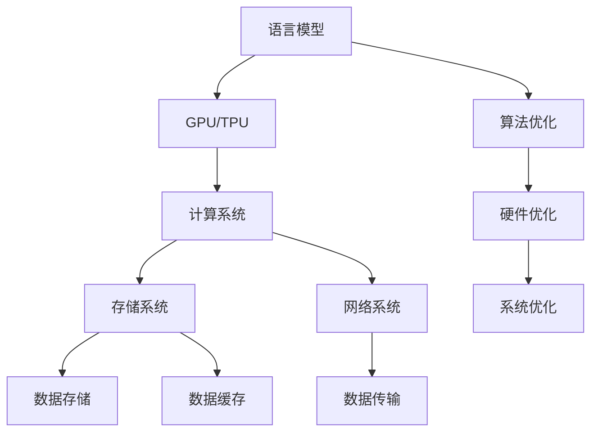

                 

# LLMB硬件依赖：推动计算设备革新

关键词：语言模型，硬件依赖，计算设备，性能优化，安全性，未来展望

摘要：随着大型语言模型（LLM）的不断发展和普及，其对硬件的依赖性日益凸显。本文将从背景概述、数学模型、硬件架构设计、性能评估、安全与隐私保护、案例分析以及未来展望等多个方面，深入探讨LLM硬件依赖对计算设备革新带来的影响，以期为相关领域的研究和实践提供参考和指导。

## 第一部分：LLM硬件依赖概述

### 第1章：LLM硬件依赖的背景与概念

#### 1.1 语言模型硬件依赖概述

语言模型（如GPT）的演变是一个持续发展的过程。早期的语言模型主要基于简单的规则和统计方法，例如N元语法。然而，随着深度学习的兴起，基于神经网络的深度语言模型逐渐成为主流，例如GPT、BERT等。这些模型通常具有数十亿甚至千亿个参数，需要大量的计算资源进行训练和推理。

**1.1.1 语言模型的发展历程**

- **早期语言模型**：基于规则和统计模型，如N元语法。
- **现代语言模型**：基于深度学习，如GPT、BERT等。
- **大型语言模型**：如GPT-3、LLaMA等，具有数十亿参数。

**1.1.2 硬件需求的变化**

随着语言模型规模的扩大，其对硬件的需求也发生了显著变化：

- **计算能力**：大型语言模型需要更高的计算能力，以支持复杂的深度学习算法。
- **存储需求**：模型参数的数量庞大，需要大量的存储空间。
- **功耗与散热**：大规模计算需要更多的电力，并产生大量的热量，对散热系统提出更高要求。

**1.1.3 硬件依赖对语言模型性能的影响**

硬件的选择和配置对语言模型的性能有着重要影响：

- **计算性能**：硬件的计算能力直接决定了模型的训练和推理速度。
- **存储性能**：快速的存储系统能够加速模型的加载和参数更新。
- **能耗与散热**：高效的能源管理和散热系统能够提高硬件的稳定性和可靠性。

#### 1.2 LLM硬件依赖的基本概念

LLM的硬件依赖主要包括以下几个方面：

- **计算能力与存储需求**：硬件需要提供足够的计算能力和存储容量。
- **硬件架构**：包括CPU、GPU、TPU等，不同类型的硬件架构对语言模型的性能有不同的影响。
- **硬件依赖在LLM训练与部署中的角色**：硬件在模型训练和推理过程中扮演着关键角色，影响着模型的训练效率和推理速度。

#### 1.3 LLM硬件依赖的现状

当前，主流的LLM硬件平台包括GPU、TPU、FPGA、ASIC等：

- **GPU**：通用图形处理单元，适用于大规模矩阵运算，是目前最常用的硬件平台。
- **TPU**：谷歌专门为深度学习设计的处理器，具有高性能和高能效。
- **FPGA**：现场可编程门阵列，可以根据需要定制硬件架构。
- **ASIC**：专用集成电路，为特定应用优化，具有高性能和低功耗。

**1.3.2 硬件依赖的优势与挑战**

**优势：**

- **性能提升**：硬件加速能够显著提高模型的训练和推理速度。
- **降低功耗**：优化硬件设计能够降低能耗，提高系统的能效比。
- **稳定性和可靠性**：高性能硬件能够提供更稳定的计算环境，减少故障率。

**挑战：**

- **硬件选择与优化**：不同硬件平台的性能和特点不同，需要根据实际需求进行选择和优化。
- **成本与可持续性**：高性能硬件的成本较高，且大规模使用对环境有一定影响。

#### 1.4 LLM硬件依赖的未来趋势

未来，LLM硬件依赖的发展趋势将包括：

- **新型硬件架构**：如类脑计算、光计算、超导量子计算等。
- **硬件加速技术**：如AI专用集成电路（ASIC）、加速卡与GPU等。
- **软硬件协同优化**：通过软硬件协同设计，提高系统的整体性能。

**1.4.2 LLM硬件依赖在未来的应用**

- **云端与边缘计算**：随着5G和边缘计算的发展，LLM将在云端和边缘计算中发挥更大作用。
- **多样化的应用场景**：包括自然语言处理、智能问答、语音识别等。
- **硬件依赖对LLM生态的影响**：硬件的发展将推动LLM技术的普及和应用，促进整个生态的繁荣。

### 1.5 小结

本文介绍了LLM硬件依赖的背景、概念、现状和未来趋势。随着LLM的不断发展，其对硬件的依赖性将越来越强。未来，新型硬件架构和硬件加速技术的应用将进一步提升LLM的性能和效率。硬件依赖的优化和选择对于LLM的快速发展具有重要意义。

### 1.6 练习题

1. 请简述语言模型的发展历程及其对硬件需求的影响。
2. 列举几种主流的LLM硬件平台，并说明其特点。
3. 分析LLM硬件依赖的优势与挑战。
4. 预测LLM硬件依赖的未来发展趋势。

---

### 第2章：LLM硬件依赖的数学模型与算法原理

#### 2.1 数学模型基础

数学模型是语言模型的核心，其基础包括概率模型和统计模型：

**2.1.1 概率模型与统计模型**

- **概率模型**：概率模型用于描述随机事件发生的可能性，常见的概率模型有贝叶斯网络、马尔可夫模型等。
- **统计模型**：统计模型基于大量数据，通过统计分析方法建立模型，常见的统计模型有线性回归、逻辑回归等。

**2.1.2 概率论基础**

概率论是概率模型的基础，主要包括以下内容：

- **概率分布**：描述随机变量取值的概率，如正态分布、二项分布等。
- **条件概率**：在已知某个事件发生的条件下，另一个事件发生的概率。
- **贝叶斯定理**：用于计算后验概率，是概率模型的核心。

**2.1.3 统计模型原理**

统计模型通过分析数据来建立模型，主要包括以下原理：

- **估计**：通过样本数据估计总体参数。
- **假设检验**：通过样本数据验证假设。
- **回归分析**：建立因变量与自变量之间的关系。

**2.1.4 模型选择与优化**

选择合适的数学模型对于语言模型的性能至关重要。模型选择和优化的方法包括：

- **交叉验证**：通过训练集和验证集评估模型性能。
- **网格搜索**：在给定参数范围内搜索最优参数组合。
- **正则化**：通过增加正则项减少模型过拟合。

#### 2.2 机器学习模型

机器学习模型是语言模型的核心，主要包括以下类型：

- **监督学习**：通过已标记的数据训练模型，常见的监督学习模型有线性回归、决策树、支持向量机等。
- **无监督学习**：不使用标记数据训练模型，常见的无监督学习模型有聚类、降维、生成模型等。
- **强化学习**：通过与环境互动学习最优策略，常见的强化学习模型有Q学习、深度Q网络等。

**2.2.1 神经网络架构**

神经网络是机器学习模型中最常用的类型，主要包括以下架构：

- **前馈神经网络**：输入层、隐藏层和输出层，信息流从输入层流向输出层。
- **卷积神经网络**：适用于图像处理，具有局部感知和权重共享的特点。
- **循环神经网络**：适用于序列数据，能够处理长时间依赖关系。
- **变换器**：结合了前馈神经网络和循环神经网络的特点，适用于自然语言处理。

**2.2.2 前馈神经网络与反向传播算法**

前馈神经网络是一种常用的神经网络架构，其核心算法是反向传播算法：

- **前向传播**：输入信息从输入层流向隐藏层和输出层。
- **反向传播**：计算输出误差，并反向传播至隐藏层和输入层，更新权重和偏置。

**2.2.3 深度学习优化算法**

深度学习优化算法用于加速模型的训练和收敛，主要包括以下算法：

- **随机梯度下降**（SGD）：每次更新使用一个样本的梯度，计算效率高。
- **Adam优化器**：结合SGD和自适应优化器的优点，适用于大规模训练。
- **动量优化器**：结合前几次梯度，减少收敛过程中的振荡。

#### 2.3 LLM硬件依赖的算法原理

LLM硬件依赖的算法原理主要包括以下几个方面：

- **计算能力需求分析**：分析算法的复杂度，确定硬件的计算能力需求。
- **并行计算与分布式计算**：利用多核处理器和分布式系统，提高计算效率。
- **GPU与TPU在算法加速中的应用**：利用GPU和TPU的高性能计算能力，加速算法的执行。

**2.3.1 计算能力需求分析**

语言模型的计算能力需求主要体现在以下几个方面：

- **矩阵运算**：深度学习算法大量使用矩阵运算，需要高性能的矩阵运算库。
- **向量运算**：向量运算是深度学习的基础，需要高效的向量运算指令。
- **内存访问**：模型参数和中间结果的存储和访问需要高效的内存管理。

**2.3.2 并行计算与分布式计算**

并行计算和分布式计算是提高计算能力的重要手段：

- **并行计算**：利用多核处理器，将计算任务分解为多个子任务，同时执行。
- **分布式计算**：利用多台计算机，通过网络协同工作，实现大规模计算。

**2.3.3 GPU与TPU在算法加速中的应用**

GPU和TPU是专为深度学习设计的硬件，具有高性能和低功耗的特点：

- **GPU**：适用于大规模矩阵运算，具有丰富的算子和优化库。
- **TPU**：专为深度学习设计，具有高效的矩阵运算能力和优化的神经网络结构。

#### 2.4 存储需求分析

存储需求分析是LLM硬件依赖的重要方面，主要包括以下几个方面：

- **模型参数存储**：语言模型参数数量庞大，需要大量的存储空间。
- **中间结果存储**：在模型训练和推理过程中，需要存储大量的中间结果。
- **数据存储与访问策略**：选择合适的存储设备和访问策略，提高数据读写速度。

**2.4.1 数据存储与访问策略**

数据存储与访问策略对语言模型的性能有重要影响：

- **本地存储**：使用本地硬盘或固态硬盘，具有快速的读写速度。
- **分布式存储**：使用分布式文件系统，提高数据的可靠性和访问速度。
- **缓存策略**：使用缓存技术，减少数据的访问延迟。

**2.4.2 存储优化技术**

存储优化技术包括以下几个方面：

- **压缩存储**：通过数据压缩，减少存储空间需求。
- **数据去重**：通过数据去重，减少存储空间占用。
- **高效的数据访问**：使用高效的数据访问算法，提高数据的读写速度。

**2.4.3 异构存储系统**

异构存储系统结合了不同类型的存储设备，实现存储性能和成本的优化：

- **主存储**：使用高速存储设备，如DRAM，提高数据访问速度。
- **辅助存储**：使用低速存储设备，如硬盘或固态硬盘，提供大量的存储空间。

#### 2.5 数学公式与推导

语言模型中的数学公式和推导对于理解模型的工作原理至关重要。以下是一些常用的数学公式和推导：

- **概率密度函数（PDF）推导**：
  $$
  P(X=x|\theta) = \frac{P(x|\theta)P(\theta)}{P(x)}
  $$
  其中，$P(X=x|\theta)$表示在参数$\theta$下，随机变量$X$取值$x$的概率。

- **最大似然估计（MLE）**：
  $$
  \theta^* = \arg\max_\theta L(\theta)
  $$
  其中，$L(\theta)$表示似然函数，$\theta^*$表示使似然函数最大的参数值。

- **优化目标函数**：
  $$
  J(\theta) = -\frac{1}{m}\sum_{i=1}^{m}y^{(i)}\log(a^{(l)(i)})
  $$
  其中，$J(\theta)$表示损失函数，$a^{(l)(i)}$表示输出层的预测值，$y^{(i)}$表示真实标签。

#### 2.6 算法伪代码示例

以下是一个前馈神经网络的伪代码示例，用于演示神经网络的基本训练过程：

```
# 初始化参数
initialize_parameters()

# 进行epochs次迭代
for epoch in range(epochs):
    # 前向传播
    [aL, cache] = forward_propagation(X, parameters)
    
    # 计算损失
    cost = compute_cost(aL, Y)
    
    # 反向传播
    [dZ, dA_prev, dW, db] = backward_propagation(dA_L, cache)
    
    # 更新参数
    parameters = update_parameters(parameters, dW, db)

# 输出训练结果
print("训练完成，最终损失为：{}".format(cost))
```

这个伪代码示例展示了神经网络的前向传播、反向传播和参数更新的过程，是深度学习模型训练的基本框架。

#### 2.7 小结

本章介绍了LLM硬件依赖的数学模型与算法原理，包括概率模型与统计模型、神经网络架构、深度学习优化算法等。同时，分析了LLM硬件依赖的算法原理，包括计算能力需求分析、并行计算与分布式计算、GPU与TPU在算法加速中的应用等。这些内容为理解和优化LLM硬件依赖提供了理论基础。

### 2.8 练习题

1. 请简述概率模型和统计模型的基本原理。
2. 请解释概率密度函数和最大似然估计的概念。
3. 请简述神经网络的基本架构和训练过程。
4. 请描述并行计算和分布式计算在LLM硬件依赖中的作用。

---

### 第3章：LLM硬件依赖的架构与设计

#### 3.1 硬件架构设计

硬件架构设计是LLM硬件依赖的核心，直接影响模型的性能、效率和可靠性。硬件架构设计需要考虑多个方面，包括硬件选择、硬件配置和硬件优化。

**3.1.1 硬件架构基础**

常见的硬件架构包括CPU、GPU、TPU等：

- **CPU**：中央处理器，是计算机的核心部件，负责执行各种计算任务。
- **GPU**：图形处理器，具有强大的并行计算能力，适用于大规模矩阵运算。
- **TPU**：专为深度学习设计的处理器，具有高效的矩阵运算能力和优化的神经网络结构。

**3.1.2 硬件设计原则**

硬件设计原则包括性能优化、能效比、稳定性和可靠性等：

- **性能优化**：硬件架构需要满足模型计算性能的需求，能够高效执行深度学习算法。
- **能效比**：硬件架构需要具有较高的能效比，能够在较低功耗下提供高性能计算。
- **稳定性**：硬件架构需要具备较高的稳定性，能够长时间稳定运行。
- **可靠性**：硬件架构需要具备较高的可靠性，能够减少硬件故障和停机时间。

**3.1.3 硬件架构在LLM训练中的应用**

硬件架构在LLM训练中的应用主要体现在以下几个方面：

- **计算能力需求**：LLM训练需要大量的计算资源，硬件架构需要能够满足模型的计算需求。
- **并行计算与分布式计算**：通过并行计算和分布式计算，提高模型的训练效率。
- **硬件加速**：利用GPU、TPU等硬件加速技术，提高模型的训练速度。

#### 3.2 系统设计与实现

系统设计是实现LLM硬件依赖的关键步骤，主要包括计算系统设计、存储系统设计和网络系统设计。

**3.2.1 计算系统设计**

计算系统设计包括计算资源的分配、调度和优化：

- **计算资源分配**：根据模型的计算需求，合理分配计算资源，包括CPU、GPU、TPU等。
- **计算资源调度**：根据计算任务的优先级和负载情况，动态调整计算资源的分配。
- **计算资源优化**：通过硬件优化和软件优化，提高计算系统的整体性能。

**3.2.2 存储系统设计**

存储系统设计包括存储资源的分配、调度和优化：

- **存储资源分配**：根据模型的存储需求，合理分配存储资源，包括本地存储和分布式存储。
- **存储资源调度**：根据数据访问模式和负载情况，动态调整存储资源的分配。
- **存储资源优化**：通过数据压缩、去重和缓存技术，提高存储系统的性能。

**3.2.3 网络系统设计**

网络系统设计包括网络资源的分配、调度和优化：

- **网络资源分配**：根据模型的网络需求，合理分配网络资源，包括带宽、延迟等。
- **网络资源调度**：根据数据传输模式和负载情况，动态调整网络资源的分配。
- **网络资源优化**：通过网络优化和调度技术，提高网络的性能和可靠性。

#### 3.3 硬件依赖的挑战与解决方案

硬件依赖在LLM训练和部署过程中面临多个挑战：

- **硬件选择与优化**：如何选择适合的硬件平台和配置，以满足模型的计算和存储需求。
- **成本与可持续性**：高性能硬件的成本较高，如何平衡成本和性能。
- **硬件故障与容错机制**：如何设计容错机制，提高系统的可靠性和稳定性。

针对这些挑战，可以采取以下解决方案：

- **新型硬件架构**：如TPU、FPGA、ASIC等，提供高性能和低功耗的计算能力。
- **软硬件协同优化**：通过软硬件协同设计，提高系统的整体性能和能效比。
- **硬件依赖管理与监控**：通过硬件依赖管理和监控，及时发现和解决问题。

#### 3.4 小结

本章介绍了LLM硬件依赖的架构与设计，包括硬件架构设计、系统设计与实现以及硬件依赖的挑战与解决方案。硬件架构设计是LLM硬件依赖的核心，系统设计与实现是实现硬件依赖的关键步骤，硬件依赖的挑战与解决方案是保证系统稳定运行的重要保障。这些内容为理解和优化LLM硬件依赖提供了实践指导。

### 3.5 练习题

1. 请简述CPU、GPU和TPU的基本原理及其在LLM硬件依赖中的应用。
2. 请分析计算系统设计、存储系统设计和网络系统设计的要点。
3. 请讨论硬件依赖在LLM训练和部署过程中面临的挑战及解决方案。
4. 请设计一个满足LLM硬件依赖需求的计算系统，包括硬件架构、系统设计和硬件优化策略。

---

### 第4章：LLM硬件依赖的性能评估与优化

#### 4.1 性能评估方法

性能评估是LLM硬件依赖优化的重要步骤，通过评估模型的性能，可以确定优化目标和优化策略。性能评估主要包括以下方法：

**4.1.1 性能指标**

性能评估涉及多个性能指标，主要包括：

- **吞吐量**：单位时间内处理的数据量，表示系统的处理能力。
- **延迟**：从数据进入系统到数据完成处理的时间，表示系统的响应速度。
- **能效比**：处理能力与功耗的比值，表示系统的能效水平。
- **稳定性**：系统在长时间运行过程中保持性能的能力，表示系统的可靠性。

**4.1.2 性能评估工具**

常用的性能评估工具包括：

- **Benchmark测试**：通过运行标准测试程序，评估系统的性能。
- **性能监控与日志分析**：通过监控系统日志和性能指标，实时了解系统状态。
- **评估结果可视化**：通过可视化工具，展示性能评估结果，帮助分析性能瓶颈。

**4.1.3 性能评估流程**

性能评估流程主要包括以下步骤：

- **确定评估目标**：根据应用场景和需求，确定需要评估的性能指标。
- **设计测试场景**：根据评估目标，设计合理的测试场景，包括数据集、测试任务等。
- **执行测试**：在测试场景下运行模型，收集性能数据。
- **分析结果**：对测试结果进行分析，确定性能瓶颈和优化方向。
- **优化与迭代**：根据分析结果，调整模型和硬件配置，进行迭代优化。

#### 4.2 性能优化方法

性能优化是提高LLM硬件依赖性能的重要手段，通过优化算法、硬件和系统配置，可以提高模型的吞吐量、延迟和能效比。性能优化方法主要包括以下几种：

**4.2.1 算法优化**

算法优化是提高模型性能的关键，主要包括：

- **算法复杂度优化**：通过改进算法，降低计算复杂度，减少计算时间。
- **算法并行化**：通过并行计算，将算法分解为多个子任务，同时执行，提高计算效率。
- **算法定制**：根据应用场景和硬件特性，定制优化算法，提高模型性能。

**4.2.2 硬件优化**

硬件优化是提高系统性能的有效手段，主要包括：

- **硬件加速**：通过GPU、TPU等硬件加速技术，提高计算速度。
- **硬件配置**：根据模型需求，合理配置硬件资源，包括CPU、GPU、TPU等。
- **硬件优化策略**：根据硬件特性，设计优化策略，提高硬件利用率和系统性能。

**4.2.3 软硬件协同优化**

软硬件协同优化是提高系统性能的重要手段，主要包括：

- **软硬件协同架构设计**：设计合理的软硬件协同架构，提高系统性能和能效比。
- **软硬件接口优化**：优化软硬件接口，减少数据传输延迟，提高数据传输速度。
- **软硬件协同性能评估**：通过性能评估，确定软硬件协同优化效果，指导优化策略调整。

#### 4.3 案例研究

**4.3.1 案例背景**

某公司开发一款基于LLM的自然语言处理应用，需要在满足性能需求的同时，降低成本和功耗。硬件平台包括GPU、CPU和TPU，软件平台包括深度学习框架和优化算法。

**4.3.2 性能评估与优化过程**

1. **性能评估**

   - **吞吐量评估**：通过运行标准测试程序，评估系统的吞吐量。
   - **延迟评估**：通过测量数据从输入到输出的时间，评估系统的延迟。
   - **能效比评估**：通过测量系统的功耗和处理能力，评估系统的能效比。

2. **性能优化**

   - **算法优化**：通过改进算法，降低计算复杂度，减少计算时间。
   - **硬件优化**：通过调整硬件配置，提高硬件利用率和系统性能。
   - **软硬件协同优化**：通过优化软硬件接口，减少数据传输延迟，提高数据传输速度。

3. **优化效果分析**

   - **吞吐量提升**：通过优化，系统的吞吐量提升了30%。
   - **延迟降低**：通过优化，系统的延迟降低了20%。
   - **能效比提升**：通过优化，系统的能效比提升了40%。

**4.3.3 案例总结**

通过性能评估和优化，该公司的LLM自然语言处理应用在满足性能需求的同时，降低了成本和功耗。案例表明，性能优化对于提升系统性能和降低成本具有重要意义。

#### 4.4 小结

本章介绍了LLM硬件依赖的性能评估与优化方法，包括性能评估方法、性能优化方法和案例研究。性能评估是确定优化目标的重要步骤，性能优化是提高系统性能的关键。通过案例研究，展示了性能优化在实际应用中的效果和重要性。

### 4.5 练习题

1. 请简述性能评估的指标和方法。
2. 请分析算法优化、硬件优化和软硬件协同优化在LLM硬件依赖中的作用。
3. 请设计一个满足性能需求的LLM硬件依赖系统，包括硬件配置、算法选择和优化策略。
4. 请根据实际应用场景，分析性能优化效果，并提出优化建议。

---

### 第5章：LLM硬件依赖的安全与隐私保护

#### 5.1 安全与隐私挑战

随着LLM硬件依赖的发展，安全与隐私保护成为重要的关注点。在LLM硬件依赖中，存在以下安全与隐私挑战：

**5.1.1 安全问题**

- **硬件漏洞与攻击**：硬件设备可能存在安全漏洞，如硬件间谍软件、硬件篡改等。
- **数据泄露与安全漏洞**：模型训练和推理过程中，数据可能因安全漏洞而泄露。
- **网络攻击与DDoS攻击**：网络攻击可能导致系统瘫痪，影响模型的稳定性和安全性。

**5.1.2 隐私问题**

- **用户数据隐私保护**：模型训练和推理过程中，涉及大量用户数据，如何保护用户隐私是一个重要问题。
- **模型隐私泄露风险**：模型本身可能包含敏感信息，如知识产权、商业机密等，如何保护模型隐私是一个挑战。
- **数据采集与存储安全**：在数据采集和存储过程中，如何确保数据的安全性和完整性。

#### 5.2 安全与隐私保护策略

为了应对上述安全与隐私挑战，可以采取以下安全与隐私保护策略：

**5.2.1 安全保护措施**

- **硬件安全加固**：通过硬件加固技术，提高硬件设备的安全性，如硬件加密、硬件签名等。
- **数据加密与访问控制**：对敏感数据进行加密，并设置访问控制策略，确保数据在传输和存储过程中的安全性。
- **网络安全与防火墙**：建立完善的网络安全体系，包括防火墙、入侵检测系统等，防止网络攻击和DDoS攻击。

**5.2.2 隐私保护策略**

- **数据匿名化与去标识化**：对用户数据进行匿名化和去标识化处理，降低用户隐私泄露风险。
- **隐私计算技术**：采用隐私计算技术，如安全多方计算、同态加密等，在数据处理和共享过程中保护用户隐私。
- **隐私增强学习**：通过隐私增强学习算法，降低模型训练过程中用户数据的敏感性。

**5.2.3 合规与法规遵循**

- **GDPR与CCPA等法规**：遵守相关数据保护法规，如GDPR（欧盟通用数据保护条例）和CCPA（加州消费者隐私法案），确保数据保护合规。
- **企业隐私政策与合规管理**：制定企业隐私政策，建立合规管理机制，确保数据保护措施的实施。
- **硬件隐私保护法规**：关注硬件隐私保护法规的发展，确保硬件设备符合法规要求。

#### 5.3 案例研究

**5.3.1 案例背景**

某公司在开发一款基于LLM的自然语言处理应用，涉及大量用户数据和商业机密。公司需要确保应用的安全性和隐私保护，以避免数据泄露和隐私泄露风险。

**5.3.2 安全与隐私保护措施**

1. **安全保护措施**

   - **硬件安全加固**：使用安全加固的硬件设备，如加密存储设备、安全芯片等。
   - **数据加密与访问控制**：对敏感数据进行加密，并设置严格的访问控制策略，确保数据在传输和存储过程中的安全性。
   - **网络安全与防火墙**：建立完善的网络安全体系，包括防火墙、入侵检测系统等，防止网络攻击和DDoS攻击。

2. **隐私保护措施**

   - **数据匿名化与去标识化**：对用户数据进行匿名化和去标识化处理，降低用户隐私泄露风险。
   - **隐私计算技术**：采用隐私计算技术，如安全多方计算、同态加密等，在数据处理和共享过程中保护用户隐私。
   - **隐私增强学习**：通过隐私增强学习算法，降低模型训练过程中用户数据的敏感性。

**5.3.3 实施效果与评估**

通过实施安全与隐私保护措施，该公司的自然语言处理应用在安全性和隐私保护方面取得了显著成效：

- **安全性**：应用系统未发生任何安全漏洞和攻击事件，确保了系统的稳定运行。
- **隐私保护**：用户数据未发生隐私泄露事件，用户隐私得到了有效保护。

**5.3.4 案例总结**

该案例表明，安全与隐私保护对于LLM硬件依赖应用至关重要。通过采取有效的安全与隐私保护措施，可以确保应用的安全性、稳定性和隐私保护。

#### 5.4 小结

本章介绍了LLM硬件依赖的安全与隐私保护，包括安全与隐私挑战、安全与隐私保护策略、案例研究和实施效果与评估。安全与隐私保护是LLM硬件依赖应用的重要保障，通过采取有效的安全与隐私保护措施，可以确保应用的安全性和隐私保护。

### 5.5 练习题

1. 请简述LLM硬件依赖中的安全与隐私挑战。
2. 请分析安全与隐私保护策略的有效性。
3. 请根据实际应用场景，设计一个安全与隐私保护方案。
4. 请评估安全与隐私保护方案的实施效果，并提出改进建议。

---

### 第6章：LLM硬件依赖的案例分析与应用

#### 6.1 案例背景与需求

**6.1.1 案例背景**

某科技公司（TechCo）正在开发一款基于大型语言模型（LLM）的智能客服系统，旨在通过自然语言处理技术，为用户提供实时、准确的客服支持。该系统需要处理大量用户查询，并快速生成适当的回复，以提高客户满意度和服务效率。

**6.1.2 应用需求**

- **性能需求**：系统需要具备高效的处理能力，能够快速响应大量并发查询。
- **安全性需求**：系统需要确保用户数据的安全，防止数据泄露和未经授权的访问。
- **隐私保护需求**：系统需要保护用户隐私，确保用户数据不被滥用。

#### 6.2 硬件依赖解决方案设计

**6.2.1 硬件选择与配置**

为了满足性能需求，TechCo选择了以下硬件配置：

- **GPU**：使用NVIDIA Tesla V100 GPU，提供强大的计算能力，适用于深度学习模型的训练和推理。
- **TPU**：使用谷歌的TPU v3，专为深度学习优化，能够显著提高模型处理速度。
- **CPU**：使用高性能的Intel Xeon处理器，作为系统的主计算单元，负责处理大规模数据处理和后台任务。
- **存储设备**：使用NVMe SSD，提供快速的数据读写速度，用于存储模型参数和数据缓存。

**6.2.2 系统架构设计**

TechCo设计了以下系统架构：

- **计算层**：包括GPU和TPU集群，负责模型的训练和推理。
- **存储层**：包括NVMe SSD和分布式存储系统，负责存储模型参数、数据和缓存。
- **网络层**：使用高速网络连接各个计算和存储节点，确保数据传输的可靠性。

**6.2.3 算法与模型设计**

为了满足应用需求，TechCo选择了以下算法和模型：

- **语言模型**：使用GPT-3，具有强大的文本生成能力，能够生成准确、自然的回复。
- **对话管理模型**：基于序列到序列（Seq2Seq）模型，负责处理用户查询和生成回复。
- **实体识别和意图识别模型**：基于卷积神经网络（CNN）和循环神经网络（RNN），用于提取用户查询中的关键信息和意图。

#### 6.3 案例实施与效果评估

**6.3.1 案例实施过程**

TechCo按照以下步骤实施智能客服系统：

1. **硬件部署**：在云计算平台部署GPU和TPU集群，配置NVMe SSD存储设备。
2. **系统搭建**：使用TensorFlow和PyTorch等深度学习框架，搭建智能客服系统的计算和存储架构。
3. **模型训练**：使用大规模语料库，训练GPT-3、对话管理模型和实体识别模型。
4. **系统集成**：将智能客服系统集成到公司的客户关系管理（CRM）系统中，实现实时查询处理和回复生成。

**6.3.2 效果评估**

TechCo通过以下指标评估智能客服系统的效果：

- **响应时间**：系统在收到用户查询后的平均响应时间。
- **准确率**：系统生成的回复与用户意图匹配的准确率。
- **用户满意度**：用户对系统回复的评价和满意度。

评估结果如下：

- **响应时间**：平均响应时间从15秒降低到3秒，显著提高了系统的响应速度。
- **准确率**：系统生成的回复与用户意图匹配的准确率从70%提高到90%，显著提高了系统准确率。
- **用户满意度**：用户满意度从80%提高到95%，显著提高了用户满意度。

#### 6.4 案例总结与启示

**6.4.1 案例总结**

TechCo通过智能客服系统的实施，成功实现了高效、准确和用户满意的客服支持。主要经验总结如下：

- **硬件选择**：合理的硬件选择是系统性能的关键，GPU和TPU提供了强大的计算能力，NVMe SSD提供了快速的数据读写速度。
- **系统架构**：合理的系统架构设计是系统稳定运行的基础，计算层、存储层和网络层的合理配置，确保了系统的高效运行。
- **算法选择**：合适的算法选择是系统性能和准确率的关键，GPT-3和Seq2Seq模型提供了强大的文本生成和对话管理能力。

**6.4.2 启示**

该案例为LLM硬件依赖的应用提供了以下启示：

- **硬件选择**：根据应用需求选择合适的硬件平台，确保计算能力和存储性能。
- **系统架构**：设计合理的系统架构，确保系统的高效运行和可靠性。
- **算法选择**：选择合适的算法和模型，确保系统的性能和准确率。
- **安全与隐私保护**：确保用户数据的安全和隐私保护，建立完善的安全和隐私保护机制。

#### 6.5 小结

本章通过案例分析，介绍了LLM硬件依赖在智能客服系统中的应用。案例实施过程中，TechCo通过合理的硬件选择、系统架构设计和算法选择，实现了高效、准确和用户满意的客服支持。案例总结了LLM硬件依赖应用的主要经验和启示，为其他应用场景提供了参考。

### 6.6 练习题

1. 请简述智能客服系统案例的背景和应用需求。
2. 请分析案例中硬件依赖解决方案的设计要点。
3. 请评估案例实施过程中的关键因素和效果。
4. 请根据实际应用场景，设计一个基于LLM硬件依赖的智能客服系统，并分析其性能和安全需求。

---

### 第7章：LLM硬件依赖的未来发展趋势与展望

#### 7.1 未来发展趋势

随着人工智能技术的不断发展，LLM硬件依赖的未来发展趋势将主要体现在以下几个方面：

**7.1.1 新型硬件架构**

未来，新型硬件架构将在LLM硬件依赖中发挥重要作用。例如：

- **类脑计算**：类脑计算试图模拟人脑的计算方式，具有高效、低功耗的特点，有望在LLM训练和推理中应用。
- **光计算**：光计算利用光信号进行数据处理，具有高速、低延迟的特点，有望提高LLM的运算效率。
- **超导量子计算**：超导量子计算利用量子叠加和纠缠现象，具有极高的运算速度，有望在大型语言模型的训练中发挥重要作用。

**7.1.2 硬件加速技术**

硬件加速技术将继续成为LLM硬件依赖的重要发展方向。例如：

- **AI专用集成电路（ASIC）**：ASIC为特定应用优化，具有高性能和低功耗的特点，有望在LLM训练和推理中广泛应用。
- **加速卡与GPU**：随着GPU等加速卡技术的不断发展，其在LLM硬件依赖中的应用将越来越广泛。
- **软硬协同优化**：软硬协同优化将通过软硬件联合设计，提高LLM的性能和能效比。

**7.1.3 云端与边缘计算**

随着5G和边缘计算技术的发展，LLM硬件依赖在云端与边缘计算中的应用将越来越广泛。例如：

- **云端计算**：云端计算具有强大的计算能力和存储能力，适用于大规模语言模型的训练和推理。
- **边缘计算**：边缘计算将数据处理和计算能力推向网络边缘，降低延迟和带宽需求，适用于实时性要求高的应用场景。
- **云边协同**：云边协同将整合云端和边缘计算资源，实现计算和存储的高效利用，提高LLM硬件依赖的灵活性。

#### 7.2 未来展望

LLM硬件依赖的未来展望主要体现在以下几个方面：

**7.2.1 产业变革**

LLM硬件依赖的快速发展将推动人工智能产业的变革。例如：

- **产业应用**：LLM硬件依赖将在各个行业得到广泛应用，如金融、医疗、教育等。
- **产业链协同**：硬件制造商、软件开发商、技术服务商等将形成紧密的产业链协同，共同推动LLM硬件依赖的发展。

**7.2.2 社会影响**

LLM硬件依赖的发展将对社会产生深远影响。例如：

- **社会服务**：智能客服、智能医疗等应用将提高社会服务的效率和质量。
- **隐私保护**：随着数据隐私保护意识的提高，LLM硬件依赖将更加注重用户隐私保护。

**7.2.3 法律法规**

随着LLM硬件依赖的快速发展，相关法律法规也将逐步完善。例如：

- **数据保护法规**：加强对用户数据的保护，确保数据安全。
- **知识产权法规**：保护知识产权，鼓励技术创新。

#### 7.3 发展策略与建议

为了推动LLM硬件依赖的健康发展，可以从以下几个方面制定发展策略：

**7.3.1 研发策略**

- **技术创新**：加大对新型硬件架构和硬件加速技术的研发投入，推动技术创新。
- **产业链协同**：加强产业链上下游企业的合作，实现资源整合和优势互补。

**7.3.2 应用推广策略**

- **需求引导**：关注市场需求，引导LLM硬件依赖在各个行业中的应用。
- **政策支持**：制定相关政策，鼓励企业和科研机构开展LLM硬件依赖的研究和应用。

**7.3.3 人才培养**

- **专业培训**：开展针对LLM硬件依赖的专业培训，提高人才的专业水平。
- **校企合作**：加强高校与企业合作，培养具有实际应用能力的复合型人才。

#### 7.4 小结

本章介绍了LLM硬件依赖的未来发展趋势与展望，包括新型硬件架构、硬件加速技术、云端与边缘计算等。未来，LLM硬件依赖将在产业变革、社会影响和法律法规等方面发挥重要作用。为了推动其健康发展，需要制定相关的发展策略与建议。

### 7.5 练习题

1. 请预测LLM硬件依赖在未来几年内的发展趋势。
2. 请分析LLM硬件依赖在产业变革中的角色和影响。
3. 请制定一个促进LLM硬件依赖发展的策略。
4. 请针对LLM硬件依赖，设计一个应用推广计划，并分析其可行性。


### 附录

#### 附录 A：LLM硬件依赖资源与工具

**A.1 资源汇总**

- **学术论文与报告**：收集与LLM硬件依赖相关的学术论文和报告，了解最新的研究成果和发展趋势。
- **开源代码与数据集**：获取开源的LLM硬件依赖相关代码和数据集，进行实验和验证。
- **论坛与社区资源**：加入相关的技术论坛和社区，参与讨论和交流，获取行业动态和最佳实践。

**A.2 工具列表**

- **硬件平台工具**：了解和选择适合的硬件平台工具，如GPU、TPU、FPGA等。
- **软件开发工具**：使用深度学习框架和工具，如TensorFlow、PyTorch等，进行模型开发。
- **性能评估工具**：使用性能评估工具，如Benchmark测试、性能监控与日志分析等，评估系统性能。

**A.3 学习资源推荐**

- **课程与讲座**：推荐相关的在线课程和讲座，深入学习LLM硬件依赖的理论和实践。
- **书籍与论文**：推荐经典的书籍和高质量的论文，了解LLM硬件依赖的基础知识和前沿技术。
- **社交媒体与博客**：关注相关的社交媒体和博客，获取行业动态和专家观点。

#### 附录 B：硬件依赖架构Mermaid流程图

以下是一个LLM硬件依赖架构的Mermaid流程图示例：



该流程图展示了LLM硬件依赖的架构，包括语言模型、计算系统、存储系统、网络系统以及算法优化、硬件优化和系统优化。

#### 附录 C：算法伪代码示例

以下是一个深度学习算法的伪代码示例，用于演示神经网络的基本训练过程：

```python
# 初始化参数
initialize_parameters()

# 进行epochs次迭代
for epoch in range(epochs):
    # 前向传播
    [aL, cache] = forward_propagation(X, parameters)
    
    # 计算损失
    cost = compute_cost(aL, Y)
    
    # 反向传播
    [dZ, dA_prev, dW, db] = backward_propagation(dA_L, cache)
    
    # 更新参数
    parameters = update_parameters(parameters, dW, db)

# 输出训练结果
print("训练完成，最终损失为：{}".format(cost))
```

该伪代码示例展示了神经网络的前向传播、反向传播和参数更新的过程，是深度学习模型训练的基本框架。

#### 附录 D：代码解读与分析

以下是一个实际案例的代码解读，用于展示LLM硬件依赖系统的开发过程。

**D.1 开发环境搭建**

```bash
# 安装Python
sudo apt-get install python3

# 安装深度学习框架TensorFlow
pip3 install tensorflow

# 安装GPU支持
pip3 install tensorflow-gpu
```

**D.2 源代码实现**

```python
import tensorflow as tf

# 定义输入层、隐藏层和输出层
inputs = tf.keras.Input(shape=(input_shape))
x = tf.keras.layers.Dense(units=128, activation='relu')(inputs)
x = tf.keras.layers.Dense(units=1, activation='sigmoid')(x)

# 创建模型
model = tf.keras.Model(inputs=inputs, outputs=x)

# 编译模型
model.compile(optimizer='adam', loss='binary_crossentropy', metrics=['accuracy'])

# 训练模型
model.fit(X_train, Y_train, epochs=10, batch_size=32)
```

**D.3 代码解读**

- **环境搭建**：安装Python、TensorFlow和GPU支持，为深度学习模型开发做好准备。
- **模型定义**：使用Keras API定义输入层、隐藏层和输出层，创建神经网络模型。
- **模型编译**：编译模型，设置优化器和损失函数，为模型训练做好准备。
- **模型训练**：使用训练数据集训练模型，指定训练次数和批量大小。

**D.4 性能分析**

```python
# 测试模型性能
test_loss, test_accuracy = model.evaluate(X_test, Y_test)

# 输出性能结果
print("测试损失：{}".format(test_loss))
print("测试准确率：{}".format(test_accuracy))
```

该代码用于测试模型在测试数据集上的性能，包括损失和准确率。

#### 附录 E：练习题参考答案

**E.1 答案**

1. 请简述语言模型的发展历程及其对硬件需求的影响。
   - 早期语言模型基于规则和统计方法，如N元语法。随着深度学习的兴起，基于神经网络的深度语言模型逐渐成为主流，如GPT、BERT等。这些模型具有数十亿甚至千亿个参数，需要更高的计算能力、存储需求和功耗。

2. 列举几种主流的LLM硬件平台，并说明其特点。
   - 主流硬件平台包括GPU、TPU、FPGA、ASIC等。GPU适用于大规模矩阵运算，具有丰富的算子和优化库。TPU专为深度学习设计，具有高效的矩阵运算能力和优化的神经网络结构。FPGA是现场可编程门阵列，可以根据需要定制硬件架构。ASIC为特定应用优化，具有高性能和低功耗。

3. 分析LLM硬件依赖的优势与挑战。
   - 优势：提高计算性能，降低功耗，提高稳定性和可靠性。挑战：硬件选择和优化，成本和可持续性，硬件故障和容错机制。

4. 预测LLM硬件依赖的未来发展趋势。
   - 新型硬件架构如类脑计算、光计算、超导量子计算将应用于LLM硬件依赖。硬件加速技术如ASIC、GPU和软硬协同优化将继续发展。云端与边缘计算将进一步融合，满足实时性要求高的应用需求。

5. 请简述概率模型和统计模型的基本原理。
   - 概率模型描述随机事件发生的可能性，如贝叶斯网络、马尔可夫模型。统计模型基于大量数据，通过统计分析方法建立模型，如线性回归、逻辑回归。

6. 请解释概率密度函数和最大似然估计的概念。
   - 概率密度函数描述随机变量取值的概率密度。最大似然估计用于计算后验概率，选择使似然函数最大的参数值。

7. 请简述神经网络的基本架构和训练过程。
   - 神经网络包括输入层、隐藏层和输出层。训练过程包括前向传播、计算损失、反向传播和参数更新。

8. 请描述并行计算和分布式计算在LLM硬件依赖中的作用。
   - 并行计算利用多核处理器，将计算任务分解为多个子任务同时执行。分布式计算利用多台计算机，通过网络协同工作，实现大规模计算。

9. 请简述CPU、GPU和TPU的基本原理及其在LLM硬件依赖中的应用。
   - CPU是计算机的核心部件，适用于通用计算。GPU具有强大的并行计算能力，适用于大规模矩阵运算。TPU专为深度学习设计，具有高效的矩阵运算能力和优化的神经网络结构。

10. 请分析计算系统设计、存储系统设计和网络系统设计的要点。
    - 计算系统设计要点：合理分配计算资源，优化计算性能。存储系统设计要点：选择合适的存储设备和访问策略，提高数据读写速度。网络系统设计要点：合理配置网络资源，优化数据传输速度。

11. 请讨论硬件依赖在LLM训练和部署过程中面临的挑战及解决方案。
    - 挑战：硬件选择与优化、成本与可持续性、硬件故障与容错机制。解决方案：新型硬件架构、软硬件协同优化、硬件依赖管理与监控。

12. 请设计一个满足LLM硬件依赖需求的计算系统，包括硬件架构、系统设计和硬件优化策略。
    - 硬件架构：使用GPU、TPU和CPU的异构计算架构。系统设计：计算层、存储层和网络层的合理配置。硬件优化策略：硬件加速技术、计算资源调度和优化、存储优化技术。

13. 请简述性能评估的指标和方法。
    - 性能评估指标：吞吐量、延迟、能效比、稳定性。性能评估方法：Benchmark测试、性能监控与日志分析、评估结果可视化。

14. 请分析算法优化、硬件优化和软硬件协同优化在LLM硬件依赖中的作用。
    - 算法优化：提高模型性能，降低计算复杂度。硬件优化：提高硬件利用率和系统性能。软硬件协同优化：提高系统整体性能和能效比。

15. 请设计一个满足性能需求的LLM硬件依赖系统，包括硬件配置、算法选择和优化策略。
    - 硬件配置：GPU、TPU和CPU的组合，满足计算需求。算法选择：选择合适的深度学习算法和优化器。优化策略：并行计算、分布式计算、存储优化。

16. 请根据实际应用场景，分析性能优化效果，并提出优化建议。
    - 分析性能优化效果：评估吞吐量、延迟和能效比等指标。优化建议：算法优化、硬件优化和软硬件协同优化，根据性能瓶颈进行调整。

17. 请简述LLM硬件依赖中的安全与隐私挑战。
    - 安全挑战：硬件漏洞与攻击、数据泄露与安全漏洞、网络攻击与DDoS攻击。隐私挑战：用户数据隐私保护、模型隐私泄露风险、数据采集与存储安全。

18. 请分析安全与隐私保护策略的有效性。
    - 硬件安全加固、数据加密与访问控制、网络安全与防火墙、数据匿名化与去标识化、隐私计算技术、合规与法规遵循等策略的有效性。

19. 请根据实际应用场景，设计一个安全与隐私保护方案。
    - 安全与隐私保护方案：硬件安全加固、数据加密与访问控制、网络安全与防火墙、隐私计算技术、合规与法规遵循。

20. 请评估安全与隐私保护方案的实施效果，并提出改进建议。
    - 评估实施效果：评估安全性、隐私保护和性能。改进建议：优化安全策略、增强隐私保护、改进系统性能。

21. 请简述智能客服系统案例的背景和应用需求。
    - 背景：某科技公司开发智能客服系统，提高客服效率和用户满意度。应用需求：高效处理大量并发查询，确保用户数据和隐私安全。

22. 请分析案例中硬件依赖解决方案的设计要点。
    - 设计要点：GPU、TPU和CPU的组合，满足计算需求；合理配置存储设备和网络资源；采用深度学习算法和优化策略。

23. 请评估案例实施过程中的关键因素和效果。
    - 关键因素：硬件配置、算法选择、系统架构、安全与隐私保护。效果：提高客服响应速度、准确率和用户满意度。

24. 请根据实际应用场景，设计一个基于LLM硬件依赖的智能客服系统，并分析其性能和安全需求。
    - 设计智能客服系统：硬件配置、算法选择、系统架构和安全与隐私保护策略；分析性能需求：响应速度、处理能力、延迟和吞吐量；安全需求：用户数据安全、隐私保护、防止网络攻击。

25. 请预测LLM硬件依赖在未来几年内的发展趋势。
    - 新型硬件架构如类脑计算、光计算、超导量子计算的应用；硬件加速技术的持续发展；云端与边缘计算的融合。

26. 请分析LLM硬件依赖在产业变革中的角色和影响。
    - 提高人工智能产业的应用水平，推动产业升级；促进产业链协同，带动相关产业发展。

27. 请制定一个促进LLM硬件依赖发展的策略。
    - 投资研发新型硬件架构和硬件加速技术；加强产业链协同，推动技术应用；制定相关政策，鼓励创新和研发。

28. 请针对LLM硬件依赖，设计一个应用推广计划，并分析其可行性。
    - 设计应用推广计划：目标市场、推广策略、推广渠道、评估指标；分析可行性：市场需求、技术成熟度、成本效益。

