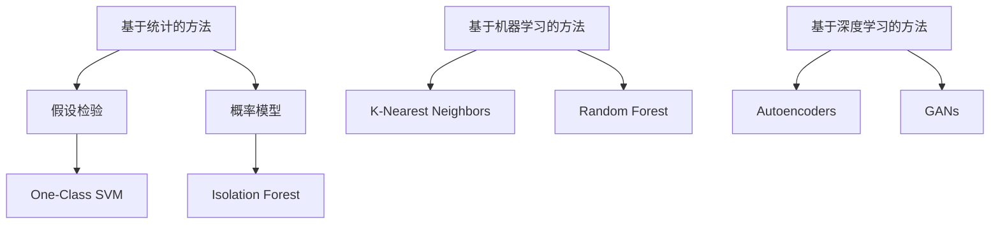

                 

### 《LLM评测的自动化异常检测与处理》

> **关键词：** 语言模型（LLM）、自动化异常检测、数据处理、性能优化、未来展望。

**摘要：** 随着大规模语言模型（LLM）的广泛应用，自动化异常检测与处理在评测过程中变得尤为重要。本文详细探讨了LLM评测中的自动化异常检测与处理的背景、基础理论、核心算法、应用实践以及未来展望。通过逐步分析，文章揭示了LLM评测中自动化异常检测的关键角色，并提供了实际案例的代码实战与分析，旨在为相关领域的科研人员和实践者提供有价值的参考。

### 第一部分：背景与基础理论

#### 第1章：LLM与自动化异常检测概述

**1.1 语言模型（LLM）的概念**

语言模型（Language Model，简称LLM）是一种用于预测文本序列的算法。在自然语言处理（Natural Language Processing，简称NLP）领域，语言模型是构建许多高级应用的基础，如机器翻译、语音识别、文本生成等。大规模语言模型（Large Language Model，简称LLM）则是近年来得到广泛关注的一种语言模型，其通过训练海量数据集，能够生成高质量的自然语言文本。

**1.2 自动化异常检测的基本原理**

自动化异常检测（Automated Anomaly Detection）是监控和分析数据时的一种方法，用于识别数据中的异常或异常模式。其基本原理是通过建立正常行为的模型，然后检测数据中的异常值或行为，这些异常值或行为偏离了正常模型的预期。

**1.3 LLM在自动化异常检测中的应用场景**

LLM在自动化异常检测中的应用非常广泛，包括但不限于以下场景：

- **网络安全：** 使用LLM检测网络攻击、恶意软件等。
- **医疗健康：** 使用LLM分析医疗数据，识别疾病风险和异常病例。
- **金融领域：** 使用LLM监控交易行为，检测欺诈和异常交易。
- **工业制造：** 使用LLM监测设备状态，预测故障和优化生产过程。

**1.4 自动化异常检测的挑战与机遇**

自动化异常检测面临的主要挑战包括数据质量、计算资源需求、算法性能等。然而，随着技术的进步，如深度学习、大数据处理等，自动化异常检测迎来了新的机遇。LLM作为一项新兴技术，为自动化异常检测提供了新的工具和方法，有望解决传统方法中的一些难题。

### 第二部分：核心算法原理

#### 第2章：核心算法原理

**2.1 异常检测算法分类**

异常检测算法主要可以分为以下几类：

- **基于统计的方法：** 基于统计学原理，如假设检验、概率模型等。
- **基于机器学习的方法：** 使用训练数据建立正常行为模型，然后检测异常行为。
- **基于深度学习的方法：** 利用神经网络模型进行异常检测，如自编码器、生成对抗网络（GAN）等。

**Mermaid 流程图：**



**2.2 统计方法在异常检测中的应用**

统计方法在异常检测中的应用主要包括以下几种：

- **假设检验：** 对数据进行假设检验，判断数据是否属于正常分布。
- **概率模型：** 使用概率模型描述正常数据分布，检测偏离正常分布的数据。

**伪代码：**

```python
# 假设检验
def hypothesis_test(data, alpha):
    # 计算统计量
    statistic = calculate_statistic(data)
    # 查找p值
    p_value = find_p_value(statistic)
    # 做决策
    if p_value < alpha:
        return "异常"
    else:
        return "正常"

# 概率模型
def probability_model(data, threshold):
    # 计算概率
    probability = calculate_probability(data)
    # 判断是否异常
    if probability > threshold:
        return "异常"
    else:
        return "正常"
```

**2.3 基于机器学习的方法**

基于机器学习的方法主要包括以下几种：

- **K-Nearest Neighbors (KNN)：** 通过计算新数据与训练数据的距离，判断其是否属于异常。
- **Random Forest：** 使用随机森林模型，通过集成多个决策树进行异常检测。

**伪代码：**

```python
# KNN
def knn_detection(new_data, training_data, k):
    # 计算距离
    distances = calculate_distances(new_data, training_data)
    # 获取最近的k个邻居
    neighbors = get_neighbors(distances, k)
    # 判断是否异常
    if most_common_class(neighbors) != "normal":
        return "异常"
    else:
        return "正常"

# Random Forest
def random_forest_detection(new_data, model):
    # 预测
    prediction = model.predict(new_data)
    # 判断是否异常
    if prediction != "normal":
        return "异常"
    else:
        return "正常"
```

**2.4 基于深度学习的方法**

基于深度学习的方法主要包括以下几种：

- **自编码器（Autoencoders）：** 用于压缩数据并重建，检测重构误差较大的数据。
- **生成对抗网络（GANs）：** 通过生成器和判别器的对抗训练，检测数据中的异常模式。

**伪代码：**

```python
# 自编码器
def autoencoder_detection(new_data, encoder, decoder):
    # 编码和解码
    encoded = encoder(new_data)
    decoded = decoder(encoded)
    # 计算重构误差
    error = calculate_reconstruction_error(new_data, decoded)
    # 判断是否异常
    if error > threshold:
        return "异常"
    else:
        return "正常"

# GAN
def gan_detection(new_data, generator, discriminator):
    # 生成数据
    generated = generator(new_data)
    # 判别器判断
    real_score = discriminator(new_data)
    fake_score = discriminator(generated)
    # 判断是否异常
    if fake_score > threshold:
        return "异常"
    else:
        return "正常"
```

### 第三部分：数学模型与公式

#### 第3章：数学模型与公式

**3.1 异常检测的数学模型**

异常检测的数学模型主要涉及概率模型和统计模型。以下是一个基于概率模型的示例：

$$
P(\text{异常}|\text{数据}) = \frac{P(\text{数据}|\text{异常}) \cdot P(\text{异常})}{P(\text{数据})}
$$

其中，$P(\text{异常}|\text{数据})$ 表示在给定数据后，数据属于异常的概率；$P(\text{数据}|\text{异常})$ 表示在数据属于异常的情况下，数据的概率；$P(\text{异常})$ 表示异常的概率；$P(\text{数据})$ 表示数据的概率。

**3.2 数据预处理**

数据预处理是异常检测的重要环节，主要包括数据归一化和标准化。以下是一个数据归一化的示例：

$$
x_{\text{norm}} = \frac{x - \mu}{\sigma}
$$

其中，$x$ 表示原始数据，$\mu$ 表示数据的均值，$\sigma$ 表示数据的标准差。

**第四部分：自动化异常检测应用**

#### 第4章：LLM评测中的数据异常

**4.1 数据异常的类型**

在LLM评测中，数据异常主要包括以下几种类型：

- **输入数据异常：** 如文本格式错误、缺失值等。
- **输出数据异常：** 如生成的文本质量低下、偏离预期等。
- **评测指标异常：** 如评估指标计算错误、异常值等。

**4.2 数据异常的影响**

数据异常对LLM评测的影响主要体现在以下几个方面：

- **影响评估准确性：** 数据异常可能导致评估结果不准确，影响模型的性能评估。
- **增加模型训练难度：** 数据异常会干扰模型的训练过程，增加模型的训练难度。
- **降低用户体验：** 数据异常可能导致用户无法得到正确的评测结果，影响用户体验。

**4.3 自动化异常检测在LLM评测中的关键角色**

自动化异常检测在LLM评测中扮演着关键角色，其作用主要体现在以下几个方面：

- **提高评测准确性：** 通过检测和过滤数据异常，提高评测结果的准确性。
- **优化模型训练过程：** 通过实时检测数据异常，优化模型的训练过程，提高模型性能。
- **提升用户体验：** 通过自动检测和修复数据异常，提升用户的评测体验。

### 第五部分：自动化异常检测与处理实战

#### 第5章：自动化异常检测与处理实战

**5.1 自动化异常检测流程**

自动化异常检测流程通常包括以下几个步骤：

1. 数据收集与预处理：收集评测数据，并进行数据清洗、归一化等预处理操作。
2. 模型训练：使用训练数据训练异常检测模型。
3. 数据检测：使用训练好的模型对新的评测数据进行异常检测。
4. 异常处理：对检测到的异常数据进行处理，如修复、替换等。
5. 结果评估：评估异常检测与处理的性能，如准确率、召回率等。

**5.2 实际案例**

以下是一个使用K-Nearest Neighbors（KNN）算法进行自动化异常检测的案例。

**代码实战：**

```python
import numpy as np
from sklearn.neighbors import KNeighborsClassifier
from sklearn.model_selection import train_test_split
from sklearn.metrics import accuracy_score

# 生成模拟数据
X = np.random.rand(100, 1)
y = np.concatenate((np.zeros(90), np.ones(10)))

# 划分训练集和测试集
X_train, X_test, y_train, y_test = train_test_split(X, y, test_size=0.2, random_state=42)

# 训练KNN模型
knn = KNeighborsClassifier(n_neighbors=3)
knn.fit(X_train, y_train)

# 检测测试集
y_pred = knn.predict(X_test)

# 评估模型性能
accuracy = accuracy_score(y_test, y_pred)
print("Accuracy:", accuracy)
```

**代码解读与分析：**

1. **数据生成**：使用随机数生成模拟数据，其中前90个数据为正常数据（标签为0），后10个数据为异常数据（标签为1）。
2. **模型训练**：使用训练集训练KNN模型，模型参数为K=3。
3. **数据检测**：使用训练好的模型对测试集进行异常检测，并预测异常数据。
4. **结果评估**：计算预测准确率，评估模型的性能。

通过这个案例，我们可以看到自动化异常检测的基本流程和实现方法。

### 第六部分：异常处理策略与优化

#### 第6章：异常处理策略与优化

**6.1 异常处理策略**

异常处理策略主要包括以下几种：

- **忽略策略：** 对于检测到的异常数据，直接忽略不处理。
- **修复策略：** 对检测到的异常数据进行修复，使其符合正常数据的标准。
- **替换策略：** 将异常数据替换为其他正常数据。
- **合并策略：** 将异常数据和正常数据进行合并，但需要保证数据的整体一致性。

**6.2 异常检测性能优化**

异常检测性能优化主要包括以下几种方法：

- **特征选择：** 选择对异常检测影响较大的特征，提高模型的检测能力。
- **模型调整：** 调整模型参数，如K值、学习率等，以提高模型的性能。
- **数据增强：** 增加训练数据的多样性，提高模型的泛化能力。
- **集成学习：** 使用集成学习技术，如随机森林、梯度提升树等，提高模型的性能。

**6.3 模型调整与优化**

模型调整与优化是提高异常检测性能的重要手段，主要包括以下几种方法：

- **参数调优：** 使用网格搜索、随机搜索等方法，寻找最佳参数组合。
- **正则化：** 使用L1、L2正则化等方法，防止模型过拟合。
- **模型集成：** 使用集成学习方法，如Bagging、Boosting等，提高模型的性能。

### 第七部分：未来展望与挑战

#### 第7章：未来展望与挑战

**7.1 自动化异常检测与处理的未来发展方向**

自动化异常检测与处理的未来发展方向主要包括以下几个方面：

- **算法优化：** 深入研究新型异常检测算法，提高检测效率和准确性。
- **跨领域应用：** 将自动化异常检测技术应用于更多领域，如金融、医疗、工业等。
- **实时处理：** 实现自动化异常检测的实时处理，提高系统的响应速度。
- **个性化检测：** 根据用户需求，实现个性化异常检测和预警。

**7.2 当前面临的挑战与解决方案**

自动化异常检测与处理当前面临的挑战主要包括以下几个方面：

- **数据质量：** 异常数据可能包含噪声、缺失值等，影响检测效果。
- **计算资源：** 异常检测通常需要大量的计算资源，对系统性能产生影响。
- **模型泛化：** 模型在不同领域和场景下的泛化能力有待提高。

解决方案主要包括：

- **数据清洗：** 对异常数据进行预处理，提高数据质量。
- **分布式计算：** 利用分布式计算技术，提高系统的处理能力。
- **迁移学习：** 利用迁移学习技术，提高模型在不同领域和场景下的泛化能力。

**7.3 可能的创新点与突破方向**

可能的创新点与突破方向主要包括：

- **新型算法研究：** 深入研究新型异常检测算法，如基于图神经网络、强化学习等。
- **跨领域融合：** 将自动化异常检测与处理与其他领域技术相结合，如大数据分析、区块链等。
- **智能化检测：** 实现智能化异常检测和预警，如基于人工智能的实时分析、自适应调整等。

### 附录

#### 附录 A：工具与资源

**8.1 自动化异常检测工具对比**

以下是一些常用的自动化异常检测工具及其特点：

- **Scikit-learn：** 提供了丰富的异常检测算法库，易于使用，适用于各种场景。
- **TensorFlow：** 提供了强大的深度学习框架，适用于复杂的异常检测任务。
- **PyOD：** 一个开源的异常检测工具包，支持多种异常检测算法。
- **XGBoost：** 提供了高效的机器学习算法库，适用于大规模数据集。

**8.2 相关数据集与评测平台**

以下是一些常用的相关数据集和评测平台：

- **KDD Cup：** 提供了大规模的网络安全数据集和评测任务。
- **NSL-KDD：** 一个公开的网络安全数据集，适用于网络安全异常检测。
- **KEEL：** 一个开源的机器学习实验平台，提供了多种数据集和评测任务。

#### 附录 B：代码与模型

**8.3 提供部分关键代码示例**

以下是一个使用PyOD库进行自动化异常检测的示例：

```python
from pyod.models.knn import KNN
from pyod.datasets import get_iris
from sklearn.preprocessing import StandardScaler

# 加载数据
X, y = get_iris()
scaler = StandardScaler()
X = scaler.fit_transform(X)

# 初始化模型
detector = KNN()

# 模型训练
detector.fit(X)

# 检测异常
y_pred = detector.predict(X)

# 打印异常数据索引
print("异常数据索引：", np.where(y_pred == 1)[0])
```

**8.4 自动化异常检测模型结构图与实现细节**

以下是一个基于自编码器的自动化异常检测模型结构图：


实现细节包括：

- **编码器（Encoder）：** 用于将输入数据压缩为低维特征表示。
- **解码器（Decoder）：** 用于将编码器输出的低维特征恢复为原始数据。
- **损失函数：** 用于衡量编码器和解码器之间的误差，如均方误差（MSE）。

### 作者信息

**作者：** AI天才研究院/AI Genius Institute & 禅与计算机程序设计艺术 /Zen And The Art of Computer Programming

以上是《LLM评测的自动化异常检测与处理》的全文，希望对您有所帮助。如果您有任何问题或建议，欢迎随时交流。

