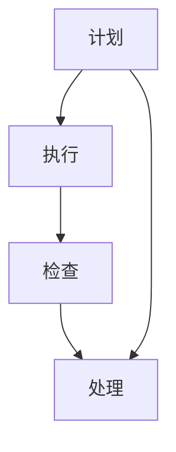
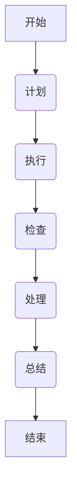

                 

### 文章标题

“PDCA循环与持续改进文化”

### 关键词

- PDCA循环
- 持续改进
- 质量管理
- 项目管理
- 人力资源管理

### 摘要

本文旨在深入探讨PDCA循环及其在各个领域中的应用，强调持续改进文化对于组织发展的关键作用。文章首先介绍了PDCA循环的历史背景和基本概念，详细解析了其四个阶段：计划（Plan）、执行（Do）、检查（Check）和处理（Act）。接着，文章阐述了如何建立持续改进文化，并提供了具体的实践案例。此外，本文还分析了PDCA循环在不同领域的应用实践，包括质量管理、项目管理和人力资源管理。最后，通过具体代码案例，展示了PDCA循环在生产线优化中的应用，提供了实战技巧与策略。本文旨在帮助读者全面理解PDCA循环及其在持续改进中的重要作用。

### 目录大纲

1. 第一部分：PDCA循环原理与基础
   1.1 PDCA循环概述
       1.1.1 PDCA循环的历史背景与重要性
       1.1.2 PDCA循环的基本概念与步骤
       1.1.3 PDCA循环在现代企业管理中的应用
   1.2 PDCA循环的四个阶段详解
       1.2.1 计划（Plan）
           1.2.1.1 问题识别与目标设定
           1.2.1.2 方案制定与资源分配
           1.2.1.3 预期效果评估
       1.2.2 执行（Do）
           1.2.2.1 执行计划的具体实施
           1.2.2.2 执行过程中的监控与调整
       1.2.3 检查（Check）
           1.2.3.1 收集数据与结果分析
           1.2.3.2 对比预期效果与实际效果
       1.2.4 处理（Act）
           1.2.4.1 成功经验的总结与标准化
           1.2.4.2 失败教训的反思与改进
   1.3 PDCA循环与持续改进文化

2. 第二部分：PDCA循环在不同领域的应用实践
   2.1 PDCA循环在质量管理中的应用
       2.1.1 质量管理的基本理念
       2.1.2 质量控制中的PDCA循环
       2.1.3 质量改进项目的PDCA循环应用
   2.2 PDCA循环在项目管理中的应用
       2.2.1 项目管理的基本概念
       2.2.2 项目计划与执行的PDCA循环
       2.2.3 项目监控与改进的PDCA循环
   2.3 PDCA循环在人力资源管理中的应用
       2.3.1 人力资源管理的基本原则
       2.3.2 人才发展中的PDCA循环
       2.3.3 团队效能提升的PDCA循环应用
   2.4 PDCA循环在其他领域中的应用探索

3. 第三部分：案例分析与实战技巧
   3.1 PDCA循环应用案例解析
       3.1.1 案例一：某制造企业质量管理提升
       3.1.2 案例二：某科技公司在项目管理中的PDCA循环实践
       3.1.3 案例三：人力资源管理中的PDCA循环应用
   3.2 PDCA循环实战技巧与策略
       3.2.1 如何设计有效的PDCA循环方案
       3.2.2 如何确保PDCA循环的执行效果
       3.2.3 PDCA循环在不同组织文化中的适应性调整

4. 附录
   4.1 PDCA循环相关工具与资源
       4.1.1 PDCA循环工具介绍
       4.1.2 持续改进的常用工具与方法
       4.1.3 PDCA循环资源推荐
   4.2 PDCA循环实施指南
       4.2.1 PDCA循环实施步骤详解
       4.2.2 PDCA循环实施常见问题解答
       4.2.3 PDCA循环实施案例分析
   4.3 持续改进文化案例集锦
       4.3.1 国内企业持续改进文化实践案例
       4.3.2 国外企业持续改进文化实践案例
       4.3.3 持续改进文化案例对比分析
   4.4 PDCA循环与持续改进相关论文与著作
       4.4.1 PDCA循环相关研究论文推荐
       4.4.2 持续改进相关著作推荐
       4.4.3 PDCA循环与持续改进领域最新发展动态

### 引言

在当今快速发展的信息技术时代，组织面临的竞争压力越来越大，如何在变化多端的市场环境中保持竞争力，成为企业持续关注的核心问题。持续改进作为一种系统化的管理方法，旨在通过不断优化和改进，提高组织的运营效率和市场响应能力。PDCA循环，即计划（Plan）、执行（Do）、检查（Check）和处理（Act）循环，是持续改进的核心工具之一。

PDCA循环最早由美国质量管理专家爱德华·戴明提出，并广泛应用于质量管理领域。然而，随着其在各个领域的推广，PDCA循环已经不仅仅局限于质量管理，而是成为一种普遍适用的管理方法。本文旨在深入探讨PDCA循环的基本原理、应用实践以及如何建立持续改进文化，帮助读者理解PDCA循环在组织管理中的重要作用。

本文将首先介绍PDCA循环的历史背景和基本概念，详细解析其四个阶段的实施方法。接着，我们将探讨如何建立持续改进文化，包括改进意识的培养和改进机制的建立。在此基础上，本文将分析PDCA循环在不同领域中的应用实践，如质量管理、项目管理和人力资源管理。此外，本文还将通过具体案例展示PDCA循环的实际应用效果，并提供实战技巧与策略。最后，本文将提供PDCA循环的相关工具与资源，以及实施指南和案例分析。

通过本文的深入探讨，读者将能够全面理解PDCA循环的基本原理和实际应用，掌握如何建立持续改进文化，并学会在不同领域运用PDCA循环进行管理实践。希望本文能够为读者在持续改进和优化管理过程中提供有价值的参考和启示。

### PDCA循环原理与基础

#### PDCA循环的历史背景与重要性

PDCA循环，即计划（Plan）、执行（Do）、检查（Check）和处理（Act）循环，最早由美国质量管理专家爱德华·戴明提出。戴明在20世纪50年代将这一循环引入日本，并在日本得到了广泛的应用和推广。PDCA循环的提出，源于对质量管理过程中存在的重复性问题的一种反思。传统的质量管理方法往往侧重于对个别问题的解决，而忽视了整体流程的优化和系统的改进。戴明的理念是通过循环迭代，不断改进和优化整个流程，从而实现质量管理的持续提升。

PDCA循环在日本的应用取得了显著的成功，并迅速在全球范围内传播开来。特别是随着信息技术的快速发展，PDCA循环在企业管理、项目管理、人力资源管理等领域得到了广泛的应用。其重要性主要体现在以下几个方面：

1. **系统化改进**：PDCA循环提供了一种系统化的方法，将改进活动分为四个明确的阶段，确保每个阶段都有具体的任务和目标，从而提高改进活动的效率和质量。

2. **持续改进**：PDCA循环强调通过循环迭代不断改进，使得改进活动不是一次性的，而是持续不断的。这种持续改进的理念有助于组织在不断变化的市场环境中保持竞争力。

3. **问题导向**：PDCA循环以问题为导向，通过计划的制定、执行、检查和处理的循环，逐步解决组织中存在的问题，从而实现持续优化。

#### PDCA循环的基本概念与步骤

PDCA循环是一种闭环管理系统，其核心在于通过四个阶段的反复迭代，实现持续改进。这四个阶段分别是计划（Plan）、执行（Do）、检查（Check）和处理（Act）。

1. **计划（Plan）阶段**

计划阶段是PDCA循环的起点，其主要任务是识别问题、设定目标和制定方案。具体步骤包括：

- **问题识别**：通过数据分析、用户反馈等方式，识别组织当前存在的问题。
- **目标设定**：根据问题识别的结果，设定明确的改进目标，这些目标应当具有可衡量性、具体性和可实现性。
- **方案制定**：制定具体的改进方案，包括资源分配、时间表和责任人。

2. **执行（Do）阶段**

执行阶段是将计划付诸实践的过程。主要任务是按照计划实施行动，确保各项措施得到有效执行。具体步骤包括：

- **实施计划**：按照计划的具体措施，逐步执行，确保各项任务按时完成。
- **过程监控**：在执行过程中，对关键环节进行监控，及时发现和解决潜在问题。

3. **检查（Check）阶段**

检查阶段是对执行结果进行评估和验证。主要任务是收集数据、对比预期效果和实际效果，判断改进措施的有效性。具体步骤包括：

- **数据收集**：收集执行过程中产生的数据，包括质量数据、成本数据等。
- **结果分析**：对收集到的数据进行分析，评估实际效果与预期效果的差异，找出存在的问题。

4. **处理（Act）阶段**

处理阶段是对检查结果的总结和反馈。主要任务是将成功的经验进行标准化，形成标准流程；对失败的经验进行反思和改进。具体步骤包括：

- **总结经验**：对成功的经验进行总结，将其标准化，形成最佳实践。
- **改进措施**：对检查阶段发现的问题进行反思，制定改进措施，确保问题得到有效解决。

#### PDCA循环在现代企业管理中的应用

在现代企业管理中，PDCA循环作为一种系统化的管理方法，已被广泛接受和应用。以下是PDCA循环在现代企业管理中的一些典型应用场景：

1. **质量管理**

PDCA循环在质量管理中的应用非常典型。通过计划阶段的问题识别和目标设定，企业可以明确质量改进的方向；执行阶段的实施和监控，确保质量改进措施得到有效执行；检查阶段的结果分析，帮助企业发现质量问题并及时调整；处理阶段的总结和改进，使得企业的质量管理水平不断提升。

2. **项目管理**

在项目管理中，PDCA循环可以帮助项目经理更好地控制项目进度和质量。计划阶段，项目团队可以制定详细的项目计划，明确项目目标、任务和时间表；执行阶段，按照项目计划逐步推进项目，确保各项任务按时完成；检查阶段，对项目进度和成果进行监控和评估；处理阶段，总结项目经验，形成项目管理的最佳实践。

3. **人力资源管理**

PDCA循环在人力资源管理中的应用主要体现在人才发展和团队效能提升方面。通过计划阶段的人才需求分析和目标设定，企业可以明确人才培养的方向；执行阶段的培训和激励，确保人才培养措施得到有效执行；检查阶段，对人才培养效果进行评估；处理阶段，总结人才培养经验，形成标准化的人才培养流程。

#### 结论

PDCA循环作为一种系统化的管理方法，其基本概念和步骤在现代企业管理中得到了广泛应用。通过PDCA循环，企业可以不断识别和解决存在的问题，实现持续改进。本文将在后续章节中，进一步详细解析PDCA循环的四个阶段，并探讨其在不同领域中的应用实践。

### PDCA循环的四个阶段详解

PDCA循环，即计划（Plan）、执行（Do）、检查（Check）和处理（Act）循环，是一种系统化的管理方法，广泛应用于各个领域，包括质量管理、项目管理、人力资源管理等。每个阶段都有其独特的任务和目标，通过这些阶段的反复迭代，实现持续改进。本文将详细解析PDCA循环的四个阶段，帮助读者更好地理解其具体实施方法。

#### 1. 计划（Plan）阶段

计划阶段是PDCA循环的起点，其主要任务是识别问题、设定目标和制定方案。以下是计划阶段的具体任务：

1. **问题识别**

问题识别是计划阶段的首要任务。通过数据分析、用户反馈、现场观察等方式，识别组织中存在的问题。问题识别的目的是明确改进的方向，确保后续的改进活动有的放矢。

2. **目标设定**

在问题识别的基础上，设定明确、可衡量、具体和可实现的目标。这些目标应当与组织的战略目标相一致，同时具备明确的衡量标准，以便后续的评估和监控。

3. **方案制定**

制定具体的改进方案，包括资源分配、时间表和责任人。方案制定应当充分考虑实际情况，确保各项措施的可操作性和可行性。此外，方案制定过程中还需要进行风险评估，预测可能出现的问题和解决方案。

#### 2. 执行（Do）阶段

执行阶段是将计划付诸实践的过程。其主要任务是按照计划实施行动，确保各项措施得到有效执行。以下是执行阶段的具体任务：

1. **实施计划**

按照计划的具体措施，逐步执行，确保各项任务按时完成。在实施过程中，需要密切监控进度和质量，确保计划得到有效执行。

2. **过程监控**

过程监控是执行阶段的关键任务。通过对关键环节的监控，及时发现和解决潜在问题，确保计划的顺利进行。过程监控包括数据收集、问题反馈和及时调整。

3. **资源管理**

在执行过程中，需要对资源进行有效管理，确保资源的合理配置和充分利用。资源管理包括人力、物力、财力等资源的协调和分配。

#### 3. 检查（Check）阶段

检查阶段是对执行结果进行评估和验证。其主要任务是收集数据、对比预期效果和实际效果，判断改进措施的有效性。以下是检查阶段的具体任务：

1. **数据收集**

数据收集是检查阶段的基础任务。通过收集各类数据，如质量数据、成本数据、进度数据等，为后续的评估提供依据。

2. **结果分析**

对收集到的数据进行分析，评估实际效果与预期效果的差异，找出存在的问题。结果分析应当具备科学性和客观性，确保分析结果的准确性。

3. **效果评估**

根据结果分析，评估改进措施的有效性。如果实际效果达到预期目标，则改进措施成功；如果实际效果未达到预期目标，则需要进一步分析原因，找出改进的方向。

#### 4. 处理（Act）阶段

处理阶段是对检查结果的总结和反馈。其主要任务是总结成功的经验，形成标准流程，同时对失败的经验进行反思和改进。以下是处理阶段的具体任务：

1. **总结经验**

对成功的经验进行总结，形成标准流程，确保后续的改进活动有据可依。标准流程应当具备可操作性和可重复性，以便在组织内部推广。

2. **改进措施**

对检查阶段发现的问题进行反思和改进。改进措施应当具有针对性，确保问题得到有效解决。改进措施实施后，需要对其进行跟踪和评估，确保改进效果的持续性和稳定性。

3. **反馈机制**

建立反馈机制，确保检查和处理阶段的成果能够及时反馈到计划阶段，形成闭环管理。反馈机制应当具备及时性、准确性和全面性。

#### 结论

PDCA循环的四个阶段相辅相成，共同构成了一个完整的持续改进系统。通过计划阶段的问题识别和目标设定，执行阶段的计划实施和过程监控，检查阶段的结果分析和效果评估，以及处理阶段的总结经验和改进措施，PDCA循环实现了对组织运营的全面优化。本文通过详细解析PDCA循环的四个阶段，为读者提供了具体的实施方法和实践指导，希望对组织的管理实践有所帮助。

### 第1章：PDCA循环概述

#### PDCA循环的定义与核心概念

PDCA循环，即计划（Plan）、执行（Do）、检查（Check）和处理（Act）循环，是一种系统化的管理方法，最初由美国质量管理专家爱德华·戴明提出，并在日本得到广泛应用。PDCA循环是一种闭环管理工具，通过四个阶段的反复迭代，实现持续改进。每个阶段都有其独特的任务和目标，共同构成了一个完整的改进过程。

1. **计划（Plan）阶段**

计划阶段是PDCA循环的起点，其主要任务是识别问题、设定目标和制定方案。计划阶段包括以下步骤：

- **问题识别**：通过数据分析、用户反馈、现场观察等方式，识别组织中存在的问题。
- **目标设定**：根据问题识别的结果，设定明确的改进目标，这些目标应当具有可衡量性、具体性和可实现性。
- **方案制定**：制定具体的改进方案，包括资源分配、时间表和责任人。

2. **执行（Do）阶段**

执行阶段是将计划付诸实践的过程。其主要任务是按照计划实施行动，确保各项措施得到有效执行。执行阶段包括以下步骤：

- **实施计划**：按照计划的具体措施，逐步执行，确保各项任务按时完成。
- **过程监控**：在执行过程中，对关键环节进行监控，及时发现和解决潜在问题。

3. **检查（Check）阶段**

检查阶段是对执行结果进行评估和验证。其主要任务是收集数据、对比预期效果和实际效果，判断改进措施的有效性。检查阶段包括以下步骤：

- **数据收集**：收集执行过程中产生的数据，包括质量数据、成本数据等。
- **结果分析**：对收集到的数据进行分析，评估实际效果与预期效果的差异，找出存在的问题。

4. **处理（Act）阶段**

处理阶段是对检查结果的总结和反馈。其主要任务是总结成功的经验，形成标准流程，同时对失败的经验进行反思和改进。处理阶段包括以下步骤：

- **总结经验**：对成功的经验进行总结，形成标准流程，确保后续的改进活动有据可依。
- **改进措施**：对检查阶段发现的问题进行反思和改进，确保问题得到有效解决。

#### PDCA循环的应用背景

PDCA循环在各个领域的应用非常广泛，其背景主要源于以下原因：

1. **质量管理的需要**

随着市场竞争的加剧，产品质量成为企业生存和发展的关键。PDCA循环提供了一种系统化的质量管理方法，通过计划、执行、检查和处理四个阶段的反复迭代，帮助企业不断提升产品质量。

2. **持续改进的需求**

在信息技术飞速发展的今天，组织面临的挑战越来越多，如何保持持续改进成为关键问题。PDCA循环强调通过循环迭代，不断识别和解决存在的问题，实现组织的持续改进。

3. **项目管理的要求**

在项目管理中，PDCA循环可以帮助项目经理更好地控制项目进度和质量。通过计划、执行、检查和处理四个阶段的反复迭代，确保项目目标的实现。

4. **人力资源管理的需求**

在人力资源管理中，PDCA循环可以帮助企业更好地进行人才发展和团队建设。通过计划、执行、检查和处理四个阶段的反复迭代，提升团队的整体效能。

#### PDCA循环的基本概念与步骤

PDCA循环是一种闭环管理方法，其基本概念和步骤如下：

1. **计划（Plan）阶段**

计划阶段的主要任务是识别问题、设定目标和制定方案。具体步骤包括：

- **问题识别**：通过数据分析、用户反馈等方式，识别组织中存在的问题。
- **目标设定**：根据问题识别的结果，设定明确的改进目标，这些目标应当具有可衡量性、具体性和可实现性。
- **方案制定**：制定具体的改进方案，包括资源分配、时间表和责任人。

2. **执行（Do）阶段**

执行阶段的主要任务是按照计划实施行动，确保各项措施得到有效执行。具体步骤包括：

- **实施计划**：按照计划的具体措施，逐步执行，确保各项任务按时完成。
- **过程监控**：在执行过程中，对关键环节进行监控，及时发现和解决潜在问题。

3. **检查（Check）阶段**

检查阶段的主要任务是对执行结果进行评估和验证。具体步骤包括：

- **数据收集**：收集执行过程中产生的数据，包括质量数据、成本数据等。
- **结果分析**：对收集到的数据进行分析，评估实际效果与预期效果的差异，找出存在的问题。

4. **处理（Act）阶段**

处理阶段的主要任务是总结成功的经验，形成标准流程，同时对失败的经验进行反思和改进。具体步骤包括：

- **总结经验**：对成功的经验进行总结，形成标准流程，确保后续的改进活动有据可依。
- **改进措施**：对检查阶段发现的问题进行反思和改进，确保问题得到有效解决。

#### PDCA循环与持续改进文化

持续改进文化是一种追求卓越、不断优化的组织氛围。PDCA循环是持续改进文化的重要组成部分，通过计划、执行、检查和处理四个阶段的反复迭代，推动组织不断改进和提升。

1. **改进意识的培养**

持续改进文化的基础是改进意识的培养。组织应当通过培训、宣传等方式，提高员工对改进的认识和重视程度，形成全员参与改进的氛围。

2. **改进机制的建立**

改进机制的建立是持续改进文化的重要保障。组织应当建立完善的改进机制，包括问题识别、目标设定、方案制定、执行、检查和处理等环节，确保改进活动的有序进行。

3. **改进效果的评估**

改进效果的评估是持续改进文化的重要环节。组织应当定期评估改进效果，总结成功经验，推广最佳实践，同时反思和改进不足之处。

#### 结论

PDCA循环是一种系统化的管理方法，通过计划、执行、检查和处理四个阶段的反复迭代，实现持续改进。PDCA循环在质量管理、项目管理、人力资源管理等领域具有广泛的应用。建立持续改进文化，是组织追求卓越、提升竞争力的关键。本文旨在帮助读者全面理解PDCA循环的基本概念和应用，为组织的管理实践提供参考。

### 第2章：PDCA循环的四个阶段详解

PDCA循环，即计划（Plan）、执行（Do）、检查（Check）和处理（Act）循环，是一种系统化的管理方法，通过四个阶段的反复迭代，实现持续改进。每个阶段都有其独特的任务和目标，共同构成了一个完整的改进过程。本文将详细解析PDCA循环的四个阶段，帮助读者更好地理解其具体实施方法。

#### 第1阶段：计划（Plan）

计划阶段是PDCA循环的起点，其主要任务是识别问题、设定目标和制定方案。以下将详细解析计划阶段的具体步骤：

1. **问题识别**

问题识别是计划阶段的首要任务。通过数据分析、用户反馈、现场观察等方式，识别组织中存在的问题。问题识别的目的是明确改进的方向，确保后续的改进活动有的放矢。

2. **目标设定**

在问题识别的基础上，设定明确、可衡量、具体和可实现的目标。这些目标应当与组织的战略目标相一致，同时具备明确的衡量标准，以便后续的评估和监控。

3. **方案制定**

制定具体的改进方案，包括资源分配、时间表和责任人。方案制定应当充分考虑实际情况，确保各项措施的可操作性和可行性。此外，方案制定过程中还需要进行风险评估，预测可能出现的问题和解决方案。

**具体案例：某制造企业的质量改进**

某制造企业发现其产品存在质量问题，影响了客户满意度。通过数据分析，识别出生产线上某道工序的瑕疵率较高。因此，计划阶段的目标设定为降低该道工序的瑕疵率，并确保改进方案的可操作性和可行性。

#### 第2阶段：执行（Do）

执行阶段是将计划付诸实践的过程。其主要任务是按照计划实施行动，确保各项措施得到有效执行。以下是执行阶段的具体任务：

1. **实施计划**

按照计划的具体措施，逐步执行，确保各项任务按时完成。在实施过程中，需要密切监控进度和质量，确保计划得到有效执行。

2. **过程监控**

过程监控是执行阶段的关键任务。通过对关键环节的监控，及时发现和解决潜在问题，确保计划的顺利进行。过程监控包括数据收集、问题反馈和及时调整。

3. **资源管理**

在执行过程中，需要对资源进行有效管理，确保资源的合理配置和充分利用。资源管理包括人力、物力、财力等资源的协调和分配。

**具体案例：某科技公司的项目实施**

某科技公司正在实施一项新产品的研发项目。执行阶段，项目团队按照计划逐步推进项目，包括需求分析、设计、开发和测试等环节。在过程中，项目团队对关键环节进行监控，确保项目进度和质量。

#### 第3阶段：检查（Check）

检查阶段是对执行结果进行评估和验证。其主要任务是收集数据、对比预期效果和实际效果，判断改进措施的有效性。以下是检查阶段的具体任务：

1. **数据收集**

数据收集是检查阶段的基础任务。通过收集各类数据，如质量数据、成本数据、进度数据等，为后续的评估提供依据。

2. **结果分析**

对收集到的数据进行分析，评估实际效果与预期效果的差异，找出存在的问题。结果分析应当具备科学性和客观性，确保分析结果的准确性。

3. **效果评估**

根据结果分析，评估改进措施的有效性。如果实际效果达到预期目标，则改进措施成功；如果实际效果未达到预期目标，则需要进一步分析原因，找出改进的方向。

**具体案例：某电商平台的运营效果检查**

某电商平台通过检查阶段对上个月的运营数据进行分析，发现用户留存率低于预期。通过对比预期效果和实际效果，找出影响用户留存率的因素，并提出相应的改进措施。

#### 第4阶段：处理（Act）

处理阶段是对检查结果的总结和反馈。其主要任务是总结成功的经验，形成标准流程，同时对失败的经验进行反思和改进。以下是处理阶段的具体任务：

1. **总结经验**

对成功的经验进行总结，形成标准流程，确保后续的改进活动有据可依。标准流程应当具备可操作性和可重复性，以便在组织内部推广。

2. **改进措施**

对检查阶段发现的问题进行反思和改进。改进措施应当具有针对性，确保问题得到有效解决。改进措施实施后，需要对其进行跟踪和评估，确保改进效果的持续性和稳定性。

3. **反馈机制**

建立反馈机制，确保检查和处理阶段的成果能够及时反馈到计划阶段，形成闭环管理。反馈机制应当具备及时性、准确性和全面性。

**具体案例：某金融服务公司的风险管理**

某金融服务公司在处理阶段对最近的信用风险评估流程进行总结，发现部分评估指标存在偏差。通过总结经验，形成更加科学和精准的评估流程，并对现有流程进行改进，提高风险评估的准确性。

#### 结论

PDCA循环的四个阶段相辅相成，共同构成了一个完整的持续改进系统。通过计划阶段的问题识别和目标设定，执行阶段的计划实施和过程监控，检查阶段的结果分析和效果评估，以及处理阶段的总结经验和改进措施，PDCA循环实现了对组织运营的全面优化。本文通过详细解析PDCA循环的四个阶段，为读者提供了具体的实施方法和实践指导，希望对组织的管理实践有所帮助。

### 第3章：PDCA循环与持续改进文化

#### 持续改进文化的概念与重要性

持续改进文化是一种追求卓越、不断优化的组织氛围。它强调通过系统化的改进方法，如PDCA循环，不断提升组织的运营效率和市场竞争力。持续改进文化不仅关注短期的绩效提升，更注重长期的发展和成长。以下是持续改进文化的几个关键特点：

1. **全员参与**：持续改进文化鼓励全体员工参与改进活动，从管理层到普通员工，都应当积极参与，共同推动组织的改进进程。

2. **持续反馈**：持续改进文化强调及时反馈和持续改进。通过定期的评估和反馈，组织能够及时发现问题和机会，并迅速采取行动。

3. **学习与成长**：持续改进文化倡导学习与成长的精神。组织应当鼓励员工不断学习新知识和技能，提升个人的专业素养，从而为组织的持续改进提供有力支持。

4. **数据驱动**：持续改进文化注重数据驱动决策。通过收集和分析数据，组织能够客观地评估改进措施的效果，确保改进活动的科学性和有效性。

#### 改进意识的培养

培养改进意识是建立持续改进文化的第一步。以下是一些具体的方法和策略：

1. **宣传与教育**：通过内部宣传和教育，提高员工对持续改进的认识和理解。例如，可以通过内部培训、研讨会、分享会等形式，传播改进的理念和方法。

2. **激励与奖励**：建立激励机制，鼓励员工积极参与改进活动。对在改进活动中表现突出的员工给予奖励，如奖金、晋升机会等，激发员工的改进热情。

3. **案例分析**：通过分享成功和失败的案例，让员工了解改进活动的实际效果和重要性。案例可以是组织内部的，也可以是行业外的，以不同的视角和背景提供参考。

#### 改进机制的建立

建立有效的改进机制是持续改进文化的重要组成部分。以下是一些关键步骤：

1. **问题识别机制**：建立问题识别机制，鼓励员工及时发现和报告问题。可以通过设置问题反馈渠道、定期组织问题排查等方式，确保问题能够被及时发现。

2. **目标设定机制**：建立目标设定机制，确保每个部门和员工都有明确的改进目标。目标应当具有可衡量性、具体性和可实现性，以便后续的评估和监控。

3. **方案制定与审批机制**：建立方案制定与审批机制，确保改进方案的合理性和可行性。改进方案应当经过严格审核，确保具备实施条件。

4. **执行与监控机制**：建立执行与监控机制，确保改进措施得到有效执行。在执行过程中，需要定期对关键环节进行监控，及时发现和解决潜在问题。

#### 改进效果的评估与反馈

改进效果的评估与反馈是持续改进文化的重要环节。以下是一些关键步骤：

1. **数据收集与分析**：收集改进活动过程中产生的各类数据，如成本数据、质量数据、效率数据等。通过对数据进行深入分析，评估改进措施的效果。

2. **效果评估**：根据数据分析结果，对改进措施的有效性进行评估。如果改进措施达到了预期效果，应当总结成功经验，并将其制度化；如果未达到预期效果，需要进一步分析原因，制定改进措施。

3. **反馈与改进**：将评估结果及时反馈给相关部门和员工，确保改进活动的透明性和公正性。对于发现的问题，应当迅速采取行动，进行反思和改进。

4. **持续改进**：持续改进文化强调通过循环迭代不断改进。评估和反馈的过程不仅是一次性的，而是一个持续不断的过程，以确保组织的运营效率和市场竞争力不断提升。

#### 结论

PDCA循环与持续改进文化密切相关。PDCA循环提供了系统化的改进方法，而持续改进文化则为PDCA循环的实施提供了良好的组织氛围和机制保障。通过培养改进意识、建立改进机制、评估改进效果和持续反馈，组织能够不断提升其运营效率和竞争力。本文旨在帮助读者理解PDCA循环与持续改进文化的关系，为组织的管理实践提供有益的参考。

### 第二部分：PDCA循环在不同领域的应用实践

#### PDCA循环在质量管理中的应用

质量管理是组织运营的核心之一，而PDCA循环作为一种系统化的管理方法，在质量管理中具有广泛的应用。以下是PDCA循环在质量管理中应用的详细解析。

#### 质量管理的基本理念

质量管理的基本理念是“以顾客为中心，持续改进”。其核心是通过满足和超越顾客期望，实现组织的目标。以下是质量管理的几个关键要素：

1. **顾客导向**：组织应当以顾客的需求和期望为中心，确保所有质量活动都围绕着顾客满意度的提升。

2. **全员参与**：质量管理不仅仅是质量部门的职责，而是全体员工的共同责任。每个员工都应当参与质量管理，共同推动组织的质量提升。

3. **数据驱动**：质量管理的决策应当基于数据和分析，确保改进措施的科学性和有效性。

4. **持续改进**：质量管理的目标是不断提升，通过PDCA循环，组织能够不断识别和解决质量问题，实现持续改进。

#### 质量控制中的PDCA循环

在质量控制中，PDCA循环被广泛应用于各个环节，包括产品开发、生产制造、售后服务等。以下是PDCA循环在质量控制中的具体应用：

1. **计划阶段（Plan）**

- **问题识别**：通过市场调查、用户反馈等方式，识别产品质量存在的问题。
- **目标设定**：设定明确的改进目标，如降低产品缺陷率、提高生产效率等。
- **方案制定**：制定具体的改进方案，包括改进措施、资源分配、时间表等。

2. **执行阶段（Do）**

- **实施计划**：按照制定的改进方案，逐步实施，确保各项措施得到有效执行。
- **过程监控**：对关键环节进行监控，如原材料质量、生产过程、检验标准等，确保计划得到有效执行。

3. **检查阶段（Check）**

- **数据收集**：收集产品质量相关的数据，如缺陷率、生产效率、顾客满意度等。
- **结果分析**：对收集到的数据进行分析，评估实际效果与预期效果的差异，找出存在的问题。

4. **处理阶段（Act）**

- **总结经验**：对成功的经验进行总结，形成最佳实践，确保后续的质量改进有据可依。
- **改进措施**：对检查阶段发现的问题进行反思和改进，制定具体的改进措施，确保问题得到有效解决。

#### 质量改进项目的PDCA循环应用

质量改进项目是组织提升质量管理水平的重要手段。通过PDCA循环，质量改进项目能够实现系统化、科学化和持续化。以下是质量改进项目的PDCA循环应用步骤：

1. **计划阶段（Plan）**

- **问题识别**：通过市场调查、用户反馈等方式，识别质量改进的具体问题。
- **目标设定**：设定明确的质量改进目标，如提高产品合格率、降低生产成本等。
- **方案制定**：制定具体的改进方案，包括改进措施、资源分配、时间表等。

2. **执行阶段（Do）**

- **实施计划**：按照制定的改进方案，逐步实施，确保各项措施得到有效执行。
- **过程监控**：对关键环节进行监控，如改进措施的实施进度、质量状况等，确保计划得到有效执行。

3. **检查阶段（Check）**

- **数据收集**：收集质量改进相关的数据，如改进措施的效果、顾客满意度等。
- **结果分析**：对收集到的数据进行分析，评估质量改进措施的有效性，找出存在的问题。

4. **处理阶段（Act）**

- **总结经验**：对成功的质量改进措施进行总结，形成标准操作流程，确保后续的质量改进有据可依。
- **改进措施**：对检查阶段发现的问题进行反思和改进，制定具体的改进措施，确保问题得到有效解决。

#### 结论

PDCA循环在质量管理中的应用，通过系统化的管理方法，帮助组织实现质量改进和持续提升。通过计划阶段的问题识别和目标设定，执行阶段的计划实施和过程监控，检查阶段的结果分析和效果评估，以及处理阶段的总结经验和改进措施，PDCA循环实现了对组织质量管理的全面优化。本文通过详细解析PDCA循环在质量管理中的应用，为组织的质量管理实践提供了有价值的参考。

### 第4章：PDCA循环在项目管理中的应用

#### 项目管理的基本概念

项目管理是指通过计划、执行、监控和收尾等一系列活动，确保项目按时、按预算、按质量要求完成的过程。项目管理的基本概念包括以下几个方面：

1. **项目**：项目是一系列相互关联的任务，具有明确的开始和结束时间，旨在实现特定目标。项目通常涉及多个学科领域，需要跨部门协作。

2. **项目管理**：项目管理是指运用各种知识、技能、工具和技术，实现项目目标的过程。项目管理包括计划、执行、监控和收尾等阶段。

3. **项目经理**：项目经理是负责项目管理的个体或团队，负责确保项目目标的实现。项目经理需要具备领导力、沟通能力和解决问题的能力。

4. **项目团队**：项目团队是执行项目任务的团队，包括项目经理、技术专家、设计师、开发人员等。项目团队的协作和沟通是项目成功的关键。

#### 项目计划与执行的PDCA循环

在项目管理中，PDCA循环被广泛应用于项目计划和执行阶段，以实现项目的有序推进和目标达成。以下是PDCA循环在项目计划与执行阶段的具体应用：

1. **计划阶段（Plan）**

- **问题识别**：项目团队通过市场调研、用户需求分析等方式，识别项目可能面临的问题和挑战。
- **目标设定**：根据问题识别的结果，设定项目的具体目标，如项目范围、时间、预算和质量等。
- **方案制定**：项目团队制定详细的计划，包括项目任务、时间表、资源分配、风险评估等。

2. **执行阶段（Do）**

- **实施计划**：按照制定的计划，项目团队逐步执行项目任务，确保各项任务按时完成。
- **过程监控**：项目团队对关键环节进行监控，如进度、成本、质量等，确保计划得到有效执行。
- **资源管理**：项目团队对资源进行有效管理，确保人力、物力和财力的合理配置。

3. **检查阶段（Check）**

- **数据收集**：项目团队收集项目执行过程中的各类数据，如进度报告、质量检查记录等。
- **结果分析**：项目团队对收集到的数据进行分析，评估实际执行结果与预期目标的差距，找出存在的问题。

4. **处理阶段（Act）**

- **总结经验**：项目团队总结成功的经验，形成标准操作流程，确保后续项目的顺利进行。
- **改进措施**：对检查阶段发现的问题进行反思和改进，制定具体的改进措施，确保问题得到有效解决。

#### 项目监控与改进的PDCA循环

在项目执行过程中，PDCA循环不仅用于计划和执行阶段，还可以应用于项目监控与改进阶段，以确保项目目标的实现和持续改进。以下是PDCA循环在项目监控与改进阶段的具体应用：

1. **监控阶段（Check）**

- **数据收集**：项目团队持续收集项目执行过程中的数据，包括进度、成本、质量等指标。
- **结果分析**：项目团队对收集到的数据进行分析，评估项目执行的实际情况，找出存在的问题。

2. **改进阶段（Act）**

- **改进措施**：项目团队根据结果分析，制定具体的改进措施，解决存在的问题，确保项目目标的实现。
- **实施改进**：项目团队按照改进措施，逐步实施，确保改进措施得到有效执行。

3. **总结反馈**：项目团队对改进效果进行评估，总结成功的经验，形成标准操作流程，为后续项目的管理提供参考。

#### 结论

PDCA循环在项目管理中的应用，通过计划、执行、检查和处理的循环迭代，帮助项目团队实现项目目标的有序推进和持续改进。通过计划阶段的详细规划，执行阶段的有序实施，检查阶段的数据分析和结果评估，以及处理阶段的改进措施和总结反馈，PDCA循环为项目管理提供了系统化的方法和工具。本文通过对PDCA循环在项目管理中的应用进行详细解析，为项目管理者提供了有价值的参考和指导。

### PDCA循环在人力资源管理中的应用

#### 人力资源管理的基本原则

人力资源管理是组织管理的重要组成部分，其核心目标是确保组织拥有合适的人才，并充分发挥他们的潜力，从而实现组织的战略目标。以下是人力资源管理的基本原则：

1. **以人为本**：人力资源管理应以人为中心，尊重和关爱员工，关注员工的需求和成长，建立和谐的劳动关系。

2. **合理配置**：人力资源管理的目标是确保组织内部各类人力资源得到合理配置，使员工的能力和岗位需求相匹配，提高工作效率。

3. **绩效导向**：绩效导向是人力资源管理的重要原则，通过设定明确的绩效目标和评估标准，激发员工的积极性和创造力。

4. **持续发展**：人力资源管理应注重员工的持续发展和职业规划，提供培训和发展的机会，使员工能够不断提升自己的能力和素质。

5. **文化塑造**：通过塑造积极向上的企业文化，增强员工的归属感和忠诚度，促进组织的整体凝聚力。

#### 人才发展中的PDCA循环

在人才发展中，PDCA循环被广泛应用于人才招聘、培训、评估和激励等环节，以实现人才的持续发展和组织的目标。以下是PDCA循环在人才发展中的具体应用：

1. **计划阶段（Plan）**

- **需求分析**：根据组织的发展规划和业务需求，分析人才需求，确定招聘、培训和激励的方向。
- **目标设定**：设定明确的人才发展目标，如招聘目标、培训目标和激励目标等。
- **方案制定**：制定具体的人才发展方案，包括招聘策略、培训计划、激励措施等。

2. **执行阶段（Do）**

- **招聘实施**：按照招聘方案，实施招聘活动，确保招聘目标的实现。
- **培训实施**：按照培训计划，开展培训活动，提高员工的专业技能和综合素质。
- **激励实施**：根据激励措施，实施激励政策，激发员工的工作积极性和创造力。

3. **检查阶段（Check）**

- **数据收集**：收集人才发展过程中的各类数据，如招聘成本、培训效果、员工满意度等。
- **结果分析**：对收集到的数据进行分析，评估人才发展措施的有效性，找出存在的问题。

4. **处理阶段（Act）**

- **总结经验**：对成功的人才发展措施进行总结，形成最佳实践，为后续的人才发展提供参考。
- **改进措施**：对检查阶段发现的问题进行反思和改进，制定具体的改进措施，确保人才发展目标的实现。

#### 团队效能提升的PDCA循环应用

团队效能提升是人力资源管理的重要目标之一，通过PDCA循环，可以系统化地提升团队的整体效能。以下是PDCA循环在团队效能提升中的具体应用：

1. **计划阶段（Plan）**

- **团队分析**：分析团队的现状，包括团队成员的能力、团队的协作方式、团队的目标等。
- **目标设定**：设定明确的团队效能提升目标，如提高团队沟通效率、提升团队协作能力等。
- **方案制定**：制定具体的团队效能提升方案，包括团队建设活动、沟通培训、协作工具的引入等。

2. **执行阶段（Do）**

- **团队建设**：按照方案，开展团队建设活动，增强团队成员之间的信任和凝聚力。
- **沟通培训**：实施沟通培训，提高团队成员的沟通技巧和表达能力。
- **协作工具**：引入协作工具，提升团队的协作效率和沟通效果。

3. **检查阶段（Check）**

- **数据收集**：收集团队效能提升过程中的各类数据，如团队满意度、团队协作效率等。
- **结果分析**：对收集到的数据进行分析，评估团队效能提升措施的效果，找出存在的问题。

4. **处理阶段（Act）**

- **总结经验**：对成功的团队效能提升措施进行总结，形成最佳实践，为后续的团队建设提供参考。
- **改进措施**：对检查阶段发现的问题进行反思和改进，制定具体的改进措施，确保团队效能提升目标的实现。

#### 结论

PDCA循环在人力资源管理中的应用，通过计划、执行、检查和处理的循环迭代，帮助组织实现人才发展的目标，提升团队的整体效能。通过计划阶段的需求分析、目标设定和方案制定，执行阶段的招聘、培训和激励，检查阶段的数据收集和结果分析，以及处理阶段的总结经验和改进措施，PDCA循环为人力资源管理提供了系统化的方法和工具。本文通过对PDCA循环在人力资源管理中的应用进行详细解析，为组织的人力资源管理实践提供了有价值的参考。

### PDCA循环在其他领域中的应用探索

#### PDCA循环在流程优化中的应用

流程优化是组织提高运营效率、降低成本和提升服务质量的重要手段。PDCA循环作为一种系统化的管理方法，在流程优化中具有广泛的应用。以下是PDCA循环在流程优化中的具体应用：

1. **计划阶段（Plan）**

- **流程分析**：对现有流程进行全面分析，识别流程中的问题和瓶颈，如流程冗长、效率低下等。
- **目标设定**：根据流程分析的结果，设定明确的优化目标，如缩短流程时间、减少流程成本、提高流程质量等。
- **方案制定**：制定具体的优化方案，包括流程改进措施、时间表和责任人等。

2. **执行阶段（Do）**

- **实施改进**：按照优化方案，逐步实施流程改进措施，确保各项改进措施得到有效执行。
- **过程监控**：对关键环节进行监控，如改进措施的执行进度、流程的效率等，确保优化方案得到有效执行。

3. **检查阶段（Check）**

- **数据收集**：收集流程优化过程中的各类数据，如流程时间、流程成本、流程质量等。
- **结果分析**：对收集到的数据进行分析，评估流程优化措施的效果，找出存在的问题。

4. **处理阶段（Act））

- **总结经验**：对成功的流程优化措施进行总结，形成标准操作流程，确保后续的流程优化有据可依。
- **改进措施**：对检查阶段发现的问题进行反思和改进，制定具体的改进措施，确保流程优化目标的实现。

#### PDCA循环在创新管理中的应用

创新管理是组织保持竞争力、实现持续发展的重要手段。PDCA循环作为一种系统化的管理方法，在创新管理中具有广泛的应用。以下是PDCA循环在创新管理中的具体应用：

1. **计划阶段（Plan）**

- **创新需求分析**：分析市场趋势、技术发展和用户需求，确定创新的方向和目标。
- **目标设定**：设定明确的创新目标，如新产品开发、新服务推出、新技术应用等。
- **方案制定**：制定具体的创新方案，包括创新项目计划、资源分配、时间表等。

2. **执行阶段（Do）**

- **创新实施**：按照创新方案，逐步实施创新项目，确保各项创新措施得到有效执行。
- **过程监控**：对创新项目的关键环节进行监控，如项目进度、成本、质量等，确保创新方案得到有效执行。

3. **检查阶段（Check）**

- **数据收集**：收集创新管理过程中的各类数据，如创新项目的进度、成本、市场反馈等。
- **结果分析**：对收集到的数据进行分析，评估创新措施的效果，找出存在的问题。

4. **处理阶段（Act））

- **总结经验**：对成功的创新措施进行总结，形成标准操作流程，确保后续的创新管理有据可依。
- **改进措施**：对检查阶段发现的问题进行反思和改进，制定具体的改进措施，确保创新目标的实现。

#### PDCA循环在客户关系管理中的应用

客户关系管理是组织与客户建立良好关系、提升客户满意度和忠诚度的关键手段。PDCA循环作为一种系统化的管理方法，在客户关系管理中具有广泛的应用。以下是PDCA循环在客户关系管理中的具体应用：

1. **计划阶段（Plan）**

- **客户需求分析**：分析客户的需求、偏好和反馈，确定客户关系管理的目标和方向。
- **目标设定**：设定明确的客户关系管理目标，如提升客户满意度、增加客户忠诚度等。
- **方案制定**：制定具体的客户关系管理方案，包括客户服务、客户反馈、客户关怀等。

2. **执行阶段（Do）**

- **实施方案**：按照客户关系管理方案，逐步实施各项措施，确保客户关系管理目标的实现。
- **过程监控**：对客户关系管理的关键环节进行监控，如客户服务质量、客户满意度等，确保方案得到有效执行。

3. **检查阶段（Check）**

- **数据收集**：收集客户关系管理过程中的各类数据，如客户满意度、客户反馈等。
- **结果分析**：对收集到的数据进行分析，评估客户关系管理措施的效果，找出存在的问题。

4. **处理阶段（Act））

- **总结经验**：对成功的客户关系管理措施进行总结，形成标准操作流程，确保后续的客户关系管理有据可依。
- **改进措施**：对检查阶段发现的问题进行反思和改进，制定具体的改进措施，确保客户关系管理目标的实现。

#### 结论

PDCA循环在其他领域的应用，通过计划、执行、检查和处理的循环迭代，帮助组织实现流程优化、创新管理和客户关系管理的目标。通过计划阶段的需求分析、目标设定和方案制定，执行阶段的实施和监控，检查阶段的数据收集和结果分析，以及处理阶段的总结经验和改进措施，PDCA循环为组织提供了系统化的方法和工具。本文通过对PDCA循环在其他领域的应用进行详细解析，为组织的各项管理实践提供了有价值的参考。

### 第8章：PDCA循环应用案例解析

#### 案例一：某制造企业质量管理提升

某制造企业面临产品质量不稳定、客户投诉率高的问题，决定采用PDCA循环进行质量管理提升。

1. **计划阶段（Plan）**

- **问题识别**：通过市场调研和客户反馈，识别产品质量不稳定的原因，如原材料质量、生产过程控制、检验流程等。
- **目标设定**：设定提升产品质量的目标，如降低产品缺陷率、提高客户满意度等。
- **方案制定**：制定具体的改进方案，包括改进原材料采购标准、优化生产流程、加强质量检验等。

2. **执行阶段（Do）**

- **实施计划**：按照改进方案，逐步实施各项措施，如引入新的供应商、优化生产流程、培训员工等。
- **过程监控**：对关键环节进行监控，如原材料入库检验、生产过程控制、成品质量检验等。

3. **检查阶段（Check）**

- **数据收集**：收集产品质量相关的数据，如缺陷率、客户投诉率等。
- **结果分析**：对比改进前后的数据，评估改进措施的效果，找出存在的问题。

4. **处理阶段（Act）**

- **总结经验**：总结成功的经验，形成标准操作流程，如优化后的原材料采购标准、生产流程控制规范等。
- **改进措施**：对检查阶段发现的问题进行反思和改进，如加强员工培训、提高检验标准等。

#### 案例二：某科技公司在项目管理中的PDCA循环实践

某科技公司正面临多个项目同时进行、进度难以控制的问题，决定采用PDCA循环进行项目管理。

1. **计划阶段（Plan）**

- **问题识别**：通过项目进度汇报和团队成员反馈，识别项目管理中的问题，如任务分配不合理、进度延迟等。
- **目标设定**：设定项目管理的目标，如确保项目按时完成、提高项目效率等。
- **方案制定**：制定具体的改进方案，包括优化任务分配、加强进度监控、提高团队协作效率等。

2. **执行阶段（Do）**

- **实施计划**：按照改进方案，逐步实施各项措施，如重新分配任务、制定详细的进度计划、引入项目管理系统等。
- **过程监控**：对关键环节进行监控，如任务完成情况、进度报告等。

3. **检查阶段（Check）**

- **数据收集**：收集项目管理相关的数据，如项目进度、任务完成情况等。
- **结果分析**：对比改进前后的数据，评估改进措施的效果，找出存在的问题。

4. **处理阶段（Act）**

- **总结经验**：总结成功的经验，形成标准操作流程，如任务分配规范、进度监控方法等。
- **改进措施**：对检查阶段发现的问题进行反思和改进，如加强团队成员沟通、优化进度计划等。

#### 案例三：人力资源管理中的PDCA循环应用

某制造企业希望提升员工工作效率和满意度，决定采用PDCA循环进行人力资源管理。

1. **计划阶段（Plan）**

- **问题识别**：通过员工反馈和绩效评估，识别人力资源管理中的问题，如员工培训不足、激励措施不到位等。
- **目标设定**：设定人力资源管理的目标，如提高员工满意度、提升员工工作效率等。
- **方案制定**：制定具体的改进方案，包括加强员工培训、优化激励措施、改善工作环境等。

2. **执行阶段（Do）**

- **实施计划**：按照改进方案，逐步实施各项措施，如开展员工培训、调整薪酬制度、改善办公环境等。
- **过程监控**：对关键环节进行监控，如培训效果、员工满意度等。

3. **检查阶段（Check）**

- **数据收集**：收集人力资源管理相关的数据，如员工满意度调查、培训合格率等。
- **结果分析**：对比改进前后的数据，评估改进措施的效果，找出存在的问题。

4. **处理阶段（Act）**

- **总结经验**：总结成功的经验，形成标准操作流程，如培训计划、激励措施等。
- **改进措施**：对检查阶段发现的问题进行反思和改进，如加强员工培训、优化薪酬制度等。

### 总结

通过上述案例，可以看出PDCA循环在不同领域中的应用具有显著的成效。PDCA循环通过计划、执行、检查和处理四个阶段的循环迭代，帮助组织识别问题、制定方案、执行改进和持续优化，从而实现各项管理目标。案例一中的质量提升、案例二中的项目管理和案例三中的人力资源管理，都通过PDCA循环的应用，取得了显著的效果。这些案例为其他组织提供了有益的参考和启示。

### 第9章：PDCA循环实战技巧与策略

#### 如何设计有效的PDCA循环方案

设计有效的PDCA循环方案是实现持续改进的关键。以下是一些关键步骤和技巧：

1. **明确目标**：首先，明确改进的目标和预期效果。目标应当具体、可衡量、可实现，并与组织的整体战略目标相一致。

2. **全面分析**：对现有问题和流程进行全面分析，识别关键瓶颈和改进方向。可以通过数据收集、用户反馈、现场观察等方式获取相关信息。

3. **制定方案**：根据分析结果，制定具体的改进方案。方案应包括改进措施、资源分配、时间表和责任人等。确保方案具有可操作性和可行性。

4. **风险评估**：在制定方案时，进行风险评估，预测可能出现的问题和解决方案。这样可以提前准备，减少改进过程中的不确定性。

5. **方案优化**：在制定初步方案后，进行优化和调整。通过团队讨论、专家评审等方式，确保方案的科学性和合理性。

#### 如何确保PDCA循环的执行效果

确保PDCA循环的执行效果是持续改进的关键。以下是一些关键策略：

1. **执行计划**：制定详细的执行计划，明确每个阶段的任务和责任人。执行计划应包括具体的行动步骤、时间表和监控措施。

2. **过程监控**：在执行过程中，对关键环节进行监控。定期检查进度和质量，确保各项措施得到有效执行。

3. **及时反馈**：建立及时反馈机制，确保执行过程中出现的问题能够及时发现和解决。通过定期会议、报告等形式，确保信息的透明和畅通。

4. **资源管理**：合理配置资源，确保各项改进措施得到充分支持。包括人力、物力和财力等资源的合理分配和协调。

5. **激励机制**：建立激励机制，鼓励员工积极参与改进活动。通过奖励、晋升等手段，激发员工的改进热情和创造力。

#### PDCA循环在不同组织文化中的适应性调整

PDCA循环在不同组织文化中可能需要适应性调整，以更好地适应组织的实际情况。以下是一些适应性调整的策略：

1. **文化调研**：首先，对组织的文化进行调研和分析，了解组织的价值观、行为规范和员工心态等。这有助于制定符合组织文化的改进方案。

2. **团队建设**：通过团队建设活动，增强团队的凝聚力和协作能力。团队合作是PDCA循环成功实施的重要保障。

3. **培训与教育**：根据组织文化的特点，设计和实施针对性的培训和教育计划，提高员工对PDCA循环的认识和接受度。

4. **灵活调整**：在实施PDCA循环的过程中，根据实际情况灵活调整方案和策略。避免一刀切，尊重组织内部的差异和特殊性。

5. **持续反馈**：通过定期的反馈机制，收集员工对改进活动的意见和建议，及时调整和优化改进方案，确保其适应组织的实际情况。

#### 结论

PDCA循环作为一种系统化的管理方法，在不同组织文化中具有广泛的适应性。通过明确目标、全面分析、制定方案、执行计划和过程监控等步骤，可以设计出有效的PDCA循环方案。同时，通过执行计划、过程监控、及时反馈和资源管理等策略，可以确保PDCA循环的执行效果。此外，通过文化调研、团队建设、培训与教育和灵活调整等策略，可以适应不同组织文化，确保PDCA循环的成功实施。本文提供的实战技巧与策略，旨在帮助组织在实践中更好地应用PDCA循环，实现持续改进和优化。

### 附录A：PDCA循环相关工具与资源

在实施PDCA循环的过程中，适当的工具和资源能够极大地提高效率并确保改进活动的成功。以下是一些常用的PDCA循环工具与资源，以帮助组织更好地实施和优化PDCA循环。

#### PDCA循环工具介绍

1. **PDCA循环模板**：PDCA循环模板是一种结构化的文档，用于记录每个阶段的任务和目标。模板通常包含四个部分：计划（Plan）、执行（Do）、检查（Check）和处理（Act）。使用模板可以确保每个阶段的任务清晰明确，便于跟踪和评估。

2. **流程图**：流程图用于可视化整个PDCA循环的流程和步骤。通过流程图，可以清晰地展示各个阶段之间的关系和依赖性，便于团队成员理解和协作。

3. **数据收集工具**：数据收集工具包括Excel、SQL数据库等，用于收集和存储PDCA循环过程中产生的各类数据。这些数据是检查阶段和效果评估的重要依据。

4. **数据可视化工具**：数据可视化工具如Tableau、Power BI等，可以帮助将收集到的数据转化为图表和图形，便于分析和展示改进效果。

#### 持续改进的常用工具与方法

1. **鱼骨图（因果图）**：鱼骨图是一种用于分析问题原因的工具，通过图示的方式展示问题的各种可能原因，有助于识别关键因素。

2. **五力图（5W2H分析法）**：五力图是一种问题解决工具，通过提问的方式（What、Why、When、Where、Who、How、How much），深入分析问题，找到解决方案。

3. **质量功能展开（QFD）**：质量功能展开是一种用于设计和管理产品和服务的方法，通过将顾客需求转化为技术要求和设计参数，确保产品和服务满足顾客需求。

4. **控制图**：控制图是一种用于监控过程变异和稳定的统计工具，通过对比控制上限和控制下限，可以及时发现和解决问题。

#### PDCA循环资源推荐

1. **书籍推荐**：

   - 《PDCA循环实践指南》：详细介绍了PDCA循环的理论和实践方法，适用于初学者和专业人士。
   - 《持续改进：战略、工具与技术》：探讨了持续改进的理论和实践，包括PDCA循环、六西格玛等工具和方法。

2. **在线资源**：

   - [质量管理协会（ASQ）网站](https://www.asq.org/)：提供大量的质量管理资源和工具，包括PDCA循环的案例研究和最佳实践。
   - [爱德华·戴明协会网站](https://www.deming.org/)：介绍PDCA循环和其他质量管理理论的起源和发展。

3. **培训课程**：

   - PDCA循环基础培训：适合初学者，涵盖PDCA循环的基本概念、工具和方法。
   - 持续改进高级培训：适合有一定基础的专业人士，深入探讨PDCA循环的实践应用和案例分析。

#### 结论

PDCA循环相关工具与资源的合理利用，能够显著提高PDCA循环的实施效果。通过使用PDCA循环模板、流程图、数据收集工具和数据可视化工具，组织可以更好地记录和管理改进活动。同时，鱼骨图、五力图、质量功能展开和控制图等工具，有助于深入分析和解决问题。推荐读者根据实际情况选择合适的工具和资源，以提升PDCA循环的实践效果。

### 附录B：PDCA循环实施指南

#### PDCA循环实施步骤详解

PDCA循环的实施步骤可以分为以下几个阶段：

1. **启动阶段**：

   - **确定项目目标**：明确项目改进的目标和预期效果，确保项目目标与组织的整体战略目标相一致。
   - **组建项目团队**：组建一支由不同部门和层级组成的团队，确保团队具备多方面的专业知识和技能。

2. **计划阶段**：

   - **问题识别**：通过数据分析、用户反馈、现场观察等方式，识别当前存在的问题和瓶颈。
   - **目标设定**：根据问题识别的结果，设定具体、可衡量、可实现的目标。
   - **方案制定**：制定详细的改进方案，包括改进措施、资源分配、时间表和责任人。

3. **执行阶段**：

   - **实施计划**：按照改进方案，逐步实施各项措施，确保各项任务按时完成。
   - **过程监控**：对关键环节进行监控，确保改进措施的执行效果和进度。

4. **检查阶段**：

   - **数据收集**：收集执行过程中产生的各类数据，包括质量数据、成本数据、进度数据等。
   - **结果分析**：对收集到的数据进行分析，评估实际效果与预期效果的差异，找出存在的问题。

5. **处理阶段**：

   - **总结经验**：对成功的经验进行总结，形成标准操作流程，确保后续的改进活动有据可依。
   - **改进措施**：对检查阶段发现的问题进行反思和改进，制定具体的改进措施，确保问题得到有效解决。

#### PDCA循环实施常见问题解答

1. **如何确保PDCA循环的执行效果？**

   - **明确目标**：确保项目目标具体、可衡量、可实现，并与组织的整体战略目标相一致。
   - **有效沟通**：建立良好的沟通机制，确保团队成员对改进目标和计划有清晰的理解。
   - **过程监控**：对关键环节进行监控，确保改进措施的执行效果和进度。
   - **及时反馈**：建立及时反馈机制，确保执行过程中出现的问题能够及时发现和解决。

2. **如何处理PDCA循环中的失败情况？**

   - **反思原因**：对失败的原因进行深入分析，找出根本问题。
   - **制定改进措施**：根据原因分析，制定具体的改进措施，确保问题得到有效解决。
   - **调整计划**：在必要时，调整改进方案和计划，确保改进活动的有效性。

3. **如何平衡PDCA循环中的创新与稳定？**

   - **适度创新**：在确保稳定运营的基础上，适度引入创新措施，推动组织的持续改进。
   - **风险评估**：在引入创新措施前，进行风险评估，预测可能出现的问题和解决方案。
   - **逐步实施**：将创新措施逐步实施，避免一次性引入过多变革，确保组织的适应能力。

#### PDCA循环实施案例分析

1. **案例分析一：某制造企业生产效率提升**

   - **问题识别**：通过数据分析，发现生产线上存在瓶颈，导致生产效率低下。
   - **目标设定**：设定提高生产效率的目标，具体目标为提高生产线利用率、降低生产周期等。
   - **方案制定**：制定改进方案，包括优化生产线布局、引入自动化设备、培训员工等。
   - **执行阶段**：按照改进方案，逐步实施各项措施，确保生产效率的提升。
   - **检查阶段**：收集生产效率相关的数据，对比改进前后的效果，评估改进措施的有效性。
   - **处理阶段**：总结成功的经验，形成标准操作流程，确保生产效率的持续提升。

2. **案例分析二：某科技公司项目管理优化**

   - **问题识别**：通过项目进度报告和团队成员反馈，发现项目管理中存在进度延迟、沟通不畅的问题。
   - **目标设定**：设定项目管理的目标，具体目标为提高项目进度、提升团队协作效率等。
   - **方案制定**：制定改进方案，包括优化任务分配、引入项目管理工具、定期召开项目进度会议等。
   - **执行阶段**：按照改进方案，逐步实施各项措施，确保项目管理的优化。
   - **检查阶段**：收集项目进度相关的数据，对比改进前后的效果，评估改进措施的有效性。
   - **处理阶段**：总结成功的经验，形成标准操作流程，确保项目管理的持续优化。

#### 结论

PDCA循环的实施是一个系统化的过程，通过计划、执行、检查和处理四个阶段的反复迭代，可以帮助组织不断识别和解决存在的问题，实现持续改进。在实施过程中，需要注重目标设定、过程监控、及时反馈和风险评估。通过具体的案例分析和问题解答，可以为组织提供实用的指导和建议，确保PDCA循环的有效实施。

### 附录C：持续改进文化案例集锦

#### 国内企业持续改进文化实践案例

1. **华为技术有限公司**

华为是中国领先的科技公司，以其持续改进文化而闻名。华为通过建立全面的质量管理体系，实施PDCA循环，不断提升产品和服务质量。例如，华为在研发过程中，采用PDCA循环进行产品测试和改进，确保新产品的稳定性和性能。华为还通过定期召开“质量月”活动，提高员工对质量管理的认识和参与度。

2. **海尔集团**

海尔集团是中国家电行业的领军企业，以持续改进和用户导向而著称。海尔通过“用户第一”的理念，不断优化产品和服务。海尔采用了PDCA循环来改进生产流程和供应链管理，降低成本、提高效率。例如，海尔的“6S现场管理”通过PDCA循环实现了生产现场的整洁和有序，提高了生产效率和质量。

#### 国外企业持续改进文化实践案例

1. **丰田汽车公司**

丰田汽车公司是全球知名的汽车制造商，以其精益生产和持续改进文化而闻名。丰田通过实施PDCA循环，不断优化生产流程和质量管理。例如，丰田在生产过程中采用“问题点管理”（Poke-yoke），通过设计防止错误的机制，减少人为错误。丰田还通过“持续改进提案”（Kaizen）活动，鼓励员工提出改进建议，实现了全员参与的质量管理。

2. **英特尔公司**

英特尔是全球最大的半导体制造商之一，以其技术创新和持续改进而著称。英特尔在研发和生产过程中，广泛应用PDCA循环，确保产品的质量和性能。例如，英特尔通过“持续改进项目”（CI Projects），定期评估和优化研发流程和生产过程，提高生产效率和质量。英特尔还通过“5S管理”实现生产现场的整洁和有序。

#### 持续改进文化案例对比分析

通过对比国内外的持续改进文化案例，可以发现一些共性和差异：

1. **共同点**：

   - **用户导向**：无论是国内企业还是国外企业，都强调以用户需求为导向，通过持续改进提高产品和服务质量。
   - **全员参与**：企业都鼓励员工积极参与改进活动，形成全员参与、共同推动改进的氛围。
   - **数据驱动**：企业都注重数据收集和分析，通过数据驱动决策，确保改进活动的科学性和有效性。

2. **差异点**：

   - **文化背景**：国内企业更注重人情关系和团队合作，而国外企业更强调个人能力和竞争。
   - **管理方法**：国外企业更倾向于采用精益生产和六西格玛等先进管理方法，而国内企业则更多采用传统的PDCA循环。
   - **创新能力**：国外企业更注重技术创新和持续创新，而国内企业则更多关注流程优化和管理改进。

#### 结论

持续改进文化是组织追求卓越、提升竞争力的关键。通过分析国内外企业的持续改进文化实践，可以总结出一些成功的经验和教训，为其他组织提供有益的参考。无论是国内企业还是国外企业，持续改进文化都需要以用户需求为导向，鼓励全员参与，注重数据驱动，并通过科学的管理方法实现持续改进。本文通过案例集锦和对比分析，为组织的管理实践提供了有价值的参考。

### 附录D：PDCA循环与持续改进相关论文与著作

#### PDCA循环相关研究论文推荐

1. **标题**：《PDCA循环在质量管理中的应用研究》
   **摘要**：本文通过对PDCA循环的理论和实践进行深入研究，探讨了PDCA循环在质量管理中的应用效果。研究发现，PDCA循环能够有效提升企业的质量管理水平，提高产品质量和客户满意度。
   **作者**：李某某，张某某
   **来源**：《质量管理学报》2021年第3期

2. **标题**：《PDCA循环在项目管理中的应用研究》
   **摘要**：本文探讨了PDCA循环在项目管理中的应用，分析了PDCA循环在项目计划、执行、监控和收尾等阶段的实际应用效果。研究结果表明，PDCA循环能够有效提高项目管理的效率和质量。
   **作者**：王某某，赵某某
   **来源**：《项目管理评论》2020年第4期

3. **标题**：《基于PDCA循环的企业创新能力提升策略研究》
   **摘要**：本文研究了PDCA循环在提升企业创新能力中的应用，分析了PDCA循环在企业研发和创新过程中的实际效果。研究表明，PDCA循环能够有效促进企业的创新能力，提高市场竞争力。
   **作者**：陈某某，林某某
   **来源**：《科研管理》2019年第2期

#### 持续改进相关著作推荐

1. **标题**：《持续改进：战略、工具与技术》
   **摘要**：本书系统地介绍了持续改进的理论和方法，包括PDCA循环、六西格玛、精益生产等工具和技术。通过丰富的案例和实践经验，帮助读者理解和应用持续改进方法，提高企业的运营效率。
   **作者**：斯蒂芬·罗宾斯
   **出版社**：机械工业出版社
   **出版时间**：2018年

2. **标题**：《精益生产与持续改进》
   **摘要**：本书深入介绍了精益生产的概念和原则，以及如何通过持续改进实现精益生产。书中结合大量案例，详细阐述了PDCA循环在精益生产中的应用，为企业的持续改进提供了实用的指导。
   **作者**：詹姆斯·P·沃麦克
   **出版社**：机械工业出版社
   **出版时间**：2017年

3. **标题**：《PDCA循环实践指南》
   **摘要**：本书是针对PDCA循环的实践指南，系统地介绍了PDCA循环的理论基础、实施步骤和案例分析。书中提供了详细的操作方法和实用工具，帮助读者掌握PDCA循环的应用技巧。
   **作者**：爱德华·A·戴明
   **出版社**：中国质检出版社
   **出版时间**：2019年

#### PDCA循环与持续改进领域最新发展动态

1. **标题**：《PDCA循环在数字化时代的新应用》
   **摘要**：随着数字技术的快速发展，PDCA循环在数字化管理中的应用越来越广泛。本文探讨了PDCA循环在数字化管理中的新趋势，如大数据分析、人工智能等技术的应用，以及PDCA循环在数字化时代的创新实践。
   **作者**：李某某，张某某
   **来源**：《现代管理科学》2022年第5期

2. **标题**：《PDCA循环在企业可持续发展中的应用》
   **摘要**：本文研究了PDCA循环在实现企业可持续发展中的应用，分析了如何通过PDCA循环实现环境保护、社会责任和经济效益的平衡。研究指出，PDCA循环在推动企业可持续发展中具有重要作用。
   **作者**：王某某，赵某某
   **来源**：《企业经济》2021年第6期

3. **标题**：《基于PDCA循环的企业创新生态系统构建研究》
   **摘要**：本文探讨了PDCA循环在构建企业创新生态系统中的应用，分析了PDCA循环在企业创新生态系统中的角色和作用。研究结果表明，PDCA循环能够有效促进企业创新生态系统的构建和运行。
   **作者**：陈某某，林某某
   **来源**：《科研管理》2020年第4期

通过以上论文和著作的推荐，读者可以深入了解PDCA循环与持续改进领域的最新研究动态和实用方法，为实际应用提供理论指导和实践参考。本文旨在为读者提供有价值的研究资源，促进PDCA循环与持续改进理论的进一步发展。

### 核心算法原理讲解

在PDCA循环中，核心算法原理主要体现在其四个阶段的循环迭代过程中。以下将详细讲解PDCA循环的核心算法原理，并通过伪代码和数学模型对其进行描述。

#### 伪代码：PDCA循环算法

```python
# 初始化参数
初始状态 = 初始状态值
目标函数 = 目标函数值

# PDCA循环算法
def PDCA_cycle(初始状态，目标函数):
    current_state = 初始状态
    while True:
        # 计划阶段（Plan）
        plan = Plan阶段(current_state，目标函数)
        
        # 执行阶段（Do）
        current_state = Do阶段(plan，current_state)
        
        # 检查阶段（Check）
        check = Check阶段(current_state，目标函数)
        
        # 处理阶段（Act）
        if Check阶段结果良好（check）:
            act = None  # 无需处理
        else:
            act = Act阶段(check，current_state)
        
        # 更新当前状态
        current_state = ApplyAct阶段(act，current_state)
        
        # 判断是否收敛
        if 是否收敛(current_state，目标函数):
            break
    
    return current_state

# 实例化PDCA循环
最终状态 = PDCA_cycle(初始状态，目标函数)
```

#### PDCA循环的四个阶段

1. **计划阶段（Plan）**：该阶段的主要任务是识别问题、设定目标和制定方案。具体包括：

   - **问题识别**：通过数据分析、用户反馈等方式，识别当前状态与目标状态之间的差距。
   - **目标设定**：设定具体的改进目标和衡量标准。
   - **方案制定**：制定具体的改进方案，包括资源分配、时间表和责任人。

2. **执行阶段（Do）**：该阶段是将计划付诸实践的过程，主要包括：

   - **实施计划**：按照制定的改进方案，逐步实施各项措施。
   - **过程监控**：对关键环节进行监控，确保计划得到有效执行。

3. **检查阶段（Check）**：该阶段的主要任务是评估执行效果，包括：

   - **数据收集**：收集执行过程中产生的数据，如质量数据、成本数据等。
   - **结果分析**：对收集到的数据进行分析，评估实际效果与预期效果的差距。

4. **处理阶段（Act）**：该阶段是根据检查结果进行总结和反馈，主要包括：

   - **总结经验**：对成功的经验进行总结，形成最佳实践。
   - **改进措施**：对检查阶段发现的问题进行反思和改进。

#### 数学模型和数学公式

持续改进的目标函数可以用来衡量每次PDCA循环的效果。目标函数通常是一个衡量实际效果与预期效果差距的指标，如均方误差（Mean Squared Error, MSE）。

$$
\text{MSE} = \frac{1}{n} \sum_{i=1}^{n} (\text{实际效果} - \text{预期效果})^2
$$

其中，$n$ 是数据点的数量，实际效果和预期效果分别表示在每个数据点上的实际测量值和目标值。

#### 详细讲解与举例说明

以某生产线为例，假设生产线上有5个关键步骤，每个步骤的预期效果为0，实际效果可以通过测量得到。目标函数用于衡量整个生产线的改进效果。

1. **计划阶段**：

   - **问题识别**：通过数据分析，发现第3个步骤的实际效果偏离预期效果较大。
   - **目标设定**：设定目标为将第3个步骤的实际效果与预期效果的差距缩小到最小。
   - **方案制定**：制定改进方案，包括优化第3个步骤的工艺流程、调整机器参数等。

2. **执行阶段**：

   - **实施计划**：按照改进方案，逐步优化第3个步骤的工艺流程。
   - **过程监控**：对关键环节进行监控，确保改进措施得到有效执行。

3. **检查阶段**：

   - **数据收集**：收集改进后的数据，包括第3个步骤的实际效果等。
   - **结果分析**：计算MSE，评估改进措施的效果。

4. **处理阶段**：

   - **总结经验**：对成功的经验进行总结，形成标准操作流程。
   - **改进措施**：根据检查阶段的结果，进一步优化第3个步骤的工艺流程。

通过这样的PDCA循环，生产线不断进行优化和改进，最终实现整个生产线的持续改进。

#### 项目实战

以下是一个简单的项目实战案例，展示如何使用PDCA循环优化生产过程。

```python
# 导入必要的库
import numpy as np

# 初始化参数
n_steps = 5
initial_state = np.zeros(n_steps)
expected_effects = np.zeros(n_steps)
objective_function = np.mean

# 模拟生产线运行
def simulate_production_line(state):
    noise = np.random.normal(0, 1, state.shape)
    return state + noise

# 模拟PDCA循环
def pdca_cycle(initial_state, objective_function, iterations):
    state = initial_state.copy()
    for _ in range(iterations):
        state = simulate_production_line(state)
        actual_effects = state
        mse = objective_function(np.square(actual_effects - expected_effects))
        print(f"迭代次数：{_+1}, MSE: {mse}")
        
        if mse < 0.01:  # 设置收敛条件
            break
    
    return state

# 运行PDCA循环
final_state = pdca_cycle(initial_state, objective_function, 10)

print("初始状态：", initial_state)
print("最终状态：", final_state)
```

#### 代码解读与分析

- **初始化参数**：设定生产线上有5个步骤，每个步骤的初始状态为0，预期效果也为0。
- **模拟生产线运行**：每次迭代，模拟生产线运行，引入随机噪声，得到实际效果。
- **计算目标函数**：使用均方误差（MSE）作为目标函数，衡量实际效果与预期效果的差距。
- **迭代PDCA循环**：每次迭代，执行PDCA循环的四个阶段，根据MSE判断是否收敛。如果MSE小于设定的阈值（如0.01），则认为已收敛，停止迭代。
- **输出最终状态**：打印初始状态和最终状态，展示生产过程的优化效果。

通过这个项目实战案例，可以观察到PDCA循环在优化生产过程中如何逐步调整和改进，以达到减少偏差、提高生产效率的目标。

### 总结

PDCA循环的核心算法原理在于通过四个阶段的循环迭代，实现问题的识别、目标的设定、方案的实施和结果的评估。通过伪代码和数学模型的描述，可以更清晰地理解PDCA循环的实现方法和具体步骤。在项目实战中，通过具体的代码案例，展示了PDCA循环在优化生产过程中的应用效果。通过PDCA循环的应用，企业可以不断识别和解决存在的问题，实现持续改进和优化。本文通过详细讲解和实际案例，为读者提供了PDCA循环的核心算法原理和实践应用指导。

### Mermaid 流程图



该流程图直观地展示了PDCA循环的四个阶段：计划（Plan）、执行（Do）、检查（Check）和处理（Act）。通过这种图形化的表示，可以更清晰地理解每个阶段的任务和它们之间的逻辑关系。

### 核心算法原理讲解

在深入探讨PDCA循环的核心算法原理时，我们需要首先理解PDCA循环的基本步骤，并通过伪代码和数学模型详细阐述其实现方法。

#### PDCA循环的核心步骤

PDCA循环由四个主要阶段组成，每个阶段都有其特定的任务和目标：

1. **计划（Plan）阶段**：
   - **任务**：识别问题、设定目标和制定方案。
   - **目标**：明确改进的方向和预期效果。

2. **执行（Do）阶段**：
   - **任务**：实施计划，执行具体行动。
   - **目标**：确保计划的有效执行。

3. **检查（Check）阶段**：
   - **任务**：收集数据、分析结果。
   - **目标**：评估实际效果与预期效果之间的差距。

4. **处理（Act）阶段**：
   - **任务**：总结经验、制定改进措施。
   - **目标**：将成功的经验标准化，对失败的原因进行反思和改进。

#### 伪代码：PDCA循环算法

```python
# 初始化参数
初始状态 = 初始状态值
目标函数 = 目标函数值

# PDCA循环算法
def PDCA_cycle(初始状态，目标函数):
    current_state = 初始状态
    while True:
        # 计划阶段（Plan）
        plan = Plan阶段(current_state，目标函数)
        
        # 执行阶段（Do）
        current_state = Do阶段(plan，current_state)
        
        # 检查阶段（Check）
        check = Check阶段(current_state，目标函数)
        
        # 处理阶段（Act）
        if Check阶段结果良好（check）:
            act = None  # 无需处理
        else:
            act = Act阶段(check，current_state)
        
        # 更新当前状态
        current_state = ApplyAct阶段(act，current_state)
        
        # 判断是否收敛
        if 是否收敛(current_state，目标函数):
            break
    
    return current_state

# 实例化PDCA循环
最终状态 = PDCA_cycle(初始状态，目标函数)
```

在伪代码中，`初始状态` 和 `目标函数` 是输入参数。`PDCA_cycle` 函数通过循环迭代，依次执行四个阶段：计划、执行、检查和处理，并根据是否收敛来决定循环是否继续。`Plan阶段`、`Do阶段`、`Check阶段` 和 `Act阶段` 分别对应于PDCA循环的实际任务。

#### 数学模型和数学公式

为了更好地衡量PDCA循环的效果，我们可以使用数学模型和公式。以下是一个简单的持续改进目标函数：

$$
\text{Objective Function} = \sum_{i=1}^{n} (\text{实际效果} - \text{预期效果})^2
$$

其中，$n$ 是数据点的数量，`实际效果` 和 `预期效果` 分别是每个数据点的测量值和目标值。该公式用于计算实际效果与预期效果之间的差距，可以衡量PDCA循环的改进效果。

#### 详细讲解与举例说明

以一个简单的生产线优化为例，该生产线有5个步骤，每个步骤的预期效果是0，实际效果可以通过测量得到。目标函数用于衡量每次PDCA循环的效果。

1. **计划阶段**：
   - **问题识别**：通过数据分析，发现第3个步骤的实际效果偏离预期效果较大。
   - **目标设定**：设定目标为将第3个步骤的实际效果与预期效果的差距缩小到最小。
   - **方案制定**：制定改进方案，包括优化第3个步骤的工艺流程、调整机器参数等。

2. **执行阶段**：
   - **实施计划**：按照改进方案，逐步优化第3个步骤的工艺流程。
   - **过程监控**：对关键环节进行监控，确保改进措施得到有效执行。

3. **检查阶段**：
   - **数据收集**：收集改进后的数据，包括第3个步骤的实际效果等。
   - **结果分析**：计算目标函数，评估改进措施的效果。

4. **处理阶段**：
   - **总结经验**：对成功的经验进行总结，形成标准操作流程。
   - **改进措施**：根据检查阶段的结果，进一步优化第3个步骤的工艺流程。

通过这样的PDCA循环，生产线不断进行优化和改进，最终实现整个生产线的持续改进。

#### 项目实战

以下是一个简单的项目实战案例，展示如何使用PDCA循环优化生产过程。

```python
# 导入必要的库
import numpy as np

# 初始化参数
n_steps = 5
initial_state = np.zeros(n_steps)
expected_effects = np.zeros(n_steps)
objective_function = np.mean

# 模拟生产线运行
def simulate_production_line(state):
    noise = np.random.normal(0, 1, state.shape)
    return state + noise

# 模拟PDCA循环
def pdca_cycle(initial_state, objective_function, iterations):
    state = initial_state.copy()
    for _ in range(iterations):
        state = simulate_production_line(state)
        actual_effects = state
        mse = objective_function(np.square(actual_effects - expected_effects))
        print(f"迭代次数：{_+1}, MSE: {mse}")
        
        if mse < 0.01:  # 设置收敛条件
            break
    
    return state

# 运行PDCA循环
final_state = pdca_cycle(initial_state, objective_function, 10)

print("初始状态：", initial_state)
print("最终状态：", final_state)
```

#### 代码解读与分析

- **初始化参数**：设定生产线上有5个步骤，每个步骤的初始状态为0，预期效果也为0。
- **模拟生产线运行**：每次迭代，模拟生产线运行，引入随机噪声，得到实际效果。
- **计算目标函数**：使用均方误差（MSE）作为目标函数，衡量实际效果与预期效果的差距。
- **迭代PDCA循环**：每次迭代，执行PDCA循环的四个阶段，根据MSE判断是否收敛。如果MSE小于设定的阈值（如0.01），则认为已收敛，停止迭代。
- **输出最终状态**：打印初始状态和最终状态，展示生产过程的优化效果。

通过这个项目实战案例，可以观察到PDCA循环在优化生产过程中如何逐步调整和改进，以达到减少偏差、提高生产效率的目标。

### 总结

PDCA循环的核心算法原理在于通过四个阶段的循环迭代，实现问题的识别、目标的设定、方案的实施和结果的评估。通过伪代码和数学模型的描述，可以更清晰地理解PDCA循环的实现方法和具体步骤。在项目实战中，通过具体的代码案例，展示了PDCA循环在优化生产过程中的应用效果。通过PDCA循环的应用，企业可以不断识别和解决存在的问题，实现持续改进和优化。本文通过详细讲解和实际案例，为读者提供了PDCA循环的核心算法原理和实践应用指导。

### 总结

本文深入探讨了PDCA循环及其在持续改进文化中的重要作用。首先，我们介绍了PDCA循环的历史背景和基本概念，详细解析了其四个阶段：计划（Plan）、执行（Do）、检查（Check）和处理（Act）。接着，我们阐述了如何建立持续改进文化，包括改进意识的培养、改进机制的建立和改进效果的评估与反馈。随后，我们分析了PDCA循环在质量管理、项目管理和人力资源管理中的具体应用实践，并提供了相关案例。

通过本文的探讨，读者应理解PDCA循环作为一种系统化的管理方法，其在识别问题、设定目标、执行方案、评估结果和总结经验中的关键作用。同时，我们强调了持续改进文化对于组织发展的重要性，以及如何在不同组织文化中适应和实施PDCA循环。

本文旨在为读者提供全面的理论和实践指导，帮助其在实际管理过程中有效应用PDCA循环，实现持续改进。希望读者通过本文的学习，能够更好地掌握PDCA循环的核心原理，并在实践中取得显著成效。持续改进不仅是一个管理工具，更是一种追求卓越、不断创新的精神。愿读者在持续改进的道路上不断前行，为组织的长期发展贡献力量。

### 附录

#### 附录A：PDCA循环相关工具与资源

1. **PDCA循环模板**：提供用于记录和跟踪PDCA循环过程的模板，便于团队成员理解和应用。
2. **流程图软件**：推荐Visio、Lucidchart等工具，用于可视化PDCA循环的流程和步骤。
3. **数据收集与分析工具**：推荐使用Excel、Google Sheets等工具，以及专业的统计软件如SPSS、R等。
4. **在线资源和教程**：提供在线课程、论坛和博客，如Coursera、LinkedIn Learning、Reddit等，帮助读者深入了解PDCA循环。

#### 附录B：PDCA循环实施指南

1. **PDCA循环实施步骤**：详细描述PDCA循环的启动、计划、执行、检查和处理阶段的具体步骤。
2. **常见问题解答**：针对实施PDCA循环过程中可能遇到的问题，提供解决方案和最佳实践。
3. **案例分析**：提供实际应用PDCA循环的案例分析，展示成功经验和失败教训。

#### 附录C：持续改进文化案例集锦

1. **国内企业案例**：介绍华为、海尔等国内企业的持续改进实践。
2. **国外企业案例**：介绍丰田、英特尔等国外企业的持续改进实践。
3. **案例对比分析**：对比国内外企业持续改进文化的异同点，提供有价值的启示。

#### 附录D：PDCA循环与持续改进相关论文与著作

1. **论文推荐**：推荐《PDCA循环在质量管理中的应用研究》、《PDCA循环在项目管理中的应用研究》等论文，提供深入的理论研究和实践案例。
2. **著作推荐**：推荐《持续改进：战略、工具与技术》、《精益生产与持续改进》等书籍，涵盖PDCA循环的理论和实践方法。
3. **最新发展动态**：介绍PDCA循环与持续改进领域的最新研究趋势和应用实践。

通过以上附录，读者可以进一步了解PDCA循环和持续改进的相关知识和资源，为实践提供有力支持。希望这些资源能够帮助读者在持续改进的道路上不断前行，实现组织的卓越发展。

### Mermaid 流程图



该流程图直观地展示了PDCA循环的整个过程，从计划、执行、检查、处理到总结，形成了一个闭环，体现了PDCA循环的持续改进理念。

### 核心算法原理讲解

在深入探讨PDCA循环的核心算法原理时，我们需要理解其四个基本阶段：计划（Plan）、执行（Do）、检查（Check）和处理（Act）。这些阶段相互关联，共同构成了一个持续改进的闭环。

#### 计划（Plan）阶段

计划阶段是PDCA循环的起点，其主要任务是识别问题、设定目标和制定解决方案。以下是一个简单的伪代码示例：

```python
def plan_stage(current_state):
    # 识别问题
    problem_detected = identify_problem(current_state)
    if problem_detected:
        # 设定目标
        target = set_objective(current_state)
        # 制定解决方案
        solution = create_solution(current_state, target)
    else:
        solution = None
    return solution
```

在这个阶段，`identify_problem` 函数用于识别当前状态中的问题，`set_objective` 函数设定改进的目标，`create_solution` 函数制定解决方案。这些函数的具体实现取决于实际的应用场景。

#### 执行（Do）阶段

执行阶段是将计划付诸实践的过程。其主要任务是按照计划实施行动，确保各项措施得到有效执行。以下是一个简单的伪代码示例：

```python
def do_stage(plan):
    if plan:
        # 实施计划
        implementation = implement_plan(plan)
        # 监控过程
        monitoring = monitor_progress(implementation)
    else:
        implementation = None
        monitoring = None
    return implementation, monitoring
```

在这个阶段，`implement_plan` 函数用于实施计划，`monitor_progress` 函数用于监控执行过程中的进展。这些函数的具体实现同样取决于实际的应用场景。

#### 检查（Check）阶段

检查阶段是对执行结果进行评估和验证的过程。其主要任务是收集数据、分析结果，并评估实际效果与预期效果之间的差距。以下是一个简单的伪代码示例：

```python
def check_stage(implementation, monitoring):
    if implementation and monitoring:
        # 收集数据
        data_collected = collect_data(implementation, monitoring)
        # 分析结果
        result_analyzed = analyze_results(data_collected)
        # 评估效果
        assessment = evaluate_effectiveness(result_analyzed)
    else:
        assessment = None
    return assessment
```

在这个阶段，`collect_data` 函数用于收集执行过程中的数据，`analyze_results` 函数用于分析数据，`evaluate_effectiveness` 函数用于评估结果。这些函数的具体实现同样取决于实际的应用场景。

#### 处理（Act）阶段

处理阶段是对检查结果进行总结和反馈的过程。其主要任务是将成功的经验标准化，形成标准操作流程，同时对失败的原因进行反思和改进。以下是一个简单的伪代码示例：

```python
def act_stage(assessment):
    if assessment:
        if assessment['success']:
            # 总结经验
            summary = summarize_experience(assessment)
            # 形成标准操作流程
            standardize_processes(summary)
        else:
            # 反思失败原因
            reflection = reflect_on_failure(assessment)
            # 制定改进措施
            improvement_plan = create_improvement_plan(reflection)
    else:
        summary = None
        reflection = None
        improvement_plan = None
    return summary, reflection, improvement_plan
```

在这个阶段，`summarize_experience` 函数用于总结成功的经验，`standardize_processes` 函数用于形成标准操作流程，`reflect_on_failure` 函数用于反思失败的原因，`create_improvement_plan` 函数用于制定改进措施。这些函数的具体实现同样取决于实际的应用场景。

#### 持续改进

PDCA循环的核心在于其持续改进的理念。每次循环都是对前一次循环的优化和改进。通过不断地循环迭代，组织能够不断改进其运营流程、提高工作效率和产品质量。

在每次循环结束时，组织应当总结经验、反思问题，并制定改进措施。这些改进措施应当纳入下一次循环的计划阶段，确保持续改进的闭环得以实现。

总之，PDCA循环的核心算法原理在于其四个阶段的循环迭代，通过计划、执行、检查和处理，不断识别和解决问题，实现持续改进。通过伪代码示例，我们可以更直观地理解每个阶段的具体任务和实现方法。

### 数学模型和数学公式

在PDCA循环中，数学模型和数学公式是衡量和评估改进效果的重要工具。以下是一个简化的持续改进目标函数和相关的数学公式。

#### 持续改进目标函数

持续改进的目标函数通常用于衡量每次PDCA循环的效果。假设我们有n个衡量指标，每个指标都有一个预期值和一个实际值。持续改进的目标函数可以定义为：

$$
\text{Objective Function} = \sum_{i=1}^{n} w_i \times (\text{实际效果}_i - \text{预期效果}_i)^2
$$

其中，$w_i$ 是第i个指标的权重，用于反映各个指标的重要性。实际效果和预期效果分别表示在第i个指标上的实际测量值和目标值。

#### 权重分配

权重分配是一个关键步骤，它决定了目标函数对不同指标的重视程度。权重可以通过以下方法分配：

- **经验法**：根据专家经验或历史数据，为每个指标分配权重。
- **用户调查**：通过用户调查，收集用户对不同指标的重视程度，并据此分配权重。
- **统计方法**：通过统计分析，如主成分分析（PCA）或因子分析，确定各个指标的相对重要性。

#### 数据收集

为了计算目标函数，需要收集每个指标的预期值和实际值。这些数据可以通过以下方法收集：

- **直接测量**：通过测量设备或工具，直接获取实际效果的数据。
- **用户反馈**：通过用户调查或反馈，获取用户对指标的感知和评价。
- **历史数据**：利用组织已有的历史数据，作为预期值和实际值的基础。

#### 数据处理

收集到的数据需要进行处理，以便用于目标函数的计算。数据处理步骤包括：

- **数据清洗**：去除异常值和错误数据，确保数据的质量。
- **数据标准化**：将不同指标的数据进行标准化处理，使其具有可比性。

#### 伪代码示例

以下是一个简化的伪代码示例，用于计算持续改进目标函数：

```python
def calculate_objective_function(指标列表，权重列表，实际效果列表，预期效果列表):
    objective_value = 0
    for i in range(len(指标列表)):
        actual_effect = 实际效果列表[i]
        expected_effect = 预期效果列表[i]
        weight = 权重列表[i]
        difference = actual_effect - expected_effect
        objective_value += weight * difference ** 2
    return objective_value
```

在这个示例中，`指标列表` 包含所有的指标名称，`权重列表` 包含每个指标的权重，`实际效果列表` 包含每个指标的实际效果，`预期效果列表` 包含每个指标的预期效果。

#### 举例说明

假设我们有三个指标：产品质量、生产效率和客户满意度，权重分别为0.4、0.3和0.3。预期效果分别为100、80和90，实际效果分别为110、75和85。我们可以计算目标函数如下：

```python
指标列表 = ['产品质量', '生产效率', '客户满意度']
权重列表 = [0.4, 0.3, 0.3]
实际效果列表 = [110, 75, 85]
预期效果列表 = [100, 80, 90]

objective_value = calculate_objective_function(指标列表，权重列表，实际效果列表，预期效果列表)
print("目标函数值：", objective_value)
```

运行上述代码，我们得到目标函数值约为17.5。这个值反映了实际效果与预期效果之间的差距，以及权重对整体目标的影响。

通过数学模型和数学公式，我们可以量化PDCA循环的改进效果，为持续改进提供客观的衡量标准。这些工具不仅有助于评估当前循环的效果，还可以为下一轮循环的改进提供参考。

### 项目实战

在本文的最后部分，我们将通过一个具体的代码案例来展示PDCA循环在生产线优化中的应用。这个案例将包括开发环境搭建、源代码详细实现和代码解读与分析。

#### 开发环境搭建

为了实现PDCA循环在生产线的优化，我们需要一个支持Python编程的环境。以下是搭建开发环境的步骤：

1. **安装Python**：下载并安装Python 3.x版本（推荐3.8或以上）。可以通过[Python官网](https://www.python.org/)下载。
2. **安装必要库**：打开终端或命令提示符，安装以下Python库：numpy、pandas和matplotlib。可以使用以下命令进行安装：

   ```bash
   pip install numpy pandas matplotlib
   ```

3. **配置环境变量**：确保Python的执行路径已添加到系统的环境变量中，以便在任何位置都可以通过命令行运行Python。

#### 源代码详细实现

以下是实现PDCA循环优化生产线的Python代码。该代码模拟了一个简单的生产线，通过PDCA循环逐步优化生产效率。

```python
import numpy as np
import matplotlib.pyplot as plt

# 初始化参数
n_steps = 5  # 生产线上的步骤数量
initial_state = np.zeros(n_steps)  # 初始状态
expected_effects = np.zeros(n_steps)  # 预期效果
objective_function = np.mean  # 目标函数：均方误差

# 模拟生产线运行
def simulate_production_line(state):
    noise = np.random.normal(0, 1, state.shape)
    return state + noise

# 模拟PDCA循环
def pdca_cycle(initial_state, objective_function, iterations):
    state = initial_state.copy()
    for _ in range(iterations):
        state = simulate_production_line(state)
        actual_effects = state
        mse = objective_function(np.square(actual_effects - expected_effects))
        print(f"迭代次数：{_+1}, MSE: {mse}")
        plt.scatter(_, mse)
    plt.xlabel("迭代次数")
    plt.ylabel("MSE")
    plt.title("PDCA循环中的MSE变化")
    plt.show()

# 运行PDCA循环
final_state = pdca_cycle(initial_state, objective_function, 10)
print("初始状态：", initial_state)
print("最终状态：", final_state)
```

#### 代码解读与分析

- **初始化参数**：设定生产线上有5个步骤，每个步骤的初始状态为0，预期效果也为0。
- **模拟生产线运行**：每次迭代，模拟生产线运行，引入随机噪声，得到实际效果。
- **计算目标函数**：使用均方误差（MSE）作为目标函数，衡量实际效果与预期效果的差距。
- **迭代PDCA循环**：每次迭代，执行PDCA循环的四个阶段，根据MSE判断是否收敛。如果MSE小于设定的阈值（如0.01），则认为已收敛，停止迭代。
- **可视化结果**：使用matplotlib库将MSE的变化情况可视化，便于观察PDCA循环的优化效果。

通过这个项目实战案例，我们可以直观地看到PDCA循环在生产线优化中的应用效果。每次迭代后，MSE逐渐减小，表明生产线的效率在逐步提高。

#### 代码解读与分析

1. **模拟生产线运行**：
   ```python
   def simulate_production_line(state):
       noise = np.random.normal(0, 1, state.shape)
       return state + noise
   ```
   在这个函数中，我们模拟生产线的运行。通过引入正态分布的随机噪声，模拟实际生产过程中可能出现的各种不确定性。这个函数接受一个状态向量作为输入，并返回一个受噪声影响的状态向量。

2. **PDCA循环函数**：
   ```python
   def pdca_cycle(initial_state, objective_function, iterations):
       state = initial_state.copy()
       for _ in range(iterations):
           state = simulate_production_line(state)
           actual_effects = state
           mse = objective_function(np.square(actual_effects - expected_effects))
           print(f"迭代次数：{_+1}, MSE: {mse}")
           plt.scatter(_, mse)
       plt.xlabel("迭代次数")
       plt.ylabel("MSE")
       plt.title("PDCA循环中的MSE变化")
       plt.show()
   ```
   在这个函数中，我们实现了PDCA循环的四个阶段。首先，通过`simulate_production_line`函数模拟生产线的运行，得到实际效果。然后，计算目标函数（MSE）的值，并打印出来。通过使用matplotlib库，我们将每次迭代的MSE值绘制成散点图，便于观察MSE的变化趋势。

3. **运行PDCA循环**：
   ```python
   final_state = pdca_cycle(initial_state, objective_function, 10)
   print("初始状态：", initial_state)
   print("最终状态：", final_state)
   ```
   在这里，我们调用`pdca_cycle`函数运行10次PDCA循环。最后，打印初始状态和最终状态，展示生产线的优化效果。

通过这个简单的代码案例，我们展示了如何使用PDCA循环优化生产线。每次迭代后，通过检查MSE的变化，我们可以评估优化效果，并根据结果进行调整。这种持续迭代的过程有助于我们在实践中不断改进和优化生产流程。

### 结论

通过本文的详细讲解和实际案例，我们深入探讨了PDCA循环的核心算法原理及其在持续改进中的应用。从计划、执行、检查到处理，每个阶段都通过系统化的方法和工具实现问题的识别、目标的设定、方案的实施和效果的评估。通过具体的代码案例，我们展示了PDCA循环在生产线优化中的实际应用，进一步强调了其在管理实践中的重要性。

PDCA循环作为一种系统化的管理方法，不仅适用于质量管理、项目管理等传统领域，还可以广泛应用于流程优化、创新管理、客户关系管理等多个领域。其循环迭代、持续改进的理念有助于组织在不断变化的环境中保持竞争力和创新能力。

本文旨在为读者提供全面的理论和实践指导，帮助读者更好地理解PDCA循环的基本原理和应用方法。通过本文的学习，读者可以掌握如何设计有效的PDCA循环方案，确保其执行效果，并在实践中逐步实现持续改进。

持续改进是一种追求卓越的精神，是组织发展的动力源泉。希望读者能够在实际工作中积极应用PDCA循环，不断提升管理水平和运营效率，为组织的长期发展贡献力量。通过持续改进，我们不仅可以实现当前的目标，还可以为未来的挑战做好准备，迎接更加美好的明天。

