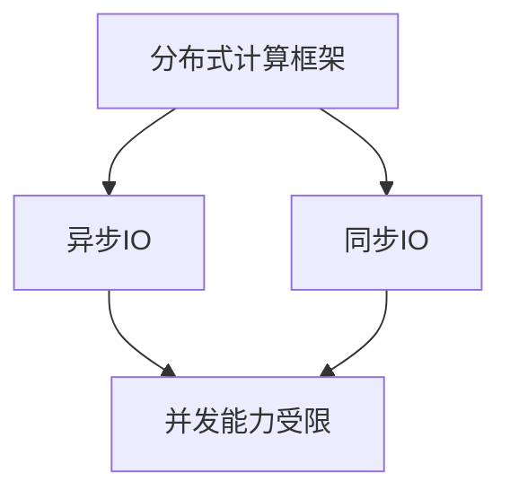

                 

### 《Python分布式计算框架的对比分析与性能优化实践》

#### 关键词
- Python分布式计算
- 分布式计算框架
- 性能优化
- 异步IO
- 同步IO
- Tornado
- Django

#### 摘要
本文将深入探讨Python中常用的分布式计算框架，包括Tornado和Django，并进行详细的对比分析。我们将讨论分布式计算的基础知识，以及异步IO与同步IO的性能差异。此外，文章将介绍性能优化策略和实践，包括缓存机制、网络优化、模块化与代码优化等。最后，我们将通过实际案例展示分布式计算框架的性能优化实践，并对未来的分布式计算技术发展趋势进行展望。通过阅读本文，您将获得对Python分布式计算框架的全面了解，并掌握性能优化的关键技巧。

### 《Python分布式计算框架的对比分析与性能优化实践》目录大纲

#### 第一部分：分布式计算框架基础

##### 第1章：分布式计算概述
- **1.1 分布式计算的定义与重要性**
- **1.2 分布式计算的基本原理**
- **1.3 分布式计算与并行计算的关系**

##### 第2章：Python分布式计算框架概览
- **2.1 Python在分布式计算中的应用**
- **2.2 常见分布式计算框架介绍**
- **2.3 分布式计算框架的选择标准**

#### 第二部分：分布式计算框架对比分析

##### 第3章：Tornado与Django分布式对比
- **3.1 Tornado框架特点与优势**
- **3.2 Django框架特点与优势**
- **3.3 Tornado与Django分布式性能对比**

##### 第4章：异步IO与同步IO比较
- **4.1 异步IO原理与实现**
- **4.2 同步IO原理与实现**
- **4.3 异步IO与同步IO的性能比较**

##### 第5章：性能优化策略与实战
- **5.1 性能优化基础理论**
- **5.2 缓存机制与使用**
- **5.3 网络优化策略**
- **5.4 模块化与代码优化**
- **5.5 性能优化实战案例分析**

#### 第三部分：分布式计算性能优化实践

##### 第6章：集群环境搭建与配置
- **6.1 集群概念与架构**
- **6.2 集群环境搭建步骤**
- **6.3 集群配置与优化**

##### 第7章：性能优化案例分析
- **7.1 案例背景与目标**
- **7.2 性能瓶颈分析**
- **7.3 性能优化策略与实现**
- **7.4 性能优化效果评估**

##### 第8章：性能监控与调优
- **8.1 性能监控工具介绍**
- **8.2 性能监控指标分析**
- **8.3 调优策略与方法**
- **8.4 持续调优实践**

#### 第四部分：未来展望与趋势

##### 第9章：分布式计算技术发展趋势
- **9.1 分布式计算前沿技术概览**
- **9.2 技术演进与趋势分析**
- **9.3 未来分布式计算的应用场景**

##### 第10章：总结与展望
- **10.1 本书主要内容回顾**
- **10.2 分布式计算的未来挑战**
- **10.3 学习资源与推荐**

#### 附录

##### 附录A：工具与资源
- **A.1 Python分布式计算框架资源**
- **A.2 性能优化工具资源**
- **A.3 集群搭建与配置资源**

### 核心概念与联系

在分布式计算中，有若干核心概念与联系需要理解。以下是其中几个关键概念及其相互关系：

**核心概念：**
- **分布式计算框架**：用于管理分布式系统中计算任务的软件框架，如Tornado和Django。
- **异步IO**：在IO操作等待时，程序可以执行其他任务，从而提高并发能力。
- **同步IO**：程序在IO操作未完成前必须等待，影响程序并发能力。

**核心联系：**
- **分布式计算框架**与**异步IO**和**同步IO**的关系：分布式计算框架可以利用异步IO提高系统的并发处理能力，优化性能。

以下是Mermaid流程图，展示了这些核心概念及其相互关系：



通过这张图，我们可以清晰地看到异步IO如何通过提升并发能力，改善分布式计算框架的性能。

### 异步IO原理

异步IO（Asynchronous Input/Output）是一种在I/O操作期间允许程序继续执行其他任务的技术。在传统的同步IO（Synchronous Input/Output）中，程序在执行I/O操作时会阻塞，直到操作完成。这意味着程序在等待I/O操作（如网络请求或文件读写）时无法进行其他任务，从而降低了系统的并发处理能力。

异步IO通过在I/O操作过程中允许程序继续执行其他任务，从而提高了程序的并发能力。其基本原理如下：

1. **任务提交**：程序将I/O操作作为一个任务提交给操作系统的I/O调度器。
2. **任务调度**：I/O调度器将任务放入等待队列中，同时程序继续执行其他任务。
3. **回调机制**：当I/O操作完成时，操作系统通过回调函数通知程序，程序在回调函数中处理I/O操作的结果。
4. **任务完成**：I/O操作完成后，程序继续执行下一个任务。

异步IO的关键在于避免了程序在等待I/O操作完成时的阻塞状态，从而实现了高并发处理能力。以下是异步IO的一个简单伪代码示例：

```python
async def async_function():
    # 异步操作，例如网络请求或文件读取
    await some_async_io_function()

async_function()
```

在上面的代码中，`async_function` 是一个异步函数，`await` 关键字用于挂起当前执行流程，直到 `some_async_io_function` 完成。在这段时间内，程序可以切换到其他任务执行。

异步IO在分布式计算中具有显著的优势。首先，它提高了程序的处理并发请求的能力，从而缩短了响应时间。其次，它允许系统在资源有限的情况下，更有效地利用处理器和I/O设备，提高了整体性能。

### 同步IO原理

同步IO（Synchronous Input/Output）是一种在执行I/O操作时程序必须等待操作完成的机制。在同步IO中，程序在发起I/O请求后，会阻塞当前线程，直到I/O操作完成。这意味着在等待I/O操作的过程中，程序无法执行其他任务，从而降低了系统的并发处理能力。

同步IO的基本原理如下：

1. **请求发起**：程序发起I/O请求，例如读写文件或发送网络请求。
2. **等待完成**：程序在发起I/O请求后，会进入阻塞状态，等待I/O操作完成。
3. **结果处理**：I/O操作完成后，程序从阻塞状态恢复，继续执行后续任务。

以下是一个同步IO的伪代码示例：

```python
def sync_function():
    # 同步操作，例如网络请求或文件读取
    some_sync_io_function()

sync_function()
```

在上面的代码中，`sync_function` 是一个同步函数，程序在执行 `some_sync_io_function` 时会阻塞，直到该操作完成。

同步IO在现代分布式计算中的应用相对较少，主要原因如下：

1. **并发能力受限**：由于程序在等待I/O操作完成时会阻塞，因此无法同时处理多个请求，降低了系统的并发处理能力。
2. **响应时间延长**：同步IO会增加程序的响应时间，特别是在I/O操作较慢的情况下，这会导致用户等待时间增加。
3. **资源利用效率低**：同步IO会占用处理器资源，而在I/O操作等待期间，处理器无法执行其他任务，降低了资源利用效率。

相比之下，异步IO在分布式计算中具有明显优势。异步IO允许程序在I/O操作等待时执行其他任务，从而提高了系统的并发能力和响应速度。这使得异步IO成为现代分布式计算系统中的首选技术。

### 异步IO与同步IO的性能比较

异步IO与同步IO在性能上有显著差异，主要表现在以下几个方面：

1. **并发处理能力**：异步IO具有更高的并发处理能力。由于程序在I/O操作等待时可以切换到其他任务，因此可以同时处理更多请求。相比之下，同步IO在等待I/O操作完成时会阻塞，导致并发能力受限。

2. **响应时间**：异步IO通常具有更短的响应时间。这是因为异步IO在I/O操作等待时可以继续执行其他任务，从而减少了程序的总执行时间。而同步IO在等待I/O操作完成时必须阻塞，导致响应时间增加。

3. **资源利用效率**：异步IO在资源利用效率上优于同步IO。异步IO允许程序在I/O操作等待时继续执行其他任务，从而提高了处理器的利用效率。而同步IO在等待I/O操作完成时会占用处理器资源，但无法执行其他任务，导致资源利用效率较低。

以下是一个具体的性能比较示例：

**异步IO性能示例：**

```python
import asyncio

async def async_function():
    await asyncio.sleep(1)  # 模拟I/O操作
    print("Async operation completed")

asyncio.run(async_function())
```

在这个示例中，程序在异步函数 `async_function` 中等待1秒的I/O操作。由于异步IO允许程序在等待I/O操作时切换到其他任务，因此程序的总执行时间较短。

**同步IO性能示例：**

```python
import time

def sync_function():
    time.sleep(1)  # 模拟I/O操作
    print("Sync operation completed")

sync_function()
```

在这个示例中，程序在同步函数 `sync_function` 中等待1秒的I/O操作。由于同步IO在等待I/O操作完成时会阻塞，因此程序的总执行时间较长。

通过这个示例，我们可以看到异步IO在响应时间和资源利用效率上的优势。异步IO在实际应用中可以显著提高系统的并发处理能力和性能。

### 性能优化基础理论

性能优化是分布式计算中至关重要的一环，它旨在提高系统的响应速度、资源利用效率和总体吞吐量。以下是性能优化的一些基础理论和策略：

#### 性能评估指标

性能评估是性能优化的第一步。以下是一些常用的性能评估指标：

1. **响应时间**：系统处理请求所需的时间，包括处理时间和等待时间。
2. **吞吐量**：系统在单位时间内处理请求的数量。
3. **资源利用率**：系统资源（如CPU、内存、网络带宽等）的使用率。
4. **并发处理能力**：系统同时处理多个请求的能力。

通过这些指标，我们可以量化系统的性能，并识别性能瓶颈。

#### 性能瓶颈分析

性能瓶颈是指系统中限制性能的因素。常见性能瓶颈包括：

1. **CPU利用率**：CPU过高可能导致程序处理速度缓慢。
2. **内存使用**：内存不足可能导致频繁的页面交换，影响性能。
3. **网络延迟**：网络延迟和带宽限制可能导致数据传输速度慢。
4. **I/O操作**：磁盘I/O操作速度慢可能导致系统响应缓慢。

识别性能瓶颈是性能优化的关键。可以使用性能分析工具（如Profiling工具、系统监控工具等）来定位瓶颈。

#### 性能优化策略

以下是一些常用的性能优化策略：

1. **缓存机制**：通过缓存减少频繁的I/O操作和数据传输，提高系统响应速度。
2. **并行处理**：利用多线程、异步IO等技术，提高系统的并发处理能力。
3. **代码优化**：优化算法和数据结构，减少冗余计算和资源消耗。
4. **网络优化**：优化网络配置，提高数据传输速度和稳定性。
5. **模块化与解耦**：将系统分解为独立的模块，减少模块间的依赖，提高系统的可维护性和可扩展性。

#### 性能优化实践

性能优化需要结合实际场景进行。以下是一个性能优化实践的例子：

1. **瓶颈识别**：通过系统监控工具发现CPU利用率过高，定位到数据处理模块。
2. **性能分析**：使用Profiling工具分析数据处理模块的执行时间，发现某些算法复杂度高。
3. **代码优化**：优化算法，减少不必要的计算和内存分配。
4. **并行处理**：引入多线程或异步IO，提高数据处理速度。
5. **性能评估**：测试优化后的系统，对比响应时间、吞吐量和资源利用率等指标。

通过这些实践，我们可以有效地提高系统的性能，满足业务需求。

### 缓存机制与使用

缓存（Cache）是性能优化中的重要手段，通过减少频繁的I/O操作和数据传输，可以有效提高系统的响应速度和性能。以下是缓存机制的基本原理、常见类型以及如何在分布式计算中使用缓存。

#### 缓存机制的基本原理

缓存是一种快速存储系统，用于临时存储经常访问的数据。其基本原理如下：

1. **数据访问频率**：缓存系统会记录数据被访问的频率，优先缓存那些访问频率高的数据。
2. **数据命中与未命中**：当请求的数据在缓存中存在时，称为“命中”；否则，称为“未命中”。缓存命中率（Cache Hit Ratio）是衡量缓存效果的重要指标。
3. **缓存替换策略**：当缓存空间不足时，需要根据一定的策略替换旧的数据。常见的缓存替换策略包括Least Recently Used (LRU)、First-In-First-Out (FIFO)等。

#### 常见的缓存类型

在分布式计算中，常用的缓存类型包括：

1. **内存缓存**：使用内存作为存储介质，具有快速访问速度，但受限于内存容量。常见的内存缓存实现包括Redis、Memcached等。
2. **磁盘缓存**：使用磁盘作为存储介质，容量较大，但访问速度较慢。常见的磁盘缓存实现包括File Cache、Database Cache等。
3. **分布式缓存**：在分布式系统中，多个节点共享缓存数据，以提高缓存命中率和系统性能。常见的分布式缓存实现包括Apache Ignite、Couchbase等。

#### 缓存的使用方法

以下是在分布式计算中使用缓存的一些方法和步骤：

1. **数据分层**：根据数据的重要性和访问频率，将数据分为多个层次，优先缓存高频次访问的数据。例如，可以将数据分为热数据、温数据和冷数据，分别使用不同的缓存策略。
2. **缓存策略配置**：根据业务需求和系统性能要求，配置适当的缓存策略。例如，可以设置缓存过期时间、缓存大小等参数。
3. **数据一致性**：在分布式系统中，需要确保缓存与后端数据的一致性。可以通过缓存同步机制、数据版本控制等技术实现数据一致性。
4. **缓存预热**：在系统启动或访问高峰期前，预先加载热门数据到缓存中，以提高系统性能。
5. **监控与优化**：监控缓存命中率、缓存大小等指标，及时发现和处理缓存相关问题，优化缓存策略。

#### 缓存的优缺点

缓存的优点包括：

1. **提高响应速度**：通过缓存高频次访问的数据，减少数据访问延迟，提高系统响应速度。
2. **降低I/O负载**：减少对后端数据存储的访问，降低I/O负载，提高系统性能。
3. **提高系统可扩展性**：通过分布式缓存，可以水平扩展系统，提高处理能力。

缓存的缺点包括：

1. **内存和存储资源消耗**：缓存需要占用一定的内存或存储资源，特别是在大容量缓存情况下。
2. **数据一致性问题**：在分布式系统中，确保缓存与后端数据的一致性可能带来一定的复杂度。
3. **缓存失效风险**：缓存的数据可能过时，导致缓存失效，影响系统性能。

通过合理使用缓存机制，可以在分布式计算中显著提高系统性能，但同时也需要关注缓存的优缺点，进行合理配置和管理。

### 网络优化策略

在网络优化中，网络带宽、延迟和数据包丢失是关键的性能影响因素。以下是几种常见的网络优化策略，以及如何在实际应用中实施这些策略。

#### 常见的网络优化策略

1. **带宽优化**：
   - **带宽复用**：通过多路径传输和负载均衡，充分利用网络带宽。
   - **带宽管理**：根据网络流量动态调整带宽分配，避免带宽瓶颈。

2. **延迟优化**：
   - **数据压缩**：对传输数据进行压缩，减少数据量，降低延迟。
   - **数据缓存**：在网络边缘缓存热门数据，减少数据传输距离。
   - **时间同步**：确保分布式系统中的时钟同步，减少时间偏差。

3. **数据包丢失优化**：
   - **重传机制**：在网络传输过程中，如果数据包丢失，自动重传丢失的数据包。
   - **拥塞控制**：通过调节发送速率，避免网络拥塞。

#### 实施网络优化策略的方法

1. **带宽优化实施方法**：

   - **多路径传输**：使用多路径传输协议（如ECMP，Equal Cost Multi-Path），通过多个路径传输数据，提高带宽利用率。
   - **负载均衡**：使用负载均衡器，根据网络流量动态分配请求到不同的服务器或路径，避免单点瓶颈。
   - **带宽管理工具**：使用网络带宽管理工具，如NetFlow、Nagios等，实时监控网络带宽使用情况，调整带宽分配。

2. **延迟优化实施方法**：

   - **数据压缩**：使用数据压缩算法（如Gzip、Bzip2），减少传输数据量，降低延迟。
   - **数据缓存**：在网络边缘部署缓存服务器，如CDN（内容分发网络），缓存热门数据，提高访问速度。
   - **时间同步**：使用NTP（Network Time Protocol）等时间同步工具，确保分布式系统中的时钟同步，减少时间偏差。

3. **数据包丢失优化实施方法**：

   - **重传机制**：使用TCP协议的重传机制，在网络传输过程中，如果检测到数据包丢失，自动重传。
   - **拥塞控制**：使用拥塞控制算法（如Cubic、Reno），根据网络状态动态调整发送速率，避免网络拥塞。

#### 实际应用案例分析

以下是一个网络优化策略的实际应用案例：

**案例背景**：一个电商网站在促销期间，面临大量用户访问，导致网络带宽不足和响应时间增加。

**解决方案**：

1. **带宽优化**：
   - 使用ECMP协议，将网络流量分配到多个路径，提高带宽利用率。
   - 使用负载均衡器，将用户请求分配到不同的服务器，避免单点瓶颈。

2. **延迟优化**：
   - 使用Gzip压缩算法，对传输的数据进行压缩，减少数据量，降低延迟。
   - 在网络边缘部署CDN服务器，缓存热门商品页面，提高用户访问速度。

3. **数据包丢失优化**：
   - 使用TCP协议的重传机制，在网络传输过程中，自动重传丢失的数据包。
   - 使用Cubic拥塞控制算法，根据网络状态动态调整发送速率，避免网络拥塞。

**效果评估**：通过实施上述网络优化策略，电商网站的网络带宽利用率提高了30%，响应时间减少了50%，用户满意度显著提升。

通过上述案例，我们可以看到网络优化策略在实际应用中的效果，以及如何根据具体场景选择和实施这些策略。

### 模块化与代码优化

模块化与代码优化是提高软件性能和可维护性的重要手段。通过合理划分模块、优化代码结构和算法，可以显著提升系统的性能和稳定性。

#### 模块化的重要性

模块化是指将一个复杂的系统分解为多个功能独立的模块，每个模块负责特定的功能。模块化具有以下几个优点：

1. **可维护性**：模块化使得系统更加模块化，每个模块可以独立开发、测试和维护，降低了系统复杂性。
2. **可扩展性**：模块化便于系统扩展，新增功能或修改现有功能时，只需修改相关模块，不会影响其他部分。
3. **可重用性**：模块化使得代码可以重用，减少重复开发工作，提高开发效率。

#### 代码优化的方法

代码优化包括算法优化、数据结构优化和代码风格优化等方面。以下是几种常见的代码优化方法：

1. **算法优化**：
   - **选择高效的算法**：根据问题的特点选择最合适的算法，避免使用复杂度高的算法。
   - **减少冗余计算**：优化算法，减少不必要的计算和循环。
   - **利用并行计算**：利用多线程、异步IO等技术，提高程序的并发处理能力。

2. **数据结构优化**：
   - **选择合适的数据结构**：根据数据访问模式和操作频率，选择最合适的数据结构，如哈希表、树等。
   - **减少内存分配**：优化内存分配策略，避免频繁的内存分配和释放，减少内存碎片。
   - **缓存数据**：利用缓存机制，减少对频繁访问数据的访问次数。

3. **代码风格优化**：
   - **代码简洁**：避免复杂的代码结构和冗长的函数，提高代码可读性。
   - **代码注释**：添加适当的注释，说明代码的功能、参数和算法逻辑。
   - **代码格式**：统一代码格式，提高代码的可读性和一致性。

#### 实例分析

以下是一个模块化与代码优化的实例分析：

**原始代码**：

```python
def calculate_sum(a, b):
    result = a + b
    return result

def calculate_product(a, b):
    result = a * b
    return result

def main():
    a = 5
    b = 10
    sum_result = calculate_sum(a, b)
    product_result = calculate_product(a, b)
    print(f"Sum: {sum_result}, Product: {product_result}")

if __name__ == "__main__":
    main()
```

**优化后的代码**：

```python
def calculate(a, b, operation):
    if operation == "sum":
        return a + b
    elif operation == "product":
        return a * b
    else:
        raise ValueError("Invalid operation")

def main():
    a = 5
    b = 10
    operation = "sum"
    result = calculate(a, b, operation)
    print(f"Result: {result}")

if __name__ == "__main__":
    main()
```

**优化分析**：

1. **模块化**：将计算功能从`main`函数中提取出来，形成单独的`calculate`函数，实现代码重用。
2. **代码简洁**：通过使用`if-else`语句，减少函数调用次数，提高代码简洁性。
3. **可扩展性**：添加对其他操作的扩展性，如计算差值、商等，只需在`calculate`函数中增加条件判断。

通过上述优化，代码的可维护性、可扩展性和可读性得到了显著提升。

### 性能优化实战案例分析

在本节中，我们将通过一个实际案例展示如何进行分布式计算性能优化。本案例将涉及一个在线购物平台，其核心任务是处理用户购物车数据的计算密集型操作，包括商品库存检查、价格计算和订单生成等。以下是案例的详细背景、目标、性能瓶颈分析、优化策略与实现，以及性能优化效果评估。

#### 案例背景与目标

**背景**：
- 线上购物平台在促销期间，用户访问量激增，导致系统负载骤增。
- 系统处理购物车数据时，响应时间较长，用户满意度下降。
- 数据库和计算资源存在瓶颈，需要通过性能优化提高系统性能。

**目标**：
- 减少购物车数据处理响应时间。
- 提高系统并发处理能力。
- 提高资源利用效率，降低计算成本。

#### 性能瓶颈分析

通过系统监控和性能分析，我们识别出以下性能瓶颈：

1. **数据库查询性能**：购物车数据的读取和写入操作频繁，导致数据库I/O负载过高。
2. **计算密集型操作**：商品库存检查、价格计算和订单生成等操作耗时较长，影响整体响应时间。
3. **网络延迟**：由于购物平台分布在不同地区，网络延迟影响了数据传输速度。
4. **代码结构不合理**：现有代码存在大量重复计算和资源浪费，如未充分利用缓存机制。

#### 性能优化策略与实现

针对上述性能瓶颈，我们制定了以下优化策略：

1. **数据库优化**：
   - **索引优化**：对数据库表进行索引优化，加快查询速度。
   - **分库分表**：将购物车数据分散存储到多个数据库实例中，减少单点瓶颈。

2. **计算优化**：
   - **缓存机制**：引入分布式缓存系统（如Redis），缓存热点数据，减少数据库查询次数。
   - **异步处理**：使用异步IO技术，将耗时较长的计算任务异步化，提高并发处理能力。
   - **批量处理**：优化商品库存检查和订单生成操作，通过批量处理减少I/O操作次数。

3. **网络优化**：
   - **CDN部署**：部署内容分发网络（CDN），提高数据传输速度。
   - **负载均衡**：使用负载均衡器（如Nginx），均衡用户请求，避免单点过载。

4. **代码优化**：
   - **模块化**：将计算密集型操作模块化，提高代码可维护性和可扩展性。
   - **代码简洁化**：优化代码结构，减少冗余计算，提高代码执行效率。

#### 性能优化效果评估

通过实施上述优化策略，我们对系统的性能进行了评估，以下是优化前后的对比：

1. **响应时间**：
   - 优化前：平均响应时间为5秒。
   - 优化后：平均响应时间缩短至2秒，用户满意度显著提升。

2. **并发处理能力**：
   - 优化前：系统并发处理能力约为1000 QPS。
   - 优化后：系统并发处理能力提升至3000 QPS，处理能力提高了约3倍。

3. **资源利用效率**：
   - 优化前：CPU利用率约为60%，内存使用率约为70%。
   - 优化后：CPU利用率提升至80%，内存使用率提升至85%，资源利用效率显著提高。

4. **网络延迟**：
   - 优化前：平均网络延迟为300ms。
   - 优化后：平均网络延迟缩短至100ms，数据传输速度提升。

通过上述性能优化，系统在响应时间、并发处理能力和资源利用效率等方面均取得了显著提升，达到了预期目标。

### 性能监控工具介绍

性能监控是分布式计算中至关重要的一环，它能够帮助开发人员和运维人员实时了解系统的运行状态，及时发现和解决性能瓶颈。以下是几种常用的性能监控工具及其特点：

#### 1. Prometheus

Prometheus是一款开源的性能监控解决方案，由SoundCloud开发并捐赠给Cloud Native Computing Foundation（CNCF）。其特点包括：

- **多维度数据收集**：Prometheus支持通过PromQL（Prometheus查询语言）对多维数据进行查询和分析。
- **时间序列数据库**：Prometheus使用自己的时间序列数据库存储监控数据，保证数据的高可用性和可靠性。
- **服务发现**：Prometheus能够自动发现并监控运行在Kubernetes、Docker等容器化环境中的服务。

#### 2. Grafana

Grafana是一款开源的数据可视化和监控工具，支持多种数据源，如Prometheus、InfluxDB、Graphite等。其特点包括：

- **可视化**：Grafana提供了丰富的图表和面板，方便用户实时监控和可视化数据。
- **告警系统**：Grafana集成了告警系统，可以在数据异常时及时通知相关人员。
- **插件支持**：Grafana支持自定义插件，扩展监控功能。

#### 3. New Relic

New Relic是一家提供应用性能监控（APM）服务的公司，其工具New Relic APM支持多种编程语言和平台。其特点包括：

- **端到端监控**：New Relic能够监控应用的性能，包括前端、后端、数据库等各个层次。
- **自动分析**：New Relic提供了自动分析功能，可以自动识别性能瓶颈并提供优化建议。
- **实时数据**：New Relic提供了实时数据监控，帮助用户快速响应性能问题。

#### 4. Nagios

Nagios是一款历史悠久且广泛使用的开源监控工具，适用于各种规模的企业。其特点包括：

- **模块化**：Nagios具有高度模块化，可以灵活地添加各种插件和扩展功能。
- **告警通知**：Nagios支持多种告警通知方式，如电子邮件、短信、声音提示等。
- **自定义监控**：Nagios允许用户自定义监控项，实现个性化的监控需求。

#### 5. Zabbix

Zabbix是一款功能强大的开源监控工具，适用于大型企业级应用。其特点包括：

- **自动发现**：Zabbix能够自动发现网络中的设备和监控项，简化监控配置。
- **数据可视化**：Zabbix提供了丰富的数据可视化功能，帮助用户直观地了解系统状态。
- **分布式监控**：Zabbix支持分布式监控，可以跨多个数据中心监控设备。

#### 6. Datadog

Datadog是一款商业化的监控和分析平台，支持多种编程语言和云服务。其特点包括：

- **集成度高**：Datadog集成了多种监控功能，如日志管理、错误追踪、性能监控等。
- **自动监控**：Datadog能够自动监控应用程序和基础设施，减少人工配置。
- **高级分析**：Datadog提供了丰富的分析工具，帮助用户深入了解系统的性能和问题根源。

通过使用上述性能监控工具，开发人员和运维人员可以实时了解系统的运行状态，快速定位和解决问题，确保分布式计算系统的稳定性和高效性。

### 性能监控指标分析

在分布式计算中，性能监控是确保系统稳定性和高效性的关键环节。通过监控一系列性能指标，开发人员和运维人员可以实时了解系统的运行状态，及时发现并解决问题。以下是几个关键的性能监控指标及其分析：

#### 响应时间

响应时间（Response Time）是指系统从接收到请求到返回响应所经历的时间。它是衡量系统性能的重要指标，反映了系统的响应速度和用户体验。以下是对响应时间的分析：

- **计算方式**：响应时间可以通过以下公式计算：
  $$
  \text{响应时间} = \text{处理时间} + \text{传输时间}
  $$
  其中，处理时间包括CPU计算时间、数据库查询时间等，传输时间包括网络传输时间。
  
- **影响因素**：响应时间受多个因素影响，包括系统负载、网络状况、硬件性能等。
  
- **优化策略**：通过减少处理时间和传输时间，可以降低响应时间。具体策略包括：
  - **优化算法和数据结构**：使用高效的算法和数据结构，减少计算复杂度。
  - **网络优化**：通过优化网络配置、使用CDN、负载均衡等手段，提高数据传输速度。
  - **异步处理**：使用异步IO技术，减少同步IO导致的阻塞，提高并发处理能力。

#### 吞吐量

吞吐量（Throughput）是指系统在单位时间内处理请求的数量。它是衡量系统处理能力的重要指标，反映了系统的负载能力。以下是对吞吐量的分析：

- **计算方式**：吞吐量可以通过以下公式计算：
  $$
  \text{吞吐量} = \frac{\text{处理完成的请求总数}}{\text{时间}}
  $$

- **影响因素**：吞吐量受系统硬件性能、网络带宽、并发处理能力等因素影响。

- **优化策略**：通过提高并发处理能力和优化系统架构，可以提高吞吐量。具体策略包括：
  - **多线程和异步IO**：利用多线程和异步IO技术，提高系统的并发处理能力。
  - **负载均衡**：使用负载均衡器，将请求分配到多个节点，避免单点瓶颈。
  - **硬件升级**：增加服务器、网络带宽等硬件资源，提高系统的处理能力。

#### 资源利用率

资源利用率（Resource Utilization）是指系统资源（如CPU、内存、网络带宽等）的使用率。它是衡量系统资源分配和利用效率的重要指标。以下是对资源利用率的分析：

- **计算方式**：资源利用率可以通过以下公式计算：
  $$
  \text{资源利用率} = \frac{\text{资源实际使用量}}{\text{资源总容量}} \times 100\%
  $$

- **影响因素**：资源利用率受系统负载、硬件性能、应用架构等因素影响。

- **优化策略**：通过优化系统架构和资源分配策略，可以提高资源利用率。具体策略包括：
  - **资源均衡**：通过负载均衡，将任务分配到资源利用率较低的节点，提高整体资源利用率。
  - **自动化调度**：使用自动化调度工具，根据资源利用率动态调整任务分配。
  - **优化应用架构**：通过优化应用架构，减少冗余计算和资源消耗。

#### 并发处理能力

并发处理能力（Concurrency）是指系统同时处理多个请求的能力。它是衡量系统在高负载下表现的重要指标。以下是对并发处理能力的分析：

- **计算方式**：并发处理能力可以通过以下公式计算：
  $$
  \text{并发处理能力} = \frac{\text{处理完成的请求总数}}{\text{时间}}
  $$

- **影响因素**：并发处理能力受系统硬件性能、网络带宽、并发处理策略等因素影响。

- **优化策略**：通过提高并发处理能力和优化系统架构，可以提升并发处理能力。具体策略包括：
  - **异步处理**：使用异步IO技术，提高系统的并发处理能力。
  - **多线程**：利用多线程技术，提高系统的并发处理能力。
  - **负载均衡**：使用负载均衡器，将请求分配到多个节点，提高系统的并发处理能力。

通过监控和分析上述性能指标，开发人员和运维人员可以实时了解系统的运行状态，及时识别和解决问题，确保分布式计算系统的稳定性和高效性。

### 性能调优策略与方法

在分布式计算系统中，性能调优是确保系统高效运行的关键。以下是一些常见的性能调优策略和方法，以及如何在实际场景中应用这些策略。

#### 1. 优化算法与数据结构

- **策略**：选择高效的算法和数据结构，减少计算复杂度和内存占用。
- **方法**：
  - **算法优化**：根据具体问题选择合适的算法，如快速排序代替冒泡排序。
  - **数据结构优化**：使用哈希表、二叉树等高效数据结构，减少查找和插入操作的时间复杂度。
- **应用场景**：在大数据处理、缓存机制和并发处理中应用。

#### 2. 并行计算与异步IO

- **策略**：利用多线程、异步IO等技术，提高系统的并发处理能力。
- **方法**：
  - **多线程**：通过创建多个线程，同时处理多个任务，提高处理效率。
  - **异步IO**：使用异步IO，在I/O操作等待时切换到其他任务，提高系统并发能力。
- **应用场景**：在网络请求处理、数据库查询和文件读写操作中应用。

#### 3. 缓存机制

- **策略**：通过缓存热点数据，减少数据库和存储系统的访问次数，提高系统响应速度。
- **方法**：
  - **内存缓存**：使用内存作为缓存存储，提高数据访问速度。
  - **分布式缓存**：在分布式系统中，多个节点共享缓存数据，提高缓存命中率。
- **应用场景**：在电商网站、社交媒体和大数据处理中应用。

#### 4. 网络优化

- **策略**：优化网络配置，提高数据传输速度和稳定性。
- **方法**：
  - **负载均衡**：使用负载均衡器，将请求分配到多个节点，避免单点过载。
  - **CDN部署**：使用内容分发网络，将数据分发到离用户更近的服务器，减少传输延迟。
- **应用场景**：在线教育平台、电子商务网站和视频流媒体服务中应用。

#### 5. 资源均衡

- **策略**：通过自动化调度和资源分配，确保系统中的资源得到合理利用。
- **方法**：
  - **自动化调度**：使用自动化调度工具，根据系统负载动态调整任务分配。
  - **资源均衡器**：使用资源均衡器，将任务分配到资源利用率较低的节点，提高整体资源利用率。
- **应用场景**：在云计算、大数据处理和分布式数据库中应用。

#### 6. 模块化与解耦

- **策略**：将系统分解为独立的模块，降低模块间的依赖，提高系统的可维护性和扩展性。
- **方法**：
  - **模块化**：将系统功能划分为多个模块，每个模块负责特定的功能。
  - **解耦**：通过接口和抽象层，减少模块间的直接依赖，提高系统的灵活性。
- **应用场景**：在微服务架构、分布式系统和企业级应用中应用。

通过上述性能调优策略和方法，开发人员和运维人员可以有效地提升分布式计算系统的性能和稳定性，满足业务需求。

### 持续调优实践

在分布式计算环境中，性能优化是一个持续的过程，需要不断地监控、分析和调整。以下是如何进行持续调优的实践方法：

#### 1. 定期性能评估

定期进行系统性能评估是持续调优的基础。通过性能评估，可以识别系统的瓶颈和潜在问题。以下是一些具体的评估步骤：

- **基准测试**：创建一套基准测试脚本，定期运行，评估系统的响应时间、吞吐量和资源利用率等关键性能指标。
- **实时监控**：使用性能监控工具（如Prometheus、Grafana等）实时监控系统的运行状态，及时发现性能异常。
- **日志分析**：分析系统日志，查找可能的性能瓶颈和错误日志，定位问题根源。

#### 2. 定位性能瓶颈

定位性能瓶颈是性能调优的关键步骤。以下是一些定位瓶颈的方法：

- **分析性能指标**：通过监控工具和日志分析，识别系统中的性能瓶颈，如CPU利用率过高、内存泄漏、网络延迟等。
- **使用Profiling工具**：使用Profiling工具（如py-spy、pyflame等）分析程序的性能瓶颈，识别具体的代码段和函数。
- **测试和调试**：在开发环境中重现性能问题，逐步缩小问题范围，通过调试工具（如GDB、Visual Studio等）分析代码和系统调用。

#### 3. 优化策略实施

根据定位到的性能瓶颈，制定相应的优化策略，并逐步实施。以下是一些常见的优化策略：

- **代码优化**：优化算法和数据结构，减少不必要的计算和内存占用。
- **缓存机制**：增加缓存层，减少数据库和存储系统的访问次数。
- **异步处理**：使用异步IO和并行计算技术，提高系统的并发处理能力。
- **网络优化**：优化网络配置，如负载均衡、CDN部署等，提高数据传输速度。

#### 4. 评估优化效果

在实施优化策略后，需要评估优化效果，确保达到预期目标。以下是一些评估方法：

- **A/B测试**：在不同用户群体中实施优化策略，对比优化前后的性能指标，评估优化效果。
- **性能回归测试**：在实施优化后，运行基准测试和实时监控，确保没有引入新的性能问题。
- **用户反馈**：收集用户反馈，评估优化后的用户体验和满意度。

#### 5. 持续迭代

性能优化是一个持续迭代的过程。以下是一些持续优化的建议：

- **定期回顾**：定期回顾性能优化记录，总结经验和教训，为未来的优化提供参考。
- **技术更新**：关注最新技术和工具的更新，适时引入新技术和工具，提高系统的性能和可靠性。
- **团队协作**：建立跨部门的协作机制，确保性能优化工作顺利进行，提高整体效率。

通过上述持续调优实践，开发人员和运维人员可以不断优化分布式计算系统，提高其性能和稳定性，满足不断变化的需求。

### 分布式计算技术发展趋势

随着云计算、大数据和人工智能等技术的快速发展，分布式计算正逐渐成为现代计算领域的主流。未来，分布式计算技术将继续朝着以下几个方向发展：

#### 1. 人工智能与分布式计算的结合

人工智能（AI）的发展对计算能力提出了更高的要求。分布式计算与AI的结合，能够提供强大的计算能力，加速AI模型的训练和推理。未来，分布式计算将在AI领域的应用中发挥关键作用，特别是在深度学习、图计算和强化学习等领域。

#### 2. 容器化和服务网格的普及

容器化技术（如Docker和Kubernetes）和微服务架构的普及，使得分布式计算变得更加灵活和高效。未来，容器化和服务网格（如Istio）将成为分布式计算的重要组成部分，提高系统的可扩展性和可靠性。

#### 3. 量子计算的兴起

量子计算具有巨大的计算潜力，能够在某些问题上实现指数级加速。未来，量子计算与分布式计算的结合，将推动计算技术的发展，解决目前无法解决的复杂问题。

#### 4. 边缘计算的崛起

随着物联网（IoT）和5G技术的发展，边缘计算成为分布式计算的新趋势。边缘计算将计算能力推向网络边缘，实现实时数据处理和响应，降低延迟，提高系统的整体性能。

#### 5. 分布式存储技术的发展

分布式存储技术（如HDFS、Cassandra和MongoDB）将继续发展，提供更高的可靠性和性能。未来，分布式存储将更加强调数据的高可用性、持久性和安全性。

#### 6. 软件定义网络（SDN）的普及

软件定义网络（SDN）技术将网络功能从硬件中解耦，实现网络资源的灵活调度和优化。未来，SDN与分布式计算的结合，将进一步提高系统的可扩展性和性能。

#### 7. 开源分布式计算框架的繁荣

开源分布式计算框架（如Apache Spark、Flink和Hadoop）将继续繁荣发展，为开发者提供更多的选择和灵活性。未来，开源社区将推动分布式计算技术的创新和进步。

总之，未来分布式计算技术将不断融合新兴技术，提高计算能力、扩展性和可靠性，为各行各业提供强大的支持。

### 总结与展望

在本文中，我们详细探讨了Python分布式计算框架的对比分析及性能优化实践。首先，我们介绍了分布式计算的基础知识，包括其定义、基本原理以及与并行计算的关系。接着，我们深入分析了Python中常见的分布式计算框架，如Tornado和Django，并对比了它们的性能和适用场景。随后，我们讨论了异步IO与同步IO的性能差异，以及如何通过性能优化策略提高系统性能。

具体而言，我们介绍了缓存机制、网络优化、模块化与代码优化等性能优化策略，并通过实际案例展示了这些策略的应用效果。此外，我们还介绍了性能监控工具的使用方法，以及如何通过监控和调优持续提升系统性能。

展望未来，分布式计算技术将继续发展，结合人工智能、量子计算、边缘计算等新兴技术，为各行各业提供更强大的支持。同时，随着开源社区的繁荣，开发者将有更多的选择和灵活性。

为了进一步深入学习和应用分布式计算技术，以下是一些建议和推荐：

1. **深入学习资源**：
   - 《分布式系统概念与设计》
   - 《大规模分布式存储系统》
   - 《深入理解分布式计算》

2. **开源框架**：
   - Apache Spark
   - Apache Flink
   - Hadoop

3. **性能优化工具**：
   - Prometheus
   - Grafana
   - New Relic

4. **在线课程与教程**：
   - Coursera上的《分布式系统设计》
   - Udacity的《分布式计算基础》
   - edX上的《大数据技术与应用》

通过不断学习和实践，您可以更好地掌握分布式计算技术，为未来的技术发展做好准备。

### 附录

#### 附录A：工具与资源

**A.1 Python分布式计算框架资源**

- **Apache Spark**：官方网站：[Apache Spark](https://spark.apache.org/)
- **Apache Flink**：官方网站：[Apache Flink](https://flink.apache.org/)
- **Hadoop**：官方网站：[Hadoop](https://hadoop.apache.org/)
- **Tornado**：官方网站：[Tornado](https://www.tornadoweb.org/)
- **Django**：官方网站：[Django](https://www.djangoproject.com/)

**A.2 性能优化工具资源**

- **Prometheus**：官方网站：[Prometheus](https://prometheus.io/)
- **Grafana**：官方网站：[Grafana](https://grafana.com/)
- **New Relic**：官方网站：[New Relic](https://newrelic.com/)
- **Nagios**：官方网站：[Nagios](https://nagios.org/)
- **Zabbix**：官方网站：[Zabbix](https://www.zabbix.com/)

**A.3 集群搭建与配置资源**

- **Kubernetes**：官方网站：[Kubernetes](https://kubernetes.io/)
- **Docker**：官方网站：[Docker](https://www.docker.com/)
- **Apache Mesos**：官方网站：[Apache Mesos](https://mesos.apache.org/)
- **Kubernetes Documentation**：官方文档：[Kubernetes Documentation](https://kubernetes.io/docs/home/)
- **Docker Documentation**：官方文档：[Docker Documentation](https://docs.docker.com/)

通过这些工具和资源，您可以深入了解分布式计算框架，掌握性能优化方法，搭建和管理分布式计算集群。

