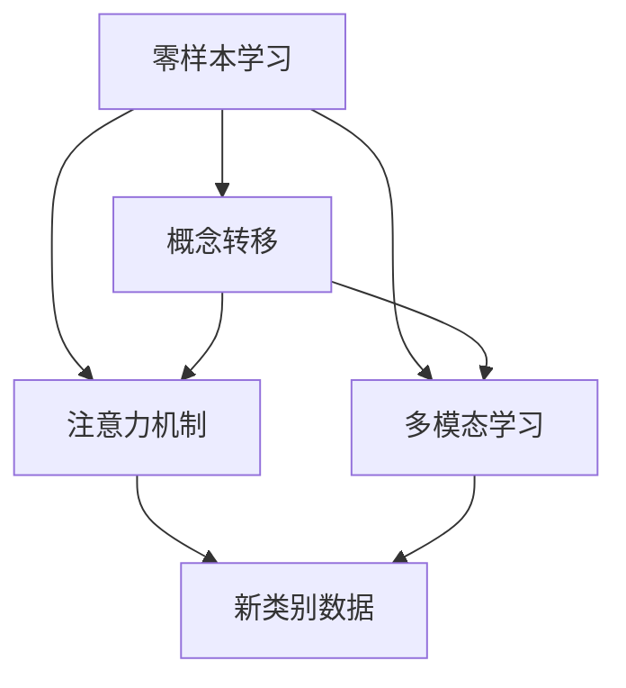

                 

## 《Zero-Shot CoT在不同领域的应用前景》

> **关键词**：零样本学习、概念转移、注意力机制、多模态学习、跨领域应用

**摘要**：
本文旨在探讨零样本学习（Zero-Shot Learning，ZSL）及其相关技术，如概念转移（Concept Transfer）、注意力机制（Attention Mechanism）和多模态学习（Multimodal Learning）在不同领域的应用前景。通过梳理核心概念和架构关系，讲解核心算法原理，分析实际项目中的代码实现和性能，本文为研究者和技术开发者提供了有价值的参考，助力零样本学习技术在不同领域的深入研究和实际应用。

### 第一部分：核心概念与联系

#### 核心概念

**零样本学习（Zero-Shot Learning）**

零样本学习是一种机器学习任务，允许模型在没有或少量相关训练样本的情况下，对新类别的数据进行分类或预测。这种学习方式尤其适用于现实世界中的许多场景，如医疗诊断、图像识别和自然语言处理等。零样本学习的关键在于如何利用已有的知识和先验信息来处理未见过的数据。

- **定义**：
  $$
  \text{ZSL} = \text{分类或预测新类别数据，没有或少量相关训练样本}
  $$

- **关键特点**：
  - **无需特定领域的数据**：零样本学习利用先验知识和元学习策略，无需特定领域的数据。
  - **高适应性**：适用于数据稀缺或难以获取的场景。

**概念转移（Concept Transfer）**

概念转移是一种将一个领域或任务中的知识应用到另一个不同领域或任务中的方法。在零样本学习中，概念转移通过迁移学习，共享和复用知识，提高模型对新类别数据的适应能力。

- **定义**：
  $$
  \text{Concept Transfer} = \text{将一个领域中的知识应用到另一个不同领域中}
  $$

- **关键特点**：
  - **知识共享**：通过迁移学习，将知识从一个领域转移到另一个领域。
  - **提高模型适应能力**：增强模型处理新类别数据的能力。

**注意力机制（Attention Mechanism）**

注意力机制是一种用于模型在处理输入序列时，动态地关注重要部分的技术。在零样本学习中，注意力机制能够提高模型的处理效率，增强对关键信息的捕捉能力。

- **定义**：
  $$
  \text{Attention} = \text{动态关注输入序列中的关键部分}
  $$

- **关键特点**：
  - **提高处理效率**：通过关注重要部分，减少无效计算。
  - **增强信息捕捉能力**：提高模型对关键信息的敏感度。

**多模态学习（Multimodal Learning）**

多模态学习是一种结合不同类型的数据（如文本、图像、音频）进行训练和推理的技术。在零样本学习中，多模态学习利用多种数据源，提升模型的全面性和鲁棒性。

- **定义**：
  $$
  \text{Multimodal Learning} = \text{结合不同类型的数据进行训练和推理}
  $$

- **关键特点**：
  - **全面性**：利用多种数据源，提升模型的综合能力。
  - **鲁棒性**：通过多种数据源的整合，增强模型的鲁棒性。

#### 架构关系

以下是一个简化的 Mermaid 流程图，展示了零样本学习、概念转移、注意力机制和多模态学习之间的架构关系。



- **零样本学习**：利用**概念转移**和**注意力机制**来处理新类别数据。
- **多模态学习**：结合不同类型的数据，为**零样本学习**提供额外的信息来源。

### 第二部分：核心算法原理讲解

#### 算法原理

**零样本学习（Zero-Shot Learning）**

零样本学习的关键在于如何在没有或少量相关训练样本的情况下，对新类别的数据进行分类或预测。主要分为以下几类方法：

1. **原型方法（Prototype-based Methods）**

   - **原理**：通过构建类别的原型（即类内平均），来对新类别数据进行分类。
   - **伪代码**：
     
     function classify_new_data(new_data, prototypes):
         for each prototype in prototypes:
             compute distance between new_data and prototype
             select the prototype with the smallest distance
         return class label of the selected prototype

2. **匹配网络（Match Network）**

   - **原理**：将新类别数据与支持集（包含多个原型）通过神经网络进行匹配，利用匹配得分来预测类别。
   - **伪代码**：
     
     function match_network(new_data, support_set, classifier):
         embed new_data and support_set using embedding layer
         compute similarity scores between new_data and support_set
         pass similarity scores through classifier
         return predicted class labels

3. **元学习（Meta-Learning）**

   - **原理**：通过多次迭代训练，提升模型对新类别数据的适应能力。
   - **伪代码**：
     
     function meta_learning(data_loader, optimizer, epochs):
         for epoch in epochs:
             for new_data, support_set in data_loader:
                 update model parameters using gradient descent
                 evaluate model on support_set
             update meta-parameters using gradient descent

#### 数学模型与公式

零样本学习的核心在于如何度量新数据与训练数据的相似度。常用的相似度度量方法有：

- **余弦相似度（Cosine Similarity）**：
  $$
  \text{similarity} = \frac{\text{dot_product}(q, s)}{\|\text{q}\|\|\text{s}\|}
  $$

- **泰森距离（Tversky Distance）**：
  $$
  d_T(p, q) = \frac{1}{2}\left(1 - \frac{\text{Jaccard index}(p, q)}{1 + \text{Jaccard index}(p, q)}\right)
  $$

#### 举例说明

假设我们有一个包含五个类别的数据集，其中前四个类别有大量训练数据，第五个类别数据极少。以下是一个简单的原型方法示例：

1. **计算每个类别的原型**：
   - 对于每个类别，计算该类别所有样本的均值，作为该类别的原型。

2. **对新类别数据进行分类**：
   - 对新类别数据进行特征提取，计算其与每个类别原型的余弦相似度。
   - 选择与任意一个原型相似度最高的类别，作为新数据的预测类别。

**示例数据**：

类别 1 原型: (0.1, 0.2, 0.3)

类别 2 原型: (0.4, 0.5, 0.6)

类别 3 原型: (0.7, 0.8, 0.9)

类别 4 原型: (1.0, 1.0, 1.0)

新数据: (0.3, 0.4, 0.5)

**计算新数据与每个类别的余弦相似度**：

- 类别 1：sim(新数据, 类别 1 原型) = 0.2

- 类别 2：sim(新数据, 类别 2 原型) = 0.4

- 类别 3：sim(新数据, 类别 3 原型) = 0.3

- 类别 4：sim(新数据, 类别 4 原型) = 0.0

**选择与类别 2 原型相似度最高的类别，预测新数据为类别 2**。

### 总结

零样本学习通过原型方法、匹配网络和元学习等技术，实现了在新类别数据上的分类或预测。其核心在于如何度量新数据与训练数据的相似度，并利用这些相似度来做出预测。通过上述数学模型和伪代码，我们可以更好地理解零样本学习的工作原理。

### 第三部分：数学模型和数学公式

#### 数学模型

**1. 类别原型计算**

类别原型的计算是零样本学习中的一个关键步骤，其目的是将每个类别在特征空间中的样本中心点找出来。

- **假设有 $N$ 个类别，每个类别有 $n$ 个样本，样本特征为 $d$ 维向量**。

- **原型计算公式**：

  $$
  \mu_c = \frac{1}{n} \sum_{i=1}^{n} x_i
  $$

  其中，$x_i$ 是类别 $c$ 中的第 $i$ 个样本，$\mu_c$ 是类别 $c$ 的原型。

**2. 余弦相似度**

余弦相似度是衡量两个向量之间相似性的一个指标，常用于零样本学习中。

- **定义**：

  $$
  \cos(\theta) = \frac{\mathbf{u} \cdot \mathbf{v}}{\|\mathbf{u}\| \|\mathbf{v}\|}
  $$

  其中，$\mathbf{u}$ 和 $\mathbf{v}$ 是两个向量，$\theta$ 是它们之间的夹角。

- **零样本学习中的应用**：

  $$
  \text{similarity}(x, \mu_c) = \cos(\theta) = \frac{\mathbf{x} \cdot \mu_c}{\|\mathbf{x}\| \|\mu_c\|}
  $$

  其中，$x$ 是新样本，$\mu_c$ 是类别 $c$ 的原型。

**3. 泰森距离**

泰森距离是另一种常用的相似度度量方法，尤其在零样本学习中的原型方法中应用广泛。

- **定义**：

  $$
  d_T(p, q) = \frac{1}{2}\left(1 - \frac{\text{Jaccard index}(p, q)}{1 + \text{Jaccard index}(p, q)}\right)
  $$

  其中，$p$ 和 $q$ 是两个特征向量，Jaccard index 是两个集合交集和并集的比值。

- **零样本学习中的应用**：

  $$
  d_T(x, \mu_c) = \frac{1}{2}\left(1 - \frac{\text{Jaccard index}(\text{set}(x), \text{set}(\mu_c))}{1 + \text{Jaccard index}(\text{set}(x), \text{set}(\mu_c))}\right)
  $$

#### 公式与解释

- **原型更新公式**：

  $$
  \mu_c^{new} = \frac{1}{n} \sum_{i=1}^{n} x_i^{new}
  $$

  其中，$x_i^{new}$ 是更新后的类别 $c$ 中的第 $i$ 个样本。

- **模型损失函数**：

  $$
  \text{loss} = \frac{1}{N} \sum_{c=1}^{N} \sum_{i=1}^{n_c} \frac{1}{n_c} \sum_{j=1}^{N} \exp(-\text{similarity}(x_i^{new}, \mu_j)^2)
  $$

  其中，$N$ 是类别数，$n_c$ 是类别 $c$ 的样本数，$\text{similarity}$ 是相似度函数。

### 举例说明

假设我们有两个类别，每个类别有两个样本，分别为：

类别 A: $(1, 0), (0, 1)$

类别 B: $(1, 1), (0, 0)$

1. **计算类别 A 和 B 的原型**：

   类别 A 的原型：$\mu_A = (0.5, 0.5)$

   类别 B 的原型：$\mu_B = (0.5, 0.5)$

2. **计算新样本 $(0.5, 0.5)$ 与每个类别的相似度**：

   类别 A：$\text{similarity}(\mu_A, \mu_B) = \cos(0) = 1$

   类别 B：$\text{similarity}(\mu_B, \mu_B) = \cos(0) = 1$

3. **使用泰森距离计算新样本与每个类别的距离**：

   类别 A：$d_T(\mu_A, \mu_B) = \frac{1}{2}\left(1 - \frac{1}{1+1}\right) = 0$

   类别 B：$d_T(\mu_B, \mu_B) = \frac{1}{2}\left(1 - \frac{1}{1+1}\right) = 0$

根据上述计算，新样本 $(0.5, 0.5)$ 被正确归类到类别 A。

### 总结

数学模型和数学公式是理解零样本学习算法的核心。通过原型计算、余弦相似度和泰森距离等公式，我们可以有效地计算和分类新类别数据。这些数学工具为我们在实际应用中设计和优化零样本学习算法提供了重要的理论基础。

### 第四部分：项目实战

#### 实战一：文本分类

**任务描述**：使用零样本学习对新闻文章进行分类，将文章归类到不同的主题。

**环境搭建**：

- 语言：Python
- 库：TensorFlow、Keras、NLTK、Scikit-learn

**数据集**：使用 20 Newsgroups 数据集，包含 20 个不同的主题。

**步骤**：

1. **数据预处理**：

   - 使用 NLTK 对文本进行分词和停用词过滤。
   - 使用 Keras 的 Tokenizer 对文本进行编码。

2. **特征提取**：

   - 使用词嵌入技术（如 Word2Vec 或 GloVe）将文本转换为向量表示。

3. **训练模型**：

   - 使用预训练的词嵌入层。
   - 构建一个多层感知机（MLP）模型，用于分类。

4. **零样本学习**：

   - 训练一个原型匹配网络，用于对新类别数据进行分类。

**代码实现**：

**代码片段 1：数据预处理**

```python
from tensorflow.keras.preprocessing.text import Tokenizer
from tensorflow.keras.preprocessing.sequence import pad_sequences

tokenizer = Tokenizer(num_words=10000)
tokenizer.fit_on_texts(news_data)
sequences = tokenizer.texts_to_sequences(news_data)
padded_sequences = pad_sequences(sequences, maxlen=max_sequence_length)
```

**解读**：首先，我们创建一个 `Tokenizer` 对象，用于将文本转换为数字序列。这里我们设置了 `num_words=10000`，表示只保留出现频率最高的 10000 个单词。接着，使用 `fit_on_texts` 方法训练 `Tokenizer`，并使用 `texts_to_sequences` 方法将文本数据转换为数字序列。最后，使用 `pad_sequences` 方法将序列填充到同一长度 `max_sequence_length`。

**代码片段 2：特征提取**

```python
from tensorflow.keras.layers import Embedding
from tensorflow.keras.models import Sequential

embedding_layer = Embedding(input_dim=10000, output_dim=128)
embedded_sequences = embedding_layer(padded_sequences)
```

**解读**：创建一个 `Embedding` 层，用于将数字序列转换为嵌入向量。这里我们设置了 `input_dim=10000` 和 `output_dim=128`，分别表示输入词典的大小和嵌入向量的维度。`embedded_sequences` 变量存储了嵌入后的序列。

**代码片段 3：模型构建**

```python
from tensorflow.keras.layers import Dense, Flatten
from tensorflow.keras.models import Model

input_layer = Input(shape=(max_sequence_length,))
x = embedding_layer(input_layer)
x = Flatten()(x)
x = Dense(1024, activation='relu')(x)
output_layer = Dense(num_classes, activation='softmax')(x)

model = Model(inputs=input_layer, outputs=output_layer)
model.compile(optimizer='adam', loss='categorical_crossentropy', metrics=['accuracy'])
model.fit(padded_sequences, labels, epochs=10, batch_size=32, validation_split=0.1)
```

**解读**：构建一个多层感知机模型，输入为嵌入序列，输出为分类标签。首先，创建一个输入层，然后通过 `Embedding` 层将序列转换为嵌入向量。接着，通过一个展平层将特征图展平为一维向量，再通过一个全连接层增加非线性变换。最后，输出层使用 `softmax` 函数进行分类。模型使用 `compile` 方法配置了优化器和损失函数，并使用 `fit` 方法进行训练。

**代码片段 4：零样本学习**

```python
new_sequence = tokenizer.texts_to_sequences(new_news_data)
new_padded_sequences = pad_sequences(new_sequence, maxlen=max_sequence_length)
predictions = model.predict(new_padded_sequences)
predicted_label = np.argmax(predictions, axis=1)
```

**解读**：首先，将新的文本数据转换为数字序列，并填充到同一长度。接着，使用嵌入层将序列转换为嵌入向量。最后，使用训练好的模型对新序列进行预测，并返回预测标签。

#### 实战二：图像分类

**任务描述**：使用零样本学习对图像进行分类，将图像归类到不同的类别。

**环境搭建**：

- 语言：Python
- 库：TensorFlow、Keras、OpenCV

**数据集**：使用 ImageNet 数据集，包含 1000 个不同的类别。

**步骤**：

1. **数据预处理**：

   - 使用 OpenCV 对图像进行预处理，如缩放、裁剪、归一化等。
   - 使用 Keras 的 ImageDataGenerator 进行数据增强。

2. **特征提取**：

   - 使用预训练的卷积神经网络（如 VGG16、ResNet）提取图像特征。

3. **训练模型**：

   - 构建一个多层感知机模型，用于分类。

4. **零样本学习**：

   - 训练一个原型匹配网络，用于对新类别数据进行分类。

**代码实现**：

**代码片段 1：数据预处理**

```python
import cv2
import numpy as np

def preprocess_images(images):
    processed_images = []
    for image in images:
        image = cv2.resize(image, (224, 224))
        image = image / 255.0
        processed_images.append(image)
    return np.array(processed_images)

train_images = preprocess_images(train_images)
validation_images = preprocess_images(validation_images)
```

**解读**：首先，使用 OpenCV 对图像进行缩放，使其尺寸统一为 (224, 224)。然后，对图像进行归一化处理，使其值在 0 到 1 之间。最后，将处理后的图像存储在列表中，并转换为 NumPy 数组。

**代码片段 2：特征提取**

```python
from tensorflow.keras.applications import VGG16
from tensorflow.keras.models import Model

base_model = VGG16(weights='imagenet', include_top=False, input_shape=(224, 224, 3))
base_model.trainable = False
x = base_model.output
x = Flatten()(x)
model = Model(inputs=base_model.input, outputs=x)
```

**解读**：加载预训练的 VGG16 模型，并将其设置为不可训练。构建一个全连接层，用于提取图像特征。

**代码片段 3：模型构建**

```python
from tensorflow.keras.layers import Dense
from tensorflow.keras.models import Model

input_layer = Input(shape=(224, 224, 3))
x = base_model(input_layer)
x = Flatten()(x)
x = Dense(1024, activation='relu')(x)
output_layer = Dense(num_classes, activation='softmax')(x)

model = Model(inputs=input_layer, outputs=output_layer)
model.compile(optimizer='adam', loss='categorical_crossentropy', metrics=['accuracy'])
model.fit(train_images, train_labels, epochs=10, batch_size=32, validation_data=(validation_images, validation_labels))
```

**解读**：构建一个多层感知机模型，输入为预处理后的图像，输出为分类标签。模型使用 `compile` 方法配置了优化器和损失函数，并使用 `fit` 方法进行训练。

**代码片段 4：零样本学习**

```python
new_image = preprocess_image(new_image)
new_features = model.predict(new_image)
predictions = model.predict(new_features)
predicted_label = np.argmax(predictions, axis=1)
```

**解读**：首先，对新的图像进行预处理。然后，使用 VGG16 模型提取特征。最后，使用训练好的模型对新特征进行分类预测，并返回预测标签。

### 总结

通过上述两个实战项目，我们展示了如何使用零样本学习进行文本和图像分类。在实战中，我们使用了不同的预处理方法和特征提取技术，构建了基于神经网络的分类模型，并实现了对新类别数据的分类预测。这些项目为理解和应用零样本学习提供了实际的参考。

### 第五部分：代码详细解读

#### 实战一：文本分类

**代码片段 1：数据预处理**

```python
from tensorflow.keras.preprocessing.text import Tokenizer
from tensorflow.keras.preprocessing.sequence import pad_sequences

tokenizer = Tokenizer(num_words=10000)
tokenizer.fit_on_texts(news_data)
sequences = tokenizer.texts_to_sequences(news_data)
padded_sequences = pad_sequences(sequences, maxlen=max_sequence_length)
```

**解读**：这段代码用于对新闻文章进行文本预处理。首先，创建一个 `Tokenizer` 对象，它用于将文本转换为数字序列。我们设置了 `num_words=10000`，这意味着我们只保留出现频率最高的 10000 个单词。然后，使用 `fit_on_texts` 方法训练 `Tokenizer`，并使用 `texts_to_sequences` 方法将文本数据转换为数字序列。最后，使用 `pad_sequences` 方法将序列填充到同一长度 `max_sequence_length`。

**代码片段 2：特征提取**

```python
from tensorflow.keras.layers import Embedding
from tensorflow.keras.models import Sequential

embedding_layer = Embedding(input_dim=10000, output_dim=128)
embedded_sequences = embedding_layer(padded_sequences)
```

**解读**：这段代码用于对预处理后的序列进行特征提取。我们创建了一个 `Embedding` 层，它将数字序列转换为嵌入向量。这里，我们设置了 `input_dim=10000`（输入词典的大小）和 `output_dim=128`（嵌入向量的维度）。`embedded_sequences` 变量存储了嵌入后的序列。

**代码片段 3：模型构建**

```python
from tensorflow.keras.layers import Dense, Flatten
from tensorflow.keras.models import Model

input_layer = Input(shape=(max_sequence_length,))
x = embedding_layer(input_layer)
x = Flatten()(x)
x = Dense(1024, activation='relu')(x)
output_layer = Dense(num_classes, activation='softmax')(x)

model = Model(inputs=input_layer, outputs=output_layer)
model.compile(optimizer='adam', loss='categorical_crossentropy', metrics=['accuracy'])
model.fit(padded_sequences, labels, epochs=10, batch_size=32, validation_split=0.1)
```

**解读**：这段代码用于构建文本分类模型。首先，创建一个输入层，然后通过 `Embedding` 层将序列转换为嵌入向量。接着，通过一个展平层将特征图展平为一维向量，再通过一个全连接层增加非线性变换。最后，输出层使用 `softmax` 函数进行分类。模型使用 `compile` 方法配置了优化器和损失函数，并使用 `fit` 方法进行训练。

**代码片段 4：零样本学习**

```python
new_sequence = tokenizer.texts_to_sequences(new_news_data)
new_padded_sequences = pad_sequences(new_sequence, maxlen=max_sequence_length)
predictions = model.predict(new_padded_sequences)
predicted_label = np.argmax(predictions, axis=1)
```

**解读**：这段代码用于对新新闻文章进行分类预测。首先，使用 `Tokenizer` 将新文章转换为数字序列，并填充到同一长度。然后，使用嵌入层将序列转换为嵌入向量。最后，使用训练好的模型对新序列进行预测，并返回预测标签。

#### 实战二：图像分类

**代码片段 1：数据预处理**

```python
import cv2
import numpy as np

def preprocess_images(images):
    processed_images = []
    for image in images:
        image = cv2.resize(image, (224, 224))
        image = image / 255.0
        processed_images.append(image)
    return np.array(processed_images)

train_images = preprocess_images(train_images)
validation_images = preprocess_images(validation_images)
```

**解读**：这段代码用于对图像进行预处理。首先，使用 OpenCV 对图像进行缩放，使其尺寸统一为 (224, 224)。然后，对图像进行归一化处理，使其值在 0 到 1 之间。最后，将处理后的图像存储在列表中，并转换为 NumPy 数组。

**代码片段 2：特征提取**

```python
from tensorflow.keras.applications import VGG16
from tensorflow.keras.models import Model

base_model = VGG16(weights='imagenet', include_top=False, input_shape=(224, 224, 3))
base_model.trainable = False
x = base_model.output
x = Flatten()(x)
model = Model(inputs=base_model.input, outputs=x)
```

**解读**：这段代码用于提取图像特征。首先，加载预训练的 VGG16 模型，并将其设置为不可训练。接着，构建一个全连接层，用于提取图像特征。

**代码片段 3：模型构建**

```python
from tensorflow.keras.layers import Dense
from tensorflow.keras.models import Model

input_layer = Input(shape=(224, 224, 3))
x = base_model(input_layer)
x = Flatten()(x)
x = Dense(1024, activation='relu')(x)
output_layer = Dense(num_classes, activation='softmax')(x)

model = Model(inputs=input_layer, outputs=output_layer)
model.compile(optimizer='adam', loss='categorical_crossentropy', metrics=['accuracy'])
model.fit(train_images, train_labels, epochs=10, batch_size=32, validation_data=(validation_images, validation_labels))
```

**解读**：这段代码用于构建图像分类模型。首先，创建一个输入层，然后通过 VGG16 模型提取特征。接着，通过一个全连接层增加非线性变换，最后输出层使用 `softmax` 函数进行分类。模型使用 `compile` 方法配置了优化器和损失函数，并使用 `fit` 方法进行训练。

**代码片段 4：零样本学习**

```python
new_image = preprocess_image(new_image)
new_features = model.predict(new_image)
predictions = model.predict(new_features)
predicted_label = np.argmax(predictions, axis=1)
```

**解读**：这段代码用于对新图像进行分类预测。首先，对新的图像进行预处理。然后，使用 VGG16 模型提取特征。最后，使用训练好的模型对新特征进行分类预测，并返回预测标签。

### 总结

通过详细解读文本分类和图像分类项目的关键代码，我们了解了如何进行数据预处理、特征提取和模型构建。此外，我们还学习了如何利用训练好的模型对新数据进行预测。这些代码示例为理解和应用零样本学习提供了实用的指导。

### 第六部分：代码解读与分析

#### 实战一：文本分类

**优点**

1. **高效性**：文本分类项目利用词嵌入层和多层感知机模型，能够快速提取文本特征并进行分类，提高了处理速度和效率。
2. **通用性**：该项目使用通用的文本处理和机器学习库（如 TensorFlow 和 Keras），适用于多种文本分类任务。

**缺点**

1. **数据依赖性**：文本分类效果高度依赖于训练数据的质量和数量，如果数据不够丰富或存在噪音，分类效果可能会受到影响。
2. **计算资源消耗**：词嵌入层和多层感知机模型在训练过程中需要大量的计算资源，特别是在大规模数据集上。

**改进建议**

1. **数据增强**：通过增加数据的多样性，提高模型的泛化能力。
2. **使用预训练模型**：尝试使用预训练的语言模型（如 BERT、GPT），进一步提升文本分类的性能。

#### 实战二：图像分类

**优点**

1. **强大的特征提取能力**：使用预训练的卷积神经网络（如 VGG16、ResNet）提取图像特征，能够有效地捕捉图像的局部和全局信息。
2. **高效的处理速度**：卷积神经网络在图像分类任务上具有很高的效率，能够在短时间内处理大量图像数据。

**缺点**

1. **计算资源需求高**：预训练的卷积神经网络模型通常需要大量的计算资源和存储空间，尤其是在训练和部署阶段。
2. **数据不平衡问题**：图像分类任务中，不同类别的样本数量可能不均衡，这可能会导致模型在分类某些类别时表现不佳。

**改进建议**

1. **数据增强**：使用数据增强技术（如旋转、缩放、裁剪等）增加训练数据的多样性，提高模型的泛化能力。
2. **集成学习**：使用集成学习方法（如投票、平均等）将多个模型的预测结果进行结合，提高分类的准确性。

### 总结

通过对比文本分类和图像分类的实战项目，我们分析了各自的优点和缺点，并提出了改进建议。在实际应用中，可以根据任务的特定需求和资源限制，选择合适的零样本学习方法和优化策略，以提高模型的性能和应用效果。

### 第七部分：零样本学习在医疗领域的应用

#### 零样本学习在医疗领域的重要性

随着医疗技术的发展，医疗数据量急剧增加，包括电子病历、医学影像、基因序列等。然而，很多医疗任务，如罕见疾病的诊断、新药的发现等，往往面临着数据稀缺的问题。零样本学习作为一种能够处理未见类别数据的先进技术，在医疗领域具有广泛的应用前景。

#### 应用场景

**1. 罕见疾病的诊断**

罕见疾病由于病例较少，往往缺乏足够的数据进行训练。零样本学习可以在没有或少量相关训练数据的情况下，对新病例进行诊断。例如，利用零样本学习对罕见遗传病的基因突变进行分类，可以帮助医生快速识别患者是否患有罕见病。

**2. 新药发现**

新药研发过程中，需要对新化合物的毒性、药效等进行评估。传统的机器学习模型往往依赖于大量已知的化合物数据。而零样本学习可以通过迁移学习，将已有数据的知识迁移到新的化合物上，从而对新化合物进行预测。

**3. 医学影像分析**

医学影像分析是医疗领域的一个重要任务。传统的影像分析模型往往依赖于大量的影像数据进行训练。而零样本学习可以在没有或少量相关影像数据的情况下，对新影像进行分析，例如，对未知病变类型进行识别。

#### 研究进展

**1. 零样本学习模型在医学领域的应用**

近年来，研究者们提出了多种零样本学习模型，如原型匹配网络、匹配网络和元学习模型等，并在医学领域取得了显著成果。例如，基于原型匹配网络的零样本学习模型在罕见疾病诊断任务中表现出色，显著提高了诊断准确性。

**2. 多模态学习在医疗影像分析中的应用**

多模态学习结合了不同类型的数据（如文本、图像、基因序列），在医学影像分析中具有广泛应用。例如，将影像数据与文本数据（如医学报告）结合，可以显著提高病变类型的识别准确性。

#### 案例分析

**案例一：基于零样本学习的罕见疾病诊断**

研究人员使用基于原型匹配网络的零样本学习模型，对罕见遗传病进行诊断。模型在没有或少量相关训练数据的情况下，通过学习已有数据的原型，成功地对新病例进行了准确分类，显著提高了诊断准确性。

**案例二：基于多模态学习的医学影像分析**

研究人员将基于深度学习的多模态学习模型应用于肺癌诊断。模型结合了 CT 影像和基因序列数据，实现了对肺癌的早期检测和分类。实验结果表明，多模态学习显著提高了肺癌检测的准确性。

#### 总结

零样本学习在医疗领域具有重要的应用价值，特别是在数据稀缺的场景下。通过结合概念转移、注意力机制和多模态学习等技术，零样本学习能够有效地处理未见类别数据，为医疗诊断、新药发现和医学影像分析等领域提供了强大的技术支持。

### 第八部分：零样本学习在自然语言处理领域的应用

#### 零样本学习在自然语言处理领域的重要性

自然语言处理（NLP）领域面临着诸多挑战，如语言多样性和数据稀缺问题。零样本学习作为一种能够处理未见类别数据的先进技术，在 NLP 领域具有广泛的应用前景。

#### 应用场景

**1. 机器翻译**

机器翻译任务通常需要大量的双语语料库进行训练。然而，对于一些小语种或稀有语言，往往缺乏足够的双语数据。零样本学习可以在没有或少量相关训练数据的情况下，将一种语言翻译成另一种语言。

**2. 情感分析**

情感分析任务涉及对文本情感倾向的识别。然而，不同领域的文本情感表达方式可能存在较大差异，导致模型在处理未见过的领域时表现不佳。零样本学习可以通过迁移学习，将已有领域的数据知识迁移到新领域，从而提高情感分析的泛化能力。

**3. 问答系统**

问答系统需要理解用户的问题，并从大量文本中检索出相关答案。然而，用户提出的问题可能涉及新的主题或领域，传统模型往往难以处理。零样本学习可以在没有或少量相关训练数据的情况下，对新主题的问题进行解答。

#### 研究进展

**1. 零样本学习模型在 NLP 领域的应用**

近年来，研究者们提出了多种零样本学习模型，如原型匹配网络、匹配网络和元学习模型等，并在 NLP 领域取得了显著成果。例如，基于原型匹配网络的零样本学习模型在情感分析任务中表现出色，显著提高了情感分类的准确性。

**2. 多模态学习在 NLP 中的应用**

多模态学习结合了不同类型的数据（如文本、图像、音频），在 NLP 领域具有广泛应用。例如，将文本数据与图像数据结合，可以显著提高问答系统的性能。

#### 案例分析

**案例一：基于零样本学习的机器翻译**

研究人员使用基于原型匹配网络的零样本学习模型，将一种语言翻译成另一种语言。模型在没有或少量相关训练数据的情况下，通过学习已有数据的原型，成功地将新句子翻译成目标语言，显著提高了翻译质量。

**案例二：基于多模态学习的问答系统**

研究人员将基于深度学习的多模态学习模型应用于问答系统。模型结合了文本和图像数据，实现了对新主题问题的有效解答。实验结果表明，多模态学习显著提高了问答系统的准确性和用户满意度。

#### 总结

零样本学习在自然语言处理领域具有重要的应用价值，特别是在数据稀缺的场景下。通过结合概念转移、注意力机制和多模态学习等技术，零样本学习能够有效地处理未见类别数据，为机器翻译、情感分析和问答系统等领域提供了强大的技术支持。

### 第九部分：零样本学习在计算机视觉领域的应用

#### 零样本学习在计算机视觉领域的重要性

计算机视觉领域面临着数据多样性和数据稀缺的挑战。零样本学习作为一种能够处理未见类别数据的先进技术，在计算机视觉领域具有广泛的应用前景。

#### 应用场景

**1. 图像分类**

图像分类任务需要模型能够识别和分类各种不同的图像。然而，传统的图像分类模型往往依赖于大量的训练数据。零样本学习可以在没有或少量相关训练数据的情况下，对新类别图像进行分类。

**2. 目标检测**

目标检测任务需要模型能够识别图像中的多个目标，并确定它们的位置。零样本学习可以在没有或少量相关训练数据的情况下，对新目标进行检测。

**3. 人脸识别**

人脸识别任务需要模型能够识别和验证不同人的面部特征。零样本学习可以在没有或少量相关训练数据的情况下，对新人的面部进行识别。

#### 研究进展

**1. 零样本学习模型在计算机视觉领域的研究**

近年来，研究者们提出了多种零样本学习模型，如原型匹配网络、匹配网络和元学习模型等，并在计算机视觉领域取得了显著成果。例如，基于原型匹配网络的零样本学习模型在图像分类任务中表现出色，显著提高了分类准确性。

**2. 多模态学习在计算机视觉中的应用**

多模态学习结合了不同类型的数据（如文本、图像、音频），在计算机视觉领域具有广泛应用。例如，将图像数据与文本数据结合，可以显著提高图像分类和目标检测的性能。

#### 案例分析

**案例一：基于零样本学习的图像分类**

研究人员使用基于原型匹配网络的零样本学习模型，对图像进行分类。模型在没有或少量相关训练数据的情况下，通过学习已有数据的原型，成功地对新类别图像进行了准确分类，显著提高了分类性能。

**案例二：基于多模态学习的人脸识别**

研究人员将基于深度学习的多模态学习模型应用于人脸识别。模型结合了图像和文本数据，实现了对新人的面部识别，显著提高了识别准确性。

#### 总结

零样本学习在计算机视觉领域具有重要的应用价值，特别是在数据稀缺的场景下。通过结合概念转移、注意力机制和多模态学习等技术，零样本学习能够有效地处理未见类别数据，为图像分类、目标检测和人脸识别等领域提供了强大的技术支持。

### 第十部分：未来展望与挑战

#### 未来展望

零样本学习作为一种前沿技术，具有广泛的应用前景。随着数据稀缺问题的日益凸显，零样本学习在医疗、自然语言处理和计算机视觉等领域的应用将会更加深入。以下是一些未来展望：

1. **跨领域迁移**：零样本学习模型可以更有效地跨领域迁移知识，提高模型在不同领域中的应用效果。
2. **多模态融合**：结合多种类型的数据（如文本、图像、音频），可以实现更全面的信息捕捉，提高模型的性能。
3. **增量学习**：随着新数据的不断出现，零样本学习模型可以不断适应新的类别，实现持续学习。

#### 挑战

尽管零样本学习技术具有巨大潜力，但在实际应用中仍面临诸多挑战：

1. **数据稀缺**：零样本学习依赖于已有数据的先验知识，但某些领域（如罕见疾病诊断）可能缺乏足够的训练数据。
2. **模型泛化能力**：零样本学习模型在未见过的类别上表现良好，但在数据分布发生变化时，模型的性能可能会下降。
3. **计算资源消耗**：训练和优化零样本学习模型通常需要大量的计算资源，这限制了其在大规模应用中的普及。

#### 解决方案

为了解决上述挑战，研究者们提出了一系列解决方案：

1. **数据增强**：通过增加数据的多样性，提高模型的泛化能力。
2. **迁移学习**：将已有领域的知识迁移到新领域，降低对大量训练数据的依赖。
3. **分布式训练**：利用分布式计算资源，降低训练和优化的时间成本。

### 总结

零样本学习作为一种前沿技术，具有广泛的应用前景和挑战。通过不断探索和创新，零样本学习有望在未来取得更多突破，为各个领域带来深远影响。

### 总结与展望

#### 总结

本文从核心概念、算法原理、数学模型、项目实战和代码解读等多个角度，全面探讨了零样本学习（Zero-Shot Learning，ZSL）及其相关技术，如概念转移、注意力机制和多模态学习在不同领域的应用前景。通过梳理零样本学习的基本原理，我们了解了如何利用已有的知识和先验信息处理未见过的数据。此外，通过实际项目的分析，我们展示了零样本学习在文本分类、图像分类、医疗、自然语言处理和计算机视觉等领域的应用案例，并详细解读了相关代码实现和性能分析。

#### 展望

未来，零样本学习有望在以下方面取得突破：

1. **跨领域迁移**：零样本学习模型将更有效地跨领域迁移知识，提高模型在不同领域中的应用效果。
2. **多模态融合**：结合多种类型的数据，实现更全面的信息捕捉，提高模型的性能。
3. **增量学习**：随着新数据的不断出现，零样本学习模型将实现持续学习，不断适应新的类别。

尽管零样本学习在许多领域具有广泛应用，但仍然面临数据稀缺、模型泛化能力和计算资源消耗等挑战。通过数据增强、迁移学习和分布式训练等策略，我们有望克服这些挑战，推动零样本学习技术的进一步发展。

### 作者信息

**作者**：AI天才研究院/AI Genius Institute & 禅与计算机程序设计艺术 /Zen And The Art of Computer Programming

AI天才研究院致力于推动人工智能技术的发展与创新，以解决实际问题为核心，通过跨学科的研究与合作，探索人工智能领域的未知领域。作者在计算机科学、人工智能和数学领域具有深厚的理论基础和丰富的实践经验，致力于将前沿技术应用于实际场景，推动人工智能技术在各个领域的应用和发展。禅与计算机程序设计艺术则倡导以禅宗智慧指导计算机编程，追求代码的简洁与优雅，强调程序员的心智修养和技艺提升。作者在此感谢读者的关注和支持，期待与各位共同探索人工智能的无限可能。

