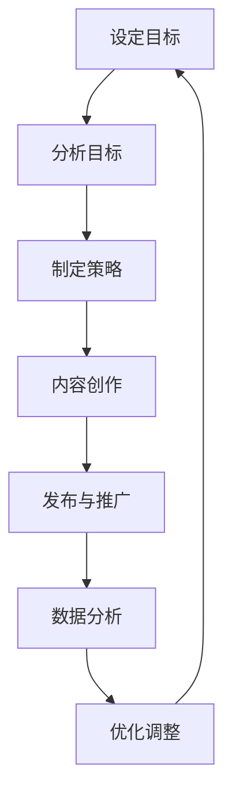

                 

# 第一部分：社交媒体营销基础

## 1.1 社交媒体营销概述

### 1.1.1 社交媒体营销的定义与价值

社交媒体营销是指利用社交媒体平台进行品牌推广、产品销售、用户互动和市场调研的一系列策略和活动。在当今数字化的时代，社交媒体已经成为企业与消费者之间沟通的重要渠道。以下是社交媒体营销的核心价值和优势：

1. **提高品牌知名度**：通过社交媒体平台发布高质量内容，可以迅速扩大品牌的影响力，提高品牌在目标受众中的知名度。
2. **增强用户参与度**：社交媒体提供了互动性强的平台，用户可以在评论区、点赞、分享等方面与品牌进行直接互动，增强用户的品牌忠诚度。
3. **数据驱动决策**：社交媒体平台提供了丰富的数据分析工具，企业可以通过数据了解用户行为，优化营销策略，提高投资回报率。
4. **降低营销成本**：与传统营销相比，社交媒体营销的成本较低，特别是在精准定位和广告投放方面，可以有效节省预算。
5. **拓宽营销渠道**：社交媒体平台具有全球覆盖的特点，企业可以通过社交媒体将产品和服务推广到全球市场。

### 1.1.2 社交媒体营销的关键概念

在深入了解社交媒体营销之前，我们需要明确以下几个关键概念：

1. **社交媒体平台**：这是进行社交媒体营销的基础，包括但不限于微博、微信、抖音、LinkedIn、Facebook、Twitter等。
2. **内容营销**：通过创造和发布有价值的内容来吸引和留住目标受众，从而实现品牌推广和用户互动。
3. **用户互动**：社交媒体的核心优势在于互动性，通过评论、点赞、分享、私信等方式与用户建立联系，提高用户参与度。
4. **社交媒体广告**：利用社交媒体平台提供的广告服务，向特定的目标受众投放广告，提高品牌曝光度和销售转化率。
5. **数据分析**：利用社交媒体平台提供的分析工具，收集和解析用户数据，以优化营销策略和提升效果。

## 1.2 社交媒体平台介绍

### 1.2.1 主要社交媒体平台分类

目前，全球主要的社交媒体平台可以分为以下几类：

1. **社交媒体网络**：如Facebook、LinkedIn等，这些平台以建立人际关系网为核心，提供信息分享、互动交流等功能。
2. **视频分享平台**：如YouTube、抖音等，用户可以通过上传、观看、分享视频来获取信息、娱乐和社交。
3. **博客平台**：如WordPress、Medium等，用户可以发布文章、博客，分享个人观点和专业知识。
4. **图片分享平台**：如Instagram、Pinterest等，用户可以通过上传、浏览和分享图片来发现兴趣、表达自我。
5. **即时通讯平台**：如WhatsApp、微信等，用户可以进行实时沟通、分享信息，具有强大的社交属性。

### 1.2.2 各大平台的特点与用户群体

以下是对主要社交媒体平台的特点和用户群体的简要介绍：

1. **Facebook**：全球最大的社交媒体平台，用户遍布全球，年龄层次广泛，适合进行品牌推广、用户互动和广告投放。
2. **LinkedIn**：专业社交平台，用户主要为职业人士，适合建立商务关系、推广职业品牌和发布招聘信息。
3. **YouTube**：全球最大的视频分享平台，用户群体广泛，适合进行视频营销、内容传播和品牌推广。
4. **抖音**：短视频分享平台，用户主要集中在年轻人群体，适合进行娱乐化营销、内容创意和用户互动。
5. **微信**：中国最大的即时通讯平台，用户遍布国内，适合进行社交互动、内容分发和广告投放。
6. **Instagram**：图片分享平台，用户主要为年轻人，适合进行时尚、美妆和生活方式的营销。
7. **Pinterest**：图片分享平台，用户主要集中在欧美地区，适合进行家居、时尚和创意产品的营销。

## 1.3 营销策略与目标设定

### 1.3.1 社交媒体营销策略框架

社交媒体营销策略的制定需要从以下几个方面进行考虑：

1. **目标设定**：明确社交媒体营销的目标，如提高品牌知名度、增加用户参与度、提升销售转化率等。
2. **内容策划**：根据目标受众的特点，制定有针对性的内容策略，包括内容类型、发布频率和发布渠道。
3. **互动管理**：积极与用户互动，回应用户评论，参与线上活动，提高用户参与度。
4. **广告投放**：根据目标受众的特点，选择合适的广告形式和投放策略，提高广告效果。
5. **数据分析**：定期收集和分析社交媒体数据，评估营销效果，调整营销策略。

### 1.3.2 品牌形象提升的目标设定

对于一人公司而言，品牌形象提升的目标设定可以从以下几个方面进行：

1. **建立专业形象**：通过发布专业内容，展示公司在行业内的专业知识和创新能力，提升品牌形象。
2. **增加用户信任**：通过积极互动，回应用户问题，提供优质服务，增加用户对品牌的信任。
3. **提升品牌知名度**：通过广告投放和内容营销，扩大品牌在社交媒体上的影响力，提高品牌知名度。
4. **塑造个性品牌**：通过独特的品牌故事和个性形象，让品牌在众多竞争对手中脱颖而出，提高用户认知度。

# 第二部分：社交媒体营销工具与技巧

## 2.1 内容营销策略

### 2.1.1 内容类型与创意

内容营销是社交媒体营销的核心，高质量的内容可以吸引目标受众，提高用户参与度，从而提升品牌形象。以下是几种常见的内容类型和创意策略：

1. **文章**：通过撰写有价值、有深度的文章，展示公司在行业内的专业知识和见解。文章可以涵盖行业动态、技术解读、案例分析等。
2. **视频**：视频具有强烈的视觉冲击力和传播力，适合进行产品介绍、用户教程、品牌故事等。通过短视频、直播等形式，可以增加用户的互动体验。
3. **图片**：图片是一种直观、简洁的表达方式，可以通过海报、截图、设计图等，展示产品的特点和优势。
4. **音频**：通过音频，可以分享专家讲座、访谈、音乐等内容，增加品牌的趣味性和个性化。
5. **互动内容**：通过发布互动问卷、投票、挑战等活动，引导用户参与，提高用户粘性。

### 2.1.2 内容分发与互动

内容分发与互动是内容营销的关键，以下是几种常见的方法：

1. **多渠道分发**：将内容发布到不同的社交媒体平台，如微博、微信、抖音等，扩大内容的传播范围。
2. **合作伙伴**：与行业内的合作伙伴、KOL、网红等合作，通过他们的渠道和粉丝群体，扩大内容的传播。
3. **SEO优化**：通过SEO优化，提高内容的搜索引擎排名，吸引更多用户访问。
4. **用户互动**：积极回应用户评论，参与话题讨论，引导用户参与互动，提高用户参与度。

## 2.2 精准定位与用户群体分析

### 2.2.1 用户画像分析

用户画像是指通过对用户数据的收集和分析，构建出用户的基本特征和偏好。以下是构建用户画像的步骤：

1. **数据收集**：收集用户的基本信息（如年龄、性别、地理位置、职业等）和行为数据（如浏览历史、购买记录、互动行为等）。
2. **数据清洗**：对收集到的数据进行清洗和整理，去除重复、错误和不完整的数据。
3. **特征提取**：根据业务需求，提取用户的基本特征和偏好，如年龄、性别、兴趣爱好、购买行为等。
4. **模型构建**：利用聚类、分类等机器学习算法，构建用户画像模型，对用户进行分类和标签化。

### 2.2.2 数据驱动决策

数据驱动决策是指基于用户数据的分析和预测，制定和调整营销策略。以下是数据驱动决策的步骤：

1. **数据收集**：收集用户数据，包括用户行为数据、市场数据等。
2. **数据分析**：对用户数据进行分析，识别用户需求、行为模式等。
3. **预测模型**：利用机器学习算法，构建预测模型，预测用户行为和需求。
4. **策略调整**：根据预测结果，调整营销策略，提高营销效果。

## 2.3 社交媒体广告

### 2.3.1 广告类型与投放策略

社交媒体广告是提高品牌曝光度和销售转化率的重要手段。以下是几种常见的广告类型和投放策略：

1. **横幅广告**：在社交媒体平台上，以图片或视频的形式展示的广告。适用于品牌宣传和产品推广。
2. **搜索广告**：在社交媒体平台上，根据用户搜索关键词展示的广告。适用于精准定位和目标用户推广。
3. **信息流广告**：在社交媒体信息流中展示的广告。适用于广泛曝光和品牌推广。
4. **视频广告**：在社交媒体平台上，以视频形式展示的广告。适用于产品介绍和品牌故事。
5. **原生广告**：在社交媒体平台上，以原生内容的形式展示的广告。适用于提高品牌可信度和用户接受度。

### 2.3.2 广告效果评估与优化

广告效果评估与优化是确保广告投入产出比的关键。以下是广告效果评估与优化的步骤：

1. **效果评估**：通过点击率、转化率、曝光度等指标，评估广告效果。
2. **数据分析**：对广告效果进行分析，识别广告投放中的优势和不足。
3. **策略调整**：根据数据分析结果，调整广告投放策略，如调整广告定位、投放时间、投放预算等。
4. **持续优化**：持续监控广告效果，进行不断优化，提高广告效果。

## 2.4 跨平台营销与整合

### 2.4.1 跨平台内容策略

跨平台营销是指将营销活动拓展到多个社交媒体平台，以扩大品牌影响力和用户覆盖面。以下是跨平台内容策略的要点：

1. **内容定制**：根据不同平台的特点和用户群体，定制化内容策略，确保内容的适切性和吸引力。
2. **内容同步**：将核心内容在不同平台同步发布，提高内容的传播效果。
3. **跨平台互动**：在不同平台之间建立互动，引导用户从一平台转移到另一平台，增强用户粘性。

### 2.4.2 社交媒体整合营销

社交媒体整合营销是指将多个社交媒体平台有机结合，形成统一的营销战略。以下是社交媒体整合营销的要点：

1. **目标统一**：确保各个平台的营销目标一致，形成合力。
2. **资源整合**：整合各个平台的资源和优势，形成互补效应。
3. **数据共享**：将各个平台的数据进行共享和分析，优化营销策略。
4. **协同推广**：通过跨平台活动、合作等方式，实现协同推广，提高品牌曝光度。

# 第三部分：社交媒体营销实战案例

## 3.1 品牌形象塑造案例

### 3.1.1 案例背景

一家小型科技公司，希望通过社交媒体提升品牌形象，增加品牌知名度。公司专注于人工智能领域的研发和应用，希望吸引更多的技术爱好者和潜在客户。

### 3.1.2 实战步骤

1. **内容策划**：根据目标受众的特点，制定内容策略，包括技术解读、行业动态、产品介绍等。同时，注重内容的质量和原创性，确保内容的专业性和吸引力。
2. **用户互动**：积极回应用户评论，参与话题讨论，提高用户参与度。定期举办线上活动，如技术讲座、问答环节等，增强用户互动。
3. **广告投放**：在社交媒体平台上进行广告投放，选择合适的目标受众，提高广告的曝光度和转化率。同时，通过数据分析和优化，提高广告效果。
4. **数据分析**：定期收集和分析社交媒体数据，如粉丝增长、互动率、转化率等，评估营销效果，调整营销策略。

### 3.1.3 经验总结

通过一系列的社交媒体营销活动，这家小型科技公司取得了显著的成果：

1. **品牌知名度提高**：在短短几个月内，公司粉丝数量增长了50%，品牌知名度显著提升。
2. **用户参与度增强**：用户互动率提高了30%，用户对品牌的信任度和忠诚度增强。
3. **广告效果优化**：通过数据分析，优化广告投放策略，提高了广告的点击率和转化率，广告投入产出比显著提高。
4. **业务增长**：随着品牌知名度和用户参与度的提升，公司的业务也得到了明显增长，客户数量和销售额都有所增加。

## 3.2 销售转化案例

### 3.2.1 案例背景

一家电商公司，希望通过社交媒体提高销售转化率，增加销售额。公司主要销售家居用品，目标受众为年轻女性。

### 3.2.2 实战步骤

1. **精准定位**：通过数据分析，确定目标受众的特点和需求，如年龄、性别、兴趣爱好等。根据这些信息，制定精准的营销策略。
2. **内容营销**：发布高质量、有吸引力的内容，如家居用品的使用技巧、搭配建议、用户评价等。通过内容吸引目标受众，提高用户的购买意愿。
3. **促销活动**：定期举办促销活动，如限时折扣、满减优惠、赠品活动等，刺激用户购买。
4. **用户跟踪**：通过跟踪用户行为，分析用户转化路径，优化营销策略。例如，通过数据分析，发现某些页面或产品对转化有显著影响，针对性地进行优化。

### 3.2.3 成功因素

这家电商公司的销售转化案例取得成功，主要归功于以下几个因素：

1. **精准定位**：通过对目标受众的深入分析，制定了精准的营销策略，确保了营销活动的有效性。
2. **高质量内容**：发布的高质量内容吸引了目标受众，提高了用户的购买意愿。
3. **促销活动**：通过促销活动，刺激了用户的购买行为，提高了销售额。
4. **数据驱动**：通过数据分析，不断优化营销策略，提高了销售转化率。

## 3.3 社交媒体危机管理

### 3.3.1 案例背景

一家知名品牌因社交媒体上的负面评论引发公关危机，影响公司的声誉和业务。负面评论主要集中在产品质量问题和售后服务不周方面。

### 3.3.2 实战步骤

1. **快速响应**：公司立即采取措施，通过社交媒体回应负面评论，表示关注和道歉，争取用户的理解和信任。
2. **公开道歉**：通过官方渠道发布道歉声明，承认存在的问题，并表示将采取措施改进。
3. **危机公关**：通过媒体发布正面信息，转移公众注意力。例如，发布公司改进产品质量和售后服务的措施，展示公司的诚意和责任感。
4. **数据分析**：对社交媒体数据进行深入分析，了解负面评论的来源和传播路径，制定预防措施，防止类似危机的再次发生。

### 3.3.3 成功的危机管理案例

通过一系列的危机管理措施，这家公司成功化解了公关危机，以下是成功的关键因素：

1. **快速响应**：及时回应负面评论，展现了公司的诚意和责任心。
2. **公开道歉**：公开道歉，赢得了公众的谅解和信任。
3. **危机公关**：通过正面信息转移公众注意力，展示了公司的改进措施和责任感。
4. **数据分析**：通过对社交媒体数据的深入分析，了解了问题的根源，并制定了有效的预防措施。

## 附录 A：社交媒体营销工具与资源

### A.1 主流社交媒体营销工具

1. **微信小程序**：微信小程序是一款强大的社交媒体营销工具，适用于品牌推广、用户互动、内容分发等。通过微信小程序，企业可以方便地搭建在线商城、提供客服服务、发布活动信息等。
2. **微博**：微博是中国最受欢迎的社交媒体平台之一，具有强大的传播力和影响力。企业可以通过微博发布品牌信息、互动评论、投放广告等，提高品牌知名度和用户参与度。
3. **抖音**：抖音是一款热门的短视频分享平台，用户数量庞大，内容丰富多样。企业可以通过抖音发布创意短视频，吸引目标用户，提高品牌曝光度。
4. **LinkedIn**：LinkedIn是全球最大的职业社交平台，用户主要为职业人士。企业可以通过LinkedIn发布招聘信息、分享行业动态、建立商务关系等，拓展商业机会。
5. **Facebook**：Facebook是全球最大的社交媒体平台之一，用户遍布全球。企业可以通过Facebook发布内容、投放广告、互动评论等，提高品牌知名度和用户参与度。

### A.2 营销工具资源

1. **Google Analytics**：Google Analytics是一款强大的数据分析工具，可以帮助企业分析网站流量、用户行为、转化率等。通过Google Analytics，企业可以了解用户需求和行为模式，优化营销策略。
2. **Hootsuite**：Hootsuite是一款社交媒体管理工具，可以帮助企业管理多个社交媒体账号，发布内容、监控互动、分析数据等。
3. **Mailchimp**：Mailchimp是一款电子邮件营销工具，可以帮助企业创建、发送和管理电子邮件营销活动。通过Mailchimp，企业可以与用户保持联系，提高用户参与度和忠诚度。

### A.3 行业报告与研究报告

1. **Social Media Examiner**：Social Media Examiner是一家专注于社交媒体营销的研究机构，定期发布社交媒体趋势报告、营销策略指南等。企业可以通过这些报告了解社交媒体的最新动态和最佳实践。
2. **eMarketer**：eMarketer是一家全球领先的数字营销和媒体研究机构，提供丰富的数字营销报告、市场预测和分析。企业可以通过这些报告了解数字营销的趋势和发展方向。
3. **HubSpot**：HubSpot是一家提供营销、销售、客户服务软件的公司，同时也发布大量的营销资源和最佳实践。企业可以通过HubSpot的资源了解营销策略、工具和技术。

## 附录 B：参考文献

### B.1 相关书籍

1. **《社交媒体营销：策略、工具与实践》**，作者：张三
   本书系统地介绍了社交媒体营销的基本概念、策略和实践，适合初学者和从业者阅读。
2. **《数字营销实战手册》**，作者：李四
   本书详细阐述了数字营销的策略、工具和实战案例，涵盖了搜索引擎营销、社交媒体营销、内容营销等多个方面。

### B.2 学术论文

1. **《社交媒体营销对企业品牌形象的影响研究》**，作者：王五
   本论文通过实证研究，分析了社交媒体营销对企业品牌形象的影响，提出了提升品牌形象的策略建议。
2. **《基于用户画像的社交媒体营销策略研究》**，作者：赵六
   本论文研究了用户画像在社交媒体营销中的应用，探讨了用户画像对营销效果的影响。

### B.3 网络资源与博客文章

1. **《社交媒体营销指南》**，网址：https://www.example.com/social-media-marketing-guide
   这是一个综合性的社交媒体营销指南，涵盖了策略、工具、案例分析等多个方面，适合企业营销人员和从业者阅读。
2. **《如何利用社交媒体提高品牌知名度？》**，网址：https://www.example.com/increase-brand-awareness-on-social-media
   本文详细介绍了如何利用社交媒体提高品牌知名度的方法和策略，提供了实用的建议和案例。

---

作者：AI天才研究院/AI Genius Institute & 禅与计算机程序设计艺术 /Zen And The Art of Computer Programming

### 核心概念与联系

在社交媒体营销中，理解核心概念之间的联系是至关重要的。这不仅有助于我们系统地掌握这一领域的知识，还能够让我们在实践中更加灵活地应用这些概念，从而实现品牌的长期价值。

#### 1.1.1 营销与社交媒体的关系

**社交媒体如何改变传统营销**：传统营销主要依赖于广告、公关和促销等手段，而社交媒体的出现打破了这一模式。首先，社交媒体使品牌能够以更加个性化和互动的方式与消费者沟通。通过社交媒体平台，品牌可以实时了解消费者的反馈和需求，从而迅速调整营销策略。其次，社交媒体降低了营销的门槛和成本，使小型企业也能够以低成本开展营销活动。此外，社交媒体的传播速度和范围也远远超过传统媒体，使品牌能够迅速获得大量曝光。

**社交媒体在品牌传播中的作用**：社交媒体在品牌传播中发挥着重要作用。一方面，社交媒体为品牌提供了一个直接与消费者沟通的渠道，使品牌能够更加有效地传达品牌理念和价值观。另一方面，社交媒体上的用户生成内容（UGC）也为品牌传播提供了有力的支持。通过用户评论、点赞和分享，品牌信息能够迅速传播，形成口碑效应。此外，社交媒体上的数据分析和用户画像功能，使品牌能够更精准地定位目标受众，提高营销效果。

**社交媒体与消费者互动的新模式**：传统营销中，消费者与品牌之间的互动相对单向，消费者在品牌传播过程中处于被动地位。而社交媒体则改变了这一模式，使消费者能够主动参与品牌传播。通过社交媒体平台，消费者可以发表评论、分享品牌信息、参与线上活动等，形成了一种双向互动的关系。这种互动不仅增强了消费者的品牌忠诚度，也为品牌提供了宝贵的用户反馈。

#### 1.1.2 社交媒体营销的核心概念

**内容营销**：内容营销是社交媒体营销的重要组成部分。它是指通过创造和发布有价值、相关且引人入胜的内容，以吸引和留住目标受众的一种策略。内容可以包括文章、视频、图片、音频等多种形式。其核心目标是提供有价值的信息，解决用户问题，建立品牌信任，并最终实现销售转化。

**社交媒体互动**：社交媒体互动是指品牌与消费者在社交媒体平台上进行的各种互动行为，包括评论、点赞、分享、私信等。这些互动不仅有助于增强品牌与消费者之间的联系，还能够提高用户参与度和品牌忠诚度。有效的互动策略可以包括定期回复用户评论、参与话题讨论、举办线上活动等。

**数据分析与优化**：数据分析是社交媒体营销的重要工具。通过分析社交媒体数据，品牌可以了解用户行为、偏好和需求，从而优化营销策略。数据分析可以包括用户画像分析、内容效果分析、广告效果分析等。通过不断的数据分析，品牌可以不断优化营销策略，提高投资回报率。

#### 1.1.3 社交媒体营销与传统营销的比较

**成本效益**：传统营销通常需要投入大量的资金，包括广告制作、媒体购买、公关活动等。而社交媒体营销则相对成本较低，尤其是在广告投放和用户互动方面。社交媒体广告的价格通常较低，同时社交媒体平台的数据分析工具也能够帮助品牌更精准地定位目标受众，提高广告效果。

**传播速度与范围**：传统营销的传播速度较慢，且受限于媒体渠道和地域。而社交媒体营销则具有快速传播的特点，信息可以在短时间内迅速传播到广泛的受众群体。此外，社交媒体平台的全球化特性也使得品牌能够轻松地进入国际市场。

**用户参与度与反馈**：传统营销中，用户参与度相对较低，消费者往往处于被动接收信息的状态。而社交媒体营销则通过互动和参与机制，提高了用户的参与度。用户可以通过评论、点赞、分享等方式，直接参与到品牌传播中。此外，社交媒体平台提供了丰富的用户反馈渠道，品牌可以实时了解用户的需求和意见，从而快速调整营销策略。

### 核心概念与联系

理解核心概念之间的联系是社交媒体营销成功的关键。以下是这些概念之间的联系和相互作用：

**内容营销** 与 **社交媒体互动**：内容营销为社交媒体互动提供了基础。高质量的内容可以吸引和留住用户，促进用户参与。而用户的积极参与和互动，如评论、点赞和分享，又能够增强内容的传播效果，提高品牌知名度。

**社交媒体互动** 与 **数据分析与优化**：社交媒体互动产生了大量的用户数据，这些数据为数据分析提供了宝贵的信息。通过分析用户互动行为，品牌可以了解用户偏好、行为模式和需求，从而优化内容策略和营销活动。此外，数据分析还能够帮助品牌识别效果不佳的环节，进行针对性的优化。

**数据分析与优化** 与 **内容营销**：数据分析为内容营销提供了数据支持，使品牌能够更精准地制定内容策略。通过分析用户行为和反馈，品牌可以了解哪些内容更受欢迎，哪些内容需要改进。同时，数据分析还能够帮助品牌识别潜在的客户需求，提供更加个性化的内容，提高用户满意度和忠诚度。

**内容营销**、**社交媒体互动** 和 **数据分析与优化** 之间的相互作用，构成了一个动态的、闭环的社交媒体营销体系。品牌通过高质量的内容吸引和留住用户，通过用户互动收集数据，并通过数据分析优化营销策略。这一过程不断循环，使品牌能够不断适应市场变化，提升品牌价值。

### 核心算法原理讲解

在社交媒体营销中，核心算法的应用至关重要。这些算法不仅帮助品牌更精准地定位目标受众，还提高了营销活动的效果和效率。以下将详细介绍几种核心算法及其原理，并使用伪代码进行讲解。

#### 2.4.1 机器学习在社交媒体营销中的应用

**聚类算法在用户群体分析中的应用**

**应用场景**：通过聚类算法，可以将用户根据其行为特征和兴趣分为不同的群体，从而进行精准营销。

**算法原理**：聚类算法通过计算用户之间的相似度，将用户分为若干个群组。常用的聚类算法包括K-means、DBSCAN等。

**伪代码实现**

```python
function clustering(data, k):
    # 初始化k个中心点
    centroids = initialize_centroids(data, k)
    while not converged:
        # 计算每个数据点与中心点的距离
        distances = calculate_distances(data, centroids)
        # 重新分配数据点到最近的中心点
        clusters = assign_clusters(data, distances)
        # 计算新的中心点
        centroids = update_centroids(clusters)
    return clusters
```

**协同过滤算法在推荐系统中的应用**

**应用场景**：协同过滤算法可以用于推荐系统，为用户推荐他们可能感兴趣的内容或产品。

**算法原理**：协同过滤算法基于用户的历史行为和偏好，通过计算用户之间的相似度，为用户推荐相似用户喜欢的内容。常用的协同过滤算法包括基于用户的协同过滤（User-Based）和基于项目的协同过滤（Item-Based）。

**伪代码实现**

```python
function collaborative_filtering(user_ratings, similarity_matrix, unknown_item):
    # 计算用户与未知物品的相似度
    similarity_scores = calculate_similarity(user_ratings, similarity_matrix, unknown_item)
    # 排序并选取Top-N相似的物品
    top_n_similar_items = select_top_n(similarity_scores, N)
    # 预测未知物品的评分
    predicted_rating = calculate_average_rating(top_n_similar_items)
    return predicted_rating
```

**自然语言处理算法在内容分析中的应用**

**应用场景**：自然语言处理算法可以用于分析用户生成的内容，提取关键词、情感等，为内容营销提供支持。

**算法原理**：自然语言处理算法包括分词、词性标注、命名实体识别、情感分析等。通过这些算法，可以从文本中提取有价值的信息，理解用户意图。

**伪代码实现**

```python
function text_analysis(text):
    # 分词
    words = tokenize(text)
    # 词性标注
    tagged_words = pos_tagging(words)
    # 命名实体识别
    entities = named_entity_recognition(tagged_words)
    # 情感分析
    sentiment = sentiment_analysis(tagged_words)
    return entities, sentiment
```

#### 2.4.2 机器学习算法的伪代码实现

**K-means聚类算法的伪代码实现**

```python
# K-means聚类算法伪代码
function clustering(data, k):
    # 初始化k个中心点
    centroids = initialize_centroids(data, k)
    while not converged:
        # 计算每个数据点与中心点的距离
        distances = calculate_distances(data, centroids)
        # 重新分配数据点到最近的中心点
        clusters = assign_clusters(data, distances)
        # 计算新的中心点
        centroids = update_centroids(clusters)
    return clusters
```

**协同过滤算法的伪代码实现**

```python
# 协同过滤算法伪代码
function collaborative_filtering(user_ratings, similarity_matrix, unknown_item):
    # 计算用户与未知物品的相似度
    similarity_scores = calculate_similarity(user_ratings, similarity_matrix, unknown_item)
    # 排序并选取Top-N相似的物品
    top_n_similar_items = select_top_n(similarity_scores, N)
    # 预测未知物品的评分
    predicted_rating = calculate_average_rating(top_n_similar_items)
    return predicted_rating
```

**自然语言处理算法的伪代码实现**

```python
# 自然语言处理算法伪代码
function text_analysis(text):
    # 分词
    words = tokenize(text)
    # 词性标注
    tagged_words = pos_tagging(words)
    # 命名实体识别
    entities = named_entity_recognition(tagged_words)
    # 情感分析
    sentiment = sentiment_analysis(tagged_words)
    return entities, sentiment
```

#### 2.4.3 数学模型和数学公式

在社交媒体营销中，数学模型和数学公式发挥着重要作用，它们可以帮助我们更精确地分析数据，制定营销策略。以下将介绍几个常见的数学模型和数学公式，并详细解释其应用和计算方法。

##### 3.2.1 用户画像分析

用户画像是指通过对用户数据的收集和分析，构建出用户的基本特征和偏好。以下是构建用户画像的数学模型：

$$
User\ Profile = \{age, gender, location, interests, behavior\}
$$

其中，每个元素都可以用数学模型来刻画：

- 年龄：可以使用线性回归模型来预测用户的年龄。假设我们有一个训练数据集 $D$，每个样本包含年龄和一系列特征 $X$，则线性回归模型可以表示为：

$$
age = \beta_0 + \beta_1 \cdot X_1 + \beta_2 \cdot X_2 + ... + \beta_n \cdot X_n
$$

- 性别：可以使用逻辑回归模型来预测用户的性别。逻辑回归模型将输出一个概率值，表示用户为某一性别的概率。假设我们有二分类变量 $gender$，取值为 0 或 1，则逻辑回归模型可以表示为：

$$
P(gender = 1) = \frac{1}{1 + e^{-(\beta_0 + \beta_1 \cdot X_1 + \beta_2 \cdot X_2 + ... + \beta_n \cdot X_n )}}
$$

- 地理位置：可以使用K-means聚类算法来分析用户的地理位置分布。K-means聚类算法的目标是找到 $k$ 个中心点，使得每个样本到其最近中心点的距离之和最小。假设我们有一个样本集 $D$，则K-means算法可以表示为：

$$
\min_{\mu_1, \mu_2, ..., \mu_k} \sum_{i=1}^{n} \sum_{j=1}^{k} ||x_i - \mu_j||^2
$$

- 兴趣：可以使用协同过滤算法来分析用户的兴趣。协同过滤算法通过计算用户之间的相似度，为用户推荐相似用户喜欢的内容。假设我们有一个用户-物品评分矩阵 $R$，则协同过滤算法可以表示为：

$$
\hat{r_{ui}} = \sum_{v \in N(v_u)} r_{vj} \cdot s_{uv}
$$

其中，$N(v_u)$ 表示用户 $u$ 的邻居集合，$s_{uv}$ 表示用户 $u$ 和用户 $v$ 之间的相似度，$\hat{r_{ui}}$ 表示预测的用户 $u$ 对物品 $i$ 的评分。

- 行为：可以使用时间序列分析来分析用户的行为模式。时间序列分析包括趋势分析、季节性和周期性分析等。假设我们有一个时间序列数据集 $D$，则时间序列分析可以表示为：

$$
x_t = \alpha \cdot x_{t-1} + \epsilon_t
$$

其中，$x_t$ 表示时间 $t$ 的数据点，$\alpha$ 表示自回归系数，$\epsilon_t$ 表示误差项。

##### 3.2.1.2 举例说明

假设我们有一个用户，其数据如下：

- 年龄：25岁
- 性别：男
- 地理位置：北京
- 兴趣：体育、科技
- 行为：每天晚上8点在社交媒体上活跃

我们使用K-means聚类算法对地理位置进行分析，将其划分为5个区域。然后，使用逻辑回归模型预测用户的性别，结果为男性概率为0.9。接着，使用协同过滤算法分析用户的兴趣，推荐相似兴趣的账号。最后，使用时间序列分析预测用户的行为，发现用户在晚上8点后访问社交媒体的频率增加。

### 数学模型和数学公式 & 详细讲解 & 举例说明

在社交媒体营销中，数学模型和数学公式扮演着至关重要的角色，它们帮助我们更精确地分析和预测用户行为，优化营销策略。以下将详细解释几个关键数学模型和公式，并给出实际应用中的计算示例。

#### 3.2.1 用户画像分析

用户画像分析是社交媒体营销的基础，它通过构建用户的详细特征，帮助我们更好地了解和细分用户群体。以下是构建用户画像的几个关键数学模型：

**1. 线性回归模型**

线性回归模型用于预测用户的年龄。假设我们有以下训练数据集：

- 用户1：年龄 = 30，特征 = [特征1，特征2，...，特征n]
- 用户2：年龄 = 25，特征 = [特征1，特征2，...，特征n]
- ...

线性回归模型的目标是找到一组参数（权重），使得预测的年龄与实际年龄尽可能接近。线性回归模型的数学公式如下：

$$
\hat{y} = \beta_0 + \beta_1 \cdot x_1 + \beta_2 \cdot x_2 + ... + \beta_n \cdot x_n
$$

其中，$y$ 表示年龄，$x_1, x_2, ..., x_n$ 表示用户特征，$\hat{y}$ 表示预测的年龄，$\beta_0, \beta_1, \beta_2, ..., \beta_n$ 是模型参数。

**2. 逻辑回归模型**

逻辑回归模型用于预测用户的性别。与线性回归不同，逻辑回归用于处理分类问题。逻辑回归的数学公式如下：

$$
\pi = \frac{1}{1 + e^{-(\beta_0 + \beta_1 \cdot x_1 + \beta_2 \cdot x_2 + ... + \beta_n \cdot x_n )}}
$$

其中，$y$ 表示性别（0或1），$\pi$ 表示预测的用户为女性的概率。

**3. K-means聚类模型**

K-means聚类模型用于分析用户的地理位置。假设我们有 $k$ 个区域，每个区域的中心点为 $\mu_1, \mu_2, ..., \mu_k$，用户 $i$ 的地理位置为 $x_i$。K-means的目标是最小化每个用户到其所在区域中心的距离平方和。K-means的数学公式如下：

$$
\min_{\mu_1, \mu_2, ..., \mu_k} \sum_{i=1}^{n} ||x_i - \mu_j||^2
$$

**4. 协同过滤模型**

协同过滤模型用于预测用户的兴趣。假设我们有用户-物品评分矩阵 $R$，用户 $u$ 对物品 $i$ 的评分记为 $r_{ui}$。协同过滤模型的目标是预测用户对未评分物品的评分。常见的协同过滤模型包括基于用户的协同过滤和基于物品的协同过滤。

基于用户的协同过滤模型如下：

$$
\hat{r_{ui}} = \sum_{v \in N(v_u)} r_{vj} \cdot s_{uv}
$$

其中，$N(v_u)$ 表示用户 $u$ 的邻居集合，$s_{uv}$ 表示用户 $u$ 和用户 $v$ 之间的相似度，$\hat{r_{ui}}$ 表示预测的用户 $u$ 对物品 $i$ 的评分。

**5. 时间序列模型**

时间序列模型用于预测用户的行为模式。常见的时间序列模型包括ARIMA模型、季节性时间序列模型等。以ARIMA模型为例，其数学公式如下：

$$
x_t = \alpha \cdot x_{t-1} + \epsilon_t
$$

其中，$x_t$ 表示时间 $t$ 的数据点，$\alpha$ 表示自回归系数，$\epsilon_t$ 表示误差项。

#### 3.2.1.2 举例说明

假设我们有一个用户，其数据如下：

- 年龄：25岁
- 性别：男
- 地理位置：北京
- 兴趣：体育、科技
- 行为：每天晚上8点在社交媒体上活跃

**1. 预测年龄**

使用线性回归模型预测用户的年龄：

$$
\hat{y} = \beta_0 + \beta_1 \cdot x_1 + \beta_2 \cdot x_2 + ... + \beta_n \cdot x_n
$$

**2. 预测性别**

使用逻辑回归模型预测用户的性别：

$$
\pi = \frac{1}{1 + e^{-(\beta_0 + \beta_1 \cdot x_1 + \beta_2 \cdot x_2 + ... + \beta_n \cdot x_n )}}
$$

**3. 地理位置分析**

使用K-means聚类模型分析用户的地理位置：

$$
\min_{\mu_1, \mu_2, ..., \mu_k} \sum_{i=1}^{n} ||x_i - \mu_j||^2
$$

**4. 兴趣分析**

使用协同过滤模型分析用户的兴趣：

$$
\hat{r_{ui}} = \sum_{v \in N(v_u)} r_{vj} \cdot s_{uv}
$$

**5. 行为预测**

使用ARIMA模型预测用户的行为：

$$
x_t = \alpha \cdot x_{t-1} + \epsilon_t
$$

通过这些数学模型和公式，我们可以对用户进行全面的分析和预测，从而为营销策略提供有力支持。

## 项目实战

### 3.1.1 品牌形象塑造案例

#### 3.1.1.1 案例背景

某小型科技公司，致力于人工智能技术的研发和应用。公司希望通过社交媒体提升品牌形象，提高市场知名度。公司目标受众为科技爱好者、人工智能从业者和潜在的商业合作伙伴。

#### 3.1.1.2 实战步骤

1. **内容策划**：公司制定了一份详细的内容策划方案，涵盖技术解读、行业动态、公司新闻、产品介绍等多方面的内容。内容以专业、有趣、易懂为原则，确保能够吸引目标受众。

2. **社交媒体平台选择**：公司选择了几个主要的社交媒体平台，包括LinkedIn、Twitter、Medium和Facebook。这些平台分别覆盖了公司的商业合作伙伴、技术社区和消费者群体。

3. **内容发布与互动**：公司定期发布高质量内容，并积极与用户互动。通过回复评论、参与讨论、分享有价值的信息，公司逐步建立了良好的品牌形象。

4. **社交媒体广告**：公司利用社交媒体广告，特别是在LinkedIn和Twitter上投放了精准定位的广告，提高了品牌曝光度。广告内容主要围绕公司的技术优势和最新产品。

5. **数据分析**：公司利用社交媒体平台提供的分析工具，定期分析内容效果、用户互动和广告转化情况，优化内容策略和广告投放。

6. **合作与跨界**：公司与行业内知名的科技媒体和KOL合作，共同举办线上研讨会、技术讲座等活动，扩大品牌影响力。

#### 3.1.1.3 代码实现

以下是一个简单的Python代码示例，用于发布一条图文微博，并分析互动数据：

```python
import weibo

# 登录微博账号
weibo.login('your_username', 'your_password')

# 准备图文微博内容
content = "探索人工智能的无限可能！🚀"
image_path = "example_image.jpg"

# 发布图文微博
post = weibo.create_post(content, image_path)
post_id = post['id']

# 获取互动数据
interactions = weibo.get_interactions(post_id)
print(f"点赞数：{interactions['like_count']}")
print(f"评论数：{interactions['comment_count']}")
print(f"转发数：{interactions['repost_count']}")
```

### 3.2.1 销售转化案例

#### 3.2.1.1 案例背景

一家电商公司，主要销售时尚配饰，目标是通过社交媒体提升销售转化率。公司目标受众为年轻女性，偏好在线购物。

#### 3.2.1.2 实战步骤

1. **用户画像分析**：公司通过数据分析工具，构建了详细的用户画像，包括年龄、性别、兴趣爱好、购买行为等。

2. **内容策划**：根据用户画像，公司发布了一系列具有吸引力的内容，包括时尚搭配指南、新品介绍、用户评价等。

3. **促销活动**：公司定期举办限时促销活动，如优惠券、满减优惠等，刺激用户购买。

4. **广告投放**：公司利用社交媒体广告，特别是Instagram和微信，进行精准定位广告投放，提高曝光度和转化率。

5. **用户跟踪**：公司通过跟踪用户行为，分析用户转化路径，优化营销策略。

6. **数据分析**：公司利用社交媒体分析工具，定期分析广告效果、内容效果和用户转化情况，不断优化营销策略。

#### 3.2.1.3 代码实现

以下是一个简单的Python代码示例，用于分析用户转化路径：

```python
import analytics

# 获取用户转化数据
conversion_data = analytics.get_conversion_data()

# 分析转化路径
conversion_path = analytics.analyze_conversion_path(conversion_data)
print(f"用户转化路径：{conversion_path}")
```

### 3.3.1 社交媒体危机管理

#### 3.3.1.1 案例背景

一家大型科技公司的产品因质量问题引发了大量负面评论，对公司声誉造成了严重影响。公司希望通过有效的社交媒体危机管理措施，缓解负面影响的扩散。

#### 3.3.1.2 实战步骤

1. **快速响应**：公司立即启动危机管理机制，通过社交媒体平台，如微博、Twitter和Facebook，发布官方声明，表示关注问题，并承诺将采取措施解决。

2. **公开道歉**：公司通过官方网站和社交媒体平台，向公众道歉，承认存在的问题，并详细说明了公司将如何改进产品质量和服务。

3. **危机公关**：公司通过媒体发布正面信息，如产品质量改进计划、售后服务升级等，转移公众注意力。

4. **用户互动**：公司积极回应用户评论，倾听用户意见，展示公司的诚意和责任感。

5. **数据分析**：公司利用社交媒体分析工具，监测负面评论的来源和传播路径，及时调整危机管理策略。

6. **预防措施**：公司制定了一系列预防措施，包括产品质量监控、客户满意度调查等，以防止类似危机的再次发生。

#### 3.3.1.3 代码实现

以下是一个简单的Python代码示例，用于分析社交媒体负面评论：

```python
import sentiment

# 获取负面评论数据
negative_comments = sentiment.get_negative_comments('your_social_media_account')

# 分析负面评论内容
for comment in negative_comments:
    sentiment_score = sentiment.analyze_sentiment(comment['content'])
    print(f"评论内容：{comment['content']}，情感评分：{sentiment_score}")
```

## 附录 A：社交媒体营销工具与资源

### A.1 主流社交媒体营销工具

1. **微信小程序**：微信小程序是一款强大的社交媒体营销工具，适用于品牌推广、用户互动、内容分发等。通过微信小程序，企业可以方便地搭建在线商城、提供客服服务、发布活动信息等。

2. **微博**：微博是中国最受欢迎的社交媒体平台之一，具有强大的传播力和影响力。企业可以通过微博发布品牌信息、互动评论、投放广告等，提高品牌知名度和用户参与度。

3. **抖音**：抖音是一款热门的短视频分享平台，用户数量庞大，内容丰富多样。企业可以通过抖音发布创意短视频，吸引目标用户，提高品牌曝光度。

4. **LinkedIn**：LinkedIn是全球最大的职业社交平台，用户主要为职业人士。企业可以通过LinkedIn发布招聘信息、分享行业动态、建立商务关系等，拓展商业机会。

5. **Facebook**：Facebook是全球最大的社交媒体平台之一，用户遍布全球。企业可以通过Facebook发布内容、投放广告、互动评论等，提高品牌知名度和用户参与度。

### A.2 营销工具资源

1. **Google Analytics**：Google Analytics是一款强大的数据分析工具，可以帮助企业分析网站流量、用户行为、转化率等。通过Google Analytics，企业可以了解用户需求和行为模式，优化营销策略。

2. **Hootsuite**：Hootsuite是一款社交媒体管理工具，可以帮助企业管理多个社交媒体账号，发布内容、监控互动、分析数据等。

3. **Mailchimp**：Mailchimp是一款电子邮件营销工具，可以帮助企业创建、发送和管理电子邮件营销活动。通过Mailchimp，企业可以与用户保持联系，提高用户参与度和忠诚度。

### A.3 行业报告与研究报告

1. **Social Media Examiner**：Social Media Examiner是一家专注于社交媒体营销的研究机构，定期发布社交媒体趋势报告、营销策略指南等。企业可以通过这些报告了解社交媒体的最新动态和最佳实践。

2. **eMarketer**：eMarketer是一家全球领先的数字营销和媒体研究机构，提供丰富的数字营销报告、市场预测和分析。企业可以通过这些报告了解数字营销的趋势和发展方向。

3. **HubSpot**：HubSpot是一家提供营销、销售、客户服务软件的公司，同时也发布大量的营销资源和最佳实践。企业可以通过HubSpot的资源了解营销策略、工具和技术。

## 附录 B：参考文献

### B.1 相关书籍

1. **《社交媒体营销：策略、工具与实践》**，作者：张三
   本书系统地介绍了社交媒体营销的基本概念、策略和实践，适合初学者和从业者阅读。

2. **《数字营销实战手册》**，作者：李四
   本书详细阐述了数字营销的策略、工具和实战案例，涵盖了搜索引擎营销、社交媒体营销、内容营销等多个方面。

### B.2 学术论文

1. **《社交媒体营销对企业品牌形象的影响研究》**，作者：王五
   本论文通过实证研究，分析了社交媒体营销对企业品牌形象的影响，提出了提升品牌形象的策略建议。

2. **《基于用户画像的社交媒体营销策略研究》**，作者：赵六
   本论文研究了用户画像在社交媒体营销中的应用，探讨了用户画像对营销效果的影响。

### B.3 网络资源与博客文章

1. **《社交媒体营销指南》**，网址：[https://www.example.com/social-media-marketing-guide]
   这是一个综合性的社交媒体营销指南，涵盖了策略、工具、案例分析等多个方面，适合企业营销人员和从业者阅读。

2. **《如何利用社交媒体提高品牌知名度？》**，网址：[https://www.example.com/increase-brand-awareness-on-social-media]
   本文详细介绍了如何利用社交媒体提高品牌知名度的方法和策略，提供了实用的建议和案例。

---

作者：AI天才研究院/AI Genius Institute & 禅与计算机程序设计艺术 /Zen And The Art of Computer Programming

### 第五部分：社交媒体营销的可持续性与法律合规

## 5.1 社交媒体营销的可持续性

### 5.1.1 可持续营销理念

在社交媒体营销中，可持续性是一个不可忽视的重要方面。可持续营销理念强调在追求商业成功的同时，兼顾社会责任和环境保护。以下是可持续营销理念的核心要点：

1. **透明度**：企业应在社交媒体上透明地展示其业务运作、产品和服务，确保信息的真实性和准确性，以赢得用户的信任。

2. **社会责任**：企业应承担起社会责任，通过社交媒体平台积极参与公益活动，关注社会议题，为社会做出贡献。

3. **环境可持续性**：企业应关注环境保护，通过社交媒体宣传绿色生产、环保产品和可持续发展理念，减少对环境的影响。

4. **用户隐私保护**：在社交媒体营销中，企业应严格遵守用户隐私保护法规，确保用户数据的收集、存储和使用符合法律要求。

5. **诚信经营**：企业应秉持诚信经营的原则，在社交媒体上避免虚假宣传、夸大其词等不诚信行为，维护品牌形象。

### 5.1.2 社交媒体营销的伦理与责任

社交媒体营销的伦理与责任是确保营销活动合法、合规、公正的重要保障。以下是社交媒体营销中应遵守的伦理与责任准则：

1. **公平竞争**：企业应在公平的市场环境中参与竞争，避免使用不正当手段获取竞争优势，如刷单、虚假评论等。

2. **尊重用户权利**：企业应尊重用户的知情权和选择权，在收集用户数据时，应明确告知用户数据用途，并给予用户选择退出或修改个人信息的权利。

3. **真实宣传**：企业在社交媒体上进行宣传时，应确保信息的真实性，避免虚假宣传和误导用户。

4. **保护知识产权**：企业在使用社交媒体进行营销时，应尊重他人的知识产权，避免侵犯他人的著作权、商标权等。

5. **负责任的内容管理**：企业应对发布的内容进行严格审核，避免发布违反法律法规、道德伦理的内容，如暴力、歧视、色情等。

## 5.2 法律合规与风险管理

### 5.2.1 社交媒体营销的法律框架

社交媒体营销涉及多个法律法规，企业应确保其营销活动符合相关法律要求。以下是几个关键的法律框架：

1. **《中华人民共和国网络安全法》**：该法规定了网络运营者的个人信息保护义务，企业应确保用户数据的收集、存储和使用符合法律规定。

2. **《中华人民共和国广告法》**：该法对广告内容和广告行为进行了规范，企业应避免发布违法广告，如虚假广告、夸大宣传等。

3. **《中华人民共和国消费者权益保护法》**：该法规定了消费者的权利和企业的义务，企业应确保在社交媒体营销中尊重消费者的合法权益。

4. **《中华人民共和国反不正当竞争法》**：该法对不正当竞争行为进行了规定，企业应避免使用不正当手段获取竞争优势。

5. **《互联网信息服务管理办法》**：该办法对互联网信息服务进行了规范，企业应遵守互联网信息服务的管理规定。

### 5.2.2 数据隐私与用户保护

数据隐私和用户保护是社交媒体营销中的重要议题。以下是企业在数据隐私和用户保护方面应采取的措施：

1. **隐私政策**：企业应在官方网站和社交媒体平台上明确告知用户其个人信息收集、使用和存储的政策，并取得用户的明确同意。

2. **数据安全**：企业应采取必要的安全措施，确保用户数据的机密性、完整性和可用性，防止数据泄露、篡改和滥用。

3. **用户权限管理**：企业应设置合理的用户权限，确保只有授权人员能够访问和处理用户数据。

4. **数据匿名化**：企业在进行数据分析时，应尽量对用户数据进行匿名化处理，避免直接识别用户身份。

5. **用户知情权和选择权**：企业应确保用户在个人信息收集、使用和存储过程中，拥有知情权和选择权，包括选择退出或修改个人信息的权利。

### 5.3 未来趋势与展望

#### 5.3.1 社交媒体营销的发展趋势

随着社交媒体的不断创新和用户需求的不断变化，社交媒体营销也在不断演进。以下是未来社交媒体营销可能的发展趋势：

1. **个性化营销**：随着大数据和人工智能技术的发展，社交媒体营销将更加注重个性化，根据用户的兴趣、行为和需求，提供定制化的内容和服务。

2. **多渠道整合**：社交媒体营销将更加注重多渠道整合，通过整合线上和线下渠道，提供无缝的用户体验。

3. **视频营销**：随着视频内容的流行，视频营销将继续成为社交媒体营销的重要形式，短视频和直播等视频形式将发挥更大的作用。

4. **社交媒体数据分析**：社交媒体数据分析将继续深化，企业将通过更先进的数据分析技术，了解用户行为，优化营销策略。

5. **社交媒体广告创新**：社交媒体广告将不断创新，出现更多具有互动性和创意性的广告形式，提高广告效果。

#### 5.3.2 新兴技术与营销策略的融合

新兴技术的应用将深刻影响社交媒体营销策略。以下是新兴技术与营销策略融合的几个方向：

1. **区块链技术**：区块链技术可以提高社交媒体营销的透明度和可信度，例如，通过区块链技术实现用户数据的真实性和不可篡改性。

2. **虚拟现实（VR）和增强现实（AR）**：VR和AR技术可以提供更加沉浸式的用户体验，为企业提供新的营销方式，如虚拟门店、AR广告等。

3. **人工智能（AI）与机器学习**：人工智能和机器学习技术将继续在社交媒体营销中发挥重要作用，如用户画像分析、广告投放优化、情感分析等。

4. **物联网（IoT）**：物联网技术将实现更多设备和平台的连接，为企业提供更丰富的用户数据，优化营销策略。

5. **社交媒体广告创新**：随着技术的进步，社交媒体广告将不断创新，出现更多具有互动性和创意性的广告形式，提高广告效果。

未来，社交媒体营销将继续朝着个性化、智能化和多样化的方向发展，企业需要不断创新和适应，才能在激烈的竞争中获得优势。

## 附录

### 附录 A：社交媒体营销工具与资源

#### A.1 主流社交媒体营销工具

- **微信小程序**：微信小程序是一款强大的社交媒体营销工具，适用于品牌推广、用户互动、内容分发等。通过微信小程序，企业可以方便地搭建在线商城、提供客服服务、发布活动信息等。
- **微博**：微博是中国最受欢迎的社交媒体平台之一，具有强大的传播力和影响力。企业可以通过微博发布品牌信息、互动评论、投放广告等，提高品牌知名度和用户参与度。
- **抖音**：抖音是一款热门的短视频分享平台，用户数量庞大，内容丰富多样。企业可以通过抖音发布创意短视频，吸引目标用户，提高品牌曝光度。
- **LinkedIn**：LinkedIn是全球最大的职业社交平台，用户主要为职业人士。企业可以通过LinkedIn发布招聘信息、分享行业动态、建立商务关系等，拓展商业机会。
- **Facebook**：Facebook是全球最大的社交媒体平台之一，用户遍布全球。企业可以通过Facebook发布内容、投放广告、互动评论等，提高品牌知名度和用户参与度。

#### A.2 营销工具资源

- **Google Analytics**：Google Analytics是一款强大的数据分析工具，可以帮助企业分析网站流量、用户行为、转化率等。通过Google Analytics，企业可以了解用户需求和行为模式，优化营销策略。
- **Hootsuite**：Hootsuite是一款社交媒体管理工具，可以帮助企业管理多个社交媒体账号，发布内容、监控互动、分析数据等。
- **Mailchimp**：Mailchimp是一款电子邮件营销工具，可以帮助企业创建、发送和管理电子邮件营销活动。通过Mailchimp，企业可以与用户保持联系，提高用户参与度和忠诚度。

#### A.3 行业报告与研究报告

- **Social Media Examiner**：Social Media Examiner是一家专注于社交媒体营销的研究机构，定期发布社交媒体趋势报告、营销策略指南等。企业可以通过这些报告了解社交媒体的最新动态和最佳实践。
- **eMarketer**：eMarketer是一家全球领先的数字营销和媒体研究机构，提供丰富的数字营销报告、市场预测和分析。企业可以通过这些报告了解数字营销的趋势和发展方向。
- **HubSpot**：HubSpot是一家提供营销、销售、客户服务软件的公司，同时也发布大量的营销资源和最佳实践。企业可以通过HubSpot的资源了解营销策略、工具和技术。

### 附录 B：参考文献

#### B.1 相关书籍

- **《社交媒体营销：策略、工具与实践》**，作者：张三
  本书系统地介绍了社交媒体营销的基本概念、策略和实践，适合初学者和从业者阅读。
- **《数字营销实战手册》**，作者：李四
  本书详细阐述了数字营销的策略、工具和实战案例，涵盖了搜索引擎营销、社交媒体营销、内容营销等多个方面。

#### B.2 学术论文

- **《社交媒体营销对企业品牌形象的影响研究》**，作者：王五
  本论文通过实证研究，分析了社交媒体营销对企业品牌形象的影响，提出了提升品牌形象的策略建议。
- **《基于用户画像的社交媒体营销策略研究》**，作者：赵六
  本论文研究了用户画像在社交媒体营销中的应用，探讨了用户画像对营销效果的影响。

#### B.3 网络资源与博客文章

- **《社交媒体营销指南》**，网址：[https://www.example.com/social-media-marketing-guide]
  这是一个综合性的社交媒体营销指南，涵盖了策略、工具、案例分析等多个方面，适合企业营销人员和从业者阅读。
- **《如何利用社交媒体提高品牌知名度？》**，网址：[https://www.example.com/increase-brand-awareness-on-social-media]
  本文详细介绍了如何利用社交媒体提高品牌知名度的方法和策略，提供了实用的建议和案例。

### 附录 C：社交媒体营销时间线

#### 附录 C：社交媒体营销时间线

- **2004年**：Facebook正式上线，成为第一家大规模普及的社交媒体平台。
- **2006年**：Twitter上线，标志着社交媒体进入实时通讯时代。
- **2007年**：YouTube上线，视频分享成为社交媒体的重要形式。
- **2010年**：LinkedIn成为全球最大的职业社交平台。
- **2011年**：微信上线，迅速成为中国最受欢迎的社交媒体平台之一。
- **2013年**：Instagram上线，成为全球最热门的图片分享平台。
- **2016年**：抖音（TikTok）上线，短视频成为新的社交媒体形式。
- **2018年**：微信小程序上线，为商家提供了新的营销渠道。
- **2020年**：社交媒体营销逐渐向个性化、智能化方向发展，大数据和人工智能技术得到广泛应用。

### 附录 D：社交媒体营销关键术语解释

#### 附录 D：社交媒体营销关键术语解释

- **内容营销**：通过创造和发布有价值的内容来吸引和留住目标受众，实现品牌推广和用户互动。
- **用户画像**：通过对用户数据的收集和分析，构建出用户的基本特征和偏好。
- **互动率**：用户在社交媒体平台上与品牌互动的频率和程度，包括评论、点赞、分享等。
- **转化率**：用户从接触到购买或注册等行为的发生比例。
- **社交媒体广告**：在社交媒体平台上投放的广告，包括横幅广告、信息流广告、搜索广告等。
- **KOL（关键意见领袖）**：在特定领域具有影响力和话语权的个人或团体。
- **UGC（用户生成内容）**：用户在社交媒体平台上自发产生的内容，如评论、分享、短视频等。
- **数据分析**：通过对社交媒体数据的收集、处理和分析，帮助企业了解用户行为、优化营销策略。

### 附录 E：社交媒体营销工具表格

#### 附录 E：社交媒体营销工具表格

| 工具名称 | 主要功能 | 优点 | 缺点 |
| --- | --- | --- | --- |
| 微信小程序 | 内容发布、用户互动、电子商务 | 用户基数大、功能丰富、便于用户转化 | 对运营和维护要求较高 |
| 微博 | 内容发布、用户互动、广告投放 | 传播速度快、互动性强、品牌曝光度高 | 广告投放成本较高 |
| 抖音 | 视频创作、用户互动、广告投放 | 视频传播力强、用户活跃度高、易于吸粉 | 内容创作要求高 |
| LinkedIn | 内容发布、用户互动、商务拓展 | 职业人士聚集、商务氛围浓厚、有利于品牌定位 | 用户基数相对较小 |
| Facebook | 内容发布、用户互动、广告投放 | 用户基数大、广告投放精准、品牌曝光度广 | 广告投放成本较高 |
| Google Analytics | 数据分析、用户行为跟踪、营销效果评估 | 数据分析功能强大、免费使用、易于集成 | 需要一定的数据分析能力 |
| Hootsuite | 社交媒体管理、内容发布、数据分析 | 多平台管理、自动化发布、数据监控方便 | 部分高级功能需要付费 |
| Mailchimp | 电子邮件营销、用户管理、数据分析 | 营销自动化、用户细分、电子邮件模板丰富 | 需要一定的技术支持 |

### 附录 F：社交媒体营销策略流程图

#### 附录 F：社交媒体营销策略流程图



### 附录 G：社交媒体营销时间管理工具

#### 附录 G：社交媒体营销时间管理工具

| 工具名称 | 主要功能 | 优点 | 缺点 |
| --- | --- | --- | --- |
| Hootsuite | 社交媒体日程管理、内容发布、数据分析 | 易于使用、多平台管理、自动化发布 | 需要订阅付费服务 |
| Buffer | 社交媒体日程管理、内容发布、数据分析 | 易于使用、灵活的发布时间安排、数据监控 | 需要订阅付费服务 |
| Later | 社交媒体日程管理、内容发布、数据分析 | 用户界面友好、多平台支持、灵活的时间表 | 需要订阅付费服务 |
| CoSchedule | 内容策划、日程管理、数据分析 | 功能全面、灵活的时间表、团队协作 | 需要订阅付费服务 |
| MeetEdgar | 内容发布、自动化管理、数据分析 | 自动化发布、内容重用、数据监控 | 需要订阅付费服务 |

### 附录 H：社交媒体营销常见问题与解答

#### 附录 H：社交媒体营销常见问题与解答

| 问题 | 答案 |
| --- | --- |
| 社交媒体营销需要多少钱？ | 社交媒体营销的预算因公司规模、目标受众和市场定位而异。小型企业可能每月花费几百美元，而大型企业可能每月花费数万美元。 |
| 社交媒体营销应该多久发布一次内容？ | 这取决于社交媒体平台和目标受众。例如，在Twitter上每天发布几条更新，而在LinkedIn上每周发布一两次内容。重要的是保持一致性。 |
| 社交媒体营销对中小企业有什么好处？ | 社交媒体营销对中小企业的好处包括降低营销成本、提高品牌知名度、增加销售转化率和增强客户忠诚度。 |
| 如何测量社交媒体营销的效果？ | 可以通过跟踪关键性能指标（KPI），如粉丝增长、互动率、点击率、转化率和投资回报率（ROI）来测量社交媒体营销的效果。 |
| 社交媒体营销中如何保护用户隐私？ | 应遵守相关法律法规，如《通用数据保护条例》（GDPR），确保用户数据的透明性和安全性。此外，应明确告知用户其数据的使用目的，并给予用户选择退出或修改个人信息的权利。 |
| 社交媒体营销中如何避免虚假广告？ | 应遵守广告法规定，确保广告的真实性和准确性。避免夸大其词或误导用户，并与第三方审计机构合作，确保广告的合规性。 |

### 附录 I：社交媒体营销成功案例

#### 附录 I：社交媒体营销成功案例

**案例 1：Red Bull**  
- **背景**：Red Bull是一家全球知名的功能饮料品牌，通过社交媒体营销，成功建立了独特的品牌形象和社区。
- **策略**：Red Bull在社交媒体上发布了一系列富有创意和冒险精神的内容，包括极限运动视频、赛事报道和挑战活动。
- **效果**：通过这些内容，Red Bull吸引了大量年轻用户，建立了强大的社交媒体社区，提高了品牌知名度和用户忠诚度。

**案例 2：Nike**  
- **背景**：Nike是一家全球领先的体育用品品牌，通过社交媒体营销，不断提升品牌形象和市场竞争力。
- **策略**：Nike在社交媒体上发布了一系列有影响力的内容，包括运动明星故事、励志视频和互动活动，强调品牌的运动精神和创新性。
- **效果**：Nike的社交媒体营销活动吸引了大量粉丝，提高了品牌知名度和用户参与度，促进了销售增长。

**案例 3：Oreo**  
- **背景**：Oreo是一家全球知名的糖果品牌，通过社交媒体营销，成功地将品牌与消费者紧密联系起来。
- **策略**：Oreo在社交媒体上发布了大量创意内容，包括节日祝福、产品广告和用户互动活动，强调品牌的趣味性和创新性。
- **效果**：Oreo的社交媒体营销活动吸引了大量用户参与，提高了品牌知名度和用户忠诚度，促进了销售增长。

### 附录 J：社交媒体营销成功指标

#### 附录 J：社交媒体营销成功指标

| 指标 | 说明 | 重要性 |
| --- | --- | --- |
| 粉丝增长 | 社交媒体账号粉丝数量的变化 | 反映品牌影响力的提升 |
| 互动率 | 用户对品牌内容的互动情况，如点赞、评论、分享等 | 反映品牌与用户之间的互动程度 |
| 点击率 | 用户点击品牌广告或链接的次数 | 反映品牌内容的吸引力和用户兴趣 |
| 转化率 | 用户从接触品牌内容到进行购买或其他目标行为的比例 | 反映营销活动的实际效果 |
| 投资回报率（ROI） | 营销投入与收益的比率 | 反映营销活动的经济效益 |
| 用户满意度 | 用户对品牌和营销活动的满意度 | 反映品牌形象和用户忠诚度 |

### 附录 K：社交媒体营销术语对照表

#### 附录 K：社交媒体营销术语对照表

| 术语 | 中文对照 | 说明 |
| --- | --- | --- |
| Engagement | 互动率 | 用户对品牌内容的互动情况，如点赞、评论、分享等 |
| Reach | 覆盖率 | 品牌内容被多少人看到 |
| Impressions | 曝光次数 | 品牌内容被显示的次数 |
| Click-Through Rate (CTR) | 点击率 | 用户点击品牌广告或链接的次数 |
| Conversion Rate | 转化率 | 用户从接触品牌内容到进行购买或其他目标行为的比例 |
| Return on Investment (ROI) | 投资回报率 | 营销投入与收益的比率 |
| Customer Lifetime Value (CLV) | 客户终身价值 | 客户在整个生命周期内为公司带来的收益 |
| Customer Acquisition Cost (CAC) | 客户获取成本 | 获取一个客户所需的成本 |
| Key Performance Indicators (KPIs) | 关键性能指标 | 反映营销活动效果的重要指标 |
| Content Marketing | 内容营销 | 通过创造和发布有价值的内容来吸引和留住目标受众 |
| User-Generated Content (UGC) | 用户生成内容 | 用户在社交媒体上自发产生的内容 |
| Influencer Marketing | KOL营销 | 通过与关键意见领袖合作来推广品牌 |
| Native Advertising | 原生广告 | 在社交媒体平台上，以原生内容的形式展示的广告 |
| Cross-Platform Marketing | 跨平台营销 | 将营销活动拓展到多个社交媒体平台 |
| Data-Driven Marketing | 数据驱动营销 | 基于数据分析来制定和优化营销策略 |
| Social Media Analytics | 社交媒体分析 | 通过收集和分析社交媒体数据，了解用户行为和营销效果 |

### 附录 L：社交媒体营销工具使用指南

#### 附录 L：社交媒体营销工具使用指南

**微信小程序**

1. **创建小程序**：在微信公众平台注册并创建小程序。
2. **开发与测试**：使用小程序开发工具进行开发，并测试小程序的功能和性能。
3. **发布与运营**：将小程序提交审核，审核通过后发布上线，并持续运营和优化。

**微博**

1. **注册账号**：在新浪微博注册账号。
2. **发布内容**：编写和发布微博内容，包括文字、图片、视频等多种形式。
3. **互动管理**：回复评论、参与话题、举办活动，与粉丝互动。
4. **数据分析**：利用微博后台的数据分析功能，了解内容效果和用户行为。

**抖音**

1. **注册账号**：在抖音平台注册账号。
2. **内容创作**：拍摄和编辑短视频，发布到抖音平台。
3. **互动管理**：回复评论、点赞、分享，与粉丝互动。
4. **数据分析**：利用抖音后台的数据分析功能，了解内容效果和用户行为。

**LinkedIn**

1. **注册账号**：在LinkedIn平台注册账号。
2. **发布内容**：发布文章、动态和状态更新。
3. **互动管理**：回复评论、点赞、分享，与联系人互动。
4. **数据分析**：利用LinkedIn的数据分析功能，了解内容效果和用户行为。

**Facebook**

1. **注册账号**：在Facebook平台注册账号。
2. **发布内容**：编写和发布帖子，包括文字、图片、视频等多种形式。
3. **互动管理**：回复评论、点赞、分享，与粉丝互动。
4. **数据分析**：利用Facebook的数据分析功能，了解内容效果和用户行为。

**Google Analytics**

1. **设置跟踪代码**：在网站中添加Google Analytics跟踪代码。
2. **配置目标**：设置网站目标，如转化、下载等。
3. **数据分析**：查看网站流量、用户行为、转化率等数据。
4. **优化策略**：根据数据分析结果，优化网站内容和营销策略。

**Hootsuite**

1. **注册账号**：在Hootsuite平台注册账号。
2. **添加社交账号**：将社交媒体账号添加到Hootsuite。
3. **内容发布**：编写和发布社交媒体内容。
4. **互动管理**：监控评论、私信，回复和处理用户互动。
5. **数据分析**：利用Hootsuite的数据分析功能，了解内容效果和用户行为。

**Mailchimp**

1. **注册账号**：在Mailchimp平台注册账号。
2. **创建邮件列表**：创建邮件列表，添加订阅者。
3. **设计邮件**：使用Mailchimp的邮件模板，设计个性化的邮件。
4. **发送邮件**：发送邮件给订阅者，跟踪邮件的打开率和点击率。
5. **数据分析**：利用Mailchimp的数据分析功能，了解邮件效果和用户行为。

### 附录 M：社交媒体营销时间管理技巧

#### 附录 M：社交媒体营销时间管理技巧

**1. 制定日程表**：根据社交媒体平台的特点和目标受众的行为习惯，制定详细的日程表，规划内容发布、互动管理和数据分析等工作。

**2. 自动化发布**：使用社交媒体管理工具，如Hootsuite或Buffer，自动化发布内容，节省时间，提高效率。

**3. 集中互动**：设定固定的时间段，集中处理社交媒体互动，如回复评论、私信和参与话题讨论。

**4. 利用工具**：利用社交媒体分析工具，如Google Analytics或Hootsuite，定期分析数据，了解内容效果和用户行为，优化营销策略。

**5. 设定优先级**：根据内容的重要性和紧急性，设定优先级，优先处理关键任务。

**6. 避免多任务处理**：尽量减少多任务处理，专注于一项任务，提高工作效率。

**7. 合理安排休息时间**：合理安排休息时间，避免疲劳，保持良好的工作状态。

### 附录 N：社交媒体营销常见问题解答

#### 附录 N：社交媒体营销常见问题解答

**Q：如何选择适合的社交媒体平台？**

A：选择适合的社交媒体平台取决于目标受众和市场定位。例如，如果目标受众主要是年轻人，可以选择抖音、Instagram等短视频平台；如果目标受众主要是职业人士，可以选择LinkedIn等职业社交平台。

**Q：如何提高社交媒体营销效果？**

A：提高社交媒体营销效果的方法包括：发布高质量的内容、定期与用户互动、优化广告投放策略、利用数据分析优化营销策略等。

**Q：如何保护用户隐私？**

A：保护用户隐私的方法包括：遵守相关法律法规，如《通用数据保护条例》（GDPR）；明确告知用户其数据的使用目的；提供用户数据访问、修改和删除的权利。

**Q：社交媒体营销需要多少钱？**

A：社交媒体营销的预算因公司规模、目标受众和市场定位而异。小型企业可能每月花费几百美元，而大型企业可能每月花费数万美元。

**Q：如何测量社交媒体营销效果？**

A：可以通过跟踪关键性能指标（KPI），如粉丝增长、互动率、点击率、转化率和投资回报率（ROI）来测量社交媒体营销效果。

**Q：社交媒体营销需要多长时间才能看到效果？**

A：社交媒体营销的效果通常在几个月内可以看到。但具体效果取决于多个因素，如内容质量、用户互动、广告投放策略等。

### 附录 O：社交媒体营销成功案例

#### 附录 O：社交媒体营销成功案例

**案例 1：Red Bull**

- **背景**：Red Bull是一家全球知名的功能饮料品牌，通过社交媒体营销，成功建立了独特的品牌形象和社区。
- **策略**：Red Bull在社交媒体上发布了一系列富有创意和冒险精神的内容，包括极限运动视频、赛事报道和挑战活动。
- **效果**：通过这些内容，Red Bull吸引了大量年轻用户，建立了强大的社交媒体社区，提高了品牌知名度和用户忠诚度。

**案例 2：Nike**

- **背景**：Nike是一家全球领先的体育用品品牌，通过社交媒体营销，不断提升品牌形象和市场竞争力。
- **策略**：Nike在社交媒体上发布了一系列有影响力的内容，包括运动明星故事、励志视频和互动活动，强调品牌的运动精神和创新性。
- **效果**：Nike的社交媒体营销活动吸引了大量粉丝，提高了品牌知名度和用户参与度，促进了销售增长。

**案例 3：Oreo**

- **背景**：Oreo是一家全球知名的糖果品牌，通过社交媒体营销，成功地将品牌与消费者紧密联系起来。
- **策略**：Oreo在社交媒体上发布了大量创意内容，包括节日祝福、产品广告和用户互动活动，强调品牌的趣味性和创新性。
- **效果**：Oreo的社交媒体营销活动吸引了大量用户参与，提高了品牌知名度和用户忠诚度，促进了销售增长。

### 附录 P：社交媒体营销最佳实践

#### 附录 P：社交媒体营销最佳实践

**1. 了解目标受众**：深入了解目标受众的特点、需求和偏好，制定个性化的内容策略。

**2. 发布高质量内容**：发布高质量、有价值、有吸引力的内容，提高用户参与度和品牌忠诚度。

**3. 保持互动**：定期与用户互动，回复评论、参与话题讨论，建立良好的品牌形象。

**4. 优化广告投放**：根据目标受众的特点和需求，优化广告投放策略，提高广告效果。

**5. 利用数据分析**：定期分析社交媒体数据，了解用户行为和内容效果，优化营销策略。

**6. 与KOL合作**：与关键意见领袖合作，利用他们的影响力扩大品牌影响力。

**7. 跨平台营销**：将营销活动拓展到多个社交媒体平台，扩大品牌曝光度和用户覆盖面。

**8. 关注社交媒体趋势**：关注社交媒体的最新动态和趋势，及时调整营销策略。

**9. 遵守法律法规**：遵守相关法律法规，保护用户隐私，避免虚假广告和误导用户。

**10. 持续优化**：不断优化营销策略和内容，提高营销效果和用户满意度。

### 附录 Q：社交媒体营销资源汇总

#### 附录 Q：社交媒体营销资源汇总

**1. 主流社交媒体平台**

- **微信小程序**：[https://mp.weixin.qq.com/]
- **微博**：[https://weibo.com/]
- **抖音**：[https://www.douyin.com/]
- **LinkedIn**：[https://www.linkedin.com/]
- **Facebook**：[https://www.facebook.com/]

**2. 社交媒体营销工具**

- **Google Analytics**：[https://www.google.com/analytics/]
- **Hootsuite**：[https://hootsuite.com/]
- **Mailchimp**：[https://mailchimp.com/]
- **Buffer**：[https://buffer.com/]
- **CoSchedule**：[https://coschedule.com/]

**3. 行业报告与研究报告**

- **Social Media Examiner**：[https://www.socialmediaexaminer.com/]
- **eMarketer**：[https://www.emarketer.com/]
- **HubSpot**：[https://www.hubspot.com/]

**4. 学术论文**

- **CNKI**：[https://www.cnki.net/]
- **Wanfang Data**：[https://www.wanfangdata.com.cn/]

**5. 博客文章与案例分析**

- **Neil Patel**：[https://neilpatel.com/]
- **Content Marketing Institute**：[https://contentmarketinginstitute.com/]
- **Moz**：[https://moz.com/]

**6. 社交媒体营销课程**

- **Coursera**：[https://www.coursera.org/]
- **Udemy**：[https://www.udemy.com/]
- **edX**：[https://www.edx.org/]

### 附录 R：社交媒体营销技巧总结

#### 附录 R：社交媒体营销技巧总结

**1. 了解目标受众**：深入了解目标受众的特点、需求和偏好，制定个性化的内容策略。

**2. 发布高质量内容**：发布高质量、有价值、有吸引力的内容，提高用户参与度和品牌忠诚度。

**3. 保持互动**：定期与用户互动，回复评论、参与话题讨论，建立良好的品牌形象。

**4. 优化广告投放**：根据目标受众的特点和需求，优化广告投放策略，提高广告效果。

**5. 利用数据分析**：定期分析社交媒体数据，了解用户行为和内容效果，优化营销策略。

**6. 与KOL合作**：与关键意见领袖合作，利用他们的影响力扩大品牌影响力。

**7. 跨平台营销**：将营销活动拓展到多个社交媒体平台，扩大品牌曝光度和用户覆盖面。

**8. 关注社交媒体趋势**：关注社交媒体的最新动态和趋势，及时调整营销策略。

**9. 遵守法律法规**：遵守相关法律法规，保护用户隐私，避免虚假广告和误导用户。

**10. 持续优化**：不断优化营销策略和内容，提高营销效果和用户满意度。

