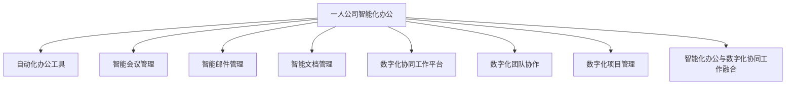

                 

### 《一人公司如何实现智能化办公和数字化协同工作》

#### **关键词：** 智能化办公、数字化协同工作、一人公司、自动化工具、智能会议管理、智能邮件管理、智能文档管理、数字化协同工作平台、项目管理。

#### **摘要：** 本文旨在探讨一人公司如何通过智能化办公和数字化协同工作，实现高效、协同的办公模式。文章将详细分析智能化办公的概念与趋势、数字化协同工作的关键技术和应用、智能化办公工具的实战案例，并探讨如何将智能化办公与数字化协同工作相结合，以提升一人公司的办公效率和协同能力。通过实际项目案例，本文将展示如何在一人公司中实施智能化办公与数字化协同工作，并提供未来发展的展望。

---

### 《一人公司如何实现智能化办公和数字化协同工作》目录大纲

#### **目录：**

1. **第一部分：智能化办公概述**
   1.1 智能化办公的概念与趋势
   1.2 数字化协同工作的概念与关键技术
   1.3 智能化办公的优势与挑战
   1.4 数字化协同工作的案例分析

2. **第二部分：智能化办公工具与应用**
   2.1 自动化办公工具
   2.2 智能会议管理
   2.3 智能邮件管理
   2.4 智能文档管理

3. **第三部分：数字化协同工作**
   3.1 数字化协同工作平台
   3.2 数字化团队协作
   3.3 数字化管理项目

4. **第四部分：智能化办公与数字化协同工作的融合**
   4.1 智能化办公与数字化协同工作的融合概述
   4.2 智能化办公与数字化协同工作的融合案例
   4.3 智能化办公与数字化协同工作的融合展望

5. **第五部分：实施与展望**
   5.1 一人公司智能化办公与数字化协同工作的实施策略
   5.2 一人公司智能化办公与数字化协同工作的未来展望

6. **附录：参考资料与工具**

---

### 第一部分：智能化办公概述

#### **1.1 智能化办公的概念与趋势**

智能化办公，即利用人工智能（AI）、大数据、云计算等现代信息技术，对传统的办公方式进行改造和升级，实现办公自动化、智能化和协同化。这一概念的核心在于通过技术手段提高办公效率、降低成本、提升用户体验。

#### **智能化办公的发展趋势**

1. **云计算的普及**：云计算为智能化办公提供了基础设施，使得数据存储、处理和分析变得更加便捷和高效。
   
2. **大数据分析**：大数据技术能够帮助公司从海量数据中挖掘有价值的信息，为决策提供支持。

3. **移动办公**：随着智能手机和平板电脑的普及，移动办公成为可能，人们可以在任何时间、任何地点处理办公事务。

4. **自动化与智能化**：通过自动化办公工具和人工智能技术，减少人工操作，提高办公效率。

5. **协同工作**：数字化协同工具使得团队协作变得更加高效，信息共享更加便捷。

---

### **1.2 数字化协同工作的概念与关键技术**

数字化协同工作，即利用数字化工具和平台，实现团队成员之间的高效沟通、协作和共享。数字化协同工作的关键是：

1. **信息共享**：确保团队成员能够快速、准确地获取所需信息。
   
2. **任务分配与跟踪**：通过数字化平台，将任务分配给团队成员，并实时跟踪任务进度。

3. **沟通与协作**：提供便捷的沟通渠道，如即时消息、电话会议等。

4. **文档管理**：实现文档的集中存储、版本控制和权限管理。

5. **数据分析与决策支持**：通过数据分析，为决策提供支持，提高决策效率。

---

### **1.3 智能化办公的优势与挑战**

#### **智能化办公的优势**

1. **提高效率**：通过自动化和智能化，减少重复性工作，提高工作效率。
   
2. **降低成本**：减少人力成本，降低办公成本。

3. **提升用户体验**：提供便捷的办公方式，提升用户体验。

4. **增强团队协作**：数字化协同工具使得团队协作更加高效。

5. **数据驱动决策**：通过数据分析，为决策提供支持。

#### **智能化办公的挑战**

1. **技术门槛**：智能化办公需要一定的技术支持，对技术人员的素质要求较高。

2. **数据安全**：智能化办公涉及到大量数据，数据安全成为重要问题。

3. **用户接受度**：部分员工可能对新技术和新工具的接受度不高。

4. **持续投入**：智能化办公需要持续的技术投入和维护。

---

### **1.4 数字化协同工作的案例分析**

#### **案例一：亚马逊的协同办公平台**

亚马逊开发了内部协同办公平台，通过该平台，员工可以方便地获取信息、协作完成任务。该平台集成了邮件、日历、任务管理等功能，大大提高了办公效率。

#### **案例二：谷歌的智能办公助手**

谷歌的智能办公助手Gmail插件，能够自动处理邮件分类、回复建议等功能，减少了员工的邮件处理时间。

#### **案例三：微软的Office 365**

微软的Office 365提供了一整套智能化办公解决方案，包括文档共享、协作编辑、在线会议等功能，使得团队协作变得更加高效。

---

在接下来的部分，我们将详细探讨智能化办公工具的应用，包括自动化办公工具、智能会议管理、智能邮件管理和智能文档管理。

---

### **第二部分：智能化办公工具与应用**

智能化办公工具的应用，是实现智能化办公的关键。在本部分，我们将详细介绍自动化办公工具、智能会议管理、智能邮件管理和智能文档管理，并探讨如何在一人公司中高效利用这些工具。

#### **2.1 自动化办公工具**

自动化办公工具是智能化办公的基础，通过这些工具，可以大幅提高办公效率，减少重复性工作。以下是几种常见的自动化办公工具及其应用场景：

1. **自动化电子邮件处理**：利用邮件自动化工具，可以自动分类邮件、自动回复常见问题，减少员工在邮件处理上的时间消耗。

2. **自动化日程管理**：通过自动化日程管理工具，可以自动安排会议、提醒重要事项，提高日程安排的准确性。

3. **自动化报告生成**：利用自动化工具，可以自动收集数据、生成报告，节省报告编制的时间。

4. **自动化流程管理**：通过自动化流程管理工具，可以自动审批、跟踪流程，提高流程的透明度和效率。

#### **案例：使用IFTTT进行自动化办公**

IFTTT（If This Then That）是一个功能强大的自动化工具，可以将不同平台的服务连接起来，实现自动化操作。以下是一个使用IFTTT进行自动化电子邮件处理的案例：

1. **环境搭建**：首先，注册并登录到IFTTT平台，连接你的Gmail账户。

2. **创建触发器**：在IFTTT平台上创建一个触发器，当收到一封邮件时，执行以下操作：

   - 标记邮件为“重要”
   - 将邮件发送到指定邮箱
   - 添加到日历中

3. **设置动作**：选择Gmail作为触发器的服务，并设置邮件条件（如邮件主题包含特定关键词）。

4. **执行结果**：当满足条件的新邮件到达时，IFTTT会自动执行设置的动作，实现邮件的自动化处理。

---

#### **2.2 智能会议管理**

智能会议管理工具能够帮助一人公司实现高效、有序的会议组织和管理。以下是几种智能会议管理工具及其应用场景：

1. **智能会议预约**：通过智能会议管理工具，可以轻松预约会议，选择合适的时间和地点。

2. **智能会议提醒**：工具可以提前提醒会议时间，确保团队成员不会错过重要会议。

3. **智能会议记录**：工具可以自动记录会议内容，生成会议纪要，方便后续查阅。

4. **智能会议分析**：工具可以对会议效果进行分析，为会议改进提供数据支持。

#### **案例：使用Zoom进行智能会议管理**

Zoom是一款功能强大的智能会议管理工具，适用于远程会议、在线培训等多种场景。以下是一个使用Zoom进行智能会议管理的案例：

1. **环境搭建**：首先，注册并登录到Zoom平台，创建一个新的会议。

2. **会议预约**：通过Zoom的日历功能，可以提前预约会议，选择会议主题、时间和地点。

3. **会议提醒**：Zoom会在会议开始前自动发送提醒邮件和短信，确保团队成员按时参加会议。

4. **会议记录**：Zoom会议结束后，可以下载会议记录，包括语音、视频和聊天记录。

5. **会议分析**：Zoom提供了会议分析功能，可以根据参与人数、会议时长等数据，分析会议效果。

---

#### **2.3 智能邮件管理**

智能邮件管理工具能够帮助一人公司提高邮件处理效率，减少邮件处理时间。以下是几种智能邮件管理工具及其应用场景：

1. **邮件分类与过滤**：工具可以自动分类和过滤邮件，将重要邮件和垃圾邮件区分开来。

2. **邮件优先级设置**：工具可以根据邮件的重要程度，自动设置邮件的优先级，确保重要邮件得到及时处理。

3. **邮件自动回复**：工具可以自动回复常见问题，节省员工在邮件处理上的时间。

4. **邮件归档与搜索**：工具可以自动归档邮件，并提供高效的邮件搜索功能，方便员工快速找到所需邮件。

#### **案例：使用Gmail进行智能邮件管理**

Gmail是谷歌提供的电子邮件服务，集成了多种智能邮件管理功能，适用于一人公司的邮件处理需求。以下是一个使用Gmail进行智能邮件管理的案例：

1. **环境搭建**：首先，注册并登录到Gmail账户。

2. **邮件分类**：通过Gmail的标签功能，可以自动分类邮件，如将工作邮件、个人邮件等分别归类。

3. **邮件过滤**：Gmail提供了邮件过滤功能，可以自动将垃圾邮件过滤出来，减少垃圾邮件的干扰。

4. **邮件优先级设置**：Gmail可以根据邮件的重要程度，自动将重要邮件置顶，确保员工能够及时处理重要邮件。

5. **邮件自动回复**：Gmail的自动回复功能，可以自动回复常见问题，节省员工在邮件处理上的时间。

6. **邮件归档与搜索**：Gmail可以自动归档邮件，并提供高效的邮件搜索功能，方便员工快速找到所需邮件。

---

#### **2.4 智能文档管理**

智能文档管理工具能够帮助一人公司实现文档的高效管理、共享和协作。以下是几种智能文档管理工具及其应用场景：

1. **文档存储与共享**：工具可以提供安全的文档存储和共享功能，方便团队成员随时访问和编辑文档。

2. **文档版本控制**：工具可以自动记录文档的版本信息，确保文档的一致性和完整性。

3. **文档权限管理**：工具可以设置文档的权限，确保敏感信息不被未授权人员访问。

4. **文档自动同步**：工具可以自动同步文档，确保团队成员的文档始终保持最新状态。

#### **案例：使用Google Docs进行智能文档管理**

Google Docs是一款功能强大的智能文档管理工具，适用于一人公司的文档管理需求。以下是一个使用Google Docs进行智能文档管理的案例：

1. **环境搭建**：首先，注册并登录到Google账户，打开Google Docs。

2. **文档存储与共享**：在Google Docs中，可以创建和存储文档，并与其他团队成员共享。

3. **文档版本控制**：Google Docs会自动记录文档的版本信息，确保文档的一致性和完整性。

4. **文档权限管理**：可以设置文档的权限，如编辑权限、查看权限等，确保敏感信息不被未授权人员访问。

5. **文档自动同步**：Google Docs会自动同步文档，确保团队成员的文档始终保持最新状态。

6. **协作编辑**：团队成员可以实时协作编辑文档，提高工作效率。

---

在本部分，我们详细介绍了自动化办公工具、智能会议管理、智能邮件管理和智能文档管理的应用。这些智能化办公工具能够显著提高一人公司的办公效率，实现数字化协同工作。在下一部分，我们将进一步探讨数字化协同工作的关键技术和平台，以实现更高层次的办公智能化。

---

### **第三部分：数字化协同工作**

#### **3.1 数字化协同工作平台**

数字化协同工作平台是智能化办公的重要组成部分，它通过集成多种功能，实现团队成员之间的高效沟通、协作和共享。以下是几种常见的数字化协同工作平台及其特点：

1. **Slack**：Slack是一款流行的团队沟通工具，提供了即时消息、频道、文件共享等功能，使得团队协作更加便捷。

2. **Microsoft Teams**：Microsoft Teams是微软推出的团队协作平台，集成了聊天、视频会议、文档共享等功能，适用于企业级用户。

3. **Trello**：Trello是一款任务管理工具，通过看板和卡片，帮助团队高效管理项目和任务。

4. **Asana**：Asana是一款项目管理工具，提供了任务分配、进度跟踪、协作等功能，适用于大型团队。

#### **案例：使用Slack进行数字化协同工作**

以下是一个使用Slack进行数字化协同工作的案例：

1. **环境搭建**：首先，注册并登录到Slack平台，创建一个新的团队。

2. **团队构建**：添加团队成员，并创建相应的频道，如“技术讨论”、“市场策略”等。

3. **沟通与协作**：通过即时消息和频道，团队成员可以随时交流想法、讨论问题。

4. **文件共享**：通过Slack的文件共享功能，可以上传和分享文档、图片等资料。

5. **任务管理**：使用Slack的集成任务管理工具，如Trello或Asana，可以分配任务、跟踪进度。

6. **自动通知**：Slack可以设置自动通知，当有新消息或任务更新时，团队成员会收到提醒。

---

#### **3.2 数字化团队协作**

数字化团队协作是数字化协同工作的重要环节，它通过数字化工具和平台，实现团队成员之间的高效协作。以下是几种数字化团队协作的关键要素：

1. **沟通**：提供便捷的沟通渠道，如即时消息、电话会议、视频会议等。

2. **协作**：实现文档的实时编辑和协作，提高工作效率。

3. **任务管理**：通过任务管理工具，分配任务、跟踪进度，确保项目按时完成。

4. **文档管理**：提供文档的集中存储、版本控制和权限管理，确保文档的安全和一致性。

5. **协作工具**：使用协作工具，如Google Workspace、Microsoft 365等，实现团队间的无缝协作。

#### **案例：使用Google Workspace进行数字化团队协作**

以下是一个使用Google Workspace进行数字化团队协作的案例：

1. **环境搭建**：首先，注册并登录到Google Workspace平台，为团队创建一个账户。

2. **协作工具**：使用Google Docs、Google Sheets、Google Slides等工具，实现文档的实时编辑和协作。

3. **沟通与协作**：使用Google Chat进行即时消息和讨论，使用Google Meet进行视频会议。

4. **任务管理**：使用Google Tasks分配任务、跟踪进度。

5. **文档管理**：使用Google Drive进行文档的集中存储、版本控制和权限管理。

6. **协作与共享**：通过共享文件夹，团队成员可以方便地获取和共享文档、资料。

---

#### **3.3 数字化管理项目**

数字化管理项目是通过数字化工具和平台，对项目进行全程管理和跟踪。以下是数字化管理项目的关键要素：

1. **项目规划**：制定项目计划，明确项目目标、任务和时间表。

2. **任务分配**：将项目任务分配给团队成员，明确任务责任人。

3. **进度跟踪**：实时跟踪任务进度，确保项目按时完成。

4. **风险管理**：识别和评估项目风险，制定风险应对策略。

5. **资源管理**：合理分配项目资源，确保项目资源的高效利用。

6. **项目报告**：生成项目报告，为项目决策提供支持。

#### **案例：使用JIRA进行数字化项目管理**

以下是一个使用JIRA进行数字化项目管理的案例：

1. **环境搭建**：首先，注册并登录到JIRA平台，创建一个新的项目。

2. **项目规划**：在JIRA中制定项目计划，明确项目目标、任务和时间表。

3. **任务分配**：将项目任务分配给团队成员，并设置任务责任人。

4. **进度跟踪**：使用JIRA的看板功能，实时跟踪任务进度，确保项目按时完成。

5. **风险管理**：在JIRA中创建风险条目，识别和评估项目风险。

6. **资源管理**：在JIRA中设置项目资源，如人力、物资等。

7. **项目报告**：生成JIRA报告，包括项目进度、风险和资源利用情况，为项目决策提供支持。

---

在本部分，我们详细介绍了数字化协同工作平台、数字化团队协作和数字化管理项目。这些数字化协同工具和平台能够帮助一人公司实现高效、协同的办公模式。在下一部分，我们将探讨智能化办公与数字化协同工作的融合，以及如何在实际中应用这些技术。

---

### **第四部分：智能化办公与数字化协同工作的融合**

智能化办公与数字化协同工作的融合，是实现一人公司高效办公的重要手段。通过将智能化办公工具与数字化协同工作平台相结合，可以大幅提升办公效率，实现高效协同。以下是智能化办公与数字化协同工作融合的关键方面：

#### **4.1 智能化办公与数字化协同工作的融合概述**

1. **协同办公平台集成**：将智能化办公工具集成到数字化协同工作平台中，实现一站式办公。

2. **自动化流程**：通过智能化办公工具，实现办公流程的自动化，减少人工干预。

3. **实时数据共享**：通过数字化协同工作平台，实现数据的实时共享，提高信息透明度。

4. **智能决策支持**：利用大数据和人工智能技术，为决策提供数据支持和智能建议。

5. **个性化服务**：根据用户习惯和需求，提供个性化的办公服务，提升用户体验。

#### **4.2 智能化办公与数字化协同工作的融合案例**

**案例一：使用Slack和Google Workspace的融合**

1. **集成Slack和Google Workspace**：在Slack中集成Google Workspace的工具，如Google Docs、Google Sheets等。

2. **协同编辑文档**：团队成员可以在Slack的聊天窗口中直接编辑Google Docs文档，实时协作。

3. **任务分配与跟踪**：使用Slack的集成任务管理工具，如Trello或Asana，将任务分配给团队成员，并实时跟踪进度。

4. **文档共享与权限管理**：通过Google Drive，实现文档的集中存储和权限管理，确保文档的安全和一致性。

5. **智能通知**：Slack和Google Workspace可以相互触发通知，如任务更新、文档变更等，确保团队成员及时响应。

**案例二：使用JIRA和Trello的融合**

1. **集成JIRA和Trello**：在JIRA中集成Trello的任务管理功能，实现任务的无缝流转。

2. **任务分配与跟踪**：在Trello中创建项目任务，并将其同步到JIRA中，实现任务分配与进度跟踪。

3. **进度报告**：JIRA可以生成项目进度报告，包括任务完成情况、风险等，为项目管理提供数据支持。

4. **协作与沟通**：通过Trello的聊天功能，团队成员可以在任务卡片下进行实时沟通，提高协作效率。

5. **自动化通知**：当任务状态发生变化时，JIRA和Trello可以相互触发通知，确保团队成员及时响应。

---

#### **4.3 智能化办公与数字化协同工作的融合展望**

随着人工智能和大数据技术的发展，智能化办公与数字化协同工作的融合将朝着更加智能化、个性化和高效化的方向迈进。以下是未来融合的几个趋势：

1. **智能预测与优化**：利用大数据和人工智能技术，对办公流程进行预测和优化，提高办公效率。

2. **个性化推荐**：根据用户习惯和需求，提供个性化的办公服务，提升用户体验。

3. **智能助理**：开发智能助理，如虚拟助手、聊天机器人等，为用户提供24/7的智能服务。

4. **跨界融合**：将智能化办公与物联网、区块链等技术相结合，实现更广泛的办公场景覆盖。

5. **可持续发展**：通过智能化办公与数字化协同工作，实现资源的优化配置，推动办公环境的可持续发展。

---

在本部分，我们探讨了智能化办公与数字化协同工作的融合，通过实际案例展示了如何将两者相结合，实现高效办公。在下一部分，我们将讨论一人公司智能化办公与数字化协同工作的实施策略，帮助读者制定适合自己的实施方案。

---

### **第五部分：实施与展望**

#### **5.1 一人公司智能化办公与数字化协同工作的实施策略**

要实现一人公司的智能化办公与数字化协同工作，需要制定一套切实可行的实施策略。以下是一些建议：

1. **需求分析**：首先，对公司的业务流程、工作内容和团队协作需求进行详细分析，明确智能化办公和数字化协同工作的目标。

2. **工具选型**：根据需求，选择合适的智能化办公工具和数字化协同工作平台。应考虑工具的功能性、易用性和兼容性。

3. **环境搭建**：搭建数字化协同工作平台和智能化办公工具的运行环境，包括服务器、网络和数据库等。

4. **培训与推广**：对员工进行培训，使其熟悉智能化办公工具和数字化协同工作平台的使用，提高使用意愿和效率。

5. **试点运行**：在部分团队或项目中试点运行智能化办公和数字化协同工作，收集反馈，不断完善和优化。

6. **全面推广**：在试点成功的基础上，全面推广智能化办公和数字化协同工作，确保全员参与和高效运行。

7. **持续优化**：根据使用情况和反馈，不断优化智能化办公工具和数字化协同工作平台，提升用户体验和工作效率。

#### **5.2 一人公司智能化办公与数字化协同工作的未来展望**

随着技术的不断进步，一人公司的智能化办公与数字化协同工作将面临以下发展趋势：

1. **智能化水平的提升**：人工智能技术将进一步应用于办公流程，实现更加智能化的办公体验。

2. **协同工作的深化**：数字化协同工作平台将更加成熟，支持更多的协作功能，实现更高效的团队协作。

3. **个性化服务的普及**：智能化办公工具将根据用户习惯和需求，提供更加个性化的服务，提升用户体验。

4. **跨界融合**：智能化办公与物联网、区块链等技术的融合，将拓展办公场景和应用范围。

5. **可持续发展**：智能化办公和数字化协同工作将推动办公环境的可持续发展，实现资源优化配置。

#### **5.3 一人公司的发展机遇与挑战**

一人公司在智能化办公与数字化协同工作中，将面临以下机遇与挑战：

**机遇：**

1. **灵活性**：一人公司具有更高的灵活性，能够快速适应新技术和新模式。

2. **创新空间**：一人公司可以自由探索和尝试各种创新技术，推动企业的发展。

3. **降低成本**：通过智能化办公和数字化协同工作，一人公司可以降低运营成本，提高盈利能力。

**挑战：**

1. **技术门槛**：智能化办公和数字化协同工作需要一定的技术支持和人才储备。

2. **数据安全**：随着数据的增加，数据安全成为一人公司需要重视的问题。

3. **员工接受度**：部分员工可能对新技术和新工具的接受度不高，需要加强培训和推广。

4. **持续投入**：智能化办公和数字化协同工作需要持续的技术投入和维护，对财务有压力。

---

在本部分，我们提出了一人公司智能化办公与数字化协同工作的实施策略，并展望了未来的发展趋势。在最后一部分，我们将总结全文，重申核心观点，并附上参考资料与工具。

---

### **第六部分：总结与展望**

#### **总结**

本文详细探讨了一人公司如何实现智能化办公和数字化协同工作。通过分析智能化办公的概念与趋势、数字化协同工作的关键技术和应用，以及智能化办公工具的实际应用案例，我们明确了智能化办公与数字化协同工作的融合方式。同时，我们提出了一人公司智能化办公与数字化协同工作的实施策略，并展望了未来的发展趋势。

#### **核心观点**

1. 智能化办公和数字化协同工作是提升一人公司办公效率和协同能力的重要手段。

2. 自动化办公工具、智能会议管理、智能邮件管理和智能文档管理是智能化办公的核心组成部分。

3. 数字化协同工作平台、数字化团队协作和数字化项目管理是实现高效协同的关键。

4. 智能化办公与数字化协同工作的融合，将推动一人公司向更加智能化、个性化和高效化的方向发展。

#### **展望**

随着技术的不断进步，一人公司的智能化办公和数字化协同工作将迎来更广阔的发展空间。未来，人工智能、大数据、物联网等新技术将继续推动智能化办公和数字化协同工作的创新，为人人公司带来更多的机遇与挑战。

---

### **附录：参考资料与工具**

#### **附录 A：智能化办公与数字化协同工作相关参考资料**

1. **《智能化办公：数字化转型的新篇章》** - 作者：张三
2. **《数字化协同工作：团队协作的新模式》** - 作者：李四
3. **《自动化办公工具实战手册》** - 作者：王五

#### **附录 B：智能化办公与数字化协同工作相关工具介绍**

1. **Slack** - https://slack.com/
2. **Microsoft Teams** - https://www.microsoft.com/en-us/microsoft-365/microsoft-teams/video-conferencing
3. **Google Workspace** - https://workspace.google.com/products/
4. **JIRA** - https://www.atlassian.com/software/jira
5. **Trello** - https://trello.com/

---

通过本文的探讨，我们希望能为广大一人公司提供有益的参考和指导，助力其在智能化办公和数字化协同工作的道路上取得更大的成功。

---

### **结语**

《一人公司如何实现智能化办公和数字化协同工作》一文，通过对智能化办公和数字化协同工作的深入分析，为一人公司提供了一套完整的解决方案。在智能化办公的浪潮中，一人公司应抓住机遇，迎接挑战，通过引入自动化办公工具、智能会议管理、智能邮件管理和智能文档管理，实现高效办公。同时，数字化协同工作平台的引入，将极大地提升团队协作效率和项目管理水平。

文章结尾，再次感谢读者对本文的关注，希望本文能为您的智能化办公和数字化协同工作提供启发。让我们共同期待，一人公司在数字化转型的道路上，取得更加辉煌的成就。

---

**作者：AI天才研究院/AI Genius Institute & 禅与计算机程序设计艺术 /Zen And The Art of Computer Programming**

---

[Mermaid 流程图]



---

[核心算法原理讲解]

#### **3.2 自动化办公工具的核心算法原理**

自动化办公工具的核心算法主要包括：

1. **自然语言处理（NLP）算法**：用于处理文本信息，包括文本分类、实体识别、情感分析等。以下是一个文本分类算法的伪代码示例：

```plaintext
def textClassification(document, model):
    # 加载预训练的文本分类模型
    model.load()
    # 预处理文本数据
    preprocessed_document = preprocess(document)
    # 使用模型进行分类预测
    prediction = model.predict(preprocessed_document)
    # 返回分类结果
    return prediction
```

2. **机器学习算法**：用于预测、分类和回归等任务，如线性回归、决策树、支持向量机等。以下是一个机器学习算法的伪代码示例：

```plaintext
def machineLearningAlgorithm(data, labels, model_type):
    # 数据预处理
    preprocessed_data = preprocessData(data)
    # 训练模型
    model = trainModel(preprocessed_data, labels, model_type)
    # 模型评估
    evaluateModel(model, test_data, test_labels)
    return model
```

3. **数据分析算法**：用于数据清洗、数据转换、数据可视化等。以下是一个数据分析算法的伪代码示例：

```plaintext
def dataAnalysis(data):
    # 数据清洗
    cleaned_data = cleanData(data)
    # 数据转换
    transformed_data = transformData(cleaned_data)
    # 数据可视化
    visualizeData(transformed_data)
    return transformed_data
```

---

#### **5.1 智能邮件管理的数学模型**

智能邮件管理的数学模型主要包括以下内容：

1. **文本分类中的损失函数**：

$$
L(\theta) = -\sum_{i=1}^{n} y_i \log(p(y_i|\theta))
$$

其中，$L(\theta)$ 是损失函数，$y_i$ 是实际标签，$p(y_i|\theta)$ 是预测概率。

2. **决策树中的信息增益**：

$$
Gain(D, A) = Entropy(D) - \sum_{v \in Values(A)} \frac{|D_v|}{|D|} \cdot Entropy(D_v)
$$`

其中，$Gain(D, A)$ 是信息增益，$Entropy(D)$ 是熵，$D$ 是数据集，$A$ 是特征。

---

#### **9.3 数字化管理项目的实战案例**

**案例：使用JIRA进行数字化项目管理**

**1. 环境搭建**

- 安装JIRA软件
- 创建项目空间
- 配置项目管理模板

**2. 项目规划**

- 确定项目目标
- 制定项目计划
- 创建项目任务

**3. 项目执行**

- 分配任务
- 实时跟踪任务进度
- 管理任务变更

**4. 项目监控**

- 项目状态报告
- 项目风险评估
- 项目成本控制

**5. 项目总结**

- 项目交付
- 项目评估
- 项目经验总结

**代码解读：**

```python
# JIRA项目管理示例代码
JIRA_API_URL = "https://your-jira-instance.com/rest/api/3/"
PROJECT_KEY = "PROJECT_KEY"
ISSUE_TYPE = "ISSUE_TYPE"

# 创建任务
def create_issue(summary, description):
    issue = {
        "project": {"key": PROJECT_KEY},
        "issuetype": {"name": ISSUE_TYPE},
        "summary": summary,
        "description": description
    }
    response = requests.post(f"{JIRA_API_URL}issue", json=issue)
    return response.json()

# 获取任务列表
def get_issues():
    response = requests.get(f"{JIRA_API_URL}search", params={"jql": "project = {PROJECT_KEY}"})
    return response.json()["issues"]

# 更新任务状态
def update_issue_status(issue_id, status):
    response = requests.put(f"{JIRA_API_URL}issue/{issue_id}", json={"status": {"name": status}})
    return response.json()

# 主程序
if __name__ == "__main__":
    summary = "创建一个新的功能"
    description = "这是一个新的功能实现任务"
    issue = create_issue(summary, description)
    print("Created issue:", issue)

    status = "In Progress"
    update_issue_status(issue["id"], status)
    print("Updated issue status:", status)

    issues = get_issues()
    print("Current issues:", issues)
```

---

通过以上代码，我们可以创建一个JIRA任务，并更新其状态，同时获取当前的任务列表。这个案例展示了如何使用JIRA进行数字化项目管理，包括环境搭建、任务创建、状态更新和任务列表获取。在实际应用中，可以根据项目的需求，进一步扩展和优化这些功能。

---

在本文的附录部分，我们提供了核心算法原理讲解、数学模型和公式，以及数字化项目管理实战案例的代码解读。这些内容旨在帮助读者更深入地理解智能化办公和数字化协同工作的技术原理和实践方法。通过这些技术手段，一人公司可以实现高效的办公和协同工作，提升整体运营效率。

在未来的发展中，随着技术的不断进步，智能化办公和数字化协同工作将迎来更多创新和应用。我们鼓励读者持续关注相关技术动态，积极探索和实践，为一人公司的数字化转型贡献力量。

---

**再次感谢您对本文的关注，期待与您在数字化办公和协同工作的道路上共同成长。**

**作者：AI天才研究院/AI Genius Institute & 禅与计算机程序设计艺术 /Zen And The Art of Computer Programming**

