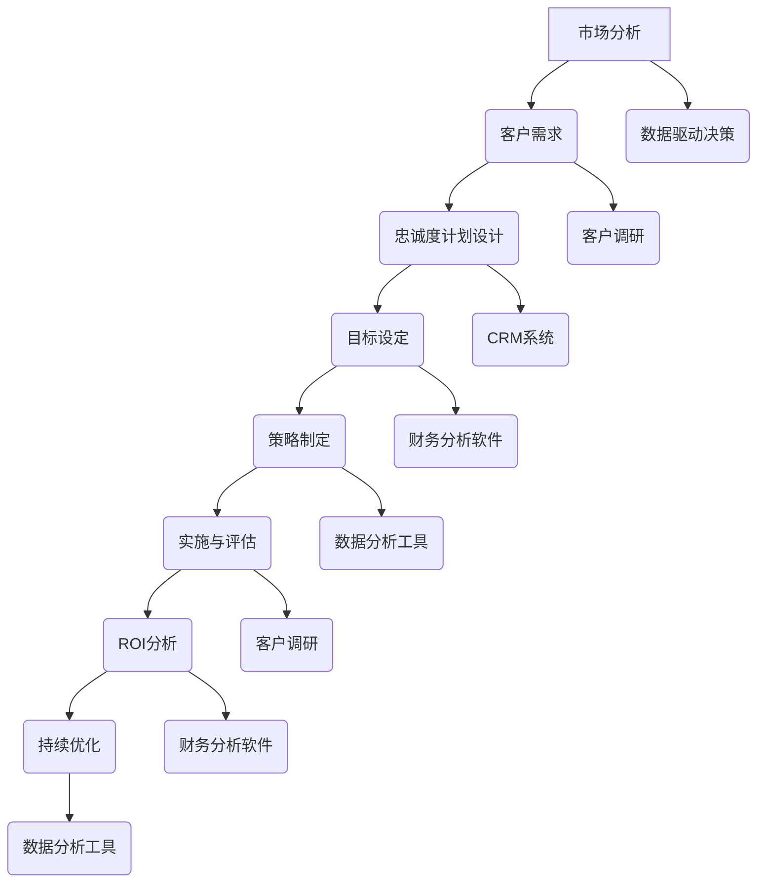

                 

# 《一人公司的客户忠诚度计划设计与ROI分析》

## 引言

在当今竞争激烈的市场环境中，客户忠诚度成为了企业成功的关键因素之一。对于一人公司而言，由于其规模和资源限制，如何设计有效的客户忠诚度计划显得尤为重要。本文旨在探讨一人公司客户忠诚度计划的设计与ROI分析，帮助读者理解客户忠诚度的重要性和设计原则，并通过具体案例和实践方法来指导读者实施和优化客户忠诚度计划。

文章将分为三个主要部分。第一部分将介绍客户忠诚度的概念、重要性以及驱动因素，为读者建立对客户忠诚度的基本认识。第二部分将深入探讨客户忠诚度计划的设计，包括目标设定、设计策略和实施评估。第三部分将重点分析客户忠诚度计划的ROI，并提供优化策略和持续改进的方法。

通过本文的阅读，读者将能够：
1. 理解客户忠诚度的核心概念和重要性。
2. 掌握设计有效客户忠诚度计划的方法和步骤。
3. 学会通过ROI分析来评估客户忠诚度计划的效果。
4. 获取实施和优化客户忠诚度计划的最佳实践。

## 第一部分：客户忠诚度概述

### 第1章：客户忠诚度的概念与重要性

#### 1.1 客户忠诚度的定义

客户忠诚度是指客户在重复购买、推荐给他人以及持续使用某一品牌或产品上的倾向。它不仅反映了一个客户对于某一品牌的偏好，更是一个品牌能否持续发展的关键因素。客户忠诚度通常包括以下三个方面：

1. **重复购买**：客户在一段时间内持续购买同一品牌或产品，表明他们对产品具有较高的满意度。
2. **推荐意愿**：客户愿意向他人推荐品牌或产品，这表明他们对品牌有较高的信任度和满意度。
3. **持久性**：客户在较长的时间内持续选择同一品牌，而不是转向其他品牌，体现了品牌在客户心中的重要地位。

#### 1.2 客户忠诚度的重要性

客户忠诚度对企业的重要性不言而喻。以下是客户忠诚度对企业和市场的一些关键影响：

1. **增加收入**：忠诚客户往往会购买更多产品，从而带动销售额的增长。此外，他们的推荐行为也会吸引新客户，进一步扩大收入来源。
2. **降低营销成本**：忠诚客户通常不需要频繁的营销和促销活动就能保持购买，从而降低了企业的营销成本。
3. **提升品牌形象**：忠诚客户对品牌具有较高的信任度，他们的正面评价有助于提升品牌形象，吸引更多潜在客户。
4. **增强市场竞争力**：在竞争激烈的市场中，拥有高忠诚度的客户群体可以帮助企业更好地抵御竞争对手的冲击。

#### 1.3 客户忠诚度与业务增长的关系

客户忠诚度与业务增长密切相关。以下是一些具体的关系：

1. **客户保留率**：高忠诚度客户往往具有较低的流失率，这意味着客户保留率较高，有利于企业的长期稳定发展。
2. **口碑传播**：忠诚客户通过口碑传播为企业带来新的客户，有助于提高市场份额和品牌知名度。
3. **差异化竞争**：在竞争激烈的市场中，客户忠诚度成为企业的一大差异化优势，有助于企业在市场中脱颖而出。
4. **创新能力**：忠诚客户对企业的反馈有助于企业不断改进产品和服务，提高市场竞争力。

### 第2章：客户忠诚度的驱动因素

#### 2.1 产品与服务质量

产品与服务质量是客户忠诚度的核心驱动因素之一。高质量的产品和服务能够满足客户的需求，提高客户的满意度，从而增强客户忠诚度。以下是产品与服务质量对客户忠诚度的影响：

1. **功能性**：产品功能是否满足客户的期望，直接影响客户的满意度。
2. **可靠性**：产品是否能够稳定运行，不会出现故障或问题。
3. **用户体验**：服务过程是否便捷、高效，客户的体验感受对客户忠诚度有显著影响。
4. **售后支持**：良好的售后支持能够解决客户的问题和疑虑，提高客户满意度。

#### 2.2 客户体验

客户体验是客户在购买和使用产品过程中的整体感受。良好的客户体验能够增强客户的满意度，提高客户忠诚度。以下是客户体验对客户忠诚度的影响：

1. **购买过程的便利性**：客户在购买过程中的便捷性直接影响他们的购买决策。
2. **互动质量**：企业与客户的互动质量，包括客服响应速度、解决问题的能力等，都会影响客户满意度。
3. **品牌一致性**：品牌在不同渠道上的一致性，如产品外观、服务态度等，会影响客户对品牌的整体印象。
4. **个性化服务**：针对客户的个性化需求提供定制化的服务，能够提高客户的满意度。

#### 2.3 客户关系管理

客户关系管理（CRM）是维护客户忠诚度的关键手段。通过有效的CRM策略，企业能够更好地了解客户需求，提供个性化的服务和解决方案。以下是客户关系管理对客户忠诚度的影响：

1. **客户数据分析**：通过分析客户数据，了解客户的行为和偏好，从而提供更加个性化的服务。
2. **及时沟通**：与客户保持及时沟通，了解客户反馈，解决问题，提高客户满意度。
3. **忠诚度奖励**：通过忠诚度奖励计划，激励客户继续购买，增强客户忠诚度。
4. **客户参与**：鼓励客户参与产品开发和改进，提高客户的参与感和归属感。

#### 2.4 市场竞争环境

市场竞争环境对客户忠诚度也有重要影响。在竞争激烈的市场中，企业需要采取更多措施来提高客户忠诚度。以下是市场竞争环境对客户忠诚度的影响：

1. **差异化竞争**：在竞争激烈的市场中，通过产品差异化和服务差异化来提高客户忠诚度。
2. **品牌定位**：明确品牌定位，塑造独特的品牌形象，有助于提高客户忠诚度。
3. **创新与改进**：不断进行产品创新和服务改进，以保持竞争优势，提高客户满意度。
4. **客户洞察**：了解竞争对手的客户策略，针对性地调整自己的客户忠诚度计划。

通过以上分析，我们可以看出，客户忠诚度是企业成功的关键因素，而产品与服务质量、客户体验、客户关系管理以及市场竞争环境都是影响客户忠诚度的重要因素。在下一部分中，我们将深入探讨如何设计有效的客户忠诚度计划。

## 第二部分：客户忠诚度计划设计

### 第3章：客户忠诚度计划的目标设定

#### 3.1 设定目标的重要性

在制定客户忠诚度计划时，明确目标至关重要。设定清晰、可行的目标不仅能够指导整个计划的设计与实施，还能为后续的评估和优化提供依据。以下是设定目标的重要性：

1. **明确方向**：目标设定有助于明确企业的发展方向和战略重点，使全体员工对客户忠诚度计划有共同的理解和认同。
2. **衡量效果**：通过设定具体的目标，可以量化和评估客户忠诚度计划的实施效果，为持续改进提供依据。
3. **资源配置**：明确的目标有助于企业合理分配资源，确保客户忠诚度计划得到足够的支持和投入。
4. **激励员工**：明确的目标能够激励员工为实现这些目标而努力，提高员工的工作积极性和成就感。

#### 3.2 目标设定的原则与方法

为了确保目标设定既合理又具有可操作性，企业应当遵循以下原则和方法：

1. **SMART原则**：SMART原则是一种常用的目标设定方法，它要求目标具备以下五个特点：具体（Specific）、可衡量（Measurable）、可实现（Achievable）、相关（Relevant）和有时限（Time-bound）。
   - **具体**：目标应当明确、具体，避免模糊不清。
   - **可衡量**：目标应当能够量化，以便进行评估。
   - **可实现**：目标应当基于企业当前的资源和能力，确保能够实现。
   - **相关**：目标应当与企业的整体战略和目标保持一致。
   - **有时限**：目标应当设定一个明确的时间范围，以便在特定时间内实现。

2. **基于数据分析**：通过分析客户数据和市场数据，了解客户行为和需求，从而设定有针对性的目标。例如，可以根据客户的购买频率、购买金额等指标，设定提高客户重复购买率和增加平均订单价值的目标。

3. **与员工沟通**：在设定目标时，应当与员工进行充分的沟通和讨论，确保目标得到员工的理解和支持。这有助于提高员工的参与感和执行力。

4. **逐步实现**：在设定目标时，可以将其分解为短期目标和长期目标，逐步实现。这有助于企业更好地掌握实施进度，及时调整策略。

#### 3.3 目标的具体实现路径

为了实现设定的目标，企业需要制定具体的实现路径和策略。以下是几个关键步骤：

1. **制定行动计划**：根据设定的目标，制定详细的行动计划，包括具体的任务、负责人、时间节点等。这将有助于确保目标的实现。
2. **资源分配**：确保客户忠诚度计划所需的资源得到合理配置，包括人力资源、财务资源、技术资源等。
3. **培训与激励**：为员工提供培训和支持，提高他们的技能和知识水平，同时设立激励机制，鼓励员工为实现目标而努力。
4. **监控与评估**：建立监控和评估机制，定期检查实施进度，评估目标实现情况，并根据实际情况进行调整和优化。

通过以上步骤，企业可以确保客户忠诚度计划目标的顺利实现，从而提高客户的满意度和忠诚度，推动业务持续增长。

### 第4章：客户忠诚度计划的设计策略

#### 4.1 确定忠诚度计划的核心策略

设计有效的客户忠诚度计划需要明确核心策略，以确保计划的实施能够达到预期效果。以下是几个关键策略：

1. **差异化策略**：在竞争激烈的市场中，通过提供独特的客户价值来吸引和留住客户。差异化策略可以体现在产品、服务、价格、品牌形象等多个方面。
   - **产品差异化**：提供具有独特功能或设计的产品，以满足客户特定的需求。
   - **服务差异化**：提供高质量、个性化的服务，提高客户的满意度。
   - **价格差异化**：根据客户需求和购买力，提供不同的价格策略。

2. **关系策略**：通过建立和加强企业与客户之间的关系，提高客户忠诚度。关系策略包括以下方面：
   - **客户关系管理**：建立全面的客户关系管理系统，记录和分析客户数据，提供个性化的服务和解决方案。
   - **客户互动**：通过多种渠道与客户保持互动，了解客户需求和反馈，及时解决问题。
   - **忠诚度奖励**：设立忠诚度奖励计划，激励客户继续购买和推荐。

3. **体验策略**：通过提供卓越的客户体验，增强客户的满意度和忠诚度。体验策略包括：
   - **购买体验**：简化购买流程，提供便捷、高效的购买体验。
   - **售后体验**：提供优质的售后服务，解决客户的问题和疑虑。
   - **参与体验**：鼓励客户参与产品和服务的设计与改进，提高客户的参与感和归属感。

#### 4.2 选择合适的忠诚度工具与手段

为了实现客户忠诚度计划的核心策略，企业需要选择合适的工具与手段。以下是几种常见的忠诚度工具和手段：

1. **积分系统**：通过积分系统激励客户进行重复购买。积分可以用于兑换产品或服务，提高客户的参与度和忠诚度。

2. **会员制度**：设立会员制度，为会员提供专属的优惠和福利，提高客户的忠诚度和满意度。

3. **个性化推荐**：利用大数据和机器学习技术，分析客户的行为和偏好，提供个性化的产品和服务推荐，提高客户的满意度和购买转化率。

4. **客户调研**：定期进行客户调研，了解客户的需求和反馈，优化产品和服务，提高客户满意度。

5. **社交媒体互动**：通过社交媒体与客户进行互动，提高品牌知名度和客户忠诚度。例如，通过社交媒体发布优惠信息、举办互动活动等。

#### 4.3 制定忠诚度计划的具体步骤

为了确保客户忠诚度计划的顺利实施，企业需要制定具体的步骤和计划。以下是几个关键步骤：

1. **调研分析**：通过市场调研和数据分析，了解客户需求和偏好，确定忠诚度计划的目标和核心策略。

2. **方案设计**：根据调研结果，设计具体的忠诚度计划方案，包括积分系统、会员制度、个性化推荐等。

3. **实施准备**：制定实施计划，包括资源分配、人员培训、技术支持等，确保忠诚度计划能够顺利启动。

4. **启动实施**：按照计划逐步实施忠诚度计划，确保各项措施得到有效执行。

5. **监测与评估**：建立监测和评估机制，定期检查忠诚度计划的效果，并根据实际情况进行调整和优化。

6. **持续改进**：通过持续改进，不断优化忠诚度计划，提高客户满意度和忠诚度，推动业务持续增长。

通过以上步骤，企业可以确保客户忠诚度计划的顺利实施，从而提高客户的满意度和忠诚度，实现业务增长。

### 第5章：客户忠诚度计划的实施与评估

#### 5.1 实施前的准备工作

在实施客户忠诚度计划之前，企业需要进行充分的准备工作，以确保计划的顺利启动和有效执行。以下是几个关键准备工作：

1. **需求分析**：通过对市场、客户和竞争对手的分析，了解客户需求和期望，明确忠诚度计划的目标和核心策略。

2. **资源评估**：评估企业当前的人、财、物等资源，确定是否满足忠诚度计划的需求，如需增加资源，应及时进行预算和分配。

3. **人员培训**：对相关员工进行培训，使其了解忠诚度计划的目标、策略和操作流程，提高执行能力。

4. **技术支持**：确保忠诚度计划所需的技术支持到位，如会员管理系统、积分系统等，并进行测试和调试，确保系统稳定可靠。

5. **沟通协调**：与各部门进行沟通协调，确保忠诚度计划得到全员支持，并明确各部门的职责和分工。

6. **风险评估**：识别和评估可能的风险和挑战，制定相应的应对措施，降低风险影响。

#### 5.2 实施过程中的关键点

在实施客户忠诚度计划的过程中，企业需要关注以下几个关键点：

1. **执行力度**：确保各项措施得到严格执行，如积分系统、会员制度的实施，个性化推荐的执行等。

2. **客户参与**：积极引导客户参与忠诚度计划，如通过促销活动、互动游戏等，提高客户的参与度和满意度。

3. **监控与反馈**：建立监控和反馈机制，及时了解忠诚度计划的实施情况，收集客户反馈，针对问题进行优化和调整。

4. **数据管理**：充分利用客户数据，对忠诚度计划的效果进行量化分析，为后续优化提供依据。

5. **灵活调整**：根据市场环境和客户需求的变化，灵活调整忠诚度计划，确保其持续有效。

#### 5.3 评估忠诚度计划的效果

为了评估客户忠诚度计划的效果，企业需要建立科学的评估体系，包括以下几个方面：

1. **关键指标**：设定关键指标，如客户保留率、重复购买率、推荐率、满意度等，作为评估忠诚度计划效果的依据。

2. **数据分析**：通过对客户数据的分析，了解忠诚度计划对客户行为的影响，如重复购买率、推荐率等。

3. **财务分析**：评估忠诚度计划对收入和利润的影响，如重复购买带来的收入增长、推荐客户带来的新增收入等。

4. **客户反馈**：收集客户对忠诚度计划的反馈，了解客户的满意度和忠诚度变化。

5. **综合评价**：结合关键指标、数据分析和客户反馈，对忠诚度计划的效果进行综合评价，识别优势和不足，为后续优化提供依据。

通过以上评估方法，企业可以全面了解客户忠诚度计划的效果，识别问题和不足，及时进行调整和优化，确保忠诚度计划能够持续有效地提高客户满意度和忠诚度，推动业务增长。

### 第6章：案例研究与最佳实践

#### 6.1 成功的案例分享

在客户忠诚度计划的设计与实施中，有许多企业取得了显著的成效。以下是几个成功的案例：

1. **案例一：亚马逊的会员制度**

亚马逊的会员制度（Amazon Prime）是一个非常成功的客户忠诚度计划。通过提供免费的两天配送服务、电子书借阅、音乐流媒体等服务，亚马逊吸引了大量的会员。数据显示，亚马逊的会员客户忠诚度显著高于普通客户，会员的年均购买次数和订单金额都远高于非会员。

成功原因：
- 提供独特的会员权益，满足客户的多样需求。
- 不断优化和更新会员服务，提高会员的满意度和忠诚度。
- 利用大数据分析，精准推荐产品和服务，提升客户的购买体验。

2. **案例二：星巴克的重返客计划**

星巴克的重返客计划（Starbucks Rewards）也是客户忠诚度计划的一个典范。通过会员积分和奖励机制，星巴克成功提高了客户的重复购买率。会员客户在每次消费时都能获得积分，积分可以兑换免费饮品或食品。此外，星巴克还定期推出特别促销活动，吸引会员参与。

成功原因：
- 简单易懂的积分和奖励机制，激励客户积极参与。
- 定期推出特别促销活动，增加客户的参与度和购买欲望。
- 利用客户数据，提供个性化的推荐和服务，提高客户的满意度。

3. **案例三：苹果的客户忠诚计划**

苹果（Apple）在客户忠诚度方面同样有着出色的表现。苹果的客户忠诚计划包括多个方面，如优质售后服务、定期产品更新、个性化的客户体验等。这些措施使得苹果的客户忠诚度保持在较高水平。

成功原因：
- 提供优质的售后服务，解决客户的问题和疑虑。
- 定期推出新产品和更新，满足客户的消费需求。
- 个性化的客户体验，增强客户的归属感和满意度。

#### 6.2 失败的案例分析

尽管客户忠诚度计划有很多成功案例，但也有一些企业未能达到预期效果，甚至失败。以下是几个失败的案例分析：

1. **案例一：某电商平台的积分兑换困难**

某电商平台曾推出积分兑换计划，但客户在使用积分兑换商品时遇到了许多困难，如兑换流程复杂、兑换商品种类有限等。这些问题导致客户对积分兑换计划失去了兴趣，忠诚度计划的效果不佳。

失败原因：
- 积分兑换流程过于复杂，客户使用困难。
- 兑换商品种类和数量有限，无法满足客户的多样化需求。

2. **案例二：某餐饮品牌的会员制度过于苛刻**

某餐饮品牌推出会员制度，但要求客户消费达到一定金额才能成为会员，且会员权益有限。这使得许多客户认为会员制度过于苛刻，失去了成为会员的动力。

失败原因：
- 会员制度门槛过高，限制了客户参与。
- 会员权益不足，无法激发客户的忠诚度。

3. **案例三：某电信公司的客户忠诚度计划缺乏个性化**

某电信公司推出了客户忠诚度计划，但缺乏个性化服务，导致客户感觉缺乏关怀和关注。这使得客户对忠诚度计划失去了兴趣，忠诚度下降。

失败原因：
- 忠诚度计划缺乏个性化，无法满足客户的多样化需求。
- 忽视客户反馈，未能及时调整和优化计划。

#### 6.3 从案例中提炼出的最佳实践

通过以上成功和失败的案例，我们可以总结出一些最佳实践：

1. **简单易懂的积分和奖励机制**：确保积分和奖励机制简单易懂，客户能够轻松参与并享受到权益。

2. **多样化的会员权益**：提供多样化的会员权益，满足不同客户的需求，提高会员的参与度和忠诚度。

3. **个性化服务**：利用大数据和客户数据分析，提供个性化的服务和推荐，增强客户的满意度和忠诚度。

4. **持续优化和更新**：定期优化和更新忠诚度计划，确保其适应市场和客户需求的变化。

5. **有效的客户沟通**：与客户保持有效的沟通，了解客户需求和反馈，及时调整和优化计划。

通过以上最佳实践，企业可以设计出更有效的客户忠诚度计划，提高客户的满意度和忠诚度，推动业务持续增长。

### 第7章：客户忠诚度计划的ROI分析

#### 7.1 ROI分析的概念与意义

ROI（Return on Investment）即投资回报率，是衡量投资收益与投资成本之间关系的一个重要指标。在客户忠诚度计划中，ROI分析有助于评估忠诚度计划的成本效益，确定其是否具有商业可行性。ROI分析的意义在于：

1. **投资决策**：通过ROI分析，企业可以判断客户忠诚度计划的投入是否值得，从而做出明智的投资决策。
2. **绩效评估**：ROI分析可以评估忠诚度计划的实施效果，为后续优化提供数据支持。
3. **资源配置**：ROI分析有助于企业合理分配资源，确保忠诚度计划得到足够的支持和投入。
4. **战略调整**：通过ROI分析，企业可以了解忠诚度计划对业务增长的贡献，从而调整战略方向。

#### 7.2 ROI分析的步骤与方法

进行客户忠诚度计划的ROI分析通常包括以下步骤：

1. **确定ROI公式**：常见的ROI公式为：
   $$
   ROI = \frac{（收入 - 成本）}{成本} \times 100\%
   $$
   其中，收入包括忠诚度计划带来的新增收入和重复购买收入，成本包括实施忠诚度计划的费用、维护费用和机会成本。

2. **数据收集**：收集与客户忠诚度计划相关的数据，包括忠诚度计划实施前后的收入数据、成本数据等。

3. **成本计算**：计算忠诚度计划的总成本，包括直接成本（如营销费用、系统开发费用）和间接成本（如人力资源、机会成本等）。

4. **收入计算**：计算忠诚度计划带来的总收益，包括新增收入（如新客户带来的收入）和重复购买收入（如现有客户因忠诚度计划而增加的购买额）。

5. **ROI计算**：根据收集的数据，使用ROI公式计算忠诚度计划的ROI。

6. **敏感性分析**：进行敏感性分析，评估ROI对关键变量的敏感度，确定哪些因素对ROI影响最大。

#### 7.3 ROI分析的关键指标

在进行ROI分析时，需要关注以下几个关键指标：

1. **客户保留率**：客户保留率是指在一定时间内保持购买的客户比例。高客户保留率表明忠诚度计划有效，能够减少客户流失。

2. **重复购买率**：重复购买率是指客户在一定时间内重复购买的次数。重复购买率越高，忠诚度计划的效果越好。

3. **推荐率**：推荐率是指客户向他人推荐品牌或产品的比例。高推荐率表明客户对品牌有较高的满意度和忠诚度。

4. **收入增长率**：忠诚度计划带来的收入增长率，反映了忠诚度计划对业务增长的贡献。

5. **成本效益比**：成本效益比是指忠诚度计划的总收益与总成本之比，用于衡量忠诚度计划的成本效益。

6. **投资回收期**：投资回收期是指忠诚度计划投入的成本在多长时间内能够通过收益回收。投资回收期越短，忠诚度计划的投资回报越快。

通过以上关键指标的分析，企业可以全面了解客户忠诚度计划的投资回报情况，为后续优化提供依据。

### 第8章：ROI优化策略

#### 8.1 提高客户忠诚度对ROI的影响

提高客户忠诚度对企业的ROI有显著的积极影响。以下是提高客户忠诚度对ROI的几个主要影响：

1. **减少客户流失**：高忠诚度客户往往具有较低的流失率，这意味着企业可以减少客户流失带来的损失，从而提高ROI。

2. **增加重复购买**：忠诚度高的客户更倾向于重复购买，从而带动销售额的增长。这有助于提高企业的收入，进而提高ROI。

3. **提高推荐率**：忠诚度高的客户更有可能向他人推荐品牌或产品，从而带来新的客户。新客户的增加有助于扩大市场份额，提高ROI。

4. **降低营销成本**：忠诚度高的客户通常不需要频繁的营销和促销活动就能保持购买，这有助于降低企业的营销成本，从而提高ROI。

#### 8.2 优化ROI的具体策略

为了优化客户忠诚度计划的ROI，企业可以采取以下策略：

1. **提高客户满意度**：通过提供高质量的产品和服务，提高客户满意度，从而增强客户忠诚度。客户满意度越高，客户忠诚度越高，ROI也就越好。

2. **个性化服务**：利用大数据和客户数据分析，提供个性化的服务和推荐，提高客户的参与感和满意度。个性化的服务有助于增强客户忠诚度，从而提高ROI。

3. **增强互动**：通过与客户保持持续的互动，了解客户的需求和反馈，及时解决问题。增强互动有助于建立良好的客户关系，提高客户忠诚度，从而提高ROI。

4. **优化积分和奖励机制**：设计简单易懂、具有吸引力的积分和奖励机制，激励客户积极参与忠诚度计划。优化的积分和奖励机制可以提高客户的忠诚度和参与度，从而提高ROI。

5. **定期评估和优化**：定期评估客户忠诚度计划的效果，根据实际情况进行调整和优化。通过不断优化，确保忠诚度计划能够持续有效，提高ROI。

6. **合理分配资源**：确保忠诚度计划所需的资源得到合理配置，避免资源浪费。合理分配资源可以提高忠诚度计划的效果，从而提高ROI。

#### 8.3 ROI优化的实施与监控

为了确保ROI优化的策略能够得到有效实施，企业需要建立以下监控和评估机制：

1. **建立ROI监控体系**：建立ROI监控体系，定期收集和更新相关数据，包括收入、成本、客户保留率、重复购买率等。

2. **设定关键绩效指标（KPI）**：设定关键绩效指标，用于衡量客户忠诚度计划的效果。常见的KPI包括客户保留率、重复购买率、推荐率、收入增长率等。

3. **定期评估ROI**：定期评估忠诚度计划的ROI，分析收入、成本和绩效指标的变化，了解优化策略的效果。

4. **及时调整策略**：根据ROI评估结果，及时调整优化策略，确保忠诚度计划能够持续有效地提高ROI。

5. **持续监控和改进**：持续监控忠诚度计划的实施情况和ROI变化，及时发现和解决问题，不断改进和优化策略。

通过以上实施与监控机制，企业可以确保ROI优化的策略得到有效执行，从而提高客户忠诚度计划的ROI，推动业务持续增长。

### 第9章：持续优化客户忠诚度计划

#### 9.1 应对市场变化与客户需求

在快速变化的市场环境中，客户需求也在不断演变。为了保持客户忠诚度，企业需要积极应对市场变化和客户需求，采取以下策略：

1. **市场调研**：定期进行市场调研，了解市场趋势和客户需求的变化。这有助于企业及时调整客户忠诚度计划，以满足客户的新需求。

2. **数据驱动决策**：利用大数据和客户数据分析，深入了解客户的行为和偏好。基于数据驱动决策，确保客户忠诚度计划与市场需求保持一致。

3. **灵活调整**：客户忠诚度计划应具备灵活性，能够根据市场变化和客户需求进行调整。这有助于企业快速响应市场变化，保持竞争优势。

4. **持续创新**：不断进行产品创新和服务创新，满足客户的多样化需求。通过持续创新，企业可以提供独特的客户价值，提高客户忠诚度。

#### 9.2 持续改进与优化

为了保持客户忠诚度计划的长期有效性，企业需要不断进行改进和优化。以下是几个关键步骤：

1. **定期评估**：定期评估客户忠诚度计划的效果，分析关键指标的变化。通过评估，了解计划的优势和不足，为后续优化提供依据。

2. **数据驱动的优化**：利用数据分析，识别客户忠诚度计划中的问题和瓶颈。基于数据驱动的优化，确保计划能够持续改进。

3. **员工培训与激励**：为员工提供持续培训，提高他们的技能和知识水平。同时，设立激励机制，鼓励员工积极参与客户忠诚度计划。

4. **客户反馈**：收集客户的反馈和建议，了解他们的真实需求和体验。通过客户反馈，及时调整和优化客户忠诚度计划。

5. **跨部门协作**：客户忠诚度计划涉及多个部门，需要跨部门协作。建立跨部门协作机制，确保计划的有效实施。

#### 9.3 成功案例分享与启示

以下是几个成功优化客户忠诚度计划的案例，以及从中获得的启示：

1. **案例一：某电商平台的会员升级**

某电商平台通过会员升级计划，提高了客户的忠诚度。升级后的会员享有更多的优惠和特权，如专属折扣、生日礼包等。会员升级计划实施后，会员的重复购买率和推荐率显著提高。

启示：
- 不断优化会员权益，满足客户的新需求。
- 通过会员升级计划，提高客户的参与度和忠诚度。

2. **案例二：某连锁餐厅的忠诚度积分计划**

某连锁餐厅推出了忠诚度积分计划，客户在每次消费时都能获得积分，积分可以兑换免费餐券。积分计划的实施，提高了客户的重复购买率和推荐率。

启示：
- 设计简单易懂的积分和奖励机制，激励客户积极参与。
- 通过积分计划，提高客户的满意度和忠诚度。

3. **案例三：某电信公司的客户关怀计划**

某电信公司通过客户关怀计划，提高了客户的忠诚度。客户关怀计划包括电话回访、短信问候、节日礼品等。实施后，客户的满意度显著提高，客户流失率明显下降。

启示：
- 通过客户关怀计划，增强客户的归属感和满意度。
- 定期进行客户关怀，提高客户的忠诚度。

通过以上成功案例的分享和启示，企业可以借鉴经验，持续优化客户忠诚度计划，提高客户满意度和忠诚度，推动业务持续增长。

## 附录

### 附录A：客户忠诚度计划设计与ROI分析工具与方法介绍

为了设计和实施有效的客户忠诚度计划，并准确分析其ROI，企业需要掌握一系列工具和方法。以下是几种常用的工具和方法：

#### 1. 客户忠诚度评估工具

**1.1** **NPS（Net Promoter Score，净推荐值）**

- **概念**：NPS是一种衡量客户忠诚度的指标，通过询问客户“您有多大可能向他人推荐我们的产品或服务？”来评估他们的忠诚度。
- **计算公式**：NPS = （积极推荐者得分 - 中性推荐者得分）* 100%
- **适用场景**：适用于评估客户的忠诚度和推荐意愿。

**1.2** **CSAT（Customer Satisfaction，客户满意度）**

- **概念**：CSAT是衡量客户满意度的指标，通过询问客户“您对我们的产品或服务是否满意？”来获取反馈。
- **计算公式**：CSAT = （满意回答数 / 总回答数）* 100%
- **适用场景**：适用于评估客户对产品或服务的整体满意度。

#### 2. ROI分析工具

**2.1** **财务分析软件**

- **概念**：如Excel、Tableau等，用于进行财务数据的收集、处理和分析。
- **功能**：能够进行收入、成本、ROI等指标的自动计算和可视化。

**2.2** **CRM系统**

- **概念**：客户关系管理系统，用于管理客户信息和忠诚度计划的数据。
- **功能**：能够收集和分析客户数据，支持忠诚度计划的设计和实施。

#### 3. 其他实用工具与方法

**3.1** **客户调研**

- **概念**：通过问卷调查、访谈等方式，收集客户的反馈和需求。
- **方法**：设计问卷、组织访谈、分析反馈。

**3.2** **数据分析工具**

- **概念**：如Python、R等，用于处理和分析大数据。
- **功能**：能够进行复杂的数据分析和模型构建。

### 附录B：核心概念与联系Mermaid流程图

为了更好地理解客户忠诚度计划的设计和实施，以下是一个基于Mermaid的流程图，展示了核心概念和联系：



### 附录C：客户忠诚度核心算法原理讲解与伪代码

客户忠诚度算法是评估客户忠诚度的核心，以下是一个简化的忠诚度算法原理讲解及其伪代码：

```python
# 伪代码：客户忠诚度算法

def calculate_loyalty_score(client_data):
    # 初始化忠诚度分数
    loyalty_score = 0
    
    # 计算重复购买次数
    repeat_purchase_count = client_data["repeat_purchase_count"]
    
    # 计算推荐次数
    recommendation_count = client_data["recommendation_count"]
    
    # 计算总购买金额
    total_purchase_amount = client_data["total_purchase_amount"]
    
    # 计算忠诚度分数
    loyalty_score = (0.6 * repeat_purchase_count) + (0.3 * recommendation_count) + (0.1 * total_purchase_amount)
    
    return loyalty_score
```

### 附录D：数学模型与数学公式详细讲解与举例说明

在客户忠诚度计划的ROI分析中，数学模型和数学公式起着重要作用。以下是一些常用的数学模型和公式，并附有详细讲解与举例说明：

#### 1. 投资回报率（ROI）公式

$$
ROI = \frac{（收入 - 成本）}{成本} \times 100\%
$$

**详细讲解**：ROI公式用于计算投资的回报与成本之比，通过百分比形式表示。收入包括忠诚度计划带来的新增收入和重复购买收入，成本包括实施忠诚度计划的费用、维护费用和机会成本。

**举例说明**：假设某企业的客户忠诚度计划实施后，新增收入为100万元，重复购买收入为200万元，总成本为50万元，则ROI计算如下：

$$
ROI = \frac{（100 + 200 - 50）}{50} \times 100\% = \frac{250}{50} \times 100\% = 500\%
$$

#### 2. 客户保留率公式

$$
客户保留率 = \frac{保留客户数}{总客户数} \times 100\%
$$

**详细讲解**：客户保留率是指在一定时间内保持购买的客户比例。保留客户数是指在一定时间内未流失的客户数量，总客户数是指在同一时间内的所有客户数量。

**举例说明**：假设某企业在一个月内有1000名客户，其中800名客户在一个月后仍然保持购买，则客户保留率计算如下：

$$
客户保留率 = \frac{800}{1000} \times 100\% = 80\%
$$

#### 3. 重复购买率公式

$$
重复购买率 = \frac{重复购买次数}{总购买次数} \times 100\%
$$

**详细讲解**：重复购买率是指客户在一定时间内重复购买的次数占总购买次数的比例。这个指标反映了客户的忠诚度和购买频率。

**举例说明**：假设某客户在一个月内进行了3次购买，总共进行了5次购买，则重复购买率计算如下：

$$
重复购买率 = \frac{3}{5} \times 100\% = 60\%
$$

通过以上数学模型和公式的讲解与举例，企业可以更好地进行客户忠诚度计划的ROI分析，从而优化计划，提高投资回报。

### 附录E：客户忠诚度计划项目实战

#### 1. 实际案例与代码案例

为了更好地理解客户忠诚度计划的设计与实施，以下是一个实际案例与相关代码案例的详细介绍：

**案例：某电商平台客户忠诚度积分系统**

在该案例中，我们设计了一个简单的客户忠诚度积分系统，用于记录客户的购买行为和积分情况。

**代码实现：**

```python
# Python代码：客户忠诚度积分系统

class CustomerLoyaltyProgram:
    def __init__(self):
        self.customers = {}
        
    def add_customer(self, customer_id, customer_name):
        self.customers[customer_id] = {"name": customer_name, "points": 0}
        
    def purchase(self, customer_id, amount):
        points_earned = amount // 10  # 每消费10元获得1积分
        self.customers[customer_id]["points"] += points_earned
        print(f"{self.customers[customer_id]['name']} earned {points_earned} points for the purchase of {amount} dollars.")
        
    def redeem_points(self, customer_id, points):
        if self.customers[customer_id]["points"] >= points:
            self.customers[customer_id]["points"] -= points
            print(f"{self.customers[customer_id]['name']} redeemed {points} points.")
        else:
            print(f"{self.customers[customer_id]['name']} does not have enough points to redeem.")
            
    def display_customer_info(self, customer_id):
        print(f"Customer ID: {customer_id}")
        print(f"Customer Name: {self.customers[customer_id]['name']}")
        print(f"Points: {self.customers[customer_id]['points']}")

# 测试代码
program = CustomerLoyaltyProgram()
program.add_customer(1, "Alice")
program.purchase(1, 50)
program.display_customer_info(1)
program.redeem_points(1, 10)
program.display_customer_info(1)
```

**功能说明**：
- `add_customer` 方法用于添加新客户，并初始化客户的积分。
- `purchase` 方法用于记录客户的购买行为，并计算和增加积分。
- `redeem_points` 方法用于客户兑换积分。
- `display_customer_info` 方法用于显示客户的详细信息。

#### 2. 开发环境搭建

为了运行上述代码，需要搭建一个Python开发环境。以下是开发环境的搭建步骤：

1. **安装Python**：访问Python官方网站（https://www.python.org/）下载并安装Python。
2. **安装IDE**：推荐使用Visual Studio Code（VS Code）作为Python的集成开发环境（IDE），可以从官方网站下载并安装。
3. **安装Python扩展包**：在VS Code中，通过终端执行以下命令安装必要的Python扩展包：

   ```bash
   pip install pandas numpy
   ```

#### 3. 源代码详细实现与代码解读

**源代码实现：**

在`CustomerLoyaltyProgram`类中，我们实现了以下方法：

- `__init__`：构造函数，用于初始化客户忠诚度计划。
- `add_customer`：用于添加新客户，并初始化客户的积分。
- `purchase`：用于记录客户的购买行为，并计算和增加积分。
- `redeem_points`：用于客户兑换积分。
- `display_customer_info`：用于显示客户的详细信息。

**代码解读**：

- `__init__`：在构造函数中，我们初始化了一个字典`customers`，用于存储客户信息，包括客户的ID、姓名和积分。
- `add_customer`：该方法接受客户ID和客户姓名，将客户信息添加到`customers`字典中，并初始化客户的积分为0。
- `purchase`：该方法接受客户ID和购买金额，计算客户应获得的积分（每消费10元获得1积分），并将积分添加到客户的账户中。同时，输出客户获得积分的信息。
- `redeem_points`：该方法接受客户ID和兑换积分数，检查客户账户中是否有足够的积分。如果有，将积分从客户的账户中扣除，并输出兑换成功的消息。如果账户中积分不足，输出错误消息。
- `display_customer_info`：该方法接受客户ID，输出客户的详细信息，包括客户的ID、姓名和当前积分。

通过上述代码实现和解读，我们可以了解客户忠诚度积分系统的工作原理，并能够根据实际需求进行扩展和优化。

#### 4. 代码解读与分析

**代码分析：**

- **模块化设计**：`CustomerLoyaltyProgram`类实现了模块化设计，每个方法负责不同的功能，便于维护和扩展。
- **数据管理**：通过字典`customers`管理客户信息，方便快速查询和更新客户数据。
- **灵活性**：通过参数传递的方式，实现了对客户ID、购买金额和兑换积分的灵活处理。
- **可扩展性**：该方法支持增加新的客户行为（如推荐）和积分兑换规则，便于实现更复杂的忠诚度计划。

通过以上实战案例，企业可以了解如何设计和实现客户忠诚度计划，并通过代码的实际应用，进一步优化和定制忠诚度计划，提高客户满意度和忠诚度。

### 附录F：参考文献与进一步阅读

#### F.1 主要参考文献

1. Reichheld, F. F. (2003). The One Number You Need to Grow. Harvard Business Review, 81(12), 46-55.
2. Anderson, E. W., & Sullivan, D. (1993). The Antecedents and Consequences of Customer Satisfaction for Firms. Marketing Science, 12(2), 125-143.
3. Grewal, D., Roggeveen, A. L., & Nordfält, J. (2011). Retail Customer Relationship Management. Journal of Retailing, 87(2), 193-206.
4. Grønroos, C. (1984). A Service Quality Model and Its Marketing Implications. European Journal of Marketing, 18(4), 36-44.

#### F.2 推荐阅读书目

1. Reichheld, F. F., & Teal, T. (1996). The Loyalty Effect: The Hidden Force Behind Growth, Profits, and Lasting Value. Harvard Business Press.
2. Reichheld, F. F. (2006). The Ultimate Question: Driving Good Profits and True Growth. Harvard Business Press.
3. Li, L. (2015). The Customer Centered Company: A Leader’s Guide to Winning in a Fast-Changing World. Wiley.

#### F.3 相关网站与在线资源

1. [Net Promoter](https://netpromoter.com/)
2. [Customer Relationship Management (CRM) Guide](https://wwwCRMguide.com/)
3. [Customer Experience (CX) Community](https://www.cxnetwork.com/)

---

本文的撰写基于多个参考文献和在线资源，旨在为读者提供关于客户忠诚度计划设计与ROI分析的系统化理解。希望通过本文，读者能够更好地理解客户忠诚度的重要性，掌握客户忠诚度计划的设计和实施方法，并能够运用ROI分析来优化忠诚度计划，从而实现企业的长期增长。

### 总结

在本文中，我们深入探讨了客户忠诚度的重要性、设计原则以及ROI分析。首先，通过定义和概述，我们了解了客户忠诚度的核心概念及其对企业的关键影响。接着，我们详细分析了客户忠诚度的驱动因素，包括产品与服务质量、客户体验、客户关系管理和市场竞争环境。随后，我们探讨了如何设定客户忠诚度计划的目标、设计策略以及实施与评估方法。通过成功与失败的案例分析，我们提炼出了最佳实践。最后，我们重点介绍了客户忠诚度计划的ROI分析及其优化策略，并提供了一系列工具和方法。

通过本文的阅读，读者应能够：
1. 明确客户忠诚度的概念及其重要性。
2. 掌握设计有效客户忠诚度计划的方法和步骤。
3. 学会通过ROI分析来评估客户忠诚度计划的效果。
4. 获取实施和优化客户忠诚度计划的最佳实践。

客户忠诚度是企业长期发展的关键，通过本文的指导，希望读者能够更好地设计和实施客户忠诚度计划，提高客户满意度和忠诚度，从而推动业务持续增长。最后，再次感谢读者的阅读和支持，期待与您在未来的互动中分享更多技术见解。

---

**作者：AI天才研究院/AI Genius Institute & 禅与计算机程序设计艺术 /Zen And The Art of Computer Programming**  
文章标题：《一人公司的客户忠诚度计划设计与ROI分析》  
关键词：客户忠诚度，ROI分析，忠诚度计划设计，企业增长，数据分析，市场营销  
摘要：本文深入探讨了客户忠诚度的概念、驱动因素、设计策略以及ROI分析，为一人公司提供了一套完整的客户忠诚度计划设计与优化指南，助力企业实现业务增长和长期成功。

