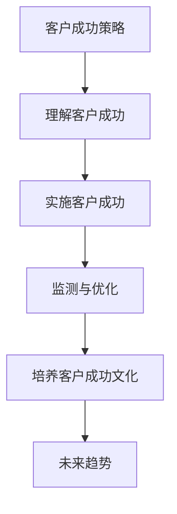
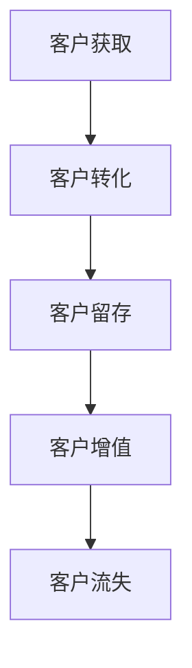
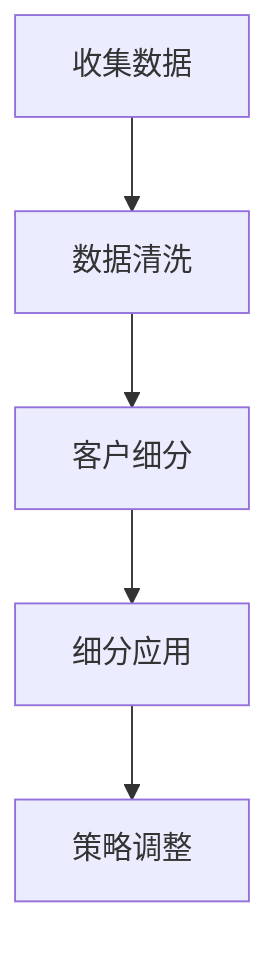

                 

# 一人公司的客户成功策略：提高客户终身价值的方法

## 文章关键词
- 客户成功策略
- 客户终身价值
- 一人公司
- 客户体验
- 客户关系管理
- 数据分析

## 文章摘要
本文旨在探讨一人公司如何通过制定和实施有效的客户成功策略，提高客户的终身价值。我们将详细分析客户成功的定义、核心要素、策略框架，并介绍如何制定客户成功计划、构建客户关系、提升客户体验以及最大化客户价值。此外，还将探讨如何监测和评估客户成功策略，以及如何在组织中培养客户成功文化。最后，我们将展望客户成功策略的未来趋势，并分享实用的工具和资源，帮助一人公司实现客户价值的最大化。

## 第一部分：理解客户成功策略

### 第1章：什么是客户成功策略

#### 1.1 客户成功的定义

客户成功（Customer Success）是一种以客户为中心的业务方法，旨在确保客户在购买和使用产品或服务的过程中获得成功。客户成功不仅仅是提供优质的产品和服务，还包括帮助客户实现预期的业务目标，提升他们的整体体验和满意度。在客户成功策略中，企业将客户看作是长期的合作伙伴，致力于建立长期、稳定的关系。

#### 1.2 客户成功的重要性

客户成功对于企业的长期发展至关重要。以下是几个关键点：

1. **提高客户留存率**：通过确保客户在使用产品或服务的过程中获得成功，企业能够提高客户的忠诚度，减少客户流失率。
2. **增加客户终身价值**：客户成功策略能够帮助企业识别和挖掘客户的潜在需求，提供增值服务，从而提高客户的消费频率和金额。
3. **提升客户满意度**：通过持续关注客户的需求和反馈，企业能够提供更好的客户体验，增加客户对品牌的信任和满意度。
4. **降低客户获取成本**：客户成功策略有助于降低客户获取成本，因为满意的客户更可能推荐新客户。

#### 1.3 客户成功策略与传统客户服务的区别

传统客户服务主要关注客户问题的解决和投诉的处理，而客户成功策略则更注重客户在整个生命周期中的体验和成长。以下是两者之间的主要区别：

1. **目标不同**：传统客户服务的目标是解决问题，而客户成功策略的目标是帮助客户实现业务目标。
2. **关注点不同**：传统客户服务关注客户的问题和投诉，而客户成功策略关注客户的需求和成长。
3. **方法不同**：传统客户服务主要依赖于客服人员，而客户成功策略则更多地依赖于数据分析和自动化工具。

### 第2章：客户成功的核心要素

#### 2.1 客户体验

客户体验（Customer Experience, CX）是客户成功策略的核心要素之一。它涵盖了客户在整个生命周期中与企业的互动体验，包括购买、使用、维护和最终离开产品或服务的全过程。提升客户体验的关键在于：

1. **个性化**：根据客户的需求和偏好提供个性化的产品和服务。
2. **一致性**：确保客户在所有渠道（线上、线下、电话、邮件等）获得一致的服务体验。
3. **快速响应**：及时响应用户的反馈和问题，提供高效的解决方案。

#### 2.2 客户关系管理

客户关系管理（Customer Relationship Management, CRM）是客户成功策略的重要组成部分。它涉及到企业与客户之间的互动和管理，旨在建立和维护长期、稳定的关系。以下是一些关键点：

1. **数据管理**：有效收集、存储和管理客户数据，为决策提供依据。
2. **沟通渠道**：提供多样化的沟通渠道，如电话、邮件、社交媒体等，确保客户能够方便地与企业取得联系。
3. **个性化营销**：根据客户的行为和偏好进行个性化营销，提高营销效果。

#### 2.3 客户价值评估

客户价值评估（Customer Value Assessment）是客户成功策略的重要环节。它涉及到对客户价值的评估和分类，以便企业能够更好地分配资源和制定策略。以下是一些关键点：

1. **价值衡量**：确定客户价值的衡量标准，如购买金额、消费频率、留存率等。
2. **客户分类**：根据客户价值评估结果，将客户分为高价值客户、普通客户和低价值客户。
3. **资源分配**：将有限的资源优先分配给高价值客户，提供更优质的服务和产品。

### 第3章：客户成功策略的框架

#### 3.1 客户成功计划

客户成功计划（Customer Success Plan）是客户成功策略的核心组成部分。它定义了企业如何实现客户成功的目标和策略。以下是一些关键点：

1. **目标设定**：明确客户成功的目标，如提高客户留存率、增加客户终身价值等。
2. **策略制定**：制定实现目标的策略，包括客户体验优化、客户关系管理、客户价值评估等。
3. **执行与监控**：确保计划的执行，并持续监控和评估效果，及时调整策略。

#### 3.2 客户成功团队的角色

客户成功团队在客户成功策略中扮演着关键角色。以下是一些关键点：

1. **跨部门协作**：客户成功团队需要与其他部门（如销售、产品、营销等）紧密合作，确保客户成功策略的有效实施。
2. **客户支持**：提供全面、高效的支持服务，确保客户在使用产品或服务过程中获得帮助。
3. **数据驱动**：利用数据分析和客户反馈，不断优化客户成功策略。

#### 3.3 客户成功策略的执行与监控

客户成功策略的执行与监控是确保策略有效性的关键。以下是一些关键点：

1. **执行计划**：制定详细的执行计划，明确责任人和时间表。
2. **数据监测**：持续监测关键数据，如客户留存率、客户满意度等。
3. **评估与调整**：定期评估客户成功策略的效果，根据反馈进行调整。

## 第二部分：实施客户成功策略

### 第4章：制定有效的客户成功计划

#### 4.1 客户细分策略

客户细分策略（Customer Segmentation Strategy）是制定客户成功计划的重要一步。它涉及到将客户划分为不同的群体，以便企业能够提供更个性化的服务和产品。以下是一些关键点：

1. **细分标准**：确定细分标准，如购买金额、消费频率、行业等。
2. **细分方法**：使用数据分析和市场研究，将客户划分为不同的群体。
3. **细分应用**：根据细分结果，制定针对性的客户成功策略。

#### 4.2 客户成功目标设定

客户成功目标设定（Customer Success Goals Setting）是客户成功计划的核心。以下是一些关键点：

1. **目标类型**：设定长期和短期的目标，如提高客户留存率、增加客户满意度等。
2. **目标设定方法**：使用数据分析和市场研究，设定具有挑战性但可实现的目标。
3. **目标分解**：将整体目标分解为具体的、可执行的任务。

#### 4.3 客户成功计划实施步骤

客户成功计划实施步骤（Customer Success Plan Implementation Steps）包括以下几个方面：

1. **计划制定**：根据客户细分和目标设定，制定详细的客户成功计划。
2. **资源分配**：明确所需的资源和预算，确保计划的顺利执行。
3. **执行与监控**：确保计划的执行，并持续监控和评估效果。
4. **调整与优化**：根据监控和评估结果，调整和优化客户成功计划。

### 第5章：构建强大的客户关系

#### 5.1 建立信任关系

建立信任关系（Build Trust Relationships）是客户成功策略的核心。以下是一些关键点：

1. **透明沟通**：与客户保持透明沟通，及时分享重要信息。
2. **诚信行为**：遵守承诺，诚信对待客户。
3. **个性化互动**：与客户建立个性化的互动，展示对客户的关注。

#### 5.2 提供卓越的客户服务

提供卓越的客户服务（Provide Exceptional Customer Service）是提升客户满意度和忠诚度的关键。以下是一些关键点：

1. **高效响应**：及时响应客户的问题和投诉，提供高效的解决方案。
2. **专业素养**：提升客服人员的专业素养，确保他们能够为客户提供专业的建议和支持。
3. **培训与发展**：定期培训客服人员，提高他们的技能和知识。

#### 5.3 客户关系维护策略

客户关系维护策略（Customer Relationship Maintenance Strategy）包括以下几个方面：

1. **定期沟通**：定期与客户保持沟通，了解他们的需求和反馈。
2. **活动策划**：举办各类客户活动，增强客户与企业的互动。
3. **客户关怀**：在客户的重要时刻（如生日、节假日等）提供关怀和祝福。

### 第6章：提升客户体验

#### 6.1 优化客户旅程

优化客户旅程（Optimize Customer Journey）是提升客户体验的关键。以下是一些关键点：

1. **了解客户需求**：通过数据分析和市场研究，了解客户的需求和痛点。
2. **简化流程**：简化客户购买、使用和维护产品的流程，提高客户的满意度。
3. **持续改进**：根据客户反馈和数据分析，不断优化客户旅程。

#### 6.2 利用客户反馈

利用客户反馈（Utilize Customer Feedback）是提升客户体验的重要手段。以下是一些关键点：

1. **收集反馈**：通过问卷调查、用户访谈、在线反馈等方式，收集客户的反馈。
2. **分析反馈**：对客户反馈进行分析，找出问题和改进点。
3. **反馈应用**：将反馈应用到产品和服务改进中，提高客户的满意度。

#### 6.3 创造个性化体验

创造个性化体验（Create Personalized Experience）是提升客户体验的重要策略。以下是一些关键点：

1. **数据驱动**：利用数据分析，了解客户的偏好和需求。
2. **个性化推荐**：根据客户的行为和偏好，提供个性化的产品和服务推荐。
3. **个性化沟通**：与客户建立个性化的互动，展示对他们的关注。

### 第7章：最大化客户价值

#### 7.1 客户终身价值评估

客户终身价值评估（Customer Lifetime Value Assessment）是制定客户成功策略的重要环节。以下是一些关键点：

1. **价值衡量**：确定客户终身价值的衡量标准，如购买金额、消费频率、留存率等。
2. **数据收集**：收集与客户价值相关的数据，如购买记录、客户互动等。
3. **计算方法**：使用数学模型计算客户终身价值，为决策提供依据。

#### 7.2 提高客户转化率

提高客户转化率（Increase Customer Conversion Rate）是客户成功策略的重要目标。以下是一些关键点：

1. **了解客户行为**：通过数据分析，了解客户在购买过程中的行为和痛点。
2. **优化营销策略**：根据客户行为数据，优化营销策略，提高转化率。
3. **测试与优化**：持续测试和优化营销策略，提高效果。

#### 7.3 增强客户留存率

增强客户留存率（Enhance Customer Retention Rate）是客户成功策略的重要目标。以下是一些关键点：

1. **客户关系管理**：通过有效的客户关系管理，提高客户的忠诚度和满意度。
2. **增值服务**：提供增值服务，如客户培训、技术支持等，增强客户黏性。
3. **反馈机制**：建立有效的反馈机制，及时了解客户的需求和问题，提高客户满意度。

## 第三部分：客户成功策略的持续优化

### 第8章：监测与评估客户成功策略

#### 8.1 客户成功指标体系

客户成功指标体系（Customer Success Metrics System）是监测和评估客户成功策略的关键。以下是一些关键指标：

1. **客户留存率**：衡量客户在一段时间内持续使用产品的比例。
2. **客户满意度**：衡量客户对产品或服务的满意程度。
3. **客户转化率**：衡量潜在客户转化为实际客户的比例。
4. **客户终身价值**：衡量客户在整个生命周期内为企业带来的价值。

#### 8.2 数据分析在客户成功中的应用

数据分析在客户成功中的应用（Application of Data Analysis in Customer Success）至关重要。以下是一些关键点：

1. **数据收集**：收集与客户成功相关的数据，如购买记录、客户互动等。
2. **数据清洗**：对数据进行清洗和整理，确保数据的质量和准确性。
3. **数据分析**：使用数据分析工具和技术，对数据进行分析和挖掘，为决策提供依据。

#### 8.3 客户成功策略的调整与优化

客户成功策略的调整与优化（Adjustment and Optimization of Customer Success Strategy）是确保策略持续有效的重要环节。以下是一些关键点：

1. **定期评估**：定期评估客户成功策略的效果，找出问题和改进点。
2. **数据驱动**：根据数据分析结果，调整和优化客户成功策略。
3. **持续改进**：持续关注客户需求和市场变化，不断优化客户成功策略。

### 第9章：培养客户成功文化

#### 9.1 员工在客户成功中的作用

员工在客户成功中的作用（Role of Employees in Customer Success）至关重要。以下是一些关键点：

1. **员工培训**：为员工提供客户成功相关的培训，提高他们的专业素养和技能。
2. **激励机制**：建立与客户成功相关的激励机制，鼓励员工积极参与和推动客户成功。
3. **跨部门协作**：促进跨部门的协作，确保客户成功策略的有效实施。

#### 9.2 客户成功文化的构建

客户成功文化的构建（Building Customer Success Culture）是确保客户成功策略持续有效的重要一环。以下是一些关键点：

1. **核心价值观**：明确客户成功文化的核心价值观，如客户至上、数据驱动、持续改进等。
2. **组织结构**：调整组织结构，确保客户成功策略能够得到有效实施。
3. **文化建设**：通过培训和活动，加强员工对客户成功文化的认同和践行。

#### 9.3 客户成功文化的传播与推广

客户成功文化的传播与推广（Communication and Promotion of Customer Success Culture）至关重要。以下是一些关键点：

1. **内部沟通**：通过内部会议、培训、分享会等，加强员工对客户成功文化的理解和认同。
2. **外部宣传**：通过企业官网、社交媒体等渠道，对外宣传客户成功文化，提升品牌形象。
3. **案例分享**：分享成功案例和经验，激发员工对客户成功文化的兴趣和热情。

### 第10章：客户成功策略的未来趋势

#### 10.1 客户成功策略的发展方向

客户成功策略的未来趋势（Future Trends of Customer Success Strategy）包括以下几个方面：

1. **数据驱动**：客户成功策略将更加依赖于数据分析和人工智能技术，以实现更精准的客户体验优化。
2. **智能化**：客户成功策略将逐渐向智能化发展，通过自动化工具和智能算法，提高客户服务的效率和效果。
3. **全球化**：随着全球化进程的加速，客户成功策略将更加注重跨文化沟通和全球化运营。

#### 10.2 新技术对客户成功策略的影响

新技术对客户成功策略的影响（Impact of New Technologies on Customer Success Strategy）主要体现在以下几个方面：

1. **大数据**：大数据技术的应用将帮助客户成功策略更好地理解客户需求和行为，实现更精准的客户体验优化。
2. **人工智能**：人工智能技术的应用将提高客户成功策略的自动化程度，减少人力成本，提高运营效率。
3. **云计算**：云计算技术的应用将为客户提供更加灵活和高效的服务，提升客户体验。

#### 10.3 客户成功策略的未来挑战与机遇

客户成功策略的未来挑战与机遇（Challenges and Opportunities of Future Customer Success Strategy）包括以下几个方面：

1. **数据隐私**：随着数据隐私问题的日益突出，客户成功策略需要更加注重数据安全和隐私保护。
2. **技术变革**：随着技术的快速变革，客户成功策略需要不断适应新技术，实现持续创新。
3. **市场竞争**：随着市场竞争的加剧，客户成功策略需要更加注重差异化，提升客户满意度和忠诚度。

## 附录

### 附录A：客户成功策略工具与资源

#### A.1 客户成功管理工具

- **HubSpot**：提供全面的客户关系管理（CRM）工具，帮助企业实现客户成功的全面管理。
- **Gong.io**：专注于客户成功数据分析和洞察，帮助企业更好地理解客户需求和行为。
- **Gainsight**：提供客户成功平台，帮助企业实现客户体验优化和客户关系管理。

#### A.2 客户成功策略案例

- **Zappos**：以客户为中心的企业，通过卓越的客户服务和个性化体验，成为客户成功的典范。
- **Amazon**：利用大数据和人工智能技术，提供个性化的产品推荐和服务，实现客户成功的最大化。
- **Salesforce**：作为全球领先的客户关系管理（CRM）解决方案提供商，通过客户成功策略实现业务的快速增长。

#### A.3 客户成功相关书籍与论文

- 《客户成功：构建和运营成功的客户成功团队》
- 《客户成功策略：提高客户留存率和客户终身价值》
- 《客户成功：从销售到服务的转变》
- 《大数据客户成功：利用数据分析实现客户价值的最大化》

### 附录B：客户成功策略流程图

#### B.1 客户成功策略流程图



#### B.2 客户生命周期管理流程图



#### B.3 客户细分策略流程图



### 附录C：客户成功策略算法与数学模型

#### C.1 客户价值评估模型

```python
# 客户价值评估模型伪代码
def customer_value-assessment(customer_data):
    # 收集客户数据
    purchase_amount = customer_data['purchase_amount']
    consumption_frequency = customer_data['consumption_frequency']
    retention_rate = customer_data['retention_rate']
    
    # 计算客户终身价值
    customer_lifetime_value = purchase_amount * consumption_frequency * retention_rate
    
    return customer_lifetime_value
```

#### C.2 客户转化率预测模型

```python
# 客户转化率预测模型伪代码
def customer_conversion_rate_prediction(customer_data, historical_data):
    # 收集客户和历史数据
    customer_data = ...
    historical_data = ...
    
    # 训练预测模型
    model = train_model(historical_data)
    
    # 预测客户转化率
    predicted_conversion_rate = model.predict(customer_data)
    
    return predicted_conversion_rate
```

#### C.3 客户留存率预测模型

```python
# 客户留存率预测模型伪代码
def customer_retention_rate_prediction(customer_data, historical_data):
    # 收集客户和历史数据
    customer_data = ...
    historical_data = ...
    
    # 训练预测模型
    model = train_model(historical_data)
    
    # 预测客户留存率
    predicted_retention_rate = model.predict(customer_data)
    
    return predicted_retention_rate
```

### 附录D：客户成功项目实战案例

#### D.1 客户成功项目案例分析

在本案例中，我们将分析一家一人公司如何通过客户成功策略提高客户终身价值。以下是一个简化的项目实战步骤：

1. **客户细分**：根据客户的行为数据和购买金额，将客户分为高价值客户、普通客户和低价值客户。
2. **客户成功计划**：为不同类型的客户制定个性化的客户成功计划，包括客户体验优化、客户关系管理、客户价值评估等。
3. **数据监测与评估**：通过数据分析工具，监测客户成功策略的效果，并根据反馈进行调整和优化。
4. **反馈与改进**：定期收集客户反馈，分析客户需求，持续改进客户成功策略。

#### D.2 客户成功项目实战步骤

1. **需求分析**：分析客户需求和痛点，确定客户成功的关键指标和目标。
2. **数据收集**：收集客户行为数据、购买记录、客户互动等数据。
3. **数据清洗**：对数据进行清洗和整理，确保数据的质量和准确性。
4. **客户细分**：根据客户数据，将客户划分为不同的群体，为每个群体制定个性化的客户成功计划。
5. **策略实施**：根据客户成功计划，实施针对性的客户体验优化、客户关系管理和客户价值评估。
6. **数据监测与评估**：定期监测客户成功策略的效果，通过数据分析评估客户留存率、客户满意度等指标。
7. **反馈与改进**：根据客户反馈和数据分析结果，调整和优化客户成功策略。

#### D.3 客户成功项目代码解读与分析

在本案例中，我们将使用Python编程语言实现一个简单的客户成功项目。以下是一个简化的代码示例：

```python
import pandas as pd
from sklearn.model_selection import train_test_split
from sklearn.ensemble import RandomForestClassifier

# 1. 数据收集
data = pd.read_csv('customer_data.csv')

# 2. 数据清洗
# ...

# 3. 客户细分
# ...

# 4. 策略实施
# ...

# 5. 数据监测与评估
# ...

# 6. 反馈与改进
# ...

# 7. 预测客户留存率
X = data.drop('retention_rate', axis=1)
y = data['retention_rate']
X_train, X_test, y_train, y_test = train_test_split(X, y, test_size=0.2, random_state=42)

# 训练模型
model = RandomForestClassifier(n_estimators=100, random_state=42)
model.fit(X_train, y_train)

# 预测客户留存率
predictedRetentionRate = model.predict(X_test)

# 输出预测结果
print(predictedRetentionRate)
```

在上述代码中，我们首先从CSV文件中读取客户数据，然后进行数据清洗、客户细分、策略实施和数据监测与评估。最后，我们使用随机森林（RandomForestClassifier）模型进行客户留存率预测，并将预测结果输出。

## 附录E：客户成功策略开发环境搭建指南

#### E.1 开发环境准备

1. **操作系统**：建议使用Windows、macOS或Linux操作系统。
2. **Python环境**：安装Python 3.x版本，并配置pip和conda等包管理工具。
3. **编程工具**：建议使用Visual Studio Code或PyCharm等IDE。

#### E.2 开发工具与资源

1. **数据分析工具**：Pandas、NumPy、Scikit-learn等。
2. **可视化工具**：Matplotlib、Seaborn等。
3. **云计算平台**：AWS、Azure、Google Cloud等。

#### E.3 开发流程与规范

1. **需求分析**：明确客户成功项目的目标和需求。
2. **数据收集**：收集与客户成功项目相关的数据。
3. **数据预处理**：清洗和整理数据，确保数据的质量和准确性。
4. **模型训练与评估**：选择合适的模型，进行训练和评估。
5. **策略实施与监控**：根据模型结果，实施客户成功策略，并持续监控和评估效果。
6. **代码管理与部署**：使用版本控制工具（如Git）管理代码，并部署到服务器或云平台。

### 作者

作者：AI天才研究院/AI Genius Institute & 禅与计算机程序设计艺术 /Zen And The Art of Computer Programming

本文旨在探讨一人公司如何通过制定和实施有效的客户成功策略，提高客户的终身价值。我们详细分析了客户成功的定义、核心要素、策略框架，并介绍了如何制定客户成功计划、构建客户关系、提升客户体验以及最大化客户价值。此外，我们还探讨了如何监测和评估客户成功策略，以及如何在组织中培养客户成功文化。最后，我们展望了客户成功策略的未来趋势，并分享了实用的工具和资源，帮助一人公司实现客户价值的最大化。

客户成功策略不仅仅是一种业务方法，更是一种以客户为中心的思维方式。通过深入了解客户需求、优化客户体验、构建强大的客户关系、提升客户价值和持续优化策略，一人公司可以在激烈的市场竞争中脱颖而出，实现可持续的盈利增长。让我们携手共进，共同创造更美好的客户成功未来！<|im_end|>

