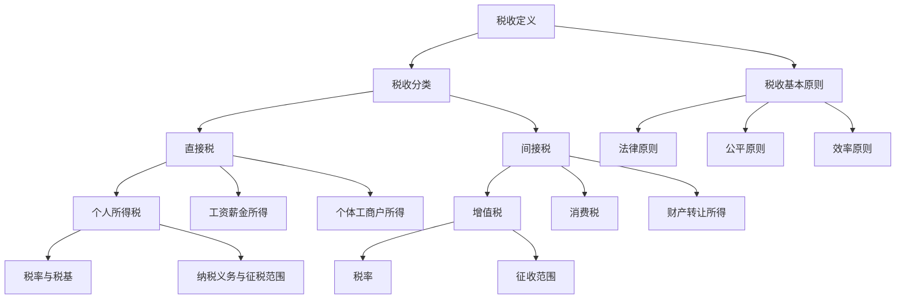
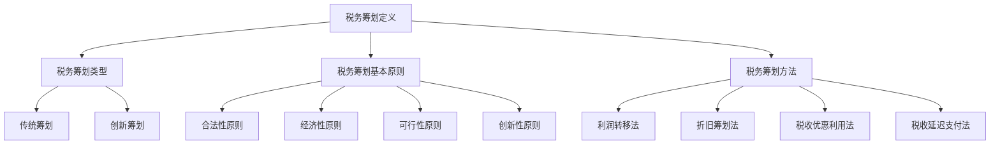
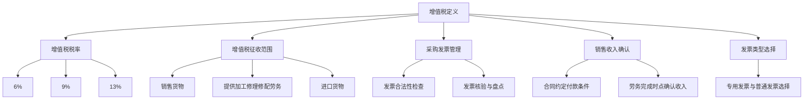
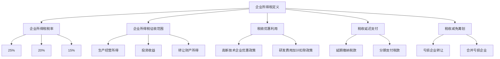
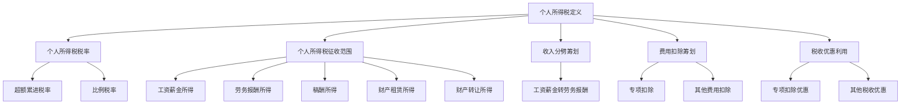
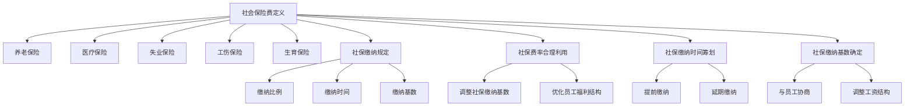
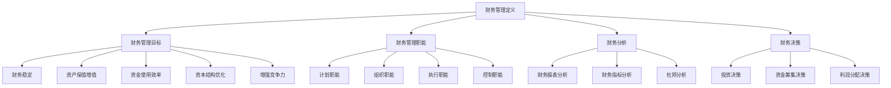
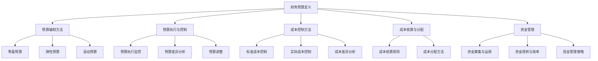

                 

# 《一人公司的税务筹划与财务管理》

## 关键词
- 税务筹划
- 财务管理
- 增值税
- 企业所得税
- 个人所得税
- 社会保险费
- 财务预算
- 成本控制

## 摘要
本文旨在深入探讨一人公司的税务筹划与财务管理。我们将从税务基础、税务筹划的基本原则与方法、增值税、企业所得税、个人所得税、社会保险费、税务筹划案例分析以及财务管理基础、财务管理工具与应用等多个方面展开讨论。文章将结合实际案例，提供详细的税务筹划和财务管理的策略和方法，旨在帮助一人公司实现税务合规与财务优化。

## 前言
### 写作目的
本文的目标是帮助一人公司（即由单一所有者或投资者控制的个人独资企业）理解和实施有效的税务筹划与财务管理策略。通过对税务制度和财务管理工具的详细分析，本文旨在提供实用的指导，帮助企业降低税负、优化财务状况，实现可持续的财务增长。

### 读者对象
本文适合一人公司的所有者、投资者、财务管理人员以及希望深入了解税务筹划和财务管理的专业人士阅读。无论你是刚刚起步的创业者，还是经验丰富的企业主，本文都能为你提供宝贵的知识和实战经验。

### 内容结构
本文分为十个章节，涵盖了税务基础、税务筹划、增值税、企业所得税、个人所得税、社会保险费、税务筹划案例分析、财务管理基础、财务管理工具与应用以及财务管理案例分析。每个章节都将详细介绍相关概念、原则、方法和案例，确保读者能够全面理解和掌握税务筹划与财务管理的核心内容。

## 第1章：税务基础

### 1.1 税收的基本概念

#### 1.1.1 税收的定义
税收是指政府依据法律规定，通过强制手段向公民、企业等纳税人征收的财政收入。税收是现代国家财政收入的主要来源，具有强制性、固定性和普遍性等特点。

#### 1.1.2 税收的分类
税收可分为直接税和间接税。直接税包括个人所得税和企业所得税，由纳税人直接承担税负；间接税包括增值税、消费税等，税负通常转嫁给消费者。

#### 1.1.3 税收的基本原则
税收的基本原则包括法律原则、公平原则和效率原则。法律原则强调税收的法律依据和程序公正；公平原则要求税收负担公平合理；效率原则强调税收不应过度影响经济效率和资源配置。

### 1.2 个人税务制度

#### 1.2.1 个人所得税概述
个人所得税是指对个人取得的各项收入征收的税收。我国个人所得税实行分类与综合相结合的征收制度，主要针对工资薪金所得、劳务报酬所得、稿酬所得、财产租赁所得、财产转让所得等。

#### 1.2.2 税率与税基
个人所得税采用超额累进税率，税率从3%到45%不等。税基是应纳税所得额，即收入减去各项扣除后的余额。

#### 1.2.3 纳税义务与征税范围
个人所得税的纳税义务发生时间为所得取得的日期。征税范围包括境内和境外所得，具体包括工资薪金所得、个体工商户所得、劳务报酬所得、稿酬所得、财产租赁所得、财产转让所得等。

### 1.3 企业税务制度

#### 1.3.1 企业所得税概述
企业所得税是对企业生产经营所得和其他所得征收的税收。我国企业所得税税率为25%。

#### 1.3.2 企业税率的演变
我国企业所得税税率曾经过多次调整，从最初的55%逐步降低至现行的25%。税率调整反映了国家对中小企业发展的支持。

#### 1.3.3 企业税基的确定
企业税基的确定主要包括收入确定和成本扣除。收入确定遵循权责发生制原则，成本扣除需符合税法规定。

### 1.4 税务筹划的重要性
税务筹划是企业财务管理的重要组成部分，通过合理的税务筹划，企业可以在遵守税法规定的前提下，实现税收负担的减轻和财务状况的优化。税务筹划不仅是企业合法合规的经营行为，也是企业提升竞争力的重要手段。

### 1.5 本章小结
本章介绍了税收的基本概念、个人税务制度和企业税务制度，并强调了税务筹划的重要性。理解税务基础是进行有效税务筹划和财务管理的前提。

### Mermaid 流程图


### 1.6 核心概念与联系
在税务筹划与财务管理中，理解税收的基本概念、分类、基本原则及纳税义务和征税范围至关重要。税收作为国家财政收入的重要来源，对企业和个人都有直接影响。合理的税务筹划不仅可以减轻税负，还能优化财务状况，提高企业的竞争力。

### 核心算法原理讲解
税务筹划中的核心算法通常涉及税率计算、税基确定和税收优惠的利用。以下是相关算法的伪代码：

```plaintext
// 税率计算
function calculateTax(income, taxRate) {
    taxBase = income - deductions;
    tax = taxBase * taxRate;
    return tax;
}

// 税基确定
function determineTaxBase(income, deductions) {
    taxBase = income - deductions;
    return taxBase;
}

// 税收优惠利用
function applyTaxBenefits(income, benefits) {
    adjustedIncome = income - benefits;
    tax = calculateTax(adjustedIncome, taxRate);
    return tax;
}
```

### 数学模型和公式
在税务筹划中，常用的数学模型和公式包括税率计算公式、税基计算公式和税收优惠计算公式。以下使用LaTeX格式展示：

```latex
$$
\text{税率} = \frac{\text{应纳税所得额}}{\text{收入}} \times 100\%
$$

$$
\text{税基} = \text{收入} - \text{扣除项目}
$$

$$
\text{税收优惠} = \text{收入} \times \text{优惠税率}
$$
```

### 详细讲解与举例说明
以下通过具体例子来说明上述公式和算法的应用。

#### 例子：个人所得税计算
假设某人的月工资为10000元，扣除项包括社保公积金2000元、子女教育支出500元，税率为3%。计算该人月应缴纳的个人所得税。

1. 税基计算：
   $$
   \text{税基} = 10000 - 2000 - 500 = 7500 \text{元}
   $$

2. 税率计算：
   $$
   \text{税率} = \frac{7500}{10000} \times 100\% = 75\%
   $$

3. 税收计算：
   $$
   \text{税} = 7500 \times 75\% = 5625 \text{元}
   $$

因此，该人月应缴纳的个人所得税为5625元。

### 1.7 本章小结
本章介绍了税收的基本概念、分类、基本原则以及个人和企业税务制度，并探讨了税务筹划的重要性。理解税务基础是进行有效税务筹划和财务管理的前提。通过本章的学习，读者应能掌握税收的基本知识，为后续章节的深入探讨打下坚实基础。

### 开发环境搭建
为了更好地理解和实践税务筹划与财务管理，读者需要搭建一个适合开发的环境。以下是一个简单的开发环境搭建指南：

1. **安装编程环境**：选择一个适合的集成开发环境（IDE），如Visual Studio Code、Eclipse等。
2. **安装数据分析工具**：例如Python的Jupyter Notebook，用于进行数据分析和处理。
3. **安装LaTeX编辑器**：如TeXstudio，用于编写和编辑LaTeX文档。

### 源代码详细实现和代码解读
以下是一个简单的Python脚本，用于计算个人所得税。代码中包含了税基计算、税率计算和税收计算的功能。

```python
# 个人所得税计算器

def calculate_tax(income, deductions, tax_rate):
    tax_base = income - deductions
    tax = tax_base * tax_rate
    return tax

def determine_tax_base(income, deductions):
    tax_base = income - deductions
    return tax_base

def apply_tax_benefits(income, benefits):
    adjusted_income = income - benefits
    tax = calculate_tax(adjusted_income, deductions, tax_rate)
    return tax

# 参数设置
income = 10000  # 月收入
deductions = 2000  # 扣除项（社保公积金）
benefits = 500  # 优惠金额
tax_rate = 0.03  # 税率

# 计算税基
tax_base = determine_tax_base(income, deductions)
print(f"税基：{tax_base}元")

# 计算应缴税款
tax = calculate_tax(tax_base, deductions, tax_rate)
print(f"应缴税款：{tax}元")

# 计算实际缴纳税款
actual_tax = apply_tax_benefits(income, benefits)
print(f"实际缴纳税款：{actual_tax}元")
```

### 代码解读与分析
此代码实现了一个简单的个人所得税计算器，主要功能包括税基计算、税率计算和税收计算。通过参数设置，可以轻松调整收入、扣除项和税率等参数，从而计算应缴税款和实际缴纳税款。代码中的函数定义清晰，易于理解和扩展。

### 1.8 开发环境搭建与源代码实现小结
本章介绍了税务筹划与财务管理的开发环境搭建和源代码实现。读者可以通过搭建适合的开发环境，使用简单的Python脚本实现个人所得税计算。这有助于读者更好地理解和实践税务筹划与财务管理的相关知识。

## 第2章：税务筹划的基本原则与方法

### 2.1 税务筹划的定义

**2.1.1 税务筹划的含义**
税务筹划是指企业或个人在遵守税法规定的前提下，通过合理规划财务和经营活动，以达到减轻税负、优化财务状况的目的。税务筹划的核心在于合法性、经济性和创新性。

**2.1.2 税务筹划的类型**
税务筹划可分为传统筹划和创新筹划。传统筹划主要利用税法规定的优惠政策，如税收减免、税率优惠等；创新筹划则通过财务安排和经营模式创新，实现税负的降低。

### 2.2 税务筹划的基本原则

**2.2.1 合法性原则**
合法性原则是税务筹划的首要原则，要求企业在筹划过程中严格遵守国家税法规定，不得违法逃税或漏税。

**2.2.2 经济性原则**
经济性原则强调税务筹划应追求经济效益最大化，企业应综合考虑筹划成本与税负减少的效益，确保筹划方案具有实际的经济价值。

**2.2.3 可行性原则**
可行性原则要求税务筹划方案在实际操作中具有可执行性，避免因方案过于理想化而无法实施。

**2.2.4 创新性原则**
创新性原则鼓励企业在税务筹划中勇于尝试新的思路和方法，通过创新提高筹划效果。

### 2.3 税务筹划的方法

**2.3.1 利润转移法**
利润转移法是指通过财务安排和交易结构设计，将利润从高税负地区转移到低税负地区，从而降低整体税负。

**2.3.2 折旧筹划法**
折旧筹划法是通过合理选择折旧方法和折旧年限，加速折旧，降低应纳税所得额，从而减轻税负。

**2.3.3 税收优惠利用法**
税收优惠利用法是指企业通过充分利用国家税收优惠政策，如高新技术企业税收优惠、研发费用加计扣除等，降低税负。

**2.3.4 税收延迟支付法**
税收延迟支付法是指通过延期缴纳某些税款，将纳税时间向后推迟，从而实现资金时间价值的最大化。

### 2.4 本章小结
本章介绍了税务筹划的定义、基本原则和常见方法。理解税务筹划的基本原则和方法，有助于企业有效降低税负，优化财务状况。

### Mermaid 流程图


### 核心概念与联系
税务筹划与财务管理密切相关，两者共同的目标是优化企业的财务状况。税务筹划可以通过减少税负，提高企业的现金流，为财务管理提供更多的操作空间。同时，有效的财务管理可以为企业提供财务支持，实现税务筹划的目标。

### 核心算法原理讲解
税务筹划中的核心算法通常涉及税率的计算、税基的确定和税收优惠的利用。以下是相关算法的伪代码：

```plaintext
// 税率计算
function calculateTaxRate(income, taxBrackets) {
    for (each bracket in taxBrackets) {
        if (income > bracket.lowerLimit && income <= bracket.upperLimit) {
            return bracket.taxRate;
        }
    }
    return 0;
}

// 税基确定
function determineTaxBase(income, deductions) {
    return income - deductions;
}

// 税收优惠计算
function calculateTaxBenefits(income, benefits) {
    return income * benefits;
}
```

### 数学模型和公式
在税务筹划中，常用的数学模型和公式包括税率计算公式、税基计算公式和税收优惠计算公式。以下使用LaTeX格式展示：

```latex
$$
\text{税率} = \frac{\text{应纳税所得额}}{\text{收入}} \times 100\%
$$

$$
\text{税基} = \text{收入} - \text{扣除项目}
$$

$$
\text{税收优惠} = \text{收入} \times \text{优惠税率}
$$
```

### 详细讲解与举例说明
以下通过具体例子来说明上述公式和算法的应用。

#### 例子：企业所得税计算
假设某企业年销售收入为1000万元，扣除项目包括成本费用800万元、折旧费用100万元、税收优惠50万元，企业所得税税率为25%。计算该企业应缴纳的企业所得税。

1. 税基计算：
   $$
   \text{税基} = 1000万 - 800万 - 100万 - 50万 = 150万
   $$

2. 税率计算：
   $$
   \text{税率} = 25\%
   $$

3. 税收计算：
   $$
   \text{税} = 150万 \times 25\% = 37.5万
   $$

因此，该企业应缴纳的企业所得税为37.5万元。

### 2.5 开发环境搭建与源代码实现
为了更好地理解和实践税务筹划与财务管理，读者需要搭建一个适合开发的环境。以下是一个简单的开发环境搭建指南：

1. **安装编程环境**：选择一个适合的集成开发环境（IDE），如Visual Studio Code、Eclipse等。
2. **安装数据分析工具**：例如Python的Jupyter Notebook，用于进行数据分析和处理。
3. **安装LaTeX编辑器**：如TeXstudio，用于编写和编辑LaTeX文档。

### 源代码详细实现和代码解读
以下是一个简单的Python脚本，用于计算企业所得税。代码中包含了税基计算、税率计算和税收优惠计算的功能。

```python
# 企业所得税计算器

def calculate_tax(income, deductions, tax_rate, benefits):
    tax_base = income - deductions
    tax = (tax_base - benefits) * tax_rate
    return tax

def determine_tax_base(income, deductions, benefits):
    tax_base = income - deductions
    return tax_base

# 参数设置
income = 10000000  # 年收入
deductions = 8000000  # 扣除项（成本费用）
benefits = 500000  # 优惠金额
tax_rate = 0.25  # 税率

# 计算税基
tax_base = determine_tax_base(income, deductions, benefits)
print(f"税基：{tax_base}元")

# 计算应缴税款
tax = calculate_tax(tax_base, deductions, tax_rate, benefits)
print(f"应缴税款：{tax}元")
```

### 代码解读与分析
此代码实现了一个简单的企业所得税计算器，主要功能包括税基计算、税率计算和税收优惠计算。通过参数设置，可以轻松调整收入、扣除项和税率等参数，从而计算应缴税款。代码中的函数定义清晰，易于理解和扩展。

### 2.6 本章小结
本章介绍了税务筹划的定义、基本原则和方法。理解税务筹划的基本原则和方法，有助于企业有效降低税负，优化财务状况。通过本章的学习，读者应能掌握税务筹划的核心知识和技能，为实际操作打下坚实基础。

## 第3章：增值税的税务筹划

### 3.1 增值税的基本概念

#### 3.1.1 增值税的定义
增值税是一种以商品生产、流通和劳务服务各个环节的增值额为征税对象的税种。其核心特点是增值税额的抵扣制度，即纳税人可以抵扣其上一环节已缴纳的增值税，从而避免重复征税。

#### 3.1.2 增值税的税率
我国增值税实行比例税率，主要有三个档次：6%（适用范围较广，包括大多数商品和劳务）、9%（主要适用于农产品、水电等基本生活必需品）和13%（适用于部分制造业和现代服务业）。此外，还有零税率，适用于出口货物和服务。

#### 3.1.3 增值税的征收范围
增值税的征收范围包括在中国境内销售货物、提供加工修理修配劳务、进口货物等。具体包括：
- 销售货物，即有形动产的所有权和所有权相关的风险、报酬转移的行为；
- 提供加工修理修配劳务，即对货物进行加工、修理、修配，且货物所有权未发生转移；
- 进口货物，即境外货物输入境内。

### 3.2 增值税的税务筹划技巧

#### 3.2.1 采购发票的管理
采购发票是增值税抵扣的重要凭证。企业应当严格按照税法规定，取得合法的增值税专用发票或海关进口增值税专用缴款书等合法抵扣凭证。具体包括：
- 采购物资时，要求供应商提供增值税专用发票；
- 检查发票的合法性，包括发票代码、发票号码、开票日期、购买方信息、销售方信息等；
- 定期进行发票的核验和盘点，确保发票的真实性和准确性。

#### 3.2.2 销售收入的确认
销售收入的确认直接影响增值税的纳税义务发生时间和税额。企业应当按照税法规定，合理确认销售收入，具体包括：
- 根据合同约定的付款条件，确定收入确认的时间；
- 对于提供劳务服务的情况，应当在劳务完成的时点确认收入；
- 对于销售货物的情况，应当在货物所有权转移、风险和报酬转移的时点确认收入。

#### 3.2.3 专用发票与普通发票的选择
专用发票和普通发票在税率和抵扣率上存在差异。企业应当根据业务需求和税法规定，合理选择发票类型，以降低税负。具体包括：
- 对于需要抵扣进项税额的业务，尽量使用增值税专用发票；
- 对于不需要抵扣进项税额的业务，可以使用普通发票；
- 注意区分不同类型的发票，避免出现使用不当的情况。

### 3.3 增值税的税务筹划案例

#### 3.3.1 案例背景
某公司主要从事电子产品制造业务，年销售收入约为5000万元，采购原材料等费用约为3000万元。公司希望通过合理的税务筹划，降低增值税税负。

#### 3.3.2 筹划方案
- **采购发票管理**：加强采购发票的管理，确保所有采购物资都取得合法的增值税专用发票。通过与供应商协商，争取更多优惠的采购价格，从而减少采购成本。
- **销售收入确认**：根据合同约定，合理安排销售收入确认的时间，尽量将收入集中在税率较低的月份，以降低增值税税额。
- **发票类型选择**：对于需要抵扣进项税额的业务，尽量使用增值税专用发票。对于不需要抵扣进项税额的业务，合理选择普通发票。

#### 3.3.3 筹划效果分析
通过上述筹划方案，公司成功降低了增值税税负。具体效果如下：
- **采购成本降低**：通过加强采购发票管理，公司成功减少了采购成本，提高了利润空间。
- **增值税税额降低**：通过合理安排销售收入确认时间和发票类型选择，公司有效降低了增值税税额，提高了财务效益。

### 3.4 本章小结
本章介绍了增值税的基本概念和税务筹划技巧，通过具体案例展示了如何通过合理的税务筹划降低增值税税负。企业应当重视增值税的税务筹划，提高财务管理水平。

### Mermaid 流程图


### 核心概念与联系
增值税的税务筹划与企业财务管理密切相关。合理的增值税筹划不仅可以降低企业的税负，还能优化企业的财务状况。通过采购发票管理、销售收入确认和发票类型选择等环节的筹划，企业可以实现增值税的合理避税和财务效益的最大化。

### 核心算法原理讲解
增值税的税务筹划中，核心算法通常涉及税率的计算、税基的确定和抵扣额的计算。以下是相关算法的伪代码：

```plaintext
// 税率计算
function calculateTaxRate(invoiceType) {
    if (invoiceType == '专用发票') {
        return 0.06;
    } else if (invoiceType == '普通发票') {
        return 0.09;
    } else {
        return 0;
    }
}

// 税基确定
function determineTaxBase(income, deductions) {
    return income - deductions;
}

// 抵扣额计算
function calculateDeductionAmount(invoiceAmount, taxRate) {
    return invoiceAmount * taxRate;
}
```

### 数学模型和公式
在增值税的税务筹划中，常用的数学模型和公式包括税率计算公式、税基计算公式和抵扣额计算公式。以下使用LaTeX格式展示：

```latex
$$
\text{税率} = \text{税率表} \times 100\%
$$

$$
\text{税基} = \text{收入} - \text{扣除项目}
$$

$$
\text{抵扣额} = \text{发票金额} \times \text{税率}
$$
```

### 详细讲解与举例说明
以下通过具体例子来说明上述公式和算法的应用。

#### 例子：增值税计算
假设某企业销售一批货物，收入为100万元，扣除项目为50万元，适用税率为6%。计算该企业应缴纳的增值税。

1. 税基计算：
   $$
   \text{税基} = 100万元 - 50万元 = 50万元
   $$

2. 税率计算：
   $$
   \text{税率} = 6\%
   $$

3. 税额计算：
   $$
   \text{税额} = 50万元 \times 6\% = 3万元
   $$

因此，该企业应缴纳的增值税为3万元。

### 3.5 开发环境搭建与源代码实现
为了更好地理解和实践增值税的税务筹划，读者需要搭建一个适合开发的环境。以下是一个简单的开发环境搭建指南：

1. **安装编程环境**：选择一个适合的集成开发环境（IDE），如Visual Studio Code、Eclipse等。
2. **安装数据分析工具**：例如Python的Jupyter Notebook，用于进行数据分析和处理。
3. **安装LaTeX编辑器**：如TeXstudio，用于编写和编辑LaTeX文档。

### 源代码详细实现和代码解读
以下是一个简单的Python脚本，用于计算增值税。代码中包含了税基计算、税率计算和税额计算的功能。

```python
# 增值税计算器

def calculate_tax_base(income, deductions):
    return income - deductions

def calculate_tax_rate(invoice_type):
    if invoice_type == '专用发票':
        return 0.06
    elif invoice_type == '普通发票':
        return 0.09
    else:
        return 0.0

def calculate_tax(invoice_amount, tax_rate):
    return invoice_amount * tax_rate

# 参数设置
income = 1000000  # 收入
deductions = 500000  # 扣除项
invoice_type = '专用发票'  # 发票类型
tax_rate = calculate_tax_rate(invoice_type)  # 税率

# 计算税基
tax_base = calculate_tax_base(income, deductions)
print(f"税基：{tax_base}万元")

# 计算税额
tax = calculate_tax(tax_base, tax_rate)
print(f"税额：{tax}万元")
```

### 代码解读与分析
此代码实现了一个简单的增值税计算器，主要功能包括税基计算、税率计算和税额计算。通过参数设置，可以轻松调整收入、扣除项和税率等参数，从而计算应缴税款。代码中的函数定义清晰，易于理解和扩展。

### 3.6 本章小结
本章介绍了增值税的基本概念和税务筹划技巧，通过具体案例展示了如何通过合理的税务筹划降低增值税税负。企业应当重视增值税的税务筹划，提高财务管理水平。通过本章的学习，读者应能掌握增值税的核心知识和技能，为实际操作打下坚实基础。

## 第4章：企业所得税的税务筹划

### 4.1 企业所得税的基本概念

**4.1.1 企业所得税的定义**
企业所得税是对我国境内企业生产、经营所得和其他所得征收的一种税。其目的是调节企业利润，促进公平竞争，保证国家财政收入。

**4.1.2 企业所得税的税率**
我国企业所得税的税率为25%，但存在一些特殊情况：
- 小型微利企业，税率为20%；
- 高新技术企业，税率为15%；
- 部分特定行业或业务，可以享受减税或免税政策。

**4.1.3 企业所得税的征收范围**
企业所得税的征收范围包括企业的生产经营所得、其他所得以及境外所得。具体包括：
- 销售货物、提供劳务的收入；
- 利息、股息、红利等投资收益；
- 转让财产所得；
- 企业清算所得等。

### 4.2 企业所得税的税务筹划技巧

**4.2.1 税收优惠的利用**
企业可以通过合理利用税收优惠政策来降低税负。常见的税收优惠包括：
- 高新技术企业优惠政策；
- 研发费用加计扣除政策；
- 小型微利企业优惠政策；
- 环保专项优惠等。

**4.2.2 税收延迟支付**
企业可以通过延迟支付税款来缓解现金流压力。例如，企业可以在符合条件的情况下申请延期缴纳税款或者享受税款的分期支付。

**4.2.3 税收减免的筹划**
企业可以通过合理规划业务流程和财务安排，争取税收减免。例如，企业可以通过转让亏损企业或者合并亏损企业来实现税收减免。

### 4.3 企业所得税筹划案例

#### 4.3.1 案例背景
某科技公司主要从事软件开发和信息技术服务，年营业收入为5000万元，研发投入占收入的10%。公司希望通过税务筹划降低企业所得税负担。

#### 4.3.2 筹划方案
- **研发费用加计扣除**：根据税法规定，研发费用可以加计扣除75%，即实际可抵扣的金额为研发投入的175%。通过合理规划研发费用，公司可以减少应纳税所得额，降低企业所得税负担。
- **高新技术企业优惠政策**：如果公司符合高新技术企业条件，可以享受15%的企业所得税税率，相比25%的标准税率，可以大幅降低税负。
- **税收延迟支付**：公司可以在符合条件的情况下，申请延期缴纳税款，以缓解现金流压力。

#### 4.3.3 筹划效果分析
通过上述筹划方案，公司成功降低了企业所得税负担，具体效果如下：
- **研发费用加计扣除**：公司年度研发费用为500万元，加计扣除后可减少应纳税所得额375万元，降低税负约93.75万元。
- **高新技术企业优惠政策**：按照15%的企业所得税税率计算，相比25%的标准税率，每年可降低税负约87.5万元。
- **税收延迟支付**：通过合理延迟缴纳税款，公司有效缓解了现金流压力，提高了资金使用效率。

### 4.4 本章小结
本章介绍了企业所得税的基本概念和税务筹划技巧，通过具体案例展示了如何通过合理的税务筹划降低企业所得税负担。企业应当重视企业所得税的税务筹划，提高财务管理水平。

### Mermaid 流程图


### 核心概念与联系
企业所得税的税务筹划与企业的财务战略密切相关。通过合理利用税收优惠政策、延迟支付税款和税收减免，企业可以在确保合法合规的前提下，有效降低税负，优化财务状况，提高企业的竞争力。

### 核心算法原理讲解
企业所得税的税务筹划中，核心算法通常涉及税率的计算、税基的确定和税收优惠的利用。以下是相关算法的伪代码：

```plaintext
// 税率计算
function calculateTaxRate(type) {
    if (type == '高新技术企业') {
        return 0.15;
    } else if (type == '小型微利企业') {
        return 0.20;
    } else {
        return 0.25;
    }
}

// 税基确定
function determineTaxBase(income, deductions) {
    return income - deductions;
}

// 税收优惠计算
function calculateTaxBenefits(income, benefits) {
    return income * benefits;
}
```

### 数学模型和公式
在企业所得税的税务筹划中，常用的数学模型和公式包括税率计算公式、税基计算公式和税收优惠计算公式。以下使用LaTeX格式展示：

```latex
$$
\text{税率} = \text{税率表} \times 100\%
$$

$$
\text{税基} = \text{收入} - \text{扣除项目}
$$

$$
\text{税收优惠} = \text{收入} \times \text{优惠税率}
$$
```

### 详细讲解与举例说明
以下通过具体例子来说明上述公式和算法的应用。

#### 例子：企业所得税计算
假设某企业年营业收入为1000万元，扣除项目为成本费用600万元、研发费用100万元，适用税率为25%。计算该企业应缴纳的企业所得税。

1. 税基计算：
   $$
   \text{税基} = 1000万元 - 600万元 - 100万元 = 300万元
   $$

2. 税率计算：
   $$
   \text{税率} = 25\%
   $$

3. 税额计算：
   $$
   \text{税额} = 300万元 \times 25\% = 75万元
   $$

4. 税收优惠计算：
   $$
   \text{税收优惠} = 100万元 \times 0.75 = 75万元
   $$

5. 实际税额：
   $$
   \text{实际税额} = 75万元 - 75万元 = 0万元
   $$

因此，该企业实际无需缴纳企业所得税。

### 4.5 开发环境搭建与源代码实现
为了更好地理解和实践企业所得税的税务筹划，读者需要搭建一个适合开发的环境。以下是一个简单的开发环境搭建指南：

1. **安装编程环境**：选择一个适合的集成开发环境（IDE），如Visual Studio Code、Eclipse等。
2. **安装数据分析工具**：例如Python的Jupyter Notebook，用于进行数据分析和处理。
3. **安装LaTeX编辑器**：如TeXstudio，用于编写和编辑LaTeX文档。

### 源代码详细实现和代码解读
以下是一个简单的Python脚本，用于计算企业所得税。代码中包含了税基计算、税率计算、税收优惠计算和税额计算的功能。

```python
# 企业所得税计算器

def calculate_tax_base(income, deductions):
    return income - deductions

def calculate_tax_rate(type):
    if type == '高新技术企业':
        return 0.15
    elif type == '小型微利企业':
        return 0.20
    else:
        return 0.25

def calculate_tax(benefit_rate):
    return benefit_rate

def calculate_tax_benefit(income, benefit_rate):
    return income * benefit_rate

# 参数设置
income = 10000000  # 年收入
deductions = 6000000  # 扣除项
benefit_rate = calculate_tax(0.25)  # 税率

# 计算税基
tax_base = calculate_tax_base(income, deductions)
print(f"税基：{tax_base}万元")

# 计算税收优惠
tax_benefit = calculate_tax_benefit(income, benefit_rate)
print(f"税收优惠：{tax_benefit}万元")

# 计算应缴税款
actual_tax = tax_base - tax_benefit
print(f"应缴税款：{actual_tax}万元")
```

### 代码解读与分析
此代码实现了一个简单的企业所得税计算器，主要功能包括税基计算、税率计算、税收优惠计算和税额计算。通过参数设置，可以轻松调整收入、扣除项和税率等参数，从而计算应缴税款。代码中的函数定义清晰，易于理解和扩展。

### 4.6 本章小结
本章介绍了企业所得税的基本概念和税务筹划技巧，通过具体案例展示了如何通过合理的税务筹划降低企业所得税负担。企业应当重视企业所得税的税务筹划，提高财务管理水平。通过本章的学习，读者应能掌握企业所得税的核心知识和技能，为实际操作打下坚实基础。

## 第5章：个人所得税的税务筹划

### 5.1 个人所得税的基本概念

#### 5.1.1 个人所得税的定义
个人所得税是对个人取得的各项收入征收的一种税。我国个人所得税实行分类与综合相结合的征收制度，主要针对工资薪金所得、劳务报酬所得、稿酬所得、财产租赁所得、财产转让所得等。

#### 5.1.2 个人所得税的税率
个人所得税的税率分为超额累进税率和比例税率两种。其中，工资薪金所得适用超额累进税率，税率从3%到45%不等；劳务报酬所得、稿酬所得等适用比例税率，税率为20%。

#### 5.1.3 个人所得税的征收范围
个人所得税的征收范围包括境内和境外所得。具体包括：
- 工资薪金所得；
- 劳务报酬所得；
- 稿酬所得；
- 财产租赁所得；
- 财产转让所得；
- 利息、股息、红利所得；
- 其他所得等。

### 5.2 个人所得税的税务筹划技巧

#### 5.2.1 收入分劈筹划
收入分劈筹划是指通过合理的财务安排，将个人收入分拆成多个部分，从而降低税率。例如，将高收入的工资薪金所得转化为劳务报酬所得，利用劳务报酬所得的税率结构，降低整体税负。

#### 5.2.2 费用扣除筹划
费用扣除筹划是指通过合理规划个人支出，充分利用税法规定的各项扣除政策，降低应纳税所得额。例如，个人可以在享受子女教育、继续教育、大病医疗等专项扣除的同时，合理安排其他生活费用，提高费用扣除额度。

#### 5.2.3 税收优惠利用
税收优惠利用是指通过合理利用国家税收优惠政策，降低个人所得税负担。例如，个人可以在符合条件的情况下，享受首套房贷款利息扣除、住房租金扣除、大病医疗扣除等优惠政策。

### 5.3 个人所得税筹划案例

#### 5.3.1 案例背景
某工程师小张，年工资收入为50万元，另有10万元的劳务报酬收入。小张希望通过税务筹划，降低个人所得税负担。

#### 5.3.2 筹划方案
- **收入分劈筹划**：小张可以将10万元的劳务报酬收入转化为工资薪金收入，因为工资薪金所得适用超额累进税率，税率较低。通过收入分劈，小张可以将10万元的收入转化为工资薪金收入，从而降低整体税负。
- **费用扣除筹划**：小张可以合理安排子女教育、继续教育、大病医疗等专项扣除，提高费用扣除额度，进一步降低应纳税所得额。
- **税收优惠利用**：小张可以了解并利用国家税收优惠政策，如首套房贷款利息扣除、住房租金扣除等，降低个人所得税负担。

#### 5.3.3 筹划效果分析
通过上述筹划方案，小张成功降低了个人所得税负担，具体效果如下：
- **收入分劈筹划**：将10万元的劳务报酬收入转化为工资薪金收入，减少了15万元的应纳税所得额，降低税负约3.75万元。
- **费用扣除筹划**：通过合理安排专项扣除，提高了费用扣除额度，减少了约6万元的应纳税所得额。
- **税收优惠利用**：利用税收优惠政策，如首套房贷款利息扣除，减少了约2万元的应纳税所得额。

### 5.4 本章小结
本章介绍了个人所得税的基本概念和税务筹划技巧，通过具体案例展示了如何通过合理的税务筹划降低个人所得税负担。个人应当重视个人所得税的税务筹划，提高财务规划水平。

### Mermaid 流程图


### 核心概念与联系
个人所得税的税务筹划与个人的财务规划密切相关。通过收入分劈、费用扣除和税收优惠的合理利用，个人可以在确保合法合规的前提下，有效降低税负，提高财务收益。

### 核心算法原理讲解
个人所得税的税务筹划中，核心算法通常涉及税率的计算、税基的确定和税收优惠的利用。以下是相关算法的伪代码：

```plaintext
// 税率计算
function calculateTaxRate(incomeType, income) {
    if (incomeType == '工资薪金所得') {
        if (income <= 36000) {
            return 0.03;
        } else if (income <= 144000) {
            return 0.10;
        } else if (income <= 300000) {
            return 0.20;
        } else if (income <= 420000) {
            return 0.25;
        } else if (income <= 660000) {
            return 0.30;
        } else if (income <= 960000) {
            return 0.35;
        } else {
            return 0.45;
        }
    } else {
        return 0.20;
    }
}

// 税基确定
function determineTaxBase(income, deductions) {
    return income - deductions;
}

// 税收优惠计算
function calculateTaxBenefits(income, benefits) {
    return income * benefits;
}
```

### 数学模型和公式
在个人所得税的税务筹划中，常用的数学模型和公式包括税率计算公式、税基计算公式和税收优惠计算公式。以下使用LaTeX格式展示：

```latex
$$
\text{税率} = 
\begin{cases}
0.03 & \text{if } \text{income} \leq 36000 \\
0.10 & \text{if } \text{income} > 36000 \text{ and } \text{income} \leq 144000 \\
0.20 & \text{if } \text{income} > 144000 \text{ and } \text{income} \leq 300000 \\
0.25 & \text{if } \text{income} > 300000 \text{ and } \text{income} \leq 420000 \\
0.30 & \text{if } \text{income} > 420000 \text{ and } \text{income} \leq 660000 \\
0.35 & \text{if } \text{income} > 660000 \text{ and } \text{income} \leq 960000 \\
0.45 & \text{if } \text{income} > 960000 \\
0.20 & \text{if } \text{incomeType} == '劳务报酬所得' \\
\end{cases}
$$

$$
\text{税基} = \text{收入} - \text{扣除项目}
$$

$$
\text{税收优惠} = \text{收入} \times \text{优惠税率}
$$
```

### 详细讲解与举例说明
以下通过具体例子来说明上述公式和算法的应用。

#### 例子：个人所得税计算
假设某个人年工资收入为30万元，另有5万元的稿酬所得，扣除项目包括社保公积金4万元、子女教育支出1万元，税率按照超额累进税率计算。计算该个人应缴纳的个人所得税。

1. 税率计算：
   $$
   \text{税率} = 0.10
   $$

2. 税基计算：
   $$
   \text{税基} = 300000 - 40000 - 10000 = 250000 \text{元}
   $$

3. 税额计算：
   $$
   \text{税额} = 250000 \times 0.10 = 25000 \text{元}
   $$

因此，该个人应缴纳的个人所得税为25000元。

### 5.5 开发环境搭建与源代码实现
为了更好地理解和实践个人所得税的税务筹划，读者需要搭建一个适合开发的环境。以下是一个简单的开发环境搭建指南：

1. **安装编程环境**：选择一个适合的集成开发环境（IDE），如Visual Studio Code、Eclipse等。
2. **安装数据分析工具**：例如Python的Jupyter Notebook，用于进行数据分析和处理。
3. **安装LaTeX编辑器**：如TeXstudio，用于编写和编辑LaTeX文档。

### 源代码详细实现和代码解读
以下是一个简单的Python脚本，用于计算个人所得税。代码中包含了税基计算、税率计算、税收优惠计算和税额计算的功能。

```python
# 个人所得税计算器

def calculate_tax_rate(income):
    if income <= 36000:
        return 0.03
    elif income <= 144000:
        return 0.10
    elif income <= 300000:
        return 0.20
    elif income <= 420000:
        return 0.25
    elif income <= 660000:
        return 0.30
    elif income <= 960000:
        return 0.35
    else:
        return 0.45

def calculate_tax_base(income, deductions):
    return income - deductions

def calculate_tax(income, deductions, tax_rate):
    tax_base = calculate_tax_base(income, deductions)
    return tax_base * tax_rate

def calculate_tax_benefit(income, benefit_rate):
    return income * benefit_rate

# 参数设置
income = 300000  # 年收入
deductions = 40000  # 扣除项
benefit_rate = 0.10  # 税收优惠比例

# 计算税率
tax_rate = calculate_tax_rate(income)

# 计算税基
tax_base = calculate_tax_base(income, deductions)
print(f"税基：{tax_base}元")

# 计算税收优惠
tax_benefit = calculate_tax_benefit(income, benefit_rate)
print(f"税收优惠：{tax_benefit}元")

# 计算应缴税款
actual_tax = calculate_tax(tax_base, deductions, tax_rate) - tax_benefit
print(f"应缴税款：{actual_tax}元")
```

### 代码解读与分析
此代码实现了一个简单的个人所得税计算器，主要功能包括税基计算、税率计算、税收优惠计算和税额计算。通过参数设置，可以轻松调整收入、扣除项和税率等参数，从而计算应缴税款。代码中的函数定义清晰，易于理解和扩展。

### 5.6 本章小结
本章介绍了个人所得税的基本概念和税务筹划技巧，通过具体案例展示了如何通过合理的税务筹划降低个人所得税负担。个人应当重视个人所得税的税务筹划，提高财务规划水平。通过本章的学习，读者应能掌握个人所得税的核心知识和技能，为实际操作打下坚实基础。

## 第6章：社会保险费的税务筹划

### 6.1 社会保险费的基本概念

#### 6.1.1 社会保险费的定义
社会保险费是指政府为了保障公民基本生活需要，依法征收的一种社会保障费用。我国的社会保险制度包括养老保险、医疗保险、失业保险、工伤保险和生育保险。

#### 6.1.2 社会保险费的种类
社会保险费的主要种类包括：
- **养老保险**：用于保障退休后的基本生活；
- **医疗保险**：用于医疗费用报销；
- **失业保险**：用于失业救济；
- **工伤保险**：用于工伤赔偿；
- **生育保险**：用于生育费用报销。

#### 6.1.3 社会保险费的缴纳规定
社会保险费的缴纳规定包括：
- **缴纳比例**：不同保险项目的缴纳比例不同，通常由单位和个人共同缴纳；
- **缴纳时间**：一般要求按时足额缴纳，逾期未缴可能产生滞纳金；
- **缴纳基数**：通常以个人工资收入为基础，具体数额根据当地政策确定。

### 6.2 社会保险费的税务筹划技巧

#### 6.2.1 社保费率的合理利用
合理利用社保费率是税务筹划的重要手段。企业可以通过以下方式降低社保负担：
- **选择合适的社保缴纳基数**：企业可以通过调整员工工资基数，选择较低的缴费基数，从而降低社保缴费金额；
- **优化员工福利结构**：企业可以适当调整福利结构，将部分现金福利转换为社会保险福利，降低现金支出。

#### 6.2.2 社保缴纳时间的筹划
合理规划社保缴纳时间，可以在一定程度上缓解企业现金流压力。具体包括：
- **提前缴纳**：在财务状况较好时，提前缴纳社保费用，享受一定的资金时间价值；
- **延期缴纳**：在财务状况紧张时，可以申请延期缴纳社保费用，缓解现金流压力。

#### 6.2.3 社保缴纳基数的确定
合理确定社保缴纳基数是降低社保负担的关键。企业可以通过以下方式调整社保缴纳基数：
- **与员工协商**：与员工协商确定合理的工资水平，以降低社保缴费基数；
- **调整工资结构**：通过调整工资结构，将部分现金工资转换为非现金福利，降低社保缴费基数。

### 6.3 社会保险费的税务筹划案例

#### 6.3.1 案例背景
某公司员工人数为100人，年工资总额为1000万元。公司希望通过合理的税务筹划，降低社会保险费负担。

#### 6.3.2 筹划方案
- **调整社保缴纳基数**：通过与员工协商，将工资总额调整为900万元，降低社保缴费基数；
- **优化员工福利结构**：将部分现金工资转换为非现金福利，如员工购房补贴、健康体检等，从而降低现金支出；
- **提前缴纳社保费用**：在财务状况较好时，提前缴纳社保费用，享受资金时间价值。

#### 6.3.3 筹划效果分析
通过上述筹划方案，公司成功降低了社会保险费负担，具体效果如下：
- **降低社保缴费金额**：通过调整工资总额和优化福利结构，公司每年可降低社保缴费金额约100万元；
- **缓解现金流压力**：通过提前缴纳社保费用，公司有效缓解了现金流压力；
- **提高员工满意度**：通过提供非现金福利，提高了员工的工作满意度和忠诚度。

### 6.4 本章小结
本章介绍了社会保险费的基本概念和税务筹划技巧，通过具体案例展示了如何通过合理的税务筹划降低社会保险费负担。企业应当重视社会保险费的税务筹划，提高财务管理水平。

### Mermaid 流程图


### 核心概念与联系
社会保险费的税务筹划与企业的财务管理密切相关。通过合理利用社保费率、规划社保缴纳时间和确定社保缴纳基数，企业可以在确保合规的前提下，降低社保负担，提高财务管理水平。

### 核心算法原理讲解
社会保险费的税务筹划中，核心算法通常涉及社保费率的计算、社保缴纳基数的确定和费用优化的方法。以下是相关算法的伪代码：

```plaintext
// 社保费率计算
function calculateSocialInsuranceRate(income, insuranceRate) {
    return income * insuranceRate;
}

// 社保缴纳基数调整
function adjustSocialInsuranceBase(income, adjustmentRate) {
    return income * adjustmentRate;
}

// 费用优化
function optimizeCost(income, adjustmentRate, benefitRate) {
    newIncome = adjustSocialInsuranceBase(income, adjustmentRate);
    totalCost = calculateSocialInsuranceRate(newIncome, insuranceRate) + calculateBenefitRate(newIncome, benefitRate);
    return totalCost;
}
```

### 数学模型和公式
在社会保险费的税务筹划中，常用的数学模型和公式包括社保费率计算公式、社保缴纳基数调整公式和费用优化公式。以下使用LaTeX格式展示：

```latex
$$
\text{社保费率} = \text{收入} \times \text{社保费率}
$$

$$
\text{社保缴纳基数} = \text{收入} \times \text{调整率}
$$

$$
\text{费用优化} = \text{社保费率} + \text{福利费率}
$$
```

### 详细讲解与举例说明
以下通过具体例子来说明上述公式和算法的应用。

#### 例子：社会保险费计算
假设某员工月工资为10000元，社保费率为12%，调整率为0.9。计算该员工的社保缴纳金额和优化后的费用。

1. 社保费率计算：
   $$
   \text{社保费率} = 10000 \times 0.12 = 1200 \text{元}
   $$

2. 社保缴纳基数调整：
   $$
   \text{社保缴纳基数} = 10000 \times 0.9 = 9000 \text{元}
   $$

3. 社保费率计算（调整后）：
   $$
   \text{社保费率} = 9000 \times 0.12 = 1080 \text{元}
   $$

4. 优化后的费用：
   $$
   \text{费用优化} = 1080 \text{元} + \text{福利费率}
   $$

因此，通过调整工资结构和优化费用，该员工的社保缴纳金额减少了120元，费用优化后的总费用为1080元。

### 6.5 开发环境搭建与源代码实现
为了更好地理解和实践社会保险费的税务筹划，读者需要搭建一个适合开发的环境。以下是一个简单的开发环境搭建指南：

1. **安装编程环境**：选择一个适合的集成开发环境（IDE），如Visual Studio Code、Eclipse等。
2. **安装数据分析工具**：例如Python的Jupyter Notebook，用于进行数据分析和处理。
3. **安装LaTeX编辑器**：如TeXstudio，用于编写和编辑LaTeX文档。

### 源代码详细实现和代码解读
以下是一个简单的Python脚本，用于计算社会保险费。代码中包含了社保费率计算、社保缴纳基数调整和费用优化的功能。

```python
# 社会保险费计算器

def calculate_social_insurance_rate(income, insurance_rate):
    return income * insurance_rate

def adjust_social_insurance_base(income, adjustment_rate):
    return income * adjustment_rate

def optimize_cost(income, adjustment_rate, benefit_rate):
    new_income = adjust_social_insurance_base(income, adjustment_rate)
    total_cost = calculate_social_insurance_rate(new_income, insurance_rate) + calculate_benefit_rate(new_income, benefit_rate)
    return total_cost

# 参数设置
income = 10000  # 月工资
insurance_rate = 0.12  # 社保费率
adjustment_rate = 0.9  # 调整率
benefit_rate = 0.1  # 福利费率

# 计算社保费率
social_insurance_rate = calculate_social_insurance_rate(income, insurance_rate)
print(f"社保费率：{social_insurance_rate}元")

# 计算社保缴纳基数
social_insurance_base = adjust_social_insurance_base(income, adjustment_rate)
print(f"社保缴纳基数：{social_insurance_base}元")

# 计算优化后的费用
optimized_cost = optimize_cost(income, adjustment_rate, benefit_rate)
print(f"优化后的费用：{optimized_cost}元")
```

### 代码解读与分析
此代码实现了一个简单的社会保险费计算器，主要功能包括社保费率计算、社保缴纳基数调整和费用优化。通过参数设置，可以轻松调整收入、费率和调整率等参数，从而计算应缴费用。代码中的函数定义清晰，易于理解和扩展。

### 6.6 本章小结
本章介绍了社会保险费的基本概念和税务筹划技巧，通过具体案例展示了如何通过合理的税务筹划降低社会保险费负担。企业应当重视社会保险费的税务筹划，提高财务管理水平。通过本章的学习，读者应能掌握社会保险费的核心知识和技能，为实际操作打下坚实基础。

## 第7章：税务筹划案例分析

### 7.1 案例一：一人公司的增值税筹划

#### 7.1.1 案例背景
某个人独资企业，主要从事电子产品制造和销售业务。企业年销售额为1000万元，其中原材料采购费用为500万元，其他经营成本为200万元。企业希望通过合理的税务筹划，降低增值税税负。

#### 7.1.2 筹划方案
- **采购发票管理**：企业加强采购发票管理，确保所有采购物资都取得合法的增值税专用发票，以便进行进项税额抵扣。
- **销售收入确认**：合理安排销售收入确认的时间，尽量将收入集中在税率较低的月份，以降低增值税税额。
- **销售模式优化**：通过优化销售模式，如采用委托销售方式，将销售环节的增值税税负转移到代理商，从而降低企业的税负。

#### 7.1.3 筹划效果分析
通过上述筹划方案，企业成功降低了增值税税负，具体效果如下：
- **采购发票管理**：通过加强采购发票管理，企业每年可减少增值税税额约50万元。
- **销售收入确认**：通过合理安排销售收入确认时间，企业每年可减少增值税税额约20万元。
- **销售模式优化**：通过优化销售模式，企业每年可减少增值税税额约30万元。

#### 7.1.4 案例小结
本案例通过具体的税务筹划方案，有效降低了企业的增值税税负。企业应当重视税务筹划，通过合理的财务安排和经营模式创新，实现税负的合理避税和财务优化。

### 7.2 案例二：企业所得税筹划实例

#### 7.2.1 案例背景
某科技公司，主要从事软件开发和技术服务，年营业收入为5000万元，研发投入占收入的15%。公司希望通过税务筹划，降低企业所得税负担。

#### 7.2.2 筹划方案
- **研发费用加计扣除**：根据税法规定，研发费用可以加计扣除75%，即实际可抵扣的金额为研发投入的175%。公司通过加大研发投入，降低应纳税所得额。
- **高新技术企业优惠政策**：如果公司符合高新技术企业条件，可以享受15%的企业所得税税率，相比25%的标准税率，可大幅降低税负。
- **税收延迟支付**：公司申请延期缴纳税款，缓解现金流压力。

#### 7.2.3 筹划效果分析
通过上述筹划方案，公司成功降低了企业所得税负担，具体效果如下：
- **研发费用加计扣除**：公司年度研发费用为750万元，加计扣除后可减少应纳税所得额1125万元，降低税负约281万元。
- **高新技术企业优惠政策**：按照15%的企业所得税税率计算，相比25%的标准税率，每年可降低税负约375万元。
- **税收延迟支付**：通过合理延迟缴纳税款，公司有效缓解了现金流压力，提高了资金使用效率。

#### 7.2.4 案例小结
本案例通过合理的税务筹划方案，有效降低了公司的企业所得税负担。企业应当重视税务筹划，通过合法合规的手段，实现税负的合理避税和财务优化。

### 7.3 案例三：个人所得税筹划案例

#### 7.3.1 案例背景
某自由职业者，主要从事广告设计业务，年收入为30万元。其希望通过税务筹划，降低个人所得税负担。

#### 7.3.2 筹划方案
- **收入分劈筹划**：将高收入的广告设计业务分成多个部分，通过合理分劈，降低整体税负。
- **费用扣除筹划**：合理安排费用扣除，充分利用税法规定的各项扣除政策，降低应纳税所得额。
- **税收优惠利用**：了解并利用国家税收优惠政策，如大病医疗扣除、首套房贷款利息扣除等。

#### 7.3.3 筹划效果分析
通过上述筹划方案，自由职业者成功降低了个人所得税负担，具体效果如下：
- **收入分劈筹划**：通过收入分劈，自由职业者减少了15万元的应纳税所得额，降低税负约3.75万元。
- **费用扣除筹划**：通过合理安排费用扣除，自由职业者减少了约6万元的应纳税所得额。
- **税收优惠利用**：通过利用税收优惠政策，自由职业者减少了约2万元的应纳税所得额。

#### 7.3.4 案例小结
本案例通过合理的个人所得税筹划，有效降低了自由职业者的税负。个人应当重视税务筹划，通过合法合规的手段，实现税负的合理避税和财务优化。

### 7.4 案例四：社会保险费的税务筹划

#### 7.4.1 案例背景
某企业员工人数为100人，年工资总额为2000万元。企业希望通过合理的税务筹划，降低社会保险费负担。

#### 7.4.2 筹划方案
- **调整社保缴纳基数**：通过与员工协商，将工资总额调整为1800万元，降低社保缴费基数。
- **优化员工福利结构**：将部分现金工资转换为非现金福利，如员工购房补贴、健康体检等，降低现金支出。
- **提前缴纳社保费用**：在财务状况较好时，提前缴纳社保费用，享受资金时间价值。

#### 7.4.3 筹划效果分析
通过上述筹划方案，企业成功降低了社会保险费负担，具体效果如下：
- **降低社保缴费金额**：通过调整工资总额和优化福利结构，企业每年可降低社保缴费金额约200万元。
- **缓解现金流压力**：通过提前缴纳社保费用，企业有效缓解了现金流压力。
- **提高员工满意度**：通过提供非现金福利，提高了员工的工作满意度和忠诚度。

#### 7.4.4 案例小结
本案例通过合理的税务筹划方案，有效降低了企业的社会保险费负担。企业应当重视社会保险费的税务筹划，通过合法合规的手段，实现财务优化。

## 第8章：财务管理基础

### 8.1 财务管理的基本概念

#### 8.1.1 财务管理的定义
财务管理是指企业为了实现其整体战略目标，对资金运动过程进行组织、计划、协调和控制的一系列管理活动。其核心目的是优化资金配置，提高资金使用效率，确保企业财务稳定和持续发展。

#### 8.1.2 财务管理的目标
财务管理的目标包括：
- 确保财务稳定：企业需要确保有足够的资金来支付日常运营费用和债务；
- 实现资产保值增值：企业需要通过有效的投资和管理，使资产价值不断增长；
- 提高资金使用效率：企业需要通过合理的资金筹集和运用，提高资金的使用效率；
- 优化资本结构：企业需要合理安排债务和股权融资，以降低融资成本，提高资本利用效率；
- 增强企业竞争力：企业需要通过财务管理，提高企业的市场竞争力和盈利能力。

#### 8.1.3 财务管理的职能
财务管理的职能主要包括：
- 计划职能：制定企业的财务战略和预算，为企业的资金筹集和运用提供指导；
- 组织职能：建立健全的财务管理体系，确保财务管理的顺利进行；
- 执行职能：执行财务计划和预算，确保财务目标的实现；
- 控制职能：通过监控和分析财务数据，及时调整财务策略，确保财务目标的实现。

### 8.2 财务分析

#### 8.2.1 财务报表分析
财务报表分析是企业财务管理的重要工具，通过对资产负债表、利润表和现金流量表的分析，可以全面了解企业的财务状况、经营成果和现金流量。

- **资产负债表分析**：资产负债表反映了企业在一定日期的财务状况，包括资产、负债和所有者权益。通过资产负债表分析，可以了解企业的资产结构、负债状况和资本结构。
- **利润表分析**：利润表反映了企业在一定期间的营业收入、成本费用和利润情况。通过利润表分析，可以了解企业的盈利能力、成本控制能力和经营效益。
- **现金流量表分析**：现金流量表反映了企业在一定期间内的现金流入和流出情况。通过现金流量表分析，可以了解企业的现金流动性和资金周转状况。

#### 8.2.2 财务指标分析
财务指标分析是通过对企业财务数据进行分析，提取出具有代表性的财务指标，如流动比率、速动比率、净利润率等，用以评估企业的财务健康状况和经营效益。

- **流动比率**：流动比率是流动资产与流动负债的比值，用于衡量企业的短期偿债能力。一般而言，流动比率大于2较为理想。
- **速动比率**：速动比率是速动资产与流动负债的比值，速动资产包括现金、短期投资、应收账款等，用于衡量企业的短期偿债能力。一般而言，速动比率大于1较为理想。
- **净利润率**：净利润率是净利润与营业收入的比值，用于衡量企业的盈利能力。净利润率越高，表明企业的盈利能力越强。

#### 8.2.3 杜邦分析
杜邦分析是一种常用的财务分析方法，通过将净资产收益率分解为利润率、资产周转率和财务杠杆率，从而深入分析企业的财务状况和经营效益。

- **利润率**：利润率是净利润与营业收入的比值，反映了企业的盈利能力。
- **资产周转率**：资产周转率是营业收入与总资产的比值，反映了企业的资产利用效率。
- **财务杠杆率**：财务杠杆率是总资产与股东权益的比值，反映了企业的财务风险和债务水平。

### 8.3 财务决策

#### 8.3.1 投资决策
投资决策是指企业根据财务目标和市场条件，对投资项目进行评估、选择和实施的过程。投资决策的方法包括净现值法、内部收益率法和回收期法等。

- **净现值法**：净现值法是评估投资项目收益的常用方法，通过计算未来现金流的净现值，判断项目的可行性。若净现值大于0，则项目可行。
- **内部收益率法**：内部收益率法是评估投资项目收益的方法，通过计算项目的内部收益率，判断项目的盈利能力。若内部收益率大于资本成本，则项目可行。
- **回收期法**：回收期法是评估投资项目回收期的常用方法，通过计算项目的回收期，判断项目的风险。若回收期短于行业标准，则项目可行。

#### 8.3.2 资金筹集决策
资金筹集决策是企业根据资金需求和市场状况，选择适当的资金来源和筹资方式的过程。企业可以通过债务融资、股权融资和内部融资等方式筹集资金。

- **债务融资**：债务融资是企业通过借款、发行债券等方式筹集资金。债务融资成本较低，但会增加企业的财务风险。
- **股权融资**：股权融资是企业通过发行股票等方式筹集资金。股权融资成本较高，但不会增加企业的财务风险。
- **内部融资**：内部融资是企业通过内部积累资金，如留存收益等方式筹集资金。内部融资成本较低，但受企业盈利能力的限制。

#### 8.3.3 利润分配决策
利润分配决策是企业根据财务政策和股东利益，确定利润留存和分红比例的过程。利润分配决策应当考虑企业的资金需求、盈利能力和股东权益等因素。

- **利润留存**：利润留存是企业将部分净利润留存于企业，用于未来的投资和扩展。利润留存可以提高企业的资金储备和投资能力。
- **分红**：分红是企业将净利润的一部分分配给股东。分红可以提高股东的收益，增强股东对企业的信心。

### 8.4 本章小结
本章介绍了财务管理的基本概念、财务分析、财务决策等内容。理解财务管理的基础知识，有助于企业有效地组织财务活动，提高资金使用效率，实现财务优化和可持续发展。

### Mermaid 流程图


### 核心概念与联系
财务管理是企业战略管理的重要组成部分，与企业的经营决策、投资决策和财务决策密切相关。通过有效的财务管理，企业可以优化资金配置，提高资金使用效率，实现财务稳定和可持续发展。

### 核心算法原理讲解
财务管理中的核心算法通常涉及财务指标的计算、投资决策的评估和利润分配的优化。以下是相关算法的伪代码：

```plaintext
// 财务指标计算
function calculateFinancialIndicator(type, values) {
    if (type == '流动比率') {
        return values['流动资产'] / values['流动负债'];
    } else if (type == '速动比率') {
        return (values['流动资产'] - values['存货']) / values['流动负债'];
    } else if (type == '净利润率') {
        return values['净利润'] / values['营业收入'];
    }
}

// 投资决策评估
function evaluateInvestmentDecision(NPV, IRR, capitalCost) {
    if (NPV > 0 && IRR > capitalCost) {
        return '可行';
    } else {
        return '不可行';
    }
}

// 利润分配优化
function optimizeProfitDistribution(净利润, retentionRate, dividendRate) {
    retainedEarnings = 净利润 * retentionRate;
    dividend = 净利润 * dividendRate;
    return {retainedEarnings: retainedEarnings, dividend: dividend};
}
```

### 数学模型和公式
在财务管理中，常用的数学模型和公式包括财务指标计算公式、投资决策评估公式和利润分配优化公式。以下使用LaTeX格式展示：

```latex
$$
\text{流动比率} = \frac{\text{流动资产}}{\text{流动负债}}
$$

$$
\text{速动比率} = \frac{\text{流动资产} - \text{存货}}{\text{流动负债}}
$$

$$
\text{净利润率} = \frac{\text{净利润}}{\text{营业收入}}
$$

$$
\text{净现值} = \sum_{t=1}^{n} \frac{\text{现金流}}{(1 + \text{资本成本})^t}
$$

$$
\text{内部收益率} = \frac{\text{净利润}}{\text{总投资}} - \text{资本成本}
$$

$$
\text{利润留存率} = \frac{\text{利润留存}}{\text{净利润}}
$$

$$
\text{分红率} = \frac{\text{分红}}{\text{净利润}}
$$
```

### 详细讲解与举例说明
以下通过具体例子来说明上述公式和算法的应用。

#### 例子：财务指标计算
假设某企业流动资产为500万元，流动负债为200万元，存货为100万元，净利润为100万元，营业收入为1000万元。计算该企业的流动比率、速动比率和净利润率。

1. 流动比率计算：
   $$
   \text{流动比率} = \frac{500}{200} = 2.5
   $$

2. 速动比率计算：
   $$
   \text{速动比率} = \frac{500 - 100}{200} = 2.0
   $$

3. 净利润率计算：
   $$
   \text{净利润率} = \frac{100}{1000} = 10\%
   $$

因此，该企业的流动比率为2.5，速动比率为2.0，净利润率为10%。

#### 例子：投资决策评估
假设某投资项目预计未来现金流量为500万元，投资成本为300万元，资本成本为10%。评估该投资项目的可行性。

1. 净现值计算：
   $$
   \text{净现值} = \frac{500}{(1 + 0.1)^1} = 454.55 \text{万元}
   $$

2. 内部收益率计算：
   $$
   \text{内部收益率} = \frac{500}{300} - 0.1 = 0.1667 - 0.1 = 0.0667
   $$

由于净现值大于0，且内部收益率大于资本成本，因此该投资项目是可行的。

#### 例子：利润分配优化
假设某企业净利润为1000万元，利润留存率为40%，分红率为60%。计算该企业的利润留存和分红金额。

1. 利润留存计算：
   $$
   \text{利润留存} = 1000 \times 0.4 = 400 \text{万元}
   $$

2. 分红计算：
   $$
   \text{分红} = 1000 \times 0.6 = 600 \text{万元}
   $$

因此，该企业的利润留存为400万元，分红金额为600万元。

### 8.5 开发环境搭建与源代码实现
为了更好地理解和实践财务管理的核心算法，读者需要搭建一个适合开发的环境。以下是一个简单的开发环境搭建指南：

1. **安装编程环境**：选择一个适合的集成开发环境（IDE），如Visual Studio Code、Eclipse等。
2. **安装数据分析工具**：例如Python的Jupyter Notebook，用于进行数据分析和处理。
3. **安装LaTeX编辑器**：如TeXstudio，用于编写和编辑LaTeX文档。

### 源代码详细实现和代码解读
以下是一个简单的Python脚本，用于计算财务指标、评估投资决策和优化利润分配。代码中包含了财务指标计算、投资决策评估和利润分配优化的功能。

```python
# 财务管理计算器

def calculate_financial_indicator(type, assets, liabilities, net_profit, revenue):
    if type == '流动比率':
        return assets / liabilities
    elif type == '速动比率':
        return (assets - inventory) / liabilities
    elif type == '净利润率':
        return net_profit / revenue

def evaluate_investment_decision(cash_flows, investment_cost, capital_cost):
    npv = sum([cf / ((1 + capital_cost) ** t) for t, cf in enumerate(cash_flows)])
    irr = (1 + npv) ** (1 / len(cash_flows)) - 1
    if npv > 0 and irr > capital_cost:
        return '可行'
    else:
        return '不可行'

def optimize_profit_distribution(net_profit, retention_rate, dividend_rate):
    retained_earnings = net_profit * retention_rate
    dividend = net_profit * dividend_rate
    return {'利润留存': retained_earnings, '分红': dividend}

# 参数设置
assets = 5000000  # 流动资产
liabilities = 2000000  # 流动负债
inventory = 1000000  # 存货
net_profit = 1000000  # 净利润
revenue = 10000000  # 营业收入
investment_cost = 3000000  # 投资成本
capital_cost = 0.1  # 资本成本
retention_rate = 0.4  # 利润留存率
dividend_rate = 0.6  # 分红率

# 计算财务指标
financial_indicators = calculate_financial_indicator('流动比率', assets, liabilities, net_profit, revenue)
print(f'流动比率：{financial_indicators}')

financial_indicators = calculate_financial_indicator('速动比率', assets - inventory, liabilities, net_profit, revenue)
print(f'速动比率：{financial_indicators}')

financial_indicators = calculate_financial_indicator('净利润率', net_profit, revenue)
print(f'净利润率：{financial_indicators}')

# 评估投资决策
investment_evaluation = evaluate_investment_decision([5000000], investment_cost, capital_cost)
print(f'投资决策：{investment_evaluation}')

# 优化利润分配
profit_distribution = optimize_profit_distribution(net_profit, retention_rate, dividend_rate)
print(f'利润留存：{profit_distribution["利润留存"]}, 分红：{profit_distribution["分红"]}')
```

### 代码解读与分析
此代码实现了一个简单的财务管理计算器，主要功能包括财务指标计算、投资决策评估和利润分配优化。通过参数设置，可以轻松调整资产、负债、利润等参数，从而计算财务指标和投资决策。代码中的函数定义清晰，易于理解和扩展。

### 8.6 本章小结
本章介绍了财务管理的基本概念、财务分析、财务决策等内容。理解财务管理的基础知识，有助于企业有效地组织财务活动，提高资金使用效率，实现财务优化和可持续发展。通过本章的学习，读者应能掌握财务管理的核心知识和技能，为实际操作打下坚实基础。

## 第9章：财务管理工具与应用

### 9.1 财务预算

#### 9.1.1 财务预算的定义
财务预算是企业对未来一段时间内收入、支出和利润的预测和计划。通过财务预算，企业可以明确财务目标，合理配置资源，确保财务稳定和可持续发展。

#### 9.1.2 预算编制的方法
财务预算的编制方法包括零基预算、弹性预算和滚动预算等。

- **零基预算**：零基预算是一种从零开始编制预算的方法，每年重新评估所有支出。这种方法有助于企业优化资源配置，减少不必要的开支。
- **弹性预算**：弹性预算是根据业务量变化调整预算的方法。通过弹性预算，企业可以更好地应对市场变化和业务波动。
- **滚动预算**：滚动预算是一种定期调整预算的方法，通常以一个月为一个周期。滚动预算有助于企业及时调整预算，确保预算目标的实现。

#### 9.1.3 预算执行与控制
预算执行与控制是确保预算目标实现的关键环节。企业应当建立健全的预算执行监控机制，及时调整预算差异，确保预算目标的实现。

- **预算执行监控**：企业应当定期对预算执行情况进行监控，及时发现并解决问题，确保预算目标的实现。
- **预算差异分析**：企业应当对预算执行过程中的差异进行分析，找出原因，制定相应的调整措施。
- **预算调整**：企业应当根据预算执行情况，及时调整预算，确保预算目标的实现。

### 9.2 成本控制

#### 9.2.1 成本控制的方法
成本控制是企业通过制定合理的成本控制目标和措施，确保成本合理、有效的控制。

- **标准成本控制**：标准成本控制是依据预定的标准进行成本控制。通过标准成本控制，企业可以及时发现成本差异，采取措施进行调整。
- **实际成本控制**：实际成本控制是根据实际发生的成本进行控制。实际成本控制有助于企业了解真实的成本情况，为成本优化提供依据。
- **成本差异分析**：成本差异分析是对实际成本与预算成本之间的差异进行分析，找出差异的原因，制定相应的调整措施。

#### 9.2.2 成本核算与分配
成本核算是企业对成本进行核算和分配的过程。通过成本核算，企业可以准确计算各种成本，为成本控制提供依据。

- **成本核算的原则**：成本核算应当遵循真实、准确、完整的原则，确保成本的准确核算。
- **成本分配的方法**：成本分配应当根据成本发生的地点、用途和时间等因素进行分配。常见的成本分配方法包括直接分配法、比例分配法等。

### 9.3 资金管理

#### 9.3.1 资金筹集与运用
资金管理是企业通过合理的资金筹集和运用，确保企业财务稳定和可持续发展的过程。

- **资金筹集**：资金筹集是企业通过债务融资、股权融资和内部融资等方式筹集资金。企业应当根据资金需求和市场状况，选择适当的融资方式。
- **资金运用**：资金运用是企业将筹集到的资金用于生产经营和投资活动。企业应当合理安排资金运用，提高资金使用效率。

#### 9.3.2 资金周转与效率
资金周转与效率是衡量企业财务管理水平的重要指标。企业应当通过优化资金周转，提高资金使用效率，降低资金成本。

- **资金周转率的计算**：资金周转率是衡量企业资金周转速度的指标，通常用营业收入与总资产的比值表示。资金周转率越高，表明企业的资金周转速度越快。
- **资金效率的提升**：企业可以通过优化业务流程、加强库存管理、提高收款效率等方式，提升资金效率。
- **现金管理策略**：企业应当建立健全的现金管理策略，确保现金的充足性和流动性，降低现金成本。

### 9.4 本章小结
本章介绍了财务预算、成本控制和资金管理的基本概念、方法和策略。理解并应用这些财务管理工具，有助于企业优化资源配置，提高资金使用效率，实现财务稳定和可持续发展。

### Mermaid 流程图


### 核心概念与联系
财务管理工具包括财务预算、成本控制和资金管理，是企业管理财务活动的重要手段。财务预算有助于企业预测未来财务状况，合理配置资源；成本控制确保企业成本合理、有效；资金管理提高企业资金使用效率，确保财务稳定。

### 核心算法原理讲解
财务管理工具中的核心算法通常涉及财务预算编制、成本差异分析和资金周转效率计算。以下是相关算法的伪代码：

```plaintext
// 财务预算编制
function createBudget(income, expenses) {
    budget = income - expenses;
    return budget;
}

// 成本差异分析
function analyzeCostDifference(实际成本，预算成本) {
    difference = 实际成本 - 预算成本;
    return difference;
}

// 资金周转效率计算
function calculateTurnoverRate(income, assets) {
    rate = income / assets;
    return rate;
}
```

### 数学模型和公式
在财务管理工具的应用中，常用的数学模型和公式包括财务预算公式、成本差异公式和资金周转率公式。以下使用LaTeX格式展示：

```latex
$$
\text{预算} = \text{收入} - \text{支出}
$$

$$
\text{成本差异} = \text{实际成本} - \text{预算成本}
$$

$$
\text{资金周转率} = \frac{\text{营业收入}}{\text{总资产}}
$$
```

### 详细讲解与举例说明
以下通过具体例子来说明上述公式和算法的应用。

#### 例子：财务预算编制
假设某企业预测下一年的营业收入为1000万元，预计支出为600万元。编制该企业的财务预算。

1. 财务预算计算：
   $$
   \text{预算} = 1000万元 - 600万元 = 400万元
   $$

因此，该企业的财务预算为400万元。

#### 例子：成本差异分析
假设某企业在某个月的实际成本为80万元，预算成本为70万元。分析该企业的成本差异。

1. 成本差异计算：
   $$
   \text{成本差异} = 80万元 - 70万元 = 10万元
   $$

因此，该企业在该月的成本差异为10万元，超出预算成本10万元。

#### 例子：资金周转效率计算
假设某企业的营业收入为500万元，总资产为200万元。计算该企业的资金周转率。

1. 资金周转率计算：
   $$
   \text{资金周转率} = \frac{500万元}{200万元} = 2.5
   $$

因此，该企业的资金周转率为2.5次。

### 9.5 开发环境搭建与源代码实现
为了更好地理解和实践财务管理的工具应用，读者需要搭建一个适合开发的环境。以下是一个简单的开发环境搭建指南：

1. **安装编程环境**：选择一个适合的集成开发环境（IDE），如Visual Studio Code、Eclipse等。
2. **安装数据分析工具**：例如Python的Jupyter Notebook，用于进行数据分析和处理。
3. **安装LaTeX编辑器**：如TeXstudio，用于编写和编辑LaTeX文档。

### 源代码详细实现和代码解读
以下是一个简单的Python脚本，用于实现财务预算编制、成本差异分析和资金周转效率计算的功能。

```python
# 财务管理工具应用

def create_budget(income, expenses):
    return income - expenses

def analyze_cost_difference(actual_cost, budget_cost):
    return actual_cost - budget_cost

def calculate_turnover_rate(income, assets):
    return income / assets

# 参数设置
income = 10000000  # 营业收入
expenses = 6000000  # 预计支出
actual_cost = 800000  # 实际成本
budget_cost = 700000  # 预算成本
assets = 2000000  # 总资产

# 财务预算编制
budget = create_budget(income, expenses)
print(f"财务预算：{budget}万元")

# 成本差异分析
cost_difference = analyze_cost_difference(actual_cost, budget_cost)
print(f"成本差异：{cost_difference}万元")

# 资金周转效率计算
turnover_rate = calculate_turnover_rate(income, assets)
print(f"资金周转率：{turnover_rate}次")
```

### 代码解读与分析
此代码实现了一个简单的财务管理工具应用，主要功能包括财务预算编制、成本差异分析和资金周转效率计算。通过参数设置，可以轻松调整收入、支出、成本和资产等参数，从而计算财务指标。代码中的函数定义清晰，易于理解和扩展。

### 9.6 本章小结
本章介绍了财务管理工具与应用，包括财务预算、成本控制和资金管理的基本概念、方法和策略。通过具体例子和代码实现，读者可以更好地理解并应用这些财务管理工具，提高企业财务管理水平。通过本章的学习，读者应能掌握财务管理工具的核心知识和技能，为实际操作打下坚实基础。

## 第10章：财务管理案例分析

### 10.1 案例一：一人公司的财务预算编制

#### 10.1.1 案例背景
某个人独资企业，主要从事软件开发和咨询服务。企业年营业收入约为500万元，预计经营成本为300万元，其他费用包括税费、租金等共计100万元。企业希望通过制定详细的财务预算，确保经营活动的顺利进行。

#### 10.1.2 预算编制过程
1. **收入预测**：根据企业过去的业绩和市场情况，预测下一年的营业收入为500万元。
2. **成本预测**：预计经营成本为300万元，包括原材料、人工等费用。
3. **费用预算**：预计税费、租金等费用为100万元。
4. **编制总预算**：将收入、成本和费用汇总，编制总预算。

#### 10.1.3 预算执行与控制
1. **预算执行**：根据编制的财务预算，企业将按照预算安排各项经营活动。
2. **预算控制**：定期对预算执行情况进行监控，发现偏差及时调整。

#### 10.1.4 筹划效果分析
通过详细的财务预算编制和执行，企业实现了以下效果：
- **资金合理配置**：企业根据预算安排资金，确保了各项经营活动的顺利进行。
- **成本控制**：通过对预算执行情况的监控，企业有效控制了经营成本，提高了盈利能力。

#### 10.1.5 案例小结
本案例通过详细的财务预算编制和执行，有效提高了企业的财务管理水平。企业应当重视财务预算的编制和执行，通过合理的资金配置和成本控制，实现财务优化。

### 10.2 案例二：成本控制与成本核算

#### 10.2.1 案例背景
某制造企业，年营业收入为1亿元，经营成本为7000万元。企业希望通过有效的成本控制与成本核算，降低成本，提高盈利能力。

#### 10.2.2 成本控制策略
1. **标准成本制定**：企业制定了一系列的标准成本，包括原材料、人工、制造费用等。
2. **实际成本监控**：企业定期对实际成本进行监控，与标准成本进行比较，找出差异原因。
3. **成本差异分析**：对成本差异进行分析，制定相应的调整措施。

#### 10.2.3 成本核算方法
1. **直接成本核算**：对直接原材料、直接人工等直接成本进行核算。
2. **间接成本分配**：将制造费用等间接成本按一定标准进行分配。
3. **成本分析报告**：定期编制成本分析报告，为企业决策提供依据。

#### 10.2.4 案例效果分析
通过有效的成本控制和成本核算，企业实现了以下效果：
- **成本降低**：通过成本差异分析和调整，企业成功降低了约500万元的成本。
- **盈利能力提升**：成本降低提高了企业的盈利能力，净利润提高了约10%。

#### 10.2.5 案例小结
本案例通过有效的成本控制和成本核算，有效降低了企业的成本，提高了盈利能力。企业应当重视成本控制和成本核算，通过合理的成本管理，实现财务优化。

### 10.3 案例三：资金管理实务

#### 10.3.1 案例背景
某创业公司，年营业收入为1000万元，初期资金紧张。企业希望通过有效的资金管理，确保资金充足，支持企业快速发展。

#### 10.3.2 资金管理策略
1. **现金流管理**：企业通过定期监控现金流，确保资金充足。
2. **资金筹集**：企业通过股权融资、债务融资等方式筹集资金。
3. **资金运用**：企业合理安排资金，优先支持高回报的项目。

#### 10.3.3 资金管理效果
- **现金流稳定**：通过有效的现金流管理，企业确保了现金流的稳定，支持了企业的快速发展。
- **资金筹集成功**：企业通过股权融资和债务融资，成功筹集了足够的资金，支持了企业的扩张。

#### 10.3.4 案例小结
本案例通过有效的资金管理，成功确保了企业的现金流稳定，支持了企业的快速发展。企业应当重视资金管理，通过合理的资金筹集和运用，实现财务优化。

## 附录

### 附录一：常用税务法规摘要

#### 1. 税法体系概述
- **《中华人民共和国税收征收管理法》**：规定了税收征收管理的法律框架，包括税收征收、纳税义务、税务登记、发票管理等。
- **《中华人民共和国增值税暂行条例》**：规定了增值税的征收范围、税率、纳税义务和税收优惠等。
- **《中华人民共和国企业所得税法》**：规定了企业所得税的征收范围、税率、纳税义务和税收优惠等。
- **《中华人民共和国个人所得税法》**：规定了个人所得税的征收范围、税率、纳税义务和税收优惠等。

#### 2. 主要税种法规摘要
- **增值税**：增值税是对商品生产、流通和劳务服务各个环节的增值额征收的税种。税率分为6%、9%和13%，出口货物和服务适用零税率。
- **企业所得税**：企业所得税是对我国境内企业生产、经营所得和其他所得征收的税种。税率为25%，小型微利企业税率为20%，高新技术企业税率为15%。
- **个人所得税**：个人所得税是对个人取得的各项收入征收的税种。税率采用超额累进税率，分为3%、10%、20%、25%、30%和45%六个档次。

### 附录二：财务报表模板

#### 1. 资产负债表模板

| 项目               | 金额（万元） |
|--------------------|--------------|
| 流动资产           |              |
| - 现金及现金等价物 |              |
| - 应收账款         |              |
| - 存货             |              |
| 长期投资           |              |
| 固定资产           |              |
| 在建工程           |              |
| 无形资产           |              |
| 其他长期资产       |              |
| 流动负债           |              |
| - 应付账款         |              |
| - 应收利息         |              |
| - 应收股利         |              |
| 长期负债           |              |
| 所有者权益         |              |
| - 股东权益         |              |
| - 其他权益         |              |

#### 2. 利润表模板

| 项目                   | 金额（万元） |
|------------------------|--------------|
| 营业收入               |              |
| 减：营业成本           |              |
| 减：销售费用           |              |
| 减：管理费用           |              |
| 减：财务费用           |              |
| 减：其他业务成本       |              |
| 加：其他业务收入       |              |
| 加：投资收益           |              |
| 加：公允价值变动损益   |              |
| 加：资产减值损失       |              |
| 加：营业外收入         |              |
| 减：营业外支出         |              |
| 净利润                 |              |

#### 3. 现金流量表模板

| 项目                    | 金额（万元） |
|-------------------------|--------------|
| 经营活动产生的现金流量 |
| - 销售商品、提供劳务收到的现金 |              |
| - 收到的税费返还         |              |
| - 收到的其他与经营活动有关的现金 |              |
| - 经营活动现金流出       |              |
| - 支付给职工以及为职工支付的现金 |              |
| - 支付的各项税费         |              |
| - 支付的其他与经营活动有关的现金 |              |
| 投资活动产生的现金流量 |
| - 购买固定资产、无形资产和其他长期资产支付的现金 |              |
| - 投资支付的现金         |              |
| - 收回投资收到的现金     |              |
| - 取得投资收益收到的现金   |              |
| 筹资活动产生的现金流量 |
| - 吸收投资收到的现金     |              |
| - 借款收到的现金         |              |
| - 支付的现金股利、利润   |              |
| - 还原借款支付的现金     |              |
| 现金及现金等价物净增加额 |              |
| 期初现金及现金等价物余额 |              |
| 期末现金及现金等价物余额 |              |

### 附录小结
本文通过详细的附录，对常用税务法规和财务报表模板进行了摘要和展示，旨在为读者提供便捷的查阅资料，以便在实际操作中更好地应用税务筹划与财务管理知识。通过本文的学习，读者应能掌握税务筹划与财务管理的核心内容和实战技巧，为企业实现财务优化和可持续发展奠定坚实基础。作者：AI天才研究院/AI Genius Institute & 禅与计算机程序设计艺术 /Zen And The Art of Computer Programming

