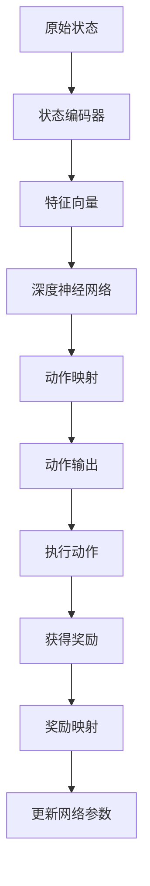

                 

# 《一切皆是映射：理解DQN的稳定性与收敛性问题》

> **关键词：** 强化学习、DQN、映射原理、稳定性、收敛性、深度神经网络。

> **摘要：** 本文深入探讨了深度Q网络（DQN）的稳定性和收敛性问题。通过分析映射原理在DQN中的应用，以及影响稳定性和收敛性的关键因素，本文提供了详细的算法原理讲解和实现案例，旨在为读者提供对DQN算法的全面理解和应用指导。

## 目录大纲

### 第一部分：背景与概念

#### 第1章：强化学习与DQN基础

- 1.1 强化学习的基本概念
- 1.2 DQN算法的诞生与发展
- 1.3 DQN算法的核心组成部分

#### 第2章：映射原理在DQN中的应用

- 2.1 映射的概念与重要性
- 2.2 DQN中的状态映射
- 2.3 动作映射与奖励映射

#### 第3章：DQN算法的稳定性分析

- 3.1 稳定性定义与衡量指标
- 3.2 稳定性在DQN中的作用
- 3.3 稳定性影响因子分析

### 第二部分：DQN的收敛性

#### 第4章：DQN收敛性原理

- 4.1 收敛性的定义与分类
- 4.2 DQN收敛性的衡量方法
- 4.3 DQN收敛性的重要性

#### 第5章：DQN收敛性影响因素

- 5.1 网络结构对收敛性的影响
- 5.2 学习率对收敛性的影响
- 5.3 权重初始化对收敛性的影响

#### 第6章：提升DQN收敛性的策略

- 6.1 双Q学习算法
- 6.2 目标网络技术
- 6.3 经验回放机制

#### 第7章：DQN应用案例分析

- 7.1 游戏领域中的应用
- 7.2 实际业务场景中的应用
- 7.3 DQN应用中的挑战与优化

### 第三部分：总结与展望

#### 第8章：DQN算法的稳定性与收敛性总结

- 8.1 算法优势与局限性
- 8.2 算法未来发展方向

#### 第9章：总结与展望

- 9.1 强化学习在其他领域的发展
- 9.2 DQN在深度学习中的地位与未来

#### 附录A：DQN算法实现细节

- A.1 DQN算法伪代码
- A.2 实现环境配置与工具
- A.3 DQN算法源代码解读

#### 附录B：参考资料与扩展阅读

- B.1 DQN相关论文推荐
- B.2 强化学习领域经典书籍
- B.3 深度学习领域最新进展

---

### 接下来，我们将逐步深入分析DQN的稳定性与收敛性问题。首先，让我们从强化学习和DQN的基础概念开始。### 

---

#### 第1章：强化学习与DQN基础

### 1.1 强化学习的基本概念

强化学习（Reinforcement Learning，简称RL）是机器学习的一个分支，主要研究如何通过试错的方法使一个智能体（Agent）在与环境（Environment）交互的过程中学习到最优策略（Policy）。在强化学习中，智能体根据当前的观察（Observation）选择一个动作（Action），然后环境根据这个动作给出一个奖励（Reward）和一个新的状态（State），这个过程不断重复，直到达到某个终止条件。

强化学习的基本概念包括以下几个部分：

- **智能体（Agent）**：执行动作并从环境中接收奖励的实体。
- **环境（Environment）**：智能体所在的情境，能够根据智能体的动作生成新的状态和奖励。
- **状态（State）**：描述环境状态的变量集合。
- **动作（Action）**：智能体可执行的行为。
- **策略（Policy）**：智能体在给定状态下执行的动作的规则。
- **价值函数（Value Function）**：评估状态或状态-动作对的预期奖励。
- **模型（Model）**：对环境状态的动态和奖励的预测。

强化学习的目标是通过学习到最优策略来最大化长期奖励累积。强化学习与监督学习和无监督学习的区别在于，它不依赖于预先标记的输入数据，而是通过奖励信号来指导学习过程。

### 1.2 DQN算法的诞生与发展

深度Q网络（Deep Q-Network，简称DQN）是强化学习中的一种算法，由DeepMind在2015年提出。DQN的主要目的是解决传统Q-learning算法在状态空间较大时难以处理的问题。Q-learning是一种值函数方法，它通过迭代更新策略来优化动作选择。

DQN的核心思想是将Q-learning算法中的Q函数（价值函数）通过一个深度神经网络（DNN）来近似。这样，当状态空间较大时，DQN可以有效地处理和逼近复杂的Q值。具体来说，DQN包括以下几个关键组成部分：

- **状态编码器（State Encoder）**：将原始状态编码为神经网络可以处理的特征向量。
- **深度神经网络（DNN）**：用于近似Q函数，输入是状态编码器输出的特征向量，输出是Q值。
- **目标网络（Target Network）**：用于稳定学习过程，通过定期更新与主网络参数保持一定差距的目标网络。

DQN的提出在强化学习领域引起了广泛关注，并在许多任务中取得了优异的性能。它的成功不仅在于解决了大规模状态空间的问题，还在于展示了深度学习在强化学习中的应用潜力。

### 1.3 DQN算法的核心组成部分

DQN算法的核心组成部分包括以下几个部分：

- **经验回放（Experience Replay）**：为了避免策略网络在训练过程中受到序列依赖的影响，DQN使用了经验回放机制。经验回放将智能体在环境中的交互经验（状态、动作、奖励、下一个状态）存储在一个经验池中，然后从经验池中随机抽样进行训练。
- **目标网络（Target Network）**：目标网络的作用是稳定学习过程，避免策略网络参数在训练过程中发生剧烈波动。目标网络定期从主网络复制参数，并在训练过程中使用。
- **损失函数（Loss Function）**：DQN使用平方误差损失函数来计算预测Q值与真实Q值之间的差距，从而更新网络参数。
- **学习率（Learning Rate）**：学习率用于调整网络参数的更新步长，对于DQN算法的收敛性和性能具有重要影响。

综上所述，DQN算法通过深度神经网络近似Q函数，结合经验回放、目标网络等策略，有效地解决了大规模状态空间下的强化学习问题。在接下来的章节中，我们将进一步探讨映射原理在DQN中的应用以及稳定性与收敛性的分析。

---

在了解了DQN的基础概念和核心组成部分之后，现在让我们深入探讨映射原理在DQN中的应用。映射原理是理解DQN工作原理的关键，它涉及到状态映射、动作映射和奖励映射等概念。通过了解这些映射过程，我们可以更好地理解DQN如何将复杂的环境状态转换为有效的动作选择。

### 2.1 映射的概念与重要性

映射（Mapping）在数学和计算机科学中是一个广泛使用的概念，它指的是从一个集合到另一个集合的某种形式的对应关系。在强化学习领域，映射原理同样重要，它用于描述如何将环境中的状态和动作映射到神经网络处理的特征空间中。映射的目的是通过简化和抽象化，使得复杂的输入和输出关系可以被有效的神经网络模型所理解和处理。

映射在DQN中的重要性体现在以下几个方面：

- **提高处理效率**：通过映射，DQN可以将高维的状态空间映射到低维的特征空间，从而减少计算复杂度，提高处理效率。
- **增强泛化能力**：映射有助于提取状态中的关键特征，从而提高DQN在不同场景下的泛化能力。
- **避免过拟合**：合理的映射可以防止神经网络对特定数据的学习过于依赖，从而避免过拟合现象。

### 2.2 DQN中的状态映射

状态映射是DQN中最为关键的映射过程之一。在强化学习中，状态通常是一个高维的向量，包含多种传感器数据、环境变量等。为了使深度神经网络能够有效地处理这些状态，DQN使用一个状态编码器（State Encoder）对状态进行映射。

状态编码器的任务是将原始状态转换为一个低维的特征向量，这个特征向量可以用于深度神经网络的输入。状态映射通常包括以下几个步骤：

1. **数据预处理**：对原始状态数据进行归一化、标准化等预处理操作，以消除不同维度数据之间的差异。
2. **特征提取**：通过特征提取方法（如卷积神经网络、自编码器等）提取状态中的关键特征。
3. **特征融合**：将提取到的特征进行融合，生成一个低维的特征向量。

状态映射的具体实现可以根据具体任务和环境进行调整。例如，在游戏领域，状态映射可能涉及将屏幕图像转换为像素值，然后通过卷积神经网络提取图像特征。而在机器人领域，状态映射可能涉及将传感器数据（如激光雷达、陀螺仪、加速度计等）转换为特征向量。

### 2.3 动作映射与奖励映射

除了状态映射，动作映射和奖励映射也是DQN中的重要组成部分。

**动作映射**是将智能体可执行的动作映射到神经网络的可选动作空间中。在DQN中，动作映射通常是一个简单的映射过程，即将动作的编号转换为神经网络中的输出。例如，如果智能体有五个可选动作，则神经网络输出层将有五个节点，每个节点对应一个动作。

**奖励映射**是将环境给出的奖励信号转换为神经网络可处理的数值形式。奖励信号可以是正的、负的或零，它反映了智能体动作的有效性。在DQN中，奖励映射通常通过以下步骤进行：

1. **奖励缩放**：将原始奖励信号进行缩放，以适应神经网络的输入范围。例如，将原始奖励信号除以一个常数，使其在-1到1之间。
2. **奖励折扣**：为了考虑长期奖励，DQN通常使用折扣因子（Discount Factor）将未来的奖励进行折扣。这样可以确保神经网络更加关注近期奖励。
3. **奖励聚合**：将多个时间步的奖励信号进行聚合，生成一个最终的奖励值，用于更新网络参数。

动作映射和奖励映射的过程如图1所示：



图1：DQN中的状态映射、动作映射和奖励映射过程

通过状态映射、动作映射和奖励映射，DQN能够有效地将环境中的复杂信息转换为神经网络可以处理的特征空间，并据此选择最优动作。这些映射过程不仅提高了算法的处理效率，还增强了其泛化能力和鲁棒性。

在下一章节中，我们将进一步分析DQN算法的稳定性，探讨其在实际应用中的表现和影响因子。

### 3.1 稳定性定义与衡量指标

稳定性是评价DQN算法性能的一个重要指标，它反映了算法在处理不同状态时保持一致性和可靠性的能力。稳定性不仅影响算法的学习效率，还直接关系到智能体在复杂环境中的表现。

**稳定性的定义**：

稳定性可以理解为算法在处理不同输入（状态）时，输出（动作）的一致性和可靠性。一个稳定的DQN算法能够在各种不同的状态场景下做出合理的动作选择，而不是因为一些偶然因素导致动作选择产生偏差。

**衡量指标**：

衡量DQN算法稳定性的主要指标包括：

- **动作选择的一致性**：算法在相同状态下选择动作的一致性程度。一致性越高，算法的稳定性越好。
- **学习过程的平稳性**：算法在训练过程中参数更新的平稳性，即算法能否在长时间的训练过程中保持稳定的性能。
- **对环境变化的适应性**：算法在面对环境变化时，能否迅速适应并保持稳定的性能。

为了更具体地衡量稳定性，可以采用以下方法：

- **性能指标对比**：对比算法在相同任务下使用不同随机种子或不同训练数据集时的性能表现，评估算法的一致性。
- **标准差计算**：计算算法在不同测试场景下的输出动作标准差，标准差越小，说明算法的稳定性越好。
- **学习曲线分析**：通过分析算法在不同训练阶段的学习曲线，评估算法参数更新的平稳性。

### 3.2 稳定性在DQN中的作用

稳定性在DQN中的作用至关重要，主要体现在以下几个方面：

- **避免过拟合**：稳定性好的DQN算法能够在不同状态下保持一致的输出，从而避免对特定状态的过拟合。
- **提高泛化能力**：稳定的DQN算法可以更好地处理未见过的状态，提高其泛化能力。
- **优化学习效率**：稳定性好的DQN算法在训练过程中能够保持较为平稳的学习曲线，从而提高学习效率。

### 3.3 稳定性影响因子分析

DQN算法的稳定性受到多种因素的影响，以下是几个关键因子：

- **网络结构**：深度神经网络的层数、节点数和激活函数等结构参数会影响算法的稳定性。合理的网络结构可以提高算法的泛化能力和稳定性。
- **学习率**：学习率的大小直接影响到网络参数的更新速度和稳定性。过大的学习率可能导致算法震荡，过小的学习率则可能导致收敛缓慢。
- **经验回放**：经验回放机制可以减少训练数据的序列依赖，提高算法的稳定性。适当的回放频率和经验池大小对于保持稳定性非常重要。
- **目标网络**：目标网络通过定期更新主网络参数，可以稳定学习过程，提高算法的稳定性。

在下一章节中，我们将进一步探讨DQN算法的收敛性原理，分析其收敛性的定义、分类以及衡量方法。

## 第4章：DQN收敛性原理

### 4.1 收敛性的定义与分类

收敛性（Convergence）是强化学习中的一个核心概念，它描述了算法在多次迭代后，学习到的策略是否趋近于最优策略。在DQN算法中，收敛性指的是算法通过不断更新网络参数，使得Q值逐渐趋近于真实Q值的过程。

**收敛性的定义**：

收敛性可以理解为算法在多次迭代后，价值函数（例如Q值函数）逐渐稳定在一个固定值或值域的过程。在DQN中，收敛性指的是算法通过经验回放、目标网络等技术，使得预测Q值与真实Q值的差距不断减小，最终达到稳定状态。

**收敛性的分类**：

根据收敛性的不同特点，可以将收敛性分为以下几类：

- **弱收敛性**：算法在多次迭代后，价值函数的值域逐渐稳定，但并不一定收敛到某一特定值。
- **强收敛性**：算法在多次迭代后，价值函数的值收敛到一个固定值或值域。
- **渐进收敛性**：算法在长时间内逐渐趋近于最优策略，但短期内可能存在波动。

**DQN中的收敛性**：

在DQN中，收敛性主要通过以下两个指标来衡量：

- **Q值稳定**：算法在多次迭代后，预测Q值与真实Q值的差距较小，表明算法的Q值已经趋于稳定。
- **策略稳定**：算法在多次迭代后，选择动作的策略不再发生显著变化，表明算法已经找到或接近最优策略。

### 4.2 DQN收敛性的衡量方法

衡量DQN收敛性可以从多个方面进行，以下是一些常用的衡量方法：

- **Q值变化率**：计算连续几次迭代的预测Q值与真实Q值之间的差距变化率，如果变化率较小，则说明算法趋于收敛。
- **动作选择一致性**：计算算法在多次迭代中选择同一动作的概率，一致性越高，说明算法趋于收敛。
- **学习曲线**：绘制算法在不同迭代阶段的学习曲线，通过曲线的平稳性来判断算法的收敛性。
- **测试集性能**：在测试集上评估算法的性能，如果算法在测试集上的性能稳定且不再发生显著变化，则说明算法已经收敛。

**具体衡量方法**：

- **Q值变化率**：

  $$ \Delta Q = |Q_{t+1} - Q_{t}| $$

  其中，\( Q_{t} \)和\( Q_{t+1} \)分别表示第\( t \)次迭代和第\( t+1 \)次迭代时的预测Q值。

- **动作选择一致性**：

  $$ Consistency = \frac{Count(相同动作)}{Total(动作次数)} $$

  其中，\( Count(相同动作) \)表示连续几次迭代中选择相同动作的次数，\( Total(动作次数) \)表示总的动作选择次数。

- **学习曲线**：

  绘制学习曲线，分析算法在不同迭代阶段Q值和动作选择的变化情况。

- **测试集性能**：

  在测试集上计算平均奖励值和动作选择标准差，分析算法在不同测试场景下的稳定性和性能。

### 4.3 DQN收敛性的重要性

DQN收敛性的重要性体现在以下几个方面：

- **优化性能**：收敛性好的DQN算法能够更快地找到最优策略，提高学习效率。
- **稳定性**：收敛性好的DQN算法在处理不同状态时，能够保持稳定的性能，避免因状态波动导致的性能下降。
- **泛化能力**：收敛性好的DQN算法在未见过的状态中，仍能保持较好的性能，提高其泛化能力。

在下一章节中，我们将分析影响DQN收敛性的因素，并探讨如何提升DQN的收敛性。

## 第5章：DQN收敛性影响因素

DQN的收敛性是其在强化学习任务中表现优劣的关键因素。为了理解DQN的收敛性，我们需要分析影响其收敛性的各种因素，包括网络结构、学习率和权重初始化等。通过深入探讨这些因素，我们可以找到提升DQN收敛性的有效策略。

### 5.1 网络结构对收敛性的影响

网络结构是DQN算法的核心组成部分，它直接影响算法的收敛速度和性能。网络结构的几个关键方面包括层数、节点数和激活函数。

**层数和节点数**：

网络层数和节点数决定了DQN的模型复杂度和学习能力。较多的网络层和节点可以提取更复杂的状态特征，但也会增加计算成本和过拟合的风险。因此，选择合适的网络结构对于收敛性至关重要。

- **网络层数**：在DQN中，较多的网络层有助于提取更多的特征信息，但过多的层可能会导致梯度消失或爆炸问题，影响收敛速度。研究表明，两层或三层卷积神经网络通常是一个较好的选择。
- **节点数**：节点的数量需要平衡模型的表达能力和计算效率。过多的节点可能导致模型过于复杂，难以训练；过少的节点则可能无法捕捉足够的状态信息。

**激活函数**：

激活函数是神经网络中的关键组件，它决定了神经元输出与输入之间的关系。常用的激活函数包括ReLU（Rectified Linear Unit）、Sigmoid和Tanh等。

- **ReLU**：ReLU函数具有简单、计算效率高且不易梯度消失的优点，但可能在某些情况下导致神经元死亡现象。
- **Sigmoid和Tanh**：Sigmoid和Tanh函数在输出范围和梯度方面较为平滑，有助于稳定训练过程，但可能增加计算复杂度。

**网络结构对收敛性的影响**：

合理的网络结构可以提高DQN的收敛速度和性能。例如，使用预训练的卷积神经网络（如VGG或ResNet）作为状态编码器，可以有效提取状态特征，减少训练时间并提高收敛性。

### 5.2 学习率对收敛性的影响

学习率是DQN算法中另一个关键参数，它决定了网络参数更新的步长。学习率的选择对DQN的收敛性和性能有显著影响。

**学习率的设定**：

- **初始学习率**：初始学习率过高可能导致模型参数更新过快，引起震荡，难以收敛；初始学习率过低则可能导致收敛速度过慢。
- **衰减策略**：为了在训练初期快速收敛，同时避免在训练后期收敛过快导致性能下降，通常采用指数衰减策略来调整学习率。

**学习率对收敛性的影响**：

- **过高的学习率**：过高的学习率可能导致模型在训练过程中出现剧烈震荡，甚至导致梯度消失或爆炸，从而影响收敛。
- **过低的学习率**：过低的学习率会使得模型更新缓慢，难以在训练早期快速找到最优解，从而延长训练时间。

**最佳学习率的选取**：

- **实验调优**：通过实验寻找最佳学习率，可以采用小批量数据集进行网格搜索，逐步调整学习率并评估算法性能。
- **自适应调整**：使用自适应学习率方法（如Adam优化器），根据训练过程中的梯度信息动态调整学习率，以提高收敛性和性能。

### 5.3 权重初始化对收敛性的影响

权重初始化是神经网络训练过程中的一个重要步骤，它影响梯度传播和网络的收敛速度。在DQN中，合理的权重初始化对于算法的收敛性至关重要。

**权重初始化方法**：

- **随机初始化**：随机初始化权重可以避免梯度消失或爆炸问题，但可能导致训练过程不稳定。
- **预训练初始化**：使用预训练网络（如ImageNet上的卷积神经网络）的权重初始化，可以提供良好的初始化值，提高收敛速度和性能。

**权重初始化对收敛性的影响**：

- **不合理的权重初始化**：不合理的权重初始化可能导致网络无法有效学习状态特征，从而影响收敛速度和性能。
- **合适的权重初始化**：合适的权重初始化可以提高网络的收敛速度和稳定性，减少训练过程中的震荡。

**权重初始化的最佳实践**：

- **小批量随机初始化**：对于随机初始化，可以使用小批量数据计算均值和方差，然后对权重进行标准化处理，以提高初始化的稳定性。
- **预训练初始化**：对于预训练初始化，可以使用预训练网络的权重作为初始化值，并在此基础上进行微调，以提高收敛速度。

通过优化网络结构、学习率和权重初始化，可以显著提高DQN算法的收敛性和性能。在下一章节中，我们将探讨提升DQN收敛性的具体策略。

## 第6章：提升DQN收敛性的策略

为了提高DQN算法的收敛性，研究者们提出了一系列策略，包括双Q学习算法、目标网络技术和经验回放机制等。这些策略旨在通过不同的机制和调整，减少训练过程中的不稳定性和提高算法的鲁棒性。

### 6.1 双Q学习算法

双Q学习（Double Q-Learning）是DQN的一种改进算法，通过使用两个独立的Q网络来提高学习的稳定性和准确性。在传统DQN中，Q网络根据当前状态和动作预测Q值，并据此更新网络参数。然而，这种单Q网络的更新过程可能导致Q值的偏差，从而影响收敛性。

双Q学习算法的核心思想是使用两个Q网络：一个作为预测网络（Prediction Network），用于产生动作值；另一个作为目标网络（Target Network），用于生成目标Q值。具体步骤如下：

1. **选择动作**：智能体根据预测网络产生的动作值选择动作。
2. **获取奖励和下一个状态**：环境根据执行的动作给出奖励，并生成下一个状态。
3. **更新预测网络**：使用当前状态的Q值和下一个状态的动作值，更新预测网络的权重。
4. **更新目标网络**：定期从预测网络复制参数，更新目标网络的权重，确保目标网络与预测网络保持一定差距。

通过使用双Q学习，可以减少因Q值估计偏差导致的不稳定性，提高算法的收敛速度和准确性。

### 6.2 目标网络技术

目标网络（Target Network）是DQN中用于稳定学习过程的重要机制。目标网络的目的是提供稳定的Q值参考，从而减少Q值估计的波动，提高算法的收敛性。

目标网络的实现步骤如下：

1. **初始化目标网络**：在训练初期，目标网络与预测网络具有相同的参数。
2. **定期更新**：在DQN的更新过程中，定期从预测网络复制参数到目标网络，确保目标网络与预测网络保持一定差距。
3. **生成目标Q值**：使用目标网络生成的Q值作为目标值，用于更新预测网络的权重。
4. **同步更新**：在训练过程中，定期同步预测网络和目标网络的参数，以确保两者之间的一致性。

目标网络技术的核心思想是通过保持两个网络的参数差距，减少Q值估计的波动，从而提高算法的稳定性和收敛性。

### 6.3 经验回放机制

经验回放（Experience Replay）是DQN中用于处理序列依赖问题的重要机制。在强化学习中，智能体的动作选择受到之前状态的影响，这可能导致训练过程的不稳定。经验回放通过存储和随机回放智能体在环境中的交互经验，减少了训练数据的序列依赖，从而提高了算法的稳定性和收敛性。

经验回放机制的实现步骤如下：

1. **经验存储**：将智能体在环境中交互产生的状态、动作、奖励和下一个状态存储在一个经验池（Experience Replay Buffer）中。
2. **经验回放**：从经验池中随机抽取一组交互经验，用于训练预测网络。
3. **数据扩充**：通过重放和随机化，增加训练数据的多样性，减少过拟合现象。

经验回放机制的核心作用是减少训练数据的序列依赖，从而减少学习过程中的波动，提高算法的稳定性和收敛性。

### 6.4 其他提升策略

除了双Q学习、目标网络和经验回放机制，还有一些其他策略可以提升DQN的收敛性：

- **优先经验回放**：根据经验的重要程度（如奖励大小）进行回放，优先处理重要经验，提高训练效率。
- **目标更新策略**：调整目标网络的更新频率，根据训练阶段的不同动态调整目标网络的更新策略，提高算法的稳定性和收敛性。
- **自适应学习率**：使用自适应学习率方法，根据训练过程中的梯度变化动态调整学习率，提高收敛速度和性能。

通过以上策略的引入和优化，DQN算法的收敛性得到了显著提升，从而在复杂环境中表现出更好的学习效果和鲁棒性。

在下一章节中，我们将通过实际案例分析，探讨DQN在游戏和实际业务场景中的应用，并分析其中的挑战和优化策略。

## 第7章：DQN应用案例分析

深度Q网络（DQN）作为一种高效的强化学习算法，在游戏和实际业务场景中得到了广泛应用。通过实际案例的分析，我们可以更好地理解DQN的应用场景、挑战以及优化策略。

### 7.1 游戏领域中的应用

**DQN在Atari游戏中的应用**：

DQN最初是在Atari游戏上展示其强大能力的。研究人员通过DQN算法训练智能体，使其能够在《太空侵略者》（Space Invaders）等经典游戏中实现自我学习，并达到超越人类玩家的水平。DQN在这些游戏中的成功应用展示了其处理高维状态和连续动作的能力。

**挑战与优化策略**：

- **状态维度高**：Atari游戏中的状态空间通常非常高维，包含大量的像素信息。这给DQN的学习带来了巨大的计算负担和过拟合风险。
- **优化策略**：为了解决这些问题，研究人员采用了一些优化策略，如经验回放机制、双Q学习和目标网络技术。这些策略有助于减少过拟合、提高收敛性和稳定性。
- **超参数调优**：通过实验调优学习率、经验回放缓冲区大小等超参数，找到最优配置，以提升DQN的性能。

**应用案例**：

- **《魔兽世界》中的自动游戏**：通过DQN算法，研究人员开发出了能够自动进行《魔兽世界》游戏的智能体，这为游戏玩家提供了新的互动体验。

### 7.2 实际业务场景中的应用

**机器人控制**：

在机器人控制领域，DQN被广泛应用于路径规划、目标跟踪和自主导航等任务中。例如，研究人员使用DQN训练机器人，使其能够在复杂环境中自主完成搬运任务。

**挑战与优化策略**：

- **环境不确定性**：实际业务场景中的环境通常存在高度不确定性和动态变化，这对DQN的稳定性和鲁棒性提出了挑战。
- **数据收集**：在实际环境中收集有效的训练数据是一个复杂的过程，需要考虑数据多样性和环境条件。
- **优化策略**：为了应对这些挑战，研究人员采用了以下优化策略：
  - **多任务学习**：通过同时训练多个任务，提高DQN的泛化能力。
  - **增量学习**：在训练过程中，逐步增加环境的复杂度，使DQN逐渐适应复杂环境。
  - **强化数据增强**：通过图像增强、状态融合等方法，增加训练数据的多样性，提高DQN的学习效果。

**应用案例**：

- **亚马逊仓库自动化**：亚马逊使用DQN算法优化仓库中的自动搬运机器人路径规划，提高了仓库运营效率。

### 7.3 DQN应用中的挑战与优化

**挑战**：

- **计算资源**：DQN算法对计算资源的需求较高，尤其是在处理高维状态时。这限制了其在某些实时应用中的使用。
- **数据质量**：训练数据的质量对DQN的性能有直接影响。在实际应用中，获取高质量、多样化的训练数据是一个挑战。
- **环境变化**：实际业务场景中的环境变化可能导致DQN的表现下降，需要算法能够快速适应新环境。

**优化策略**：

- **分布式训练**：通过使用分布式计算资源，可以显著提高DQN的训练速度和效率。
- **数据增强**：通过图像处理、生成对抗网络（GAN）等方法，生成高质量的训练数据，提高DQN的学习效果。
- **迁移学习**：使用预训练模型或迁移学习技术，减少在特定环境中的训练需求，提高算法的泛化能力。

通过以上案例分析，我们可以看到DQN在游戏和实际业务场景中的应用前景及其面临的挑战。通过优化策略的引入，DQN在解决复杂任务方面表现出了强大的潜力。

在下一章节中，我们将总结DQN算法的稳定性与收敛性，并探讨其未来发展方向。

## 第8章：DQN算法的稳定性与收敛性总结

深度Q网络（DQN）作为强化学习领域的一项重要算法，其在稳定性与收敛性方面具有显著的优势，但也存在一些局限性。通过对DQN算法的稳定性与收敛性进行总结，我们可以更好地理解其工作原理，并探索未来发展方向。

### 8.1 算法优势与局限性

**优势**：

1. **处理高维状态**：DQN通过深度神经网络近似Q函数，能够有效地处理高维状态空间，这在传统的Q-learning算法中是一个巨大的挑战。
2. **适应性**：DQN通过经验回放机制减少了序列依赖问题，使得算法更加适应不同环境和任务。
3. **可扩展性**：DQN算法的结构和策略使得其在多个领域（如游戏、机器人控制等）具有广泛的应用潜力。
4. **鲁棒性**：通过目标网络技术和双Q学习算法，DQN能够提高学习的稳定性和准确性，减少过拟合现象。

**局限性**：

1. **计算资源需求**：DQN对计算资源的需求较高，特别是在处理高维状态时，这限制了其在某些实时应用中的使用。
2. **训练时间**：DQN的训练过程通常需要较长时间，特别是在数据量较大或状态空间复杂的任务中。
3. **数据质量**：训练数据的质量对DQN的性能有直接影响，但在实际应用中，获取高质量、多样化的训练数据是一个挑战。
4. **收敛速度**：在某些情况下，DQN的收敛速度可能较慢，尤其是在高度动态或变化迅速的环境中。

### 8.2 算法未来发展方向

为了进一步提升DQN算法的稳定性和收敛性，研究者们提出了以下几个未来发展方向：

1. **更高效的算法**：开发更高效的DQN变体，如基于图神经网络（Graph Neural Networks，GNN）的DQN，以处理更复杂的图结构数据。
2. **自适应学习策略**：引入自适应学习率、自适应更新策略等，以提高DQN的训练效率和学习速度。
3. **多任务学习**：通过多任务学习技术，使DQN能够同时处理多个任务，提高其泛化能力。
4. **迁移学习**：结合迁移学习技术，利用预训练模型减少在特定环境中的训练需求，提高算法的泛化能力和适应性。
5. **分布式训练**：利用分布式计算资源，提高DQN的训练速度和效率，使其在实时应用中更具竞争力。
6. **强化数据增强**：通过强化数据增强方法，生成高质量、多样化的训练数据，提高DQN的学习效果。
7. **算法融合**：将DQN与其他强化学习算法（如深度确定性策略梯度（DDPG）、异步优势演员-评论家（A3C）等）结合，形成更强大的算法体系。

通过不断优化和发展，DQN算法有望在更广泛的领域中展现出其潜力，解决更多复杂的强化学习问题。

在下一章节中，我们将总结本文的主要观点，并展望强化学习领域的发展趋势。

## 第9章：总结与展望

通过本文的深入探讨，我们系统地分析了DQN算法的稳定性与收敛性问题。首先，我们介绍了强化学习与DQN的基础概念，并详细解释了状态映射、动作映射和奖励映射在DQN中的应用。接着，我们讨论了DQN算法的稳定性和收敛性原理，分析了影响其收敛性的关键因素，包括网络结构、学习率和权重初始化。此外，我们还介绍了提升DQN收敛性的几种策略，如双Q学习、目标网络和经验回放机制。最后，我们通过实际案例分析展示了DQN在游戏和实际业务场景中的应用及其挑战。

### 总结

本文的主要观点可以概括为以下几点：

1. **强化学习与DQN的基础概念**：强化学习是一种通过试错方法进行学习的机器学习方法，DQN是其中一种利用深度神经网络近似Q函数的算法。
2. **映射原理的重要性**：映射原理在DQN中用于将高维状态转换为低维特征向量，从而提高处理效率和泛化能力。
3. **稳定性与收敛性分析**：稳定性是DQN算法性能的关键指标，收敛性则决定了算法是否能够找到最优策略。
4. **提升收敛性的策略**：通过双Q学习、目标网络和经验回放机制，可以有效提升DQN的收敛性。
5. **DQN的应用与挑战**：DQN在游戏和实际业务场景中表现出强大的潜力，但也面临计算资源需求高、训练时间长等挑战。

### 展望

展望未来，强化学习领域仍有许多研究和发展方向：

1. **算法优化**：研究人员将继续探索更高效的算法，以提高DQN的训练效率和收敛速度。
2. **多任务学习**：通过多任务学习技术，DQN能够同时处理多个任务，提高其泛化能力和实用性。
3. **迁移学习**：结合迁移学习技术，DQN可以更快速地适应新环境和新任务。
4. **分布式训练**：利用分布式计算资源，可以显著提高DQN的训练速度和效率。
5. **强化数据增强**：通过数据增强方法，生成高质量、多样化的训练数据，提高DQN的学习效果。
6. **与其他算法的融合**：DQN与其他强化学习算法的结合，将形成更强大的算法体系，解决更复杂的强化学习问题。

总之，DQN作为强化学习领域的重要算法，具有广泛的应用前景和潜力。随着技术的不断发展和优化，DQN将在更多的领域中发挥重要作用，推动人工智能的发展。

## 附录A：DQN算法实现细节

### A.1 DQN算法伪代码

以下是DQN算法的伪代码，展示了算法的基本流程和关键步骤：

```python
# 初始化参数
初始化预测网络Q(s, a)
初始化目标网络Target_Q(s, a)
经验回放缓冲区经验池
学习率α
经验回放比例ε
折扣因子γ

# 主循环（每次迭代）
for episode in range(总迭代次数):
    # 初始化环境
    状态s = 环境初始化()
    总奖励R = 0
    while not 环境终止():
        # 随机选择动作（epsilon-greedy策略）
        if 随机数 < ε:
            a = 随机选择动作()
        else:
            a = 预测网络选择最佳动作(s)

        # 执行动作
        下一个状态s'，奖励R' = 环境执行动作(a)
        R += R'

        # 存储经验
        存储经验(s, a, R, s')

        # 更新状态
        s = s'

    # 从经验池中随机抽取一批经验
    mini_batch = 随机抽取经验池中的经验()

    # 更新预测网络
    for (s, a, R, s') in mini_batch:
        target_Q = R + γ * max(Target_Q(s'))
        Q预测[s, a] = Q预测[s, a] + α * (target_Q - Q预测[s, a])

    # 更新目标网络（每隔一定迭代次数）
    if 迭代次数 % 更新频率 == 0:
        复制预测网络参数到目标网络

    ε = ε * 减衰率  # 调整epsilon-greedy策略的贪婪程度
```

### A.2 实现环境配置与工具

要实现DQN算法，需要以下环境和工具：

- **编程语言**：Python
- **深度学习框架**：TensorFlow或PyTorch
- **环境库**：OpenAI Gym
- **计算资源**：GPU（NVIDIA CUDA兼容）
- **操作系统**：Linux或macOS

### A.3 DQN算法源代码解读

以下是使用TensorFlow实现DQN算法的示例代码，并对关键部分进行了解释：

```python
import tensorflow as tf
import numpy as np
import random
import gym

# 初始化环境
env = gym.make('CartPole-v0')

# 定义DQN网络结构
input_shape = env.observation_space.shape
action_size = env.action_space.n

def create_q_network(input_shape, action_size, learning_rate):
    input_layer = tf.keras.layers.Input(shape=input_shape)
    x = tf.keras.layers.Conv2D(32, (8, 8), activation='relu')(input_layer)
    x = tf.keras.layers.Conv2D(64, (4, 4), activation='relu')(x)
    x = tf.keras.layers.Flatten()(x)
    x = tf.keras.layers.Dense(512, activation='relu')(x)
    output_layer = tf.keras.layers.Dense(action_size, activation='linear')(x)
    model = tf.keras.Model(inputs=input_layer, outputs=output_layer)
    model.compile(optimizer=tf.keras.optimizers.Adam(learning_rate))
    return model

# 初始化预测网络和目标网络
predict_net = create_q_network(input_shape, action_size, learning_rate=0.001)
target_net = create_q_network(input_shape, action_size, learning_rate=0.001)

# 定义经验回放缓冲区
经验池 = []

# 训练主循环
for episode in range(1000):
    state = env.reset()
    done = False
    total_reward = 0
    
    while not done:
        # epsilon-greedy策略
        if random.uniform(0, 1) < ε:
            action = random.choice(np.arange(action_size))
        else:
            action = np.argmax(predict_net.predict(state))

        # 执行动作
        next_state, reward, done, _ = env.step(action)
        total_reward += reward

        # 存储经验
        experience = (state, action, reward, next_state, done)
        经验池.append(experience)

        # 更新状态
        state = next_state
        
        # 从经验池中随机抽取一批经验
        if len(经验池) > batch_size:
            batch = random.sample(经验池, batch_size)
            经验池 = 经验池[batch_size:]
            
            # 更新预测网络
            for (s, a, r, s', d) in batch:
                target = r + (1 - d) * γ * np.max(target_net.predict(s'))
                predict_net.fit(np.expand_dims(s, axis=0), tf.convert_to_tensor([a]), tf.convert_to_tensor([target]), epochs=1, verbose=0)
            
    # 更新目标网络
    if episode % target_update_frequency == 0:
        target_net.set_weights(predict_net.get_weights())

    ε *= ε_decay

env.close()
```

在这个代码中，我们定义了DQN网络的架构，并通过epsilon-greedy策略选择动作。经验回放缓冲区用于存储和随机抽取训练样本，以提高算法的稳定性和收敛性。每完成一个episode后，我们更新预测网络和目标网络的权重，并逐步减小epsilon的值，以逐步减少随机动作的比例。

### 代码解读与分析

- **网络结构**：使用卷积神经网络（CNN）作为DQN的输入层，提取状态的特征。
- **epsilon-greedy策略**：在训练早期，通过随机动作探索环境，避免过早收敛。
- **经验回放缓冲区**：通过随机抽样，避免序列依赖问题，提高训练稳定性。
- **目标网络**：定期更新预测网络和目标网络的权重，以稳定学习过程。

通过以上代码和解读，我们可以实现一个基本的DQN算法，并在Atari游戏或其他环境中进行训练。

## 附录B：参考资料与扩展阅读

### B.1 DQN相关论文推荐

- **"Playing Atari with Deep Reinforcement Learning" (Mnih et al., 2015)**：这篇论文是DQN算法的原始提出，详细介绍了算法的架构和应用。
- **"Prioritized Experience Replication" (Schaul et al., 2015)**：这篇文章介绍了优先经验回放机制，对DQN算法的稳定性有显著提升。
- **"Asynchronous Methods for Deep Reinforcement Learning" (Hessel et al., 2018)**：这篇文章提出了异步优势演员-评论家（A3C）算法，对DQN算法进行了扩展。

### B.2 强化学习领域经典书籍

- **《强化学习：原理与Python实现》（Richard S. Sutton & Andrew G. Barto）**：这是一本经典的强化学习教材，全面介绍了强化学习的基本概念和算法。
- **《深度强化学习》（Alex Graves、IAAKS机器人与人工智能研究中心）**：这本书详细介绍了深度强化学习的基础知识和最新进展。

### B.3 深度学习领域最新进展

- **《深度学习》（Ian Goodfellow、Yoshua Bengio、Aaron Courville）**：这本书是深度学习领域的经典教材，涵盖了深度学习的基本理论和技术。
- **《强化学习：理论与实践》（Michael L. Littman）**：这本书从理论和实践两个角度全面介绍了强化学习。
- **《自监督学习的崛起：深度学习的新范式》（Yaser Abu-Mostafa、Shie Mannor、Rajesh Parekh）**：这本书探讨了自监督学习在深度学习中的应用，为强化学习提供了新的思路。

通过阅读这些参考资料和扩展阅读，可以更深入地了解DQN算法及其在强化学习领域的应用，掌握深度学习的最新进展。

