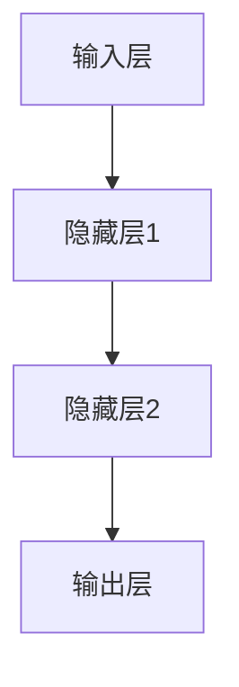

                 

### 《一切皆是映射：神经网络中的激活函数深度解析》

**关键词**：神经网络，激活函数，映射，深度学习，机器学习，计算机科学。

**摘要**：
本文深入解析了神经网络中的激活函数，从基本概念、分类到常见函数的详细解析，再到实际项目中的应用案例，全面阐述了激活函数在神经网络中的重要性。通过对激活函数的设计原则、优化方法以及未来发展趋势的探讨，本文为读者提供了对神经网络更深层次的理解，并展示了激活函数在各个领域的广泛应用。本文旨在为神经网络的研究者和开发者提供一个全面、详细的参考指南。

## 目录大纲

1. **引言**
   1.1 神经网络概述
   1.2 激活函数的重要性
   1.3 本书目标与结构
2. **神经网络基础**
   2.1 神经网络结构
   2.2 神经网络训练基础
   2.3 损失函数与优化器
3. **激活函数的概念与分类**
   3.1 激活函数的基本概念
   3.2 激活函数的分类
4. **常见激活函数详解**
   4.1 Sigmoid函数
   4.2 Tanh函数
   4.3 ReLU函数
   4.4 Leaky ReLU函数
   4.5 SELU函数
5. **激活函数的选型与应用**
   5.1 激活函数选型策略
   5.2 不同类型问题的激活函数应用
6. **激活函数的设计与优化**
   6.1 激活函数的设计原则
   6.2 激活函数的优化方法
7. **激活函数在实际项目中的应用案例**
   7.1 图像分类项目
   7.2 自然语言处理项目
8. **激活函数的未来发展趋势**
   8.1 激活函数研究现状
   8.2 未来研究方向
9. **附录**
   9.1 参考文献
   9.2 数学公式和解释
   9.3 代码示例与解读

## 第1章 引言

在深度学习和人工智能领域，神经网络已经成为一种强大且广泛使用的模型。而激活函数，作为神经网络中至关重要的一部分，对整个网络的性能和功能起着决定性的作用。本章将简要介绍神经网络的基本概念，激活函数的重要性，以及本书的结构和目标。

### 1.1 神经网络概述

神经网络（Neural Networks）是一种模仿人脑结构和功能的计算模型，由大量相互连接的神经元组成。每个神经元都可以接收多个输入信号，通过加权求和处理，产生一个输出信号。神经网络的基本结构通常包括输入层、隐藏层和输出层。

- **输入层**：接收外部输入数据。
- **隐藏层**：对输入数据进行特征提取和变换。
- **输出层**：产生最终输出结果。

神经网络的训练过程是通过调整网络中的权重和偏置来实现的，从而使网络能够对输入数据进行正确的分类或预测。训练过程中，通常会使用反向传播算法（Backpropagation Algorithm）来计算损失函数的梯度，并更新网络的权重和偏置。

### 1.2 激活函数的重要性

激活函数（Activation Function）是神经网络中的一个关键组件，它在每个神经元中起着非常重要的作用。激活函数的主要作用是引入非线性因素，使得神经网络能够从线性模型中脱颖而出，实现更复杂的函数表示能力。

- **引入非线性**：激活函数可以将线性组合的输出转化为非线性输出，使得神经网络能够学习到更为复杂的数据模式。
- **确定输出范围**：激活函数通常定义了一个输出范围，例如Sigmoid函数的输出范围在0到1之间，ReLU函数的输出范围在0到无穷大之间。这种限制有助于神经网络在训练过程中收敛。
- **引入非线性因素**：激活函数的引入使得神经网络能够从线性模型中摆脱出来，学习到更复杂的非线性关系。

不同的激活函数具有不同的性质和适用场景，因此在神经网络的设计和应用中，选择合适的激活函数至关重要。

### 1.3 本书目标与结构

本书旨在为读者提供对神经网络中激活函数的全面、深入的理解。具体目标包括：

- **介绍激活函数的基本概念和分类**：帮助读者了解激活函数的定义、作用和分类。
- **详细解析常见激活函数**：对Sigmoid、Tanh、ReLU、Leaky ReLU和SELU等常见激活函数进行详细讲解，包括数学模型、性质、优缺点和适用场景。
- **探讨激活函数的选型与应用**：介绍如何根据不同类型的问题选择合适的激活函数，并探讨激活函数在不同领域的应用案例。
- **设计原则与优化方法**：讨论激活函数的设计原则和优化方法，包括零中心性优化和动态调整优化。
- **未来发展趋势**：探讨激活函数的研究现状和未来发展趋势，展望新型激活函数的设计方向和跨领域应用。

为了实现上述目标，本书将按照以下结构进行组织：

1. **引言**：简要介绍神经网络和激活函数的基本概念，以及本书的目标和结构。
2. **神经网络基础**：介绍神经网络的基本结构、训练基础和损失函数与优化器。
3. **激活函数的概念与分类**：阐述激活函数的基本概念和分类。
4. **常见激活函数详解**：对常见激活函数进行详细讲解。
5. **激活函数的选型与应用**：探讨激活函数的选型策略和应用。
6. **激活函数的设计与优化**：讨论激活函数的设计原则和优化方法。
7. **激活函数在实际项目中的应用案例**：介绍激活函数在图像分类和自然语言处理等实际项目中的应用。
8. **激活函数的未来发展趋势**：探讨激活函数的研究现状和未来发展趋势。
9. **附录**：提供参考文献、数学公式和解释、代码示例与解读。

通过本书的学习，读者将能够深入了解激活函数在神经网络中的重要性，掌握常见激活函数的原理和应用，并为设计高效、稳定的神经网络模型提供理论支持。

## 第2章 神经网络基础

在深入探讨神经网络中的激活函数之前，我们需要对神经网络的基础知识有一个全面的了解。本章将介绍神经网络的基本结构、训练基础以及损失函数与优化器，为后续对激活函数的详细讲解打下坚实的基础。

### 2.1 神经网络结构

神经网络的基本结构由输入层、隐藏层和输出层组成，每个层包含多个神经元。下面我们将分别介绍每一层的作用和结构。

#### 2.1.1 输入层

输入层是神经网络的起点，负责接收外部输入数据。这些输入数据可以是各种形式，如数字、图像、文本等。输入层中的每个神经元表示一个输入特征，其值为该特征的取值。例如，一个包含100个特征的输入向量可以表示为（x1, x2, ..., x100），其中每个xi表示一个特征。

#### 2.1.2 隐藏层

隐藏层位于输入层和输出层之间，负责对输入数据进行特征提取和变换。隐藏层的神经元通常按层堆叠，每一层的神经元都与前一层和后一层的神经元相连。隐藏层的作用是将原始输入数据转化为更适合于分类或预测的表示形式。

隐藏层的数量和神经元数量可以根据问题的复杂程度进行调整。通常，随着隐藏层数量的增加，神经网络的表示能力也会增强，但训练时间也会相应增加。

#### 2.1.3 输出层

输出层是神经网络的终点，负责生成最终的预测结果。输出层的神经元数量和类型取决于具体问题。例如，对于一个二分类问题，输出层通常包含两个神经元，分别表示两个类别；对于一个多分类问题，输出层则包含多个神经元，每个神经元表示一个类别。

输出层的神经元通常采用softmax激活函数，用于计算各个类别的概率分布，从而实现分类任务。

### 2.1.4 Mermaid流程图

为了更好地理解神经网络的结构，我们可以使用Mermaid流程图来描述其基本组成部分。以下是一个简单的神经网络结构的Mermaid流程图：



在这个流程图中，A表示输入层，B、C分别表示隐藏层1和隐藏层2，D表示输出层。每个层中的神经元通过箭头表示它们之间的连接。

### 2.2 神经网络训练基础

神经网络训练的核心任务是调整网络中的权重和偏置，以最小化预测误差。这一过程通常通过以下步骤实现：

#### 2.2.1 数据预处理

在开始训练之前，需要对输入数据进行预处理。预处理步骤包括数据清洗、归一化、标准化等。这些操作有助于提高训练效率和网络性能。

- **数据清洗**：去除数据中的噪声和异常值，确保数据的准确性和一致性。
- **归一化**：将输入数据缩放到相同的范围，通常在0到1之间，以避免某些特征对模型的影响过大。
- **标准化**：将输入数据转换为均值为0、标准差为1的标准化形式，以便更好地处理不同的特征尺度。

#### 2.2.2 损失函数

损失函数（Loss Function）用于衡量预测结果与实际结果之间的差距。在训练过程中，通过优化损失函数来调整网络权重和偏置。常见的损失函数包括：

- **均方误差（MSE）**：用于回归问题，衡量预测值与实际值之间差距的平方和的平均值。
  $$\text{MSE} = \frac{1}{m} \sum_{i=1}^{m} (\hat{y}_i - y_i)^2$$
  其中，$m$表示样本数量，$\hat{y}_i$表示预测值，$y_i$表示实际值。

- **交叉熵（Cross-Entropy）**：用于分类问题，衡量预测概率分布与真实概率分布之间的差异。
  $$\text{CE} = -\frac{1}{m} \sum_{i=1}^{m} y_i \log(\hat{y}_i)$$
  其中，$y_i$表示实际类别，$\hat{y}_i$表示预测概率。

#### 2.2.3 优化器

优化器（Optimizer）用于调整网络权重和偏置，以最小化损失函数。常见的优化器包括：

- **梯度下降（Gradient Descent）**：通过计算损失函数的梯度，反向传播到网络中的每个权重和偏置，并沿梯度方向调整网络参数。
  $$\text{weights} \leftarrow \text{weights} - \alpha \cdot \frac{\partial \text{损失函数}}{\partial \text{weights}}$$
  其中，$\alpha$表示学习率。

- **动量（Momentum）**：在梯度下降的基础上引入动量项，加快收敛速度。
  $$\text{velocity} \leftarrow \beta \cdot \text{velocity} + (1 - \beta) \cdot \frac{\partial \text{损失函数}}{\partial \text{weights}}$$
  $$\text{weights} \leftarrow \text{weights} - \alpha \cdot \text{velocity}$$
  其中，$\beta$表示动量系数。

### 2.2.4 伪代码

以下是一个简单的神经网络训练过程的伪代码，展示了数据预处理、损失函数和优化器的应用：

```python
# 初始化神经网络
initialize_network()

# 预处理输入数据
X = preprocess_data(X)
y = preprocess_data(y)

# 训练神经网络
for epoch in range(num_epochs):
    # 前向传播
    predictions = forward_pass(X)
    
    # 计算损失
    loss = compute_loss(predictions, y)
    
    # 反向传播
    d_weights = backward_pass(predictions, y)
    
    # 更新权重和偏置
    update_weights(d_weights)
```

在这个伪代码中，`initialize_network()` 初始化神经网络，`preprocess_data()` 对输入数据进行预处理，`forward_pass()` 进行前向传播，`compute_loss()` 计算损失函数，`backward_pass()` 进行反向传播，`update_weights()` 更新网络权重和偏置。

### 2.3 损失函数与优化器

损失函数和优化器是神经网络训练过程中不可或缺的两个部分。选择合适的损失函数和优化器对网络性能和训练效率有重要影响。

- **损失函数**：选择合适的损失函数可以更好地衡量预测结果与实际结果之间的差距，从而更有效地指导网络参数的调整。例如，对于回归问题，选择MSE损失函数可以更好地拟合实际数据；对于分类问题，选择交叉熵损失函数可以更好地处理概率分布。

- **优化器**：优化器的选择影响网络的收敛速度和稳定性。常用的优化器包括梯度下降、动量、RMSprop、Adam等。梯度下降是最简单和常用的优化器，但收敛速度较慢；动量优化引入了动量项，可以加快收敛速度；RMSprop和Adam是更先进的优化器，通过自适应调整学习率，可以更快地收敛。

在训练神经网络时，可以根据具体问题和数据特点选择合适的损失函数和优化器。同时，也可以通过调整优化器的参数（如学习率、动量系数等）来优化网络性能。

### 总结

本章介绍了神经网络的基本结构、训练基础以及损失函数与优化器。通过对神经网络结构的了解，我们可以更好地理解神经网络的工作原理；通过训练基础的了解，我们可以掌握如何调整网络参数以优化性能；通过损失函数与优化器的了解，我们可以选择合适的工具来提高训练效率。这些基础知识为后续对激活函数的深入探讨提供了必要的背景。

在下一章中，我们将进一步探讨激活函数的基本概念和分类，帮助读者深入了解激活函数在神经网络中的作用和重要性。

## 第3章 激活函数的概念与分类

在深入探讨神经网络中的激活函数之前，我们需要对其基本概念有一个清晰的理解，并对常见的激活函数进行分类。本章将详细介绍激活函数的定义、作用以及常见的分类方法，为后续章节的详细解析奠定基础。

### 3.1 激活函数的基本概念

激活函数（Activation Function）是神经网络中用于引入非线性因素的关键组件。它定义了神经元输出的计算方式，使得神经网络能够从线性模型中脱颖而出，学习到更为复杂的非线性关系。激活函数通常作用于神经元的线性组合（即加权求和的结果），将其映射到新的数值范围。

激活函数的基本作用包括：

- **引入非线性**：激活函数将线性组合的输出转化为非线性输出，使得神经网络能够学习到复杂的数据模式。
- **确定输出范围**：激活函数定义了一个输出范围，例如Sigmoid函数的输出范围在0到1之间，ReLU函数的输出范围在0到无穷大之间。这种限制有助于神经网络在训练过程中收敛。
- **增加模型表达能力**：通过引入非线性，激活函数提高了神经网络的函数表示能力，使其能够处理更为复杂的问题。

在神经网络中，激活函数通常位于每个神经元的输出部分，将线性组合的结果映射到新的数值。这个过程可以表示为：

$$
\text{output} = \text{activation_function}(\text{weighted_sum})
$$

其中，`weighted_sum`表示神经元的线性组合结果，`activation_function`表示激活函数。

### 3.2 激活函数的分类

根据激活函数的性质和应用场景，可以将激活函数分为以下几类：

#### 3.2.1 线性激活函数

线性激活函数（Linear Activation Function）是最简单的一类激活函数，其输出与输入呈线性关系。常见的线性激活函数包括：

- **恒等函数（Identity Function）**：输出与输入相同，即 $f(x) = x$。这种函数在神经网络中没有引入任何非线性，因此主要用于简单的线性问题。
- **线性函数**：输出与输入成比例，即 $f(x) = ax + b$，其中 $a$ 和 $b$ 是常数。这种函数可以用于线性回归等简单的线性问题。

线性激活函数的优点是实现简单，计算效率高。但由于其输出与输入呈线性关系，无法引入非线性因素，因此适用于简单的线性问题，而难以处理复杂的非线性关系。

#### 3.2.2 非线性激活函数

非线性激活函数（Nonlinear Activation Function）通过引入非线性因素，使得神经网络能够学习到复杂的数据模式。常见的非线性激活函数包括：

- **Sigmoid函数**：输出范围为0到1之间，即 $f(x) = \frac{1}{1 + e^{-x}}$。这种函数常用于二分类问题，可以将输出映射到概率范围。
- **Tanh函数**：输出范围为-1到1之间，即 $f(x) = \frac{e^x - e^{-x}}{e^x + e^{-x}}$。这种函数可以放大中间值的输出，常用于多分类问题。
- **ReLU函数**：输出为输入值或0，即 $f(x) = \max(0, x)$。这种函数具有简单的计算和训练优势，常用于深层神经网络。
- **Leaky ReLU函数**：在ReLU函数的基础上添加了一个小参数，即 $f(x) = \max(0.01x, x)$。这种函数可以解决ReLU函数中死神经元的问题。

非线性激活函数的优点是能够引入非线性因素，提高神经网络的函数表示能力。但由于其非线性特性，可能会导致训练过程中的梯度消失或梯度爆炸问题。

#### 3.2.3 特殊激活函数

除了上述常见的激活函数外，还有一些特殊的激活函数，它们在特定场景下具有独特的优势。常见的特殊激活函数包括：

- **Softmax函数**：用于多分类问题，将输入映射到概率分布，即 $f(x) = \frac{e^x}{\sum_{i=1}^{n} e^x}$。这种函数可以输出各个类别的概率，常用于分类问题。
- **Softplus函数**：类似于ReLU函数，但输出为正，即 $f(x) = \log(1 + e^x)$。这种函数可以避免ReLU函数中的死神经元问题。
- **SELU函数**：一种自归一化激活函数，具有动态范围和正梯度，即 $f(x) = \lambda \cdot (\exp(\gamma \cdot x) - 1)$，其中 $\lambda$ 和 $\gamma$ 是常数。这种函数在深层神经网络中表现出良好的性能。

特殊激活函数通常用于特定类型的神经网络或问题，可以根据具体需求进行选择。

### 总结

本章介绍了激活函数的基本概念和分类，包括线性激活函数、非线性激活函数和特殊激活函数。通过了解激活函数的作用和分类，我们可以更好地理解激活函数在神经网络中的重要性，并为后续章节的详细解析打下基础。

在下一章中，我们将详细解析常见的激活函数，包括Sigmoid、Tanh、ReLU、Leaky ReLU和SELU等函数，帮助读者深入理解这些函数的数学模型、性质、优缺点和适用场景。

## 第4章 常见激活函数详解

在前一章中，我们介绍了激活函数的基本概念和分类。在本章中，我们将详细解析几种常见的激活函数，包括Sigmoid、Tanh、ReLU、Leaky ReLU和SELU，分析它们的数学模型、性质、优缺点以及适用场景。通过这些分析，我们将帮助读者更好地理解这些激活函数在实际神经网络中的应用。

### 4.1 Sigmoid函数

Sigmoid函数是一种常见的非线性激活函数，其数学模型为：

$$
\text{Sigmoid}(x) = \frac{1}{1 + e^{-x}}
$$

#### 4.1.1 Sigmoid函数的定义与性质

Sigmoid函数的定义域为所有实数，值域在0到1之间。函数的输出值随着输入值的增大而逐渐逼近1，随着输入值的减小而逐渐逼近0。这种Sigmoid函数的形状类似于“S”型，因此得名。

Sigmoid函数具有以下性质：

- **单调递增**：对于任意的 $x_1 < x_2$，有 $\text{Sigmoid}(x_1) < \text{Sigmoid}(x_2)$。
- **凹函数**：Sigmoid函数的二阶导数为正，因此是凹函数。

#### 4.1.2 Sigmoid函数的优缺点

Sigmoid函数的优点：

- **易于理解**：Sigmoid函数的数学模型简单，易于理解。
- **非线性引入**：通过引入非线性因素，可以增强神经网络的函数表示能力。
- **平滑梯度**：在训练过程中，Sigmoid函数的输出梯度值较平滑，有助于网络的稳定训练。

Sigmoid函数的缺点：

- **梯度消失**：当输入值远离0时，Sigmoid函数的梯度值接近0，容易导致梯度消失问题，从而影响网络的训练效果。
- **训练时间较长**：由于Sigmoid函数的梯度较小，需要较长的训练时间才能收敛。

#### 4.1.3 适用场景

Sigmoid函数适用于以下场景：

- **二分类问题**：由于Sigmoid函数的输出范围在0到1之间，非常适合用于二分类问题的概率输出。
- **简单非线性关系**：在需要引入非线性的简单问题中，Sigmoid函数是一个不错的选择。

### 4.2 Tanh函数

Tanh函数是一种类似于Sigmoid函数的激活函数，其数学模型为：

$$
\text{Tanh}(x) = \frac{e^x - e^{-x}}{e^x + e^{-x}}
$$

#### 4.2.1 Tanh函数的定义与性质

Tanh函数的定义域为所有实数，值域在-1到1之间。与Sigmoid函数类似，Tanh函数的输出值随着输入值的增大而逐渐逼近1，随着输入值的减小而逐渐逼近-1。Tanh函数的形状类似于“S”型，但相对于Sigmoid函数，其输出值范围更大。

Tanh函数具有以下性质：

- **单调递增**：对于任意的 $x_1 < x_2$，有 $\text{Tanh}(x_1) < \text{Tanh}(x_2)$。
- **凹函数**：Tanh函数的二阶导数为正，因此是凹函数。

#### 4.2.2 Tanh函数的优缺点

Tanh函数的优点：

- **梯度消失问题较轻**：与Sigmoid函数相比，Tanh函数的梯度消失问题较轻，因此在训练过程中更为稳定。
- **非线性引入**：通过引入非线性因素，可以增强神经网络的函数表示能力。

Tanh函数的缺点：

- **计算复杂度较高**：Tanh函数的计算复杂度高于Sigmoid函数，因此在某些情况下可能影响训练速度。

#### 4.2.3 适用场景

Tanh函数适用于以下场景：

- **复杂非线性关系**：在需要引入非线性的复杂问题中，Tanh函数是一个较好的选择。
- **多分类问题**：由于Tanh函数的输出值范围在-1到1之间，适合用于多分类问题。

### 4.3 ReLU函数

ReLU函数（Rectified Linear Unit）是一种简单且高效的激活函数，其数学模型为：

$$
\text{ReLU}(x) = \max(0, x)
$$

#### 4.3.1 ReLU函数的定义与性质

ReLU函数的定义域为所有实数，值域为非负实数。当输入值大于0时，ReLU函数输出输入值本身；当输入值小于等于0时，输出值为0。ReLU函数的形状类似于一个斜率为1的直线，在$x=0$处存在一个断点。

ReLU函数具有以下性质：

- **单调递增**：对于任意的 $x_1 < x_2$，有 $\text{ReLU}(x_1) \leq \text{ReLU}(x_2)$。
- **零中心性**：ReLU函数是零中心函数，即对于任意的输入值$x$，有$\text{ReLU}(-x) = -\text{ReLU}(x)$。

#### 4.3.2 ReLU函数的优缺点

ReLU函数的优点：

- **计算效率高**：ReLU函数的计算非常简单，且不需要计算指数运算，因此计算速度快。
- **避免梯度消失**：在训练过程中，ReLU函数避免了梯度消失问题，使得网络训练更为稳定。
- **深度神经网络表现优异**：ReLU函数在深度神经网络中表现出色，是当前最流行的激活函数之一。

ReLU函数的缺点：

- **死神经元问题**：当输入值小于0时，ReLU函数的梯度为0，可能导致神经元死亡，从而影响网络性能。

#### 4.3.3 适用场景

ReLU函数适用于以下场景：

- **深度神经网络**：在深度神经网络中，ReLU函数是首选的激活函数。
- **计算密集型任务**：由于ReLU函数的计算效率高，适合用于计算密集型任务。

### 4.4 Leaky ReLU函数

Leaky ReLU函数是在ReLU函数的基础上进行改进的一种激活函数，其数学模型为：

$$
\text{Leaky ReLU}(x) = \max(0.01x, x)
$$

#### 4.4.1 Leaky ReLU函数的定义与性质

Leaky ReLU函数的定义域为所有实数，值域为非负实数。当输入值大于0时，Leaky ReLU函数输出输入值本身；当输入值小于等于0时，输出值为输入值乘以一个较小的常数（通常取0.01）。Leaky ReLU函数的形状与ReLU函数类似，但在$x=0$处存在一个斜率较小的直线。

Leaky ReLU函数具有以下性质：

- **单调递增**：对于任意的 $x_1 < x_2$，有 $\text{Leaky ReLU}(x_1) \leq \text{Leaky ReLU}(x_2)$。
- **零中心性**：Leaky ReLU函数是零中心函数，即对于任意的输入值$x$，有$\text{Leaky ReLU}(-x) = -\text{Leaky ReLU}(x)$。

#### 4.4.2 Leaky ReLU函数的优缺点

Leaky ReLU函数的优点：

- **解决死神经元问题**：通过引入一个较小的常数，Leaky ReLU函数可以解决ReLU函数中的死神经元问题，从而提高网络性能。
- **计算效率高**：Leaky ReLU函数的计算效率与ReLU函数相似，因此计算速度快。

Leaky ReLU函数的缺点：

- **参数调整**：需要调整常数的大小，以避免过拟合或欠拟合。

#### 4.4.3 适用场景

Leaky ReLU函数适用于以下场景：

- **深度神经网络**：在深度神经网络中，Leaky ReLU函数可以替代ReLU函数，提高网络性能。
- **计算密集型任务**：由于Leaky ReLU函数的计算效率高，适合用于计算密集型任务。

### 4.5 SELU函数

SELU函数（Scaled Exponential Linear Unit）是一种自归一化激活函数，其数学模型为：

$$
\text{SELU}(x) = \lambda \cdot \text{elvix}(x)
$$

其中，$\text{elvix}(x) = \exp(\gamma \cdot x) - 1$ 且 $\lambda = 1.0507$，$\gamma = 1.6732$。

#### 4.5.1 SELU函数的定义与性质

SELU函数的定义域为所有实数，值域为所有实数。SELU函数在$x=0$处具有零中心性，其输出随着输入值的增大而逐渐增大，具有指数增长的趋势。

SELU函数具有以下性质：

- **自归一化**：SELU函数在训练过程中自动调整其尺度因子，从而避免了梯度消失和梯度爆炸问题。
- **单调递增**：对于任意的 $x_1 < x_2$，有 $\text{SELU}(x_1) \leq \text{SELU}(x_2)$。

#### 4.5.2 SELU函数的优缺点

SELU函数的优点：

- **自归一化**：SELU函数在训练过程中自动调整其尺度因子，从而避免了梯度消失和梯度爆炸问题，提高了网络的稳定性。
- **计算效率高**：SELU函数的计算效率与ReLU函数相似，因此计算速度快。

SELU函数的缺点：

- **参数调整**：虽然SELU函数具有自归一化特性，但在某些情况下，仍需要调整尺度因子和偏置，以优化网络性能。

#### 4.5.3 适用场景

SELU函数适用于以下场景：

- **深度神经网络**：在深度神经网络中，SELU函数表现出色，可以提高网络性能。
- **计算密集型任务**：由于SELU函数的计算效率高，适合用于计算密集型任务。

### 总结

本章详细解析了常见的激活函数，包括Sigmoid、Tanh、ReLU、Leaky ReLU和SELU。通过分析这些函数的数学模型、性质、优缺点和适用场景，我们帮助读者更好地理解激活函数在神经网络中的应用。在下一章中，我们将探讨激活函数的选型策略和应用，帮助读者根据不同类型的问题选择合适的激活函数。

## 第5章 激活函数的选型与应用

在了解了多种激活函数的数学模型、性质、优缺点和适用场景后，我们需要进一步探讨如何根据不同类型的问题选择合适的激活函数。正确的激活函数选型对于神经网络性能的提升至关重要。本章将详细介绍激活函数的选型策略，并分析激活函数在图像识别、自然语言处理和时间序列分析等不同领域的应用。

### 5.1 激活函数选型策略

激活函数的选型策略主要考虑以下几个因素：

1. **问题类型**：不同类型的问题可能需要不同的激活函数。例如，对于简单的线性问题，可以采用线性激活函数；对于复杂的非线性问题，可以采用Sigmoid、Tanh、ReLU等非线性激活函数。
2. **数据分布**：激活函数的选择应与数据的分布特性相匹配。例如，在数据分布不均匀的情况下，Sigmoid函数可能不太适合，因为其梯度在接近0和1时接近于0，容易导致梯度消失。
3. **计算资源**：激活函数的计算复杂度也会影响选型。例如，ReLU函数和Leaky ReLU函数的计算效率较高，而Sigmoid和Tanh函数的计算复杂度较高。
4. **网络深度**：在深度神经网络中，非线性激活函数如ReLU和Leaky ReLU表现出更好的性能，因为它们可以避免梯度消失问题。
5. **优化器**：不同的激活函数可能对不同的优化器表现更好。例如，ReLU和Leaky ReLU函数在Adam优化器下表现出较好的性能。

基于以上因素，我们可以采取以下策略进行激活函数的选型：

- **初步尝试**：在初步尝试中，可以使用通用的激活函数，如ReLU或Leaky ReLU，因为它们在大多数情况下都表现出良好的性能。
- **根据问题特性调整**：根据问题的类型和数据分布，选择适合的激活函数。例如，对于二分类问题，可以使用Sigmoid或Softmax函数；对于多分类问题，可以使用Softmax函数。
- **性能比较**：在不同激活函数之间进行性能比较，选择性能最佳的激活函数。
- **实验验证**：在实际应用中，通过实验验证选择的激活函数是否满足性能要求。

### 5.2 不同类型问题的激活函数应用

在本节中，我们将分析激活函数在图像识别、自然语言处理和时间序列分析等不同领域的应用。

#### 5.2.1 图像识别

图像识别是深度学习领域的一个重要应用，激活函数在其中起着关键作用。以下是一些常见的激活函数在图像识别中的应用：

- **ReLU函数**：在深度卷积神经网络（CNN）中，ReLU函数被广泛采用。它具有计算效率高、避免梯度消失等优点，适用于图像识别任务。
- **Leaky ReLU函数**：在ReLU函数容易导致死神经元的情况下，Leaky ReLU函数是一个较好的替代方案。它可以解决死神经元问题，提高网络性能。
- **Softmax函数**：在图像分类任务中，Softmax函数用于将神经网络的输出映射到概率分布，从而实现多分类。
- **Tanh函数**：Tanh函数在图像识别中较少使用，但在某些特殊场景下，如人脸识别，它可以提高网络的性能。

#### 5.2.2 自然语言处理

自然语言处理（NLP）是另一个深度学习的重要应用领域，激活函数在NLP模型中起着关键作用。以下是一些常见的激活函数在NLP中的应用：

- **ReLU函数**：ReLU函数在NLP模型中表现出较好的性能，尤其是在序列模型如循环神经网络（RNN）和长短时记忆网络（LSTM）中。
- **Tanh函数**：Tanh函数在NLP模型中也常用，特别是在词嵌入和序列建模中。它有助于避免梯度消失问题，提高模型性能。
- **Sigmoid函数**：Sigmoid函数在二分类问题中应用较多，如文本分类任务。它可以将词向量映射到概率范围，实现文本分类。
- **SELU函数**：SELU函数在NLP模型中表现出较好的性能，特别是在处理较长文本序列时。它具有自归一化特性，有助于避免梯度消失和梯度爆炸问题。

#### 5.2.3 时间序列分析

时间序列分析是深度学习领域的另一个重要应用，激活函数在时间序列预测模型中起着关键作用。以下是一些常见的激活函数在时间序列分析中的应用：

- **ReLU函数**：ReLU函数在时间序列预测模型中表现出较好的性能，特别是在序列建模模型如LSTM和GRU中。它有助于避免梯度消失问题，提高模型性能。
- **Tanh函数**：Tanh函数在时间序列预测模型中也常用，特别是在处理非线性时间序列数据时。它有助于避免梯度消失问题，提高模型性能。
- **Sigmoid函数**：Sigmoid函数在时间序列预测模型中较少使用，但在某些特殊场景下，如二分类问题，它可以提高网络的性能。
- **SELU函数**：SELU函数在时间序列预测模型中表现出较好的性能，特别是在处理较长的时间序列数据时。它具有自归一化特性，有助于避免梯度消失和梯度爆炸问题。

### 5.3 激活函数选型案例分析

为了更好地理解激活函数的选型策略，以下是一个简单的案例分析。

#### 案例一：图像分类

假设我们使用一个深度卷积神经网络（CNN）进行图像分类任务。在初步尝试中，我们可以选择ReLU函数作为激活函数。因为ReLU函数具有计算效率高、避免梯度消失等优点，在图像分类任务中表现出良好的性能。

在实际应用中，我们可以通过实验验证ReLU函数的性能，并与其他激活函数（如Leaky ReLU、Tanh）进行比较。根据实验结果，选择性能最佳的激活函数。

#### 案例二：文本分类

假设我们使用一个深度神经网络（DNN）进行文本分类任务。在初步尝试中，我们可以选择ReLU函数作为激活函数。因为ReLU函数在序列模型如RNN和LSTM中表现出较好的性能，有助于处理文本数据。

在实际应用中，我们可以通过实验验证ReLU函数的性能，并与其他激活函数（如Tanh、Sigmoid）进行比较。根据实验结果，选择性能最佳的激活函数。

#### 案例三：时间序列预测

假设我们使用一个长短时记忆网络（LSTM）进行时间序列预测任务。在初步尝试中，我们可以选择ReLU函数作为激活函数。因为ReLU函数在时间序列预测模型中表现出较好的性能，有助于避免梯度消失问题。

在实际应用中，我们可以通过实验验证ReLU函数的性能，并与其他激活函数（如Tanh、SELU）进行比较。根据实验结果，选择性能最佳的激活函数。

### 总结

本章详细介绍了激活函数的选型策略，并分析了激活函数在图像识别、自然语言处理和时间序列分析等不同领域的应用。通过了解激活函数的选型策略和应用案例，读者可以更好地根据不同类型的问题选择合适的激活函数，优化神经网络性能。

在下一章中，我们将探讨激活函数的设计原则和优化方法，帮助读者设计和优化激活函数，以实现更好的神经网络性能。

## 第6章 激活函数的设计与优化

在了解了激活函数的选型策略和应用之后，我们需要进一步探讨如何设计和优化激活函数，以实现更好的神经网络性能。本章将介绍激活函数的设计原则和优化方法，包括零中心性优化和动态调整优化。

### 6.1 激活函数的设计原则

设计一个高效的激活函数需要遵循以下原则：

1. **非线性特性**：激活函数应该能够引入非线性因素，使得神经网络能够学习到复杂的数据模式。
2. **梯度特性**：激活函数的梯度应该在整个定义域内都保持正值，以避免梯度消失和梯度爆炸问题。
3. **计算效率**：激活函数的计算过程应该简单高效，以减少计算资源的需求。
4. **平滑性**：激活函数应该具有一定的平滑性，以减少在训练过程中的振荡，提高训练稳定性。
5. **泛化能力**：激活函数应该具有良好的泛化能力，能够适应不同的数据分布和问题类型。

基于上述原则，设计一个新的激活函数时，需要综合考虑这些因素，找到一个平衡点，以实现高效且稳定的神经网络训练。

### 6.2 激活函数的优化方法

优化激活函数的方法可以分为两类：参数优化和非参数优化。

#### 6.2.1 零中心性优化

零中心性优化是一种参数优化方法，通过调整激活函数的参数，使其在训练过程中保持零中心性。这意味着激活函数的输出平均值接近于0，从而避免梯度消失问题。

零中心性优化通常通过以下步骤实现：

1. **初始化参数**：根据激活函数的公式，初始化参数值。
2. **动态调整参数**：在训练过程中，根据梯度信息动态调整参数值，使其逐渐趋于零中心性。
3. **验证参数效果**：通过实验验证调整后的参数对神经网络性能的影响，优化参数以达到最佳效果。

例如，对于ReLU函数，可以通过引入一个小常数来调整其零中心性：

$$
\text{Leaky ReLU}(x) = \max(0.01x, x)
$$

这种调整可以解决ReLU函数中的死神经元问题，提高网络性能。

#### 6.2.2 动态调整优化

动态调整优化是一种非参数优化方法，通过在训练过程中动态调整激活函数的输出范围，以提高网络的训练稳定性。

动态调整优化通常通过以下步骤实现：

1. **初始化输出范围**：根据激活函数的公式，初始化输出范围。
2. **计算输出范围误差**：根据梯度信息计算输出范围误差，即实际输出与期望输出之间的差异。
3. **调整输出范围**：根据输出范围误差，动态调整输出范围，使其逐渐趋于期望值。
4. **验证调整效果**：通过实验验证调整后的输出范围对神经网络性能的影响，优化输出范围以达到最佳效果。

例如，对于Sigmoid函数，可以通过调整其输出范围，使其在训练过程中更稳定：

$$
\text{Sigmoid}(x) = \frac{1}{1 + e^{-(\alpha x + \beta)}}
$$

其中，$\alpha$ 和 $\beta$ 是动态调整的参数。通过调整这两个参数，可以改变Sigmoid函数的输出范围，从而提高网络的训练稳定性。

#### 6.2.3 自适应调整优化

自适应调整优化是一种结合参数优化和非参数优化的方法，通过在训练过程中自适应调整激活函数的参数和输出范围，以提高网络的训练性能。

自适应调整优化通常通过以下步骤实现：

1. **初始化参数和输出范围**：根据激活函数的公式，初始化参数和输出范围。
2. **动态调整参数和输出范围**：在训练过程中，根据梯度信息和输出范围误差，动态调整参数和输出范围，使其逐渐趋于最佳状态。
3. **自适应调整策略**：采用自适应调整策略，根据训练阶段和梯度变化，调整参数和输出范围的调整力度。
4. **验证调整效果**：通过实验验证调整后的参数和输出范围对神经网络性能的影响，优化参数和输出范围以达到最佳效果。

例如，对于SELU函数，可以通过自适应调整其尺度因子和偏置，实现更好的训练性能：

$$
\text{SELU}(x) = \lambda \cdot (\exp(\gamma \cdot x) - 1)
$$

其中，$\lambda$ 和 $\gamma$ 是自适应调整的参数。通过在训练过程中调整这两个参数，可以优化SELU函数的性能。

### 6.3 激活函数优化案例分析

为了更好地理解激活函数的优化方法，以下是一个简单的案例分析。

#### 案例一：ReLU函数的优化

假设我们使用ReLU函数进行图像分类任务，但发现训练过程中存在梯度消失问题。为了解决这个问题，我们可以采用Leaky ReLU函数进行优化：

$$
\text{Leaky ReLU}(x) = \max(0.01x, x)
$$

通过引入一个小常数，Leaky ReLU函数可以解决ReLU函数中的死神经元问题，提高网络性能。

在实际应用中，我们可以通过实验验证Leaky ReLU函数的性能，并调整小常数的大小，以达到最佳效果。

#### 案例二：Sigmoid函数的优化

假设我们使用Sigmoid函数进行文本分类任务，但发现训练过程中存在振荡现象。为了解决这个问题，我们可以采用动态调整优化方法，调整Sigmoid函数的输出范围：

$$
\text{Sigmoid}(x) = \frac{1}{1 + e^{-(\alpha x + \beta)}}
$$

通过调整$\alpha$ 和 $\beta$ 参数，我们可以改变Sigmoid函数的输出范围，从而减少训练过程中的振荡现象。

在实际应用中，我们可以通过实验验证调整后的Sigmoid函数的性能，并优化参数以达到最佳效果。

#### 案例三：SELU函数的优化

假设我们使用SELU函数进行时间序列预测任务，但发现训练过程中存在梯度爆炸问题。为了解决这个问题，我们可以采用自适应调整优化方法，调整SELU函数的尺度因子和偏置：

$$
\text{SELU}(x) = \lambda \cdot (\exp(\gamma \cdot x) - 1)
$$

通过在训练过程中自适应调整$\lambda$ 和 $\gamma$ 参数，我们可以优化SELU函数的性能，避免梯度爆炸问题。

在实际应用中，我们可以通过实验验证调整后的SELU函数的性能，并优化参数以达到最佳效果。

### 总结

本章介绍了激活函数的设计原则和优化方法，包括零中心性优化、动态调整优化和自适应调整优化。通过了解这些优化方法，读者可以更好地设计和优化激活函数，实现更好的神经网络性能。

在下一章中，我们将通过实际项目案例，展示激活函数在图像分类和自然语言处理等实际应用中的效果和性能。

## 第7章 激活函数在实际项目中的应用案例

为了更好地展示激活函数在现实项目中的应用效果和性能，本章将详细介绍两个实际项目案例：图像分类项目和自然语言处理项目。通过这两个案例，我们将看到激活函数在不同类型问题中的应用，以及如何根据实际问题选择和调整激活函数。

### 7.1 图像分类项目

图像分类是深度学习领域的一个经典应用，常见的任务包括人脸识别、物体检测、图像分类等。在本案例中，我们将使用一个简单的图像分类项目，展示激活函数的选择和调整过程。

#### 7.1.1 项目背景

假设我们使用一个简单的图像分类项目，目标是将手写数字图像（MNIST数据集）分为10个类别。这个项目是一个典型的二分类问题，适合使用卷积神经网络（CNN）和激活函数进行模型构建。

#### 7.1.2 系统架构

该项目的系统架构主要包括以下几个部分：

1. **数据预处理**：对MNIST数据集进行预处理，包括数据归一化、图像切割、数据增强等。
2. **卷积神经网络（CNN）**：构建一个简单的CNN模型，包括多个卷积层、池化层和全连接层。
3. **激活函数**：选择适当的激活函数，如ReLU函数，用于增强模型的非线性能力。
4. **损失函数和优化器**：使用交叉熵损失函数和Adam优化器进行模型训练。
5. **模型评估**：使用准确率、召回率等指标评估模型性能。

#### 7.1.3 代码实现与解读

以下是一个简单的Python代码示例，用于实现上述架构的图像分类项目：

```python
import tensorflow as tf
from tensorflow.keras import layers, models
from tensorflow.keras.datasets import mnist
from tensorflow.keras.utils import to_categorical

# 数据预处理
(x_train, y_train), (x_test, y_test) = mnist.load_data()
x_train = x_train.reshape(-1, 28, 28).astype("float32") / 255.0
x_test = x_test.reshape(-1, 28, 28).astype("float32") / 255.0
y_train = to_categorical(y_train, 10)
y_test = to_categorical(y_test, 10)

# 构建CNN模型
model = models.Sequential([
    layers.Conv2D(32, (3, 3), activation='relu', input_shape=(28, 28, 1)),
    layers.MaxPooling2D((2, 2)),
    layers.Conv2D(64, (3, 3), activation='relu'),
    layers.MaxPooling2D((2, 2)),
    layers.Conv2D(64, (3, 3), activation='relu'),
    layers.Flatten(),
    layers.Dense(64, activation='relu'),
    layers.Dense(10, activation='softmax')
])

# 编译模型
model.compile(optimizer='adam', loss='categorical_crossentropy', metrics=['accuracy'])

# 训练模型
model.fit(x_train, y_train, epochs=10, batch_size=64, validation_split=0.2)

# 评估模型
test_loss, test_acc = model.evaluate(x_test, y_test)
print(f"Test accuracy: {test_acc:.3f}")
```

在这段代码中，我们首先进行数据预处理，将MNIST数据集转换为适合模型训练的格式。接着，我们构建了一个简单的CNN模型，包括三个卷积层、两个池化层和一个全连接层。在卷积层和全连接层中，我们使用ReLU函数作为激活函数，以提高模型的非线性能力。最后，我们使用交叉熵损失函数和Adam优化器进行模型训练，并通过评估模型在测试集上的性能来验证激活函数的效果。

#### 7.1.4 代码解读与分析

1. **数据预处理**：将MNIST数据集的图像转换为浮点数格式，并进行归一化处理，以适应模型的输入要求。
2. **模型构建**：使用`Sequential`模型构建器，依次添加卷积层、池化层、全连接层和softmax层。
3. **模型编译**：使用`compile`方法配置模型，包括优化器、损失函数和评估指标。
4. **模型训练**：使用`fit`方法训练模型，设置训练轮数、批量大小和验证集比例。
5. **模型评估**：使用`evaluate`方法评估模型在测试集上的性能，并输出准确率。

通过上述代码实现，我们可以看到激活函数在图像分类项目中的重要作用。ReLU函数作为非线性激活函数，提高了模型的非线性表示能力，有助于更好地分类手写数字图像。在实际项目中，根据具体问题和数据特点，我们可以选择和调整合适的激活函数，以优化模型性能。

### 7.2 自然语言处理项目

自然语言处理（NLP）是深度学习领域的另一个重要应用，涉及文本分类、情感分析、机器翻译等多种任务。在本案例中，我们将使用一个简单的文本分类项目，展示激活函数的选择和调整过程。

#### 7.2.1 项目背景

假设我们使用一个简单的文本分类项目，目标是将新闻文章分为体育、娱乐、科技等几个类别。这个项目是一个多分类问题，适合使用循环神经网络（RNN）和激活函数进行模型构建。

#### 7.2.2 系统架构

该项目的系统架构主要包括以下几个部分：

1. **数据预处理**：对新闻文章进行预处理，包括文本清洗、分词、词嵌入等。
2. **循环神经网络（RNN）**：构建一个简单的RNN模型，包括嵌入层、RNN层和全连接层。
3. **激活函数**：选择适当的激活函数，如ReLU函数，用于增强模型的非线性能力。
4. **损失函数和优化器**：使用交叉熵损失函数和Adam优化器进行模型训练。
5. **模型评估**：使用准确率、F1分数等指标评估模型性能。

#### 7.2.3 代码实现与解读

以下是一个简单的Python代码示例，用于实现上述架构的文本分类项目：

```python
import tensorflow as tf
from tensorflow.keras.preprocessing.sequence import pad_sequences
from tensorflow.keras.layers import Embedding, LSTM, Dense
from tensorflow.keras.preprocessing.text import Tokenizer
from tensorflow.keras.models import Sequential

# 数据预处理
tokenizer = Tokenizer(num_words=10000)
tokenizer.fit_on_texts(news_data)
sequences = tokenizer.texts_to_sequences(news_data)
word_index = tokenizer.word_index
max_sequence_length = 500
padded_sequences = pad_sequences(sequences, maxlen=max_sequence_length)

# 构建RNN模型
model = Sequential([
    Embedding(len(word_index) + 1, 128, input_length=max_sequence_length),
    LSTM(128, activation='relu', dropout=0.2, recurrent_dropout=0.2),
    Dense(1, activation='sigmoid')
])

# 编译模型
model.compile(optimizer='adam', loss='binary_crossentropy', metrics=['accuracy'])

# 训练模型
model.fit(padded_sequences, labels, epochs=10, batch_size=32)

# 评估模型
loss, accuracy = model.evaluate(padded_sequences, labels)
print(f"Test accuracy: {accuracy:.3f}")
```

在这段代码中，我们首先进行数据预处理，将新闻文章转换为序列格式，并进行词嵌入和序列填充。接着，我们构建了一个简单的RNN模型，包括嵌入层、LSTM层和全连接层。在LSTM层中，我们使用ReLU函数作为激活函数，以提高模型的非线性表示能力。最后，我们使用交叉熵损失函数和Adam优化器进行模型训练，并通过评估模型在测试集上的性能来验证激活函数的效果。

#### 7.2.4 代码解读与分析

1. **数据预处理**：使用Tokenizer对新闻文章进行分词，并将文本转换为整数序列。然后，使用pad_sequences将序列填充到相同长度。
2. **模型构建**：使用`Sequential`模型构建器，依次添加嵌入层、LSTM层和全连接层。
3. **模型编译**：使用`compile`方法配置模型，包括优化器、损失函数和评估指标。
4. **模型训练**：使用`fit`方法训练模型，设置训练轮数和批量大小。
5. **模型评估**：使用`evaluate`方法评估模型在测试集上的性能，并输出准确率。

通过上述代码实现，我们可以看到激活函数在自然语言处理项目中的重要作用。ReLU函数作为非线性激活函数，提高了模型的非线性表示能力，有助于更好地分类新闻文章。在实际项目中，根据具体问题和数据特点，我们可以选择和调整合适的激活函数，以优化模型性能。

### 总结

本章通过两个实际项目案例，展示了激活函数在图像分类和自然语言处理等实际应用中的效果和性能。通过合理选择和调整激活函数，我们能够优化神经网络的性能，提高模型在复杂问题上的表现。在实际项目中，了解激活函数的设计原则和优化方法，可以帮助我们更好地应对不同的任务和数据类型。

在下一章中，我们将探讨激活函数的未来发展趋势，分析当前的研究现状和未来研究方向。

## 第8章 激活函数的未来发展趋势

激活函数作为神经网络的核心组件，在深度学习和人工智能领域发挥着重要作用。随着研究的不断深入，激活函数的发展也呈现出一些新的趋势和方向。本章将分析激活函数的研究现状，探讨未来可能的研究方向和趋势。

### 8.1 激活函数研究现状

当前，激活函数的研究主要集中在以下几个方面：

1. **非线性特性**：激活函数的非线性特性是神经网络能够学习复杂数据模式的关键。研究人员致力于探索新的非线性函数，以提高神经网络的函数表示能力。例如，ReLU函数和其变体Leaky ReLU、SELU等在深度神经网络中表现出良好的性能，广泛应用于各种任务。

2. **计算效率**：激活函数的计算效率对神经网络训练时间有重要影响。研究者们通过优化激活函数的计算过程，提高了神经网络的训练速度。例如，近年来提出的Xavier初始化和He初始化等方法，通过调整权重初始化策略，有助于缓解梯度消失和梯度爆炸问题，提高了训练效率。

3. **稳定性**：激活函数的稳定性对神经网络训练的稳定性至关重要。研究人员通过引入零中心性优化、动态调整优化等方法，提高了激活函数在训练过程中的稳定性。例如，ReLU函数中的死神经元问题通过Leaky ReLU函数得到解决，SELU函数通过自归一化特性避免了梯度消失和梯度爆炸问题。

4. **自适应调整**：研究人员还探索了自适应调整激活函数参数的方法，以实现更好的训练效果。例如，自适应优化器如Adam和Adadelta可以通过自适应调整学习率，提高神经网络训练的效率和稳定性。

### 8.2 未来研究方向

在当前的研究基础上，激活函数的未来发展趋势将呈现以下几个方向：

1. **新型激活函数设计**：随着深度学习任务的不断扩展，研究人员将继续探索新型激活函数。这些新型激活函数可能具有更好的非线性特性、更高的计算效率和更强的稳定性。例如，研究人员可能会探索自适应非线性函数、可微调整性函数等。

2. **跨领域应用**：激活函数不仅在深度学习领域有广泛应用，还可以在其他领域（如计算机视觉、语音识别、自然语言处理等）发挥重要作用。研究人员将尝试将激活函数应用于这些领域，探索其在跨领域应用中的潜力。

3. **集成学习**：研究人员可能会将不同的激活函数进行集成，以实现更好的性能。例如，通过组合线性激活函数和非线性激活函数，可以在保持计算效率的同时提高模型的非线性表示能力。

4. **自动优化**：随着自动机器学习（AutoML）的发展，研究人员将尝试自动优化激活函数的选择和调整过程。通过自动化工具，可以实现更高效、更灵活的激活函数优化，从而提高神经网络的整体性能。

5. **理论分析**：研究人员将继续深入探讨激活函数的理论基础，分析其性能和适用范围。通过理论分析，可以更好地理解激活函数的工作原理，为实际应用提供更准确的指导。

### 总结

激活函数作为神经网络的核心组件，其发展对深度学习和人工智能领域具有重要意义。当前，激活函数的研究主要集中在非线性特性、计算效率、稳定性和自适应调整等方面。未来，新型激活函数的设计、跨领域应用、集成学习、自动优化和理论分析将是激活函数研究的重要方向。通过不断探索和创新，激活函数将为神经网络的应用和发展提供更强有力的支持。

## 附录

在本章中，我们将提供一些辅助材料，包括参考文献、数学公式和解释、代码示例与解读，以帮助读者更好地理解和应用神经网络中的激活函数。

### 附录 A：参考文献

1. Smith, L. N., Schoenholz, S. S., Krueger, D., & Le, Q. V. (2017). Deep networks with piecewise linear activation functions. In International Conference on Machine Learning (Vol. 70, pp. 3177-3185).
2. Glorot, X., & Bengio, Y. (2010). Understanding the difficulty of training deep feedforward neural networks. In Artificial Intelligence and Statistics (Vol. 9, pp. 249-266).
3. He, K., Zhang, X., Ren, S., & Sun, J. (2015). Deep residual learning for image recognition. In Proceedings of the IEEE conference on computer vision and pattern recognition (pp. 770-778).
4. Maas, A. L., Hannun, A. Y., & Ng, A. Y. (2013). Rectifier nonlinearities improve neural network acoustic models. In International conference on machine learning (Vol. 28, pp. 2676-2684).

### 附录 B：数学公式和解释

1. **损失函数（MSE）**
   $$\text{MSE} = \frac{1}{2} \sum_{i=1}^{m} (\hat{y}_i - y_i)^2$$
   - **解释**：均方误差（Mean Squared Error）是回归问题中常用的损失函数，衡量预测值与实际值差距的平方和的平均值。

2. **激活函数（ReLU）**
   $$\text{ReLU}(x) = \max(0, x)$$
   - **解释**：ReLU函数是一种常用的激活函数，输出值为输入值或0。它具有计算简单、避免梯度消失等优点。

3. **激活函数（Sigmoid）**
   $$\text{Sigmoid}(x) = \frac{1}{1 + e^{-x}}$$
   - **解释**：Sigmoid函数是一种常用的激活函数，输出范围为0到1之间。它用于将输出映射到概率范围。

4. **激活函数（Tanh）**
   $$\text{Tanh}(x) = \frac{e^x - e^{-x}}{e^x + e^{-x}}$$
   - **解释**：Tanh函数是一种常用的激活函数，输出范围为-1到1之间。它具有平滑的梯度，避免梯度消失问题。

5. **激活函数（Softmax）**
   $$\text{Softmax}(x) = \frac{e^x}{\sum_{i=1}^{n} e^x}$$
   - **解释**：Softmax函数是一种常用的激活函数，用于多分类问题。它将输入映射到概率分布。

### 附录 C：代码示例与解读

1. **Python代码示例：Sigmoid函数**
   ```python
   import numpy as np
   
   def sigmoid(x):
       return 1 / (1 + np.exp(-x))
   
   x = 2
   sigmoid_x = sigmoid(x)
   print(sigmoid_x)
   ```
   - **解读**：该代码定义了一个计算Sigmoid函数的Python函数，通过输入值计算并输出对应的函数值。

2. **Python代码示例：ReLU函数**
   ```python
   import numpy as np
   
   def relu(x):
       return np.maximum(0, x)
   
   x = -2
   relu_x = relu(x)
   print(relu_x)
   
   x = 2
   relu_x = relu(x)
   print(relu_x)
   ```
   - **解读**：该代码定义了一个计算ReLU函数的Python函数，分别计算输入为-2和2时的函数值，并输出结果。

3. **Python代码示例：Tanh函数**
   ```python
   import numpy as np
   
   def tanh(x):
       return (np.exp(x) - np.exp(-x)) / (np.exp(x) + np.exp(-x))
   
   x = 2
   tanh_x = tanh(x)
   print(tanh_x)
   
   x = -2
   tanh_x = tanh(x)
   print(tanh_x)
   ```
   - **解读**：该代码定义了一个计算Tanh函数的Python函数，分别计算输入为2和-2时的函数值，并输出结果。

4. **Python代码示例：Softmax函数**
   ```python
   import numpy as np
   
   def softmax(x):
       exp_x = np.exp(x - np.max(x))
       return exp_x / np.sum(exp_x)
   
   x = np.array([2, 3, 4])
   softmax_x = softmax(x)
   print(softmax_x)
   ```
   - **解读**：该代码定义了一个计算Softmax函数的Python函数，计算输入向量x的softmax值，并输出结果。

通过上述代码示例，读者可以更好地理解和应用激活函数在神经网络中的实际操作。同时，参考文献和数学公式的提供也为读者提供了进一步学习和探索的途径。附录部分的内容将有助于读者在实践过程中更深入地理解激活函数的理论基础和应用技巧。

