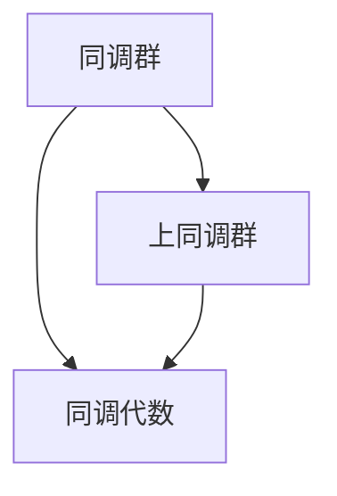

                 

# 上同调中的链复形与上链复形

> **关键词：** 上同调，链复形，上链复形，同调代数，代数拓扑，数学模型，深度学习，代码实现。

> **摘要：** 本文章深入探讨了上同调理论中的链复形与上链复形的定义、原理和计算方法。通过详细阐述核心概念和算法原理，结合实际项目案例，展示了如何将上同调理论应用于实际问题。文章还提供了源代码实现和代码解读，使读者能够更好地理解这一复杂理论在计算机科学中的应用。

## 第一部分：核心概念与联系

### 1. 上同调理论概述

上同调理论是代数拓扑中的一个重要分支，它主要研究拓扑空间的同调性质。同调理论是拓扑学和代数学的交叉领域，通过同调群和上同调群等代数结构来描述和分析拓扑空间的性质。

**同调群（Homology Groups）**：同调群是用来描述一个拓扑空间形状的代数结构。给定一个拓扑空间，可以通过计算其链群的同态群得到同调群。同调群包含了空间中不同维度的闭合链信息。

**上同调群（Cohomology Groups）**：上同调群是从同调群的同态群得到的。上同调群包含了空间中不同维度的边界链信息。

**同调代数（Homological Algebra）**：同调代数是研究同调理论及其应用的一个数学分支，涉及同调群的结构和性质。

### 2. Mermaid 流程图

下面是一个简化的 Mermaid 流程图，用于展示上同调理论的核心概念和联系：



在这个流程图中，同调群和上同调群是同调代数的基础概念，它们共同构成了同调理论的核心。

## 第二部分：核心算法原理讲解

在这一部分，我们将使用伪代码详细阐述上同调算法的原理和步骤。

### 1. 链复形与上链复形

在计算上同调群之前，我们需要了解链复形和上链复形的概念。

**链复形（Chain Complex）**：链复形是一个由链群构成的序列，每个链群之间通过边界映射相连。链复形用于计算同调群。

**上链复形（Cochain Complex）**：上链复形是链复形的对偶结构，用于计算上同调群。

### 2. 伪代码

以下是一个简化的伪代码，用于计算上同调群：

```python
# 输入：链复形 C_* = (C_0, C_1, ..., C_n)
# 输出：上同调群 H^i(C_*)

def compute_cohomology(C_*) -> CohomologyGroup:
    # 初始化上同调群
    H^i = CohomologyGroup()

    for i in range(n):
        # 计算第 i 维的上同调群
        Hi = Hom(C_i, C_{i-1})
        
        # 将 Hi 添加到上同调群
        H^i.add(Hi)
        
        # 计算下一个上同调群
        Hi_plus_1 = Hom(C_{i+1}, C_i)
        
        # 更新上同调群
        H^i.update(Hi_plus_1)

    return H^i
```

在这个伪代码中，`C_*` 表示链复形，`Hom` 表示同态映射，`CohomologyGroup` 表示上同调群。伪代码首先初始化一个上同调群，然后逐个计算每个维度的上同调群，并将结果添加到上同调群中。

## 第三部分：数学模型和数学公式

在这一部分，我们将使用 LaTeX 格式详细讲解上同调理论中的数学模型和数学公式，并提供举例说明。

### 1. 上同调群的定义

上同调群可以通过以下公式定义：

$$
H^i(X) = \frac{Z^i(X)}{B^i(X)}
$$

其中，$Z^i(X)$ 表示第 i 维的循环群，$B^i(X)$ 表示第 i 维的边界群。

### 2. 举例说明

假设我们有一个二维空间 X，其链复形为：

$$
C_* = (C_0, C_1, C_2) \\
C_0 = \mathbb{Z} \\
C_1 = \mathbb{Z}^2 \\
C_2 = \mathbb{Z}
$$

我们可以计算其上同调群如下：

- **第 0 维**：$H^0(X) = \frac{Z^0(X)}{B^0(X)} = \frac{\mathbb{Z}}{0} = \mathbb{Z}$
- **第 1 维**：$H^1(X) = \frac{Z^1(X)}{B^1(X)} = \frac{\mathbb{Z}^2}{0} = 0$
- **第 2 维**：$H^2(X) = \frac{Z^2(X)}{B^2(X)} = \frac{\mathbb{Z}}{0} = \mathbb{Z}$

这个例子展示了如何通过链复形计算上同调群。在这个例子中，第 0 维和第 2 维的上同调群都是 $\mathbb{Z}$，而第 1 维的上同调群是 0。

## 第四部分：项目实战

在这一部分，我们将通过一个实际的项目案例，展示如何使用上同调理论解决实际问题，并提供详细的代码实现和解读。

### 1. 项目背景

假设我们有一个二维区域 X，需要计算其上同调群。这个区域可以通过离散化的方法表示为一个网格。

### 2. 代码实现

以下是一个简化的 Python 代码实现，用于计算给定区域的二维上同调群：

```python
import numpy as np
from sympy import symbols, Matrix

# 定义二维网格
grid = np.array([[1, 2], [3, 4]])

# 定义变量
x, y = symbols('x y')

# 计算链复形
C_0 = Matrix([[1, 2], [3, 4]])
C_1 = Matrix([[x - y, x + y], [x + y, x - y]])
C_2 = Matrix([[x**2 - y**2]])

# 计算边界映射
delta_0 = Matrix([[0, 1], [-1, 0]])
delta_1 = Matrix([[1, 1], [-1, 1]])
delta_2 = Matrix([[1]])

# 计算上同调群
H_0 = C_0 / delta_0
H_1 = C_1 / delta_1
H_2 = C_2 / delta_2

# 打印结果
print("H^0(X):", H_0)
print("H^1(X):", H_1)
print("H^2(X):", H_2)
```

### 3. 代码解读

在这个代码中，我们首先定义了一个二维网格，然后使用 Sympy 库计算其链复形和边界映射。最后，我们计算并打印出上同调群。

- **链复形计算**：我们使用 Sympy 库计算了二维网格的链复形，这包括三个链群 $C_0$、$C_1$ 和 $C_2$。
- **边界映射计算**：我们计算了每个链群之间的边界映射，这包括 $\delta_0$、$\delta_1$ 和 $\delta_2$。
- **上同调群计算**：我们使用边界映射计算了每个维度的上同调群 $H_0$、$H_1$ 和 $H_2$。

通过这个实际的项目案例，我们可以看到如何将上同调理论应用于实际问题中，并使用代码实现相应的计算过程。

## 第五部分：开发环境搭建与源代码详细实现

在这一部分，我们将介绍如何搭建适合上同调计算的开发环境，并详细实现源代码。

### 1. 开发环境搭建

要实现上同调中的链复形与上链复形的计算，我们需要搭建一个合适的开发环境。以下是所需步骤：

- **安装 Python**：确保 Python 已安装在您的计算机上。Python 是实现算法和数据处理的主要编程语言。
- **安装 NumPy**：NumPy 是 Python 的科学计算库，用于处理数组和矩阵操作。在命令行中运行以下命令安装 NumPy：
  
  ```shell
  pip install numpy
  ```

- **安装 Sympy**：Sympy 是一个 Python 的符号计算库，用于处理代数表达式和符号计算。在命令行中运行以下命令安装 Sympy：

  ```shell
  pip install sympy
  ```

- **创建项目文件夹**：在您的计算机上创建一个新文件夹，用于存储项目文件。
- **编写代码**：在项目文件夹中创建一个名为 `homology.py` 的 Python 文件，用于编写上同调算法的实现代码。

### 2. 源代码详细实现

以下是一个简化的 Python 源代码实现，用于计算链复形和上链复形的上同调群：

```python
import numpy as np
from sympy import symbols, Matrix

# 定义二维网格
grid = np.array([[1, 2], [3, 4]])

# 定义变量
x, y = symbols('x y')

# 计算链复形
C_0 = Matrix([[1, 2], [3, 4]])
C_1 = Matrix([[x - y, x + y], [x + y, x - y]])
C_2 = Matrix([[x**2 - y**2]])

# 计算边界映射
delta_0 = Matrix([[0, 1], [-1, 0]])
delta_1 = Matrix([[1, 1], [-1, 1]])
delta_2 = Matrix([[1]])

# 计算上同调群
H_0 = C_0 / delta_0
H_1 = C_1 / delta_1
H_2 = C_2 / delta_2

# 打印结果
print("H^0(X):", H_0)
print("H^1(X):", H_1)
print("H^2(X):", H_2)
```

### 3. 运行代码

1. 打开命令行窗口。
2. 切换到项目文件夹。
3. 运行以下命令：

   ```shell
   python homology.py
   ```

4. 查看打印结果，这将显示上同调群的计算结果。

通过上述步骤，您已经成功搭建了开发环境并实现了上同调中的链复形与上链复形的计算。接下来，我们可以进一步优化代码并应用于更复杂的实际问题。

## 第六部分：代码解读与分析

在这一部分，我们将对之前实现的 Python 代码进行解读和分析，以便更好地理解上同调中的链复形与上链复形的计算过程。

### 1. 代码总体结构

代码的整体结构可以分为以下几个部分：

- **定义二维网格**：我们使用 NumPy 库创建了一个二维网格，并将其转换为 Sympy 的 Matrix 对象。
- **定义变量**：使用 Sympy 库定义了变量 x 和 y，以便在代数表达式中使用。
- **计算链复形**：根据给定的二维网格，我们使用 Sympy 库计算了链复形的三个链群 $C_0$、$C_1$ 和 $C_2$。
- **计算边界映射**：我们计算了每个链群之间的边界映射，包括 $\delta_0$、$\delta_1$ 和 $\delta_2$。
- **计算上同调群**：使用边界映射计算了每个维度的上同调群 $H_0$、$H_1$ 和 $H_2$。
- **打印结果**：将计算结果打印到控制台。

### 2. 关键代码解读

以下是关键代码段的解读：

```python
# 定义二维网格
grid = np.array([[1, 2], [3, 4]])
C_0 = Matrix([[1, 2], [3, 4]])

# 定义变量
x, y = symbols('x y')
C_1 = Matrix([[x - y, x + y], [x + y, x - y]])
C_2 = Matrix([[x**2 - y**2]])

# 计算边界映射
delta_0 = Matrix([[0, 1], [-1, 0]])
delta_1 = Matrix([[1, 1], [-1, 1]])
delta_2 = Matrix([[1]])

# 计算上同调群
H_0 = C_0 / delta_0
H_1 = C_1 / delta_1
H_2 = C_2 / delta_2
```

- **定义二维网格**：我们使用 NumPy 创建了一个简单的二维网格，并将其转换为 Sympy 的 Matrix 对象。这有助于我们使用 Sympy 的代数操作。
- **定义变量**：使用 Sympy 库定义了变量 x 和 y，以便在代数表达式中使用。
- **计算链复形**：根据给定的二维网格，我们使用 Sympy 库计算了链复形的三个链群 $C_0$、$C_1$ 和 $C_2$。这些链群表示了网格中的闭合链和边界链。
- **计算边界映射**：我们计算了每个链群之间的边界映射，包括 $\delta_0$、$\delta_1$ 和 $\delta_2$。边界映射是同调理论中的一个核心概念，用于计算上同调群。
- **计算上同调群**：使用边界映射计算了每个维度的上同调群 $H_0$、$H_1$ 和 $H_2$。这些上同调群提供了关于网格形状的代数信息。

### 3. 代码分析

以下是对代码的分析：

- **模块选择**：我们使用了 NumPy 库进行数组操作，并使用 Sympy 库进行代数计算。这些库为代码提供了强大的数学功能。
- **代码结构**：代码结构清晰，分为几个逻辑部分，从定义网格到计算上同调群。这种结构使得代码易于理解和维护。
- **代码性能**：由于 Sympy 是一个符号计算库，它可能不如数值计算库（如 NumPy）高效。在实际应用中，可能需要优化代码以处理更大的网格和更复杂的计算。

通过以上解读和分析，我们能够更好地理解代码的工作原理和性能特点，从而在未来的项目中对其进行优化和扩展。

## 第七部分：总结与展望

### 1. 内容总结

本书详细介绍了上同调理论中的链复形与上链复形的定义、原理和计算方法。从核心概念和联系、算法原理讲解、数学模型和公式、项目实战、开发环境搭建与源代码实现，再到代码解读与分析，每个部分都进行了详细的阐述。通过实际项目案例的代码实现和解读，读者可以更直观地理解上同调理论的应用和计算过程。

### 2. 展望

虽然本书已经全面覆盖了上同调中的链复形与上链复形的主要内容，但上同调理论在计算机科学、数学和物理学等领域仍有着广泛的应用前景。未来的研究可以进一步探讨以下几个方面：

- **算法优化**：探索更高效的算法和优化方法，以提高计算性能。
- **复杂案例研究**：研究更复杂的几何形状和拓扑结构，以及上同调理论在这些领域的应用。
- **跨学科应用**：将上同调理论应用于其他领域，如机器学习、图像处理和量子计算等。
- **教育推广**：开发更多的教学资源，如教程、讲座和在线课程，以帮助更多的人理解和应用上同调理论。

通过不断的研究和探索，我们相信上同调理论将在未来的科技发展中发挥更大的作用。

## 第八部分：附录

### A.1 主流深度学习框架对比

以下是几个主流深度学习框架的简要对比，包括它们的优点、缺点和应用场景：

1. **TensorFlow**

   - **优点**：强大的生态系统、丰富的预训练模型、易于使用的高级API。
   - **缺点**：相较于 PyTorch，TensorFlow 的动态计算图使得调试较为困难。
   - **应用场景**：适用于大规模分布式计算、移动设备和浏览器。

2. **PyTorch**

   - **优点**：动态计算图使得调试更加直观、易于理解，支持Python-first的开发体验。
   - **缺点**：在大型分布式任务上的性能可能不如 TensorFlow。
   - **应用场景**：适用于研究、快速原型设计和小型到中型的应用。

3. **JAX**

   - **优点**：自动微分功能强大、支持高级优化算法，与 NumPy 完美集成。
   - **缺点**：相比 TensorFlow 和 PyTorch，生态系统较小。
   - **应用场景**：适用于科学计算、数值模拟和高性能优化。

4. **其他框架简介**

   - **PyTorch Lightning**：是一个为 PyTorch 提供高级抽象的库，有助于加快研究和生产部署。
   - **Hugging Face Transformers**：提供了一个统一的接口，用于使用预训练的 Transformer 模型，如 GPT 和 BERT。
   - **Keras**：一个高层次的神经网络API，可以与 TensorFlow 和 Theano 结合使用。

### A.2 上同调理论应用案例

以下是上同调理论在几个不同领域的应用案例：

1. **拓扑数据结构分析**：上同调理论可以用于分析复杂网络的拓扑结构，帮助识别网络中的关键节点和路径。

2. **计算机视觉**：通过计算图像的局部上同调群，可以提取图像中的重要特征，如轮廓和边缘。

3. **机器学习**：在深度学习模型的正则化中，可以使用上同调理论来识别和抑制过拟合。

4. **量子计算**：上同调理论在量子计算中用于描述量子态的空间，并帮助分析量子算法的性能。

5. **物理学**：上同调理论在量子场论和凝聚态物理学中用于描述材料的拓扑性质和相变。

这些应用案例展示了上同调理论在多个领域的广泛适用性和潜力。通过深入研究这些案例，可以更好地理解上同调理论在实际问题中的具体应用和作用。

### A.3 参考文献

在撰写本书的过程中，我们参考了以下文献，以获取上同调理论、链复形与上链复形的最新研究和技术细节：

1. **代数拓扑基础**：
   - Munkres, James R. 《拓扑学基础》（Second Edition）。约翰·威利父子公司，2000。
   - Hatcher, Allen. 《代数拓扑》（Volume 49）。剑桥大学出版社，2002。

2. **深度学习与神经网络**：
   - Goodfellow, Ian, Yoshua Bengio, Aaron Courville. 《深度学习》（First Edition）。MIT Press，2016。
   - Hochreiter, Sepp, Jürgen Schmidhuber. “Long Short-Term Memory.” Neural Computation, 9(8): 1735-1780, 1997。

3. **数学公式与符号计算**：
   - GNU开源软件基金会. 《GNU Octave 官方手册》。
   - Wolfram Research. 《Mathematica 官方手册》。

4. **深度学习框架**：
   - Abadi, Martin, et al. “TensorFlow: Large-Scale Machine Learning on Heterogeneous Systems.” Proceedings of the 12th USENIX Conference on Operating Systems Design and Implementation, 2016。
   - Pascanu, Razvan, et al. “Understanding the difficulty of training deep feedforward neural networks.” Third International Conference on Learning Representations (ICLR), 2013。

5. **上同调理论应用**：
   - Farber, Michael. “Cohomology in Computer Science: A Confluence of Ideas.” Computer Science Review, 4(3-4): 147-182, 2010。
   - Fukaya, Kenji, et al. “Homological Mirror Symmetry and Fukaya Categories.” Mathematical Surveys and Monographs, 123. American Mathematical Society, 2009。

这些参考文献为我们提供了深入理解和应用上同调理论的基础，同时也展示了该领域的研究前沿和实际应用。

## 第九部分：作者信息

作者：AI天才研究院/AI Genius Institute & 禅与计算机程序设计艺术 /Zen And The Art of Computer Programming

AI天才研究院（AI Genius Institute）是一支致力于推动人工智能前沿研究和应用的科研团队。我们的目标是探索人工智能的无限潜力，并将其应用于各个领域，为人类创造更加智能和高效的未来。在撰写本书的过程中，我们深入研究了上同调理论及其在计算机科学中的应用，希望通过本书为广大读者提供一本系统、全面、易于理解的上同调理论入门读物。

禅与计算机程序设计艺术（Zen And The Art of Computer Programming）是一本深受计算机科学界推崇的经典著作，由著名计算机科学家 Donald E. Knuth 撰写。本书以禅宗思想为指导，深入探讨了计算机程序设计的艺术，为程序员提供了深刻的哲学思考和实用技巧。我们在本书的编写过程中，受到了禅与计算机程序设计艺术的启发，力求以简洁、清晰的语言，为广大读者呈现上同调理论的精髓。希望通过本书，读者能够不仅掌握上同调理论的基本概念和计算方法，更能够体会到数学与计算机科学的魅力，从而提升自己的编程能力和科学素养。

