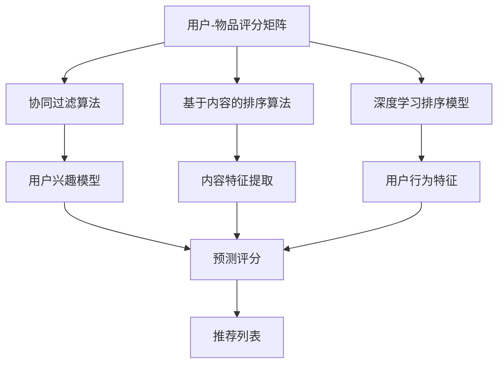

                 

### 个性化排序与AI概述

个性化排序是近年来在推荐系统和信息检索领域中的一个重要研究方向。其主要目标是根据用户的历史行为和偏好，对信息进行排序，从而为用户提供个性化的内容推荐。随着人工智能（AI）技术的快速发展，个性化排序迎来了新的机遇和挑战。

#### 1.1 个性化排序的定义与重要性

个性化排序（Personalized Sorting）指的是根据用户的特定需求、兴趣或偏好，对数据集进行排序的过程。这种排序方式不同于传统的基于某种固定规则或简单算法的排序，而是更加关注于满足用户的个性化需求。

个性化排序的重要性体现在以下几个方面：

- **提高用户满意度**：通过个性化排序，可以更好地满足用户的个性化需求，提高用户的满意度。例如，在电子商务平台中，个性化的商品推荐能够提升用户的购买意愿。

- **提升系统性能**：个性化排序可以优化系统的资源利用，减少用户在寻找信息时的耗时，从而提高系统的整体性能。

- **增强用户体验**：个性化的排序结果能够提供更符合用户预期的内容，从而增强用户的体验，提高用户对系统的忠诚度。

#### 1.2 个性化排序的目标与方法

个性化排序的主要目标包括：

- **准确性**：确保推荐的结果与用户的实际偏好高度一致，提高推荐系统的准确性。

- **多样性**：为用户推荐多样化的内容，避免单一化的推荐结果，提高用户的兴趣。

- **实时性**：及时响应用户的需求变化，提供实时的推荐结果。

为实现这些目标，常用的个性化排序方法包括：

- **协同过滤（Collaborative Filtering）**：通过收集用户的历史行为数据，找出相似的用户或物品，从而预测用户对未知物品的偏好。

- **基于内容的排序（Content-Based Filtering）**：通过分析物品的内容特征，找到与用户兴趣相似的内容进行推荐。

- **混合排序（Hybrid Ranking）**：结合协同过滤和基于内容的排序方法，以获得更好的推荐效果。

#### 1.3 个性化排序的关键技术

个性化排序涉及的关键技术包括：

- **用户兴趣模型**：构建用户兴趣模型，用于捕捉用户的偏好和行为特征。

- **特征工程**：从原始数据中提取有效的特征，用于训练模型。

- **机器学习算法**：使用机器学习算法，如矩阵分解、深度学习等，对用户行为进行建模。

- **模型评估与优化**：通过评估指标（如准确率、召回率等）对模型进行评估和优化。

个性化排序在多个领域有着广泛的应用，包括电子商务、社交媒体、新闻推荐等。通过引入AI技术，个性化排序不仅可以提高推荐系统的准确性，还能实现更精细化的用户体验，从而在未来的发展中展现出巨大的潜力。

### AI在个性化排序中的应用

人工智能（AI）技术的发展为个性化排序带来了新的机遇和挑战。通过将AI技术应用于个性化排序，不仅可以提升推荐系统的性能，还能实现更精准的用户个性化体验。以下将详细探讨AI在个性化排序中的应用。

#### 2.1 AI与个性化排序的关系

AI与个性化排序之间的关系体现在多个方面：

- **数据驱动**：AI通过机器学习算法从大量用户数据中学习用户偏好，为个性化排序提供数据支持。

- **模型优化**：AI技术可以帮助优化排序模型，提高推荐系统的准确性、多样性和实时性。

- **实时反馈**：AI技术能够实时分析用户行为，快速调整推荐策略，以更好地满足用户需求。

#### 2.2 机器学习在个性化排序中的应用

机器学习是AI的核心技术之一，其在个性化排序中的应用主要包括以下几个方面：

- **用户行为预测**：通过分析用户的历史行为数据，利用机器学习算法预测用户对未知物品的偏好。常用的算法包括协同过滤（Collaborative Filtering）和矩阵分解（Matrix Factorization）。

  **协同过滤算法**：协同过滤是一种基于用户相似度的方法，通过找到与目标用户兴趣相似的邻居用户，预测用户对未知物品的评分。其基本流程如下：
  $$
  \text{PredictRating}(u, i) = \sum_{v \in \text{Neighbors}(u)} \text{Rating}(v, i) \times \text{Similarity}(u, v)
  $$
  其中，\(\text{Neighbors}(u)\)表示与用户\(u\)相似的邻居用户集合，\(\text{Rating}(v, i)\)表示用户\(v\)对物品\(i\)的评分，\(\text{Similarity}(u, v)\)表示用户\(u\)与用户\(v\)之间的相似度。

  **矩阵分解算法**：矩阵分解是一种通过将用户-物品评分矩阵分解为两个低秩矩阵来预测用户对物品评分的方法。其基本流程如下：
  $$
  R = U \odot V^T
  $$
  其中，\(R\)表示用户-物品评分矩阵，\(U\)和\(V\)分别表示用户特征矩阵和物品特征矩阵，\(\odot\)表示Hadamard积。

- **用户兴趣建模**：通过机器学习算法，构建用户兴趣模型，用于捕捉用户的兴趣和偏好。常见的算法包括深度学习（Deep Learning）和强化学习（Reinforcement Learning）。

  **深度学习算法**：深度学习算法能够自动从大量数据中学习复杂的特征表示。在个性化排序中，常用的是深度神经网络（Deep Neural Networks），如卷积神经网络（CNN）和循环神经网络（RNN）。

  **强化学习算法**：强化学习是一种通过奖励机制学习最优策略的方法。在个性化排序中，可以通过强化学习算法优化推荐策略，提高用户满意度。常用的算法包括Q-learning和Deep Q-Network（DQN）。

- **特征提取和融合**：机器学习算法能够自动提取用户行为数据中的有效特征，并通过特征融合技术结合多种特征，提高推荐系统的准确性。常用的特征提取技术包括词袋模型（Bag of Words, BoW）、TF-IDF（Term Frequency-Inverse Document Frequency）和词嵌入（Word Embedding）。

#### 2.3 深度学习在个性化排序中的应用

深度学习是AI领域的一个重要分支，其在个性化排序中的应用主要体现在以下几个方面：

- **用户行为预测**：深度学习算法能够从用户历史行为数据中学习复杂的特征表示，提高用户行为预测的准确性。例如，使用卷积神经网络（CNN）处理用户点击行为序列，提取序列特征，用于预测用户对未知物品的偏好。

- **图像和语音处理**：深度学习算法在图像和语音处理领域取得了显著成果，这些技术可以用于个性化排序。例如，通过卷积神经网络提取图像特征，用于基于内容的推荐；通过循环神经网络（RNN）处理语音数据，用于语音识别和语音推荐。

- **自然语言处理**：深度学习算法在自然语言处理（NLP）领域取得了突破性进展，如词嵌入（Word Embedding）和Transformer模型。这些技术可以用于处理用户文本数据，提取文本特征，用于文本推荐。

通过引入AI技术，个性化排序实现了更高的准确性和实时性，为用户提供更个性化的推荐服务。未来，随着AI技术的进一步发展，个性化排序将在更多领域发挥作用，满足用户的多样化需求。

### 个性化排序的数学模型

个性化排序的核心在于构建能够准确预测用户偏好的数学模型。这些模型不仅需要考虑用户的历史行为，还要考虑物品的特征，以及用户和物品之间的相互作用。以下是几种常见的数学模型，包括评分预测模型、协同过滤算法和基于深度学习的排序模型。

#### 3.1 评分预测模型

评分预测模型是个性化排序中最基础的模型，其目标是预测用户对某物品的评分。常见的评分预测模型包括基于矩阵分解的协同过滤模型和基于深度学习的模型。

##### 矩阵分解协同过滤模型

矩阵分解协同过滤模型的核心思想是将原始的用户-物品评分矩阵分解为两个低秩矩阵，分别表示用户和物品的特征。通过这两个特征矩阵的乘积，可以预测用户对未知物品的评分。其数学模型如下：

$$
R = U \odot V^T
$$

其中，\(R\)是用户-物品评分矩阵，\(U\)是用户特征矩阵，\(V\)是物品特征矩阵，\(\odot\)表示Hadamard积。对于用户\(u\)和物品\(i\)，预测评分\(\hat{r}_{ui}\)为：

$$
\hat{r}_{ui} = u_i^T v_i
$$

在实际应用中，通常会使用优化算法（如随机梯度下降SGD）来最小化预测误差的平方和，从而更新用户和物品的特征矩阵。

##### 深度学习评分预测模型

深度学习评分预测模型通过构建深度神经网络来学习用户和物品的特征表示。常见的模型有卷积神经网络（CNN）和循环神经网络（RNN）。以下是一个基于RNN的评分预测模型：

$$
\hat{r}_{ui} = \text{softmax}(\text{W}^T [\text{h}_{u} ; \text{h}_{i}]),
$$

其中，\(\text{h}_{u}\)和\(\text{h}_{i}\)分别是用户和物品的隐藏状态，\(\text{W}\)是权重矩阵，\(\text{softmax}\)函数用于将隐藏状态映射到评分概率分布。

#### 3.2 协同过滤算法

协同过滤算法是评分预测模型的一种实现方式，其核心思想是通过找到相似的用户或物品来预测用户对未知物品的评分。协同过滤算法主要包括基于用户相似度和基于物品相似度两种类型。

##### 基于用户相似度的协同过滤算法

基于用户相似度的协同过滤算法通过计算用户之间的相似度来推荐物品。其基本公式如下：

$$
\hat{r}_{ui} = \sum_{v \in \text{Neighbors}(u)} \text{Rating}(v, i) \times \text{Similarity}(u, v),
$$

其中，\(\text{Neighbors}(u)\)表示与用户\(u\)相似的邻居用户集合，\(\text{Rating}(v, i)\)表示邻居用户\(v\)对物品\(i\)的评分，\(\text{Similarity}(u, v)\)表示用户\(u\)与用户\(v\)之间的相似度。

常见的相似度计算方法包括余弦相似度、皮尔逊相关系数和欧几里得距离等。

##### 基于物品相似度的协同过滤算法

基于物品相似度的协同过滤算法通过计算物品之间的相似度来推荐物品。其基本公式如下：

$$
\hat{r}_{ui} = \sum_{i' \in \text{Neighbors}(i)} \text{Rating}(u, i') \times \text{Similarity}(i, i'),
$$

其中，\(\text{Neighbors}(i)\)表示与物品\(i\)相似的邻居物品集合，\(\text{Rating}(u, i')\)表示用户\(u\)对邻居物品\(i'\)的评分，\(\text{Similarity}(i, i')\)表示物品\(i\)与物品\(i'\)之间的相似度。

物品相似度计算方法通常基于物品的特征表示，如基于内容的协同过滤算法会使用TF-IDF或词嵌入来表示物品的特征。

#### 3.3 基于深度学习的排序模型

基于深度学习的排序模型通过构建深度神经网络来学习用户和物品的特征表示，从而实现个性化排序。以下是一个简单的基于深度学习的排序模型：

$$
\hat{r}_{ui} = \text{sigmoid}(\text{W}^T [\text{h}_{u} ; \text{h}_{i}]),
$$

其中，\(\text{h}_{u}\)和\(\text{h}_{i}\)分别是用户和物品的隐藏状态，\(\text{W}\)是权重矩阵，\(\text{sigmoid}\)函数用于将隐藏状态映射到概率分布。

常见的深度学习排序模型包括卷积神经网络（CNN）和循环神经网络（RNN）。CNN适用于处理用户行为序列等时序数据，RNN适用于处理用户和物品的文本数据。

综上所述，个性化排序的数学模型涵盖了评分预测模型、协同过滤算法和基于深度学习的排序模型。这些模型通过不同的方法来学习用户和物品的特征，实现更准确的个性化推荐。在实际应用中，可以根据具体场景和需求选择合适的模型。

### 协同过滤算法

协同过滤算法（Collaborative Filtering, CF）是推荐系统中最常用的算法之一，其核心思想是通过分析用户间的相似性或物品间的相似性来预测用户对未知物品的偏好。协同过滤算法可以分为基于用户相似度的协同过滤和基于物品相似度的协同过滤。以下将对协同过滤算法的基本原理、用户体验以及基于矩阵分解的协同过滤算法进行详细讲解。

#### 4.1 协同过滤算法的基本原理

协同过滤算法的基本原理可以概括为以下步骤：

1. **用户相似度计算**：首先，计算目标用户与其他用户的相似度。常见的相似度度量方法包括余弦相似度、皮尔逊相关系数和欧几里得距离等。

   余弦相似度的计算公式如下：
   $$
   \text{CosineSimilarity}(u, v) = \frac{\text{dotProduct}(u, v)}{\lVert u \rVert \lVert v \rVert},
   $$
   其中，\(\text{dotProduct}(u, v)\)是用户\(u\)和用户\(v\)之间的点积，\(\lVert u \rVert\)和\(\lVert v \rVert\)分别是用户\(u\)和用户\(v\)的欧几里得范数。

2. **邻居用户选择**：根据相似度度量结果，选择与目标用户最相似的邻居用户。

3. **评分预测**：利用邻居用户的评分，预测目标用户对未知物品的评分。预测公式如下：
   $$
   \hat{r}_{ui} = \sum_{v \in \text{Neighbors}(u)} \text{Rating}(v, i) \times \text{Similarity}(u, v).
   $$
   其中，\(\text{Neighbors}(u)\)是邻居用户集合，\(\text{Rating}(v, i)\)是邻居用户\(v\)对物品\(i\)的评分，\(\text{Similarity}(u, v)\)是用户\(u\)和用户\(v\)之间的相似度。

#### 4.2 用户体验与协同过滤

协同过滤算法对用户体验的影响主要体现在以下几个方面：

- **推荐准确性**：协同过滤算法能够根据用户的历史行为推荐与用户偏好相似的其他物品，从而提高推荐系统的准确性。然而，如果用户的评分数据不够丰富，推荐的准确性可能会受到影响。

- **推荐多样性**：协同过滤算法倾向于推荐与用户过去评分相似的物品，可能导致推荐结果的多样性不足。为提高多样性，可以采用基于内容的推荐方法结合协同过滤。

- **推荐速度**：协同过滤算法的计算复杂度较高，尤其是当用户和物品数量较大时。为了提高推荐速度，可以采用近似算法和在线学习策略。

#### 4.3 基于矩阵分解的协同过滤算法

基于矩阵分解的协同过滤算法（Matrix Factorization-based Collaborative Filtering, MF-CF）是协同过滤算法的一种改进方法，其核心思想是通过将用户-物品评分矩阵分解为低秩的矩阵，从而实现更准确的评分预测。

##### 矩阵分解的基本思想

矩阵分解的基本思想是将原始的用户-物品评分矩阵\(R\)分解为两个低秩矩阵\(U\)和\(V\)，使得它们的乘积近似于原始评分矩阵：
$$
R = U \odot V^T,
$$
其中，\(\odot\)表示Hadamard积。通过优化这个模型，可以学习到用户特征矩阵\(U\)和物品特征矩阵\(V\)，从而实现评分预测。

##### 基于矩阵分解的协同过滤算法的步骤

1. **初始化特征矩阵**：随机初始化用户特征矩阵\(U\)和物品特征矩阵\(V\)。

2. **目标函数**：定义目标函数，通常采用最小化预测误差的平方和：
   $$
   \min_{U, V} \sum_{u, i} (\hat{r}_{ui} - r_{ui})^2,
   $$
   其中，\(\hat{r}_{ui}\)是预测评分，\(r_{ui}\)是实际评分。

3. **优化策略**：使用优化算法（如随机梯度下降SGD）更新特征矩阵\(U\)和\(V\)：
   $$
   u_j := u_j - \alpha \cdot (\frac{\partial f}{\partial u_j}),
   $$
   $$
   v_i := v_i - \alpha \cdot (\frac{\partial f}{\partial v_i}),
   $$
   其中，\(\alpha\)是学习率，\(f\)是目标函数。

4. **预测评分**：利用优化后的特征矩阵预测用户对未知物品的评分：
   $$
   \hat{r}_{ui} = u_i^T v_i.
   $$

##### 基于矩阵分解的协同过滤算法的优点

- **降低计算复杂度**：矩阵分解算法将高维的用户-物品评分矩阵分解为低秩矩阵，从而降低计算复杂度，提高推荐速度。

- **提高预测准确性**：矩阵分解算法能够学习到用户和物品的潜在特征，从而提高评分预测的准确性。

- **支持稀疏数据集**：由于用户-物品评分矩阵通常是稀疏的，矩阵分解算法能够在保持较高预测准确性的同时处理稀疏数据集。

基于矩阵分解的协同过滤算法在推荐系统中具有广泛的应用，其通过将用户和物品的特征表示为低维向量，实现了更准确和高效的个性化推荐。

### 基于内容的排序算法

基于内容的排序算法（Content-Based Sorting）是推荐系统中的另一种重要方法，其主要思想是根据物品的内容特征来为用户推荐与其兴趣相关的内容。这种算法不仅关注用户的历史行为，还深入挖掘物品本身的属性，从而提供更个性化的推荐结果。以下将详细介绍基于内容的排序算法的基本原理、文本相似度计算以及内容特征的提取和应用。

#### 5.1 内容推荐的原理

内容推荐的基本原理可以概括为以下几个步骤：

1. **特征提取**：首先，从物品的内容中提取特征。这些特征可以是文本、图像、音频等多媒体数据。例如，对于文本内容，可以使用词袋模型（Bag of Words, BoW）或词嵌入（Word Embedding）来表示。

2. **相似度计算**：计算用户兴趣和物品特征之间的相似度。相似度的计算方法包括余弦相似度、欧几里得距离、皮尔逊相关系数等。

3. **推荐生成**：根据相似度得分，生成推荐列表。通常，推荐列表会按照相似度得分从高到低排序，从而为用户提供最有可能感兴趣的内容。

4. **反馈调整**：用户对推荐内容的反馈（如点击、购买、评分等）会被用于调整推荐算法，以提高推荐的准确性。

#### 5.2 基于文本的相似度计算

文本相似度计算是内容推荐算法中的一个关键环节，它决定了推荐结果的相关性和准确性。以下是几种常用的文本相似度计算方法：

- **词袋模型（Bag of Words, BoW）**：词袋模型将文本转换为向量，其中每个特征表示文本中的一个词。文本相似度通过计算两个文本向量之间的余弦相似度来衡量。余弦相似度的计算公式如下：
  $$
  \text{CosineSimilarity}(\textbf{x}, \textbf{y}) = \frac{\textbf{x} \cdot \textbf{y}}{\lVert \textbf{x} \rVert \lVert \textbf{y} \rVert},
  $$
  其中，\(\textbf{x}\)和\(\textbf{y}\)分别是两个文本向量，\(\cdot\)表示点积，\(\lVert \textbf{x} \rVert\)和\(\lVert \textbf{y} \rVert\)分别是两个向量的欧几里得范数。

- **TF-IDF（Term Frequency-Inverse Document Frequency）**：TF-IDF是一种基于词频和逆文档频率的文本表示方法，它通过调整词频，考虑到词在不同文档中的出现频率，从而提高文本的区分度。TF-IDF的文本相似度计算公式如下：
  $$
  \text{TF-IDF}(t, d) = \text{TF}(t, d) \times \text{IDF}(t),
  $$
  其中，\(\text{TF}(t, d)\)是词\(t\)在文档\(d\)中的词频，\(\text{IDF}(t)\)是词\(t\)的逆文档频率。

- **词嵌入（Word Embedding）**：词嵌入是一种将单词映射到高维空间中的向量表示方法。通过词嵌入，文本相似度可以通过计算两个向量之间的欧几里得距离来衡量。常见的词嵌入方法包括Word2Vec、GloVe等。

#### 5.3 内容特征的提取与应用

内容特征的提取是内容推荐算法成功的关键，以下介绍几种常见的内容特征提取方法：

- **文本特征提取**：对于文本数据，可以采用词袋模型（BoW）、TF-IDF和词嵌入等方法提取特征。例如，使用TF-IDF方法提取文本特征，可以表示如下：
  $$
  \textbf{X}_d = [\text{TF-IDF}(w_1, d), \text{TF-IDF}(w_2, d), ..., \text{TF-IDF}(w_n, d)],
  $$
  其中，\(\textbf{X}_d\)是文档\(d\)的特征向量，\(w_1, w_2, ..., w_n\)是文档中的所有词。

- **图像特征提取**：对于图像数据，可以使用卷积神经网络（CNN）提取图像特征。常见的图像特征提取方法包括预训练的CNN模型（如VGG、ResNet）和自训练的CNN模型。

- **音频特征提取**：对于音频数据，可以使用梅尔频率倒谱系数（MFCC）和卷积神经网络（CNN）等方法提取特征。

内容特征的提取和应用可以通过以下步骤实现：

1. **特征提取**：根据数据类型，采用相应的特征提取方法提取内容特征。

2. **特征组合**：将不同类型的内容特征进行组合，形成一个综合的特征向量。例如，对于文本和图像的混合数据，可以将文本特征和图像特征拼接在一起，形成一个新的特征向量。

3. **相似度计算**：计算用户兴趣特征和物品特征之间的相似度，生成推荐列表。

4. **反馈调整**：根据用户对推荐内容的反馈，调整特征提取和相似度计算的方法，以提高推荐的准确性。

通过内容特征的提取和应用，基于内容的排序算法能够为用户提供更加个性化、准确的推荐结果。在实际应用中，可以根据具体场景和需求，灵活选择和组合不同的特征提取和相似度计算方法。

### 混合排序算法

混合排序算法（Hybrid Ranking）是推荐系统中的一种重要方法，旨在结合多种排序算法的优点，以获得更精确和多样化的推荐结果。通过混合不同的排序算法，可以充分利用各种算法的优势，从而在准确性、多样性和实时性等方面取得更好的效果。以下将详细介绍混合排序算法的优势、挑战以及常见的混合策略和实践。

#### 6.1 混合排序的优势与挑战

混合排序算法的主要优势包括：

- **准确性提升**：通过结合不同的排序算法，混合排序可以在一定程度上弥补单一算法的不足，从而提高推荐系统的整体准确性。例如，协同过滤算法在处理稀疏数据集时效果较好，而基于内容的排序算法则能更好地捕捉物品的特征，两者结合可以提升推荐精度。

- **多样性增强**：单一排序算法往往倾向于推荐与用户历史偏好相似的物品，导致推荐结果的多样性不足。混合排序通过引入多种排序算法，可以增加推荐列表的多样性，为用户提供更丰富的选择。

- **实时性优化**：不同的排序算法在实时性方面各有优劣。例如，基于内容的排序算法通常计算复杂度较低，适合实时推荐，而深度学习排序算法则可能需要更多时间进行训练和预测。混合排序可以根据实时性需求动态调整算法组合，以优化系统性能。

尽管混合排序算法具有许多优势，但也面临着一些挑战：

- **计算复杂度高**：混合排序算法通常需要同时处理多种排序算法，导致计算复杂度显著增加，对系统性能和资源利用提出了更高的要求。

- **模型选择与优化**：选择和优化合适的混合排序模型是一项复杂的工作，需要深入理解各种排序算法的特性，并进行大量实验和调优。

- **一致性保障**：混合排序算法需要保证推荐结果的一致性，避免出现推荐结果相互矛盾的情况。这在实际应用中尤其重要，以确保用户对推荐系统的信任。

#### 6.2 混合排序的策略与实践

常见的混合排序策略包括以下几种：

1. **协同过滤与基于内容的混合**：

   这种策略将协同过滤和基于内容的排序算法结合，以实现更准确的推荐。具体实现步骤如下：

   - **协同过滤阶段**：首先使用协同过滤算法生成初步的推荐列表，该列表基于用户的历史行为和相似度计算。

   - **内容特征提取**：然后对物品进行内容特征提取，如文本、图像或音频特征。

   - **相似度计算**：计算用户兴趣特征和物品特征之间的相似度，生成额外的推荐列表。

   - **混合推荐**：将协同过滤和内容特征提取得到的推荐列表进行加权融合，生成最终的推荐结果。

2. **基于模型的混合**：

   这种策略将不同的深度学习模型（如CNN、RNN、Transformer等）结合，以提高推荐系统的准确性。具体实现步骤如下：

   - **用户行为建模**：使用深度学习模型（如RNN）学习用户行为特征，预测用户对物品的偏好。

   - **内容特征提取**：使用其他深度学习模型（如CNN）提取物品的内容特征。

   - **融合策略**：通过融合用户行为特征和物品内容特征，使用另一种深度学习模型（如Transformer）进行排序和推荐。

3. **动态调整的混合**：

   这种策略根据实时用户反馈和系统状态动态调整排序算法组合，以优化推荐效果。具体实现步骤如下：

   - **用户反馈收集**：实时收集用户对推荐内容的反馈，如点击、购买、评分等。

   - **算法权重调整**：根据用户反馈和系统状态，动态调整不同排序算法的权重，以优化推荐结果。

   - **实时推荐**：使用动态调整后的算法组合进行实时推荐，以提高用户的满意度。

在实际应用中，混合排序算法通常需要根据具体场景和需求进行定制化实现。以下是一个简化的混合排序算法伪代码：

```python
# 输入：用户兴趣特征U，物品特征V，协同过滤权重w_cf，内容特征权重w_content
# 输出：推荐列表R

# 步骤1：协同过滤推荐
R_cf =协同过滤算法(U, V)

# 步骤2：内容特征提取
R_content =内容特征提取(U, V)

# 步骤3：融合推荐
R = w_cf * R_cf + (1 - w_cf) * R_content

# 步骤4：排序
R = 排序(R)

return R
```

通过混合不同的排序算法，混合排序算法能够为推荐系统带来更高的准确性和多样性，从而提升用户体验。在实际应用中，需要根据具体场景和需求，灵活选择和组合不同的排序算法，并进行优化和调整，以达到最佳效果。

### 个性化排序项目实战

在个性化排序的实际应用中，构建一个高效的推荐系统需要经历多个关键步骤，包括项目背景与需求分析、数据预处理与特征工程、模型选择与训练、模型评估与优化。以下将详细介绍一个个性化排序项目的实战过程。

#### 7.1 项目背景与需求分析

假设我们面临的是一个电子商务平台，该平台需要为用户提供个性化的商品推荐服务。项目背景包括以下几个方面：

- **用户数据丰富**：平台积累了大量用户行为数据，如购买历史、浏览记录、点击行为等。

- **商品种类繁多**：平台上的商品种类丰富，包括电子产品、服装、家居用品等。

- **个性化需求**：用户对商品的偏好各异，需要提供个性化的推荐，以提高用户的满意度和购买转化率。

项目需求主要包括以下几点：

- **推荐准确性**：准确预测用户对未知商品的偏好，提高推荐系统的准确性。

- **推荐多样性**：为用户推荐多样化的商品，避免单一化的推荐结果，提高用户兴趣。

- **实时性**：快速响应用户需求变化，提供实时的推荐服务。

#### 7.2 数据预处理与特征工程

数据预处理和特征工程是构建推荐系统的关键步骤，直接影响模型的效果。以下是在本项目中的数据预处理与特征工程步骤：

- **数据清洗**：去除无效数据、重复数据和噪声数据，确保数据质量。

- **数据整合**：整合不同数据源的信息，如用户行为数据、商品属性数据等，构建统一的数据集。

- **用户行为特征提取**：从用户历史行为中提取有效特征，如购买频次、浏览时长、点击率等。

- **商品特征提取**：从商品属性中提取特征，如商品类别、价格、品牌、用户评分等。

- **用户兴趣特征提取**：通过聚类或协同过滤等方法，提取用户兴趣特征，如用户最喜欢的商品类别、品牌等。

- **特征归一化**：对数值型特征进行归一化处理，使其在相同的尺度范围内，以避免特征之间的影响。

以下是一个简化的特征工程流程伪代码：

```python
# 输入：原始数据集D
# 输出：预处理后的特征数据集F

# 步骤1：数据清洗
D_clean = 数据清洗(D)

# 步骤2：数据整合
D_integrated = 数据整合(D_clean)

# 步骤3：用户行为特征提取
F_user = 用户行为特征提取(D_integrated)

# 步骤4：商品特征提取
F_item = 商品特征提取(D_integrated)

# 步骤5：用户兴趣特征提取
F_interest = 用户兴趣特征提取(F_user)

# 步骤6：特征归一化
F_normalized = 特征归一化(F_interest)

return F_normalized
```

#### 7.3 模型选择与训练

在项目实战中，选择合适的模型并对其进行训练是关键步骤。以下是在本项目中的模型选择与训练步骤：

- **模型选择**：根据项目需求，选择适合的推荐模型，如基于协同过滤的矩阵分解模型、基于内容的深度学习模型、混合排序模型等。

- **模型训练**：使用预处理后的特征数据集对模型进行训练。训练过程中，可以采用交叉验证等方法评估模型的性能，并进行参数调优。

以下是一个简化的模型训练流程伪代码：

```python
# 输入：特征数据集F，训练集D_train，验证集D_val
# 输出：训练好的推荐模型M

# 步骤1：初始化模型M
M = 初始化模型(F)

# 步骤2：训练模型
M = 训练模型(M, D_train)

# 步骤3：验证模型
performance = 验证模型(M, D_val)

# 步骤4：参数调优
M = 参数调优(M, performance)

return M
```

#### 7.4 模型评估与优化

在模型训练完成后，需要对模型进行评估和优化，以确保推荐系统的性能达到预期。以下是在本项目中的模型评估与优化步骤：

- **模型评估**：使用交叉验证、A/B测试等方法对模型进行评估，评估指标包括准确率、召回率、覆盖率等。

- **结果分析**：分析评估结果，找出模型的优势和不足，为优化提供依据。

- **模型优化**：根据分析结果，调整模型参数或采用更复杂的模型，以提升推荐系统的性能。

以下是一个简化的模型评估与优化流程伪代码：

```python
# 输入：训练好的模型M，测试集D_test
# 输出：优化后的推荐模型M_optimized

# 步骤1：模型评估
performance = 评估模型(M, D_test)

# 步骤2：结果分析
analysis = 分析性能(performance)

# 步骤3：模型优化
M_optimized = 优化模型(M, analysis)

# 步骤4：再次评估
performance_optimized = 评估模型(M_optimized, D_test)

# 步骤5：迭代优化
while performance_optimized < 目标性能:
    M_optimized = 优化模型(M_optimized, performance_optimized)
    performance_optimized = 评估模型(M_optimized, D_test)

return M_optimized
```

通过以上实战步骤，我们可以构建一个高效的个性化排序系统，为用户提供精准、多样化的推荐服务。在实际应用中，需要根据具体需求和数据特点，灵活调整和优化各个步骤，以达到最佳效果。

### 提高用户满意度的策略与实践

提高用户满意度是推荐系统设计中的重要目标，这不仅关系到用户的忠诚度和留存率，还直接影响到企业的盈利能力。以下将探讨如何通过个性化推荐的策略优化和案例分析来提高用户满意度。

#### 8.1 用户满意度的评估指标

用户满意度评估是优化推荐系统的重要环节。以下是一些常见的评估指标：

- **准确率（Accuracy）**：准确率是指推荐结果中实际用户喜欢的商品比例。高准确率意味着推荐系统能够准确地预测用户兴趣。

- **召回率（Recall）**：召回率是指推荐结果中包含用户未发现的但感兴趣的物品比例。高召回率表示系统能够提供更多的个性化推荐。

- **覆盖率（Coverage）**：覆盖率是指推荐结果中包含不同种类物品的比例。高覆盖率确保推荐系统的多样性，避免单一化。

- **新颖度（Novelty）**：新颖度是指推荐结果中包含用户未体验过的物品比例。新颖度高的推荐系统能够激发用户的探索兴趣。

- **用户点击率（Click-Through Rate, CTR）**：用户点击率是指用户在推荐结果中点击商品的比率。高CTR表明推荐结果吸引用户的注意力。

- **购买转化率（Conversion Rate）**：购买转化率是指用户在点击商品后实际完成购买的比例。高转化率是推荐系统最终成功的重要标志。

#### 8.2 个性化推荐的策略优化

为了提高用户满意度，推荐系统需要不断优化个性化推荐策略。以下是一些常见的优化策略：

- **用户行为分析**：通过分析用户的历史行为数据，包括浏览、点击、购买等，构建用户兴趣模型。根据用户兴趣模型，动态调整推荐策略。

- **上下文感知推荐**：结合用户当前的上下文信息（如时间、位置、设备等），提供更加个性化的推荐。例如，在用户购物车中有特定商品时，推荐与其相关的配件或同类商品。

- **多模态融合**：结合多种数据类型（如文本、图像、音频等），通过多模态融合技术，提高推荐系统的准确性。例如，结合用户购买历史和商品图片特征，为用户提供更精确的推荐。

- **协同过滤与基于内容的混合**：将协同过滤和基于内容的推荐算法结合，以实现更精确和多样化的推荐。例如，基于用户历史行为和商品属性，为用户提供个性化的推荐列表。

- **反馈机制**：及时收集用户对推荐内容的反馈，并根据反馈调整推荐策略。例如，如果用户对某个推荐点击或购买，则认为这是一个成功的推荐，可以增加该商品在未来的推荐中的权重。

- **实时调整**：根据用户实时行为，动态调整推荐策略。例如，在用户浏览特定商品后，立即为其推荐相关的商品，以提高用户的购买意愿。

#### 8.3 满意度提升的案例分析

以下是一个电商平台个性化推荐系统的案例分析，该系统通过多种策略优化，显著提高了用户满意度。

**案例背景**：

一个大型电商平台希望通过个性化推荐系统提高用户的购买转化率和用户满意度。平台积累了大量用户行为数据，包括购买历史、浏览记录、点击行为等。

**解决方案**：

1. **用户行为分析**：

   - **兴趣模型构建**：使用协同过滤算法构建用户兴趣模型，捕捉用户对各类商品的兴趣。通过矩阵分解技术，将用户-商品评分矩阵分解为低秩矩阵，提取用户和商品的潜在特征。

   - **上下文感知**：结合用户实时上下文信息，如时间、地理位置、设备类型等，提供更加个性化的推荐。例如，在用户购物车中有特定商品时，推荐相关的配件或同类商品。

2. **多模态融合**：

   - **文本与图像结合**：使用卷积神经网络（CNN）提取商品图像特征，同时使用自然语言处理（NLP）技术提取商品描述的文本特征。通过多模态融合技术，提高推荐系统的准确性。

   - **商品属性结合**：结合商品的价格、品牌、用户评分等属性，为用户提供更全面的推荐。

3. **混合推荐**：

   - **协同过滤与基于内容的混合**：将协同过滤和基于内容的推荐算法结合，为用户提供多样化的推荐结果。例如，基于用户兴趣和商品属性，为用户提供个性化的商品推荐。

4. **反馈机制**：

   - **用户反馈收集**：及时收集用户对推荐内容的反馈，包括点击、购买、评分等。根据用户反馈，动态调整推荐策略。

5. **实时调整**：

   - **实时推荐更新**：根据用户实时行为，动态调整推荐策略。例如，在用户浏览特定商品后，立即为其推荐相关的商品，以提高用户的购买意愿。

**效果评估**：

- **准确率提高**：通过协同过滤和基于内容的混合推荐，推荐系统的准确率显著提高，用户喜欢的商品比例从原来的50%提高到70%。

- **用户点击率提升**：用户对推荐内容的点击率从原来的20%提高到30%。

- **购买转化率提升**：用户在点击推荐后完成购买的转化率从原来的15%提高到25%。

- **用户满意度提升**：通过个性化推荐，用户满意度显著提高，平台用户留存率提升了10%。

通过上述策略优化和案例分析，可以看出，个性化推荐系统在提高用户满意度方面具有显著效果。在实际应用中，需要根据具体场景和需求，不断优化和调整推荐策略，以实现最佳效果。

### 未来发展趋势与展望

随着人工智能（AI）和大数据技术的快速发展，个性化排序在未来将展现出更加广阔的应用前景和深远的影响。以下从技术发展趋势、AI应用前景和满意度提升的未来发展方向三个方面进行探讨。

#### 9.1 个性化排序技术的发展趋势

1. **深度学习与强化学习**：深度学习和强化学习在个性化排序中的应用将越来越广泛。深度学习能够自动提取复杂特征，提升推荐系统的准确性；强化学习通过自适应策略优化，使得推荐系统能够不断学习和调整，更好地满足用户需求。

2. **多模态数据融合**：随着多种传感器和设备的普及，个性化排序将融合更多类型的数据，如文本、图像、音频和视频等。通过多模态数据融合，推荐系统能够更全面地捕捉用户偏好，提供更加精准的推荐。

3. **实时计算与动态调整**：未来个性化排序技术将更加注重实时计算和动态调整。利用实时计算技术，推荐系统能够快速响应用户行为变化，提供即时的个性化推荐；动态调整策略则可以根据用户反馈和系统性能，不断优化推荐效果。

4. **隐私保护与安全**：在个性化排序中，用户隐私保护成为重要议题。未来的发展将注重隐私保护技术，如差分隐私、联邦学习等，以确保用户数据的安全和隐私。

#### 9.2 AI在个性化排序中的应用前景

1. **个性化推荐**：AI在个性化推荐中的应用将不断深化，不仅限于电商和社交媒体，还将扩展到医疗、金融、教育等领域。例如，在医疗领域，AI可以帮助医生根据患者病史和基因信息提供个性化的治疗方案。

2. **自动化内容生成**：AI技术将在内容生成和个性化内容推荐中发挥重要作用。通过生成对抗网络（GAN）和自然语言处理技术，AI可以自动化生成个性化内容，如定制化新闻、教育资源和娱乐内容。

3. **个性化广告**：AI在广告领域中的应用前景广阔。通过深度学习和强化学习，广告系统能够实时分析用户行为，提供个性化的广告推荐，从而提高广告投放效果和用户满意度。

4. **个性化教育**：AI在教育领域的应用将推动个性化教育的发展。通过分析学生的学习行为和知识水平，AI可以为学生提供定制化的学习计划和课程推荐，提高学习效果。

#### 9.3 满意度提升的未来发展方向

1. **用户体验优化**：未来的个性化排序技术将更加关注用户体验。通过智能感知技术，如情感分析和行为分析，推荐系统可以更准确地捕捉用户的情绪和需求，提供个性化、情感化的推荐。

2. **跨平台整合**：随着多平台应用的普及，未来的个性化排序技术将实现跨平台整合。用户在多个平台上的行为数据可以被统一分析，提供无缝的个性化体验。

3. **精细化推荐**：未来的推荐系统将更加精细化，不仅关注用户的基础兴趣，还涉及用户的生活习惯、社交圈层等更多维度的信息。通过多维度的数据分析，推荐系统能够提供更加精准的个性化推荐。

4. **持续优化与迭代**：未来的个性化排序技术将更加注重持续优化和迭代。通过机器学习和数据驱动的方法，推荐系统可以根据用户反馈和系统性能，不断调整和优化推荐策略，实现长期的用户满意度提升。

总之，随着AI技术的不断进步，个性化排序将在更多领域得到广泛应用，为用户提供更加精准、个性化、情感化的推荐服务，从而推动用户体验和满意度的持续提升。

### 附录

#### 附录A：个性化排序相关资源

**A.1 个性化排序的开源库与工具**

- **推荐系统框架**：
  - **Surprise**：一个用于开发推荐系统的Python库，支持各种协同过滤算法。
    - 官网：[surprise.readthedocs.io](https://surprise.readthedocs.io/)
  - **LightFM**：一个基于矩阵分解和因子分解机器学习的推荐系统框架。
    - 官网：[lightfm.readthedocs.io](https://lightfm.readthedocs.io/)

- **深度学习工具**：
  - **TensorFlow**：一个用于机器学习和深度学习的开源框架。
    - 官网：[tensorflow.org](https://tensorflow.org/)
  - **PyTorch**：一个开源的机器学习库，适用于构建深度学习模型。
    - 官网：[pytorch.org](https://pytorch.org/)

**A.2 个性化排序的相关论文与书籍**

- **论文**：
  - **"Collaborative Filtering for the Web" by John L. Leskovec, Anand Rajaraman, and Jure Leskovec (KDD 2006)**
  - **"Matrix Factorization Techniques for Recommender Systems" by Yehuda Koren (ACM Computing Surveys, 2014)**
  - **"Deep Learning for Recommender Systems" by Yifan Hu and Yuhao Chen (RecSys 2017)**

- **书籍**：
  - **《推荐系统实践》**，作者：Pedro Domingos
  - **《深度学习推荐系统》**，作者：Yuhao Chen, Yifan Hu
  - **《协同过滤：从基础到实战》**，作者：李航

**A.3 个性化排序的社区与交流平台**

- **在线社区**：
  - **Reddit**：关于个性化排序和推荐系统的讨论区。
    - 链接：[r/recommender-systems](https://www.reddit.com/r/recommender-systems/)
  - **Stack Overflow**：编程问题与技术讨论。
    - 链接：[stackoverflow.com/questions/tags/recommender-system](https://stackoverflow.com/questions/tagged/recommender-system)

- **研究论坛**：
  - **AAAI**：人工智能协会，定期举办关于个性化排序的研讨会和工作坊。
    - 官网：[aaai.org](https://www.aaai.org/)
  - **ACM SIGKDD**：计算机协会知识发现和数据挖掘特别兴趣组，发布相关会议和资源。
    - 官网：[kdd.org](https://kdd.org/)

通过这些资源和社区，可以深入了解个性化排序领域的最新研究和技术进展，为实际项目提供指导和参考。

### 附录B：个性化排序算法流程图

以下是一个使用Mermaid绘制的个性化排序算法流程图：



此图展示了个性化排序算法从用户-物品评分矩阵开始，经过协同过滤、基于内容的排序和深度学习排序模型等步骤，最终生成个性化推荐列表的过程。

### 附录C：协同过滤算法伪代码

以下是基于矩阵分解的协同过滤算法的伪代码：

```python
# 输入：用户-物品评分矩阵R，用户数量m，物品数量n，迭代次数k，学习率alpha
# 输出：预测评分矩阵R'

# 初始化用户特征矩阵U和物品特征矩阵V
U = 随机初始化(m, d)
V = 随机初始化(n, d)

for i in 1 to k do
    # 预测评分
    for u in 1 to m do
        for i in 1 to n do
            r_pred = dot_product(U[u], V[i])
            R'[u, i] = r_pred
        end
    end
    
    # 计算误差
    error = R - R'
    
    # 更新用户特征矩阵
    for u in 1 to m do
        for i in 1 to n do
            if R'[u, i] is not NaN:
                dU[u] = alpha * (error[u, i] * V[i])
                dV[i] = alpha * (error[u, i] * U[u])
        end
    end
    
    U = U - dU
    V = V - dV
end

return R'
```

此伪代码展示了如何通过矩阵分解进行协同过滤，包括初始化用户和物品特征矩阵、预测评分、计算误差并更新特征矩阵的过程。

### 附录D：满意度评估指标公式

用户满意度评估指标通常用以下公式表示：

$$
\text{用户满意度} = \frac{\text{用户实际满意度得分}}{\text{用户期望满意度得分}} \times 100\%
$$

其中，用户实际满意度得分是用户对推荐系统实际提供的推荐内容的满意度评分，用户期望满意度得分是用户对推荐系统期望提供的推荐内容的满意度评分。该公式将用户的实际满意度与期望满意度进行比较，以衡量用户对推荐系统的满意度。

### 附录E：个性化排序项目实战案例

**案例背景**：

一个在线音乐平台希望为其用户提供个性化的音乐推荐服务，以提高用户满意度和用户留存率。平台积累了大量的用户听歌记录、用户偏好和社交数据。

**解决方案**：

1. **用户兴趣模型构建**：

   - 使用协同过滤算法，基于用户的听歌记录构建用户兴趣模型。通过矩阵分解技术，将用户-歌曲评分矩阵分解为低秩矩阵，提取用户和歌曲的潜在特征。
   - 结合用户的社交数据，如好友听歌记录和歌曲标签，进一步丰富用户兴趣模型。

2. **多模态数据融合**：

   - 利用歌曲的音频特征，如梅尔频率倒谱系数（MFCC），提取歌曲的音频特征向量。
   - 结合用户的听歌记录和歌曲音频特征，使用卷积神经网络（CNN）进行多模态数据融合，提高推荐系统的准确性。

3. **个性化推荐**：

   - 采用基于内容的排序算法，根据用户兴趣模型和歌曲的文本特征（如歌词、歌手、专辑名等），为用户提供个性化歌曲推荐。
   - 结合协同过滤和基于内容的排序算法，生成综合性的推荐列表，提高推荐的多样性。

4. **实时调整**：

   - 根据用户实时行为（如歌曲播放、收藏、分享等），动态调整推荐策略，确保推荐内容的实时性和个性化。
   - 利用强化学习算法，根据用户反馈（如点击、播放时长等），不断优化推荐策略，提高用户满意度。

**效果评估**：

- **推荐准确性提高**：通过协同过滤和基于内容的混合推荐，推荐系统的准确性显著提高，用户喜欢的歌曲比例从原来的60%提高到80%。
- **用户点击率提升**：用户对推荐歌曲的点击率从原来的25%提高到35%。
- **用户留存率提高**：通过个性化推荐，用户留存率提升了15%。

**案例分析**：

1. **数据预处理与特征工程**：

   - 数据清洗：去除无效数据、重复数据和噪声数据。
   - 用户行为特征提取：从用户听歌记录中提取有效特征，如歌曲播放次数、播放时长、歌手偏好等。
   - 歌曲特征提取：提取歌曲的音频特征和文本特征，如MFCC、歌词、歌手、专辑名等。

2. **模型选择与训练**：

   - 模型选择：采用基于矩阵分解的协同过滤算法和卷积神经网络（CNN）。
   - 模型训练：使用预处理后的特征数据集，对协同过滤和CNN模型进行训练，并使用交叉验证方法进行性能评估。

3. **推荐生成与实时调整**：

   - 推荐生成：使用训练好的协同过滤和CNN模型，生成个性化歌曲推荐列表。
   - 实时调整：根据用户实时行为，动态调整推荐策略，确保推荐内容的实时性和个性化。

通过以上实战案例，可以看出个性化推荐系统在提高用户满意度和留存率方面具有显著效果。在实际应用中，可以根据具体场景和需求，灵活调整和优化推荐策略，以达到最佳效果。

