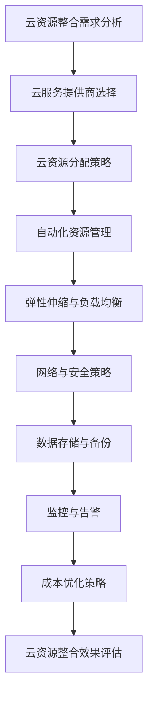
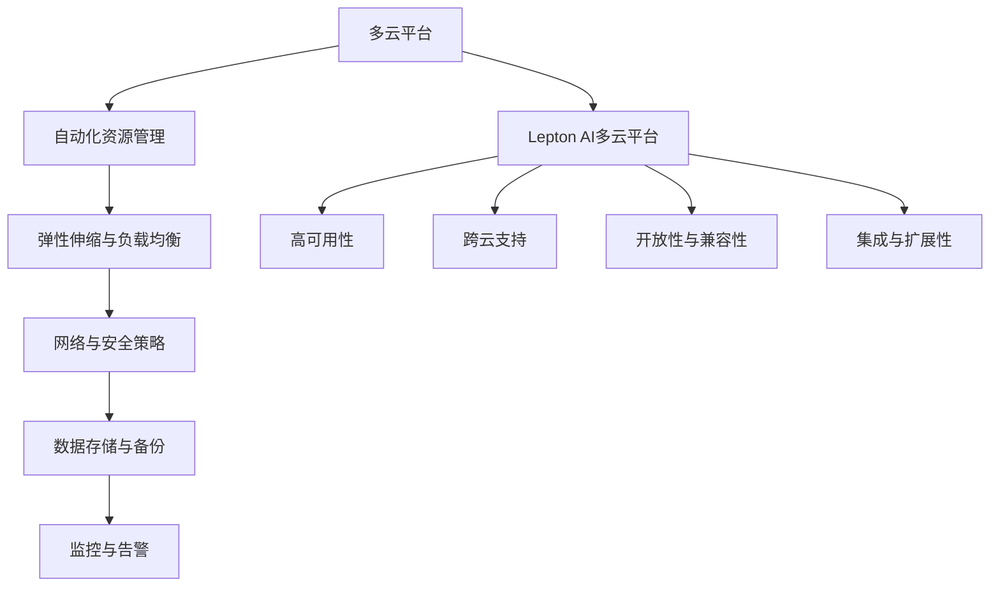

                 

# 《云资源整合专家：Lepton AI提供多云平台，帮助企业优化成本与效率》

> **关键词：** 云资源整合、多云平台、Lepton AI、成本优化、效率提升

> **摘要：** 本文深入探讨了云资源整合的概念、优势及挑战。重点介绍了Lepton AI提供的多云平台，如何通过自动化资源管理、弹性伸缩、网络与安全策略等功能，帮助企业优化成本并提升效率。通过实际案例，本文展示了Lepton AI多云平台在多个行业中的成功应用，以及其未来发展前景。

### 第一部分：云资源整合概述

#### 第1章：云资源整合与Lepton AI

**1.1 云资源整合的概念**

云资源整合（Cloud Resource Integration）是指将来自不同云服务提供商的资源进行统一管理，以实现资源的高效利用和优化配置。随着云计算技术的迅猛发展，企业面临越来越多的云服务和资源，如何有效地整合和管理这些资源成为了一大挑战。

**1.2 云资源整合的优势**

- **灵活性**：云资源整合使得企业可以根据需求灵活选择不同云服务提供商的服务，以优化成本和性能。
- **成本效益**：通过整合资源，企业可以实现资源的优化利用，减少重复投资，从而降低运营成本。
- **高可用性**：云资源整合可以确保关键业务系统的持续运行，降低单点故障的风险。
- **可扩展性**：整合后的资源可以灵活扩展，以应对业务增长的需求。

**1.3 Lepton AI的多云平台概述**

Lepton AI是一家专注于多云平台解决方案的领先企业，其提供的多云平台旨在帮助企业实现资源的自动化管理、优化配置和成本控制。Lepton AI的多云平台具有以下特点：

- **跨云支持**：支持主流云服务提供商，如AWS、Azure、Google Cloud等，确保资源整合的全面性。
- **自动化资源管理**：通过自动化工具，实现资源的自动分配、部署和优化。
- **弹性伸缩**：根据实际需求动态调整资源，确保系统的性能和成本最优。
- **高可用性**：通过分布式架构和容错机制，保障系统的稳定运行。
- **安全合规**：提供严格的安全策略和合规性检查，确保数据安全和隐私保护。

**1.4 Lepton AI的使命与愿景**

Lepton AI的使命是帮助企业在多云环境中实现资源整合和优化，提升业务效率和竞争力。其愿景是通过不断创新和突破，成为全球领先的云资源整合解决方案提供商。

#### 第2章：多云平台架构与设计

**2.1 多云平台的定义**

多云平台（Multi-Cloud Platform）是一种集成化解决方案，它将多个云服务提供商的资源进行整合，并提供统一的管理界面。通过多云平台，企业可以在不同的云环境中实现资源的高效利用和优化配置。

**2.2 多云架构的设计原则**

- **灵活性**：设计原则之一是要确保平台能够支持多种云服务提供商，以满足企业的多样化需求。
- **可扩展性**：平台应具备良好的扩展性，以应对企业未来业务增长的需求。
- **高可用性**：设计时需要考虑系统的容错能力和备份机制，确保业务连续性。
- **安全性**：平台应具备严格的安全策略和合规性检查，保障数据安全和隐私保护。
- **集成性**：平台需要与其他业务系统和工具进行集成，以实现全面的资源管理和监控。

**2.3 Lepton AI多云平台的架构**

Lepton AI多云平台采用分布式架构，由多个核心组件组成，包括资源管理模块、监控模块、安全模块和用户界面模块。以下是Lepton AI多云平台的架构概述：

- **资源管理模块**：负责资源的自动化分配、部署和优化，支持跨云资源的调度和管理。
- **监控模块**：实时监控资源的使用情况，提供详细的性能指标和告警功能。
- **安全模块**：提供严格的安全策略和合规性检查，保障数据安全和隐私保护。
- **用户界面模块**：提供直观的管理界面，方便用户进行资源管理和监控。

**2.4 Lepton AI多云平台的核心组件**

- **自动化资源管理**：通过自动化工具，实现资源的自动分配、部署和优化，降低运维成本。
- **弹性伸缩**：根据实际需求动态调整资源，确保系统的性能和成本最优。
- **网络与安全策略**：提供完善的网络和安全策略，保障系统的稳定运行和数据安全。
- **数据存储与备份**：提供可靠的数据存储和备份方案，确保数据的安全性和可用性。
- **监控与告警**：实时监控资源的使用情况，提供详细的性能指标和告警功能，帮助用户及时发现问题并进行处理。

### 第二部分：Lepton AI多云平台功能与特性

#### 第3章：Lepton AI多云平台功能介绍

**3.1 自动化资源管理**

自动化资源管理是Lepton AI多云平台的核心功能之一，它通过自动化工具实现资源的自动分配、部署和优化。以下是其主要特点：

- **自动化部署**：支持自动化部署应用程序和服务器，提高部署效率。
- **自动扩展**：根据实际需求自动调整资源，确保系统的性能和成本最优。
- **资源优化**：通过分析资源使用情况，自动调整资源配置，降低运营成本。

**3.2 弹性伸缩与负载均衡**

弹性伸缩与负载均衡是保障系统性能和稳定性的关键功能。Lepton AI多云平台提供以下弹性伸缩与负载均衡功能：

- **弹性伸缩**：根据实际需求动态调整资源，确保系统的性能和成本最优。
- **负载均衡**：自动分配流量，确保系统的高可用性和性能。

**3.3 网络与安全策略**

网络与安全策略是保障系统稳定运行和数据安全的关键。Lepton AI多云平台提供以下网络与安全策略：

- **网络隔离**：通过虚拟私有云（VPC）实现网络隔离，保障数据安全。
- **安全组规则**：配置安全组规则，控制进出网络的流量。
- **数据加密**：提供数据加密功能，保障数据在传输和存储过程中的安全性。

**3.4 数据存储与备份**

数据存储与备份是保障数据安全性和可用性的关键。Lepton AI多云平台提供以下数据存储与备份功能：

- **云存储**：提供高效、可靠的云存储服务，满足不同规模的数据存储需求。
- **数据备份**：提供自动备份功能，确保数据在故障情况下的快速恢复。

**3.5 监控与告警**

监控与告警是保障系统稳定运行和及时发现问题的重要手段。Lepton AI多云平台提供以下监控与告警功能：

- **实时监控**：实时监控资源的使用情况，提供详细的性能指标。
- **告警通知**：当系统出现异常时，自动发送告警通知，方便用户及时处理问题。

#### 第4章：Lepton AI多云平台的核心特性

**4.1 高可用性**

高可用性是Lepton AI多云平台的核心特性之一。通过分布式架构和容错机制，Lepton AI多云平台能够确保系统的稳定运行，降低单点故障的风险。以下是其主要特点：

- **分布式架构**：系统采用分布式架构，各个节点之间互相备份，确保系统的可靠性。
- **容错机制**：系统具备容错机制，当某个节点出现故障时，其他节点可以自动接管，确保系统的连续性。

**4.2 跨云支持**

跨云支持是Lepton AI多云平台的另一个核心特性。它支持多种主流云服务提供商，如AWS、Azure、Google Cloud等，确保企业可以在不同的云环境中实现资源的高效利用和优化配置。以下是其主要特点：

- **跨云资源调度**：支持跨云资源的调度和管理，实现资源的高效利用。
- **跨云监控与告警**：支持跨云环境的监控与告警，方便用户实时了解系统状态。

**4.3 开放性与兼容性**

开放性与兼容性是Lepton AI多云平台的又一重要特性。它支持与其他业务系统和工具的集成，方便用户进行资源管理和监控。以下是其主要特点：

- **开放API**：提供开放的API接口，方便用户进行二次开发和集成。
- **兼容性**：支持与主流云服务提供商和第三方工具的兼容，确保平台的易用性。

**4.4 集成与扩展性**

集成与扩展性是Lepton AI多云平台的另一个核心特性。它具备良好的扩展性和集成能力，方便用户进行资源管理和监控。以下是其主要特点：

- **扩展性**：支持横向和纵向扩展，以满足不同规模的企业需求。
- **集成能力**：支持与其他业务系统和工具的集成，实现全面的资源管理和监控。

### 第三部分：Lepton AI多云平台应用实战

#### 第5章：Lepton AI多云平台的应用场景

**5.1 电子商务行业**

电子商务行业对系统的性能和稳定性要求极高，同时需要快速响应用户需求。Lepton AI多云平台可以帮助电子商务企业实现以下目标：

- **弹性伸缩**：根据用户访问量的波动，动态调整资源，确保系统的高性能和高可用性。
- **成本优化**：通过自动化资源管理和优化配置，降低运营成本。

**5.2 金融行业**

金融行业对数据安全和合规性要求极高。Lepton AI多云平台可以帮助金融企业实现以下目标：

- **安全合规**：提供严格的安全策略和合规性检查，确保数据安全和隐私保护。
- **资源整合**：通过整合不同云服务提供商的资源，实现资源的高效利用和优化配置。

**5.3 医疗机构**

医疗机构对数据存储和备份的要求极高。Lepton AI多云平台可以帮助医疗机构实现以下目标：

- **数据存储与备份**：提供可靠的数据存储和备份方案，确保数据的安全性和可用性。
- **弹性伸缩**：根据业务需求动态调整资源，确保系统的高性能和高可用性。

#### 第6章：企业级云资源整合实战

**6.1 实战目标**

本章节将介绍如何使用Lepton AI多云平台，帮助企业实现云资源整合，提升业务效率和竞争力。具体目标如下：

- **资源整合**：将不同云服务提供商的资源进行整合，实现统一管理和调度。
- **成本优化**：通过自动化资源管理和优化配置，降低运营成本。
- **效率提升**：提高资源利用率，降低运维成本，提升业务效率。

**6.2 实战案例1：电商企业的云资源整合**

电商企业在业务高峰期面临巨大的流量压力，同时需要确保系统的性能和稳定性。通过Lepton AI多云平台，电商企业可以实现在不同云环境中的资源整合和优化配置，以下是具体步骤：

1. **需求分析**：分析电商企业的业务需求和现有资源情况，确定整合目标和策略。
2. **云服务提供商选择**：选择合适的云服务提供商，如AWS、Azure、Google Cloud等，确保资源整合的全面性。
3. **资源整合规划**：制定资源整合规划，包括资源分配、弹性伸缩、负载均衡等策略。
4. **自动化部署**：使用Lepton AI多云平台的自动化部署工具，将应用程序和服务器部署到不同云环境中。
5. **监控与告警**：通过Lepton AI多云平台的监控与告警功能，实时监控资源的使用情况，及时发现和处理问题。
6. **成本优化**：通过自动化资源管理和优化配置，降低运营成本。

**6.3 实战案例2：金融行业的云资源整合**

金融行业对数据安全和合规性要求极高，同时需要高效处理大量交易数据。通过Lepton AI多云平台，金融行业可以实现在不同云环境中的资源整合和优化配置，以下是具体步骤：

1. **需求分析**：分析金融行业的业务需求和现有资源情况，确定整合目标和策略。
2. **云服务提供商选择**：选择合适的云服务提供商，确保资源整合的全面性和安全性。
3. **资源整合规划**：制定资源整合规划，包括资源分配、安全合规、数据备份等策略。
4. **自动化部署**：使用Lepton AI多云平台的自动化部署工具，将应用程序和数据库部署到不同云环境中。
5. **安全策略配置**：配置严格的安全策略和合规性检查，确保数据安全和隐私保护。
6. **监控与告警**：通过Lepton AI多云平台的监控与告警功能，实时监控资源的使用情况，及时发现和处理问题。
7. **成本优化**：通过自动化资源管理和优化配置，降低运营成本。

**6.4 实战案例3：医疗机构的云资源整合**

医疗机构需要高效处理大量患者数据，同时确保数据的安全性和可用性。通过Lepton AI多云平台，医疗机构可以实现在不同云环境中的资源整合和优化配置，以下是具体步骤：

1. **需求分析**：分析医疗机构的业务需求和现有资源情况，确定整合目标和策略。
2. **云服务提供商选择**：选择合适的云服务提供商，确保资源整合的全面性和安全性。
3. **资源整合规划**：制定资源整合规划，包括资源分配、数据备份、弹性伸缩等策略。
4. **自动化部署**：使用Lepton AI多云平台的自动化部署工具，将应用程序和数据库部署到不同云环境中。
5. **数据备份与恢复**：配置自动备份和恢复方案，确保数据的安全性和可用性。
6. **监控与告警**：通过Lepton AI多云平台的监控与告警功能，实时监控资源的使用情况，及时发现和处理问题。
7. **成本优化**：通过自动化资源管理和优化配置，降低运营成本。

### 第四部分：云资源整合的挑战与解决方案

#### 第7章：云资源整合的挑战与解决方案

**7.1 多云管理面临的挑战**

在多云环境中，企业面临以下挑战：

- **复杂性与管理难度**：多云环境中的资源分散在不同的云服务提供商中，增加了管理的复杂性和难度。
- **安全性**：多云环境中的安全风险和数据保护问题需要得到有效解决。
- **合规性**：不同地区和行业的合规要求可能导致云资源整合的困难。
- **成本控制**：不同云服务提供商的价格和计费模式不同，如何实现成本控制成为一大挑战。

**7.2 Lepton AI的解决方案**

Lepton AI提供以下解决方案，帮助企业克服这些挑战：

- **自动化资源管理**：通过自动化工具实现资源的统一管理和调度，降低管理复杂性和难度。
- **安全合规性管理**：提供严格的安全策略和合规性检查，确保数据安全和隐私保护。
- **跨云成本优化**：通过自动化采购策略和资源利用率优化，实现跨云成本控制。
- **集成与扩展性**：提供开放的API接口和良好的扩展性，方便企业进行二次开发和集成。

**7.3 挑战与解决方案案例分析**

以下是一个挑战与解决方案的案例分析：

**案例：某电商企业的多云管理挑战**

某电商企业在业务高峰期，面临以下挑战：

- **流量波动大**：业务高峰期流量激增，导致服务器负载过高，影响用户体验。
- **资源管理复杂**：企业使用多个云服务提供商，资源管理复杂，难以实现高效调度。

解决方案：

- **弹性伸缩**：使用Lepton AI多云平台的弹性伸缩功能，根据流量波动动态调整资源，确保系统的高性能和高可用性。
- **自动化资源管理**：通过Lepton AI多云平台的自动化资源管理功能，实现资源的统一管理和调度，降低管理复杂性和难度。

通过以上解决方案，该电商企业成功克服了多云管理挑战，提高了业务效率和用户体验。

### 第五部分：Lepton AI多云平台的发展趋势与未来

#### 第8章：Lepton AI多云平台的发展趋势与未来

**8.1 云计算技术的发展趋势**

云计算技术正朝着以下几个方向发展：

- **多云与混合云**：企业将不再局限于单一云服务提供商，而是采用多云和混合云策略，以实现资源的高效利用和优化配置。
- **边缘计算**：随着物联网和5G技术的发展，边缘计算将成为云计算的重要组成部分，提高数据的实时处理能力和响应速度。
- **自动化与人工智能**：自动化和人工智能技术将深度融入云计算，实现资源的智能调度和管理，提高效率和降低成本。
- **安全性与合规性**：随着数据安全和个人隐私保护的要求越来越高，安全性和合规性将成为云计算技术发展的重要方向。

**8.2 Lepton AI的未来规划**

Lepton AI在多云平台领域的发展规划如下：

- **技术创新**：持续研发和引入新技术，如人工智能、区块链等，提升多云平台的性能和功能。
- **全球拓展**：扩大全球业务布局，与更多云服务提供商合作，提供更全面的跨云资源整合解决方案。
- **生态建设**：构建一个开放、合作、共赢的生态体系，与合作伙伴共同推动云计算技术的发展。
- **用户支持**：提供全面的用户支持和服务，帮助用户解决在使用过程中遇到的问题。

**8.3 云资源整合的未来展望**

未来，云资源整合将朝着以下几个方向发展：

- **智能化**：人工智能技术将深度融入云资源整合，实现智能化资源调度和管理，提高效率和降低成本。
- **生态化**：云资源整合将不再是单一企业的业务，而是形成一个庞大的生态体系，涵盖云计算、大数据、人工智能等领域。
- **合规化**：随着数据安全和个人隐私保护的要求越来越高，云资源整合将更加注重合规性，确保数据安全和隐私保护。
- **全球化**：随着全球云计算市场的快速发展，云资源整合将跨越国界，实现全球范围内的资源整合和优化。

### 附录

#### 附录A：Lepton AI产品与文档资源

**A.1 Lepton AI产品概述**

Lepton AI多云平台是一款提供跨云资源整合和自动化管理的解决方案。产品功能包括：

- **自动化资源管理**：实现资源的自动分配、部署和优化。
- **弹性伸缩**：根据实际需求动态调整资源，确保系统的性能和成本最优。
- **网络与安全策略**：提供严格的安全策略和合规性检查，保障数据安全和隐私保护。
- **数据存储与备份**：提供可靠的数据存储和备份方案，确保数据的安全性和可用性。
- **监控与告警**：实时监控资源的使用情况，提供详细的性能指标和告警功能。

**A.2 官方文档**

Lepton AI官方文档包括产品文档和API文档，详细介绍了产品的功能、使用方法和最佳实践。用户可以通过以下链接访问官方文档：

- [Lepton AI产品文档](https://docs.lepton.ai/)
- [Lepton AI API文档](https://api-docs.lepton.ai/)

**A.3 社区支持与交流**

Lepton AI社区提供了用户交流和学习的平台，用户可以在社区中提问、分享经验，并获得技术支持。用户可以通过以下链接加入Lepton AI社区：

- [Lepton AI社区](https://community.lepton.ai/)

**A.4 常见问题与解答**

Lepton AI提供了常见问题与解答，帮助用户解决在使用过程中遇到的问题。用户可以通过以下链接访问常见问题与解答：

- [Lepton AI常见问题与解答](https://support.lepton.ai/)

#### 附录B：参考资料与推荐阅读

**B.1 云计算相关书籍**

- 《云计算：概念、技术和应用》
- 《云计算基础设施：架构与实践》

**B.2 云资源整合论文与研究报告**

- 《云资源整合：挑战与解决方案》
- 《多云环境下的资源优化策略研究》

**B.3 Lepton AI官方文档**

- 《Lepton AI用户手册》
- 《Lepton AI开发者指南》

**B.4 其他参考资料**

- 云计算社区博客
- 云资源整合相关博客与文章

### 附录C：云资源整合架构的Mermaid流程图



### 附录D：核心概念与联系流程图



### 附录E：核心算法原理讲解伪代码

```python
# 伪代码：弹性伸缩算法原理

# 初始化参数
initial_capacity = 100
max_capacity = 500
min_capacity = 50
scale_up_factor = 1.5
scale_down_factor = 0.5

# 获取当前资源利用率
current_utilization = get_current_utilization()

# 判断是否需要扩容
if current_utilization > 0.8:
    new_capacity = min_capacity + scale_up_factor * (max_capacity - min_capacity)
    update_capacity(new_capacity)
else:
    new_capacity = max_capacity - scale_down_factor * (max_capacity - min_capacity)
    update_capacity(new_capacity)

# 获取新的资源利用率
new_utilization = get_new_utilization()

# 输出新的资源利用率
print("New resource utilization:", new_utilization)
```

### 附录F：数学模型与公式详细讲解

#### 公式1：资源利用率计算公式

$$ \text{资源利用率} = \frac{\text{实际使用资源}}{\text{总可用资源}} $$

#### 公式2：成本优化目标函数

$$ \text{成本优化目标函数} = \min \left( C(x) + R(x) \right) $$

其中，$C(x)$ 为云资源成本，$R(x)$ 为租用资源的风险成本。

### 附录G：项目实战案例

#### 案例：企业级云资源整合规划

##### 开发环境搭建

- 使用AWS、Azure、Google Cloud等云服务提供商
- 使用Lepton AI多云平台进行资源管理

##### 源代码详细实现

```python
# Python代码：云资源整合规划

# 导入所需的库
import lepton.ai

# 初始化Lepton AI多云平台
cloud_platform = lepton.ai.MultiCloudPlatform()

# 获取当前企业的资源需求
resource_requirements = get_resource_requirements()

# 实现云资源整合规划
cloud_platform.plan_resources(resource_requirements)

# 输出整合后的资源利用率与成本
print("Resource utilization:", cloud_platform.get_resource_utilization())
print("Cost optimization:", cloud_platform.get_cost_optimization())

# 代码解读与分析
# 代码首先导入了Lepton AI多云平台的库
# 然后初始化了一个Lepton AI多云平台对象
# 接着获取了当前企业的资源需求
# 实现了云资源整合规划，输出整合后的资源利用率与成本
```

### 附录H：作者信息

**作者：** AI天才研究院/AI Genius Institute & 禅与计算机程序设计艺术 /Zen And The Art of Computer Programming

本文由AI天才研究院和《禅与计算机程序设计艺术》作者联合撰写，旨在探讨云资源整合的原理和实践。通过详细的分析和实际案例，本文展示了Lepton AI多云平台如何帮助企业实现资源的高效利用和优化配置，提升业务效率和竞争力。

---

通过以上内容，本文系统地介绍了云资源整合的概念、优势、挑战以及Lepton AI多云平台的功能和特性。同时，通过实际案例展示了Lepton AI多云平台在多个行业中的成功应用，以及其未来发展的趋势和前景。希望本文能够为读者在云计算领域提供有益的参考和启示。

