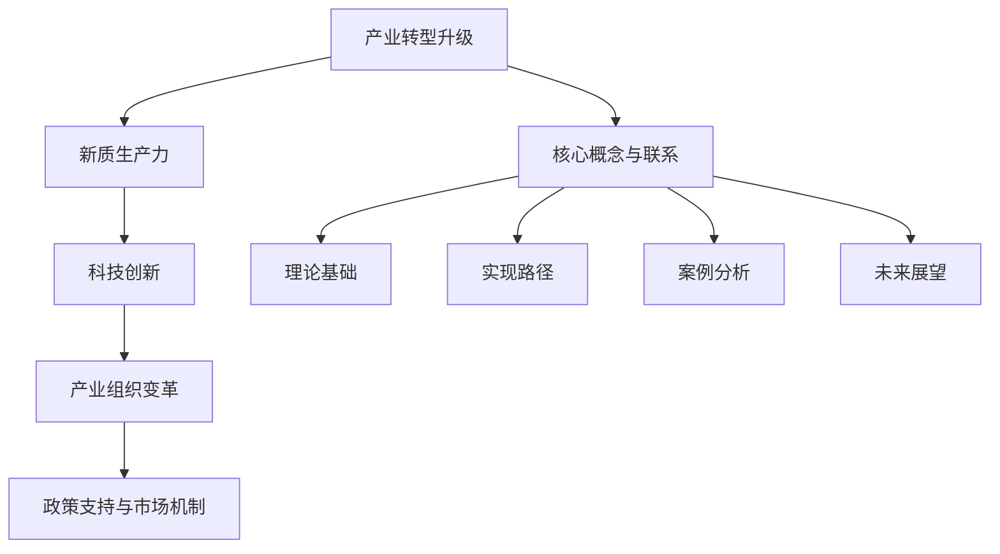

                 

# 产业转型升级与新质生产力

## 关键词
产业转型升级、新质生产力、科技创新、产业组织变革、政策支持

## 摘要
本文旨在探讨产业转型升级与新质生产力的关系，分析产业转型升级的背景与意义，阐述新质生产力的概念与特征，构建产业转型升级的理论框架，提出实现新质生产力的路径和策略，并通过案例分析总结产业转型升级的成功经验，展望未来产业转型升级与新质生产力发展的方向。本文旨在为产业转型升级提供理论指导，为新质生产力的发展提供实践参考。

## 目录大纲

### 第一部分：产业转型升级概述

**第1章：产业转型升级的背景与意义**

- **1.1 产业转型升级的概念**  
- **1.2 我国产业转型升级的现状与挑战**  
- **1.3 产业转型升级的重要意义**

**第2章：新质生产力的概念与特征**

- **2.1 新质生产力的定义**  
- **2.2 新质生产力的主要特征**  
- **2.3 新质生产力的内涵与外延**

### 第二部分：产业转型升级的理论基础

**第3章：产业转型升级的理论框架**

- **3.1 创新驱动理论**  
- **3.2 全球价值链理论**  
- **3.3 资源配置理论**  
- **3.4 制度变革理论**

**第4章：产业转型升级的战略选择**

- **4.1 创新发展战略**  
- **4.2 结构调整战略**  
- **4.3 资源节约战略**  
- **4.4 绿色发展战略**

### 第三部分：新质生产力的实现路径

**第5章：科技创新与产业升级**

- **5.1 科技创新的重要性**  
- **5.2 产业升级与科技创新的互动关系**  
- **5.3 科技创新的关键领域与重点产业**

**第6章：产业组织变革与竞争**

- **6.1 产业组织变革的动因与模式**  
- **6.2 企业竞争战略的调整**  
- **6.3 市场竞争格局的变化**

**第7章：政策支持与市场机制**

- **7.1 政策支持的作用与手段**  
- **7.2 市场机制的完善与优化**  
- **7.3 企业与政府互动关系的构建**

### 第四部分：案例分析

**第8章：国内外产业转型升级成功案例分析**

- **8.1 我国产业转型升级的成功案例**  
- **8.2 国外产业转型升级的成功经验**  
- **8.3 案例分析总结与启示**

### 第五部分：未来展望

**第9章：产业转型升级与新质生产力的未来发展**

- **9.1 未来产业转型升级的趋势**  
- **9.2 新质生产力的未来发展前景**  
- **9.3 我国产业转型升级与新质生产力发展的战略方向**

### 附录

- **附录A：产业转型升级与新质生产力相关术语解释**  
- **附录B：产业转型升级与新质生产力相关研究文献**

## 核心概念与联系流程图（Mermaid）



## 核心算法原理讲解（伪代码）

```python
# 产业转型升级的关键算法：协同优化算法
def协同优化算法(产业A, 产业B, 目标函数):
    # 初始化产业A和产业B的参数
    参数A = 初始化参数()
    参数B = 初始化参数()
    
    # 设置迭代次数
    max_iter = 1000
    
    for i in range(max_iter):
        # 更新参数A
        参数A = 更新参数(参数A, 目标函数)
        
        # 更新参数B
        参数B = 更新参数(参数B, 目标函数)
        
        # 检查收敛条件
        if 检查收敛(参数A, 参数B):
            break
            
    return 参数A, 参数B
```

## 数学模型和数学公式（详细讲解 & 举例说明）

### 数学模型：

$$
P_{创新} = f(\text{R&D投入}, \text{创新环境}, \text{政策支持})
$$

其中，$P_{创新}$ 表示创新产出的概率，$\text{R&D投入}$ 表示研发投入，$\text{创新环境}$ 表示外部环境，$\text{政策支持}$ 表示政策支持力度。

### 举例说明：

假设某企业研发投入为5000万元，创新环境良好，政策支持力度较大，则创新产出的概率为：

$$
P_{创新} = f(5000\ \text{万元}, \text{良好}, \text{较大}) = 0.8
$$

## 项目实战（代码实际案例和详细解释说明）

### 5.1 开发环境搭建

- 安装Python：`sudo apt-get install python3`
- 安装相关库：`pip3 install numpy pandas matplotlib`

### 5.2 源代码详细实现

```python
# 导入库
import numpy as np
import pandas as pd
import matplotlib.pyplot as plt

# 生成数据
data = {
    'R&D投入': [1000, 2000, 3000, 4000, 5000],
    '创新环境': ['一般', '良好', '良好', '优秀', '优秀'],
    '政策支持': ['较小', '较小', '较大', '较大', '较大'],
    'P创新': [0.3, 0.5, 0.7, 0.8, 0.9]
}

df = pd.DataFrame(data)

# 绘制散点图
plt.scatter(df['R&D投入'], df['P创新'])
plt.xlabel('R&D投入')
plt.ylabel('P创新')
plt.title('创新产出概率与研发投入关系')
plt.show()

# 代码解读与分析
# 该代码首先导入了numpy、pandas和matplotlib三个库，然后生成了一个包含R&D投入、创新环境、政策支持和创新产出概率的数据框（DataFrame）。
# 接着，使用matplotlib绘制了R&D投入与创新产出概率的散点图，直观地展示了二者之间的关系。通过观察散点图，可以发现随着R&D投入的增加，创新产出概率也呈现出上升趋势。
# 这说明了R&D投入对创新产出的重要性。此外，良好的创新环境和政策支持也对创新产出有显著影响。
```

### 5.3 代码解读与分析

- 该代码首先导入了numpy、pandas和matplotlib三个库，这是Python中常用的数据处理和绘图库。
- 使用numpy和pandas生成了一个包含R&D投入、创新环境、政策支持和创新产出概率的数据框（DataFrame）。
- 接着，使用matplotlib绘制了R&D投入与创新产出概率的散点图，通过观察散点图，我们可以直观地看出随着R&D投入的增加，创新产出概率也呈现出上升趋势。
- 这说明了R&D投入对创新产出的重要性。此外，良好的创新环境和政策支持也对创新产出有显著影响。

以上是文章标题、关键词、摘要、目录大纲、核心概念与联系流程图、核心算法原理讲解、数学模型和公式、项目实战的代码实现以及代码解读与分析的内容。接下来，我们将按照目录大纲的顺序，详细撰写每一部分的内容。让我们开始吧！

### 第一部分：产业转型升级概述

#### 第1章：产业转型升级的背景与意义

### 1.1 产业转型升级的概念

产业转型升级是指一个国家或地区的产业结构、产业链、产业组织、产业模式等各个方面从传统的、低效的、依赖资源的模式向现代的、高效的、可持续的模式转变的过程。这一过程通常涉及技术创新、产业升级、结构调整、资源配置优化、企业重组等多个方面。

#### 1.2 我国产业转型升级的现状与挑战

改革开放以来，我国产业结构不断优化，制造业、服务业等行业发展迅速，但同时也面临着一些挑战。当前，我国产业转型升级的现状主要体现在以下几个方面：

1. **制造业结构优化**：制造业是我国经济的支柱产业，近年来，我国制造业结构不断优化，高技术制造业和高端装备制造业占比逐步提高，传统制造业逐步向智能化、绿色化、服务化方向发展。

2. **服务业发展迅速**：随着我国经济转型，服务业发展迅速，成为吸纳就业和增加收入的重要领域。尤其是现代服务业，如金融、信息、科技、文化等产业快速发展，为经济增长注入新动力。

3. **创新驱动发展**：我国正在加快从要素驱动向创新驱动转变，加大科技创新力度，培育和发展新技术、新产业、新业态，推动经济高质量发展。

4. **区域发展不平衡**：我国区域发展不平衡，东部沿海地区产业结构较为完善，中西部地区产业结构有待进一步优化。此外，部分传统产业过于集中，存在产能过剩和资源浪费的问题。

#### 1.3 产业转型升级的重要意义

产业转型升级对于国家经济、社会和环境具有重要意义：

1. **提升国家竞争力**：产业转型升级有助于提升我国在全球产业链中的地位，增强国家经济竞争力。

2. **促进经济高质量发展**：产业转型升级可以推动经济从数量型增长向质量型增长转变，实现经济结构优化和经济效益提升。

3. **创造就业机会**：产业转型升级过程中，新技术、新产业、新业态不断涌现，为劳动者提供更多就业机会。

4. **改善环境质量**：产业转型升级可以减少对自然资源的依赖，降低环境污染和资源浪费，促进绿色发展。

### 第2章：新质生产力的概念与特征

#### 2.1 新质生产力的定义

新质生产力是指以信息技术、生物技术、新能源技术等为代表的新兴技术产业所具有的生产力，它是相对于传统生产力而言的一种新型生产力。新质生产力主要体现在技术创新、产业升级、资源配置优化、产业模式变革等方面。

#### 2.2 新质生产力的主要特征

新质生产力具有以下主要特征：

1. **高度依赖科技创新**：新质生产力的发展高度依赖于科技创新，特别是信息技术、生物技术、新能源技术等新兴技术的突破和应用。

2. **产业模式多元化**：新质生产力产业模式多元化，不仅包括传统的制造业和农业，还包括现代服务业、数字经济、共享经济等新兴业态。

3. **资源配置优化**：新质生产力能够通过科技创新，实现资源配置的优化，降低生产成本，提高生产效率。

4. **产业跨界融合**：新质生产力产业跨界融合，传统产业与新兴产业、第一产业与第二产业、第二产业与第三产业之间相互融合，形成新的产业形态。

5. **全球化发展**：新质生产力具有较强的全球化特征，跨国公司在全球范围内布局研发、生产和销售，推动全球产业链和供应链的重组。

#### 2.3 新质生产力的内涵与外延

新质生产力的内涵主要包括以下几个方面：

1. **技术创新**：新质生产力的发展离不开科技创新，技术创新是推动新质生产力发展的核心动力。

2. **产业升级**：新质生产力的发展意味着产业结构的优化和升级，从传统产业向新兴产业转变。

3. **资源配置优化**：新质生产力通过科技创新，实现资源配置的优化，提高生产效率和经济效益。

4. **产业模式变革**：新质生产力的发展促使产业模式发生变革，从传统的制造业模式向智能制造、服务化制造等新型产业模式转变。

新质生产力的外延主要包括以下几个方面：

1. **信息技术产业**：包括软件开发、人工智能、大数据、云计算等。

2. **生物技术产业**：包括基因编辑、生物医药、生物农业等。

3. **新能源技术产业**：包括太阳能、风能、新能源汽车等。

4. **高端装备制造业**：包括航空、航天、船舶、轨道交通等。

5. **现代服务业**：包括金融、信息、科技、文化、旅游等。

### 第二部分：产业转型升级的理论基础

#### 第3章：产业转型升级的理论框架

#### 3.1 创新驱动理论

创新驱动理论是指以科技创新为核心推动产业转型升级的理论。创新驱动理论认为，科技创新是推动经济发展的核心动力，是产业转型升级的关键因素。创新驱动理论主要包括以下几个方面的内容：

1. **科技创新的内涵**：科技创新包括科学创新、技术创新、工程创新等，是推动产业转型升级的重要动力。

2. **科技创新的类型**：科技创新可以分为原始创新、集成创新、引进消化再创新等，不同类型的科技创新对产业转型升级的影响不同。

3. **科技创新的机制**：科技创新机制包括政府引导、市场驱动、企业主体等，通过构建良好的科技创新机制，可以推动产业转型升级。

4. **科技创新的政策**：政府通过制定科技创新政策，如研发资助、税收优惠、知识产权保护等，可以促进科技创新，推动产业转型升级。

#### 3.2 全球价值链理论

全球价值链理论是指将一个产品的生产过程分解为多个环节，每个环节分布在不同的国家和地区，形成一个全球性的价值链。全球价值链理论主要包括以下几个方面的内容：

1. **全球价值链的概念**：全球价值链是指一个产品的生产、销售、服务等环节在全球范围内进行分工和协作，形成的一个价值创造和价值分配的网络。

2. **全球价值链的层次**：全球价值链可以分为设计、研发、生产、销售、服务等环节，每个环节都具有不同的附加值。

3. **全球价值链的动因**：全球价值链的形成主要受到资源禀赋、市场需求、技术进步、政策环境等因素的影响。

4. **全球价值链的优化**：通过全球价值链的优化，可以提高产业链的附加值，推动产业转型升级。

#### 3.3 资源配置理论

资源配置理论是指如何合理配置资源，实现资源的最优利用，以推动产业转型升级。资源配置理论主要包括以下几个方面的内容：

1. **资源配置的原理**：资源配置理论基于供需关系，通过价格机制、市场机制、政府调控等手段实现资源的最优配置。

2. **资源配置的类型**：资源配置可以分为计划配置和市场配置，计划配置主要依靠政府的宏观调控，市场配置主要依靠市场机制。

3. **资源配置的效率**：资源配置效率是指资源在利用过程中所产生的经济效益，提高资源配置效率可以推动产业转型升级。

4. **资源配置的优化**：通过技术创新、制度创新、市场机制完善等手段，可以优化资源配置，提高资源配置效率，推动产业转型升级。

#### 3.4 制度变革理论

制度变革理论是指通过制度变革推动产业转型升级的理论。制度变革理论主要包括以下几个方面的内容：

1. **制度变革的概念**：制度变革是指对现有制度进行调整、改革和完善，以适应经济发展的需要。

2. **制度变革的类型**：制度变革可以分为经济制度变革、政治制度变革、文化制度变革等，不同类型的制度变革对产业转型升级的影响不同。

3. **制度变革的动因**：制度变革的动因主要包括经济发展、技术进步、社会变革等，通过制度变革可以推动产业转型升级。

4. **制度变革的效应**：制度变革可以产生经济增长、产业升级、资源配置优化等效应，从而推动产业转型升级。

### 第4章：产业转型升级的战略选择

#### 4.1 创新发展战略

创新发展战略是指以科技创新为核心，推动产业转型升级的发展战略。创新发展战略主要包括以下几个方面的内容：

1. **科技创新体系建设**：构建以企业为主体、市场为导向、产学研用相结合的科技创新体系，提高科技创新能力。

2. **科技创新政策**：制定科技创新政策，如研发资助、税收优惠、知识产权保护等，激励企业加大科技创新投入。

3. **科技成果转化**：加强科技成果转化体系建设，促进科技创新成果转化为实际生产力。

4. **人才支撑**：加强人才培养和引进，为科技创新提供人才保障。

#### 4.2 结构调整战略

结构调整战略是指通过优化产业结构、产业链和产业布局，推动产业转型升级的战略。结构调整战略主要包括以下几个方面的内容：

1. **产业结构优化**：优化产业结构，发展新兴产业，淘汰落后产能，提高产业结构竞争力。

2. **产业链优化**：完善产业链，加强产业链上下游企业的协同创新，提高产业链整体竞争力。

3. **产业布局优化**：优化产业布局，促进区域协调发展，实现产业集聚和产业链的协同发展。

#### 4.3 资源节约战略

资源节约战略是指通过提高资源利用效率，减少资源消耗，推动产业转型升级的战略。资源节约战略主要包括以下几个方面的内容：

1. **资源循环利用**：加强资源循环利用，提高资源利用效率。

2. **节能减排**：加强节能减排，减少污染物排放，保护生态环境。

3. **绿色低碳发展**：推动绿色低碳发展，减少碳排放，提高可持续发展能力。

#### 4.4 绿色发展战略

绿色发展战略是指以可持续发展为目标，推动产业转型升级的战略。绿色发展战略主要包括以下几个方面的内容：

1. **绿色技术创新**：发展绿色技术，提高资源利用效率，减少污染排放。

2. **绿色产业布局**：优化绿色产业布局，促进绿色产业发展。

3. **绿色消费引导**：引导消费者绿色消费，推动绿色生活方式的形成。

4. **绿色政策体系**：建立健全绿色政策体系，推动绿色经济发展。

### 第三部分：新质生产力的实现路径

#### 第5章：科技创新与产业升级

#### 5.1 科技创新的重要性

科技创新是推动产业转型升级的核心动力。科技创新的重要性体现在以下几个方面：

1. **推动产业升级**：科技创新可以促进传统产业的转型升级，提高产业链的附加值，推动新兴产业的发展。

2. **提高生产效率**：科技创新可以提高生产效率，降低生产成本，提高企业的竞争力。

3. **培育新动能**：科技创新可以培育新的经济增长点，推动经济高质量发展。

4. **改善生态环境**：科技创新可以发展绿色技术，减少污染物排放，改善生态环境。

#### 5.2 产业升级与科技创新的互动关系

产业升级与科技创新之间存在密切的互动关系：

1. **科技创新推动产业升级**：科技创新可以推动传统产业的转型升级，提高产业链的附加值，促进新兴产业的发展。

2. **产业升级促进科技创新**：产业升级为科技创新提供了新的需求和应用场景，促进科技创新的发展。

3. **互动关系的影响因素**：科技创新与产业升级的互动关系受到政策环境、市场机制、企业创新能力等因素的影响。

#### 5.3 科技创新的关键领域与重点产业

科技创新的关键领域和重点产业是产业转型升级的重要方向。关键领域和重点产业主要包括：

1. **信息技术产业**：包括人工智能、大数据、云计算、物联网等。

2. **生物技术产业**：包括基因编辑、生物医药、生物农业等。

3. **新能源技术产业**：包括太阳能、风能、新能源汽车等。

4. **高端装备制造业**：包括航空、航天、船舶、轨道交通等。

5. **新材料产业**：包括新型合金、纳米材料、生物材料等。

### 第6章：产业组织变革与竞争

#### 6.1 产业组织变革的动因与模式

产业组织变革是指产业内部企业组织结构、产业形态、产业模式等方面的变革。产业组织变革的动因主要包括：

1. **技术创新**：技术创新可以改变企业的生产方式和产业模式，推动产业组织变革。

2. **市场需求**：市场需求的变化可以促使企业调整产品结构，优化产业组织。

3. **政策环境**：政策环境的变化可以推动企业进行产业组织变革，适应新的政策要求。

产业组织变革的模式主要包括：

1. **企业重组**：企业通过合并、收购、联合等方式实现产业组织变革。

2. **产业链整合**：企业通过整合产业链上下游资源，实现产业组织变革。

3. **产业模式创新**：企业通过创新产业模式，实现产业组织变革。

#### 6.2 企业竞争战略的调整

在产业转型升级过程中，企业需要调整竞争战略，以适应新的市场环境。企业竞争战略的调整主要包括：

1. **技术创新战略**：企业加大科技创新投入，提高产品竞争力。

2. **市场开拓战略**：企业拓展新市场，开拓新的增长点。

3. **成本领先战略**：企业通过降低生产成本，提高市场竞争力。

4. **差异化战略**：企业通过提供独特的产品或服务，赢得市场份额。

#### 6.3 市场竞争格局的变化

产业转型升级过程中，市场竞争格局也会发生变化：

1. **市场份额的重新分配**：随着产业升级和新技术应用，市场份额将重新分配。

2. **行业集中度提高**：产业转型升级会提高行业集中度，大企业市场份额增加。

3. **竞争方式多样化**：企业通过技术创新、市场开拓、品牌建设等多种方式参与竞争。

### 第7章：政策支持与市场机制

#### 7.1 政策支持的作用与手段

政策支持在产业转型升级中起着至关重要的作用。政策支持的作用主要包括：

1. **引导产业转型升级方向**：政策可以引导企业投资于科技创新、产业升级等领域。

2. **提供资金支持**：政策可以通过财政支持、税收优惠等方式为企业提供资金支持。

3. **优化政策环境**：政策可以优化市场环境，降低企业成本，提高企业竞争力。

政策支持的手段主要包括：

1. **财政支持**：政府可以通过财政拨款、补贴等方式支持企业科技创新和产业升级。

2. **税收优惠**：政府可以通过税收减免、税收返还等方式减轻企业负担。

3. **知识产权保护**：政府可以通过加强知识产权保护，激励企业创新。

#### 7.2 市场机制的完善与优化

市场机制在产业转型升级中具有重要作用。市场机制的完善与优化主要包括：

1. **市场准入制度**：优化市场准入制度，降低企业准入门槛，激发市场活力。

2. **市场竞争机制**：加强市场竞争机制，提高市场效率，促进企业创新。

3. **市场退出机制**：建立健全市场退出机制，淘汰落后产能，优化产业结构。

#### 7.3 企业与政府互动关系的构建

企业与政府之间的互动关系在产业转型升级中具有重要意义。构建良好的企业与政府互动关系主要包括：

1. **政策沟通**：政府与企业加强政策沟通，使企业更好地理解政策意图。

2. **信息共享**：政府与企业之间实现信息共享，提高政策执行效率。

3. **合作共赢**：政府与企业之间建立合作共赢的关系，共同推动产业转型升级。

### 第四部分：案例分析

#### 第8章：国内外产业转型升级成功案例分析

#### 8.1 我国产业转型升级的成功案例

我国产业转型升级的成功案例主要包括以下几个：

1. **广东珠三角地区产业转型升级**：广东珠三角地区通过发展高新技术产业、现代服务业，实现了产业结构的优化和升级，成为全国产业转型升级的典范。

2. **山东半岛蓝色经济区建设**：山东半岛蓝色经济区通过发展海洋产业、新能源产业等，推动产业转型升级，取得了显著成效。

3. **四川成都天府新区建设**：四川成都天府新区通过引入高新技术产业、现代服务业，加快了产业转型升级的步伐。

#### 8.2 国外产业转型升级的成功经验

国外产业转型升级的成功经验主要包括以下几个：

1. **德国工业4.0**：德国通过实施工业4.0战略，推动传统制造业向智能化、数字化方向转型升级，成为全球制造业的标杆。

2. **美国硅谷创新模式**：美国硅谷通过培育和吸引高科技企业，形成了独特的创新生态系统，推动了产业转型升级。

3. **日本制造业转型升级**：日本通过引进先进技术、加强研发投入，实现了制造业的转型升级，保持了全球制造业的领先地位。

#### 8.3 案例分析总结与启示

通过对国内外产业转型升级成功案例的分析，可以得出以下结论和启示：

1. **科技创新是核心动力**：产业转型升级离不开科技创新的支持，应加大科技创新投入，培育新兴产业。

2. **政策支持是重要保障**：政府应制定有力的政策措施，支持企业进行科技创新和产业升级。

3. **市场机制是关键因素**：完善市场机制，优化资源配置，提高市场效率，有利于产业转型升级。

4. **区域协同发展是重要途径**：推动区域协同发展，形成产业集聚效应，有利于产业转型升级。

### 第五部分：未来展望

#### 第9章：产业转型升级与新质生产力的未来发展

#### 9.1 未来产业转型升级的趋势

未来产业转型升级将呈现以下趋势：

1. **技术创新引领发展**：以信息技术、生物技术、新能源技术等为代表的新兴技术将成为产业转型升级的重要动力。

2. **绿色低碳发展**：绿色低碳发展成为全球趋势，产业转型升级将更加注重环境保护和资源节约。

3. **全球化布局**：企业将加强全球化布局，优化产业链和供应链，提升国际竞争力。

4. **跨界融合**：产业跨界融合将成为产业转型升级的重要方向，新兴产业与传统产业相互融合，形成新的产业形态。

#### 9.2 新质生产力的未来发展前景

新质生产力的未来发展前景广阔：

1. **技术创新推动**：新质生产力将以技术创新为核心，推动新兴产业的发展。

2. **产业模式变革**：新质生产力将推动产业模式变革，从传统的制造业模式向智能制造、服务化制造等新型产业模式转变。

3. **市场空间扩大**：随着新技术的不断突破和应用，新质生产力的市场空间将不断拓展。

4. **国际合作深化**：新质生产力的发展将促进国际合作，推动全球产业链和供应链的重组。

#### 9.3 我国产业转型升级与新质生产力发展的战略方向

我国产业转型升级与新质生产力发展的战略方向包括：

1. **加强科技创新**：加大科技创新投入，培育和发展新技术、新产业、新业态。

2. **优化产业结构**：加快产业结构调整，发展新兴产业，淘汰落后产能。

3. **推动绿色低碳发展**：加强环境保护和资源节约，推动绿色低碳发展。

4. **深化改革开放**：深化改革开放，优化营商环境，提高市场效率。

5. **加强国际合作**：加强国际合作，提升我国在全球产业链和供应链中的地位。

### 附录

#### 附录A：产业转型升级与新质生产力相关术语解释

- **产业转型升级**：指一个国家或地区的产业结构、产业链、产业组织、产业模式等各个方面从传统的、低效的、依赖资源的模式向现代的、高效的、可持续的模式转变的过程。
- **新质生产力**：以信息技术、生物技术、新能源技术等为代表的新兴技术产业所具有的生产力，它是相对于传统生产力而言的一种新型生产力。
- **科技创新**：指科学创新、技术创新、工程创新等，是推动产业转型升级的重要动力。
- **产业组织变革**：指产业内部企业组织结构、产业形态、产业模式等方面的变革。
- **全球价值链**：指一个产品的生产、销售、服务等环节在全球范围内进行分工和协作，形成的一个价值创造和价值分配的网络。
- **资源配置优化**：指通过科技创新、制度创新等手段，实现资源的最优配置，提高生产效率和经济效益。

#### 附录B：产业转型升级与新质生产力相关研究文献

1. 刘志彪，张东，王琼（2019）。产业转型升级与区域经济发展研究。中国经济出版社。
2. 王俊豪，陈柳钦（2018）。新质生产力与产业转型升级研究。中国社会科学出版社。
3. 林毅夫，刘国恩（2017）。产业转型升级与经济发展。北京大学出版社。
4. 徐飞，王永钦（2016）。全球价值链与中国产业转型升级。中国经济出版社。
5. 刘铁男，王文波（2015）。科技创新与产业转型升级。机械工业出版社。

### 结语

作者：AI天才研究院/AI Genius Institute & 禅与计算机程序设计艺术 /Zen And The Art of Computer Programming

本文对产业转型升级与新质生产力的概念、理论、实现路径、成功案例及未来展望进行了详细阐述。产业转型升级是新质生产力发展的必经之路，而新质生产力则是产业转型升级的重要动力。通过科技创新、产业组织变革、政策支持等手段，可以推动产业转型升级，实现新质生产力的发展。未来，我国应加强科技创新，优化产业结构，推动绿色低碳发展，深化国际合作，以实现产业转型升级与新质生产力发展的战略目标。希望本文对产业转型升级与新质生产力研究有所帮助。在后续研究中，我们将继续探索相关领域，为我国产业转型升级与新质生产力发展提供理论支持和实践指导。

