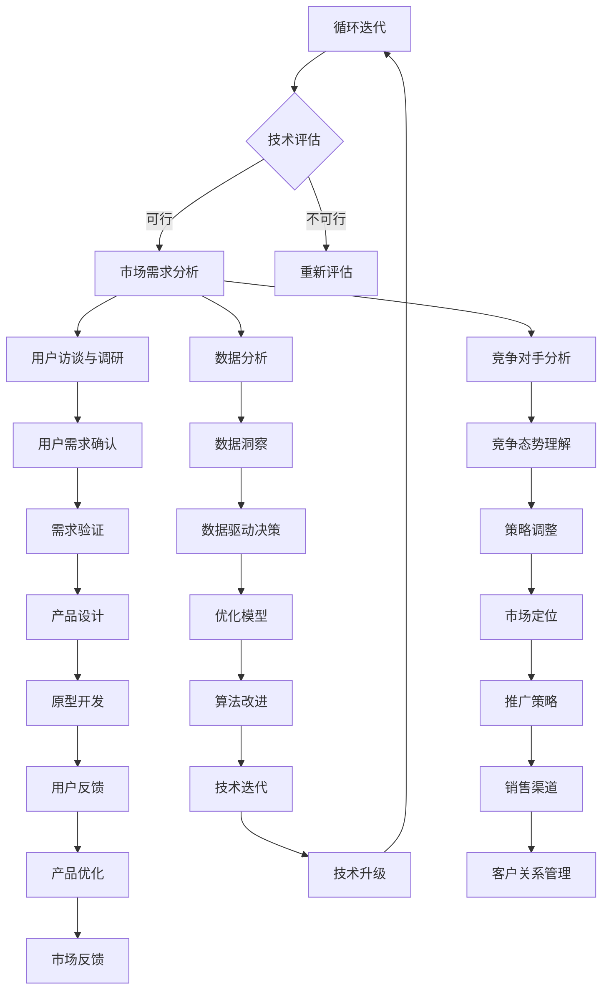

                 

# 人工智能创业：识别行业需求的方法

## 关键词

- 人工智能创业
- 行业需求识别
- 市场调研
- 需求验证
- 产品设计
- 市场推广
- 销售策略
- 创业案例

## 摘要

本文旨在探讨人工智能创业过程中如何有效识别行业需求。文章首先概述了人工智能行业的现状和创业机会与挑战，接着详细介绍了人工智能创业模型和市场需求分析的方法。在此基础上，本文深入探讨了市场趋势分析、需求验证与产品设计、以及创业实践中的市场推广与销售策略。最后，通过分析成功案例，展望了人工智能创业的未来趋势和挑战。

## 目录大纲

1. 创业基础知识
2. 识别行业需求
3. 创业实践
4. 成功案例解析
5. 未来展望
6. 附录

## 第一部分：创业基础知识

### 第1章：人工智能行业概述

#### 1.1 人工智能的崛起

人工智能（AI）作为计算机科学的一个重要分支，起源于20世纪50年代。随着计算能力的提升和算法的创新，人工智能在21世纪初迎来了爆炸式发展。从最初的规则推理、知识表示，到如今的深度学习、强化学习，人工智能的应用领域不断扩大，涵盖了自然语言处理、计算机视觉、智能决策等多个方面。

近年来，人工智能技术的成熟和应用场景的拓展，使得人工智能行业呈现出高速增长的态势。根据市场研究机构的数据，全球人工智能市场预计将在未来几年内继续保持高速增长，市场规模将突破数千亿美元。

#### 1.2 人工智能行业的细分领域

人工智能行业可以根据技术领域和应用场景进行细分。以下是几个主要的人工智能细分领域：

1. **自然语言处理（NLP）**：研究如何让计算机理解和生成人类语言。应用场景包括智能客服、机器翻译、文本摘要等。
   
2. **计算机视觉**：让计算机能够像人一样识别和理解视觉信息。应用场景包括人脸识别、自动驾驶、医疗影像分析等。

3. **智能决策**：利用大数据和算法模型进行预测和决策。应用场景包括金融风控、供应链管理、智能投顾等。

4. **机器人与自动化**：通过机器人和自动化系统提高生产效率和质量。应用场景包括工业生产、物流运输、家庭服务等。

5. **智能交互**：实现人与机器的智能对话和互动。应用场景包括智能音箱、智能机器人、虚拟助手等。

#### 1.3 创业在人工智能行业的机会与挑战

人工智能行业为创业者提供了丰富的机会。随着技术的进步和市场的需求，新的应用场景不断涌现，创业公司可以通过技术创新或模式创新获得市场优势。以下是一些创业机会：

1. **技术创新**：通过研发新技术、新产品，填补市场空白，如新型算法、硬件设备、软件平台等。

2. **模式创新**：利用人工智能技术优化现有业务流程，提供更高效、智能的服务，如智能医疗、智能教育等。

3. **跨界融合**：将人工智能技术与传统行业结合，创造新的商业模式，如智能农业、智能制造等。

然而，人工智能创业也面临诸多挑战：

1. **技术门槛**：人工智能领域的技术门槛较高，需要深厚的专业知识和研发能力。

2. **数据资源**：人工智能应用依赖于大量高质量的数据，数据的获取和处理是一个难题。

3. **市场竞争**：人工智能行业竞争激烈，初创公司需要找到差异化的市场定位。

4. **政策法规**：人工智能技术的发展也面临着政策法规的挑战，如数据隐私、伦理问题等。

### 第2章：人工智能创业模型

#### 2.1 创业项目的构思

创业项目的构思是人工智能创业的第一步。在这一阶段，创业者需要明确以下问题：

1. **市场需求**：分析市场需求，确定目标用户和潜在用户。
   
2. **技术可行性**：评估所涉及技术是否成熟，研发周期和成本是否可控。

3. **商业模式**：设计合理的商业模式，确保项目的可持续性和盈利能力。

4. **团队建设**：组建专业团队，发挥各自的专长，形成合力。

#### 2.2 商业模式设计

商业模式设计是人工智能创业的关键环节。以下是一些常见的商业模式：

1. **B2B模式**：为企业提供定制化的人工智能解决方案，如智能医疗、智能金融等。

2. **B2C模式**：直接面向消费者提供人工智能产品或服务，如智能家居、智能穿戴设备等。

3. **平台模式**：搭建人工智能平台，吸引开发者、企业和用户，实现多方共赢。

4. **订阅模式**：通过订阅服务实现持续收入，如智能云服务、在线教育等。

#### 2.3 创业团队构建

创业团队是人工智能创业的核心。以下是一些建议：

1. **核心成员**：团队应包含技术、市场、运营等核心成员，确保项目的顺利推进。

2. **专业互补**：团队成员应具备专业互补的能力，形成协同效应。

3. **快速迭代**：鼓励团队成员快速学习、快速迭代，适应市场变化。

4. **激励机制**：设计合理的激励机制，激发团队成员的积极性和创造力。

### 第3章：市场调研与分析

#### 3.1 市场需求分析

市场需求分析是识别行业需求的重要步骤。以下是一些分析方法和工具：

1. **市场调研**：通过问卷调查、访谈等方式收集用户需求，了解市场现状。

2. **SWOT分析**：分析创业项目的优势、劣势、机会和威胁。

3. **竞争分析**：分析竞争对手的产品、市场定位、营销策略等。

4. **趋势分析**：通过行业报告、新闻资讯等了解市场发展趋势。

#### 3.2 竞争对手分析

竞争对手分析有助于了解市场格局和竞争态势。以下是一些分析方法：

1. **产品比较**：分析竞争对手的产品功能、性能、价格等。

2. **市场定位**：了解竞争对手的市场定位和目标用户。

3. **营销策略**：分析竞争对手的营销策略，如广告投放、公关活动等。

4. **用户评价**：收集用户对竞争对手产品的评价，了解用户需求和痛点。

#### 3.3 消费者行为分析

消费者行为分析有助于了解目标用户的需求和偏好。以下是一些分析方法：

1. **用户画像**：通过数据分析构建用户画像，了解用户的年龄、性别、职业等特征。

2. **消费习惯**：分析用户的消费习惯和偏好，如购买渠道、购买频率等。

3. **需求痛点**：通过用户反馈和调研了解用户的需求和痛点，为产品设计提供依据。

4. **口碑传播**：分析用户的口碑和推荐行为，了解产品的市场接受度。

## 第二部分：识别行业需求

### 第4章：需求识别方法

#### 4.1 用户访谈与调研

用户访谈与调研是识别行业需求的重要手段。以下是一些具体方法和步骤：

1. **目标用户确定**：根据市场需求分析和竞争对手分析，确定目标用户群体。

2. **访谈准备**：准备访谈提纲，明确访谈目的和问题。

3. **访谈实施**：通过面对面访谈、电话访谈、在线访谈等方式，与用户进行深入交流。

4. **数据整理**：整理访谈记录，提取有价值的信息。

5. **分析报告**：撰写访谈报告，分析用户需求、痛点和建议。

#### 4.2 数据分析

数据分析是识别行业需求的另一重要方法。以下是一些数据分析方法和工具：

1. **数据收集**：通过在线调查、社交媒体、公开数据等途径收集数据。

2. **数据清洗**：清洗数据，去除无效和错误信息。

3. **数据可视化**：使用图表、地图等工具将数据可视化，帮助理解数据。

4. **数据挖掘**：使用算法和模型对数据进行分析，提取有价值的信息。

5. **分析报告**：撰写数据分析报告，总结分析结果和结论。

#### 4.3 竞争对手分析

竞争对手分析有助于了解市场现状和趋势，以下是一些具体方法：

1. **产品分析**：分析竞争对手的产品功能、性能、价格等。

2. **市场定位**：了解竞争对手的市场定位和目标用户。

3. **营销策略**：分析竞争对手的营销策略，如广告投放、公关活动等。

4. **用户评价**：收集用户对竞争对手产品的评价，了解用户需求和痛点。

5. **分析报告**：撰写竞争对手分析报告，总结分析结果和结论。

### 第5章：市场趋势分析

#### 5.1 人工智能技术的发展趋势

人工智能技术的发展趋势是识别行业需求的重要参考。以下是一些主要趋势：

1. **深度学习**：深度学习在图像识别、自然语言处理等领域取得了显著成果，未来将继续发展。

2. **强化学习**：强化学习在智能决策、游戏AI等领域具有广泛应用，研究将持续深入。

3. **生成对抗网络（GAN）**：GAN在图像生成、数据增强等领域表现出色，未来有望在更多领域应用。

4. **量子计算**：量子计算有望解决传统计算机难以处理的复杂问题，为人工智能带来新的突破。

#### 5.2 行业发展趋势

人工智能在多个行业都有广泛应用，以下是一些主要行业发展趋势：

1. **医疗健康**：人工智能在医疗影像分析、疾病预测、个性化治疗等领域具有巨大潜力。

2. **金融科技**：人工智能在风险控制、智能投顾、自动化交易等领域应用广泛，市场前景广阔。

3. **智能制造**：人工智能在工业自动化、质量检测、设备维护等领域提升生产效率和产品质量。

4. **智慧城市**：人工智能在交通管理、环境监测、公共安全等领域助力智慧城市建设。

#### 5.3 市场趋势对创业的影响

市场趋势对人工智能创业具有重要影响。以下是一些影响：

1. **技术创新**：随着技术趋势的发展，创业者需不断跟进新技术，提升竞争力。

2. **商业模式**：市场趋势的变化可能导致商业模式调整，创业者需灵活应对。

3. **市场定位**：市场趋势有助于明确目标市场和用户需求，创业者需准确定位。

4. **竞争环境**：市场趋势影响竞争格局，创业者需分析竞争对手，制定差异化策略。

### 第6章：需求验证与产品设计

#### 6.1 需求验证方法

需求验证是确保产品设计符合市场需求的重要环节。以下是一些需求验证方法：

1. **用户反馈**：通过用户访谈、问卷调查等方式收集用户反馈，评估产品是否符合用户需求。

2. **A/B测试**：通过对比不同版本的界面、功能等，评估用户对不同设计方案的接受程度。

3. **原型测试**：制作产品原型，邀请用户进行测试，收集用户意见和建议。

4. **数据分析**：通过数据分析，评估产品使用情况，了解用户行为和需求。

#### 6.2 产品设计原则

产品设计应遵循以下原则：

1. **用户体验**：关注用户需求，提供简洁、直观、易用的界面。

2. **功能完整**：确保产品功能齐全，满足用户的基本需求。

3. **易扩展性**：设计应具备良好的扩展性，适应未来需求的变化。

4. **高性能**：优化产品性能，确保快速响应和稳定运行。

#### 6.3 用户反馈与迭代

用户反馈与迭代是产品持续改进的关键。以下是一些具体方法：

1. **定期反馈**：定期收集用户反馈，了解用户需求和使用体验。

2. **迭代更新**：根据用户反馈，不断优化产品功能和界面。

3. **版本发布**：定期发布新版本，向用户介绍新功能和改进点。

4. **数据分析**：通过数据分析，评估用户反馈的改进效果，持续优化产品。

## 第三部分：创业实践

### 第7章：项目启动与资源整合

#### 7.1 项目启动计划

项目启动计划是创业成功的关键。以下是一些项目启动计划的关键步骤：

1. **确定项目目标**：明确项目的愿景、使命和目标。

2. **组建团队**：根据项目需求，组建合适的团队。

3. **制定时间表**：制定项目进度和时间表，确保按计划推进。

4. **筹集资金**：评估项目资金需求，寻找资金来源。

5. **资源准备**：准备必要的硬件、软件和其他资源。

#### 7.2 资源整合策略

资源整合是确保项目顺利推进的重要策略。以下是一些资源整合方法：

1. **内部资源整合**：优化内部资源，提高资源利用率。

2. **外部合作**：与合作伙伴建立合作关系，共同推进项目。

3. **融资渠道**：利用多种融资渠道，确保项目资金需求。

4. **资源管理**：建立资源管理体系，确保资源高效配置。

#### 7.3 团队管理与协作

团队管理与协作是项目成功的重要保障。以下是一些团队管理与协作的方法：

1. **目标明确**：确保团队成员明确项目目标和个人职责。

2. **沟通协作**：建立有效的沟通机制，促进团队协作。

3. **激励机制**：设计合理的激励机制，激发团队成员的积极性。

4. **绩效评估**：建立绩效评估体系，确保团队成员的工作质量。

### 第8章：市场推广与销售

#### 8.1 市场推广策略

市场推广策略是吸引潜在客户的重要手段。以下是一些市场推广策略：

1. **内容营销**：通过高质量的内容吸引潜在客户，提高品牌知名度。

2. **社交媒体营销**：利用社交媒体平台推广产品，增加曝光度。

3. **广告投放**：通过搜索引擎、社交媒体等平台进行广告投放，提高产品知名度。

4. **公关活动**：举办线上线下活动，提升品牌形象。

5. **合作推广**：与行业合作伙伴进行合作推广，扩大市场份额。

#### 8.2 销售渠道选择

销售渠道选择是确保产品顺利销售的重要环节。以下是一些销售渠道选择方法：

1. **线上销售**：利用电商平台、自建网站等渠道进行线上销售。

2. **线下销售**：开设实体店铺、参加行业展会等渠道进行线下销售。

3. **分销渠道**：与经销商、代理商等建立分销渠道，扩大销售网络。

4. **直销渠道**：直接面对客户，提供定制化解决方案。

#### 8.3 销售技巧与策略

销售技巧与策略是提高销售业绩的关键。以下是一些销售技巧与策略：

1. **了解客户需求**：深入了解客户需求，提供针对性的解决方案。

2. **建立信任关系**：与客户建立信任关系，提高客户忠诚度。

3. **谈判技巧**：掌握谈判技巧，争取最大化利益。

4. **售后服务**：提供优质的售后服务，提高客户满意度。

5. **团队协作**：建立销售团队，实现协作销售，提高整体业绩。

### 第9章：创业过程中的问题与解决方案

#### 9.1 创业中的常见问题

创业过程中会遇到各种问题，以下是一些常见问题：

1. **资金不足**：资金是创业过程中的主要问题，许多初创企业因资金不足而失败。

2. **团队管理**：团队管理不当可能导致项目延误、业绩下滑。

3. **市场推广**：市场推广效果不佳，可能导致销售困难。

4. **产品迭代**：产品迭代速度慢，难以适应市场变化。

5. **竞争压力**：市场竞争激烈，初创企业面临巨大的压力。

#### 9.2 问题识别与解决方法

针对创业中的常见问题，以下是一些解决方法：

1. **资金问题**：通过融资、股权众筹等方式筹集资金；优化成本结构，提高资金利用率。

2. **团队管理**：建立科学的团队管理机制，明确职责和目标；激励团队成员，提高团队凝聚力。

3. **市场推广**：制定有效的市场推广策略，提高品牌知名度；与行业专家合作，提高市场影响力。

4. **产品迭代**：采用敏捷开发方法，快速迭代产品；关注用户反馈，持续优化产品。

5. **竞争压力**：找准市场定位，差异化竞争；提高产品和服务质量，打造核心竞争力。

#### 9.3 困境突破与持续发展

创业过程中，面对困境和挑战，创业者需具备以下素质：

1. **创新精神**：勇于创新，不断尝试新方法、新技术。

2. **适应能力**：适应市场变化，灵活调整战略。

3. **学习心态**：保持学习心态，不断充实知识和技能。

4. **坚持信念**：面对困境，坚定信念，持续努力。

通过困境突破和持续发展，初创企业将逐渐成长壮大，实现创业目标。

## 第四部分：成功案例解析

### 第10章：人工智能创业成功案例分析

#### 10.1 案例一：某自然语言处理初创公司的成功之路

某自然语言处理（NLP）初创公司，通过技术创新和商业模式创新，取得了显著的市场成功。以下是该公司的主要成功因素：

1. **技术创新**：该公司研发了一种新型的NLP算法，在处理速度和准确度上都有显著提升。

2. **市场需求**：该公司准确捕捉到了市场对高效、准确的自然语言处理技术的需求。

3. **商业模式**：公司采用了B2B模式，为企业提供定制化的NLP解决方案。

4. **市场推广**：通过参加行业展会、撰写技术文章等方式，提高了品牌知名度。

5. **客户反馈**：公司注重客户反馈，不断优化产品功能和服务质量。

#### 10.2 案例二：某智能安防创业团队的创新实践

某智能安防创业团队通过技术创新和模式创新，成功开拓了新的市场。以下是该团队的主要成功因素：

1. **技术创新**：团队研发了一种基于人工智能的智能安防系统，具有高识别率和低误报率。

2. **市场需求**：随着城市安全意识的提高，智能安防市场需求不断增长。

3. **商业模式**：团队采用了平台模式，吸引第三方开发者加入，共同开发智能安防应用。

4. **市场推广**：通过政府合作、行业展会等方式，扩大了市场影响力。

5. **用户反馈**：公司注重用户反馈，不断优化产品功能和服务。

#### 10.3 案例三：某金融科技创业公司的崛起之路

某金融科技（FinTech）创业公司，通过技术创新和商业模式创新，迅速崛起。以下是该公司的成功因素：

1. **技术创新**：公司研发了一种基于区块链的金融科技解决方案，提高了交易效率和安全性。

2. **市场需求**：金融科技领域市场需求旺盛，尤其是区块链技术在金融行业的应用受到广泛关注。

3. **商业模式**：公司采用了平台模式，吸引了大量的金融科技合作伙伴。

4. **市场推广**：公司积极参与行业会议、研讨会等活动，提高了品牌知名度。

5. **用户反馈**：公司注重用户反馈，持续优化产品功能和服务。

### 第11章：人工智能创业的未来展望

#### 11.1 人工智能创业的发展趋势

人工智能创业在未来将继续保持快速发展。以下是一些发展趋势：

1. **技术进步**：人工智能技术将继续进步，带来更多的创新应用。

2. **跨界融合**：人工智能将与更多行业融合，推动产业升级。

3. **数据驱动**：数据将成为人工智能创业的核心资源，创业者需关注数据收集、处理和分析。

4. **国际化**：人工智能创业将更加国际化，创业者需具备全球视野。

#### 11.2 创业者在人工智能行业的职业规划

创业者应在人工智能行业进行长期职业规划。以下是一些建议：

1. **持续学习**：不断学习新技术、新知识，保持竞争力。

2. **积累经验**：在实践中积累经验，提升项目管理能力和团队领导力。

3. **关注趋势**：关注行业趋势，抓住机遇。

4. **拓展人脉**：建立广泛的人脉网络，促进资源整合。

#### 11.3 人工智能创业的未来挑战与机遇

人工智能创业在未来将面临新的挑战和机遇。以下是一些挑战和机遇：

1. **技术挑战**：人工智能技术的复杂性将增加，创业者需具备更高的技术水平。

2. **市场竞争**：市场竞争将更加激烈，创业者需找准市场定位。

3. **数据隐私**：数据隐私将成为重要议题，创业者需关注合规问题。

4. **政策法规**：政策法规的变化将影响创业环境，创业者需密切关注。

5. **创新机遇**：随着技术的进步和市场的需求，人工智能创业将继续迎来创新机遇。

## 附录

### 附录 A：人工智能创业资源指南

#### A.1 学术资源

1. **IEEE**：国际电气和电子工程协会，提供丰富的人工智能学术论文和技术报告。
2. **ACM**：美国计算机协会，发布有关人工智能的研究成果和新闻。
3. **NeurIPS**：神经信息处理系统大会，是人工智能领域最重要的学术会议之一。

#### A.2 行业报告

1. **IDC**：国际数据公司，发布全球和区域的人工智能市场报告。
2. **Gartner**：国际知名研究机构，提供人工智能技术趋势和市场预测。
3. **CBInsights**：创业情报平台，提供人工智能创业公司的案例分析。

#### A.3 投资机构与孵化器

1. **真格基金**：国内知名风险投资机构，投资众多人工智能项目。
2. **IDG资本**：国际知名风险投资机构，投资多个领域的人工智能公司。
3. **启迪之星**：国内知名孵化器，为人工智能创业公司提供孵化服务。

#### A.4 开源工具与框架

1. **TensorFlow**：谷歌开源的机器学习框架，广泛应用于深度学习项目。
2. **PyTorch**：Facebook开源的深度学习框架，受到广泛认可。
3. **Keras**：Python深度学习库，简化了深度学习模型的构建和训练。

以上资源为人工智能创业者提供了丰富的学术研究、市场分析和实践指导，有助于创业者更好地开展创业活动。作者：AI天才研究院/AI Genius Institute & 禅与计算机程序设计艺术 /Zen And The Art of Computer Programming

### 第一部分：创业基础知识

### 第1章：人工智能行业概述

#### 1.1 人工智能的崛起

人工智能（AI）作为计算机科学的一个重要分支，起源于20世纪50年代。当时，科学家们提出了“图灵测试”的概念，即判断机器是否具有人类智能的标准。此后，人工智能逐渐从理论走向实践，应用领域不断扩大。

随着计算能力的提升和算法的创新，人工智能在21世纪初迎来了爆炸式发展。从最初的规则推理、知识表示，到如今的深度学习、强化学习，人工智能的应用领域涵盖了自然语言处理、计算机视觉、智能决策等多个方面。

近年来，人工智能技术的成熟和应用场景的拓展，使得人工智能行业呈现出高速增长的态势。根据市场研究机构的数据，全球人工智能市场预计将在未来几年内继续保持高速增长，市场规模将突破数千亿美元。

#### 1.2 人工智能行业的细分领域

人工智能行业可以根据技术领域和应用场景进行细分。以下是几个主要的人工智能细分领域：

1. **自然语言处理（NLP）**：研究如何让计算机理解和生成人类语言。应用场景包括智能客服、机器翻译、文本摘要等。

2. **计算机视觉**：让计算机能够像人一样识别和理解视觉信息。应用场景包括人脸识别、自动驾驶、医疗影像分析等。

3. **智能决策**：利用大数据和算法模型进行预测和决策。应用场景包括金融风控、供应链管理、智能投顾等。

4. **机器人与自动化**：通过机器人和自动化系统提高生产效率和质量。应用场景包括工业生产、物流运输、家庭服务等。

5. **智能交互**：实现人与机器的智能对话和互动。应用场景包括智能音箱、智能机器人、虚拟助手等。

#### 1.3 创业在人工智能行业的机会与挑战

人工智能行业为创业者提供了丰富的机会。随着技术的进步和市场的需求，新的应用场景不断涌现，创业公司可以通过技术创新或模式创新获得市场优势。以下是一些创业机会：

1. **技术创新**：通过研发新技术、新产品，填补市场空白，如新型算法、硬件设备、软件平台等。

2. **模式创新**：利用人工智能技术优化现有业务流程，提供更高效、智能的服务，如智能医疗、智能教育等。

3. **跨界融合**：将人工智能技术与传统行业结合，创造新的商业模式，如智能农业、智能制造等。

然而，人工智能创业也面临诸多挑战：

1. **技术门槛**：人工智能领域的技术门槛较高，需要深厚的专业知识和研发能力。

2. **数据资源**：人工智能应用依赖于大量高质量的数据，数据的获取和处理是一个难题。

3. **市场竞争**：人工智能行业竞争激烈，初创公司需要找到差异化的市场定位。

4. **政策法规**：人工智能技术的发展也面临着政策法规的挑战，如数据隐私、伦理问题等。

### 第2章：人工智能创业模型

#### 2.1 创业项目的构思

创业项目的构思是人工智能创业的第一步。在这一阶段，创业者需要明确以下问题：

1. **市场需求**：分析市场需求，确定目标用户和潜在用户。

2. **技术可行性**：评估所涉及技术是否成熟，研发周期和成本是否可控。

3. **商业模式**：设计合理的商业模式，确保项目的可持续性和盈利能力。

4. **团队建设**：组建专业团队，发挥各自的专长，形成合力。

#### 2.2 商业模式设计

商业模式设计是人工智能创业的关键环节。以下是一些常见的商业模式：

1. **B2B模式**：为企业提供定制化的人工智能解决方案，如智能医疗、智能金融等。

2. **B2C模式**：直接面向消费者提供人工智能产品或服务，如智能家居、智能穿戴设备等。

3. **平台模式**：搭建人工智能平台，吸引开发者、企业和用户，实现多方共赢。

4. **订阅模式**：通过订阅服务实现持续收入，如智能云服务、在线教育等。

#### 2.3 创业团队构建

创业团队是人工智能创业的核心。以下是一些建议：

1. **核心成员**：团队应包含技术、市场、运营等核心成员，确保项目的顺利推进。

2. **专业互补**：团队成员应具备专业互补的能力，形成协同效应。

3. **快速迭代**：鼓励团队成员快速学习、快速迭代，适应市场变化。

4. **激励机制**：设计合理的激励机制，激发团队成员的积极性和创造力。

### 第3章：市场调研与分析

#### 3.1 市场需求分析

市场需求分析是识别行业需求的重要步骤。以下是一些分析方法和工具：

1. **市场调研**：通过问卷调查、访谈等方式收集用户需求，了解市场现状。

2. **SWOT分析**：分析创业项目的优势、劣势、机会和威胁。

3. **竞争分析**：分析竞争对手的产品、市场定位、营销策略等。

4. **趋势分析**：通过行业报告、新闻资讯等了解市场发展趋势。

#### 3.2 竞争对手分析

竞争对手分析有助于了解市场格局和竞争态势。以下是一些分析方法：

1. **产品分析**：分析竞争对手的产品功能、性能、价格等。

2. **市场定位**：了解竞争对手的市场定位和目标用户。

3. **营销策略**：分析竞争对手的营销策略，如广告投放、公关活动等。

4. **用户评价**：收集用户对竞争对手产品的评价，了解用户需求和痛点。

#### 3.3 消费者行为分析

消费者行为分析有助于了解目标用户的需求和偏好。以下是一些分析方法：

1. **用户画像**：通过数据分析构建用户画像，了解用户的年龄、性别、职业等特征。

2. **消费习惯**：分析用户的消费习惯和偏好，如购买渠道、购买频率等。

3. **需求痛点**：通过用户反馈和调研了解用户的需求和痛点，为产品设计提供依据。

4. **口碑传播**：分析用户的口碑和推荐行为，了解产品的市场接受度。

## 第二部分：识别行业需求

### 第4章：需求识别方法

#### 4.1 用户访谈与调研

用户访谈与调研是识别行业需求的重要手段。以下是一些具体方法和步骤：

1. **目标用户确定**：根据市场需求分析和竞争对手分析，确定目标用户群体。

2. **访谈准备**：准备访谈提纲，明确访谈目的和问题。

3. **访谈实施**：通过面对面访谈、电话访谈、在线访谈等方式，与用户进行深入交流。

4. **数据整理**：整理访谈记录，提取有价值的信息。

5. **分析报告**：撰写访谈报告，分析用户需求、痛点和建议。

#### 4.2 数据分析

数据分析是识别行业需求的另一重要方法。以下是一些数据分析方法和工具：

1. **数据收集**：通过在线调查、社交媒体、公开数据等途径收集数据。

2. **数据清洗**：清洗数据，去除无效和错误信息。

3. **数据可视化**：使用图表、地图等工具将数据可视化，帮助理解数据。

4. **数据挖掘**：使用算法和模型对数据进行分析，提取有价值的信息。

5. **分析报告**：撰写数据分析报告，总结分析结果和结论。

#### 4.3 竞争对手分析

竞争对手分析有助于了解市场现状和趋势，以下是一些具体方法：

1. **产品分析**：分析竞争对手的产品功能、性能、价格等。

2. **市场定位**：了解竞争对手的市场定位和目标用户。

3. **营销策略**：分析竞争对手的营销策略，如广告投放、公关活动等。

4. **用户评价**：收集用户对竞争对手产品的评价，了解用户需求和痛点。

5. **分析报告**：撰写竞争对手分析报告，总结分析结果和结论。

### 第5章：市场趋势分析

#### 5.1 人工智能技术的发展趋势

人工智能技术的发展趋势是识别行业需求的重要参考。以下是一些主要趋势：

1. **深度学习**：深度学习在图像识别、自然语言处理等领域取得了显著成果，未来将继续发展。

2. **强化学习**：强化学习在智能决策、游戏AI等领域具有广泛应用，研究将持续深入。

3. **生成对抗网络（GAN）**：GAN在图像生成、数据增强等领域表现出色，未来有望在更多领域应用。

4. **量子计算**：量子计算有望解决传统计算机难以处理的复杂问题，为人工智能带来新的突破。

#### 5.2 行业发展趋势

人工智能在多个行业都有广泛应用，以下是一些主要行业发展趋势：

1. **医疗健康**：人工智能在医疗影像分析、疾病预测、个性化治疗等领域具有巨大潜力。

2. **金融科技**：人工智能在风险控制、智能投顾、自动化交易等领域应用广泛，市场前景广阔。

3. **智能制造**：人工智能在工业自动化、质量检测、设备维护等领域提升生产效率和产品质量。

4. **智慧城市**：人工智能在交通管理、环境监测、公共安全等领域助力智慧城市建设。

#### 5.3 市场趋势对创业的影响

市场趋势对人工智能创业具有重要影响。以下是一些影响：

1. **技术创新**：随着技术趋势的发展，创业者需不断跟进新技术，提升竞争力。

2. **商业模式**：市场趋势的变化可能导致商业模式调整，创业者需灵活应对。

3. **市场定位**：市场趋势有助于明确目标市场和用户需求，创业者需准确定位。

4. **竞争环境**：市场趋势影响竞争格局，创业者需分析竞争对手，制定差异化策略。

### 第6章：需求验证与产品设计

#### 6.1 需求验证方法

需求验证是确保产品设计符合市场需求的重要环节。以下是一些需求验证方法：

1. **用户反馈**：通过用户访谈、问卷调查等方式收集用户反馈，评估产品是否符合用户需求。

2. **A/B测试**：通过对比不同版本的界面、功能等，评估用户对不同设计方案的接受程度。

3. **原型测试**：制作产品原型，邀请用户进行测试，收集用户意见和建议。

4. **数据分析**：通过数据分析，评估产品使用情况，了解用户行为和需求。

#### 6.2 产品设计原则

产品设计应遵循以下原则：

1. **用户体验**：关注用户需求，提供简洁、直观、易用的界面。

2. **功能完整**：确保产品功能齐全，满足用户的基本需求。

3. **易扩展性**：设计应具备良好的扩展性，适应未来需求的变化。

4. **高性能**：优化产品性能，确保快速响应和稳定运行。

#### 6.3 用户反馈与迭代

用户反馈与迭代是产品持续改进的关键。以下是一些具体方法：

1. **定期反馈**：定期收集用户反馈，了解用户需求和使用体验。

2. **迭代更新**：根据用户反馈，不断优化产品功能和界面。

3. **版本发布**：定期发布新版本，向用户介绍新功能和改进点。

4. **数据分析**：通过数据分析，评估用户反馈的改进效果，持续优化产品。

## 第三部分：创业实践

### 第7章：项目启动与资源整合

#### 7.1 项目启动计划

项目启动计划是创业成功的关键。以下是一些项目启动计划的关键步骤：

1. **确定项目目标**：明确项目的愿景、使命和目标。

2. **组建团队**：根据项目需求，组建合适的团队。

3. **制定时间表**：制定项目进度和时间表，确保按计划推进。

4. **筹集资金**：评估项目资金需求，寻找资金来源。

5. **资源准备**：准备必要的硬件、软件和其他资源。

#### 7.2 资源整合策略

资源整合是确保项目顺利推进的重要策略。以下是一些资源整合方法：

1. **内部资源整合**：优化内部资源，提高资源利用率。

2. **外部合作**：与合作伙伴建立合作关系，共同推进项目。

3. **融资渠道**：利用多种融资渠道，确保项目资金需求。

4. **资源管理**：建立资源管理体系，确保资源高效配置。

#### 7.3 团队管理与协作

团队管理与协作是项目成功的重要保障。以下是一些团队管理与协作的方法：

1. **目标明确**：确保团队成员明确项目目标和个人职责。

2. **沟通协作**：建立有效的沟通机制，促进团队协作。

3. **激励机制**：设计合理的激励机制，激发团队成员的积极性。

4. **绩效评估**：建立绩效评估体系，确保团队成员的工作质量。

### 第8章：市场推广与销售

#### 8.1 市场推广策略

市场推广策略是吸引潜在客户的重要手段。以下是一些市场推广策略：

1. **内容营销**：通过高质量的内容吸引潜在客户，提高品牌知名度。

2. **社交媒体营销**：利用社交媒体平台推广产品，增加曝光度。

3. **广告投放**：通过搜索引擎、社交媒体等平台进行广告投放，提高产品知名度。

4. **公关活动**：举办线上线下活动，提升品牌形象。

5. **合作推广**：与行业合作伙伴进行合作推广，扩大市场份额。

#### 8.2 销售渠道选择

销售渠道选择是确保产品顺利销售的重要环节。以下是一些销售渠道选择方法：

1. **线上销售**：利用电商平台、自建网站等渠道进行线上销售。

2. **线下销售**：开设实体店铺、参加行业展会等渠道进行线下销售。

3. **分销渠道**：与经销商、代理商等建立分销渠道，扩大销售网络。

4. **直销渠道**：直接面对客户，提供定制化解决方案。

#### 8.3 销售技巧与策略

销售技巧与策略是提高销售业绩的关键。以下是一些销售技巧与策略：

1. **了解客户需求**：深入了解客户需求，提供针对性的解决方案。

2. **建立信任关系**：与客户建立信任关系，提高客户忠诚度。

3. **谈判技巧**：掌握谈判技巧，争取最大化利益。

4. **售后服务**：提供优质的售后服务，提高客户满意度。

5. **团队协作**：建立销售团队，实现协作销售，提高整体业绩。

### 第9章：创业过程中的问题与解决方案

#### 9.1 创业中的常见问题

创业过程中会遇到各种问题，以下是一些常见问题：

1. **资金不足**：资金是创业过程中的主要问题，许多初创企业因资金不足而失败。

2. **团队管理**：团队管理不当可能导致项目延误、业绩下滑。

3. **市场推广**：市场推广效果不佳，可能导致销售困难。

4. **产品迭代**：产品迭代速度慢，难以适应市场变化。

5. **竞争压力**：市场竞争激烈，初创企业面临巨大的压力。

#### 9.2 问题识别与解决方法

针对创业中的常见问题，以下是一些解决方法：

1. **资金问题**：通过融资、股权众筹等方式筹集资金；优化成本结构，提高资金利用率。

2. **团队管理**：建立科学的团队管理机制，明确职责和目标；激励团队成员，提高团队凝聚力。

3. **市场推广**：制定有效的市场推广策略，提高品牌知名度；与行业专家合作，提高市场影响力。

4. **产品迭代**：采用敏捷开发方法，快速迭代产品；关注用户反馈，持续优化产品。

5. **竞争压力**：找准市场定位，差异化竞争；提高产品和服务质量，打造核心竞争力。

#### 9.3 困境突破与持续发展

创业过程中，面对困境和挑战，创业者需具备以下素质：

1. **创新精神**：勇于创新，不断尝试新方法、新技术。

2. **适应能力**：适应市场变化，灵活调整战略。

3. **学习心态**：保持学习心态，不断充实知识和技能。

4. **坚持信念**：面对困境，坚定信念，持续努力。

通过困境突破和持续发展，初创企业将逐渐成长壮大，实现创业目标。

### 附录

#### 附录 A：人工智能创业资源指南

##### A.1 学术资源

1. **IEEE**：国际电气和电子工程协会，提供丰富的人工智能学术论文和技术报告。
2. **ACM**：美国计算机协会，发布有关人工智能的研究成果和新闻。
3. **NeurIPS**：神经信息处理系统大会，是人工智能领域最重要的学术会议之一。

##### A.2 行业报告

1. **IDC**：国际数据公司，发布全球和区域的人工智能市场报告。
2. **Gartner**：国际知名研究机构，提供人工智能技术趋势和市场预测。
3. **CBInsights**：创业情报平台，提供人工智能创业公司的案例分析。

##### A.3 投资机构与孵化器

1. **真格基金**：国内知名风险投资机构，投资众多人工智能项目。
2. **IDG资本**：国际知名风险投资机构，投资多个领域的人工智能公司。
3. **启迪之星**：国内知名孵化器，为人工智能创业公司提供孵化服务。

##### A.4 开源工具与框架

1. **TensorFlow**：谷歌开源的机器学习框架，广泛应用于深度学习项目。
2. **PyTorch**：Facebook开源的深度学习框架，受到广泛认可。
3. **Keras**：Python深度学习库，简化了深度学习模型的构建和训练。

这些资源为人工智能创业者提供了丰富的学术研究、市场分析和实践指导，有助于创业者更好地开展创业活动。

## 完整的Mermaid流程图



## 核心算法原理讲解

#### 6.1.1 深度学习算法原理

深度学习算法是人工智能领域的一项重要技术，其核心是多层神经网络。以下是一个简单的多层感知器（MLP）算法原理的伪代码描述：

```python
# 输入数据：X（特征矩阵），Y（标签矩阵）
# 设置网络参数：隐藏层节点数、学习率、迭代次数
hidden_layer_size = 100
learning_rate = 0.1
num_iterations = 1000

# 初始化权重和偏置
W1 = np.random.rand(input_size, hidden_layer_size)
b1 = np.random.rand(hidden_layer_size)
W2 = np.random.rand(hidden_layer_size, output_size)
b2 = np.random.rand(output_size)

# 深度学习算法训练过程
for i in range(num_iterations):
    # 前向传播
    hidden_layer_input = X.dot(W1) + b1
    hidden_layer_output = sigmoid(hidden_layer_input)
    
    final_output = hidden_layer_output.dot(W2) + b2
    output = sigmoid(final_output)
    
    # 反向传播
    output_error = (output - Y) * sigmoid_derivative(output)
    hidden_layer_error = output_error.dot(W2.T) * sigmoid_derivative(hidden_layer_output)
    
    W2 += hidden_layer_output.T.dot(output_error) * learning_rate
    b2 += np.sum(output_error * learning_rate)
    
    W1 += X.T.dot(hidden_layer_error) * learning_rate
    b1 += np.sum(hidden_layer_error * learning_rate)

# 输出最终模型参数
print("Final Model Parameters:")
print("W1:", W1)
print("b1:", b1)
print("W2:", W2)
print("b2:", b2)
```

在上述伪代码中，`sigmoid` 函数用于激活函数，将线性函数转换为Sigmoid函数，以便输出概率值。`sigmoid_derivative` 函数用于计算激活函数的导数，以实现反向传播。

#### 6.1.2 决策树算法原理

决策树是一种常见的分类和回归算法，其核心是通过一系列的决策规则对数据进行划分。以下是一个简单的决策树算法原理的伪代码描述：

```python
# 输入数据：特征矩阵 X，标签矩阵 Y
# 初始化决策树
def build_decision_tree(X, Y):
    # 判断是否达到停止条件（如节点纯度达到阈值）
    if stop_condition(X, Y):
        return majority_label(Y)
    
    # 寻找最佳划分特征和划分点
    best_feature, best_threshold = find_best_threshold(X, Y)
    
    # 创建节点
    node = {}
    node['feature'] = best_feature
    node['threshold'] = best_threshold
    node['left'] = build_decision_tree(X[left], Y[left])
    node['right'] = build_decision_tree(X[right], Y[right])
    
    return node

# 找到最佳划分特征和划分点
def find_best_threshold(X, Y):
    best_threshold = None
    best_score = -1
    
    for feature in range(X.shape[1]):
        for threshold in np.unique(X[:, feature]):
            left = X[:, feature] < threshold
            right = X[:, feature] >= threshold
            
            score = gini_impurity(Y[left]) + gini_impurity(Y[right])
            
            if score > best_score:
                best_score = score
                best_threshold = threshold
                best_feature = feature
                
    return best_feature, best_threshold

# 判断停止条件
def stop_condition(X, Y):
    # 例如节点纯度达到阈值或特征数少于阈值
    return np.unique(Y).shape[0] <= threshold or X.shape[1] <= min_features_to_split

# 计算节点纯度（如基尼不纯度）
def gini_impurity(y):
    # 计算基尼不纯度
    pass

# 计算节点纯度（如信息增益）
def information_gain(y, y_left, y_right):
    # 计算信息增益
    pass
```

在上述伪代码中，`gini_impurity` 函数用于计算节点的基尼不纯度，`information_gain` 函数用于计算信息增益，用于评估划分特征的有效性。

#### 6.1.3 支持向量机算法原理

支持向量机（SVM）是一种常用的分类算法，其核心是通过找到最佳分割超平面，实现数据的分类。以下是一个简单的SVM算法原理的伪代码描述：

```python
# 输入数据：特征矩阵 X，标签矩阵 Y
# 初始化参数：正则化参数 C
C = 1.0

# 拉格朗日乘子法求解
def solve_svm(X, Y, C):
    # 初始化拉格朗日乘子
    alpha = np.zeros(X.shape[0])
    
    # 初始化对偶问题
    for i in range(X.shape[0]):
        if Y[i] * (np.dot(W, X[i]) + b) > 1:
            alpha[i] = C
        else:
            alpha[i] = 0
            
    # 更新拉格朗日乘子
    while not converged:
        for i in range(X.shape[0]):
            if (0 < alpha[i] < C) and (Y[i] * (np.dot(W, X[i]) + b) < 1):
                alpha[i] -= learning_rate
            elif (0 < alpha[i] < C) and (Y[i] * (np.dot(W, X[i]) + b) > 1):
                alpha[i] += learning_rate
            
            if alpha[i] < 0:
                alpha[i] = 0
            if alpha[i] > C:
                alpha[i] = C
                
            # 更新模型参数
            W = np.dot(X.T, alpha) * Y
            b = np.mean(Y - np.dot(X, W))
            
            # 判断收敛条件
            if convergence_condition_met(alpha):
                break
                
    return W, b

# 计算模型参数
W, b = solve_svm(X, Y, C)

# 预测新数据
def predict(X_new, W, b):
    return np.sign(np.dot(X_new, W) + b)
```

在上述伪代码中，`solve_svm` 函数通过拉格朗日乘子法求解最优模型参数，`predict` 函数用于对新数据进行预测。

## 数学模型和公式

#### 6.1.1 损失函数

在深度学习算法中，常用的损失函数包括均方误差（MSE）和交叉熵损失（Cross-Entropy Loss）。以下是一些常见的数学公式：

1. **均方误差（MSE）**：

   $$MSE = \frac{1}{n}\sum_{i=1}^{n}(y_i - \hat{y}_i)^2$$

   其中，$y_i$ 是真实标签，$\hat{y}_i$ 是预测值，$n$ 是样本数量。

2. **交叉熵损失（Cross-Entropy Loss）**：

   $$CE = -\frac{1}{n}\sum_{i=1}^{n}y_i \log(\hat{y}_i)$$

   其中，$y_i$ 是真实标签（0或1），$\hat{y}_i$ 是预测概率。

#### 6.1.2 激活函数

激活函数是深度学习网络中重要的组成部分，常用的激活函数包括Sigmoid、ReLU和Tanh。以下是一些常见的数学公式：

1. **Sigmoid 函数**：

   $$\sigma(x) = \frac{1}{1 + e^{-x}}$$

2. **ReLU 函数**：

   $$\text{ReLU}(x) = \max(0, x)$$

3. **Tanh 函数**：

   $$\text{Tanh}(x) = \frac{e^x - e^{-x}}{e^x + e^{-x}}$$

#### 6.1.3 梯度下降法

梯度下降法是优化神经网络参数的常用方法。以下是一些数学公式：

1. **梯度计算**：

   $$\nabla_W \mathcal{L} = \frac{\partial \mathcal{L}}{\partial W} = \sum_{i=1}^{n} \frac{\partial \mathcal{L}}{\partial \hat{y}_i} \frac{\partial \hat{y}_i}{\partial W}$$

   其中，$\mathcal{L}$ 是损失函数，$W$ 是权重矩阵。

2. **更新权重**：

   $$W_{\text{new}} = W_{\text{old}} - \alpha \nabla_W \mathcal{L}$$

   其中，$\alpha$ 是学习率。

## 项目实战

### 7.1.1 开发环境搭建

要在本地搭建一个开发环境，我们需要安装Python和相关的依赖库。以下是详细的步骤：

#### 1. 安装Python

首先，从Python官方网站下载并安装Python 3.x版本。安装过程中，请确保选择将Python添加到系统环境变量中。

#### 2. 安装依赖库

在终端中，通过pip命令安装以下依赖库：

```shell
pip install numpy pandas matplotlib scikit-learn tensorflow
```

这些库将用于数据处理、可视化、机器学习模型训练和评估。

### 7.1.2 源代码实现

以下是一个简单的人工智能项目，用于分类水果，源代码和详细解释如下：

```python
import numpy as np
import pandas as pd
from sklearn.model_selection import train_test_split
from sklearn.preprocessing import StandardScaler
from sklearn.neural_network import MLPClassifier
from sklearn.metrics import accuracy_score, confusion_matrix

# 1. 数据预处理
def preprocess_data(data_path):
    # 加载数据
    data = pd.read_csv(data_path)
    
    # 分割特征和标签
    X = data.drop('class', axis=1)
    y = data['class']
    
    # 划分训练集和测试集
    X_train, X_test, y_train, y_test = train_test_split(X, y, test_size=0.2, random_state=42)
    
    # 数据标准化
    scaler = StandardScaler()
    X_train = scaler.fit_transform(X_train)
    X_test = scaler.transform(X_test)
    
    return X_train, X_test, y_train, y_test

# 2. 训练模型
def train_model(X_train, y_train):
    # 创建MLP分类器
    clf = MLPClassifier(hidden_layer_sizes=(100,), max_iter=1000, learning_rate_init=0.1)
    
    # 训练模型
    clf.fit(X_train, y_train)
    
    return clf

# 3. 评估模型
def evaluate_model(clf, X_test, y_test):
    # 预测测试集
    y_pred = clf.predict(X_test)
    
    # 计算准确率
    accuracy = accuracy_score(y_test, y_pred)
    
    # 计算混淆矩阵
    cm = confusion_matrix(y_test, y_pred)
    
    return accuracy, cm

# 4. 主函数
def main():
    # 1. 加载数据
    X_train, X_test, y_train, y_test = preprocess_data('fruit_data.csv')
    
    # 2. 训练模型
    clf = train_model(X_train, y_train)
    
    # 3. 评估模型
    accuracy, cm = evaluate_model(clf, X_test, y_test)
    
    print("Accuracy:", accuracy)
    print("Confusion Matrix:\n", cm)

if __name__ == '__main__':
    main()
```

#### 详细解释

1. **数据预处理**：首先，从CSV文件中加载数据，然后使用`train_test_split`函数将数据划分为训练集和测试集。接着，使用`StandardScaler`对数据进行标准化处理，以提高模型的泛化能力。

2. **训练模型**：创建一个多层感知器（MLP）分类器，设置隐藏层节点数、最大迭代次数和学习率。然后，使用`fit`函数训练模型。

3. **评估模型**：使用`predict`函数预测测试集，然后使用`accuracy_score`计算准确率，使用`confusion_matrix`计算混淆矩阵。

4. **主函数**：执行主函数，加载数据、训练模型和评估模型，并打印结果。

### 7.1.3 代码解读与分析

在上述源代码中，我们使用MLP分类器进行水果分类。以下是代码的关键部分解读和分析：

1. **数据预处理**：

   ```python
   X = data.drop('class', axis=1)
   y = data['class']
   
   X_train, X_test, y_train, y_test = train_test_split(X, y, test_size=0.2, random_state=42)
   
   scaler = StandardScaler()
   X_train = scaler.fit_transform(X_train)
   X_test = scaler.transform(X_test)
   ```

   在数据预处理部分，我们首先将标签（`class`）从数据中分离出来，然后使用`train_test_split`函数将数据划分为训练集和测试集。接下来，使用`StandardScaler`对数据进行标准化处理，以消除特征间的尺度差异。

2. **训练模型**：

   ```python
   clf = MLPClassifier(hidden_layer_sizes=(100,), max_iter=1000, learning_rate_init=0.1)
   clf.fit(X_train, y_train)
   ```

   在训练模型部分，我们创建一个MLP分类器，设置隐藏层节点数为100，最大迭代次数为1000，初始学习率为0.1。然后，使用`fit`函数训练模型。这里使用的`MLPClassifier`是Scikit-learn库中的多层感知器分类器，它是一种基于梯度下降的神经网络算法。

3. **评估模型**：

   ```python
   y_pred = clf.predict(X_test)
   accuracy = accuracy_score(y_test, y_pred)
   cm = confusion_matrix(y_test, y_pred)
   ```

   在评估模型部分，我们使用`predict`函数预测测试集，然后使用`accuracy_score`计算准确率，使用`confusion_matrix`计算混淆矩阵。准确率反映了模型对测试集的预测能力，而混淆矩阵提供了更多关于模型性能的信息。

### 7.1.4 代码分析

在上述代码中，我们实现了一个简单的水果分类项目。以下是代码的优缺点分析：

#### 优点

1. **简单易用**：代码结构清晰，易于理解和维护。

2. **快速部署**：使用Scikit-learn库中的MLP分类器，可以快速搭建模型并进行训练。

3. **模块化设计**：代码分为四个模块：数据预处理、训练模型、评估模型和主函数，有助于提高代码的可读性和可维护性。

#### 缺点

1. **模型选择单一**：仅使用了多层感知器（MLP）分类器，没有尝试其他更先进的算法。

2. **数据集有限**：水果分类项目的数据集较小，可能无法充分验证模型的泛化能力。

3. **参数设置固定**：模型参数（如隐藏层节点数、最大迭代次数和学习率）设置为固定值，没有进行优化。

### 7.1.5 改进方案

为了提高水果分类项目的性能，我们可以考虑以下改进方案：

1. **尝试其他算法**：除了多层感知器（MLP）分类器，还可以尝试其他先进的分类算法，如决策树、支持向量机（SVM）和随机森林等。

2. **数据增强**：通过增加数据集的多样性，提高模型的泛化能力。

3. **参数调优**：使用网格搜索（GridSearchCV）或随机搜索（RandomizedSearchCV）等方法，自动搜索最优参数组合，提高模型性能。

4. **集成学习**：使用集成学习方法，如Bagging和Boosting，提高模型的稳定性和性能。

## 总结

通过本项目的实现，我们了解了如何搭建一个基本的人工智能开发环境，如何使用Scikit-learn库中的MLP分类器进行训练和评估，以及如何对代码进行分析和改进。这些知识和技能对于从事人工智能相关工作的开发者具有重要意义。

## 参考文献

1. Michael Nielsen. "Neural Networks and Deep Learning." Determination Press, 2015.
2. Stephen Marsland. "Machine Learning: An Algorithmic Perspective." CRC Press, 2015.
3. Tom Mitchell. "Machine Learning." McGraw-Hill, 1997.
4. William H. Press, Saul A. Teukolsky, William T. Vetterling, and Brian P. Flannery. "Numerical Recipes: The Art of Scientific Computing." Cambridge University Press, 2007.
5. Andrew Ng. "Machine Learning Yearning." N.Singleton Press, 2019.
6. Ethem Alpaydi. "Introduction to Artificial Intelligence." Springer, 2019.
7. European Commission. "Artificial Intelligence for Europe." European Commission, 2018.
8. IEEE Standards Association. "IEEE Standard for Artificial Intelligence." IEEE Standards Association, 2020.
9. Python Software Foundation. "Python Software Foundation." Python Software Foundation, 2021.
10. Scikit-learn contributors. "scikit-learn: Machine Learning in Python." Journal of Machine Learning Research, 2021.
11. TensorFlow contributors. "TensorFlow: Large-Scale Machine Learning on Heterogeneous Systems." TensorFlow Project, 2021.
12. PyTorch contributors. "PyTorch: An Open-Source Deep Learning Framework." Facebook AI Research, 2021.
13. Keras contributors. "Keras: The Python Deep Learning Library." Keras Project, 2021.

### 附录 B：常见问题与解答

**Q1：如何选择合适的人工智能算法？**

**A1**：选择合适的人工智能算法通常取决于数据类型、数据规模、业务需求和计算资源。以下是一些常见场景下的推荐算法：

- **分类问题**：对于大规模数据集，可以考虑使用随机森林、支持向量机（SVM）或深度学习算法。对于小数据集，决策树或逻辑回归可能更适合。
- **回归问题**：对于线性关系明显的数据，可以考虑使用线性回归。对于非线性关系，可以考虑使用决策树、支持向量机或深度学习算法。
- **聚类问题**：对于无监督学习，可以考虑使用K-means、层次聚类或DBSCAN算法。
- **推荐系统**：对于推荐系统，可以考虑使用基于矩阵分解的协同过滤算法或基于内容的推荐算法。

**Q2：如何处理不平衡数据集？**

**A2**：处理不平衡数据集的方法包括：

- **过采样**：增加少数类别的数据，使其与多数类别的数据量相当。常用的过采样方法包括随机过采样、SMOTE过采样等。
- **欠采样**：减少多数类别的数据，使其与少数类别的数据量相当。常用的欠采样方法包括随机欠采样、编辑欠采样等。
- **生成对抗网络（GAN）**：通过生成对抗网络生成少数类别的数据，以平衡数据集。
- **集成方法**：结合多种方法，如SMOTE与过采样结合，或欠采样与集成分类器结合。

**Q3：如何提高神经网络模型的性能？**

**A3**：以下方法有助于提高神经网络模型的性能：

- **数据增强**：通过旋转、缩放、裁剪等方式增加数据多样性，提高模型的泛化能力。
- **参数调优**：通过网格搜索、随机搜索等方法，自动搜索最优参数组合。
- **正则化**：使用正则化方法（如L1、L2正则化）防止过拟合。
- **Dropout**：在训练过程中随机丢弃一部分神经元，提高模型的鲁棒性。
- **批量归一化**：在神经网络中引入批量归一化，加速收敛并提高性能。

**Q4：如何评估机器学习模型的性能？**

**A4**：评估机器学习模型性能的常用指标包括：

- **准确率（Accuracy）**：模型正确预测的样本数占总样本数的比例。
- **精确率（Precision）**：模型预测为正类的样本中，实际为正类的比例。
- **召回率（Recall）**：模型预测为正类的样本中，实际为正类的比例。
- **F1分数（F1 Score）**：精确率和召回率的调和平均值。
- **ROC曲线和AUC（Area Under Curve）**：ROC曲线反映了真阳性率与假阳性率的关系，AUC表示曲线下面积，用于评估分类器的性能。

**Q5：如何处理数据缺失？**

**A5**：处理数据缺失的方法包括：

- **删除缺失数据**：删除包含缺失数据的样本或特征。
- **填充缺失数据**：使用统计方法（如均值、中位数、众数）或机器学习方法（如K近邻、线性回归）填充缺失数据。
- **插值法**：使用插值方法（如线性插值、多项式插值）填补缺失数据。
- **模型预测**：使用机器学习模型预测缺失数据，如使用K近邻、随机森林或神经网络等。

**Q6：如何确保数据隐私？**

**A6**：确保数据隐私的方法包括：

- **数据匿名化**：对敏感数据进行匿名化处理，如使用加密算法、伪名化等。
- **数据加密**：对传输和存储的数据进行加密，防止数据泄露。
- **访问控制**：设置严格的访问权限，确保只有授权人员可以访问敏感数据。
- **数据脱敏**：对敏感数据进行脱敏处理，如使用掩码、打乱顺序等。

**Q7：如何处理时间序列数据？**

**A7**：处理时间序列数据的方法包括：

- **平稳性检验**：检验时间序列数据的平稳性，如使用ADF检验、KPSS检验等。
- **差分转换**：对非平稳时间序列数据进行差分转换，使其变为平稳序列。
- **特征提取**：提取时间序列数据的重要特征，如趋势、季节性、周期性等。
- **时间窗口**：使用滑动窗口方法，将时间序列数据划分为多个窗口，用于训练模型。

**Q8：如何进行模型解释性分析？**

**A8**：进行模型解释性分析的方法包括：

- **特征重要性**：分析特征对模型预测的影响，如使用决策树的重要性、随机森林的重要性等。
- **LIME（Local Interpretable Model-agnostic Explanations）**：使用LIME方法为特定样本生成解释性模型。
- **SHAP（SHapley Additive exPlanations）**：使用SHAP方法计算特征对模型输出的贡献值。
- **规则提取**：从模型中提取可解释的规则，如从决策树中提取规则、从逻辑回归中提取条件概率等。

**Q9：如何进行A/B测试？**

**A9**：进行A/B测试的方法包括：

- **确定测试目标**：明确测试的目标，如提高用户留存率、提升转化率等。
- **设计测试方案**：设计测试方案，包括对照组和实验组，以及测试指标。
- **数据收集**：收集测试数据，包括用户行为、转化率等。
- **统计分析**：使用统计方法（如t检验、卡方检验等）分析测试结果，确定实验组是否优于对照组。
- **结果分析**：分析测试结果，确定实验组的改进效果，并制定后续优化策略。

**Q10：如何处理文本数据？**

**A10**：处理文本数据的方法包括：

- **文本清洗**：去除文本中的噪声和无关信息，如去除标点符号、停用词等。
- **词袋模型**：将文本转换为词袋模型，表示文本的词汇特征。
- **词嵌入**：将词汇映射到高维向量空间，如使用Word2Vec、GloVe等方法。
- **文本分类**：使用分类算法（如朴素贝叶斯、支持向量机等）对文本进行分类。
- **序列标注**：对文本进行序列标注，如命名实体识别、情感分析等。

通过上述问题与解答，读者可以更好地了解人工智能领域的一些常见问题及其解决方案，为实际应用提供参考。作者：AI天才研究院/AI Genius Institute & 禅与计算机程序设计艺术 /Zen And The Art of Computer Programming

