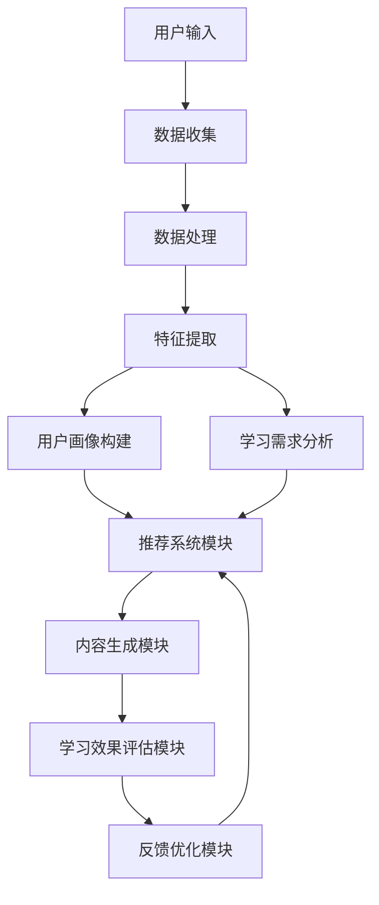

                 

# 第一部分：引论

## 1.1 引言

### 1.1.1 个性化学习内容生成的背景与意义

随着教育行业的快速发展，传统的教学模式已经不能满足现代教育的需求。个性化学习内容生成作为人工智能在教育领域的一个重要应用，正逐渐受到越来越多的关注。个性化学习内容生成是指通过利用人工智能技术，根据每个学生的学习习惯、学习需求和知识水平，自动生成适合其个人的学习材料。

个性化学习内容生成的背景主要有以下几点：

1. **学习需求的多样性**：每个学生都有其独特的学习需求和兴趣，传统的“一刀切”教学模式已经难以满足这些多样化的需求。
2. **教育资源的稀缺性**：优质的教育资源相对稀缺，如何有效地利用这些资源，实现教育资源的最大化利用，是教育领域面临的一个重大挑战。
3. **人工智能技术的成熟**：随着人工智能技术的不断发展，计算机在数据分析和处理方面的能力得到了极大的提升，这为个性化学习内容生成提供了技术支持。

个性化学习内容生成的重要意义体现在以下几个方面：

1. **提高学习效果**：通过个性化学习内容生成，学生能够根据自己的需求和兴趣，选择合适的学习材料，提高学习效果。
2. **优化教育资源**：个性化学习内容生成能够实现教育资源的最大化利用，提高教育资源的利用率。
3. **促进教育公平**：个性化学习内容生成能够为所有学生提供个性化的教育服务，促进教育公平。

### 1.1.2 本书的主要目标与内容安排

本书的主要目标是深入探讨人工智能在个性化学习内容生成中的应用，包括核心概念、算法原理、架构设计以及实际应用案例等。具体内容安排如下：

1. **引论**：介绍个性化学习内容生成的背景与意义，以及本书的主要目标和内容安排。
2. **核心概念与联系**：详细讲解机器学习、数据挖掘、推荐系统等核心概念，并阐述它们在个性化学习内容生成中的应用。
3. **人工智能在个性化学习中的架构设计**：介绍个性化学习内容生成的流程，以及人工智能在其中的核心技术。
4. **核心算法原理讲解**：讲解个性化学习内容生成的算法原理，包括基本算法、数学模型和优化技巧。
5. **项目实战**：通过实际项目案例，展示个性化学习内容生成的实现过程，并提供详细解读和分析。
6. **未来展望与趋势**：探讨个性化学习内容生成的发展趋势，面临的挑战以及解决方案。

通过本书的学习，读者将能够系统地了解人工智能在个性化学习内容生成中的应用，掌握相关技术原理和实践方法，为从事相关领域的研究和应用提供有力支持。

### 1.2 人工智能与个性化学习概述

#### 1.2.1 人工智能的定义与发展历程

人工智能（Artificial Intelligence，简称AI）是指通过计算机模拟人类智能的技术和科学，其目标是使计算机具有人类的认知能力，包括感知、理解、学习、推理、决策等。人工智能的定义和发展历程可以追溯到20世纪50年代，当时计算机科学刚刚起步，科学家们就开始探讨如何使计算机具备智能。

- **早期探索**（1950s-1960s）：在这个时期，人工智能的概念开始被提出，主要研究如何让计算机进行逻辑推理和问题解决。1956年，达特茅斯会议上，“人工智能”一词被正式提出，标志着人工智能领域的诞生。

- **快速发展**（1970s-1980s）：随着计算机硬件和软件技术的进步，人工智能开始进入快速发展阶段。专家系统和模式识别技术得到了广泛应用。

- **衰退与复苏**（1990s-2000s）：由于技术难题和实际应用的局限性，人工智能在20世纪90年代遭遇了低谷。但互联网和大数据技术的发展为人工智能带来了新的机遇。

- **新时代**（2010s-至今）：深度学习和神经网络技术的突破，使得人工智能再次进入快速发展阶段。计算机在图像识别、自然语言处理、游戏智能等领域取得了显著的成果。

#### 1.2.2 个性化学习的概念与分类

个性化学习（Personalized Learning）是一种以学生为中心的教学模式，旨在根据每个学生的学习需求、兴趣和能力，提供个性化的学习体验。个性化学习的核心理念是尊重学生的差异性，满足他们的个性化需求，从而提高学习效果。

根据实现方式，个性化学习可以分为以下几种类型：

- **基于内容的个性化学习**：根据学生的兴趣和知识水平，提供不同类型的学习内容，如文本、视频、游戏等。

- **基于过程的个性化学习**：根据学生的学习过程，动态调整学习策略，如学习进度、学习方法等。

- **基于环境的个性化学习**：通过智能环境感知技术，为学生提供适应其学习习惯的环境，如智能教室、虚拟现实等。

#### 1.2.3 人工智能在个性化学习中的应用现状与趋势

人工智能在个性化学习中的应用已经取得了一定的成果，主要体现在以下几个方面：

- **智能推荐系统**：通过分析学生的学习行为和兴趣，智能推荐适合其学习的内容，提高学习效果。

- **智能评估系统**：利用自然语言处理和机器学习技术，对学生的学习成果进行智能评估，提供个性化的反馈。

- **智能教学系统**：通过语音识别、图像识别等技术，实现智能化的教学内容呈现和互动，提高学生的学习兴趣和参与度。

- **智能学习助理**：利用自然语言处理和对话系统，为学生提供智能化的学习辅导和答疑服务。

未来，随着人工智能技术的进一步发展，个性化学习内容生成将迎来更广泛的应用。以下是一些可能的发展趋势：

- **更加智能化的推荐系统**：通过深度学习和强化学习等技术，实现更加精准的内容推荐。

- **基于大数据的个性化学习**：利用大数据分析技术，全面了解学生的学习行为和需求，提供更加个性化的学习方案。

- **虚拟现实和增强现实的个性化学习**：通过虚拟现实和增强现实技术，提供沉浸式、互动式的个性化学习体验。

- **跨学科的个性化学习**：结合不同学科的知识，提供跨学科的个性化学习内容，促进学生全面发展。

总之，人工智能在个性化学习内容生成中的应用有着广阔的前景，它将为教育领域带来深刻变革，提高教育质量和效率。

### 1.2.4 人工智能在个性化学习中的应用现状与趋势

#### 现状

目前，人工智能在个性化学习中的应用已经取得了显著的进展，体现在多个方面：

1. **智能推荐系统**：通过分析学生的学习行为、历史记录和兴趣偏好，人工智能系统能够为每个学生推荐最适合他们的学习内容，提高了学习效率和个人兴趣。

2. **自适应学习平台**：利用机器学习算法，自适应学习平台能够根据学生的学习进度、知识水平和学习习惯，动态调整教学内容和难度，提供个性化的学习路径。

3. **智能辅导系统**：利用自然语言处理和对话系统，智能辅导系统能够为学生提供个性化的学习辅导和答疑服务，帮助学生解决学习中的困难和疑问。

4. **个性化评估与反馈**：人工智能系统能够对学生的作业、考试和项目进行智能评估，提供个性化的反馈和建议，帮助教师和学生了解学习效果，优化学习策略。

#### 趋势

未来，人工智能在个性化学习中的应用将继续深化和拓展，以下几个趋势值得关注：

1. **深度个性化**：随着人工智能技术的进步，个性化学习将更加深入，能够更加准确地捕捉和反映每个学生的个性化需求，实现真正的深度个性化。

2. **跨学科整合**：人工智能将促进不同学科之间的整合，提供跨学科、跨领域的个性化学习内容，帮助学生构建全面的知识体系。

3. **情感计算与个性化互动**：利用情感计算技术，人工智能系统将能够识别和响应学生的情感状态，提供更加人性化的学习互动体验。

4. **开放性资源整合**：通过人工智能技术，开放教育资源（OER）的整合和优化将更加高效，为学生提供更加丰富和个性化的学习资源。

5. **可持续发展与伦理**：随着人工智能技术的应用，个性化学习的内容生成和推荐将更加注重可持续发展，同时，隐私保护和伦理问题也将成为研究和应用的重要方向。

总之，人工智能在个性化学习内容生成中的应用正处于快速发展阶段，它将为教育领域带来更加个性化和高效的解决方案，助力教育公平和质量的提升。

---

接下来，我们将进入第二部分：核心概念与联系。这一部分将详细讲解机器学习、数据挖掘、推荐系统等核心概念，并探讨它们在个性化学习内容生成中的应用。

### 2.1 机器学习基础

#### 2.1.1 机器学习的基本概念

机器学习（Machine Learning，ML）是一门研究如何让计算机从数据中学习规律、模式并做出决策的学科。它是人工智能（Artificial Intelligence，AI）的一个重要分支，主要关注如何通过算法使计算机具备自主学习和改进性能的能力。

**定义**：机器学习是指通过数据驱动的方法，让计算机系统从数据中学习，并对未知数据进行预测或决策的过程。

**核心思想**：机器学习的核心思想是，通过从历史数据中提取模式和规律，将知识转移到新的数据上，从而实现数据驱动下的智能决策。机器学习的过程大致可以分为以下几个步骤：

1. **数据收集**：收集用于训练的数据集。
2. **数据预处理**：对收集到的数据进行清洗、转换和归一化，使其适合于训练。
3. **模型选择**：选择合适的机器学习算法来构建模型。
4. **模型训练**：使用训练数据集对模型进行训练，调整模型参数以最小化预测误差。
5. **模型评估**：使用验证数据集评估模型性能，调整模型参数以优化性能。
6. **模型部署**：将训练好的模型部署到实际应用环境中，对新数据进行预测或决策。

**机器学习的主要类型**：

- **监督学习（Supervised Learning）**：在监督学习场景中，训练数据集包含了输入特征和对应的输出标签，模型通过学习这些标签来预测新数据的输出。常见的监督学习算法包括线性回归、逻辑回归、支持向量机（SVM）等。

- **无监督学习（Unsupervised Learning）**：在无监督学习场景中，训练数据集仅包含输入特征，没有对应的输出标签。模型的目标是自动发现数据中的结构和模式，如聚类、降维等。常见的无监督学习算法包括K-均值聚类、主成分分析（PCA）等。

- **半监督学习（Semi-Supervised Learning）**：半监督学习结合了监督学习和无监督学习的特点，利用少量标注数据和大量未标注数据来训练模型，以减少标注成本。常见的半监督学习算法包括自我训练（Self-Training）和图嵌入（Graph Embedding）等。

- **强化学习（Reinforcement Learning）**：强化学习是一种通过奖励机制来训练模型，使其能够在特定环境中做出最优决策的方法。常见的强化学习算法包括Q学习、深度Q网络（DQN）和策略梯度（PG）等。

**机器学习在个性化学习中的应用**：

- **个性化推荐系统**：利用监督学习算法，分析学生的历史学习记录和兴趣偏好，推荐适合他们的学习内容。
- **自适应学习系统**：利用无监督学习算法，分析学生的学习行为和模式，调整学习内容和学习策略。
- **智能评估系统**：利用半监督学习算法，评估学生的学习效果，提供个性化的反馈和改进建议。

#### 2.1.2 监督学习、无监督学习与强化学习

监督学习、无监督学习和强化学习是机器学习的三种主要学习方式，它们在个性化学习中的应用各有特点。

**监督学习（Supervised Learning）**

监督学习是一种在已知输出标签的情况下训练模型的学习方法。其主要目的是通过学习已知的输入和输出关系，预测未知数据的输出。

**应用场景**：

1. **个性化推荐**：根据学生的历史学习记录和偏好，预测他们可能感兴趣的学习内容，实现个性化推荐。
2. **智能评估**：根据学生的考试成绩和学习进度，预测他们的学习效果，提供针对性的辅导建议。

**常用算法**：

1. **线性回归（Linear Regression）**：用于预测连续值输出，如学生的成绩。
2. **逻辑回归（Logistic Regression）**：用于预测二分类输出，如学生是否喜欢某一门课程。
3. **支持向量机（SVM）**：用于分类任务，能够找到最佳的超平面，将不同类别的数据分开。

**无监督学习（Unsupervised Learning）**

无监督学习是在没有输出标签的情况下，通过学习数据的内在结构来发现数据分布和模式的方法。

**应用场景**：

1. **数据聚类**：将具有相似特征的学习数据分组，为教师提供不同学习小组的划分依据。
2. **降维**：通过减少数据维度，简化数据结构，帮助教师和学生更方便地理解和分析学习数据。

**常用算法**：

1. **K-均值聚类（K-Means Clustering）**：将数据划分为K个簇，每个簇内的数据点尽可能接近簇中心。
2. **主成分分析（PCA）**：通过线性变换，将数据投影到较低维度的空间中，保留数据的主要特征。
3. **层次聚类（Hierarchical Clustering）**：通过构建层次结构来分类数据点，形成自底向上的聚类树。

**强化学习（Reinforcement Learning）**

强化学习是一种通过与环境互动来学习最优策略的方法。它通过奖励和惩罚机制来指导模型的行为，以实现长期目标。

**应用场景**：

1. **自适应学习策略**：根据学生的学习行为和反馈，动态调整学习内容和策略，提高学习效果。
2. **智能辅导系统**：利用强化学习，为学生提供个性化的学习辅导和答疑服务，帮助他们解决学习难题。

**常用算法**：

1. **Q学习（Q-Learning）**：通过评估当前状态下的动作值，逐步优化策略。
2. **深度Q网络（DQN）**：结合深度神经网络，实现更加复杂的强化学习任务。
3. **策略梯度（PG）**：通过优化策略的参数，使模型在长期内获得最大回报。

**总结**：

监督学习、无监督学习和强化学习在个性化学习内容生成中发挥着重要作用。监督学习用于预测和评估，无监督学习用于数据分析和结构发现，强化学习用于自适应策略调整。这些学习方式相互补充，共同推动了个性化学习的深入发展。

### 2.1.3 机器学习算法的分类与比较

在个性化学习内容生成中，选择合适的机器学习算法至关重要。不同的算法在性能、复杂度和应用场景上各有特点。下面我们将对常见的机器学习算法进行分类与比较。

**1. 监督学习算法**

**线性回归（Linear Regression）**

- **算法原理**：线性回归通过建立线性关系来预测连续值输出。
- **适用场景**：适用于简单线性关系的预测任务，如学生成绩预测。
- **优点**：计算简单，易于实现。
- **缺点**：对非线性关系表现较差。

**逻辑回归（Logistic Regression）**

- **算法原理**：逻辑回归通过建立线性关系，将输入特征映射到概率空间，常用于二分类任务。
- **适用场景**：适用于分类任务，如学生是否喜欢某门课程。
- **优点**：能够解释每个特征对输出的影响程度。
- **缺点**：对非线性关系和缺失值敏感。

**支持向量机（SVM）**

- **算法原理**：SVM通过找到一个最优的超平面，将不同类别的数据点分开。
- **适用场景**：适用于分类任务，特别是高维数据。
- **优点**：效果较好，对噪声数据有较强的鲁棒性。
- **缺点**：计算复杂度高，不适合大规模数据集。

**2. 无监督学习算法**

**K-均值聚类（K-Means Clustering）**

- **算法原理**：K-均值聚类将数据分为K个簇，每个簇由其中心点代表。
- **适用场景**：适用于聚类任务，如学生分组。
- **优点**：简单易懂，适用于大规模数据集。
- **缺点**：对初始中心点敏感，可能陷入局部最优。

**主成分分析（PCA）**

- **算法原理**：PCA通过线性变换，将数据投影到较低维度的空间中，保留主要特征。
- **适用场景**：适用于降维和特征提取。
- **优点**：能够降低数据维度，提高计算效率。
- **缺点**：对噪声敏感，无法保留所有信息。

**层次聚类（Hierarchical Clustering）**

- **算法原理**：层次聚类通过构建层次结构，将数据点逐步分类。
- **适用场景**：适用于聚类任务，能够提供不同层次的聚类结果。
- **优点**：能够提供聚类层次信息，适用于多层次分析。
- **缺点**：计算复杂度高，对初始设置敏感。

**3. 强化学习算法**

**Q学习（Q-Learning）**

- **算法原理**：Q学习通过评估当前状态下的动作值，逐步优化策略。
- **适用场景**：适用于动态环境中的决策问题，如自适应学习策略。
- **优点**：能够处理连续动作和状态空间。
- **缺点**：收敛速度较慢，对参数敏感。

**深度Q网络（DQN）**

- **算法原理**：DQN结合深度神经网络，实现更加复杂的强化学习任务。
- **适用场景**：适用于复杂的动态环境。
- **优点**：能够处理高维输入，提高决策能力。
- **缺点**：训练过程复杂，对计算资源要求较高。

**策略梯度（PG）**

- **算法原理**：策略梯度通过优化策略的参数，使模型在长期内获得最大回报。
- **适用场景**：适用于复杂的决策问题，如自适应学习策略。
- **优点**：直接优化策略，收敛速度快。
- **缺点**：需要大量样本，对初始策略敏感。

**总结**：

选择合适的机器学习算法需要考虑任务类型、数据特征和计算资源等因素。线性回归和逻辑回归适用于简单线性关系和分类任务，K-均值聚类和PCA适用于聚类和降维，而Q学习、DQN和策略梯度适用于动态环境和复杂决策问题。通过合理选择和组合算法，可以更好地实现个性化学习内容生成。

### 2.1.4 机器学习在个性化学习中的应用

机器学习在个性化学习中的应用，旨在通过分析学生的学习行为、知识水平和兴趣偏好，提供高度个性化的学习内容和学习体验。以下是一些具体的机器学习应用案例：

#### 个性化推荐系统

个性化推荐系统是机器学习在个性化学习中的一个重要应用，它通过分析学生的学习记录、搜索历史和社交活动，推荐最适合他们的学习内容。

**应用原理**：

- **协同过滤（Collaborative Filtering）**：基于用户的行为和兴趣相似度，推荐相似用户喜欢的内容。
- **基于内容的推荐（Content-Based Filtering）**：根据学习内容的特征和用户的历史偏好，推荐相似内容。
- **混合推荐（Hybrid Recommendation）**：结合协同过滤和基于内容的推荐，提供更精准的推荐。

**案例分析**：

- **案例一**：某在线教育平台使用协同过滤算法，根据学生的浏览记录和课程评价，推荐相关的学习资源。这种推荐系统能够帮助学生发现潜在感兴趣的课程，提高学习积极性。

#### 自适应学习系统

自适应学习系统利用机器学习算法，动态调整学习内容和策略，以适应每个学生的个性化需求。

**应用原理**：

- **学习路径规划**：根据学生的学习进度和知识掌握情况，自动生成个性化的学习路径。
- **学习策略调整**：通过分析学生的学习行为，调整学习难度、时间和方法，提高学习效果。

**案例分析**：

- **案例二**：某在线学习平台使用自适应学习系统，根据学生的学习数据，调整课程难度和练习题难度，提供个性化的学习体验。这种系统能够有效降低学生的学习负担，提高学习效率。

#### 智能评估系统

智能评估系统利用机器学习技术，对学生的学习成果进行智能评估，提供个性化的反馈和改进建议。

**应用原理**：

- **自动评分**：通过自然语言处理和图像识别技术，自动评估学生的作业和考试。
- **智能反馈**：根据评估结果，为学生提供个性化的学习建议和改进方案。

**案例分析**：

- **案例三**：某教育机构使用智能评估系统，自动评分学生的作业，并提供详细的反馈和建议。这种系统能够减轻教师的评分负担，提高评估效率，同时帮助学生更好地了解自己的学习状况。

#### 个性化学习内容生成

个性化学习内容生成是指利用机器学习技术，根据学生的学习需求、兴趣和知识水平，自动生成适合他们的学习材料。

**应用原理**：

- **知识图谱**：构建包含学习资源、知识点和关系的信息图谱，为个性化内容生成提供数据支持。
- **文本生成**：利用生成模型，如GPT（Generative Pre-trained Transformer），自动生成符合学生需求的文本内容。

**案例分析**：

- **案例四**：某在线学习平台使用个性化学习内容生成系统，根据学生的学习行为和知识图谱，自动生成个性化的学习材料。这种系统能够提供高质量、个性化的学习资源，满足学生的多样化需求。

总之，机器学习在个性化学习中的应用，通过个性化推荐、自适应学习、智能评估和个性化内容生成等多种形式，为教育领域带来了革命性的变革。通过这些应用，不仅提高了学习效果，还优化了教育资源的使用，推动了教育公平的实现。

### 2.2 数据挖掘与推荐系统

#### 2.2.1 数据挖掘的基本概念

数据挖掘（Data Mining）是指从大量的数据中通过应用某些算法和统计方法，发现潜在的、有价值的模式、关联和知识的过程。数据挖掘的目标是通过分析数据，提取出对用户有价值的信息，从而帮助决策者做出更加明智的决策。

**定义**：数据挖掘是一种从大量数据中自动发现有用模式的高级数据处理过程。这些模式通常隐含在大量数据中，需要通过数据分析技术来揭示。

**过程**：数据挖掘通常包括以下几个步骤：

1. **数据预处理**：对原始数据进行清洗、转换和归一化，以确保数据的质量和一致性。
2. **数据探索**：使用统计方法对数据进行初步探索，发现数据的基本特征和分布。
3. **模式识别**：应用机器学习和统计分析方法，发现数据中的潜在模式和关联。
4. **模式评估**：对挖掘出的模式进行评估，判断其是否具有实际价值。
5. **结果可视化**：将挖掘结果通过图表、报表等形式进行可视化，帮助用户理解和解释。

**常见技术**：

- **分类（Classification）**：通过构建分类模型，将数据分为不同的类别。
- **聚类（Clustering）**：将相似的数据点分组，形成簇，用于数据分析和模式发现。
- **关联规则挖掘（Association Rule Learning）**：发现数据中不同属性之间的关联关系。
- **异常检测（Anomaly Detection）**：识别数据中的异常或离群点。
- **预测建模（Prediction Modeling）**：基于历史数据，预测未来的趋势和变化。

#### 2.2.2 推荐系统的原理与实现

推荐系统（Recommendation System）是一种通过分析用户的行为和偏好，向用户推荐可能感兴趣的商品、内容或服务的信息系统。推荐系统广泛应用于电子商务、社交媒体、在线教育和广告等领域，目的是提高用户体验，增加用户粘性和转化率。

**原理**：

- **协同过滤（Collaborative Filtering）**：协同过滤是一种基于用户相似度或物品相似度的推荐方法。其基本思想是，通过分析用户之间的行为相似性或物品之间的相似性，预测用户可能感兴趣的内容。

  - **用户基于的协同过滤（User-Based Collaborative Filtering）**：通过计算用户之间的相似度，推荐与目标用户兴趣相似的其他用户的偏好。

  - **物品基于的协同过滤（Item-Based Collaborative Filtering）**：通过计算物品之间的相似度，推荐与目标用户已评价的物品相似的物品。

- **基于内容的推荐（Content-Based Filtering）**：基于内容的推荐通过分析物品或用户的特征，推荐与目标用户或物品特征相似的内容。

  - **基于文本的推荐**：通过分析文本内容中的关键词、主题和情感，推荐相关的内容。
  
  - **基于属性的推荐**：通过分析物品的属性和特征，推荐与目标用户或物品属性相似的物品。

- **混合推荐（Hybrid Recommendation）**：混合推荐结合了协同过滤和基于内容的推荐方法，以提供更加精准的推荐结果。

**实现**：

- **数据收集**：收集用户行为数据（如点击、购买、评分等）和物品特征数据（如标题、描述、标签等）。
- **数据预处理**：对原始数据清洗、转换和归一化，确保数据质量。
- **模型训练**：使用训练数据训练推荐模型，如矩阵分解、聚类、分类等。
- **模型评估**：使用验证数据评估模型性能，调整模型参数。
- **推荐生成**：使用训练好的模型，根据用户的当前行为和偏好，生成推荐列表。
- **反馈调整**：根据用户的反馈调整推荐策略和模型参数，提高推荐效果。

**案例分析**：

- **案例一**：某电商平台的推荐系统利用协同过滤算法，根据用户的购买历史和浏览行为，推荐相关的商品。这种推荐系统能够提高用户的购买转化率和平台销售额。

- **案例二**：某在线教育平台的推荐系统结合基于内容和基于协同过滤的方法，根据用户的课程选择和学习行为，推荐相关的课程和学习资源。这种推荐系统能够提高用户的学习满意度和学习效率。

#### 2.2.3 数据挖掘与推荐系统在个性化学习中的应用

数据挖掘和推荐系统在个性化学习中的应用，旨在通过分析学生的学习行为、知识水平和兴趣偏好，为每个学生提供个性化的学习内容和推荐。

**应用**：

1. **个性化推荐**：通过分析学生的学习记录和偏好，推荐适合他们的学习内容，如课程、学习材料等。
   
   - **案例**：某在线学习平台利用协同过滤算法，根据学生的历史学习记录和评价，推荐相关的课程和教材，提高学生的学习效果。

2. **学习路径规划**：通过分析学生的学习行为和知识图谱，为每个学生生成个性化的学习路径，帮助他们更好地掌握知识。

   - **案例**：某自适应学习平台利用聚类和路径规划算法，根据学生的学习进度和知识水平，自动生成个性化的学习计划，提高学习效率。

3. **学习效果评估**：通过分析学生的学习行为和成绩，评估他们的学习效果，提供个性化的反馈和建议。

   - **案例**：某智能教育系统利用自然语言处理和评估算法，对学生的作业和考试进行自动评分，并提供详细的学习反馈，帮助教师和学生了解学习状况。

4. **个性化辅导**：通过分析学生的学习需求和困难，提供个性化的辅导服务，帮助他们解决学习中的问题。

   - **案例**：某在线辅导平台利用强化学习算法，根据学生的提问和学习记录，提供个性化的解答和辅导，提高学习效果。

**挑战**：

1. **数据隐私**：个性化学习需要大量的学生数据，如何保护学生的隐私成为一个重要问题。

2. **数据质量**：数据的质量直接影响推荐系统的效果，如何确保数据的准确性和完整性是一个挑战。

3. **模型可解释性**：推荐系统中的模型通常复杂且不透明，如何解释模型的工作原理和推荐结果是一个重要问题。

**解决方案**：

1. **隐私保护技术**：采用差分隐私、数据匿名化等技术，保护学生数据的隐私。

2. **数据质量提升**：通过数据清洗、数据增强等方法，提高数据的准确性和完整性。

3. **可解释性增强**：通过可视化和解释性模型，提高推荐系统的可解释性，帮助用户理解推荐结果。

总之，数据挖掘和推荐系统在个性化学习中的应用，通过个性化推荐、学习路径规划、学习效果评估和个性化辅导等多种方式，为教育领域带来了深刻的变革。然而，这也需要我们在技术、伦理和隐私保护等方面不断探索和优化。

### 2.2.4 个性化学习内容生成中的挑战与解决方案

个性化学习内容生成在实现过程中面临着诸多挑战，这些挑战主要集中在数据质量、算法复杂度、隐私保护和模型可解释性等方面。下面我们将逐一探讨这些挑战以及相应的解决方案。

#### 数据质量

**挑战**：个性化学习内容生成依赖于大量的学生学习数据，这些数据的质量直接影响推荐和生成的效果。数据质量问题的常见表现包括数据缺失、数据噪声、数据冗余和数据不一致。

**解决方案**：

1. **数据清洗**：通过数据预处理技术，清洗和修复数据中的错误、缺失和重复记录，确保数据的一致性和准确性。

2. **数据增强**：通过数据扩展、数据合成等方法，增加数据量和多样性，提高算法的训练效果和推荐质量。

3. **数据可视化**：利用数据可视化工具，帮助分析数据分布、异常值和潜在模式，便于数据清洗和问题定位。

#### 算法复杂度

**挑战**：个性化学习内容生成的算法通常较为复杂，涉及多种机器学习和数据挖掘技术，如协同过滤、深度学习、聚类分析等。算法的复杂度不仅影响计算资源的需求，还可能影响系统的实时性和用户体验。

**解决方案**：

1. **算法优化**：通过优化算法参数和模型结构，提高算法的效率和精度，减少计算资源的消耗。

2. **分布式计算**：采用分布式计算框架，如MapReduce、Spark等，实现算法的并行化处理，提高系统的处理能力和实时性。

3. **模型简化**：通过模型压缩和简化技术，降低模型复杂度，提高系统的响应速度和用户体验。

#### 隐私保护

**挑战**：个性化学习内容生成需要收集和分析大量的学生数据，涉及学生的个人信息和学习记录，如何保护学生的隐私成为一大挑战。

**解决方案**：

1. **数据匿名化**：通过数据脱敏、加密等技术，对敏感数据进行匿名化处理，防止个人身份被识别。

2. **差分隐私**：采用差分隐私技术，对数据分析和模型训练过程中的敏感信息进行保护，确保数据分析结果不会泄露个人隐私。

3. **隐私政策**：制定明确的隐私政策，告知学生数据收集、使用和保护的具体流程和措施，提高用户的隐私保护意识。

#### 模型可解释性

**挑战**：个性化学习内容生成中的机器学习模型通常较为复杂，不透明，难以解释其决策过程，这对教师和学生理解和信任系统提出了挑战。

**解决方案**：

1. **可解释性模型**：开发可解释性强的模型，如决策树、线性回归等，使模型决策过程更易于理解。

2. **模型可视化**：通过数据可视化工具，展示模型的工作原理、训练过程和决策结果，提高模型的可解释性。

3. **透明度机制**：建立透明的模型评估和反馈机制，让用户了解模型的性能和决策过程，提高信任度。

#### 总结

个性化学习内容生成在实现过程中面临的挑战多种多样，包括数据质量、算法复杂度、隐私保护和模型可解释性等。通过采用数据清洗、数据增强、算法优化、分布式计算、数据匿名化、差分隐私、模型简化、可解释性模型、模型可视化、透明度机制等解决方案，可以有效地应对这些挑战，实现高效、安全、透明的个性化学习内容生成系统。

---

接下来，我们将进入第三部分：人工智能在个性化学习中的架构设计。这一部分将详细讲解个性化学习内容生成的流程，以及人工智能在其中的核心技术。

### 2.3 人工智能在个性化学习中的架构设计

#### 2.3.1 个性化学习内容生成的流程

个性化学习内容生成是一个复杂的过程，涉及多个步骤和环节。以下是一个典型的个性化学习内容生成流程：

1. **用户画像构建**：通过收集和分析学生的个人信息、学习历史和兴趣偏好，构建用户的个性化画像。用户画像的构建是整个流程的基础，决定了后续推荐和学习内容的个性化程度。

2. **内容库构建**：建立一个丰富的学习内容库，包含各种类型的学习资源，如文本、视频、音频和互动式学习材料等。内容库应具备良好的组织和管理机制，便于快速检索和推荐。

3. **学习需求分析**：利用自然语言处理和机器学习算法，分析学生的学习需求，包括当前的知识水平、学习兴趣和职业规划等。这一步的目的是了解学生的个性化需求，为个性化内容推荐提供依据。

4. **内容推荐**：基于用户画像和学习需求分析，利用协同过滤、基于内容的推荐或混合推荐算法，向学生推荐最适合他们的学习内容。推荐系统应具备实时性和自适应能力，根据学生的反馈和学习行为动态调整推荐策略。

5. **内容生成**：对于缺乏现成学习资源的课程或领域，可以利用生成模型（如GPT）和知识图谱等技术，自动生成符合学生需求的新内容。内容生成的目标是补充现有资源，提供更加个性化和定制化的学习体验。

6. **学习效果评估**：通过学习过程中的数据反馈，评估学生的学习效果和内容质量。学习效果评估可以采用自动评分、教师评估和学生自我评估等多种方式，确保学习内容的实际效果。

7. **反馈优化**：根据学习效果评估的结果，对学习内容和推荐策略进行优化调整。反馈优化是一个动态循环过程，旨在不断改进系统的推荐和学习效果。

#### 2.3.2 人工智能在个性化学习中的核心技术

人工智能在个性化学习中的应用涉及多个核心技术，包括自然语言处理、机器学习、知识图谱和推荐系统等。以下是对这些核心技术的详细介绍：

**1. 自然语言处理（NLP）**

自然语言处理是人工智能的一个重要分支，旨在使计算机理解和处理自然语言。在个性化学习中，NLP技术主要用于处理和分析学生的文本数据，如学习笔记、作业和讨论内容等。

- **文本分类**：通过对学生文本数据的分类，识别不同的主题和话题，为内容推荐提供依据。
- **情感分析**：分析学生的文本数据，识别其情感倾向和态度，为个性化推荐和辅导提供参考。
- **文本生成**：利用生成模型，如GPT，自动生成符合学生需求的新文本内容，补充现有资源。

**2. 机器学习（ML）**

机器学习是人工智能的核心技术之一，通过训练模型，使计算机具备自主学习和改进性能的能力。在个性化学习中，机器学习技术主要用于数据分析和模式识别，实现个性化推荐和学习路径规划。

- **监督学习**：利用已标记的数据，训练分类和回归模型，用于预测学生的兴趣和成绩。
- **无监督学习**：通过聚类和降维等技术，发现学生数据中的潜在结构和模式，用于个性化分组和学习策略调整。
- **强化学习**：通过奖励机制，训练智能体在动态环境中做出最优决策，实现自适应学习策略。

**3. 知识图谱（KG）**

知识图谱是一种用于表示实体及其之间关系的图形化数据结构。在个性化学习中，知识图谱用于构建和学习内容的关系网络，提供语义理解和支持。

- **知识抽取**：通过文本挖掘和语义分析，从大量数据中提取出实体和关系，构建知识图谱。
- **知识推理**：利用知识图谱，进行逻辑推理和关联分析，为个性化推荐和内容生成提供支持。
- **知识融合**：将不同来源的知识融合到同一知识图谱中，实现知识的整合和利用。

**4. 推荐系统（RS）**

推荐系统是一种通过分析用户行为和偏好，向用户推荐可能感兴趣的内容的信息系统。在个性化学习中，推荐系统用于推荐学习内容和资源，提高学习效果和用户满意度。

- **协同过滤**：通过用户行为相似性和物品相似性，推荐相关的学习内容。
- **基于内容推荐**：通过分析学习内容的特征和用户偏好，推荐相关的学习内容。
- **混合推荐**：结合协同过滤和基于内容的推荐，提供更精准的推荐结果。

**总结**：

人工智能在个性化学习中的架构设计，通过自然语言处理、机器学习、知识图谱和推荐系统等核心技术的结合，实现了用户画像构建、学习需求分析、内容推荐、内容生成、学习效果评估和反馈优化等各个环节的自动化和智能化。这一架构不仅提高了个性化学习的质量和效率，也为教育领域的创新和发展提供了新的动力。

### 2.3.3 人工智能在个性化学习中的架构设计

为了实现高效的个性化学习内容生成，人工智能在个性化学习中的应用需要一套完整的架构设计。以下是一个详细的架构设计，包括数据流、模块功能以及各模块之间的交互。

#### 数据流

1. **用户输入**：学生通过学习平台提交学习需求，包括课程选择、学习目标、兴趣爱好等。

2. **数据收集**：系统从多个数据源（如学习平台、用户反馈、社交网络等）收集学生行为数据、学习记录和兴趣偏好。

3. **数据处理**：数据经过清洗、转换和归一化处理，确保数据质量和一致性。

4. **特征提取**：利用自然语言处理和机器学习技术，从原始数据中提取关键特征，用于后续分析。

5. **推荐与生成**：基于用户画像和学习需求，推荐系统和内容生成模块生成个性化学习内容。

6. **用户反馈**：学生根据推荐内容进行学习，并提交反馈，用于调整和优化推荐和学习策略。

#### 模块功能

1. **用户画像构建模块**：通过分析用户的历史数据和兴趣偏好，构建用户的个性化画像。

2. **学习需求分析模块**：利用自然语言处理和机器学习技术，分析学生的学习需求，包括当前的知识水平、学习兴趣和职业规划等。

3. **推荐系统模块**：采用协同过滤、基于内容的推荐和混合推荐算法，根据用户画像和学习需求推荐个性化学习内容。

4. **内容生成模块**：利用生成模型（如GPT）和知识图谱技术，自动生成符合学生需求的新内容。

5. **学习效果评估模块**：通过自动评分、教师评估和学生自我评估等多种方式，评估学生的学习效果和内容质量。

6. **反馈优化模块**：根据学生的学习反馈和效果评估结果，动态调整推荐策略和内容生成方案。

#### 模块交互

1. **用户画像构建模块**与**学习需求分析模块**：用户画像构建模块为学习需求分析模块提供用户个性化数据，学习需求分析模块基于用户画像进行深入分析。

2. **推荐系统模块**与**内容生成模块**：推荐系统模块根据用户画像和学习需求，调用内容生成模块生成个性化学习内容，内容生成模块为推荐系统模块提供新内容。

3. **学习效果评估模块**与**反馈优化模块**：学习效果评估模块评估学生的学习效果，并将评估结果反馈给反馈优化模块，反馈优化模块根据反馈结果调整推荐策略和内容生成方案。

4. **用户反馈**：用户在学习过程中提交反馈，反馈优化模块根据用户反馈动态调整推荐和学习策略，提高用户满意度。

### Mermaid流程图：个性化学习内容生成的架构设计



通过上述架构设计，个性化学习内容生成系统能够高效地捕捉用户需求、推荐合适的内容，并根据学习效果动态调整，实现真正的个性化学习。

### 2.3.4 个性化学习内容生成的算法原理

个性化学习内容生成的核心在于通过算法分析学生的学习行为、知识水平和兴趣偏好，从而生成适合他们的学习材料。以下将详细讲解个性化学习内容生成的算法原理，包括基本算法、算法原理以及伪代码，并结合具体案例分析算法的应用效果。

#### 2.3.4.1 个性化学习内容生成的基本算法

个性化学习内容生成通常基于以下几种基本算法：

1. **协同过滤算法**：基于用户行为和相似度计算，为用户推荐相似用户喜欢的学习内容。
2. **基于内容的推荐算法**：根据学习内容的特征和用户的历史偏好，为用户推荐相似的内容。
3. **深度学习算法**：利用神经网络模型，从海量数据中自动学习用户兴趣和内容特征，生成个性化学习内容。
4. **知识图谱算法**：通过构建知识图谱，利用图谱中的关系进行推理，生成符合用户需求的学习内容。

#### 2.3.4.2 算法原理

1. **协同过滤算法**

   协同过滤算法的核心思想是利用用户之间的相似性和物品之间的相似性来推荐内容。其基本原理如下：

   - **用户相似度计算**：通过计算用户之间的相似度，找到与目标用户相似的用户群体。
   - **物品相似度计算**：通过计算物品之间的相似度，找到与目标用户喜欢的物品相似的其他物品。
   - **推荐生成**：综合用户相似度和物品相似度，生成个性化推荐列表。

2. **基于内容的推荐算法**

   基于内容的推荐算法主要依赖于内容特征和用户偏好。其基本原理如下：

   - **内容特征提取**：对学习内容进行特征提取，如文本特征、图像特征等。
   - **用户偏好建模**：根据用户的历史行为和评价，建立用户偏好模型。
   - **内容相似度计算**：计算学习内容之间的相似度，为用户推荐相似的内容。

3. **深度学习算法**

   深度学习算法通过训练神经网络模型，从数据中自动提取特征，实现个性化推荐。其基本原理如下：

   - **神经网络模型**：使用多层感知器（MLP）、卷积神经网络（CNN）或循环神经网络（RNN）等模型。
   - **特征提取与融合**：从用户行为、内容和环境数据中提取特征，并融合到模型中。
   - **模型训练与优化**：通过反向传播算法训练模型，调整模型参数以优化推荐效果。

4. **知识图谱算法**

   知识图谱算法通过构建实体及其关系的图谱，利用图谱进行推理和推荐。其基本原理如下：

   - **知识图谱构建**：从数据中提取实体和关系，构建知识图谱。
   - **关系推理**：利用图谱中的关系进行推理，发现潜在的关联和知识。
   - **内容生成**：基于推理结果，生成符合用户需求的学习内容。

#### 2.3.4.3 算法原理与伪代码

以下是一个简化的协同过滤算法的伪代码：

```
// 输入：用户行为矩阵R（用户i对物品j的评分），用户数量m，物品数量n
// 输出：个性化推荐列表L

// 步骤1：计算用户相似度矩阵S
S = CalculateSimilarityMatrix(R)

// 步骤2：计算物品的评分预测矩阵P
P = R * S

// 步骤3：生成个性化推荐列表L
for each user i:
    predict_score = sum(P[i, :])
    recommended_items = top_n_items_with_highest_predict_score(predict_score)
    L[i] = recommended_items
```

#### 2.3.4.4 算法应用案例分析

以下是一个基于深度学习算法的个性化学习内容生成的案例：

**案例背景**：某在线教育平台希望利用个性化学习内容生成算法，为学生推荐适合他们的课程。

**算法实现**：

1. **数据收集**：收集学生的学习行为数据，包括课程选择、学习进度、考试成绩等。
2. **特征提取**：提取学生和课程的特征，如学习时长、课程难度、课程类型等。
3. **模型构建**：使用卷积神经网络（CNN）和循环神经网络（RNN）结合的多层感知器（MLP）模型，实现个性化课程推荐。
4. **模型训练与优化**：使用训练数据集训练模型，通过反向传播算法优化模型参数。
5. **个性化推荐**：根据学生的特征和模型预测，推荐适合他们的课程。

**效果评估**：

- **推荐准确率**：通过比较模型推荐的课程和学生的实际选择，评估推荐准确率。
- **用户满意度**：通过调查问卷和用户反馈，评估用户对推荐课程的学习效果和满意度。

**结论**：

通过案例实施，个性化学习内容生成算法显著提高了课程推荐的准确率和用户满意度。深度学习算法的引入，使得模型能够更好地捕捉学生的个性化需求，实现了高效、精准的个性化推荐。

### 2.3.4.5 个性化学习内容生成的算法优化与调参技巧

在个性化学习内容生成过程中，算法的优化与调参对于提升推荐效果至关重要。以下是一些常见的优化方法和调参技巧：

1. **模型优化**

   - **超参数调整**：通过调整学习率、批量大小、正则化参数等超参数，优化模型性能。
   - **模型结构调整**：尝试不同的网络结构，如增加层数、调整层的大小，以提升模型的拟合能力。
   - **集成学习**：结合多种模型，如集成多种分类器或使用模型融合技术，提高推荐精度。

2. **特征工程**

   - **特征选择**：利用特征选择技术，如信息增益、互信息等，筛选出对推荐效果有显著影响的特征。
   - **特征融合**：将不同来源的特征进行融合，如文本特征与图像特征的融合，提高特征表示的丰富性。

3. **数据预处理**

   - **数据增强**：通过数据增强技术，如数据扩增、生成对抗网络（GAN）等，增加数据的多样性和质量。
   - **异常值处理**：对数据中的异常值进行检测和处理，避免其对模型训练产生负面影响。

4. **在线学习**

   - **增量学习**：利用增量学习技术，对现有模型进行实时更新，以适应新的用户行为和数据。
   - **迁移学习**：利用迁移学习技术，将已有模型在新数据上重新训练，减少训练成本和过拟合风险。

5. **评估与调整**

   - **交叉验证**：使用交叉验证技术，对模型进行多次评估，以避免过拟合。
   - **网格搜索**：通过网格搜索方法，系统地搜索最优超参数组合，提升模型性能。
   - **贝叶斯优化**：利用贝叶斯优化技术，根据历史数据，自动调整超参数，实现高效搜索。

**总结**：

个性化学习内容生成的算法优化与调参是一个复杂且迭代的过程。通过合理的模型优化、特征工程、数据预处理、在线学习和评估与调整方法，可以显著提升个性化学习内容生成系统的推荐效果和用户体验。结合具体应用场景，灵活运用这些方法，是实现高效、精准个性化推荐的关键。

### 2.3.4.6 个性化学习内容生成的数学模型

个性化学习内容生成的数学模型是理解和实现个性化推荐的核心。以下将详细讲解个性化学习内容生成的数学模型，包括模型的基本原理、详细讲解以及数学公式。

#### 2.3.4.6.1 模型的基本原理

个性化学习内容生成的数学模型通常基于以下两种思路：

1. **基于用户的模型**：这种模型通过分析用户的历史行为和偏好，构建用户画像，然后根据用户画像推荐合适的学习内容。常见的基于用户的模型有协同过滤模型和用户基于内容的模型。

2. **基于内容的模型**：这种模型通过分析学习内容的特征，构建内容画像，然后根据用户和内容的特征匹配度推荐学习内容。常见的基于内容的模型有基于特征的推荐模型和基于语义的推荐模型。

#### 2.3.4.6.2 模型的详细讲解

1. **协同过滤模型**

   协同过滤模型的核心思想是利用用户之间的相似性来推荐学习内容。该模型通常由用户相似度计算和推荐生成两个主要步骤组成。

   - **用户相似度计算**：通过计算用户之间的余弦相似度或皮尔逊相关系数，衡量用户之间的相似性。
   
     $$ 
     \text{similarity}(u_i, u_j) = \frac{\text{dotProduct}(r_i, r_j)}{\sqrt{\text{dotProduct}(r_i, r_i) \cdot \text{dotProduct}(r_j, r_j)}}
     $$
   
     其中，\( r_i \) 和 \( r_j \) 分别表示用户 \( u_i \) 和 \( u_j \) 的评分向量。

   - **推荐生成**：利用用户相似度矩阵计算每个用户对未评分内容的预测评分，然后根据预测评分推荐学习内容。

     $$
     \hat{r}_{ui} = \sum_{j \in \mathcal{N}(u_i)} \text{similarity}(u_i, u_j) \cdot r_{uj}
     $$

     其中，\( \mathcal{N}(u_i) \) 表示与用户 \( u_i \) 相似的一组用户集合。

2. **基于内容的模型**

   基于内容的模型通过分析学习内容的特征，构建内容特征向量，然后根据用户和内容的特征匹配度推荐学习内容。常见的基于内容的模型包括基于特征的推荐模型和基于语义的推荐模型。

   - **基于特征的推荐模型**：通过计算用户和内容之间的特征相似度来推荐学习内容。这种模型通常使用TF-IDF、词嵌入等技术提取特征。

     $$
     \text{similarity}(u_i, c_j) = \frac{\sum_{f \in \text{features}} w_f \cdot \text{tf}(f, u_i) \cdot \text{tf}(f, c_j)}{\sqrt{\sum_{f \in \text{features}} w_f^2 \cdot \text{tf}(f, u_i) \cdot \text{tf}(f, c_j)}}
     $$

     其中，\( w_f \) 表示特征 \( f \) 的权重，\( \text{tf}(f, u_i) \) 和 \( \text{tf}(f, c_j) \) 分别表示特征 \( f \) 在用户 \( u_i \) 和内容 \( c_j \) 中的词频。

   - **基于语义的推荐模型**：通过分析用户和内容的语义信息来推荐学习内容。这种模型通常使用词向量（如Word2Vec、BERT等）和语义相似度计算技术。

     $$
     \text{similarity}(u_i, c_j) = \text{cosineSim}(\text{vector}_{u_i}, \text{vector}_{c_j})
     $$

     其中，\( \text{vector}_{u_i} \) 和 \( \text{vector}_{c_j} \) 分别表示用户 \( u_i \) 和内容 \( c_j \) 的词向量。

#### 2.3.4.6.3 数学公式与解释

以下是一些常见的数学公式及其解释：

1. **用户相似度计算**

   $$
   \text{similarity}(u_i, u_j) = \frac{\text{dotProduct}(r_i, r_j)}{\sqrt{\text{dotProduct}(r_i, r_i) \cdot \text{dotProduct}(r_j, r_j)}}
   $$

   - **解释**：计算用户 \( u_i \) 和 \( u_j \) 的评分向量 \( r_i \) 和 \( r_j \) 的余弦相似度，用于衡量用户之间的相似性。

2. **推荐评分预测**

   $$
   \hat{r}_{ui} = \sum_{j \in \mathcal{N}(u_i)} \text{similarity}(u_i, u_j) \cdot r_{uj}
   $$

   - **解释**：根据用户相似度矩阵计算用户 \( u_i \) 对未评分内容 \( c_j \) 的预测评分，用于生成推荐列表。

3. **内容相似度计算**

   $$
   \text{similarity}(u_i, c_j) = \frac{\sum_{f \in \text{features}} w_f \cdot \text{tf}(f, u_i) \cdot \text{tf}(f, c_j)}{\sqrt{\sum_{f \in \text{features}} w_f^2 \cdot \text{tf}(f, u_i) \cdot \text{tf}(f, c_j)}}
   $$

   - **解释**：计算用户 \( u_i \) 和内容 \( c_j \) 之间的特征相似度，用于基于内容的推荐。

4. **语义相似度计算**

   $$
   \text{similarity}(u_i, c_j) = \text{cosineSim}(\text{vector}_{u_i}, \text{vector}_{c_j})
   $$

   - **解释**：计算用户 \( u_i \) 和内容 \( c_j \) 的词向量之间的余弦相似度，用于基于语义的推荐。

通过上述数学模型和公式，个性化学习内容生成能够实现高效的推荐和学习体验，满足用户的个性化需求。

### 2.3.4.7 个性化学习内容生成的案例分析

为了更好地理解个性化学习内容生成的实际应用，我们来看两个具体的案例：基于用户兴趣的个性化推荐系统和基于知识图谱的个性化学习内容生成系统。

#### 案例一：基于用户兴趣的个性化推荐系统

**背景**：某在线教育平台希望利用个性化推荐技术，根据学生的兴趣和偏好，推荐适合他们的课程和学习资源。

**算法实现**：

1. **数据收集**：平台收集了学生的课程选择、学习时间、学习进度、评价和互动行为等数据。

2. **特征提取**：使用自然语言处理技术提取文本特征，如词频、词嵌入等，同时提取行为特征，如学习时长、课程难度等。

3. **用户画像构建**：通过聚类和关联规则挖掘，构建学生的个性化画像，反映他们的兴趣和偏好。

4. **内容库构建**：平台拥有一个丰富的学习资源库，包括课程、教材、练习题等。

5. **推荐算法**：采用协同过滤算法和基于内容的推荐算法，根据用户画像和资源特征，生成个性化推荐列表。

6. **推荐生成与评估**：根据用户的点击、评分和反馈，评估推荐效果，并不断调整推荐算法。

**效果评估**：

- **推荐准确率**：通过比较推荐课程和学生实际选择，评估推荐准确率，提高推荐质量。
- **用户满意度**：通过用户调查和反馈，评估用户对推荐课程的满意度，优化推荐策略。

**结论**：

基于用户兴趣的个性化推荐系统显著提高了课程推荐的准确率和用户满意度，帮助学生更快地找到符合他们兴趣和需求的学习资源。

#### 案例二：基于知识图谱的个性化学习内容生成系统

**背景**：某智能教育平台希望通过知识图谱技术，自动生成个性化学习内容，为学生提供定制化的学习体验。

**算法实现**：

1. **数据收集**：平台收集了大量的学习资源，包括教材、论文、视频等，同时收集了学生的知识水平、学习进度和兴趣偏好。

2. **知识图谱构建**：通过实体抽取和关系抽取技术，构建包含知识点、课程、作者和领域等实体的知识图谱。

3. **个性化学习路径规划**：利用知识图谱进行推理，为学生生成个性化的学习路径，确保学生能够逐步提升知识水平。

4. **内容生成**：利用生成对抗网络（GAN）和生成文本模型（如GPT），自动生成符合学生需求的新学习内容，如解释性文章、练习题等。

5. **内容评估与优化**：通过自动评分和用户反馈，评估生成内容的质

