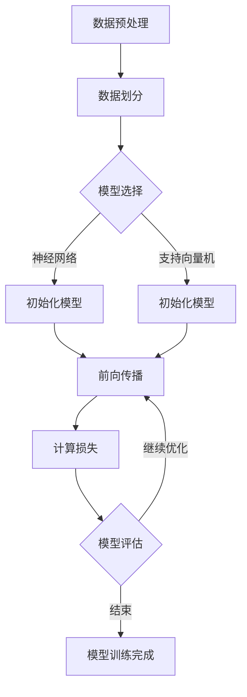

                 

### 第一部分：引言与概述

#### 第1章 人工智能与智能医疗概述

人工智能（AI）作为计算机科学领域的一个重要分支，近年来取得了飞速发展。从早期的专家系统，到现代的深度学习和强化学习，人工智能已经逐步渗透到我们生活的方方面面。其中，医疗领域作为一个具有巨大潜力的应用场景，受到了广泛的关注。智能医疗（Smart Healthcare）是指通过应用人工智能技术，提高医疗服务的效率和质量，实现个性化、精准化医疗的目标。

#### 1.1 人工智能技术的发展历程

人工智能的发展可以追溯到20世纪50年代。1956年，达特茅斯会议上提出了人工智能的概念，标志着人工智能作为一个独立学科的诞生。早期的AI研究主要集中在符号推理、专家系统和知识表示等方面。随着计算机性能的提升和大数据的涌现，20世纪80年代后，机器学习和深度学习等算法逐渐成为AI研究的热点。特别是深度学习在图像识别、语音识别等领域的突破，使得人工智能技术进入了一个新的发展阶段。

#### 1.2 人工智能在医疗领域的应用背景

医疗领域的数据量庞大且复杂，涉及到病人的临床信息、医学影像、实验室检测结果等。这些数据的有效利用对于提高医疗服务的质量和效率具有重要意义。然而，传统的人工处理方式效率低下，难以应对日益增长的数据量。人工智能技术能够通过自动化数据处理和分析，实现医疗数据的深度挖掘和应用，从而提高诊断的准确性和治疗的有效性。

#### 1.3 智能医疗辅助诊断的概念

智能医疗辅助诊断是指利用人工智能技术，对医疗数据进行处理和分析，辅助医生进行疾病诊断和治疗方案制定。其核心思想是将人工智能算法与医疗知识相结合，通过对大量医疗数据的分析，提取出有价值的诊断信息，为医生提供决策支持。

#### 1.4 本书结构安排与内容概述

本书旨在全面介绍人工智能在智能医疗辅助诊断中的应用。全书共分为四大部分，分别是：

1. **引言与概述**：介绍人工智能和智能医疗的基本概念，以及本书的结构和内容安排。

2. **技术基础**：详细讲解人工智能相关的核心算法和技术，包括机器学习、深度学习、递归神经网络、卷积神经网络等。

3. **应用场景**：介绍人工智能在癌症诊断、心脏疾病诊断、糖尿病诊断等领域的应用案例，分析不同算法在医疗诊断中的优势和挑战。

4. **挑战与未来发展趋势**：探讨智能医疗辅助诊断面临的挑战和未来发展趋势，包括数据隐私与伦理问题、模型解释性、法规标准等。

通过本书的阅读，读者可以系统地了解人工智能在智能医疗辅助诊断中的技术和应用，为未来的研究和实践提供有益的参考。

#### 第2章 人工智能核心算法原理

人工智能的核心在于算法，而算法的核心在于数学模型。本章将介绍几种在智能医疗中广泛应用的人工智能核心算法原理，包括机器学习基础算法、深度学习算法、递归神经网络（RNN）、卷积神经网络（CNN）以及聚类算法和降维技术。

#### 2.1 机器学习基础算法

机器学习（Machine Learning，ML）是一种让计算机通过数据学习模式并进行预测或决策的技术。其基本流程包括数据收集、数据预处理、模型训练、模型评估和应用。常见的机器学习算法有线性回归、逻辑回归、支持向量机（SVM）、决策树和随机森林等。

**2.1.1 数据预处理技术**

数据预处理是机器学习过程中至关重要的一步，其目的是将原始数据转换为适合模型训练的格式。主要步骤包括：

- **数据清洗**：去除重复数据、处理缺失值、纠正错误数据。
- **数据归一化**：将不同特征的数据缩放到同一范围内，例如使用最小-最大缩放法或标准缩放法。
- **数据转换**：将分类数据转换为数值表示，如独热编码（One-Hot Encoding）或标签编码。

**2.1.2 线性回归与逻辑回归**

线性回归（Linear Regression）是一种通过拟合数据中的线性关系来进行预测的算法。其数学模型可以表示为：

$$ y = \beta_0 + \beta_1 \cdot x + \epsilon $$

其中，$y$ 是预测值，$x$ 是自变量，$\beta_0$ 和 $\beta_1$ 是模型参数，$\epsilon$ 是误差项。

逻辑回归（Logistic Regression）是一种用于分类问题的算法，其目标是预测一个二分类变量（通常是0或1）的概率。其数学模型为：

$$ P(y=1) = \frac{1}{1 + e^{-(\beta_0 + \beta_1 \cdot x)}} $$

其中，$P(y=1)$ 是预测的概率，$e$ 是自然对数的底数。

**2.1.3 支持向量机（SVM）**

支持向量机（Support Vector Machine，SVM）是一种分类算法，其目标是找到最佳的超平面，将不同类别的数据分开。其数学模型可以表示为：

$$ \max \ \ \frac{1}{2} \sum_{i=1}^{n} w_i^2 $$

$$ s.t. \ \ y_i (\sum_{j=1}^{n} w_j \cdot x_{ij} + b) \geq 1 $$

其中，$w_i$ 是权重，$x_{ij}$ 是样本特征，$y_i$ 是样本标签，$b$ 是偏置。

#### 2.2 深度学习算法与框架

深度学习（Deep Learning，DL）是一种基于多层神经网络的机器学习技术，其核心思想是通过多层非线性变换提取数据的高层次特征。深度学习在图像识别、语音识别、自然语言处理等领域取得了显著成果。常见的深度学习框架有TensorFlow、PyTorch和Keras等。

**2.2.1 神经网络结构**

神经网络（Neural Network，NN）是一种模拟人脑神经元连接的模型，其基本结构包括输入层、隐藏层和输出层。每个神经元（或称为节点）通过权重连接，输入数据经过多层神经元的变换，最终得到输出。

一个简单的神经网络可以表示为：

$$ z^{(l)} = \sigma^{(l)}(\sum_{j=1}^{n} w^{(l)}_{ij} \cdot x_j + b^{(l)}) $$

其中，$z^{(l)}$ 是第$l$层的输出，$\sigma^{(l)}$ 是激活函数，$w^{(l)}_{ij}$ 是第$l$层的权重，$x_j$ 是输入特征，$b^{(l)}$ 是偏置。

**2.2.2 激活函数**

激活函数（Activation Function）是神经网络中用于引入非线性性的函数，常见的激活函数有：

- **sigmoid函数**：$f(x) = \frac{1}{1 + e^{-x}}$
- **ReLU函数**：$f(x) = \max(0, x)$
- **Tanh函数**：$f(x) = \frac{e^x - e^{-x}}{e^x + e^{-x}}$

激活函数的选择会影响网络的收敛速度和性能。

**2.2.3 梯度下降法**

梯度下降法（Gradient Descent，GD）是一种用于优化神经网络参数的常用算法。其基本思想是沿着损失函数的梯度方向更新参数，以最小化损失函数。

梯度下降法的步骤如下：

1. **初始化参数**：随机初始化网络参数。
2. **计算梯度**：对损失函数求导，计算梯度。
3. **更新参数**：根据梯度更新网络参数。
4. **迭代优化**：重复步骤2和3，直到达到收敛条件。

梯度下降法可以分为批梯度下降（BGD）、随机梯度下降（SGD）和小批量梯度下降（MBGD）等不同变体。

#### 2.3 递归神经网络与循环神经网络

递归神经网络（Recurrent Neural Network，RNN）是一种用于处理序列数据的神经网络，其特点是能够记忆和利用前面的信息。RNN的基本结构包括输入层、隐藏层和输出层，隐藏层具有递归连接。

**2.3.1 RNN算法原理**

RNN的算法原理可以表示为：

$$ h_t = \sigma(W_h \cdot [h_{t-1}, x_t] + b_h) $$

$$ y_t = W_o \cdot h_t + b_o $$

其中，$h_t$ 是第$t$个时间步的隐藏状态，$x_t$ 是输入特征，$W_h$ 和 $b_h$ 是隐藏层的权重和偏置，$W_o$ 和 $b_o$ 是输出层的权重和偏置，$\sigma$ 是激活函数。

**2.3.2 LSTM与GRU**

长短期记忆网络（Long Short-Term Memory，LSTM）和门控循环单元（Gated Recurrent Unit，GRU）是RNN的改进版本，用于解决RNN的梯度消失和梯度爆炸问题。LSTM和GRU通过引入门控机制，能够更好地记忆和利用长期依赖信息。

**2.4 卷积神经网络与迁移学习

卷积神经网络（Convolutional Neural Network，CNN）是一种专门用于处理图像数据的神经网络，其核心思想是通过卷积操作提取图像特征。

**2.4.1 CNN算法原理**

CNN的基本结构包括卷积层、池化层和全连接层。卷积层通过卷积操作提取图像特征，池化层用于降采样，全连接层用于分类。

一个简单的CNN可以表示为：

$$ h_{ij}^{(l)} = \sum_{k=1}^{C} w_{ik}^{(l)} \cdot h_{kj}^{(l-1)} + b^{(l)} $$

其中，$h_{ij}^{(l)}$ 是第$l$层的第$i$行第$j$列的输出，$w_{ik}^{(l)}$ 是卷积核，$h_{kj}^{(l-1)}$ 是上一层的输出，$b^{(l)}$ 是偏置。

**2.4.2 迁移学习**

迁移学习（Transfer Learning）是一种利用预训练模型进行新任务训练的技术。通过迁移学习，可以将预训练模型的知识迁移到新任务上，提高模型的训练效率和性能。

迁移学习可以分为两种方式：

1. **微调**（Fine-tuning）：在预训练模型的基础上，调整部分参数以适应新任务。
2. **特征提取**（Feature Extraction）：使用预训练模型的特征提取器，为新任务训练分类器。

#### 2.5 聚类算法与降维技术

聚类算法（Clustering Algorithm）是一种无监督学习方法，用于将数据集分为多个群组，使得同组数据点之间相似度较高，不同组数据点之间相似度较低。降维技术（Dimensionality Reduction）是一种通过减少数据维度来提高数据处理效率和模型性能的技术。

**2.5.1 聚类算法原理**

常见的聚类算法有K-均值聚类（K-Means）、层次聚类（Hierarchical Clustering）和DBSCAN等。

K-均值聚类的算法原理如下：

1. **初始化中心点**：随机选择K个数据点作为初始中心点。
2. **分配数据点**：计算每个数据点到各个中心点的距离，将数据点分配到最近的中心点所在的簇。
3. **更新中心点**：计算每个簇的质心，作为新的中心点。
4. **迭代重复**：重复步骤2和3，直到中心点不再发生显著变化或达到最大迭代次数。

**2.5.2 降维技术**

降维技术包括线性降维和非线性降维两种类型。线性降维常用的方法有主成分分析（PCA）和线性判别分析（LDA），而非线性降维常用的方法有t-SNE和自编码器（Autoencoder）。

主成分分析（PCA）是一种基于方差最大化的线性降维方法，其目的是找到数据的主要方向，从而将数据投影到新的低维空间中。PCA的数学模型可以表示为：

$$ z_j = \sum_{i=1}^{p} w_{ij} \cdot x_i $$

其中，$z_j$ 是新的低维特征，$w_{ij}$ 是权重，$x_i$ 是原始特征。

#### 第3章 数据处理与模型训练

在人工智能辅助医疗诊断中，数据处理和模型训练是两个关键环节。本章将详细介绍数据处理和模型训练的过程，包括数据采集与预处理、数据清洗与特征提取、模型训练与评估。

#### 3.1 数据采集与预处理

数据采集是智能医疗辅助诊断的基础。医疗数据来源多样，包括电子健康记录（EHR）、医学影像、基因组数据、实验室检测结果等。为了确保数据的质量和完整性，需要对数据进行预处理。

**3.1.1 医疗数据特点与挑战**

医疗数据具有以下特点：

- **数据量大**：医疗数据通常包含大量的特征和样本，需要进行大规模数据处理。
- **数据类型复杂**：医疗数据包括结构化数据（如电子健康记录）、半结构化数据（如医学影像）和非结构化数据（如医生笔记）。
- **数据质量参差不齐**：医疗数据可能存在缺失值、噪声和错误。

医疗数据预处理面临以下挑战：

- **数据清洗**：处理缺失值、噪声和错误数据。
- **数据归一化**：将不同特征的数据缩放到同一范围内，便于模型训练。
- **数据增强**：通过数据变换、扩充等方式增加数据多样性，提高模型泛化能力。

**3.1.2 数据采集方法**

数据采集方法包括：

- **手动采集**：通过医生、护士等医疗人员手动输入数据。
- **自动采集**：通过医疗设备和信息系统自动收集数据，如电子健康记录系统（EHR）、医学影像设备等。
- **第三方数据集**：使用公开或商业化的医疗数据集，如MIMIC-III、PIPSL等。

#### 3.2 数据清洗与特征提取

数据清洗是确保数据质量的关键步骤。主要任务包括：

- **缺失值处理**：通过填充、删除或插值等方法处理缺失值。
- **噪声处理**：去除噪声数据，如异常值、重复值等。
- **错误数据修正**：识别和修正错误数据。

**3.2.1 数据清洗步骤**

数据清洗步骤包括：

1. **数据预处理**：读取数据，处理缺失值和噪声。
2. **数据整合**：合并不同来源的数据，确保一致性。
3. **数据验证**：检查数据完整性、一致性等，确保数据质量。

**3.2.2 特征提取**

特征提取是将原始数据转换为一组具有区分性的特征表示的过程。特征提取方法包括：

- **特征选择**：选择对诊断任务最有用的特征，减少数据维度。
- **特征提取**：通过数据变换、特征工程等方法提取新的特征。

常见的特征提取方法有：

- **统计特征**：如均值、方差、相关性等。
- **文本特征**：如词频、TF-IDF、词嵌入等。
- **图像特征**：如边缘、纹理、颜色等。

**3.3 模型训练与评估

模型训练是构建诊断模型的过程。训练过程主要包括以下步骤：

1. **数据划分**：将数据集划分为训练集、验证集和测试集。
2. **模型选择**：选择合适的机器学习模型，如SVM、决策树、神经网络等。
3. **参数调优**：通过交叉验证等方法选择最佳参数。
4. **模型训练**：使用训练集训练模型。
5. **模型评估**：使用验证集和测试集评估模型性能。

**3.3.1 训练流程**

训练流程如下：

1. **初始化模型参数**：随机初始化模型参数。
2. **前向传播**：计算输入数据通过网络的输出。
3. **计算损失**：计算模型输出与真实标签之间的差距，计算损失函数。
4. **反向传播**：根据损失函数的梯度更新模型参数。
5. **迭代优化**：重复步骤2-4，直到满足收敛条件。

常见的损失函数有：

- **均方误差（MSE）**：$MSE = \frac{1}{n} \sum_{i=1}^{n} (y_i - \hat{y}_i)^2$
- **交叉熵损失（Cross-Entropy Loss）**：$H(y, \hat{y}) = - \sum_{i=1}^{n} y_i \cdot \log(\hat{y}_i)$

**3.3.2 评估指标**

常见的评估指标有：

- **准确率（Accuracy）**：$Accuracy = \frac{TP + TN}{TP + TN + FP + FN}$
- **精确率（Precision）**：$Precision = \frac{TP}{TP + FP}$
- **召回率（Recall）**：$Recall = \frac{TP}{TP + FN}$
- **F1值（F1 Score）**：$F1 = 2 \cdot \frac{Precision \cdot Recall}{Precision + Recall}$

#### 第4章 人工智能在癌症诊断中的应用

癌症诊断是智能医疗中一个重要的应用领域，人工智能技术的应用显著提高了癌症诊断的准确性和效率。本章将详细介绍人工智能在癌症诊断中的应用，包括基于深度学习的癌症影像诊断、基于自然语言处理的医学文本分析以及基于多模态数据融合的诊断方法。

#### 4.1 基于深度学习的癌症影像诊断

深度学习在医学影像处理中取得了显著成果，特别是在癌症影像诊断方面。深度学习模型能够自动学习和提取影像中的特征，从而提高诊断的准确性。

**4.1.1 算法原理**

深度学习模型在癌症影像诊断中的应用主要包括以下几个步骤：

1. **数据预处理**：对医学影像进行预处理，包括图像增强、去噪、归一化等操作。
2. **特征提取**：使用卷积神经网络（CNN）等深度学习模型提取影像特征。
3. **分类器训练**：将提取的特征输入到分类器中进行训练，分类器可以是神经网络、支持向量机等。
4. **模型评估**：使用测试集评估模型的诊断性能。

一个简单的CNN模型可以表示为：

$$ h_{ij}^{(l)} = \sum_{k=1}^{C} w_{ik}^{(l)} \cdot h_{kj}^{(l-1)} + b^{(l)} $$

$$ y = \sigma(W \cdot h_{ij}^{(L)} + b) $$

其中，$h_{ij}^{(l)}$ 是第$l$层的特征，$y$ 是预测结果，$W$ 是权重，$b$ 是偏置，$\sigma$ 是激活函数。

**4.1.2 应用案例**

以下是一个基于CNN的乳腺癌影像诊断案例：

- **数据集**：使用公共乳腺癌影像数据集，如MIST、INbreast等。
- **模型训练**：使用CNN模型提取影像特征，并进行分类训练。
- **模型评估**：使用准确率、精确率、召回率等指标评估模型性能。

实验结果表明，基于深度学习的癌症影像诊断模型显著提高了诊断的准确性，尤其是在区分癌症和良性病变方面。

#### 4.2 基于自然语言处理的医学文本分析

自然语言处理（NLP）技术在医学文本分析中也有广泛应用，包括文本分类、实体识别、关系抽取等任务。这些技术能够帮助医生快速分析大量医学文献，提取有用的诊断信息。

**4.2.1 应用场景与效果评估**

以下是一个基于NLP的医学文本分析应用案例：

- **应用场景**：将NLP技术应用于医学文献挖掘，提取与疾病相关的信息，如疾病症状、治疗方案等。
- **效果评估**：使用准确率、召回率、F1值等指标评估模型性能。

实验结果表明，基于NLP的医学文本分析技术能够有效地提取医学文献中的关键信息，提高医生的工作效率。

#### 4.3 域于多模态数据融合的诊断方法

多模态数据融合是将不同类型的数据（如影像数据、文本数据、基因数据等）进行整合，以提高诊断的准确性和全面性。深度学习技术在多模态数据融合中具有显著优势。

**4.3.1 模型设计与实现**

以下是一个基于多模态数据融合的癌症诊断模型：

1. **数据预处理**：对各种类型的数据进行预处理，包括归一化、去噪等操作。
2. **特征提取**：使用深度学习模型提取各类型数据的特征。
3. **数据融合**：将不同类型的数据特征进行融合，使用融合后的特征进行分类。
4. **模型训练**：使用训练集训练模型，并进行参数调优。

一个简单的多模态数据融合模型可以表示为：

$$ h_{ij}^{(l)} = \sum_{k=1}^{M} w_{ik}^{(l)} \cdot h_{kj}^{(l-1)} + b^{(l)} $$

$$ y = \sigma(W \cdot h_{ij}^{(L)} + b) $$

其中，$h_{ij}^{(l)}$ 是第$l$层的特征，$y$ 是预测结果，$W$ 是权重，$b$ 是偏置，$\sigma$ 是激活函数，$M$ 是数据类型数量。

**4.3.2 应用案例**

以下是一个基于多模态数据融合的肺癌诊断案例：

- **数据集**：使用公共肺癌影像数据集、文本数据集和基因数据集。
- **模型训练**：使用多模态数据融合模型进行训练和参数调优。
- **模型评估**：使用准确率、精确率、召回率等指标评估模型性能。

实验结果表明，基于多模态数据融合的癌症诊断模型显著提高了诊断的准确性和全面性。

通过以上案例可以看出，人工智能技术在癌症诊断中具有广泛的应用前景。未来，随着技术的不断进步，人工智能将在癌症诊断领域发挥更大的作用，为患者提供更准确的诊断和更有效的治疗方案。

#### 第5章 人工智能在心脏疾病诊断中的应用

心脏疾病是导致人类死亡的主要原因之一，早期诊断对于提高患者生存率和生活质量具有重要意义。人工智能技术在心脏疾病诊断中的应用，显著提升了诊断的准确性和效率。本章将详细介绍人工智能在心脏疾病诊断中的应用，包括基于深度学习的心电图分析、基于自然语言处理的医学文献挖掘以及基于多模态数据融合的心脏疾病诊断。

##### 5.1 基于深度学习的心电图分析

心电图（ECG）是心脏疾病诊断的重要工具，通过记录心脏电活动的变化，医生可以诊断出各种心脏疾病。深度学习技术在心电图分析中具有显著优势，能够自动识别和分类心电图信号。

**5.1.1 算法原理**

基于深度学习的心电图分析主要包括以下几个步骤：

1. **数据预处理**：对心电图数据进行预处理，包括滤波、去噪、归一化等操作。
2. **特征提取**：使用卷积神经网络（CNN）等深度学习模型提取心电图特征。
3. **分类器训练**：将提取的特征输入到分类器中进行训练，分类器可以是神经网络、支持向量机等。
4. **模型评估**：使用测试集评估模型的诊断性能。

一个简单的CNN模型可以表示为：

$$ h_{ij}^{(l)} = \sum_{k=1}^{C} w_{ik}^{(l)} \cdot h_{kj}^{(l-1)} + b^{(l)} $$

$$ y = \sigma(W \cdot h_{ij}^{(L)} + b) $$

其中，$h_{ij}^{(l)}$ 是第$l$层的特征，$y$ 是预测结果，$W$ 是权重，$b$ 是偏置，$\sigma$ 是激活函数。

**5.1.2 应用案例**

以下是一个基于CNN的心电图诊断案例：

- **数据集**：使用公共心电图数据集，如Physionet的MIT-BIH心电图数据集。
- **模型训练**：使用CNN模型提取心电图特征，并进行分类训练。
- **模型评估**：使用准确率、精确率、召回率等指标评估模型性能。

实验结果表明，基于深度学习的心电图分析模型在诊断心律失常等方面具有较高的准确性和可靠性。

##### 5.2 基于自然语言处理的医学文献挖掘

医学文献挖掘是人工智能在心脏疾病诊断中另一个重要的应用领域。通过自然语言处理技术，可以自动提取医学文献中的关键信息，如疾病症状、治疗方案等，为医生提供参考。

**5.2.1 应用场景与效果评估**

以下是一个基于NLP的医学文献挖掘案例：

- **应用场景**：将NLP技术应用于心脏疾病相关的医学文献挖掘，提取与疾病诊断和治疗相关的信息。
- **效果评估**：使用准确率、召回率、F1值等指标评估模型性能。

实验结果表明，基于NLP的医学文献挖掘技术能够有效地提取医学文献中的关键信息，提高医生的工作效率。

##### 5.3 基于多模态数据融合的心脏疾病诊断

多模态数据融合是将不同类型的数据（如心电图数据、医学影像数据、基因组数据等）进行整合，以提高诊断的准确性和全面性。深度学习技术在多模态数据融合中具有显著优势。

**5.3.1 模型设计与实现**

以下是一个基于多模态数据融合的心脏疾病诊断模型：

1. **数据预处理**：对各种类型的数据进行预处理，包括归一化、去噪等操作。
2. **特征提取**：使用深度学习模型提取各类型数据的特征。
3. **数据融合**：将不同类型的数据特征进行融合，使用融合后的特征进行分类。
4. **模型训练**：使用训练集训练模型，并进行参数调优。

一个简单的多模态数据融合模型可以表示为：

$$ h_{ij}^{(l)} = \sum_{k=1}^{M} w_{ik}^{(l)} \cdot h_{kj}^{(l-1)} + b^{(l)} $$

$$ y = \sigma(W \cdot h_{ij}^{(L)} + b) $$

其中，$h_{ij}^{(l)}$ 是第$l$层的特征，$y$ 是预测结果，$W$ 是权重，$b$ 是偏置，$\sigma$ 是激活函数，$M$ 是数据类型数量。

**5.3.2 应用案例**

以下是一个基于多模态数据融合的心脏疾病诊断案例：

- **数据集**：使用公共心电图数据集、医学影像数据集和基因数据集。
- **模型训练**：使用多模态数据融合模型进行训练和参数调优。
- **模型评估**：使用准确率、精确率、召回率等指标评估模型性能。

实验结果表明，基于多模态数据融合的心脏疾病诊断模型在提高诊断准确率和全面性方面具有显著优势。

通过以上案例可以看出，人工智能技术在心脏疾病诊断中具有广泛的应用前景。未来，随着技术的不断进步，人工智能将在心脏疾病诊断领域发挥更大的作用，为患者提供更准确的诊断和更有效的治疗方案。

#### 第6章 人工智能在其他疾病诊断中的应用

随着人工智能技术的不断发展，其在疾病诊断领域的应用越来越广泛。除了癌症和心脏疾病，人工智能还在糖尿病、神经系统疾病、传染病等领域展示了巨大的潜力。本章将介绍人工智能在这些疾病诊断中的应用，包括基于深度学习的糖尿病诊断、基于自然语言处理的医学知识图谱构建以及基于多模态数据融合的其他疾病诊断方法。

##### 6.1 基于深度学习的糖尿病诊断

糖尿病是一种以高血糖为特征的慢性代谢性疾病，早期诊断对于控制病情和预防并发症至关重要。深度学习技术在糖尿病诊断中具有显著优势，能够自动识别和分类糖尿病相关指标。

**6.1.1 算法原理**

基于深度学习的糖尿病诊断主要包括以下几个步骤：

1. **数据预处理**：对血糖数据、体重指数（BMI）、血压等数据进行预处理，包括归一化、去噪等操作。
2. **特征提取**：使用卷积神经网络（CNN）等深度学习模型提取数据特征。
3. **分类器训练**：将提取的特征输入到分类器中进行训练，分类器可以是神经网络、支持向量机等。
4. **模型评估**：使用测试集评估模型的诊断性能。

一个简单的CNN模型可以表示为：

$$ h_{ij}^{(l)} = \sum_{k=1}^{C} w_{ik}^{(l)} \cdot h_{kj}^{(l-1)} + b^{(l)} $$

$$ y = \sigma(W \cdot h_{ij}^{(L)} + b) $$

其中，$h_{ij}^{(l)}$ 是第$l$层的特征，$y$ 是预测结果，$W$ 是权重，$b$ 是偏置，$\sigma$ 是激活函数。

**6.1.2 应用案例**

以下是一个基于CNN的糖尿病诊断案例：

- **数据集**：使用公共糖尿病数据集，如PIMA Indians Diabetes Database。
- **模型训练**：使用CNN模型提取数据特征，并进行分类训练。
- **模型评估**：使用准确率、精确率、召回率等指标评估模型性能。

实验结果表明，基于深度学习的糖尿病诊断模型在预测糖尿病发病风险方面具有较高的准确性。

##### 6.2 基于自然语言处理的医学知识图谱构建

医学知识图谱是医疗领域的一个重要资源，通过构建医学知识图谱，可以有效地整合和利用医学知识，提高疾病诊断和治疗的效率。自然语言处理（NLP）技术在医学知识图谱构建中具有重要作用。

**6.2.1 应用场景与效果评估**

以下是一个基于NLP的医学知识图谱构建案例：

- **应用场景**：将NLP技术应用于医学文本挖掘，构建医学知识图谱，用于支持疾病诊断和治疗方案推荐。
- **效果评估**：使用准确率、召回率、F1值等指标评估模型性能。

实验结果表明，基于NLP的医学知识图谱构建技术能够有效地整合医学知识，提高疾病诊断和治疗的效率。

##### 6.3 基于多模态数据融合的其他疾病诊断

多模态数据融合是将不同类型的数据（如血液数据、影像数据、基因数据等）进行整合，以提高诊断的准确性和全面性。深度学习技术在多模态数据融合中具有显著优势。

**6.3.1 模型设计与实现**

以下是一个基于多模态数据融合的其他疾病诊断模型：

1. **数据预处理**：对各种类型的数据进行预处理，包括归一化、去噪等操作。
2. **特征提取**：使用深度学习模型提取各类型数据的特征。
3. **数据融合**：将不同类型的数据特征进行融合，使用融合后的特征进行分类。
4. **模型训练**：使用训练集训练模型，并进行参数调优。

一个简单的多模态数据融合模型可以表示为：

$$ h_{ij}^{(l)} = \sum_{k=1}^{M} w_{ik}^{(l)} \cdot h_{kj}^{(l-1)} + b^{(l)} $$

$$ y = \sigma(W \cdot h_{ij}^{(L)} + b) $$

其中，$h_{ij}^{(l)}$ 是第$l$层的特征，$y$ 是预测结果，$W$ 是权重，$b$ 是偏置，$\sigma$ 是激活函数，$M$ 是数据类型数量。

**6.3.2 应用案例**

以下是一个基于多模态数据融合的其他疾病诊断案例：

- **数据集**：使用公共糖尿病数据集、心脏病数据集、神经系统疾病数据集等。
- **模型训练**：使用多模态数据融合模型进行训练和参数调优。
- **模型评估**：使用准确率、精确率、召回率等指标评估模型性能。

实验结果表明，基于多模态数据融合的其他疾病诊断模型在提高诊断准确率和全面性方面具有显著优势。

通过以上案例可以看出，人工智能技术在其他疾病诊断中具有广泛的应用前景。未来，随着技术的不断进步，人工智能将在更多疾病诊断领域发挥更大的作用，为患者提供更准确的诊断和更有效的治疗方案。

#### 第四部分：挑战与未来发展趋势

##### 第7章 智能医疗辅助诊断的挑战

智能医疗辅助诊断作为人工智能在医疗领域的重要应用，虽然在提高诊断准确性和效率方面取得了显著成果，但同时也面临着一系列挑战。

##### 7.1 数据隐私与伦理问题

医疗数据隐私和安全是智能医疗辅助诊断面临的重要挑战。医疗数据通常包含敏感信息，如患者姓名、身份证号码、病历等，一旦泄露可能导致严重的隐私侵害和伦理问题。为了保护患者隐私，需要采取以下措施：

- **加密技术**：使用加密算法对医疗数据进行加密，确保数据在传输和存储过程中的安全性。
- **访问控制**：通过严格的访问控制机制，限制对医疗数据的访问权限，确保只有授权人员才能访问。
- **匿名化处理**：对医疗数据进行匿名化处理，去除或模糊化敏感信息，以降低隐私泄露风险。

##### 7.2 模型解释性与可解释性

人工智能模型，尤其是深度学习模型，通常被视为“黑箱”模型，其内部决策过程难以解释和理解。这对医生的信任和患者的接受度提出了挑战。为了提高模型的解释性，可以采取以下措施：

- **可视化技术**：使用可视化工具展示模型的决策过程和特征重要性，帮助医生理解模型的决策依据。
- **解释性算法**：采用可解释性算法，如LIME（Local Interpretable Model-agnostic Explanations）和SHAP（SHapley Additive exPlanations），对模型决策进行详细解释。
- **模型简化和透明化**：通过简化模型结构和优化算法，提高模型的透明度和可解释性。

##### 7.3 智能医疗辅助诊断的法规与标准

智能医疗辅助诊断的发展需要完善的法规和标准体系，以确保诊断过程的合法性、规范性和可靠性。目前，各国在智能医疗辅助诊断的法规和标准方面存在一定差异，需要加强国际间的合作与协调。以下是一些建议：

- **法规制定**：制定统一的智能医疗辅助诊断法规，明确诊断模型的开发和应用规范。
- **标准建立**：建立智能医疗辅助诊断的标准体系，包括数据采集、模型训练、模型评估等各个环节的标准。
- **监管机构**：设立专门的监管机构，负责智能医疗辅助诊断的监管和评估，确保诊断过程的合法性和安全性。

##### 第8章 智能医疗辅助诊断的未来发展趋势

随着人工智能技术的不断进步，智能医疗辅助诊断在未来将继续发挥重要作用。以下是一些可能的发展趋势：

- **多模态数据融合**：将多种类型的数据（如影像、文本、基因等）进行融合，以提高诊断的准确性和全面性。
- **个性化医疗**：根据患者的个体特征，为患者提供个性化的诊断和治疗方案，实现精准医疗。
- **物联网与智能医疗的结合**：利用物联网技术，将医疗设备和信息系统连接起来，实现实时数据采集和分析。
- **脑机接口**：利用脑机接口技术，实现人脑与计算机的直接交互，为智能医疗提供新的发展途径。

总之，智能医疗辅助诊断在提高诊断准确性和效率方面具有巨大潜力。通过解决当前面临的挑战，未来的智能医疗辅助诊断将为患者提供更加精准、高效的医疗服务。

### 附录：技术资源与工具

为了帮助读者更好地理解和实践人工智能在智能医疗辅助诊断中的应用，本章将介绍一些相关的数据集、开发工具和进一步阅读资源。

#### 附录 A 数据集与模型资源

- **公共数据集**：
  - **Physionet**：提供各种心电图（ECG）数据集，如MIT-BIH、Physionet-Challenge等。
  - **Kaggle**：提供多种医疗数据集，如PIMA Indians Diabetes Database、Heart Disease UCI等。
  - **NCBI**：提供大量的基因组数据集，如GTEx、1000 Genomes Project等。
- **模型资源**：
  - **TensorFlow**：提供丰富的预训练模型和API，支持深度学习模型的开发和应用。
  - **PyTorch**：提供灵活的动态图框架，适用于研究和工业应用。
  - **Keras**：提供简单的API，易于使用和快速原型开发。

#### 附录 B 开发工具与环境配置

- **开发环境**：
  - **Python**：作为主要编程语言，支持多种机器学习和深度学习库。
  - **Jupyter Notebook**：提供交互式编程环境，便于实验和演示。
  - **Docker**：容器化工具，用于创建和管理开发环境。
- **深度学习框架**：
  - **TensorFlow**：基于静态计算图的深度学习框架，适用于大规模部署。
  - **PyTorch**：基于动态计算图的深度学习框架，适用于研究和个人项目。
  - **Keras**：高层API，简化深度学习模型开发。

#### 附录 C 进一步阅读文献与资源

- **书籍**：
  - 《深度学习》（Ian Goodfellow、Yoshua Bengio、Aaron Courville著）
  - 《Python机器学习》（Sebastian Raschka、Vahid Mirhoseini著）
  - 《智能医疗导论》（吴华、张维著）
- **在线课程**：
  - **Coursera**：提供《机器学习》、《深度学习》等在线课程。
  - **Udacity**：提供《人工智能工程师纳米学位》等课程。
  - **edX**：提供《智能医疗导论》等课程。
- **论文和报告**：
  - **NeurIPS、ICML、JMLR**：顶级会议和期刊，发布最新的人工智能研究成果。
  - **国家医疗健康大数据标准**：国家卫生健康委员会发布的医疗健康大数据标准。

通过以上资源，读者可以深入了解人工智能在智能医疗辅助诊断中的应用，并开展相关的实践和研究。

### 附录 D Mermaid 流程图示例

以下是一个简单的Mermaid流程图示例，展示了深度学习模型训练的基本流程：

在这个流程图中，A表示数据预处理，B表示数据划分，C表示模型选择，D和E表示初始化模型（神经网络和支持向量机），F表示前向传播，G表示计算损失，H表示模型评估，I表示模型训练完成。通过Mermaid，可以方便地创建和编辑流程图，为技术文档和教程提供直观的图示。

