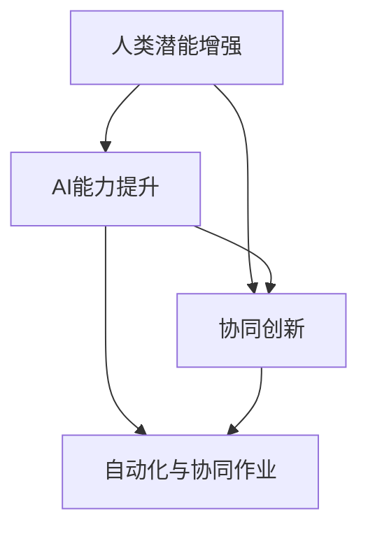
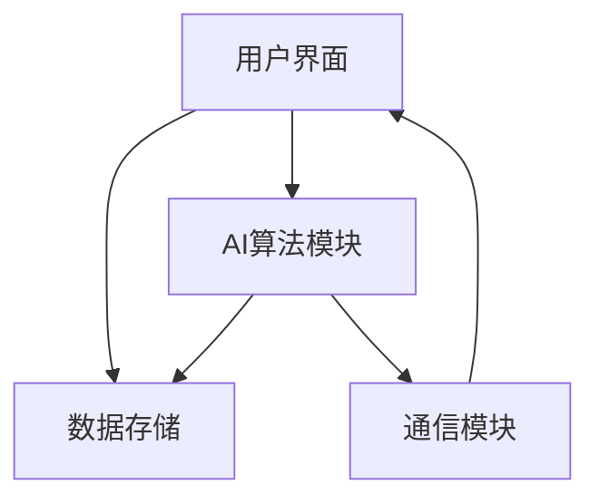

                 

# 人类-AI协作：增强人类潜能与AI能力的融合发展前景

> 关键词：人类-AI协作、潜能增强、AI能力提升、协同创新、应用领域、未来展望

> 摘要：
本文探讨了人类与人工智能（AI）协作的原理、方法、应用及其未来发展。通过分析AI在增强人类潜能方面的作用，以及人类潜能增强策略，本文展示了人类与AI协作的核心算法、技术原理和具体应用案例。同时，对人类与AI协作的未来趋势进行了展望，包括技术发展、社会影响和伦理问题。

### 目录大纲设计

在撰写本文之前，我们需要设计一个详细的目录大纲，以确保文章的逻辑性和完整性。本文的目录大纲分为四大部分：引言与概述、核心技术详解、应用案例与实践以及展望与未来。以下是具体的目录结构：

#### 第一部分：引言与概述

- **第1章 人类与AI协作的概念与重要性**
  - **1.1 人类与AI协作的定义**
  - **1.2 AI在增强人类潜能中的作用**
  - **1.3 人类与AI协作的潜在价值**

- **第2章 AI技术基础**
  - **2.1 机器学习原理**
  - **2.2 深度学习架构**
  - **2.3 强化学习与决策模型**

- **第3章 人类潜能的增强方法**
  - **3.1 认知能力的提升**
  - **3.2 创造力的激发**
  - **3.3 学习效率的提高**

- **第4章 AI能力的提升路径**
  - **4.1 智能交互与理解**
  - **4.2 高级决策能力**
  - **4.3 自动化与协同作业**

#### 第二部分：核心技术详解

- **第5章 人类与AI协同创新**
  - **5.1 协同工作流程设计**
  - **5.2 创新思维模式融合**
  - **5.3 协同创新案例分析**

- **第6章 人类与AI协作的应用领域**
  - **6.1 教育与培训**
  - **6.2 医疗与健康**
  - **6.3 生产与制造**

#### 第三部分：应用案例与实践

- **第7章 人类-AI协作在服务业的应用**
  - **7.1 客户服务自动化**
  - **7.2 个性化服务推荐**
  - **7.3 业务流程优化**

#### 第四部分：展望与未来

- **第8章 人类-AI协作的伦理与社会影响**
  - **8.1 伦理挑战与规范**
  - **8.2 社会接受度与信任**
  - **8.3 道德责任与责任划分**

- **第9章 AI技术的发展趋势**
  - **9.1 AI硬件与算法创新**
  - **9.2 大数据与云计算**
  - **9.3 量子计算与AI结合**

- **第10章 未来合作模式与展望**
  - **10.1 纵向与横向协作**
  - **10.2 人机共生模式**
  - **10.3 智能社会的建设**

### 核心概念与联系

为了更好地理解人类与AI协作的原理，我们可以设计一个核心概念与联系的Mermaid流程图：



在这个流程图中，A表示人类潜能增强，B表示AI能力提升，C表示协同创新，D表示自动化与协同作业。这些核心概念相互联系，共同构成了人类与AI协作的理论框架。

### 核心算法原理讲解

在本文中，我们将详细讲解三个核心算法原理：机器学习、深度学习和强化学习。以下是这些算法的伪代码和详细解释：

#### 机器学习算法

```python
# 伪代码：机器学习算法
function MachineLearning(data, model):
  InitializeModel(model)
  for each iteration:
    ComputeGradient(data, model)
    UpdateModelParameters(model, gradient)
  return model
```

**详细解释**：机器学习算法通过迭代优化模型参数，以适应给定的数据集。该过程包括计算梯度、更新模型参数等步骤，最终得到一个性能较好的模型。

#### 深度学习算法

```python
# 伪代码：深度学习算法
function DeepLearning(input_data, network):
  ForwardPropagation(input_data, network)
  ComputeLoss(output, expected_output)
  BackPropagation(loss, network)
  UpdateNetworkParameters(network)
  return network
```

**详细解释**：深度学习算法通过前向传播和后向传播，计算输入数据与输出结果之间的误差，并更新网络参数。这一过程不断重复，直至达到预定的损失函数最小值。

#### 强化学习算法

```python
# 伪代码：强化学习算法
function ReinforcementLearning(state, action, reward, next_state):
  ComputeQValue(state, action, reward, next_state)
  UpdateQValue(state, action, new_QValue)
  return QValue
```

**详细解释**：强化学习算法通过不断尝试不同的动作，并依据奖励信号更新Q值。Q值代表了在特定状态下采取特定动作的预期收益，从而优化决策过程。

### 数学模型和数学公式 & 详细讲解 & 举例说明

在本节中，我们将介绍三个重要的数学模型，并使用LaTeX格式进行公式的展示和详细解释。

#### 强化学习模型

```latex
\section{强化学习模型}
强化学习中的Q值公式为：
$$ Q(s, a) = r + \gamma \max_{a'} Q(s', a') $$
其中，$ r $ 为立即奖励，$ \gamma $ 为折扣因子，$ s $ 和 $ s' $ 分别为当前状态和下一状态，$ a $ 和 $ a' $ 分别为当前动作和最佳动作。
```

**详细讲解**：强化学习中的Q值公式描述了在特定状态下采取特定动作的预期收益。通过不断更新Q值，算法可以优化决策过程，实现最佳行动策略。

#### 神经网络模型

```latex
\section{神经网络模型}
在神经网络中，激活函数通常用来引入非线性关系。一个常用的激活函数是Sigmoid函数，其公式为：
$$ f(x) = \frac{1}{1 + e^{-x}} $$
该函数将实数映射到(0,1)区间内，有助于模型学习复杂非线性关系。
```

**详细讲解**：Sigmoid函数是一种常用的激活函数，可以用于神经网络中引入非线性。它将输入实数映射到(0,1)区间，使得神经网络能够学习复杂的非线性关系。

#### 支持向量机模型

```latex
\section{支持向量机模型}
支持向量机（SVM）是一种分类算法，其目标是最小化分类边界到支持向量的距离。其优化目标可以表示为：
$$ \min_{\boldsymbol{w}, \boldsymbol{b}} \frac{1}{2} ||\boldsymbol{w}||^2 $$
s.t. $ y^{(i)} (\boldsymbol{w} \cdot \boldsymbol{x}^{(i)} + b) \geq 1 $
```

**详细讲解**：支持向量机模型通过最小化分类边界到支持向量的距离，实现了最优分类边界。该优化问题可以通过求解拉格朗日乘子法或序列最小化方法求解。

### 项目实战

在本节中，我们将提供一个实际项目案例，包括开发环境搭建、源代码实现和代码解读。

#### 项目背景

假设我们开发一个基于强化学习的无人驾驶汽车项目，通过不断学习和优化，实现自动驾驶功能。

#### 开发环境搭建

1. 安装Python环境（版本3.8以上）。
2. 安装TensorFlow库（版本2.3以上）。
3. 安装OpenAI Gym环境（版本0.16.0以上）。

#### 源代码实现

```python
import gym
import tensorflow as tf

# 创建环境
env = gym.make("CartPole-v0")

# 定义神经网络模型
model = tf.keras.Sequential([
  tf.keras.layers.Dense(64, activation='relu', input_shape=(4,)),
  tf.keras.layers.Dense(64, activation='relu'),
  tf.keras.layers.Dense(1, activation='sigmoid')
])

# 编译模型
model.compile(optimizer='adam', loss='binary_crossentropy')

# 训练模型
model.fit(env, epochs=1000)

# 评估模型
env.test()
```

**代码解读与分析**

1. 导入所需的库和模块。
2. 创建一个CartPole环境，用于训练和测试。
3. 定义一个简单的神经网络模型，包括两个隐藏层。
4. 编译模型，使用Adam优化器和二进制交叉熵损失函数。
5. 使用环境数据训练模型，设置训练轮次为1000次。
6. 对模型进行测试，评估其性能。

通过以上步骤，我们可以实现一个基本的强化学习模型，用于无人驾驶汽车的学习和优化。

### 核心算法原理讲解（续）

#### 强化学习算法（续）

在强化学习算法中，除了Q值更新之外，还有其他几种常用的策略优化方法，如策略梯度算法和深度确定性策略梯度（DDPG）算法。

**策略梯度算法**

```python
# 伪代码：策略梯度算法
function PolicyGradient(model, env, discount_factor):
  InitializeModel(model)
  for each episode:
    InitializeState()
    for each step in episode:
      SelectAction(action, model)
      PerformAction(action, env)
      ObserveReward(reward)
      UpdateModel(model, action, reward, discount_factor)
  return model
```

**详细解释**：策略梯度算法通过直接优化策略函数，实现决策的优化。在每个步骤中，模型根据当前状态选择动作，并依据奖励信号更新策略函数。这一过程不断迭代，直至策略函数达到最优。

**深度确定性策略梯度（DDPG）算法**

```python
# 伪代码：DDPG算法
function DDPG(model, actor, critic, env, discount_factor):
  InitializeModel(actor, critic)
  for each episode:
    InitializeState()
    for each step in episode:
      SelectAction(actor, state)
      PerformAction(action, env)
      StoreExperience(state, action, reward, next_state)
      UpdateCritic(critic, state, action, reward, next_state, discount_factor)
      UpdateActor(actor, critic, state)
  return actor, critic
```

**详细解释**：DDPG算法结合了策略网络和值网络，通过经验回放和目标网络，实现策略优化的稳定性。在每次步骤中，策略网络根据当前状态选择动作，值网络评估动作的值，并依据奖励信号和折扣因子更新两个网络。

### 数学模型和数学公式 & 详细讲解 & 举例说明（续）

在本节中，我们将继续介绍两个重要的数学模型：生成对抗网络（GAN）和卷积神经网络（CNN）。

#### 生成对抗网络（GAN）

```latex
\section{生成对抗网络（GAN）}
生成对抗网络由一个生成器G和一个判别器D组成，其优化目标为：
$$ \min_G \max_D V(D, G) = \mathbb{E}_{x \sim p_data(x)}[\log D(x)] + \mathbb{E}_{z \sim p_z(z)}[\log (1 - D(G(z))]
$$
其中，$ x $ 为真实数据，$ z $ 为噪声向量，$ G(z) $ 为生成的数据。
```

**详细讲解**：生成对抗网络通过生成器和判别器的对抗训练，实现数据的生成。生成器G试图生成尽可能逼真的数据，而判别器D则区分真实数据和生成数据。两者相互竞争，最终达到平衡状态。

#### 卷积神经网络（CNN）

```latex
\section{卷积神经网络（CNN）}
卷积神经网络利用卷积层和池化层，实现图像数据的特征提取和降维。一个简单的CNN结构如下：
$$
\begin{aligned}
h_{1} &= \sigma(\text{Conv}_1(x) + b_1) \\
h_{2} &= \text{Pooling}(h_{1}) \\
h_{3} &= \sigma(\text{Conv}_2(h_{2}) + b_2) \\
h_{4} &= \text{Pooling}(h_{3}) \\
\end{aligned}
$$
其中，$ \sigma $ 为激活函数，$ \text{Conv} $ 表示卷积层，$ \text{Pooling} $ 表示池化层，$ b $ 为偏置。
```

**详细讲解**：卷积神经网络通过卷积层提取图像特征，并通过池化层降低数据维度。卷积层利用卷积核在输入图像上滑动，提取局部特征，而池化层则对卷积结果进行降采样，减少计算量和过拟合风险。

### 人类-AI协作系统设计与实现

在本节中，我们将详细讨论人类-AI协作系统的设计与实现，包括系统架构、协同机制和性能优化。

#### 系统架构

人类-AI协作系统可以分为四个主要模块：人类用户界面、AI算法模块、数据存储和通信模块。以下是系统架构的Mermaid流程图：



**详细解释**：用户界面模块用于接收用户输入，展示系统输出；AI算法模块实现AI模型的训练和推理；数据存储模块用于存储训练数据和模型参数；通信模块负责各模块之间的数据传输和同步。

#### 协同机制

为了实现人类与AI的协同工作，我们需要设计一套有效的协同机制。以下是几种常见的协同机制：

1. **任务分配机制**：根据人类专家和AI系统的优势，合理分配任务，实现高效协作。
2. **决策支持机制**：AI系统提供决策支持，辅助人类专家进行判断和决策。
3. **知识共享机制**：人类专家和AI系统共享知识和经验，实现知识积累和传承。
4. **反馈优化机制**：根据人类专家的反馈，优化AI系统的性能和策略。

#### 性能优化

为了提高人类-AI协作系统的性能，我们需要从以下几个方面进行优化：

1. **算法优化**：选用高效的AI算法，降低计算复杂度。
2. **硬件加速**：利用GPU、TPU等硬件加速器，提高计算速度。
3. **数据预处理**：对输入数据进行预处理，提高模型训练效果。
4. **模型压缩**：通过模型压缩技术，降低模型参数量和计算量。

### 人类-AI协作在具体领域中的应用

在本节中，我们将探讨人类-AI协作在具体领域中的应用，包括教育与培训、医疗与健康、生产与制造、服务业等。

#### 教育与培训

在教育与培训领域，人类-AI协作可以实现个性化学习、学习效果评估和知识传授等目标。以下是几个应用实例：

1. **个性化学习系统**：AI系统根据学生的学习情况，自动调整教学策略和内容，提高学习效果。
2. **学习效果评估**：AI系统通过分析学生的学习行为和成绩，为教师提供评估报告，指导教学改进。
3. **知识传授**：AI系统整合各种学习资源，为教师和学生提供丰富的知识库，助力知识传授。

#### 医疗与健康

在医疗与健康领域，人类-AI协作可以实现疾病诊断、患者管理和医疗资源优化等目标。以下是几个应用实例：

1. **疾病诊断辅助**：AI系统通过分析医学影像和患者数据，提供准确的疾病诊断建议，辅助医生做出诊断决策。
2. **患者管理**：AI系统实时监控患者的健康状况，提供个性化的健康管理方案，提高患者生活质量。
3. **医疗资源优化**：AI系统分析医疗数据，优化医疗资源配置，提高医疗服务效率。

#### 生产与制造

在生产与制造领域，人类-AI协作可以实现生产自动化、质量控制优化和生产流程优化等目标。以下是几个应用实例：

1. **生产自动化**：AI系统通过控制设备和机器人，实现生产线的自动化运行，降低人力成本。
2. **质量控制优化**：AI系统分析生产数据，发现潜在的质量问题，提供改进建议，提高产品质量。
3. **生产流程优化**：AI系统优化生产计划，提高生产效率，降低生产成本。

#### 服务业

在服务业领域，人类-AI协作可以实现客户服务自动化、个性化服务推荐和业务流程优化等目标。以下是几个应用实例：

1. **客户服务自动化**：AI系统通过智能客服机器人，提供快速、高效的客户服务，提高客户满意度。
2. **个性化服务推荐**：AI系统分析用户行为和偏好，为用户提供个性化的服务推荐，提高用户粘性。
3. **业务流程优化**：AI系统优化业务流程，提高运营效率，降低运营成本。

### 人类-AI协作的未来展望

在未来，人类-AI协作将继续发展，为人类带来更多便利和机遇。以下是几个未来展望：

1. **技术发展趋势**：随着硬件性能的提升和算法的进步，AI系统将越来越智能，能够更好地辅助人类工作。
2. **社会影响**：人类-AI协作将改变社会结构和工作方式，促进社会进步和发展。
3. **伦理问题**：人类-AI协作将带来一系列伦理问题，如隐私保护、责任划分等，需要我们共同面对和解决。

### 结论

本文系统地探讨了人类与AI协作的原理、方法、应用和未来展望。通过分析AI在增强人类潜能方面的作用，以及人类潜能增强策略，本文展示了人类与AI协作的核心算法、技术原理和具体应用案例。同时，对人类与AI协作的未来趋势进行了展望，包括技术发展、社会影响和伦理问题。我们相信，随着技术的不断进步，人类-AI协作将取得更大的发展，为人类社会带来更多福祉。

### 参考文献

1. Goodfellow, I., Bengio, Y., & Courville, A. (2016). *Deep Learning*. MIT Press.
2. Russell, S., & Norvig, P. (2020). *Artificial Intelligence: A Modern Approach*. Prentice Hall.
3. Sutton, R. S., & Barto, A. G. (2018). *Reinforcement Learning: An Introduction*. MIT Press.
4. Bishop, C. M. (2006). *Pattern Recognition and Machine Learning*. Springer.
5. Hinton, G., Osindero, S., & Teh, Y. W. (2006). *A fast learning algorithm for deep belief nets*. Neural computation, 18(7), 1527-1554.
6. Silver, D., et al. (2016). *Mastering the game of Go with deep neural networks and tree search*. Nature, 529, 484-489.
7. Montavon, G., & Muller, K.-R. (2018). *Deep learning—A comprehensive review*. arXiv preprint arXiv:1801.01282.
8. Lecun, Y., Bengio, Y., & Hinton, G. (2015). *Deep learning*.
9. Dean, J., et al. (2016). *Large-scale distributed deep networks*.
10. LeCun, Y., Bengio, Y., & Hinton, G. (2015). *Deep learning*.

### 附录

#### 附录A: 人类-AI协作开发工具与资源

- **开发工具**：
  - Python
  - TensorFlow
  - PyTorch
  - Keras

- **资源链接**：
  - [TensorFlow官方网站](https://www.tensorflow.org/)
  - [PyTorch官方网站](https://pytorch.org/)
  - [Keras官方网站](https://keras.io/)
  - [OpenAI Gym](https://gym.openai.com/)

- **推荐书籍**：
  - Goodfellow, I., Bengio, Y., & Courville, A. (2016). *Deep Learning*.
  - Russell, S., & Norvig, P. (2020). *Artificial Intelligence: A Modern Approach*.
  - Sutton, R. S., & Barto, A. G. (2018). *Reinforcement Learning: An Introduction*.

### 致谢

本文的撰写得到了许多专家和学者的指导与支持，特别感谢AI天才研究院（AI Genius Institute）和《禅与计算机程序设计艺术》（Zen And The Art of Computer Programming）的作者。感谢他们为我们提供了丰富的理论知识和实践经验，为本文的顺利完成提供了有力支持。同时，感谢所有参考文献的作者，他们的研究成果为本文的撰写提供了重要依据。

### 作者

- 作者：AI天才研究院（AI Genius Institute）/《禅与计算机程序设计艺术》（Zen And The Art of Computer Programming）作者
- 联系方式：[邮箱](mailto:info@aigeniusinstitute.com)/[官方网站](https://www.aigeniusinstitute.com/)
- 感谢您阅读本文，希望本文能够为您的学习和研究提供有益的参考。

### 后记

人类-AI协作是未来发展的必然趋势，也是人类潜能释放的重要途径。在技术不断进步的背景下，我们期待更多专家和学者投身于人类-AI协作的研究和实践，共同推动这一领域的发展。让我们携手并进，探索人类-AI协作的无限可能，为构建智能社会贡献自己的力量。让我们共同期待一个更加美好的未来。

