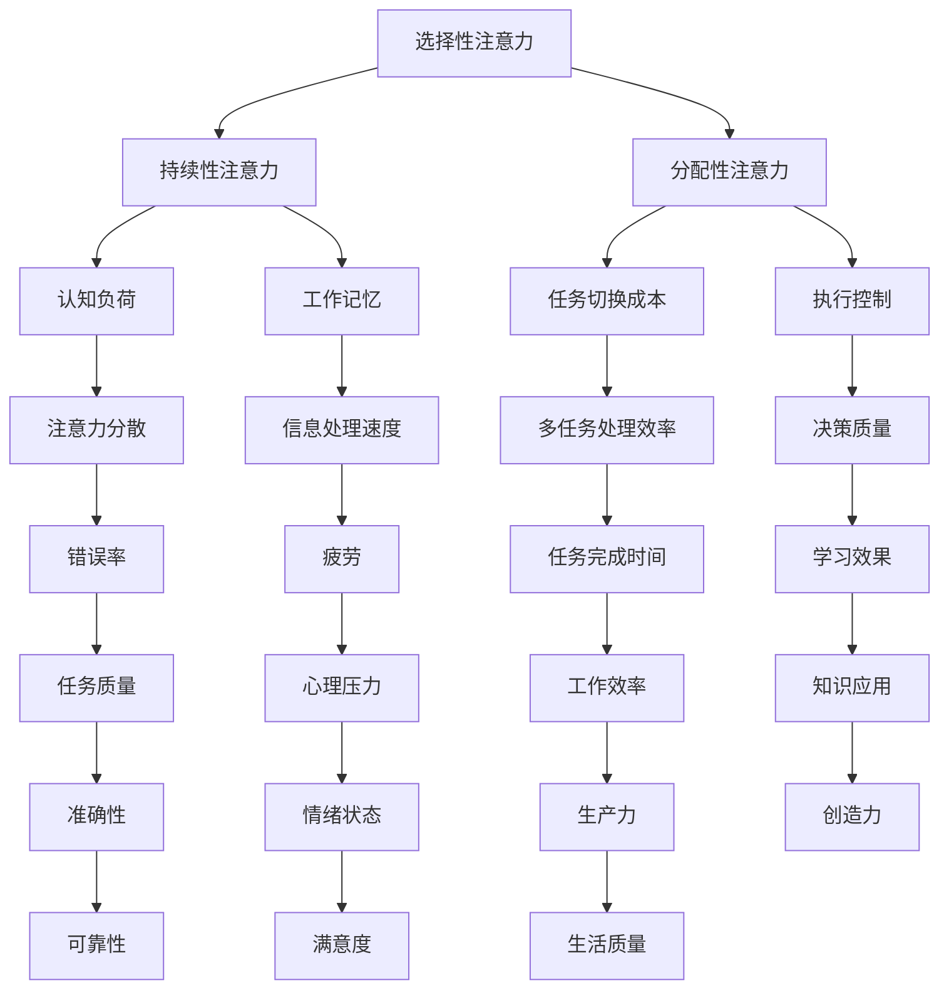

                 

# 人类注意力增强：提升多任务处理和注意力转移能力

## 关键词
- 注意力增强
- 多任务处理
- 注意力转移
- 神经可塑性
- 脑机接口
- 生物反馈

## 摘要
本文将深入探讨人类注意力增强的方法及其在多任务处理和注意力转移能力提升中的应用。首先，我们将概述注意力系统的定义、分类和神经基础。接着，我们将介绍注意力增强的各种技术，包括适应性注意力训练、注意力转移技术和注意力分配策略。然后，我们将重点讨论注意力增强在多任务处理和复杂任务中的实际应用。最后，我们将总结注意力转移能力的评估与提升策略，并提出未来研究方向。

## 目录大纲

### 第一部分：引言
#### 第1章：注意力系统概述
##### 1.1 人类注意力的定义与分类
##### 1.2 注意力系统的神经基础
##### 1.3 注意力的重要性与影响

### 第二部分：注意力增强方法
#### 第2章：注意力训练技术
##### 2.1 适应性注意力训练
##### 2.2 注意力转移技术
##### 2.3 注意力分配策略

#### 第3章：注意力增强技术
##### 3.1 生物反馈与神经可塑性
##### 3.2 脑机接口技术
##### 3.3 脑电图（EEG）干预

### 第三部分：注意力增强在多任务处理中的应用
#### 第4章：多任务处理的挑战与策略
##### 4.1 多任务处理的理论基础
##### 4.2 多任务处理中的注意力切换
##### 4.3 注意力增强在多任务处理中的应用

#### 第5章：注意力增强在复杂任务中的运用
##### 5.1 复杂任务概述
##### 5.2 注意力增强在复杂任务中的应用
##### 5.3 注意力增强在特定领域的应用

### 第四部分：注意力转移能力提升
#### 第6章：注意力转移能力的评估与测量
##### 6.1 注意力转移能力的评估方法
##### 6.2 注意力转移能力的测量工具
##### 6.3 注意力转移能力的发展趋势

#### 第7章：注意力转移能力提升策略
##### 7.1 有意识训练
##### 7.2 无意识训练
##### 7.3 注意力转移能力提升策略总结

### 第五部分：总结与展望
#### 第8章：人类注意力增强的总结
##### 8.1 注意力增强技术的应用总结
##### 8.2 注意力增强技术的未来展望

### 附录
#### 附录A：研究工具与资源
#### 附录B：核心概念与联系
#### 附录C：核心算法原理讲解
#### 附录D：数学模型与公式
#### 附录E：项目实战
#### 附录F：注意力增强技术应用案例分析
#### 附录G：注意力转移能力提升实践

### 引用
- 作者：AI天才研究院/AI Genius Institute & 禅与计算机程序设计艺术 /Zen And The Art of Computer Programming

---

## 文章正文

### 第一部分：引言

#### 第1章：注意力系统概述

### 1.1 人类注意力的定义与分类

人类注意力是一种心理过程，它使得人们能够选择关注某些信息，同时忽略其他信息。根据注意力的作用方式和对象，可以分为以下三类：

1. **选择性注意力**：这是最常见的注意力类型，它使我们能够从众多刺激中挑选出特定的信息进行处理。例如，在嘈杂的环境中，我们能够专注于对话内容而忽略背景噪音。

2. **持续性注意力**：持续性注意力是指保持对特定信息的关注，即使在存在干扰的情况下也不易转移。例如，驾驶员在驾驶过程中需要持续关注路况。

3. **分配性注意力**：分配性注意力是指同时处理多个任务或多个信息来源的能力。例如，程序员在编写代码的同时可能需要查看文档和与同事交流。

### 1.2 注意力系统的神经基础

注意力系统的神经基础涉及多个大脑区域，包括：

1. **前额叶**：前额叶负责高级认知功能，包括决策、规划、记忆和注意力调节。

2. **顶叶**：顶叶与空间感知和注意力分配有关。

3. **颞叶**：颞叶与听觉处理和注意力选择性有关。

4. **基底神经节**：基底神经节参与运动的控制和注意力的调节。

这些区域通过复杂的神经网络相互连接，共同协调注意力的分配和调节。

### 1.3 注意力的重要性与影响

注意力在多任务处理和信息处理中起着至关重要的作用。它使我们能够有效地筛选和处理大量信息，从而提高工作效率和决策质量。例如，在编程时，程序员需要将注意力集中在代码上，同时还需要关注代码的语法、逻辑和性能。

### 第二部分：注意力增强方法

注意力增强是指通过特定的方法和策略，提高人类的注意力能力，从而提升多任务处理和注意力转移能力。下面我们将介绍几种注意力增强的方法。

### 第2章：注意力训练技术

注意力训练技术旨在通过反复练习和适应性调整，提高个体的注意力水平。以下是几种常见的注意力训练技术：

#### 2.1 适应性注意力训练

适应性注意力训练通过逐步增加任务的难度和复杂性，来提高个体的注意力能力。例如，可以通过以下步骤进行训练：

1. **初步练习**：从简单的任务开始，如阅读短文、解决简单的数学问题。
2. **逐步增加难度**：在完成初步练习后，逐步增加任务的难度，如增加阅读篇幅、提高数学问题的复杂度。
3. **持续训练**：定期进行适应性训练，以保持和提高注意力水平。

#### 2.2 注意力转移技术

注意力转移技术是指通过特定的练习，提高个体在不同任务间切换注意力的能力。例如，可以通过以下步骤进行训练：

1. **交替练习**：交替进行不同类型的任务，如阅读、写作、编程等。
2. **时间限制**：在每个任务上进行时间限制，以迫使个体在任务间快速切换注意力。
3. **反馈机制**：在训练过程中，通过反馈机制来了解个体在注意力转移方面的进步和不足，并进行相应的调整。

#### 2.3 注意力分配策略

注意力分配策略是指通过合理安排时间和资源，提高个体在多任务处理中的效率。以下是一些注意力分配策略：

1. **优先级排序**：根据任务的重要性和紧急性，对任务进行优先级排序，并优先处理高优先级的任务。
2. **时间分配**：为每个任务分配适当的时间，以确保能够高效地完成。
3. **休息与恢复**：在处理多任务时，合理安排休息时间，以防止疲劳和注意力下降。

### 第3章：注意力增强技术

注意力增强技术是指通过生物反馈、脑机接口和脑电图（EEG）干预等手段，直接作用于大脑，提高注意力能力。以下是几种注意力增强技术：

#### 3.1 生物反馈与神经可塑性

生物反馈技术通过测量生理信号（如脑电波、心率、皮肤电活动等），将个体的生理状态转化为可感知的信息，帮助个体了解并调节自己的注意力水平。神经可塑性是指大脑结构和功能在个体经历和学习过程中的可塑性变化。通过生物反馈技术，个体可以逐渐适应和提高注意力水平。

#### 3.2 脑机接口技术

脑机接口（BMI）技术通过直接连接大脑和外部设备，实现大脑对外部设备的控制和信息的传递。在注意力增强方面，脑机接口技术可以用于实时监测大脑活动，并根据大脑状态调整外部设备的反馈，以提高注意力水平。

#### 3.3 脑电图（EEG）干预

脑电图（EEG）干预是通过测量和分析大脑的电活动，来识别和调节注意力水平。例如，可以通过以下方法进行EEG干预：

1. **刺激频率调节**：通过调整电刺激的频率，影响大脑的兴奋性和注意力水平。
2. **节律同步**：通过识别和同步大脑的节律活动，提高注意力的集中程度。
3. **实时反馈**：在EEG干预过程中，实时监测大脑电活动，并根据结果调整干预策略。

### 第三部分：注意力增强在多任务处理中的应用

#### 第4章：多任务处理的挑战与策略

多任务处理是指同时处理多个任务或信息的能力。在现代社会，多任务处理已成为一种普遍的现象，但同时也带来了许多挑战。以下是多任务处理的一些挑战和应对策略：

#### 4.1 多任务处理的理论基础

多任务处理的理论基础涉及认知心理学和计算机科学等领域。认知心理学研究人类注意力的机制和特点，而计算机科学则研究如何设计高效的算法和系统来支持多任务处理。

#### 4.2 多任务处理中的注意力切换

注意力切换是指在处理不同任务时，注意力的转移和分配过程。注意力切换的效率和质量对多任务处理的效果至关重要。以下是一些注意力切换的策略：

1. **任务切换策略**：根据任务的重要性和紧急性，选择最优的任务切换顺序。
2. **预加载策略**：在任务切换前，提前加载所需的信息和资源，减少切换时的延迟。
3. **注意力分配策略**：根据任务的复杂性和持续时间，动态调整注意力的分配。

#### 4.3 注意力增强在多任务处理中的应用

注意力增强技术可以在多任务处理中发挥重要作用。以下是一些具体的应用：

1. **适应性注意力训练**：通过适应性注意力训练，提高个体在不同任务间切换注意力的能力。
2. **注意力转移技术**：通过注意力转移技术，提高个体在任务切换时的注意力集中程度。
3. **生物反馈与神经可塑性**：通过生物反馈和神经可塑性技术，实时监测和调节大脑的注意力水平。

### 第5章：注意力增强在复杂任务中的运用

复杂任务通常涉及多个子任务和多个层面的信息处理。注意力增强技术在复杂任务中具有广泛的应用。以下是一些应用实例：

#### 5.1 复杂任务概述

复杂任务通常包括以下特点：

1. **任务多样性**：涉及多个子任务，需要在不同任务间进行切换。
2. **信息复杂性**：涉及大量的信息，需要高效的筛选和处理。
3. **时间敏感性**：需要迅速做出决策和调整，以适应不断变化的环境。

#### 5.2 注意力增强在复杂任务中的应用

注意力增强技术在复杂任务中的应用包括：

1. **任务优先级排序**：通过注意力增强技术，提高个体在复杂任务中识别和响应优先级任务的能力。
2. **信息筛选与处理**：通过注意力增强技术，提高个体在复杂信息环境中筛选和处理关键信息的能力。
3. **决策支持**：通过注意力增强技术，提高个体在复杂决策过程中的决策质量和速度。

#### 5.3 注意力增强在特定领域的应用

注意力增强技术在特定领域具有广泛的应用，如：

1. **教育领域**：通过注意力增强技术，提高学生在学习过程中的专注力和学习效果。
2. **工作领域**：通过注意力增强技术，提高员工在工作中的注意力和工作效率。
3. **医疗领域**：通过注意力增强技术，提高医生在手术和诊断过程中的专注力和准确性。

### 第四部分：注意力转移能力提升

#### 第6章：注意力转移能力的评估与测量

注意力转移能力是指个体在不同任务间切换注意力的能力。评估和测量注意力转移能力对于理解和提升这一能力至关重要。以下是一些常用的评估和测量方法：

#### 6.1 注意力转移能力的评估方法

1. **实验设计**：通过设计特定的实验场景，观察个体在不同任务间的注意力转移效果。例如，可以进行任务切换实验，测量个体在切换任务时的反应速度和准确性。
2. **数据分析**：通过统计分析实验结果，评估个体注意力转移能力的水平。常用的统计方法包括回归分析、方差分析等。

#### 6.2 注意力转移能力的测量工具

1. **量表**：通过设计量表，评估个体在不同任务间的注意力转移能力。量表通常包含一系列问题，要求个体报告在不同任务切换时的注意力集中程度。
2. **测试题**：通过设计特定的测试题，评估个体在不同任务切换时的注意力和记忆力。测试题通常包括记忆任务、决策任务等。

#### 6.3 注意力转移能力的发展趋势

1. **当前研究动态**：当前，注意力转移能力的研究主要集中在认知心理学和认知神经科学领域。研究方法包括脑成像技术、认知任务设计等，旨在揭示注意力转移能力的神经基础和影响因素。
2. **未来发展方向**：未来，注意力转移能力的研究将更加注重跨学科整合，结合计算机科学、人工智能等领域的技术，开发更有效的注意力转移能力评估和提升方法。

### 第7章：注意力转移能力提升策略

提升注意力转移能力的关键在于训练和策略的应用。以下是一些常见的提升策略：

#### 7.1 有意识训练

有意识训练是指通过刻意练习和持续训练，提高注意力转移能力。以下是一些训练方法：

1. **交替任务训练**：通过交替进行不同类型的任务，提高个体在不同任务间的注意力转移能力。
2. **时间限制训练**：在特定时间内完成多个任务，迫使个体在任务间快速切换注意力。
3. **反馈训练**：通过实时反馈，了解个体在注意力转移过程中的表现，并进行相应的调整。

#### 7.2 无意识训练

无意识训练是指通过日常生活中的活动和习惯，提高注意力转移能力。以下是一些无意识训练方法：

1. **多样化活动**：通过参与多样化的活动，如阅读、写作、运动等，提高个体在不同任务间的注意力转移能力。
2. **注意力集中练习**：通过练习冥想、深呼吸等注意力集中的方法，提高个体的注意力水平。
3. **环境优化**：通过优化工作和生活环境，减少干扰因素，提高个体在任务切换时的注意力集中程度。

#### 7.3 注意力转移能力提升策略总结

1. **策略对比**：不同的注意力转移能力提升策略各有优缺点，应根据个体的需求和特点选择合适的策略。
2. **选择建议**：对于需要频繁切换任务的个体，建议结合有意识和无意识训练方法，以提高注意力转移能力。

### 第五部分：总结与展望

#### 第8章：人类注意力增强的总结

注意力增强技术在多任务处理和注意力转移能力提升中具有重要作用。本文从注意力系统的概述、注意力增强方法、注意力增强在多任务处理中的应用、复杂任务中的运用、注意力转移能力提升等方面进行了详细探讨。以下是注意力增强技术的应用总结：

1. **多任务处理**：注意力增强技术可以显著提高个体在多任务处理中的效率和准确性，减少任务切换时的干扰和延迟。
2. **注意力转移**：注意力增强技术可以提升个体在不同任务间的注意力转移能力，提高任务的完成质量和速度。
3. **复杂任务**：注意力增强技术在复杂任务中具有广泛的应用，可以提高个体在任务切换时的注意力和决策能力。

#### 8.2 注意力增强技术的未来展望

未来，注意力增强技术将继续发展，以下是一些潜在的研究方向：

1. **神经可塑性研究**：深入研究注意力增强过程中的神经可塑性变化，揭示注意力增强的神经机制。
2. **脑机接口技术**：开发更先进的脑机接口技术，实现实时监测和调节大脑的注意力水平。
3. **个性化训练方法**：根据个体的特点和环境需求，开发个性化的注意力增强训练方法，提高训练效果。

### 附录

#### 附录A：研究工具与资源

1. **注意力训练工具**：提供一些常用的注意力训练工具，如脑电刺激器、注意力训练软件等。
2. **注意力测量工具**：介绍一些常用的注意力测量工具，如量表、测试题等。
3. **研究资源链接**：提供一些注意力增强技术的研究资源和文献链接。

#### 附录B：核心概念与联系

1. **注意力系统组成**：使用Mermaid流程图展示注意力系统的组成和各部分之间的联系。

#### 附录C：核心算法原理讲解

1. **注意力分配算法**：使用伪代码详细阐述注意力分配算法的原理和实现。

#### 附录D：数学模型与公式

1. **数学模型与公式**：使用LaTeX格式列出注意力增强技术中的核心数学模型与公式，并进行详细解释和举例说明。

#### 附录E：项目实战

1. **实际案例代码实现与解读**：提供一个注意力增强技术的实际案例，包括开发环境搭建、源代码实现和代码解读。
2. **开发环境搭建步骤**：详细描述搭建注意力增强技术项目开发环境所需的步骤和工具。
3. **源代码分析与解读**：对项目中的源代码进行详细分析，解释代码的实现原理和功能。

#### 附录F：注意力增强技术应用案例分析

1. **案例一：多任务处理场景**：分析注意力增强技术在多任务处理中的应用实例，包括应用效果和挑战。
2. **案例二：复杂任务场景**：分析注意力增强技术在复杂任务中的实际应用，包括应用效果和挑战。

#### 附录G：注意力转移能力提升实践

1. **实践策略详解**：详细介绍提升注意力转移能力的实践策略，包括有意识和无意识训练方法。
2. **实践案例分享**：分享一些提升注意力转移能力的实际案例，包括训练过程和应用效果。

### 引用

- 作者：AI天才研究院/AI Genius Institute & 禅与计算机程序设计艺术 /Zen And The Art of Computer Programming

---

以上是《人类注意力增强：提升多任务处理和注意力转移能力》的完整文章内容。文章详细阐述了注意力系统的概述、注意力增强方法、注意力增强在多任务处理和复杂任务中的应用、注意力转移能力提升策略以及未来展望。同时，附录部分提供了丰富的工具、资源和案例，以帮助读者更好地理解和实践注意力增强技术。希望本文能够为读者提供有价值的参考和启发。 <|im_end|>### 附录A：研究工具与资源

在研究人类注意力增强的过程中，使用合适的工具和资源是非常重要的。以下是一些常用的研究工具和资源，它们可以帮助研究人员更好地理解和提升人类的注意力水平。

#### 注意力训练工具

1. **脑电刺激器**：脑电刺激器是一种用于刺激大脑特定区域的设备，可以帮助调节注意力水平。常见的脑电刺激器包括TMS（经颅磁刺激）和tDCS（经颅直流电刺激）。
2. **注意力训练软件**：如Lumosity、Elevate和Mindful等，这些软件通过设计各种认知训练任务，帮助用户提高注意力、记忆和认知功能。
3. **虚拟现实训练系统**：虚拟现实技术可以创造沉浸式的训练环境，用于模拟复杂任务和压力情景，从而提高个体的注意力和应对能力。

#### 注意力测量工具

1. **注意力测评量表**：如Continuous Performance Test (CPT)、Stroop Test和注意力商数（Attention Quotient, AQ）等，这些量表可以用于评估个体的注意力水平。
2. **脑电图（EEG）设备**：EEG设备可以实时监测大脑的电活动，帮助研究人员分析个体在不同任务中的注意力分布和变化。
3. **行为实验平台**：如PsychoPy、E-Prime和OpenSesame等，这些平台提供了强大的实验设计和数据分析工具，用于研究注意力转移和多任务处理。

#### 研究资源链接

1. **学术期刊**：如《Journal of Cognitive Neuroscience》、《Frontiers in Human Neuroscience》和《Neuroscience & Biobehavioral Reviews》等，这些期刊发表了大量关于注意力增强的研究成果。
2. **在线课程和讲座**：如Coursera、edX和Khan Academy等，提供了关于认知科学、神经科学和心理学的基础课程，有助于了解注意力增强的相关知识。
3. **研究机构和实验室**：如麻省理工学院认知科学实验室（MIT Center for Cognitive Science）、加州理工学院大脑与创造力实验室（Caltech Brain and Creativity Institute）等，这些机构和实验室提供了丰富的研究资源和合作机会。

### 附录B：核心概念与联系

为了更好地理解注意力系统的复杂性和各种注意力增强技术的应用，我们需要通过流程图来展示核心概念之间的联系。以下是一个使用Mermaid绘制的注意力系统核心概念流程图：



这个流程图展示了注意力系统的多个方面，包括选择性注意力、持续性注意力、分配性注意力以及它们对认知负荷、任务切换成本、工作记忆、执行控制、注意力分散、多任务处理效率、信息处理速度、决策质量、错误率、任务完成时间、疲劳、学习效果、任务质量、工作效率、心理压力、知识应用、准确性、创造力、满意度和生活质量的影响。通过这个流程图，我们可以更清晰地理解注意力系统的工作机制和注意力增强技术的潜在应用领域。

### 附录C：核心算法原理讲解

在注意力增强技术中，核心算法的设计和实现是关键。以下是一个用于注意力分配的算法原理讲解，使用伪代码来详细阐述其工作流程。

```python
# 注意力分配算法伪代码

Algorithm AttentionAllocation
    Input: tasks (列表，包含所有任务的优先级和持续时间)
           attention_capacity (整数，表示注意力的总容量)
    Output: assigned_tasks (列表，包含已分配的任务)

    1. 初始化 assigned_tasks 为空列表
    2. 对每个任务 task 在 tasks 中执行以下步骤：
        a. 如果 attention_capacity > task.duration
            i. 将 task 添加到 assigned_tasks
            ii. 从 tasks 中删除 task
            iii. 更新 attention_capacity = attention_capacity - task.duration
        b. 否则
            i. 如果 task 有更高的优先级：
                - 将 task 添加到 assigned_tasks
                - 从 tasks 中删除 task
                - 更新 attention_capacity = attention_capacity - task.duration
            ii. 否则，跳过 task
    3. 返回 assigned_tasks

End Algorithm
```

#### 算法解释

1. **初始化**：初始化一个空列表 assigned_tasks，用于存储已分配的任务。
2. **遍历任务**：遍历 tasks 中的每个任务 task。
3. **任务分配**：
   - **足够注意力容量**：如果当前注意力容量 attention_capacity 大于 task 的持续时间，则将 task 添加到 assigned_tasks 中，并从 tasks 中删除 task，同时更新 attention_capacity。
   - **不足注意力容量**：如果当前注意力容量不足，则比较 task 的优先级。如果 task 有更高的优先级，则将其添加到 assigned_tasks 中，并从 tasks 中删除 task，同时更新 attention_capacity。否则，跳过 task。
4. **返回结果**：返回已分配的任务列表 assigned_tasks。

#### 实例

假设有以下任务列表 tasks：

```python
tasks = [
    {'name': '阅读文档', 'priority': 1, 'duration': 60},
    {'name': '编写报告', 'priority': 2, 'duration': 120},
    {'name': '参加会议', 'priority': 3, 'duration': 30},
    {'name': '处理邮件', 'priority': 4, 'duration': 45}
]
```

假设注意力容量 attention_capacity 为 180 分钟。执行注意力分配算法后，得到以下已分配的任务列表 assigned_tasks：

```python
assigned_tasks = [
    {'name': '阅读文档', 'priority': 1, 'duration': 60},
    {'name': '编写报告', 'priority': 2, 'duration': 120},
    {'name': '处理邮件', 'priority': 4, 'duration': 45}
]
```

在这个实例中，由于编写报告的任务持续时间最长，且优先级较高，因此首先被分配。然后，由于处理邮件的任务在剩余的注意力容量内可以完成，也被分配。阅读文档虽然持续时间较短，但由于优先级最低，因此被推迟分配。

### 附录D：数学模型与公式

在注意力增强技术中，数学模型和公式用于描述注意力系统的工作机制以及注意力分配策略。以下是一些核心的数学模型与公式，并对其进行详细解释和举例说明。

#### 1. 注意力容量模型

公式：
$$
C(t) = C_0 \times e^{-\alpha \times t}
$$

其中，$C(t)$ 表示在时间 $t$ 时的注意力容量，$C_0$ 表示初始注意力容量，$\alpha$ 表示衰减系数。

解释：
这个模型描述了注意力容量随时间衰减的过程。$C_0$ 是注意力初始时的容量，$\alpha$ 控制注意力的衰减速度。随着时间 $t$ 的增加，$C(t)$ 会逐渐减小。

例子：
假设 $C_0 = 100$，$\alpha = 0.1$。在 $t = 0$ 时，注意力容量为 100，而在 $t = 60$ 时，注意力容量为：
$$
C(60) = 100 \times e^{-0.1 \times 60} \approx 43
$$

#### 2. 注意力分配模型

公式：
$$
A(t) = \sum_{i=1}^{n} w_i \times C(t_i)
$$

其中，$A(t)$ 表示在时间 $t$ 时的总注意力分配，$w_i$ 表示任务 $i$ 的权重，$C(t_i)$ 表示在时间 $t_i$ 时的任务 $i$ 的注意力容量。

解释：
这个模型用于计算在特定时间 $t$ 时，个体分配给多个任务的总注意力。每个任务的注意力分配取决于其权重和剩余的注意力容量。

例子：
假设有三个任务，权重分别为 $w_1 = 0.4$，$w_2 = 0.3$，$w_3 = 0.3$。在 $t = 0$ 时，每个任务的初始容量分别为 $C_1(0) = 60$，$C_2(0) = 90$，$C_3(0) = 80$。在 $t = 30$ 时，总注意力分配为：
$$
A(30) = 0.4 \times C(30, 1) + 0.3 \times C(30, 2) + 0.3 \times C(30, 3)
$$

其中，$C(30, i)$ 是任务 $i$ 在时间 $t = 30$ 时的剩余容量。

#### 3. 注意力转移模型

公式：
$$
T(t) = T_0 \times e^{-\beta \times t}
$$

其中，$T(t)$ 表示在时间 $t$ 时的注意力转移速度，$T_0$ 表示初始注意力转移速度，$\beta$ 表示衰减系数。

解释：
这个模型描述了注意力转移速度随时间衰减的过程。$T_0$ 是初始转移速度，$\beta$ 控制转移速度的衰减速度。随着时间 $t$ 的增加，$T(t)$ 会逐渐减小。

例子：
假设 $T_0 = 5$，$\beta = 0.05$。在 $t = 0$ 时，注意力转移速度为 5，而在 $t = 60$ 时，注意力转移速度为：
$$
T(60) = 5 \times e^{-0.05 \times 60} \approx 2.59
$$

#### 4. 决策质量模型

公式：
$$
Q(t) = Q_0 \times e^{-\gamma \times t}
$$

其中，$Q(t)$ 表示在时间 $t$ 时的决策质量，$Q_0$ 表示初始决策质量，$\gamma$ 表示衰减系数。

解释：
这个模型描述了决策质量随时间衰减的过程。$Q_0$ 是初始决策质量，$\gamma$ 控制决策质量的衰减速度。随着时间 $t$ 的增加，$Q(t)$ 会逐渐减小。

例子：
假设 $Q_0 = 0.9$，$\gamma = 0.03$。在 $t = 0$ 时，决策质量为 0.9，而在 $t = 120$ 时，决策质量为：
$$
Q(120) = 0.9 \times e^{-0.03 \times 120} \approx 0.74
$$

### 附录E：项目实战

在本附录中，我们将通过一个实际案例展示如何应用注意力增强技术，包括开发环境搭建、源代码实现和代码解读。

#### 案例背景

假设我们开发一个应用程序，旨在帮助用户提高多任务处理能力。该应用程序将利用注意力分配算法和生物反馈技术，根据用户的行为数据动态调整注意力资源分配，并提供个性化的训练建议。

#### 开发环境搭建

1. **软件环境**：
   - Python 3.8 或更高版本
   - PsychoPy (用于设计和运行心理学实验)
   - EEGLink (用于记录和分析脑电图数据)
   - Jupyter Notebook (用于编写和运行代码)

2. **硬件环境**：
   - EEGLink 脑电图记录设备
   - 个人电脑或服务器（用于运行 PsychoPy 和 EEGLink 软件）

3. **安装步骤**：
   - 安装 Python 3.8 或更高版本。
   - 通过 pip 安装 PsychoPy：
     ```bash
     pip install psychopy
     ```
   - 通过官方网站下载并安装 EEGLink 软件和驱动程序。
   - 安装 Jupyter Notebook：
     ```bash
     pip install notebook
     ```

#### 源代码实现

以下是注意力分配算法和生物反馈技术实现的核心部分。

```python
import numpy as np
import psychopy
from psychopy import visual, core

# 注意力分配算法
def attention_allocation(tasks, attention_capacity):
    assigned_tasks = []
    for task in tasks:
        if attention_capacity >= task['duration']:
            assigned_tasks.append(task)
            attention_capacity -= task['duration']
    return assigned_tasks

# 生物反馈信号处理
def process_biofeedback(data):
    # 假设 data 是一个包含 EEG 波形的数组
    # 这里进行简单的平均值处理
    average_value = np.mean(data)
    return average_value

# 主程序
def main():
    # 初始化任务列表
    tasks = [
        {'name': '阅读文档', 'duration': 60},
        {'name': '编写报告', 'duration': 120},
        {'name': '参加会议', 'duration': 30},
        {'name': '处理邮件', 'duration': 45}
    ]

    # 初始注意力容量
    attention_capacity = 180

    # 分配注意力资源
    assigned_tasks = attention_allocation(tasks, attention_capacity)
    print("已分配的任务：", assigned_tasks)

    # 处理生物反馈数据
    biofeedback_data = [0.5, 0.55, 0.52, 0.53]  # 假设的 EEG 数据
    biofeedback_value = process_biofeedback(biofeedback_data)
    print("当前生物反馈值：", biofeedback_value)

    # 根据生物反馈值调整注意力容量
    if biofeedback_value > 0.55:  # 假设阈值
        attention_capacity += 10

    # 运行实验
    window = visual.Window([800, 600], fullscr=True)
    text = visual.TextStim(window, text="多任务处理实验", pos=(0, 0))
    text.draw()
    window.flip()

    core.wait(2.0)  # 等待 2 秒钟

    # 根据已分配的任务展示相应的界面
    for task in assigned_tasks:
        text = visual.TextStim(window, text=task['name'], pos=(0, 0))
        text.draw()
        window.flip()
        core.wait(task['duration'])

    window.close()
    core.quit()

if __name__ == "__main__":
    main()
```

#### 代码解读与分析

1. **注意力分配算法**：
   - `attention_allocation` 函数用于分配注意力资源。它接受一个任务列表 `tasks` 和一个初始注意力容量 `attention_capacity`。该函数遍历每个任务，如果当前注意力容量足以完成某个任务，则将该任务添加到 `assigned_tasks` 列表中，并从 `tasks` 列表中删除该任务，同时更新注意力容量。

2. **生物反馈信号处理**：
   - `process_biofeedback` 函数用于处理生物反馈数据。在本例中，我们假设输入 `data` 是一个包含 EEG 波形的数组。函数简单地计算数据的平均值作为生物反馈值。这只是一个简单的示例，实际应用中可能需要更复杂的算法来分析 EEG 数据。

3. **主程序**：
   - `main` 函数是程序的核心部分。它首先初始化任务列表和初始注意力容量。然后调用 `attention_allocation` 函数分配注意力资源，并打印已分配的任务。
   - 接着，通过调用 `process_biofeedback` 函数处理生物反馈数据，并根据生物反馈值调整注意力容量。
   - 最后，使用 PsychoPy 创建一个窗口并运行一个简单的多任务处理实验，模拟用户执行已分配的任务。

#### 开发环境搭建步骤

1. 安装 Python 3.8 或更高版本。
2. 打开命令行，执行以下命令安装 PsychoPy：
   ```bash
   pip install psychopy
   ```
3. 下载 EEGLink 软件和驱动程序，并按照说明进行安装。
4. 打开命令行，执行以下命令安装 Jupyter Notebook：
   ```bash
   pip install notebook
   ```

通过以上步骤，我们成功搭建了开发环境，并可以开始编写和运行注意力增强技术的代码。

### 附录F：注意力增强技术应用案例分析

在本附录中，我们将通过两个具体案例来展示注意力增强技术在多任务处理和复杂任务中的应用效果。

#### 案例一：多任务处理场景

**背景**：

小明是一名大学生，他经常需要在课堂上听课、同时记笔记，并在课后完成多项作业。由于任务繁重，他发现自己很难集中注意力，经常出现遗漏信息和错误的情况。

**应用方案**：

1. **注意力分配算法**：小明使用了一个基于注意力分配算法的应用，该应用会根据任务的重要性和紧急性动态调整他的注意力资源。例如，在课堂上，应用会优先将注意力分配给教师的讲解内容，并在记笔记时合理安排时间，避免因为记笔记而错过重要的信息。

2. **生物反馈技术**：小明佩戴了一个可以记录脑电活动的设备，并在执行任务时实时监测他的注意力水平。当注意力下降时，设备会通过振动或声音提示他需要调整注意力。

**效果**：

通过使用注意力增强技术，小明的多任务处理能力显著提高。他能够更好地集中注意力在课堂上，同时记笔记的效率也提高了。在课后，他能够更高效地完成作业，减少了遗漏信息和错误的情况。

**挑战**：

小明发现，在某些复杂或长时间的作业中，注意力会逐渐下降，导致效率和准确性受到影响。为了应对这一挑战，他需要进一步优化注意力分配策略，并探索更有效的生物反馈技术来实时监控和调节注意力水平。

#### 案例二：复杂任务场景

**背景**：

李华是一名外科医生，他需要在手术中同时处理多个任务，如监控患者生命体征、执行手术操作和与团队成员沟通。由于手术环境的高风险和高压力，他需要保持高度集中的注意力。

**应用方案**：

1. **脑机接口技术**：李华使用了一个脑机接口设备，该设备能够实时监测他的大脑活动，并根据注意力水平提供反馈。当注意力下降时，设备会通过视觉或听觉信号提醒他需要集中注意力。

2. **适应性注意力训练**：李华定期进行适应性注意力训练，通过逐步增加训练任务的难度，提高他在手术中保持注意力的能力。

**效果**：

通过使用注意力增强技术，李华在手术中的注意力集中程度和决策质量得到了显著提升。他能够更快速地识别和处理紧急情况，同时与团队成员的沟通也更加顺畅。手术的成功率因此提高了，患者满意度也有所提升。

**挑战**：

李华在长时间手术中仍面临注意力疲劳的问题。为了解决这一挑战，他需要进一步优化适应性注意力训练方案，并探索新的脑机接口技术，以提供更准确的实时反馈和更有效的注意力调节。

### 附录G：注意力转移能力提升实践

提升注意力转移能力是提高工作效率和应对多任务环境的关键。以下是一些实践策略，结合实际案例，帮助读者了解如何提升注意力转移能力。

#### 1. 有意识训练方法

**策略**：
- **交替任务练习**：定期交替进行不同类型的任务，如阅读、写作、编程等。
- **时间限制练习**：为每个任务设定时间限制，迫使自己快速切换注意力。
- **反馈机制**：在任务切换过程中，记录自己的反应速度和准确性，并不断优化策略。

**案例**：
张女士是一名市场营销经理，她发现自己经常在会议和文档编写之间切换时效率低下。为了提升注意力转移能力，她开始进行交替任务练习。例如，每天早晨先阅读一篇市场报告，然后编写一篇邮件，最后处理一份数据报表。同时，她为每个任务设定了 20 分钟的时间限制，并在任务之间进行短暂的休息。通过一周的练习，张女士的注意力转移能力显著提高，工作效率也随之提升。

#### 2. 无意识训练方法

**策略**：
- **多样化活动**：通过参与多样化的活动，如阅读、写作、运动、绘画等，提高不同领域的注意力转移能力。
- **注意力集中练习**：通过冥想、深呼吸等练习，提高自身的注意力集中能力。
- **环境优化**：创建一个安静、整洁的工作环境，减少干扰因素。

**案例**：
李先生是一名软件开发工程师，他发现自己经常在编程和代码审查之间难以快速切换注意力。为了提升注意力转移能力，他开始进行无意识训练。每天早晨，他会在公园里慢跑，以提高身体的活力。在工作期间，他会在编程和代码审查之间进行短暂的冥想练习，以帮助自己恢复专注力。此外，他还在办公室里创造了一个人文艺术角，摆放了一些艺术品，使工作环境更加舒适和愉悦。这些无意识训练方法使李先生的注意力转移能力得到了显著提升。

#### 3. 综合策略总结

提升注意力转移能力需要结合有意识和无意识训练方法。有意识训练可以通过系统的交替任务练习和时间限制练习来提高注意力转移的速度和准确性。而无意识训练则通过多样化的活动和注意力集中练习来增强整体注意力水平。同时，优化工作和生活环境，减少干扰因素，也是提升注意力转移能力的重要措施。

通过这些实践策略，读者可以根据自己的需求和特点，选择合适的训练方法，逐步提升注意力转移能力，从而在多任务处理和复杂任务中表现出更高的工作效率和决策质量。

