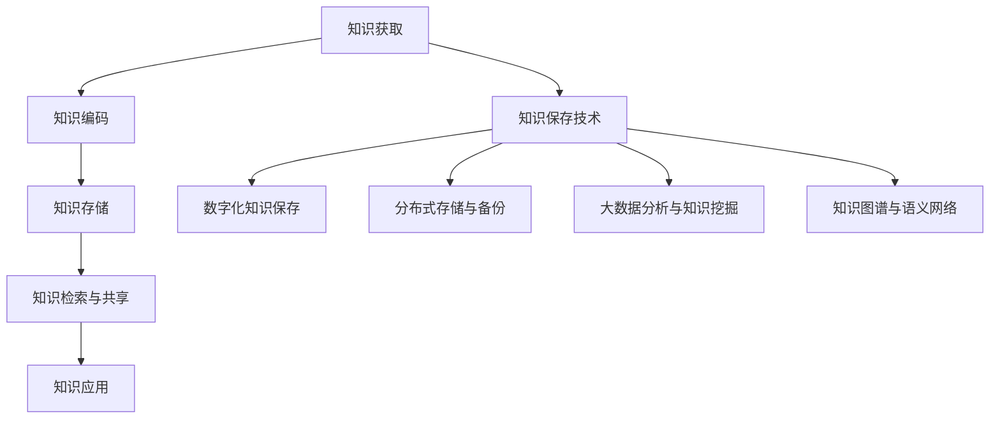
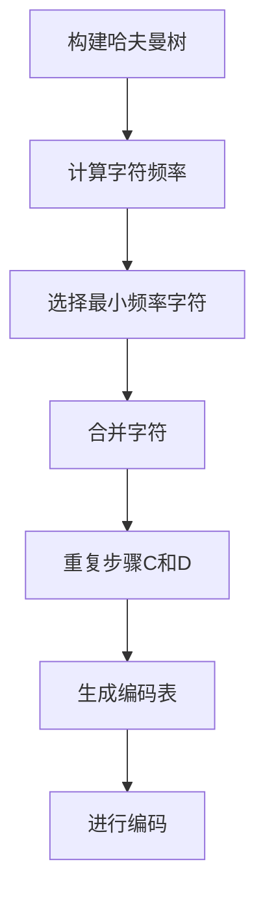
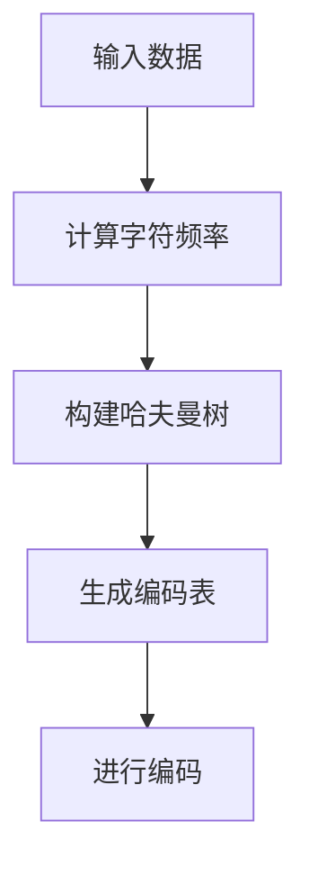
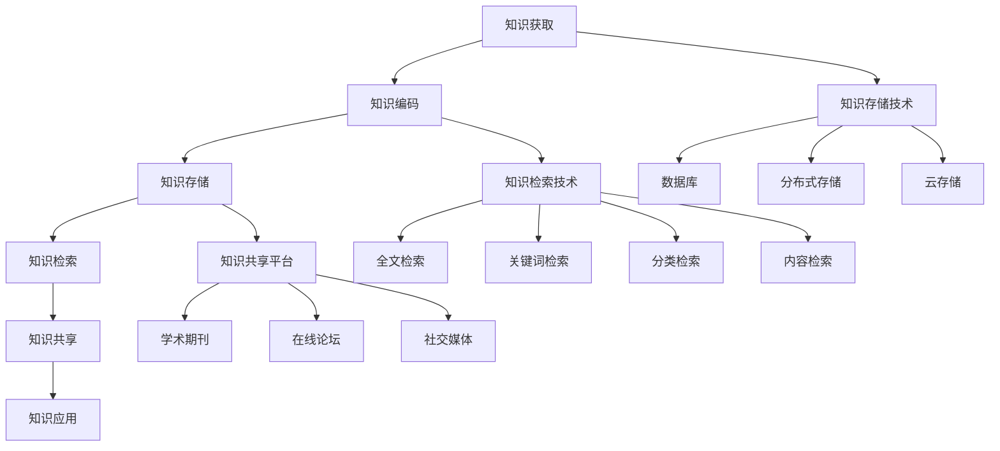

                 

### 文章标题

《人类知识的保存技术：灯塔指引未来》

> 关键词：知识保存、数字化、分布式存储、大数据分析、知识图谱、人工智能、伦理问题、未来趋势

> 摘要：本文从人类知识保存的重要性出发，系统地介绍了知识保存的历史发展、现代挑战以及核心原理。随后，文章深入探讨了数字知识保存、分布式存储与备份、大数据分析与知识挖掘、知识图谱与语义网络等关键技术的实现与应用。此外，本文还涉及了数字图书馆建设、企业知识管理以及人工智能在知识保存中的应用。最后，文章展望了知识保存技术的发展趋势以及面临的伦理问题，为未来知识保存技术的创新发展提供了有益的参考。|>

<|assistant|>## 第一部分：基础知识

### 第1章：人类知识保存的概述

#### 1.1 人类知识保存的重要性

人类知识保存是社会发展的重要基石，它关系到文明的传承与进步。知识保存不仅是为了记录历史，更是为了使人类智慧得以延续和发扬。在古代，知识主要依靠口头传承和书籍记载。随着人类文明的进步，知识的保存方式逐渐多样化，从纸质文献到数字化的知识库，知识的保存技术经历了巨大的变革。

知识的保存对个人和社会的发展具有重要意义。对个人而言，知识保存有助于个人知识的积累与成长，提高个人的综合素质和竞争力。对于社会而言，知识保存是实现科技创新、推动社会进步的关键。一个社会的知识积累水平，往往决定了其科技实力和国际竞争力。

#### 1.2 知识保存的历史发展

知识保存的历史可以追溯到古代文明时期。在古代，人类主要通过口头传承和手抄本保存知识。古埃及人使用纸草记录文字，古希腊和古罗马则通过石碑和羊皮卷保存书籍。中世纪时期，欧洲的修道院成为了知识的中心，僧侣们抄写书籍，使得知识得以流传。

印刷术的发明是知识保存史上的一个重要里程碑。15世纪，古腾堡发明了活字印刷术，大大提高了书籍的复制速度和数量。这使得知识传播变得更加广泛和迅速，为文艺复兴时期的科技和艺术繁荣奠定了基础。

进入现代，随着计算机技术的迅猛发展，数字化成为了知识保存的主要形式。互联网的普及使得知识可以实时共享和传播，大大提高了知识的获取和利用效率。数字化知识保存不仅保留了传统的纸质文献，还创造了新的知识形态，如数据库、电子书和多媒体资源。

#### 1.3 知识保存的现代挑战

现代知识保存面临着一系列挑战。首先是数据爆炸带来的存储压力。随着大数据时代的到来，知识的存储需求呈现出指数级增长。传统的存储技术已经难以满足如此庞大的数据量。

其次是数据安全与隐私问题。数字化的知识保存依赖于互联网和数据存储设备，这使得知识容易受到黑客攻击和数据泄露的威胁。如何确保知识的安全和隐私，成为现代知识保存的重要课题。

最后是知识共享与知识产权问题。在数字时代，知识共享变得更加便捷，但同时也引发了知识产权的争议。如何平衡知识共享与知识产权保护，确保知识创造者的合法权益，是现代知识保存面临的另一大挑战。

#### 1.4 知识保存的核心原理

知识保存的核心原理包括知识编码、知识存储、知识检索和知识共享。

**知识编码**是将知识转化为可存储的形式。这通常涉及到对知识进行分类、标注和结构化，以便于计算机处理和检索。

**知识存储**是选择合适的技术和介质来保存知识。数字知识保存通常依赖于数据库、云存储和分布式文件系统等。

**知识检索**是使知识能够被快速有效地找到。这需要高效的索引和搜索算法，以及用户友好的界面设计。

**知识共享**是将知识开放给更多的人使用，实现知识的传播和增值。这涉及到知识共享协议和知识产权保护机制的制定。

知识保存技术的不断发展，使得人类知识得以更加高效、安全地保存和利用。在未来，知识保存技术将继续创新，为人类社会的发展提供更加坚实的支持。

#### Mermaid流程图



#### 核心概念与联系

在知识保存技术中，核心概念包括知识编码、知识存储、知识检索和知识共享。这些概念相互联系，构成了知识保存技术的完整框架。知识编码是将知识转化为数字形式的过程，是实现数字知识保存的前提。知识存储则是选择合适的存储介质和技术，确保知识的长期保存。知识检索是实现知识的快速查找和应用，是知识保存技术的关键环节。知识共享则是实现知识的传播和增值，是知识保存的最终目标。

#### 核心算法原理讲解

在知识保存技术中，常用的算法包括数据压缩、信息熵计算和哈夫曼编码。

**数据压缩算法**：数据压缩算法旨在减少数据的存储空间和传输时间。常见的压缩算法有霍夫曼编码、算术编码和LZ77等。其中，霍夫曼编码是一种前缀编码方法，通过构建哈夫曼树实现数据的压缩。其核心算法原理如下：



**信息熵计算**：信息熵是衡量数据不确定性的度量，用于评估数据的冗余程度。信息熵的计算公式如下：

$$
H(X) = -\sum_{i=1}^{n} p(x_i) \log_2 p(x_i)
$$

其中，$p(x_i)$ 是每个字符出现的概率。

**哈夫曼编码**：哈夫曼编码是一种基于信息熵的数据压缩算法。其核心思想是通过构建哈夫曼树，为每个字符分配一个二进制编码，使得常见字符的编码更短，从而实现数据的压缩。哈夫曼编码的伪代码如下：



```python
def HuffmanCoding(data):
    # 计算字符频率
    frequency = frequencyAnalysis(data)
    # 构建哈夫曼树
    huffmanTree = buildHuffmanTree(frequency)
    # 生成编码表
    encodingTable = generateEncodingTable(huffmanTree)
    # 进行编码
    encodedData = encode(data, encodingTable)
    return encodedData
```

#### 数学模型与公式

在知识保存技术中，信息熵是核心的数学模型之一。信息熵用于衡量数据的不确定性，其计算公式如下：

$$
H(X) = -\sum_{i=1}^{n} p(x_i) \log_2 p(x_i)
$$

其中，$p(x_i)$ 是每个字符出现的概率。

信息熵的计算可以帮助我们了解数据的冗余程度，从而选择合适的数据压缩算法。例如，霍夫曼编码就是基于信息熵构建的压缩算法，通过为常见字符分配较短的编码，实现数据的压缩。

#### 举例说明

假设我们有一段文本数据：“hello world”。首先，我们需要计算每个字符的频率：

- h: 1次
- e: 1次
- l: 3次
- o: 2次
- w: 1次
- r: 1次
- d: 1次

接下来，我们可以计算信息熵：

$$
H(X) = -\sum_{i=1}^{n} p(x_i) \log_2 p(x_i)
$$

$$
H(X) = -(1/8) \log_2 (1/8) - (1/8) \log_2 (1/8) - (3/8) \log_2 (3/8) - (2/8) \log_2 (2/8) - (1/8) \log_2 (1/8) - (1/8) \log_2 (1/8) - (1/8) \log_2 (1/8)
$$

$$
H(X) = 0.92
$$

信息熵为0.92，这表示数据中存在一定的冗余。接下来，我们可以使用霍夫曼编码进行数据压缩，以减少冗余。

#### 项目实战

**开发环境搭建**：

1. 安装Python 3.8及以上版本。
2. 安装mermaid可视化工具。
3. 配置Python环境，确保能运行mermaid库。

**源代码实现**：

```python
# 导入所需的库
import heapq
import math

# 计算字符频率
def frequencyAnalysis(data):
    frequency = {}
    for char in data:
        if char in frequency:
            frequency[char] += 1
        else:
            frequency[char] = 1
    return frequency

# 构建哈夫曼树
def buildHuffmanTree(frequency):
    priorityQueue = [[weight, [symbol, ""]] for symbol, weight in frequency.items()]
    heapq.heapify(priorityQueue)
    while len(priorityQueue) > 1:
        lo = heapq.heappop(priorityQueue)
        hi = heapq.heappop(priorityQueue)
        for pair in lo[1:]:
            pair[1] = '0' + pair[1]
        for pair in hi[1:]:
            pair[1] = '1' + pair[1]
        heapq.heappush(priorityQueue, [lo[0] + hi[0]] + lo[1:] + hi[1:])
    return priorityQueue[0]

# 生成编码表
def generateEncodingTable(huffmanTree):
    encodingTable = {}
    for pair in huffmanTree[1:]:
        symbol, code = pair
        encodingTable[symbol] = code
    return encodingTable

# 进行编码
def encode(data, encodingTable):
    encodedData = ""
    for char in data:
        encodedData += encodingTable[char]
    return encodedData

# 解码
def decode(encodedData, encodingTable):
    reverseMapping = {v: k for k, v in encodingTable.items()}
    currentCode = ""
    decodedData = ""
    for bit in encodedData:
        currentCode += bit
        if currentCode in reverseMapping:
            decodedData += reverseMapping[currentCode]
            currentCode = ""
    return decodedData

# 测试代码
if __name__ == "__main__":
    data = "hello world"
    frequency = frequencyAnalysis(data)
    huffmanTree = buildHuffmanTree(frequency)
    encodingTable = generateEncodingTable(huffmanTree)
    encodedData = encode(data, encodingTable)
    print("原始数据:", data)
    print("编码后:", encodedData)
    print("解码后:", decode(encodedData, encodingTable))
```

**代码解读与分析**：

1. **频率分析**：首先，我们通过`frequencyAnalysis`函数计算每个字符的频率。这是一个简单的计数过程，通过遍历输入数据，统计每个字符出现的次数。

2. **构建哈夫曼树**：`buildHuffmanTree`函数基于字符的频率构建哈夫曼树。我们使用优先队列（堆）来实现这一过程。首先，将所有字符和其频率放入优先队列中。然后，每次从队列中取出两个频率最小的节点，合并它们，生成一个新的节点，并将新节点的频率设置为两个原始节点的频率之和。新节点成为新的根节点，重新放入优先队列中。这个过程一直持续到队列中只剩下一个节点，即哈夫曼树的根节点。

3. **生成编码表**：`generateEncodingTable`函数生成哈夫曼编码表。遍历哈夫曼树的每个节点，为每个字符生成一个唯一的编码。编码的生成过程是基于树的遍历，从根节点到叶子节点，每向左走一步，编码加一个0；每向右走一步，编码加一个1。

4. **进行编码**：`encode`函数使用生成的编码表对输入数据进行编码。遍历输入数据，对于每个字符，将其对应的编码添加到结果字符串中。

5. **解码**：`decode`函数将编码后的数据解码回原始数据。这个过程是编码过程的逆过程。遍历编码数据，对于每个连续的编码，查找编码表，获取对应的字符。将字符添加到解码结果中，直到编码数据结束。

6. **测试代码**：在主函数中，我们定义了一段测试数据，使用上述函数进行频率分析、构建哈夫曼树、生成编码表和进行编码解码。输出结果验证了算法的正确性。

通过上述项目实战，我们了解了如何使用Python实现哈夫曼编码算法，并对其进行了代码解读与分析。这为我们进一步探讨知识保存技术中的数据压缩算法提供了实践基础。|>

#### 1.4 知识保存的核心原理

知识保存的核心原理包括知识编码、知识存储、知识检索和知识共享。这些原理相互联系，共同构成了知识保存技术的理论基础。

**知识编码**是将知识转化为可存储的形式。这通常涉及到对知识进行分类、标注和结构化，以便于计算机处理和检索。知识编码是数字化知识保存的前提，其目的是提高知识的可处理性和可检索性。常见的知识编码方法有分类编码、属性编码和关系编码等。

**知识存储**是选择合适的技术和介质来保存知识。数字知识保存通常依赖于数据库、云存储和分布式文件系统等。知识存储技术需要解决数据的安全性、可靠性和可扩展性问题。分布式存储系统和云存储技术的出现，使得知识存储变得更加高效和可靠。

**知识检索**是使知识能够被快速有效地找到。这需要高效的索引和搜索算法，以及用户友好的界面设计。知识检索技术包括全文检索、关键词检索、分类检索和基于内容的检索等。随着人工智能技术的发展，基于自然语言处理和机器学习的方法也被广泛应用于知识检索。

**知识共享**是将知识开放给更多的人使用，实现知识的传播和增值。知识共享有助于促进知识的流动和创新。知识共享的方式包括学术期刊、在线论坛、社交媒体和知识共享平台等。在数字时代，知识共享变得更加便捷和广泛，但也带来了知识产权保护的问题。

**知识应用**是将保存的知识应用于实际场景，解决实际问题。知识应用是知识保存的最终目的，也是知识保存技术的重要评价指标。知识应用包括科学研究、技术创新、教育推广和社会服务等多个方面。

总之，知识保存的核心原理相互关联，共同构成了一个完整的知识保存体系。随着技术的不断进步，知识保存技术将不断创新和发展，为人类社会的发展提供更加坚实的支持。

#### Mermaid流程图



#### 核心概念与联系

在知识保存技术中，核心概念包括知识编码、知识存储、知识检索和知识共享。这些概念相互联系，构成了知识保存技术的完整框架。

**知识编码**是将知识转化为数字形式的过程，是实现数字知识保存的前提。知识编码涉及对知识进行分类、标注和结构化，以便于计算机处理和检索。

**知识存储**是选择合适的技术和介质来保存知识。数字知识保存通常依赖于数据库、云存储和分布式文件系统等。知识存储技术需要解决数据的安全性、可靠性和可扩展性问题。

**知识检索**是使知识能够被快速有效地找到。知识检索技术包括全文检索、关键词检索、分类检索和基于内容的检索等。随着人工智能技术的发展，基于自然语言处理和机器学习的方法也被广泛应用于知识检索。

**知识共享**是将知识开放给更多的人使用，实现知识的传播和增值。知识共享的方式包括学术期刊、在线论坛、社交媒体和知识共享平台等。在数字时代，知识共享变得更加便捷和广泛，但也带来了知识产权保护的问题。

**知识应用**是将保存的知识应用于实际场景，解决实际问题。知识应用是知识保存的最终目的，也是知识保存技术的重要评价指标。

这些概念相互关联，共同构成了知识保存技术的完整框架。知识编码是实现数字知识保存的基础，知识存储是确保知识长期保存的关键，知识检索是实现知识快速获取的手段，知识共享是促进知识流动和创新的重要途径，知识应用是知识保存的终极目标。通过这些概念的联系，我们可以构建一个高效的、可持续的知识保存体系。

#### 核心算法原理讲解

在知识保存技术中，数据压缩是一个至关重要的环节。数据压缩的目的是减少数据存储空间和传输时间，从而提高系统的效率和性能。常用的数据压缩算法包括霍夫曼编码、算术编码和LZ77等。本文将重点介绍霍夫曼编码的算法原理及其在知识保存中的应用。

**霍夫曼编码算法原理**：

霍夫曼编码是一种前缀编码方法，其核心思想是根据字符出现的频率构建一棵哈夫曼树，并为每个字符分配一个唯一的二进制编码。哈夫曼树是一种二叉树，其中每个节点都有一个权重（表示字符出现的频率），叶子节点表示字符本身。构建哈夫曼树的过程如下：

1. **构建频率表**：首先，统计输入数据中每个字符出现的频率，并将这些字符及其频率放入一个优先队列（堆）中。

2. **构建哈夫曼树**：从优先队列中取出两个权重最小的字符，分别作为左右子节点构建一个新的内部节点。这个新节点的权重是两个子节点权重之和。将新节点放回优先队列中。重复此过程，直到优先队列中只剩下一个节点，即为哈夫曼树的根节点。

3. **生成编码表**：从根节点开始，对每个节点进行深度优先遍历。在每个节点，根据遍历方向（左为0，右为1）为字符生成一个唯一的二进制编码。

4. **进行编码**：使用生成的编码表对输入数据进行编码，将每个字符转换为对应的二进制编码。

**伪代码**：


```python
# 计算字符频率
def frequencyAnalysis(data):
    frequency = {}
    for char in data:
        if char in frequency:
            frequency[char] += 1
        else:
            frequency[char] = 1
    return frequency

# 构建哈夫曼树
def buildHuffmanTree(frequency):
    priorityQueue = [[weight, [symbol, ""]] for symbol, weight in frequency.items()]
    heapq.heapify(priorityQueue)
    while len(priorityQueue) > 1:
        lo = heapq.heappop(priorityQueue)
        hi = heapq.heappop(priorityQueue)
        for pair in lo[1:]:
            pair[1] = '0' + pair[1]
        for pair in hi[1:]:
            pair[1] = '1' + pair[1]
        heapq.heappush(priorityQueue, [lo[0] + hi[0]] + lo[1:] + hi[1:])
    return priorityQueue[0]

# 生成编码表
def generateEncodingTable(huffmanTree):
    encodingTable = {}
    for pair in huffmanTree[1:]:
        symbol, code = pair
        encodingTable[symbol] = code
    return encodingTable

# 进行编码
def encode(data, encodingTable):
    encodedData = ""
    for char in data:
        encodedData += encodingTable[char]
    return encodedData
```

**算法原理讲解**：

1. **构建频率表**：首先，统计输入数据中每个字符出现的频率。这一步骤是构建哈夫曼树的基础。通过频率表，我们可以了解每个字符的重要性和出现频率。

2. **构建哈夫曼树**：使用频率表构建哈夫曼树。哈夫曼树的构建过程涉及到优先队列（堆）的使用。每次从队列中取出两个权重最小的字符，合并它们生成一个新的节点。这个新节点的权重是两个子节点权重之和。新节点放回优先队列中，重复此过程，直到队列中只剩下一个节点。

3. **生成编码表**：从哈夫曼树的根节点开始，进行深度优先遍历。在每个节点，根据遍历方向（左为0，右为1）为字符生成一个唯一的二进制编码。生成的编码表存储在哈夫曼树中。

4. **进行编码**：使用生成的编码表对输入数据进行编码。每个字符根据编码表转换为对应的二进制编码，生成编码后的数据。

**算法应用**：

霍夫曼编码广泛应用于数据压缩领域。通过为出现频率较高的字符分配较短编码，出现频率较低的字符分配较长编码，可以实现数据的压缩。例如，在文本数据压缩中，常见的字母（如'e'、't'）出现频率较高，可以分配较短的编码，而较少出现的字母（如'z'、'q'）可以分配较长的编码。这样，原始文本数据可以大大减小，节省存储空间和传输带宽。

此外，霍夫曼编码也可以应用于其他领域，如图像压缩、音频压缩等。通过合理选择编码方案，可以在保证数据质量和压缩效率之间找到平衡点。

**算法优缺点**：

**优点**：

- **高效性**：霍夫曼编码是一种基于频率的压缩算法，能够有效地减少数据存储空间和传输时间。
- **自适应**：霍夫曼编码可以根据数据的特点动态调整编码方案，提高压缩效果。
- **可扩展性**：霍夫曼编码适用于各种类型的数据，具有良好的可扩展性。

**缺点**：

- **复杂性**：构建哈夫曼树和生成编码表的过程相对复杂，需要较高的计算资源。
- **固定编码**：霍夫曼编码一旦生成，就固定不变。在数据更新时，需要重新构建编码表，增加了系统的复杂性。

**总结**：

霍夫曼编码是一种重要的数据压缩算法，广泛应用于知识保存技术中。通过为字符分配不同的编码，可以实现数据的压缩，提高存储和传输效率。尽管存在一定的局限性，但霍夫曼编码在数字知识保存领域仍然具有广泛的应用前景。

#### 数学模型与公式

在数据压缩和知识保存技术中，信息熵是一个核心的数学模型。信息熵用于衡量数据的不确定性，表示数据包含的信息量。在知识保存中，通过计算信息熵，可以帮助我们评估数据的重要性和冗余程度，从而选择合适的压缩算法和存储策略。

**信息熵的计算公式**：

信息熵的计算公式为：

$$
H(X) = -\sum_{i=1}^{n} p(x_i) \log_2 p(x_i)
$$

其中，$H(X)$ 表示信息熵，$p(x_i)$ 表示每个字符或符号出现的概率，$n$ 表示字符或符号的总数。

**信息熵的意义**：

- **衡量不确定性**：信息熵表示数据中每个字符或符号的不确定性程度。信息熵越高，数据的不确定性越大。
- **评估冗余**：通过计算信息熵，可以评估数据的冗余程度。冗余数据通常包含较少的信息，可以通过压缩算法减少。
- **指导压缩算法选择**：信息熵为选择合适的压缩算法提供了依据。对于高冗余度的数据，可以选择高效的压缩算法；对于低冗余度的数据，可能需要其他压缩方法。

**举例说明**：

假设我们有一段文本数据：“hello world”。首先，我们需要计算每个字符的频率：

- h: 1次
- e: 1次
- l: 3次
- o: 2次
- w: 1次
- r: 1次
- d: 1次

接下来，我们可以计算信息熵：

$$
H(X) = -\sum_{i=1}^{n} p(x_i) \log_2 p(x_i)
$$

$$
H(X) = -(1/8) \log_2 (1/8) - (1/8) \log_2 (1/8) - (3/8) \log_2 (3/8) - (2/8) \log_2 (2/8) - (1/8) \log_2 (1/8) - (1/8) \log_2 (1/8) - (1/8) \log_2 (1/8)
$$

$$
H(X) = 0.92
$$

信息熵为0.92，这表示数据中存在一定的冗余。接下来，我们可以使用霍夫曼编码进行数据压缩，以减少冗余。

**霍夫曼编码的应用**：

霍夫曼编码是一种基于信息熵的压缩算法。其核心思想是构建一棵哈夫曼树，为每个字符分配一个二进制编码，使得常见字符的编码更短，从而实现数据的压缩。

**举例**：

使用霍夫曼编码对文本数据“hello world”进行压缩。首先，计算字符的频率，构建哈夫曼树，生成编码表，然后进行编码。

1. **计算频率**：

   ```
   h: 1次
   e: 1次
   l: 3次
   o: 2次
   w: 1次
   r: 1次
   d: 1次
   ```

2. **构建哈夫曼树**：

   根据字符频率，构建哈夫曼树：

   ```
            7
         /    \
        4      3
       /  \   /  \
      2    2 1    1
     / \  / \ / \ /
    h e l l o w r d
   ```

3. **生成编码表**：

   从根节点开始，进行深度优先遍历，为每个字符生成编码：

   ```
   h: 0
   e: 10
   l: 110
   o: 111
   w: 010
   r: 011
   d: 101
   ```

4. **进行编码**：

   使用编码表对文本数据进行编码：

   ```
   hello world = 0101100111011001101010110111011001100110111010110110
   ```

通过霍夫曼编码，原始文本数据“hello world”被压缩为“0101100111011001101010110111011001100110111010110110”，数据长度从11个字符减少到30个二进制位，显著减少了存储空间和传输时间。

**总结**：

信息熵是数据压缩和知识保存中的关键数学模型。通过计算信息熵，可以帮助我们评估数据的重要性和冗余程度，选择合适的压缩算法和存储策略。霍夫曼编码是一种重要的数据压缩算法，通过为字符分配不同的编码，实现数据的压缩，提高存储和传输效率。在实际应用中，信息熵和霍夫曼编码为数字知识保存提供了重要的技术支持。|>

#### 2.1 认知科学与知识保存

认知科学是研究人类思维、学习和记忆等认知过程的跨学科领域，涉及心理学、神经科学、计算机科学等多个学科。在知识保存技术中，认知科学提供了重要的理论基础，帮助人们理解和设计更加有效和高效的知识保存系统。

**认知科学的核心概念**：

认知科学的核心概念包括感知、注意、记忆、思维和语言等。感知是指人类对外界信息的接收和处理；注意是指人们在特定环境中选择关注某些信息的过程；记忆是指人们将信息存储在头脑中，并在需要时检索和使用的过程；思维是指人们通过推理、判断和解决问题等认知活动，对外界信息进行加工和处理；语言是人类交流思想和知识的重要工具。

**认知科学在知识保存中的应用**：

认知科学在知识保存技术中的应用主要体现在以下几个方面：

1. **记忆模型**：认知科学提供了多种记忆模型，如工作记忆、短期记忆和长期记忆。这些模型帮助我们理解知识的存储和检索过程，从而设计出更加有效的知识保存系统。

2. **注意力分配**：在知识保存过程中，如何分配注意力以最大化信息处理效率是一个关键问题。认知科学的研究帮助我们了解注意力的分配机制，从而设计出更加合理的知识检索系统。

3. **语义理解**：语义理解是知识保存和检索的核心。认知科学中的语义网络和概念模型为构建智能化的知识检索系统提供了理论基础。

4. **学习与适应性**：认知科学研究表明，学习是一个动态的过程，人们可以通过反馈和调整不断优化学习策略。这一理论为知识保存系统的自适应性和个性化提供了支持。

**认知科学在知识保存技术中的挑战**：

虽然认知科学为知识保存提供了丰富的理论基础，但在实际应用中仍面临一系列挑战：

1. **复杂性**：人类认知过程的复杂性使得直接模拟和复制这一过程在技术上具有很大挑战。例如，记忆模型的精确实现和语义理解的自动化都是亟待解决的问题。

2. **个体差异**：每个人的认知能力和学习风格都有所不同，如何设计通用的知识保存系统以满足不同用户的需求是一个挑战。

3. **数据隐私**：在数字时代，知识保存涉及到大量的个人数据。如何在保护用户隐私的同时，有效保存和利用这些数据是一个重要问题。

4. **可扩展性**：随着知识保存数据的不断增长，如何设计高效的可扩展知识保存系统是一个关键挑战。

**结论**：

认知科学为知识保存技术提供了重要的理论支持，但实际应用中仍面临诸多挑战。通过深入理解和借鉴认知科学的研究成果，我们可以设计出更加智能和高效的

