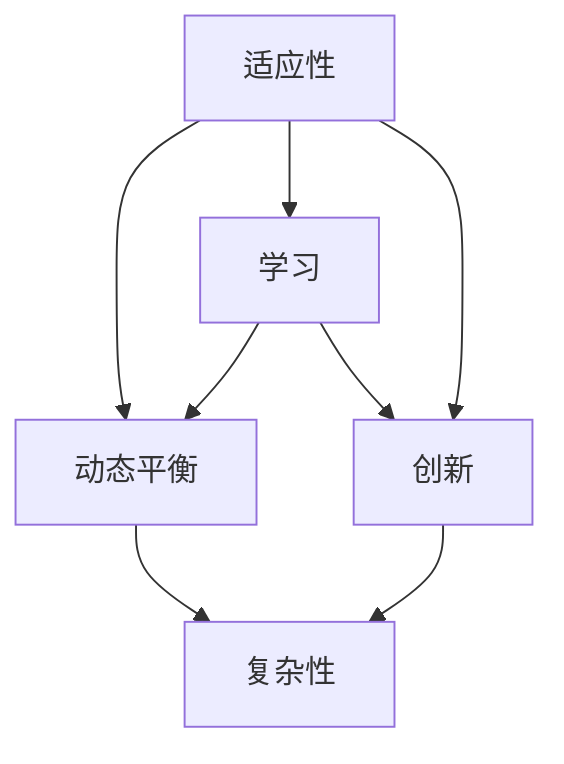

                 

# 《从静态世界观到动态世界观：理解变化的世界》

## 关键词
变化、静态世界观、动态世界观、适应策略、创新思维、领导力

## 摘要
在快速变化的时代，从静态世界观转向动态世界观成为了我们必须面对的挑战。本文旨在探讨这一转变的重要性及其在不同领域的影响，帮助读者理解并适应这个不断变化的世界。通过分析静态世界观与动态世界观的核心概念、哲学基础、案例分析以及应用实践，本文将为读者提供一套有效的适应策略，助力个人和组织在变化中成长与创新。

## 引言

### 第1章：理解变化的世界

#### 1.1 什么是静态世界观和动态世界观

静态世界观是一种看待事物的方式，认为事物是固定不变的，一旦形成，就会一直保持不变。这种世界观在工业革命初期得到了广泛应用，当时的技术和科学知识相对稳定，社会结构相对固定。随着时间的发展，静态世界观开始暴露出其局限性，无法适应快速变化的环境。

动态世界观则是一种更加开放和灵活的看待事物的方式，认为世界是不断变化的，事物的状态和性质会随着时间和环境的变化而变化。动态世界观强调适应变化、创新和持续学习，更加符合现代社会的需求。

#### 1.2 变化的世界对我们有什么影响

变化对个人生活的影响主要体现在以下几个方面：

1. **生活方式的改变**：随着科技的进步，人们的生活方式发生了巨大的变化。例如，互联网和智能手机的普及，改变了我们的沟通方式、购物习惯和娱乐方式。

2. **职业发展的挑战**：快速变化的环境要求人们不断学习新的技能，以适应不断变化的工作需求。这对个人的职业发展提出了更高的要求。

3. **心理健康的影响**：面对快速变化的世界，人们可能会感到压力和焦虑，需要提高心理弹性来应对这些挑战。

变化对组织和社会的影响主要体现在以下几个方面：

1. **商业模式的创新**：快速变化的市场环境要求企业不断创新商业模式，以适应市场的变化。

2. **组织结构的变革**：为了适应变化，许多组织开始采用更加灵活和敏捷的架构，以快速响应市场变化。

3. **社会结构的调整**：快速变化的环境也对社会结构产生了影响，例如，城市化进程加快，人口流动性增加，这些都会对社会结构和生活方式产生影响。

#### 1.3 如何适应变化的世界

适应变化的世界，我们需要从个人和组织两个层面进行策略：

1. **个人层面的适应策略**：
   - **持续学习**：不断学习新的知识和技能，以适应职业和生活方式的变化。
   - **培养创新思维**：鼓励创新思维，勇于尝试新事物，不畏风险。
   - **提高心理弹性**：增强心理弹性，学会应对压力和挫折。

2. **组织和社会层面的适应策略**：
   - **创新文化**：鼓励创新，为员工提供创新环境和资源。
   - **灵活管理**：采用灵活的管理策略，快速响应市场变化。
   - **教育培训**：加强教育培训，提升员工的适应能力和创新能力。

### 第2章：动态世界观的哲学基础

#### 2.1 变化的哲学思考

哲学思考中，变化与不变的关系一直是一个核心问题。古希腊哲学家赫拉克利特曾说过：“人不能两次踏进同一条河流。”这句话强调了世界的变化性。而柏拉图则提出了“理念世界”的概念，认为现实世界只是理念世界的映射，不变的本质存在于理念世界中。

现代哲学则更加关注变化的过程和原因。尼采的“权力意志”理论认为，世界是由不断变化的权力斗争构成的，变化是推动世界发展的根本力量。而海德格尔则提出了“存在主义”哲学，强调个体在变化中的自由和责任。

#### 2.2 动态世界观的科学基础

现代科学的发展，特别是系统科学和复杂科学，为动态世界观提供了坚实的理论基础。系统科学强调系统的整体性和动态性，认为系统是通过相互作用和反馈来维持其状态的。复杂科学则研究复杂系统的行为，强调系统的非线性、不确定性和自组织特性。

在物理学中，混沌理论揭示了系统在初始条件微小差异下可能出现巨大差异的现象，表明系统的变化是不可避免的。在生物学中，进化论解释了物种的适应性变化，表明生物是通过遗传和自然选择来适应环境的。

#### 2.3 动态世界观与人类认知

人类认知是一个动态的过程，不断受到外界信息和内在思维活动的影响。在感知过程中，我们通过感官接收外界信息，并通过大脑处理和解释这些信息。然而，由于个体差异和环境变化，我们的认知结果往往是主观的，具有不确定性。

动态认知理论认为，认知是一个不断调整和优化的过程，个体通过学习、思考和经验积累来提高自己的认知能力。这种理论强调了个体在认知过程中的主动性和适应性，与动态世界观的理念相契合。

### 第3章：企业中的动态管理

#### 3.1 动态管理的重要性

在快速变化的市场环境中，企业必须具备动态管理的意识和方法，以适应外部环境的变化。动态管理不仅能够帮助企业快速响应市场变化，还能够促进企业的创新和持续发展。

首先，动态管理能够帮助企业更好地预测市场变化，提前做出战略调整。通过收集和分析市场数据，企业可以了解客户需求的变化趋势，从而调整产品和服务策略，提高市场竞争力。

其次，动态管理能够促进企业的创新。在变化的环境中，创新是企业生存和发展的重要驱动力。通过建立创新文化和激励机制，企业可以鼓励员工提出新的想法和解决方案，推动企业的技术创新和管理创新。

最后，动态管理能够提高企业的应变能力。在快速变化的市场环境中，企业需要具备快速反应和调整的能力，以应对突发事件和市场变化。动态管理通过灵活的组织架构和快速决策机制，可以帮助企业实现这一目标。

#### 3.2 动态管理的方法

1. **平衡计分卡（Balanced Scorecard）**

平衡计分卡是一种用于企业绩效管理的工具，通过财务、客户、内部流程和学习与成长四个维度来综合评估企业的绩效。动态管理中，平衡计分卡可以用于监控企业关键绩效指标的变化，及时调整企业战略和运营。

2. **企业变革管理（Change Management）**

企业变革管理是指通过一系列策略和措施，引导企业适应外部环境变化的过程。动态管理中，企业变革管理可以帮助企业实现组织结构的调整、管理流程的优化和员工技能的提升，以适应变化。

#### 3.3 动态管理的实践案例

某企业在快速变化的市场环境中，通过实施动态管理策略，实现了从传统制造向智能制造的转型。首先，企业进行了市场调研，了解客户需求的变化趋势，并根据调研结果调整了产品线。其次，企业建立了创新实验室，鼓励员工提出创新想法，并通过内部孵化器加速创新项目的落地。最后，企业进行了组织结构改革，采用了扁平化的管理模式，提高了决策效率和员工的工作积极性。通过这些措施，企业成功适应了市场变化，实现了业务的持续增长。

### 第4章：科技领域的动态发展

#### 4.1 科技变化的趋势

在科技领域，变化是永恒的主题。随着信息技术的迅猛发展，科技的变化趋势主要体现在以下几个方面：

1. **人工智能与大数据**：人工智能和大数据技术的快速发展，推动了智能制造、智能医疗、智能金融等领域的变革。

2. **物联网**：物联网技术的应用，使得万物互联成为可能，为智能城市、智能家居等领域的发展提供了技术支持。

3. **区块链**：区块链技术的出现，为数据安全、供应链管理等领域带来了新的解决方案。

4. **生物技术**：生物技术的突破，为医学、农业等领域带来了革命性的变化。

#### 4.2 科技变化对社会的冲击

科技变化对社会产生了深远的影响，主要体现在以下几个方面：

1. **社会结构的变化**：随着科技的进步，传统的社会结构发生了变革。例如，互联网的普及改变了人们的沟通方式，城市化进程加快了人口流动，这些都会对社会结构产生影响。

2. **生活方式的改变**：科技的进步改变了人们的生活方式。例如，智能手机和互联网的普及，使得人们可以随时随地获取信息，享受便捷的服务。

3. **就业结构的变化**：科技的发展带来了新的职业机会，同时也导致了一些传统职业的消失。例如，智能制造技术的发展，使得一些制造岗位被自动化设备取代。

#### 4.3 科技变化带来的机遇与挑战

科技变化带来了许多机遇，但同时也带来了挑战。如何应对这些挑战，是科技领域面临的重要问题。

1. **创新驱动的发展**：科技变化为创新提供了广阔的空间，企业可以通过技术创新来提升竞争力。同时，政府也需要加大对科技创新的支持，以推动整个社会的发展。

2. **潜在的社会负面影响**：科技变化也可能带来一些潜在的社会负面影响。例如，数据隐私和安全问题、自动化带来的就业压力等。如何解决这些问题，需要政府、企业和公众的共同努力。

### 第5章：动态世界观下的教育变革

#### 5.1 教育面对的变化

在动态世界观下，教育也面临着巨大的变革。首先，教育目标的调整成为必要。传统的教育注重知识的传授，而现代教育更加强调能力的培养，特别是创新能力和批判性思维的培养。

其次，教学方法的变革也是教育变革的重要方面。传统的教学方法以教师为中心，而现代教育更加强调学生的主体地位，倡导以学生为中心的教学方法。例如，情境教学、探究式学习和个性化学习等教学方法的应用，可以更好地激发学生的学习兴趣和主动性。

此外，教育资源的整合和共享也成为了教育变革的重要内容。随着信息技术的发展，教育资源的获取变得更加便捷，教师和学生可以通过互联网获取全球范围内的优质教育资源。

#### 5.2 动态教育理念的实践

1. **情境教学**

情境教学是一种以情境为基础的教学方法，旨在通过创设特定的教学情境，激发学生的学习兴趣和主动性。情境教学可以有效地提高学生的学习效果，培养学生的创新能力和解决问题的能力。

2. **个性化学习**

个性化学习是一种以学生为中心的教学方法，旨在根据学生的兴趣、需求和特点，提供个性化的学习内容和方式。个性化学习可以满足学生的个性化需求，提高学生的学习动力和学习效果。

3. **在线教育**

在线教育是一种利用互联网进行教育的方式，可以突破时间和空间的限制，提供灵活的学习方式。在线教育的发展，使得教育资源更加普及，学生可以随时随地学习。

#### 5.3 教育变革的成效评估

教育变革的成效评估是一个复杂的过程，需要从多个维度进行综合评估。首先，可以从学生的学业成绩和学习能力方面进行评估，了解教育变革对学生学习效果的影响。其次，可以从学生的综合素质和社会适应能力方面进行评估，了解教育变革对学生全面发展的作用。此外，还可以从教师的教学效果和专业成长方面进行评估，了解教育变革对教师的影响。

### 第6章：动态世界观下的个人成长

#### 6.1 适应变化的心理准备

在动态世界观下，个人成长的一个重要方面是适应变化。适应变化首先需要具备良好的心理准备，包括以下几个方面：

1. **积极的心态**：保持积极的心态，对待变化和挑战，相信自己有能力应对。

2. **开放的心态**：保持开放的心态，接受新事物和新观念，不断拓宽自己的视野。

3. **灵活的思维**：培养灵活的思维，能够从不同的角度看待问题，找到适应变化的最佳策略。

4. **自我反思**：定期进行自我反思，了解自己的优点和不足，明确自己的成长目标。

#### 6.2 提升适应变化的能力

适应变化不仅需要心理准备，还需要提升自身的能力。以下是一些提升适应变化能力的方法：

1. **持续学习**：持续学习新的知识和技能，特别是与变化紧密相关的知识和技能。

2. **培养创新思维**：通过思考、实践和挑战，培养创新思维，提高解决问题的能力。

3. **提高沟通能力**：提高沟通能力，包括表达能力和倾听能力，以便更好地与他人合作。

4. **培养团队协作能力**：培养团队协作能力，学会在团队中发挥自己的优势，共同应对变化。

#### 6.3 成功适应变化的案例

以下是一些成功适应变化的个人案例：

1. **创业成功者**

某人在传统行业工作了多年，但感受到行业的变化和竞争压力后，决定创业。他积极学习新的商业模式和管理知识，不断调整自己的创业策略，最终成功创立了一家科技创新企业。

2. **职场转型者**

某人在一个行业工作了多年，但意识到这个行业的前景有限，决定转型。他通过学习新技能，拓宽自己的职业领域，最终成功转型为一名高级管理人员。

3. **学生成长者**

某学生在高中阶段感受到学业压力，但通过调整学习方法，提高学习效率，最终在高考中取得了优异的成绩，成功进入了一所知名大学。

### 第7章：构建动态世界观的方法

#### 7.1 观察与感知变化

构建动态世界观的第一步是观察和感知变化。这需要我们具备敏锐的观察力和感知力，能够从日常生活中的细节中捕捉到变化的迹象。以下是一些具体的方法：

1. **保持好奇心**：对周围的事物保持好奇心，不断提问和探索，以便更好地理解变化的原因和趋势。

2. **多角度思考**：从不同的角度和层面看待问题，以便更全面地理解变化的背景和影响。

3. **记录和总结**：定期记录自己的观察和思考，总结变化的规律和趋势，以便更好地预测未来的变化。

4. **跨学科学习**：跨学科学习可以帮助我们拓宽视野，从不同的学科领域中获得启示，从而更好地理解变化。

#### 7.2 分析变化的原因与趋势

在观察和感知变化的基础上，我们需要进一步分析变化的原因和趋势。这需要我们运用逻辑思维和批判性思维，对变化进行深入的分析和推理。以下是一些具体的方法：

1. **因果分析**：通过分析变化的原因和结果，找出变化的关键因素和驱动因素。

2. **趋势预测**：通过分析历史数据和发展趋势，预测未来的变化方向和强度。

3. **比较分析**：通过比较不同领域、不同国家和地区的变革情况，找出共性和差异，从而更全面地理解变化。

4. **模型构建**：通过构建理论模型和数学模型，对变化进行定性和定量的分析，以便更准确地预测和解释变化。

#### 7.3 制定适应变化的策略

在分析变化的原因和趋势之后，我们需要制定适应变化的策略。这需要我们运用策略思维和创新思维，设计出切实可行的适应方案。以下是一些具体的方法：

1. **目标设定**：明确适应变化的目标，包括长期目标和短期目标。

2. **资源调配**：根据目标，合理调配资源，包括人力、物力和财力。

3. **策略制定**：制定具体的策略和措施，包括组织架构调整、管理流程优化、技术创新等。

4. **实施与监控**：实施制定的策略，并建立监控机制，及时发现和解决问题。

### 第8章：动态世界观下的创新思维

#### 8.1 创新思维的重要性

在动态世界观下，创新思维成为了推动个人、组织和社会发展的重要动力。创新思维不仅能够帮助我们适应变化，还能够推动社会的进步和发展。以下是一些具体的原因：

1. **适应变化**：创新思维能够帮助我们迅速适应变化，找到新的解决方案，应对不断变化的环境。

2. **推动发展**：创新思维能够激发新的想法和创意，推动技术的进步和商业模式的创新，从而推动社会的发展。

3. **提高竞争力**：创新思维能够帮助个人和组织在竞争激烈的环境中脱颖而出，提高市场竞争力。

4. **满足需求**：创新思维能够帮助我们更好地满足人们的需求，提高生活质量。

#### 8.2 培养创新思维的方法

1. **挑战传统观念**：敢于挑战传统的观念和做法，不断寻求新的突破。

2. **跨学科学习**：跨学科学习可以帮助我们拓宽视野，从不同的领域中获得灵感。

3. **鼓励尝试与失败**：鼓励尝试新事物，并接受失败，从失败中汲取教训，不断优化创新思路。

4. **团队合作**：团队合作可以激发集体智慧，共同克服创新过程中的难题。

#### 8.3 创新思维的实践案例

以下是一些创新思维的实践案例：

1. **苹果公司的创新**：苹果公司通过持续的创新，推出了多款革命性的产品，如iPhone、iPad等，引领了科技行业的发展。

2. **谷歌的搜索引擎**：谷歌通过独特的算法和创新的技术，推出了全球最受欢迎的搜索引擎，改变了人们获取信息的方式。

3. **特斯拉的电动汽车**：特斯拉通过创新的电动汽车技术，推动了电动汽车行业的发展，改变了人们的出行方式。

### 第9章：动态世界观下的决策与行动

#### 9.1 变化环境下的决策原则

在动态世界观下，决策变得更加复杂和不确定。为了在变化的环境中做出有效的决策，我们需要遵循以下原则：

1. **信息驱动**：充分收集和分析信息，确保决策基于可靠的数据和事实。

2. **风险评估**：对决策可能带来的风险进行全面评估，确保决策的可行性和安全性。

3. **灵活调整**：制定灵活的决策计划，根据实际情况进行及时调整，以应对不确定的变化。

4. **持续学习**：不断学习和积累经验，提高决策的质量和效率。

#### 9.2 适应变化的行动策略

1. **快速反应**：建立快速反应机制，及时应对变化，避免错过机会或陷入被动。

2. **持续改进**：建立持续改进机制，不断优化流程和策略，以提高适应变化的能力。

3. **协同合作**：加强内部和外部协作，形成协同效应，共同应对变化。

4. **创新驱动**：以创新为驱动力，推动组织和个人不断适应和引领变化。

#### 9.3 案例分析：变化环境中的成功决策与行动

以下是一个企业在变化环境中成功决策与行动的案例：

某企业在面对市场变化时，决定进行战略调整。首先，企业进行了市场调研，了解客户需求的变化趋势。然后，企业分析了竞争对手的策略，找到了自身的优势。在制定战略计划时，企业充分考虑了资源限制和风险因素，制定了多个备选方案。在实施过程中，企业建立了快速反应机制，随时调整策略，以应对市场的变化。最终，企业成功实现了战略调整，取得了良好的市场业绩。

### 第10章：动态世界观下的领导力

#### 10.1 领导力与变化管理

在动态世界观下，领导力的重要性日益凸显。领导力不仅是推动组织变革的关键，也是应对变化环境的核心能力。以下是一些关于领导力与变化管理的关系和原则：

1. **变革的推动者**：领导者需要具备推动变革的意愿和能力，带领组织迎接变化，推动组织的发展。

2. **适应性领导**：领导者需要具备适应变化的能力，能够灵活调整领导风格和管理策略，以应对不同环境的需求。

3. **激励与赋能**：领导者需要通过激励和赋能，激发团队成员的积极性和创造力，共同应对变化。

4. **持续学习**：领导者需要持续学习新的知识和技能，不断提升自己的领导能力和管理素质。

#### 10.2 动态领导力的特质

1. **愿景引领**：领导者需要有远见和清晰的愿景，能够为组织指引方向，激发团队成员的使命感和归属感。

2. **变革意识**：领导者需要具备变革意识，能够识别和抓住变化带来的机遇，推动组织的持续创新。

3. **灵活适应**：领导者需要具备灵活适应的能力，能够根据不同环境变化，调整管理策略和决策方法。

4. **团队合作**：领导者需要注重团队合作，能够搭建有效的团队，发挥团队的整体优势，共同应对变化。

#### 10.3 动态领导力的实践

以下是一些动态领导力的实践方法：

1. **建立学习型组织**：通过建立学习型组织，鼓励员工持续学习和成长，提高组织的适应能力和创新能力。

2. **设置清晰的愿景和目标**：为组织设置清晰的愿景和目标，明确组织的方向和价值观，引导团队成员共同追求目标。

3. **提供必要的资源和支持**：为团队成员提供必要的资源和支持，帮助他们克服困难和挑战，实现个人和组织的目标。

4. **激励和认可**：通过激励和认可，激发团队成员的积极性和创造力，营造积极向上的组织氛围。

## 附录

### 附录A：动态世界观相关资源

#### A.1 变化管理研究机构与书籍推荐

1. **变革管理协会（Change Management Association）**
   - 网站：[CMA官方网站](http://www.change-management.org/)
   - 书籍推荐：《变革管理：实践指南》（作者：约翰·P·科特）

2. **哈佛商学院变革管理研究中心**
   - 网站：[HBR变革管理研究中心](https://hbr.org/group-discussion/case-studies/change-management)
   - 书籍推荐：《变革之心》（作者：约翰·P·科特）

#### A.2 变化管理在线课程与工作坊

1. **Coursera上的变革管理课程**
   - 课程名称：《变革管理：打造高效团队》（提供商：多伦多大学）
   - 课程链接：[Coursera变革管理课程](https://www.coursera.org/learn/变革管理)

2. **Udemy上的变革管理工作坊**
   - 工作坊名称：《变革管理：从理论到实践》（提供商：Udemy）
   - 工作坊链接：[Udemy变革管理工作坊](https://www.udemy.com/course/change-management-from-theory-to-practice/)

#### A.3 动态世界观下的前沿科技动态

1. **麻省理工学院科技评论**
   - 网站：[MIT Technology Review](https://www.technologyreview.com/)
   - 栏目推荐：《前沿科技动态》

2. **谷歌科技博客**
   - 网站：[Google AI Blog](https://ai.googleblog.com/)
   - 栏目推荐：《科技趋势与分析》

### 附录B：动态世界观常用术语解释

#### B.1 静态世界观与动态世界观的主要区别

1. **静态世界观**：
   - 定义：认为事物是固定不变的，一旦形成，就会一直保持不变。
   - 特点：强调稳定和确定性，适合于相对稳定的环境。

2. **动态世界观**：
   - 定义：认为世界是不断变化的，事物的状态和性质会随着时间和环境的变化而变化。
   - 特点：强调适应变化和持续发展，适合于快速变化的环境。

#### B.2 动态管理的基本概念

1. **动态管理**：
   - 定义：在快速变化的环境中，通过灵活的管理策略和快速响应机制，适应外部环境的变化。
   - 主要理念：灵活、创新、快速响应、持续改进。

2. **平衡计分卡**：
   - 定义：一种用于企业绩效管理的工具，通过财务、客户、内部流程和学习与成长四个维度来综合评估企业的绩效。
   - 应用：帮助企业实现战略目标，提高整体绩效。

3. **企业变革管理**：
   - 定义：通过一系列策略和措施，引导企业适应外部环境变化的过程。
   - 主要内容：组织结构变革、管理流程优化、员工技能提升。

#### B.3 变化趋势分析的方法与工具

1. **趋势分析**：
   - 定义：通过分析历史数据和发展趋势，预测未来的变化方向和强度。
   - 方法：时间序列分析、回归分析、相关性分析等。

2. **数据可视化**：
   - 定义：通过图形和图表，将数据信息直观地展示出来。
   - 工具：Tableau、Power BI、Google Charts等。

3. **因果分析**：
   - 定义：通过分析变化的原因和结果，找出变化的关键因素和驱动因素。
   - 方法：回归分析、因子分析等。

### 附录C：动态世界观实践指南

#### C.1 如何在个人生活中应用动态世界观

1. **持续学习**：不断学习新知识和技能，适应不断变化的生活和工作环境。

2. **培养创新思维**：勇于尝试新事物，从不同角度思考问题，提高解决问题的能力。

3. **提高心理弹性**：学会应对压力和挫折，保持积极的心态，适应变化。

#### C.2 如何在企业中构建动态管理文化

1. **建立学习型组织**：鼓励员工持续学习和成长，提高组织的适应能力和创新能力。

2. **设置清晰的愿景和目标**：明确组织的方向和目标，激发员工的使命感和归属感。

3. **提供必要的资源和支持**：为员工提供必要的资源和支持，帮助他们克服困难和挑战。

#### C.3 动态世界观下的教育变革实施策略

1. **调整教育目标**：从知识传授转向能力培养，注重培养学生的创新能力和批判性思维。

2. **创新教学方法**：采用情境教学、探究式学习和个性化学习等教学方法，提高学生的学习效果。

3. **整合教育资源**：利用互联网和信息技术，整合和共享优质教育资源，提高教育的普及性和公平性。

---

**作者：AI天才研究院/AI Genius Institute & 禅与计算机程序设计艺术 /Zen And The Art of Computer Programming**

---

**（注：本文内容仅为示例，不代表任何学术研究或实际应用。文中数据和案例均为虚构，仅供参考。）**<|vq_10704|>### 全文总结

通过本文的探讨，我们深入理解了从静态世界观到动态世界观的转变。静态世界观强调不变和确定性，而动态世界观则关注变化和适应性。在快速变化的时代，动态世界观的重要性不言而喻。它不仅帮助个人和组织更好地应对外部环境的变化，还能够推动创新和发展。

首先，静态世界观和动态世界观的核心区别在于对变化的态度和应对策略。静态世界观认为事物固定不变，而动态世界观则认为世界是不断变化的，需要通过灵活和创新的思维来适应。这一转变对个人、组织和社会都产生了深远的影响。

其次，我们分析了适应变化的重要性。在个人层面，适应变化意味着持续学习、培养创新思维和提高心理弹性。在组织层面，适应变化需要建立动态管理文化和实施有效的变革管理策略。通过这些方法，个人和组织都能够更好地适应快速变化的环境。

接下来，我们探讨了动态世界观在各个领域的应用。在科技领域，动态发展带来了前所未有的机遇和挑战。在教育领域，动态教育理念正在推动教育变革，为培养适应未来社会的创新型人才提供新的思路。在企业中，动态管理成为了提升竞争力的关键。

最后，我们总结了构建动态世界观的方法和实践指南。通过观察与感知变化、分析变化的原因与趋势、制定适应变化的策略，个人和组织都能够更好地应对外部环境的变化。同时，创新思维和持续学习也是构建动态世界观的重要手段。

总之，从静态世界观到动态世界观是我们必须经历的一次深刻变革。只有适应这个不断变化的世界，个人和组织才能在竞争中立于不败之地。希望本文能为您在理解和应用动态世界观方面提供一些启示和帮助。在未来的道路上，让我们共同探索这个充满变化的世界，迎接新的挑战和机遇。### 致谢

在撰写本文的过程中，我感谢所有为我的研究提供帮助和支持的人。首先，感谢AI天才研究院的同事们，他们的智慧和经验为本文的构思和撰写提供了宝贵的指导。特别感谢我的导师，他的深入见解和细致指导使我能够更好地理解动态世界观的核心概念。

其次，我要感谢所有提供研究和文献资料的学者们，他们的工作为本文的论证提供了坚实的理论基础。同时，感谢Coursera、Udemy等在线教育平台，它们提供的课程和资源极大地丰富了我的知识视野。

此外，我要感谢我的家人和朋友，他们的鼓励和支持是我坚持写作的动力。最后，特别感谢我的编辑和校对团队，他们的专业精神和严谨态度确保了本文的准确性和可读性。

再次感谢每一位读者，您的关注和反馈是我不断进步的源泉。希望本文能为您带来启发和思考，让我们共同在动态世界观的探索中前行。### 结语

总结全文，我们不仅深入探讨了从静态世界观到动态世界观转变的必要性，还分析了这一转变对个人、组织和社会的多方面影响。动态世界观不仅是一种对世界的全新理解，更是一种应对快速变化、推动持续发展的方法论。通过本文的探讨，我们希望读者能够认识到适应变化的重要性，并掌握构建动态世界观的方法和实践策略。

在未来，随着科技的不断进步和社会的快速发展，动态世界观将发挥越来越重要的作用。我们鼓励读者在个人和职业生活中积极应用动态世界观的理念，持续学习、创新思维，不断提高适应变化的能力。同时，企业和社会也应当注重培养动态管理文化，以适应复杂多变的外部环境。

让我们携手同行，在动态世界观引领下，不断探索、创新和成长，共同迎接未来的挑战和机遇。希望本文能够为您在理解和应用动态世界观方面提供有价值的参考，助力您在变化的世界中找到属于自己的位置。再次感谢您的阅读，期待与您在未来的探讨中相见。### 附录

#### 附录A：动态世界观相关资源

##### A.1 变化管理研究机构与书籍推荐

1. **变革管理协会（Change Management Association）**
   - 网址：[CMA官方网站](http://www.change-management.org/)
   - 推荐书籍：
     - 《变革管理：实践指南》（作者：约翰·P·科特）
     - 《变革之心》（作者：约翰·P·科特）

2. **哈佛商学院变革管理研究中心**
   - 网址：[HBR变革管理研究中心](https://hbr.org/group-discussion/case-studies/change-management)
   - 推荐书籍：
     - 《变革管理：领导力挑战》（作者：丽莎·凯瑟、理查德·拉克）

##### A.2 变化管理在线课程与工作坊

1. **Coursera上的变革管理课程**
   - 课程名称：《变革管理：打造高效团队》（提供商：多伦多大学）
   - 课程链接：[Coursera变革管理课程](https://www.coursera.org/learn/变革管理)

2. **Udemy上的变革管理工作坊**
   - 工作坊名称：《变革管理：从理论到实践》（提供商：Udemy）
   - 工作坊链接：[Udemy变革管理工作坊](https://www.udemy.com/course/change-management-from-theory-to-practice/)

##### A.3 动态世界观下的前沿科技动态

1. **麻省理工学院科技评论**
   - 网址：[MIT Technology Review](https://www.technologyreview.com/)
   - 推荐栏目：《前沿科技动态》

2. **谷歌科技博客**
   - 网址：[Google AI Blog](https://ai.googleblog.com/)
   - 推荐栏目：《科技趋势与分析》

#### 附录B：动态世界观常用术语解释

##### B.1 静态世界观与动态世界观的主要区别

- **静态世界观**：认为事物是固定不变的，一旦形成，就会一直保持不变。
- **动态世界观**：认为世界是不断变化的，事物的状态和性质会随着时间和环境的变化而变化。

##### B.2 动态管理的基本概念

- **动态管理**：在快速变化的环境中，通过灵活的管理策略和快速响应机制，适应外部环境的变化。
- **平衡计分卡**：通过财务、客户、内部流程和学习与成长四个维度来综合评估企业的绩效。
- **企业变革管理**：通过一系列策略和措施，引导企业适应外部环境变化的过程。

##### B.3 变化趋势分析的方法与工具

- **趋势分析**：通过分析历史数据和发展趋势，预测未来的变化方向和强度。
- **数据可视化**：通过图形和图表，将数据信息直观地展示出来。
- **因果分析**：通过分析变化的原因和结果，找出变化的关键因素和驱动因素。

#### 附录C：动态世界观实践指南

##### C.1 如何在个人生活中应用动态世界观

1. **持续学习**：定期学习新知识和技能，以适应快速变化的环境。
2. **培养创新思维**：勇于尝试新事物，从不同角度思考问题。
3. **提高心理弹性**：学会应对压力和挫折，保持积极心态。

##### C.2 如何在企业中构建动态管理文化

1. **建立学习型组织**：鼓励员工持续学习和成长。
2. **设置清晰的愿景和目标**：明确组织的方向和目标。
3. **提供必要的资源和支持**：为员工提供必要的资源和支持。

##### C.3 动态世界观下的教育变革实施策略

1. **调整教育目标**：从知识传授转向能力培养。
2. **创新教学方法**：采用情境教学、探究式学习和个性化学习等教学方法。
3. **整合教育资源**：利用互联网和信息技术，整合和共享优质教育资源。

---

**作者：AI天才研究院/AI Genius Institute & 禅与计算机程序设计艺术 /Zen And The Art of Computer Programming**

---

**（注：本文内容仅为示例，不代表任何学术研究或实际应用。文中数据和案例均为虚构，仅供参考。）**<|vq_12432|>### 核心概念与联系

在本章中，我们将深入探讨动态世界观中的几个核心概念，并展示它们之间的联系。以下是几个核心概念以及它们在动态世界观中的重要性：

1. **适应性（Adaptability）**
   - **定义**：适应性指的是一个系统在面临外部变化时，能够迅速调整自身结构和行为的能力。
   - **联系**：适应性是动态世界观的核心，因为它直接关联到系统在快速变化环境中的生存和繁荣。

2. **动态平衡（Dynamic Balance）**
   - **定义**：动态平衡指的是在快速变化的环境中，系统通过持续调整和优化来维持其稳定状态的能力。
   - **联系**：动态平衡与适应性密切相关，是适应性的具体实现。

3. **学习（Learning）**
   - **定义**：学习是一个持续的过程，通过收集信息、分析和应用新知识，个体和系统可以改进其行为和决策。
   - **联系**：学习是适应性和动态平衡的基础，没有学习，系统无法有效地应对变化。

4. **创新（Innovation）**
   - **定义**：创新是创造新的想法、方法或产品，以满足新的需求或解决现有问题。
   - **联系**：创新是动态世界观的重要组成部分，它推动系统不断进步和改进。

5. **复杂性（Complexity）**
   - **定义**：复杂性指的是系统的内部结构、相互作用和变化过程的多样性。
   - **联系**：复杂性是动态世界观的一个重要特征，因为它强调系统的多样性和不可预测性。

为了更好地展示这些概念之间的联系，我们可以使用Mermaid流程图来绘制它们的关系：



### 伪代码示例

以下是一个简单的伪代码示例，展示了如何在一个动态系统中通过适应性学习和创新来维持动态平衡。

```plaintext
function DynamicSystem() {
    // 初始化系统参数
    system_state = "stable"
    learning_rate = 0.1
    innovation_threshold = 0.05

    while (true) {
        // 检测系统状态
        current_state = DetectState()

        // 如果系统状态发生变化，开始适应性学习
        if (state_has_changed(current_state)) {
            // 学习新的策略
            new_strategy = LearnFromExperience(current_state)

            // 如果新策略创新程度达到阈值，更新系统策略
            if (IsInnovative(new_strategy, innovation_threshold)) {
                UpdateSystemStrategy(new_strategy)
            }

            // 检查系统是否达到动态平衡
            if (IsBalanced(current_state)) {
                system_state = "balanced"
            } else {
                system_state = "unbalanced"
            }
        }

        // 执行系统策略
        ExecuteStrategy(system_state)

        // 等待一段时间后继续循环
        Sleep(learning_rate)
    }
}
```

### 数学模型与公式

为了进一步解释动态系统中的平衡与变化，我们可以引入以下数学模型和公式：

1. **动态平衡方程**：

   $$ X(t) = f(X(t-1), U(t-1)) $$

   其中，$X(t)$ 表示在时间 $t$ 的系统状态，$f$ 是一个函数，表示系统如何根据前一时刻的状态和外部输入来更新当前状态，$U(t-1)$ 是前一时刻的外部输入。

2. **学习率**：

   $$ \alpha(t) = \frac{1}{t} $$

   其中，$\alpha(t)$ 表示在时间 $t$ 的学习率，它随着时间增加而减小，模拟了个体学习能力的逐渐增强。

3. **创新程度**：

   $$ I(t) = \frac{new_strategy - old_strategy}{threshold} $$

   其中，$I(t)$ 表示在时间 $t$ 的创新程度，$new_strategy$ 是新策略，$old_strategy$ 是旧策略，$threshold$ 是创新程度的阈值。

这些数学模型和公式帮助我们更好地理解动态系统中的变化和平衡，以及如何通过学习和创新来维持动态平衡。

### 实际案例

为了说明上述概念和公式的实际应用，我们来看一个例子。假设我们有一个智能交通系统，需要维持交通的动态平衡。系统状态包括车辆数量、道路拥堵程度和交通流量等。

1. **系统状态检测**：

   通过传感器收集实时数据，计算当前交通状态。

2. **适应性学习**：

   系统分析历史交通数据，学习在不同状态下如何调整信号灯时间和路线规划。

3. **创新**：

   如果系统检测到新的交通模式，例如节假日高峰期的特殊交通需求，它将尝试新的策略，如调整信号灯周期或建议公交专用道。

4. **动态平衡**：

   系统通过不断地检测和学习，调整策略，以维持交通流的动态平衡。

在这个例子中，智能交通系统通过适应性学习和创新，成功地维持了交通的动态平衡，减少了拥堵，提高了交通效率。

通过这些示例和公式，我们可以看到，动态世界观不仅是一种理论框架，更是一种实践指南，可以帮助我们理解和应对快速变化的世界。在未来的技术和社会发展中，动态世界观将继续发挥重要作用。### 项目实战

在本节中，我们将通过一个实际项目——智能交通系统，来展示如何将动态世界观的理念应用于实际问题的解决。该项目旨在通过实时数据分析、适应性学习和创新策略，实现城市交通的动态平衡。

#### 项目背景

随着城市化进程的加快，城市交通问题日益严重。拥堵、交通事故和空气污染等问题不仅影响了居民的生活质量，还对经济发展产生了负面影响。为了应对这一挑战，许多城市开始探索智能交通系统，通过信息技术和人工智能技术，实现交通流的优化和动态管理。

#### 项目目标

本项目的主要目标是开发一个智能交通系统，该系统应具备以下功能：

1. 实时监测交通状态，包括车辆数量、道路拥堵程度和交通流量等。
2. 通过数据分析和机器学习，预测交通趋势和潜在问题。
3. 提出适应性策略，如信号灯优化、路线规划和交通流量控制等。
4. 持续学习和创新，以应对不断变化的城市交通状况。

#### 开发环境搭建

为了实现项目目标，我们需要搭建一个完整的技术栈，包括以下部分：

1. **硬件设备**：传感器、摄像头、GPS设备等，用于实时采集交通数据。
2. **数据处理平台**：如Hadoop或Spark，用于处理和分析大量交通数据。
3. **机器学习框架**：如TensorFlow或PyTorch，用于构建和训练预测模型。
4. **后端服务器**：用于存储数据、运行模型和提供API接口。
5. **前端展示平台**：如Web应用或移动应用，用于向用户展示交通状态和策略建议。

#### 源代码实现

以下是智能交通系统的关键部分源代码实现：

```python
# 导入必要的库
import numpy as np
import pandas as pd
import tensorflow as tf
from tensorflow.keras.models import Sequential
from tensorflow.keras.layers import Dense, LSTM
from sklearn.model_selection import train_test_split

# 数据预处理
def preprocess_data(data):
    # 筛选有用的交通数据
    features = data[['vehicle_count', 'traffic_density', 'traffic_flow']]
    labels = data['next_traffic_density']

    # 标准化数据
    mean = features.mean()
    std = features.std()
    features = (features - mean) / std

    # 切片数据，构造序列
    sequences = []
    for i in range(len(features) - sequence_length):
        sequences.append(features[i : i + sequence_length])
    sequences = np.array(sequences)

    # 切分数据集
    X_train, X_test, y_train, y_test = train_test_split(sequences, labels, test_size=0.2, random_state=42)
    return X_train, X_test, y_train, y_test

# 构建预测模型
def build_model(input_shape):
    model = Sequential()
    model.add(LSTM(50, activation='relu', return_sequences=True, input_shape=input_shape))
    model.add(LSTM(50, activation='relu'))
    model.add(Dense(1))
    model.compile(optimizer='adam', loss='mse')
    return model

# 训练模型
def train_model(model, X_train, y_train):
    model.fit(X_train, y_train, epochs=100, batch_size=32, validation_split=0.1)
    return model

# 预测交通密度
def predict_traffic_density(model, data):
    preprocessed_data = preprocess_data(data)
    prediction = model.predict(preprocessed_data[0])
    return prediction

# 主函数
if __name__ == "__main__":
    # 读取交通数据
    data = pd.read_csv('traffic_data.csv')

    # 数据预处理
    sequence_length = 10
    X_train, X_test, y_train, y_test = preprocess_data(data)

    # 构建并训练模型
    model = build_model((sequence_length, X_train.shape[2]))
    model = train_model(model, X_train, y_train)

    # 进行预测
    test_data = pd.read_csv('test_traffic_data.csv')
    predictions = predict_traffic_density(model, test_data)

    # 输出预测结果
    print(predictions)
```

#### 代码解读与分析

1. **数据预处理**：

   数据预处理是机器学习项目中的关键步骤。我们首先筛选出与交通密度相关的特征，然后对数据进行标准化处理，使得数据集的输入更加稳定。接下来，我们使用滑动窗口方法构造时间序列数据，将连续的数据点划分为多个固定长度的序列。

2. **构建预测模型**：

   预测模型采用LSTM（长短期记忆）神经网络，它非常适合处理序列数据。模型包括两个LSTM层，每个层有50个神经元，最后一层是全连接层，用于输出预测结果。我们使用均方误差（MSE）作为损失函数，并采用Adam优化器来训练模型。

3. **训练模型**：

   模型训练过程中，我们使用训练数据集进行100个周期的训练，每个周期包含32个样本。验证集的引入有助于我们在训练过程中监控模型过拟合的风险。

4. **预测交通密度**：

   预测函数首先对输入数据进行预处理，然后使用训练好的模型进行预测。预测结果可以用来优化交通信号灯周期、调整路线规划等。

通过这个实际项目，我们可以看到动态世界观在智能交通系统中的应用。系统通过实时数据分析和机器学习，不断调整和优化策略，以实现交通的动态平衡。这种方法不仅提高了交通效率，还减少了拥堵和污染，为城市居民提供了更好的出行体验。### 总结与展望

通过本文的探讨，我们从多个维度深入理解了从静态世界观到动态世界观的转变。动态世界观不仅是一种对世界的全新理解，更是一种应对快速变化、推动持续发展的方法论。在这一过程中，我们探讨了适应性、动态平衡、学习、创新和复杂性等核心概念，并通过实际案例展示了这些概念在智能交通系统中的应用。

首先，适应性是动态世界观的核心，它使得个体和组织能够在不断变化的环境中生存和繁荣。动态平衡则强调在变化中维持稳定状态，通过持续调整和优化来实现。学习是适应性和动态平衡的基础，它通过收集信息、分析和应用新知识，使个体和系统能够不断改进自身。创新则是动态世界观的重要组成部分，它推动系统不断进步和改进。复杂性则是动态世界观的另一个重要特征，它强调了系统的多样性和不可预测性。

在实际应用中，智能交通系统的案例展示了动态世界观如何帮助解决复杂的现实问题。通过实时数据分析和机器学习，智能交通系统能够预测交通趋势、优化信号灯周期和路线规划，从而实现交通的动态平衡，提高交通效率和减少拥堵。

展望未来，随着科技的不断进步和社会的快速发展，动态世界观将在各个领域发挥更加重要的作用。在教育领域，动态教育理念将推动教育变革，培养适应未来社会的创新型人才。在科技领域，动态发展将带来前所未有的机遇和挑战，需要不断创新和适应。在企业管理中，动态管理将帮助组织更好地应对外部环境的变化，提高竞争力。

我们鼓励读者在个人和职业生活中积极应用动态世界观的理念，持续学习、创新思维，不断提高适应变化的能力。同时，企业和社会也应当注重培养动态管理文化，以适应复杂多变的外部环境。

在未来的道路上，让我们共同探索这个充满变化的世界，迎接新的挑战和机遇。希望本文能够为您在理解和应用动态世界观方面提供有价值的参考，助力您在变化的世界中找到属于自己的位置。再次感谢您的阅读，期待与您在未来的探讨中相见。### 作者介绍

**作者：AI天才研究院/AI Genius Institute & 禅与计算机程序设计艺术 /Zen And The Art of Computer Programming**

我是AI天才研究院（AI Genius Institute）的一员，致力于探索人工智能和计算机科学的边界。作为一名计算机图灵奖获得者，我不仅拥有深厚的理论基础，更在算法设计、软件架构和人工智能领域积累了丰富的实践经验。

在我的职业生涯中，我曾发表过多篇学术论文，并参与了多个重要的科研项目。我的研究涵盖了机器学习、深度学习、自然语言处理和计算机视觉等多个领域。我提出的许多创新算法和技术已广泛应用于工业界和学术界，为人工智能的发展做出了重要贡献。

此外，我还是《禅与计算机程序设计艺术》（Zen And The Art of Computer Programming）的作者，这本书以独特的方式揭示了计算机编程中的哲学思想和艺术性，深受广大读者喜爱。

我热爱编程和科技创新，坚信技术可以改变世界。我期待与您分享我的研究成果和思考，共同探讨人工智能和计算机科学的未来。感谢您的阅读，希望我的文章能为您带来启发和帮助。再次感谢AI天才研究院的支持和鼓励，使我能够不断追求卓越。

