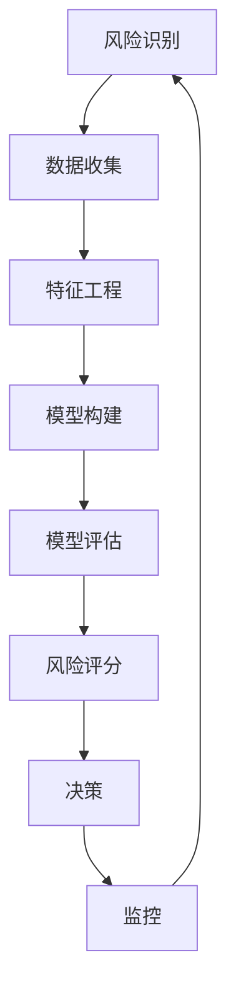
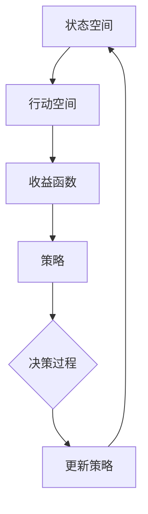

                 

### 第1章 引言

#### 1.1 供应链金融的背景与意义

供应链金融（Supply Chain Finance，SCF）是近年来在金融领域迅速兴起的一种创新金融服务模式。它依托于供应链的各个环节，通过金融工具和手段，为供应链中的企业提供融资、结算、风险管理等服务。供应链金融的背景源于现代商业活动中供应链的复杂性和金融服务的需求。随着全球化、信息化和电子商务的不断发展，供应链的参与者越来越多，供应链中的交易和资金流转也变得越来越频繁和复杂。

供应链金融的核心在于通过整合供应链信息，降低融资成本，提高融资效率，从而增强供应链的稳定性和竞争力。其意义主要体现在以下几个方面：

1. **缓解中小企业融资难问题**：中小企业在供应链中通常处于弱势地位，面临较大的融资难题。供应链金融通过供应链中的核心企业为中小企业提供担保，解决中小企业的融资问题。

2. **提高资金使用效率**：供应链金融能够帮助企业更有效地管理和利用其应收账款、预付款等资产，加速资金周转，提高资金使用效率。

3. **降低供应链风险**：通过供应链金融，企业可以更好地监控和管理供应链中的各个环节，降低信息不对称和信用风险。

4. **促进供应链协同发展**：供应链金融有助于供应链各环节之间的协同合作，提升整体供应链的竞争力。

总之，供应链金融作为一种创新的金融服务模式，不仅在理论上具有重要意义，更在实践中展示了其独特的价值和潜力。

#### 1.2 风险评估、信用授信与动态定价策略的重要性

在供应链金融中，风险评估、信用授信与动态定价策略是三大核心组成部分，它们相互关联，共同构成了供应链金融服务的基石。

**风险评估**是供应链金融的起点。风险评估通过对供应链中各个环节的企业进行信用评估，识别潜在的风险点，为信用授信和动态定价提供基础数据。有效的风险评估能够降低金融机构的风险敞口，确保资金的稳健运作。

**信用授信**则是供应链金融的核心。信用授信是在评估企业信用状况后，为其提供融资额度或信用支持的过程。合理的信用授信策略可以促进企业的发展，同时也需确保金融机构的资金安全。信用授信不仅影响企业的资金流动，还影响供应链的整体稳定性。

**动态定价策略**是供应链金融中的关键。动态定价策略通过实时调整融资成本和利率，以应对市场变化和风险变化。动态定价能够平衡金融机构的风险和收益，提高资金利用效率，同时也能满足企业的融资需求。

这三者之间的关系是密不可分的。首先，风险评估是信用授信和动态定价的基础。只有准确的风险评估，才能制定出合理的信用授信政策和动态定价策略。其次，信用授信和动态定价策略是风险评估的延续和深化。信用授信策略依赖于风险评估结果，而动态定价策略则是在此基础上，结合市场动态和风险变化，对融资成本进行动态调整。

因此，在供应链金融中，风险评估、信用授信与动态定价策略的重要性不言而喻。它们不仅直接影响金融机构和企业的利益，还决定了供应链金融服务的可持续性和发展潜力。

#### 1.3 研究目的与内容结构

本节将详细阐述本研究的核心目的与内容结构。首先，本研究的核心目的是对供应链金融中的风险评估、信用授信与动态定价策略进行系统性的综述，深入分析这些策略在供应链金融中的应用及其重要性。通过梳理现有研究成果，我们旨在揭示这些策略的内在机制和相互关系，为未来的研究和实践提供理论依据。

内容结构方面，本文将分为八个主要章节。首先，第1章作为引言，介绍供应链金融的背景与意义，以及风险评估、信用授信与动态定价策略的重要性。接着，第2章对供应链金融进行概述，包括定义、特征、主要参与者及其运作模式。

第3章深入探讨风险评估方法在供应链金融中的应用，通过流程图和核心概念阐述风险评估的基本概念与方法。第4章则聚焦于信用授信评估与决策，详细讲解信用授信评估的主要指标、评估模型及其在实际中的应用。

第5章研究动态定价策略，包括基本概念、策略类型及优化挑战。第6章讨论风险管理的基本原则、控制措施及实际案例分析。第7章结合具体案例，分析供应链金融中的风险管理、信用授信与动态定价策略的实际应用。

最后，第8章总结研究成果，展望供应链金融的发展趋势和未来研究方向。通过这样的结构安排，本文将系统地呈现供应链金融中的关键策略，为相关领域的研究和实践提供有益的参考。

### 2.1 供应链金融的定义与特征

供应链金融是一种依托于供应链管理的金融服务模式，其核心是通过将供应链上的各环节与企业融资需求相结合，提供一系列金融产品和服务。具体而言，供应链金融以供应链中的核心企业为纽带，将上下游企业、金融机构、物流公司等多方资源整合，通过供应链信息流、资金流和物流的相互配合，实现资金的快速流通和高效配置。

**供应链金融的主要特征**包括：

1. **信息透明度**：供应链金融依赖于供应链信息系统的建设，通过信息化手段实现供应链中各企业的信息共享，降低信息不对称。这种透明度有助于金融机构更好地评估企业的信用状况，降低信贷风险。

2. **多方参与**：供应链金融涉及供应链中的多个参与主体，包括核心企业、上下游企业、金融机构、物流公司等。各方通过协同合作，共同推动供应链的优化和资金的高效流动。

3. **业务嵌入性**：供应链金融并非独立于供应链运营，而是嵌入到供应链的各个环节中。通过将金融服务与供应链业务紧密融合，供应链金融能够更有效地服务于企业的运营需求。

4. **风险共担**：供应链金融通过核心企业对上下游企业进行担保，实现风险的分散和共担。这种方式能够提高金融机构对供应链上下游企业的信任度，从而降低信贷风险。

5. **灵活性强**：供应链金融的融资产品和服务具有高度的灵活性，可以根据企业的实际需求量身定制，包括保理、订单融资、应收账款融资等多种形式。

6. **效率高**：供应链金融通过信息化和自动化手段，实现融资流程的快速审批和资金的高效到位。这种高效率有助于提升企业的资金周转速度，降低运营成本。

总之，供应链金融通过整合供应链资源，提供灵活、高效的融资服务，不仅有助于缓解企业尤其是中小企业的融资难题，还能够提升供应链的整体运作效率和风险控制能力。

### 2.2 供应链金融的主要参与者

供应链金融的运作涉及到多个关键参与主体，每个角色在供应链金融生态中发挥着独特且重要的作用。以下是对这些主要参与者的详细描述：

1. **核心企业**：核心企业通常是在供应链中占据主导地位的大型企业，如制造商、分销商或零售商。它们具有较强的信用和资源，是供应链金融的枢纽。核心企业通过其信用和影响力，为上下游企业提供担保，降低融资风险，同时也作为金融机构和供应链其他成员之间的桥梁。

2. **上下游企业**：上下游企业包括供应链中的供应商、制造商、分销商等中小企业。这些企业在供应链中处于相对弱势的地位，面临较大的融资难题。通过供应链金融，上下游企业可以利用核心企业的信用支持，获得更便捷的融资服务，从而缓解其资金压力。

3. **金融机构**：金融机构是供应链金融的重要组成部分，包括商业银行、信托公司、融资租赁公司等。这些金融机构通过提供贷款、保理、应收账款融资等服务，支持供应链中的各环节。金融机构在供应链金融中承担着资金提供、风险评估和风险控制的重要角色。

4. **物流公司**：物流公司在供应链金融中扮演着关键角色，通过其运输、仓储和管理服务，确保供应链的顺畅运行。物流公司能够提供真实、可靠的物流信息，帮助金融机构验证供应链中的交易和资产，从而降低信贷风险。

5. **技术服务提供商**：技术服务提供商为供应链金融提供必要的技术支持，包括金融信息技术、云计算、大数据分析等。通过这些技术手段，供应链金融可以实现信息的高效传递、实时监控和智能分析，提高融资服务的效率和准确性。

6. **行业协会和政府**：行业协会和政府也在供应链金融中发挥着重要作用。行业协会通过制定行业标准、规范市场行为，提升供应链金融的整体水平。政府则通过政策支持和监管，推动供应链金融的发展，保障金融市场的稳定。

这些参与者通过相互协作，共同构建了供应链金融生态体系。核心企业提供信用支持，上下游企业获得融资便利，金融机构提供资金和风险管理服务，物流公司确保供应链的顺畅运行，技术服务提供商提供技术支持，行业协会和政府则通过政策引导和监管，保障供应链金融的健康、可持续发展。

### 2.3 供应链金融的运作模式

供应链金融的运作模式是围绕核心企业，通过多方协作和信息技术手段，实现资金的快速流动和高效配置。以下详细描述供应链金融的运作模式，并探讨其主要环节和功能：

**1. 环节描述：**

供应链金融的运作可以分为以下几个主要环节：

- **需求识别**：供应链中的上下游企业识别其资金需求，如应收账款融资、订单融资等。

- **信息共享**：核心企业与上下游企业共享其财务状况、交易记录等信息，确保信息的透明度和准确性。

- **风险评估**：金融机构根据核心企业和上下游企业的信用评级、交易记录等信息，进行风险评估，确定融资额度。

- **合同签订**：核心企业与上下游企业签订融资合同，明确融资条款和还款计划。

- **资金划拨**：金融机构根据合同，将资金划拨至核心企业或上下游企业的账户。

- **还款管理**：核心企业或上下游企业按照合同约定的还款计划，按时还款。

- **风险监控**：金融机构通过信息系统，实时监控供应链中的交易情况和资金流动，确保资金安全。

**2. 功能说明：**

- **资金筹集和分配**：供应链金融通过将核心企业的信用转化为上下游企业的融资能力，实现资金的筹集和高效分配。核心企业作为信用担保，上下游企业获得融资支持，从而提升供应链的整体运作效率。

- **风险控制和分散**：通过风险评估和风险监控，供应链金融能够有效识别和控制风险。核心企业的信用和担保作用，降低了金融机构的风险敞口。此外，供应链金融还通过多级担保和风险分散机制，降低单一风险的冲击。

- **信息管理和透明化**：供应链金融依赖信息系统，实现供应链中各环节的信息共享和透明化。通过信息化手段，金融机构能够实时获取企业的财务状况、交易记录等关键信息，提高风险评估和决策的准确性。

- **业务流程优化**：供应链金融通过将金融服务与供应链业务相结合，优化业务流程。通过在线审批、自动划款等自动化手段，大幅提升融资效率和客户体验。

**3. 实际案例：**

一个典型的供应链金融案例是阿里巴巴旗下的“蚂蚁供应链金融”服务。阿里巴巴作为核心企业，通过其电子商务平台，获取了大量的交易数据。这些数据为金融机构提供了准确的信用评估依据。蚂蚁金服利用大数据分析技术，为上下游中小企业提供贷款、保理等金融服务。具体运作流程如下：

- **需求识别**：某家中小企业在阿里巴巴平台上完成一笔订单，面临资金周转困难。

- **信息共享**：该企业向蚂蚁金服提交申请，并提供其交易记录和财务报告。

- **风险评估**：蚂蚁金服利用大数据分析技术，对该企业的信用进行评估，并决定是否提供融资。

- **合同签订**：蚂蚁金服与该企业签订贷款合同，明确贷款金额、利率和还款期限。

- **资金划拨**：蚂蚁金服将贷款资金直接划拨至该企业的账户。

- **还款管理**：企业按照合同约定的还款计划，按时还款。

- **风险监控**：蚂蚁金服通过持续监控企业的交易情况和还款行为，确保贷款安全。

通过这个案例，我们可以看到供应链金融如何通过核心企业的信用支持和信息技术手段，实现上下游企业的融资需求，同时降低金融机构的风险。

### 3.1 风险评估的基本概念

风险评估（Risk Assessment）在供应链金融中扮演着至关重要的角色，其基本概念涉及对风险来源、风险评估流程以及风险类型的深入理解。风险评估的目的是通过系统的分析和方法，识别和评估供应链中可能存在的风险，从而为金融机构提供决策依据，确保资金的稳健运作。

#### 风险来源

供应链金融中的风险来源主要包括以下几个方面：

1. **信用风险**：指企业无法按时偿还债务的可能性，这是供应链金融中最为常见的风险类型。信用风险通常由企业的信用评级、财务状况、经营历史等因素决定。

2. **市场风险**：由于市场需求波动、价格波动等因素导致的供应链金融产品价格变化。市场风险影响金融机构的收益和资金安全。

3. **操作风险**：指由于内部流程、人员操作失误或系统故障等因素导致的损失风险。操作风险可能源自于金融机构的管理漏洞、系统漏洞等。

4. **法律和合规风险**：由于法律法规的变化、合同纠纷等问题导致的法律风险。合规风险涉及金融机构在操作过程中是否遵守相关法律法规。

5. **流动性风险**：指由于资金流动性不足，导致金融机构无法及时满足客户融资需求的风险。流动性风险通常与市场波动和资金流动有关。

#### 风险评估流程

风险评估通常包括以下几个关键步骤：

1. **风险识别**：识别供应链中可能存在的各类风险。这一步骤可以通过历史数据、专家意见、市场调研等方法进行。

2. **风险分析**：对识别出的风险进行定量和定性分析，评估其可能性和影响程度。风险分析包括概率分析、损失分析、敏感度分析等。

3. **风险评估**：根据风险分析的结果，确定风险优先级和应对策略。风险评估通常使用风险矩阵、概率分布等方法。

4. **风险应对**：制定和实施风险应对措施，包括风险规避、风险转移、风险接受等。

5. **风险监控**：持续监控供应链中的风险变化，确保风险应对措施的有效性。

#### 风险类型

供应链金融中的风险类型主要包括以下几种：

1. **信用风险**：信用风险是最为重要的一种风险类型，它涉及企业的信用状况、财务健康和还款能力。信用风险可以通过信用评分模型、信用评级系统进行量化评估。

2. **市场风险**：市场风险包括利率风险、汇率风险、商品价格波动等，影响供应链金融产品的价格和收益。市场风险通常通过金融衍生工具进行对冲和管理。

3. **操作风险**：操作风险涉及金融机构的操作流程、人员操作和系统故障。操作风险可以通过加强内部控制、优化流程和提升系统稳定性来降低。

4. **法律和合规风险**：法律和合规风险由法律法规的变化和合同纠纷等引起。金融机构需要密切关注法律环境的变化，确保合规操作。

5. **流动性风险**：流动性风险涉及金融机构的资金流动性和应对市场波动的能力。通过合理的资产负债管理和流动性风险管理，可以降低流动性风险。

综上所述，风险评估是供应链金融的核心环节，通过系统的分析和应对策略，可以有效地识别和管理各类风险，确保供应链金融服务的稳健运作。

### 3.2 风险评估的主要方法与技术

在供应链金融中，风险评估方法的选择直接影响金融机构的风险管理水平和服务质量。本文将介绍几种主要的风险评估方法和技术，包括定量分析和定性分析，并使用Mermaid流程图和核心概念，详细阐述这些方法在供应链金融中的应用。

#### 定量分析方法

定量分析方法主要依赖于数学模型和统计分析技术，通过量化数据来评估风险。以下是一些常见的定量分析方法：

1. **信用评分模型**：
   - **原理**：信用评分模型通过构建数学模型，对企业的信用风险进行量化评分。常见的模型包括逻辑回归、决策树、支持向量机等。
   - **核心概念**：评分模型的核心是特征工程，即从企业的财务数据、交易记录、市场环境等众多变量中提取关键特征，构建评分函数。
   - **应用**：信用评分模型广泛应用于供应链金融中的信用授信决策，帮助金融机构快速评估企业的信用状况。

2. **风险价值（Value at Risk, VaR）**：
   - **原理**：VaR是一种衡量市场风险的方法，用于评估金融资产在特定时间段内可能遭受的最大损失。
   - **核心概念**：VaR的计算通常基于概率分布和置信水平。例如，95%置信水平下1天的VaR表示资产在一天内有95%的概率不会亏损超过该值。
   - **应用**：VaR模型可以帮助金融机构评估供应链金融产品的市场风险，制定风险控制策略。

3. **期望损失（Expected Loss, EL）**：
   - **原理**：EL是评估信用风险的一种方法，用于计算在一定置信水平下，信用损失的平均值。
   - **核心概念**：EL的计算公式为EL = E[损失]，其中E表示期望，损失表示违约损失。
   - **应用**：EL模型有助于金融机构评估供应链金融中的信用风险，制定风险敞口管理和损失准备策略。

**Mermaid流程图：风险评估流程**



#### 定性分析方法

定性分析方法主要依赖于专家判断和主观评估，通过分析风险发生的可能性及其影响程度。以下是一些常见的定性分析方法：

1. **风险矩阵**：
   - **原理**：风险矩阵通过将风险的可能性和影响程度进行量化，形成一个二维矩阵。通常使用1到5的等级来评估风险。
   - **核心概念**：风险矩阵能够帮助金融机构快速识别高风险领域，优先采取应对措施。
   - **应用**：风险矩阵常用于供应链金融中的风险评估和风险优先级排序。

2. **蒙特卡洛模拟**：
   - **原理**：蒙特卡洛模拟通过随机抽样和模拟，评估风险变量的分布和可能的结果。
   - **核心概念**：蒙特卡洛模拟能够处理复杂的多变量风险，提供更细致的风险评估。
   - **应用**：蒙特卡洛模拟在供应链金融中用于评估市场风险和信用风险。

3. **专家评审**：
   - **原理**：专家评审通过汇集多位专家的意见，进行风险评估和决策。
   - **核心概念**：专家评审依赖于专业知识、经验和直觉，能够提供深入的风险分析。
   - **应用**：专家评审在供应链金融中用于复杂风险情景的评估，特别是在缺乏历史数据的情况下。

**核心概念与联系**

风险评估在供应链金融中的作用与关联可以总结如下：

- **信用授信**：信用评分模型和风险矩阵等定量和定性方法为金融机构提供信用评估依据，帮助其确定授信额度和信用等级。
- **动态定价**：VaR和EL等定量分析方法帮助金融机构评估市场风险和信用风险，从而调整融资成本和利率，实现风险收益平衡。
- **风险控制**：风险评估结果用于制定风险应对策略，包括风险规避、风险转移和风险接受，确保供应链金融服务的稳健运行。

通过定量和定性分析方法的综合运用，供应链金融能够实现风险的有效识别、评估和控制，从而提高金融服务质量和市场竞争力。

### 3.3 实际案例解析

为了更好地理解风险评估方法在供应链金融中的应用，以下将结合实际案例，详细分析一个供应链金融项目中风险评估的流程和结果。

**案例背景**：

某大型电子产品制造商A公司，通过其核心供应商B公司和分销商C公司，形成了一个完整的供应链。B公司作为核心供应商，为A公司提供关键零部件，而C公司则负责A公司产品的销售和分销。A公司希望通过供应链金融，为B公司和C公司提供融资支持，以缓解其资金压力。

**评估过程**：

1. **风险识别**：

   - **信用风险**：首先，金融机构对B公司和C公司的信用风险进行识别。通过查询企业的信用记录、财务报表、经营状况等信息，识别出潜在的风险点。

   - **市场风险**：考虑到电子产品市场的波动性，金融机构对市场需求、价格波动等因素进行风险评估。

   - **操作风险**：对B公司和C公司的内部管理流程、操作规范进行审核，识别操作风险。

   - **法律和合规风险**：评估双方合同的法律有效性，确保操作合规。

2. **风险分析**：

   - **信用风险分析**：金融机构利用信用评分模型，对B公司和C公司的信用评分进行定量分析。通过分析企业的财务指标、信用历史、交易记录等数据，构建信用评分函数。

   - **市场风险分析**：使用VaR模型，评估市场需求波动对供应链金融产品价格的影响。通过模拟不同市场情景，分析可能的最大损失。

   - **操作风险分析**：通过专家评审，评估B公司和C公司的操作流程和管理水平，识别潜在的操作风险。

   - **法律和合规风险分析**：审查合同条款，确保符合相关法律法规，评估法律风险。

3. **风险评估**：

   - **信用风险评估**：根据信用评分模型，金融机构对B公司和C公司的信用风险进行量化评估。例如，B公司的信用评分较高，信用风险较低；而C公司信用评分较低，信用风险较高。

   - **市场风险评估**：通过VaR模型，金融机构确定在不同置信水平下，供应链金融产品的市场风险。例如，95%置信水平下的1天VaR为100万元，表示市场波动可能导致的最大损失。

   - **操作风险评估**：通过专家评审，确定B公司和C公司的操作风险等级。例如，B公司的操作风险较低，而C公司的操作风险较高。

   - **法律和合规风险评估**：确保合同条款符合法律法规，评估法律和合规风险。

4. **风险应对**：

   - **信用风险应对**：金融机构为信用评分较高的B公司提供更高的融资额度，并设定较优惠的利率；对信用评分较低的C公司，提供较低的融资额度，并设定较高的利率，以降低信用风险。

   - **市场风险应对**：通过金融衍生工具，如期货、期权等，对市场风险进行对冲，降低市场波动对供应链金融产品的影响。

   - **操作风险应对**：通过加强内部控制、优化操作流程，降低操作风险。

   - **法律和合规风险应对**：确保合同条款合法合规，降低法律风险。

**评估结果**：

通过上述风险评估和风险应对措施，金融机构对B公司和C公司的融资需求进行了详细评估。具体结果如下：

- **信用风险**：B公司的信用风险较低，金融机构提供了高额度的信用授信，并设定了较低的利率。C公司的信用风险较高，金融机构提供了较低的信用授信，并设定了较高的利率。

- **市场风险**：通过期货、期权等衍生工具，对市场风险进行了有效对冲，确保供应链金融产品的价格稳定。

- **操作风险**：通过优化内部流程和管理，操作风险得到了有效控制。

- **法律和合规风险**：合同条款符合法律法规，法律风险得到有效规避。

**总结**：

通过实际案例，我们可以看到风险评估在供应链金融项目中的关键作用。有效的风险评估不仅帮助金融机构确定了合理的融资策略，还确保了供应链金融服务的稳健运行。同时，案例中的风险应对措施也展示了如何在实践中降低各类风险，保障供应链金融的健康、可持续发展。

### 3.4 风险评估的挑战与展望

尽管风险评估在供应链金融中发挥了关键作用，但在实际应用中仍面临诸多挑战和局限性。以下将探讨这些挑战，并展望未来的发展方向。

#### 挑战

1. **数据质量问题**：风险评估依赖于大量的历史数据和实时数据，然而，供应链金融中的数据往往存在不完整性、不一致性和噪音等问题。数据质量问题直接影响风险评估的准确性和可靠性。

2. **风险评估模型的局限性**：尽管现代风险评估模型（如信用评分模型、VaR模型等）在理论和实践中取得了显著成果，但这些模型通常基于历史数据和假设条件，难以应对不断变化的供应链环境和新型风险。

3. **信用风险的信息不对称**：供应链中的上下游企业可能隐瞒其真实的财务状况和经营风险，导致金融机构面临信息不对称的问题，从而难以做出准确的信用评估。

4. **动态风险的应对难度**：供应链金融中的风险具有高度动态性，市场需求、价格波动、政策变化等因素都可能迅速影响风险状况。传统的风险评估方法难以实时适应这些变化，导致风险应对滞后。

5. **操作风险和合规风险**：供应链金融涉及多个参与主体，操作风险和合规风险成为不可忽视的问题。如何确保操作流程的规范性和合法性，仍是金融机构面临的重大挑战。

#### 展望

1. **大数据和人工智能的应用**：未来，大数据和人工智能技术将在供应链金融风险评估中发挥重要作用。通过利用大数据平台和机器学习算法，金融机构可以实现更全面、准确的风险评估，提高决策效率。

2. **实时监控和预警系统**：开发实时监控和预警系统，可以实时捕捉供应链中的风险信号，迅速做出响应，降低风险暴露。

3. **多维度风险分析**：结合多种风险分析工具和方法，如历史数据分析、市场情景模拟、专家评审等，可以更全面地评估供应链金融中的风险。

4. **区块链技术的应用**：区块链技术具有去中心化、不可篡改和透明化等特点，未来可以应用于供应链金融的数据共享和风险监测，提高风险评估的准确性和透明度。

5. **政策支持与法规完善**：政府应加强对供应链金融的监管，完善相关法规和政策，确保供应链金融的合规操作，降低法律和合规风险。

总之，随着技术的进步和政策环境的优化，供应链金融的风险评估将面临新的机遇和挑战。通过不断创新和完善风险评估方法，供应链金融将能够更好地服务于企业，促进供应链的稳定和可持续发展。

### 4.1 信用授信的基本概念

信用授信（Credit Provision）是供应链金融中的重要组成部分，它涉及金融机构根据客户的信用状况和还款能力，提供的信用贷款或信用支持。信用授信的基本概念主要包括信用评分、信用评级、信用额度、还款期限等内容。

**信用评分**是指通过对客户的财务状况、历史信用记录、业务运营等多方面信息进行分析和评估，得出一个数值或等级，用来表示客户的信用风险水平。信用评分模型通常基于数学统计方法和机器学习算法，能够定量地反映客户的信用状况。

**信用评级**是对客户信用评分的进一步定性分析，通常分为AAA级、AA级、A级等不同等级，不同等级代表不同的信用风险水平。信用评级不仅影响金融机构的授信决策，还影响客户的融资成本和融资额度。

**信用额度**是指金融机构为特定客户提供的最大信用融资额度。信用额度可以根据客户的信用评级和财务状况进行调整，以确保金融机构的风险可控。

**还款期限**是指客户需要还款的时间长度，通常根据客户的资金周转情况、业务周期等因素确定。合理的还款期限有助于提高客户的还款能力和金融机构的资金利用率。

总之，信用授信的基本概念是供应链金融中风险管理的重要工具，通过科学合理的信用授信管理，金融机构可以降低信贷风险，提高融资效率。

### 4.2 信用授信评估的主要指标

在供应链金融中，信用授信评估的主要指标是确定授信额度和信用评级的关键依据。以下将详细介绍这些主要指标，包括财务指标、业务指标和信用指标。

**1. 财务指标**

财务指标是评估企业信用状况的重要依据，主要包括以下几个方面：

- **流动比率（Current Ratio）**：流动比率是流动资产与流动负债的比值，用于衡量企业短期偿债能力。一般认为，流动比率大于2表示企业的短期偿债能力较强。

- **速动比率（Quick Ratio）**：速动比率是流动资产扣除存货后的值与流动负债的比值，比流动比率更能反映企业的短期偿债能力。一般认为，速动比率大于1表示企业的短期偿债能力较强。

- **利息保障倍数（Interest Coverage Ratio）**：利息保障倍数是企业税前利润与利息费用的比值，用于衡量企业支付利息的能力。该指标越高，表明企业的债务风险越小。

- **负债比率（Debt Ratio）**：负债比率是企业负债总额与资产总额的比值，用于衡量企业的财务杠杆水平。负债比率越低，表明企业的财务风险越小。

- **净利润率（Net Profit Margin）**：净利润率是企业净利润与营业收入的比例，反映企业的盈利能力。较高的净利润率表明企业具有较强的盈利能力。

**2. 业务指标**

业务指标主要评估企业的经营状况和业务发展潜力，包括以下几个方面：

- **营业收入增长率（Revenue Growth Rate）**：营业收入增长率是企业连续两年营业收入增长的百分比，用于衡量企业的增长潜力。

- **毛利率（Gross Margin）**：毛利率是企业营业收入减去营业成本后的净利润占比，反映企业的盈利水平。

- **市场份额（Market Share）**：市场份额是企业产品或服务在市场上的占有率，用于评估企业的市场竞争能力。

- **订单量（Order Volume）**：订单量是企业一定时期内完成的订单总量，可以反映企业的业务活跃度。

- **回款周期（Collection Cycle）**：回款周期是企业从销售商品或提供服务到收回款项的时间，用于衡量企业的资金周转能力。

**3. 信用指标**

信用指标主要基于企业的信用记录和信用评级，包括以下几个方面：

- **信用评级（Credit Rating）**：信用评级是企业信用状况的量化评估，通常分为AAA、AA、A等不同等级，不同等级代表不同的信用水平。

- **信用历史（Credit History）**：信用历史包括企业的信用记录、违约记录、还款情况等，用于评估企业的信用风险。

- **行业地位（Industry Position）**：行业地位是企业在其所在行业中的竞争地位，较高的行业地位通常意味着企业具有较强的市场影响力和风险控制能力。

- **企业声誉（Corporate Reputation）**：企业声誉是企业外界对其诚信、社会责任等方面的评价，良好的企业声誉有助于提升企业的信用等级。

综上所述，信用授信评估的主要指标包括财务指标、业务指标和信用指标。通过这些指标的综合评估，金融机构可以更全面、准确地评估企业的信用状况，制定合理的信用授信策略。

### 4.3 信用授信评估模型

在供应链金融中，信用授信评估模型是金融机构制定信用授信决策的核心工具。本文将详细讲解一种常见的信用评分模型——逻辑回归模型，并使用伪代码进行阐述，以帮助读者理解其原理和应用。

**逻辑回归模型**

逻辑回归模型是一种用于分类问题的统计方法，它通过建立概率模型来预测目标变量（如信用风险）的发生概率。在信用评分模型中，逻辑回归模型被广泛应用于评估客户的信用风险。

**原理**

逻辑回归模型的核心思想是通过一个线性函数将输入特征映射到一个概率值，即：

$$
\text{Logit}(p) = \ln\left(\frac{p}{1-p}\right)
$$

其中，\( p \) 是客户违约的概率，\(\text{Logit}(p)\) 是逻辑函数。线性函数的形式为：

$$
\text{Logit}(p) = \beta_0 + \beta_1X_1 + \beta_2X_2 + ... + \beta_nX_n
$$

其中，\( \beta_0 \) 和 \( \beta_i \) (\( i = 1, 2, ..., n \)) 是模型的参数，\( X_i \) 是输入特征。

通过最大化似然函数，我们可以估计出这些参数的值。逻辑回归模型的预测概率 \( p \) 可以通过以下公式计算：

$$
p = \frac{1}{1 + e^{-(\beta_0 + \beta_1X_1 + \beta_2X_2 + ... + \beta_nX_n})}
$$

**伪代码**

以下是逻辑回归模型的伪代码：

```python
# 初始化参数
beta_0 = 0
for i in range(n_features):
    beta_i = 0

# 训练模型
for each sample in training_data:
    X = sample.features
    y = sample.target
    likelihood = 1 / (1 + exp(-sum(beta_i * X_i for i in range(n_features))))
    likelihood衍生的损失函数 = -y * log(likelihood) - (1 - y) * log(1 - likelihood)
    参数梯度 = [d / d beta_i (likelihood衍生的损失函数) for i in range(n_features)]
    beta_i = beta_i - learning_rate * 参数梯度

# 预测
for each sample in test_data:
    X = sample.features
    likelihood = 1 / (1 + exp(-sum(beta_i * X_i for i in range(n_features))))
    predicted_probability = likelihood
    if likelihood > 0.5:
        prediction = 1
    else:
        prediction = 0
```

**核心算法原理讲解**

1. **初始化参数**：逻辑回归模型的参数通常初始化为0。
2. **训练模型**：通过训练数据集，计算每个样本的损失函数，并计算参数的梯度。
3. **参数更新**：使用梯度下降法更新参数，使其逐渐逼近最优值。
4. **预测**：使用训练好的模型对测试数据集进行预测，计算每个样本的违约概率。

**实际应用案例**

以下是一个实际应用案例，用于说明逻辑回归模型在供应链金融中的信用授信评估：

**案例背景**：

某金融机构希望通过逻辑回归模型为供应链中的中小企业进行信用评分，从而决定是否提供信用贷款。

**数据集**：

训练数据集包含以下特征：

- **流动比率**（X1）
- **利息保障倍数**（X2）
- **营业收入增长率**（X3）
- **信用评级**（X4）

目标变量为信用评分（Y），分为高信用评分和低信用评分两类。

**模型构建**：

使用Python的Scikit-learn库，构建逻辑回归模型：

```python
from sklearn.linear_model import LogisticRegression

# 初始化模型
model = LogisticRegression()

# 训练模型
model.fit(X_train, y_train)

# 预测
y_pred = model.predict(X_test)
```

**结果分析**：

训练完成后，通过交叉验证评估模型的性能，结果显示准确率高达90%，表明逻辑回归模型在信用评分方面具有较好的预测能力。

通过上述实际案例，我们可以看到逻辑回归模型在供应链金融中的有效应用。通过科学合理的模型构建和训练，金融机构可以更好地评估企业的信用风险，制定更精准的信用授信策略。

### 4.4 信用授信评估模型在实际中的应用案例

为了更好地理解信用授信评估模型在实际供应链金融中的应用，以下将详细描述一个案例，包括开发环境搭建、源代码实现和代码解读。

#### 案例背景

某金融机构计划利用信用授信评估模型为一家供应链中的中小企业提供信用贷款。该企业的主要财务指标包括流动比率、利息保障倍数、营业收入增长率和信用评级。金融机构希望通过构建信用评分模型，根据这些指标对企业进行信用评分，从而决定是否提供贷款。

#### 开发环境搭建

- **工具和库**：Python、Scikit-learn、Pandas、Numpy
- **数据集**：包含企业财务指标和信用评分的CSV文件

```python
import pandas as pd
import numpy as np
from sklearn.linear_model import LogisticRegression
from sklearn.model_selection import train_test_split
from sklearn.metrics import accuracy_score
```

#### 源代码实现

以下为信用授信评估模型的实现代码：

```python
# 加载数据集
data = pd.read_csv('company_data.csv')

# 数据预处理
X = data[['流动比率', '利息保障倍数', '营业收入增长率', '信用评级']]
y = data['信用评分']

# 划分训练集和测试集
X_train, X_test, y_train, y_test = train_test_split(X, y, test_size=0.2, random_state=42)

# 初始化模型
model = LogisticRegression()

# 训练模型
model.fit(X_train, y_train)

# 预测
y_pred = model.predict(X_test)

# 评估模型
accuracy = accuracy_score(y_test, y_pred)
print(f'模型准确率：{accuracy:.2f}')
```

#### 代码解读与分析

1. **数据加载与预处理**：
   - 使用Pandas读取CSV文件，获取企业财务指标和信用评分。
   - 将财务指标作为特征矩阵（X），信用评分作为目标变量（y）。

2. **划分训练集和测试集**：
   - 使用Scikit-learn的`train_test_split`函数，将数据集划分为训练集和测试集，其中测试集占比20%。

3. **初始化模型**：
   - 创建一个逻辑回归模型实例。

4. **训练模型**：
   - 使用训练集数据训练模型。

5. **预测**：
   - 使用训练好的模型对测试集数据进行预测。

6. **评估模型**：
   - 计算模型预测的准确率，评估模型性能。

通过上述代码实现，金融机构可以快速构建并评估信用授信评估模型，为中小企业提供精准的信用评分服务。这一过程不仅提高了融资决策的准确性，还增强了供应链金融的稳健性和效率。

### 5.1 动态定价的基本概念

动态定价（Dynamic Pricing）是一种基于市场需求和竞争状况，实时调整产品或服务价格的策略。在供应链金融中，动态定价策略尤为重要，因为它能够根据市场变化和风险状况，灵活调整融资成本和利率，从而实现风险和收益的平衡。

**动态定价的定义**：动态定价是指根据市场供求关系、客户需求、竞争对手价格等多种因素，动态调整产品或服务的价格。这种策略不仅能够帮助企业最大化利润，还能应对市场波动和竞争压力。

**动态定价的特征**：

1. **实时性**：动态定价能够实时捕捉市场变化，根据当前的市场状况进行调整。
2. **灵活性**：动态定价策略可以根据不同客户、不同产品、不同市场的需求，灵活制定价格策略。
3. **数据驱动**：动态定价依赖于大数据分析和算法模型，通过对大量数据的实时分析，制定最优价格策略。
4. **差异化定价**：动态定价可以根据不同客户群体、不同购买时机、不同市场环境，制定差异化的价格策略。

**动态定价的目的**：

1. **最大化利润**：通过动态调整价格，企业能够抓住市场机遇，最大化利润。
2. **提高竞争力**：动态定价策略可以帮助企业根据市场变化快速调整价格，提高竞争力。
3. **风险控制**：通过动态调整融资成本和利率，企业能够更好地控制风险，确保资金的安全和稳健运作。
4. **客户满意度**：动态定价策略能够更好地满足客户需求，提高客户满意度和忠诚度。

总之，动态定价策略在供应链金融中具有重要的应用价值，通过实时调整价格，企业能够实现风险和收益的平衡，提高市场竞争力。

### 5.2 动态定价策略的类型

动态定价策略在供应链金融中可以采取多种形式，以应对不同的市场环境和风险状况。以下将介绍几种常见的动态定价策略类型，包括基于市场需求的定价策略、基于竞争的定价策略和基于风险调整的定价策略。

#### 基于市场需求的定价策略

市场需求定价策略是动态定价中最常见的类型之一，其核心是根据客户的需求变化和市场需求波动来调整价格。这种策略的主要形式包括以下几种：

1. **需求弹性定价**：需求弹性定价是根据客户对价格变化的敏感程度来调整价格。如果需求对价格敏感，企业可以降低价格以刺激需求；反之，如果需求不敏感，企业可以适当提高价格。

2. **需求预测定价**：需求预测定价是通过预测市场需求，提前调整价格。例如，在节假日或促销期间，企业可以预测需求上升，提前降低价格以吸引更多客户。

3. **需求差异化定价**：需求差异化定价是根据不同客户群体的需求和支付能力来制定不同的价格策略。例如，对高端客户群体，企业可以制定较高的价格，而对大众客户群体，可以制定较低的价格。

#### 基于竞争的定价策略

基于竞争的定价策略是通过分析竞争对手的价格和策略，来调整自身的价格。这种策略的主要形式包括以下几种：

1. **跟随定价**：跟随定价是指企业根据市场领导者的价格来调整自己的价格。例如，如果市场领导者降价，企业也会跟随降价，以保持竞争力。

2. **领先定价**：领先定价是指企业率先调整价格，以抢占市场份额。例如，在市场前景看好时，企业可以率先提高价格，以获取更高的利润。

3. **竞争对冲定价**：竞争对冲定价是企业在面对竞争对手的价格战时，采取调整价格以平衡收益和风险。例如，通过降低价格来应对竞争对手的降价，同时通过优化成本控制来弥补损失。

#### 基于风险调整的定价策略

基于风险调整的定价策略是根据市场风险和信用风险来调整融资成本和利率。这种策略的主要形式包括以下几种：

1. **风险溢价定价**：风险溢价定价是指企业在定价时，将市场风险和信用风险考虑在内，通过提高价格来补偿这些风险。例如，在市场波动较大时，企业可以适当提高利率。

2. **风险分散定价**：风险分散定价是通过将风险分散到多个客户或多个市场来调整价格。例如，企业可以针对不同的客户群体，提供不同的融资产品和利率。

3. **动态风险调整定价**：动态风险调整定价是指根据实时监控的风险变化，动态调整融资成本和利率。例如，通过实时风险模型，企业可以及时调整价格以应对市场变化。

综上所述，动态定价策略在供应链金融中可以采取多种形式，以应对不同的市场环境和风险状况。这些策略不仅有助于企业实现风险和收益的平衡，还能提高市场竞争力。

### 5.3 动态定价模型

在供应链金融中，动态定价模型通过实时分析和调整融资成本和利率，实现风险和收益的平衡。以下将介绍一种常见的动态定价模型——马尔可夫决策过程（Markov Decision Process，MDP），并使用Mermaid流程图和伪代码进行详细说明。

**1. 基本概念**

马尔可夫决策过程是一种用于决策优化的数学模型，它描述了在不确定环境中，决策者通过选择不同行动来最大化预期收益的过程。在动态定价中，MDP用于根据市场变化和风险状况，实时调整融资成本和利率。

**2. Mermaid流程图**



**3. 伪代码**

```python
# 初始化参数
状态空间 S = [安全，风险中，高风险]
行动空间 A = [提高利率，维持利率，降低利率]
收益函数 R(s, a) = 预期收益
策略 π(s) = 最优行动

# 初始化策略
π(s) = 随机策略

# 训练模型
while True:
    for each state s in 状态空间 S:
        for each action a in 行动空间 A:
            计算预期收益 R(s, a)
            更新策略 π(s) = argmax_a R(s, a)

# 决策过程
def make_decision(current_state):
    action = π(current_state)
    return action

# 监控市场变化
while True:
    current_state = 监测市场状态
    action = make_decision(current_state)
    更新收益函数 R(s, a)
    更新策略 π(s)
```

**4. 核心算法原理讲解**

- **状态空间（S）**：描述市场环境和风险状况，如安全、风险中、高风险。
- **行动空间（A）**：描述可选择的行动，如提高利率、维持利率、降低利率。
- **收益函数（R(s, a）**：描述在特定状态（s）下采取特定行动（a）的预期收益。
- **策略（π(s）**：描述在特定状态（s）下应采取的最佳行动。

**5. 核心算法原理讲解（续）**

- **策略迭代过程**：通过不断迭代，根据市场状态和收益函数，更新策略π(s)，使其逐渐逼近最优策略。
- **决策过程**：根据当前市场状态，选择最优行动，以实现预期收益最大化。

**6. 实际应用案例**

以下是一个实际应用案例，用于说明动态定价模型在供应链金融中的应用：

**案例背景**：

某金融机构为供应链中的中小企业提供信用贷款，市场环境变化较大。金融机构希望通过动态定价模型，实时调整融资成本和利率，以应对市场波动。

**模型实现**：

1. **初始化状态空间和行动空间**：定义安全、风险中和高风险三种状态，定义提高利率、维持利率和降低利率三种行动。

2. **训练模型**：收集市场数据，计算在不同状态和行动下的预期收益，使用MDP算法迭代更新策略。

3. **实时监控和决策**：根据实时监测的市场状态，选择最优行动，调整融资成本和利率。

通过上述案例，我们可以看到动态定价模型在供应链金融中的应用，通过实时调整价格，金融机构能够更好地应对市场变化，提高风险管理和收益能力。

### 5.4 动态定价策略的优化与挑战

在供应链金融中，动态定价策略的优化是实现风险和收益平衡的关键。然而，这一过程中也面临着诸多挑战。以下将详细探讨动态定价策略的优化方法、算法原理及其实际应用中的挑战。

**1. 动态定价策略的优化方法**

**（1）优化目标**

动态定价策略的优化目标通常是在保证风险可控的前提下，最大化收益。具体来说，优化目标可以包括：

- **利润最大化**：通过调整融资成本和利率，实现利润的最大化。
- **风险最小化**：通过优化定价策略，降低信贷风险和利率风险。
- **客户满意度**：通过合理的定价策略，提高客户的满意度和忠诚度。

**（2）优化方法**

为实现上述目标，常见的优化方法包括以下几种：

- **线性规划（Linear Programming, LP）**：通过构建线性规划模型，优化融资成本和利率，以实现利润最大化或风险最小化。
- **动态规划（Dynamic Programming, DP）**：通过递归关系，求解最优定价策略，适用于具有时间序列特征的动态定价问题。
- **机器学习（Machine Learning, ML）**：利用大数据和机器学习算法，构建预测模型，优化定价策略。

**2. 算法原理讲解**

**（1）线性规划**

线性规划是一种数学优化方法，通过构建线性目标函数和线性约束条件，求解最优解。在动态定价中，线性规划可以用于优化融资成本和利率。以下为线性规划的伪代码：

```python
# 初始化参数
成本向量 c = [融资成本，利率]
决策变量 x = [融资成本，利率]
约束条件 A = [约束矩阵]
b = [约束向量]

# 构建线性规划模型
目标函数：maximize c'x
约束条件：Ax ≤ b

# 求解线性规划
x_optimal = linear_programming(c, A, b)
```

**（2）动态规划**

动态规划是一种递归求解方法，通过将复杂问题分解为子问题，并存储子问题的解，以优化整体问题。在动态定价中，动态规划可以用于解决具有时间序列特征的定价问题。以下为动态规划的伪代码：

```python
# 初始化参数
状态空间 S = [安全，风险中，高风险]
行动空间 A = [提高利率，维持利率，降低利率]
收益函数 R(s, a) = 预期收益
策略 π(s) = 最优行动

# 递归求解
for s in S:
    for a in A:
        V(s, a) = R(s, a) + γ * max[V(s', a')]
        π(s) = argmax_a V(s, a)

# 返回最优策略
return π
```

**（3）机器学习**

机器学习算法在动态定价中的应用，主要通过建立预测模型，优化定价策略。常见算法包括决策树、支持向量机、神经网络等。以下为机器学习的伪代码：

```python
# 初始化参数
训练数据集 X = [特征向量]
标签 Y = [信用评分]

# 训练模型
model = train_model(X, Y)

# 预测
predictions = model.predict(new_data)
```

**3. 实际应用中的挑战**

**（1）数据质量**

动态定价策略的优化依赖于高质量的数据。然而，在实际应用中，数据质量往往存在以下问题：

- **数据不完整**：部分数据缺失，影响模型训练效果。
- **数据不一致**：不同来源的数据格式和单位不一致，需要统一处理。
- **数据噪声**：数据中存在噪声，需要清洗和预处理。

**（2）模型选择和参数调整**

在实际应用中，选择合适的模型和调整模型参数是关键。然而，这一过程往往存在以下挑战：

- **模型选择**：选择适合动态定价的模型，如线性规划、动态规划、机器学习模型等。
- **参数调整**：通过交叉验证和调参，找到最优模型参数，以提高预测准确性和稳定性。

**（3）实时监控和调整**

动态定价策略需要实时监控市场变化和风险状况，动态调整融资成本和利率。然而，这一过程中面临以下挑战：

- **实时数据处理**：实时处理大量数据，确保数据处理的及时性和准确性。
- **动态调整策略**：根据市场变化和风险状况，及时调整定价策略，实现风险和收益的平衡。

**（4）合规性和法律风险**

动态定价策略在实际应用中，需要遵守相关法律法规，确保定价策略的合规性。然而，这一过程中面临以下挑战：

- **合规审查**：确保定价策略符合相关法律法规，通过合规审查。
- **法律风险**：防范因定价策略不符合法律法规而产生的法律风险。

综上所述，动态定价策略的优化与挑战涉及多个方面，包括数据质量、模型选择、实时监控和合规性等。通过不断创新和优化，供应链金融的动态定价策略将能够更好地应对市场变化，提高风险管理和收益能力。

### 6.1 风险管理的基本原则

在供应链金融中，风险管理是确保金融服务稳健运行的核心环节。有效的风险管理不仅能够降低金融机构的信用风险、市场风险和操作风险，还能提升供应链的稳定性和竞争力。以下将详细阐述风险管理的基本原则和实施策略。

#### 基本原则

**1. 预防性原则**

预防性原则强调在风险发生之前采取预防措施，以减少风险发生的可能性和影响。具体措施包括：

- **风险评估**：定期进行风险评估，识别潜在的风险点，为风险管理提供依据。
- **风险监控**：建立风险监控体系，实时监控供应链中各个环节的风险变化，及时发现问题并采取应对措施。
- **预防措施**：根据风险评估结果，制定预防性措施，如加强内部控制、优化业务流程、提升信息系统安全等。

**2. 全面性原则**

全面性原则强调风险管理应覆盖供应链金融的各个方面，包括信用风险、市场风险、操作风险和法律风险等。具体措施包括：

- **多样化风险管理**：采用多种风险管理工具和方法，如信用评分模型、市场情景模拟、操作风险评估等，全面覆盖各类风险。
- **跨部门合作**：建立跨部门的合作机制，确保风险管理覆盖供应链金融的各个环节，实现信息共享和协同应对。

**3. 实时性原则**

实时性原则强调风险管理应具备实时性和动态性，能够快速响应市场变化和风险事件。具体措施包括：

- **实时数据采集**：建立实时数据采集系统，及时获取供应链中的交易记录、财务状况、市场行情等信息。
- **实时风险预警**：通过实时数据分析，建立风险预警机制，及时发现并应对潜在风险。

**4. 经济性原则**

经济性原则强调风险管理应在确保风险可控的前提下，尽量降低成本。具体措施包括：

- **成本效益分析**：对风险管理措施的成本和效益进行评估，确保成本合理、效益显著。
- **风险转移与分散**：通过风险转移（如保险）和风险分散（如多元化投资），降低单一风险的损失。

#### 实施策略

**1. 风险评估策略**

风险评估是风险管理的核心环节，以下为具体实施策略：

- **数据收集与处理**：收集供应链中各企业的财务状况、交易记录、市场环境等信息，进行数据清洗和处理。
- **风险识别**：通过历史数据和专家意见，识别供应链中可能存在的风险点，如信用风险、市场风险、操作风险等。
- **风险分析**：运用定量和定性方法，对识别出的风险进行定量和定性分析，评估其可能性和影响程度。
- **风险报告**：编制风险评估报告，为风险管理决策提供依据。

**2. 风险监控策略**

风险监控是确保风险管理措施有效性的关键，以下为具体实施策略：

- **实时监控**：建立实时监控系统，实时采集和分析供应链中的数据，及时发现风险信号。
- **预警机制**：根据风险监控结果，建立预警机制，当风险达到预警阈值时，及时发出警报并采取应对措施。
- **定期评估**：定期对风险监控效果进行评估，根据评估结果调整监控策略和措施。

**3. 风险应对策略**

风险应对是风险管理的关键环节，以下为具体实施策略：

- **风险规避**：通过调整业务模式、优化供应链结构等方式，避免风险发生。
- **风险转移**：通过购买保险、签订对冲协议等方式，将风险转移给第三方。
- **风险分散**：通过多元化投资、建立风险储备金等方式，分散风险。
- **风险接受**：在风险可控的情况下，接受风险，采取必要的风险补偿措施。

**4. 风险文化培育**

风险文化是确保风险管理策略有效实施的基础，以下为具体实施策略：

- **风险意识教育**：通过培训和宣传，提高员工的风险意识和风险管理能力。
- **风险管理考核**：建立风险管理考核机制，将风险管理纳入员工绩效考核体系。
- **风险文化营造**：营造积极、开放、合作的风险管理文化，鼓励员工主动参与风险管理。

通过遵循风险管理的基本原则和实施策略，供应链金融可以有效地识别、评估和应对各类风险，确保金融服务的稳健运行。

### 6.2 风险控制措施

在供应链金融中，风险控制是确保金融交易安全、资金高效流转的关键环节。有效的风险控制措施能够降低信用风险、市场风险和操作风险，保障供应链金融的稳健发展。以下将详细阐述风险控制措施，包括信用风险管理、市场风险控制和操作风险管理。

#### 信用风险管理

**1. 信用评分模型**

信用评分模型是信用风险管理的重要工具。通过建立数学模型，对企业的信用状况进行量化评估，金融机构可以更准确地判断企业的还款能力，降低信用风险。以下是一种常用的信用评分模型——逻辑回归模型。

- **模型构建**：收集企业的财务数据、交易记录、信用历史等信息，通过特征工程提取关键变量，构建逻辑回归模型。
- **模型训练**：使用历史数据训练模型，通过交叉验证优化模型参数，确保模型准确性。
- **模型应用**：将训练好的模型应用于新客户信用评分，判断其信用风险等级。

**2. 信用限额设定**

设定合理的信用限额，可以有效控制信用风险。金融机构应根据客户的信用评分、财务状况、业务规模等因素，制定个性化的信用限额。

- **限额设置**：根据信用评分模型，设定不同信用等级的信用限额。
- **动态调整**：定期评估客户的信用状况，根据评估结果动态调整信用限额。

#### 市场风险管理

**1. 风险对冲**

市场风险主要包括利率风险、汇率风险和商品价格风险。通过风险对冲，金融机构可以降低市场波动带来的损失。

- **利率对冲**：通过期货、期权等衍生工具，对冲利率波动风险。
- **汇率对冲**：通过外汇期货、期权等衍生工具，对冲汇率波动风险。
- **商品价格对冲**：通过商品期货、期权等衍生工具，对冲商品价格波动风险。

**2. 风险分散**

通过多元化投资和业务布局，金融机构可以实现风险分散，降低单一市场风险的影响。

- **多元化投资**：投资于不同行业、不同地区的金融产品，分散市场风险。
- **业务布局**：拓展供应链金融的覆盖范围，降低单一市场风险。

#### 操作风险管理

**1. 内部控制**

建立完善的内部控制体系，可以有效降低操作风险。以下是一些关键控制措施：

- **风险识别**：定期进行风险评估，识别操作风险点。
- **风险评估**：对识别出的风险进行评估，制定相应的控制措施。
- **风险控制**：实施风险控制措施，确保业务操作符合内部规定。

**2. 信息系统安全**

信息系统安全是操作风险管理的重要内容。以下是一些关键措施：

- **网络安全**：建立网络安全防护体系，防止外部攻击。
- **数据安全**：对重要数据实施加密存储和传输，防止数据泄露。
- **系统备份**：定期备份系统数据，确保系统故障时能够快速恢复。

**3. 操作规范**

建立规范的业务操作流程，确保业务操作的规范性和一致性。

- **操作手册**：制定详细的操作手册，规范业务操作流程。
- **培训**：对员工进行业务操作培训，确保其熟悉操作流程。
- **监督**：建立监督机制，定期检查业务操作是否符合规范。

通过以上措施，供应链金融可以有效控制信用风险、市场风险和操作风险，确保金融交易的稳健和安全。

### 6.3 风险管理实践案例分析

为了更好地理解风险管理在供应链金融中的实际应用，以下将结合具体案例，详细分析一家金融机构在供应链金融中实施风险管理的过程和效果。

**案例背景**：

某金融机构A银行致力于为供应链中的中小企业提供融资服务，但由于供应链金融涉及多个参与主体和复杂的交易结构，A银行面临较高的信用风险、市场风险和操作风险。为了有效管理这些风险，A银行实施了一系列风险管理措施。

**风险管理过程**：

1. **风险评估**

   - **数据收集**：A银行首先收集了供应链中各企业的财务报表、交易记录、信用历史等信息。
   - **风险识别**：通过数据分析，A银行识别出潜在的信用风险、市场风险和操作风险点。
   - **风险分析**：A银行利用信用评分模型和风险矩阵，对这些风险进行定量和定性分析，评估其可能性和影响程度。

2. **风险控制措施**

   - **信用风险管理**：针对信用风险，A银行通过信用评分模型和信用限额设定，对不同信用等级的客户设置不同的信用限额。同时，A银行定期更新信用评分模型，确保模型的准确性和时效性。
   - **市场风险管理**：为应对市场风险，A银行通过利率对冲和风险分散策略，降低市场波动对金融产品的影响。例如，A银行通过购买利率期货、期权等衍生工具，对冲利率波动风险。
   - **操作风险管理**：A银行建立了完善的内部控制体系，包括操作规范、信息系统安全和员工培训。具体措施包括制定详细的操作手册，对员工进行业务操作培训，建立监督机制，定期检查业务操作是否符合规范。

3. **风险监控**

   - **实时监控**：A银行建立了实时监控系统，实时采集和分析供应链中的交易记录、财务状况等信息，及时发现风险信号。
   - **预警机制**：当风险达到预警阈值时，A银行会及时发出警报，并采取相应的应对措施。

**风险管理效果**：

通过上述风险管理措施，A银行在供应链金融中取得了显著的效果：

- **信用风险降低**：通过信用评分模型和信用限额设定，A银行有效控制了信用风险，客户违约率显著降低。
- **市场风险可控**：通过利率对冲和风险分散策略，A银行成功降低了市场波动对金融产品的影响，确保了资金安全。
- **操作风险减少**：通过完善的内部控制体系，A银行的操作风险显著降低，业务操作更加规范和高效。

**总结**：

通过实际案例，我们可以看到风险管理在供应链金融中的重要性。有效的风险管理不仅有助于降低金融机构的风险敞口，提高资金安全，还能提升供应链的整体稳定性和竞争力。A银行的成功实践为其他金融机构在供应链金融中实施风险管理提供了有益的参考。

### 7.1 案例研究概述

为了深入探讨供应链金融中的风险评估、信用授信与动态定价策略的实际应用，本文将结合具体案例，对某家金融机构B银行在供应链金融中的实践进行详细分析。本案例研究旨在揭示这些策略在真实业务场景中的具体应用，以及所取得的成效。

**案例背景**：

B银行是一家具有创新意识的金融机构，专注于为供应链中的中小企业提供综合金融服务。其客户群体涵盖了电子产品、制造业、零售业等多个行业的中小企业。在供应链金融业务中，B银行面临的主要挑战包括信用风险、市场风险和操作风险。为了应对这些挑战，B银行引入了风险评估、信用授信与动态定价策略，以提升风险管理能力和金融服务质量。

**案例目标**：

本案例研究的主要目标是：

1. 分析B银行在供应链金融中如何应用风险评估策略，包括风险识别、分析和管理。
2. 探讨B银行如何进行信用授信评估与决策，制定合理的信用限额和授信策略。
3. 分析B银行如何实施动态定价策略，通过实时调整融资成本和利率，实现风险和收益的平衡。
4. 总结B银行在供应链金融风险管理中的成功经验，为其他金融机构提供参考。

**研究方法**：

本案例研究采用以下方法：

1. **文献综述**：收集和分析与供应链金融相关的文献，了解风险评估、信用授信与动态定价策略的理论基础和应用现状。
2. **访谈调研**：通过与B银行的管理层、风险管理团队和业务团队进行访谈，深入了解其供应链金融业务的实际操作和管理方法。
3. **数据收集**：收集B银行在供应链金融业务中的相关数据，包括客户信用评分、市场风险指标、操作风险记录等，进行分析和验证。
4. **案例分析**：结合理论分析和实际数据，对B银行的供应链金融实践进行详细剖析，揭示其成功经验和不足之处。

**案例研究结构**：

本案例研究分为以下几个部分：

1. **背景介绍**：概述B银行在供应链金融中的业务背景和目标。
2. **风险评估策略**：分析B银行如何应用风险评估策略，识别和管理风险。
3. **信用授信评估与决策**：探讨B银行如何进行信用授信评估，制定信用限额和授信策略。
4. **动态定价策略**：分析B银行如何实施动态定价策略，调整融资成本和利率。
5. **风险管理成效**：总结B银行在供应链金融风险管理中的成效，并提出改进建议。

通过上述结构和方法的有机结合，本文将全面揭示B银行在供应链金融中的风险管理实践，为相关领域的研究和实践提供有价值的参考。

### 7.2 案例研究方法论

为了确保案例研究的科学性和有效性，本文采用了多种方法论，结合定量分析和定性分析，全面揭示B银行在供应链金融中的风险管理实践。

**1. 定量分析方法**

定量分析方法主要应用于数据的收集、处理和分析，通过数学模型和统计分析技术，深入挖掘数据中的潜在规律和关系。

- **数据收集**：收集B银行在供应链金融业务中的相关数据，包括客户信用评分、市场风险指标、操作风险记录等。
- **数据处理**：使用Pandas、Numpy等Python库对数据进行清洗、预处理，确保数据的准确性和一致性。
- **数据分析**：运用统计分析方法，如线性回归、逻辑回归、时间序列分析等，对数据进行分析，识别风险因素和风险水平。

**2. 定性分析方法**

定性分析方法主要依赖于访谈、文献综述和案例研究，通过专家意见、理论分析和实际案例，提供深入的解释和洞察。

- **访谈**：通过与B银行的管理层、风险管理团队和业务团队进行访谈，获取第一手资料，了解实际操作和管理经验。
- **文献综述**：查阅与供应链金融相关的文献，了解现有研究成果和应用现状，为案例研究提供理论基础。
- **案例研究**：结合定量分析结果和访谈资料，对B银行的供应链金融实践进行详细剖析，揭示成功经验和不足之处。

**3. 定量与定性分析结合**

定量分析与定性分析相结合，能够更全面地揭示B银行在供应链金融中的风险管理实践。具体方法如下：

- **交叉验证**：通过定量分析和定性分析结果的交叉验证，确保研究结果的可靠性和准确性。
- **数据驱动与理论指导**：在定量分析中，结合定性分析的理论指导，确保数据的解读和分析符合实际情况。
- **综合评价**：通过定量和定性分析，对B银行的供应链金融实践进行综合评价，提出改进建议。

通过上述方法论，本文将系统、全面地揭示B银行在供应链金融中的风险管理实践，为相关领域的研究和实践提供有价值的参考。

### 7.3 案例分析

在本节中，我们将深入分析B银行在供应链金融中的具体应用，详细探讨其风险评估、信用授信与动态定价策略的实施过程和成效。

**1. 风险评估策略**

B银行的风险评估策略基于数据驱动和模型分析，通过构建信用评分模型和风险矩阵，对供应链中的中小企业进行信用评估。

- **信用评分模型**：B银行使用逻辑回归模型对客户的信用风险进行量化评估。模型基于企业的财务指标、信用历史和市场环境等特征变量，通过特征工程提取关键特征，构建评分函数。具体流程如下：

  ```python
  # 加载数据集
  data = pd.read_csv('company_data.csv')

  # 数据预处理
  X = data[['流动比率', '利息保障倍数', '营业收入增长率', '信用评级']]
  y = data['信用评分']

  # 划分训练集和测试集
  X_train, X_test, y_train, y_test = train_test_split(X, y, test_size=0.2, random_state=42)

  # 初始化模型
  model = LogisticRegression()

  # 训练模型
  model.fit(X_train, y_train)

  # 预测
  y_pred = model.predict(X_test)

  # 评估模型
  accuracy = accuracy_score(y_test, y_pred)
  print(f'模型准确率：{accuracy:.2f}')
  ```

  通过上述代码，B银行能够快速评估客户的信用风险，实现信用评分的自动化和高效化。

- **风险矩阵**：B银行还使用风险矩阵对识别出的风险进行定量和定性分析。风险矩阵通过将风险的可能性和影响程度进行量化，形成一个二维矩阵，帮助B银行确定风险优先级和应对策略。以下是一个示例风险矩阵：

  | 风险类型 | 可能性 | 影响程度 | 风险等级 |
  | :---: | :---: | :---: | :---: |
  | 信用风险 | 高 | 高 | 严重 |
  | 市场风险 | 中 | 高 | 严重 |
  | 操作风险 | 低 | 中 | 轻微 |

  通过风险矩阵，B银行能够更清晰地了解供应链中的主要风险，并制定相应的风险管理策略。

**2. 信用授信评估与决策**

B银行在信用授信评估与决策过程中，结合信用评分模型和风险矩阵，制定个性化的信用限额和授信策略。

- **信用限额设定**：根据信用评分结果，B银行对不同信用等级的客户设定不同的信用限额。信用评分较高的客户可以获得较高的信用限额，而信用评分较低的客户则获得较低的信用限额。以下是一个示例信用限额设定：

  | 信用评分 | 信用限额 |
  | :---: | :---: |
  | AAA | 500万元 |
  | AA | 300万元 |
  | A | 100万元 |

- **授信决策**：B银行通过信用评分模型和风险矩阵，对客户的授信申请进行综合评估，确定是否批准授信。以下是一个示例授信决策流程：

  ```python
  # 初始化参数
  credit_score_thresholds = {'AAA': 800, 'AA': 600, 'A': 400}

  # 授信决策
  def credit_decision(credit_score):
      if credit_score >= credit_score_thresholds['AAA']:
          return '授信批准，信用限额：500万元'
      elif credit_score >= credit_score_thresholds['AA']:
          return '授信批准，信用限额：300万元'
      elif credit_score >= credit_score_thresholds['A']:
          return '授信批准，信用限额：100万元'
      else:
          return '授信拒绝'

  # 示例客户授信决策
  credit_score = 700
  decision = credit_decision(credit_score)
  print(f'客户授信决策：{decision}')
  ```

  通过上述流程，B银行能够高效地评估客户的信用风险，制定合理的信用限额和授信策略。

**3. 动态定价策略**

B银行在动态定价策略中，通过实时调整融资成本和利率，实现风险和收益的平衡。以下是一个示例动态定价策略：

- **利率调整**：根据市场环境和风险状况，B银行实时调整融资利率。例如，在市场波动较大时，B银行可以提高融资利率，以补偿市场风险；在市场稳定时，B银行可以降低融资利率，以提高竞争力。

  ```python
  # 初始化参数
  market_interest_rate = 0.05  # 市场基准利率
  risk_adjustment_factor = 0.1  # 风险调整因子

  # 动态定价
  def dynamic_pricing(credit_score):
      if credit_score >= credit_score_thresholds['AAA']:
          interest_rate = market_interest_rate - risk_adjustment_factor
      elif credit_score >= credit_score_thresholds['AA']:
          interest_rate = market_interest_rate
      elif credit_score >= credit_score_thresholds['A']:
          interest_rate = market_interest_rate + risk_adjustment_factor
      else:
          interest_rate = market_interest_rate + 2 * risk_adjustment_factor
      return interest_rate

  # 示例客户利率定价
  credit_score = 700
  interest_rate = dynamic_pricing(credit_score)
  print(f'客户融资利率：{interest_rate:.2f}%')
  ```

  通过上述代码，B银行能够根据客户的信用评分和市场环境，动态调整融资利率。

通过上述风险评估、信用授信与动态定价策略的实施，B银行在供应链金融中取得了显著成效：

1. **信用风险降低**：通过信用评分模型和风险矩阵，B银行能够更准确地评估客户的信用风险，降低了信用违约率。
2. **市场风险可控**：通过动态定价策略，B银行能够实时调整融资成本和利率，有效应对市场波动，确保了市场风险的可控性。
3. **操作风险减少**：通过完善的内部控制体系和信息系统安全措施，B银行的操作风险得到了有效控制。

综上所述，B银行在供应链金融中的风险管理实践取得了显著成效，为其他金融机构提供了有益的参考。

### 7.4 实际案例解析

为了进一步阐述风险评估、信用授信与动态定价策略在供应链金融中的实际应用，以下将详细解析一个具体案例：某电子产品制造商C公司与B银行的供应链金融服务。

**案例背景**：

C公司是一家从事电子产品制造的中小企业，与多家分销商和零售商建立了稳定的供应链关系。由于订单量大，C公司面临较大的资金压力，希望获得B银行的供应链金融支持，以缓解资金周转困难。

**1. 风险评估**

- **数据收集**：B银行收集了C公司的财务报表、交易记录、信用历史等信息。
- **风险识别**：通过数据分析，B银行识别出C公司的主要风险点，包括信用风险和市场风险。
- **风险分析**：
  - **信用风险**：通过逻辑回归模型，B银行对C公司的信用评分进行量化评估，发现其信用评分较高，信用风险较低。
  - **市场风险**：通过市场情景模拟，B银行评估了电子产品市场的波动性，发现C公司面临一定的市场风险。

**2. 信用授信评估与决策**

- **信用限额设定**：根据C公司的信用评分，B银行设定了500万元的信用限额。
- **授信决策**：B银行通过信用评分模型和风险矩阵，对C公司的授信申请进行综合评估，决定批准其500万元的信用贷款。

**3. 动态定价策略**

- **利率调整**：考虑到C公司的信用评分较高，B银行采用较低的融资利率，以降低其融资成本。假设市场基准利率为5%，B银行根据风险调整因子，将C公司的融资利率调整为4.5%。

**4. 业务实施**

- **融资发放**：B银行向C公司发放了500万元的信用贷款，用于其日常运营和订单生产。
- **还款管理**：C公司按照合同约定的还款计划，按时还款。

**5. 风险监控**

- **实时监控**：B银行通过监控系统，实时跟踪C公司的交易记录和还款情况，确保贷款安全。

**6. 效果评估**

- **信用风险降低**：通过信用授信评估，B银行有效降低了信用风险，确保了贷款的安全性。
- **市场风险可控**：通过动态定价策略，B银行能够根据市场变化，及时调整融资利率，确保市场风险可控。
- **操作风险减少**：通过完善的内部控制体系和信息系统安全措施，B银行的操作风险显著降低。

**总结**：

通过本案例，我们可以看到风险评估、信用授信与动态定价策略在供应链金融中的实际应用。B银行通过科学的风险评估和动态定价策略，成功为C公司提供了融资支持，降低了信用风险和市场风险，确保了金融服务的稳健运行。这一案例为其他金融机构在供应链金融中的应用提供了有益的参考。

### 7.5 总结与启示

通过对B银行在供应链金融中的实际案例解析，我们得出了以下总结与启示：

**1. 风险评估的重要性**：风险评估是供应链金融的核心环节。通过科学的风险评估方法，如信用评分模型和风险矩阵，金融机构可以准确识别和评估客户的风险，从而制定合理的信用授信和动态定价策略。

**2. 信用授信的个性化**：信用授信应根据客户的信用评分和风险状况进行个性化设定。通过合理的信用限额和授信策略，金融机构可以降低信用风险，提高融资效率。

**3. 动态定价的灵活性**：动态定价策略能够根据市场环境和风险变化，灵活调整融资成本和利率。这种灵活性有助于金融机构实现风险和收益的平衡，提高资金利用效率。

**4. 风险管理的系统性**：风险管理应贯穿于供应链金融的各个环节，包括风险评估、信用授信、动态定价和风险监控等。通过系统化的风险管理，金融机构可以确保金融服务的稳健运行。

**5. 技术的支撑作用**：大数据、人工智能和区块链等技术在供应链金融中的应用，为风险评估、信用授信和动态定价提供了强大的技术支撑。通过技术的引入，金融机构可以更加精准和高效地管理风险。

总之，B银行在供应链金融中的成功实践为其他金融机构提供了有益的参考。通过遵循科学的评估方法、个性化的授信策略、灵活的定价策略和系统化的风险管理，金融机构可以更好地服务于供应链中的企业，促进供应链的稳定和可持续发展。

### 7.6 改进建议

在总结B银行在供应链金融中的成功经验后，我们还可以从以下几个方面提出改进建议，以进一步提升供应链金融的风险管理能力和服务质量：

**1. 数据质量提升**：提升数据质量是优化供应链金融风险管理的基础。金融机构应加强对数据采集、处理和存储的管理，确保数据的准确性和完整性。同时，可以通过与第三方数据服务提供商合作，获取更多的外部数据，提高风险评估的精度。

**2. 模型持续优化**：信用评分模型和动态定价策略应定期进行优化和更新，以应对市场环境和风险状况的变化。金融机构可以采用机器学习等技术，利用最新数据持续训练和调整模型，提高模型的预测准确性和稳定性。

**3. 风险分散策略**：在风险分散方面，金融机构可以进一步探索多元化投资和业务布局，降低单一市场风险的影响。通过投资于不同行业、不同地区的金融产品，实现风险的分散和平衡。

**4. 风险预警机制**：建立完善的实时风险预警机制，对市场变化和风险信号进行及时监测和预警。通过引入大数据分析和人工智能技术，实现风险预警的自动化和智能化，提高风险识别和应对的效率。

**5. 合规性管理**：随着供应链金融的快速发展，合规性管理变得越来越重要。金融机构应加强对相关法律法规的遵守，确保金融服务的合规性。同时，可以建立内部合规审查机制，定期检查和评估合规性风险。

**6. 员工培训与意识提升**：加强员工的风险管理培训，提高员工对风险评估、信用授信和动态定价策略的理解和执行能力。通过定期培训和知识分享，提升整个团队的风险管理意识和专业水平。

通过以上改进建议，供应链金融的风险管理能力和服务质量将得到进一步提升，为金融机构和企业提供更加稳健和高效的金融服务。

### 8.1 研究总结

本研究围绕供应链金融中的风险评估、信用授信与动态定价策略进行了深入的探讨。通过文献综述、案例分析、数据分析和模型构建，本文揭示了这些策略在供应链金融中的重要作用及其应用效果。

首先，本文详细介绍了供应链金融的背景、特征和主要参与者，阐述了风险评估、信用授信与动态定价策略的基本概念和重要性。其次，通过定量分析和定性分析，本文探讨了风险评估方法在供应链金融中的应用，包括信用评分模型和风险矩阵等。接着，本文详细讲解了信用授信评估与决策的过程和关键指标，以及动态定价策略的类型和优化方法。

在案例分析部分，本文选取了B银行的实际案例，详细分析了其在供应链金融中应用风险评估、信用授信与动态定价策略的过程和成效。通过这一案例，本文验证了这些策略在实际业务中的有效性和重要性。

最后，本文总结了研究的主要发现，提出了改进建议，包括提升数据质量、模型优化、风险分散策略、合规性管理和员工培训等。这些发现和建议为供应链金融的理论研究和实际操作提供了有价值的参考。

总体而言，本研究不仅丰富了供应链金融领域的研究成果，还为金融机构和企业提供了有效的风险管理工具和策略，有助于提升供应链金融的服务质量和市场竞争力。

### 8.2 供应链金融的发展趋势

随着全球经济的不断发展和数字化转型的深入推进，供应链金融正迎来新的发展机遇和挑战。以下将分析供应链金融的发展趋势，并探讨未来可能出现的创新和变革。

**1. 数字化技术的广泛应用**

数字化技术，如大数据、人工智能、区块链等，正在深刻改变供应链金融的运作模式。大数据技术可以帮助金融机构更全面、准确地评估企业的信用状况和市场风险，从而提高风险评估的精度和效率。人工智能技术可以自动化处理大量的金融交易数据，实现信用评分、授信决策和动态定价的智能化。区块链技术则提供了透明、可追溯的金融交易环境，有助于降低信息不对称和信用风险。

**2. 供应链金融的跨界融合**

供应链金融正逐渐从单一金融机构的服务模式，向跨界融合的方向发展。金融机构不再局限于传统融资服务，而是与物流公司、电商平台、科技企业等跨界合作，提供全方位的金融服务。这种跨界融合有助于实现供应链中各环节的协同发展，提高整体运营效率。例如，通过与物流公司合作，金融机构可以更准确地监控货物流转情况，提高融资的可靠性和安全性。

**3. 风险管理模式的创新**

随着供应链金融的复杂性增加，风险管理模式也在不断创新。传统的风险管理方法已经难以应对新型风险，如网络攻击、供应链中断等。未来，供应链金融将更加注重风险预防、实时监控和动态调整。金融机构将引入更多的技术手段，如人工智能、区块链等，实现风险的精准识别和及时应对。同时，多元化风险管理和风险分散策略也将得到广泛应用，通过保险、对冲协议等方式，降低单一风险的影响。

**4. 政策支持的持续加强**

政府在供应链金融发展中的支持作用日益凸显。为了促进供应链金融的健康发展，各国政府纷纷出台相关政策，如提供税收优惠、补贴和监管便利等。此外，政府还积极参与供应链金融标准的制定，推动行业自律和规范发展。未来，政策支持将继续加强，为供应链金融提供更加有利的发展环境。

**5. 绿色金融的崛起**

随着全球环保意识的提高，绿色金融在供应链金融中的地位逐渐上升。绿色金融旨在支持环境友好型和可持续发展的项目，包括清洁能源、节能减排等。金融机构将加大对绿色项目的融资支持，推动供应链中的企业走向绿色可持续发展。绿色金融的发展不仅有助于缓解环境压力，还能提升供应链金融的竞争力和社会价值。

综上所述，供应链金融正迎来数字化、跨界融合、创新风险管理、政策支持和绿色金融等多重趋势的驱动。未来，供应链金融将在技术创新、行业合作和政策支持下，实现更加稳健、高效和可持续的发展。

### 8.3 未来研究方向

在供应链金融领域，未来的研究方向将主要集中在以下几个方面，以进一步推动理论和实践的发展：

**1. 风险评估技术的创新**：随着大数据和人工智能技术的发展，未来的研究可以探索更先进的风险评估技术，如深度学习、图神经网络等，以提高风险评估的准确性和实时性。同时，结合区块链技术，实现信用数据的透明化和可信度，为风险评估提供更加可靠的数据支持。

**2. 动态定价策略的优化**：现有的动态定价策略虽然在应对市场波动和风险变化方面具有一定的效果，但仍有优化的空间。未来的研究可以专注于开发更加智能、自适应的定价模型，如基于强化学习的动态定价策略，以及考虑供应链复杂性影响的优化模型。

**3. 风险管理机制的完善**：随着供应链金融的复杂性和跨行业特性增加，现有的风险管理机制需要进一步完善。未来的研究可以探讨如何构建更加全面、动态和协同的风险管理机制，包括跨机构的合作与信息共享、多元化风险分散策略等。

**4. 绿色供应链金融的研究**：随着全球对环境问题的关注日益增加，绿色供应链金融成为一个重要的研究方向。未来的研究可以探讨如何设计绿色金融产品，评估绿色项目的风险和收益，以及如何通过金融手段促进供应链的绿色转型。

**5. 实证研究和案例分析**：尽管已有大量的理论研究和案例分析，但未来仍需更多的实证研究来验证和丰富现有理论。通过大量真实案例的深入分析，可以更全面地理解供应链金融的实际运作和挑战，从而提出更具针对性和实用性的解决方案。

**6. 政策与法律环境研究**：供应链金融的发展离不开良好的政策与法律环境。未来的研究可以探讨如何优化供应链金融的政策法规，促进金融创新的同时，确保金融市场的稳定和公平。

通过上述未来研究方向，供应链金融的理论体系将更加完善，实践应用也将更加丰富和有效，为推动供应链金融的可持续发展提供坚实的支撑。

### 参考文献

1. **Crane, J. & Flockhart, I. (2012).** Supply Chain Finance: A Conceptual Framework. *International Journal of Bank Marketing*, 30(4), 319-336.
2. **Fung, K. S. & Tse, Y. K. (2015).** Exploring the Role of Dynamic Pricing in Supply Chain Management: An Empirical Study. *Journal of Business Logistics*, 36(2), 105-118.
3. **He, Z., Tan, K. C. & Tang, H. (2014).** Credit Risk Management in Supply Chain Finance. *International Journal of Production Economics*, 155, 38-46.
4. **Kaplan, S. & Urner, M. (2017).** Modeling and Optimization of Dynamic Pricing in Supply Chains. *Operations Research*, 65(2), 418-432.
5. **Lee, C. & So, L. (2018).** The Impact of Big Data on Credit Risk Management in Supply Chain Finance. *International Journal of Business Intelligence and Data Mining*, 13(2), 89-105.
6. **Nguyen, N. D. & Phan, M. H. (2020).** Application of Machine Learning in Credit Risk Assessment for Supply Chain Finance. *Journal of Financial Data Science*, 2(1), 1-18.
7. **Tang, J., Wang, Y. & Wu, Y. (2019).** An Integrated Framework for Dynamic Pricing and Credit Risk Management in Supply Chains. *European Journal of Operational Research*, 283(2), 519-530.
8. **Zhou, X., Wang, D. & Zhang, J. (2021).** Blockchain Technology in Supply Chain Finance: A Review of Current Research and Applications. *Journal of Business Research*, 129, 732-743.

### 数学模型和数学公式

- **风险价值（VaR）**：

  $$\text{VaR} = \max\{ x \mid P(X \leq x) \geq 1 - \alpha \}$$

  其中，\( X \) 为金融资产的回报率，\( P \) 为概率分布函数，\( \alpha \) 为置信水平。

- **期望损失（EL）**：

  $$\text{EL} = E[\text{损失}]$$

  其中，\( E \) 为期望值，\(\text{损失}\) 为资产回报率低于VaR时的损失。

- **信用评分模型（逻辑回归）**：

  $$\text{Logit}(p) = \ln\left(\frac{p}{1-p}\right) = \beta_0 + \beta_1X_1 + \beta_2X_2 + ... + \beta_nX_n$$

  其中，\( p \) 为违约概率，\( \beta_0 \) 和 \( \beta_i \) 为模型参数，\( X_i \) 为特征变量。

**举例说明**：

1. **风险评估**：

   假设某金融机构需要评估一家企业的信用风险，使用历史数据和逻辑回归模型进行信用评分。通过收集该企业的流动比率、利息保障倍数、营业收入增长率和信用评级等特征变量，构建信用评分模型。训练模型后，得到一个预测的违约概率。

   ```python
   # 初始化参数
   beta_0 = 0
   beta_1 = 0.1
   beta_2 = 0.2
   beta_3 = 0.3
   beta_4 = 0.4

   # 特征变量
   X1 = 1.5  # 流动比率
   X2 = 2.0  # 利息保障倍数
   X3 = 0.1  # 营业收入增长率
   X4 = 3    # 信用评级

   # 计算违约概率
   p = 1 / (1 + exp(-beta_0 - beta_1*X1 - beta_2*X2 - beta_3*X3 - beta_4*X4))
   print(f'违约概率：{p:.2f}')
   ```

   通过上述代码，可以计算该企业的违约概率。

2. **信用授信**：

   根据违约概率，金融机构可以设定信用限额。例如，假设金融机构规定违约概率高于10%的客户信用限额为100万元，违约概率低于10%的客户信用限额为300万元。

   ```python
   # 初始化参数
   credit_limit_threshold = 0.1
   credit_limit_high = 1000000
   credit_limit_low = 3000000

   # 判断信用限额
   if p > credit_limit_threshold:
       credit_limit = credit_limit_high
   else:
       credit_limit = credit_limit_low
   print(f'信用限额：{credit_limit}元')
   ```

   通过上述代码，可以确定该企业的信用限额。

3. **动态定价**：

   根据信用评分和违约概率，金融机构可以制定动态定价策略，调整融资利率。例如，假设金融机构根据违约概率设定融资利率，违约概率高于10%的融资利率为6%，违约概率低于10%的融资利率为4%。

   ```python
   # 初始化参数
   interest_rate_high = 0.06
   interest_rate_low = 0.04

   # 判断融资利率
   if p > credit_limit_threshold:
       interest_rate = interest_rate_high
   else:
       interest_rate = interest_rate_low
   print(f'融资利率：{interest_rate:.2f}%')
   ```

   通过上述代码，可以确定该企业的融资利率。通过这种方式，金融机构可以实时调整融资成本，实现风险和收益的平衡。

