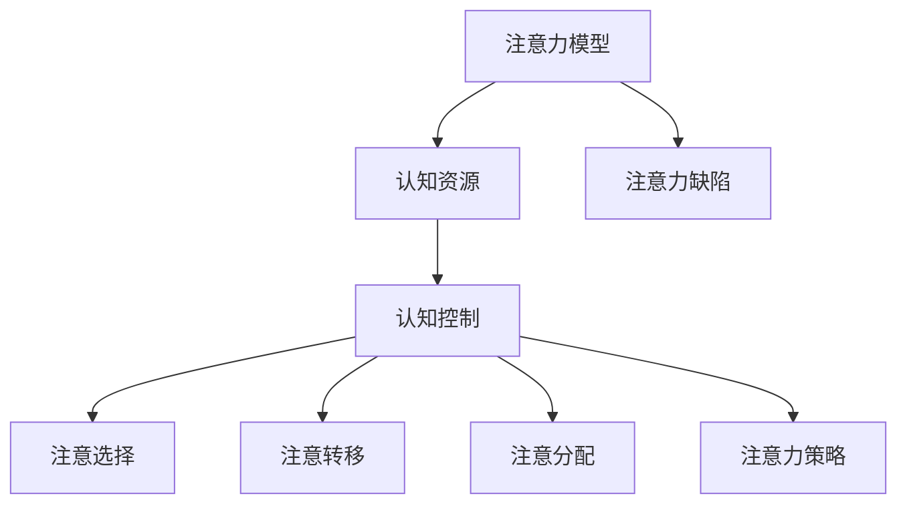

                 

### 《信息时代的注意力管理实践与策略：在干扰和分心中保持头脑清晰》

**关键词：注意力管理、信息过载、干扰控制、工作效率、专注力提升**

**摘要：**
在当今信息爆炸的时代，注意力管理成为了提高工作效率和个人生活质量的关键。本文旨在探讨注意力管理的核心概念和实践策略，帮助读者在干扰和分心中保持头脑清晰。本文分为六个部分：背景与概念、注意力管理原理、注意力管理实践、注意力管理策略、注意力管理技巧以及案例分析。通过深入分析，本文为读者提供了实用的方法和技术，以提升个人和团队的注意力管理水平。

### 目录大纲

#### 第一部分：背景与概念
- 第1章：信息时代的注意力管理概述

#### 第二部分：注意力管理原理
- 第2章：注意力管理核心概念

#### 第三部分：注意力管理实践
- 第3章：日常生活中的注意力管理

#### 第三部分：注意力管理策略
- 第4章：技术辅助下的注意力管理

#### 第四部分：注意力管理技巧
- 第5章：提高注意力技巧与练习

#### 第五部分：案例分析
- 第6章：成功案例分析

#### 第六部分：结论与展望
- 第7章：未来展望与建议

#### 附录
- 第8章：资源与工具

---

### 第一部分：背景与概念

#### 第1章：信息时代的注意力管理概述

**1.1 信息爆炸时代背景**

随着互联网和移动设备的普及，我们生活在一个信息爆炸的时代。每天，我们都被大量的信息所包围，这些信息来自社交媒体、电子邮件、新闻、广告等各个方面。这种信息过载现象不仅给我们的日常生活带来了困扰，还对我们的注意力管理能力提出了巨大的挑战。

**1.2 注意力管理的重要性**

注意力管理是提高工作效率和个人生活质量的关键。有效管理注意力可以帮助我们专注于重要任务，避免分散注意力导致的效率低下和错误率增加。此外，良好的注意力管理还能帮助我们更好地应对压力，保持身心健康。

**1.3 注意力的特性**

注意力具有选择性、分配性、转移性和持久性等特性。选择性使我们能够从众多信息中筛选出对当前任务最有价值的部分。分配性意味着我们可以在同时处理多个任务时分配注意力。转移性使我们能够在需要时将注意力从一个任务转移到另一个任务。持久性是指注意力集中的时间长度，良好的注意力管理可以帮助我们延长这种时间。

**1.4 本书结构**

本书分为六个部分，首先介绍注意力管理的背景和概念，然后深入探讨注意力管理的核心原理和实践策略，接着介绍注意力管理技巧，并通过案例分析展示成功经验。最后，本书对注意力管理的未来趋势提出展望。

### 第二部分：注意力管理原理

#### 第2章：注意力管理核心概念

**2.1 注意力模型简介**

注意力模型是理解注意力管理的基础。一个典型的注意力模型包括认知资源、认知控制、注意选择、注意转移、注意分配和注意力策略等核心概念。

**2.2 注意力分散与集中**

注意力分散是指注意力无法集中在某个特定任务上，从而导致效率低下。注意力集中则是指将注意力高度集中在某个任务上，以实现高效工作。注意力分散和集中是注意力管理的关键问题。

**2.3 注意力分配策略**

注意力分配策略包括任务优先级排序、时间管理和环境优化等。任务优先级排序帮助我们确定哪些任务最重要，从而确保注意力首先分配给这些任务。时间管理则帮助我们合理分配时间，避免过度劳累。环境优化包括减少干扰、创造一个适合专注工作的环境等。

**2.4 Mermaid流程图：注意力管理核心概念关联**

下面是一个使用Mermaid绘制的注意力管理核心概念关联流程图：



### 第三部分：注意力管理实践

#### 第3章：日常生活中的注意力管理

**3.1 工作中的注意力管理**

在职场中，良好的注意力管理对于提高工作效率至关重要。以下是一些实用技巧：

- **任务分解**：将大任务分解成小任务，有助于集中注意力。
- **番茄工作法**：使用番茄工作法（Pomodoro Technique）来管理工作时间，每25分钟专注工作，然后休息5分钟。
- **设定优先级**：确定任务的重要性和紧急性，优先处理重要且紧急的任务。
- **避免多任务处理**：尽量在一次时间内专注于一个任务，避免分散注意力。

**伪代码：如何在一小时内高效工作**

```python
def efficient_work(hours):
    start_time = time.time()
    end_time = start_time + hours * 60 * 60
    
    tasks = ["任务1", "任务2", "任务3", ...]
    
    while time.time() < end_time:
        for task in tasks:
            allocate_attention(task)
            complete_task(task)
            
        transfer_attention()
```

**3.2 学习中的注意力管理**

在学习过程中，注意力管理同样重要。以下是一些建议：

- **设置学习目标**：明确学习目标，有助于集中注意力。
- **避免干扰**：创造一个安静的学习环境，减少干扰。
- **定时休息**：每学习45分钟休息10分钟，有助于保持注意力。
- **使用记忆技巧**：如联想记忆、图表记忆等，提高学习效率。

**3.3 睡眠与休息中的注意力管理**

良好的睡眠和休息是保持注意力的重要保障。以下是一些建议：

- **规律作息**：保持规律的作息时间，有助于提高睡眠质量。
- **减少夜间使用电子设备**：睡前减少电子设备的使用，有助于放松大脑。
- **适量运动**：适量的运动有助于提高睡眠质量。

**3.4 实例：如何在一小时内高效工作**

假设您需要在接下来的一个小时内完成三个任务：编写一篇报告、回复20封电子邮件和设计一个简单的UI界面。以下是一个具体的实践步骤：

1. **任务分解**：将任务分解为小任务，例如报告分为引言、主体和结论三个部分，电子邮件分为阅读、回复和整理三个步骤，UI界面分为布局、样式和交互三个部分。

2. **设定优先级**：根据任务的重要性和紧急性，确定优先级。例如，报告是最重要的任务，电子邮件其次，UI界面最不紧急。

3. **番茄工作法**：使用番茄工作法，每25分钟专注工作，然后休息5分钟。具体步骤如下：

   - **第1个番茄钟**：专注编写报告的引言部分。
   - **休息5分钟后**：专注阅读和回复电子邮件。
   - **休息5分钟后**：专注设计UI界面的布局。

4. **注意力转移**：根据任务进度和注意力状态，适当调整注意力分配。例如，如果报告的引言部分已经完成，可以转移到UI界面的样式设计。

通过以上步骤，您可以在一个小时内高效地完成三项任务，同时保持注意力集中。

### 第四部分：注意力管理策略

#### 第4章：技术辅助下的注意力管理

**4.1 应用软件与工具**

现代科技为我们提供了许多注意力管理的应用软件和工具，帮助我们在日常生活中更好地控制注意力。以下是一些常用的工具：

- **专注力应用**：如Forest、Moment等，通过种植虚拟植物来激励用户专注于工作。
- **时间管理应用**：如Trello、Asana等，帮助用户合理安排任务和时间。
- **闹钟应用**：如番茄钟闹钟，定时提醒用户休息和专注。

**4.2 硬件设备的使用**

硬件设备也可以在注意力管理中发挥重要作用，以下是一些推荐的硬件：

- **降噪耳机**：如Sony WH-1000XM4，帮助用户在嘈杂环境中保持专注。
- **智能手表**：如Apple Watch，实时监测用户的活动和休息状态，提供健康反馈。
- **智能灯**：如LIFX智能灯，通过调节光线亮度和色温，帮助用户放松和专注。

**4.3 实例：如何使用番茄工作法提高效率**

番茄工作法是一种简单有效的时间管理技巧，可以帮助我们在有限的时间内保持专注。以下是一个具体的实例：

1. **确定任务**：假设您需要在两个小时内完成一篇报告、回复20封电子邮件和一个简单的UI设计。

2. **设置番茄钟**：使用番茄钟应用或闹钟，设置25分钟的工作时间和5分钟的休息时间。

3. **专注工作**：在番茄钟的25分钟内，专注于当前任务，避免分心和打扰。

4. **休息与转移**：在休息时间内，站起来活动身体，喝杯水，放松大脑。然后，将注意力转移到下一个任务。

5. **总结反思**：在每个番茄钟结束时，总结任务完成情况，调整任务优先级和注意力分配。

通过使用番茄工作法，您可以更好地控制时间，提高工作效率。

### 第五部分：注意力管理技巧

#### 第5章：提高注意力技巧与练习

**5.1 锻炼注意力技巧**

锻炼注意力是一个长期的过程，以下是一些建议：

- **专注练习**：定期进行专注练习，如冥想、专注力训练游戏等。
- **多任务练习**：适当进行多任务练习，提高注意力分配和转移能力。
- **挑战自己**：设定有挑战性的目标，激发自己的注意力潜力。

**5.2 精神状态调节**

良好的精神状态有助于提高注意力。以下是一些建议：

- **保持良好作息**：规律作息有助于提高精神状态。
- **适度运动**：适量运动有助于放松身心，提高注意力。
- **饮食调整**：合理饮食有助于提高精神状态。

**5.3 实例：如何通过冥想提升专注力**

冥想是一种有效的锻炼注意力的方法，以下是一个具体的冥想练习实例：

1. **选择安静环境**：找一个安静、舒适的地方，关掉手机和电子设备。

2. **准备冥想姿势**：坐直，背部挺直，双脚平放地面，闭上眼睛。

3. **深呼吸**：深呼吸，感受每一次呼吸，放松身体。

4. **专注呼吸**：将注意力集中在呼吸上，感受每一次呼吸的进出。

5. **回归呼吸**：如果注意力分散，不要焦虑，温和地将注意力引回到呼吸上。

6. **结束冥想**：持续练习，每次10分钟，逐渐增加练习时间。

通过定期练习冥想，您可以提升专注力和精神状态。

### 第六部分：案例分析

#### 第6章：成功案例分析

**6.1 企业案例分析**

许多企业已经认识到注意力管理的重要性，并采取了一系列措施来提高员工的注意力水平。以下是一个企业的成功案例分析：

**案例：某互联网公司**

1. **制定注意力管理政策**：公司制定了注意力管理政策，鼓励员工在工作时间内专注于任务。

2. **提供专注工作空间**：公司为员工提供了专注工作空间，减少干扰，提高工作效率。

3. **定期培训**：公司定期组织注意力管理培训，帮助员工掌握有效的注意力管理技巧。

4. **员工反馈**：公司鼓励员工反馈注意力管理方面的建议和问题，不断完善政策。

通过以上措施，该公司员工的注意力水平得到了显著提升，工作效率和员工满意度也有所提高。

**6.2 个人案例分析**

以下是一个个人的成功案例分析：

**案例：程序员小李**

1. **设定目标**：小李每天设定明确的任务目标，确保注意力集中在重要任务上。

2. **番茄工作法**：小李使用番茄工作法来管理时间，每25分钟专注工作，然后休息5分钟。

3. **环境优化**：小李在家中创造了一个安静、舒适的工作环境，减少干扰。

4. **定期反思**：小李定期反思自己的注意力管理情况，总结经验教训，不断优化方法。

通过以上实践，小李的注意力水平得到了显著提升，工作效率也有了明显提高。

**6.3 教育领域的注意力管理**

在教育领域，注意力管理同样至关重要。以下是一个教育领域的成功案例分析：

**案例：某中学**

1. **课堂教学**：教师通过使用互动教学方法和启发式教学，激发学生的注意力。

2. **作业管理**：学校为学生提供作业管理工具，帮助学生合理安排时间，提高注意力。

3. **家长参与**：学校鼓励家长参与孩子的注意力管理，共同创造良好的学习环境。

4. **心理辅导**：学校提供心理辅导，帮助学生应对注意力分散问题。

通过以上措施，该中学学生的注意力水平得到了显著提升，学习成绩也有所提高。

**6.4 注意力管理在特殊群体中的应用**

注意力管理不仅在个人和企业层面具有重要意义，在特殊群体中同样适用。以下是一个特殊群体成功案例的分析：

**案例：自闭症儿童教育**

1. **个性化教育**：针对自闭症儿童的特殊需求，教育机构提供了个性化的教育计划。

2. **注意力训练**：通过注意力训练游戏和活动，帮助自闭症儿童提高注意力。

3. **家长参与**：家长参与孩子的注意力管理，提供持续的支持和鼓励。

4. **专业辅导**：教育机构提供专业的心理辅导和康复服务，帮助自闭症儿童提高注意力。

通过以上措施，自闭症儿童的注意力水平得到了显著提升，生活质量也有所改善。

### 第七部分：结论与展望

#### 第7章：未来展望与建议

**7.1 注意力管理趋势**

随着科技的不断进步，注意力管理将迎来更多的发展机遇。人工智能、虚拟现实和增强现实等技术将为注意力管理提供新的工具和方法，帮助人们更有效地控制注意力。

**7.2 面临的挑战与机遇**

未来，注意力管理将面临信息过载、注意力分散等挑战。同时，随着人们对注意力管理的重视，相关产业将迎来巨大的发展机遇。

**7.3 建议与展望**

- **个人建议**：个人应加强注意力管理意识，学习有效的方法和技巧，提高自身注意力水平。
- **组织建议**：企业和教育机构应重视注意力管理，为员工和学生提供相应的培训和支持。
- **科技发展**：科技公司和学术机构应继续研发注意力管理工具和技术，为公众提供更多选择。

**附录：资源与工具**

- **注意力管理应用**：如Forest、Moment、Trello等。
- **注意力管理书籍**：如《深度工作》（Deep Work）等。
- **注意力管理网站**：如专注力训练网站等。

通过以上措施和建议，我们可以更好地应对信息时代的挑战，提高注意力管理能力，实现个人和团队的高效发展。

### 附录：资源与工具

#### 附录A：注意力管理相关工具介绍

**A.1 应用软件**

1. **Forest（树苗）**
   - 功能：通过种植虚拟植物激励用户专注于工作。
   - 优点：直观、有趣，能有效减少干扰。
   - 链接：https://www.forestryapp.com/

2. **Moment（分秒）**
   - 功能：监控使用手机的时间和应用，帮助用户意识到时间分配。
   - 优点：界面友好，数据详尽。
   - 链接：https://www.momentup.com/

**A.2 硬件设备**

1. **Sony WH-1000XM4**
   - 功能：主动降噪耳机，提供安静的工作和休息环境。
   - 优点：降噪效果好，舒适度高。
   - 链接：https://www.sony.com/zh-cn/product/wh-1000xm4

2. **Apple Watch**
   - 功能：健康监测，包括睡眠质量、活动水平等。
   - 优点：集成多种健康功能，易于使用。
   - 链接：https://www.apple.com/watch/

**A.3 进一步学习资源**

1. **书籍**
   - 《深度工作》（Deep Work）by Cal Newport
     - 优点：提供深度工作的方法和策略。
     - 链接：https://www.amazon.com/Deep-Work-Professional-Quantity-Professionals/dp/0143128516

   - 《如何高效学习》（Make It Stick: The Science of Successful Learning）by Peter C. Brown, Henry L. Roediger III, and Mark A. McDaniel
     - 优点：基于科学研究的学习方法。
     - 链接：https://www.amazon.com/Make-It-Stick-Science-Successful-Learning/dp/019932027X

2. **在线课程**
   - Coursera上的“注意力管理”（Attention Management）
     - 优点：提供系统的注意力管理知识和技能。
     - 链接：https://www.coursera.org/specializations/attention-management

3. **网站和博客**
   - https://calnewport.com/
     - 优点：提供深度工作、注意力管理相关的资源和博客文章。
   - https://www.productivityist.com/
     - 优点：提供时间管理和注意力管理技巧。

通过这些工具和资源，读者可以进一步学习和实践注意力管理，提升个人和团队的工作效率。

### 全文总结

本文深入探讨了信息时代的注意力管理实践与策略，从背景与概念、核心原理、实践技巧到案例分析，全面展示了注意力管理的重要性。通过具体实例和工具介绍，本文为读者提供了实用的方法和技术，帮助他们在干扰和分心中保持头脑清晰。未来，随着科技的不断进步，注意力管理将继续成为提高工作效率和个人生活质量的关键领域。希望读者能够积极应用本文中的建议和技巧，提升自己的注意力管理能力，实现个人和团队的高效发展。最后，感谢大家的阅读，期待与您共同探索注意力管理的更多可能性。作者：AI天才研究院/AI Genius Institute & 禅与计算机程序设计艺术/Zen And The Art of Computer Programming。

