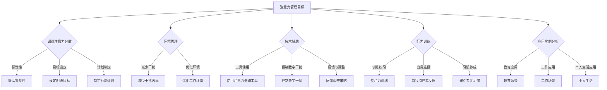

                 

# 信息时代的注意力管理策略：在干扰和分心中航行

> **关键词：** 注意力管理，信息过载，分心，干扰，策略，技术辅助，行为训练，教育应用，工作应用，未来展望

> **摘要：** 
本文将探讨信息时代下注意力管理的理论和实践。随着信息技术的飞速发展，人们面临越来越严重的干扰和分心问题。本文首先介绍了注意力管理的理论基础，包括认知心理学、神经科学和教育的视角。接着，文章提出了注意力管理的实践策略，包括基本策略、技术辅助策略和行为训练策略，并结合教育、工作和个人生活场景进行了应用实例分析。最后，文章展望了注意力管理的未来发展趋势和科学研究进展，为读者提供了全面的注意力管理策略和实践指南。

### 目录大纲：信息时代的注意力管理策略：在干扰和分心中航行

#### 第一部分：注意力管理的理论基础

- **1. 引言**
  - **1.1 信息时代下的注意力挑战**
    - 干扰与分心的来源
    - 注意力管理的紧迫性
  - **1.2 注意力管理的核心概念**
    - 注意力的类型与功能
    - 注意力的分配与切换
  - **1.3 注意力管理的理论基础**
    - 认知心理学视角
    - 神经科学视角
    - 教育学视角

#### 第二部分：注意力管理的实践策略

- **2. 注意力管理策略的概述**
  - **2.1 基本策略**
    - 意识到注意力分散的警觉性
    - 设定明确的目标与计划
    - 使用环境管理策略减少干扰
  - **2.2 技术辅助策略**
    - 技术工具的应用
    - 数字干扰控制
    - 技术辅助的注意力追踪与反馈
  - **2.3 行为训练策略**
    - 注意力训练的练习
    - 自我监控与反思
    - 建立专注的习惯

- **3. 注意力管理策略的应用实例**
  - **3.1 教育场景中的应用**
    - 学生注意力的提升策略
    - 教师在课堂中的注意力管理
    - 教育技术的应用
  - **3.2 工作环境中的应用**
    - 提高工作效率的注意力策略
    - 团队协作中的注意力管理
    - 工作环境改造策略
  - **3.3 个人生活的注意力管理**
    - 娱乐与休闲时间的注意力管理
    - 睡眠与休息的注意力管理
    - 长期生活的平衡与注意力管理

#### 第三部分：注意力管理的未来展望

- **4. 注意力管理的发展趋势**
  - **4.1 科技与注意力管理**
    - 新技术对注意力管理的影响
    - 未来科技在注意力管理中的应用前景
  - **4.2 注意力管理的伦理与社会影响**
    - 注意力管理的伦理问题
    - 注意力管理对社会的影响
  - **4.3 注意力管理的科学研究进展**
    - 当前研究的重点领域
    - 未来研究方向

### 附录

- **附录 A：注意力管理资源与工具**
- **附录 B：注意力管理相关的参考文献**
- **附录 C：注意力管理的 Mermaid 流程图**
- **附录 D：注意力管理算法的伪代码**
- **附录 E：注意力管理的数学模型与公式**
- **附录 F：注意力管理项目的实战案例**
- **附录 G：开发环境的搭建与配置**
- **附录 H：源代码实现与解读**

---

### 附录 C：注意力管理的 Mermaid 流程图



---

### 附录 D：注意力管理算法的伪代码

```pseudo
function AttentionManagement Strategy(userProfile, environmentData, technologyTools, behavioralTrainingData):
    begin
        // 初始化注意力管理参数
        attentionBudget = userProfile.defaultAttentionBudget
        distractionLevel = calculateDistractionLevel(environmentData)
        attentionSwitchCost = calculateAttentionSwitchCost()

        // 识别注意力分散
        while (isAttentionDistracted(userProfile.currentActivity, distractionLevel)):
            // 提高警觉性
            increaseAwareness(userProfile)

            // 设定明确目标
            setClearGoals(userProfile)

            // 制定行动计划
            planAction(userProfile)

            // 环境管理
            manageEnvironment(environmentData)

            // 技术辅助
            useTechnologyTools(technologyTools)

            // 行为训练
            performBehavioralTraining(behavioralTrainingData)

            // 反馈与调整
            adjustStrategyBasedOnFeedback(userProfile, attentionBudget, distractionLevel)

            // 更新用户数据
            updateUserProfile(userProfile)

        end while
    end
```

---

### 附录 E：注意力管理的数学模型与公式

#### 1. 注意力分配函数

$$
A(t) = \alpha_d \cdot D(t) - \beta_s \cdot S(t)
$$

其中：
- \( A(t) \) 表示时间 \( t \) 时刻的注意力水平。
- \( \alpha_d \) 是对干扰的敏感度参数。
- \( D(t) \) 是时间 \( t \) 时刻的干扰程度。
- \( \beta_s \) 是对分心的敏感度参数。
- \( S(t) \) 是时间 \( t \) 时刻的分心程度。

#### 2. 干扰与分心的程度度量

$$
D(t) = \sum_{i=1}^{n} w_i \cdot d_i(t)
$$

$$
S(t) = \sum_{i=1}^{n} w_i \cdot s_i(t)
$$

其中：
- \( d_i(t) \) 是第 \( i \) 个干扰源在时间 \( t \) 的干扰强度。
- \( s_i(t) \) 是第 \( i \) 个分心源在时间 \( t \) 的分心强度。
- \( w_i \) 是第 \( i \) 个干扰或分心源的重要性权重。

#### 3. 注意力预算与调节

$$
\alpha_d = \frac{B}{D(t)}
$$

$$
\beta_s = \frac{B}{S(t)}
$$

其中：
- \( B \) 是注意力预算，表示在给定时间内能够分配的注意力总量。

---

### 附录 F：注意力管理项目的实战案例

#### 实战案例：注意力管理APP开发

#### 1. 项目背景

注意力管理APP旨在帮助用户在干扰和分心中提高注意力水平，提升学习和工作效率。通过实时监测用户注意力、提供策略推荐、以及行为训练等功能，帮助用户更好地管理注意力。

#### 2. 功能设计

- **注意力监测**：实时跟踪用户的注意力水平。
- **报警提示**：当用户注意力下降时发出提醒。
- **策略推荐**：根据用户习惯和历史数据推荐注意力管理策略。
- **持续反馈**：用户反馈调整注意力管理策略。

#### 3. 技术实现

- **Flutter框架**：用于开发跨平台APP。
- **注意力追踪库**：如OpenAVATAR，用于实时监测注意力水平。
- **机器学习算法**：用于分析用户行为，推荐策略。

#### 4. 代码解读

##### 注意力监测模块代码

```dart
class AttentionMonitor {
  int attentionLevel;
  Timer? monitorTimer;

  void startMonitoring() {
    monitorTimer = Timer.periodic(Duration(seconds: 5), (timer) {
      attentionLevel = calculateAttentionLevel();
      if (attentionLevel < threshold) {
        alarm();
      }
    });
  }

  void stopMonitoring() {
    monitorTimer?.cancel();
  }

  int calculateAttentionLevel() {
    // 实现注意力计算逻辑
    // ...
    return attentionLevel;
  }

  void alarm() {
    // 发出报警提示
    // ...
  }
}
```

##### 策略推荐模块代码

```dart
class StrategyRecommender {
  Map<String, Strategy> strategies;

  StrategyRecommender() {
    strategies = {
      'environment调整': EnvironmentStrategy(),
      '技术辅助': TechAssistanceStrategy(),
      '行为训练': BehavioralTrainingStrategy(),
    };
  }

  Strategy getRecommendedStrategy(UserProfile profile) {
    // 根据用户数据推荐策略
    // ...
    return strategies['行为训练'];
  }
}
```

#### 5. 分析与优化

- 对用户数据进行持续分析，优化策略推荐算法。
- 提供用户反馈机制，及时调整APP功能。

---

### 附录 G：开发环境的搭建与配置

#### 1. 开发工具

- **Flutter SDK**
- **Dart 编译器**
- **Android Studio 或 Visual Studio Code**

#### 2. 系统要求

- **操作系统**：Windows、macOS 或 Linux
- **处理器**：双核以上
- **内存**：4GB及以上
- **硬盘**：至少10GB可用空间

#### 3. 环境配置步骤

##### Windows

1. 下载并安装Flutter SDK。
2. 配置环境变量。

   ```shell
   set FLUTTER_ROOT=C:\flutter
   set PATH=%PATH%;%FLUTTER_ROOT%\bin
   ```

3. 验证Flutter环境。

   ```shell
   flutter --version
   ```

##### macOS

1. 使用Homebrew安装Flutter SDK。

   ```shell
   brew install flutter
   ```

2. 验证Flutter环境。

   ```shell
   flutter --version
   ```

##### Linux

1. 使用包管理器安装Flutter SDK。

   ```shell
   sudo apt-get install flutter
   ```

2. 验证Flutter环境。

   ```shell
   flutter --version
   ```

#### 4. 开发环境配置示例

##### 配置Flutter环境变量

```shell
export FLUTTER_ROOT=/usr/local/flutter
export PATH=$PATH:$FLUTTER_ROOT/bin
```

---

### 附录 H：源代码实现与解读

#### 1. 注意力监测模块代码

```dart
class AttentionMonitor {
  int attentionLevel;
  Timer? monitorTimer;

  void startMonitoring() {
    monitorTimer = Timer.periodic(Duration(seconds: 5), (timer) {
      attentionLevel = calculateAttentionLevel();
      if (attentionLevel < threshold) {
        alarm();
      }
    });
  }

  void stopMonitoring() {
    monitorTimer?.cancel();
  }

  int calculateAttentionLevel() {
    // 实现注意力计算逻辑
    // ...
    return attentionLevel;
  }

  void alarm() {
    // 发出报警提示
    // ...
  }
}
```

##### 解读

- `AttentionMonitor` 类用于实现注意力监测功能。
- `startMonitoring` 方法启动监测定时器。
- `stopMonitoring` 方法停止监测。
- `calculateAttentionLevel` 方法计算当前注意力水平。
- `alarm` 方法是注意力低时触发的处理逻辑。

#### 2. 策略推荐模块代码

```dart
class StrategyRecommender {
  Map<String, Strategy> strategies;

  StrategyRecommender() {
    strategies = {
      'environment调整': EnvironmentStrategy(),
      '技术辅助': TechAssistanceStrategy(),
      '行为训练': BehavioralTrainingStrategy(),
    };
  }

  Strategy getRecommendedStrategy(UserProfile profile) {
    // 根据用户数据推荐策略
    // ...
    return strategies['行为训练'];
  }
}
```

##### 解读

- `StrategyRecommender` 类用于推荐注意力管理策略。
- `_strategies` 属性存储了不同类型的策略。
- `getRecommendedStrategy` 方法根据用户数据推荐合适的策略。

#### 3. 主界面代码

```dart
class MyHomePage extends StatefulWidget {
  @override
  _MyHomePageState createState() => _MyHomePageState();
}

class _MyHomePageState extends State<MyHomePage> {
  AttentionMonitor attentionMonitor = AttentionMonitor();
  StrategyRecommender strategyRecommender = StrategyRecommender();

  @override
  void initState() {
    super.initState();
    attentionMonitor.startMonitoring();
  }

  @override
  void dispose() {
    attentionMonitor.stopMonitoring();
    super.dispose();
  }

  @
``` <sop><|user|>
### 引言

在当今信息爆炸的时代，我们每天都要面对大量的信息输入。从社交媒体到电子邮件，从在线视频到即时通讯，各种各样的信息源不断地在我们身边涌现。这种信息过载现象不仅给我们的日常生活带来了困扰，更对我们的注意力管理提出了前所未有的挑战。现代人类的大脑在处理这些信息时，常常感到疲惫不堪，难以集中精力完成一项任务。因此，如何有效管理注意力，成为了一个迫切需要解决的问题。

注意力，简单来说，是指我们专注于某一事物，从而进行深入思考和高效工作的能力。然而，在当今这个充满干扰和分心的环境中，保持高度集中的注意力变得越来越困难。手机、电脑、社交媒体等现代科技产品，虽然为我们带来了便利，但也成为了干扰我们注意力的主要来源。除此之外，工作压力、社交活动、家庭责任等多方面的因素，也让我们的注意力分散问题愈发严重。

注意力管理的重要性不言而喻。有效的注意力管理不仅可以提高我们的学习效率和生产力，还可以改善我们的生活质量。然而，如何在信息过载和干扰众多的环境中，保持高度的注意力集中，成为了许多人在日常生活和工作中面临的难题。因此，本文将深入探讨注意力管理的理论基础和实践策略，帮助读者在干扰和分心中航行，找到适合自己的注意力管理方法。

#### 1.1 干扰与分心的来源

在信息时代，干扰与分心已经成为影响我们注意力集中度的两个主要障碍。首先，外部干扰源无处不在。这些干扰源可以分为以下几个主要类别：

1. **数字干扰**：现代科技产品，如手机、电脑、平板电脑等，是最常见的干扰源。社交媒体、即时通讯、电子邮件、推送通知等，不断地吸引我们的注意力，使我们无法专注于当前的任务。例如，在开会时，手机短信或社交媒体通知可能会打断我们的思路，使我们无法集中精力听取发言或参与讨论。

2. **环境干扰**：工作或学习环境中的噪音、视觉干扰和其他人员的活动，也可能对我们的注意力产生负面影响。例如，在一个嘈杂的咖啡厅或公共交通工具上，很难保持专注进行阅读或工作。

3. **社交干扰**：社交互动，如电话通话、面对面的交谈，虽然可以带来愉悦感，但在需要高度集中精力的任务时，也会分散我们的注意力。

4. **内部干扰**：除了外部干扰，我们自身的内心活动，如焦虑、忧虑或其他思绪，也会干扰我们的注意力。这些内部干扰通常源自个人的心理状态和情绪波动。

其次，分心是指我们的注意力被不相关的信息或活动吸引，导致无法专注于当前任务。分心的来源包括：

1. **多任务处理**：虽然多任务处理看起来可以同时完成多项任务，但实际上它会导致我们的注意力分散，降低任务完成的质量和效率。例如，一边工作一边查看社交媒体，虽然看似在同时处理两项任务，但实际上工作质量可能会大打折扣。

2. **未完成任务的担忧**：当我们在做一项任务时，脑海中可能会不断浮现出其他未完成任务的担忧，这会分散我们的注意力。例如，正在撰写报告时，可能会突然想起还有一项会议准备尚未完成。

3. **对奖励的期待**：当我们期待某个奖励或结果时，注意力可能会被这种期待所占据，导致我们无法专注于当前的任务。例如，在等待考试结果时，可能会影响到我们平时的学习。

总的来说，外部干扰和内部干扰、分心现象的共同作用，极大地影响了我们在信息时代保持专注的能力。了解这些干扰和分心的来源，是有效管理注意力的第一步。

#### 1.1.1 干扰与分心的来源

干扰和分心在信息时代对我们的工作、学习和日常生活产生了深远的影响。在工作环境中，注意力分散会导致工作效率下降，错误率增加，从而影响工作质量。研究表明，当员工被迫在多个任务间切换时，生产力会显著下降。根据一项研究，当员工在处理多个任务时，其工作效率仅相当于专注处理单个任务的60%。这种工作效率的下降不仅影响了个人绩效，也可能对整个团队和组织的运作产生负面影响。

在学习环境中，注意力分散同样是一个严重的问题。学生如果无法集中注意力，学习效果会大打折扣。研究表明，注意力分散的学生在学习过程中容易分心，难以吸收和理解知识点。例如，在一项关于大学生注意力分散的研究中，研究人员发现，学生在使用手机或其他电子设备进行学习时，注意力分散的情况比不使用这些设备时要严重得多。这种注意力分散不仅降低了学习效率，还可能导致学习疲劳和焦虑情绪。

在个人生活中，注意力分散同样对生活质量产生了负面影响。在日常生活中，我们可能会发现自己无法专注于一项任务，例如做家务、锻炼或与家人进行有效沟通。这种注意力分散使得我们难以有效地利用时间，从而产生焦虑和压力。此外，社交媒体和即时通讯等数字干扰，经常打断我们的日常生活，使得我们很难享受完整的休息时间。

注意力分散还会导致心理和情绪问题。长期处于注意力分散状态的人，可能会感到疲劳、焦虑和压抑。这种心理状态不仅影响个人的幸福感，还可能导致更严重的心理健康问题，如抑郁症和焦虑症。

综上所述，干扰和分心在信息时代对我们的工作、学习和生活质量产生了显著的负面影响。因此，注意力管理的紧迫性显而易见。通过有效的注意力管理策略，我们可以更好地应对这些干扰和分心，提高工作效率，提升学习效果，改善生活质量。因此，研究和实践注意力管理策略，对个人和社会都具有重要的意义。

#### 1.2 注意力管理的核心概念

在探讨注意力管理的理论和实践策略之前，我们需要先了解一些核心概念。注意力管理涉及多个关键领域，包括注意力的类型与功能、注意力的分配与切换，以及这些概念在认知心理学、神经科学和教育学中的体现。

首先，我们来探讨注意力的类型与功能。注意力可以分为三大类型：选择注意力、执行注意力和分配注意力。

1. **选择注意力**（Selective Attention）：选择注意力是指我们在面对多个刺激时，有选择地关注某些信息而忽略其他信息的能力。例如，当你在一个嘈杂的咖啡厅工作时，你可能会有意识地忽略周围的噪音，专注于你的电脑屏幕。选择注意力是我们在信息过载环境中保持专注的关键。

2. **执行注意力**（Executive Attention）：执行注意力是指我们进行计划、决策、问题解决和任务管理的能力。它涉及我们的认知控制过程，包括维持目标、调节情绪、抑制不相关思维等。例如，当你需要在规定时间内完成一项任务时，你需要调动执行注意力来确保自己不偏离任务目标。

3. **分配注意力**（Divided Attention）：分配注意力是指我们在同时处理多个任务时的能力。例如，一名优秀的驾驶员在驾驶时，需要同时关注道路状况、交通信号和车内乘客的交谈。分配注意力是我们在多任务环境中保持高效的关键。

了解注意力的类型与功能，有助于我们更好地理解注意力管理的核心问题。接下来，我们来探讨注意力的分配与切换。

注意力的分配与切换是指我们在不同任务间切换注意力的过程。这个过程受到多个因素的影响，包括任务的复杂度、个体注意力水平和环境干扰等。

1. **注意力的分配**（Attention Allocation）：注意力的分配是指我们在多个任务间合理分配注意力的过程。有效的注意力分配需要我们根据任务的优先级和重要性来调整注意力的投入。例如，在处理一项紧急任务和一项常规任务时，我们需要根据任务的紧急程度和重要程度来分配注意力。

2. **注意力的切换**（Attention Switching）：注意力的切换是指我们在不同任务间快速切换注意力的过程。研究表明，注意力切换存在一定的成本，即每次切换都会导致一定的认知负荷。因此，频繁的注意力切换可能会降低我们的工作效率。例如，在工作中，频繁地切换邮件、社交媒体和工作任务，会导致注意力分散和工作效率下降。

在认知心理学、神经科学和教育学中，注意力管理的研究从不同角度为我们提供了深刻的见解。

1. **认知心理学视角**：认知心理学家研究注意力管理时，主要关注注意力的认知控制过程。例如，注意力的选择性、分配和切换是如何在认知系统中运作的。研究表明，注意力的分配和切换受到个体认知资源的影响，因此，了解个体的认知特点对于设计有效的注意力管理策略至关重要。

2. **神经科学视角**：神经科学家通过研究大脑结构和功能，揭示了注意力管理背后的生物学基础。例如，大脑中的前额叶皮层、顶叶皮层和基底神经节等区域在注意力管理中发挥着重要作用。通过神经成像技术，研究者可以观察这些区域在注意力分配和切换时的活动，从而为注意力管理提供生理学基础。

3. **教育学视角**：教育学家关注注意力管理在教育和学习中的应用。他们研究如何通过教学方法和学习环境来改善学生的注意力水平。例如，研究表明，通过提供清晰的目标、结构化的学习内容和减少干扰，可以有效提升学生的注意力集中度。教育学的研究成果为我们提供了实际可行的注意力管理策略。

综上所述，注意力管理的核心概念包括注意力的类型与功能、注意力的分配与切换，以及这些概念在不同学科中的体现。理解这些核心概念，有助于我们设计有效的注意力管理策略，应对信息时代的挑战。

#### 1.2.1 注意力的类型与功能

注意力作为人类认知系统中的一个关键组成部分，具有多种类型和功能。以下是三种主要类型及其具体功能的详细解释。

**1. 选择注意力（Selective Attention）**

选择注意力是指个体在面对多个刺激时，有选择地关注某些刺激并忽略其他刺激的能力。这种注意力的类型使个体能够在复杂的环境中集中精力处理重要信息。

- **功能**：
  - **筛选信息**：选择注意力帮助我们筛选并处理对我们当前任务或目标最为重要的信息。例如，当你在听一个复杂的讲座时，选择注意力使你能够关注讲座的重点，而忽略其他无关的背景噪音。
  - **降低认知负荷**：通过有选择地关注信息，个体可以减少同时处理的刺激数量，从而降低认知负荷。这种能力在多任务环境中尤为重要，因为它帮助我们在处理多个任务时不会感到过度疲劳。
  - **提高反应速度**：选择注意力使个体能够快速识别和响应关键刺激。例如，在驾驶时，选择注意力使驾驶员能够迅速注意到路况变化和潜在的交通安全威胁。

**2. 执行注意力（Executive Attention）**

执行注意力是指个体进行计划、组织、决策和问题解决的能力。这种注意力类型涉及我们的认知控制和自我调节过程。

- **功能**：
  - **目标设定**：执行注意力帮助我们设定和维持目标，确保我们的行为与目标一致。例如，当你在准备考试时，执行注意力帮助你制定学习计划，并保持专注，不被其他干扰所分心。
  - **认知控制**：执行注意力使我们能够抑制不相关的想法和行为，保持注意力集中在当前任务上。例如，当你在工作中需要集中精力解决一个复杂的问题时，执行注意力帮助你抑制分心的想法，专注于问题解决。
  - **灵活适应**：执行注意力使我们能够灵活调整策略，应对新的信息和环境变化。例如，当你面对一个意外的挑战时，执行注意力帮助你迅速评估情况，并制定新的应对策略。

**3. 分配注意力（Divided Attention）**

分配注意力是指个体同时处理多个任务或刺激的能力。这种注意力的类型使个体能够在多个任务间灵活切换，并保持整体效率。

- **功能**：
  - **任务切换**：分配注意力使我们能够在多个任务间进行快速切换，并保持每个任务的质量。例如，一名优秀的医生在手术过程中，需要同时关注患者的病情、手术设备的操作和团队成员的指令。
  - **资源分配**：分配注意力使我们能够根据任务的优先级和重要性，合理分配注意资源。例如，在准备一场演讲时，你可能会在撰写讲稿、设计幻灯片和进行模拟练习之间分配注意力。
  - **协同工作**：分配注意力使个体能够在团队环境中有效地协作。例如，在团队项目会议中，团队成员可以同时关注讨论内容、记录会议笔记和准备后续任务。

通过了解注意力的类型与功能，我们可以更好地理解注意力管理的重要性。选择注意力帮助我们专注于关键信息，执行注意力支持我们的认知控制和目标设定，而分配注意力使我们能够灵活处理多个任务。掌握这些注意力类型和功能，有助于我们在信息时代有效地管理注意力，提高学习、工作和生活的效率和质量。

#### 1.2.2 注意力的分配与切换

注意力的分配与切换是注意力管理中的关键环节。它们不仅影响我们的认知效率和任务完成质量，还在一定程度上决定了我们在多任务环境中的表现。

**注意力的分配（Attention Allocation）**

注意力的分配指的是在多个任务或刺激之间合理分配注意力的过程。这种分配需要考虑任务的优先级、重要性和紧急性等因素。

- **优先级分配**：在多任务环境中，我们需要根据任务的优先级来分配注意力。例如，紧急且重要的任务（如处理突发事件）需要优先分配更多的注意力资源，而可以稍后处理的任务则可以分配较少的注意力。
- **重要性分配**：有些任务可能对我们个人的职业发展或日常生活有重要影响，这些任务也应得到更多的注意力资源。例如，在准备重要考试或提交重要报告时，我们应确保将足够的注意力集中在这些任务上。
- **资源限制**：注意力的资源是有限的，我们需要根据可用资源来合理分配注意力。例如，当我们感到疲劳或压力较大时，我们的注意力资源可能会减少，这时我们需要重新评估任务的优先级，确保将注意力集中在最重要的任务上。

**注意力的切换（Attention Switching）**

注意力的切换是指我们在不同任务或刺激之间快速转换注意力的过程。与注意力的分配不同，注意力切换通常涉及认知负荷的增加。

- **切换成本**：注意力切换通常会有一定的认知成本，即每次切换都会消耗一定的认知资源。研究表明，频繁的注意力切换会导致认知负荷的增加，从而影响任务完成的效率和质量。例如，当我们频繁地在社交媒体和工作任务之间切换时，可能会感到注意力分散，导致工作效率下降。
- **切换策略**：为了减少切换成本，我们可以采用一些策略来优化注意力切换。例如，我们可以尝试在任务之间设置明确的切换点，以确保在切换时能够迅速集中注意力。此外，通过优化任务顺序，我们可以减少不必要的注意力切换，从而提高整体效率。
- **任务连贯性**：保持任务的连贯性也是减少注意力切换成本的一种策略。通过确保任务之间具有内在关联性，我们可以减少在任务切换时的认知负荷。例如，在准备报告时，我们可以先处理数据收集和分析，再进行报告撰写，这样可以减少在任务之间的注意力切换。

**如何优化注意力的分配与切换**

1. **明确任务优先级**：在多任务环境中，首先明确每个任务的优先级，确保将注意力集中在最重要的任务上。
2. **合理安排任务顺序**：通过优化任务顺序，减少不必要的注意力切换。尽量将相关任务安排在一起，以减少切换成本。
3. **设定明确的切换点**：在任务之间设定明确的切换点，确保在切换时能够迅速集中注意力。
4. **保持任务连贯性**：确保任务之间具有内在关联性，减少在任务切换时的认知负荷。
5. **合理休息**：在长时间工作或学习后，合理安排休息时间，以恢复注意力和提高工作效率。

通过优化注意力的分配与切换，我们可以提高认知效率，减少认知负荷，从而在多任务环境中更好地管理注意力。

#### 1.3 注意力管理的理论基础

注意力管理的理论基础涉及多个学科领域，包括认知心理学、神经科学和教育学。这些学科从不同角度研究了注意力的本质和运作机制，为我们提供了深刻的见解，有助于我们设计有效的注意力管理策略。

**1. 认知心理学视角**

认知心理学家研究注意力管理时，主要关注注意力的认知控制过程。认知心理学认为，注意力是一种高级认知功能，涉及我们的信息处理和认知资源管理。

- **选择性注意力**：认知心理学研究表明，选择性注意力是一种有选择地处理信息的能力。这种能力使我们能够关注与当前任务相关的信息，同时忽略不相关的信息。例如，当我们专注于一个重要的电话会议时，选择性注意力帮助我们集中注意力，忽略背景噪音和其他干扰。

- **执行注意力**：执行注意力是指我们进行计划、决策、问题解决和任务管理的能力。认知心理学家发现，执行注意力涉及到认知控制过程，包括目标设定、认知调节和抑制不相关思维。例如，当我们面临复杂任务时，执行注意力帮助我们维持任务目标，调整策略，以克服干扰和挑战。

- **分配注意力**：认知心理学还研究了分配注意力，即同时处理多个任务或刺激的能力。研究表明，分配注意力受到个体认知资源的影响，尤其是工作记忆和认知控制过程。例如，在多任务环境中，个体需要分配注意力资源，以同时关注不同的任务，并保持任务之间的连贯性。

**2. 神经科学视角**

神经科学通过研究大脑结构和功能，揭示了注意力管理背后的生物学基础。神经成像技术，如功能性磁共振成像（fMRI）和电生理记录，使我们能够观察大脑在不同注意状态下的活动。

- **大脑区域**：神经科学研究指出，大脑中的多个区域在注意力管理中发挥着重要作用。例如，前额叶皮层与执行注意力和计划能力有关；顶叶皮层与空间注意力和视觉处理有关；基底神经节与动机和奖励处理有关。通过了解这些区域的活动，我们可以更好地设计针对特定注意力问题的干预策略。

- **神经递质**：神经递质是大脑中传递信号的化学物质，它们在注意力管理中也起到关键作用。例如，多巴胺是一种与动机和奖励处理相关的神经递质，它对执行注意力和分配注意力有重要影响。通过调节神经递质的水平，我们可以优化注意力的管理。

- **神经网络**：神经科学研究还揭示了注意力管理中的神经网络动态。例如，前额叶皮层和其他大脑区域之间的神经网络活动，对执行注意力和认知控制至关重要。通过理解这些神经网络的运作机制，我们可以开发出更有效的注意力训练和恢复策略。

**3. 教育学视角**

教育学研究注意力管理时，主要关注如何通过教学方法和学习环境来改善学生的注意力水平。

- **教学策略**：教育学研究表明，通过设计有效的教学策略，可以显著提升学生的注意力集中度。例如，使用互动式教学方法、提供清晰的目标和结构化的学习内容，以及减少干扰因素，都可以帮助学生更好地集中注意力。

- **学习环境**：学习环境的布局和设计对学生的注意力也有重要影响。研究表明，一个安静、有序的学习环境有助于提升学生的注意力水平。此外，通过减少干扰因素，如关闭不必要的电子设备，教师可以帮助学生更好地专注于学习任务。

- **学生自我调节**：教育学还强调学生自我调节在注意力管理中的重要性。通过培养学生的自我调节能力，他们可以更好地控制自己的注意力，管理自己的学习时间和任务。例如，通过设定学习目标、制定学习计划和监控自己的学习进度，学生可以更好地管理自己的注意力。

综上所述，注意力管理的理论基础涵盖了认知心理学、神经科学和教育学等多个领域。这些学科的研究成果为我们提供了深刻的见解，帮助我们理解注意力的本质和运作机制，从而设计出更有效的注意力管理策略。通过结合这些理论，我们可以更好地应对信息时代的注意力挑战，提高学习、工作和生活的效率和质量。

#### 1.3.1 认知心理学视角

从认知心理学的视角来看，注意力管理是一个涉及复杂认知过程的领域。认知心理学家通过多年的研究和实验，揭示了注意力的本质、机制以及如何通过认知技巧来提升注意力。

首先，认知心理学认为注意力是一种认知资源，它决定了我们如何处理和响应环境中的信息。这种资源是有限的，因此我们需要合理分配和利用它。以下是认知心理学在注意力管理方面的一些主要发现：

1. **选择性注意力**：选择性注意力是指个体在众多刺激中，有选择地关注某一特定刺激的能力。这种能力使我们能够过滤掉无关信息，专注于重要任务。例如，当你在嘈杂的环境中工作时，选择性注意力帮助你忽略噪音，专注于电脑屏幕上的任务。

2. **执行注意力**：执行注意力是一种高级认知能力，涉及目标设定、任务规划和问题解决。它使我们能够在复杂和动态的环境中保持专注，并做出有效的决策。例如，当你面临多个任务时，执行注意力帮助你设定优先级，合理安排时间和资源。

3. **分配注意力**：分配注意力是指同时处理多个任务或刺激的能力。虽然这种能力在我们的日常生活中很重要，但过度依赖分配注意力可能导致认知负荷增加，从而影响任务完成的质量。因此，认知心理学家建议，我们应该有意识地减少分配注意力的任务数量，以确保每个任务都能得到充分的关注。

认知心理学还提供了一些提升注意力管理的策略：

- **注意力训练**：通过特定的练习，我们可以提高选择性注意力和执行注意力的能力。例如，练习冥想和正念可以帮助我们更好地控制自己的注意力，减少分心。

- **目标设定**：设定明确的目标可以帮助我们集中注意力。具体来说，我们应该将大目标分解成小目标，并为每个小目标设定具体的行动步骤。这样，我们可以保持注意力集中在实现这些小目标上，从而逐步实现大目标。

- **认知恢复**：长时间集中注意力会导致认知疲劳，因此我们需要定期休息和恢复。例如，每工作45分钟后，我们可以休息5-10分钟，进行简单的放松活动，如散步或深呼吸。

- **环境管理**：一个良好的工作或学习环境可以显著提升注意力。认知心理学家建议，我们应该减少干扰因素，如关闭不必要的电子设备，保持工作空间的整洁和有序。

**实验证据**

认知心理学在注意力管理方面的许多发现都通过实验得到了验证。以下是一些代表性的实验：

1. **双任务实验**：在双任务实验中，参与者需要在同时进行两个任务时，保持注意力集中。研究表明，过度依赖分配注意力会导致任务完成质量下降。因此，认知心理学家建议，在处理多个任务时，我们应该有意识地减少任务数量，专注于最重要的任务。

2. **冥想研究**：冥想练习被认为可以提升注意力和认知控制能力。一项研究表明，长期冥想者在新奇刺激面前能够更好地集中注意力，并且能够更有效地忽略无关信息。

3. **认知恢复实验**：研究表明，短暂的休息和放松活动可以显著提升认知能力和注意力水平。实验参与者在进行长时间工作或学习后，进行短暂的休息，结果显示他们的认知表现和注意力水平显著提高。

综上所述，认知心理学为我们提供了深刻的理解，帮助我们更好地管理注意力。通过应用认知心理学的研究成果，我们可以设计出更有效的注意力管理策略，提升我们的学习、工作和生活质量。

#### 1.3.2 神经科学视角

从神经科学的视角来看，注意力管理涉及到大脑中的多个区域和复杂的神经回路。神经科学家通过神经成像技术和脑电图（EEG）等手段，揭示了注意力管理背后的生物学机制，并为我们提供了宝贵的理论基础。

首先，大脑中与注意力管理相关的主要区域包括：

1. **前额叶皮层**：前额叶皮层是大脑中与执行注意力和认知控制关系最为密切的区域。它参与了目标设定、计划制定、问题解决和自我调节等高级认知功能。神经成像研究表明，当个体进行注意力控制任务时，前额叶皮层特别是前额叶中部和前额叶前部区域的活动显著增强。

2. **顶叶皮层**：顶叶皮层是大脑中负责处理空间信息和视觉注意力的主要区域。它参与了注意力的分配和任务切换。通过fMRI研究，科学家发现，当个体进行视觉注意任务时，顶叶皮层的活动与注意力集中度密切相关。

3. **纹状体**：纹状体是大脑中与动机和奖励处理相关的区域，它参与了执行注意力和分配注意力的动机调节。研究发现，纹状体中的多巴胺活动与注意力的奖励敏感性有直接关系。

其次，神经科学揭示了注意力管理中的几个关键神经回路：

1. **默认模式网络**：默认模式网络是一个在大脑休息状态下活跃的神经网络，它参与了内省、记忆和自我调节。研究表明，默认模式网络的活动与注意力分散有关，当网络活动增强时，个体更容易分心。

2. **前额叶皮层-顶叶皮层网络**：这个网络是执行注意力和认知控制的核心回路。它通过前额叶皮层的前部和中部区域与顶叶皮层的前部区域相互作用，共同调节注意力分配和任务执行。

3. **前额叶皮层-纹状体网络**：这个网络参与了动机调节和注意力分配。它通过前额叶皮层与纹状体的相互作用，调节个体的注意力和动力状态。

神经科学在注意力管理中的应用主要包括以下几个方面：

1. **神经反馈**：通过实时监测大脑活动，神经反馈技术可以帮助个体了解自己的注意力状态，并调整行为以改善注意力。例如，基于脑电图的神经反馈系统可以用于训练个体在特定任务上提高注意力集中度。

2. **脑刺激技术**：如经颅磁刺激（TMS）和电刺激（tDCS），这些技术可以通过调节大脑活动来改善注意力。研究表明，TMS和tDCS可以增强前额叶皮层和顶叶皮层区域的活动，从而提升注意力控制能力。

3. **药物干预**：一些药物，如抗抑郁药和注意力缺陷多动障碍（ADHD）治疗药物，可以通过调节神经递质水平来改善注意力。例如，刺激多巴胺释放的药物可以帮助提升执行注意力和动机。

**实验证据**

神经科学在注意力管理方面的实验证据主要包括以下几项：

1. **神经成像研究**：通过fMRI和PET等成像技术，科学家发现，执行注意力任务时，前额叶皮层和顶叶皮层区域的活动显著增加，而默认模式网络的活动减弱。

2. **脑电研究**：脑电图（EEG）研究表明，当个体进行注意力任务时，特定脑波（如alpha波和beta波）的活动模式发生变化。这些变化与注意力的集中度和任务表现相关。

3. **脑刺激研究**：研究表明，通过经颅磁刺激（TMS）和电刺激（tDCS）等技术，可以调节前额叶皮层和顶叶皮层区域的活动，从而改善注意力和认知功能。

综上所述，神经科学为我们提供了深入了解注意力管理生物学机制的视角。通过研究大脑中的关键区域和神经回路，以及应用神经反馈、脑刺激和药物干预等技术，我们可以开发出更有效的注意力管理策略，帮助个体更好地应对信息时代的注意力挑战。

#### 1.3.3 教育学视角

从教育学的视角来看，注意力管理不仅是心理学研究的重要内容，也是教育实践中不可或缺的一环。教育学关注如何通过教学方法和学习环境的设计，来改善学生的注意力集中度，从而提升学习效果。

首先，教育学强调目标设置在教学中的重要性。明确的目标可以帮助学生明确学习的方向和目的，从而提高注意力的集中度。例如，教师在布置作业或讲解新知识时，可以提前设定明确的学习目标，让学生知道需要达到的具体要求，这样学生就能更有针对性地分配注意力。

其次，教育学提出了结构化学习内容的概念。结构化的学习内容可以帮助学生更好地理解和记忆知识点。例如，通过使用思维导图、教学视频和互动式教学工具，教师可以将复杂的知识分解成更易理解的部分，从而降低学生的认知负荷，提高注意力集中度。

此外，教育学还关注学习环境的布局和设计。一个安静、有序的学习环境可以显著减少干扰，帮助学生更好地集中注意力。研究表明，在一个没有干扰的环境中，学生的注意力和学习效率显著提高。因此，教师在设计学习环境时，应尽量减少噪音和其他视觉干扰，如关闭不必要的电子设备，保持教室整洁。

教育学还强调了学生自我调节在注意力管理中的重要性。自我调节能力包括设定目标、自我监控和自我评价等。通过培养学生的自我调节能力，他们可以更好地管理自己的注意力，提高学习效率。例如，教师可以引导学生记录自己的学习进度，定期回顾和调整学习计划，从而提高自我管理能力。

具体的教育学方法如下：

1. **时间管理策略**：通过时间管理策略，如番茄工作法，学生可以合理安排学习和休息时间，避免长时间集中注意力导致的疲劳。这种方法建议学生每工作25分钟，休息5分钟，以保持注意力的持久性。

2. **多感官学习**：多感官学习通过视觉、听觉和触觉等多种方式刺激学生的感官，从而提高他们的注意力集中度。例如，通过使用色彩丰富的教学材料、播放相关音频和视频，教师可以激发学生的兴趣，提高他们的注意力。

3. **互动式学习**：互动式学习通过学生与教师、同学之间的互动，提高学习的参与度和注意力集中度。例如，通过小组讨论、角色扮演和课堂互动活动，学生可以在互动中保持注意力集中，增强学习体验。

4. **正念训练**：正念训练是一种通过冥想和呼吸练习来提高注意力集中度的方法。研究表明，正念训练可以帮助学生更好地管理自己的情绪，减少分心，提高学习效果。教师可以在课堂中引入正念训练，培养学生的专注力。

通过教育学的研究和方法，教师可以设计出更加有效的教学策略，帮助学生更好地管理注意力，从而提升学习效果。教育学的视角为注意力管理提供了重要的理论和实践指导，使我们在信息时代能够更好地应对注意力挑战。

### 2. 注意力管理策略的概述

在信息时代，有效地管理注意力是一项复杂的任务，需要我们采取一系列的策略和技巧。本文将概述注意力管理的主要策略，包括基本策略、技术辅助策略和行为训练策略。每种策略都有其独特的作用和方法，可以帮助我们在干扰和分心中保持高度的注意力集中。

#### 2.1 基本策略

**1. 提高警觉性**

提高警觉性是注意力管理的基础。当我们意识到自己的注意力开始分散时，需要及时采取行动，以重新集中注意力。以下是一些提高警觉性的方法：

- **定期休息**：长时间工作或学习后，我们需要定期休息，以避免注意力疲劳。建议每45分钟休息5-10分钟，进行简单的身体活动或深呼吸练习。
- **使用提醒工具**：可以使用定时器或提醒应用来提醒自己休息和调整注意力。例如，每工作25分钟，设置一个5分钟的休息提醒。

**2. 设定明确的目标与计划**

设定明确的目标和计划是提高注意力集中度的重要策略。明确的目标可以帮助我们集中精力，避免在任务间分散注意力。以下是一些设定目标和计划的方法：

- **分解任务**：将大任务分解成小任务，并为每个小任务设定明确的目标和截止日期。这样可以帮助我们更好地管理时间和注意力。
- **使用清单**：使用任务清单或待办事项应用，将任务按优先级排序，并确保在执行任务时专注于当前的任务。

**3. 使用环境管理策略减少干扰**

环境管理是注意力管理中至关重要的一环。一个安静、有序的环境可以帮助我们更好地集中注意力。以下是一些减少干扰的方法：

- **关闭不必要的电子设备**：在工作或学习时，关闭不必要的手机、电子邮件和社交媒体通知，以减少数字干扰。
- **优化工作空间**：保持工作空间的整洁和有序，减少视觉干扰。例如，将办公用品整齐地摆放，避免工作台上堆放杂乱无章的物品。
- **减少噪音**：在嘈杂的环境中，可以使用耳塞或耳机来减少噪音干扰。如果条件允许，选择一个相对安静的环境进行工作和学习。

#### 2.2 技术辅助策略

**1. 使用注意力追踪工具**

注意力追踪工具可以帮助我们实时监测和管理注意力。这些工具通常包括应用程序和设备，它们可以记录我们的注意力水平，并提供反馈和建议。以下是一些常用的注意力追踪工具：

- **应用软件**：例如 Focus@Will、Windster 和 Brain Focus，这些应用程序可以在我们工作时播放专有的背景音乐，以帮助我们集中注意力。
- **智能设备**：如智能手表和健身追踪器，它们可以记录我们的日常活动，并提供有关注意力水平的反馈。

**2. 数字干扰控制**

数字干扰是信息时代的主要挑战之一。通过以下方法，我们可以控制数字干扰，减少对注意力的分散：

- **限制社交媒体使用时间**：使用应用程序或设置，限制每天使用社交媒体的时间。例如，使用应用如 Moment 或 Quality Time，这些应用程序可以监控我们的社交媒体使用情况，并帮助我们设定每日使用时间限制。
- **电子邮件管理**：定期检查和处理电子邮件，避免频繁查看电子邮件带来的干扰。可以使用自动回复功能，告知发件人在一段时间内无法及时回复。

**3. 技术辅助的注意力追踪与反馈**

技术辅助的注意力追踪与反馈可以帮助我们了解自己的注意力模式，并提供改进的建议。以下是一些技术辅助的注意力追踪与反馈方法：

- **应用程序反馈**：许多注意力追踪应用程序可以记录我们的日常注意力模式，并提供反馈和建议。例如，Focus@Will 会根据我们的注意力水平，调整播放的音乐，以帮助我们更好地集中注意力。
- **设备反馈**：智能设备如智能手表和健身追踪器，可以记录我们的日常活动，并提供有关注意力水平的实时反馈。这些设备通常会有通知功能，提醒我们在需要时调整注意力。

#### 2.3 行为训练策略

**1. 注意力训练的练习**

通过特定的练习，我们可以提高自己的注意力集中度。以下是一些注意力训练的练习方法：

- **冥想练习**：冥想是一种有效的注意力训练方法，它可以帮助我们提高专注力和注意力集中度。每天花10-15分钟进行冥想，可以帮助我们减少分心，提高注意力。
- **正念练习**：正念练习通过专注于当下的感受和体验，帮助我们从分散的思绪中回归到当前任务。例如，在走路时专注于每一步的感觉，或在进食时专注于食物的味道和口感。

**2. 自我监控与反思**

自我监控与反思是注意力管理中的重要环节。通过记录和反思自己的注意力表现，我们可以了解自己的注意力模式，并找到改进的方法。以下是一些自我监控与反思的方法：

- **日志记录**：每天记录自己的注意力表现，包括哪些任务上注意力集中，哪些任务上注意力分散，以及分心的原因。这种记录可以帮助我们识别注意力分散的模式，并采取相应的改进措施。
- **定期反思**：每周或每月定期反思自己的注意力管理情况，总结成功和失败的经验，并制定下一步的改进计划。

**3. 建立专注的习惯**

建立专注的习惯是长期有效管理注意力的关键。以下是一些建立专注习惯的方法：

- **养成固定的工作和休息时间**：设定固定的作息时间，确保在工作和休息时都有充足的专注时间。
- **设定明确的任务目标**：每次开始任务时，设定明确的目标和期限，以确保自己能够集中注意力完成任务。
- **避免多任务处理**：尽量避免同时处理多个任务，专注于单一任务，以提高任务完成的质量和效率。

通过基本策略、技术辅助策略和行为训练策略的综合运用，我们可以有效地管理注意力，提高工作和学习效率，改善生活质量。在接下来的章节中，我们将进一步探讨这些策略在不同场景下的具体应用。

#### 2.1 基本策略

基本策略是注意力管理的基础，通过以下方法，我们可以有效地提高警觉性、设定明确的目标与计划，以及使用环境管理策略来减少干扰。

**1. 提高警觉性**

提高警觉性是保持注意力集中的关键。以下是一些具体的方法：

- **定期休息**：长时间集中注意力会导致大脑疲劳，因此我们需要定期休息。建议每工作或学习45分钟后，休息5-10分钟。在这段时间内，可以进行简单的身体活动，如伸展、散步或做一些深呼吸练习，以帮助大脑恢复活力。

- **使用提醒工具**：可以使用定时器或应用程序来提醒自己休息。例如，可以使用手机上的定时功能，每45分钟提醒自己休息。同时，还可以设置一些具体的休息活动，如喝一杯水或进行短暂的冥想，以保持大脑的清醒和警觉。

- **保持良好的作息习惯**：养成良好的作息习惯，确保有足够的睡眠时间。睡眠不足会导致注意力下降，因此建议每晚保持7-8小时的睡眠。

**2. 设定明确的目标与计划**

明确的目标和计划可以帮助我们集中注意力，避免在任务间分散注意力。以下是一些具体的方法：

- **分解任务**：将大任务分解成小任务，并为每个小任务设定明确的目标和截止日期。这样可以帮助我们更好地管理时间和注意力。例如，如果需要完成一篇论文，可以将任务分解为文献查阅、资料整理、草稿撰写和最终修订等几个步骤。

- **使用清单**：使用任务清单或待办事项应用，将任务按优先级排序，并确保在执行任务时专注于当前的任务。例如，可以使用手机上的提醒应用，将每天的任务输入进去，并根据任务的紧急程度和重要性进行排序。

- **设定奖励**：为了激励自己保持注意力集中，可以设定一些小奖励。例如，当完成一项任务后，可以奖励自己一个短暂的休息时间，或者做一些喜欢的事情，如听一首歌曲或看一集电视剧。

**3. 使用环境管理策略减少干扰**

环境管理是注意力管理中的重要一环，以下是一些具体的方法：

- **关闭不必要的电子设备**：在工作或学习时，关闭不必要的手机、电子邮件和社交媒体通知，以减少数字干扰。这些设备会不断地吸引我们的注意力，导致分心。

- **优化工作空间**：保持工作空间的整洁和有序，减少视觉干扰。例如，将办公用品整齐地摆放，避免工作台上堆放杂乱无章的物品。

- **减少噪音**：在嘈杂的环境中，可以使用耳塞或耳机来减少噪音干扰。如果条件允许，可以选择一个相对安静的环境进行工作和学习。

- **制定环境规则**：在家庭或工作环境中，可以制定一些规则来减少干扰。例如，在特定的时间内，不允许在家庭中使用手机或电脑，以避免干扰家庭生活和工作的注意力。

通过提高警觉性、设定明确的目标与计划，以及使用环境管理策略减少干扰，我们可以更好地管理注意力，提高工作效率和学习效果。在接下来的章节中，我们将探讨技术辅助策略和行为训练策略，以进一步优化注意力管理。

### 2.2 技术辅助策略

随着信息技术的不断发展，各种注意力管理工具和应用程序应运而生，为我们的注意力管理提供了强大的支持。这些技术辅助策略包括使用注意力追踪工具、控制数字干扰以及技术辅助的注意力追踪与反馈。以下是这些策略的详细说明和应用方法。

**1. 使用注意力追踪工具**

注意力追踪工具可以帮助我们实时监测和管理注意力水平。这些工具通常包含以下功能：

- **注意力监测**：通过记录和分析用户在使用设备时的行为，追踪注意力集中度。例如，一些应用程序可以记录用户在手机或电脑上的活动，并生成注意力分布图表，帮助用户了解自己的注意力状态。
- **提醒功能**：当用户注意力分散或低于设定阈值时，工具会发出提醒，提示用户重新集中注意力。例如，一些应用程序会在用户注意力下降时发出声音或振动提醒。
- **反馈机制**：通过提供关于用户注意力表现的反馈，帮助用户了解自己的注意力模式，并指导改进。例如，一些应用程序会生成报告，列出用户在特定时间段内的注意力分布情况和分散原因。

以下是一些常用的注意力追踪工具：

- **Focus@Will**：Focus@Will 是一款基于音乐的注意力管理应用程序，它通过播放特定的背景音乐来帮助用户保持注意力集中。应用程序会根据用户的注意力水平调整音乐，当用户分心时，音乐节奏会加快，以提醒用户重新集中注意力。
- **Windster**：Windster 是一款适用于Mac和Windows的操作系统中，用于追踪和改善用户注意力的工具。它提供了详细的注意力报告，帮助用户了解自己的注意力分布和分散原因，并提供了改善建议。

**2. 控制数字干扰**

数字干扰是现代生活中最为普遍的干扰源之一。以下是一些控制数字干扰的方法：

- **限制社交媒体使用时间**：使用应用程序如Moment、Quality Time或Screen Time，这些工具可以帮助用户监控和限制在社交媒体上的时间。例如，用户可以设定每日在社交媒体上的使用时间限制，当达到限制时，应用程序会发出提醒，并限制用户继续使用。
- **电子邮件管理**：通过设定邮件处理的时间段，避免频繁查看电子邮件带来的干扰。例如，用户可以在特定时间段内处理电子邮件，其他时间关闭邮件通知，以减少干扰。
- **应用程序锁定**：使用应用程序锁定工具，如LockAway或AppLock，在需要集中注意力时，锁定不相关的应用程序，防止用户分心。

**3. 技术辅助的注意力追踪与反馈**

技术辅助的注意力追踪与反馈是通过应用软件和智能设备来实现的。以下是一些具体的应用：

- **智能手表和健身追踪器**：这些设备可以记录用户的日常活动，如步数、睡眠质量和心 rate 等，并通过应用程序提供注意力反馈。例如，用户可以查看自己的注意力水平随时间的变化，以及不同活动对注意力水平的影响。
- **脑波追踪设备**：如NeuroSky的脑波追踪设备，这些设备可以通过监测大脑的脑波活动来评估用户的注意力水平。脑波追踪设备通常配有应用程序，可以提供实时的注意力反馈，并帮助用户进行冥想和专注训练。

通过使用注意力追踪工具、控制数字干扰以及技术辅助的注意力追踪与反馈，我们可以更好地了解和管理自己的注意力水平。这些技术辅助策略不仅提供了实时的反馈和提醒，还有助于我们建立良好的注意力管理习惯，提高工作和学习效率。

### 2.2.1 技术工具的应用

在注意力管理中，技术工具的应用变得愈发重要。以下是一些常用的技术工具及其具体应用方法：

**1. 注意力追踪应用**

注意力追踪应用是帮助用户实时监测和管理注意力水平的关键工具。以下是一些常用的应用：

- **Focus@Will**：Focus@Will 是一款流行的注意力追踪应用，它通过播放专门设计的背景音乐来帮助用户保持专注。用户可以选择不同的音乐模式，以适应不同的工作和学习场景。例如，在进行复杂任务时，可以选择集中模式，以提升注意力；在休息时，可以选择放松模式，以缓解疲劳。

  - **使用方法**：
    - 下载安装 Focus@Will 应用程序。
    - 创建账户并登录。
    - 根据需要选择不同的音乐模式，开始专注工作或学习。
    - 应用程序会记录用户的注意力水平，并提供实时反馈。

- **Windster**：Windster 是一款适用于Mac和Windows的操作系统的注意力追踪工具。它通过监控用户的屏幕活动，评估注意力集中度，并提供详细的报告。

  - **使用方法**：
    - 下载安装 Windster 应用程序。
    - 启动应用程序并登录。
    - 选择需要追踪的任务或工作时段。
    - 应用程序会自动记录屏幕活动，并生成注意力报告。

**2. 数字干扰控制工具**

数字干扰是影响注意力集中度的主要因素之一。以下是一些数字干扰控制工具：

- **Moment**：Moment 是一款适用于iOS和Android的操作系统的应用，它可以帮助用户监控和限制在社交媒体上的时间。用户可以设置每日在特定应用上的使用时间限制，当达到限制时，应用程序会发出提醒，并限制用户继续使用。

  - **使用方法**：
    - 下载安装 Moment 应用程序。
    - 创建账户并登录。
    - 选择需要限制使用时间的应用程序。
    - 设定每日使用时间限制。
    - 应用程序会监控用户的社交媒体使用情况，并在达到限制时发出提醒。

- **StayFocusd**：StayFocusd 是一款适用于Google Chrome浏览器的扩展程序，它可以帮助用户限制在非工作相关网站上的时间。用户可以为不同的网站设置使用时间限制，并在达到限制时自动跳转到其他页面。

  - **使用方法**：
    - 下载安装 StayFocusd 扩展程序。
    - 在Google Chrome浏览器中启用扩展程序。
    - 选择需要限制访问的网站。
    - 为每个网站设定每日使用时间限制。
    - 当达到限制时，扩展程序会自动阻止访问。

**3. 注意力追踪与反馈设备**

除了应用程序，一些设备也可以提供注意力追踪与反馈：

- **NeuroSky脑波追踪设备**：NeuroSky 提供了一系列脑波追踪设备，如Emotiv EPOC。这些设备可以通过监测用户的脑波活动，评估注意力水平，并提供实时反馈。

  - **使用方法**：
    - 下载安装 NeuroSky 应用程序。
    - 连接脑波追踪设备。
    - 开始进行注意力训练或任务。
    - 应用程序会实时显示注意力水平，并提供反馈。

- **智能手表和健身追踪器**：如Apple Watch和Fitbit，这些设备可以通过监测用户的步数、心 rate 和睡眠质量，提供有关注意力水平的反馈。

  - **使用方法**：
    - 下载安装相应的手机应用程序。
    - 配对智能手表或健身追踪器。
    - 进行日常活动，如工作、学习和锻炼。
    - 应用程序会记录活动数据，并提供注意力反馈。

通过这些技术工具的应用，我们可以更有效地监测和管理注意力，减少数字干扰，提高工作和学习效率。

#### 2.2.2 数字干扰控制

在信息时代，数字干扰已成为我们注意力管理中的一大挑战。数字干扰不仅来自智能手机、电脑和其他电子设备，还包括各种社交媒体、电子邮件和即时通讯工具。以下是一些具体的策略，帮助我们在日常工作和学习中控制数字干扰，提高注意力集中度。

**1. 限制社交媒体使用时间**

社交媒体是数字干扰的主要来源之一。为了减少社交媒体对我们注意力的分散，可以采取以下策略：

- **设定时间限制**：使用专门的手机应用程序，如Moment或Quality Time，设定每日在社交媒体上的时间限制。当达到设定的时间后，应用程序会发出提醒，并限制用户继续使用。
- **使用“专注模式”**：许多社交媒体应用程序提供了“专注模式”或“无干扰模式”，在特定时间内屏蔽通知和广告，帮助用户集中注意力。
- **定期检查社交媒体**：设定特定的检查时间，例如每天早上起床后和晚上睡前，避免频繁查看社交媒体带来的干扰。

**2. 电子邮件管理**

电子邮件也是数字干扰的一个重要来源。以下是一些有效的电子邮件管理策略：

- **设定固定处理时间**：将每天的一部分时间专门用于处理电子邮件，例如早上和下午各一个小时。在这段时间之外，关闭电子邮件通知，避免不必要的干扰。
- **使用优先级过滤**：使用电子邮件的优先级过滤功能，将重要邮件标记出来，确保在处理电子邮件时能够优先处理重要事务。
- **设置自动回复**：在不能及时回复邮件时，设置自动回复，告知发件人在一段时间内无法及时回复，避免发件人反复发送邮件造成干扰。

**3. 应用程序锁定**

为了防止在需要集中注意力时打开不必要的应用程序，可以使用应用程序锁定工具：

- **使用应用程序锁定软件**：例如LockAway或AppLock，在需要集中注意力时，锁定不相关的应用程序，防止用户分心。
- **设定屏幕时间限制**：使用iOS或Android系统的屏幕时间限制功能，为特定应用程序设定使用时间限制，当达到限制时，自动锁定应用程序。

**4. 环境优化**

优化工作或学习环境也是减少数字干扰的重要策略：

- **关闭不必要的电子设备**：在工作或学习时，关闭不必要的手机、平板电脑和其他电子设备，减少视觉和声音干扰。
- **减少视觉干扰**：保持工作空间的整洁和有序，避免在工作台上堆放杂乱无章的物品。使用屏幕保护器或贴纸，减少屏幕上的干扰元素。
- **选择安静的环境**：如果可能，选择一个相对安静的环境进行工作和学习，避免噪音和人群的干扰。

通过上述策略，我们可以有效地控制数字干扰，提高注意力的集中度。在接下来的章节中，我们将探讨行为训练策略，帮助读者通过自我监控、反思和建立专注习惯来进一步优化注意力管理。

#### 2.2.3 技术辅助的注意力追踪与反馈

技术辅助的注意力追踪与反馈在当今信息时代尤为重要。通过先进的监测工具和反馈机制，用户可以实时了解自己的注意力状态，并根据反馈进行相应的调整。以下是一些技术辅助的注意力追踪与反馈方法及其具体应用。

**1. 注意力追踪应用**

注意力追踪应用是帮助用户监测和管理注意力水平的重要工具。以下是一些流行的应用及其功能：

- **Focus@Will**：Focus@Will 通过播放定制化的背景音乐来帮助用户保持专注。该应用会根据用户的活动和注意力水平自动调整音乐，从而提供一个适合当前工作或学习环境的声音环境。例如，当用户注意力下降时，应用会播放更加兴奋和激励的音乐，以帮助用户重新集中注意力。

  - **使用方法**：
    - 下载并安装 Focus@Will 应用程序。
    - 注册账户并登录。
    - 选择或自定义专注模式。
    - 开始任务时激活应用，它会在后台工作，监测和调整音乐。

- **Windster**：Windster 是一款适用于Mac和Windows操作系统的注意力追踪工具。它可以记录用户在电脑上的活动，并生成详细的注意力报告，帮助用户了解自己的注意力分布情况。

  - **使用方法**：
    - 下载并安装 Windster 应用程序。
    - 启动应用并连接到电脑。
    - 开始记录注意力数据。
    - 定期查看报告，分析自己的注意力模式。

**2. 智能设备与传感器**

智能设备与传感器可以通过监测用户的生理和行为数据来提供注意力追踪与反馈。以下是一些应用实例：

- **智能手表与健身追踪器**：如Apple Watch和Fitbit，这些设备可以监测用户的步数、心 rate 和睡眠质量。通过这些数据，用户可以了解自己的身体状况，从而推断出注意力水平。

  - **使用方法**：
    - 下载并安装相应的手机应用程序。
    - 配对智能手表或健身追踪器。
    - 进行日常活动，如工作、学习和锻炼。
    - 应用程序会记录数据，并提供有关注意力水平的反馈。

- **脑波追踪设备**：如NeuroSky的脑波追踪设备，这些设备通过监测用户的脑波活动，可以评估用户的注意力集中度。脑波追踪设备通常配有应用程序，可以提供实时的注意力反馈。

  - **使用方法**：
    - 下载并安装 NeuroSky 应用程序。
    - 连接脑波追踪设备。
    - 开始进行注意力训练或任务。
    - 应用程序会显示注意力水平，并提供实时反馈。

**3. 反馈机制**

有效的反馈机制可以帮助用户了解自己的注意力状态，并根据反馈进行调整。以下是一些反馈机制的应用实例：

- **实时反馈**：一些注意力追踪应用会提供实时反馈，如视觉提示或声音提醒，当用户注意力下降时，这些提醒可以帮助用户迅速恢复集中。

- **报告与回顾**：定期生成的报告可以帮助用户了解自己的注意力模式。通过回顾报告，用户可以发现自己在哪些时间、哪些情况下容易分心，从而采取相应的措施。

- **目标设定与奖励**：通过设定具体的注意力目标，并使用奖励机制，如虚拟积分或奖励证书，用户可以更有动力地保持注意力集中。

通过这些技术辅助的注意力追踪与反馈方法，用户可以更好地了解自己的注意力状态，并采取相应的调整策略。这些工具不仅提供了实时监测和反馈，还帮助用户建立良好的注意力管理习惯，提高学习和工作效率。

### 2.3 行为训练策略

行为训练策略是通过特定的训练方法和习惯培养来提升注意力集中度的有效途径。以下是一些具体的方法和步骤：

**1. 注意力训练的练习**

注意力训练的练习可以帮助我们提高专注力，以下是一些常用的方法：

- **冥想练习**：冥想是一种有效的注意力训练方法，通过专注呼吸或固定一个物体，可以帮助我们训练注意力。每天进行10-15分钟的冥想练习，可以显著提升我们的专注力。

  - **步骤**：
    - 找一个安静的环境，坐下或盘腿而坐，保持身体舒适。
    - 将注意力集中在呼吸上，感受呼吸的进出。
    - 当注意力开始分散时，轻轻地将其引导回呼吸。

- **正念练习**：正念练习通过专注于当前的感受和体验，帮助我们从分散的思绪中回归到当前任务。以下是一个简单的正念练习步骤：

  - **步骤**：
    - 找一个安静的环境，坐下或站立，保持身体放松。
    - 闭上眼睛，专注于自己的身体感受，从头到脚扫描一遍。
    - 当注意力开始分散时，轻轻地将注意力拉回身体感受。

- **专注力游戏**：通过专注力游戏，如“专注点”或“记忆游戏”，可以帮助我们在娱乐中提升注意力。以下是一个简单的专注力游戏步骤：

  - **步骤**：
    - 打开游戏应用，选择一个难度适中的游戏。
    - 在规定的时间内，专注于完成任务。
    - 游戏结束后，回顾自己的表现，分析自己的注意力集中度。

**2. 自我监控与反思**

自我监控与反思是注意力管理中的重要环节，以下是一些方法和步骤：

- **日志记录**：通过记录每天的任务完成情况和注意力分散的原因，可以帮助我们了解自己的注意力模式。以下是一个简单的日志记录步骤：

  - **步骤**：
    - 在每天结束时，记录当天的任务完成情况。
    - 记录在完成任务过程中遇到的注意力分散原因。
    - 分析日志中的模式，找出注意力分散的高峰时段和常见原因。

- **反思会议**：每周或每月定期进行反思会议，回顾自己的注意力管理情况，总结成功和失败的经验，并制定下一步的改进计划。以下是一个简单的反思会议步骤：

  - **步骤**：
    - 挑选一个安静的时间，安排一个小时的反思会议。
    - 回顾过去的注意力管理情况，讨论成功经验和失败原因。
    - 制定改进计划，包括具体的行为目标和行动计划。

**3. 建立专注的习惯**

建立专注的习惯是长期有效管理注意力的关键，以下是一些具体的方法：

- **设定专注时间段**：每天设定几个专注时间段，例如每工作或学习45分钟后休息10分钟。在这段时间内，尽量减少干扰，专注于当前任务。

  - **步骤**：
    - 在日程表中设定专注时间段。
    - 在专注时间段内，关闭不必要的电子设备。
    - 保持工作空间的整洁和有序，减少视觉干扰。

- **设定明确的任务目标**：在开始任务前，设定明确的任务目标，确保自己知道需要完成的任务和目标。

  - **步骤**：
    - 将任务分解成小步骤。
    - 为每个小步骤设定具体的目标。
    - 在执行任务时，专注于这些目标。

- **避免多任务处理**：尽量避免同时处理多个任务，专注于单一任务，以提高任务完成的质量和效率。

  - **步骤**：
    - 在处理任务时，将手机和其他干扰物品放在视线之外。
    - 在执行任务时，避免频繁查看邮件或社交媒体。
    - 保持专注，直到任务完成。

通过这些行为训练策略，我们可以有效地提升注意力集中度，提高工作和学习效率。在接下来的章节中，我们将探讨这些策略在不同应用场景中的具体实施方法。

#### 2.3.1 注意力训练的练习

**冥想练习**

冥想是一种古老的训练方法，旨在通过意识控制和平静心态来提升注意力。以下是一种简单的冥想练习方法：

- **准备工作**：找一个安静舒适的环境，坐下或躺下，保持背部挺直。
- **专注于呼吸**：将注意力集中在呼吸上，感受每次呼吸的进出，从鼻孔到肺部，再从肺部呼出。
- **放松身体**：逐渐放松全身的肌肉，从头部到脚部。
- **抵抗分心**：当你的注意力开始分散时，轻轻地将其引导回呼吸。

**注意力游戏**

注意力游戏通过有趣的互动设计，帮助玩家在玩乐中提高注意力。以下是一种简单有效的注意力游戏：

- **游戏选择**：选择一个简单但需要集中注意力的游戏，如“专注点”或“记忆游戏”。
- **游戏规则**：阅读游戏说明，了解游戏目标。
- **专注训练**：在规定时间内，专注于完成游戏任务。例如，在“专注点”游戏中，玩家需要在一定时间内找到特定图案。

**具体实例：**

1. **“专注点”游戏**：
   - 游戏规则：在一个复杂的图像中找到特定的图案或符号。
   - 训练步骤：设定5分钟的时间限制，专注于找到目标图案。

2. **“记忆游戏”**：
   - 游戏规则：记住一系列图案或数字的位置，然后按照记忆顺序点击这些位置。
   - 训练步骤：每次游戏设定5分钟，逐步增加难度。

通过定期进行这些练习，可以帮助我们在日常生活中更好地集中注意力，提高学习效率和工作质量。

#### 2.3.2 自我监控与反思

自我监控与反思是注意力管理的关键环节，通过这种方法，我们可以了解自己的注意力表现，识别注意力分散的触发因素，并采取相应的改进措施。以下是一些具体的方法和步骤：

**1. 保持日志记录**

日志记录可以帮助我们追踪自己的注意力表现，识别模式，并找到改进的方法。以下是记录日志的具体步骤：

- **设置日志格式**：制定一个固定的日志格式，包括日期、时间、活动内容、注意力状态、分散原因和改进措施等。
- **每日记录**：每天在结束时，回顾当天的活动，记录注意力状态和分散原因。
- **定期回顾**：每周或每月定期回顾日志，分析注意力分散的模式和触发因素。

**2. 使用注意力追踪工具**

利用注意力追踪工具，如Focus@Will或Windster，可以帮助我们更精确地监测注意力表现。以下是使用工具的具体步骤：

- **安装应用**：下载并安装注意力追踪工具。
- **设定目标**：设置追踪目标和时间，例如每天专注工作或学习2小时。
- **启动应用**：在开始任务时启动应用，应用会记录注意力水平和分散事件。
- **查看报告**：定期查看应用生成的报告，了解自己的注意力模式。

**3. 反思会议**

定期进行反思会议，可以帮助我们深入分析注意力管理的情况，并制定改进计划。以下是反思会议的具体步骤：

- **安排时间**：选择一个安静的时间，安排一个小时的反思会议。
- **回顾日志**：回顾过去一段时间的日志记录，分析注意力分散的原因和频率。
- **讨论问题**：与同事或朋友一起讨论，获取不同的观点和建议。
- **制定计划**：制定具体的改进计划，包括行为目标、实施步骤和时间表。

**4. 意见反馈**

获取他人的意见和反馈，可以帮助我们更全面地了解自己的注意力表现。以下是获取反馈的具体步骤：

- **请求反馈**：向同事、朋友或家人请求关于自己注意力管理的反馈。
- **开放心态**：认真倾听他人的意见和建议，保持开放心态。
- **行动改进**：根据反馈，调整和改进自己的注意力管理策略。

通过自我监控与反思，我们可以更好地了解自己的注意力状态，识别分散原因，并采取有效的改进措施，从而提高注意力集中度，提升工作和学习效率。

### 2.3.3 建立专注的习惯

建立专注的习惯是长期有效管理注意力的关键。通过以下方法，我们可以逐步培养和巩固专注的习惯。

**1. 设定明确的专注时间段**

为了建立专注的习惯，我们需要设定固定的专注时间段。例如，每天设定两个专注时间段，每个时间段45分钟，然后休息10分钟。以下是具体步骤：

- **选择时间段**：选择一天中你最清醒、精力最充沛的两个时间段。
- **设定闹钟**：使用闹钟或提醒应用设定专注时间段和休息时间。
- **开始专注**：在设定的时间段内，专注于当前的任务，避免分心。

**2. 设定明确的任务目标**

在开始任务前，设定明确的任务目标，确保自己知道需要完成的任务和目标。以下是具体步骤：

- **分解任务**：将大任务分解成小任务，并为每个小任务设定具体的子目标。
- **明确目标**：将任务目标和子目标写下来或记录在清单上。
- **回顾目标**：在开始任务时，回顾任务目标和子目标，确保自己清楚任务要求。

**3. 避免多任务处理**

避免同时处理多个任务，专注于单一任务，以提高任务完成的质量和效率。以下是具体步骤：

- **单一任务**：每次专注于一个任务，避免同时处理多个任务。
- **设定优先级**：根据任务的紧急程度和重要性，设定任务的优先级。
- **避免干扰**：在处理任务时，关闭不必要的电子设备，减少视觉和声音干扰。

**4. 坚持练习**

建立专注的习惯需要时间和持续的努力。以下是具体步骤：

- **每天练习**：每天坚持进行专注练习，逐步增加专注时间。
- **记录进步**：记录自己的专注时间和质量，每周或每月回顾进展。
- **调整策略**：根据练习的进展和反馈，调整专注策略和练习方法。

通过设定明确的专注时间段、设定明确的任务目标、避免多任务处理和坚持练习，我们可以逐步培养和巩固专注的习惯，提高注意力的集中度和工作效率。

### 3. 注意力管理策略在教育场景中的应用

在教育场景中，注意力管理策略的重要性尤为突出。学生和教师都面临着信息过载和干扰的挑战，这直接影响了学习效果和教学效率。通过有效的注意力管理策略，学生可以更好地集中注意力，提高学习效率，教师也可以更有效地传授知识，提升教学质量。以下是一些具体的注意力管理策略在教育场景中的应用实例。

#### 3.1.1 学生注意力的提升策略

**1. 环境优化**

创造一个安静、有序的学习环境对于提升学生的注意力至关重要。以下是一些具体措施：

- **减少视觉和声音干扰**：关闭教室中的电子设备，减少噪音和其他视觉干扰，如关闭电视、音响和手机通知。
- **使用隔音材料**：在教室中使用隔音材料，减少外界噪音对学生的干扰。
- **设置固定座位**：将学生固定在固定的座位上，减少他们因座位变化而分心。

**2. 目标设定与时间管理**

明确的目标和合理的时间管理策略可以帮助学生更好地集中注意力。以下是一些具体措施：

- **分解任务**：将大的学习任务分解成小的、可管理的任务，并为每个任务设定明确的目标。
- **使用时间管理工具**：使用时间管理工具，如番茄工作法，帮助学生合理安排学习时间，并在规定时间内保持专注。

**3. 注意力训练**

通过专门的注意力训练，学生可以提高自己的专注力和注意力集中度。以下是一些具体的训练方法：

- **冥想练习**：定期进行冥想练习，帮助学生放松身心，减少分心。
- **专注力游戏**：使用专注力游戏，如“专注点”和“记忆游戏”，训练学生的专注力。

**4. 自我监控与反思**

自我监控与反思可以帮助学生了解自己的注意力模式，并采取相应的改进措施。以下是一些具体措施：

- **日志记录**：鼓励学生记录自己的学习过程，包括专注的时间、分散的原因和改进的方法。
- **定期反思**：定期与学生一起反思他们的学习表现，讨论注意力管理的策略和效果。

#### 3.1.2 教师在课堂中的注意力管理

**1. 优化课堂设计**

教师可以通过优化课堂设计来减少干扰，提高学生的注意力。以下是一些具体措施：

- **教学活动多样化**：设计多样化的教学活动，如小组讨论、互动式学习和实验，以吸引学生的注意力。
- **减少数字干扰**：在课堂上关闭电子设备，避免学生使用手机或其他电子设备带来的干扰。

**2. 设定明确的课堂目标**

教师应在每堂课前设定明确的课堂目标，确保学生知道学习重点和目标。以下是一些具体措施：

- **提前通知**：在课前通知学生本堂课的学习内容和目标。
- **课堂引导**：在课堂中通过提问和讨论，引导学生关注学习重点。

**3. 注意力反馈**

教师可以通过提供即时的注意力反馈来帮助学生保持专注。以下是一些具体措施：

- **课堂互动**：通过提问和讨论，与学生们进行互动，了解他们的注意力状态。
- **即时反馈**：对学生的表现给予即时反馈，帮助他们了解自己的学习情况。

#### 3.1.3 教育技术的应用

教育技术的应用可以为教师和学生提供多种工具，帮助提升注意力管理效果。以下是一些具体的应用实例：

**1. 注意力追踪工具**

注意力追踪工具可以帮助教师和学生了解自己的注意力状态。以下是一些具体应用：

- **Focus@Will**：通过播放定制化的音乐，帮助学生在学习时保持专注。
- **Windster**：记录学生在电脑上的活动，并提供注意力报告。

**2. 数字干扰控制工具**

数字干扰控制工具可以帮助教师管理课堂中的数字干扰。以下是一些具体应用：

- **Moment**：限制学生在社交媒体上的时间，确保他们在学习时不会受到干扰。
- **ClassDojo**：通过互动式学习工具，减少学生分心，提高课堂参与度。

**3. 注意力训练应用**

注意力训练应用可以帮助学生提高专注力。以下是一些具体应用：

- **Mindful**：提供冥想和正念练习，帮助学生放松身心，减少分心。
- **BEEP**：提供专注力游戏，训练学生的专注力和注意力集中度。

通过上述策略和工具的应用，教师和学生可以更好地管理注意力，提高学习效果和教学质量。在接下来的章节中，我们将继续探讨注意力管理策略在工作环境中的应用。

### 3.2.1 提高工作效率的注意力策略

在快节奏的工作环境中，保持注意力集中是提高工作效率的关键。以下是一些具体的方法和策略，帮助员工在工作和会议中更好地管理注意力，从而提升工作效率。

**1. 优化工作环境**

一个整洁、有序的工作环境可以减少干扰，有助于员工保持注意力集中。以下是一些优化工作环境的策略：

- **减少视觉干扰**：保持办公桌整洁，避免堆放杂乱无章的物品。使用屏幕保护器或贴纸，减少屏幕上的干扰元素。
- **减少声音干扰**：使用耳塞或耳机，减少噪音干扰。如果条件允许，选择一个相对安静的工作区域。
- **合理安排工作空间**：将常用工具和文件放在易于访问的地方，避免频繁起身寻找物品。

**2. 精细化任务管理**

通过精细化的任务管理，员工可以更好地分配注意力，确保在重要任务上投入足够的精力。以下是一些具体的任务管理策略：

- **分解任务**：将大任务分解成小任务，并为每个小任务设定明确的目标和时间限制。
- **优先级排序**：根据任务的紧急程度和重要性，为任务排序，确保将注意力集中在最重要的任务上。
- **使用任务清单**：使用任务清单或项目管理工具，将任务按优先级排序，并确保在执行任务时专注于当前的任务。

**3. 定期休息**

长时间集中注意力会导致大脑疲劳，因此需要定期休息。以下是一些具体的休息策略：

- **使用番茄工作法**：每工作25分钟，休息5分钟，以确保大脑得到充分的休息。
- **进行简单活动**：在休息时间内，进行一些简单的身体活动，如伸展、散步或深呼吸，以帮助大脑恢复活力。
- **设定固定的休息时间**：在日程表中设定固定的休息时间，确保在规定时间内休息。

**4. 避免多任务处理**

多任务处理会降低工作效率，因此应尽量避免。以下是一些避免多任务处理的策略：

- **单一任务专注**：每次专注于一个任务，避免同时处理多个任务。
- **设定专注时间段**：每天设定几个专注时间段，确保在这段时间内专注于单一任务。
- **避免频繁切换任务**：减少在任务之间的频繁切换，以降低认知负荷。

**5. 会议效率提升**

会议是工作中常见的活动，但低效率的会议会浪费大量的时间和注意力。以下是一些提升会议效率的策略：

- **明确会议目标**：在会议前明确会议的目标和议程，确保会议有明确的方向。
- **限制会议时间**：设定固定的会议时间，避免会议无休止地延长。
- **会议记录**：指定专人记录会议内容和决定事项，确保会议结束后有明确的行动方案。
- **避免不必要的参会人员**：仅邀请与会议内容直接相关的人员参加，减少干扰。

通过以上策略，员工可以在工作和会议中更好地管理注意力，提高工作效率，实现工作目标。

### 3.2.2 团队协作中的注意力管理

在团队协作中，注意力管理至关重要。高效的团队协作需要成员之间保持高度的注意力和良好的沟通，以确保任务的顺利完成和团队的和谐运作。以下是一些具体策略，帮助团队成员在协作过程中管理注意力。

**1. 明确团队目标**

确保所有团队成员都清楚团队的目标和任务要求。以下是一些明确团队目标的策略：

- **制定详细的任务计划**：在项目启动时，制定详细的任务计划，明确每个阶段的任务和目标，确保团队成员对任务有清晰的认识。
- **定期回顾目标**：在项目执行过程中，定期回顾团队目标，确保团队成员始终关注任务的核心目标，并及时调整计划。

**2. 提升沟通效率**

有效的沟通是团队协作的关键。以下是一些提升沟通效率的策略：

- **设定沟通渠道**：明确团队的沟通渠道，确保信息能够及时、准确地传递。例如，可以使用邮件、即时通讯工具、项目管理软件等。
- **定期会议**：定期召开团队会议，讨论项目进展和遇到的问题，确保团队成员之间的信息同步。

**3. 管理干扰**

在团队协作中，干扰可能会导致注意力分散，影响工作效率。以下是一些管理干扰的策略：

- **设置专注时间段**：在团队中设定专注时间段，确保团队成员在这段时间内能够专注于当前任务，减少干扰。
- **明确沟通规则**：制定明确的沟通规则，如会议中不允许使用手机，避免团队成员在会议期间分心。

**4. 建立反馈机制**

建立有效的反馈机制，可以帮助团队成员及时了解自己的表现，并作出相应的调整。以下是一些建立反馈机制的策略：

- **定期反馈会议**：定期召开反馈会议，团队成员可以分享自己的进展和遇到的问题，获取同事的建议和反馈。
- **匿名反馈**：提供匿名反馈渠道，鼓励团队成员坦诚地表达意见和建议。

**5. 关注团队成员的健康和福祉**

团队成员的健康和福祉对于团队的整体表现至关重要。以下是一些关注团队成员健康和福祉的策略：

- **定期健康检查**：鼓励团队成员定期进行健康检查，确保他们的身体状况良好。
- **提供放松和休息的空间**：为团队成员提供放松和休息的空间，如休息室或健身房，帮助他们缓解工作压力。

通过以上策略，团队可以更好地管理注意力，提升协作效率，实现团队目标。

### 3.2.3 工作环境改造策略

为了提高工作效率和员工的注意力集中度，工作环境的改造是一个有效的策略。以下是一些具体的工作环境改造策略：

**1. 噪音控制**

噪音是常见的工作干扰因素，通过以下方法可以有效减少噪音：

- **安装隔音材料**：在办公室墙壁、天花板和地板上安装隔音材料，如隔音板或隔音棉，以减少外部噪音的干扰。
- **使用隔音设备**：为员工提供隔音耳机或耳塞，帮助他们在需要集中注意力时减少噪音干扰。

**2. 照明改善**

良好的照明可以提升工作环境和员工的注意力集中度。以下是一些照明改善策略：

- **自然光线**：尽可能利用自然光线，通过窗户或玻璃隔断让自然光线进入办公室，减少人工照明的需求。
- **调节光线强度**：使用可调节的照明设备，根据工作需求调整光线强度，避免过强或过弱的光线对眼睛的刺激。

**3. 空气质量**

空气质量对员工的健康和注意力有重要影响。以下是一些改善空气质量的策略：

- **空气净化器**：在办公室安装空气净化器，有效过滤空气中的灰尘、细菌和有害气体。
- **定期通风**：确保办公室有良好的通风系统，定期开窗通风，保持空气清新。

**4. 空间布局**

合理的工作空间布局可以减少干扰，提升员工的注意力集中度。以下是一些空间布局的策略：

- **开放式办公**：采用开放式办公布局，鼓励团队协作和互动，同时减少私人空间带来的干扰。
- **隔断设置**：在需要较高专注度的区域设置隔断，为员工提供相对独立的私人空间，减少外部干扰。

**5. 休息区域**

提供舒适的休息区域，可以帮助员工在工作疲劳时恢复精力，提高注意力。以下是一些休息区域的策略：

- **休息室**：在办公区域附近设置休息室，提供舒适的座椅、茶水和小型娱乐设施，供员工休息和放松。
- **户外空间**：为员工提供户外休息空间，如花园或草坪，让他们在户外进行短暂休息，享受自然风光。

通过以上工作环境改造策略，企业可以显著提升员工的注意力集中度，从而提高整体工作效率。

### 3.3.1 娱乐与休闲时间的注意力管理

在娱乐与休闲时间，有效地管理注意力同样重要。以下是一些策略，帮助我们在这些时间里更好地保持专注，同时避免过度消耗精力。

**1. 设定娱乐目标**

在娱乐时间，设定具体的目标可以帮助我们更专注地享受活动，避免分心。以下是一些设定娱乐目标的策略：

- **选择特定活动**：在选择娱乐活动时，明确自己想达成的目标。例如，看一部电影、读一本书或玩一个游戏，并设定具体的完成时间。
- **限制娱乐时间**：为自己设定一个娱乐时间限制，例如，每次只看一集电视剧或玩半小时游戏，以确保不会过度消耗时间。

**2. 管理数字干扰**

在娱乐时间，数字设备可能会分散我们的注意力。以下是一些管理数字干扰的策略：

- **关闭通知**：在观看电影或阅读书籍时，关闭手机和电脑的通知，避免被不相关消息打扰。
- **使用专注模式**：许多娱乐应用程序提供了专注模式或无干扰模式，可以在特定时间内屏蔽通知和广告，帮助我们更好地集中注意力。

**3. 简化娱乐活动**

简化娱乐活动可以减少我们的认知负荷，帮助我们更轻松地享受休闲时间。以下是一些简化娱乐活动的策略：

- **选择轻松内容**：选择一些轻松的娱乐内容，如轻松的书籍、电影或游戏，避免选择过于复杂或需要大量思考的活动。
- **避免多任务处理**：在娱乐时间，专注于单一活动，避免同时进行多个任务，以提高专注度和娱乐体验。

**4. 合理分配精力**

在娱乐时间，我们需要合理分配精力，确保既有放松时间，也有恢复精力的时间。以下是一些合理分配精力的策略：

- **定期休息**：在娱乐活动中，每隔一段时间休息一下，进行简单的身体活动或深呼吸，以帮助身体和心理恢复活力。
- **交替活动**：在一天的娱乐活动中，交替进行高能量和低能量的活动，例如，先进行一些高强度的运动，然后选择轻松的阅读或冥想。

通过以上策略，我们可以在娱乐与休闲时间更好地管理注意力，提高娱乐体验，同时保持身心健康。

### 3.3.2 睡眠与休息的注意力管理

良好的睡眠和休息是保持注意力集中和提升工作效率的关键。以下是一些策略，帮助我们在睡眠和休息时间有效地管理注意力。

**1. 规律的作息时间**

保持规律的作息时间有助于调节生物钟，提高睡眠质量。以下是一些具体策略：

- **设定固定的睡眠和起床时间**：每天尽量在同一时间入睡和起床，即使在周末也不例外。
- **避免熬夜**：尽量在晚上11点前入睡，确保每天至少有7-8小时的睡眠。

**2. 舒适的睡眠环境**

一个舒适、安静的睡眠环境有助于提高睡眠质量。以下是一些策略：

- **控制光线和噪音**：使用遮光窗帘或眼罩，减少光线干扰；使用耳塞或白噪音机，减少噪音干扰。
- **保持房间温度适中**：保持房间温度在舒适范围内，一般来说，睡眠的最佳温度在15°C到24°C之间。

**3. 放松技巧**

在睡前使用放松技巧可以帮助我们更快入睡。以下是一些放松技巧：

- **冥想和深呼吸**：在睡前进行冥想或深呼吸练习，帮助身心放松。
- **热水澡**：洗一个热水澡，有助于放松身体，提高睡眠质量。

**4. 限制白天的小憩**

虽然短暂的白天小憩可以提供一时的能量补充，但过长的白天小憩可能会影响晚上的睡眠质量。以下是一些限制白天小憩的策略：

- **限制小憩时间**：每次小憩时间控制在20-30分钟以内，避免深度睡眠。
- **避免下午过晚的小憩**：尽量在下午3点前完成小憩，以免影响晚上的睡眠。

通过上述策略，我们可以有效地管理睡眠和休息时间，从而提升注意力集中度，提高日常工作效率和生活质量。

### 3.3.3 长期生活的平衡与注意力管理

在长期生活中，保持注意力管理的平衡对于维护身心健康和提高生活质量至关重要。以下是一些策略，帮助我们在忙碌的生活中找到平衡，同时有效地管理注意力。

**1. 设定生活目标**

明确的生活目标是保持注意力平衡的重要基础。以下是一些设定生活目标的策略：

- **短期与长期目标**：设定短期和长期目标，确保在日常生活中既有即时的成就，也有长期的规划。
- **具体可衡量**：确保目标具体且可衡量，以便我们可以跟踪进度并做出必要的调整。

**2. 时间管理**

有效的时间管理可以帮助我们平衡工作和生活，减少因时间紧迫而产生的压力。以下是一些时间管理的策略：

- **日程规划**：制定详细的日程表，合理安排工作、学习和休闲时间。
- **优先级排序**：根据任务的紧急程度和重要性，为任务排序，确保将注意力集中在最重要的任务上。

**3. 充电与恢复**

定期进行充电和恢复是保持注意力平衡的关键。以下是一些充电与恢复的策略：

- **定期休息**：在长时间工作或学习后，安排短暂的休息时间，进行简单的身体活动或深呼吸练习。
- **周末放松**：每周安排一段时间进行彻底的放松，如进行户外活动、与家人朋友聚会或进行感兴趣的活动。

**4. 生活方式调整**

健康的生活方式有助于提高注意力的集中度。以下是一些生活方式调整的策略：

- **均衡饮食**：保持均衡的饮食，摄入丰富的营养素，避免高糖、高脂肪的食物。
- **适量运动**：定期进行适量的运动，如散步、跑步或瑜伽，以提升身体健康和注意力水平。

**5. 自我反思**

定期进行自我反思可以帮助我们了解自己的注意力状态，并作出相应的调整。以下是一些自我反思的策略：

- **每日反思**：在每天结束时，回顾当天的活动，思考哪些活动有效提升了注意力，哪些活动分散了注意力。
- **每周反思**：每周进行一次更深入的反思，总结一周的生活和工作的表现，识别需要改进的方面。

通过设定生活目标、有效的时间管理、充电与恢复、生活方式调整和自我反思，我们可以在长期生活中找到平衡，保持注意力管理的有效性，从而提升整体生活质量。

### 4. 注意力管理的发展趋势

随着科技的不断进步，注意力管理正面临着新的挑战和机遇。未来，注意力管理将迎来一系列发展趋势，包括新技术的影响、伦理和社会影响，以及科学研究的新进展。以下是这些趋势的具体分析。

#### 4.1 科技与注意力管理

**1. 新技术的影响**

新技术的发展为注意力管理提供了新的工具和方法。例如，虚拟现实（VR）和增强现实（AR）技术可以通过沉浸式的体验，帮助用户更好地集中注意力。VR和AR技术能够创建一个高度模拟的环境，用户在其中的活动可以更加专注，从而提升注意力集中度。

此外，人工智能（AI）和机器学习（ML）的应用也为注意力管理带来了新的可能性。通过分析用户的行为和注意力模式，AI和ML算法可以提供个性化的注意力管理建议。例如，智能助手可以实时监测用户的注意力水平，并根据用户的习惯和需求，提供合适的提醒和策略。

**2. 未来科技的应用前景**

未来，注意力管理领域有望看到更多创新技术的应用。例如，脑机接口（BMI）技术可能成为提升注意力管理的重要工具。BMI技术可以通过直接连接大脑和计算机，实时监测和调节用户的注意力状态。这种技术有望在医疗、教育和工作环境中发挥重要作用，帮助用户更好地管理注意力。

此外，可穿戴设备的进一步发展，如智能眼镜和智能手表，也将为注意力管理提供更多便利。这些设备可以通过传感器和应用程序，提供实时的注意力反馈和干预建议，使用户能够更好地控制自己的注意力。

#### 4.2 注意力管理的伦理与社会影响

**1. 伦理问题**

随着注意力管理技术的发展，伦理问题也日益凸显。例如，注意力追踪工具在收集用户数据时，可能涉及到隐私保护的问题。用户在同意使用这些工具时，应该明确了解数据收集和使用的目的和范围。

此外，注意力管理工具可能会加剧社会中的不平等现象。那些无法负担这些高端技术的人群，可能会在注意力管理方面处于劣势。因此，如何确保技术的公平性和可及性，是一个需要关注的重要问题。

**2. 社会影响**

注意力管理技术的发展对社会产生了深远的影响。例如，通过有效的注意力管理，个人可以提高工作和学习效率，从而为社会创造更多的价值。然而，过度依赖注意力管理工具也可能导致人们过度依赖技术，削弱自我管理能力。

另外，注意力管理技术可能被用于控制和操纵用户行为。例如，雇主可能利用注意力追踪工具来监控员工的注意力状态，从而影响员工的工作表现。这引发了关于工作自由和个人隐私的讨论，需要我们审慎对待。

#### 4.3 注意力管理的科学研究进展

**1. 当前研究的重点领域**

当前，注意力管理的科学研究主要集中在以下几个方面：

- **注意力机制研究**：通过神经科学和认知心理学的研究，深入了解注意力管理的神经基础和认知过程，为开发更有效的注意力管理策略提供科学依据。
- **个性化注意力管理**：利用大数据和人工智能技术，开发个性化注意力管理方案，根据用户的注意力模式和需求，提供定制化的干预建议。
- **注意力恢复策略研究**：研究如何通过休息、运动和认知训练等手段，有效恢复和提高注意力水平，减少注意力疲劳。

**2. 未来研究方向**

未来，注意力管理的研究有望在以下领域取得突破：

- **跨学科研究**：结合心理学、神经科学、教育学和计算机科学等多学科的研究，开发综合性注意力管理解决方案。
- **新技术应用**：探索脑机接口、虚拟现实、增强现实等新技术在注意力管理中的应用，为用户提供更高效、更个性化的注意力管理工具。
- **伦理和社会影响研究**：加强对注意力管理伦理和社会影响的研究，确保技术的发展符合道德标准，并最大限度地减少负面影响。

综上所述，注意力管理的发展趋势表明，未来这一领域将迎来更多创新和突破。通过科技与伦理的结合，科学研究与实际应用的融合，我们可以更有效地管理注意力，提升个人和社会的整体福祉。

### 4.1 科技与注意力管理

科技的发展正在深刻地改变我们的生活方式，同时也对注意力管理带来了新的挑战和机遇。新技术在提升注意力管理效率和精准度方面展现出巨大的潜力，特别是在人工智能（AI）和机器学习的推动下，注意力管理领域正迎来一系列变革。

**1. 新技术在注意力管理中的应用**

- **智能追踪与反馈系统**：随着AI和传感器技术的发展，智能追踪与反馈系统成为可能。这些系统能够实时监测用户的注意力水平，通过分析用户的行为数据，提供个性化的注意力提升建议。例如，智能手表和智能眼镜可以追踪用户的眼动和大脑活动，识别注意力分散的时刻，并发出提醒。

- **虚拟现实（VR）和增强现实（AR）**：VR和AR技术为注意力管理提供了沉浸式的体验，有助于用户在特定任务中保持高度专注。通过VR和AR环境，用户可以置身于一个高度控制的环境中，减少外部干扰，从而提升注意力的集中度。

- **认知训练应用程序**：利用AI和机器学习技术，认知训练应用程序可以设计个性化的训练计划，帮助用户提高注意力集中度。这些应用程序通过实时反馈和适应性的算法，为用户提供针对性的训练内容，从而提升其注意力管理水平。

**2. 未来科技在注意力管理中的应用前景**

- **脑机接口（BMI）**：脑机接口技术的发展有望为注意力管理带来革命性的变化。BMI技术能够直接读取大脑信号，实现人脑与计算机之间的直接交互。通过BMI，用户可以实时监控自己的注意力状态，并使用脑信号来调整自己的行为，从而实现更精准的注意力管理。

- **可穿戴设备**：未来的可穿戴设备将更加智能和个性化，它们将不仅仅是一个追踪工具，而是一个全面的注意力管理平台。例如，智能眼镜可能会集成更加先进的传感器和算法，不仅能够追踪用户的注意力水平，还能够根据环境变化自动调整提醒策略。

- **智能环境**：未来的智能环境将能够感知用户的需求和行为，为用户提供最优化的注意力管理体验。智能办公室和智能教室将能够根据用户的注意力状态和需求，自动调整照明、噪音和温度，从而创造一个高度专注的工作和学习环境。

**3. 新技术的潜在优势与挑战**

- **优势**：
  - **精准度提升**：新技术能够提供更加精准的注意力监测和反馈，帮助用户更好地了解自己的注意力状态，并采取相应的调整措施。
  - **个性化服务**：通过大数据和AI技术，注意力管理工具可以提供高度个性化的服务，根据用户的具体需求和行为模式，定制最适合的注意力管理策略。
  - **实时干预**：新技术允许实时监测和反馈，用户可以立即采取行动，减少注意力分散，提高任务完成质量。

- **挑战**：
  - **隐私问题**：注意力管理工具需要收集大量的用户数据，这引发了隐私保护的担忧。如何确保用户数据的安全和隐私，是一个亟待解决的问题。
  - **技术依赖性**：过度依赖新技术可能会导致用户自我管理能力的下降，进而影响长期注意力管理的效果。
  - **技术平等性**：新技术的发展可能会加剧社会中的不平等现象，那些无法负担高端注意力管理工具的人群可能会在注意力管理方面处于劣势。

综上所述，科技在注意力管理中的应用前景广阔，它不仅提供了新的工具和方法，还为个性化、实时和精准的注意力管理带来了可能。然而，在享受技术带来便利的同时，我们也需要关注和解决相关的伦理和社会挑战，以确保注意力管理技术的可持续发展。

### 4.2 注意力管理的伦理与社会影响

随着注意力管理技术的不断发展和应用，伦理和社会影响问题也日益凸显。这些技术不仅带来了潜在的便利和效率提升，同时也引发了一系列值得深思的伦理和社会问题。

**1. 伦理问题**

**隐私保护**：注意力管理工具通常需要收集用户大量的个人数据，包括行为模式、心理状态和生理特征。这种数据的收集和存储引发了隐私保护的担忧。用户在同意使用这些工具时，应明确了解数据收集和使用的目的，以及如何保护其隐私。

**透明度和责任**：注意力管理工具的开发者和使用者需要确保技术的透明度，即用户应了解这些工具是如何工作的，以及它们可能产生的效果。此外，当技术出现问题时，如误报或无法准确监测注意力状态，开发者和使用者应承担相应的责任。

**公平性和可及性**：注意力管理技术可能加剧社会中的不平等现象。那些无法负担这些高端技术的人群可能在注意力管理方面处于劣势，从而影响其工作效率和生活质量。因此，如何在保证技术公平性和可及性的同时，推动注意力管理技术的发展，是一个重要的伦理问题。

**2. 社会影响**

**工作场所的影响**：在工作场所，注意力管理工具被广泛用于监控员工的注意力和工作效率。然而，这种监控也可能导致员工感到压力和不适，影响其工作满意度和心理健康。此外，过度依赖注意力管理工具可能会削弱员工的自我管理能力和创造力。

**教育领域的影响**：在教育领域，注意力管理工具被用于提高学生的学习效率和注意力集中度。然而，如果这些工具被滥用或不当使用，可能会影响学生的自主学习能力和创造思维。因此，如何确保这些工具在教学中的合理应用，是一个需要关注的问题。

**社会文化的影响**：注意力管理技术的发展可能会改变我们的社会文化。例如，随着人们对注意力管理的依赖性增加，我们可能会逐渐忽视传统的社交互动和面对面沟通，导致社会关系的疏离。此外，注意力管理工具的普及也可能导致人们过度关注自我表现和成就，忽视内心的情感需求。

**3. 解决策略**

**加强伦理指导**：政府、研究机构和科技公司应制定明确的伦理指导原则，确保注意力管理技术的发展和应用符合伦理标准。这些指导原则应包括数据保护、透明度、责任和公平性等方面。

**公众教育和宣传**：通过公众教育和宣传，提高人们对注意力管理技术的认识和了解，增强其隐私保护意识和自我管理能力。同时，公众应积极参与到注意力管理技术的讨论中，提出意见和建议。

**政策支持与监管**：政府应制定相关政策，支持注意力管理技术的研发和应用，同时加强对这些技术的监管，确保其不会对社会产生负面影响。

**技术创新**：在开发注意力管理技术时，应注重技术创新，探索更加隐私友好和用户友好的解决方案。例如，利用加密技术和匿名化处理，保护用户的隐私。

综上所述，注意力管理的伦理和社会影响是一个复杂而重要的话题。通过加强伦理指导、公众教育和政策支持，我们可以确保注意力管理技术的发展和应用既能带来便利和效率提升，又不会对社会产生负面影响。

### 4.3 注意力管理的科学研究进展

注意力管理作为心理学、神经科学和教育学的研究热点，近年来取得了显著的进展。当前的研究主要集中在注意力机制、干预策略和评估方法等方面。以下是对这些研究进展的详细分析。

**1. 注意力机制研究**

注意力机制研究旨在深入了解注意力的神经基础和认知过程。近年来，神经科学领域取得了一些突破性进展：

- **脑成像技术**：利用功能性磁共振成像（fMRI）和脑电图（EEG）等技术，研究者能够观察大脑在不同注意状态下的活动。这些研究揭示了与注意力相关的大脑区域，如前额叶皮层、顶叶皮层和基底神经节等。例如，fMRI研究显示，前额叶皮层在执行注意力任务时活动显著增强，而默认模式网络在注意力分散时活动减弱。

- **神经递质研究**：神经递质如多巴胺、去甲肾上腺素和乙酰胆碱在注意力管理中发挥关键作用。研究表明，多巴胺水平的波动与执行注意力和动机调节密切相关。例如，一项使用正电子发射断层扫描（PET）的研究发现，多巴胺水平下降与注意力分散和认知疲劳有关。

- **神经网络动态**：注意力管理的神经网络动态研究揭示了大脑不同区域之间的相互作用。通过连接体成像技术，研究者发现前额叶皮层与顶叶皮层之间存在紧密的连接，这种连接在执行注意力和认知控制中起到关键作用。

**2. 干预策略研究**

干预策略研究旨在开发有效的注意力提升和分散

