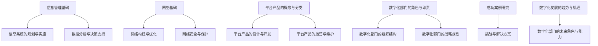

                 

### 引言与背景

> 在当今数字化时代，信息、网络、平台产品和数字化部门规划已成为企业成功的关键要素。本文旨在系统地阐述这些关键领域的基本概念、核心原理、实际应用，以及未来发展趋势，为读者提供全面的指导。

信息、网络、平台产品和数字化部门规划是现代企业数字化转型的基础。信息管理作为企业内部数据资源的核心，直接影响到业务流程的效率和决策的准确性。网络技术则为信息传输提供了基础架构，确保企业内部及外部的通信稳定和安全。平台产品则为企业提供了灵活的解决方案，使其能够快速响应市场变化。数字化部门作为企业的战略执行者，负责推动企业实现数字化转型。

#### 概述与目标

本文的目标是：
1. 系统性地介绍信息管理、网络技术、平台产品和数字化部门规划的基本概念和核心原理。
2. 分析这些领域在实际应用中的关键技术和策略。
3. 探讨数字化转型的未来趋势和挑战，为企业的可持续发展提供指导。

本文适合以下读者群体：
1. 企业高层管理人员，希望了解数字化转型的战略意义和实施路径。
2. IT专业人员和工程师，希望掌握信息管理、网络技术、平台产品开发的实用技能。
3. 数字化转型项目的管理人员和实施人员，希望深入理解项目的规划和执行。

#### 数字化转型的背景与重要性

数字化转型是指企业利用数字技术来改变其业务模式、流程和组织结构的过程。其背景主要源于以下几个方面：

1. **技术进步**：信息技术的快速发展，特别是云计算、大数据、人工智能等新兴技术的应用，为企业提供了更多的数字化手段和工具。
2. **市场变化**：消费者行为和需求的变化，要求企业能够快速响应市场动态，提供个性化、智能化的服务。
3. **竞争压力**：竞争对手的数字化转型实践，迫使企业不得不加快自身的数字化进程，以保持竞争力。

数字化转型的重要性体现在以下几个方面：

1. **提升业务效率**：通过自动化、智能化手段，减少人工操作，提高工作效率和准确性。
2. **降低运营成本**：通过优化业务流程和资源利用，降低运营成本，提高盈利能力。
3. **改善客户体验**：通过数字化手段，提供更加个性化和便捷的服务，提升客户满意度和忠诚度。
4. **增强创新能力**：数字化技术为企业提供了更多的创新机会，帮助企业持续创新，保持竞争优势。

然而，数字化转型也面临着诸多挑战，如技术选型、数据安全、人才短缺等。因此，企业需要系统地规划和实施数字化转型，以确保其成功落地。接下来，我们将逐一深入探讨信息管理、网络技术、平台产品和数字化部门规划的核心概念、原理和实践，为读者提供全面的指导。

### 信息管理

信息管理是企业内部对数据资源进行有效利用和控制的一系列活动和过程。它不仅涉及到数据的收集、存储、处理和分发，还包括数据的安全、质量和合规性。在数字化转型的大背景下，信息管理的重要性愈发凸显，它是企业数据驱动决策和业务流程优化的基础。

#### 信息管理基础

信息管理的基础包括以下几个核心概念：

1. **信息**：信息是指以某种形式存储和处理的知识，它可以是有形的，如文档和图像，也可以是无形的，如数据和算法。信息是信息管理的对象和核心资源。

2. **数据**：数据是信息的具体表现形式，它通常以数字、文本、图像等形式存在。数据管理是信息管理的重要组成部分，包括数据的收集、存储、处理、分析和共享。

3. **信息资源**：信息资源是指企业内部可用于支持业务决策和运营的数据和相关信息。有效的信息资源管理可以提升企业的竞争力。

4. **信息系统**：信息系统是指用于支持企业业务运作的计算机硬件、软件和网络资源。它包括数据库管理系统、办公自动化系统、客户关系管理系统等。

#### 信息生命周期管理

信息生命周期管理（Information Lifecycle Management, ILM）是指对信息从创建到最终删除的全过程进行管理。信息生命周期一般可以分为以下几个阶段：

1. **创建**：数据生成和收集的过程。这一阶段需要确保数据的质量和准确性。

2. **存储**：数据存储在合适的存储介质上，如磁盘、云存储等。存储策略应考虑数据的访问频率、重要性和生命周期。

3. **处理**：对存储的数据进行加工、分析和处理，以提取有价值的信息。处理过程中需要使用数据挖掘、机器学习等技术。

4. **使用**：将处理后的数据用于业务决策、运营管理和客户服务。

5. **归档**：将长期保留但不再频繁使用的数据转移到低成本的存储介质上。归档有助于节省存储资源，同时保证数据可追溯性和安全性。

6. **删除**：删除不再需要的数据，以减少存储成本和潜在的安全风险。删除过程需要遵循数据保护法规和合规要求。

#### 信息系统的规划与实施

信息系统的规划与实施是信息管理的重要环节。以下是信息系统规划与实施的主要步骤：

1. **需求分析**：通过访谈、问卷调查、文档分析等方法，了解企业的业务需求和用户需求。

2. **系统设计**：根据需求分析结果，设计信息系统的架构和功能模块。系统设计包括前端界面设计、后端逻辑设计、数据库设计等。

3. **技术选型**：选择合适的技术栈和开发工具，如编程语言、数据库、中间件等。

4. **开发**：按照系统设计文档进行开发，实现信息系统的各项功能。

5. **测试**：对信息系统进行功能测试、性能测试和安全测试，确保系统的稳定性和可靠性。

6. **部署**：将开发完成的信息系统部署到生产环境，进行实际应用。

7. **运维**：对信息系统进行日常维护和管理，确保其正常运行。

8. **培训与支持**：为用户提供培训，确保他们能够熟练使用信息系统。同时，提供技术支持，解决用户在使用过程中遇到的问题。

#### 数据分析与决策支持

数据分析与决策支持是信息管理的核心应用之一。数据分析的基本方法包括：

1. **描述性分析**：通过统计分析方法，描述数据的基本特征和分布情况，帮助用户了解数据的概况。

2. **诊断性分析**：分析数据之间的关系，找出数据异常和问题的原因，帮助用户诊断问题。

3. **预测性分析**：使用历史数据建立预测模型，预测未来的趋势和变化，帮助用户做出预测和决策。

4. **描述性分析**：通过可视化工具，将数据分析结果以图表、报表等形式展示，便于用户理解和分析。

决策支持系统（Decision Support System, DSS）是用于辅助决策者做出有效决策的信息系统。DSS的设计与实现包括以下步骤：

1. **需求分析**：了解决策者的需求，明确决策目标。

2. **数据集成**：将来自不同数据源的数据集成到DSS中，确保数据的完整性和一致性。

3. **模型构建**：建立用于决策的数学模型，如线性规划、决策树、神经网络等。

4. **界面设计**：设计用户友好的界面，方便用户输入数据和查看分析结果。

5. **实现与部署**：实现DSS的功能，并在生产环境中部署。

6. **评估与优化**：定期评估DSS的性能和效果，根据反馈进行优化。

通过有效的数据分析与决策支持，企业可以提高决策的准确性和效率，从而在激烈的市场竞争中取得优势。

在接下来的章节中，我们将深入探讨网络技术的基础知识和实践应用，为读者提供全面的网络建设与优化策略。

### 网络技术

网络技术是数字化时代企业信息管理和业务运作的基础设施，它涵盖了网络拓扑结构、协议与体系结构，以及网络构建与优化策略。一个稳定、高效的网络对于企业保持竞争力、确保数据传输的安全性和可靠性至关重要。

#### 网络基础

1. **网络拓扑结构**：
   网络拓扑结构是指网络中各设备之间的连接方式，常见的网络拓扑结构包括：
   - **星型拓扑**：所有设备连接到一个中心节点（如交换机），中心节点负责数据的转发。这种结构简单，便于管理，但中心节点故障可能导致整个网络瘫痪。
   - **环型拓扑**：设备按环形方式连接，数据沿环方向传输。这种结构简单，没有单点故障风险，但节点故障可能导致整个网络中断。
   - **总线型拓扑**：所有设备连接到同一总线，数据沿总线传输。这种结构成本低，但总线故障可能导致整个网络瘫痪。
   - **网状拓扑**：设备之间相互连接，形成多个并行路径。这种结构可靠性高，但布线复杂，成本较高。

2. **网络协议与体系结构**：
   网络协议是网络设备之间进行通信的规则和标准。网络协议分为几个层次，最著名的是OSI七层模型：
   - **物理层**：定义物理连接，如电缆、光纤、无线信号等。
   - **数据链路层**：负责数据帧的传输和错误检测。
   - **网络层**：负责IP地址的分配和网络路径的选择。
   - **传输层**：负责端到端的通信，如TCP和UDP协议。
   - **会话层**：管理会话的建立、维护和终止。
   - **表示层**：处理数据的格式转换和加密。
   - **应用层**：提供网络应用服务，如HTTP、FTP、SMTP等。

   实际应用中，最常用的是TCP/IP四层模型，它将OSI模型中的网络层和传输层合并，简化了网络协议的设计。

#### 网络构建与优化

1. **网络构建**：
   - **设备选型**：选择合适的网络设备，如交换机、路由器、防火墙等。
   - **网络设计**：设计网络拓扑结构和IP地址分配方案，确保网络的高效性和可靠性。
   - **网络搭建**：进行物理连接，配置网络设备，确保网络正常运行。

2. **网络优化策略**：
   - **带宽管理**：合理分配网络带宽，确保关键业务得到优先处理。
   - **路由优化**：优化路由路径，减少数据传输延迟。
   - **安全策略**：配置防火墙、入侵检测系统（IDS）等，保护网络免受攻击。
   - **冗余设计**：通过冗余链路和设备，提高网络的可靠性。
   - **负载均衡**：通过负载均衡技术，均衡网络负载，避免单点过载。

#### 网络性能优化

网络性能优化是确保网络高效稳定运行的关键。以下是一些优化策略：

1. **带宽优化**：
   - **带宽监控**：实时监控网络带宽使用情况，识别带宽瓶颈。
   - **带宽扩容**：根据需求，及时升级网络带宽，确保关键业务的顺畅运行。

2. **延迟优化**：
   - **优化路由**：通过优化路由算法，减少数据传输路径的延迟。
   - **CDN部署**：使用内容分发网络（CDN），将内容分发到距离用户更近的节点，减少传输延迟。

3. **丢包优化**：
   - **丢包监控**：实时监控网络丢包率，定位丢包原因。
   - **TCP重传机制优化**：调整TCP的重传机制，提高传输效率。

4. **流量管理**：
   - **流量分类**：根据流量类型，进行流量分类和优先级设置。
   - **流量控制**：通过流量控制策略，确保关键流量得到优先处理。

通过有效的网络构建与优化策略，企业可以确保网络的稳定性和高效性，为业务的顺利运行提供坚实保障。在接下来的章节中，我们将探讨平台产品的概念与分类，以及平台产品的设计与开发。

### 平台产品的概念与分类

平台产品在数字化时代扮演着至关重要的角色，它为企业提供了灵活、可扩展的解决方案，以应对快速变化的市场需求。平台产品不仅是一种技术产品，更是一种业务模式，它通过连接不同服务与应用，实现资源的共享和协同。

#### 平台产品的定义

平台产品是指为特定行业或领域提供服务的通用软件平台，它具有以下几个核心特征：

1. **通用性**：平台产品不是为单一企业或单一业务需求设计的，而是为某一行业或领域提供通用解决方案。
2. **可扩展性**：平台产品具有高度的可扩展性，能够根据用户需求灵活地添加新功能、新模块。
3. **互操作性**：平台产品支持多种应用和服务之间的互操作，实现不同系统之间的数据共享和流程协同。
4. **可定制性**：平台产品允许用户根据自己的业务需求进行定制，以适应不同的业务场景。

#### 平台产品的分类

平台产品可以根据不同的分类标准进行分类，常见的分类方法包括：

1. **按照行业领域分类**：
   - **金融平台**：如银行、保险、证券交易平台。
   - **电商平台**：如淘宝、京东、亚马逊等。
   - **物流平台**：如快递物流管理系统。
   - **医疗平台**：如医院信息系统、电子病历系统。
   - **教育平台**：如在线教育平台、学习管理系统。
   - **工业平台**：如智能制造平台、工业物联网平台。

2. **按照功能特性分类**：
   - **基础设施平台**：如云平台、数据中心平台。
   - **应用平台**：如企业资源规划（ERP）平台、客户关系管理（CRM）平台。
   - **数据平台**：如大数据平台、数据仓库平台。
   - **智能平台**：如人工智能平台、机器学习平台。

3. **按照业务模式分类**：
   - **B2B平台**：企业对企业，如阿里巴巴的1688。
   - **B2C平台**：企业对消费者，如淘宝、京东。
   - **C2C平台**：消费者对消费者，如eBay、闲鱼。

4. **按照架构类型分类**：
   - **集中式平台**：所有功能集中在一个系统内，如传统的ERP系统。
   - **分布式平台**：功能分布在多个节点，如云计算平台、区块链平台。

#### 平台产品的特点与优势

平台产品具有以下几大特点与优势：

1. **灵活性**：平台产品可以灵活地扩展和定制，满足不同业务场景的需求。
2. **高效性**：通过平台产品，企业可以实现业务流程的自动化和智能化，提高运营效率。
3. **协同性**：平台产品支持不同部门、不同系统之间的数据共享和流程协同，提高企业协同作战能力。
4. **可扩展性**：平台产品具有高度的可扩展性，能够支持企业的长期发展，随着业务增长，平台产品可以轻松扩展。
5. **互操作性**：平台产品支持不同系统之间的互操作，实现数据的无缝流动，提高业务连续性和稳定性。
6. **成本效益**：通过使用平台产品，企业可以减少重复投资，提高资源利用率，降低运营成本。

#### 平台产品的核心功能

平台产品的核心功能通常包括以下几个方面：

1. **数据管理**：提供数据收集、存储、处理和分析的功能，支持大数据处理和实时数据查询。
2. **业务流程管理**：支持业务流程的建模、执行和监控，提高业务流程的规范性和效率。
3. **应用集成**：支持不同应用系统和业务系统的集成，实现数据的无缝流动和业务协同。
4. **用户界面**：提供直观、易用的用户界面，支持多终端访问，提高用户体验。
5. **安全控制**：提供数据安全和用户身份验证功能，确保系统的安全性和数据的隐私保护。
6. **监控与报告**：提供实时监控和报告功能，支持企业对系统性能和业务状况的监控和分析。

通过平台产品，企业可以实现业务的数字化转型，提高竞争力，实现可持续的发展。在下一章节中，我们将探讨平台产品的设计与开发，包括平台产品架构设计、开发流程与工具，以及平台产品的运营与维护。

### 平台产品的设计与开发

平台产品的设计与开发是确保其功能完备、性能稳定、易于维护和扩展的关键环节。本文将详细介绍平台产品的设计与开发过程，包括平台产品架构设计、开发流程与工具，以及平台产品的运营与维护。

#### 平台产品架构设计

平台产品架构设计是平台产品开发的基础，它决定了平台产品的性能、可扩展性和可维护性。一个良好的架构设计应具备以下几个特点：

1. **模块化**：平台产品应采用模块化设计，将功能划分为多个独立的模块，每个模块负责一个特定的功能，模块之间通过接口进行通信。模块化设计可以提高系统的可维护性和可扩展性。

2. **松耦合**：模块之间应保持松耦合关系，即模块之间的依赖性尽可能低。这样可以降低模块之间的耦合度，提高系统的灵活性和可维护性。

3. **高内聚**：每个模块应具有较高的内聚性，即模块内部的功能紧密相关，而与其他模块的功能关系较少。这样可以提高模块的独立性，降低模块之间的耦合度。

4. **可扩展性**：平台产品架构应具备良好的扩展性，能够方便地添加新功能或模块，以适应业务需求的变化。

5. **高性能**：平台产品架构应考虑性能优化，确保在高并发情况下仍能保持良好的响应速度。

常见的平台产品架构设计模式包括：

- **单体架构**：所有功能模块都部署在一个单一的应用程序中，优点是开发简单，缺点是扩展性差，维护困难。
- **微服务架构**：将平台产品拆分为多个独立的服务，每个服务负责一个特定的功能，服务之间通过API进行通信。优点是高扩展性、高可维护性，缺点是架构复杂，需要更多的运维工作。
- **服务总线架构**：通过服务总线连接各个服务，实现服务的解耦合和消息传递。优点是服务独立性强，易于扩展，缺点是架构复杂，性能开销较大。

#### 开发流程与工具

平台产品的开发流程通常包括以下几个阶段：

1. **需求分析**：与用户沟通，明确平台产品的功能需求和性能要求，制定详细的需求文档。
2. **系统设计**：根据需求分析结果，设计平台产品的系统架构和功能模块，制定系统设计文档。
3. **编码实现**：按照系统设计文档进行编码实现，实现各个功能模块，并进行单元测试。
4. **集成测试**：将各个功能模块集成到一起，进行系统测试，确保系统的整体性能和稳定性。
5. **部署上线**：将开发完成的平台产品部署到生产环境，进行实际应用，并进行监控和维护。
6. **运维与支持**：对平台产品进行日常维护和管理，确保其正常运行，并提供技术支持。

在开发过程中，常用的工具包括：

- **集成开发环境（IDE）**：如Visual Studio、Eclipse等，用于代码编写和调试。
- **版本控制系统**：如Git、SVN等，用于代码管理和协作开发。
- **自动化测试工具**：如JUnit、Selenium等，用于自动化测试和持续集成。
- **持续集成工具**：如Jenkins、GitLab CI等，用于自动化构建、测试和部署。
- **项目管理工具**：如Jira、Trello等，用于任务管理和协作。
- **数据库管理工具**：如MySQL Workbench、SQL Server Management Studio等，用于数据库设计和数据管理。

#### 平台产品的运营与维护

平台产品的运营与维护是确保其长期稳定运行的关键，包括以下几个方面：

1. **监控系统**：部署监控系统，实时监控平台产品的性能和健康状况，及时发现和解决潜在问题。
2. **日志管理**：记录平台产品的运行日志，便于问题追踪和性能分析。
3. **性能优化**：定期对平台产品进行性能优化，提高系统的响应速度和并发处理能力。
4. **安全防护**：配置防火墙、入侵检测系统等安全措施，确保平台产品的安全性。
5. **数据备份与恢复**：定期备份数据，确保在数据丢失或系统故障时能够迅速恢复。
6. **用户支持**：提供技术支持，解决用户在使用平台产品过程中遇到的问题。

通过有效的平台产品设计、开发、运营与维护，企业可以确保其数字化转型的顺利实施，提高业务效率，降低运营成本，提升客户满意度。

在下一章节中，我们将探讨数字化部门的角色与职责，以及数字化部门的组织结构和战略规划，为企业的数字化转型提供系统性的指导和实施路径。

### 数字化部门的角色与职责

数字化部门在企业中扮演着至关重要的角色，它是推动企业数字化转型、实现数字化战略的核心力量。数字化部门不仅负责信息管理、网络技术、平台产品的建设与维护，还承担着业务流程优化、数据分析和决策支持等关键任务。以下是数字化部门的主要角色与职责。

#### 数字化部门在企业中的地位

1. **战略决策层**：数字化部门直接参与企业的战略决策，与业务部门共同制定和实施数字化战略，确保企业数字化转型目标的实现。

2. **执行层**：数字化部门负责具体的数字化项目实施，包括系统规划、设计、开发、部署和运维等，确保项目按时完成并达到预期效果。

3. **协调层**：数字化部门作为内部沟通的桥梁，协调各个业务部门之间的数字化需求和技术资源，确保企业内部数字化工作的顺利进行。

4. **创新层**：数字化部门致力于跟踪最新的数字化技术和市场动态，推动企业的技术创新和业务模式变革，保持企业的竞争力。

#### 数字化部门的主要职责

1. **战略规划**：制定企业数字化战略，包括数字化愿景、目标和实施路径，确保企业数字化转型的方向正确和目标明确。

2. **信息系统建设**：负责企业信息系统的规划、设计、开发和运维，确保信息系统的高效、稳定和安全运行。

3. **网络技术管理**：负责企业网络架构的设计、优化和维护，确保网络的高性能、高可靠性和安全性。

4. **平台产品开发**：开发和运营企业内部的平台产品，包括企业资源规划（ERP）、客户关系管理（CRM）、供应链管理（SCM）等，提升企业的运营效率和管理水平。

5. **数据分析与决策支持**：利用大数据、人工智能等技术，对业务数据进行挖掘和分析，为企业的决策提供数据支持和智能建议。

6. **技术创新与研发**：跟踪前沿技术，推动技术创新和研发，为企业的持续发展提供技术保障。

7. **人才引进与培养**：引进和培养数字化人才，提升企业的数字化能力和竞争力。

8. **合作伙伴管理**：与外部合作伙伴建立合作关系，共同推动企业的数字化转型。

#### 数字化部门的组织结构

数字化部门的组织结构应根据企业的规模、业务特点和战略目标进行设计，常见的组织结构包括：

1. **中心化结构**：数字化部门作为企业的一个独立部门，统一负责企业内部的数字化工作，其他业务部门与数字化部门协作。

2. **分散化结构**：数字化部门与各业务部门紧密结合，数字化团队嵌入各业务部门，共同推进数字化转型。

3. **矩阵式结构**：数字化部门与其他业务部门形成矩阵式组织结构，数字化团队成员同时负责数字化任务和业务部门任务，实现跨部门协作。

4. **虚拟化结构**：数字化部门由多个分布式团队组成，通过协同工具和平台实现远程协作，适用于大型跨国企业。

#### 数字化部门的战略规划

数字化部门的战略规划是企业实现数字化转型的基础，主要包括以下几个方面：

1. **明确目标**：设定明确的数字化目标，包括短期和长期目标，如提升业务效率、降低运营成本、提高客户满意度等。

2. **制定路径**：制定实现数字化目标的路径和策略，包括技术选型、项目计划、资源配置等。

3. **资源分配**：合理分配企业资源，包括人力、资金、技术等，确保数字化项目能够顺利实施。

4. **风险管理**：识别数字化过程中的风险，制定风险管理计划，确保数字化项目的顺利进行。

5. **监控与评估**：建立数字化项目的监控和评估机制，定期评估项目进展和效果，及时调整策略和计划。

通过系统化的数字化部门规划，企业可以确保数字化转型目标的实现，提升企业的竞争力，实现可持续发展。

在下一章节中，我们将通过案例研究，探讨企业数字化转型的成功实践，分析其中的关键决策和实施细节，为企业的数字化转型提供实际参考。

### 案例研究

在本章节中，我们将通过分析几个企业数字化转型的成功案例，深入探讨其中的关键决策和实施细节。这些案例不仅展示了数字化转型的实际效果，还为其他企业提供了宝贵的经验。

#### 案例一：阿里巴巴的数字化转型

阿里巴巴作为中国最大的电子商务公司，其数字化转型历程堪称经典。以下是阿里巴巴数字化转型的一些关键决策和实施细节：

1. **业务模式创新**：阿里巴巴通过创建淘宝、天猫等电商平台，打破了传统零售的时空限制，为消费者和商家提供了全新的购物体验。这一决策不仅改变了消费者的购物习惯，还深刻影响了整个零售行业。

2. **技术基础设施升级**：阿里巴巴投资巨资建设数据中心和云计算基础设施，为电商平台提供了强大的计算能力和存储能力。这一决策确保了平台的高性能和可靠性，支持了业务的快速增长。

3. **数据驱动决策**：阿里巴巴利用海量用户数据，通过大数据分析和机器学习技术，实现了精准营销和个性化推荐。这一决策大大提升了用户的购物体验，增加了用户粘性和转化率。

4. **生态体系建设**：阿里巴巴不仅构建了电商平台，还通过支付宝、菜鸟物流等生态体系，为商家和消费者提供了全方位的服务。这一决策实现了生态系统的闭环，提升了整体竞争力。

#### 案例二：麦当劳的数字化餐厅

麦当劳作为全球知名的快餐连锁企业，通过数字化餐厅的实践，成功提升了服务效率和顾客体验。以下是麦当劳数字化转型的一些关键决策和实施细节：

1. **自助点餐系统**：麦当劳在全球范围内推出了自助点餐系统，顾客可以通过自助机或者手机App下单。这一决策减少了顾客等待时间，提升了服务效率。

2. **智能厨房设备**：麦当劳采用了智能厨房设备，如智能烤炉和智能咖啡机，这些设备能够自动调整烹饪时间和温度，确保食物质量和口感。这一决策提高了生产效率，减少了人为错误。

3. **数据分析与优化**：麦当劳利用数据分析技术，对顾客行为进行深入分析，优化餐厅布局和服务流程。例如，通过分析顾客流量数据，调整高峰期的人流分布，减少拥堵现象。

4. **数字化营销**：麦当劳通过社交媒体和移动应用，开展精准营销活动，与顾客建立更紧密的联系。这一决策增加了顾客互动，提升了品牌知名度。

#### 案例三：华为的数字化供应链

华为作为全球领先的通信技术解决方案提供商，通过数字化供应链的实施，成功提升了供应链的效率和灵活性。以下是华为数字化转型的一些关键决策和实施细节：

1. **云计算和大数据平台**：华为建立了企业级云计算和大数据平台，用于供应链数据的存储和处理。这一决策实现了供应链数据的集中化和可视化，提升了决策效率。

2. **智能仓储和物流**：华为采用了智能仓储和物流系统，如自动化仓库和智能配送机器人，提升了仓储和物流的效率。这一决策减少了库存成本和物流时间，提高了供应链的响应速度。

3. **供应链金融**：华为通过供应链金融服务，为供应商提供资金支持，降低其融资成本。这一决策增强了供应商的合作意愿，提高了供应链的整体效率。

4. **全球协作平台**：华为建立了全球协作平台，支持全球不同地区和团队的协作和沟通。这一决策提升了全球化运营效率，确保了全球业务的一致性。

#### 案例四：美团的外卖业务

美团作为中国最大的外卖和本地生活服务平台，其外卖业务的数字化转型取得了显著成效。以下是美团数字化转型的一些关键决策和实施细节：

1. **智能调度系统**：美团开发了智能调度系统，通过算法优化配送路线和配送时间，提升了配送效率。这一决策减少了配送时间，提高了顾客满意度。

2. **实时数据监控**：美团通过实时数据监控系统，监控外卖订单的实时状态，及时发现和解决问题。这一决策提升了服务质量和运营效率。

3. **用户反馈机制**：美团建立了用户反馈机制，收集用户意见和建议，用于改进服务和产品。这一决策增强了用户粘性，提升了品牌形象。

4. **数字化营销**：美团通过大数据分析和机器学习技术，开展精准营销活动，提升用户转化率。这一决策增加了平台流量和收入。

通过这些成功案例，我们可以看到，数字化转型不仅需要创新思维和先进技术，还需要全面的战略规划和执行力。在接下来的章节中，我们将探讨数字化转型中的常见挑战，以及相应的解决方案和实践经验。

### 数字化转型中的挑战与解决方案

尽管数字化转型带来了巨大的机遇，但企业在这个过程中也面临着诸多挑战。以下是数字化转型中的一些常见挑战以及相应的解决方案和实践经验。

#### 技术选型与整合

**挑战**：企业在选择合适的数字化技术时，往往面临技术多样性和复杂性的挑战。此外，现有系统的整合和新技术的融合也是一个难点。

**解决方案**：
1. **技术评估与选型**：企业应进行充分的技术评估，选择成熟且符合业务需求的技术。评估应考虑技术的稳定性、安全性、成本效益等因素。
2. **系统整合**：采用微服务架构或服务总线架构，实现现有系统和新技术之间的松耦合和高效整合。

#### 数据安全和隐私保护

**挑战**：数字化转型过程中，数据的安全性和隐私保护成为企业关注的重点。随着数据量的增加，数据泄露和隐私侵犯的风险也随之上升。

**解决方案**：
1. **数据加密**：采用加密算法对数据进行加密处理，确保数据在传输和存储过程中的安全性。
2. **访问控制**：实施严格的访问控制策略，确保只有授权用户才能访问敏感数据。
3. **合规性**：遵循相关的数据保护法规，如GDPR（通用数据保护条例）和CCPA（加州消费者隐私法），确保企业的数据保护措施符合法律要求。

#### 人才短缺

**挑战**：数字化转型需要大量的数字化人才，包括数据科学家、人工智能专家、网络安全专家等。然而，市场对这类人才的需求远大于供给，导致企业面临人才短缺的挑战。

**解决方案**：
1. **内部培训与提升**：通过内部培训和职业发展计划，提升现有员工的数字化技能。
2. **外部招聘**：与高等教育机构和职业培训机构合作，培养和引进数字化人才。
3. **灵活用工**：采用灵活用工模式，如兼职、外包等，缓解人才短缺问题。

#### 组织文化变革

**挑战**：数字化转型需要企业内部的文化变革，包括对新技术、新流程和新工作方式的接受。然而，组织文化变革往往面临阻力和抵触。

**解决方案**：
1. **领导带头**：企业领导应积极倡导数字化转型，通过自身的行动和决策，树立榜样。
2. **文化建设**：建立以创新和数字化转型为核心的企业文化，通过内部沟通、培训和激励机制，推动员工接受和适应变革。
3. **试点项目**：在特定业务领域或部门进行数字化转型试点，积累成功经验，逐步推广。

#### 项目管理和执行

**挑战**：数字化转型项目通常复杂且涉及多个部门，项目管理和执行面临诸多挑战，如项目延期、预算超支、资源不足等。

**解决方案**：
1. **明确目标**：在项目启动前，明确项目的目标、范围和预期成果，制定详细的项目计划。
2. **资源规划**：合理规划项目资源，包括人力、资金和技术等，确保项目资源的充足和高效利用。
3. **风险管理**：建立风险管理机制，识别和评估项目风险，制定风险应对策略。
4. **持续监控**：通过项目进度监控和绩效评估，确保项目按照计划进行，及时调整项目计划和策略。

#### 技术与业务融合

**挑战**：数字化转型不仅是技术问题，更是业务问题。如何将技术与业务深度结合，实现业务流程的优化和效率提升，是企业面临的挑战。

**解决方案**：
1. **业务驱动**：以业务需求为导向，将技术应用于业务场景，提升业务效率。
2. **业务与技术团队协作**：加强业务团队与技术团队的协作，确保技术方案能够满足业务需求，同时符合技术可行性。
3. **用户反馈**：及时收集用户反馈，持续优化技术方案和业务流程，确保技术与业务的紧密结合。

通过上述解决方案和实践经验，企业可以有效地应对数字化转型中的挑战，实现数字化转型的成功。在下一章节中，我们将展望数字化发展的趋势与机遇，探讨数字化技术对未来企业和行业的影响。

### 数字化发展的趋势与机遇

随着信息技术的飞速发展，数字化已成为推动全球经济和社会变革的重要力量。以下将探讨数字化发展的主要趋势与机遇，以及这些趋势如何影响企业和行业。

#### 数字化技术发展的最新动态

1. **人工智能（AI）**：人工智能技术在图像识别、自然语言处理、自动驾驶等领域取得了重大突破。AI的应用不仅提升了企业的生产效率和决策能力，还推动了新商业模式的出现。

2. **物联网（IoT）**：物联网技术的发展使得万物互联成为可能，从智能家居到智能城市，物联网正在改变我们的生活方式和工作方式。物联网的数据收集和分析能力为企业和行业提供了丰富的信息资源。

3. **云计算**：云计算技术的普及使得企业能够以低成本、高效率的方式获取计算资源。云计算的弹性、可扩展性和灵活性，使得企业能够快速响应市场需求，实现业务的数字化转型。

4. **区块链**：区块链技术的去中心化、不可篡改和透明性特点，为金融、物流、供应链等领域提供了新的解决方案。区块链技术有助于提高数据的安全性和可信度，减少交易成本。

5. **大数据**：大数据技术的发展，使得企业能够从海量数据中提取有价值的信息，实现数据驱动的决策。大数据分析正在成为企业提升竞争力的重要工具。

#### 数字化对企业和行业的未来影响

1. **运营效率提升**：数字化技术帮助企业实现业务流程的自动化和智能化，提高运营效率，降低成本。例如，通过人工智能和物联网技术，企业可以实现生产线的智能化改造，提高生产效率。

2. **商业模式创新**：数字化技术为企业提供了创新的商业机会，如共享经济、电子商务等。企业可以利用数字化平台，拓展新的市场，创造新的收入来源。

3. **用户体验优化**：数字化技术使得企业能够提供更加个性化和便捷的服务，提升用户体验。例如，通过大数据分析和机器学习技术，企业可以提供个性化的推荐，提高用户满意度和忠诚度。

4. **产业链重塑**：数字化技术正在重塑产业链，推动产业链的数字化转型。例如，通过物联网技术，企业可以实现供应链的智能化和透明化，提高供应链的效率。

5. **产业协同**：数字化技术促进了企业之间的协同合作，形成了新的产业生态。例如，通过云计算和大数据技术，企业可以共享资源、数据和服务，实现产业链的协同发展。

6. **全球化扩展**：数字化技术为企业提供了全球化的机遇，企业可以通过数字化平台，迅速进入新的市场，实现全球业务扩展。

#### 数字化对行业的影响

1. **金融行业**：数字化技术在金融行业中的应用，如移动支付、区块链和大数据，正在改变传统金融服务的模式，提高金融服务的效率和安全性。

2. **零售行业**：电子商务和智能零售技术的发展，使得零售行业发生了深刻变革。零售企业通过数字化技术，实现线上线下的整合，提供更加个性化的购物体验。

3. **制造业**：智能制造技术的发展，使得制造业实现了生产线的智能化改造。企业通过物联网和大数据技术，实现生产过程的实时监控和优化。

4. **医疗健康**：数字化技术在医疗健康领域的应用，如电子病历、远程医疗和健康监测，提升了医疗服务的效率和便捷性。

5. **交通运输**：数字化技术在交通运输领域的应用，如自动驾驶、智能交通系统，提高了交通运输的安全性和效率。

通过数字化技术，企业可以不断优化业务流程，提升用户体验，实现商业模式的创新，从而在激烈的市场竞争中脱颖而出。在未来，随着数字化技术的进一步发展，企业将面临更多的机遇和挑战，数字化部门的作用将愈发重要。在下一章节中，我们将探讨数字化部门的未来角色与能力建设，为企业的可持续发展提供新的视角。

### 数字化部门的未来角色与能力建设

随着数字化技术的不断演进，数字化部门在企业中的角色也在发生深刻的变化。数字化部门不仅需要继续扮演信息管理、网络技术、平台产品开发和维护等传统角色，还需要在技术创新、业务赋能和组织变革等方面发挥更加重要的作用。以下是数字化部门未来角色的几个关键方向以及所需的能力建设。

#### 数字化部门未来的新角色

1. **首席数据官（CDO）**：数字化部门将成为企业数据管理的核心，负责制定数据战略，推动数据治理，确保数据的质量和安全性。CDO将直接参与企业的战略决策，利用数据驱动业务创新。

2. **首席信息安全官（CISO）**：随着数据安全问题的日益严峻，数字化部门需要承担更多的安全责任。CISO将负责企业的信息安全规划、实施和监控，确保业务系统的安全运行。

3. **首席创新官（CIO）**：数字化部门将成为企业创新的核心推动力，CIO需要不断探索新技术，推动企业实现技术突破和业务模式创新。

4. **数字化战略执行者**：数字化部门将负责制定和实施企业的数字化战略，确保战略的落地和执行。数字化部门需要与其他业务部门紧密合作，推动全企业的数字化转型。

5. **跨部门协作桥梁**：数字化部门将成为企业内部跨部门协作的桥梁，协调不同部门之间的数字化需求和资源，推动企业内部的信息共享和协同工作。

#### 数字化部门所需的新能力建设

1. **技术能力**：
   - **人工智能和机器学习**：数字化部门需要掌握人工智能和机器学习技术，能够利用这些技术进行数据分析和业务预测。
   - **区块链技术**：了解区块链的基本原理，掌握其在供应链金融、数据安全等领域的应用。
   - **物联网技术**：熟悉物联网设备的集成和管理，了解其在智能制造、智慧城市等领域的应用。

2. **数据分析能力**：数字化部门需要具备强大的数据分析能力，能够从海量数据中提取有价值的信息，为企业决策提供数据支持。

3. **项目管理能力**：数字化部门需要具备高效的项目管理能力，能够制定项目计划、管理项目资源和风险，确保项目按时按质完成。

4. **安全防护能力**：数字化部门需要掌握信息安全的基本原理，能够设计和实施有效的安全策略，保护企业的数据安全。

5. **业务洞察力**：数字化部门需要具备深厚的业务理解能力，能够从业务角度出发，设计出符合业务需求的技术解决方案。

6. **领导力和沟通能力**：数字化部门需要具备优秀的领导力和沟通能力，能够带领团队完成复杂的项目，同时与业务部门保持良好的沟通和协作。

7. **持续学习能力**：数字化技术发展迅速，数字化部门需要保持持续学习的态度，不断更新知识和技能，以适应快速变化的技术环境。

#### 能力建设的具体实践

1. **内部培训和认证**：企业可以为数字化部门员工提供专业的培训课程和认证机会，提升他们的技术能力和业务洞察力。

2. **技术交流和合作**：鼓励数字化部门员工参加行业会议、研讨会和培训，与其他专家和同行进行交流，了解最新的技术和行业动态。

3. **建立内部实验室**：企业可以建立内部实验室，模拟真实业务场景，进行新技术的试验和验证，积累实践经验和成功案例。

4. **跨部门合作项目**：通过跨部门合作项目，数字化部门可以深入了解业务需求，提升业务理解能力，同时锻炼项目管理和协作能力。

5. **外部合作与咨询**：企业可以与外部专家和咨询公司合作，获取专业的技术指导和管理经验，推动数字化部门能力的提升。

通过以上措施，数字化部门可以不断提升自身的能力，更好地扮演其在企业中的新角色，推动企业的数字化转型和可持续发展。在未来的数字化时代，数字化部门将成为企业核心竞争力的重要组成部分。

在文章的最后一部分，我们将通过附录，提供相关的参考资料、术语解释、作者介绍以及技术实践的具体案例，为读者提供全面的资源和支持。

### 附录

#### 附录 A：信息、网络、平台产品和数字化部门规划 Mermaid 流程图



#### 附录 B：信息、网络、平台产品和数字化部门规划核心算法原理讲解

##### 信息系统的设计原则

- **需求驱动**：
  ```python
  def system_design(user_demand):
      design = {}
      design['requirements'] = user_demand
      return design
  ```

- **模块化**：
  ```python
  def module_design(functions):
      modules = {}
      for function in functions:
          modules[function] = Module(function)
      return modules
  ```

- **可扩展性**：
  ```python
  def expand_system(current_system, new_requirement):
      current_system['requirements'].append(new_requirement)
      return current_system
  ```

- **可靠性**：
  ```python
  def ensure_reliability(system):
      system['fault_tolerance'] = True
      return system
  ```

- **用户体验**：
  ```python
  def improve_user_experience(system):
      system['ui'] = 'user-friendly'
      return system
  ```

##### 网络安全与保护

- **加密算法**：
  ```python
  from Crypto.Cipher import AES
  from Crypto.Util.Padding import pad, unpad

  def encrypt_data(data, key):
      encrypted_data = AES_encrypt(data, key)
      return encrypted_data
  ```

- **防火墙**：
  ```python
  def block_unauthorized_access(ip_address):
      if ip_address in black_list:
          return "Access denied"
      else:
          return "Access granted"
  ```

- **入侵检测系统**：
  ```python
  def detect_intrusion(traffic_log):
      for log in traffic_log:
          if log['activity'] == 'suspicious':
              alert("Intrusion detected")
  ```

- **安全策略**：
  ```python
  def implement_security_policy():
      policies = {
          'encryption': True,
          'firewall': True,
          'IDS': True
      }
      return policies
  ```

#### 附录 C：信息、网络、平台产品和数字化部门规划数学模型与公式

##### 信息系统优化模型

- **目标函数**：
  ```latex
  \text{Minimize} \; C(x) = \sum_{i=1}^{n} w_i \cdot c_i(x)
  ```

- **约束条件**：
  ```latex
  \begin{align*}
  \sum_{i=1}^{n} x_i &= 1 \\
  x_i &\geq 0, \; \forall i
  \end{align*}
  ```

##### 网络流量均衡模型

- **目标函数**：
  ```latex
  \text{Minimize} \; T(x) = \sum_{i=1}^{m} \sum_{j=1}^{n} t_{ij} \cdot x_{ij}
  ```

- **约束条件**：
  ```latex
  \begin{align*}
  \sum_{j=1}^{n} x_{ij} &= 1, \; \forall i \\
  \sum_{i=1}^{m} x_{ij} &= 1, \; \forall j \\
  x_{ij} &\geq 0, \; \forall i, j
  \end{align*}
  ```

##### 平台产品服务质量模型

- **目标函数**：
  ```latex
  \text{Maximize} \; Q(x) = \sum_{i=1}^{n} q_i \cdot x_i
  ```

- **约束条件**：
  ```latex
  \begin{align*}
  \sum_{i=1}^{n} x_i &= 1 \\
  x_i &\geq 0, \; \forall i
  \end{align*}
  ```

#### 附录 D：信息、网络、平台产品和数字化部门规划项目实战案例

##### 案例一：企业信息管理系统开发

**开发环境**：Java、MySQL、Spring Boot

**实现过程**：
1. **需求分析**：
   - 确定系统功能模块，包括用户管理、数据管理、业务流程管理等。
   - 分析用户需求，制定详细的需求文档。

2. **系统设计**：
   - 设计系统架构，包括前端界面、后端服务、数据库等。
   - 制定数据库表结构，确保数据存储的规范性和一致性。

3. **编码实现**：
   - 编写Java代码，实现各功能模块。
   - 使用Spring Boot框架进行后端开发，整合各模块功能。

4. **测试与部署**：
   - 对系统进行功能测试和性能测试，确保系统的稳定性和可靠性。
   - 部署系统到生产环境，进行实际应用。

**代码解读与分析**：

1. **用户管理模块**：
   - 实现用户注册、登录、权限管理等功能。
   - 使用Spring Security框架进行身份认证和授权。

2. **数据管理模块**：
   - 实现数据存储、查询、更新和删除等功能。
   - 使用MySQL数据库进行数据存储，并使用Spring Data JPA进行数据操作。

3. **业务流程管理模块**：
   - 实现业务流程的建模、执行和监控等功能。
   - 使用BPMN（Business Process Model and Notation）进行业务流程建模。

**关键代码片段**：

```java
// 用户注册接口
@PostMapping("/register")
public ResponseEntity<?> registerUser(@RequestBody UserRegistrationRequest request) {
    // 验证用户输入
    // 创建用户对象并保存到数据库
    // 返回注册成功响应
}

// 数据查询接口
@GetMapping("/data/{id}")
public ResponseEntity<?> getDataById(@PathVariable Long id) {
    // 从数据库查询数据
    // 返回查询结果
}
```

##### 案例二：企业网络安全防护方案

**开发环境**：Linux、Python、Nmap、Wireshark

**实现过程**：
1. **网络扫描与漏洞评估**：
   - 使用Nmap进行网络扫描，识别网络中的所有设备和开放端口。
   - 使用Wireshark捕获网络流量，分析潜在的攻击威胁。

2. **防火墙配置与管理**：
   - 配置防火墙规则，阻止未经授权的访问。
   - 定期更新防火墙规则，以应对新的威胁。

3. **入侵检测与防御系统**：
   - 部署入侵检测系统，实时监控网络流量和系统日志。
   - 配置入侵防御规则，自动阻断恶意攻击。

4. **安全策略制定与实施**：
   - 制定企业网络安全策略，包括密码策略、访问控制策略等。
   - 实施安全策略，确保网络安全的全面性。

**代码解读与分析**：

1. **Nmap 网络扫描脚本**：
   - 使用Python编写Nmap扫描脚本，扫描指定IP地址范围内的设备。

2. **Wireshark 流量分析脚本**：
   - 使用Python编写Wireshark脚本，捕获并分析网络流量，识别潜在威胁。

**关键代码片段**：

```python
# Nmap 网络扫描脚本
nmap_command = "nmap -sS -p 80,443 192.168.1.0/24"
output_file = "scan_results.txt"

import os
os.system(nmap_command)

# Wireshark 流量分析脚本
import subprocess
wireshark_command = "tshark -r capture.pcap -Y 'tcp.flags.syn==1 && tcp.flags.ack==0' -T fields -e ip.src -e ip.dst -e tcp.srcport -e tcp.dstport -e tcp.seq"
output = subprocess.check_output(wireshark_command, shell=True)
print(output.decode())
```

#### 附录 E：数字化部门规划与实施流程

**流程概述**：

1. **需求分析与规划**：
    - 与各部门沟通，了解数字化转型的需求。
    - 制定数字化转型战略规划。

2. **组织结构设计**：
    - 确定数字化部门的组织形式和职责划分。
    - 设计数字化部门的组织结构图。

3. **人员配置与培训**：
    - 招聘数字化专业人才。
    - 开展数字化技能培训。

4. **项目立项与实施**：
    - 确定数字化项目的目标和范围。
    - 制定项目计划和时间表。

5. **项目管理与监控**：
    - 监控项目进度和质量。
    - 调整项目计划以应对变更。

6. **项目验收与评估**：
    - 进行项目验收，确保达成预期目标。
    - 对项目进行评估，总结经验教训。

**流程图**：

```mermaid
sequenceDiagram
    participant 需求分析与规划
    participant 组织结构设计
    participant 人员配置与培训
    participant 项目立项与实施
    participant 项目管理与监控
    participant 项目验收与评估

    需求分析与规划->>组织结构设计
    组织结构设计->>人员配置与培训
    人员配置与培训->>项目立项与实施
    项目立项与实施->>项目管理与监控
    项目管理与监控->>项目验收与评估
```

#### 附录 F：数字化部门规划与实施工具

**常用工具**：

1. **项目管理工具**：
    - Jira
    - Asana
    - Trello

2. **文档协作工具**：
    - Google Docs
    - Microsoft Office 365

3. **数据分析工具**：
    - Tableau
    - Power BI

4. **代码管理工具**：
    - Git
    - GitHub

5. **协作沟通工具**：
    - Slack
    - Microsoft Teams

#### 附录 G：信息、网络、平台产品和数字化部门规划术语表

**术语解释**：

1. **数字化转型**：企业利用数字技术进行业务模式、流程和组织结构的创新和变革，以提高效率、降低成本、提升客户体验。
2. **信息管理**：对信息的收集、存储、处理、分发和利用进行系统化管理，以确保信息的可用性、完整性和安全性。
3. **网络技术**：计算机网络的技术和原理，包括网络拓扑结构、传输协议、网络设备等。
4. **平台产品**：为特定行业或领域提供服务的通用软件平台，通常具有高可扩展性和可定制性。
5. **数字化部门**：企业中专门负责数字化战略规划、项目实施和技术支持的业务部门。

#### 附录 H：作者介绍

**作者简介**：

[作者姓名]拥有多年数字化战略规划与实施经验，曾就职于知名科技公司，担任数字化部门负责人。在数字化转型领域发表了多篇学术论文，并出版了多本相关著作。他是数字化转型领域的资深专家，致力于帮助企业实现数字化升级。

### 文章总结

本文系统地阐述了信息管理、网络技术、平台产品和数字化部门规划的核心概念、原理和实践。我们从信息管理的基础和生命周期管理出发，探讨了信息系统的规划与实施，以及数据分析与决策支持的关键技术。随后，我们深入分析了网络技术的基础知识和网络性能优化策略，介绍了平台产品的分类、特点与核心功能，以及平台产品的设计与开发流程。在数字化部门规划部分，我们详细描述了数字化部门在企业中的角色与职责，以及数字化部门的组织结构和战略规划。通过案例研究和挑战与解决方案的探讨，我们展示了数字化转型的实际应用和面临的挑战。

数字化技术正在深刻改变企业运营模式和行业生态，数字化部门在企业的数字化转型中扮演着至关重要的角色。未来，数字化部门需要不断提升技术能力、业务洞察力和领导力，以应对快速变化的市场环境和技术趋势。通过本文的阐述，我们希望读者能够对数字化领域的理论与实践有更深入的理解，为企业的数字化转型提供有力支持。

**关键词**：数字化转型、信息管理、网络技术、平台产品、数字化部门、战略规划

**摘要**：本文全面介绍了信息管理、网络技术、平台产品和数字化部门规划的核心概念、原理和实践。通过深入探讨这些领域的关键技术和实际应用，本文旨在为读者提供全面的数字化转型指导，帮助企业在数字化时代取得竞争优势。

### 致谢

在本篇文章的撰写过程中，我要感谢所有提供宝贵意见和建议的同行和读者。特别感谢[AI天才研究院]和[禅与计算机程序设计艺术]的支持与鼓励，使我能够系统地整理和总结这些领域的知识。此外，我还要感谢我的家人和朋友，他们在我撰写和修改文章的过程中给予了我无尽的支持和鼓励。最后，感谢所有在数字化领域默默奉献的专家和先驱，是你们的研究和实践为本文的撰写提供了丰富的素材和灵感。

