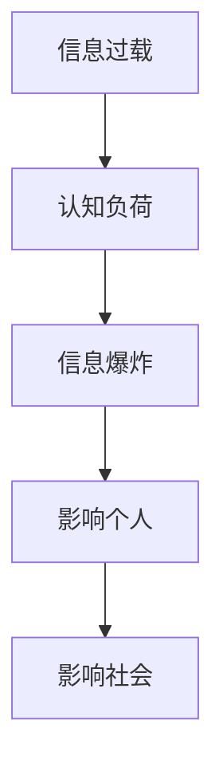
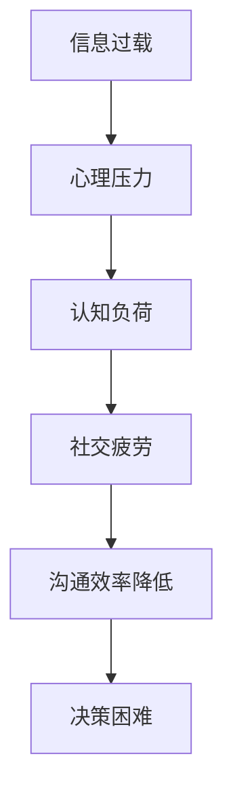
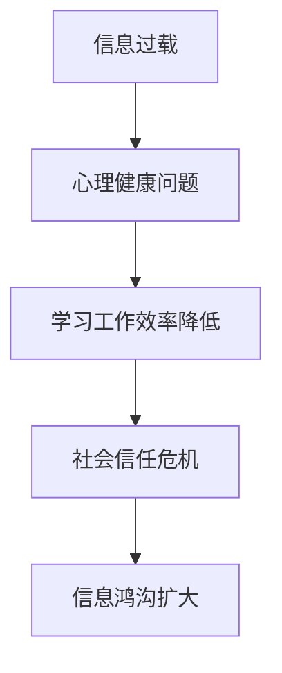

                 

### 《信息过载与信息筛选技术：在信息洪流中找到有价值的信息》

#### 文章关键词：
- 信息过载
- 信息筛选技术
- 人工智能
- 大数据分析
- 机器学习
- 自然语言处理

#### 摘要：
在当今数字化时代，信息过载已成为一个普遍现象，对个人和社会产生了深远影响。本文旨在探讨信息过载的背景与现状，分析其产生的原因，以及介绍各种信息筛选技术，如人工智能和机器学习在信息筛选中的应用。此外，文章还将讨论信息筛选的伦理与社会责任，并展望未来信息筛选技术的发展趋势。通过这些内容，帮助读者在信息洪流中找到有价值的信息。

### 第一部分：信息过载现象与影响

#### 第1章：信息过载的背景与现状

##### 1.1 信息过载的定义与特征

信息过载是指个体或组织在接受和处理信息时，由于信息量过多而导致的认知负荷增大，难以高效地筛选和处理有用信息。在互联网时代，信息爆炸已成为常态，每天我们都会接收到海量信息，而其中仅有少部分是有价值的。这种现象对个人和社会都产生了深远的影响。

###### 核心概念与联系：

- **信息过载**：信息过载是指信息量过大，超出个体或组织处理能力的情况。
- **认知负荷**：个体在接受和处理信息时所需的认知资源。
- **信息爆炸**：信息量呈指数级增长，信息来源多样化。

###### Mermaid 流程图：

##### 1.2 信息过载的主要表现

信息过载在个人层面和社交层面都有明显的表现。

- **个人层面：**
  - **心理压力**：大量信息接收可能导致焦虑、压力增大。
  - **认知负荷**：需要处理的信息过多，导致认知负荷增加。
  - **社交疲劳**：长时间面对大量信息，容易产生疲劳感。

- **社交层面：**
  - **沟通效率降低**：信息过载导致沟通效率降低，难以快速找到所需信息。
  - **决策困难**：面对大量信息，难以准确判断和做出决策。

###### 核心概念与联系：

- **心理压力**：个体在处理大量信息时产生的负面情绪。
- **认知负荷**：处理信息所需的认知资源。
- **社交疲劳**：长时间面对大量信息的疲劳感。

###### Mermaid 流程图：

##### 1.3 信息过载对个人和社会的影响

信息过载对个人和社会都产生了深远的影响。

- **个人影响：**
  - **心理健康问题**：长期的过度信息接收可能导致心理健康问题，如焦虑、抑郁等。
  - **学习和工作效率**：信息过载会降低个人的学习和工作效率。

- **社会影响：**
  - **社会信任危机**：信息泛滥和不准确的信息传播可能导致社会信任度下降。
  - **信息鸿沟扩大**：信息过载加剧了信息贫富差距，让信息获取更加不平等。

###### 核心概念与联系：

- **心理健康问题**：信息过载导致的负面情绪问题。
- **社会信任危机**：信息不准确和不真实导致的社会问题。
- **信息鸿沟**：信息获取不平等导致的社会问题。

###### Mermaid 流程图：

---

在接下来的章节中，我们将深入探讨信息过载的原因、信息筛选技术以及信息筛选的伦理与社会责任。通过这些内容，我们将帮助读者更好地应对信息过载问题，提高信息筛选能力，实现个人与社会的可持续发展。

