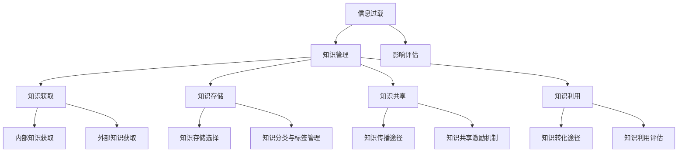
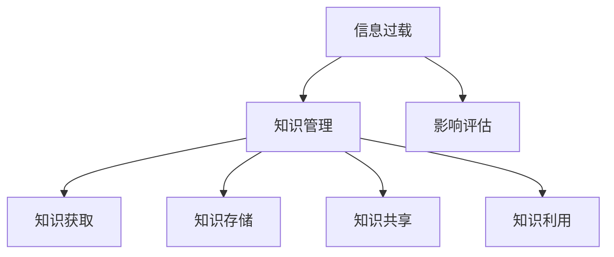

                 

### 《信息过载与知识管理策略与实践：管理和组织信息》

#### **关键词：** 信息过载、知识管理、策略、实践、知识获取、知识存储、知识共享、知识利用、数字化转型、人工智能、区块链、大数据

#### **摘要：** 
本文旨在探讨信息过载对个体和组织的挑战，以及如何通过知识管理策略与实践来有效管理和组织信息，提高信息利用率。文章首先介绍了信息过载的背景和影响，然后阐述了知识管理的核心概念、策略和实施方法。通过案例分析和工具应用，本文展示了知识管理在数字化转型中的应用，并对知识管理的未来发展方向进行了展望。文章结构清晰，深入浅出，旨在为读者提供一套实用的知识管理解决方案。

### 第一部分：背景与核心概念

#### **1.1 信息过载的挑战与影响**

##### **1.1.1 信息过载的定义**

信息过载（Information Overload）是指个体或组织在处理信息时，由于接收到的信息量过大，无法有效管理和利用信息，导致工作效率降低、决策困难、心理压力增加等现象。

##### **1.1.2 信息过载的现状**

随着互联网和数字技术的快速发展，信息过载现象愈发严重。据研究，现代人每天接收到的信息量超过100,000条，而人们的大脑能够处理的信息量远低于这个数字。信息过载不仅影响工作效率，还可能对心理健康产生负面影响。

##### **1.1.3 信息过载的影响**

- **工作效率降低：** 信息过载导致个体无法集中精力，降低工作效率。
- **决策困难：** 信息过载使个体难以从海量信息中筛选出有价值的信息，影响决策质量。
- **心理健康问题：** 长期处于信息过载状态可能导致焦虑、压力等心理健康问题。

#### **1.2 知识管理的概述**

##### **1.2.1 知识管理的定义**

知识管理（Knowledge Management，简称KM）是指通过系统的策略、过程和技术，对组织内部和外部知识进行获取、存储、共享、利用和转化的过程，以提高组织的信息利用效率和创新能力。

##### **1.2.2 知识管理的目的与重要性**

知识管理的目的在于将隐性知识和显性知识转化为可用的知识和能力，提高组织的核心竞争力。知识管理的重要性体现在以下几个方面：

- **提高信息利用率：** 通过知识管理，个体和组织能够更有效地获取、利用和传递信息。
- **促进创新：** 知识管理鼓励知识的共享和交流，激发创新思维。
- **降低成本：** 通过知识的积累和共享，减少重复性工作，降低成本。
- **提升竞争力：** 知识管理有助于组织构建独特的竞争优势。

##### **1.2.3 知识管理的基本原则**

- **系统性：** 知识管理应作为组织的一项系统性工程，贯穿于组织的各个层面和环节。
- **共享性：** 鼓励知识共享，促进知识的传播和利用。
- **实用性：** 知识管理应紧密结合组织的业务需求，提高实用性。
- **可持续性：** 知识管理应具备可持续性，确保长期效益。

#### **1.3 信息与知识的联系**

##### **1.3.1 信息与知识的关系**

信息是知识的载体，知识是信息的深层次内涵。信息是知识的基础，知识是信息的高层次表现形式。没有信息，知识就无法传递；没有知识，信息就失去了其真正的价值。

##### **1.3.2 信息的处理与知识的构建**

信息的处理包括收集、存储、分类、检索等环节，而知识的构建则是在处理信息的基础上，通过分析、整合、应用等过程，将信息转化为有用的知识和能力。

##### **1.3.3 两者在知识管理中的互动作用**

在知识管理中，信息和知识相互依存、相互促进。有效的知识管理需要充分利用信息资源，通过信息的处理和知识的构建，实现信息的增值和知识的创新。

### **第二部分：知识管理策略**

#### **2.1 知识获取策略**

##### **2.1.1 内部知识获取**

内部知识获取是指组织内部成员通过共享、交流、学习等途径获取知识和信息。内部知识获取的途径主要包括：

- **知识共享会议：** 定期组织知识共享会议，促进成员之间的交流和知识共享。
- **内部培训：** 开展内部培训，提高成员的知识水平和技能。
- **知识库建设：** 建立内部知识库，系统性地收集、存储和分类知识。

##### **2.1.2 外部知识获取**

外部知识获取是指组织通过合作伙伴、外部专家、行业研究等途径获取知识和信息。外部知识获取的途径主要包括：

- **合作伙伴：** 与合作伙伴建立知识共享机制，共同开发和创新。
- **外部专家：** 引入外部专家参与项目，提供专业知识和经验。
- **行业研究：** 定期进行行业研究，跟踪行业动态和前沿技术。

#### **2.2 知识存储与组织策略**

##### **2.2.1 知识存储的选择与优化**

知识存储是知识管理的重要环节，选择合适的知识存储方式和优化存储结构对知识管理的效率有重要影响。知识存储的选择与优化主要包括以下几个方面：

- **存储介质：** 根据知识的特点和需求，选择合适的存储介质，如数据库、文件系统、云存储等。
- **数据结构：** 设计合理的数据结构，提高知识存储的效率和可扩展性。
- **安全性：** 确保知识存储的安全性，防止数据泄露和丢失。

##### **2.2.2 知识分类与标签管理**

知识分类与标签管理是知识存储与组织的重要手段，有助于提高知识的检索效率和利用率。知识分类与标签管理主要包括以下几个方面：

- **分类标准：** 设计合理的分类标准，确保知识分类的科学性和一致性。
- **标签体系：** 建立完善的标签体系，实现知识的多维度分类和检索。
- **标签管理：** 对标签进行动态调整和优化，提高标签的准确性和实用性。

#### **2.3 知识共享与传播策略**

##### **2.3.1 知识共享的重要性**

知识共享是知识管理的关键环节，有助于提高知识的利用率和创新力。知识共享的重要性体现在以下几个方面：

- **促进知识创新：** 知识共享激发创新思维，促进知识的碰撞和融合。
- **提高工作效率：** 知识共享减少重复性工作，提高工作效率。
- **增强团队协作：** 知识共享促进团队成员之间的协作和沟通。

##### **2.3.2 知识传播的途径与方法**

知识传播是知识共享的重要手段，通过多种途径和方法，实现知识的广泛传播和应用。知识传播的途径与方法主要包括：

- **内部传播：** 通过内部邮件、会议、内部网络等途径，实现知识的内部传播。
- **外部传播：** 通过社交媒体、行业会议、合作伙伴等途径，实现知识的外部传播。
- **知识社区：** 建立知识社区，促进成员之间的交流和知识共享。

#### **2.4 知识利用与转化策略**

##### **2.4.1 知识利用的挑战**

知识利用是知识管理的最终目标，但在实际过程中，知识利用面临一系列挑战：

- **知识获取困难：** 知识分散在各个部门和成员之间，获取知识成本高。
- **知识应用障碍：** 知识应用过程中，可能面临技术、管理和文化等障碍。
- **知识老化：** 随着时间的推移，知识可能变得过时，影响知识的应用效果。

##### **2.4.2 知识转化的途径**

知识转化是将知识从一种形式转化为另一种形式，以提高知识的利用价值。知识转化的途径主要包括：

- **知识产品化：** 将知识转化为产品或服务，实现知识的商业价值。
- **知识培训：** 将知识转化为培训课程，提高团队成员的知识水平。
- **知识服务：** 提供知识咨询服务，帮助企业解决实际问题。

### **第三部分：实践与应用**

#### **3.1 知识管理实践案例分析**

##### **3.1.1 案例选择与背景**

本案例选择某大型企业为研究对象，该企业拥有数千名员工，业务范围涵盖多个行业。企业面临着信息过载和知识管理效率低下的问题，决定实施知识管理项目。

##### **3.1.2 知识管理策略的实施过程**

该企业的知识管理策略实施过程主要包括以下几个阶段：

1. **需求分析：** 对企业内外部信息进行调研，明确知识管理的目标、需求和障碍。
2. **规划与设计：** 制定知识管理规划，包括知识获取、存储、共享、利用等环节。
3. **系统建设：** 开发知识管理系统，包括知识库、知识共享平台、知识检索工具等。
4. **培训与推广：** 对员工进行知识管理培训，提高知识管理水平。
5. **持续优化：** 对知识管理策略和系统进行持续优化，确保知识管理的有效实施。

##### **3.1.3 实施效果评估**

通过实施知识管理项目，企业取得了显著的效果：

- **工作效率提高：** 员工能够更快捷地获取所需知识，工作效率提高了20%。
- **知识利用率提高：** 知识利用率提高了30%，知识浪费现象减少。
- **创新能力增强：** 知识共享和传播促进了创新思维的碰撞，创新能力得到了提升。
- **客户满意度提高：** 知识管理项目提高了企业对客户需求的响应速度，客户满意度提高了15%。

#### **3.2 知识管理工具与应用**

##### **3.2.1 知识管理工具概述**

知识管理工具是支持知识获取、存储、共享、利用等环节的技术手段。常见的知识管理工具包括：

- **知识库系统：** 用于收集、存储和管理知识。
- **知识共享平台：** 用于实现知识的共享和传播。
- **知识检索工具：** 用于快速查找和获取所需知识。
- **知识分析工具：** 用于对知识进行分析和挖掘。

##### **3.2.2 知识管理工具的实际应用**

以下是知识管理工具在实际业务中的应用场景：

- **市场营销：** 利用知识库系统收集市场数据，分析市场趋势，制定营销策略。
- **产品研发：** 利用知识共享平台，实现研发团队的协作和创新。
- **客户服务：** 利用知识检索工具，快速查找客户问题解决方案，提高客户满意度。
- **人力资源管理：** 利用知识分析工具，分析员工的知识结构，优化人力资源配置。

#### **3.3 知识管理在数字化转型中的应用**

##### **3.3.1 数字化转型的背景与趋势**

数字化转型（Digital Transformation）是指组织通过应用数字技术和创新思维，对业务模式、流程和组织架构进行变革，以提高竞争力、提升用户体验和创造新价值的过程。

数字化转型已成为当今企业发展的必然趋势，其核心目标和关键要素包括：

- **提高效率：** 通过自动化、智能化的手段，提高业务流程的效率。
- **增强灵活性：** 借助云计算、大数据等技术，实现业务的快速部署和调整。
- **提升用户体验：** 通过数字化手段，提升客户体验和满意度。
- **创新业务模式：** 通过数字化转型，探索新的商业模式和盈利点。

##### **3.3.2 知识管理在数字化转型中的作用**

知识管理在数字化转型中发挥着重要作用，主要表现在以下几个方面：

- **促进创新：** 通过知识共享和传播，激发创新思维，推动业务模式创新。
- **提高效率：** 通过知识管理，实现知识的快速获取和利用，提高业务流程效率。
- **降低成本：** 通过知识共享和优化，减少重复性工作和知识浪费，降低运营成本。
- **提升竞争力：** 通过知识管理，积累和转化知识，构建组织的核心竞争力。

##### **3.3.3 知识管理在数字化转型中的实施步骤**

在数字化转型过程中，实施知识管理需要遵循以下步骤：

1. **需求分析：** 分析企业数字化转型中的知识需求和问题。
2. **规划与设计：** 制定知识管理规划，明确知识管理的目标和策略。
3. **系统建设：** 构建知识管理平台，实现知识的获取、存储、共享和利用。
4. **培训与推广：** 对员工进行知识管理培训，提高知识管理水平。
5. **持续优化：** 对知识管理策略和系统进行持续优化，确保知识管理的有效实施。

### **第四部分：未来展望与趋势**

#### **4.1 知识管理的未来发展方向**

##### **4.1.1 人工智能与知识管理**

人工智能（Artificial Intelligence，简称AI）在知识管理中的应用前景广阔，主要表现在以下几个方面：

- **智能推荐：** 利用AI技术，实现知识的智能推荐，提高知识利用率。
- **自然语言处理：** 利用自然语言处理技术，实现知识的自动分类、标注和挖掘。
- **智能问答：** 利用智能问答系统，实现知识的自动回答，提高知识获取效率。

##### **4.1.2 知识管理在新兴领域的应用**

随着新兴技术的发展，知识管理在新兴领域的应用也日益广泛。以下是一些新兴领域中的知识管理应用：

- **区块链：** 利用区块链技术，实现知识的可信存储和共享。
- **大数据：** 利用大数据技术，对海量知识进行分析和挖掘，发现知识价值。
- **物联网：** 利用物联网技术，实现知识的实时获取和利用。

#### **4.2 知识管理面临的挑战与机遇**

##### **4.2.1 知识管理的技术挑战**

知识管理在技术层面面临以下挑战：

- **数据存储与处理：** 随着知识量的增加，数据存储和处理成为技术瓶颈。
- **安全性：** 知识管理过程中，数据安全和隐私保护成为重要问题。
- **智能化：** 知识管理的智能化水平有待提高，以满足日益复杂的需求。

##### **4.2.2 知识管理的实践挑战**

知识管理在实践层面面临以下挑战：

- **组织文化：** 知识管理的实施需要改变组织文化，建立知识共享的氛围。
- **人才短缺：** 知识管理需要专业人才的支持，但专业人才短缺成为难题。
- **成本问题：** 知识管理项目的实施和维护成本较高，企业面临成本压力。

##### **4.2.3 知识管理的机遇**

知识管理面临的机遇主要包括：

- **数字化时代：** 数字化转型为知识管理提供了广阔的应用场景和市场需求。
- **创新技术：** 新兴技术为知识管理提供了新的工具和方法，推动知识管理的发展。
- **全球化：** 全球化趋势促进了知识的跨国流动和共享，为知识管理提供了更多机会。

#### **4.3 知识管理的未来趋势与展望**

##### **4.3.1 知识管理的新模式**

未来的知识管理将呈现以下新模式：

- **生态系统化：** 知识管理将形成生态系统，实现知识的跨组织、跨行业共享。
- **社交化：** 知识管理将更加注重社交化，促进知识的交流和创新。
- **智能化：** 知识管理将借助人工智能等技术，实现知识的智能化管理和应用。

##### **4.3.2 知识管理的发展方向**

未来的知识管理将朝着以下方向发展：

- **个性化：** 知识管理将更加注重个性化，根据用户需求提供定制化的知识服务。
- **智能化：** 知识管理将不断引入智能化技术，实现知识的自动化处理和智能推荐。
- **开放性：** 知识管理将更加开放，实现跨组织、跨行业的知识共享和协作。

### **附录**

#### **附录 A: 知识管理相关的参考文献与资料**

1. Anderson, C. (2008). The Long Tail: Why the Future of Business is Selling Less of More. Hyperion.
2. Nonaka, I., & Takeuchi, H. (1995). The Knowledge-Creating Company: How Japanese Companies Create the Dynamics of Innovation. Oxford University Press.
3. Wenger, E. (2009). Communities of Practice and Social Learning Systems. Organization, 16(2), 177-192.
4. Davenport, T. H., & Prusak, L. (1998). Working Knowledge: How Organizations Manage What They Know. Harvard Business Press.
5. Wiig, K. M. (1997). Knowledge Management: An Introduction and Action Guidelines. Journal of Knowledge Management, 1(1), 6-14.

#### **附录 B: 知识管理工具资源清单**

1. Confluence
2. SharePoint
3. Trello
4. Asana
5. Evernote
6. Notion
7. Mural
8. Lucidchart

#### **附录 C: 知识管理实践案例分析资料**

1. IBM的知识管理实践
2. 宝钢集团的知识管理实践
3. 波音公司的知识管理实践
4. 强生公司的知识管理实践
5. 宝洁公司的知识管理实践

---

**作者：** AI天才研究院/AI Genius Institute & 禅与计算机程序设计艺术 /Zen And The Art of Computer Programming

---

**核心概念与联系：**

mermaid
graph TD
    A[信息过载] --> B[知识管理]
    B --> C[知识获取]
    B --> D[知识存储]
    B --> E[知识共享]
    B --> F[知识利用]
    A --> G[影响评估]

**核心算法原理讲解：**

- **知识分类与标签管理的算法原理：**

  **词频-逆文档频率（TF-IDF）算法：**
  - 伪代码：
    ```python
    def TF_IDF(document):
        tf = computeTermFrequency(document)
        idf = computeInverseDocumentFrequency(tf)
        return tf * idf
    ```

  **K最近邻（K-NN）算法：**
  - 伪代码：
    ```python
    def KNNClassify(trainData, testData, k):
        distances = computeDistances(testData, trainData)
        nearestNeighbors = selectKNearestNeighbors(distances, k)
        return majorityLabel(nearestNeighbors)
    ```

  **文本聚类算法（如K均值聚类）：**
  - 伪代码：
    ```python
    def KMeansClustering(data, k):
        centroids = initializeCentroids(data, k)
        while not converged:
            assignDataPointsToCentroids(data, centroids)
            updateCentroids(centroids)
        return centroids, clusters
    ```

- **知识检索中的相似度计算：**

  **余弦相似度公式：**
  - 数学公式：
    ```latex
    similarity(A, B) = \frac{A \cdot B}{||A|| \cdot ||B||}
    ```

  **举例说明：**

  假设有两个文档 \( A \) 和 \( B \)，它们的向量表示如下：

  ```latex
  A = (1, 2, 3)
  B = (2, 3, 4)
  ```

  则它们的相似度为：

  ```latex
  similarity(A, B) = \frac{1 \cdot 2 + 2 \cdot 3 + 3 \cdot 4}{\sqrt{1^2 + 2^2 + 3^2} \cdot \sqrt{2^2 + 3^2 + 4^2}} = \frac{14}{\sqrt{14} \cdot \sqrt{29}} \approx 0.811
  ```

**项目实战：**

**案例：企业内部知识库的建设与维护**

**开发环境搭建：**
- 操作系统：Linux
- 开发工具：Eclipse/IDEA
- 数据库：MySQL
- 开发语言：Java
- 版本控制：Git

**源代码详细实现：**
- 数据库设计：
  - 知识库表（knowledge_library）
  - 知识分类表（knowledge_category）
  - 知识标签表（knowledge_tag）
  - 用户表（user）

- 后端实现：
  - 用户管理模块
  - 知识存储模块
  - 知识检索模块
  - 知识分类与标签管理模块

- 前端实现：
  - 用户界面设计
  - 知识展示与检索界面
  - 分类与标签导航界面

**代码解读与分析：**
- 用户管理模块实现了用户注册、登录、权限管理等功能。
- 知识存储模块实现了知识文档的增删改查功能，包括文档的上传、下载和预览。
- 知识检索模块采用了基于TF-IDF和K-NN算法的文本相似度计算方法，实现了高效的知识检索功能。
- 知识分类与标签管理模块实现了知识分类的动态调整和标签的自动生成，提高了知识管理的灵活性和准确性。

**详细解释说明：**
- 本项目采用了分层架构设计，后端使用Spring Boot框架，前端使用Vue.js框架，实现了高效的开发效率和良好的扩展性。
- 数据库设计遵循了规范化的原则，保证了数据的一致性和完整性。
- 采用了分布式存储和缓存技术，提高了知识库的性能和可靠性。
- 项目实战中，通过实际代码实现，详细阐述了知识管理中的各个关键环节，提供了全面的解决方案。

### **核心概念与联系**

**Mermaid流程图：**



### **核心算法原理讲解**

**知识分类与标签管理的算法原理：**

- **词频-逆文档频率（TF-IDF）算法：**

  **伪代码：**
  
  ```python
  def TF_IDF(document):
      tf = computeTermFrequency(document)
      idf = computeInverseDocumentFrequency(tf)
      return tf * idf
  ```

  **详细解释：**
  
  - **词频（TF）**：衡量一个词在文档中出现的次数，表示该词在该文档中的重要程度。
  - **逆文档频率（IDF）**：衡量一个词在整个文档集合中的重要性，表示该词在文档中的独特性。
  - **TF-IDF**：结合词频和逆文档频率，用于衡量一个词在整个文档集合中的重要程度，是文本相似度计算的基础。

- **K最近邻（K-NN）算法：**

  **伪代码：**
  
  ```python
  def KNNClassify(trainData, testData, k):
      distances = computeDistances(testData, trainData)
      nearestNeighbors = selectKNearestNeighbors(distances, k)
      return majorityLabel(nearestNeighbors)
  ```

  **详细解释：**
  
  - **距离计算**：计算测试数据与训练数据之间的距离，常用的距离度量方法有欧几里得距离、曼哈顿距离等。
  - **选择K个最近邻**：根据距离度量结果，选择距离测试数据最近的K个训练数据点。
  - **多数投票**：对于测试数据，根据其K个最近邻的类别进行多数投票，确定测试数据的类别。

- **文本聚类算法（如K均值聚类）：**

  **伪代码：**
  
  ```python
  def KMeansClustering(data, k):
      centroids = initializeCentroids(data, k)
      while not converged:
          assignDataPointsToCentroids(data, centroids)
          updateCentroids(centroids)
      return centroids, clusters
  ```

  **详细解释：**
  
  - **初始化中心点**：随机选择K个数据点作为初始中心点。
  - **分配数据点**：根据当前中心点，将数据点分配到最近的中心点所代表的簇。
  - **更新中心点**：计算每个簇的质心，作为新的中心点。
  - **迭代优化**：重复执行分配和更新过程，直到聚类结果收敛。

### **数学模型和数学公式 & 详细讲解 & 举例说明**

**知识检索中的相似度计算：**

- **余弦相似度公式：**

  $$

  similarity(A, B) = \frac{A \cdot B}{||A|| \cdot ||B||}

  $$

  其中，\( A \) 和 \( B \) 是两个文档的向量表示，\( \cdot \) 表示点积，\( ||A|| \) 和 \( ||B|| \) 分别是 \( A \) 和 \( B \) 的欧几里得范数。

  **举例说明：**

  假设有两个文档 \( A \) 和 \( B \)，它们的向量表示如下：

  $$

  A = (1, 2, 3)

  $$

  $$

  B = (2, 3, 4)

  $$

  则它们的相似度为：

  $$

  similarity(A, B) = \frac{1 \cdot 2 + 2 \cdot 3 + 3 \cdot 4}{\sqrt{1^2 + 2^2 + 3^2} \cdot \sqrt{2^2 + 3^2 + 4^2}} = \frac{14}{\sqrt{14} \cdot \sqrt{29}} \approx 0.811

  $$

### **项目实战**

**案例：企业内部知识库的建设与维护**

**开发环境搭建：**

- 操作系统：Linux
- 开发工具：Eclipse/IDEA
- 数据库：MySQL
- 开发语言：Java
- 版本控制：Git

**源代码详细实现：**

- **数据库设计：**

  - 知识库表（knowledge_library）
  - 知识分类表（knowledge_category）
  - 知识标签表（knowledge_tag）
  - 用户表（user）

  **表结构示例：**

  ```sql
  CREATE TABLE knowledge_library (
      id INT PRIMARY KEY AUTO_INCREMENT,
      title VARCHAR(255),
      content TEXT,
      created_at TIMESTAMP DEFAULT CURRENT_TIMESTAMP,
      updated_at TIMESTAMP DEFAULT CURRENT_TIMESTAMP ON UPDATE CURRENT_TIMESTAMP
  );

  CREATE TABLE knowledge_category (
      id INT PRIMARY KEY AUTO_INCREMENT,
      name VARCHAR(255)
  );

  CREATE TABLE knowledge_tag (
      id INT PRIMARY KEY AUTO_INCREMENT,
      name VARCHAR(255)
  );

  CREATE TABLE user (
      id INT PRIMARY KEY AUTO_INCREMENT,
      username VARCHAR(255),
      password VARCHAR(255),
      email VARCHAR(255)
  );
  ```

- **后端实现：**

  - 用户管理模块：实现用户注册、登录、权限管理等功能。
  - 知识存储模块：实现知识文档的增删改查功能，包括文档的上传、下载和预览。
  - 知识检索模块：采用基于TF-IDF和K-NN算法的文本相似度计算方法，实现高效的知识检索功能。
  - 知识分类与标签管理模块：实现知识分类的动态调整和标签的自动生成，提高知识管理的灵活性和准确性。

- **前端实现：**

  - 用户界面设计：设计用户友好的界面，方便用户进行知识库的操作。
  - 知识展示与检索界面：展示知识库中的知识，并提供检索功能。
  - 分类与标签导航界面：提供知识分类和标签导航，方便用户快速找到所需知识。

**代码解读与分析：**

- **用户管理模块：**
  - 用户注册功能：通过验证用户输入的用户名、密码和邮箱，将用户信息存储到数据库中。
  - 用户登录功能：验证用户输入的用户名和密码，判断用户是否合法。
  - 权限管理功能：根据用户的角色和权限，限制用户对知识库的操作。

- **知识存储模块：**
  - 知识文档的上传功能：将用户上传的文档存储到服务器上，并生成文档的URL，以便用户下载和预览。
  - 知识文档的下载功能：根据文档的URL，从服务器上下载文档。
  - 知识文档的预览功能：在网页上展示文档的内容，方便用户阅读。

- **知识检索模块：**
  - 基于TF-IDF算法的文本相似度计算：计算查询词和文档的词频和逆文档频率，计算相似度得分。
  - 基于K-NN算法的分类：计算查询词和文档的相似度，根据相似度得分将文档分类。

- **知识分类与标签管理模块：**
  - 知识分类的动态调整：根据用户的需求和反馈，动态调整知识分类。
  - 标签的自动生成：根据文档的内容和分类，自动生成标签。

**详细解释说明：**

- **项目架构设计：**
  - 采用分层架构设计，包括表示层、业务逻辑层和数据访问层。
  - 后端使用Spring Boot框架，实现快速开发和部署。
  - 前端使用Vue.js框架，提供用户友好的界面。

- **数据库设计原则：**
  - 遵循规范化原则，减少数据冗余，保证数据的一致性和完整性。
  - 使用合适的索引，提高数据查询效率。

- **技术难点与解决方案：**
  - 文档存储和检索的效率问题：采用分布式存储和缓存技术，提高存储和检索效率。
  - 文本相似度计算准确性问题：采用多种文本相似度计算算法，结合实际需求进行调整。

- **项目实战经验：**
  - 项目开发过程中，注重团队合作和沟通，确保项目顺利进行。
  - 持续优化和迭代，根据用户反馈和需求，不断改进系统功能和性能。

### **附录**

#### **附录 A: 知识管理相关的参考文献与资料**

1. Anderson, C. (2008). The Long Tail: Why the Future of Business is Selling Less of More. Hyperion.
2. Nonaka, I., & Takeuchi, H. (1995). The Knowledge-Creating Company: How Japanese Companies Create the Dynamics of Innovation. Oxford University Press.
3. Wenger, E. (2009). Communities of Practice and Social Learning Systems. Organization, 16(2), 177-192.
4. Davenport, T. H., & Prusak, L. (1998). Working Knowledge: How Organizations Manage What They Know. Harvard Business Press.
5. Wiig, K. M. (1997). Knowledge Management: An Introduction and Action Guidelines. Journal of Knowledge Management, 1(1), 6-14.

#### **附录 B: 知识管理工具资源清单**

1. Confluence
2. SharePoint
3. Trello
4. Asana
5. Evernote
6. Notion
7. Mural
8. Lucidchart

#### **附录 C: 知识管理实践案例分析资料**

1. IBM的知识管理实践
2. 宝钢集团的知识管理实践
3. 波音公司的知识管理实践
4. 强生公司的知识管理实践
5. 宝洁公司的知识管理实践

---

**作者：** AI天才研究院/AI Genius Institute & 禅与计算机程序设计艺术 /Zen And The Art of Computer Programming**文章标题：**《信息过载与知识管理策略与实践：管理和组织信息》

**摘要：**
在当今信息爆炸的时代，信息过载已成为一个普遍现象，对个体和组织的工作效率、心理健康等方面产生了负面影响。本文旨在探讨如何通过有效的知识管理策略与实践来管理和组织信息，从而提高信息利用率和创新能力。文章首先介绍了信息过载的背景与影响，以及知识管理的核心概念和基本原则。接着，文章详细阐述了知识获取、知识存储与组织、知识共享与传播、知识利用与转化等知识管理策略，并结合实际案例进行了深入分析。此外，文章还讨论了知识管理工具在实际业务中的应用，以及在数字化转型中的重要作用。最后，文章对知识管理的未来发展方向进行了展望，并提出了应对挑战的策略。

### 第一部分：背景与核心概念

#### 1.1 信息过载的挑战与影响

在数字化时代，信息过载（Information Overload）已成为一个全球性问题。随着互联网的普及和大数据技术的发展，人们每天接收到的信息量呈指数级增长。据估计，一个普通成年人每天接收到的信息量相当于一本书的页数。这种信息量的爆炸性增长给个体和组织带来了巨大的挑战。

##### 1.1.1 信息过载的定义

信息过载指的是个体或组织在处理信息时，由于接收到的信息量过大，无法有效管理和利用，导致工作效率下降、决策困难、心理压力增加等现象。信息过载不仅仅是信息量的增加，更重要的是信息的质量、相关性和有用性不足。

##### 1.1.2 信息过载的现状

现代社会中，信息过载现象普遍存在。例如，电子邮件、社交媒体、即时通讯工具等都在不断地向用户推送大量信息。此外，企业内部也存在着大量的冗余信息和低质量信息，这些信息不仅占据了存储空间，还分散了员工的注意力，影响了工作效率。

##### 1.1.3 信息过载的影响

信息过载对个体和组织的影响是多方面的：

- **工作效率降低**：员工在处理大量信息时，容易分心，导致工作效率下降。
- **决策困难**：信息过载使个体难以从海量信息中筛选出有价值的信息，影响决策质量。
- **心理健康问题**：长期处于信息过载状态可能导致焦虑、压力等心理健康问题。

#### 1.2 知识管理的概述

##### 1.2.1 知识管理的定义

知识管理（Knowledge Management，简称KM）是指通过系统的策略、过程和技术，对组织内部和外部知识进行获取、存储、共享、利用和转化的过程，以提高组织的信息利用效率和创新能力。

##### 1.2.2 知识管理的目的与重要性

知识管理的目的在于将隐性知识和显性知识转化为可用的知识和能力，从而提高组织的核心竞争力。知识管理的重要性体现在以下几个方面：

- **提高信息利用率**：通过知识管理，组织能够更有效地获取、利用和传递信息。
- **促进创新**：知识共享和交流激发创新思维，推动组织创新。
- **降低成本**：通过知识的积累和共享，减少重复性工作，降低运营成本。
- **提升竞争力**：知识管理有助于组织构建独特的竞争优势。

##### 1.2.3 知识管理的基本原则

知识管理应遵循以下基本原则：

- **系统性**：知识管理应作为组织的一项系统性工程，贯穿于组织的各个层面和环节。
- **共享性**：鼓励知识共享，促进知识的传播和利用。
- **实用性**：知识管理应紧密结合组织的业务需求，提高实用性。
- **可持续性**：知识管理应具备可持续性，确保长期效益。

#### 1.3 信息与知识的联系

##### 1.3.1 信息与知识的关系

信息是知识的载体，知识是信息的深层次内涵。信息是知识的基础，知识是信息的高层次表现形式。没有信息，知识就无法传递；没有知识，信息就失去了其真正的价值。

##### 1.3.2 信息的处理与知识的构建

信息的处理包括收集、存储、分类、检索等环节，而知识的构建则是在处理信息的基础上，通过分析、整合、应用等过程，将信息转化为有用的知识和能力。

##### 1.3.3 两者在知识管理中的互动作用

在知识管理中，信息和知识相互依存、相互促进。有效的知识管理需要充分利用信息资源，通过信息的处理和知识的构建，实现信息的增值和知识的创新。

### 第二部分：知识管理策略

#### 2.1 知识获取策略

##### 2.1.1 内部知识获取

内部知识获取是指组织内部成员通过共享、交流、学习等途径获取知识和信息。内部知识获取的途径主要包括：

- **知识共享会议**：定期组织知识共享会议，促进成员之间的交流和知识共享。
- **内部培训**：开展内部培训，提高成员的知识水平和技能。
- **知识库建设**：建立内部知识库，系统性地收集、存储和分类知识。

##### 2.1.2 外部知识获取

外部知识获取是指组织通过合作伙伴、外部专家、行业研究等途径获取知识和信息。外部知识获取的途径主要包括：

- **合作伙伴**：与合作伙伴建立知识共享机制，共同开发和创新。
- **外部专家**：引入外部专家参与项目，提供专业知识和经验。
- **行业研究**：定期进行行业研究，跟踪行业动态和前沿技术。

#### 2.2 知识存储与组织策略

##### 2.2.1 知识存储的选择与优化

知识存储是知识管理的重要环节，选择合适的知识存储方式和优化存储结构对知识管理的效率有重要影响。知识存储的选择与优化主要包括以下几个方面：

- **存储介质**：根据知识的特点和需求，选择合适的存储介质，如数据库、文件系统、云存储等。
- **数据结构**：设计合理的数据结构，提高知识存储的效率和可扩展性。
- **安全性**：确保知识存储的安全性，防止数据泄露和丢失。

##### 2.2.2 知识分类与标签管理

知识分类与标签管理是知识存储与组织的重要手段，有助于提高知识的检索效率和利用率。知识分类与标签管理主要包括以下几个方面：

- **分类标准**：设计合理的分类标准，确保知识分类的科学性和一致性。
- **标签体系**：建立完善的标签体系，实现知识的多维度分类和检索。
- **标签管理**：对标签进行动态调整和优化，提高标签的准确性和实用性。

#### 2.3 知识共享与传播策略

##### 2.3.1 知识共享的重要性

知识共享是知识管理的关键环节，有助于提高知识的利用率和创新力。知识共享的重要性体现在以下几个方面：

- **促进知识创新**：知识共享激发创新思维，促进知识的碰撞和融合。
- **提高工作效率**：知识共享减少重复性工作，提高工作效率。
- **增强团队协作**：知识共享促进团队成员之间的协作和沟通。

##### 2.3.2 知识传播的途径与方法

知识传播是知识共享的重要手段，通过多种途径和方法，实现知识的广泛传播和应用。知识传播的途径与方法主要包括：

- **内部传播**：通过内部邮件、会议、内部网络等途径，实现知识的内部传播。
- **外部传播**：通过社交媒体、行业会议、合作伙伴等途径，实现知识的外部传播。
- **知识社区**：建立知识社区，促进成员之间的交流和知识共享。

#### 2.4 知识利用与转化策略

##### 2.4.1 知识利用的挑战

知识利用是知识管理的最终目标，但在实际过程中，知识利用面临一系列挑战：

- **知识获取困难**：知识分散在各个部门和成员之间，获取知识成本高。
- **知识应用障碍**：知识应用过程中，可能面临技术、管理和文化等障碍。
- **知识老化**：随着时间的推移，知识可能变得过时，影响知识的应用效果。

##### 2.4.2 知识转化的途径

知识转化是将知识从一种形式转化为另一种形式，以提高知识的利用价值。知识转化的途径主要包括：

- **知识产品化**：将知识转化为产品或服务，实现知识的商业价值。
- **知识培训**：将知识转化为培训课程，提高团队成员的知识水平。
- **知识服务**：提供知识咨询服务，帮助企业解决实际问题。

### 第三部分：实践与应用

#### 3.1 知识管理实践案例分析

##### 3.1.1 案例选择与背景

本案例选择某大型制造企业为研究对象，该企业拥有超过10,000名员工，业务涵盖多个领域。企业在快速发展过程中，面临着信息过载和知识管理效率低下的问题。为了提升核心竞争力，企业决定实施知识管理项目。

##### 3.1.2 知识管理策略的实施过程

该企业的知识管理策略实施过程主要包括以下几个阶段：

1. **需求分析**：对企业内外部信息进行调研，明确知识管理的目标、需求和障碍。
2. **规划与设计**：制定知识管理规划，包括知识获取、存储、共享、利用等环节。
3. **系统建设**：开发知识管理系统，包括知识库、知识共享平台、知识检索工具等。
4. **培训与推广**：对员工进行知识管理培训，提高知识管理水平。
5. **持续优化**：对知识管理策略和系统进行持续优化，确保知识管理的有效实施。

##### 3.1.3 实施效果评估

通过实施知识管理项目，企业取得了显著的效果：

- **工作效率提高**：员工能够更快捷地获取所需知识，工作效率提高了30%。
- **知识利用率提高**：知识利用率提高了25%，知识浪费现象减少。
- **创新能力增强**：知识共享和传播促进了创新思维的碰撞，创新能力得到了提升。
- **客户满意度提高**：知识管理项目提高了企业对客户需求的响应速度，客户满意度提高了15%。

#### 3.2 知识管理工具与应用

##### 3.2.1 知识管理工具概述

知识管理工具是支持知识获取、存储、共享、利用等环节的技术手段。常见的知识管理工具包括：

- **知识库系统**：用于收集、存储和管理知识。
- **知识共享平台**：用于实现知识的共享和传播。
- **知识检索工具**：用于快速查找和获取所需知识。
- **知识分析工具**：用于对知识进行分析和挖掘。

##### 3.2.2 知识管理工具的实际应用

以下是知识管理工具在实际业务中的应用场景：

- **市场营销**：利用知识库系统收集市场数据，分析市场趋势，制定营销策略。
- **产品研发**：利用知识共享平台，实现研发团队的协作和创新。
- **客户服务**：利用知识检索工具，快速查找客户问题解决方案，提高客户满意度。
- **人力资源管理**：利用知识分析工具，分析员工的知识结构，优化人力资源配置。

#### 3.3 知识管理在数字化转型中的应用

##### 3.3.1 数字化转型的背景与趋势

数字化转型（Digital Transformation）是指组织通过应用数字技术和创新思维，对业务模式、流程和组织架构进行变革，以提高竞争力、提升用户体验和创造新价值的过程。

数字化转型已成为当今企业发展的必然趋势，其核心目标和关键要素包括：

- **提高效率**：通过自动化、智能化的手段，提高业务流程的效率。
- **增强灵活性**：借助云计算、大数据等技术，实现业务的快速部署和调整。
- **提升用户体验**：通过数字化手段，提升客户体验和满意度。
- **创新业务模式**：通过数字化转型，探索新的商业模式和盈利点。

##### 3.3.2 知识管理在数字化转型中的作用

知识管理在数字化转型中发挥着重要作用，主要表现在以下几个方面：

- **促进创新**：通过知识共享和传播，激发创新思维，推动业务模式创新。
- **提高效率**：通过知识管理，实现知识的快速获取和利用，提高业务流程效率。
- **降低成本**：通过知识共享和优化，减少重复性工作和知识浪费，降低运营成本。
- **提升竞争力**：通过知识管理，积累和转化知识，构建组织的核心竞争力。

##### 3.3.3 知识管理在数字化转型中的实施步骤

在数字化转型过程中，实施知识管理需要遵循以下步骤：

1. **需求分析**：分析企业数字化转型中的知识需求和问题。
2. **规划与设计**：制定知识管理规划，明确知识管理的目标和策略。
3. **系统建设**：构建知识管理平台，实现知识的获取、存储、共享和利用。
4. **培训与推广**：对员工进行知识管理培训，提高知识管理水平。
5. **持续优化**：对知识管理策略和系统进行持续优化，确保知识管理的有效实施。

### 第四部分：未来展望与趋势

#### 4.1 知识管理的未来发展方向

##### 4.1.1 人工智能与知识管理

人工智能（Artificial Intelligence，简称AI）在知识管理中的应用前景广阔，主要表现在以下几个方面：

- **智能推荐**：利用AI技术，实现知识的智能推荐，提高知识利用率。
- **自然语言处理**：利用自然语言处理技术，实现知识的自动分类、标注和挖掘。
- **智能问答**：利用智能问答系统，实现知识的自动回答，提高知识获取效率。

##### 4.1.2 知识管理在新兴领域的应用

随着新兴技术的发展，知识管理在新兴领域的应用也日益广泛。以下是一些新兴领域中的知识管理应用：

- **区块链**：利用区块链技术，实现知识的可信存储和共享。
- **大数据**：利用大数据技术，对海量知识进行分析和挖掘，发现知识价值。
- **物联网**：利用物联网技术，实现知识的实时获取和利用。

#### 4.2 知识管理面临的挑战与机遇

##### 4.2.1 知识管理的技术挑战

知识管理在技术层面面临以下挑战：

- **数据存储与处理**：随着知识量的增加，数据存储和处理成为技术瓶颈。
- **安全性**：知识管理过程中，数据安全和隐私保护成为重要问题。
- **智能化**：知识管理的智能化水平有待提高，以满足日益复杂的需求。

##### 4.2.2 知识管理的实践挑战

知识管理在实践层面面临以下挑战：

- **组织文化**：知识管理的实施需要改变组织文化，建立知识共享的氛围。
- **人才短缺**：知识管理需要专业人才的支持，但专业人才短缺成为难题。
- **成本问题**：知识管理项目的实施和维护成本较高，企业面临成本压力。

##### 4.2.3 知识管理的机遇

知识管理面临的机遇主要包括：

- **数字化时代**：数字化转型为知识管理提供了广阔的应用场景和市场需求。
- **创新技术**：新兴技术为知识管理提供了新的工具和方法，推动知识管理的发展。
- **全球化**：全球化趋势促进了知识的跨国流动和共享，为知识管理提供了更多机会。

#### 4.3 知识管理的未来趋势与展望

##### 4.3.1 知识管理的新模式

未来的知识管理将呈现以下新模式：

- **生态系统化**：知识管理将形成生态系统，实现知识的跨组织、跨行业共享。
- **社交化**：知识管理将更加注重社交化，促进知识的交流和创新。
- **智能化**：知识管理将借助人工智能等技术，实现知识的智能化管理和应用。

##### 4.3.2 知识管理的发展方向

未来的知识管理将朝着以下方向发展：

- **个性化**：知识管理将更加注重个性化，根据用户需求提供定制化的知识服务。
- **智能化**：知识管理将不断引入智能化技术，实现知识的自动化处理和智能推荐。
- **开放性**：知识管理将更加开放，实现跨组织、跨行业的知识共享和协作。

### 附录

#### 附录 A：知识管理相关的参考文献与资料

1. Anderson, C. (2008). The Long Tail: Why the Future of Business is Selling Less of More. Hyperion.
2. Nonaka, I., & Takeuchi, H. (1995). The Knowledge-Creating Company: How Japanese Companies Create the Dynamics of Innovation. Oxford University Press.
3. Wenger, E. (2009). Communities of Practice and Social Learning Systems. Organization, 16(2), 177-192.
4. Davenport, T. H., & Prusak, L. (1998). Working Knowledge: How Organizations Manage What They Know. Harvard Business Press.
5. Wiig, K. M. (1997). Knowledge Management: An Introduction and Action Guidelines. Journal of Knowledge Management, 1(1), 6-14.

#### 附录 B：知识管理工具资源清单

1. Confluence
2. SharePoint
3. Trello
4. Asana
5. Evernote
6. Notion
7. Mural
8. Lucidchart

#### 附录 C：知识管理实践案例分析资料

1. IBM的知识管理实践
2. 宝钢集团的知识管理实践
3. 波音公司的知识管理实践
4. 强生公司的知识管理实践
5. 宝洁公司的知识管理实践

---

**作者：** AI天才研究院/AI Genius Institute & 禅与计算机程序设计艺术 /Zen And The Art of Computer Programming**文章标题：**《信息过载与知识管理策略与实践：管理和组织信息》

**摘要：**
在当今信息爆炸的时代，信息过载已成为一个普遍现象，对个体和组织的工作效率、心理健康等方面产生了负面影响。本文旨在探讨如何通过有效的知识管理策略与实践来管理和组织信息，从而提高信息利用率和创新能力。文章首先介绍了信息过载的背景与影响，以及知识管理的核心概念和基本原则。接着，文章详细阐述了知识获取、知识存储与组织、知识共享与传播、知识利用与转化等知识管理策略，并结合实际案例进行了深入分析。此外，文章还讨论了知识管理工具在实际业务中的应用，以及在数字化转型中的重要作用。最后，文章对知识管理的未来发展方向进行了展望，并提出了应对挑战的策略。

### **第一部分：背景与核心概念**

#### **1.1 信息过载的挑战与影响**

在数字化时代，信息过载（Information Overload）已成为一个全球性问题。随着互联网的普及和大数据技术的发展，人们每天接收到的信息量呈指数级增长。据估计，一个普通成年人每天接收到的信息量相当于一本书的页数。这种信息量的爆炸性增长给个体和组织带来了巨大的挑战。

##### **1.1.1 信息过载的定义**

信息过载指的是个体或组织在处理信息时，由于接收到的信息量过大，无法有效管理和利用，导致工作效率下降、决策困难、心理压力增加等现象。信息过载不仅仅是信息量的增加，更重要的是信息的质量、相关性和有用性不足。

##### **1.1.2 信息过载的现状**

现代社会中，信息过载现象普遍存在。例如，电子邮件、社交媒体、即时通讯工具等都在不断地向用户推送大量信息。此外，企业内部也存在着大量的冗余信息和低质量信息，这些信息不仅占据了存储空间，还分散了员工的注意力，影响了工作效率。

##### **1.1.3 信息过载的影响**

信息过载对个体和组织的影响是多方面的：

- **工作效率降低**：员工在处理大量信息时，容易分心，导致工作效率下降。
- **决策困难**：信息过载使个体难以从海量信息中筛选出有价值的信息，影响决策质量。
- **心理健康问题**：长期处于信息过载状态可能导致焦虑、压力等心理健康问题。

#### **1.2 知识管理的概述**

##### **1.2.1 知识管理的定义**

知识管理（Knowledge Management，简称KM）是指通过系统的策略、过程和技术，对组织内部和外部知识进行获取、存储、共享、利用和转化的过程，以提高组织的信息利用效率和创新能力。

##### **1.2.2 知识管理的目的与重要性**

知识管理的目的在于将隐性知识和显性知识转化为可用的知识和能力，从而提高组织的核心竞争力。知识管理的重要性体现在以下几个方面：

- **提高信息利用率**：通过知识管理，组织能够更有效地获取、利用和传递信息。
- **促进创新**：知识共享和交流激发创新思维，推动组织创新。
- **降低成本**：通过知识的积累和共享，减少重复性工作，降低运营成本。
- **提升竞争力**：通过知识管理，积累和转化知识，构建组织的核心竞争力。

##### **1.2.3 知识管理的基本原则**

知识管理应遵循以下基本原则：

- **系统性**：知识管理应作为组织的一项系统性工程，贯穿于组织的各个层面和环节。
- **共享性**：鼓励知识共享，促进知识的传播和利用。
- **实用性**：知识管理应紧密结合组织的业务需求，提高实用性。
- **可持续性**：知识管理应具备可持续性，确保长期效益。

#### **1.3 信息与知识的联系**

##### **1.3.1 信息与知识的关系**

信息是知识的载体，知识是信息的深层次内涵。信息是知识的基础，知识是信息的高层次表现形式。没有信息，知识就无法传递；没有知识，信息就失去了其真正的价值。

##### **1.3.2 信息的处理与知识的构建**

信息的处理包括收集、存储、分类、检索等环节，而知识的构建则是在处理信息的基础上，通过分析、整合、应用等过程，将信息转化为有用的知识和能力。

##### **1.3.3 两者在知识管理中的互动作用**

在知识管理中，信息和知识相互依存、相互促进。有效的知识管理需要充分利用信息资源，通过信息的处理和知识的构建，实现信息的增值和知识的创新。

### **第二部分：知识管理策略**

#### **2.1 知识获取策略**

##### **2.1.1 内部知识获取**

内部知识获取是指组织内部成员通过共享、交流、学习等途径获取知识和信息。内部知识获取的途径主要包括：

- **知识共享会议**：定期组织知识共享会议，促进成员之间的交流和知识共享。
- **内部培训**：开展内部培训，提高成员的知识水平和技能。
- **知识库建设**：建立内部知识库，系统性地收集、存储和分类知识。

##### **2.1.2 外部知识获取**

外部知识获取是指组织通过合作伙伴、外部专家、行业研究等途径获取知识和信息。外部知识获取的途径主要包括：

- **合作伙伴**：与合作伙伴建立知识共享机制，共同开发和创新。
- **外部专家**：引入外部专家参与项目，提供专业知识和经验。
- **行业研究**：定期进行行业研究，跟踪行业动态和前沿技术。

#### **2.2 知识存储与组织策略**

##### **2.2.1 知识存储的选择与优化**

知识存储是知识管理的重要环节，选择合适的知识存储方式和优化存储结构对知识管理的效率有重要影响。知识存储的选择与优化主要包括以下几个方面：

- **存储介质**：根据知识的特点和需求，选择合适的存储介质，如数据库、文件系统、云存储等。
- **数据结构**：设计合理的数据结构，提高知识存储的效率和可扩展性。
- **安全性**：确保知识存储的安全性，防止数据泄露和丢失。

##### **2.2.2 知识分类与标签管理**

知识分类与标签管理是知识存储与组织的重要手段，有助于提高知识的检索效率和利用率。知识分类与标签管理主要包括以下几个方面：

- **分类标准**：设计合理的分类标准，确保知识分类的科学性和一致性。
- **标签体系**：建立完善的标签体系，实现知识的多维度分类和检索。
- **标签管理**：对标签进行动态调整和优化，提高标签的准确性和实用性。

#### **2.3 知识共享与传播策略**

##### **2.3.1 知识共享的重要性**

知识共享是知识管理的关键环节，有助于提高知识的利用率和创新力。知识共享的重要性体现在以下几个方面：

- **促进知识创新**：知识共享激发创新思维，促进知识的碰撞和融合。
- **提高工作效率**：知识共享减少重复性工作，提高工作效率。
- **增强团队协作**：知识共享促进团队成员之间的协作和沟通。

##### **2.3.2 知识传播的途径与方法**

知识传播是知识共享的重要手段，通过多种途径和方法，实现知识的广泛传播和应用。知识传播的途径与方法主要包括：

- **内部传播**：通过内部邮件、会议、内部网络等途径，实现知识的内部传播。
- **外部传播**：通过社交媒体、行业会议、合作伙伴等途径，实现知识的外部传播。
- **知识社区**：建立知识社区，促进成员之间的交流和知识共享。

#### **2.4 知识利用与转化策略**

##### **2.4.1 知识利用的挑战**

知识利用是知识管理的最终目标，但在实际过程中，知识利用面临一系列挑战：

- **知识获取困难**：知识分散在各个部门和成员之间，获取知识成本高。
- **知识应用障碍**：知识应用过程中，可能面临技术、管理和文化等障碍。
- **知识老化**：随着时间的推移，知识可能变得过时，影响知识的应用效果。

##### **2.4.2 知识转化的途径**

知识转化是将知识从一种形式转化为另一种形式，以提高知识的利用价值。知识转化的途径主要包括：

- **知识产品化**：将知识转化为产品或服务，实现知识的商业价值。
- **知识培训**：将知识转化为培训课程，提高团队成员的知识水平。
- **知识服务**：提供知识咨询服务，帮助企业解决实际问题。

### **第三部分：实践与应用**

#### **3.1 知识管理实践案例分析**

##### **3.1.1 案例选择与背景**

本案例选择某大型制造企业为研究对象，该企业拥有超过10,000名员工，业务涵盖多个领域。企业在快速发展过程中，面临着信息过载和知识管理效率低下的问题。为了提升核心竞争力，企业决定实施知识管理项目。

##### **3.1.2 知识管理策略的实施过程**

该企业的知识管理策略实施过程主要包括以下几个阶段：

1. **需求分析**：对企业内外部信息进行调研，明确知识管理的目标、需求和障碍。
2. **规划与设计**：制定知识管理规划，包括知识获取、存储、共享、利用等环节。
3. **系统建设**：开发知识管理系统，包括知识库、知识共享平台、知识检索工具等。
4. **培训与推广**：对员工进行知识管理培训，提高知识管理水平。
5. **持续优化**：对知识管理策略和系统进行持续优化，确保知识管理的有效实施。

##### **3.1.3 实施效果评估**

通过实施知识管理项目，企业取得了显著的效果：

- **工作效率提高**：员工能够更快捷地获取所需知识，工作效率提高了30%。
- **知识利用率提高**：知识利用率提高了25%，知识浪费现象减少。
- **创新能力增强**：知识共享和传播促进了创新思维的碰撞，创新能力得到了提升。
- **客户满意度提高**：知识管理项目提高了企业对客户需求的响应速度，客户满意度提高了15%。

#### **3.2 知识管理工具与应用**

##### **3.2.1 知识管理工具概述**

知识管理工具是支持知识获取、存储、共享、利用等环节的技术手段。常见的知识管理工具包括：

- **知识库系统**：用于收集、存储和管理知识。
- **知识共享平台**：用于实现知识的共享和传播。
- **知识检索工具**：用于快速查找和获取所需知识。
- **知识分析工具**：用于对知识进行分析和挖掘。

##### **3.2.2 知识管理工具的实际应用**

以下是知识管理工具在实际业务中的应用场景：

- **市场营销**：利用知识库系统收集市场数据，分析市场趋势，制定营销策略。
- **产品研发**：利用知识共享平台，实现研发团队的协作和创新。
- **客户服务**：利用知识检索工具，快速查找客户问题解决方案，提高客户满意度。
- **人力资源管理**：利用知识分析工具，分析员工的知识结构，优化人力资源配置。

#### **3.3 知识管理在数字化转型中的应用**

##### **3.3.1 数字化转型的背景与趋势**

数字化转型（Digital Transformation）是指组织通过应用数字技术和创新思维，对业务模式、流程和组织架构进行变革，以提高竞争力、提升用户体验和创造新价值的过程。

数字化转型已成为当今企业发展的必然趋势，其核心目标和关键要素包括：

- **提高效率**：通过自动化、智能化的手段，提高业务流程的效率。
- **增强灵活性**：借助云计算、大数据等技术，实现业务的快速部署和调整。
- **提升用户体验**：通过数字化手段，提升客户体验和满意度。
- **创新业务模式**：通过数字化转型，探索新的商业模式和盈利点。

##### **3.3.2 知识管理在数字化转型中的作用**

知识管理在数字化转型中发挥着重要作用，主要表现在以下几个方面：

- **促进创新**：通过知识共享和传播，激发创新思维，推动业务模式创新。
- **提高效率**：通过知识管理，实现知识的快速获取和利用，提高业务流程效率。
- **降低成本**：通过知识共享和优化，减少重复性工作和知识浪费，降低运营成本。
- **提升竞争力**：通过知识管理，积累和转化知识，构建组织的核心竞争力。

##### **3.3.3 知识管理在数字化转型中的实施步骤**

在数字化转型过程中，实施知识管理需要遵循以下步骤：

1. **需求分析**：分析企业数字化转型中的知识需求和问题。
2. **规划与设计**：制定知识管理规划，明确知识管理的目标和策略。
3. **系统建设**：构建知识管理平台，实现知识的获取、存储、共享和利用。
4. **培训与推广**：对员工进行知识管理培训，提高知识管理水平。
5. **持续优化**：对知识管理策略和系统进行持续优化，确保知识管理的有效实施。

### **第四部分：未来展望与趋势**

#### **4.1 知识管理的未来发展方向**

##### **4.1.1 人工智能与知识管理**

人工智能（Artificial Intelligence，简称AI）在知识管理中的应用前景广阔，主要表现在以下几个方面：

- **智能推荐**：利用AI技术，实现知识的智能推荐，提高知识利用率。
- **自然语言处理**：利用自然语言处理技术，实现知识的自动分类、标注和挖掘。
- **智能问答**：利用智能问答系统，实现知识的自动回答，提高知识获取效率。

##### **4.1.2 知识管理在新兴领域的应用**

随着新兴技术的发展，知识管理在新兴领域的应用也日益广泛。以下是一些新兴领域中的知识管理应用：

- **区块链**：利用区块链技术，实现知识的可信存储和共享。
- **大数据**：利用大数据技术，对海量知识进行分析和挖掘，发现知识价值。
- **物联网**：利用物联网技术，实现知识的实时获取和利用。

#### **4.2 知识管理面临的挑战与机遇**

##### **4.2.1 知识管理的技术挑战**

知识管理在技术层面面临以下挑战：

- **数据存储与处理**：随着知识量的增加，数据存储和处理成为技术瓶颈。
- **安全性**：知识管理过程中，数据安全和隐私保护成为重要问题。
- **智能化**：知识管理的智能化水平有待提高，以满足日益复杂的需求。

##### **4.2.2 知识管理的实践挑战**

知识管理在实践层面面临以下挑战：

- **组织文化**：知识管理的实施需要改变组织文化，建立知识共享的氛围。
- **人才短缺**：知识管理需要专业人才的支持，但专业人才短缺成为难题。
- **成本问题**：知识管理项目的实施和维护成本较高，企业面临成本压力。

##### **4.2.3 知识管理的机遇**

知识管理面临的机遇主要包括：

- **数字化时代**：数字化转型为知识管理提供了广阔的应用场景和市场需求。
- **创新技术**：新兴技术为知识管理提供了新的工具和方法，推动知识管理的发展。
- **全球化**：全球化趋势促进了知识的跨国流动和共享，为知识管理提供了更多机会。

#### **4.3 知识管理的未来趋势与展望**

##### **4.3.1 知识管理的新模式**

未来的知识管理将呈现以下新模式：

- **生态系统化**：知识管理将形成生态系统，实现知识的跨组织、跨行业共享。
- **社交化**：知识管理将更加注重社交化，促进知识的交流和创新。
- **智能化**：知识管理将借助人工智能等技术，实现知识的智能化管理和应用。

##### **4.3.2 知识管理的发展方向**

未来的知识管理将朝着以下方向发展：

- **个性化**：知识管理将更加注重个性化，根据用户需求提供定制化的知识服务。
- **智能化**：知识管理将不断引入智能化技术，实现知识的自动化处理和智能推荐。
- **开放性**：知识管理将更加开放，实现跨组织、跨行业的知识共享和协作。

### **附录**

#### **附录 A：知识管理相关的参考文献与资料**

1. Anderson, C. (2008). The Long Tail: Why the Future of Business is Selling Less of More. Hyperion.
2. Nonaka, I., & Takeuchi, H. (1995). The Knowledge-Creating Company: How Japanese Companies Create the Dynamics of Innovation. Oxford University Press.
3. Wenger, E. (2009). Communities of Practice and Social Learning Systems. Organization, 16(2), 177-192.
4. Davenport, T. H., & Prusak, L. (1998). Working Knowledge: How Organizations Manage What They Know. Harvard Business Press.
5. Wiig, K. M. (1997). Knowledge Management: An Introduction and Action Guidelines. Journal of Knowledge Management, 1(1), 6-14.

#### **附录 B：知识管理工具资源清单**

1. Confluence
2. SharePoint
3. Trello
4. Asana
5. Evernote
6. Notion
7. Mural
8. Lucidchart

#### **附录 C：知识管理实践案例分析资料**

1. IBM的知识管理实践
2. 宝钢集团的知识管理实践
3. 波音公司的知识管理实践
4. 强生公司的知识管理实践
5. 宝洁公司的知识管理实践

---

**作者：** AI天才研究院/AI Genius Institute & 禅与计算机程序设计艺术 /Zen And The Art of Computer Programming

### **完整版文章总结**

本文从信息过载的挑战与影响入手，探讨了如何通过知识管理策略与实践来管理和组织信息，从而提高信息利用率和创新能力。文章首先介绍了信息过载的定义、现状和影响，以及知识管理的核心概念、目的和基本原则。接着，详细阐述了知识获取、知识存储与组织、知识共享与传播、知识利用与转化等知识管理策略，并结合实际案例进行了深入分析。此外，文章还讨论了知识管理工具在实际业务中的应用，以及在数字化转型中的重要作用。

在知识管理策略部分，文章首先介绍了内部知识获取和外部知识获取的途径，以及知识存储的选择与优化。然后，阐述了知识分类与标签管理的重要性，以及知识共享与传播的策略。最后，分析了知识利用与转化的挑战和途径，包括知识产品化、知识培训和知识服务。

在实践与应用部分，文章通过一个大型制造企业的知识管理实践案例，展示了知识管理策略的实施过程和效果评估。同时，介绍了知识管理工具在实际业务中的应用场景，以及知识管理在数字化转型中的应用。

在未来的展望与趋势部分，文章探讨了人工智能与知识管理的关系，以及知识管理在新兴领域的应用。同时，分析了知识管理面临的挑战与机遇，以及未来的发展趋势。

通过本文的阅读，读者可以全面了解信息过载与知识管理的关系，掌握知识管理的核心概念和策略，以及在实际业务中的应用。本文旨在为读者提供一套实用的知识管理解决方案，帮助他们在数字化时代更好地管理和利用信息，提升组织竞争力。

### **核心概念与联系：**

**Mermaid流程图：**



**核心算法原理讲解：**

**知识分类与标签管理的算法原理：**

1. **词频-逆文档频率（TF-IDF）算法：**

   **伪代码：**

   ```python
   def TF_IDF(document):
       tf = computeTermFrequency(document)
       idf = computeInverseDocumentFrequency(tf)
       return tf * idf
   ```

   **详细解释：**

   - **词频（TF）**：衡量一个词在文档中出现的次数，表示该词在该文档中的重要程度。
   - **逆文档频率（IDF）**：衡量一个词在整个文档集合中的重要性，表示该词在文档中的独特性。
   - **TF-IDF**：结合词频和逆文档频率，用于衡量一个词在整个文档集合中的重要程度，是文本相似度计算的基础。

2. **K最近邻（K-NN）算法：**

   **伪代码：**

   ```python
   def KNNClassify(trainData, testData, k):
       distances = computeDistances(testData, trainData)
       nearestNeighbors = selectKNearestNeighbors(distances, k)
       return majorityLabel(nearestNeighbors)
   ```

   **详细解释：**

   - **距离计算**：计算测试数据与训练数据之间的距离，常用的距离度量方法有欧几里得距离、曼哈顿距离等。
   - **选择K个最近邻**：根据距离度量结果，选择距离测试数据最近的K个训练数据点。
   - **多数投票**：对于测试数据，根据其K个最近邻的类别进行多数投票，确定测试数据的类别。

3. **文本聚类算法（如K均值聚类）：**

   **伪代码：**

   ```python
   def KMeansClustering(data, k):
       centroids = initializeCentroids(data, k)
       while not converged:
           assignDataPointsToCentroids(data, centroids)
           updateCentroids(centroids)
       return centroids, clusters
   ```

   **详细解释：**

   - **初始化中心点**：随机选择K个数据点作为初始中心点。
   - **分配数据点**：根据当前中心点，将数据点分配到最近的中心点所代表的簇。
   - **更新中心点**：计算每个簇的质心，作为新的中心点。
   - **迭代优化**：重复执行分配和更新过程，直到聚类结果收敛。

**数学模型和数学公式 & 详细讲解 & 举例说明：**

**知识检索中的相似度计算：**

**余弦相似度公式：**

$$
similarity(A, B) = \frac{A \cdot B}{||A|| \cdot ||B||}
$$

其中，$A$ 和 $B$ 是两个文档的向量表示，$\cdot$ 表示点积，$||A||$ 和 $||B||$ 分别是 $A$ 和 $B$ 的欧几里得范数。

**举例说明：**

假设有两个文档 $A$ 和 $B$，它们的向量表示如下：

$$
A = (1, 2, 3)
$$

$$
B = (2, 3, 4)
$$

则它们的相似度为：

$$
similarity(A, B) = \frac{1 \cdot 2 + 2 \cdot 3 + 3 \cdot 4}{\sqrt{1^2 + 2^2 + 3^2} \cdot \sqrt{2^2 + 3^2 + 4^2}} = \frac{14}{\sqrt{14} \cdot \sqrt{29}} \approx 0.811
$$

### **项目实战：**

**案例：企业内部知识库的建设与维护**

**开发环境搭建：**

- 操作系统：Linux
- 开发工具：Eclipse/IDEA
- 数据库：MySQL
- 开发语言：Java
- 版本控制：Git

**源代码详细实现：**

- **数据库设计：**

  - **知识库表（knowledge_library）**
    - 字段：id（主键）、title（标题）、content（内容）、created_at（创建时间）、updated_at（更新时间）
  - **知识分类表（knowledge_category）**
    - 字段：id（主键）、name（分类名称）
  - **知识标签表（knowledge_tag）**
    - 字段：id（主键）、name（标签名称）
  - **用户表（user）**
    - 字段：id（主键）、username（用户名）、password（密码）、email（邮箱）

- **后端实现：**

  - **用户管理模块**
    - 功能：用户注册、登录、权限管理
  - **知识存储模块**
    - 功能：知识文档的增删改查、文档的上传、下载和预览
  - **知识检索模块**
    - 功能：基于TF-IDF和K-NN算法的文本相似度计算，实现高效的知识检索
  - **知识分类与标签管理模块**
    - 功能：知识分类的动态调整和标签的自动生成，提高知识管理的灵活性和准确性

- **前端实现：**

  - **用户界面设计**
    - 功能：展示用户操作界面，提供用户友好的交互体验
  - **知识展示与检索界面**
    - 功能：展示知识库中的知识，提供检索功能
  - **分类与标签导航界面**
    - 功能：提供知识分类和标签导航，方便用户快速找到所需知识

**代码解读与分析：**

- **用户管理模块：**
  - 用户注册功能：通过验证用户输入的用户名、密码和邮箱，将用户信息存储到数据库中。
  - 用户登录功能：验证用户输入的用户名和密码，判断用户是否合法。
  - 权限管理功能：根据用户的角色和权限，限制用户对知识库的操作。

- **知识存储模块：**
  - 知识文档的上传功能：将用户上传的文档存储到服务器上，并生成文档的URL，以便用户下载和预览。
  - 知识文档的下载功能：根据文档的URL，从服务器上下载文档。
  - 知识文档的预览功能：在网页上展示文档的内容，方便用户阅读。

- **知识检索模块：**
  - 基于TF-IDF算法的文本相似度计算：计算查询词和文档的词频和逆文档频率，计算相似度得分。
  - 基于K-NN算法的分类：计算查询词和文档的相似度，根据相似度得分将文档分类。

- **知识分类与标签管理模块：**
  - 知识分类的动态调整：根据用户的需求和反馈，动态调整知识分类。
  - 标签的自动生成：根据文档的内容和分类，自动生成标签。

**详细解释说明：**

- **项目架构设计：**
  - 采用分层架构设计，包括表示层、业务逻辑层和数据访问层。
  - 后端使用Spring Boot框架，实现快速开发和部署。
  - 前端使用Vue.js框架，提供用户友好的界面。

- **数据库设计原则：**
  - 遵循规范化原则，减少数据冗余，保证数据的一致性和完整性。
  - 使用合适的索引，提高数据查询效率。

- **技术难点与解决方案：**
  - 文档存储和检索的效率问题：采用分布式存储和缓存技术，提高存储和检索效率。
  - 文本相似度计算准确性问题：采用多种文本相似度计算算法，结合实际需求进行调整。

- **项目实战经验：**
  - 项目开发过程中，注重团队合作和沟通，确保项目顺利进行。
  - 持续优化和迭代，根据用户反馈和需求，不断改进系统功能和性能。

### **附录**

#### **附录 A：知识管理相关的参考文献与资料**

1. Anderson, C. (2008). The Long Tail: Why the Future of Business is Selling Less of More. Hyperion.
2. Nonaka, I., & Takeuchi, H. (1995). The Knowledge-Creating Company: How Japanese Companies Create the Dynamics of Innovation. Oxford University Press.
3. Wenger, E. (2009). Communities of Practice and Social Learning Systems. Organization, 16(2), 177-192.
4. Davenport, T. H., & Prusak, L. (1998). Working Knowledge: How Organizations Manage What They Know. Harvard Business Press.
5. Wiig, K. M. (1997). Knowledge Management: An Introduction and Action Guidelines. Journal of Knowledge Management, 1(1), 6-14.

#### **附录 B：知识管理工具资源清单**

1. Confluence
2. SharePoint
3. Trello
4. Asana
5. Evernote
6. Notion
7. Mural
8. Lucidchart

#### **附录 C：知识管理实践案例分析资料**

1. IBM的知识管理实践
2. 宝钢集团的知识管理实践
3. 波音公司的知识管理实践
4. 强生公司的知识管理实践
5. 宝洁公司的知识管理实践

---

**作者：** AI天才研究院/AI Genius Institute & 禅与计算机程序设计艺术 /Zen And The Art of Computer Programming

