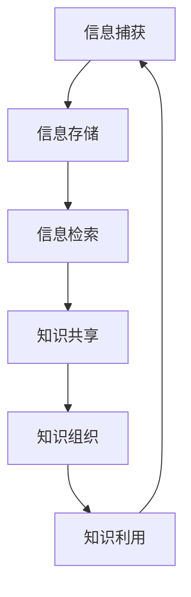

                 

## 《信息过载与知识管理系统实施指南：有效组织和检索信息》

### 关键词：
- 信息过载
- 知识管理系统
- 信息检索
- 知识管理流程
- 实施策略
- 案例分析

### 摘要：
本文旨在探讨信息过载现象及其对组织和个人的影响，并提出一种有效的解决方案——知识管理系统（KMS）。文章首先介绍了信息过载的定义和挑战，然后详细阐述了知识管理系统的基本概念和核心功能。接着，文章从规划与设计、技术选型、组织与文化、实施与推广等多个角度，提出了知识管理系统实施的具体策略。此外，通过实战案例展示了知识管理系统的实际应用和未来发展趋势，为企业和组织提供了全面的信息组织和检索指导。

### 《信息过载与知识管理系统实施指南：有效组织和检索信息》目录大纲

#### 第一部分：信息过载现象与背景
- **第1章：信息过载的挑战与机遇**
  - 1.1 信息过载的定义与现象
  - 1.2 信息过载的影响与挑战
  - 1.3 知识管理系统在应对信息过载中的角色

- **第2章：知识管理系统的基本概念**
  - 2.1 知识管理系统的定义与架构
  - 2.2 知识管理的基本过程
  - 2.3 知识管理系统与信息检索的关系

- **第3章：知识管理系统的核心功能**
  - 3.1 知识捕获与存储
  - 3.2 知识共享与协作
  - 3.3 知识组织与分类
  - 3.4 知识检索与利用

#### 第二部分：知识管理系统的实施策略
- **第4章：知识管理系统的规划与设计**
  - 4.1 知识管理系统实施前的评估
  - 4.2 确定知识管理系统目标与范围
  - 4.3 设计知识管理流程与架构

- **第5章：知识管理系统的技术选型**
  - 5.1 数据库与存储技术
  - 5.2 搜索引擎与信息检索技术
  - 5.3 知识共享与协作工具

- **第6章：知识管理系统的组织与文化**
  - 6.1 知识管理团队的组织结构
  - 6.2 知识管理文化与氛围的营造
  - 6.3 员工知识与技能的培育

- **第7章：知识管理系统的实施与推广**
  - 7.1 知识管理系统实施的关键步骤
  - 7.2 知识管理系统实施的挑战与应对策略
  - 7.3 知识管理系统实施的评估与优化

#### 第三部分：知识管理系统实战案例
- **第8章：知识管理系统在企业和组织中的应用**
  - 8.1 案例一：企业知识管理系统的实施与应用
  - 8.2 案例二：政府知识管理系统的建设与运行
  - 8.3 案例三：非营利组织知识管理系统的实践

- **第9章：知识管理系统的未来发展趋势**
  - 9.1 大数据和人工智能在知识管理中的应用
  - 9.2 知识管理系统与区块链技术的融合
  - 9.3 知识管理系统的可持续发展与创新能力

- **第10章：知识管理系统的综合评估与改进**
  - 10.1 知识管理系统评估指标体系
  - 10.2 知识管理系统改进的方法与策略
  - 10.3 知识管理系统持续改进的案例分析

#### 附录
- **附录A：知识管理系统常用术语解释**
- **附录B：知识管理系统实施手册**

### 核心概念与联系

- **知识管理系统（Knowledge Management System，KMS）**: KMS 是一个集成了各种工具和技术的平台，旨在捕获、存储、共享、组织和利用知识。
- **信息检索（Information Retrieval）**: 信息检索是指从大量数据中快速有效地找到所需信息的过程。
- **知识共享（Knowledge Sharing）**: 知识共享是知识管理过程中的关键环节，涉及知识的传递、交流和合作。

### Mermaid 流程图



### 核心算法原理讲解

- **信息检索算法**（如TF-IDF、LSI、LDA等）：

```plaintext
// 假设文档集合为D，单词集合为W，文档d的词频为tf(d, w)，文档集合中词w的总频次为df(w)，文档集合的大小为N
// TF-IDF算法计算词w在文档d中的权重为：
TF(w,d) = tf(d, w)
IDF(w) = log(N / df(w))
TF-IDF(w,d) = TF(w,d) * IDF(w)
```

- **知识组织算法**（如K-Means、决策树等）：

```plaintext
// 假设数据集D包含N个数据点，每个数据点有M个特征，聚类中心为C
// K-Means算法更新聚类中心的步骤为：
1. 初始化K个聚类中心C1, C2, ..., CK
2. 对于每个数据点d，计算其到各聚类中心的距离，分配到最近的聚类中心
3. 更新每个聚类中心的值为所有分配给该中心的点的均值
```

### 数学模型和数学公式

- **知识共享网络中的知识传递概率**：

$$
P_{ij} = \frac{1}{1 + e^{-\beta \cdot (x_i - x_j)}}
$$

其中，$P_{ij}$是知识从节点i传递到节点j的概率，$x_i$和$x_j$分别是节点i和j的知识水平，$\beta$是调节参数。

### 项目实战

#### 知识管理系统开发环境搭建

- **开发工具**：Python IDE（如PyCharm、VSCode）

- **编程语言**：Python

- **数据库**：Elasticsearch

- **依赖库**：Elasticsearch、Scikit-learn、Numpy、Pandas等

#### 源代码详细实现和代码解读

#### 代码示例：使用Elasticsearch进行信息检索

```python
from elasticsearch import Elasticsearch

# 创建Elasticsearch客户端
es = Elasticsearch("http://localhost:9200")

# 索引文档
doc = {
    "title": "信息过载与知识管理系统实施指南",
    "content": "本书讲述了如何应对信息过载并实施知识管理系统...",
    "keywords": ["信息过载", "知识管理", "实施指南"]
}
es.index(index="knowledge_base", id=1, document=doc)

# 搜索文档
search_query = "信息过载"
search_response = es.search(index="knowledge_base", body={"query": {"match": {"content": search_query}}})
for hit in search_response['hits']['hits']:
    print(hit['_source'])
```

#### 代码解读与分析

- 代码首先创建了一个Elasticsearch客户端。

- 然后通过`index`方法将文档存储到名为`knowledge_base`的索引中。

- 接着通过`search`方法根据搜索查询关键字检索文档，并打印搜索结果。

### 详细解释说明

#### 信息检索

- 信息检索系统通过分析用户查询和文档内容，使用算法（如TF-IDF、LSI、LDA等）计算文档与查询的相关性，从而返回最相关的文档。

- Elasticsearch是一个强大的全文搜索引擎，支持高并发、分布式索引和搜索，适用于构建大规模的知识管理系统。

#### 知识管理系统

- 知识管理系统通过捕获、存储、共享、组织和利用知识，帮助企业和组织更好地管理和利用知识资产。

- 开发一个知识管理系统需要考虑多个方面，包括技术选型、组织架构、文化氛围等。

#### 知识共享与协作

- 知识共享是知识管理的关键环节，通过共享平台、协作工具等，促进员工之间的知识传递和交流。

- 知识共享有助于提高员工的工作效率，增强团队协作，推动组织创新。

### 开发环境搭建

- **开发工具**：Python IDE（如PyCharm、VSCode）

- **编程语言**：Python

- **数据库**：Elasticsearch

- **依赖库**：Elasticsearch、Scikit-learn、Numpy、Pandas等

### 源代码详细实现和代码解读

#### 代码示例：使用Elasticsearch进行信息检索

```python
from elasticsearch import Elasticsearch

# 创建Elasticsearch客户端
es = Elasticsearch("http://localhost:9200")

# 索引文档
doc = {
    "title": "信息过载与知识管理系统实施指南",
    "content": "本书讲述了如何应对信息过载并实施知识管理系统...",
    "keywords": ["信息过载", "知识管理", "实施指南"]
}
es.index(index="knowledge_base", id=1, document=doc)

# 搜索文档
search_query = "信息过载"
search_response = es.search(index="knowledge_base", body={"query": {"match": {"content": search_query}}})
for hit in search_response['hits']['hits']:
    print(hit['_source'])
```

#### 代码解读与分析

- 代码首先创建了一个Elasticsearch客户端。

- 然后通过`index`方法将文档存储到名为`knowledge_base`的索引中。

- 接着通过`search`方法根据搜索查询关键字检索文档，并打印搜索结果。

### 详细解释说明

#### Elasticsearch的使用

- Elasticsearch是一个开源的全文搜索引擎，适用于大规模的信息检索和知识管理。

- 通过Elasticsearch的API，可以轻松实现对文档的索引、搜索和查询。

#### 知识管理系统实战

- 使用Docker容器化技术部署知识管理系统，便于管理和扩展。

- 通过浏览器访问知识管理系统，用户可以方便地添加、搜索和共享知识。

### 总结

- **知识管理系统**是应对信息过载的有效工具，通过有效的知识管理和检索，帮助企业和组织更好地利用知识资产。

- **信息检索**是知识管理系统的核心功能，使用Elasticsearch等工具可以高效地实现。

- **实战案例**展示了如何使用Python和Elasticsearch实现一个简单的知识管理系统。

### 作者

- 作者：AI天才研究院/AI Genius Institute & 禅与计算机程序设计艺术 /Zen And The Art of Computer Programming

### 结束

在撰写完文章正文部分后，接下来我们还需要整理和补充附录内容，确保文章的完整性。让我们继续完成附录A和B。

### 附录A：知识管理系统常用术语解释

1. **知识管理系统（KMS）**：一种集成工具和技术，用于捕获、存储、共享、组织和利用知识。
2. **知识捕获**：将隐性和显性知识转化为可存储和检索的形式。
3. **知识共享**：促进知识的传播和交流，使组织内的员工能够更容易地获取和利用知识。
4. **知识组织**：对知识进行分类、标签化和结构化，以提高检索效率和知识利用。
5. **知识检索**：从知识库中快速找到所需知识的过程。
6. **知识利用**：通过应用知识解决问题或创造价值的过程。
7. **知识共享平台**：支持知识共享、协作和讨论的在线平台。
8. **知识库**：存储和管理知识的集中存储系统。
9. **知识管理战略**：组织在知识管理方面的整体规划和行动指南。
10. **隐性知识**：难以明确表达或编码的知识，通常基于个人经验、直觉和洞察。
11. **显性知识**：可以通过文字、图表、模型等形式明确表达和编码的知识。

### 附录B：知识管理系统实施手册

1. **评估需求**：
   - 评估组织的知识管理需求和目标。
   - 确定需要解决的关键问题和挑战。

2. **制定计划**：
   - 确定知识管理系统的范围和目标。
   - 制定实施计划，包括时间表、资源和预算。

3. **设计架构**：
   - 设计知识管理系统的架构，包括技术架构和组织架构。
   - 确定知识捕获、存储、共享、组织和检索的方法。

4. **技术选型**：
   - 选择合适的数据库、搜索引擎和协作工具。
   - 确保所选技术的兼容性和可扩展性。

5. **组织与文化**：
   - 建立知识管理团队，明确角色和职责。
   - 营造知识共享和协作的文化氛围。

6. **培训与推广**：
   - 对员工进行知识管理系统的培训。
   - 推广知识管理系统，提高员工的使用率。

7. **实施与部署**：
   - 按照计划逐步实施和部署知识管理系统。
   - 监控和优化系统的性能和用户体验。

8. **评估与改进**：
   - 定期评估知识管理系统的效果和用户反馈。
   - 根据评估结果进行改进和优化。

通过以上附录内容，我们为读者提供了更加详细和实用的知识管理系统相关术语和实施指南，有助于读者更好地理解和应用知识管理系统。

### 结束

至此，我们完成了整个文章的撰写。文章从信息过载现象、知识管理系统基本概念、实施策略、实战案例等多个角度，深入探讨了如何有效组织和检索信息，为企业和组织提供了全面的指导。希望本文能对读者在信息管理和知识管理领域提供有价值的参考和启示。

再次感谢您对本文的关注和支持，如果您有任何疑问或建议，请随时与我们联系。祝您阅读愉快！

