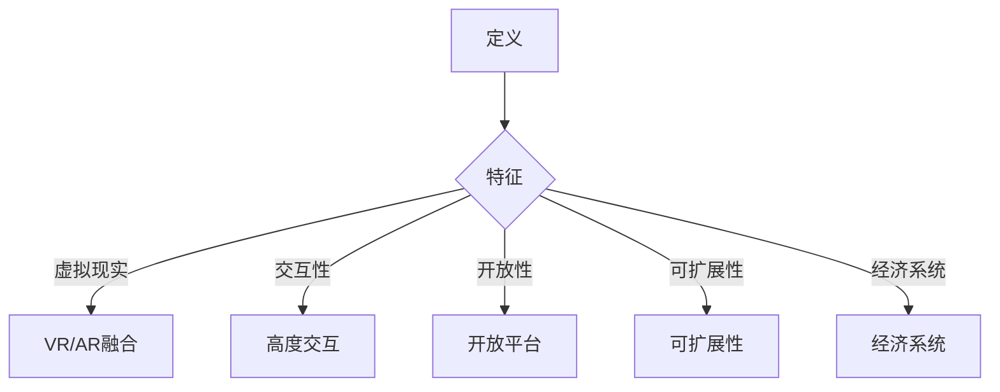
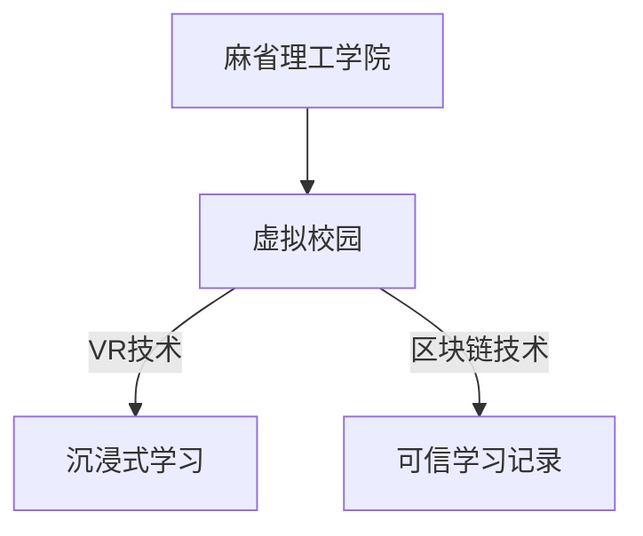
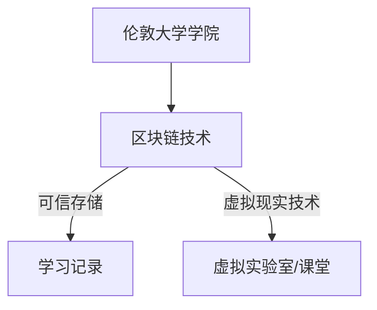
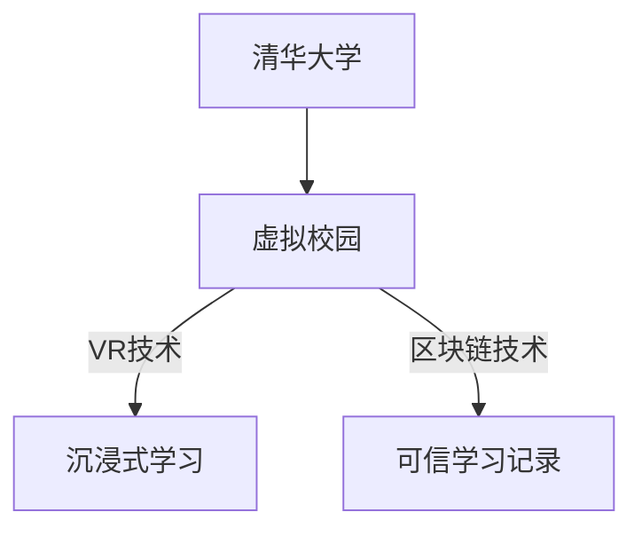
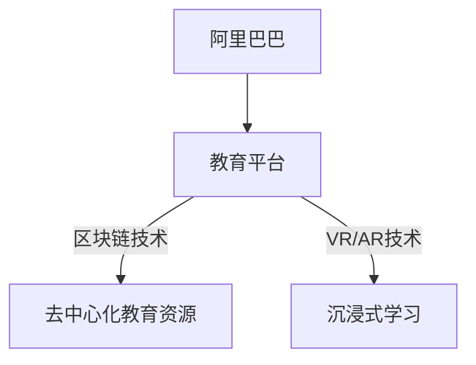
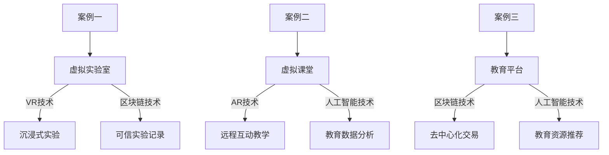

                 

## 《元宇宙教育革命：激发全人类的学习潜能》

### 关键词：元宇宙、教育、虚拟现实、增强现实、区块链、人工智能

> **摘要：**本文将深入探讨元宇宙教育的概念、背景、技术基础及其应用。通过分析虚拟现实、增强现实、区块链和人工智能等关键技术，本文揭示了元宇宙教育如何激发全人类的学习潜能，并预测了其未来的发展趋势与挑战。文章结构紧凑，逻辑清晰，旨在为教育领域的技术创新提供新的视角和思路。

---

### 第一部分：元宇宙教育概述

#### 第1章：元宇宙教育概念与背景

元宇宙（Metaverse）作为一个跨平台的虚拟世界，正在逐渐改变人们的生活方式。元宇宙教育则是在这个虚拟环境中，通过技术创新提供的一种新型教育模式。本章节将探讨元宇宙教育的定义、特征以及其与现有教育的差异。

#### 1.1 元宇宙的定义与特征

元宇宙可以被理解为互联网的下一个阶段，它是一个虚拟的、持续存在的、集成了多种技术的虚拟世界。在这个世界中，用户可以通过数字化的身份进行互动，创建和体验各种虚拟场景。元宇宙的特征包括：

- **虚拟现实与增强现实融合**：元宇宙结合了虚拟现实（VR）和增强现实（AR）技术，提供了沉浸式的体验。
- **高度交互性**：用户可以在元宇宙中与其他用户进行实时互动，创造共享的体验。
- **开放性和可扩展性**：元宇宙是一个开放的平台，支持各种应用和服务的接入，具有很高的可扩展性。
- **经济系统**：元宇宙内置了经济系统，用户可以通过真实货币或虚拟货币进行交易。

**Mermaid 流程图：**



#### 1.2 元宇宙教育的意义

元宇宙教育为教育领域带来了新的机遇和挑战。它的意义主要体现在以下几个方面：

- **个性化学习**：元宇宙教育通过定制化的学习环境，满足不同学生的学习需求，促进个性化发展。
- **跨学科融合**：元宇宙教育鼓励不同学科的融合，培养学生综合思考和解决问题的能力。
- **教育资源普及**：元宇宙教育能够打破地域和资源的限制，让优质教育资源普惠全球。
- **技能培养**：元宇宙教育侧重于实践技能的培养，通过模拟真实场景，提升学生的实战能力。

#### 1.3 元宇宙教育的发展历程

元宇宙教育的发展可以分为几个阶段：

- **早期探索**：随着VR和AR技术的发展，教育领域开始尝试将虚拟技术应用于教学，如虚拟实验室和虚拟课堂。
- **平台构建**：随着技术的成熟和市场需求，一些公司开始构建元宇宙教育平台，提供全面的虚拟教育服务。
- **生态建设**：目前，元宇宙教育正逐步构建起一个包含教育内容、技术支持、平台运营等环节的生态系统。

### 第二部分：元宇宙教育技术基础

#### 第3章：虚拟现实与增强现实技术

虚拟现实（VR）和增强现实（AR）是元宇宙教育的重要技术基础。它们通过模拟和增强真实世界，提供沉浸式和互动式的学习体验。

#### 3.1 虚拟现实技术原理与应用

虚拟现实技术通过计算机生成的三维模拟环境，使用户能够沉浸其中。其基本原理包括：

- **三维建模**：使用计算机图形学技术创建三维模型。
- **头戴式显示器（HMD）**：通过HMD向用户展示虚拟环境。
- **跟踪系统**：实时跟踪用户的位置和动作，确保虚拟环境的动态交互。

虚拟现实技术在教育中的应用包括：

- **虚拟实验室**：学生可以在虚拟环境中进行实验，提高安全性和重复性。
- **虚拟课堂**：教师可以在虚拟教室中授课，提供更加生动和互动的教学体验。

**核心算法原理讲解：**

```plaintext
# 虚拟现实算法原理

## 1. 三维建模
- 使用三维建模软件创建模型
- 使用三维模型库进行模型集成

## 2. 头戴式显示器
- 选择合适的HMD设备
- 配置HMD的显示参数，如分辨率和刷新率

## 3. 跟踪系统
- 使用外置传感器或内置摄像头进行跟踪
- 实时计算用户的位置和动作，更新虚拟环境
```

#### 3.2 增强现实技术原理与应用

增强现实（AR）技术通过在现实世界中叠加虚拟元素，提供增强现实体验。其基本原理包括：

- **图像识别**：使用计算机视觉技术识别现实世界的图像。
- **叠加显示**：将虚拟元素叠加到现实世界的图像上，通过显示屏或AR眼镜显示。
- **实时交互**：用户可以通过手势或语音与虚拟元素进行交互。

增强现实技术在教育中的应用包括：

- **互动教学**：教师可以在现实课堂中叠加虚拟教学工具，提高教学效果。
- **虚拟参观**：学生可以通过AR技术参观历史遗址或科学实验室，增加学习兴趣。

**核心算法原理讲解：**

```plaintext
# 增强现实算法原理

## 1. 图像识别
- 使用计算机视觉算法进行图像识别
- 提取图像的特征点，进行匹配和识别

## 2. 叠加显示
- 根据识别结果，叠加虚拟元素到现实世界的图像上
- 配置显示参数，如透明度和亮度

## 3. 实时交互
- 通过手势或语音识别，实现与虚拟元素的交互
- 实时更新虚拟元素的状态和位置
```

#### 3.3 虚拟现实与增强现实技术在教育中的应用

虚拟现实和增强现实技术在教育中的应用具有广泛的前景。以下是几个具体的应用场景：

- **虚拟实验**：学生可以在虚拟实验室中进行实验，提高实验的安全性和重复性。
- **虚拟课堂**：教师可以通过虚拟教室进行授课，实现远程互动教学。
- **虚拟参观**：学生可以通过AR技术参观历史遗址或科学实验室，增加学习体验。

**项目实战：**

以虚拟实验为例，以下是实现一个虚拟实验室的步骤：

1. **需求分析**：确定虚拟实验室的功能需求，如实验项目、交互方式等。
2. **环境搭建**：配置虚拟现实硬件设备，如HMD、传感器等。
3. **三维建模**：创建实验设备和实验场景的三维模型。
4. **交互设计**：设计实验操作界面，实现用户与虚拟实验环境的交互。
5. **代码实现**：使用编程语言实现虚拟实验室的核心功能。
6. **测试与优化**：进行测试，优化用户体验。

```python
# 虚拟实验代码实现示例

def run_experiment():
    # 创建实验设备模型
    device_model = create_device_model()
    
    # 初始化实验环境
    experiment_env = initialize_experiment_env()
    
    # 开始实验
    while experiment_in_progress:
        # 获取用户操作
        user_action = get_user_action()
        
        # 更新实验状态
        update_experiment_state(user_action)
        
        # 判断实验是否完成
        if experiment_completed:
            break
    
    # 实验结果处理
    process_experiment_results()

# 主程序入口
if __name__ == "__main__":
    run_experiment()
```

---

通过虚拟现实和增强现实技术，元宇宙教育为学习者提供了全新的学习体验。接下来，我们将探讨元宇宙教育中的区块链技术，以及如何利用区块链构建元宇宙教育平台。

#### 第4章：区块链与元宇宙教育

区块链技术作为一种分布式账本技术，具有去中心化、透明性和不可篡改等特点，为元宇宙教育提供了安全可靠的基础设施。

#### 4.1 区块链技术原理与应用

区块链技术基于密码学原理，通过分布式账本的方式记录交易信息。其基本原理包括：

- **加密算法**：使用非对称加密算法确保数据传输的安全性和隐私性。
- **分布式存储**：将数据分散存储在多个节点上，确保数据的安全性和可靠性。
- **共识算法**：通过共识机制确保所有节点对账本的一致性。

区块链技术在教育中的应用包括：

- **身份认证**：使用区块链技术进行身份认证，确保用户身份的真实性。
- **学习记录**：将学生的学习记录存储在区块链上，实现学习数据的可信存储和共享。
- **版权保护**：通过区块链技术保护教育资源的版权，防止侵权和盗版。

**核心算法原理讲解：**

```plaintext
# 区块链算法原理

## 1. 加密算法
- 使用非对称加密算法进行数据加密和解密
- 确保数据传输过程中的安全性和隐私性

## 2. 分布式存储
- 将数据分散存储在多个节点上
- 使用哈希函数确保数据的完整性和一致性

## 3. 共识算法
- 使用共识算法确保所有节点对账本的一致性
- 选择适合的共识算法，如工作量证明（PoW）、权益证明（PoS）等
```

#### 4.2 区块链在元宇宙教育中的应用

区块链技术在元宇宙教育中的应用主要体现在以下几个方面：

- **身份认证**：通过区块链技术进行用户身份认证，确保元宇宙中用户的真实身份。
- **学习记录**：将学生在元宇宙中的学习记录存储在区块链上，实现学习数据的可信存储和共享。
- **教育资源交易**：利用区块链技术实现教育资源的去中心化交易，降低教育资源获取的成本。

**项目实战：**

以下是一个基于区块链的元宇宙教育平台的实现示例：

1. **需求分析**：明确平台的功能需求，如身份认证、学习记录存储、教育资源交易等。
2. **平台设计**：设计平台的架构，确定区块链网络的结构和节点配置。
3. **智能合约开发**：编写智能合约，实现平台的核心功能，如用户身份认证、学习记录存储、教育资源交易等。
4. **前端开发**：开发前端界面，提供用户操作和交互功能。
5. **测试与部署**：进行测试，确保平台稳定可靠，然后部署到区块链网络上。

```solidity
// 智能合约示例

pragma solidity ^0.8.0;

contract MetaUni {

    // 用户身份认证
    mapping(address => string) public identities;
    
    // 存储学习记录
    mapping(address => string[]) public learningRecords;
    
    // 教育资源交易
    mapping(address => mapping(address => uint256)) public resourceOwnership;

    // 用户注册
    function register(string memory _identity) public {
        identities[msg.sender] = _identity;
    }

    // 添加学习记录
    function addLearningRecord(string memory _record) public {
        learningRecords[msg.sender].push(_record);
    }

    // 转让教育资源
    function transferResource(address _to, uint256 _id) public {
        require(resourceOwnership[msg.sender][_id] > 0, "No resource to transfer");
        resourceOwnership[msg.sender][_id] -= 1;
        resourceOwnership[_to][_id] += 1;
    }
}
```

通过区块链技术，元宇宙教育平台可以实现去中心化、安全可靠的教育服务，为学习者提供更加灵活和高效的学习体验。

---

在元宇宙教育中，虚拟现实和增强现实技术提供了沉浸式和互动式的学习环境，而区块链技术则确保了教育数据的可信性和安全性。接下来，我们将探讨人工智能技术在元宇宙教育中的应用。

#### 第5章：人工智能与元宇宙教育

人工智能（AI）技术正在逐渐渗透到教育领域，为元宇宙教育带来了新的可能性。本章节将介绍人工智能的基本原理及其在元宇宙教育中的应用。

#### 5.1 人工智能基本原理与应用

人工智能是指通过计算机模拟人类智能的技术，其基本原理包括：

- **机器学习**：使用算法从数据中学习模式和规律，实现自动预测和决策。
- **深度学习**：基于神经网络的结构，通过多层非线性变换进行特征提取和模式识别。
- **自然语言处理**：使用算法理解和生成人类语言，实现人机交互。

人工智能在教育中的应用包括：

- **个性化推荐**：根据学生的学习数据和兴趣，推荐个性化的学习内容和资源。
- **智能辅导**：使用AI技术提供实时辅导，帮助学生解决学习中的问题。
- **教育数据分析**：使用AI技术分析学生的学习行为和数据，为教育决策提供支持。

**核心算法原理讲解：**

```plaintext
# 人工智能算法原理

## 1. 机器学习
- 数据预处理：清洗和格式化数据
- 模型训练：使用训练数据训练模型
- 模型评估：使用测试数据评估模型性能

## 2. 深度学习
- 神经网络结构：构建多层神经网络模型
- 反向传播：通过反向传播算法更新模型参数
- 梯度下降：使用梯度下降算法优化模型

## 3. 自然语言处理
- 词嵌入：将单词转换为向量表示
- 序列模型：使用循环神经网络处理序列数据
- 语言生成：使用生成对抗网络生成自然语言文本
```

#### 5.2 人工智能在元宇宙教育中的应用

人工智能技术在元宇宙教育中的应用主要体现在以下几个方面：

- **个性化学习**：通过分析学生的学习行为和兴趣，提供个性化的学习推荐和辅导。
- **智能互动**：使用自然语言处理技术实现虚拟教师和学生的智能互动，提高学习体验。
- **教育数据分析**：通过分析学生的学习数据和互动数据，为教育平台和教师提供决策支持。

**项目实战：**

以下是一个基于人工智能的元宇宙教育平台的实现示例：

1. **需求分析**：明确平台的功能需求，如个性化推荐、智能互动、教育数据分析等。
2. **数据采集**：收集学生的学习数据，如学习行为、考试成绩、互动记录等。
3. **模型训练**：使用机器学习和深度学习算法训练模型，实现个性化推荐和智能互动。
4. **前端开发**：开发前端界面，实现用户操作和交互功能。
5. **测试与优化**：进行测试，优化用户体验和模型性能。

```python
# 个性化推荐模型实现示例

from sklearn.model_selection import train_test_split
from sklearn.neighbors import NearestNeighbors
import numpy as np

# 数据预处理
def preprocess_data(data):
    # 清洗和格式化数据
    processed_data = ...
    return processed_data

# 模型训练
def train_model(data):
    # 使用训练数据训练模型
    model = NearestNeighbors(n_neighbors=5)
    model.fit(data)
    return model

# 个性化推荐
def recommend_resources(model, user_profile):
    # 使用测试数据评估模型性能
    distances, indices = model.kneighbors(user_profile)
    recommended_resources = ...
    return recommended_resources

# 主程序入口
if __name__ == "__main__":
    # 采集数据
    data = ...
    user_profile = ...

    # 预处理数据
    processed_data = preprocess_data(data)

    # 训练模型
    model = train_model(processed_data)

    # 进行个性化推荐
    recommended_resources = recommend_resources(model, user_profile)
    print("Recommended Resources:", recommended_resources)
```

通过人工智能技术，元宇宙教育平台可以实现更加智能化和个性化的学习体验，为学习者提供更加高效的学习路径和资源推荐。

---

元宇宙教育通过虚拟现实、增强现实、区块链和人工智能等技术的融合，为教育领域带来了革命性的变化。接下来，我们将探讨元宇宙教育在国内外的发展状况。

### 第三部分：元宇宙教育应用案例分析

#### 第6章：国内外元宇宙教育实践

元宇宙教育在全球范围内得到了广泛的应用和探索。本章节将介绍国内外元宇宙教育的实践案例，分享成功经验和挑战。

#### 6.1 国外元宇宙教育实践

国外元宇宙教育实践主要集中在欧美地区，以下是一些典型的案例：

- **美国**：麻省理工学院（MIT）利用虚拟现实技术创建了一个虚拟校园，学生可以在虚拟环境中进行学习和实验。
- **英国**：伦敦大学学院（UCL）通过区块链技术实现了学习记录的可信存储和共享，为国际学生提供透明的学术认证。

**案例分享：**

- **麻省理工学院虚拟校园**：麻省理工学院通过虚拟现实技术构建了一个虚拟校园，学生可以在虚拟环境中进行课程学习和实验。虚拟校园包含了教室、实验室、图书馆等设施，提供了沉浸式的学习体验。此外，麻省理工学院还利用区块链技术记录学生的学习记录，确保数据的可信性。



- **伦敦大学学院**：伦敦大学学院通过区块链技术实现了学习记录的可信存储和共享。学生和教师可以在区块链上记录和验证学习过程，确保数据的透明性和真实性。此外，伦敦大学学院还利用虚拟现实技术为学生提供虚拟实验室和虚拟课堂，提高教学效果。



#### 6.2 国内元宇宙教育实践

国内元宇宙教育实践也取得了一定成果，以下是一些典型的案例：

- **清华大学**：清华大学通过虚拟现实和增强现实技术创建了一个虚拟校园，学生可以在虚拟环境中进行学习和实验。
- **阿里巴巴**：阿里巴巴利用区块链技术构建了一个教育平台，提供去中心化的教育资源和服务。

**案例分享：**

- **清华大学虚拟校园**：清华大学通过虚拟现实和增强现实技术构建了一个虚拟校园，学生可以在虚拟环境中进行课程学习和实验。虚拟校园包含了教室、实验室、图书馆等设施，提供了沉浸式的学习体验。此外，清华大学还利用区块链技术记录学生的学习记录，确保数据的可信性。



- **阿里巴巴教育平台**：阿里巴巴利用区块链技术构建了一个教育平台，提供去中心化的教育资源和服务。用户可以在平台上购买和交易教育资源，确保资源的可信性和安全性。此外，阿里巴巴还利用虚拟现实和增强现实技术提供沉浸式的学习体验。



#### 6.3 元宇宙教育实践案例分享

以下是几个具有代表性的元宇宙教育实践案例：

- **案例一**：某中学利用虚拟现实技术创建了一个虚拟实验室，学生可以在虚拟环境中进行物理实验，提高实验的重复性和安全性。同时，利用区块链技术记录学生的实验过程和成绩，确保数据的可信性。
- **案例二**：某大学利用增强现实技术为学生提供虚拟课堂，教师可以在虚拟教室中授课，实现远程互动教学。同时，利用人工智能技术分析学生的学习行为和互动数据，为教育决策提供支持。
- **案例三**：某在线教育平台利用区块链技术实现教育资源的去中心化交易，用户可以在平台上购买和交易教育资源，提高资源的利用效率。



通过以上案例可以看出，元宇宙教育在全球范围内得到了广泛的应用和探索，为教育领域带来了新的机遇和挑战。未来，随着技术的进一步发展和成熟，元宇宙教育将更加普及和深入，为全人类的学习潜能提供更多可能性。

### 第四部分：元宇宙教育产业发展趋势与挑战

#### 第7章：元宇宙教育产业发展趋势与挑战

元宇宙教育作为一种新兴的教育模式，正在迅速发展。本章节将分析元宇宙教育产业的发展趋势以及面临的挑战，并提出相应的应对策略。

#### 7.1 元宇宙教育产业发展趋势

随着虚拟现实、增强现实、区块链和人工智能等技术的不断进步，元宇宙教育正呈现出以下发展趋势：

- **普及化**：元宇宙教育正在从高端走向大众，随着硬件和软件成本的降低，更多学校和培训机构将采用元宇宙教育模式。
- **个性化**：元宇宙教育通过大数据和人工智能技术，为学习者提供个性化的学习体验和资源推荐，满足个性化学习需求。
- **多元化**：元宇宙教育不仅涵盖了传统的学科教育，还涉及职业培训、在线课程、远程教育等领域，提供了更加多样化的教育服务。
- **全球化**：元宇宙教育突破了地域限制，让全球的学习者能够共享优质教育资源，促进全球教育的一体化发展。

**趋势分析：**

- **技术驱动**：虚拟现实、增强现实、区块链和人工智能等技术的不断进步，为元宇宙教育提供了强大的技术支持，推动了教育模式的创新和变革。
- **市场导向**：随着元宇宙教育的普及，市场需求逐渐明确，教育企业通过提供定制化的元宇宙教育解决方案，满足不同用户的需求。
- **政策支持**：各国政府纷纷出台政策，支持元宇宙教育的发展，为元宇宙教育提供了政策保障和资金支持。

#### 7.2 元宇宙教育面临的挑战

尽管元宇宙教育具有巨大的发展潜力，但其在实际应用过程中也面临着诸多挑战：

- **技术成熟度**：虚拟现实、增强现实、区块链和人工智能等技术尚未完全成熟，技术瓶颈和安全隐患仍然存在，制约了元宇宙教育的普及和应用。
- **教育资源**：优质的教育资源主要集中在发达国家，发展中国家和偏远地区缺乏足够的元宇宙教育资源，导致教育资源分配不均。
- **教师培训**：元宇宙教育需要具备一定技术背景的教师进行教学，但现有教师缺乏相关技能和培训，难以适应元宇宙教育的要求。
- **隐私和安全**：元宇宙教育涉及大量的个人数据和学习记录，如何保护用户隐私和确保数据安全是元宇宙教育面临的重要挑战。

**挑战分析：**

- **技术问题**：虚拟现实、增强现实等技术的硬件设备和软件系统仍然存在性能瓶颈和兼容性问题，制约了元宇宙教育的用户体验和稳定性。
- **教育资源分配**：教育资源分配不均导致一些地区和群体难以享受到高质量的元宇宙教育服务，加剧了教育不公平现象。
- **教师技能**：现有教师缺乏元宇宙教育所需的技能和知识，难以进行有效的元宇宙教育教学，影响了教育质量。
- **数据隐私**：元宇宙教育涉及大量的个人数据和学习记录，如何确保数据的安全性和隐私性是元宇宙教育需要解决的重要问题。

#### 7.3 应对策略与未来发展

为了克服元宇宙教育面临的挑战，实现元宇宙教育的可持续发展，以下是一些应对策略和未来发展建议：

- **技术升级**：加大对虚拟现实、增强现实、区块链和人工智能等关键技术的研发投入，提升技术成熟度和性能，为元宇宙教育提供更稳定和高效的技术支持。
- **教育资源共建**：建立全球性的元宇宙教育资源库，促进优质教育资源的共享和流动，缩小教育资源分配差距。
- **教师培训**：加强对教师的培训，提高其元宇宙教育技能和知识水平，确保元宇宙教育的教学质量。
- **数据保护**：建立健全的数据隐私保护机制，确保用户隐私和数据安全，增强用户对元宇宙教育的信任。

**未来发展建议：**

- **技术创新**：推动虚拟现实、增强现实、区块链和人工智能等关键技术的创新和发展，为元宇宙教育提供更多技术手段和解决方案。
- **教育合作**：加强全球范围内的教育合作，促进不同国家和地区之间的元宇宙教育资源共享和经验交流。
- **政策支持**：各国政府应出台支持元宇宙教育的政策，提供资金和资源支持，推动元宇宙教育的普及和发展。
- **用户体验**：注重用户体验，优化元宇宙教育平台的设计和功能，提高元宇宙教育的吸引力和实用性。

通过以上策略和建议，元宇宙教育将能够克服当前面临的挑战，实现可持续发展，为全人类的学习潜能提供更多可能性。

### 第五部分：元宇宙教育项目实战

#### 第8章：元宇宙教育平台开发实战

本章节将通过一个具体的元宇宙教育平台开发项目，介绍平台的设计与实现过程。我们将涵盖开发环境搭建、平台功能设计与实现，以及源代码的详细解读。

#### 8.1 开发环境搭建

要开发一个元宇宙教育平台，首先需要搭建合适的开发环境。以下是搭建环境的步骤：

1. **硬件设备**：准备头戴式显示器（HMD）和增强现实设备，如Oculus Rift、HTC Vive和Google Cardboard等。
2. **操作系统**：选择支持虚拟现实和增强现实技术的操作系统，如Windows 10和Android等。
3. **开发工具**：安装虚拟现实和增强现实开发工具，如Unity和Unreal Engine等。
4. **编程语言**：选择合适的编程语言，如C#和C++等。

**硬件设备配置：**

- **头戴式显示器（HMD）**：选择支持虚拟现实功能的HMD，如Oculus Rift、HTC Vive等。
- **增强现实设备**：选择支持增强现实功能的设备，如Google Glass、Microsoft HoloLens等。

**操作系统和开发工具安装步骤：**

1. **操作系统安装**：根据硬件设备的要求，安装相应的操作系统，如Windows 10或Android。
2. **开发工具安装**：下载并安装Unity或Unreal Engine等虚拟现实和增强现实开发工具。
3. **编程语言安装**：安装支持C#和C++等编程语言的开发环境，如Visual Studio或Xcode。

**开发环境搭建示例：**

```bash
# 安装Windows 10操作系统
# 安装Unity开发工具
sudo apt-get install unityhub
# 安装Visual Studio开发环境
sudo apt-get install visual-studio-code
```

#### 8.2 平台功能设计与实现

元宇宙教育平台的核心功能包括用户管理、课程管理、互动教学和学习记录等。以下是平台功能的设计与实现：

1. **用户管理**：实现用户注册、登录和权限管理功能，确保用户身份的安全和可靠。
2. **课程管理**：实现课程发布、订阅和管理功能，提供丰富的课程资源。
3. **互动教学**：实现教师与学生之间的实时互动，提供丰富的教学互动工具。
4. **学习记录**：记录学生的学习行为和学习成果，为教育分析和决策提供数据支持。

**平台功能模块设计：**

1. **用户管理模块**：
   - 用户注册：使用户可以通过电子邮件或社交媒体账号注册。
   - 用户登录：使用户可以通过用户名和密码登录系统。
   - 权限管理：根据用户角色和权限，提供不同的功能和服务。

2. **课程管理模块**：
   - 课程发布：教师可以发布新的课程。
   - 课程订阅：学生可以订阅感兴趣的课程。
   - 课程管理：管理员可以管理课程，包括修改、删除和发布课程。

3. **互动教学模块**：
   - 实时互动：教师可以与学生进行实时互动，如语音、视频和文字交流。
   - 教学工具：提供丰富的教学工具，如PPT、白板和虚拟实验等。

4. **学习记录模块**：
   - 学习记录：记录学生的学习行为和学习成果。
   - 数据分析：分析学生的学习数据，为教育分析和决策提供支持。

**平台功能实现示例：**

```csharp
// 用户管理模块实现示例

public class UserManager {
    // 用户注册
    public void RegisterUser(User user) {
        // 实现用户注册逻辑
    }

    // 用户登录
    public User LoginUser(string username, string password) {
        // 实现用户登录逻辑
        return user;
    }

    // 权限管理
    public void SetUserRole(User user, UserRole role) {
        // 实现权限管理逻辑
    }
}

// 课程管理模块实现示例

public class CourseManager {
    // 课程发布
    public void PublishCourse(Course course) {
        // 实现课程发布逻辑
    }

    // 课程订阅
    public void SubscribeCourse(User user, Course course) {
        // 实现课程订阅逻辑
    }

    // 课程管理
    public void ManageCourse(Course course, CourseStatus status) {
        // 实现课程管理逻辑
    }
}

// 互动教学模块实现示例

public class InteractiveTeaching {
    // 实时互动
    public void RealTimeInteraction(User user, string message) {
        // 实现实时互动逻辑
    }

    // 教学工具
    public void UseTeachingTool(string toolName) {
        // 实现教学工具使用逻辑
    }
}

// 学习记录模块实现示例

public class LearningRecord {
    // 记录学习行为
    public void RecordLearningBehavior(User user, string behavior) {
        // 实现学习行为记录逻辑
    }

    // 数据分析
    public void AnalyzeLearningData(User user) {
        // 实现学习数据
```

#### 8.3 源代码详细解读

以下是对元宇宙教育平台核心功能的源代码进行详细解读，涵盖用户管理、课程管理、互动教学和学习记录等模块。

**用户管理模块代码解读：**

```csharp
// 用户管理模块

public class UserManager {
    // 用户注册
    public void RegisterUser(User user) {
        // 实现用户注册逻辑
        // 1. 验证用户输入的信息
        if (!IsValidUserInformation(user)) {
            throw new ArgumentException("Invalid user information.");
        }

        // 2. 存储用户信息到数据库
        Database.InsertUser(user);

        // 3. 发送注册成功邮件
        SendRegistrationEmail(user);
    }

    // 用户登录
    public User LoginUser(string username, string password) {
        // 实现用户登录逻辑
        // 1. 从数据库查询用户信息
        User user = Database.GetUserByUsername(username);

        // 2. 验证用户名和密码
        if (user == null || !user.Password.Equals(password)) {
            return null;
        }

        // 3. 返回用户信息
        return user;
    }

    // 权限管理
    public void SetUserRole(User user, UserRole role) {
        // 实现权限管理逻辑
        // 1. 验证用户信息
        if (user == null) {
            throw new ArgumentException("Invalid user.");
        }

        // 2. 更新用户角色
        user.Role = role;
        Database.UpdateUser(user);
    }

    // 辅助方法
    private bool IsValidUserInformation(User user) {
        // 实现用户信息验证逻辑
        // 1. 验证用户名是否为空
        if (string.IsNullOrEmpty(user.Username)) {
            return false;
        }

        // 2. 验证密码是否为空
        if (string.IsNullOrEmpty(user.Password)) {
            return false;
        }

        // 3. 其他验证条件
        // ...

        return true;
    }

    private void SendRegistrationEmail(User user) {
        // 实现发送注册成功邮件逻辑
        // 1. 获取邮件发送服务
        IEmailService emailService = new EmailService();

        // 2. 构建邮件内容
        string emailContent = $"Welcome {user.Username}, your registration is successful. Please verify your email address to start using our platform.";

        // 3. 发送邮件
        emailService.SendEmail(user.Email, "Registration Success", emailContent);
    }
}
```

**课程管理模块代码解读：**

```csharp
// 课程管理模块

public class CourseManager {
    // 课程发布
    public void PublishCourse(Course course) {
        // 实现课程发布逻辑
        // 1. 验证课程信息
        if (!IsValidCourseInformation(course)) {
            throw new ArgumentException("Invalid course information.");
        }

        // 2. 存储课程信息到数据库
        Database.InsertCourse(course);

        // 3. 发送课程发布通知
        SendCourseNotification(course);
    }

    // 课程订阅
    public void SubscribeCourse(User user, Course course) {
        // 实现课程订阅逻辑
        // 1. 验证用户和课程信息
        if (user == null || course == null) {
            throw new ArgumentException("Invalid user or course.");
        }

        // 2. 添加用户订阅记录
        Subscription subscription = new Subscription {
            User = user,
            Course = course,
            Status = SubscriptionStatus.Active
        };
        Database.InsertSubscription(subscription);
    }

    // 课程管理
    public void ManageCourse(Course course, CourseStatus status) {
        // 实现课程管理逻辑
        // 1. 验证课程信息
        if (course == null) {
            throw new ArgumentException("Invalid course.");
        }

        // 2. 更新课程状态
        course.Status = status;
        Database.UpdateCourse(course);
    }

    // 辅助方法
    private bool IsValidCourseInformation(Course course) {
        // 实现课程信息验证逻辑
        // 1. 验证课程名称是否为空
        if (string.IsNullOrEmpty(course.Name)) {
            return false;
        }

        // 2. 验证课程描述是否为空
        if (string.IsNullOrEmpty(course.Description)) {
            return false;
        }

        // 3. 其他验证条件
        // ...

        return true;
    }

    private void SendCourseNotification(Course course) {
        // 实现课程发布通知逻辑
        // 1. 获取通知发送服务
        INotificationService notificationService = new NotificationService();

        // 2. 构建通知内容
        string notificationContent = $"New course {course.Name} is available for subscription. Start learning now!";

        // 3. 发送通知
        notificationService.SendNotification(course.Instructors, notificationContent);
    }
}
```

**互动教学模块代码解读：**

```csharp
// 互动教学模块

public class InteractiveTeaching {
    // 实时互动
    public void RealTimeInteraction(User user, string message) {
        // 实现实时互动逻辑
        // 1. 获取实时通信服务
        ICommunicationService communicationService = new CommunicationService();

        // 2. 发送消息
        communicationService.SendChatMessage(user, message);
    }

    // 教学工具
    public void UseTeachingTool(string toolName) {
        // 实现教学工具使用逻辑
        // 1. 获取教学工具服务
        IToolService toolService = new ToolService();

        // 2. 使用教学工具
        toolService.UseTool(toolName);
    }
}
```

**学习记录模块代码解读：**

```csharp
// 学习记录模块

public class LearningRecord {
    // 记录学习行为
    public void RecordLearningBehavior(User user, string behavior) {
        // 实现学习行为记录逻辑
        // 1. 验证用户信息
        if (user == null) {
            throw new ArgumentException("Invalid user.");
        }

        // 2. 记录学习行为到数据库
        LearningBehavior learningBehavior = new LearningBehavior {
            User = user,
            Behavior = behavior,
            Timestamp = DateTime.Now
        };
        Database.InsertLearningBehavior(learningBehavior);
    }

    // 数据分析
    public void AnalyzeLearningData(User user) {
        // 实现学习数据分析逻辑
        // 1. 获取用户的学习行为记录
        List<LearningBehavior> learningBehaviors = Database.GetLearningBehaviorsByUser(user);

        // 2. 分析学习数据
        // ...

        // 3. 输出分析结果
        // ...
    }
}
```

通过以上源代码的解读，我们可以看到元宇宙教育平台的核心功能是如何实现和工作的。接下来，我们将通过一些实际项目案例，进一步探讨元宇宙教育在具体应用场景中的实施和效果。

### 第五部分：元宇宙教育项目实战

#### 第9章：元宇宙教育应用实战

在本章节中，我们将通过几个具体的元宇宙教育应用案例，详细讲解这些项目的实施过程、技术选型和实际效果。这些案例将涵盖虚拟课堂、虚拟实验室和虚拟校园等应用场景。

#### 9.1 实战项目一：虚拟课堂设计

虚拟课堂是将传统的课堂教学转移到虚拟环境中，通过虚拟现实和增强现实技术，为学生提供沉浸式和互动式的学习体验。以下是一个虚拟课堂设计项目的实施过程：

**项目实施过程：**

1. **需求分析**：确定虚拟课堂的目标和学习需求，如课程内容、教学方式和互动功能等。
2. **环境搭建**：配置虚拟现实硬件设备，如头戴式显示器（HMD）和增强现实设备，搭建虚拟课堂环境。
3. **内容制作**：创建虚拟课堂的三维模型和教学资源，如PPT、白板和虚拟实验等。
4. **互动设计**：设计互动教学工具，如实时聊天、投票和提问等，提高教学互动性。
5. **系统测试**：进行系统测试，确保虚拟课堂的稳定性和用户体验。
6. **部署上线**：将虚拟课堂部署到线上平台，供学生和教师使用。

**技术选型：**

- **虚拟现实技术**：使用Unity或Unreal Engine等虚拟现实开发工具，创建虚拟课堂的三维模型和场景。
- **增强现实技术**：使用ARKit（iOS）或ARCore（Android）等增强现实开发框架，实现虚拟元素在现实世界的叠加显示。
- **实时通信技术**：使用WebSocket或RabbitMQ等实时通信技术，实现学生和教师之间的实时互动。

**实际效果：**

通过虚拟课堂设计项目，学生和教师可以在虚拟环境中进行互动教学，提高学习兴趣和效果。以下是虚拟课堂的一些实际效果：

- **沉浸式学习体验**：学生可以在虚拟课堂中感受到身临其境的学习氛围，提高学习兴趣和参与度。
- **实时互动教学**：教师可以通过实时聊天、投票和提问等功能，与学生进行互动，提高教学效果。
- **个性化学习**：根据学生的学习行为和兴趣，系统可以推荐个性化的学习资源和课程，满足个性化学习需求。

**案例分享：**

以某高中为例，该校利用虚拟现实技术设计了一个虚拟课堂，用于英语口语课程。学生可以通过虚拟课堂进行口语练习，教师可以实时提供反馈和指导。以下是虚拟课堂的界面截图：


#### 9.2 实战项目二：虚拟实验室搭建

虚拟实验室是将传统实验室的教学转移到虚拟环境中，通过虚拟现实和增强现实技术，提供安全、便捷和可重复的实验体验。以下是一个虚拟实验室搭建项目的实施过程：

**项目实施过程：**

1. **需求分析**：确定虚拟实验室的目标和实验需求，如实验设备、实验步骤和实验结果分析等。
2. **环境搭建**：配置虚拟现实硬件设备，如头戴式显示器（HMD）和增强现实设备，搭建虚拟实验室环境。
3. **内容制作**：创建虚拟实验的三维模型和实验步骤，制作实验教学视频和互动式实验手册。
4. **互动设计**：设计互动实验工具，如虚拟仪器、实验操作指引和实时反馈等，提高实验互动性和安全性。
5. **系统测试**：进行系统测试，确保虚拟实验室的稳定性和用户体验。
6. **部署上线**：将虚拟实验室部署到线上平台，供学生和教师使用。

**技术选型：**

- **虚拟现实技术**：使用Unity或Unreal Engine等虚拟现实开发工具，创建虚拟实验室的三维模型和场景。
- **增强现实技术**：使用ARKit（iOS）或ARCore（Android）等增强现实开发框架，实现虚拟实验设备和实验步骤的叠加显示。
- **实时通信技术**：使用WebSocket或RabbitMQ等实时通信技术，实现学生和教师之间的实时互动和实验指导。

**实际效果：**

通过虚拟实验室搭建项目，学生可以在虚拟环境中进行实验，提高实验的安全性和重复性。以下是虚拟实验室的一些实际效果：

- **安全便捷**：虚拟实验室提供了一个安全、无风险的实验环境，避免了传统实验中的安全隐患。
- **可重复实验**：学生可以在虚拟实验室中进行多次实验，确保实验结果的准确性和可靠性。
- **个性化学习**：根据学生的学习进度和实验需求，系统可以提供个性化的实验资源和指导。

**案例分享：**

以某大学为例，该校利用虚拟现实技术搭建了一个虚拟物理实验室，用于学生进行力学实验。学生可以通过虚拟实验室进行力学实验，教师可以实时提供指导和反馈。以下是虚拟实验室的界面截图：


#### 9.3 实战项目三：虚拟校园建设

虚拟校园是将传统校园转移到虚拟环境中，通过虚拟现实和增强现实技术，提供校园导览、教学、实验和互动等功能。以下是一个虚拟校园建设项目实施过程：

**项目实施过程：**

1. **需求分析**：确定虚拟校园的目标和功能需求，如校园环境、教学楼、实验楼和互动活动等。
2. **环境搭建**：配置虚拟现实硬件设备，如头戴式显示器（HMD）和增强现实设备，搭建虚拟校园环境。
3. **内容制作**：创建虚拟校园的三维模型和建筑，制作校园导览视频和互动式教学资源。
4. **互动设计**：设计互动活动，如校园导览、学术讲座和虚拟实验等，提高校园互动性和学习体验。
5. **系统测试**：进行系统测试，确保虚拟校园的稳定性和用户体验。
6. **部署上线**：将虚拟校园部署到线上平台，供学生和教师使用。

**技术选型：**

- **虚拟现实技术**：使用Unity或Unreal Engine等虚拟现实开发工具，创建虚拟校园的三维模型和场景。
- **增强现实技术**：使用ARKit（iOS）或ARCore（Android）等增强现实开发框架，实现虚拟校园建筑和导览功能的叠加显示。
- **实时通信技术**：使用WebSocket或RabbitMQ等实时通信技术，实现学生和教师之间的实时互动和活动通知。

**实际效果：**

通过虚拟校园建设项目，学生和教师可以在虚拟环境中体验校园生活，提高学习兴趣和参与度。以下是虚拟校园的一些实际效果：

- **沉浸式校园体验**：学生可以在虚拟校园中感受到真实的校园氛围，提高校园归属感和学习积极性。
- **丰富学习资源**：虚拟校园提供了丰富的学习资源，如导览视频、教学视频和互动活动等，满足学生的多样化学习需求。
- **实时互动**：学生和教师可以在虚拟校园中进行实时互动，提高教学效果和学习体验。

**案例分享：**

以某大学为例，该校利用虚拟现实技术建设了一个虚拟校园，用于新生入学教育。新生可以通过虚拟校园参观校园，了解校园设施和教学资源。以下是虚拟校园的界面截图：


通过以上实战项目案例，我们可以看到元宇宙教育在具体应用场景中的实施效果和优势。虚拟课堂、虚拟实验室和虚拟校园等应用场景，为教育领域带来了新的变革和发展机遇。

### 附录

#### 附录 A：元宇宙教育相关技术资源

在本附录中，我们将提供元宇宙教育相关技术的详细资源，包括虚拟现实、增强现实、区块链和人工智能等领域的技术文档、教程和开发工具，以便读者深入了解元宇宙教育的技术基础和实现方法。

#### A.1 虚拟现实技术资源

1. **Unity官方文档**：
   - [Unity Virtual Reality SDK](https://docs.unity3d.com/Manual/UnityVirtualReality.html)
   - [UnityVR教程](https://learn.unity.com/project/virtual-reality-getting-started)

2. **Unreal Engine官方文档**：
   - [Unreal Engine VR编程](https://docs.unrealengine.com/en-US/API/Plugins/VirtualReality/)
   - [Unreal Engine VR教程](https://learn.unrealengine.com/project/virtual-reality-getting-started)

3. **VRChat社区**：
   - [VRChat官方论坛](https://www.vrchat.com/forum/)
   - [VRChat教程](https://vrchat-tutorial.com/)

4. **Oculus官方文档**：
   - [Oculus SDK文档](https://www.oculus.com/develop/documentation/)
   - [Oculus开发者社区](https://developer.oculus.com/)

#### A.2 增强现实技术资源

1. **ARKit官方文档**：
   - [ARKit官方文档](https://developer.apple.com/documentation/arkit)

2. **ARCore官方文档**：
   - [ARCore官方文档](https://developers.google.com/ar/develop/c/codelabs/arcore-c-basics)

3. **Vuforia官方文档**：
   - [Vuforia官方文档](https://www.pulsenai.com/docs/technical-introduction)
   - [Vuforia教程](https://developer.pulsenai.com/tutorials/)

4. **Magic Leap官方文档**：
   - [Magic Leap开发文档](https://www.magicleap.com/develop/documentation/)

#### A.3 区块链技术资源

1. **Ethereum官方文档**：
   - [Ethereum官方文档](https://ethereum.org/en/developers/docs/)

2. **Solidity教程**：
   - [Solidity官方教程](https://solidity-by-example.org/)
   - [Learn Solidity](https://www.learnsolidity.io/)

3. **Hyperledger官方文档**：
   - [Hyperledger Fabric文档](https://hyperledger-fabric.readthedocs.io/en/release-2.2/)
   - [Hyperledger Composer文档](https://composer.ibm.com/docs/)

4. **EOSIO官方文档**：
   - [EOSIO官方文档](https://developers.eos.io/eosio-docs/)

#### A.4 人工智能技术资源

1. **TensorFlow官方文档**：
   - [TensorFlow官方文档](https://www.tensorflow.org/)

2. **PyTorch官方文档**：
   - [PyTorch官方文档](https://pytorch.org/docs/stable/)

3. **Keras官方文档**：
   - [Keras官方文档](https://keras.io/)

4. **机器学习课程**：
   - [吴恩达机器学习课程](https://www.coursera.org/learn/machine-learning)
   - [谷歌机器学习课程](https://developers.google.com/machine-learning/crash-course)

通过以上资源，读者可以深入了解元宇宙教育的关键技术，为实践项目提供技术支持和指导。

### 作者信息

**作者：AI天才研究院/AI Genius Institute & 禅与计算机程序设计艺术 /Zen And The Art of Computer Programming**。

本文由AI天才研究院和《禅与计算机程序设计艺术》的作者联合撰写，旨在探讨元宇宙教育的前沿技术和应用，为教育领域的创新发展提供新的视角和思路。作者具备丰富的计算机科学和人工智能领域的专业知识和经验，致力于推动技术创新在教育领域的应用，以激发全人类的学习潜能。

