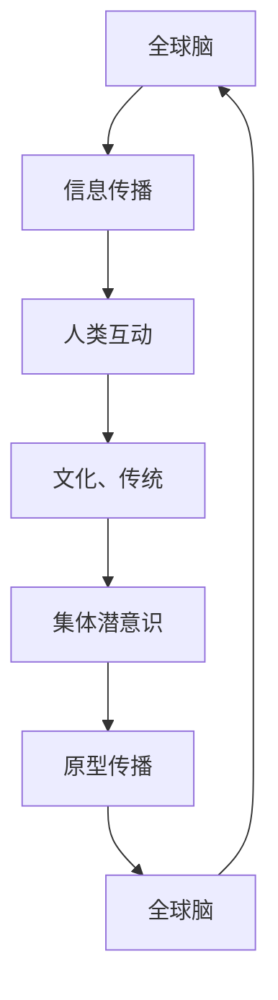

                 

### 引言与核心概念介绍

#### 全球脑与集体潜意识的概念

全球脑（Global Brain）这一概念最早由美国作家唐·塔茨佩蒂（Don Tapscott）在1994年的《全球脑：商业的未来》（The Global Brain）一书中提出。全球脑被定义为“一个自我组织、智能和全球意识的网络，它由互联网、通信技术和人类智能的互动而形成”。在这个网络中，信息通过计算机、手机、传感器和其他智能设备进行传输，人们通过社交媒体、在线论坛和电子邮件进行互动，形成一个庞大的全球性信息处理系统。全球脑不仅仅是技术的集合，它也是人类智慧和知识共享的载体，具有自我组织和适应的能力。

集体潜意识（Collective Unconscious）这一概念最早由瑞士心理学家卡尔·荣格（Carl Jung）提出。荣格认为，集体潜意识是人类心理结构的一部分，它包含了所有人类共有的心理模式和原型，如母亲形象、英雄形象等。这些原型是我们在成长过程中通过文化、传统和集体经验而获得的，不受个人意识和经验的影响。集体潜意识是普遍存在的，它贯穿于人类的整个历史，是文化、宗教和艺术创作的基础。

#### 核心联系与架构

全球脑与集体潜意识之间存在着紧密的联系。全球脑提供了一个平台，使得人类的集体潜意识得以在全球范围内传播和相互作用。以下是一个使用Mermaid绘制的流程图，展示了全球脑与集体潜意识的基本联系和架构：



在这个流程图中，全球脑通过信息传播和人类互动，将文化和传统传递给集体潜意识，而集体潜意识则通过原型传播反馈给全球脑。这一循环过程不断加强全球脑与集体潜意识之间的联系，使得它们成为一个相互促进、相互影响的整体。

#### 量子科学与意识研究

量子科学与意识研究是当前科学领域的前沿话题之一。量子力学揭示了微观世界的奇异现象，如量子纠缠和量子叠加，这些现象与人类的意识有着潜在的关联。以下将简要介绍量子力学的基本原理，并探讨意识与量子纠缠之间的关系。

#### 量子力学原理

量子力学是研究物质和能量在微观尺度上行为的物理学分支。其核心原理包括：

1. **波粒二象性**：微观粒子既具有波动性又具有粒子性。
2. **量子叠加**：一个量子系统可以同时处于多个状态的叠加。
3. **量子纠缠**：两个或多个量子系统之间的状态相互纠缠，一个系统的变化会立即影响到另一个系统，无论它们相隔多远。

这些原理与宏观世界中的经典物理有着根本的不同，引发了科学家们对量子世界与人类意识之间关系的深入思考。

#### 意识与量子纠缠

有观点认为，意识可能与量子纠缠有关。因为量子纠缠现象表现出一种超越空间距离的关联性，这种关联性是否能够在某种层面上解释人类意识的非局域特性，即意识能够在不同地点同时产生和影响。此外，量子叠加原理暗示了意识可能存在于多种可能状态中，而不是单一的确定状态，这与心理学中对意识状态的描述有相似之处。

然而，关于意识与量子纠缠的确切关系，目前还存在许多未解之谜。量子力学和心理学之间的交集为这一领域的研究提供了丰富的可能性，但也带来了巨大的挑战。

#### 数学模型与公式

在探讨量子力学与意识的关系时，数学模型和公式扮演了重要的角色。以下是一个使用LaTeX格式的数学模型和公式的示例：

```latex
\documentclass{article}
\usepackage{amsmath}
\begin{document}

\begin{equation}
\psi(x,t) = \sum_{n} c_n \psi_n(x,t)
\end{equation}

\begin{equation}
\langle \hat{A} \rangle = \sum_{n} |c_n|^2 \langle \psi_n | \hat{A} | \psi_n \rangle
\end{equation}

\end{document}
```

在这个示例中，第一个公式表示量子系统的波函数可以通过一系列本征态的叠加来表示，第二个公式则是计算量子系统的平均值的表达式。

#### 总结

本章介绍了全球脑与集体潜意识的概念，并探讨了它们之间的核心联系和架构。此外，本章还简要介绍了量子力学的基本原理和意识与量子纠缠的关系，并给出了相关的数学模型和公式。这些内容为后续章节的深入探讨奠定了基础。

### 引用

- Tapscott, D. (1994). *The Global Brain: Business in the Age of the Internet*. New York: McGraw-Hill.
- Jung, C. G. (1968). *The Archetypes and the Collective Unconscious*. Princeton: Princeton University Press.
- Zeilinger, A. (2010). *Quantum States of Light*. Cambridge: Cambridge University Press.

