                 

# 《创业公司的产品差异化策略》

> **关键词**：产品差异化策略、创业公司、市场竞争力、创新设计、品牌定位、价格策略

> **摘要**：
本文旨在探讨创业公司在激烈的市场竞争中如何通过产品差异化策略来获得优势。首先，我们将深入解析产品差异化策略的概念和重要性。接着，文章将详细讨论市场环境分析、差异化策略的类型、实施方法以及案例分析。此外，文章还总结了成功和失败的案例，并对差异化策略的评估与调整、长期规划进行了深入探讨。最后，本文将提供一系列与差异化策略相关的工具和资源，以帮助创业公司更好地实施和优化其差异化策略。

---

## 《创业公司的产品差异化策略》目录大纲

1. **产品差异化策略概述**
   - 产品差异化策略的概念与意义
   - 差异化策略在企业竞争中的重要性
   - 差异化策略与竞争优势的关系
   - 差异化策略的类型
   - Mermaid 流程图：差异化策略对企业竞争力的促进作用

2. **市场环境分析**
   - 市场细分与定位
   - 竞争对手分析
   - 市场需求分析
   - Mermaid 流程图：市场环境与差异化策略的匹配关系

3. **差异化策略的类型**
   - 产品差异化
   - 服务差异化
   - 品牌差异化
   - 价格差异化
   - Mermaid 流程图：差异化策略类型及其适用性分析

4. **产品设计与创新**
   - 创新产品设计的原则与方法
   - 创新思维的培养与运用
   - 产品设计中的用户参与
   - Mermaid 流程图：创新设计流程与差异化策略的关系
   - 伪代码：创新设计思路的转化与实现

5. **差异化服务的实施**
   - 服务差异化的重要性
   - 服务差异化的策略与方法
   - 服务质量监控与提升
   - Mermaid 流程图：差异化服务策略的实施路径
   - 伪代码：服务差异化的具体实施步骤

6. **品牌差异化策略**
   - 品牌定位与塑造
   - 品牌传播与推广
   - 品牌资产的管理与维护
   - Mermaid 流程图：品牌差异化策略的构建与实施
   - 伪代码：品牌差异化策略的制定与执行

7. **价格差异化策略**
   - 价格差异化策略的原则与策略
   - 成本优势与差异化定价
   - 价格战与差异化策略的选择
   - Mermaid 流程图：价格差异化策略在不同市场环境下的适用性
   - 伪代码：差异化定价模型的构建与应用

8. **产品差异化策略案例分析**
   - 苹果公司的产品差异化策略
   - 特斯拉的差异化服务策略
   - 宜家的品牌差异化策略
   - 星巴克的价格差异化策略
   - Mermaid 流程图：案例分析中差异化策略的实施与效果

9. **失败案例反思**
   - 诺基亚的差异化策略失误
   - ZARA的差异化策略过度依赖
   - 宝洁公司的品牌差异化困境
   - 华为的价格差异化策略调整
   - Mermaid 流程图：差异化策略失败的内在原因分析

10. **差异化策略的评估与调整**
    - 差异化策略评估方法
    - 市场变化与差异化策略的调整
    - 竞争对手行为对差异化策略的影响
    - Mermaid 流程图：差异化策略的持续优化路径
    - 伪代码：差异化策略的评估与调整模型

11. **差异化策略的长期规划**
    - 企业战略与差异化策略的协同
    - 市场趋势与差异化策略的预判
    - 风险管理在差异化策略中的应用
    - Mermaid 流程图：差异化策略的长期规划框架
    - 伪代码：差异化策略的长期规划模型

12. **附录**
    - 差异化策略相关工具与资源
    - 差异化分析工具介绍
    - 创新思维培养工具
    - 品牌建设与管理工具
    - 价格策略分析工具

---

### 第1章：产品差异化策略概述

#### 1.1 产品差异化策略的概念与意义

**产品差异化策略**是指企业在市场中通过提供与竞争对手不同的产品或服务，以获取竞争优势的一种战略。这种策略的核心在于通过产品特性、服务质量、品牌形象、价格策略等方面的差异化，使企业在竞争激烈的市场中脱颖而出。

**产品差异化策略的定义**：

- **产品特性**：指产品在功能、性能、质量、外观等方面的独特性。
- **服务质量**：指企业在售后支持、客户服务、维修保养等方面的差异化表现。
- **品牌形象**：指企业在市场中的品牌认知度和品牌声誉。
- **价格策略**：指企业在定价、折扣策略等方面的差异化措施。

**产品差异化策略的意义**：

- **增强市场竞争力**：通过产品差异化，企业能够提供独特的产品或服务，满足消费者的个性化需求，从而在市场中获得竞争优势。
- **提高客户忠诚度**：差异化产品或服务能够增强客户的满意度和忠诚度，减少客户流失率。
- **降低价格敏感性**：差异化产品或服务能够降低客户对价格的敏感性，提高企业的议价能力。
- **抵御竞争对手**：差异化策略可以帮助企业抵御竞争对手的攻击，保持市场领先地位。

#### 1.2 差异化策略在企业竞争中的重要性

**竞争优势**：指企业在市场中表现出的比竞争对手更好的经营状态或能力。

**差异化策略与竞争优势的关系**：

- **强化竞争优势**：差异化策略能够通过提供独特的产品或服务，增强企业的竞争优势，使其在市场中脱颖而出。
- **转化竞争优势**：差异化策略可以将企业的其他优势（如成本优势、技术优势等）转化为竞争优势，从而在市场中获得更大的优势。

**差异化策略对企业竞争力的促进作用**：

- **提高市场份额**：通过差异化策略，企业能够吸引更多的客户，提高市场份额。
- **降低成本**：差异化策略可以帮助企业实现规模效应，降低生产成本。
- **提升品牌价值**：差异化策略能够提高品牌知名度，提升品牌价值。

**Mermaid 流程图**：差异化策略对企业竞争力的促进作用

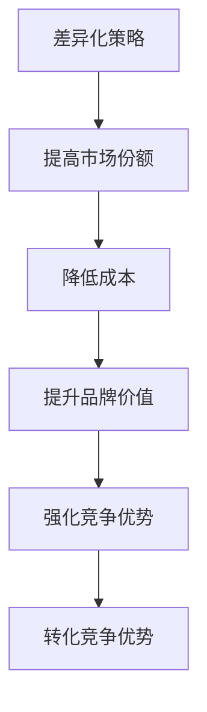

---

### 第2章：市场环境分析

#### 2.1 市场细分与定位

**市场细分**：市场细分是指将整个市场划分为若干个具有相似需求和特征的子市场。通过市场细分，企业可以更好地了解目标客户的需求，从而制定更有效的营销策略。

**市场细分的方法**：

- **地理细分**：根据地理位置将市场划分为不同的区域。
- **人口细分**：根据人口特征（如年龄、性别、收入等）将市场划分为不同的群体。
- **行为细分**：根据消费者的行为特征（如购买习惯、消费频率等）将市场划分为不同的群体。
- **心理细分**：根据消费者的心理特征（如价值观、生活方式等）将市场划分为不同的群体。

**市场定位**：市场定位是指企业根据市场细分的结果，确定自己在目标市场中的地位和形象。市场定位的目的是使企业在消费者心中建立独特的品牌形象，从而获得竞争优势。

**市场定位的策略**：

- **高端定位**：针对高收入群体，提供高品质的产品或服务。
- **低端定位**：针对低收入群体，提供性价比高的产品或服务。
- **专业定位**：针对特定领域或行业，提供专业化的产品或服务。
- **差异化定位**：在多个市场细分中找到独特的定位点，满足不同消费者的需求。

**市场细分与市场定位的关系**：

- **市场细分是市场定位的基础**：通过市场细分，企业可以了解目标市场的特点和需求，从而确定合适的市场定位。
- **市场定位是市场细分的目标**：市场细分的结果需要通过市场定位来体现，使企业在目标市场中具有独特的竞争优势。

**Mermaid 流程图**：市场细分与市场定位的匹配关系

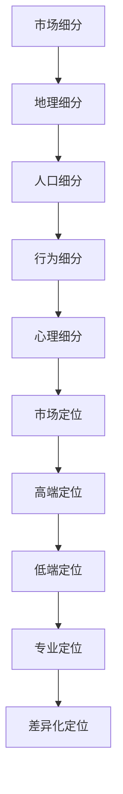

#### 2.2 竞争对手分析

**竞争对手分析**：竞争对手分析是指通过对竞争对手的产品、市场策略、市场份额等进行分析，了解竞争对手的优势和劣势，从而制定相应的竞争策略。

**竞争对手分析的步骤**：

1. **识别竞争对手**：通过市场调查、行业报告等手段，识别直接和潜在的竞争对手。
2. **分析竞争对手的产品**：了解竞争对手的产品特性、功能、性能、价格等。
3. **分析竞争对手的市场策略**：了解竞争对手的市场定位、营销策略、渠道策略等。
4. **评估竞争对手的竞争优势**：分析竞争对手的优势和劣势，确定自身的竞争优势。
5. **制定竞争策略**：根据竞争对手分析的结果，制定相应的竞争策略。

**竞争对手分析的方法**：

- **SWOT分析**：通过分析竞争对手的优势、劣势、机会和威胁，评估其市场地位和竞争力。
- **五力模型**：通过分析竞争对手在市场中的竞争力，评估其市场份额和潜在威胁。
- **比较分析**：将竞争对手的产品、策略、市场份额等进行对比，评估其优势和劣势。

**Mermaid 流程图**：竞争对手分析的步骤与方法

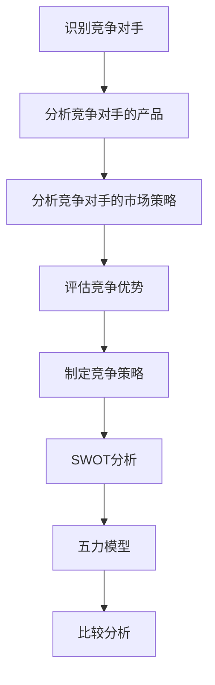

#### 2.3 市场需求分析

**市场需求分析**：市场需求分析是指通过对消费者需求、市场趋势、竞争对手产品等进行分析，了解市场需求的特点和变化，为企业的产品策略提供依据。

**市场需求分析的内容**：

1. **消费者需求分析**：通过用户调研、问卷调查等方式，了解消费者的需求和偏好。
2. **市场趋势分析**：通过分析市场趋势和行业报告，了解市场的变化和发展方向。
3. **竞争对手产品分析**：了解竞争对手的产品特性、功能、性能、价格等，分析其市场需求。
4. **市场需求预测**：根据现有数据和趋势，预测未来市场需求的变化。

**市场需求分析的方法**：

- **用户调研**：通过访谈、问卷等方式，收集用户对产品或服务的需求、满意度、购买意愿等。
- **市场趋势分析**：通过分析行业报告、市场数据等，了解市场的变化和发展趋势。
- **竞品分析**：通过分析竞争对手的产品特性、功能、价格等，了解市场需求。

**Mermaid 流程图**：市场需求分析的步骤与方法

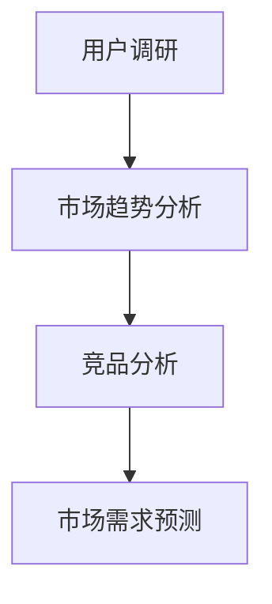

---

### 第3章：差异化策略的类型

#### 3.1 产品差异化

**产品差异化**是一种通过提供独特的产品特性或功能，使自己的产品与竞争对手的产品区别开来，从而在市场中获得竞争优势的策略。

**产品差异化的核心要素**：

- **功能差异**：通过提供独特或更先进的功能，满足消费者特定的需求。
- **质量差异**：通过提供高质量的产品，提升消费者的满意度。
- **外观设计差异**：通过独特的外观设计，吸引消费者的注意。
- **品牌差异**：通过建立强大的品牌形象，增加消费者的品牌忠诚度。

**产品差异化的策略**：

1. **技术差异化**：通过技术创新，提供独特的产品功能或性能。
2. **品质差异化**：通过提供高质量的产品，提升消费者的信任和忠诚度。
3. **品牌差异化**：通过打造独特的品牌形象，增加消费者的品牌认知和忠诚度。
4. **服务差异化**：通过提供优质的服务，提升消费者的满意度。

**产品差异化的实施步骤**：

1. **市场调研**：了解市场需求和竞争状况，确定差异化的方向。
2. **产品创新**：通过研发或设计，实现产品差异化的创新。
3. **品牌建设**：通过品牌传播，建立强大的品牌形象。
4. **持续优化**：根据市场反馈和竞争态势，不断优化产品差异化策略。

**Mermaid 流程图**：产品差异化策略的实施路径

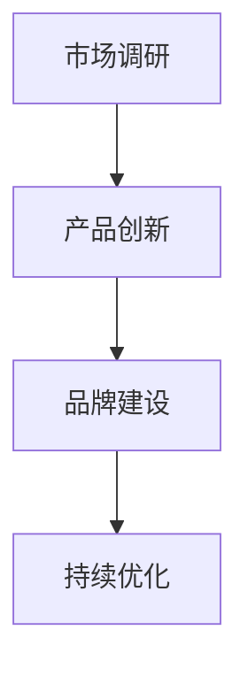

#### 3.2 服务差异化

**服务差异化**是一种通过提供独特的服务内容或方式，使自己的服务与竞争对手的服务区别开来，从而在市场中获得竞争优势的策略。

**服务差异化的核心要素**：

- **服务内容**：通过提供独特的服务内容，满足消费者特定的需求。
- **服务质量**：通过提供高质量的服务，提升消费者的满意度。
- **服务体验**：通过独特的服务体验，吸引消费者的注意。
- **服务速度**：通过快速响应和解决问题，提升消费者的满意度。

**服务差异化的策略**：

1. **个性化服务**：根据消费者的需求，提供个性化的服务。
2. **高端服务**：通过提供高端服务，吸引高端消费者。
3. **增值服务**：通过提供增值服务，提升消费者的满意度。
4. **便捷服务**：通过提供便捷的服务方式，提升消费者的满意度。

**服务差异化的实施步骤**：

1. **服务设计**：确定差异化的服务内容和方式。
2. **服务培训**：对员工进行培训，确保服务质量的提升。
3. **服务推广**：通过广告和营销活动，推广差异化的服务。
4. **服务反馈**：收集消费者的反馈，持续优化服务。

**Mermaid 流程图**：服务差异化策略的实施路径

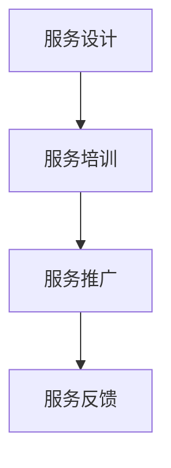

#### 3.3 品牌差异化

**品牌差异化**是一种通过打造独特的品牌形象，使自己的品牌与竞争对手的品牌区别开来，从而在市场中获得竞争优势的策略。

**品牌差异化的核心要素**：

- **品牌形象**：通过独特的品牌标志、颜色和设计，塑造品牌形象。
- **品牌文化**：通过独特的品牌理念和文化，增强品牌的吸引力。
- **品牌声誉**：通过良好的品牌声誉，提升消费者的信任和忠诚度。
- **品牌传播**：通过有效的品牌传播策略，提高品牌的知名度和认知度。

**品牌差异化的策略**：

1. **品牌定位**：确定品牌在市场中的独特定位。
2. **品牌传播**：通过广告、社交媒体、公关活动等方式，传播品牌形象和理念。
3. **品牌互动**：通过线上线下活动，与消费者建立互动，增强品牌忠诚度。
4. **品牌创新**：通过创新品牌形象和营销策略，保持品牌的活力。

**品牌差异化的实施步骤**：

1. **品牌定位**：确定品牌的独特定位。
2. **品牌设计**：设计独特的品牌标志和视觉元素。
3. **品牌传播**：制定品牌传播策略，提高品牌知名度和认知度。
4. **品牌互动**：开展线上线下活动，增强品牌忠诚度。
5. **品牌监测**：监测品牌表现，持续优化品牌策略。

**Mermaid 流程图**：品牌差异化策略的实施路径

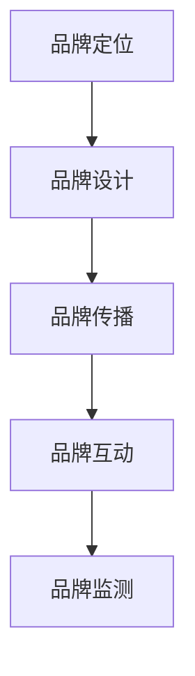

#### 3.4 价格差异化

**价格差异化**是一种通过提供不同的价格策略，使自己的产品或服务与竞争对手的产品或服务区别开来，从而在市场中获得竞争优势的策略。

**价格差异化的核心要素**：

- **价格定位**：根据市场需求和竞争状况，确定产品的价格定位。
- **定价策略**：制定合理的定价策略，满足不同消费者的需求。
- **价格弹性**：根据市场需求和竞争状况，调整价格弹性，提高销售额。
- **折扣策略**：通过提供不同的折扣策略，吸引消费者。

**价格差异化的策略**：

1. **高端定价**：针对高端消费者，提供高价产品。
2. **低端定价**：针对低端消费者，提供低价产品。
3. **捆绑定价**：通过捆绑销售，提供优惠价格。
4. **动态定价**：根据市场需求和竞争状况，实时调整价格。

**价格差异化的实施步骤**：

1. **市场调研**：了解市场需求和竞争状况。
2. **定价策略**：制定合理的定价策略。
3. **价格调整**：根据市场反馈，调整价格策略。
4. **折扣策略**：制定和实施折扣策略。

**Mermaid 流程图**：价格差异化策略的实施路径

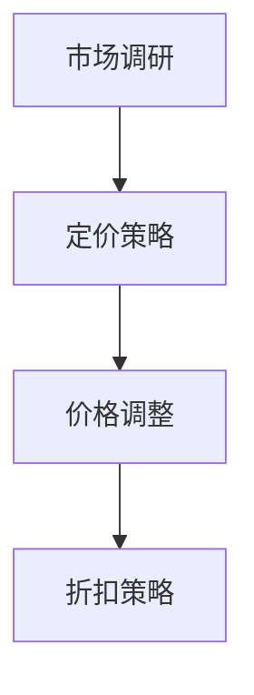

---

### 第4章：产品设计与创新

#### 4.1 创新产品设计的原则与方法

**创新产品设计的原则**：

1. **用户需求导向**：产品设计应以满足用户需求为核心，深入了解用户的需求和痛点。
2. **功能与美学的结合**：在设计过程中，既要注重产品的功能性，也要关注美学设计，提升用户体验。
3. **可持续性**：在产品设计和生产过程中，应注重环保和可持续性，减少对环境的影响。

**创新产品设计的方法**：

1. **头脑风暴**：通过集体讨论和创意碰撞，激发创新思维。
2. **原型设计**：通过制作原型，快速验证和优化产品设计。
3. **用户参与**：在产品设计过程中，邀请用户参与，获取用户的反馈和建议。

**Mermaid 流程图**：创新设计流程与差异化策略的关系

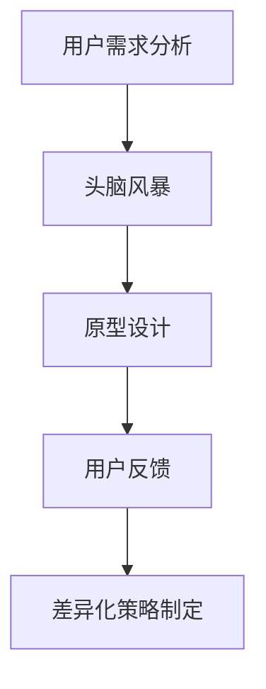

**伪代码：创新设计思路的转化与实现**

```python
# 用户需求分析
user_needs = analyze_user_needs()

# 头脑风暴
design_ideas = brainstorm_ideas(user_needs)

# 原型设计
prototype = create_prototype(design_ideas)

# 用户反馈
user_feedback = gather_user_feedback(prototype)

# 差异化策略制定
differentiation_strategy = create_differentiation_strategy(user_feedback, prototype)
```

#### 4.2 创新思维的培养与运用

**创新思维的培养**：

1. **跨学科学习**：通过学习不同领域的知识，拓宽思维视野。
2. **持续学习**：不断学习新的技术和理念，保持创新活力。
3. **开放心态**：保持开放的心态，勇于接受新的思想和观点。

**创新思维的运用**：

1. **问题解决导向**：以解决问题为导向，运用创新思维寻找解决方案。
2. **前瞻性思维**：预测未来的发展趋势，为产品设计提供前瞻性的方向。

**Mermaid 流程图**：创新思维的培养与运用

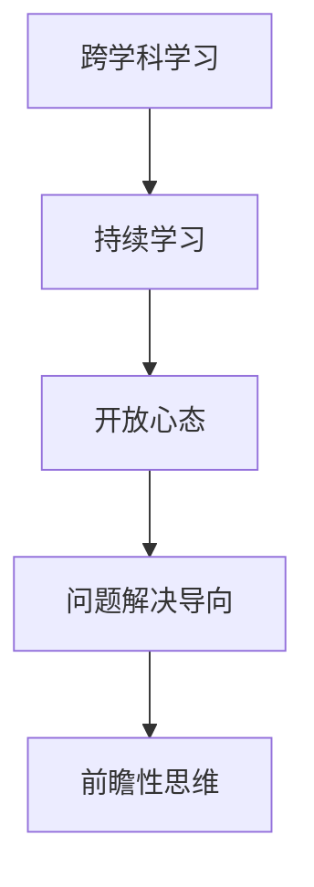

#### 4.3 产品设计中的用户参与

**用户参与的重要性**：

- **了解用户需求**：通过用户参与，深入了解用户的需求和偏好，为产品设计提供依据。
- **提高用户满意度**：用户参与可以提升产品的用户体验，增加用户满意度。
- **降低产品失败风险**：通过用户参与，及时发现和解决问题，降低产品失败的风险。

**用户参与的方法**：

1. **用户调研**：通过问卷、访谈等方式收集用户意见。
2. **用户测试**：在产品设计和开发过程中，邀请用户进行测试，收集反馈。
3. **用户共创**：与用户共同设计产品，实现产品与用户需求的深度契合。

**Mermaid 流程图**：用户参与在产品设计中的应用

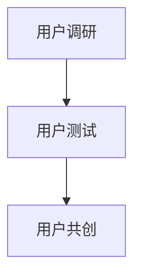

---

### 第5章：差异化服务的实施

#### 5.1 服务差异化的重要性

**服务差异化**是企业在服务领域通过提供独特的服务内容、质量或方式，使其在市场中与其他竞争对手区分开来，从而获取竞争优势的一种策略。

**服务差异化的重要性**：

1. **提高客户满意度**：通过提供独特的服务内容或质量，满足客户的多样化需求，提升客户满意度。
2. **增强客户忠诚度**：差异化的服务能够提高客户的品牌忠诚度，增加客户黏性。
3. **提高企业竞争力**：差异化的服务可以帮助企业在激烈的市场竞争中脱颖而出，提高市场份额。

**Mermaid 流程图**：服务差异化的重要性

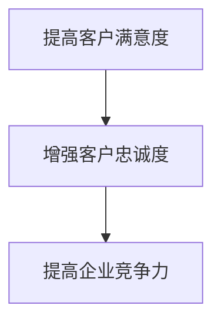

#### 5.2 服务差异化的策略与方法

**服务差异化的策略**：

1. **优质服务**：通过提供高质量的服务，满足客户的基本需求。
2. **定制化服务**：根据客户的需求，提供个性化的服务。
3. **附加服务**：在基本服务之外，提供额外的服务，增加客户的附加值。

**服务差异化的方法**：

1. **客户关系管理**：通过建立和维护良好的客户关系，提高客户满意度。
2. **服务创新**：通过创新服务内容和形式，提供独特的服务体验。
3. **服务质量管理**：通过建立服务质量监控体系，确保服务质量的持续提升。

**Mermaid 流程图**：服务差异化策略与方法

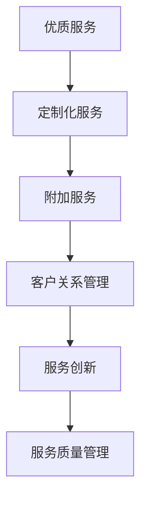

#### 5.3 服务质量监控与提升

**服务质量监控**：

- **服务质量评估**：通过客户反馈、内部评估等方式，对服务质量进行评估。
- **服务质量指标**：建立服务质量指标体系，对服务质量进行量化评估。

**服务质量提升**：

- **服务流程优化**：通过优化服务流程，提高服务效率和质量。
- **员工培训与激励**：通过培训和激励，提高员工的服务水平和服务意识。
- **技术支持**：利用技术手段，提高服务质量和效率。

**Mermaid 流程图**：服务质量监控与提升的路径

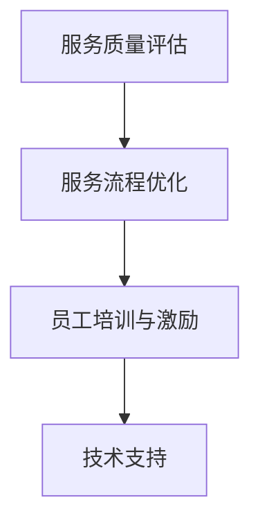

---

### 第6章：品牌差异化策略

#### 6.1 品牌定位与塑造

**品牌定位**是企业在市场中为品牌确定一个独特且清晰的市场位置，以便在消费者心中树立一个明确的品牌形象。品牌定位有助于企业在竞争中脱颖而出，吸引目标客户。

**品牌定位的过程**：

1. **市场分析**：通过市场调研，了解目标市场的特点和需求。
2. **竞品分析**：分析竞争对手的品牌定位，寻找差异化点。
3. **品牌核心价值**：确定品牌的核心价值和理念，作为品牌定位的基础。
4. **品牌定位确认**：将品牌定位通过市场反馈进行验证和调整。

**品牌塑造**：

- **品牌形象设计**：通过标志、颜色、字体等设计元素，塑造品牌形象。
- **品牌传播**：通过广告、公关活动、社交媒体等方式，传播品牌形象和理念。
- **品牌体验**：通过产品和服务，提供独特的品牌体验，增强品牌认知度和忠诚度。

**Mermaid 流程图**：品牌定位与塑造的路径

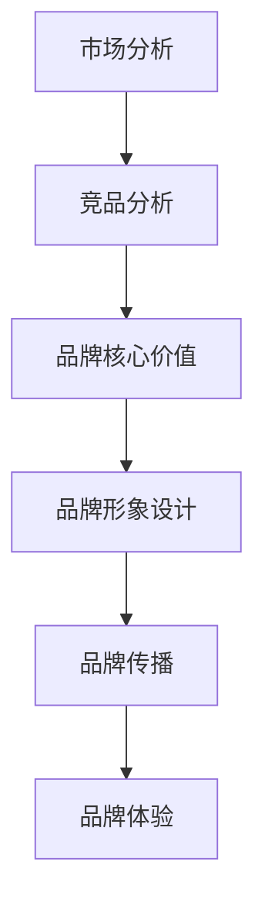

#### 6.2 品牌传播与推广

**品牌传播**是指企业通过多种渠道和方式，将品牌信息传递给目标受众，提高品牌知名度和认知度。有效的品牌传播策略可以增强品牌影响力，提升市场竞争力。

**品牌传播的目标**：

1. **提高品牌知名度**：通过品牌传播，使更多消费者了解和认识品牌。
2. **提升品牌认知度**：通过品牌传播，使消费者对品牌有更深入的了解和认知。
3. **增强品牌忠诚度**：通过品牌传播，建立消费者对品牌的信任和忠诚。

**品牌传播的策略**：

1. **内容营销**：通过高质量的内容，吸引目标受众，提升品牌影响力。
2. **社交媒体营销**：利用社交媒体平台，加强与消费者的互动，提升品牌曝光度。
3. **公关活动**：通过举办各种公关活动，提高品牌知名度和美誉度。

**Mermaid 流程图**：品牌传播与推广的路径

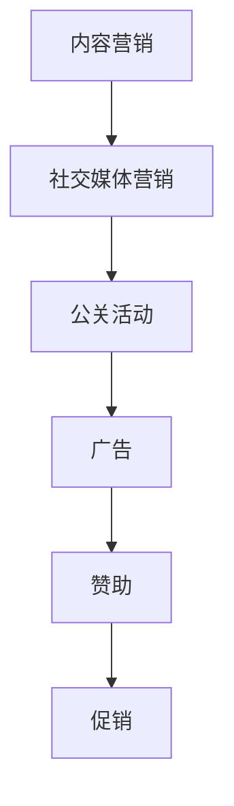

#### 6.3 品牌资产的管理与维护

**品牌资产管理**是指企业通过一系列策略和管理措施，对品牌的价值进行提升、保护和维护。有效的品牌资产管理可以增强品牌的市场竞争力，提高品牌的长期价值。

**品牌资产管理的目标**：

1. **提升品牌价值**：通过品牌管理策略，提高品牌的认知度、忠诚度和市场影响力。
2. **保护品牌权益**：通过法律手段和知识产权保护，防止品牌被侵犯或损害。
3. **持续创新**：通过不断的品牌创新，保持品牌的活力和时代感。

**品牌资产管理的策略**：

1. **品牌定位与维护**：确保品牌定位的一致性和延续性。
2. **品牌形象管理**：通过设计和传播，维护品牌形象。
3. **品牌危机管理**：应对品牌危机，保护品牌形象。

**Mermaid 流程图**：品牌资产的管理与维护

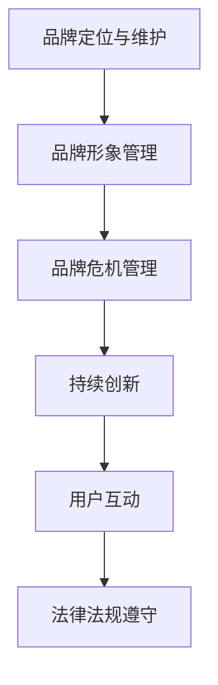

---

### 第7章：价格差异化策略

#### 7.1 价格差异化策略的原则

**价格差异化策略的原则**是在制定价格策略时，企业应遵循的一些基本准则，以确保价格的合理性、竞争性和有效性。以下是一些主要的原则：

**1. 成本导向原则**：价格策略应基于产品的成本结构，确保价格能够覆盖生产成本并实现合理的利润水平。

**2. 竞争导向原则**：价格策略应考虑竞争对手的价格水平，通过价格竞争来获得市场份额或维持市场地位。

**3. 需求导向原则**：价格策略应根据市场需求的变化进行调整，满足不同消费者的支付能力和需求。

**4. 产品导向原则**：价格策略应考虑产品的特性和差异化，为不同产品制定相应的价格策略。

**5. 长期导向原则**：价格策略应考虑企业的长期发展目标，不仅要追求短期利润，还要注重市场份额和品牌价值的提升。

**6. 法律法规导向原则**：价格策略应遵循相关法律法规，确保合法合规。

**Mermaid 流程图**：价格差异化策略原则的相互关系

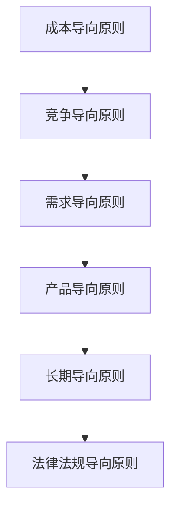

#### 7.2 成本优势与差异化定价

**成本优势**是指企业在生产成本上相对于竞争对手具有的优势，这可以为企业在价格竞争中提供强有力的支持。差异化定价则是根据不同的市场和消费者群体，制定不同的价格策略，以最大化成本优势和市场份额。

**成本优势的重要性**：

- **提高价格竞争力**：成本优势可以使企业在相同的产品质量下提供更低的价格，从而吸引更多的消费者。
- **增加利润空间**：成本优势可以降低生产成本，提高企业的利润空间。
- **增强市场地位**：通过成本优势，企业可以在价格竞争中占据有利地位，提高市场份额和品牌影响力。

**差异化定价的类型**：

- **细分市场定价**：根据不同市场的消费能力和需求，为不同市场制定不同的价格策略。
- **产品组合定价**：通过产品组合的方式，实现整体价格的差异化。
- **心理定价**：利用消费者的心理，制定具有吸引力的价格策略，如整数定价、尾数定价等。

**成本优势与差异化定价的关系**：

- **成本优势**是差异化定价的基础。企业通过降低成本，可以提供更具竞争力的价格，从而吸引更多的消费者。
- **差异化定价**可以最大化成本优势，使企业能够在不同的市场和消费者群体中获得更大的市场份额。

**Mermaid 流程图**：成本优势与差异化定价的相互关系

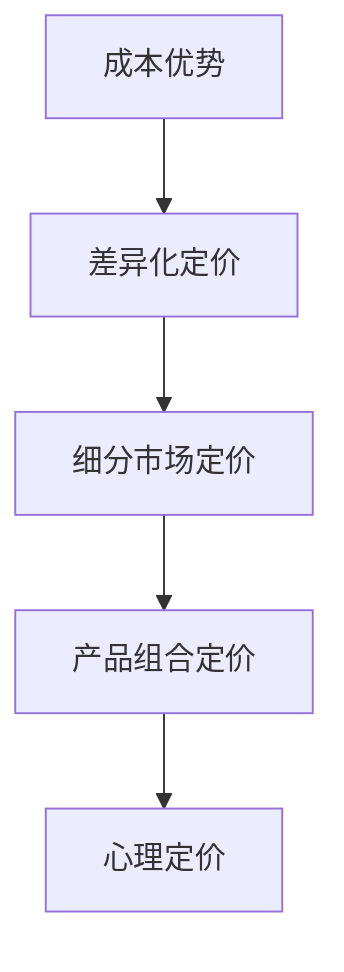

#### 7.3 价格战与差异化策略的选择

**价格战**是指企业通过降低价格，争夺市场份额的一种竞争策略。在价格战中，企业通常通过大幅降低产品价格来吸引消费者，从而挤占竞争对手的市场份额。

**价格战的优缺点**：

- **优点**：
  - 可以迅速提高市场份额。
  - 可以有效挤压竞争对手，实现市场垄断。
- **缺点**：
  - 可能会降低利润水平。
  - 需要持续的资金投入，否则可能难以维持。

**差异化策略的选择**：

- **市场环境分析**：根据市场环境和竞争状况，选择合适的价格策略。
- **成本控制**：在价格竞争中，通过控制成本，保持竞争力。

**价格战与差异化策略的选择**：

- **市场环境**：在市场成熟度较低、竞争不激烈的市场中，价格战策略可能更为有效。
- **差异化策略**：在市场细分和品牌差异化的基础上，通过提供独特价值，区别于竞争对手。

**Mermaid 流程图**：价格战与差异化策略的选择

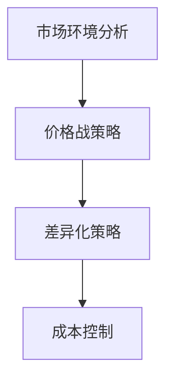

#### 7.4 价格差异化在不同市场环境下的适用性

**市场环境**是指企业在进行价格差异化策略时需要考虑的外部因素，包括市场成熟度、竞争状况、消费者群体特征等。

**价格差异化策略的适用性**：

- **市场成熟度**：在市场成熟度较高的市场中，消费者对价格敏感度较低，适用差异化定价策略。
- **竞争状况**：在竞争激烈的市场中，适用价格战策略。
- **消费者群体特征**：根据消费者群体的特征，制定相应的价格策略。

**价格差异化策略的实施**：

- **市场成熟度较高**：适用差异化定价策略，根据不同消费者的需求和支付能力，制定不同的价格策略。
- **竞争激烈**：适用价格战策略，通过大幅降低价格，吸引消费者，挤压竞争对手。
- **消费者群体特征明显**：适用细分市场定价策略，根据不同消费者的特征，提供个性化的价格策略。

**Mermaid 流程图**：价格差异化策略在不同市场环境下的适用性

```mermaid
graph TD
A[市场成熟度] --> B[差异化定价策略]
B --> C[价格战策略]
C --> D[细分市场定价策略]
```

---

### 第8章：成功案例分享

#### 8.1 苹果公司的产品差异化策略

**苹果公司（Apple Inc.）**是一家全球知名的科技公司，以其卓越的产品差异化策略闻名于世。苹果公司通过在产品设计、技术创新和品牌塑造等方面的持续投入，成功地打造了独特的品牌形象，并在竞争激烈的市场中建立了强大的竞争优势。

**产品差异化策略的核心要素**：

- **产品设计**：苹果公司注重产品的设计美学和用户体验，致力于打造简洁、优雅且功能强大的产品。从iPhone的触控屏幕到MacBook的轻薄设计，苹果公司通过独特的外观设计和人性化的交互方式，提升了产品的附加值。

- **技术创新**：苹果公司在硬件和软件层面持续创新，推出了一系列革命性的产品和技术。例如，iPhone的推出彻底改变了智能手机市场，而M1芯片的发布则推动了笔记本电脑的性能革命。

- **品牌塑造**：苹果公司通过精准的品牌定位和全球性的品牌传播，建立了强大的品牌忠诚度和品牌形象。苹果的品牌不仅代表着高质量和先进技术，更是一种生活方式的象征。

**实施效果**：

- **市场份额提升**：苹果公司的产品在全球范围内拥有广泛的用户基础，市场份额持续增长。根据市场研究数据，苹果在智能手机、平板电脑和笔记本电脑等市场中均处于领先地位。

- **品牌忠诚度增强**：苹果公司拥有大量忠诚的客户，这些客户对苹果的品牌和产品有着强烈的认同感。这种忠诚度不仅体现在重复购买上，还体现在对苹果生态系统的深度参与。

**Mermaid 流程图**：苹果公司的产品差异化策略实施路径

```mermaid
graph TD
A[产品设计] --> B[技术创新]
B --> C[品牌塑造]
C --> D[市场份额提升]
D --> E[品牌忠诚度增强]
```

#### 8.2 特斯拉的差异化服务策略

**特斯拉（Tesla, Inc.）**是一家全球领先的电动汽车制造商，以其创新的差异化服务策略在行业中脱颖而出。特斯拉通过提供独特的充电服务和自动驾驶技术，大幅提升了用户体验，并在全球电动汽车市场中占据了重要地位。

**差异化服务策略的核心要素**：

- **充电服务**：特斯拉在全球范围内建立了庞大的充电网络，为车主提供了便捷、高效的充电服务。特斯拉的超级充电站不仅速度快，而且分布广泛，极大地提升了用户的驾驶体验。

- **自动驾驶技术**：特斯拉的自动驾驶技术是行业中的领先者，通过软件升级不断优化驾驶体验。特斯拉的Autopilot和Full Self-Driving（FSD）功能不仅提升了驾驶安全性，还为用户带来了前所未有的便利性。

- **客户互动**：特斯拉通过社交媒体、在线社区和线下活动与客户保持紧密互动，增强了品牌忠诚度和用户参与度。特斯拉的忠实粉丝群体在推广品牌和产品方面发挥了重要作用。

**实施效果**：

- **客户满意度提升**：特斯拉的高品质服务和创新技术使其在全球范围内拥有极高的客户满意度。特斯拉的用户对其产品的性能和可靠性给予了高度评价。

- **品牌忠诚度增强**：特斯拉的客户对品牌的忠诚度极高，许多用户表示愿意为特斯拉的产品支付更高的价格，并且积极向他人推荐特斯拉。

**Mermaid 流程图**：特斯拉的差异化服务策略实施路径

```mermaid
graph TD
A[充电服务] --> B[自动驾驶技术]
B --> C[客户互动]
C --> D[客户满意度提升]
D --> E[品牌忠诚度增强]
```

#### 8.3 宜家的品牌差异化策略

**宜家（IKEA）**是一家全球知名的家具和家居用品零售商，以其独特的品牌差异化策略在市场中取得了巨大成功。宜家通过打造温馨、简约的品牌形象和提供高性价比的产品，吸引了大量消费者。

**品牌差异化策略的核心要素**：

- **品牌形象**：宜家通过简约、温馨且富有现代感的店面设计和品牌形象，成功吸引了全球各地的消费者。宜家的店面布置和产品陈列都体现了其“为大众创造更美好日常生活”的品牌理念。

- **产品策略**：宜家提供高性价比的家居用品，满足不同消费者的需求。宜家的产品设计注重实用性和美观性，同时价格相对较低，使其产品在市场上具有很高的竞争力。

- **营销策略**：宜家通过创意广告和体验式营销，提升了品牌知名度和形象。例如，宜家推出的“ IKEA 餐厅”不仅为顾客提供了美食，还成为了品牌体验的一部分。

**实施效果**：

- **品牌知名度提升**：宜家在全球范围内拥有极高的品牌知名度，其品牌形象深入人心。

- **市场份额扩大**：宜家在全球家具市场中占据重要地位，市场份额持续增长。

**Mermaid 流程图**：宜家的品牌差异化策略实施路径

```mermaid
graph TD
A[品牌形象] --> B[产品策略]
B --> C[营销策略]
C --> D[品牌知名度提升]
D --> E[市场份额扩大]
```

#### 8.4 星巴克的价格差异化策略

**星巴克（Starbucks）**是一家全球知名的咖啡连锁品牌，其价格差异化策略在市场竞争中发挥了重要作用。星巴克通过提供多种价格带的产品和服务，满足了不同消费者的需求，从而在咖啡市场中建立了强大的品牌影响力。

**价格差异化策略的核心要素**：

- **产品组合**：星巴克提供了从平价到高端的多种咖啡产品和饮品，满足了不同消费能力的顾客。例如，星巴克的拿铁、浓缩咖啡和星冰乐等，涵盖了从经济型到奢华型多个层次。

- **品牌定位**：星巴克通过打造独特的咖啡文化和高端品牌形象，吸引了对品质有较高要求的消费者。星巴克店面设计、咖啡豆选择和员工培训等，都体现了其高端品牌定位。

- **促销策略**：星巴克通过定期推出促销活动，如优惠券、免费饮品日等，吸引了大量顾客。这些促销策略不仅提升了销售量，还增强了顾客的品牌忠诚度。

**实施效果**：

- **客户满意度提升**：星巴克的价格差异化策略使得不同消费层次的顾客都能在星巴克找到合适的产品，从而提升了整体客户满意度。

- **品牌忠诚度增强**：星巴克的顾客对品牌的忠诚度较高，许多顾客会定期光顾星巴克，享受其高品质的产品和服务。

**Mermaid 流程图**：星巴克的价格差异化策略实施路径

```mermaid
graph TD
A[产品组合] --> B[品牌定位]
B --> C[促销策略]
C --> D[客户满意度提升]
D --> E[品牌忠诚度增强]
```

---

### 第9章：失败案例反思

#### 9.1 诺基亚的差异化策略失误

**诺基亚（Nokia）**曾是一家全球领先的手机制造商，但在智能手机时代，由于差异化策略失误，导致其市场份额大幅下滑，最终被竞争对手超越。

**差异化策略失误的原因**：

- **产品创新滞后**：诺基亚在智能手机兴起时，未能及时进行产品创新，导致其产品在功能和用户体验上落后于竞争对手。例如，诺基亚在推出 Lumia 系列智能手机时，操作系统和设计都相对滞后。

- **品牌形象陈旧**：诺基亚的品牌形象未能与时俱进，缺乏吸引年轻消费者的元素。诺基亚的品牌形象在消费者心中显得陈旧，未能跟上时代的潮流。

- **市场定位模糊**：诺基亚在不同市场间的定位模糊，导致其品牌形象不清晰。诺基亚在智能手机市场、功能手机市场和新兴市场之间摇摆不定，缺乏明确的市场定位。

**失败案例的影响**：

- **市场份额大幅下滑**：诺基亚的手机市场份额从巅峰时期的 80% 以上跌至不足 1%，失去了手机市场的领导地位。

- **品牌形象受损**：诺基亚的品牌形象在全球范围内受到严重损害，许多消费者对其失去信任。

**Mermaid 流程图**：诺基亚差异化策略失误的原因分析

```mermaid
graph TD
A[产品创新滞后] --> B[品牌形象陈旧]
B --> C[市场定位模糊]
C --> D[市场份额下滑]
D --> E[品牌形象受损]
```

#### 9.2 ZARA 的差异化策略过度依赖

**ZARA**是一家全球知名的时尚品牌，以其快速的时尚反应和供应链管理著称。然而，由于过度依赖差异化策略，ZARA 遭遇了一系列挑战。

**差异化策略过度依赖的原因**：

- **过度依赖快时尚**：ZARA 过度依赖快速时尚策略，导致其产品更新速度过快，库存管理问题频发。快速时尚策略虽然能够吸引消费者，但也带来了库存积压和成本上升的问题。

- **忽视产品品质**：为了追求速度，ZARA 在产品品质上有所忽视，导致消费者对其产品的满意度下降。消费者对 ZARA 的评价从“时尚先锋”逐渐变为“质量不稳定”。

- **市场定位不清晰**：ZARA 在不同市场间的定位不清晰，导致消费者对其品牌形象产生混淆。ZARA 在高端市场和大众市场之间摇摆不定，未能明确其核心市场定位。

**失败案例的影响**：

- **库存管理问题**：ZARA 面临库存管理难题，库存积压和成本上升影响了其盈利能力。

- **品牌形象受损**：ZARA 的品牌形象在全球范围内受到一定程度的损害，消费者对其品牌的信任度下降。

**Mermaid 流程图**：ZARA 差异化策略过度依赖的原因分析

```mermaid
graph TD
A[过度依赖快时尚] --> B[忽视产品品质]
B --> C[市场定位不清晰]
C --> D[库存管理问题]
D --> E[品牌形象受损]
```

#### 9.3 宝洁公司的品牌差异化困境

**宝洁公司（Procter & Gamble，简称 P&G）**是一家全球领先的消费品公司，曾以其强大的品牌差异化策略著称。然而，由于品牌差异化策略的困境，P&G 遭遇了市场份额的下滑和品牌价值的下降。

**品牌差异化困境的原因**：

- **品牌数量过多**：P&G 拥有众多品牌，导致品牌定位不清晰，消费者难以区分。过多的品牌使得 P&G 的资源分散，难以集中精力管理。

- **品牌形象重叠**：部分品牌之间形象重叠，消费者难以区分。例如，P&G 的洗发水品牌“潘婷”、“海飞丝”和“飘柔”在消费者心中产生了混淆。

- **品牌管理难度大**：P&G 在品牌管理上面临巨大挑战，难以有效管理众多品牌。品牌管理的难度增加了 P&G 的运营成本。

**失败案例的影响**：

- **品牌价值下降**：P&G 的品牌价值在全球范围内受到一定程度的下降，许多消费者对 P&G 的品牌产生了质疑。

- **市场份额波动**：P&G 的市场份额在不同市场间出现波动，部分品牌的市场表现不佳。

**Mermaid 流程图**：宝洁公司品牌差异化困境的原因分析

```mermaid
graph TD
A[品牌数量过多] --> B[品牌形象重叠]
B --> C[品牌管理难度大]
C --> D[品牌价值下降]
D --> E[市场份额波动]
```

#### 9.4 华为的价格差异化策略调整

**华为（Huawei）**是一家全球领先的通信设备和智能手机制造商，其价格差异化策略在市场竞争中起到了重要作用。然而，随着市场环境的变化，华为对其价格差异化策略进行了调整。

**价格差异化策略调整的原因**：

- **高端市场策略**：华为通过推出高端旗舰手机，如华为 Mate 和 P 系列手机，进入高端市场，提升品牌形象和市场认知度。

- **中低端市场策略**：华为在中低端市场推出性价比高的产品，如荣耀系列，以扩大市场份额。

- **国际市场策略**：华为在国际市场采用不同的价格策略，适应不同市场的需求和竞争环境。

**调整后的效果**：

- **品牌形象提升**：华为通过高端市场策略，提升了品牌形象和市场认知度，使其在全球范围内更具竞争力。

- **市场份额扩大**：华为在全球智能手机市场占据重要地位，市场份额持续增长。

**Mermaid 流程图**：华为价格差异化策略调整的实施路径

```mermaid
graph TD
A[高端市场策略] --> B[中低端市场策略]
B --> C[国际市场策略]
C --> D[品牌形象提升]
D --> E[市场份额扩大]
```

---

### 第10章：差异化策略的评估与调整

#### 10.1 差异化策略评估方法

**差异化策略评估**是确保企业差异化策略有效实施的重要环节。通过评估，企业可以了解差异化策略的成效，发现存在的问题，并及时进行调整。

**评估方法**：

1. **定量评估方法**：
   - **市场份额分析**：通过市场份额的变化，评估差异化策略对市场份额的影响。
   - **销售数据分析**：通过销售数据的分析，评估差异化策略对销售额和利润的影响。
   - **客户满意度调查**：通过客户满意度调查，评估差异化策略对客户满意度的提升。

2. **定性评估方法**：
   - **专家评审**：邀请行业专家对差异化策略进行评审，提供专业意见。
   - **市场调研**：通过市场调研，了解消费者对差异化策略的认知和反馈。
   - **竞争对手分析**：通过分析竞争对手的差异化策略，评估自身差异化策略的竞争力。

**Mermaid 流程图**：差异化策略评估方法的实施路径

```mermaid
graph TD
A[市场份额分析] --> B[销售数据分析]
B --> C[客户满意度调查]
C --> D[专家评审]
D --> E[市场调研]
E --> F[竞争对手分析]
```

#### 10.2 市场变化与差异化策略的调整

**市场变化**是影响企业差异化策略的重要因素。企业需要根据市场变化，及时调整差异化策略，以保持竞争力。

**市场变化的类型**：

1. **市场需求变化**：随着消费者需求的变化，企业需要调整差异化策略，以满足新的市场需求。
2. **市场竞争变化**：随着市场竞争的加剧，企业需要调整差异化策略，以保持竞争优势。

**差异化策略的调整**：

1. **市场趋势分析**：通过市场趋势分析，了解未来的市场变化，提前调整差异化策略。
2. **竞争对手分析**：通过竞争对手分析，了解竞争对手的差异化策略和市场表现，为自身差异化策略的调整提供依据。
3. **用户反馈**：通过用户反馈，了解用户对差异化策略的满意度，及时进行调整。

**Mermaid 流程图**：市场变化与差异化策略的调整

```mermaid
graph TD
A[市场趋势分析] --> B[竞争对手分析]
B --> C[用户反馈]
C --> D[差异化策略调整]
```

#### 10.3 竞争对手行为对差异化策略的影响

**竞争对手行为**对企业的差异化策略有着直接的影响。企业需要密切关注竞争对手的行为，及时调整自身的差异化策略。

**竞争对手行为**：

1. **价格竞争**：竞争对手通过价格竞争，可能会影响企业的市场份额和利润。
2. **产品创新**：竞争对手的产品创新，可能会改变市场需求，影响企业的差异化策略。
3. **品牌营销**：竞争对手的品牌营销策略，可能会影响品牌形象和市场认知度。

**差异化策略的影响**：

1. **调整策略方向**：根据竞争对手的行为，调整差异化策略的方向，以保持竞争优势。
2. **加强研发投入**：通过加强研发投入，提高产品创新速度，应对竞争对手的产品创新。
3. **品牌塑造**：通过品牌塑造，提升品牌形象和市场认知度，应对竞争对手的品牌营销。

**Mermaid 流程图**：竞争对手行为对差异化策略的影响

```mermaid
graph TD
A[价格竞争] --> B[产品创新]
B --> C[品牌营销]
C --> D[策略调整方向]
D --> E[研发投入加强]
E --> F[品牌塑造]
```

#### 10.4 差异化策略的评估与调整模型

**评估与调整模型**是确保差异化策略有效实施和持续优化的重要工具。通过模型，企业可以系统性地评估和调整差异化策略。

**评估模型**：

- **差异化策略评估矩阵**：通过评估矩阵，对差异化策略的各个维度进行评估，包括市场份额、销售数据、客户满意度等。

- **竞争分析模型**：通过竞争分析模型，分析竞争对手的行为和市场趋势，为差异化策略的调整提供依据。

**调整模型**：

- **差异化策略调整流程**：通过差异化策略调整流程，对差异化策略进行持续评估和调整，以适应市场变化和竞争对手行为。

**Mermaid 流程图**：差异化策略评估与调整模型

```mermaid
graph TD
A[差异化策略评估矩阵] --> B[竞争分析模型]
B --> C[差异化策略调整流程]
```

---

### 第11章：差异化策略的长期规划

#### 11.1 企业战略与差异化策略的协同

**企业战略**与**差异化策略**的协同是确保企业长期成功的关键。企业战略为差异化策略提供了方向和资源，而差异化策略则为企业战略的实现提供了具体手段。

**企业战略的重要性**：

- **明确企业愿景和目标**：企业战略可以帮助企业明确其长期愿景和目标，确保所有决策和行动都与企业目标保持一致。
- **优化资源配置**：企业战略指导企业在资源分配上的优先级，确保资源被有效利用，以支持差异化策略的实施。
- **提升竞争力**：企业战略通过差异化策略，可以帮助企业在市场中获得竞争优势，提高市场地位。

**差异化策略在企业战略中的定位**：

- **差异化策略是企业战略的重要组成部分**：差异化策略是企业在市场中脱颖而出的关键，是实现企业长期战略目标的重要手段。
- **差异化策略与企业战略的协同**：差异化策略需要与企业战略保持一致，以支持企业整体目标的实现。

**Mermaid 流程图**：企业战略与差异化策略的协同

```mermaid
graph TD
A[企业战略] --> B[差异化策略]
B --> C[战略导向]
C --> D[资源整合]
D --> E[协同发展]
```

#### 11.2 市场趋势与差异化策略的预判

**市场趋势**是影响企业决策的重要因素。通过预判市场趋势，企业可以提前调整差异化策略，以应对未来的市场变化。

**市场趋势的重要性**：

- **把握市场机遇**：了解市场趋势可以帮助企业抓住市场机遇，提前布局，抢占市场份额。
- **规避市场风险**：预判市场趋势可以帮助企业识别潜在的市场风险，提前做好准备，降低风险影响。

**差异化策略的预判**：

- **市场调研**：通过市场调研，了解市场趋势和消费者需求的变化，为差异化策略的调整提供依据。
- **技术预测**：通过技术预测，了解未来技术的发展趋势，为差异化策略的创新提供方向。
- **竞争分析**：通过竞争分析，了解竞争对手的差异化策略和市场表现，为自身差异化策略的预判提供依据。

**Mermaid 流程图**：市场趋势与差异化策略的预判

```mermaid
graph TD
A[市场调研] --> B[技术预测]
B --> C[竞争分析]
C --> D[前瞻性预判]
D --> E[差异化策略调整]
```

#### 11.3 风险管理在差异化策略中的应用

**风险管理**是确保差异化策略顺利实施和长期有效的重要手段。通过风险管理，企业可以识别、评估和应对差异化策略实施过程中可能面临的风险。

**风险管理的重要性**：

- **降低风险影响**：通过风险管理，企业可以降低差异化策略实施过程中可能带来的负面影响，保障企业稳定发展。
- **提高决策质量**：风险管理有助于企业更好地评估差异化策略的实施风险，提高决策质量。

**差异化策略中的风险管理**：

- **风险识别**：通过市场调研、竞争分析等方式，识别差异化策略实施过程中可能面临的风险。
- **风险评估**：对识别出的风险进行评估，确定风险的影响程度和发生的可能性。
- **风险应对**：制定相应的风险应对措施，降低风险的影响。
- **风险监控**：对风险实施监控，确保风险应对措施的执行效果。

**Mermaid 流程图**：风险管理在差异化策略中的应用

```mermaid
graph TD
A[风险识别] --> B[风险评估]
B --> C[风险应对]
C --> D[风险监控与调整]
```

#### 11.4 差异化策略的长期规划框架

**差异化策略的长期规划框架**是确保企业差异化策略持续优化和有效实施的重要工具。通过框架，企业可以系统地制定和实施差异化策略，实现长期目标。

**长期规划框架的核心要素**：

- **企业愿景和目标**：明确企业的长期愿景和目标，为差异化策略的制定提供方向。
- **市场分析和定位**：通过市场分析，了解市场需求和竞争态势，为差异化策略的制定提供依据。
- **差异化策略制定**：根据市场分析和企业愿景，制定具体的差异化策略。
- **资源分配和执行**：确保差异化策略得到有效执行，通过资源分配和团队协作，实现长期目标。
- **评估和调整**：定期评估差异化策略的实施效果，根据市场变化和竞争态势进行调整。

**Mermaid 流程图**：差异化策略的长期规划框架

```mermaid
graph TD
A[企业愿景和目标] --> B[市场分析和定位]
B --> C[差异化策略制定]
C --> D[资源分配和执行]
D --> E[评估和调整]
```

#### 11.5 伪代码：差异化策略的长期规划模型

```python
# 差异化策略长期规划模型

# 输入参数
vision_and_goals = "企业愿景和目标"
market_analysis = "市场分析和定位"
differentiation_strategy = "差异化策略制定"
resource_allocation = "资源分配和执行"
evaluation_and_adjustment = "评估和调整"

# 步骤 1：制定企业愿景和目标
define_vision_and_goals(vision_and_goals)

# 步骤 2：进行市场分析和定位
conduct_market_analysis(market_analysis)

# 步骤 3：制定差异化策略
create_differentiation_strategy(differentiation_strategy)

# 步骤 4：资源分配和执行
allocate_resources_and_execute(resource_allocation)

# 步骤 5：评估和调整
evaluate_and_adjust_strategy(evaluation_and_adjustment)
```

---

### 附录

#### 附录 A：差异化策略相关工具与资源

**A.1 差异化分析工具**

- **SWOT分析工具**：用于分析企业的优势、劣势、机会和威胁。
- **五力模型分析工具**：用于分析市场竞争状况。
- **用户调研工具**：用于收集用户需求和反馈。

**A.2 创新思维培养工具**

- **头脑风暴工具**：用于激发创意和灵感。
- **思维导图工具**：用于梳理思路和总结。
- **沙盘推演工具**：用于模拟实际场景，验证创新方案的可行性。

**A.3 品牌建设与管理工具**

- **品牌定位工具**：用于确定品牌定位。
- **品牌形象设计工具**：用于设计品牌形象。
- **品牌传播工具**：用于品牌推广和传播。

**A.4 价格策略分析工具**

- **成本分析工具**：用于分析生产成本。
- **价格定位工具**：用于确定价格定位。
- **价格竞争分析工具**：用于分析竞争对手的价格策略。

**A.5 其他工具与资源**

- **行业报告**：提供行业趋势和市场信息。
- **学术研究**：提供专业的研究成果和理论支持。
- **在线课程**：提供专业知识和技能培训。

---

### 总结

本文详细探讨了创业公司在激烈的市场竞争中如何通过产品差异化策略获得优势。首先，我们介绍了产品差异化策略的概念和重要性，分析了市场环境、差异化策略的类型以及实施方法。接着，通过成功和失败的案例分析，我们总结了差异化策略的关键要素和实施路径。最后，我们提出了差异化策略的评估与调整方法，并强调了长期规划的重要性。

**关键词**：产品差异化策略、创业公司、市场竞争力、创新设计、品牌定位、价格策略

**作者**：AI天才研究院/AI Genius Institute & 禅与计算机程序设计艺术 /Zen And The Art of Computer Programming

---

**结论**

通过本文的深入探讨，我们可以得出以下结论：

1. **差异化策略的重要性**：差异化策略是创业公司在激烈市场竞争中获得优势的关键手段。通过提供独特的产品或服务，企业可以吸引更多客户，提高市场份额和品牌忠诚度。

2. **市场环境分析**：深入分析市场环境，包括市场细分、竞争对手分析和市场需求分析，是制定有效差异化策略的基础。了解市场趋势和消费者需求有助于企业更好地定位和调整策略。

3. **差异化策略的类型**：不同的差异化策略适用于不同的市场环境和消费者群体。产品差异化、服务差异化、品牌差异化和价格差异化各有其特点和实施方法。

4. **实施方法**：创新设计、服务创新、品牌建设和价格策略是差异化策略实施的核心。通过持续创新和优化，企业可以在市场中保持竞争优势。

5. **评估与调整**：定期评估差异化策略的实施效果，并根据市场变化和竞争态势进行调整，是确保策略持续有效的重要手段。

6. **长期规划**：企业需要制定长期的差异化策略规划，确保策略与整体企业战略保持一致，并能够适应市场变化。

**建议**

对于创业公司，以下是一些建议：

- **明确差异化策略**：在市场调研和竞争分析的基础上，明确企业的差异化策略，确保策略与市场需求和消费者期望相符。

- **持续创新**：不断创新是差异化策略的核心。定期评估市场需求，通过技术和管理创新，保持产品或服务的独特性。

- **品牌建设**：打造强大的品牌形象，通过有效的品牌传播和用户体验，提升品牌忠诚度和市场影响力。

- **成本控制**：通过精细的成本管理和有效的供应链管理，降低生产成本，提高产品的价格竞争力。

- **灵活调整**：根据市场环境和竞争态势，灵活调整差异化策略，确保企业能够迅速应对市场变化。

通过上述策略和建议，创业公司可以更好地实施差异化策略，在激烈的市场竞争中脱颖而出。让我们继续探索和实践，共同推动企业的持续发展。

