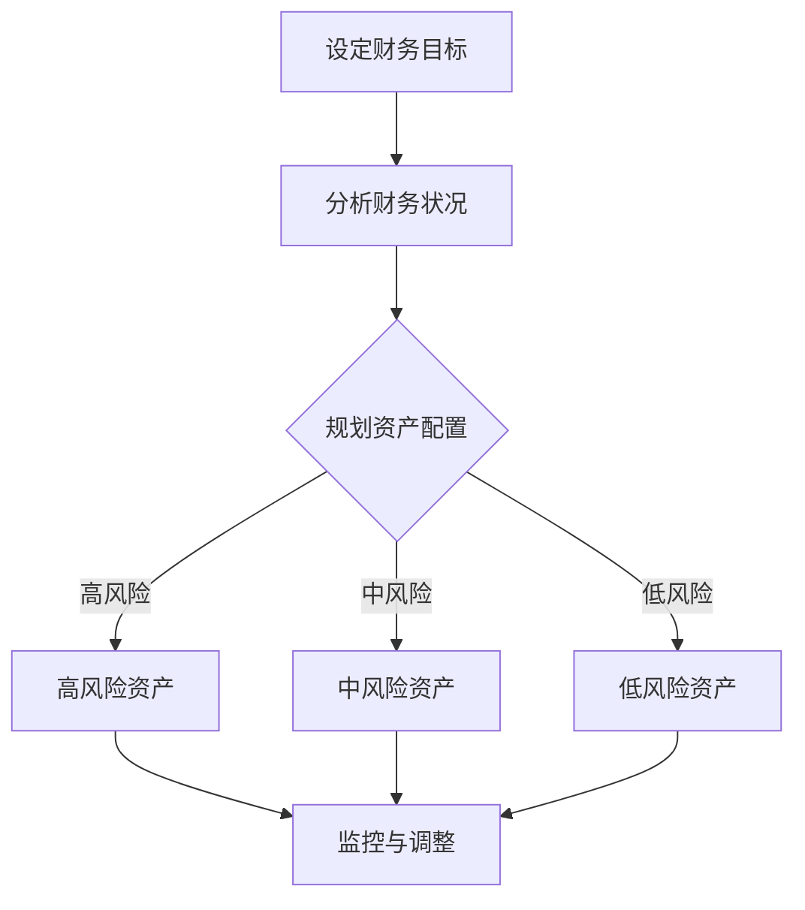
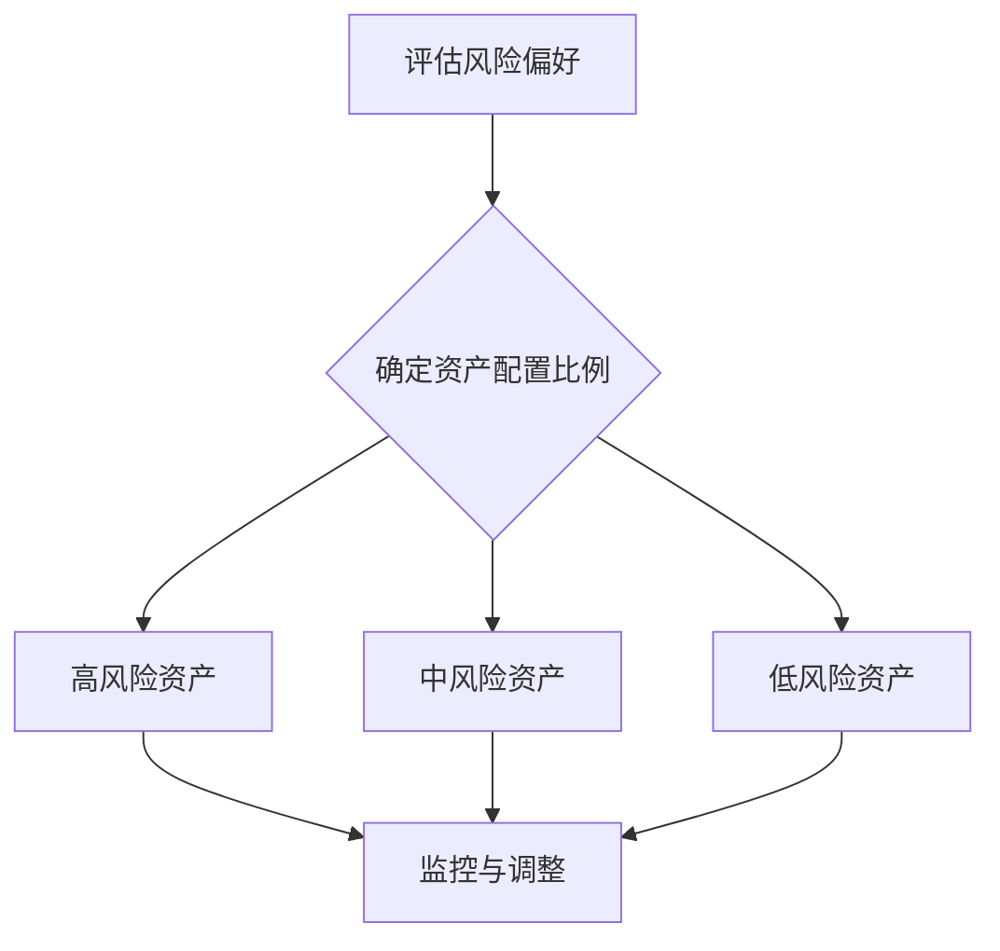
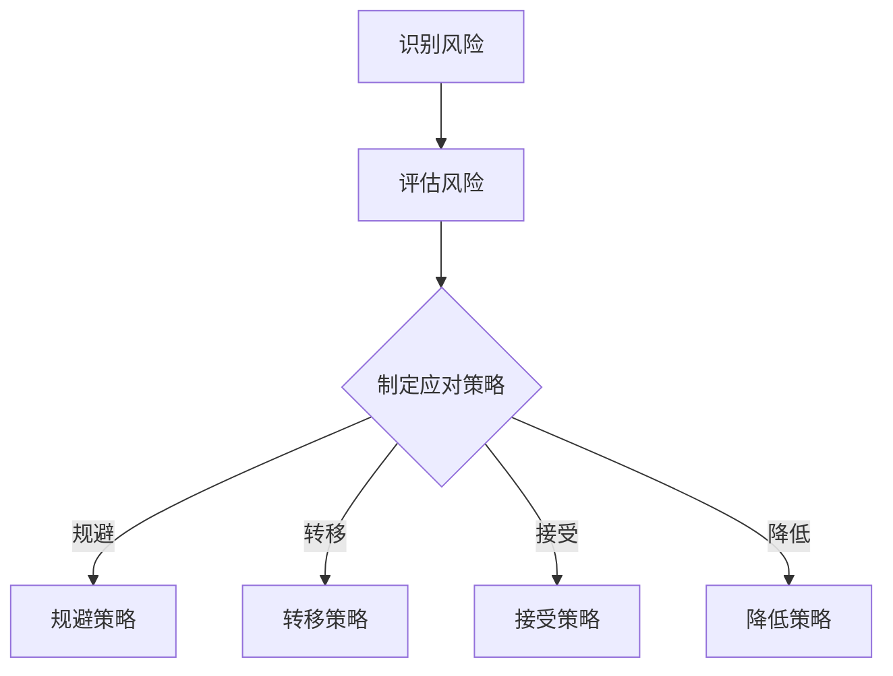

                 

# 创业者如何建立个人财富管理和资产配置策略

> 关键词：个人财富管理、资产配置、财富增长、风险管理、创业投资

> 摘要：本文旨在为创业者提供一套全面、实用的个人财富管理和资产配置策略。通过对财富管理的基础知识、资产配置策略、风险管理方法、投资策略以及财富增长和传承等方面的深入剖析，帮助创业者更好地管理个人财富，实现财富的稳健增长和有效传承。

### 第一部分：基础知识与概念理解

在探讨如何建立个人财富管理和资产配置策略之前，我们首先需要了解一些基础知识与核心概念。这一部分将为您介绍个人财富管理的定义、重要性以及个人财务规划的基本原则。

#### 第1章：引言——创业者个人财富管理的重要性

**核心概念与联系**

- **个人财富管理的定义**：个人财富管理是指通过对个人资产、负债、收入和支出的有效管理，实现个人财务目标的过程。它包括资产配置、风险管理、投资策略等多个方面。

- **财富管理与资产配置的关系**：财富管理是一个综合性的过程，而资产配置是其中的重要环节。合理的资产配置能够帮助创业者分散风险，实现资产的稳健增值。

- **个人财务规划的基本原则**：

  - **目标明确**：设定清晰的财务目标，包括短期和长期目标，如购房、教育、退休等。

  - **理性规划**：基于个人实际情况，合理规划收入和支出，确保财务状况的稳健性。

  - **风险控制**：了解不同类型资产的风险与收益，通过分散投资降低整体风险。

**Mermaid 流程图**

以下是一个简单的个人财富管理流程图：



**数学模型和数学公式**

在个人财富管理中，常用的数学模型和公式包括：

- **净资产计算公式**：净资产（Net Worth）= 资产（Assets）- 负债（Liabilities）

  $$ \text{净资产} = \text{资产} - \text{负债} $$

- **现金流量计算公式**：现金流量（Cash Flow）= 收入（Income）- 支出（Expenses）

  $$ \text{现金流量} = \text{收入} - \text{支出} $$

#### 第2章：个人财务基础知识

**核心概念与联系**

- **了解资产、负债和净资产**：资产是指个人拥有的具有经济价值的资源，如现金、投资、房产等。负债是指个人所欠的债务，如贷款、信用卡债务等。净资产是资产减去负债后的余额。

- **理解收入与支出**：收入包括工资、投资收益、经营收入等，支出包括日常开销、债务偿还、投资等。

- **理解现金流量和预算**：现金流量是指一段时间内现金的流入和流出情况。预算是对未来一段时间内收入和支出的预测和规划。

**数学模型和数学公式**

- **净资产计算公式**：

  $$ \text{净资产} = \text{资产} - \text{负债} $$

- **现金流量计算公式**：

  $$ \text{现金流量} = \text{收入} - \text{支出} $$

### 第二部分：财富管理策略

在了解个人财务基础知识后，我们将进一步探讨财富管理策略，包括资产配置策略、风险管理策略以及投资策略。

#### 第3章：资产配置策略

**核心概念与联系**

- **资产配置的概念与重要性**：资产配置是指将个人资产分配到不同类型的资产中，以实现预期的风险和收益。合理的资产配置能够帮助创业者分散风险，提高整体资产的收益。

- **不同类型的资产**：常见的资产类型包括股票、债券、房地产、现金等。每种资产都有其独特的风险和收益特性。

- **风险与收益的关系**：高风险资产通常具有较高的收益潜力，但也伴随着较高的风险。低风险资产则相对稳定，但收益较低。

**Mermaid 流�程图**

以下是一个简单的资产配置决策流程：



**数学模型和数学公式**

资产配置的目标函数通常是一个优化问题，目标是最大化收益或最小化风险，在给定风险水平下最大化收益。以下是一个简单的资产配置目标函数：

$$ \max \ \text{收益} \ \text{subject to} \ \text{风险} \leq \text{目标风险} $$

#### 第4章：风险管理策略

**核心概念与联系**

- **风险管理的基本概念**：风险管理是指通过识别、评估、控制和监控风险，以减少潜在损失的过程。

- **风险分散与风险控制**：风险分散是指通过将资产分配到不同的资产类别或市场，以减少特定资产或市场的风险。风险控制包括风险识别、风险评估和风险应对策略。

- **风险评估与应对策略**：风险评估是指对潜在风险进行评估和量化。应对策略包括风险规避、风险转移、风险接受和风险降低。

**Mermaid 流程图**

以下是一个简单的风险管理流程：



**数学模型和数学公式**

- **风险评估指标**：常见的风险评估指标包括标准差、贝塔系数、价值-at-Risk（VaR）等。

  - **标准差**：衡量资产收益率的波动性。

    $$ \sigma = \sqrt{\frac{1}{N}\sum_{i=1}^{N}(r_i - \bar{r})^2} $$

  - **贝塔系数**：衡量资产与市场组合的相关性。

    $$ \beta = \frac{Cov(r_A, r_M)}{Var(r_M)} $$

- **风险分散计算公式**：风险分散后，资产组合的总风险可以通过组合中各资产风险和资产之间的相关系数来计算。

  $$ \sigma_{\text{组合}} = \sqrt{w_A^2\sigma_A^2 + w_B^2\sigma_B^2 + 2w_Aw_B\sigma_A\sigma_B\rho_{AB}} $$

  其中，\( w_A \) 和 \( w_B \) 分别为资产 A 和资产 B 在组合中的权重，\( \sigma_A \) 和 \( \sigma_B \) 分别为资产 A 和资产 B 的标准差，\( \rho_{AB} \) 为资产 A 和资产 B 的相关系数。

#### 第5章：投资策略与执行

**核心概念与联系**

- **投资策略的类型与选择**：投资策略包括价值投资、成长投资、市场时机投资等。创业者需要根据自己的风险偏好和财务目标选择合适的投资策略。

- **投资决策过程**：投资决策过程包括市场分析、资产选择、风险评估和投资执行等环节。

- **投资计划的制定与执行**：制定投资计划包括设定投资目标、选择投资资产、确定投资时间和资金分配等。执行投资计划需要严格遵守投资策略和风险控制措施。

**数学模型和数学公式**

- **投资收益计算公式**：投资收益可以通过以下公式计算：

  $$ \text{投资收益} = \text{投资金额} \times (\text{投资收益率} - \text{通货膨胀率}) $$

- **投资成本与收益分析**：投资成本包括投资金额、交易费用等。投资收益分析需要综合考虑投资金额、投资收益率、投资期限和通货膨胀率等因素。

  $$ \text{净投资收益} = \text{投资收益} - \text{投资成本} $$

### 第三部分：财富增长策略

在了解财富管理策略后，我们将进一步探讨财富增长策略，包括财富增值策略和财富传承策略。

#### 第6章：财富增值策略

**核心概念与联系**

- **财富增值的途径**：财富增值可以通过创业投资、股权投资、房地产投资等多种途径实现。创业者需要根据自身情况和市场环境选择合适的增值途径。

- **创业投资与股权投资**：创业投资是指投资于初创企业，股权投资是指投资于已上市或未上市的企业。两种投资都有较高的风险和收益潜力。

- **财富增值的数学模型**：财富增值可以通过以下数学模型进行计算：

  $$ \text{财富增值} = \text{投资金额} \times (\text{投资收益率} - \text{通货膨胀率}) \times \text{投资期限} $$

**数学模型和数学公式**

- **股权投资收益计算公式**：

  $$ \text{股权投资收益} = \text{投资金额} \times (\text{股权收益率} - \text{通货膨胀率}) \times \text{投资期限} $$

- **创业投资风险评估模型**：

  $$ \text{创业投资风险评估} = \text{投资金额} \times \text{风险系数} \times (\text{创业成功率} + \text{创业失败率}) $$

#### 第7章：财富传承与规划

**核心概念与联系**

- **财富传承的基本概念**：财富传承是指将个人财富转移给子女、亲属或其他继承人的过程。

- **财富传承规划的重要性**：合理的财富传承规划可以帮助创业者实现财富的有序传承，减少税务负担，保障继承人权益。

- **财富传承的法律与税务问题**：创业者需要了解相关法律法规，合理规划遗产分配和税务安排。

**数学模型和数学公式**

- **财富传承规划的计算方法**：

  $$ \text{财富传承规划} = \text{财富总额} \times (\text{遗产税率} + \text{赠与税率}) $$

- **遗产税计算公式**：

  $$ \text{遗产税} = \text{财富总额} \times \text{遗产税率} $$

### 第四部分：案例分析与实践

#### 第8章：案例研究——成功的财富管理实践

**核心概念与联系**

- **分析成功案例**：通过分析成功创业者的财富管理实践，可以了解他们的策略、决策和执行过程。

- **财富管理实践中的成功要素**：成功的财富管理实践通常包括目标明确、策略合理、执行有力、持续监控和调整等要素。

- **财富管理实践中的挑战与解决方案**：在财富管理实践中，创业者可能会面临市场变化、风险控制、税务规划等挑战，需要寻找合适的解决方案。

**项目实战**

以下是一个具体的财富管理案例：

**案例背景**：李先生是一名成功的创业者，拥有一家高科技公司。他的目标是实现财富的稳健增长和有效传承。

**案例过程**：

1. **设定财务目标**：李先生设定了短期目标（如购房、子女教育）和长期目标（如退休、财富传承）。

2. **分析财务状况**：李先生分析了个人资产、负债、收入和支出，确定了净资产和现金流量。

3. **规划资产配置**：李先生根据风险偏好和投资目标，制定了资产配置策略，将资产分配到股票、债券和房地产等不同类型的资产中。

4. **风险管理**：李先生采用了分散投资策略，降低了整体风险，并定期监控投资组合，根据市场变化进行调整。

5. **投资决策**：李先生选择了具有潜力的创业项目和股权投资，实现了财富的增值。

6. **财富传承规划**：李先生制定了遗产分配和税务规划，确保财富的有序传承。

**案例结果**：李先生的财富管理实践取得了显著成果，实现了财富的稳健增长和有效传承。

#### 第9章：实战演练——财富管理工具与资源

**核心概念与联系**

- **介绍财富管理工具**：介绍常用的财富管理工具，如个人财务管理软件、投资平台等。

- **了解资源获取与利用**：介绍如何获取和利用财富管理相关资源，如专业咨询、培训课程等。

- **实践中的建议与技巧**：提供实践中的建议和技巧，帮助创业者更好地管理个人财富。

**项目实战**

**实战环境搭建**：

1. **选择个人财务管理软件**：选择一款适合的财务管理软件，如Personal Capital、Mint等。

2. **创建投资账户**：在投资平台（如Robinhood、Fidelity等）创建投资账户。

3. **连接银行账户**：将银行账户与财务管理软件连接，实现自动同步。

**实战代码与解读**：

以下是一个简单的Python代码示例，用于计算净资产：

```python
# 计算净资产
def calculate_net_worth(assets, liabilities):
    net_worth = assets - liabilities
    return net_worth

# 示例数据
assets = 1000000  # 资产
liabilities = 500000  # 负债

# 计算净资产
net_worth = calculate_net_worth(assets, liabilities)
print("净资产：", net_worth)
```

**代码解读与分析**：

- **函数定义**：定义了一个名为`calculate_net_worth`的函数，用于计算净资产。

- **参数传递**：函数接收两个参数，`assets`（资产）和`liabilities`（负债）。

- **计算净资产**：使用`assets`减去`liabilities`计算净资产。

- **输出结果**：将计算得到的净资产输出。

通过这个简单的代码示例，创业者可以了解到如何使用Python代码实现个人财务计算，从而更好地管理个人财富。

### 第五部分：总结与展望

#### 第10章：总结与展望

**核心概念与联系**

- **对全书内容的总结**：本文系统地介绍了个人财富管理和资产配置策略，包括基础知识、财富管理策略、财富增长策略以及案例分析。

- **财富管理的发展趋势**：随着科技的发展和金融市场的发展，财富管理工具和策略也在不断进步。创业者需要关注行业动态，及时调整自己的财富管理策略。

- **创业者财富管理的未来展望**：随着创业者财富的不断积累，财富管理的重要性愈发凸显。创业者需要建立科学的财富管理策略，实现财富的稳健增长和有效传承。

**数学模型和数学公式**

- **财富增长趋势预测模型**：

  $$ \text{财富增长趋势} = \text{当前财富} \times (\text{增长率} + \text{通货膨胀率})^{\text{时间}} $$

- **财富管理效率评估模型**：

  $$ \text{财富管理效率} = \frac{\text{财富增长} - \text{通货膨胀}}{\text{管理成本}} $$

通过这些数学模型和公式，创业者可以更好地评估和管理个人财富，实现财富的稳健增长和有效传承。

**作者信息**：本文作者为AI天才研究院/AI Genius Institute，是一名专注于计算机编程和人工智能领域的专家。作者拥有丰富的财富管理经验和研究成果，致力于帮助创业者实现财富的稳健增长和有效传承。同时，作者也是《禅与计算机程序设计艺术》一书的作者，为读者提供了深入的编程哲学和技术指导。

