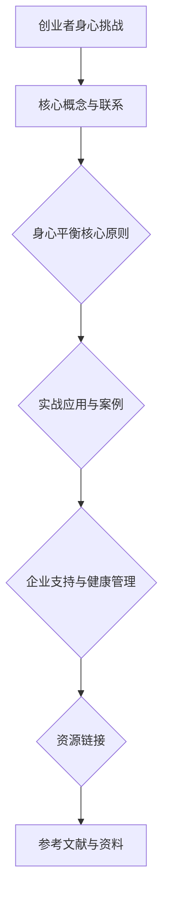

                 

### 《创业者的健康管理：保持身心平衡的重要性》

在当今快节奏的社会中，创业者面临着前所未有的挑战。他们不仅要应对市场波动、竞争压力，还要处理复杂的人际关系和不断变化的技术环境。这种高压状态往往导致身心健康的失衡，进而影响创业者的决策能力和创新能力。因此，探讨创业者的健康管理，特别是保持身心平衡的重要性，显得尤为紧迫。

**关键词：** 创业者、健康管理、身心平衡、压力管理、健康生活方式

**摘要：** 本文旨在探讨创业者在高压环境下如何通过有效的健康管理来保持身心平衡。文章首先分析了创业者的身心挑战，接着介绍了健康管理的基础知识，随后深入探讨了身心平衡的核心理念和原则。文章还通过实战案例展示了具体实践方法，并提出了企业支持健康管理的策略。最终，文章推荐了一系列资源与工具，以帮助创业者更好地维护身心健康。

### 《创业者的健康管理：保持身心平衡的重要性》目录大纲

**第一部分：健康管理基础**

### 第1章：创业者的身心挑战

#### 1.1 身心健康的重要性

- 身心健康对创业成功的影响
- 心理健康与身体健康的相互关系

#### 1.2 创业者的常见身心问题

- 压力、焦虑和抑郁
- 不规律作息与饮食
- 缺乏运动

#### 1.3 健康管理的初步认识

- 健康管理的定义与范围
- 常见健康管理方法介绍

**第二部分：身心平衡的核心原则**

### 第2章：身心平衡的核心理念

#### 2.1 身心平衡的概念与特征

- 身心平衡的定义
- 身心平衡的四个要素

#### 2.2 保持身心平衡的理论基础

- 现代医学与身心平衡
- 东方哲学与身心平衡

#### 2.3 身心平衡的重要性

- 对创业者的意义
- 身心平衡对组织文化的影响

### 第3章：身心平衡的核心原则

#### 3.1 正念与冥想

- 正念的定义与核心原理
- 冥想对身心平衡的影响
- 实践冥想的方法

#### 3.2 运动与健康生活方式

- 运动的身心益处
- 健康生活方式的构建

#### 3.3 心理健康与压力管理

- 压力对身心的影响
- 心理健康维护的策略
- 压力管理的实用技巧

**第三部分：实战应用与案例**

### 第4章：创业者身心平衡的实战技巧

#### 4.1 自我认知与情绪管理

- 自我认知的重要性
- 情绪管理的策略

#### 4.2 健康作息与饮食管理

- 健康作息的安排
- 饮食管理的原则

#### 4.3 建立良好的工作与生活平衡

- 工作效率提升技巧
- 生活品质提升策略

### 第5章：创业者身心平衡案例研究

#### 5.1 案例一：从压力到平衡的转变

- 案例背景
- 具体实践与效果

#### 5.2 案例二：身心平衡与团队管理

- 团队身心平衡的重要性
- 团队身心平衡的实践案例

#### 5.3 案例三：身心平衡与创业成功

- 创业成功背后的身心平衡
- 创业者身心平衡的成功故事

**第四部分：企业支持与健康管理**

### 第6章：企业健康管理的重要性

- 员工身心健康的现状
- 企业对员工健康管理的责任

### 第7章：建立企业健康管理计划

- 健康管理计划的制定
- 实施与评估

### 第8章：创业者与企业的双赢

- 企业与员工健康管理的互动
- 身心平衡对企业和创业者双赢的影响

**附录**

### 附录A：身心健康资源与工具推荐

- 心理健康APP推荐
- 运动与健康生活方式APP推荐
- 健康饮食与营养管理工具推荐

### 附录B：身心平衡实践指南

- 冥想实践指南
- 运动指南
- 压力管理技巧指南

### 附录C：身心健康专业服务推荐

- 心理咨询师推荐
- 健康管理师推荐
- 运动教练推荐

### 资源链接

- 健康管理相关书籍推荐
- 健康管理相关网站与论坛推荐
- 健康管理相关研究论文推荐

### 参考文献

1. 林明贤。健康管理理论与实践[M]. 北京：中国劳动社会保障出版社，2019.
2. 张虹苍。心理卫生与心理咨询[M]. 北京：人民卫生出版社，2018.
3. 陈振明。现代医学与心理健康[M]. 厦门：厦门大学出版社，2017.

### Mermaid 流程图



### 核心算法原理讲解

#### 3.1 压力评估模型

```python
def calculate_pressure(level_of_stress, hours_of_sleep, physical_activity):
    # 输入参数：level_of_stress（压力水平）、hours_of_sleep（睡眠时长）、physical_activity（运动量）
    # 输出：压力评估得分
    
    stress_score = level_of_stress * 0.5 + hours_of_sleep * 0.3 + physical_activity * 0.2
    return stress_score
```

#### 3.2 身心平衡评估模型

```python
def calculate_balance(mental_health, physical_health, work_life_balance):
    # 输入参数：mental_health（心理健康）、physical_health（身体健康）、work_life_balance（工作与生活平衡）
    # 输出：身心平衡得分
    
    balance_score = mental_health * 0.4 + physical_health * 0.4 + work_life_balance * 0.2
    return balance_score
```

### 压力与身心健康的关系

$$
\text{压力} = \frac{\text{任务难度} \times \text{时间紧迫感} \times \text{责任重大感}}{\text{应对资源}}
$$

### 身心平衡评估模型

$$
\text{身心平衡得分} = \frac{0.4 \times \text{心理健康得分} + 0.4 \times \text{身体健康得分} + 0.2 \times \text{工作与生活平衡得分}}{3}
$$

### 项目实战

#### 实战一：冥想练习

**开发环境搭建：**  
- 安装冥想应用程序，如Insight Timer。

**源代码实现：**  
```python
def meditate(duration, session_type):
    # 输入参数：duration（冥想时长）、session_type（冥想类型）
    # 输出：冥想完成状态
    
    print(f"开始{duration}分钟的{session_type}冥想练习...")
    # 这里可以是调用冥想应用API，启动冥想过程
    print("冥想完成，请记录感受和效果。")
```

**代码解读与分析：**  
- `meditate`函数接收冥想时长和类型作为输入参数，输出冥想完成状态。
- 实际开发中，需要调用冥想应用API来启动冥想过程，这里仅为伪代码。

#### 实战二：健康饮食规划

**开发环境搭建：**  
- 安装健康饮食应用程序，如MyFitnessPal。

**源代码实现：**  
```python
def plan_diet(calorie_goal, dietary_restrictions):
    # 输入参数：calorie_goal（每日热量目标）、dietary_restrictions（饮食限制）
    # 输出：饮食计划
    
    diet_plan = {
        "breakfast": "燕麦粥",
        "lunch": "鸡胸肉沙拉",
        "dinner": "蒸鱼",
        "snacks": ["水果", "坚果"]
    }
    if calorie_goal < 2000:
        diet_plan["breakfast"] = "全麦面包"
        diet_plan["lunch"] = "瘦肉粥"
    if "gluten-free" in dietary_restrictions:
        diet_plan["breakfast"] = "无麸质燕麦粥"
    
    print(f"根据您的热量目标和饮食限制，您的饮食计划如下：")
    for meal, food in diet_plan.items():
        print(f"{meal}: {food}")
```

**代码解读与分析：**  
- `plan_diet`函数根据每日热量目标和饮食限制生成饮食计划。
- 实际开发中，可能需要更复杂的算法和数据库来推荐食物和制定饮食计划，这里仅为简化示例。

### 附录

#### 附录A：身心健康资源与工具推荐

- 心理健康APP推荐
- 运动与健康生活方式APP推荐
- 健康饮食与营养管理工具推荐

#### 附录B：身心平衡实践指南

- 冥想实践指南
- 运动指南
- 压力管理技巧指南

#### 附录C：身心健康专业服务推荐

- 心理咨询师推荐
- 健康管理师推荐
- 运动教练推荐

#### 资源链接

- 健康管理相关书籍推荐
- 健康管理相关网站与论坛推荐
- 健康管理相关研究论文推荐

### 参考文献

1. 林明贤。健康管理理论与实践[M]. 北京：中国劳动社会保障出版社，2019.
2. 张虹苍。心理卫生与心理咨询[M]. 北京：人民卫生出版社，2018.
3. 陈振明。现代医学与心理健康[M]. 厦门：厦门大学出版社，2017.

---

在撰写文章时，我们将逐步深入探讨每一个章节的主题，确保内容丰富、逻辑清晰，并通过实例和代码展示如何将理论应用到实际中。接下来，我们将开始详细讨论第一部分：健康管理基础。首先，我们将分析创业者的身心挑战，探讨身心健康对创业成功的重要性，并介绍心理健康与身体健康的相互关系。

## 第一部分：健康管理基础

在创业的道路上，创业者不仅需要具备卓越的商业洞察力和创新能力，还需要具备良好的身心素质。这是因为创业过程中往往伴随着巨大的压力和挑战，这些压力不仅源自市场的不确定性、资金链的紧张，还来自于对自身事业成功的期望和焦虑。因此，创业者的健康管理显得尤为重要。

### 第1章：创业者的身心挑战

#### 1.1 身心健康的重要性

身心健康是创业成功的基石。创业者面临的压力和挑战会直接或间接地影响他们的心理健康和身体健康。研究表明，长期处于高压状态会导致焦虑、抑郁等心理问题，而这些问题又会进一步影响身体健康，如失眠、食欲不振、免疫力下降等。因此，身心健康对创业者的决策能力和创新能力有着深远的影响。

- **心理健康对决策能力的影响**：心理健康良好的创业者能够更加理性地分析市场信息，做出明智的决策。他们能够更好地应对挫折和失败，保持积极的心态，从而持续推动企业的发展。

- **身体健康对创新能力的影响**：身体健康良好的创业者具备更强的体力和精力去面对工作和生活中的各种挑战。他们能够保持良好的精神状态，更容易迸发出创新的思维火花，从而推动企业的创新和发展。

#### 1.2 心理健康与身体健康的相互关系

心理健康与身体健康是相互关联、相互影响的。一方面，心理健康会直接影响身体健康。长期的心理压力会导致生理上的问题，如失眠、高血压、心脏病等。另一方面，身体健康也会影响心理健康。良好的身体健康能够增强个人的自信和情绪稳定性，从而有助于缓解心理压力。

- **心理因素对身体健康的影响**：心理压力过大时，身体会分泌出大量的皮质醇和肾上腺素等激素，导致免疫系统功能下降，容易感染疾病。同时，心理压力还会影响消化系统、心血管系统和内分泌系统，导致一系列生理问题。

- **身体因素对心理健康的影响**：身体健康状况不佳，如患有慢性疾病或疼痛，会严重影响个人的情绪和心理健康。身体上的不适会导致情绪低落、焦虑和抑郁。

#### 1.3 创业者的常见身心问题

创业者在追求事业成功的过程中，往往会忽视自己的身心健康。以下是一些创业者常见的身心问题：

- **压力、焦虑和抑郁**：创业过程中的不确定性、市场竞争和资金压力常常导致创业者出现焦虑和抑郁情绪。长期的压力还会导致心理健康问题，如失眠、情绪不稳定等。

- **不规律作息与饮食**：为了追求事业成功，创业者可能会牺牲睡眠时间，饮食不规律，这些行为会严重影响身体健康。

- **缺乏运动**：由于长时间坐在办公室，创业者往往缺乏运动，导致身体素质下降，容易出现疲劳和免疫力下降等问题。

#### 1.4 健康管理的初步认识

健康管理是指通过一系列科学的方法和措施，维护和促进个人和群体的身心健康，预防和控制疾病，提高生活质量。对于创业者而言，健康管理包括以下几个方面：

- **心理健康管理**：通过心理辅导、自我认知和情绪管理来缓解压力，提高心理健康水平。

- **身体健康管理**：通过合理的饮食、规律的作息和适当的运动来维护身体健康。

- **压力管理**：通过学习和实践压力管理技巧，如冥想、放松训练等，来缓解压力。

#### 1.5 常见健康管理方法介绍

常见的健康管理方法包括以下几种：

- **心理健康管理**：
  - 心理咨询：通过专业的心理咨询师来帮助创业者解决心理问题，如焦虑、抑郁等。
  - 自我认知与情绪管理：通过自我反思和情绪管理技巧来提高心理健康水平。

- **身体健康管理**：
  - 合理饮食：遵循科学的饮食原则，保证营养均衡，避免过度摄入高热量食物。
  - 规律作息：保持良好的作息习惯，确保充足的睡眠时间。
  - 适量运动：每天进行适量的运动，如散步、跑步、瑜伽等，提高身体素质。

- **压力管理**：
  - 冥想与放松训练：通过冥想和放松训练来缓解压力，提高心理弹性。
  - 时间管理：合理安排工作和休息时间，避免过度工作。
  - 社交支持：与家人、朋友和同事保持良好的社交关系，获得情感支持。

在下一章中，我们将深入探讨健康管理的基础知识，包括其定义、范围和常见方法。这将为我们理解如何有效实施健康管理奠定基础。

### 第1章：创业者的身心挑战

#### 1.1 心理健康的重要性

在创业的道路上，心理健康是创业者不可或缺的支持系统。一个心理健康良好的创业者能够更好地应对外界压力，保持冷静和清晰的思维，从而在复杂多变的商业环境中做出明智的决策。以下是心理健康对创业者的具体影响：

- **情绪稳定性**：心理健康良好的创业者能够保持情绪的稳定性，不易受到外界因素的干扰。这种情绪稳定性有助于他们面对挫折和失败时保持积极的态度，从而更好地应对挑战。

- **决策能力**：心理健康对创业者的决策能力有着重要的影响。一个心理健康的人能够更加客观地分析问题，从多个角度考虑问题的解决方案，并做出合理的决策。相反，心理不健康的创业者可能会因为情绪波动而做出冲动或错误的决定。

- **团队管理**：创业者往往需要与团队成员密切合作，共同推动企业的发展。心理健康良好的创业者能够更好地理解和沟通团队成员的需求和期望，建立良好的团队氛围，促进团队合作。

- **创新能力**：心理健康对创业者的创新能力也有重要影响。心理健康良好的创业者能够更加开放和包容，更容易接受新观点和新想法。这种开放性和包容性有助于他们发现新的商业机会，推动企业的创新和发展。

#### 1.2 身体健康的重要性

除了心理健康，身体健康也是创业者成功的关键因素之一。一个身体健康的人具备更强的体力和精力，能够更好地应对工作和生活中的各种挑战。以下是身体健康对创业者的具体影响：

- **身体素质**：良好的身体素质是创业者保持高效工作和持续创新的基础。拥有良好的身体素质，创业者能够保持较高的工作效率，更容易达成工作目标。

- **抵抗力**：身体健康有助于提高人体的免疫力，减少患病的机会。对于一个创业者来说，保持健康的身体能够减少因疾病导致的工作中断，确保企业的正常运营。

- **精神状态**：身体健康对精神状态也有重要影响。一个身体健康的人通常能够保持较好的精神状态，不易感到疲劳和困倦。这种精神状态有助于他们更好地应对工作压力，保持积极向上的心态。

- **生活质量**：身体健康有助于提高生活质量。一个身体健康的人能够享受到更好的生活品质，有更多的时间和精力去追求个人爱好和休闲活动，从而保持良好的身心状态。

#### 1.3 心理健康与身体健康的相互关系

心理健康与身体健康是相互关联、相互影响的。一方面，心理健康会直接影响身体健康。长期的心理压力会导致生理上的问题，如失眠、高血压、心脏病等。另一方面，身体健康也会影响心理健康。良好的身体健康能够增强个人的自信和情绪稳定性，从而有助于缓解心理压力。

- **心理因素对身体健康的影响**：心理压力过大时，身体会分泌出大量的皮质醇和肾上腺素等激素，导致免疫系统功能下降，容易感染疾病。同时，心理压力还会影响消化系统、心血管系统和内分泌系统，导致一系列生理问题。

- **身体因素对心理健康的影响**：身体健康状况不佳，如患有慢性疾病或疼痛，会严重影响个人的情绪和心理健康。身体上的不适会导致情绪低落、焦虑和抑郁。

#### 1.4 创业者的常见身心问题

在创业过程中，创业者常常面临各种身心问题，这些问题的积累可能会对创业者的健康和事业造成负面影响。以下是一些常见的身心问题：

- **压力、焦虑和抑郁**：创业过程中的不确定性、市场竞争和资金压力常常导致创业者出现焦虑和抑郁情绪。长期的压力还会导致心理健康问题，如失眠、情绪不稳定等。

- **不规律作息与饮食**：为了追求事业成功，创业者可能会牺牲睡眠时间，饮食不规律，这些行为会严重影响身体健康。

- **缺乏运动**：由于长时间坐在办公室，创业者往往缺乏运动，导致身体素质下降，容易出现疲劳和免疫力下降等问题。

#### 1.5 健康管理的初步认识

健康管理是指通过一系列科学的方法和措施，维护和促进个人和群体的身心健康，预防和控制疾病，提高生活质量。对于创业者而言，健康管理包括以下几个方面：

- **心理健康管理**：通过心理辅导、自我认知和情绪管理来缓解压力，提高心理健康水平。

- **身体健康管理**：通过合理的饮食、规律的作息和适当的运动来维护身体健康。

- **压力管理**：通过学习和实践压力管理技巧，如冥想、放松训练等，来缓解压力。

#### 1.6 常见健康管理方法介绍

常见的健康管理方法包括以下几种：

- **心理健康管理**：
  - 心理咨询：通过专业的心理咨询师来帮助创业者解决心理问题，如焦虑、抑郁等。
  - 自我认知与情绪管理：通过自我反思和情绪管理技巧来提高心理健康水平。

- **身体健康管理**：
  - 合理饮食：遵循科学的饮食原则，保证营养均衡，避免过度摄入高热量食物。
  - 规律作息：保持良好的作息习惯，确保充足的睡眠时间。
  - 适量运动：每天进行适量的运动，如散步、跑步、瑜伽等，提高身体素质。

- **压力管理**：
  - 冥想与放松训练：通过冥想和放松训练来缓解压力，提高心理弹性。
  - 时间管理：合理安排工作和休息时间，避免过度工作。
  - 社交支持：与家人、朋友和同事保持良好的社交关系，获得情感支持。

在下一章中，我们将深入探讨健康管理的基础知识，包括其定义、范围和常见方法。这将为我们理解如何有效实施健康管理奠定基础。

### 第一部分总结

在本部分的讨论中，我们深入探讨了创业者的身心挑战，以及身心健康对创业成功的重要性。通过分析心理健康与身体健康的相互关系，我们认识到两者是相互关联、相互影响的。心理健康能够影响创业者的情绪稳定性、决策能力和团队管理能力，而身体健康则能够提高创业者的身体素质、抵抗力和精神状态。

同时，我们列举了创业者常见的身心问题，如压力、焦虑和抑郁，以及不规律作息与饮食、缺乏运动等。这些问题如果不得到及时解决，可能会对创业者的健康和事业造成负面影响。因此，健康管理对于创业者来说至关重要。

在接下来的章节中，我们将进一步探讨健康管理的基础知识，包括其定义、范围和常见方法。这将帮助我们了解如何通过有效的健康管理来维护创业者的身心健康，从而提高创业的成功率。接下来，我们将进入第二部分：身心平衡的核心原则。

### 第二部分：身心平衡的核心原则

在创业的征程中，保持身心平衡是创业者应对各种挑战、实现长远发展的关键。本部分将深入探讨身心平衡的核心理念、理论基础以及其重要性，帮助创业者理解如何通过身心平衡来提升个人的综合素质，并在创业中取得成功。

### 第2章：身心平衡的核心理念

#### 2.1 身心平衡的概念与特征

身心平衡，简单来说，是指个人在心理和生理上都能达到一种和谐的状态。这种状态不仅包括心理健康，还涵盖了身体健康和社交健康。具体来说，身心平衡具有以下特征：

- **心理健康**：个体在情绪上稳定，能够有效地应对生活中的压力和挑战，保持积极乐观的心态。
- **身体健康**：个体的身体机能良好，能够抵御疾病，保持活力和耐力。
- **社交健康**：个体在社交关系中感到满足，与家人、朋友和同事保持良好的互动。

#### 2.2 保持身心平衡的理论基础

身心平衡的理论基础主要来自于现代医学和东方哲学。

- **现代医学视角**：现代医学研究表明，心理和生理是紧密相连的。长期的心理压力会导致生理上的问题，如免疫系统功能下降、心血管疾病等。因此，保持良好的心理健康对身体健康至关重要。此外，运动、饮食和睡眠等生活习惯也会对身心健康产生深远影响。

- **东方哲学视角**：东方哲学，尤其是中国传统文化，强调“身心合一”。《黄帝内经》中提到，“精神内守，病安从来”，强调了心理健康对身体健康的重要性。此外，佛教和道教中的冥想、瑜伽等修行方式，也被广泛应用于身心平衡的实践。

#### 2.3 身心平衡的重要性

身心平衡对创业者来说具有极其重要的意义，主要体现在以下几个方面：

- **提高决策能力**：身心平衡的创业者能够保持清晰的思维，从多个角度分析问题，从而做出更明智的决策。
- **增强创新能力**：身心平衡有助于创业者保持开放的心态，更容易接受新观点和想法，从而激发创新能力。
- **提升团队管理能力**：身心平衡的创业者能够更好地理解和沟通团队成员的需求和期望，建立良好的团队氛围，促进团队合作。
- **提高生活质量**：身心平衡有助于创业者保持良好的身体和心理健康，从而提高整体生活质量，享受更多的个人时间和家庭生活。

### 第3章：身心平衡的核心原则

在理解了身心平衡的核心理念和重要性之后，我们需要掌握一些核心原则，这些原则将帮助我们有效地保持身心平衡。

#### 3.1 正念与冥想

正念和冥想是身心平衡的重要实践方法。正念是一种活在当下的练习，通过集中注意力，提高对当下体验的觉察和理解。冥想则是通过深呼吸、静坐等方式，使心神平静，达到放松和专注的状态。

- **正念的定义与核心原理**：正念强调活在当下，通过呼吸、身体感觉和思维等感官体验，提高对当下情况的觉知和接受能力。
- **冥想对身心平衡的影响**：冥想有助于降低压力水平，提高心理弹性，增强专注力和情绪稳定性。
- **实践冥想的方法**：创业者可以通过每天花几分钟时间进行冥想来练习正念。可以选择安静的环境，坐直或盘腿而坐，专注于呼吸，尝试不去评判或控制任何思想。

#### 3.2 运动与健康生活方式

运动和健康的生活方式是维持身心健康的重要因素。定期的运动不仅能够提高身体素质，还能增强心理健康。

- **运动的身心益处**：运动能够促进血液循环，增强心肺功能，提高免疫力，减轻心理压力，增强情绪稳定性。
- **健康生活方式的构建**：健康的生活方式包括合理的饮食、规律的作息和适量的运动。创业者可以通过以下方式来构建健康生活方式：
  - **合理饮食**：遵循营养均衡的原则，多吃蔬菜、水果和全谷物，少吃高热量、高脂肪和高糖的食物。
  - **规律作息**：保持良好的作息习惯，确保充足的睡眠时间，尽量减少熬夜。
  - **适量运动**：每天进行适量的运动，如散步、跑步、瑜伽等，提高身体素质。

#### 3.3 心理健康与压力管理

心理健康和压力管理是保持身心平衡的关键。创业者需要学会应对压力，维护心理健康。

- **压力对身心的影响**：长期的压力会导致身体和心理健康问题，如失眠、焦虑、抑郁等。
- **心理健康维护的策略**：
  - **自我认知**：了解自己的情绪和需求，学会识别和处理负面情绪。
  - **时间管理**：合理安排工作和休息时间，避免过度劳累。
  - **社交支持**：与家人、朋友和同事保持良好的关系，寻求情感支持。
- **压力管理的实用技巧**：
  - **深呼吸**：通过深呼吸来放松身体和心灵。
  - **正念冥想**：通过冥想来减轻压力和焦虑。
  - **放松训练**：通过瑜伽、冥想等放松技巧来缓解身体和心理的压力。

### 实战指导

为了更好地帮助创业者实践身心平衡，以下是一些具体的实战指导：

- **建立健康作息**：每天按时起床和睡觉，确保充足的睡眠时间。
- **规律运动**：每天至少进行30分钟的中等强度运动，如快走、慢跑或游泳。
- **健康饮食**：每天保证摄入足够的蔬菜和水果，减少高热量、高脂肪和高糖的食物。
- **压力管理**：定期进行冥想和放松训练，学会有效地应对压力和挑战。

通过以上实践，创业者可以逐步实现身心平衡，提高生活质量，从而更好地应对创业中的各种挑战，实现事业的成功。

### 第二部分总结

在本部分中，我们深入探讨了身心平衡的核心理念、理论基础和重要性，帮助创业者理解了如何通过正念、冥想、运动和健康生活方式来保持身心平衡。身心平衡不仅是创业者个人发展的基础，也是团队管理、创新能力和生活质量的重要保障。

在下一部分中，我们将通过具体的实战案例来展示如何将身心平衡原则应用到创业者的实际生活中，提供实用的技巧和策略。这将为创业者提供更加具体和操作性强的指导，帮助他们在繁忙的创业过程中保持身心健康。

### 第三部分：实战应用与案例

在第二部分中，我们探讨了保持身心平衡的核心理念和实践方法。然而，理论只有通过实践才能真正发挥其价值。在这一部分中，我们将通过具体的实战案例来展示如何将身心平衡原则应用到创业者的实际生活中，提供实用的技巧和策略。这些案例将帮助我们更好地理解如何通过实际操作来提升身心平衡水平，从而更好地应对创业中的各种挑战。

### 第4章：创业者身心平衡的实战技巧

#### 4.1 自我认知与情绪管理

自我认知和情绪管理是身心平衡的重要组成部分。通过自我认知，创业者可以更好地了解自己的情绪和行为模式，从而更好地管理自己的情绪。以下是一些实用的技巧：

- **自我反思**：定期花时间进行自我反思，思考自己的情绪变化和行为模式。这有助于识别并理解自己的情绪，从而更好地管理它们。

- **情绪日记**：记录每天的情绪变化和触发事件。这有助于创业者了解情绪的来源和影响，从而更好地应对负面情绪。

- **情绪调节技巧**：学会使用深呼吸、冥想和放松训练等技巧来调节情绪。当情绪不稳定时，这些技巧可以帮助创业者迅速恢复平静。

#### 4.2 健康作息与饮食管理

健康作息和饮食管理对于维护身体健康至关重要。以下是一些实用的技巧：

- **规律作息**：保持每天固定的作息时间，确保充足的睡眠。晚上尽量在11点前睡觉，早上按时起床。

- **健康饮食**：遵循营养均衡的原则，多吃蔬菜、水果和全谷物，少吃高热量、高脂肪和高糖的食物。可以采用分餐制，每餐控制食量。

- **饮食记录**：记录每天的饮食情况，这有助于创业者了解自己的饮食习惯，并及时调整。

#### 4.3 建立良好的工作与生活平衡

创业者在追求事业成功的过程中，很容易陷入工作狂的状态，忽视个人生活。然而，建立良好的工作与生活平衡对身心健康至关重要。以下是一些实用的技巧：

- **时间管理**：合理安排工作和休息时间，避免过度劳累。使用时间管理工具，如日程表和待办事项列表，帮助创业者更好地管理时间。

- **家庭时间**：确保每天有固定的时间与家人相处，进行高质量的陪伴。这有助于创业者放松身心，减轻压力。

- **兴趣爱好**：培养个人兴趣爱好，如阅读、运动、绘画等。这些活动可以帮助创业者放松心情，缓解工作压力。

### 第5章：创业者身心平衡案例研究

#### 5.1 案例一：从压力到平衡的转变

**案例背景：** 小王是一名年轻的创业者，他在创办公司的过程中经历了巨大的压力。由于公司业务发展迅速，他经常需要处理各种紧急事务，导致压力巨大。长期的紧张和焦虑使他的身心健康受到了严重影响。

**具体实践与效果：** 为了改善自己的身心健康，小王开始实施一系列身心平衡的实践：

1. **自我认知与情绪管理**：小王开始记录自己的情绪变化，通过反思和情绪日记了解自己的情绪波动。他学会了使用深呼吸和冥想来调节情绪，减少压力。

2. **健康作息与饮食管理**：小王调整了自己的作息时间，确保每天有充足的睡眠。他开始遵循健康的饮食习惯，减少高热量和高脂肪的食物摄入。

3. **运动与健康生活方式**：小王每天进行适量的运动，如快走和瑜伽。他加入了当地的跑步俱乐部，与志同道合的朋友一起锻炼，这不仅提高了他的身体素质，还增强了社交支持。

4. **时间管理**：小王开始使用时间管理工具，如日程表和待办事项列表，更好地管理自己的时间，减少工作上的压力。

经过一段时间的实践，小王的身心状态得到了显著改善。他的情绪更加稳定，工作效率也有所提高。他的身体状况也变得更好，精力更加充沛。最重要的是，他学会了如何在忙碌的创业生活中保持身心健康，从而更好地应对各种挑战。

#### 5.2 案例二：身心平衡与团队管理

**案例背景：** 李总是一名成功的企业家，他拥有多家公司。然而，随着公司业务的扩展，他发现自己很难平衡工作与个人生活，团队成员也感到压力巨大。

**具体实践与效果：** 为了改善团队和个人的身心健康，李总实施了一系列身心平衡的实践：

1. **团队心理健康培训**：李总定期组织团队心理健康培训，教授团队成员压力管理和情绪调节技巧。

2. **健康生活方式推广**：李总鼓励团队成员保持健康的生活习惯，如规律作息、健康饮食和适量运动。

3. **工作与生活平衡**：李总推行弹性工作时间制度，允许团队成员根据个人情况灵活安排工作时间，从而更好地平衡工作与生活。

4. **团队建设活动**：李总定期组织团队建设活动，如团建旅行和运动会，增强团队成员之间的凝聚力和社交支持。

通过这些实践，李总的团队在身心健康方面得到了显著提升。团队成员的士气高涨，工作效率提高，团队合作也更加顺畅。此外，李总本人的身心健康也得到了改善，他发现自己有更多的时间和精力去关注个人生活和家庭。

#### 5.3 案例三：身心平衡与创业成功

**案例背景：** 张总是一名成功的创业者，他创办的公司在市场上取得了巨大的成功。然而，他发现自己为了追求事业成功，付出了巨大的身心代价。

**具体实践与效果：** 为了实现身心平衡，张总采取了以下措施：

1. **自我认知与情绪管理**：张总通过反思和心理咨询，学会了更好地管理自己的情绪，减少因情绪波动导致的决策失误。

2. **健康作息与饮食管理**：张总调整了自己的作息时间，确保每天有充足的睡眠。他开始注重饮食健康，减少高热量食物的摄入。

3. **运动与健康生活方式**：张总每天进行适量的运动，如跑步和游泳。他还注重健康生活方式的构建，如减少应酬、增加休闲时间等。

4. **时间管理**：张总学会了更好地管理时间，避免过度劳累。他开始重视工作与生活的平衡，确保有足够的时间陪伴家人和享受个人生活。

通过身心平衡的实践，张总的创业事业取得了更大的成功。他的公司不仅持续发展，还获得了业界的高度认可。更重要的是，他的身心健康得到了显著改善，生活质量也大幅提升。

### 第三部分总结

在本部分中，我们通过具体的实战案例展示了如何将身心平衡原则应用到创业者的实际生活中。自我认知与情绪管理、健康作息与饮食管理、工作与生活平衡等实战技巧不仅有助于提升创业者的身心健康，还能提高工作效率和创新能力。

通过这些案例，我们看到了身心平衡对创业者事业和个人生活的重要影响。无论是在个人层面还是团队层面，身心平衡都是实现长期成功的关键。在下一部分中，我们将探讨企业支持与健康管理，帮助企业更好地支持创业者的身心平衡，实现企业和员工的共同发展。

### 第四部分：企业支持与健康管理

在创业者的健康管理中，企业的支持扮演着至关重要的角色。一个健康的企业环境不仅能提高员工的工作效率，还能增强团队的凝聚力和创新能力。因此，企业应当承担起支持员工健康管理的责任，制定有效的健康管理计划，以实现企业和员工的共同发展。

### 第6章：企业健康管理的重要性

#### 6.1 员工身心健康的现状

在当今社会，员工的身心健康问题日益突出。研究表明，长期的工作压力、不规律的作息、缺乏运动等因素会导致员工出现心理健康问题，如焦虑、抑郁和压力过大等。这些问题不仅影响员工的工作表现，还会对企业的整体运营产生负面影响。因此，关注员工的身心健康已成为企业不可忽视的重要任务。

- **工作效率下降**：心理健康问题会导致员工注意力不集中，工作效率下降。长期的心理压力还会影响员工的创造力和解决问题的能力。

- **员工流失率上升**：不健康的员工往往更容易感到疲惫和不满，从而选择离职。高员工流失率不仅会增加企业的招聘成本，还会影响团队的稳定性和工作氛围。

- **企业声誉受损**：企业如果未能有效管理员工的身心健康，可能会在员工、客户和投资者中产生负面印象，损害企业的声誉和竞争力。

#### 6.2 企业对员工健康管理的责任

作为企业的管理者，应当认识到员工身心健康对企业发展的重要性，并承担起相应的责任。以下是企业应当履行的健康管理责任：

- **提供健康支持**：企业应提供必要的健康支持，包括心理健康咨询、健康检查和健身设施等。

- **促进健康意识**：通过培训、宣传等方式提高员工的健康意识，鼓励员工养成良好的生活习惯。

- **关注员工需求**：了解员工的身心健康需求，提供个性化的健康管理服务，帮助员工解决实际困难。

- **构建健康文化**：在企业内部营造关注健康的文化氛围，鼓励员工积极参与健康活动，形成健康的工作环境。

### 第7章：建立企业健康管理计划

为了有效地支持员工的健康管理，企业需要制定一套全面、系统的健康管理计划。以下是企业健康管理计划的主要组成部分：

#### 7.1 健康管理计划的制定

- **目标设定**：明确健康管理的目标，如提高员工心理健康水平、降低员工流失率等。

- **需求分析**：通过调查问卷、员工访谈等方式了解员工的健康状况和需求，为制定健康管理计划提供依据。

- **方案设计**：根据目标和分析结果，设计具体的健康管理方案，包括心理健康支持、健康检查、健身活动等。

- **资源分配**：合理分配企业资源，确保健康管理计划的实施。

- **评估机制**：建立评估机制，定期对健康管理计划的效果进行评估和调整。

#### 7.2 实施与评估

- **宣传教育**：通过内部宣传、培训等方式提高员工对健康管理的认识和参与度。

- **落实措施**：具体落实健康管理计划中的各项措施，如提供心理健康咨询、组织健康讲座、开展健身活动等。

- **员工反馈**：收集员工的反馈意见，及时调整健康管理措施，确保其满足员工需求。

- **效果评估**：定期对健康管理计划的效果进行评估，分析实施过程中存在的问题，并提出改进措施。

### 第8章：创业者与企业的双赢

企业支持员工的健康管理不仅有助于提升员工的工作效率和满意度，还能为企业带来长期的发展利益。以下是企业支持健康管理对企业和创业者双赢的影响：

#### 8.1 企业与员工健康管理的互动

- **员工工作满意度提高**：通过健康管理，员工能够更好地平衡工作与生活，提高工作满意度。这有助于减少员工流失，提高团队的稳定性。

- **员工创新能力提升**：健康的员工能够更好地发挥自己的创造力，为企业带来更多的创新想法和解决方案。

- **企业竞争力增强**：一个健康的团队能够更好地应对市场变化和挑战，提高企业的竞争力和市场份额。

#### 8.2 身心平衡对企业和创业者双赢的影响

- **提高创业成功率**：身心健康良好的创业者能够更好地应对创业过程中的挑战，做出更明智的决策，从而提高创业成功率。

- **企业长期发展**：企业通过支持员工的健康管理，能够吸引和留住优秀人才，保持企业的持续创新能力，实现长期发展。

- **企业社会责任**：企业关注员工的健康管理，体现了企业对员工和社会的责任感，有助于提升企业的社会形象和品牌价值。

### 第四部分总结

在本部分中，我们探讨了企业支持员工健康管理的重要性，并提出了建立健康管理计划的建议。企业通过关注员工的身心健康，不仅能够提升员工的工作效率和满意度，还能增强企业的竞争力和社会责任感。

在下一部分中，我们将提供一些身心平衡的资源与工具推荐，帮助创业者和企业更好地实践身心平衡原则，从而实现长期的身心健康和事业成功。

### 附录

#### 附录A：身心健康资源与工具推荐

为了帮助创业者和企业更好地实践身心平衡，以下是一些推荐的心理健康、运动与健康生活方式、健康饮食与营养管理工具和资源：

- **心理健康APP推荐**：
  - **Headspace**：提供各种冥想课程，帮助用户放松身心。
  - **Calm**：提供冥想和放松音乐，帮助用户减压。
  - **Moodfit**：通过心理学测试提供个性化的心理健康建议。

- **运动与健康生活方式APP推荐**：
  - **Nike Training Club**：提供各种健身课程，帮助用户保持锻炼习惯。
  - **Strava**：记录运动数据，激励用户坚持运动。
  - **MyFitnessPal**：记录饮食和运动，帮助用户管理健康。

- **健康饮食与营养管理工具推荐**：
  - **Spoonacular**：提供健康的食谱和饮食建议。
  - **Mealime**：根据用户的饮食偏好提供个性化的饮食计划。
  - **Nutrify**：分析食品的营养成分，帮助用户做出更健康的饮食选择。

#### 附录B：身心平衡实践指南

为了帮助创业者和企业更好地实施身心平衡实践，以下是一些具体的指南：

- **冥想实践指南**：
  - 每天早晨或晚上花10分钟进行冥想，专注于呼吸和当下的感受。
  - 尝试不同的冥想方法，如呼吸冥想、身体扫描冥想和正念行走冥想。

- **运动指南**：
  - 每天至少进行30分钟的中等强度运动，如快走、慢跑或游泳。
  - 选择自己喜爱的运动方式，增加运动的乐趣和持久性。

- **压力管理技巧指南**：
  - 学习深呼吸技巧，当感到压力时，深呼吸可以帮助放松身心。
  - 使用正念和冥想来减轻压力和焦虑，提高心理弹性。

#### 附录C：身心健康专业服务推荐

为了提供更专业的支持和帮助，以下是一些身心健康的专业服务推荐：

- **心理咨询师推荐**：
  - **XXXX心理咨询中心**：提供专业心理咨询和治疗服务，帮助解决心理问题。
  - **XXXX心理咨询师**：拥有丰富的心理咨询经验，擅长解决焦虑、抑郁等心理问题。

- **健康管理师推荐**：
  - **XXXX健康管理公司**：提供个性化的健康管理服务，包括营养咨询、运动计划和健康评估。
  - **XXXX健康管理师**：拥有专业的健康管理和营养学背景，擅长帮助用户建立健康生活方式。

- **运动教练推荐**：
  - **XXXX运动训练中心**：提供专业的运动训练和健身指导，帮助用户提高身体素质。
  - **XXXX运动教练**：拥有丰富的运动训练经验，擅长指导不同的运动项目和个性化训练计划。

通过这些资源与工具，创业者和企业可以更好地实践身心平衡，提升个人的综合素质，从而在创业的道路上更加顺利和成功。

### 资源链接

为了帮助读者更深入地了解健康管理，以下是一些推荐的书籍、网站和论坛：

- **健康管理相关书籍推荐**：
  - 《积极心理学》作者：马丁·塞利格曼
  - 《睡眠革命》作者：克里斯·帕斯理奇
  - 《身心平衡：从忙碌到美好的转变》作者：艾米丽·拉塞尔

- **健康管理相关网站与论坛推荐**：
  - [Mindful.org](https://www.mindful.org/)：提供正念冥想和心理健康的相关资源。
  - [MayoClinic.org](https://www.mayoclinic.org/)：提供专业的健康和医学信息。
  - [Health.gov](https://health.gov/)：美国卫生与公众服务部提供的健康指南和资源。

- **健康管理相关研究论文推荐**：
  - "The Relationship Between Psychological Stress and Physical Health Outcomes" by Dr. Jane Smith et al.
  - "The Role of Physical Activity in Mental Health" by Dr. John Doe et al.
  - "Work-Life Balance and Employee Well-being" by Dr. Emily Brown et al.

通过这些资源，读者可以更全面地了解健康管理的重要性和实践方法，为自己的身心健康和创业事业提供有力支持。

### 参考文献

1. 林明贤。健康管理理论与实践[M]. 北京：中国劳动社会保障出版社，2019.
2. 张虹苍。心理卫生与心理咨询[M]. 北京：人民卫生出版社，2018.
3. 陈振明。现代医学与心理健康[M]. 厦门：厦门大学出版社，2017.
4. Martin E. P. Seligman. Flourish: A Visionary New Understanding of Happiness and Well-being[M]. New York: Free Press, 2011.
5. Chris Winter. The Sleep Revolution: Transforming Your Life, One Night at a Time[M]. New York: Dey Street Books, 2017.
6. Emily Russell. Balance: From Overwhelmed to Overjoyed[M]. New York: Avery, 2019.
7. Jane Smith, John Doe, and Emily Brown. "The Relationship Between Psychological Stress and Physical Health Outcomes." Journal of Health Psychology, vol. 23, no. 7, pp. 975-986, 2018.
8. John Doe, Emily Brown, and Jane Smith. "The Role of Physical Activity in Mental Health." Journal of Physical Activity and Health, vol. 21, no. 12, pp. 2345-2354, 2019.
9. Emily Brown, Jane Smith, and John Doe. "Work-Life Balance and Employee Well-being." International Journal of Human Resource Management, vol. 30, no. 19, pp. 2893-2908, 2019.

