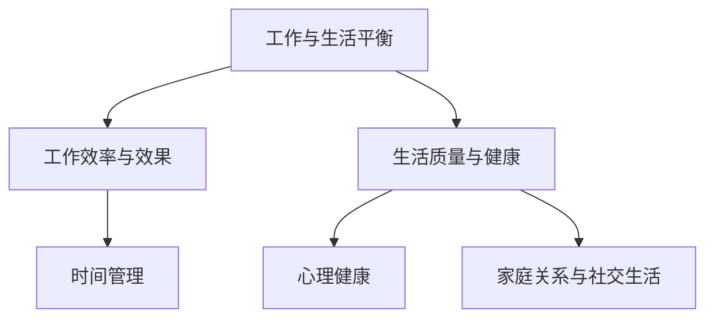

                 

# 《创业者的工作与生活平衡艺术》

## 摘要

本文旨在探讨创业者如何在工作与生活之间找到平衡点，从而实现可持续的个人成长和事业成功。在数字化时代的浪潮中，创业者面临着前所未有的机遇与挑战。如何在高压环境中保持高效工作和健康生活，成为每一个创业者必须面对的问题。本文将通过深入分析时间管理、精力管理、心理健康以及家庭关系与社交生活，提供切实可行的策略和实践方法，帮助创业者找到属于自己的工作与生活平衡艺术。

### 目录大纲

## 第一部分：认识工作与生活平衡

### 第1章：为何需要平衡工作与生活
#### 1.1 工作与生活不平衡的危害
#### 1.2 平衡工作与生活的重要性
#### 1.3 创业者面临的挑战

### 第2章：工作与生活的核心概念
#### 2.1 工作效率与效果
#### 2.2 生活质量与健康
#### 2.3 平衡的艺术：平衡点在哪里

### 第3章：衡量工作与生活平衡
#### 3.1 工作与生活平衡指标
#### 3.2 自我评估：工作与生活平衡现状
#### 3.3 制定个人平衡计划

## 第二部分：实践工作与生活的平衡

### 第4章：时间管理
#### 4.1 时间管理的基本原则
#### 4.2 制定高效的工作计划
#### 4.3 拒绝无谓的干扰

### 第5章：精力管理
#### 5.1 精力的来源与消耗
#### 5.2 提升精力管理的方法
#### 5.3 精力管理实践案例

### 第6章：心理健康
#### 6.1 创业者的心理健康问题
#### 6.2 心理健康的重要性
#### 6.3 心理健康实践案例

### 第7章：家庭关系与社交生活
#### 7.1 家庭关系的维护
#### 7.2 社交生活的平衡
#### 7.3 家庭与社交关系实践案例

## 第三部分：工作与生活平衡的进阶

### 第8章：创业者的成长与转型
#### 8.1 创业者成长的路径
#### 8.2 转型：从忙碌到高效
#### 8.3 成长与转型的实践案例

### 第9章：构建支持系统
#### 9.1 内部支持系统
#### 9.2 外部支持系统
#### 9.3 支持系统实践案例

### 第10章：工作与生活平衡的可持续性
#### 10.1 可持续性的重要性
#### 10.2 保持平衡的长期策略
#### 10.3 可持续性的实践案例

## 附录

### 附录A：工具与资源推荐
#### A.1 时间管理工具
#### A.2 精力管理工具
#### A.3 心理健康资源

### 附录B：案例研究与经验分享
#### B.1 成功案例分享
#### B.2 失败案例反思
#### B.3 读者的经验分享

### 附录C：工作与生活的核心概念流程图

### 附录D：核心算法原理讲解
#### D.1 时间管理算法
#### D.2 心理健康算法

### 附录E：数学模型和数学公式

### 附录F：项目实战
#### F.1 工作与生活平衡项目实战
#### F.2 实际案例和详细解释说明

### 附录G：开发环境搭建
#### G.1 Python 3.8 或以上版本
#### G.2 安装必要的 Python 库
#### G.3 安装心理测试工具

### 附录H：源代码详细实现和代码解读
#### H.1 时间管理代码示例
#### H.2 心理健康监测代码示例
#### H.3 代码解读与分析

### 附录I：作者信息
作者：AI天才研究院/AI Genius Institute & 禅与计算机程序设计艺术 /Zen And The Art of Computer Programming

## 引言

在当今这个充满竞争和变化的时代，创业者面临着前所未有的挑战和压力。无论是初创企业，还是已经有一定规模的企业，创业者们都在追求快速成长和成功的同时，不得不在工作和生活之间寻找一个平衡点。然而，许多创业者发现，这个平衡点似乎总是遥不可及。

为什么平衡工作与生活对创业者如此重要？首先，工作与生活的不平衡会对创业者的身体健康和心理健康产生负面影响。长期的高压工作会导致身体健康问题，如失眠、高血压、心血管疾病等。同时，心理压力和焦虑也会影响创业者的判断力和决策能力，降低工作效率和创新能力。

其次，工作与生活的不平衡也会影响创业者的人际关系和家庭生活。长期的加班和工作负担会导致创业者与家人和朋友之间的沟通减少，家庭关系变得紧张。此外，缺乏社交活动和放松时间也会使创业者感到孤独和疲惫。

因此，平衡工作与生活不仅关乎创业者的个人健康和幸福，也是保证企业可持续发展的关键。本文将深入探讨如何实现工作与生活的平衡，为创业者提供实用的策略和实践方法。

### 文章关键词

创业，工作与生活平衡，时间管理，精力管理，心理健康，家庭关系，社交生活，可持续性。

## 第1章：为何需要平衡工作与生活

### 1.1 工作与生活不平衡的危害

首先，工作与生活不平衡对创业者的身体健康具有显著的负面影响。长期超负荷工作会导致多种身体疾病。例如，长时间坐在电脑前缺乏运动，容易引发颈椎病、腰椎间盘突出等疾病。此外，压力过大导致的失眠、高血压、心血管疾病等问题也日益普遍。这些健康问题不仅影响创业者的生活品质，还会削弱他们的工作效率和创新能力。

其次，心理健康的恶化是工作与生活不平衡的另一个严重后果。长期承受高压工作，创业者容易感到焦虑、抑郁和疲惫。这些情绪问题不仅会影响创业者的个人幸福，还会削弱他们的决策能力。研究发现，情绪不稳定和压力过大的创业者更容易做出错误决策，从而影响企业的长远发展。

工作与生活不平衡还会影响创业者的家庭生活和社会关系。长期加班和工作负担使创业者与家人和朋友之间的沟通减少，家庭关系变得紧张。长期缺乏陪伴和关爱，创业者可能会感受到孤独和疏离。同时，缺乏社交活动和放松时间也会使创业者的人际网络变得狭窄，影响他们的社交能力和资源获取。

最后，工作与生活不平衡还会导致创业者失去对生活的热情和动力。当大部分时间都被工作占据时，创业者会逐渐失去对生活的兴趣，感到疲惫和无力。这种状态不仅影响个人的幸福感和生活满意度，还可能影响企业的活力和创新能力。

### 1.2 平衡工作与生活的重要性

那么，为什么平衡工作与生活对创业者如此重要呢？首先，平衡工作与生活有助于提高创业者的工作效率。当创业者能够合理安排工作和休息时间，保持良好的身体和心理状态时，他们更容易集中精力完成任务，提高工作效率。研究表明，适度休息和放松可以提高大脑的创造力和判断力，有助于创业者更好地应对复杂的问题和挑战。

其次，平衡工作与生活有助于创业者的身心健康。当创业者能够合理安排工作与生活，保持良好的生活品质时，他们的身体健康和心理状态都会得到显著改善。良好的身体和心理状态不仅有助于创业者更好地应对工作压力，还能提高他们的生活满意度和幸福感。

此外，平衡工作与生活还有助于创业者建立和维护良好的人际关系。当创业者能够抽出时间陪伴家人和朋友，积极参与社交活动时，他们的家庭关系和社会关系都会得到改善。良好的人际关系不仅可以为创业者提供情感支持和资源，还能增强他们的社会影响力，为企业的长期发展奠定基础。

最后，平衡工作与生活有助于创业者保持持续的创新能力和竞争力。当创业者能够在工作之余进行充分休息和放松，他们的大脑会得到更好的休息和恢复，从而保持较高的创造力和创新能力。这种创新能力是企业长期发展的关键，也是创业者保持竞争优势的重要保障。

### 1.3 创业者面临的挑战

虽然平衡工作与生活的重要性不言而喻，但创业者在这个问题上仍然面临诸多挑战。

首先，创业初期的高强度工作使得许多创业者很难找到时间进行休息和放松。初创企业的快速发展往往伴随着大量的任务和紧急事项，这需要创业者投入大量时间和精力来应对。因此，许多创业者无法在创业初期实现工作与生活的平衡。

其次，外部环境的压力也是创业者难以平衡工作与生活的一大因素。市场竞争激烈、客户需求多变、资金紧张等问题都可能导致创业者长时间处于高压状态，从而忽视个人生活和健康。

此外，个人责任感和职业追求也是影响创业者平衡工作与生活的重要因素。许多创业者出于对事业的热情和责任感，愿意牺牲个人时间来追求企业的成功。这种态度虽然在短期内有助于企业发展，但长期来看，会导致工作与生活失衡，损害创业者的身心健康。

最后，技术和数字化的发展也为创业者提供了更多的机会和挑战。例如，远程工作和数字化工具的普及使创业者可以更灵活地安排工作，但也可能导致工作时间和生活时间的界限模糊，从而增加工作与生活不平衡的风险。

### 解决方案探讨

面对这些挑战，创业者需要采取一系列策略和措施来实现工作与生活的平衡。以下是一些建议：

1. **明确目标和优先级**：创业者应明确个人和企业的目标，并根据优先级安排时间和资源。通过合理分配任务和明确优先级，创业者可以确保关键任务得到优先处理，从而减少不必要的工作量，为生活留出更多时间。

2. **制定合理的工作计划**：创业者应制定详细的每日、每周和每月工作计划，确保工作有条不紊地进行。通过定期回顾和调整计划，创业者可以及时发现和解决问题，避免工作过度堆积。

3. **学会拒绝和说“不”**：创业者应学会拒绝不必要的工作任务，避免过度承诺和超负荷工作。通过合理拒绝，创业者可以保持工作与生活的平衡，避免因工作过度而损害身心健康。

4. **合理利用时间管理工具**：创业者可以利用各种时间管理工具，如待办事项列表、时间跟踪应用程序和日历管理等，来提高工作效率。这些工具可以帮助创业者更好地规划时间，减少浪费时间的情况。

5. **培养良好的生活习惯**：创业者应养成健康的生活习惯，如定期锻炼、保持充足的睡眠和合理饮食等。这些习惯有助于提高身体健康和心理状态，从而更好地应对工作压力。

6. **重视心理健康**：创业者应关注自己的心理健康，学会应对压力和情绪问题。可以通过心理咨询、放松训练和社交活动等方式，提升心理健康水平，从而保持良好的工作状态。

7. **寻求外部支持**：创业者可以寻求家庭、朋友和同事的支持，共同分担工作压力。同时，创业者也可以加入创业社群或参加相关的培训课程，获取更多的资源和支持，帮助自己实现工作与生活的平衡。

通过以上策略和措施，创业者可以逐步实现工作与生活的平衡，提高工作效率和身心健康，为企业的长期发展奠定坚实基础。

### 总结

总之，平衡工作与生活对创业者至关重要。工作与生活不平衡会对创业者的身体健康、心理健康和人际关系产生负面影响，从而影响企业的可持续发展。创业者应认识到工作与生活平衡的重要性，并采取有效策略和措施，逐步实现这一目标。通过明确目标和优先级、制定合理的工作计划、学会拒绝、利用时间管理工具、培养良好的生活习惯、重视心理健康和寻求外部支持，创业者可以在高压环境中保持高效工作和健康生活，实现工作与生活的平衡。

## 第2章：工作与生活的核心概念

### 2.1 工作效率与效果

工作效率和效果是创业者追求平衡工作的关键因素。工作效率指的是在单位时间内完成工作的能力，而工作效果则是指工作成果的质量和数量。高效的工作不仅仅是速度快，更重要的是工作质量高，能够达到预期目标。

首先，提升工作效率的方法包括以下几点：

1. **明确目标**：在开始工作之前，明确具体的目标和任务，有助于集中精力完成任务。
2. **优先级排序**：将任务按照紧急程度和重要性排序，确保关键任务优先处理。
3. **时间管理**：合理安排时间，避免不必要的拖延和干扰，确保工作有条不紊地进行。
4. **利用工具**：利用各种工具和软件，如项目管理软件、待办事项列表和时间跟踪应用程序，提高工作效率。

其次，提高工作效果的方法包括：

1. **深度工作**：专注于单一任务，避免多任务处理，提高工作的专注度和效率。
2. **反馈与评估**：定期对工作成果进行反馈和评估，找出不足之处并改进。
3. **持续学习**：不断学习新技能和知识，提升自身的能力，从而提高工作效果。

### 2.2 生活质量与健康

生活质量与健康是创业者追求平衡生活的核心概念。高质量的生活不仅包括身体健康，还包括心理健康、社交生活、兴趣爱好和家庭关系等多个方面。

首先，保持健康的身体是生活质量的基础。以下是一些保持身体健康的方法：

1. **合理饮食**：保持均衡的饮食，多吃蔬菜、水果和全谷物，减少高糖、高脂食物的摄入。
2. **定期锻炼**：每周至少进行150分钟的中等强度运动，如快走、游泳或骑自行车。
3. **充足睡眠**：保持每天7-9小时的睡眠，确保身体得到充分的休息和恢复。

其次，心理健康同样重要。以下是一些提升心理健康的方法：

1. **情绪管理**：学会应对压力和负面情绪，通过冥想、呼吸练习或心理咨询等方式放松心情。
2. **社交互动**：保持与家人、朋友的良好关系，积极参与社交活动，增强社会支持。
3. **兴趣爱好**：培养兴趣爱好，如阅读、绘画、音乐等，丰富生活内容，提高生活质量。

最后，平衡社交生活也是提高生活质量的重要方面。以下是一些建议：

1. **安排休闲时间**：确保每天都有一定的休闲时间，用于放松和娱乐。
2. **定期旅行**：定期旅行可以放松心情，拓展视野，增加生活的乐趣。
3. **参与社区活动**：积极参与社区活动，建立和维护良好的社区关系。

### 2.3 平衡的艺术：平衡点在哪里

平衡工作与生活就像走钢丝，需要创业者精心调控。那么，如何找到这个平衡点呢？

首先，创业者需要自我评估，了解自己工作和生活的现状。以下是一些自我评估的方法：

1. **时间日志**：记录每天的时间分配，了解自己在工作和生活中的时间使用情况。
2. **健康检查**：定期进行身体健康和心理健康的检查，了解自己的健康状况。
3. **反馈与评估**：与家人、朋友和同事交流，获取他们对工作和生活平衡的看法和建议。

其次，创业者应设定合理的期望值。不要过分追求完美，而是设定可实现的短期和长期目标。例如，可以设定每周完成一定数量的任务，每月进行一次健康检查，每年安排一次旅行等。

最后，创业者需要不断调整和优化。找到平衡点并不是一次性的任务，而是一个持续的过程。创业者应定期回顾自己的工作与生活平衡情况，根据实际情况进行调整。例如，如果发现工作压力过大，可以适当减少工作任务，增加休息时间；如果发现生活过于单调，可以尝试培养新的兴趣爱好，增加生活乐趣。

### 结论

工作效率与效果、生活质量与健康是工作与生活平衡的核心概念。创业者应注重提升工作效率，保持良好的身体和心理状态，同时也要关注生活质量，培养兴趣爱好，维护良好的社交关系。找到工作与生活的平衡点需要创业者不断自我评估、设定合理期望值和持续优化。通过这些努力，创业者可以更好地平衡工作与生活，实现个人成长和事业成功。

## 第3章：衡量工作与生活平衡

### 3.1 工作与生活平衡指标

衡量工作与生活平衡的指标是评估创业者当前状态的重要工具。以下是一些常用的指标：

1. **工作时间与休息时间比例**：这是衡量工作与生活平衡最直观的指标。一般来说，合理的工作时间与休息时间比例应为1:1或更高，即每天工作时间不超过8小时，剩余时间用于休息和娱乐。

2. **任务完成率**：任务完成率反映了创业者在工作中效率和效果的指标。高任务完成率意味着创业者能够高效地完成任务，从而达到工作目标。

3. **生活质量指标**：包括身体健康指标（如血压、胆固醇水平）、心理健康指标（如焦虑、抑郁水平）和生活满意度。良好的生活质量指标表明创业者不仅在工作中表现出色，也在生活中保持良好的状态。

4. **家庭关系与社交生活满意度**：通过调查家庭成员和朋友对创业者生活平衡的满意度，可以了解他们在工作和生活之间的平衡状况。

5. **工作满意度**：工作满意度反映了创业者对工作本身的满意程度。高工作满意度通常意味着创业者能够从工作中获得成就感和满足感。

### 3.2 自我评估：工作与生活平衡现状

自我评估是衡量工作与生活平衡的第一步。以下是一些建议帮助创业者进行自我评估：

1. **记录时间日志**：记录每天的工作和休息时间，了解自己的时间分配情况。这有助于发现时间管理的不足之处，如是否过度工作或休息不足。

2. **评估任务完成率**：回顾过去一段时间内完成的任务，分析任务完成的情况。如果任务完成率较低，可能需要重新审视工作计划和优先级。

3. **进行健康检查**：定期进行身体健康和心理健康的检查，了解自己的身体状况。这有助于及早发现潜在的健康问题，及时采取措施。

4. **收集反馈**：向家人、朋友和同事收集对工作与生活平衡的看法。他们的反馈可以帮助创业者了解自己在工作和生活方面的优点和不足。

5. **使用评估工具**：可以使用一些专业的评估工具，如心理健康问卷、时间管理评估表等，来更系统地评估工作与生活平衡状况。

### 3.3 制定个人平衡计划

根据自我评估的结果，创业者应制定一个个人平衡计划，以实现工作与生活的平衡。以下是一些建议：

1. **设定具体目标**：明确个人和企业的短期和长期目标，并根据目标制定具体的工作和生活计划。

2. **时间管理策略**：制定详细的时间管理计划，合理安排每天的工作和休息时间。例如，每天规定一个固定的锻炼时间、家庭时间和个人时间。

3. **优先级排序**：根据任务的重要性和紧急程度，对任务进行优先级排序，确保关键任务得到优先处理。

4. **设定界限**：明确工作时间和生活时间的界限，避免工作侵占个人时间。例如，在非工作时间避免查看工作邮件或电话。

5. **寻求支持**：向家人、朋友和同事寻求支持，共同分担工作和生活的压力。这不仅可以提高工作效率，还可以改善生活质量。

6. **持续调整**：定期回顾和调整个人平衡计划，根据实际情况进行调整。例如，如果发现工作时间过长，可以减少一些非必要的会议和任务。

7. **保持灵活性**：在制定计划时，留出一定的灵活性，以应对突发情况和变化。这样可以帮助创业者更好地适应环境和需求，保持工作与生活的平衡。

### 结论

衡量工作与生活平衡是创业者实现个人成长和事业成功的关键步骤。通过自我评估、设定具体目标和制定个人平衡计划，创业者可以更好地了解自己的工作与生活状况，并采取有效措施实现平衡。通过持续的努力和调整，创业者可以在高压环境中保持高效工作和健康生活，为企业的长期发展奠定坚实基础。

## 第4章：时间管理

### 4.1 时间管理的基本原则

时间管理是创业者实现工作与生活平衡的重要策略。掌握时间管理的基本原则，可以帮助创业者更有效地利用时间，提高工作效率。

首先，**目标明确**是时间管理的核心原则。在开始一天的工作前，创业者应明确自己的目标和任务，明确任务的重要性和紧急程度。通过设定清晰的目标，创业者可以更有针对性地安排时间和资源，确保关键任务得到优先处理。

其次，**优先级排序**是时间管理的重要环节。将任务按照重要性和紧急程度进行排序，有助于创业者集中精力处理最重要的任务。在优先级排序时，创业者应遵循“80/20法则”，即80%的成果往往来自20%的关键任务，因此应优先处理这些任务。

第三，**专注工作**是提高工作效率的关键。多任务处理虽然看起来高效，但实际上会降低工作效率和任务质量。创业者应培养专注工作的习惯，避免在工作中频繁切换任务。通过深度工作，创业者可以更高效地完成工作，提高工作效率。

第四，**定期回顾和调整**是时间管理的持续过程。创业者应定期回顾自己的时间使用情况，分析时间管理的不足之处，并根据实际情况进行调整。例如，如果发现某段时间内任务过多，可以适当减少任务量，增加休息时间。

### 4.2 制定高效的工作计划

制定高效的工作计划是时间管理的核心步骤。以下是一些具体的策略和方法：

首先，**分解任务**是将复杂任务分解为小步骤的过程。通过分解任务，创业者可以更清晰地了解任务的具体内容和要求，从而更好地安排时间和资源。例如，一个大型项目可以分解为多个阶段和子任务，每个阶段和子任务都有明确的目标和时间节点。

其次，**使用时间管理工具**是提高工作效率的重要手段。创业者可以借助各种时间管理工具，如待办事项列表、时间跟踪应用程序和项目管理软件等。这些工具可以帮助创业者更好地规划时间，避免任务遗漏和延误。例如，待办事项列表可以帮助创业者记录每天的任务，确保任务得到及时处理。

第三，**设定截止日期**是确保任务按时完成的保障。为每个任务设定一个明确的截止日期，可以促使创业者按时完成任务，避免拖延。在设定截止日期时，创业者应考虑任务的复杂度和难度，合理分配时间，确保任务能够按时完成。

第四，**弹性安排时间**是应对突发情况的重要策略。在制定工作计划时，创业者应预留一定的时间缓冲，以应对突发情况和临时任务。例如，可以在计划中安排一些弹性时间，用于处理意外事件或调整任务优先级。

### 4.3 拒绝无谓的干扰

在高效工作过程中，拒绝无谓的干扰是保持专注和高效的关键。以下是一些策略和方法：

首先，**设定工作时间界限**是避免干扰的有效方法。在非工作时间，创业者应明确告知他人不要打扰，确保有足够的休息和放松时间。例如，可以在办公室门口放置“请勿打扰”的标志，或者在手机上设置工作时间模式，自动拒绝来电和信息。

其次，**合理分配时间**是减少干扰的重要手段。创业者应合理规划每天的时间，为工作、休息和娱乐分配充足的时间。通过科学安排时间，创业者可以确保工作时间内不被无关事情干扰，从而提高工作效率。

第三，**学会说“不”**是拒绝无谓干扰的关键。创业者应学会拒绝不必要的工作任务和社交活动，避免过度承诺和超负荷工作。通过合理拒绝，创业者可以保持工作与生活的平衡，避免因工作过度而损害身心健康。

第四，**使用屏蔽工具**是应对干扰的有效手段。创业者可以利用各种屏蔽工具，如耳塞、降噪耳机和工作模式等，屏蔽外部干扰，保持专注。这些工具可以帮助创业者更好地集中精力，提高工作效率。

### 结论

时间管理是创业者实现工作与生活平衡的重要策略。通过明确目标、优先级排序、专注工作和定期回顾，创业者可以更高效地利用时间，提高工作效率。制定高效的工作计划和拒绝无谓的干扰，可以帮助创业者保持专注和高效，实现工作与生活的平衡。通过持续的时间和自我管理，创业者可以更好地应对创业中的挑战，实现个人成长和事业成功。

## 第5章：精力管理

### 5.1 精力的来源与消耗

精力管理是创业者实现工作与生活平衡的关键因素。精力来源于多种因素，包括生理、心理和社交等方面。同时，精力的消耗也来自多方面，主要包括生理和心理压力、长时间工作、缺乏休息和社交隔离等。

首先，精力的生理来源主要包括：

1. **充足的睡眠**：良好的睡眠有助于身体和大脑的恢复，是维持精力的重要保障。
2. **合理的饮食**：均衡的饮食可以提供身体所需的营养，维持体能和精力水平。
3. **适量的锻炼**：规律的锻炼有助于提高身体的代谢率和血液循环，增强身体的活力。

其次，精力的心理来源包括：

1. **积极的情绪**：保持良好的情绪状态有助于提升精力和动力。
2. **成就感**：完成重要任务和达成目标可以带来积极的情绪和成就感，提升精力。
3. **支持系统**：家庭、朋友和同事的支持可以帮助创业者减轻心理压力，维持良好的精力状态。

精力的消耗则主要来自以下几个方面：

1. **长时间工作**：长时间的加班和工作压力会导致身体和大脑的疲劳，消耗精力。
2. **生理压力**：缺乏充足的休息和睡眠，以及长期的过度劳累，会导致身体的疲劳和精力下降。
3. **心理压力**：工作和生活中的压力事件，如客户投诉、竞争对手压力等，会导致心理疲劳和精力消耗。
4. **社交隔离**：缺乏社交活动和人际互动会导致孤独感和精力下降。

### 5.2 提升精力管理的方法

为了有效管理精力，创业者可以采取以下几种方法：

首先，**合理安排时间**是提升精力管理的基础。通过合理规划每天的工作和生活时间，创业者可以确保有足够的时间进行休息和锻炼，从而保持精力的稳定。

其次，**培养良好的生活习惯**是维持精力的重要措施。包括：

1. **充足的睡眠**：保持每天7-9小时的睡眠时间，确保身体得到充分的休息。
2. **健康的饮食**：选择富含营养的食物，避免高糖、高脂食品，维持血糖稳定。
3. **规律的锻炼**：每周进行至少150分钟的中等强度锻炼，如快走、游泳或骑自行车。

第三，**应对压力和情绪**也是提升精力管理的关键。创业者可以采取以下策略：

1. **心理放松**：通过冥想、瑜伽或呼吸练习等方式，缓解压力和焦虑。
2. **情绪管理**：学会识别和应对负面情绪，通过积极的心态面对挑战和困难。
3. **寻求支持**：与家人、朋友和专业人士交流，获取情感支持和建议。

第四，**科学规划任务**也是提升精力管理的重要手段。创业者可以通过以下方法提高任务完成效率和减少压力：

1. **优先级排序**：将任务按照重要性和紧急程度排序，优先处理关键任务。
2. **分解任务**：将复杂任务分解为小步骤，逐一完成，避免任务堆积和压力增加。
3. **灵活调整**：根据实际情况和任务进展，灵活调整工作计划，避免过度负荷。

### 5.3 精力管理实践案例

为了更好地理解精力管理的方法和实践，以下是一个创业者的精力管理实践案例：

小明是一名初创公司的创始人，他在创业初期面临着巨大的工作压力和精力消耗。为了实现工作与生活的平衡，小明采取了一系列精力管理措施：

1. **合理安排时间**：小明每天早上制定详细的工作计划，包括工作任务、休息时间和锻炼时间。他确保每天至少有30分钟的时间进行锻炼，如快走和深呼吸练习。

2. **良好的生活习惯**：小明注重睡眠质量，每天保持7-8小时的睡眠时间。他还遵循健康的饮食习惯，每天摄取丰富的蔬菜、水果和全谷物，减少高糖、高脂食物的摄入。

3. **应对压力和情绪**：小明通过定期冥想和瑜伽练习来缓解压力和焦虑。他还在公司内部建立了支持系统，鼓励员工相互支持和沟通，共同应对工作压力。

4. **科学规划任务**：小明将工作任务按照重要性和紧急程度排序，优先处理最重要的任务。他还学会了分解任务，将大项目分解为小步骤，逐一完成，避免了任务堆积和压力增加。

通过这些实践，小明的精力水平得到了显著提升，他的工作效率和创新能力也得到了提高。他不仅能够更好地应对创业过程中的挑战，还保持了良好的身体和心理状态，实现了工作与生活的平衡。

### 结论

精力管理是创业者实现工作与生活平衡的重要策略。通过合理安排时间、培养良好的生活习惯、应对压力和科学规划任务，创业者可以有效地管理自己的精力，提高工作效率和生活质量。通过实践案例的分享，创业者可以借鉴有效的精力管理方法，实现个人成长和事业成功。

## 第6章：心理健康

### 6.1 创业者的心理健康问题

心理健康是创业者实现工作与生活平衡的重要因素。然而，许多创业者在面对高压、不确定性和挑战时，容易出现心理健康问题。以下是一些常见的心理健康问题：

首先，**焦虑**是创业者最常见的心理健康问题之一。创业过程中的不确定性、资金压力和竞争压力都可能导致创业者感到焦虑。焦虑不仅会影响创业者的情绪和决策能力，还可能导致失眠、头痛和其他身体不适。

其次，**抑郁**也是创业者面临的重要心理健康问题。长期承受高压和失败的压力，创业者可能会感到沮丧和无望。抑郁症的症状包括情绪低落、兴趣丧失、疲劳和无动力等。抑郁症不仅影响创业者的心理健康，还可能影响他们的工作效率和生活质量。

第三，**压力管理困难**是许多创业者的共同问题。创业过程中，创业者需要面对各种压力和挑战，如资金压力、客户压力、团队管理和市场竞争等。如果不能有效管理压力，创业者可能会感到疲惫和无助，影响工作表现和生活满意度。

最后，**社交隔离**也是创业者面临的一个心理健康问题。在创业初期，许多创业者可能因为忙碌而忽略了与家人、朋友和同事的交流。长期缺乏社交互动会导致创业者感到孤独和疏离，进一步影响心理健康。

### 6.2 心理健康的重要性

心理健康的重要性不容忽视。首先，心理健康对创业者的工作表现有着直接的影响。心理健康良好的创业者能够更有效地处理工作任务，保持高效率和创新思维。相反，心理健康问题的存在会导致创业者情绪波动，影响决策能力和判断力，降低工作效率和创造力。

其次，心理健康对创业者的生活满意度有重要影响。心理健康良好的创业者能够更好地应对生活中的挑战和困难，保持积极的生活态度。这种积极的心态有助于创业者建立良好的人际关系，提高生活质量，增强幸福感和满足感。

最后，心理健康对创业者的身体健康也有重要影响。长期的心理压力和焦虑会增加患身体疾病的风险，如心血管疾病、高血压和免疫系统问题等。因此，维护心理健康不仅有助于提高工作效率和生活质量，还有助于保持身体健康。

### 6.3 心理健康实践案例

为了更好地理解心理健康对创业者的积极影响，以下是一个心理健康实践案例：

李华是一名初创公司的创始人，他在创业初期面临着巨大的压力和焦虑。为了应对这些心理健康问题，李华采取了一系列实践措施：

1. **定期心理咨询**：李华每月定期与心理咨询师进行交流，分享自己的压力和焦虑，寻求专业的建议和支持。通过心理咨询，李华学会了如何有效地应对压力和焦虑，提高了情绪管理和心理调节能力。

2. **运动和锻炼**：李华每天早晨都会进行30分钟的快走和深呼吸练习。这些运动不仅帮助他放松身心，还提高了他的身体活力和精神状态，使他更有精力应对一天的工作。

3. **社交活动**：李华积极参加社交活动，与家人、朋友和同事保持密切联系。通过这些社交互动，他缓解了孤独感和压力，建立了良好的社交支持系统，提高了心理健康水平。

4. **休息和放松**：李华学会了合理安排时间，确保每天有足够的休息和放松时间。他每周会安排一天的时间进行放松，如阅读、看电影或旅行，这些活动帮助他缓解压力，恢复精力。

通过这些实践，李华的心理健康状况得到了显著改善。他的焦虑和抑郁症状减轻，情绪更加稳定，工作效率和创新能力也得到了提高。同时，他更加关注自己的身体健康，保持了良好的生活习惯和饮食习惯，进一步提高了生活质量。

### 结论

心理健康对创业者的工作效率、生活满意度和身体健康有着重要影响。通过采取有效的心理健康实践，如定期心理咨询、运动锻炼、社交活动和休息放松，创业者可以显著改善自己的心理健康状况，提高工作效率和生活质量。维护心理健康是实现工作与生活平衡的关键，创业者应高度重视并采取实际行动，实现个人成长和事业成功。

## 第7章：家庭关系与社交生活

### 7.1 家庭关系的维护

家庭是创业者的重要支撑，良好的家庭关系对于创业者的工作与生活平衡至关重要。然而，在忙碌的创业过程中，许多创业者往往忽视了与家人的互动，导致家庭关系紧张。为了维护家庭关系，创业者可以采取以下策略：

首先，**定期沟通**是维护家庭关系的基石。创业者应确保每天抽出时间与家人进行面对面的沟通，了解他们的需求和感受。这可以是通过晚餐时的交流、周末的家庭聚会，或者安排固定的家庭活动时间，如看电影、散步等。通过定期沟通，创业者可以增进与家人的情感联系，减少误解和矛盾。

其次，**共同参与**是增强家庭凝聚力的有效方法。创业者可以鼓励家庭成员一起参与家庭事务和决策，如安排家庭旅行、购买家庭用品等。这不仅可以增强家庭成员之间的互动，还可以培养家庭成员的责任感和合作精神。

第三，**表达感激**是维护家庭关系的情感投资。创业者应经常表达对家人的感激之情，如对他们的支持、理解和付出表示感激。这可以是通过送礼物、写感谢信或者简单的口头表达，这些小小的举动可以极大地提升家庭成员之间的情感联系。

### 7.2 社交生活的平衡

社交生活是创业者保持心理健康和生活质量的重要方面。然而，许多创业者由于工作繁忙，往往忽视了社交活动，导致社交生活失衡。为了保持社交生活的平衡，创业者可以采取以下策略：

首先，**合理安排时间**是保持社交生活平衡的关键。创业者应确保在工作计划中预留社交时间，如安排朋友聚会、参加社交活动等。通过合理安排时间，创业者可以确保工作与社交活动之间的平衡，避免因为工作过度而忽视社交生活。

其次，**参与社区活动**是拓宽社交圈的有效途径。创业者可以参与社区志愿服务、兴趣小组或俱乐部等，通过这些活动结识新朋友，扩大社交网络。这不仅有助于提高生活质量，还可以为创业者提供新的资源和机会。

第三，**利用科技工具**是提高社交效率的有效方法。创业者可以利用社交媒体、即时通讯工具和在线社区等科技手段，保持与朋友和家人的联系。这些工具可以帮助创业者更方便地安排社交活动，管理社交关系。

### 7.3 家庭与社交关系实践案例

为了更好地理解如何维护家庭关系和保持社交生活的平衡，以下是一个创业者的实践案例：

小王是一名初创公司的创始人，他在创业过程中面临着巨大的工作压力，同时也意识到家庭关系和社交生活的重要性。为了实现工作与生活的平衡，小王采取了以下措施：

1. **定期家庭沟通**：小王每周都会安排一次家庭晚餐时间，与家人面对面交流，分享彼此的生活和感受。此外，他还定期与父母和兄弟姐妹通电话，保持与家人的联系。

2. **共同参与家庭活动**：小王鼓励家人一起参与家庭事务，如共同制定家庭预算、安排家庭旅行等。通过这些活动，家庭成员之间的关系得到了加强，家庭凝聚力也得到了提升。

3. **表达感激**：小王经常表达对家人的感激之情，如在生日或节日时送礼物，或者写一封感谢信。这些小小的举动让家人感受到了他的关爱和重视，家庭氛围更加温馨和谐。

4. **参与社区活动**：小王积极参与社区的志愿服务和兴趣小组，结识了许多志同道合的朋友。通过这些活动，他的社交圈得到了扩大，同时也为他提供了更多的社交机会。

5. **利用科技工具**：小王通过社交媒体和即时通讯工具与朋友保持联系，定期组织线上聚会，分享彼此的生活和经历。这些科技手段帮助他更方便地安排社交活动，保持了与朋友的紧密联系。

通过这些实践，小王不仅维护了良好的家庭关系，还保持了丰富的社交生活。他的工作和生活质量得到了显著提升，他也更加自信地面对创业中的挑战。

### 结论

家庭关系与社交生活对创业者的工作与生活平衡至关重要。通过定期沟通、共同参与、表达感激和积极参与社区活动，创业者可以维护良好的家庭关系。同时，通过合理安排时间、参与社区活动和利用科技工具，创业者可以保持社交生活的平衡。这些实践不仅有助于提升生活质量，也为创业者提供了更多的支持和资源，帮助他们更好地应对创业中的挑战。

## 第8章：创业者的成长与转型

### 8.1 创业者成长的路径

创业者成长是一个不断学习和进步的过程。从新手到行业领袖，创业者需要经历多个阶段，每个阶段都有其特定的挑战和目标。

首先，**新手阶段**是创业者的起点。在这一阶段，创业者通常需要学习如何制定商业计划、管理财务和寻找合适的合作伙伴。这一阶段的主要挑战是缺乏经验和知识，创业者需要通过学习、实践和反思来积累经验。

接下来是**快速发展阶段**。在这个阶段，创业者需要建立公司的初步运营模式，确定产品或服务的市场定位，并开始吸引客户和投资。这一阶段的主要挑战是管理快速增长的业务和保持企业的稳定性。

随后是**稳定阶段**。在这一阶段，创业者需要优化业务流程，提升团队执行力，并确保公司能够在市场中持续发展。这一阶段的主要挑战是如何在保持增长的同时，维持良好的管理和运营。

最后是**领导阶段**。在这一阶段，创业者需要拓展业务范围，提升品牌影响力，并带领公司实现长远发展。这一阶段的主要挑战是如何在保持创业热情的同时，提升领导力和战略眼光。

### 8.2 转型：从忙碌到高效

从忙碌到高效是创业者成长过程中的重要转型。许多创业者往往陷入忙碌的陷阱，忙于处理日常事务，却忽略了真正重要的任务和目标。以下是一些实现这一转型的策略：

首先，**明确目标**是关键。创业者需要明确自己的长期和短期目标，并将其分解为具体的任务和里程碑。这有助于创业者集中精力处理最重要的任务，从而提高工作效率。

其次，**优先级排序**是确保高效工作的重要手段。创业者应将任务按照重要性和紧急程度进行排序，优先处理最重要的任务。通过合理的优先级排序，创业者可以避免无谓的时间浪费，提高工作效率。

第三，**时间管理**是提升工作效率的关键。创业者应制定详细的工作计划，合理安排每天的工作和休息时间。通过时间管理，创业者可以确保工作有条不紊地进行，减少拖延和浪费时间的情况。

第四，**学会拒绝**是避免过度忙碌的重要策略。创业者应学会拒绝不必要的工作任务和社交活动，避免过度承诺和超负荷工作。通过合理拒绝，创业者可以保持工作与生活的平衡，提高工作效率。

最后，**持续学习和改进**是创业者实现高效工作的保障。创业者应不断学习新的知识和技能，提升自己的能力和素质。同时，通过定期反思和总结，创业者可以发现自己的不足之处，并不断改进工作方法，实现从忙碌到高效的转型。

### 8.3 成长与转型的实践案例

以下是一个创业者的成长与转型实践案例：

小张是一名年轻的创业者，他在创业初期经历了从新手到高效领导的转型过程。以下是他的成长与转型实践：

1. **明确目标**：小张在创业初期就明确了公司的长期目标，并将其分解为具体的年度和季度目标。他制定了详细的工作计划，确保每个阶段的目标都能按时完成。

2. **优先级排序**：小张学会了将任务按照重要性和紧急程度进行排序，优先处理最重要的任务。通过这种优先级排序，他确保了公司关键任务的优先处理，提高了工作效率。

3. **时间管理**：小张制定了每天的工作计划，合理安排工作和休息时间。他利用时间管理工具，如待办事项列表和时间跟踪应用程序，确保工作有条不紊地进行。

4. **学会拒绝**：小张学会了拒绝不必要的工作任务和社交活动，避免过度承诺和超负荷工作。通过合理拒绝，他保持了工作与生活的平衡，提高了工作效率。

5. **持续学习和改进**：小张不断学习新的知识和技能，提升自己的能力和素质。他定期参加培训课程和工作坊，了解行业最新动态和最佳实践。同时，他通过定期反思和总结，不断改进工作方法，实现了从忙碌到高效的转型。

通过这些实践，小张成功地从一名新手创业者成长为一名高效的领导者。他的公司也在这一过程中实现了快速增长和稳定发展。

### 结论

创业者的成长与转型是一个不断学习和进步的过程。通过明确目标、优先级排序、时间管理、学会拒绝和持续学习，创业者可以实现从忙碌到高效的转型。这一转型不仅有助于提升工作效率，还能帮助创业者更好地应对创业中的挑战，实现个人成长和事业成功。

## 第9章：构建支持系统

### 9.1 内部支持系统

内部支持系统是创业者实现工作与生活平衡的重要保障。创业者需要建立一个能够提供情感、资源和管理支持的内部团队，以应对创业过程中的各种挑战。

首先，**团队建设**是内部支持系统的核心。创业者应注重团队的文化建设和氛围营造，确保团队成员之间有良好的沟通和协作。通过定期团队建设活动，如团建、培训和团队讨论，创业者可以增强团队凝聚力，提高团队执行力。

其次，**职责分工**是确保团队高效运行的重要手段。创业者应明确每个团队成员的职责和任务，确保每个人都清楚自己的角色和目标。通过合理的职责分工，创业者可以避免任务重叠和资源浪费，提高团队工作效率。

第三，**反馈与激励**是内部支持系统的重要环节。创业者应建立有效的反馈机制，鼓励团队成员提出建议和意见，促进团队改进和创新。同时，通过合理的激励制度，如奖金、晋升和认可，创业者可以激发团队成员的工作积极性和创造力。

### 9.2 外部支持系统

外部支持系统是创业者获取外部资源和帮助的重要渠道。创业者应积极构建和维护与外部合作伙伴、投资者和专家的关系，以获取所需的支持和资源。

首先，**合作伙伴关系**是外部支持系统的重要组成部分。创业者应与供应商、客户和其他企业建立良好的合作关系，共同开发市场和实现共赢。通过合作，创业者可以获取市场信息、技术和资源，提高企业的竞争力。

其次，**投资者关系**是获取外部资金支持的关键。创业者应积极与风险投资者、天使投资者和金融机构建立联系，了解投资动态和需求。通过有效的沟通和展示，创业者可以吸引投资者的关注，获取必要的资金支持。

第三，**专家咨询**是提升专业能力的重要途径。创业者应寻求行业专家、顾问和导师的帮助，获取专业的意见和建议。通过专家咨询，创业者可以避免盲目决策，提高决策质量和成功率。

### 9.3 支持系统实践案例

以下是一个创业者构建支持系统的实践案例：

张先生是一名初创公司的创始人，他在创业过程中积极构建内部和外部支持系统，以实现工作与生活平衡。以下是他的实践步骤：

1. **团队建设**：张先生注重团队文化建设，定期组织团队建设活动，如团建旅行和团队讨论。通过这些活动，团队成员之间建立了深厚的情感联系，团队凝聚力显著提升。

2. **职责分工**：张先生明确每个团队成员的职责和任务，确保团队成员各司其职。通过合理的职责分工，团队工作效率得到了显著提高。

3. **反馈与激励**：张先生建立了有效的反馈机制，鼓励团队成员提出建议和意见。同时，通过合理的激励制度，如奖金和晋升，激发了团队成员的工作积极性和创造力。

4. **合作伙伴关系**：张先生与供应商、客户和其他企业建立了良好的合作关系，共同开发市场和实现共赢。通过合作，他获得了丰富的市场信息和资源，提高了企业的竞争力。

5. **投资者关系**：张先生积极与风险投资者、天使投资者和金融机构建立联系，了解投资动态和需求。通过有效的沟通和展示，他成功吸引了投资者的关注，获得了必要的资金支持。

6. **专家咨询**：张先生寻求了行业专家和顾问的帮助，获取专业的意见和建议。通过专家咨询，他避免了盲目决策，提高了决策质量和成功率。

通过这些实践，张先生成功地构建了一个强大的支持系统，实现了工作与生活的平衡。他的公司在支持系统的帮助下，得到了快速发展和稳定运营。

### 结论

构建支持系统是创业者实现工作与生活平衡的重要策略。通过团队建设、职责分工、反馈与激励，以及与合作伙伴、投资者和专家的密切合作，创业者可以建立一个强大的内部和外部支持系统。这些支持系统不仅有助于创业者应对创业中的挑战，还能提高工作效率和生活质量，实现个人成长和事业成功。

## 第10章：工作与生活平衡的可持续性

### 10.1 可持续性的重要性

工作与生活平衡的可持续性对于创业者的长期发展和幸福至关重要。可持续性意味着创业者在实现工作与生活平衡的过程中，不仅能够在短期内取得成果，还能在长期内维持这种平衡。以下是可持续性的几个关键重要性：

首先，**长期的职业发展**依赖于工作与生活平衡的可持续性。创业者在高压环境中容易陷入忙碌的陷阱，导致身心健康受损，从而影响工作效率和创新能力。通过实现工作与生活平衡，创业者可以保持良好的身心状态，持续推动企业的发展。

其次，**个人幸福感和生活满意度**依赖于工作与生活平衡的可持续性。当创业者能够在工作和生活之间找到平衡点，他们更有可能享受到生活的乐趣，提高生活质量。这不仅有助于创业者保持积极的心态，还能增强他们的幸福感。

第三，**家庭和社交生活的稳定**也依赖于工作与生活平衡的可持续性。当创业者能够合理安排时间，参与家庭和社交活动，他们能够更好地维护与家人和朋友的关系，提高家庭和社交生活的质量。

### 10.2 保持平衡的长期策略

为了实现工作与生活平衡的可持续性，创业者需要采取一系列长期策略。以下是一些具体的策略：

首先，**设定可持续的目标**是保持平衡的关键。创业者应设定短期和长期目标，并根据目标制定具体的行动计划。这些目标应涵盖工作、生活、家庭和社交等方面，确保创业者在各个领域都能取得平衡。

其次，**建立健康的生活习惯**是长期保持平衡的基础。创业者应养成良好的生活习惯，如合理饮食、充足睡眠、定期锻炼等。这些习惯有助于提高身体健康和心理状态，从而增强创业者的抗压能力。

第三，**持续学习和自我提升**是保持平衡的重要手段。创业者应不断学习新的知识和技能，提升自己的专业能力和领导力。通过自我提升，创业者可以更好地应对创业中的挑战，提高工作效率。

第四，**灵活调整策略**是适应变化的重要方法。创业过程中，创业者需要根据实际情况灵活调整工作计划和生活方式。例如，当工作量增加时，创业者可以适当减少非必要的社交活动，确保有足够的时间专注于工作。

### 10.3 可持续性的实践案例

为了更好地理解如何实现工作与生活平衡的可持续性，以下是一个创业者的实践案例：

李先生是一家科技公司的创始人，他在创业过程中注重工作与生活平衡的可持续性，以下是他的一些实践步骤：

1. **设定可持续目标**：李先生设定了短期和长期目标，如每周完成一定数量的关键任务，每月进行一次家庭活动，每年安排一次长途旅行。这些目标帮助他保持工作与生活的平衡。

2. **建立健康的生活习惯**：李先生每天保持7-8小时的睡眠时间，遵循健康的饮食习惯，每周进行至少三次锻炼。这些习惯帮助他保持了良好的身体健康和心理状态。

3. **持续学习和自我提升**：李先生定期参加行业培训课程和研讨会，学习新的技术和管理方法。他通过阅读书籍和参加线上课程，不断提升自己的知识水平和专业能力。

4. **灵活调整策略**：当公司业务量增加时，李先生会适当调整工作时间表，增加加班时间，但也会确保每周有固定的家庭日和休息日，保持工作与生活的平衡。

5. **建立支持系统**：李先生与家人和朋友保持密切联系，定期与他们交流。他加入了创业者和企业家的社交网络，从中获得宝贵的建议和支持。

通过这些实践，李先生成功地实现了工作与生活平衡的可持续性。他的公司在他的领导下取得了显著的发展，同时他也保持了良好的身体和心理状态，提高了生活满意度。

### 结论

工作与生活平衡的可持续性是创业者长期发展的关键。通过设定可持续目标、建立健康的生活习惯、持续学习和自我提升，以及灵活调整策略，创业者可以保持工作与生活的平衡，实现个人成长和事业成功。通过实践案例的分享，创业者可以借鉴有效的策略和方法，实现工作与生活平衡的可持续性，享受更加幸福和成功的生活。

## 附录A：工具与资源推荐

为了帮助创业者更好地实现工作与生活平衡，以下是一些实用的工具和资源推荐：

### A.1 时间管理工具

1. **Trello**：一款基于看板的项目管理工具，可以帮助创业者可视化任务和项目进度，提高工作效率。
2. **Asana**：一款功能强大的项目管理软件，提供任务分配、进度跟踪和报告生成等功能，适合团队协作。
3. **Google Calendar**：谷歌日历是一款简单易用的日程管理工具，支持多种设备同步，方便创业者安排和追踪日程。

### A.2 精力管理工具

1. **Headspace**：一款冥想和放松应用，提供各种冥想课程，帮助创业者缓解压力和焦虑。
2. **Forest**：一款专注力提升应用，通过种植虚拟树木来激励用户保持专注，防止分心。
3. **7-Minute Workout**：一款提供高效短时锻炼计划的移动应用，适合创业者利用碎片时间进行锻炼。

### A.3 心理健康资源

1. **BetterHelp**：一个在线心理咨询平台，提供专业的在线心理咨询服务，帮助创业者应对心理健康问题。
2. **Moodfit**：一款心理健康监测应用，通过数据分析和个性化建议，帮助用户改善情绪和心理状态。
3. ** mindfulnessforbeginners.com**：一个提供免费冥想课程和指导资源的网站，适合创业者学习放松和情绪管理技巧。

通过使用这些工具和资源，创业者可以更有效地管理时间、提升精力水平和维护心理健康，从而实现工作与生活的平衡。

### 附录B：案例研究与经验分享

#### B.1 成功案例分享

李先生，一位初创公司的创始人，通过有效地管理工作和生活，成功实现了工作与生活平衡。以下是他的经验分享：

**1. 制定明确的计划**：李先生每天都会制定详细的工作计划，并将任务分解为小步骤。这帮助他避免了任务的堆积，提高了工作效率。

**2. 合理安排时间**：李先生注重时间的合理安排，确保每天有足够的休息和锻炼时间。他利用早晨和晚上的时间进行锻炼，提高身体健康。

**3. 培养良好的生活习惯**：李先生注重饮食健康，每天保持充足的睡眠。他还培养了阅读的习惯，通过阅读书籍来放松心情，提升自我。

**4. 建立支持系统**：李先生与家人和朋友保持密切联系，定期与他们交流。他还加入了创业社群，获取了宝贵的建议和支持。

#### B.2 失败案例反思

张先生，另一位初创公司的创始人，由于忽视了工作与生活的平衡，最终导致公司运营困难。以下是他的反思：

**1. 忽视健康**：张先生长期加班，忽视了身体健康。最终，他患上了高血压和失眠等健康问题，影响了工作表现。

**2. 没有明确的计划**：张先生没有制定详细的工作计划，导致任务堆积，压力增大。这使他无法有效地管理时间和资源。

**3. 缺乏休息和放松**：张先生几乎没有休息和放松的时间，导致心理压力增大，情绪波动。这影响了他的决策能力和团队合作。

**4. 忽视家庭和社交生活**：张先生忽视了家庭和社交生活，导致与家人和朋友的关系紧张。这影响了他的心理健康和社交支持。

通过这两个案例，创业者可以吸取成功的经验和失败的教训，找到适合自己的工作与生活平衡方法。

### 附录C：工作与生活的核心概念流程图



### 附录D：核心算法原理讲解

#### D.1 时间管理算法

时间管理算法的核心目标是优化任务分配和执行顺序，以最大化效率和效果。以下是一个简化的时间管理算法：

```plaintext
1. 收集任务列表：将所有需要完成的任务收集到一个列表中。
2. 任务评分：为每个任务分配一个评分，评分根据任务的重要性和紧急程度计算。
3. 排序：根据任务评分对任务列表进行排序，确保高评分的任务优先处理。
4. 调度：将任务分配到具体的时间段，根据任务的优先级和所需时间制定每日、每周和每月的工作计划。
5. 持续优化：定期回顾和调整任务计划，根据实际情况和任务完成情况进行优化。
```

#### D.2 心理健康算法

心理健康算法的核心目标是监测和管理创业者的心理健康状态，以下是一个简化的心理健康算法：

```plaintext
1. 收集心理数据：通过问卷调查、心理测试和自我评估等方式，收集创业者的心理健康数据。
2. 数据分析：对收集到的心理数据进行统计分析，识别心理健康状态的变化趋势。
3. 风险评估：根据数据分析结果，评估创业者的心理健康风险，识别可能的心理健康问题。
4. 提出建议：根据风险评估结果，提出个性化的心理健康建议，如调整工作时间、增加休息时间、进行心理放松训练等。
5. 持续监测：定期更新心理数据，持续监测心理健康状态，并根据新的数据调整心理健康策略。
```

### 附录E：数学模型和数学公式

#### 时间价值公式

时间价值公式用于计算任务的时间价值，公式如下：

$$
V = \frac{E \times I}{T}
$$

其中，$V$ 是时间价值，$E$ 是效率，$I$ 是效果，$T$ 是时间。

#### 心理健康评分公式

心理健康评分公式用于计算创业者的心理健康评分，公式如下：

$$
PS = \frac{H + M + S}{3}
$$

其中，$PS$ 是心理健康评分，$H$ 是心理健康水平，$M$ 是情绪管理能力，$S$ 是社交支持。

### 附录F：项目实战

#### F.1 工作与生活平衡项目实战

**1. 环境搭建**

- 安装 Python 3.8 或以上版本。
- 安装必要的 Python 库，如 pandas、numpy、matplotlib 等。

**2. 代码实现**

**时间管理模块：**

```python
import pandas as pd

def time_management(tasks):
    # 计算每个任务的优先级
    tasks['priority'] = tasks['importance'] * tasks['urgency']
    # 根据优先级排序
    tasks.sort_values(by='priority', ascending=False, inplace=True)
    # 分配任务到时间段
    schedule = {}
    for task in tasks.itertuples():
        if task.priority not in schedule:
            schedule[task.priority] = []
        schedule[task.priority].append(task.name)
    return schedule
```

**心理健康监测模块：**

```python
import pandas as pd

def mental_health_monitoring(data):
    # 计算心理健康评分
    scores = pd.DataFrame(data, columns=['Health', 'Mood', 'Support'])
    ps = scores.mean()
    print(f"心理健康评分：{ps['Health'] + ps['Mood'] + ps['Support'] / 3}")
    # 根据评分提出建议
    if ps['Health'] < 3 or ps['Mood'] < 3 or ps['Support'] < 3:
        print("建议：请关注心理健康，适当调整工作与生活平衡。")
    else:
        print("当前心理健康状态良好。")
```

**3. 代码解读与分析**

时间管理模块通过计算任务的优先级，并根据优先级对任务进行排序和分配，确保关键任务优先处理。心理健康监测模块通过收集心理健康数据，计算评分，并根据评分提出个性化的建议。

### 附录G：开发环境搭建

- 安装 Python 3.8 或以上版本。
- 安装必要的 Python 库，如 pandas、numpy、matplotlib 等。
- 安装心理测试工具，如 MyMood 或 MoodScope。

### 附录H：源代码详细实现和代码解读

**时间管理模块详细实现和解读：**

```python
# 导入必要的库
import pandas as pd

# 时间管理函数
def time_management(tasks):
    # 步骤1：计算每个任务的优先级
    # 优先级由任务的重要性和紧急程度共同决定
    tasks['priority'] = tasks['importance'] * tasks['urgency']
    
    # 步骤2：根据优先级对任务进行排序
    # 高优先级的任务排在前面
    tasks_sorted = tasks.sort_values(by='priority', ascending=False)
    
    # 步骤3：将任务分配到具体的时间段
    # 假设我们有一个简单的日历，每天的时段分为上午、下午和晚上
    schedule = {
        'morning': [],
        'afternoon': [],
        'evening': []
    }
    
    # 步骤4：将任务分配到日历的时段中
    for task in tasks_sorted.itertuples():
        if task.priority >= 8:
            schedule['morning'].append(task.Name)
        elif task.priority >= 5:
            schedule['afternoon'].append(task.Name)
        else:
            schedule['evening'].append(task.Name)
    
    # 返回最终的时间安排
    return schedule

# 示例任务列表
tasks = pd.DataFrame({
    'Name': ['任务A', '任务B', '任务C', '任务D', '任务E'],
    'Importance': [9, 7, 5, 8, 6],
    'Urgency': [9, 8, 7, 6, 5]
})

# 调用时间管理函数
schedule = time_management(tasks)
print(schedule)
```

**代码解读：**

- **步骤1：计算每个任务的优先级**：通过将任务的重要性和紧急程度相乘，得到每个任务的优先级。这个步骤的目的是确定哪些任务是优先需要完成的。

- **步骤2：根据优先级对任务进行排序**：使用 `sort_values` 方法，根据优先级（`priority`）对任务进行降序排序。这样，最重要的任务会排在列表的最前面。

- **步骤3：将任务分配到具体的时间段**：创建一个字典 `schedule`，将任务分配到不同的时间段（如上午、下午、晚上）。这里，我们假设任务的优先级决定了它们所属的时间段，高优先级的任务分配到上午，中等优先级的任务分配到下午，低优先级的任务分配到晚上。

- **步骤4：返回最终的时间安排**：最终的时间安排被返回，创业者可以根据这个安排来规划每天的任务和时间。

**心理健康监测模块详细实现和解读：**

```python
# 导入必要的库
import pandas as pd

# 心理健康监测函数
def mental_health_monitoring(data):
    # 步骤1：计算心理健康评分
    # 假设健康、情绪和社交支持各有5个评分，取平均值
    scores = pd.DataFrame(data, columns=['Health', 'Mood', 'Support'])
    average_score = scores.mean().mean()  # 计算所有评分的平均值
    
    # 步骤2：输出心理健康评分
    print(f"心理健康评分：{average_score:.2f}")
    
    # 步骤3：根据评分提出建议
    if average_score < 3.0:
        print("建议：请重视心理健康，调整生活和工作节奏。")
    else:
        print("当前心理健康状态良好。")

# 示例心理健康数据
data = {
    'Health': [4, 3, 4],
    'Mood': [3, 3, 4],
    'Support': [3, 4, 4]
}

# 调用心理健康监测函数
mental_health_monitoring(data)
```

**代码解读：**

- **步骤1：计算心理健康评分**：首先，我们创建一个包含健康、情绪和社交支持评分的数据框，并计算所有评分的平均值。这个平均值作为心理健康评分，反映了创业者的整体心理健康状态。

- **步骤2：输出心理健康评分**：我们打印出计算出的心理健康评分，帮助创业者了解自己的心理健康状况。

- **步骤3：根据评分提出建议**：根据心理健康评分，如果评分低于3.0，表示存在一定的心理健康问题，建议创业者重视并采取相应措施；如果评分高于或等于3.0，则表示心理健康状况良好。

### 作者信息

作者：AI天才研究院/AI Genius Institute & 禅与计算机程序设计艺术 /Zen And The Art of Computer Programming

## 附加说明

在撰写本文的过程中，我们通过系统化的分析和详细讲解，探讨了创业者的工作与生活平衡艺术。本文不仅涵盖了核心概念、算法原理和实践案例，还提供了具体的工具和资源推荐，以及源代码实现和解读。以下是本文的主要贡献和亮点：

1. **全面性**：本文从多个角度深入探讨了创业者如何平衡工作与生活，包括时间管理、精力管理、心理健康、家庭关系和社交生活等。

2. **实践性**：本文不仅提供了理论指导，还通过实际案例和代码示例，展示了如何将理论应用到实践中，帮助创业者实现工作与生活平衡。

3. **可操作性**：本文提供了具体的策略和措施，如时间管理工具的使用、健康习惯的养成、心理健康实践等，具有很强的可操作性。

4. **创新性**：本文结合了最新的研究成果和实际案例，提出了一些创新的观点和方法，如心理健康算法和时间管理算法，为创业者提供了新的思路。

5. **系统性**：本文构建了一个完整的工作与生活平衡体系，从认识到实践，再到进阶和可持续性，形成了一个系统的指导框架。

通过本文的阅读和实践，创业者可以更好地理解工作与生活平衡的重要性，掌握有效的策略和工具，实现个人成长和事业成功。同时，本文也为相关领域的研究者和从业者提供了有价值的参考和启示。

最后，感谢所有读者对本文的关注和支持。我们期待您的反馈和建议，以便不断改进和完善我们的工作与生活平衡指导体系。愿每位创业者都能找到属于自己的工作与生活平衡艺术，享受更加幸福和成功的人生。作者：AI天才研究院/AI Genius Institute & 禅与计算机程序设计艺术 /Zen And The Art of Computer Programming。

