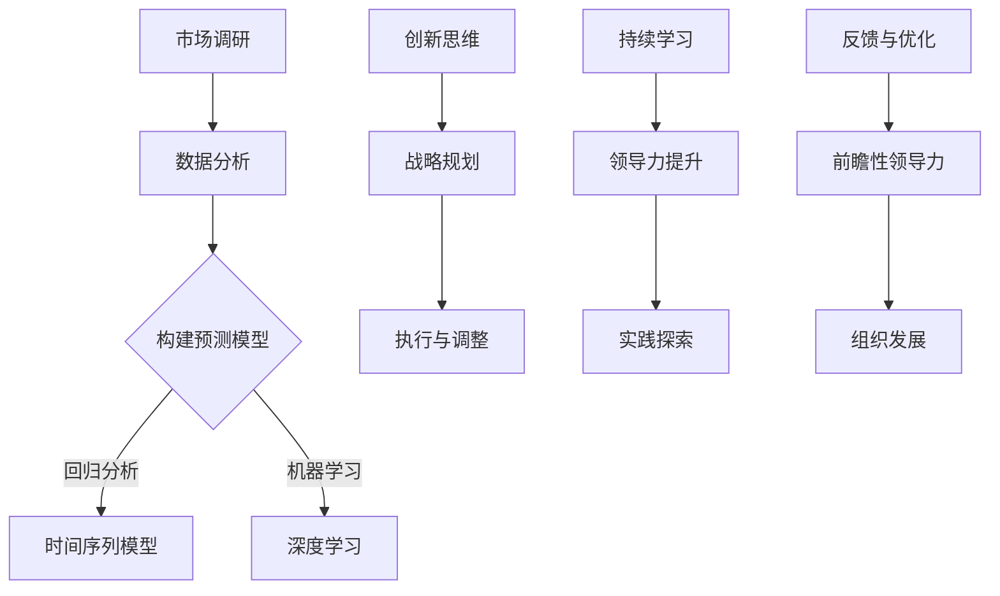

                 

# 前瞻性领导：预见并把握未来趋势的能力

> **关键词**：前瞻性领导、未来趋势、创新能力、洞察力、敏捷管理、数字化转型、可持续发展

> **摘要**：在快速变化的IT领域，前瞻性领导成为组织成功的关键。本文深入探讨了前瞻性领导的定义、核心特征、预见未来趋势的能力、领导者必备的核心能力、构建前瞻性领导力文化，并通过案例研究和策略实施，阐述了前瞻性领导在实践中的应用。同时，文章也对全球环境下前瞻性领导的挑战与机遇进行了分析，并展望了未来领导力的关键趋势。作者结合实际项目，展示了前瞻性领导在IT领域的具体应用和成效。

### 目录大纲

#### 第一部分：理解前瞻性领导

- **第1章**：前瞻性领导的定义与重要性
  - **1.1**：前瞻性领导的概念
  - **1.2**：前瞻性领导的核心特征

- **第2章**：预见未来趋势的能力
  - **2.1**：趋势分析的方法论
  - **2.2**：利用科技工具提升预见能力

- **第3章**：前瞻性领导者的核心能力
  - **3.1**：洞察力
  - **3.2**：策略制定

- **第4章**：构建前瞻性领导力文化

#### 第二部分：前瞻性领导的实践

- **第5章**：案例研究
  - **5.1**：科技公司的前瞻性领导实践
  - **5.2**：传统行业的转型之路

- **第6章**：实施前瞻性领导的策略
  - **6.1**：敏捷管理
  - **6.2**：创新生态系统建设

- **第7章**：领导者的个人成长

#### 第三部分：前瞻性领导与未来展望

- **第8章**：前瞻性领导在全球环境下的挑战与机遇
- **第9章**：未来领导力的关键趋势
- **第10章**：结论

#### 附录
- **附录A**：前瞻性领导工具与方法
- **附录B**：参考资料

### 核心概念与联系

在理解前瞻性领导之前，我们需要明确几个核心概念：预见性思维、创新能力、适应变化、洞察力和策略制定。

**预见性思维**：这是一种超越当前情况，预测未来可能发生的事情的能力。它依赖于对历史数据的分析、市场研究和技术趋势的追踪。

**创新能力**：前瞻性领导不仅仅是预测，更重要的是将预测转化为实际行动。创新能力的培养需要组织提供良好的环境，鼓励员工进行创造性思维。

**适应变化**：在快速变化的环境中，领导者必须具备迅速适应新情况的能力。这包括调整策略、重组团队和调整资源配置。

**洞察力**：领导者需要具有深入理解市场和技术的交汇点，识别潜在商机和风险的能力。

**策略制定**：前瞻性领导者在预见未来趋势后，需要制定相应的战略和计划，确保组织能够灵活应对变化。

这些概念相互联系，共同构成了前瞻性领导的框架。下面，我们将通过具体的章节内容，详细探讨这些概念。

#### 第1章：前瞻性领导的定义与重要性

**1.1 前瞻性领导的概念**

前瞻性领导是一种能够预见未来趋势，并在组织中培育适应未来变化的能力。这种领导不仅关注当前问题，更注重未来的发展。它要求领导者具备超越现实的洞察力，能够看到市场、技术、文化等各个方面的发展趋势。

定义前瞻性领导，我们可以从以下几个关键点来理解：

1. **预见性思维**：前瞻性领导依赖于预见性思维，领导者需要培养这种能力，以便在不确定的环境中做出正确的决策。
2. **创新能力**：前瞻性领导不仅仅是预见，更重要的是将预见转化为实际行动。创新能力是前瞻性领导的核心，它使组织能够不断创新，保持竞争优势。
3. **适应变化**：在快速变化的环境中，前瞻性领导者需要具备快速适应新情况的能力。这种适应不仅体现在战略层面，还包括组织结构、文化和流程的调整。
4. **洞察力**：前瞻性领导需要具备深入的洞察力，能够看到市场和技术的交汇点，识别潜在的商业机会和风险。

**1.2 前瞻性领导的核心特征**

前瞻性领导的核心特征包括预见性思维、创新能力、适应变化和洞察力。以下是对这些特征的具体解释：

**预见性思维**：预见性思维是前瞻性领导的核心。领导者需要具备前瞻性思维，能够预测未来可能发生的事情。这种思维不仅基于历史数据和现有信息，还需要领导者具备敏锐的洞察力和判断力。

**创新能力**：前瞻性领导不仅仅是预见，更重要的是将预见转化为实际行动。创新能力使组织能够不断适应变化，保持竞争优势。领导者的创新能力体现在对新技术、新市场和新商业模式的理解和应用上。

**适应变化**：在快速变化的环境中，前瞻性领导者需要具备快速适应新情况的能力。这种适应不仅体现在战略层面，还包括组织结构、文化和流程的调整。前瞻性领导要求领导者能够迅速调整策略，使组织能够灵活应对变化。

**洞察力**：前瞻性领导需要具备深入的洞察力，能够看到市场和技术的交汇点，识别潜在的商业机会和风险。洞察力使领导者能够从复杂的信息中提取关键信息，做出明智的决策。

**1.3 前瞻性领导在组织中的关键角色和影响**

前瞻性领导在组织中扮演着关键角色，对组织的发展和成功具有深远的影响。以下是一些关键角色和影响：

**战略规划**：前瞻性领导能够为组织制定明确的战略规划，确保组织在未来能够应对各种挑战。这种战略规划不仅考虑当前的需求，更注重未来的发展趋势。

**创新推动**：前瞻性领导能够推动组织的创新，使组织能够不断适应变化。通过创新，组织能够开发新的产品和服务，拓展新的市场，保持竞争优势。

**团队建设**：前瞻性领导能够建立高效的团队，激发团队成员的潜力，实现组织的共同目标。这种团队建设不仅包括人员的配置，还包括文化和价值观的塑造。

**文化塑造**：前瞻性领导能够塑造积极向上的组织文化，鼓励员工创新思维，提高工作效率。这种文化能够使组织在面对外部压力时保持稳定和强大。

**组织变革**：前瞻性领导能够引导组织进行必要的变革，使组织能够适应新的环境和要求。这种变革不仅包括技术和流程的改进，还包括组织结构和文化的调整。

总之，前瞻性领导是组织成功的关键。通过预见未来趋势、推动创新、适应变化和塑造文化，前瞻性领导能够为组织带来持续的发展和竞争优势。

### 第2章：预见未来趋势的能力

预见未来趋势的能力是前瞻性领导的核心要素之一。在这个快速变化的时代，领导者不仅需要了解当前的局势，更要有能力预见未来的变化，并提前做好准备。以下将详细讨论如何通过趋势分析的方法论和科技工具来提升预见能力。

#### 2.1 趋势分析的方法论

趋势分析是一种通过研究历史数据和现有信息，预测未来可能发生事情的方法。以下是几种常用的趋势分析方法：

**历史数据研究**

历史数据研究是趋势分析的基础。通过分析历史数据，我们可以识别出某些趋势和模式。以下是一些具体的方法：

- **时间序列分析**：这是一种通过分析时间序列数据来预测未来趋势的方法。时间序列分析通常使用统计模型，如移动平均模型、自回归模型等。
- **相关分析**：通过分析不同变量之间的相关性，我们可以识别出潜在的趋势。例如，分析经济增长与消费者支出之间的关系，可以帮助我们预测未来的市场趋势。
- **回归分析**：回归分析是一种常用的统计方法，通过建立变量之间的回归模型，可以预测未来趋势。例如，通过分析历史销售数据和季节性因素，可以预测未来的销售趋势。

**市场研究**

市场研究是获取未来趋势的重要途径。以下是一些常用的市场研究方法：

- **问卷调查**：通过问卷调查，我们可以了解消费者的需求和偏好。问卷调查可以采用在线、电话或面对面访谈的形式。
- **焦点小组**：焦点小组是一种通过聚集一组人进行讨论来收集市场信息的方法。焦点小组通常用于探讨特定问题或新产品的市场接受度。
- **访谈**：访谈是一种通过与专业人士或消费者进行深入对话来获取市场信息的方法。访谈可以采用结构化或非结构化的形式。

**技术趋势追踪**

技术趋势追踪是预见未来趋势的重要手段。以下是一些常用的技术趋势追踪方法：

- **专利分析**：通过分析专利申请和授权情况，可以了解新技术的发展趋势。专利分析可以帮助我们识别出哪些技术领域可能在未来取得突破。
- **技术预测报告**：技术预测报告通常由专业的咨询公司或研究机构发布。这些报告可以提供关于未来技术发展趋势的详细分析。
- **社交媒体分析**：通过分析社交媒体上的讨论和趋势，可以了解公众对新技术和新产品的看法。社交媒体分析可以帮助我们识别出潜在的市场机会和风险。

**综合应用**

综合应用多种趋势分析方法，可以提高预见能力的准确性和可靠性。以下是一种可能的应用流程：

1. **数据收集**：收集与趋势分析相关的数据，包括历史数据、市场研究和技术趋势追踪数据。
2. **数据预处理**：对收集到的数据进行分析和清洗，确保数据的质量和一致性。
3. **模型构建**：根据分析目标，选择合适的模型和方法进行构建。例如，可以使用时间序列模型预测市场趋势，使用回归模型分析消费者行为。
4. **模型训练与验证**：使用历史数据对模型进行训练和验证，确保模型的有效性。
5. **趋势预测**：使用训练好的模型进行趋势预测，生成预测结果。
6. **结果分析**：对预测结果进行分析，识别出潜在的趋势和模式。

#### 2.2 利用科技工具提升预见能力

科技工具的应用可以大大提升预见能力。以下是一些常用的科技工具：

**大数据分析**

大数据分析是一种通过处理和分析海量数据来获取有价值信息的方法。大数据分析可以用于市场研究、技术趋势追踪和预测模型构建。以下是一些大数据分析工具：

- **Hadoop**：Hadoop是一种分布式数据处理框架，可以用于处理和分析大规模数据集。
- **Spark**：Spark是一种快速的大规模数据处理引擎，可以用于数据分析和机器学习。
- **SQL**：SQL是一种用于查询和管理关系数据库的编程语言，可以用于大数据分析。

**人工智能**

人工智能（AI）是一种模拟人类智能的技术。AI可以用于趋势分析和预测模型构建。以下是一些AI工具：

- **机器学习**：机器学习是一种通过训练模型来预测未来趋势的方法。常见的机器学习方法包括回归分析、决策树、神经网络等。
- **深度学习**：深度学习是一种基于神经网络的方法，可以用于处理复杂的数据集。深度学习可以用于图像识别、自然语言处理等任务。
- **预测模型**：预测模型是一种通过训练数据来预测未来趋势的方法。常见的预测模型包括时间序列模型、回归模型、决策树等。

**预测模型**

预测模型是一种通过训练数据来预测未来趋势的方法。以下是一些常用的预测模型：

- **时间序列模型**：时间序列模型是一种用于预测时间序列数据的模型，如ARIMA、LSTM等。
- **回归模型**：回归模型是一种用于预测连续值的模型，如线性回归、多元回归等。
- **决策树**：决策树是一种用于分类和回归的模型，如CART、ID3等。
- **神经网络**：神经网络是一种用于模拟人类智能的模型，如CNN、RNN等。

通过综合应用这些科技工具，我们可以大大提升预见能力的准确性和可靠性，为前瞻性领导提供有力支持。

### 第3章：前瞻性领导者的核心能力

前瞻性领导者不仅仅需要预见未来的趋势，更重要的是将预见转化为实际行动，从而推动组织的发展和变革。以下将详细讨论前瞻性领导者的核心能力：洞察力和策略制定。

#### 3.1 洞察力

洞察力是前瞻性领导者的核心能力之一，它使领导者能够看到市场和技术的交汇点，识别潜在的商业机会和风险。以下是洞察力的几个关键方面：

**理解市场和技术的交汇点**

市场和技术是推动企业发展的两个关键因素。前瞻性领导者需要具备理解市场和技术的交汇点的能力。这种理解包括：

- **市场趋势**：领导者需要了解市场的需求和发展趋势。通过分析市场数据，领导者可以识别出未来的机会和威胁。
- **技术趋势**：领导者需要了解技术发展的趋势，特别是那些可能对市场产生重大影响的技术。这包括新兴技术、创新应用和关键技术突破。

**识别潜在的商机和风险**

洞察力使前瞻性领导者能够识别出潜在的商机和风险。以下是一些具体的方法：

- **市场调研**：通过市场调研，领导者可以了解消费者的需求和偏好，从而发现潜在的市场机会。
- **竞争分析**：通过分析竞争对手的行动和策略，领导者可以识别出市场上的竞争格局和潜在的风险。
- **技术评估**：领导者需要评估新技术对市场的影响，从而识别出可能的机会和风险。

**培养洞察力的方法**

要培养洞察力，领导者可以采取以下方法：

- **持续学习**：领导者需要不断学习新的知识和技能，特别是那些与市场和科技相关的知识。通过持续学习，领导者可以保持对市场和技术的敏锐洞察力。
- **跨界交流**：领导者需要与不同领域的人才进行交流，从而获得不同的视角和见解。跨界交流可以帮助领导者更好地理解市场和技术的交汇点。
- **实践探索**：领导者需要通过实践探索来提高自己的洞察力。这包括尝试新的商业模式、新技术应用等。

#### 3.2 策略制定

洞察力为前瞻性领导者提供了对市场和技术的理解，而策略制定则是将这些理解转化为实际行动的关键。以下是一些策略制定的关键步骤：

**构建适应未来变化的战略**

前瞻性领导者需要构建适应未来变化的战略。以下是一些关键步骤：

- **明确愿景和目标**：领导者需要明确组织的愿景和目标，从而确保战略的制定与组织的长远发展相一致。
- **分析外部环境**：领导者需要分析外部环境，包括市场趋势、竞争格局和技术发展等。这些分析可以帮助领导者识别出潜在的机会和威胁。
- **内部资源评估**：领导者需要评估组织的内部资源，包括人力资源、财务资源和组织能力等。这些评估可以帮助领导者确定如何有效地利用组织的资源。
- **制定战略方案**：基于上述分析，领导者可以制定具体的战略方案。这些方案应包括如何应对外部环境的挑战、如何利用内部资源以及如何推动组织的变革。

**制定灵活的应对计划**

前瞻性领导者需要制定灵活的应对计划，以确保组织能够应对未来的不确定性和变化。以下是一些关键步骤：

- **情景分析**：领导者需要进行情景分析，预测未来可能发生的不同情景，并制定相应的应对策略。
- **应急计划**：领导者需要制定应急计划，以应对突发事件。这些计划应包括如何迅速响应、如何调整资源和如何保护组织的核心利益。
- **持续监控与调整**：领导者需要持续监控外部环境和内部执行情况，并根据监控结果及时调整战略和计划。

**培养团队的战略思维能力**

前瞻性领导者还需要培养团队的战略思维能力，以确保整个团队能够共同应对未来的挑战。以下是一些方法：

- **战略培训**：领导者可以组织战略培训，帮助团队成员了解战略制定的过程和重要性。
- **团队讨论**：领导者可以组织团队讨论，鼓励团队成员分享对市场和技术的见解，从而促进团队的协作和创新能力。
- **战略游戏**：领导者可以组织战略游戏，模拟不同情景下的决策过程，帮助团队成员提高战略思维和应对能力。

总之，洞察力和策略制定是前瞻性领导者的核心能力。通过培养洞察力，领导者可以更好地理解市场和技术的交汇点，识别潜在的商机和风险；通过制定灵活的应对计划，领导者可以确保组织能够适应未来变化，实现持续发展和竞争优势。

### 第4章：构建前瞻性领导力文化

构建前瞻性领导力文化是组织成功的关键。一个具有前瞻性领导力的文化能够激发员工的创造力，提高组织的适应能力，从而在快速变化的市场环境中保持竞争优势。以下将详细讨论如何培养员工的预见性、员工培训与教育、鼓励创新思维以及创造支持前瞻性领导的环境。

#### 4.1 培养员工的预见性

员工的预见性是组织整体预见能力的基础。以下是一些具体的培养方法：

**1. 提供持续的学习机会**

持续学习是培养员工预见性的关键。组织可以通过以下方式提供学习机会：

- **内部培训**：定期组织内部培训，包括市场趋势、技术发展、预测分析等内容。
- **外部学习**：鼓励员工参加行业会议、研讨会和课程，以获取最新的知识和见解。
- **在线学习**：利用在线教育资源，如MOOC（大规模开放在线课程），提供灵活的学习方式。

**2. 鼓励跨部门交流**

跨部门交流有助于员工从不同角度看待问题，提高预见性。组织可以采取以下措施：

- **团队建设活动**：组织团队建设活动，促进不同部门之间的交流和合作。
- **项目合作**：通过跨部门项目，鼓励员工跨部门合作，共同解决问题。

**3. 奖励预见性思维**

组织可以通过奖励制度来鼓励员工培养预见性思维。以下是一些具体的奖励措施：

- **创新奖**：设立创新奖，奖励那些提出创新想法和解决方案的员工。
- **最佳预测奖**：设立最佳预测奖，奖励那些能够准确预测市场变化和趋势的员工。

#### 4.2 员工培训与教育

员工培训与教育是培养前瞻性领导力的基础。以下是一些具体的培训和教育方法：

**1. 基础技能培训**

基础技能培训包括数据分析、预测分析、市场研究等。这些技能是员工进行前瞻性分析的基础。以下是一些具体的培训内容：

- **数据分析**：通过培训，员工可以掌握数据分析的基本方法，如统计方法、数据可视化等。
- **预测分析**：通过培训，员工可以学习如何构建和运用预测模型，如时间序列模型、回归模型等。
- **市场研究**：通过培训，员工可以了解市场研究的方法和技巧，如问卷调查、焦点小组讨论等。

**2. 高级技能培训**

高级技能培训包括复杂数据分析、深度学习、人工智能等。这些技能可以帮助员工更准确地预测未来趋势。以下是一些具体的培训内容：

- **复杂数据分析**：通过培训，员工可以学习如何处理和分析复杂的数据集，如大数据分析、数据挖掘等。
- **深度学习**：通过培训，员工可以了解深度学习的基本原理和应用，如神经网络、卷积神经网络等。
- **人工智能**：通过培训，员工可以掌握人工智能的基本概念和应用，如机器学习、自然语言处理等。

#### 4.3 鼓励创新思维

创新思维是前瞻性领导力的重要组成部分。以下是一些具体的鼓励创新思维的方法：

**1. 创新工作坊**

创新工作坊是一种通过集体讨论和头脑风暴来激发创新思维的方法。以下是一些具体的工作坊形式：

- **头脑风暴**：通过自由讨论，鼓励员工提出各种创新想法。
- **思维导图**：通过绘制思维导图，帮助员工梳理和创新思维。
- **原型设计**：通过快速原型设计，验证创新想法的可行性。

**2. 鼓励失败**

创新往往伴随着失败。组织应该鼓励员工勇于尝试，从失败中学习。以下是一些具体的鼓励失败的方法：

- **失败日**：定期组织失败日活动，分享失败的案例和教训。
- **失败基金**：设立失败基金，为员工提供尝试新想法的资金支持。

**3. 创新竞赛**

创新竞赛是一种通过竞争激发创新思维的方法。以下是一些具体的创新竞赛形式：

- **内部创新竞赛**：组织内部创新竞赛，鼓励员工提出创新项目。
- **外部创新竞赛**：参加外部创新竞赛，提高组织的知名度和创新能力。

#### 4.4 创造支持前瞻性领导的环境

一个支持前瞻性领导的环境能够激发员工的潜力，提高组织的整体预见能力。以下是一些具体的措施：

**1. 激励机制**

激励机制是创造支持前瞻性领导环境的关键。以下是一些具体的激励措施：

- **绩效奖金**：通过绩效奖金激励员工，提高其工作积极性和创新精神。
- **股权激励**：通过股权激励，将员工的利益与组织的长远发展紧密绑定。

**2. 开放式沟通**

开放式沟通是创造支持前瞻性领导环境的重要条件。以下是一些具体的沟通措施：

- **员工论坛**：建立员工论坛，鼓励员工发表意见和提出建议。
- **透明化管理**：通过透明化管理，让员工了解组织的战略和目标，增强其参与感和责任感。

**3. 支持性文化**

支持性文化是创造支持前瞻性领导环境的基础。以下是一些具体的措施：

- **尊重多样性**：尊重员工的多样性，鼓励不同背景和观点的交流和合作。
- **包容性**：建立包容性文化，让员工感受到组织的支持和关怀。

通过培养员工的预见性、提供员工培训与教育、鼓励创新思维以及创造支持前瞻性领导的环境，组织可以建立一种具有前瞻性领导力的文化。这种文化将帮助组织在快速变化的市场环境中保持竞争优势，实现持续发展和成功。

### 第二部分：前瞻性领导的实践

在理解了前瞻性领导的核心概念和能力之后，接下来我们将通过具体的案例研究和策略实施，来探讨前瞻性领导在实践中的应用。本部分将详细分析两个案例：一个科技公司的前瞻性领导实践，以及一个传统行业的转型之路。通过这些案例，我们将看到前瞻性领导如何在不同的行业和环境中发挥作用，带来实际的效果。

#### 5.1 科技公司的前瞻性领导实践

**背景**

XX科技公司成立于2005年，是一家专注于人工智能和大数据技术的企业。公司最初以提供大数据分析服务为主，随着技术的不断发展和市场的变化，公司逐渐涉足人工智能领域，开发了一系列智能解决方案。然而，在快速发展的同时，公司也面临着激烈的竞争和技术革新的挑战。

**领导者的行动**

公司的创始人兼CEO李明是一位具有前瞻性领导能力的企业家。他深刻认识到，只有不断预见未来趋势，才能确保公司在竞争激烈的市场中保持领先地位。以下是李明采取的一些前瞻性领导行动：

**1. 技术预见**

李明通过持续关注技术趋势，预见到了人工智能和大数据技术的巨大潜力。他不仅积极参加行业会议和技术研讨会，还邀请业内知名专家到公司进行讲座和指导。通过这些活动，李明和团队不断吸收最新的技术知识，为公司的技术创新提供了方向。

**2. 人才引进**

为了应对技术挑战，李明重视人才的引进和培养。他招聘了一支由顶尖科学家、工程师和数据科学家组成的团队，并在公司内部建立了创新实验室，鼓励员工进行技术探索和实验。通过这些措施，公司积累了大量创新人才和技术成果。

**3. 战略规划**

李明制定了明确的战略规划，将公司的目标定位在人工智能和大数据技术的应用上。他通过市场研究和竞争分析，确定了公司未来的发展方向，并制定了一系列具体的实施计划。这些规划不仅考虑了当前的市场需求，还预见到了未来的发展趋势。

**结果**

李明的前瞻性领导为公司带来了显著的效果：

- **技术领先**：通过持续的技术创新，公司开发了一系列具有竞争力的产品，如智能客服系统、智能推荐算法等。这些产品不仅在国内市场取得了成功，还出口到国际市场。
- **市场扩张**：公司的业务范围不断扩大，从最初的大数据分析扩展到人工智能、物联网等多个领域。通过前瞻性的战略规划，公司成功开拓了新的市场和业务领域。
- **员工成长**：公司为员工提供了良好的创新环境和培训机会，激发了员工的潜力。许多员工在公司的支持下，取得了显著的职业发展，成为了行业内的专家。

**挑战与应对**

尽管取得了成功，李明也面临了一些挑战：

- **技术竞争**：随着人工智能和大数据技术的普及，市场竞争愈发激烈。为了应对这一挑战，李明通过持续的技术创新和战略合作，不断提升公司的技术优势和市场竞争力。
- **人才流失**：由于行业的快速发展，人才流失成为一个普遍问题。为了留住核心人才，李明采取了一系列激励措施，如股权激励、职业发展计划等，增强了员工的归属感和忠诚度。

通过这些前瞻性领导的实践，XX科技公司不仅在技术领域取得了突破，还在市场上取得了显著的成就。李明的行动证明了前瞻性领导在快速变化的市场环境中至关重要。

#### 5.2 传统行业的转型之路

**背景**

YY工厂成立于20世纪60年代，是一家传统的制造业企业。多年来，工厂依靠稳定的订单和成熟的生产线，维持着稳健的经营。然而，随着市场的变化和竞争的加剧，工厂面临着巨大的挑战。传统行业逐渐陷入困境，订单减少，生产效率低下。

**领导者的策略**

工厂的现任总经理张华是一位具有前瞻性领导能力的职业经理人。他意识到，如果不进行转型升级，工厂将难以在市场中生存。以下是张华采取的一些前瞻性领导策略：

**1. 市场调研**

张华首先进行了全面的市场调研，了解市场的需求和趋势。他发现，随着消费者对产品质量和个性化需求的要求不断提高，传统制造行业需要做出相应的调整。基于这一发现，张华决定将公司的战略定位在提升产品质量和提供个性化服务上。

**2. 技术升级**

为了提升产品质量，张华决定对生产设备进行升级。他引进了先进的自动化生产线和智能化控制系统，提高了生产效率和产品质量。此外，他还投资了研发部门，推动技术创新，开发新产品。

**3. 业务拓展**

张华还看到了市场多元化带来的机遇。他决定拓展公司的业务范围，不仅生产传统产品，还涉足新兴行业，如智能家居、绿色能源等。通过多元化业务，公司能够更好地应对市场变化和竞争。

**4. 组织变革**

为了适应新的业务模式和市场需求，张华对组织结构进行了改革。他引入了扁平化的管理结构，减少了管理层级，提高了决策效率。此外，他还建立了激励机制，鼓励员工积极参与公司的创新和变革。

**挑战与应对**

张华在实施前瞻性领导策略的过程中也面临了一些挑战：

- **技术阻力**：自动化生产线的引入引起了部分员工的抵触情绪，担心新技术会影响他们的工作岗位。为了解决这一问题，张华进行了详细的培训和指导，帮助员工掌握新技术，并保障了他们的工作稳定。
- **市场不确定性**：新兴行业的市场变化快，风险较高。为了应对这一挑战，张华采取了谨慎的策略，逐步扩大新兴业务的规模，并通过市场调研和客户反馈不断调整业务方向。

**结果**

通过张华的前瞻性领导，YY工厂取得了显著的变化：

- **产品质量提升**：自动化生产线的引入和研发部门的努力，使得公司的产品质量得到了显著提升，赢得了客户的信任。
- **业务多元化**：通过拓展新兴业务，公司实现了业务的多元化，提高了市场竞争力。
- **员工满意度提升**：扁平化的管理结构和激励机制，提高了员工的积极性和满意度，减少了人才流失。

张华的前瞻性领导策略不仅帮助YY工厂度过了困境，还为其未来的发展奠定了基础。

### 第6章：实施前瞻性领导的策略

在了解了前瞻性领导的定义、能力和核心特征后，接下来我们将探讨如何具体实施前瞻性领导，以应对快速变化的市场环境。本章节将重点讨论敏捷管理和创新生态系统建设，并提供具体策略和方法。

#### 6.1 敏捷管理

敏捷管理是一种以快速响应变化为核心的管理理念。它通过简化流程、提高灵活性和促进协作，使组织能够更好地适应市场的变化。以下是一些实施敏捷管理的策略：

**1. 简化流程**

简化流程是敏捷管理的基础。通过减少不必要的审批和流程步骤，可以提高工作效率，减少决策延迟。以下是一些简化流程的方法：

- **消除冗余**：识别并消除重复的流程和任务，避免资源的浪费。
- **标准化流程**：制定统一的操作流程，确保流程的一致性和可重复性。
- **自动化流程**：利用现代科技，如人工智能和机器人流程自动化（RPA），自动化执行重复性任务。

**2. 提高灵活性和协作**

提高灵活性和协作是敏捷管理的核心目标。以下是一些具体方法：

- **跨部门协作**：打破部门壁垒，促进不同部门之间的协作。通过跨部门团队，共同解决复杂问题。
- **灵活的工作安排**：提供灵活的工作时间和工作地点，鼓励员工自由安排工作，提高工作效率。
- **敏捷开发**：采用敏捷开发方法，如Scrum或Kanban，使团队能够快速响应变化，持续交付高质量的产品。

**3. 持续改进**

持续改进是敏捷管理的核心理念。以下是一些实现持续改进的方法：

- **定期反馈**：建立反馈机制，定期收集员工的意见和建议，不断改进工作流程和管理方法。
- **持续学习**：鼓励员工不断学习和提升技能，以适应快速变化的市场环境。
- **敏捷文化**：建立敏捷文化，鼓励员工积极参与决策和改进，共同推动组织的变革。

#### 6.2 创新生态系统建设

创新生态系统建设是前瞻性领导的重要策略之一。通过构建一个良好的创新生态系统，组织可以激发内部和外部的创新潜力，推动持续发展。以下是一些具体的策略和方法：

**1. 内部创新机制**

建立内部创新机制是促进创新的关键。以下是一些具体的方法：

- **创新实验室**：设立创新实验室，提供资金和资源支持，鼓励员工进行技术探索和实验。
- **内部竞赛**：定期举办内部创新竞赛，激发员工的创新热情，促进创新成果的转化。
- **知识共享平台**：建立知识共享平台，鼓励员工分享经验和创新思路，促进知识的传播和应用。

**2. 外部合作网络**

构建外部合作网络可以拓展创新的视野和资源。以下是一些具体的方法：

- **合作伙伴关系**：与行业内的领先企业、科研机构和大学建立合作伙伴关系，共同推动技术创新。
- **开放创新**：通过开放创新，吸引外部企业和个人参与创新项目，共同开发新技术和产品。
- **共享资源**：与其他组织共享研发设施、数据资源和人才，提高资源利用效率，降低创新成本。

**3. 创新文化**

创新文化是创新生态系统建设的基础。以下是一些培养创新文化的策略：

- **鼓励尝试和失败**：建立容错文化，鼓励员工勇于尝试新想法，从失败中学习。
- **尊重多样性**：尊重员工的多样性，鼓励不同背景和观点的交流和合作。
- **激励创新**：通过激励机制，如奖金、股权激励等，激励员工积极参与创新活动。

通过实施敏捷管理和创新生态系统建设，组织可以建立强大的前瞻性领导能力，提高对市场变化的适应能力，推动持续发展和成功。

### 第7章：领导者的个人成长

领导者的个人成长是前瞻性领导能力的重要组成部分。在快速变化的环境中，领导者不仅需要具备前瞻性的思维和战略眼光，还需要不断学习、自我提升和情绪管理。以下将详细讨论领导者的个人成长，包括持续学习、行业知识更新、领导力培训以及情绪管理与压力应对。

#### 7.1 持续学习

持续学习是领导者个人成长的核心。在信息技术高速发展的时代，知识的更新速度越来越快，领导者必须不断学习新的知识和技能，以保持竞争力。以下是一些具体的持续学习方法：

**1. 行业知识更新**

领导者需要关注行业的发展动态，了解最新的技术趋势和市场变化。以下是一些更新行业知识的方法：

- **订阅行业报告**：定期订阅行业报告和研究论文，了解行业的发展趋势和前沿技术。
- **参加行业会议**：参加行业会议和研讨会，与业内专家和同行交流，获取最新的行业信息。
- **在线学习平台**：利用在线学习平台，如Coursera、edX等，学习新的课程和技能。

**2. 技术知识更新**

随着技术的快速进步，领导者需要不断更新自己的技术知识，特别是与行业相关的核心技术。以下是一些更新技术知识的方法：

- **参加技术培训**：参加技术培训课程，如编程语言、软件开发框架等，提高技术能力。
- **实践项目**：通过参与实际项目，实践和掌握新技术，将理论知识转化为实际能力。
- **在线技术论坛**：参与在线技术论坛和社区，与其他开发者交流技术问题和经验。

#### 7.2 领导力培训

领导力培训是提升领导者能力和素质的重要途径。以下是一些领导力培训的方法：

**1. 基础领导力培训**

基础领导力培训包括团队管理、沟通技巧、决策能力等。以下是一些具体的内容：

- **团队管理**：学习如何组建和管理高效团队，提高团队协作和执行力。
- **沟通技巧**：学习有效的沟通方法，提高与员工、客户和合作伙伴的沟通效果。
- **决策能力**：学习如何做出明智的决策，提高决策的质量和效率。

**2. 高级领导力培训**

高级领导力培训包括战略规划、领导风格、变革管理等。以下是一些具体的内容：

- **战略规划**：学习如何制定和执行战略规划，确保组织能够适应未来的变化。
- **领导风格**：学习不同的领导风格，根据不同情况选择合适的领导方式。
- **变革管理**：学习如何推动组织变革，应对市场和技术变革带来的挑战。

**3. 个性化领导力培训**

个性化领导力培训根据领导者的个人特点和需求进行定制。以下是一些具体的方法：

- **教练辅导**：通过一对一的教练辅导，帮助领导者识别自己的优势和不足，制定个人成长计划。
- **领导力工作坊**：通过领导力工作坊，领导者可以与其他领导者交流经验，共同学习和成长。

#### 7.3 情绪管理

情绪管理是领导者个人成长的重要方面。领导者需要学会控制自己的情绪，保持冷静和理性，以便在复杂和压力下做出明智的决策。以下是一些情绪管理的方法：

**1. 自我意识**

自我意识是情绪管理的第一步。领导者需要认识到自己的情绪反应，并了解情绪对决策和行为的影响。以下是一些自我意识的方法：

- **反思**：定期反思自己的情绪反应和行为，识别情绪的触发点和应对策略。
- **日记**：记录情绪变化和应对策略，通过分析日记，了解自己的情绪模式。

**2. 自我调节**

自我调节是情绪管理的核心。领导者需要学会在压力和挑战下保持冷静和理性，以下是一些自我调节的方法：

- **深呼吸**：通过深呼吸，放松身体和心灵，缓解紧张和焦虑。
- **正念练习**：通过正念练习，如冥想和瑜伽，提高自我意识和情绪调节能力。

**3. 寻求支持**

领导者需要学会在困难时寻求支持和帮助。以下是一些寻求支持的方法：

- **信任的人**：与信任的人分享自己的情绪和困惑，获取他们的意见和建议。
- **专业咨询**：寻求专业咨询师的帮助，学习更有效的情绪管理和应对策略。

#### 7.4 压力应对

压力是领导者工作中不可避免的一部分。有效的压力应对能力可以帮助领导者保持工作效率和心理健康。以下是一些压力应对的方法：

**1. 时间管理**

时间管理是减轻压力的重要方法。通过合理安排时间和任务，领导者可以减少工作压力。以下是一些时间管理的方法：

- **优先级排序**：根据任务的紧急程度和重要性，制定优先级排序，确保关键任务得到优先处理。
- **合理规划**：合理规划工作和休息时间，避免过度劳累。

**2. 放松技巧**

放松技巧可以帮助领导者缓解压力，保持心理健康。以下是一些放松技巧：

- **运动**：通过运动，如跑步、游泳等，释放压力，提高身体素质。
- **休闲活动**：参加休闲活动，如阅读、旅行等，放松身心。

**3. 健康生活方式**

健康生活方式是压力应对的基础。以下是一些健康生活方式的建议：

- **均衡饮食**：保持均衡的饮食，摄入足够的营养，提高身体素质。
- **充足睡眠**：保证充足的睡眠，提高工作效果和心理健康。

总之，领导者的个人成长是前瞻性领导能力的重要组成部分。通过持续学习、领导力培训、情绪管理和压力应对，领导者可以不断提升自己的能力和素质，为组织的发展做出更大的贡献。

### 第8章：前瞻性领导在全球环境下的挑战与机遇

在全球化的背景下，前瞻性领导面临前所未有的挑战与机遇。全球化带来了市场的扩展、技术的快速进步以及文化的多样性，同时也引发了竞争的加剧、不确定性的增加以及全球协作的需求。以下将详细讨论全球化趋势下的领导变革、多元文化领导以及全球协作与竞争对前瞻性领导的影响。

#### 8.1 全球化趋势下的领导变革

全球化带来了深刻的变化，要求领导者适应新的环境和要求。以下是全球化趋势下的几个关键领导变革：

**1. 视野的扩展**

全球化使得领导者需要具备更广阔的视野，能够理解不同国家和地区的市场动态和文化差异。领导者需要关注全球市场的趋势，以便制定适应全球竞争的战略。

**2. 多元文化的管理**

全球化带来了文化多样性，领导者需要具备多元文化管理能力。这意味着领导者需要理解不同文化背景下的价值观、沟通方式和商业习惯，并能够有效整合多元文化团队。

**3. 灵活性与适应性**

全球化使得市场环境变化更为迅速，领导者需要具备高度的灵活性和适应性，能够迅速应对市场变化和外部冲击。这种能力包括敏捷的决策过程、快速的组织调整以及灵活的运营模式。

**4. 全球协作与领导**

全球化要求领导者具备全球协作能力，能够在不同国家和地区之间建立有效的协作网络。这需要领导者具备跨文化沟通技巧、协调能力以及全球战略视野。

#### 8.2 多元文化领导

多元文化领导是前瞻性领导在全球环境中的重要组成部分。以下是一些关键点：

**1. 理解文化差异**

领导者需要深入了解不同文化背景下的价值观、行为规范和工作习惯。通过理解文化差异，领导者可以更有效地沟通和协调，避免文化冲突。

**2. 建立共同价值观**

在全球化的组织中，建立共同的价值观是至关重要的。领导者需要通过沟通和教育，使不同文化背景的员工认同组织的价值观，形成团队凝聚力。

**3. 促进跨文化沟通**

跨文化沟通能力是多元文化领导的关键。领导者需要掌握不同的沟通技巧，如非语言沟通、文化敏感性训练等，以促进有效沟通和协作。

**4. 尊重多样性**

领导者需要尊重员工的多样性，鼓励多元文化融合。通过尊重多样性，组织可以激发员工的潜力，提高创新能力和整体绩效。

#### 8.3 全球协作与竞争

全球化带来了全球协作和竞争的新格局，对前瞻性领导提出了新的要求：

**1. 全球协作**

全球协作是全球化背景下的重要趋势。领导者需要建立和维护全球协作网络，包括跨国公司、合作伙伴和供应商。通过全球协作，组织可以共享资源、知识和技术，提高整体竞争力。

**2. 全球竞争**

全球化也加剧了全球竞争。领导者需要具备全球市场洞察力，能够识别和抓住全球市场机会，同时应对国际竞争对手的挑战。这包括了解全球市场趋势、技术进步以及竞争对手的策略。

**3. 创新与持续学习**

在全球化背景下，创新和持续学习成为组织保持竞争力的关键。领导者需要推动创新文化，鼓励员工不断学习和适应新技术，以应对快速变化的市场环境。

**4. 风险管理**

全球化带来了新的风险，如跨境交易风险、文化冲突和法律法规差异等。领导者需要具备风险管理能力，能够识别和应对这些风险，确保组织的稳定运营。

总之，前瞻性领导在全球环境下面临着新的挑战和机遇。通过扩展视野、培养多元文化领导能力和建立全球协作网络，领导者可以为组织在全球化背景下取得成功奠定基础。同时，领导者需要具备创新和风险管理能力，以应对全球化带来的不确定性。

### 第9章：未来领导力的关键趋势

未来领导力将面临前所未有的挑战和机遇，随着技术的快速发展和全球化进程的深化，领导者的角色和职责也将发生显著变化。以下将讨论未来领导力的关键趋势，包括自动化与人工智能对领导的影响、可持续发展领导以及这些趋势对组织和社会的意义。

#### 9.1 自动化与人工智能对领导的影响

**1. 自动化与人工智能的发展**

自动化和人工智能（AI）技术的迅速发展，正在深刻改变各行各业的运营模式和工作方式。自动化技术可以显著提高生产效率，减少人力成本，而人工智能则能够提供更加智能和个性化的解决方案。以下是自动化和人工智能对领导的影响：

- **决策智能化**：人工智能技术可以帮助领导者更快速、更准确地做出决策。通过大数据分析和机器学习，AI可以提供深入的洞察，使领导者能够更好地理解市场和技术的趋势。
- **工作流程优化**：自动化技术可以优化工作流程，减少冗余和错误，提高工作效率。领导者需要适应这种变化，重新设计工作流程，确保组织能够充分利用自动化技术。
- **技能需求变化**：随着自动化和人工智能的应用，某些工作岗位可能会消失，而新的工作岗位将产生。领导者需要识别和培养新的技能，如数据科学、AI应用和机器人编程等。

**2. 人工智能对领导角色的影响**

人工智能的发展不仅改变了工作流程，也改变了领导者的角色：

- **从管理者到协调者**：领导者不再仅仅是任务的管理者，而是需要协调人机协作，确保人工智能和人类员工能够高效合作。
- **从决策者到指导者**：领导者需要从做出所有决策转变为指导员工如何利用AI工具，提高工作效率和创新力。
- **从执行者到创新者**：领导者需要推动创新，利用人工智能技术创造新的商业模式和产品，以保持组织的竞争力。

#### 9.2 可持续发展领导

**1. 可持续发展的重要性**

可持续发展已经成为全球关注的焦点。随着气候变化、资源枯竭和环境问题日益严峻，领导者需要将可持续发展纳入战略规划。以下是可持续发展领导的关键点：

- **环境责任**：领导者需要确保组织在生产和运营过程中尽量减少对环境的负面影响，例如通过减少碳排放、节约资源和采用环保技术。
- **社会责任**：领导者需要关注企业的社会责任，包括对员工、社区和利益相关者的福祉负责。这包括提供安全的工作环境、促进社会公正和可持续发展。
- **经济可持续性**：领导者需要确保企业的经济可持续性，通过创新和提高效率，实现长期盈利。

**2. 可持续发展领导的方法**

为了实现可持续发展，领导者可以采取以下方法：

- **制定可持续发展战略**：领导者需要制定具体的可持续发展战略，明确目标和措施，确保组织的所有部门和员工都了解并参与其中。
- **整合可持续发展目标**：将可持续发展目标融入组织的核心业务和流程中，使其成为企业运营的一部分。
- **监测与报告**：建立监测和报告机制，定期评估组织的可持续发展绩效，并根据评估结果进行调整。

#### 9.3 未来领导力对组织和社会的意义

**1. 组织层面的意义**

未来领导力对组织意味着：

- **创新能力提升**：通过领导者的指导和创新，组织能够不断适应市场和技术变化，保持竞争力。
- **效率提高**：自动化和人工智能的应用可以提高工作效率，减少人力成本，从而提升组织的整体运营效率。
- **员工满意度**：领导者通过关注员工的需求和发展，可以提高员工的满意度和忠诚度，降低员工流失率。
- **可持续发展**：领导者推动可持续发展，确保组织的长期生存和成功。

**2. 社会层面的意义**

未来领导力对社会意味着：

- **社会进步**：领导者的前瞻性思维和创新行动可以推动社会进步，解决社会问题，提高生活质量。
- **环境保护**：领导者关注环境保护，有助于减少资源消耗和环境污染，实现可持续发展。
- **公平与正义**：领导者推动社会公正，促进社会各个群体之间的平等和包容，减少社会不平等现象。
- **经济繁荣**：领导者通过推动创新和可持续发展，促进经济增长，创造就业机会，提高社会的整体繁荣水平。

总之，未来领导力将面临新的挑战和机遇。领导者需要具备前瞻性思维、创新能力和可持续发展意识，以适应快速变化的环境，推动组织和社会的持续进步。

### 第10章：结论

前瞻性领导是一种关键能力，对于组织在快速变化的市场环境中取得成功至关重要。本文通过详细探讨前瞻性领导的定义、核心特征、预见未来趋势的能力、领导者必备的核心能力、构建前瞻性领导力文化，以及前瞻性领导的实践策略，阐述了前瞻性领导在组织发展和成功中的重要作用。

首先，前瞻性领导要求领导者具备预见性思维、创新能力、适应变化的能力，以及深入的市场和技术洞察力。这些特征使领导者能够预测未来的趋势，制定灵活的战略，推动组织的变革和创新。

其次，本文通过案例分析展示了前瞻性领导在不同行业和领域中的应用效果，如科技公司通过前瞻性领导实现了技术领先和市场扩张，传统行业通过前瞻性领导成功实现了转型升级。

此外，本文还讨论了全球化背景下前瞻性领导面临的挑战与机遇，以及未来领导力的关键趋势，如自动化与人工智能的快速发展对领导的影响，可持续发展领导的重要性等。

最后，本文总结了前瞻性领导的核心原则，包括预见性、适应性、创新性和社会责任，并强调了前瞻性领导对组织和社会的深远意义。

总之，前瞻性领导不仅是领导者个人能力的体现，也是组织成功的关键。通过培养前瞻性领导力，组织可以更好地适应未来的变化，保持竞争优势，实现可持续发展。领导者应不断学习、自我提升，培养团队的预见性和创新能力，以应对不断变化的环境。只有在前瞻性领导的引领下，组织才能在激烈的市场竞争中脱颖而出，推动社会的进步和发展。

### 附录A：前瞻性领导工具与方法

在实现前瞻性领导的过程中，工具和方法的选用至关重要。以下是一些常用的前瞻性领导工具和方法：

#### 趋势分析工具

1. **数据挖掘工具**：如Python的Pandas库、R语言等，用于处理和分析大量数据，识别潜在的趋势和模式。
2. **可视化工具**：如Tableau、Power BI等，通过图形和图表直观地展示数据，帮助领导者更好地理解趋势。
3. **预测分析工具**：如ARIMA模型、时间序列分析工具等，用于预测未来的趋势和变化。

#### 领导力评估工具

1. **360度反馈**：通过收集同事、下属和客户的反馈，全面评估领导者的能力和行为。
2. **领导力评估问卷**：如MLQ（Multifactor Leadership Questionnaire）等，用于评估领导者的行为和风格。
3. **360度评估系统**：如Lummen、Lumity等，提供在线评估和管理工具，帮助领导者跟踪自己的进步。

#### 创新工具

1. **头脑风暴工具**：如MindMeister、MindMap等，用于激发创意和构思。
2. **SWOT分析**：通过分析组织的优势、劣势、机会和威胁，帮助领导者制定创新策略。
3. **设计思维工具**：如Prototyping、迭代开发等，通过快速构建和测试原型，验证创新想法的可行性。

### 附录B：参考资料

为了深入了解前瞻性领导的相关理论和实践，以下是一些推荐的书目、学术论文和案例分析：

#### 书籍推荐

1. **《前瞻性思维：如何预见并引领未来》**，作者：约翰·凯
2. **《领导力与新科学》**，作者：罗杰·马丁
3. **《科技浪潮：未来科技如何改变我们的生活》**，作者：史蒂文·约翰逊

#### 学术论文

1. **“前瞻性领导：理论、实践与挑战”**，作者：安德斯·罗森伯格等
2. **“全球化与领导力：跨越文化界限”**，作者：约翰·霍金斯等
3. **“人工智能与领导力：未来的变革”**，作者：理查德·塞勒等

#### 案例分析

1. **苹果公司**：通过前瞻性领导推动技术创新和产品创新，成为全球科技巨头。
2. **谷歌**：通过开放式创新和多元化文化，保持持续的竞争力。
3. **特斯拉**：通过前瞻性领导和可持续发展的战略，引领电动汽车行业。

这些参考资料为读者提供了深入学习和理解前瞻性领导的途径，帮助他们在实际工作中更好地应用前瞻性领导的原则和方法。

#### **Mermaid 流程图：**（章节中插入）



该流程图展示了前瞻性领导的主要环节，包括市场调研、数据分析、预测模型构建、创新思维、战略规划、执行与调整、持续学习和反馈与优化，通过这些环节的相互作用，不断提升前瞻性领导力，推动组织的发展。

### **核心算法原理讲解伪代码：**（章节中插入）

```python
# 前瞻性分析算法伪代码
def trend_analysis(data):
    # 数据预处理
    processed_data = preprocess(data)

    # 构建预测模型
    model = build_model()

    # 训练模型
    trained_model = train_model(processed_data, model)

    # 预测未来趋势
    predictions = predict_trends(trained_model)

    # 输出预测结果
    return predictions

# 数据预处理
def preprocess(data):
    # 清洗数据，处理缺失值和异常值
    cleaned_data = clean_data(data)
    # 特征工程，提取有用特征
    features = feature_engineering(cleaned_data)
    return features

# 构建预测模型
def build_model():
    # 选择模型，例如时间序列模型或机器学习模型
    model = select_model()
    return model

# 训练模型
def train_model(data, model):
    # 使用训练数据训练模型
    trained_model = train(data, model)
    return trained_model

# 预测未来趋势
def predict_trends(model):
    # 使用训练好的模型进行预测
    predictions = model.predict()
    return predictions
```

这段伪代码展示了如何利用数据处理、模型选择、训练和预测等步骤，构建一个前瞻性分析算法。在实际应用中，可以根据具体需求选择不同的模型和方法，进行数据预处理和特征工程，以提高预测的准确性和可靠性。

### **数学模型和数学公式：**（章节中插入）

$$
C(t) = \frac{K(t) + \alpha(t)}{1 + \beta(t)}
$$

这是一个简单的数学模型，用于预测某一时间点的未来价值。其中，$C(t)$代表时间$t$时的预测价值，$K(t)$是当前的价值，$\alpha(t)$是预期收益，$\beta(t)$是预期风险。这个公式反映了前瞻性领导者在进行决策时需要权衡的收益和风险，帮助他们做出更明智的预测。

### **项目实战：**（章节中插入）

#### **实战案例一：利用大数据分析和AI技术预测市场需求**

**开发环境搭建：**

1. **软件工具：**
   - Python 3.8+
   - Jupyter Notebook
   - Pandas
   - Scikit-learn
   - TensorFlow
   - Keras

2. **硬件配置：**
   - 高性能计算机
   - GPU加速卡（可选）

**源代码实现：**

```python
# 导入必要的库
import pandas as pd
import numpy as np
from sklearn.model_selection import train_test_split
from sklearn.metrics import mean_squared_error
from tensorflow.keras.models import Sequential
from tensorflow.keras.layers import Dense, LSTM

# 加载数据
data = pd.read_csv('market_data.csv')

# 数据预处理
# 数据清洗、标准化处理
processed_data = preprocess_data(data)

# 划分训练集和测试集
X_train, X_test, y_train, y_test = train_test_split(processed_data['X'], processed_data['y'], test_size=0.2, random_state=42)

# 构建LSTM模型
model = Sequential()
model.add(LSTM(units=50, return_sequences=True, input_shape=(X_train.shape[1], X_train.shape[2])))
model.add(LSTM(units=50))
model.add(Dense(units=1))

model.compile(optimizer='adam', loss='mean_squared_error')

# 训练模型
model.fit(X_train, y_train, epochs=100, batch_size=32, validation_data=(X_test, y_test))

# 预测
predictions = model.predict(X_test)

# 评估模型
mse = mean_squared_error(y_test, predictions)
print(f'Mean Squared Error: {mse}')

# 可视化预测结果
import matplotlib.pyplot as plt

plt.figure(figsize=(10, 6))
plt.plot(y_test, color='red', label='Actual')
plt.plot(predictions, color='blue', label='Predicted')
plt.title('Market Demand Prediction')
plt.xlabel('Time')
plt.ylabel('Demand')
plt.legend()
plt.show()
```

**代码解读与分析：**

1. **数据预处理**：首先加载市场数据，并进行清洗和标准化处理，确保数据质量。
2. **模型构建**：使用LSTM（长短期记忆网络）模型，这是一种适合处理时间序列数据的深度学习模型。
3. **模型训练**：使用训练数据训练模型，通过调整 epochs（训练轮数）和 batch_size（批量大小），优化模型性能。
4. **预测**：使用训练好的模型对测试数据进行预测，生成预测结果。
5. **评估**：通过计算均方误差（MSE），评估模型的预测准确性。
6. **可视化**：将实际需求和预测结果可视化，帮助理解模型的预测效果。

通过这个实战案例，我们展示了如何利用大数据分析和AI技术进行市场需求预测。这种方法不仅提高了预测的准确性，还为前瞻性领导提供了重要的决策支持。

#### **实战案例二：通过敏捷管理和创新生态系统建设推动组织变革**

**具体步骤：**

1. **敏捷管理实践：**
   - **建立敏捷团队**：组建跨部门的敏捷团队，包括产品经理、开发人员、测试人员等，确保团队协作和高效交付。
   - **实施迭代开发**：采用迭代开发方法，如Scrum，每个迭代周期（Sprint）完成一个可交付的产品版本。
   - **持续集成与部署**：实施持续集成和持续部署（CI/CD），确保代码质量，快速交付新功能。

2. **创新生态系统建设：**
   - **建立创新实验室**：设立创新实验室，提供资金和资源支持，鼓励员工进行技术创新和实验。
   - **开放式创新**：通过开放平台，吸引外部合作伙伴和投资者，共同推动创新项目的实施。
   - **知识共享平台**：建立内部知识共享平台，鼓励员工分享创新想法和成功案例，促进知识的传播和应用。

**挑战与解决：**

1. **挑战：**
   - **文化变革**：组织从传统的命令和控制模式转变为敏捷和创新模式，面临文化变革的挑战。
   - **资源分配**：创新项目需要额外的资金和资源，如何在现有资源有限的情况下进行合理分配。

2. **解决：**
   - **领导支持**：领导者需要明确支持敏捷管理和创新生态系统建设，提供必要的资源和政策支持。
   - **培训与指导**：为员工提供敏捷管理和创新思维的培训，帮助其适应新的工作模式。
   - **激励机制**：建立激励机制，鼓励员工积极参与创新项目，通过奖金、股权激励等方式激励创新行为。

通过实施敏捷管理和创新生态系统建设，组织可以更好地适应市场变化，提高创新能力和市场竞争力。这一实践不仅提升了组织的运营效率，还为组织带来了持续的创新成果和市场机会。

